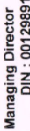
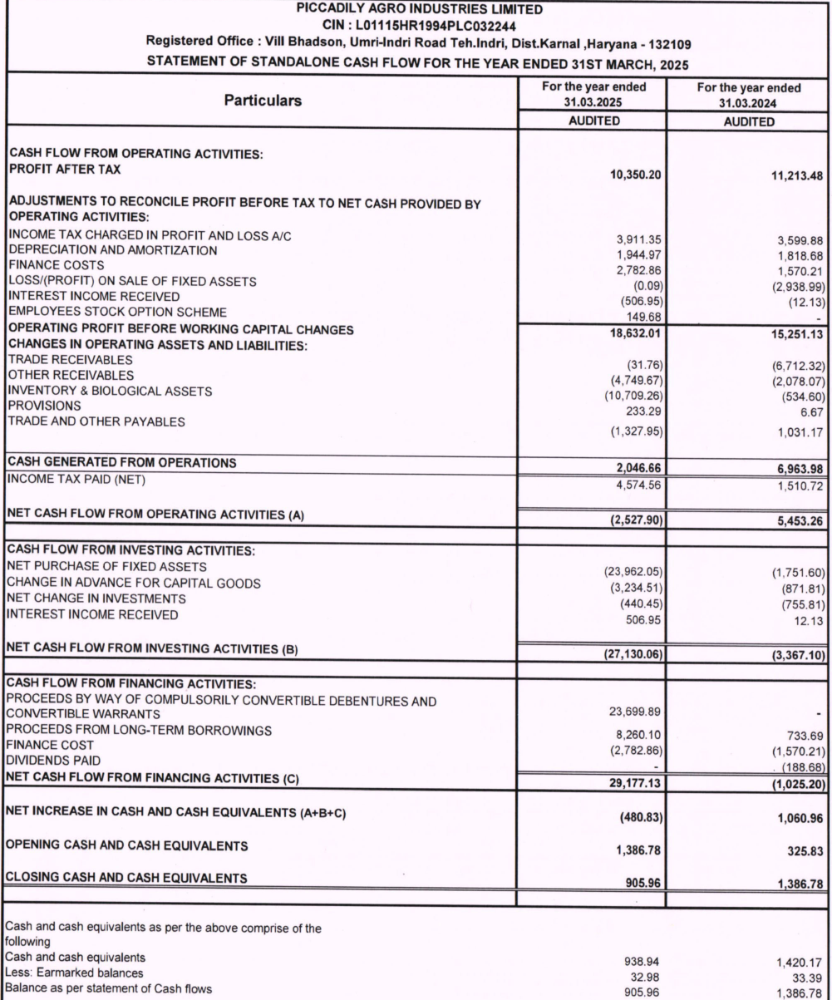
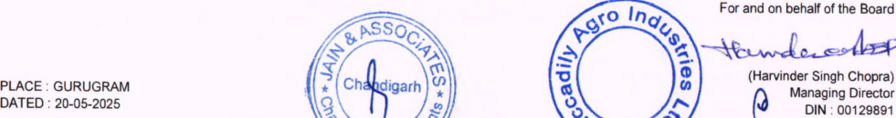
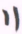
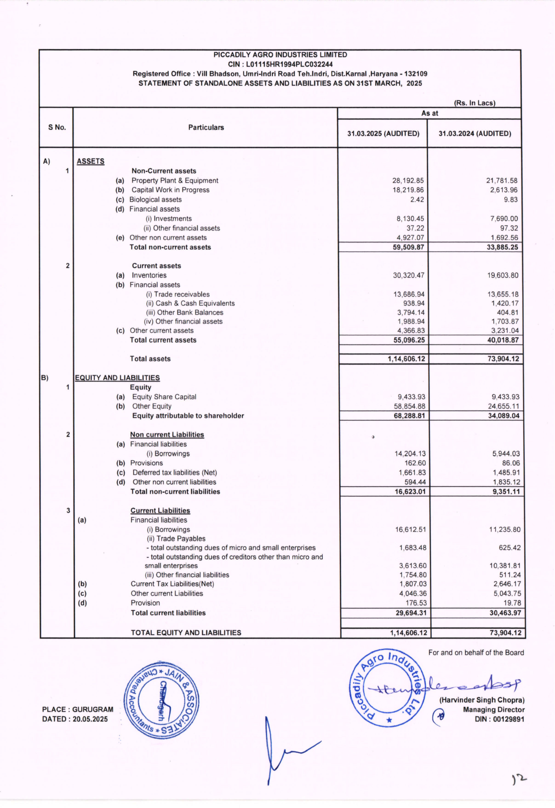
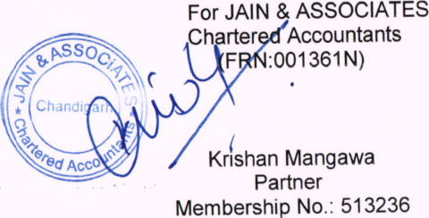
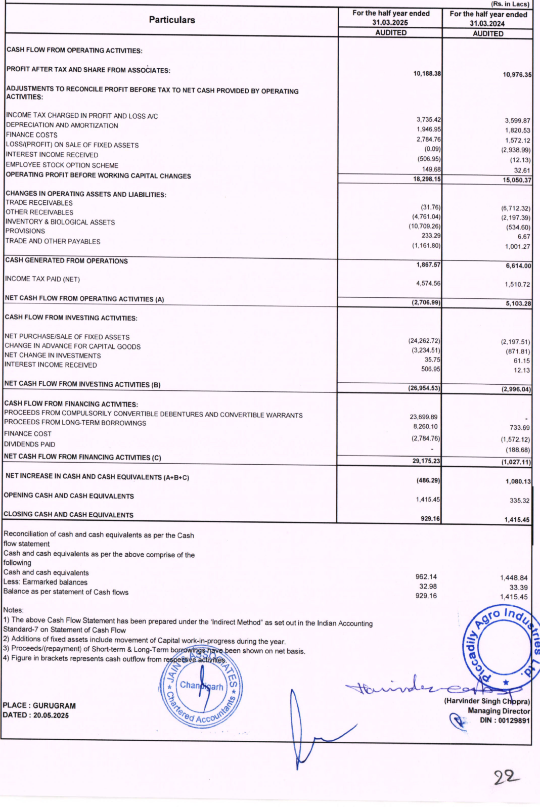

###### 

JAIN & ASSOCIATES CHARTERED ACCOUNTANTS 

### Phone: 0172-2575761, 2575762 S.C.O. 178, Sector-5, Panchkula, Haryana - 134109 Email: jainassociatesca@gmail.com 

### AND ANNUAL INDEPENDENT AUDITOR’S REPORT ON AUDIT STANDALONE FINANCIAL RESULTS OF QUARTERLY 

## TO THE BOARD OF DIRECTORS OF M/s PICCADILY AGRO INDUSTRIES LIMITED 

#### Opinion 

We have audited the accompanying statement of standalone financial results for the Quarter and Company’), which comprises the Balance Sheet as at March 31, 2025, the Statement of other financial referred to explanatory statements”), and 33 of SEBI of M/s PICCADILY AGRO INDUSTRIES LIMITED (‘the Profit and Loss (including Other Comprehensive Income), the Cash Flow Statement for the year then ended, and a summary of significant accounting (hereinafter as “the standalone being submitted by the Company to the requirements of Requirements) the (Listing Obligations Regulations, 2015, as amended (“the Listing Regulations’). year ended policies and information pursuant Disclosure Regulation 

In our opinion and to the best of our information and according to the explanations given to us, the standalone financial results for the Quarter and year ended March 31, 2025: 

4. Presents in accordance with the requirements of Regulation 33 of the SEBI (Listing Obligations and Disclosure Requirements) Regulations, 2015, as amended and principles laid down in the Indian Accounting Standards (‘Ind As’) specified under Rules,2015 and 2 Gives a true and fair view in conformity with the recognition and measurement other accounting principles generally Accounting Standards) section 133 of the Companies Act,2013 (‘the Act’), read with the Companies (Indian 

JAIN & ASSOCIATES CHARTERED ACCOUNTANTS 

### Phone: 0172-2575761, 2575762 Email: jainassociatesca@gmail.com S.C.O. 178, Sector-5, Panchkula, Haryana - 134109 

Basis for Opinion financial statements. financial information of the company for the quarter and year ended. in India accepted of the net profit and total comprehensive income and other We conducted our audit of the standalone financial statements in accordance with the Responsibilities for the Audit of the Standalone Financial Statements section of our have fulfilled our other ethical responsibilities in accordance with these requirements Standards on Auditing (SA’s) specified under Section 143(10) of the Companies Act, 2013. Our responsibilities under those Standards are further described in the Auditor's report. We are independent of the Company in accordance with the Code of Ethics issued by the Institute of Chartered Accountants of India (ICAI) together with the independence requirements that are relevant to our audit of the standalone financial statements under the provisions of the Act and the Rules made there under, and we sufficient and appropriate to provide a basis for our audit opinion on the standalone and the ICAI's Code of Ethics. We believe that the audit evidence we have obtained is 

#### Management’s Responsibilities for the Statement 

This Statement, which includes the Standalone Financial Results is the responsibility of the Company’s Management and approved by the Board of Directors has been approved by them for the issuance. 

includes and presentation standalone This responsibility the preparation of the financial results for the quarter and year ended March 31, 2025 that give a true and fair view of the net profit/loss and OCI and other financial information in accordance with the recognition and measurement principles laid down in the IND AS prescribed under section 133 of the Act read with relevant rules issued thereunder and other accounting principles generally accepted in India and in compliance with Regulation 

JAIN & ASSOCIATES CHARTERED ACCOUNTANTS 

### Phone: 0172-2575761, 2575762 S.C.O. 178, Sector-5, Panchkula, Haryana - 134109 Email: jainassociatesca@gmail.com 

accounting records in accordance with the provisions of the Act for safeguarding the of adequate internal financial controls that were records, to the preparation and presentation of the standalone financial is free from the material misstatement, of the Listing Regulations. This responsibility also includes maintenance of adequate assets of the company and for preventing and detecting frauds and other irregularities; selection and application of appropriate accounting policies; implementation and maintenance operating effectively for ensuring the accuracy and completeness of the accounting relevant results that give a true and fair view and whether due to fraud or error. making judgments and estimates that are reasonable and prudent; and the design, 

process of the company. as disclosing, to liquidate the company or to cease of Directors In preparing the standalone financial results, the board of directors is responsible for assessing the company’s ability, to continue a going concern, as operations, or has no realistic alternative but to do so. The Board is also responsible for overseeing the financial reporting applicable, matters related to going concern and using the going concern basis of accounting unless the board either intends 

#### Auditor's Responsibilities for the Audit of the Standalone Financial Results 

financial statements as a whole is free from material misstatement, whether due to fraud or error, and to issue an auditor's report that includes our opinion. Reasonable it exists. or in the aggregate, they could reasonably be expected to influence the economic decisions of users taken on the basis of these standalone financial results. in accordance with SAs will always detect a material misstatement when Misstatements can arise from fraud or error and are considered material if, individually Our objectives are to obtain reasonable assurance about whether the standalone assurance is a high level of assurance, but is not a guarantee that an audit conducted 

JAIN & ASSOCIATES CHARTERED ACCOUNTANTS 

### Email: jainassociatesca@gmail.com S.C.O. 178, Sector-5, Panchkula, Haryana - 134109 Phone: 0172-2575761, 2575762 

maintain professional skepticism throughout the audit. We also: As part of an audit in accordance with SAs, we exercise professional judgment and 

- audit procedures 

- to fraud or 

- appropriate to provide a basis for our opinion. The risk of not detecting a material is higher than for one resulting from error, as 

- fraud may involve collusion, forgery, intentional omissions, misrepresentations, or 

- Identify and assess the risks of material misstatement of the standalone financial results, whether due error, design and perform responsive to those risks, and obtain audit evidence that is sufficient the override of internal control. 

- e and 

- misstatement resulting from fraud 

- of the Company’s 

- of expressing 

- Obtain an understanding of internal financial controls relevant to the audit in order to design audit procedures that are appropriate in the circumstances, but not for the purpose an opinion on the effectiveness internal control. 

- e 

- of accounting estimates and related disclosures made by the management. Evaluate the appropriateness and reasonableness of disclosures made by the Evaluate the appropriateness of accounting policies used and the reasonableness 

- e board of directors in terms of the requirements specified under Regulation 33 of the Listing Regulations. 

- e 

- may cause the Company to cease to continue as a going concern. 

- e Conclude on the appropriateness of Board of Director's use of the going concern uncertainty exists related to events or conditions that may cast significant doubt on the Company's ability to continue as a going concern. If we conclude that a material related disclosures in the standalone financial statements or, if such disclosures are inadequate, to modify our opinion. Our conclusions are based on the audit evidence 

- basis of accounting and, based on the audit evidence obtained, whether a material uncertainty exists, we are required to draw attention in our auditor's report to the obtained up to the date of our auditor's report. However, future events or conditions 

CHARTERED ACCOUNTANTS JAIN & ASSOCIATES 

Email: jainassociatesca@gmail.com Phone: 0172-2575761, 2575762 S.C.O. 178, Sector-5, Panchkula, Haryana - 134109 

- presentation. 

- e results, including the disclosures, and whether the standalone financial results represent the underlying transactions and events in Evaluate the overall presentation, structure and content of the standalone financial a manner that achieves fair 

- results of the company to express an opinion on the standalone financial results. 

- e Obtain sufficient appropriate audit evidence regarding the standalone financial 

any identified misstatements in the standalone financial results. of of consider quantitative materiality and qualitative factors in (i) planning the scope of our Materiality is the magnitude of misstatements in the standalone financial results that, or in aggregate, makes it probable that the economic decisions a reasonably knowledgeable user the financial results may be influenced. We audit work and in evaluating the results of our work; and (ii) to evaluate the effect of individually 

audit. We communicate those including any significant deficiencies independence, with charged with governance regarding, among matters, the planned scope and timing of the audit and significant audit findings, in internal control that we identify during our We also provide those charged with governance with a statement that we have complied with relevant ethical requirements regarding and communicate with them all relationships and other matters that may reasonably be thought to bear on our independence, and where applicable, related safeguards. other to 

JAIN & ASSOCIATES CHARTERED ACCOUNTANTS 

Phone: 0172-2575761, 2575762 Email: jainassociatesca@gmail.com S.C.O. 178, Sector-5, Panchkula, Haryana - 134109 

### OTHER MATTERS 

- us. Our opinion is not modified in respect of this matter. standalone 

- e The results the results the ended 31st March 2025 being the balancing figure between the audited figures in respect of the full financial year and the published unaudited year to date figures up to the third quarter of the current financial year which were subject to limited review by financial include for quarter 

Place: Gurugram Date: 20" May,2025 UDIN:25513236BMJPJR4425 

For JAIN & ASSOCIATES Chartered Accountants ~ Krishan Mangawa Partner Membership No.: 513236 

| -132109 ENDED31stMarch,2025 (Rs.InlakhsexceptforEarningsperSharedata) | YearEnded   31.03.2024 31.03.2025 31.03.2024   AUDITED AUDITED AUDITED | 28,223.23 235.87 87,927.60 698.05 82,324.67 487.78   28,459.10 61.18 88,625.65 655.13 82,812.45 81.69   28,520.28 89,280.77 82,894.14 |17,651.65 (6,049.18) 1,570.44 1,159.71 421.83 402.41 657.03 6,746.74 41,717.10 (8,893.36) 6,813.15 4,404.52 2,782.86 1,944.97 2,913.37 23,182.53 36,441.70 (749.75) 4,869.59 3,256.16 1,570.21 1,818.68 3,301.61 20,511.57   | 22,560.63 74,865.14 71,019.77   5,959.65 14,415.63 11,874.37   (0.01) (0.09) (2,938.99)   5,959.65 14,415.72 14,813.36       |1,562.48 46.18 0.57 3,497.77 214.73 237.65 3,327.57 182.68 89.63   4,350.42 10,465.57 11,213.48   (154.18) 38.80   4,350.42 10,350.20 11,213.48   9,433.93 9,433.93 58,854.88 9,433.93 24,655.11       | 4.61 4.61  11.09 11.08  11.89 11.89   |ForandonbehalfoftheBoard enAecelelesr |ARVINDERSINGHCHOPRA) ManagingDirector DIN :00129891   |
|---|---|---|---|---|---|---|---|
| ILYAGROINDUSTRIESLIMITED   :L01115HR1994PLC032244  Umri-IndriRoadTeh.Indri,Dist.Karnal,Haryana  CIALRESULTSFORTHEQUARTERANDYEAR  | QUARTERENDED   31.03.2025 31.12.2024   AUDITED UNAUDITED | 26,823.68 339.90 20,397.89 173.86   27,163.58 224.56 20,571.74 260.58   27,388.14 20,832.32 |23,639.13 (13,602.74) 1,640.39 1,514.62 902.49 497.01 610.13 6,754.89 9,911.19 (4,250.37) 2,342.98 1,188.88 933.54 481.27 686.58 5,866.25   | 21,955.92 17,160.32   5,432.22 3,672.00   (0.14)   5,432.36 3,672.00     |1,369.31 21.91 3.50 871.10 62.01 234.15   4,037.64 2,504.73   (154.18) 38.80   3,922.27   9,433.93     | 4.28 4.27  2.66 2.66  ||
| PICCAD CIN RegisteredOffice :VillBhadson, STATEMENTOFAUDITEDSTANDALONEFINAN |   PARTICULARS   | RevenuefromOperations GrossSales OtherOperatingRevenue TotalRevenuefromOperations OtherIncome     TotalIncome   |Expenses (a)CostofMaterialsconsumed (b)Changesininventoriesoffinishedgoods,work-in-progressandstock-in-trade (c)Excisedutyonsaleofgoods (d)Employeebenefitsexpense (e)Financecosts (f)Depreciationandamortizationexpense (g)Power,fueletc. (h)Otherexpenses     | TotalExpenses   Profit(loss)beforeexceptionalitemsandtax(1-2)   ExceptionalItems   Profit(loss)beforetax(3-4)   03]F]5)      |Oo TaxExpense -CurrentTax -DeferredTax -TaxofEarlierYears   ProfitforthePeriod(5-6)   OtherComprehensiveincome A(i)itemsthatwillnotbereclassifiedtoprofit&loss (ii)incometaxrelatingtoitemsthatwillnotbereclassifiedtoprofitorloss B (i)itemsthatwill bereclassifiedtoprofit&loss (ii)incometaxrelatingtoitemsthatwill_bereclassifiedtoprofitorloss   Totalcomprehensiveincome(aftertax)(7+8)   PaidupShareCapital(FaceValueRs.10/-each) OtherEquity     |   EPS(Rs.Perequityshare) Basic Diluted   |PLACE :GURUGRAM DATED:20.05.2025|

| LTD. nies(IndianAccountingStandards)Rules,2015  oftheCompanies(IndianAccountingStandard)|theirmeetingheldon19thMay,2025and|artermaynotberepresentativeoftheannual|mtothisperiod’sclassification. iguresbetweenauditedfiguresinrespectofthe  yearsended31March2025&31March2024. |ForandonbehalfoftheBoard ManagingDirector DIN :00129891 |
|---|---|---|---|---|
| OINDUSTRIES ordancewithCompa 13readwithrule3|AuditCommitteein 2025.|ormance inanyqu|necessarytoconfir  arethebalancingf  thethirdquarterof ||
| PICCADILYAGR  RESULTS :  beenpreparedinacc heCompaniesAct,20  thereafter.|beenreviewedbythe ngheldon20thMay,|nalnature ,theperf|regroupedwherever 2025&31March2024 reviewedfiguresupto||
| NCIAL  have 3oft ments|have  meeti|seaso|ebeen arch  odate||
|  FINA results on13 amend|results intheir|isof|shav  31M yeart||
| STANDALONE lonefinancial edunderSecti otherrelevant|lonefinancial dofDirectors|nesssegment ecompany.|od/year’sfigure equarterended andpublished|RAM 2025|
| OTHE  standa prescrib 5and|standa byBoar|ebusi ceofth|usperi sforth lyear|GURUG 20.05.|
| NOTEST 4Theabove (IndAS)  Rules,201|2Theabove approved|3Oneofth performan|4Theprevio 5Thefigure fullfinancia|PLACE : DATED :|

| ED31stMARCH,2025 (Rs.inLacs)   YEARENDED   31.03.2025 31.03.2024   AUDITED AUDITED |24,950.10 63,675.55 655.13 27,534.36 55,278.09 81.69   89,280.77 82,894.14     89,280.77 82,894.14 |(327.13) 18,015.50 389.59 13,290.63   17,688.38 13,680.22 | 2,782.86 489.88 (0.09) 1,570.21 235.64 (2,938.99)   | 14,415.72 14,813.36     |33,423.23 81,182.89 13,494.33 60,409.80   1,14,606.12 73,904.12     |11,683.77 31,164.68 3,468.86 13,253.70 22,429.31 4,132.08   | 46,317.31  39,815.08   ||
|---|---|---|---|---|---|---|---|---|
| nal,Haryana-132109 RTERANDYEAREND     31.03.2024   AUDITED |9,807.77 18,651.32 61.18   28,520.28     28,520.28 |606.93 5,871.41   6,478.34 | 421.84 96.86 (0.01)   | 5,959.66     |13,494.33 60,409.80   73,904.12     |13,253.70 22,429.31 4,132.08   |   39,815.08   ||
| NDUSTRIESLIMITED 1994PLC032244 RoadTeh.Indri,Dist.Kar ALONE)FORTHEQUA   QUARTERENDED   31.12.2024   UNAUDITED |2,180.50 18,391.24 260.58   20,832.32     20,832.32 |(543.80) 5,213.96   4,670.16 | 933.54 64.62   | 3,672.00     |28,775.34 72,706.94   1,01,482.27     |8,795.67 27,555.21 2,164.52   | 38,515.41    |cation. |
| PICCADILYAGROI CIN :L01115HR  Bhadson,Umri-Indri   LIABILITIES(STAND     31.03.2025   AUDITED |12,291.29 14,872.29 224.56   27,388.13     27,388.13 |1,334.95 5,332.11   6,667.07 | 902.49 332.37 (0.13)   | 5,432.34     |33,423.23 81,182.89   1,14,606.12     |11,683.77 31,164.68 3,468.86   |   46,317.31  |confirmtothisperiod’sclassifi|
| RegisteredOffice :Vill SEGMENTREVENUE,RESULTS,ASSETSAND   Particulars     |A. SegmentRevenue Sugar Distillery Others   Total   Less:InterSegementRevenue   TotalRevenuefromOperations |B. SegmentResults Profit/(loss)(beforeunallocatedexpenditure, financecostandtax) Sugar Distillery Others   Total | Less: i)FinanceCosts ii)Otherunallocableexpenditurenet off unallocatedincome iii)ExceptionalItem | ProfitBeforeTax   |Cc.SegmentAssets Sugar Distillery OtherUnallocableAssets   Total   |D.SegmentLiabilities Sugar Distillery OtherUnallocableLiabilities | Total   |Thepreviousperiod/year’sfigureshavebeenregroupedwherevernecessaryto|

**[Image: March2025Result.pdf-0010-02.png (34x145, 10.8KB)]**

<!-- Start of picture text -->
Director Managing DIN 00129891 : <!-- End of picture text -->

**[Image: March2025Result.pdf-0011-00.png (1001x1203, 1088.6KB)]**

<!-- Start of picture text -->
PICCADILY  AGRO  INDUSTRIES  LIMITED CIN  :  L01115HR1994PLC032244 Registered  Office  :  Vill  Bhadson,  Umri-Indri  Road  Teh.Indri,  Dist.Karnal  sHaryana  -  132109 For  the  year  ended  For  the  year  ended Particulars  31.03.2025  31.03.2024 AUDITED  AUDITED CASH  FLOW  FROM  OPERATING  ACTIVITIES: PROFIT  AFTER  TAX  10,350.20  11,213.48 ADJUSTMENTS  TO  RECONCILE  PROFIT  BEFORE  TAX  TO  NET  CASH  PROVIDED  BY OPERATING  ACTIVITIES: INCOME  TAX  CHARGED  IN  PROFIT  AND  LOSS  A/C  3,911.35  3,599.88 DEPRECIATION  AND  AMORTIZATION  1,944.97  1,818.68 FINANCE  COSTS  2,782.86  1,570.21 LOSS/(PROFIT)  ON  SALE  OF  FIXED  ASSETS  (0.09)  (2,938.99) INTEREST  INCOME  RECEIVED  (506.95)  (12.13) EMPLOYEES  STOCK  OPTION  SCHEME  149.68  - OPERATING  PROFIT  BEFORE  WORKING  CAPITAL  CHANGES  18,632.01  15,251.13 CHANGES  IN  OPERATING  ASSETS  AND  LIABILITIES: TRADE  RECEIVABLES  (31.76)  (6,712.32) OTHER  RECEIVABLES  (4,749.67)  (2,078.07) INVENTORY  &  BIOLOGICAL  ASSETS  (10,709.26)  (534.60) PROVISIONS  233.29  6.67 TRADE  AND  OTHER  PAYABLES  (1,327.95)  1.031.17 CASH  GENERATED  FROM  OPERATIONS  2,046.66  6,963.98 INCOME  TAX  PAID  (NET)  4,574.56  1,510.72 NET  CASH  FLOW  FROM  OPERATING  ACTIVITIES  (A)  (2,527.90)  5,453.26 CASH  FLOW  FROM  INVESTING  ACTIVITIES: NET  PURCHASE  OF  FIXED  ASSETS  (23,962.05)  (1,751.60) CHANGE  IN  ADVANCE  FOR  CAPITAL  GOODS  (3,234.51)  (871.81) NET  CHANGE  IN  INVESTMENTS  (440.45)  (755.81) INTEREST  INCOME  RECEIVED  506.95  12.13 NET  CASH  FLOW  FROM  INVESTING  ACTIVITIES  (B)  (27,130.06)  (3,367.10) CASH  FLOW  FROM  FINANCING  ACTIVITIES: PROCEEDS  BY  WAY  OF  COMPULSORILY  CONVERTIBLE  DEBENTURES  AND  23,699.89  J CONVERTIBLE  WARRANTS  ae PROCEEDS  FROM  LONG-TERM  BORROWINGS  8,260.10  733.69 FINANCE  COST  (2,782.86)  (1,570.21) DIVIDENDS  PAID -  _  (188.68) NET  CASH  FLOW  FROM  FINANCING  ACTIVITIES  (C)  29,177.13  (1,025.20) NET  INCREASE  IN  CASH  AND  CASH  EQUIVALENTS  (A+B+C)  (480.83)  1,060.96 OPENING  CASH  AND  CASH  EQUIVALENTS  1,386.78  325.83 CLOSING  CASH  AND  CASH  EQUIVALENTS  905.96  1,386.78 Cash  and  cash  equivalents  as  per  the  above  comprise  of  the following Cash  and  cash  equivalents  938.94  1,420.17 Less:  Earmarked  balances  32.98  33.39 Balance  as  per  statement  of  Cash  flows  905.96  1,386.78 STATEMENT  OF  STANDALONE  CASH  FLOW  FOR  THE  YEAR  ENDED  31ST  MARCH,  2025 <!-- End of picture text -->

###### Notes: 

> 3) Proceeds/(repayment) of Short-term & Long-Term borrowings have been shown on net basis. 

> 1) The above Cash Flow Statement has been prepared under the ‘Indirect Method” as set out in the Indian Accounting Standard-7 on Statement of Cash Flow 

> 2) Additions of fixed assets include movement of Capital work-in-progress during the year. 4) Figure in brackets represents cash outflow from respective activities. 

**[Image: March2025Result.pdf-0011-03.png (981x130, 123.6KB)]**

<!-- Start of picture text -->
For  and  on  behalf  of  the  Board (Harvinder  Singh  Chopra) PLACE : GURUGRAM Q  Managing  Director DATED DIN :  20-05-2025 :  00129891 <!-- End of picture text -->

**[Image: March2025Result.pdf-0011-04.png (22x34, 1.5KB)]**

<!-- Start of picture text -->
) <!-- End of picture text -->

**[Image: March2025Result.pdf-0012-00.png (1207x1754, 1229.1KB)]**

<!-- Start of picture text -->
PICCADILY  AGRO  INDUSTRIES  LIMITED CIN  :  L01115HR1994PLC032244 Registered  Office  :  Vill  Bhadson,  Umri-Indri  Road  Teh.Indri,  Dist.Karnal  ,Haryana  -  132109 STATEMENT  OF  STANDALONE  ASSETS  AND  LIABILITIES  AS  ON 31ST  MARCH,  2025 (Rs.  In  Lacs) As  at S  No.  Particulars 31.03.2025  (AUDITED)  31.03.2024  (AUDITED) A)  ASSETS 1  Non-Current  assets (a)  Property  Plant  &  Equipment  28,192.85  21,781.58 (b)  Capital  Work  in  Progress  18,219.86  2,613.96 (c)  Biological  assets  2.42  9.83 (d)  Financial  assets (i)  Investments  8,130.45  7,690.00 (ii)  Other  financial  assets  37.22  97.32 (e)  Other  non  current  assets  4,927.07  1,692.56 Total  non-current  assets  59,509.87  33,885.25 2  Current  assets (a)  Inventories  30,320.47  19,603.80 (b)  Financial  assets (i)  Trade  receivables  13,686.94  13,655.18 (ii)  Cash  &  Cash  Equivalents  938.94  1,420.17 (iii)  Other  Bank  Balances  3,794.14  404.81 (iv)  Other  financial  assets  1,988.94  1,703.87 (c)  Other  current  assets  4,366.83  3,231.04 Total  current  assets  55,096.25  40,018.87 Total  assets  1,14,606.12  73,904.12 B)  EQUITY  AND  LIABILITIES 1  Equity (a)  Equity  Share  Capital  9,433.93  9,433.93 (b)  Other  Equity  58,854.88  24,655.11 Equity  attributable  to  shareholder  68,288.81  34,089.04 2  Non  current  Liabilities  5 (a)  Financial  liabilities (i)  Borrowings  14,204.13  5,944.03 (b)  Provisions  162.60  86.06 (c)  Deferred  tax  liabilities  (Net)  1,661.83  1,485.91 (d)  Other  non current  liabilities  594.44  1,835.12 Total  non-current  liabilities  16,623.01  9,351.11 3  Current  Liabilities (a)  Financial  liabilities (i)  Borrowings  16,612.51  11,235.80 (ii)  Trade  Payables -  total  outstanding dues  of  micro  and  small  enterprises  1,683.48  625.42 -  total  outstanding dues  of  creditors  other  than  micro  and small  enterprises  3,613.60  10,381.81 (iii)  Other  financial  liabilities  1,754.80  511.24 (b)  Current  Tax  Liabilities(Net)  1,807.03  2,646.17 (c)  Other  current  Liabilities  4,046.36  5,043.75 (d)  Provision  176.53  19.78 Total  current  liabilities  29,694.31  30,463.97 TOTAL  EQUITY  AND  LIABILITIES  1,14,606.12  73,904.12 For  and  on  behalf  of  the  Board (Harvinder  Singh  Chopra) PLACE  :  GURUGRAM  -  Managing  Director DATED :  20.05.2025  DIN  :  00129891 yu <!-- End of picture text -->

## CHARTERED ACCOUNTANTS 

#### S.C.O. 178, Sector-5, Panchkula, Haryana - 134109 Phone: 0172-2575761, 2575762 Email: jainassociatesca@gmail.com 

CONSOLIDATED FINANCIAL RESULTS. INDEPENDENT AUDITORS’ REPORT ON AUDIT OF QUARTERLY AND ANNUAL 

## TO THE BOARD OF DIRECTORS OF PICCADILY AGRO INDUSTRIES LIMITED 

#### Opinion 

We have auditedtheaccompanyingstatementofConsolidatedfinancialresultsof M/s Piccadily Agro Industries Limited (hereinafter referred to as ‘the Holding Company’), its subsidiaries andassociates (the company, its subsidiaries and associates togetherreferredtoas “ the Group’), comprisingoftheConsolidated Balance Sheet asat March31,2025,theConsolidatedStatementofProfit&Loss (including Other ComprehensiveIncome),theConsolidatedCashFlowStatement, and a summary of significantaccountingpoliciesandotherexplanatoryinformation (hereinafter referredtoas“theConsolidatedfinancialstatements’). 

In our opinion and to the best of our information and according to the explanations given to us and based on the consideration of the report of other auditors on the separate financial statements of the subsidiary referred to in “Other Matters” para below, the Consolidated financial results for the Quarter and year ended March 31, 2025: 

1. Includes the results of the following entities; 

> a. Holding Company 

> i. Piccadily Agro Industries Limited 

> b. Overseas Subsidiary 

> i. Portavadie Distillers and Blenders Ltd. 

c. Indian Subsidiary 

i. Six Tress & Drinks Private Limited 

%B 

JAIN & ASSOCIATES CHARTERED ACCOUNTANTS 

#### S.C.O. 178, Sector-5, Panchkula, Haryana - 134109 Phone: 0172-2575761, 2575762 Email: jainassociatesca@gmail.com 

- d. Indian Associate 

   - i. Picccadily Sugar & Allied Industries Limited 

2. Is presented in accordance with the requirements of Regulation 33 of the SEBI (Listing Obligations and Disclosure Requirements) Regulations, 2015, as amended and 

3. Gives a true and fair view in conformity with the recognition and measurement principles laid down in the Indian Accounting Standards (‘Ind As’) specified under section 133 of the Companies Act,2013 (‘the Act’), read with the Companies (Indian Accounting Standards) Rules,2015 and other accounting principles generally accepted in India of the consolidated net profit and total comprehensive income and other financial information of the group for the quarter and year ended 2025. 

#### Basis for Opinion 

We conducted our audit of the Consolidated financial statements in accordance with the Standards on Auditing (SA’s) specified under Section 143(10) of the Act. Our responsibilities under those Standards are further described in the Auditor's Responsibilities for the Audit of the Consolidated Financial Statements section of our report. We are independent of the Group in accordance with the Code of Ethics issued by the Institute of Chartered Accountants of India (ICAI) together with the independence requirements that are relevant to our audit of the Consolidated financial statements under the provisions of the Act and the Rules made there under, and we have fulfilled our other ethical responsibilities in accordance with these requirements and the ICAI's Code of Ethics. We believe that the audit evidence we have obtained is sufficient and appropriate to provide a basis for our audit opinion on the Consolidated financial statements. 

ly 

## CHARTERED ACCOUNTANTS 

### S.C.O. 178, Sector-5, Panchkula, Haryana - 134109 Phone: 0172-2575761, 2575762 Email: jainassociatesca@gmail.com 

#### Management’s Responsibilities for the Statement 

includes the Financial the consolidated financial statements for the year ended March 31, 2025. responsibility includes the in the IND AS prescribed under section 133 of the Act read with relevant rules issued thereunder and other accounting principles generally accepted in compliance with Regulation 33 Regulations. This includes maintenance estimates prudent; the design, maintenance of adequate internal financial controls that were operating effectively for preparation and presentation of the Consolidated financial results that give a true and This which Consolidated Results is responsibility of the Holding Company's Board of Directors and has been approved by them for the issuance. The Statement has been compiled from the related audited This preparation presentation of the Consolidated financial results for the quarter and year ended March 31, 2025 that give a true and fair view of the net profit and OCI and other financial information in accordance with the in India and of the Listing responsibility also of adequate accounting records in accordance with the provisions of the Act for safeguarding the assets of the group and for preventing and detecting frauds and other irregularities; selection and application of appropriate accounting policies, making judgments and that are reasonable implementation and fair view and is free from the material misstatement, whether due to fraud or error. Statement, and recognition and measurement principles laid down and and ensuring the accuracy and completeness of the accounting records, relevant to the 

In preparing the Consolidated financial results, the board of directors are for assessing the ability, going disclosing, applicable, matters related operations, or has no realistic alternative but to do so. The Board of Directors are also responsible for overseeing the financial reporting process of the group. responsible to continue as a concern, as to going concern and using the going concern basis of accounting unless the respective board either intends to liquidate the group or cease group's 

>” 

CHARTERED ACCOUNTANTS 

#### S.C.O. 178, Sector-5, Panchkula, Haryana - 134109 Phone: 0172-2575761, 2575762 Email: jainassociatesca@gmail.com 

#### Auditor's Responsibilities for the Audit of the Consolidated Financial Results 

Our objectives are to obtain reasonable assurance about whether the Consolidated financial statements as a whole is free from material misstatement, whether due to fraud or error, and to issue an auditor's report that includes our opinion. Reasonable assurance is a high level of assurance, but is not a guarantee that an audit conducted in accordance with SAs will always detect a material misstatement when it exists. Misstatements can arise from fraud or error and are considered material if, individually or in the aggregate, they could reasonably be expected to influence the economic decisions of users taken on the basis of these Consolidated financial results. 

As part of an audit in accordance with SAs, we exercise professional judgment and maintain professional skepticism throughout the audit. We also: 

e Identify and assess the risks of material misstatement of the Consolidated financial results, whether due to fraud or error, design and perform audit procedures responsive to those risks, and obtain audit evidence that is sufficient and appropriate to provide a basis for our opinion. The risk of not detecting a material misstatement resulting from fraud is higher than for one resulting from error, as fraud may involve collusion, forgery, intentional omissions, misrepresentations, or the override of internal control. e Obtain an understanding of internal financial controls relevant to the audit in order to design audit procedures that are appropriate in the circumstances, but not for the purpose of expressing an opinion on the effectiveness of the Group’s internal control. 

e Evaluate the appropriateness and reasonableness of disclosures made by the board of directors in terms of the requirements specified under Regulation 33 of the Listing Regulations. e Conclude on the appropriateness of Board of Director's use of the going 

|4 

# JAIN & ASSOCIATES CHARTERED ACCOUNTANTS 

#### S.C.O. 178, Sector-5, Panchkula, Haryana - 134109 Phone: 0172-2575761, 2575762 Email: jainassociatesca@gmail.com 

concern basis of accounting and, based on the audit evidence obtained, whether a material uncertainty exists related to events or conditions that may cast significant doubt on the Group's ability to continue as a going concern. If we conclude that a material uncertainty exists, we are required to draw attention in our auditor's report to the related disclosures in the Consolidated financial statements or, if such disclosures are inadequate, to modify our opinion. Our conclusions are based on the audit evidence obtained up to the date of our auditor's report. However, future events or conditions may cause the Group to cease to continue as a going concern. 

e Evaluate the overall presentation, structure and content of the Consolidated financial results, including the disclosures, and whether the Consolidated financial results represent the underlying transactions and events in a manner that achieves fair presentation. 

e Obtain sufficient appropriate audit evidence regarding the Consolidated financial results of the group to express an opinion on the Consolidated financial results. 

Materiality is the magnitude of misstatements in the Consolidated financial results that, individually or in aggregate, makes it probable that the economic decisions of a reasonably knowledgeable user of the financial statements may be influenced. We consider quantitative materiality and qualitative factors in (i) planning the scope of our audit work and in evaluating the results of our work; and (ii) to evaluate the effect of any identified misstatements in the financial statements. 

We communicate with those charged with governance regarding, among other matters, the planned scope and timing of the audit and significant audit findings, including any significant deficiencies in internal control that we identify during our audit. 

We also provide those charged with governance with a statement that we have 

\J 

CHARTERED ACCOUNTANTS 

### S.C.O. 178, Sector-5, Panchkula, Haryana - 134109 Phone: 0172-2575761, 2575762 Email: jainassociatesca@gmail.com 

complied requirements relevant ethical regarding independence, and communicate with them thought to bear on our independence, and where applicable, related safeguards. to with all relationships and other matters that may reasonably be 

##### Other Matters 

annual Statement of Subsidiary 31,2025, total comprehensive income of Rs (5.91) lacs and Rs. (126.03) lacs for the and included in respect of this subsidiary is based solely on the audit reports of such other eWe did the Financial one Overseas (Portavadie Distillers and Blenders Ltd) for the year ended March 31,2025 included in the financial results, whose financial information reflects Total Assets of Rs 1935.77 lacs as at March 31,2025 and total revenues of Rs NIL for the Quarter and year ended March quarter and year ended March 31,2025 respectively and net cash flows of Rs (2.50) lacs Rs. (5.46) lacs for the quarter and year ended March 31,2025 respectively, as considered in the statement. These financial statements have been audited by other conclusion on the statement, in so far as it relates to the amounts and disclosures auditors. not audit auditors whose audit report is furnished to us by the management and our opinion and 

us. Our opinion is not modified in respect of this matter with respect to our reliance on the work done by and the reports of the other auditor. e The statement includes the consolidated financial results of the quarter ended 31st March 2025, being the balancing figures between the audited consolidated figures up to third quarter of the current financial year, which were subject to limited review by in respect of the full financial year and the published year to date consolidated figures 

Date: 20" May, 2025 Place: Gurugram UDIN: 25513236BMJPJS8149 

**[Image: March2025Result.pdf-0018-07.png (480x244, 137.7KB)]**

<!-- Start of picture text -->
For  JAIN  &  ASSOCIATES Accountants LEX,  -001361N) z  Yon  . Kslshan  Mangawa Partner Membership  No.:  513236 <!-- End of picture text -->

|   132109 NDED31STMARCH,2025|(Rs.InlacsexceptforearningsperSharedata)   YEARENDED   31.03.2024 31.03.2025 31.03.2024   AUDITED AUDITED AUDITED | 28,223.23 235.87 87,755.46 870.19 82,324.67 487.78   28,459.10 61.18 88,625.65 655.13 82,812.45 81.69   28,520.28 89,280.77 82,894.14|17,651.65 (6,049.18) 1,570.44 1,177.50 422.22 404.26 657.02 6,774.95 41,717.10 (8,893.36) 6,813.15 4,494.84 2,784.76 1,946.95 2,913.37 23,283.72 36,441.70 (749.75) 4,869.59 3,342.23 1,572.12 1,820.53 3,301.61 20,597.73   22,608.87 75,060.54 71,195.76| 5,911.41 14,220.23 11,698.38   (0.01) (0.09) (2,938.99)   5,911.42 14,220.32 14,637.37   1,562.48 46.27 0.57 3,497.77 214.72 237.65 3,327.57 182.67 89.63   4,302.10 10,270.18 11,037.50     |32.31 32.61 (35.75) (154.18) 38.80 69.32 (61.15) 32.61   32.61 (46.05) 32.61     | 4,367.02 4,367.02 9,433.93 10,188.38 10,188.38 9,433.93 11,008.97 11,008.97 9,433.93   58,574.90 24,536.95   4.59 4.59  10.85 -10.84  11.63 11.63     Forandonbehalfoftheboard ManagingDirector     = DIN :00129891 9|
|---|---|---|---|---|---|---|
| CCADILYAGROINDUSTRIESLIMITED CIN:L01115HR1994PLC032244 son,Umri-IndriRoadTeh.Indri,Dist.KarnalHaryana- NANCIALRESULTSFORTHEQUARTERANDYEARE| QUARTERENDED   31.03.2025 31.12.2024   AUDITED UNAUDITED | 26,688.52 475.06 20,360.91 210.83   27,163.57 224.56 20,571.74 260.57   27,388.12 20,832.31|23,639.13 (13,602.74) 1,640.39 1,531.77 902.75 497.51 610.13 6,794.22 9,911.19 (4,250.37) 2,342.98 1,212.23 933.91 481.75 686.58 5,897.75   22,013.17 17,216.03| 5,374.96 3,616.28   (0.14)   5,375.10 3,616.28   1,369.31 21.90 3.50 871.10 62.02 234.15   3,980.39 2,449.01   |5.83 (154.18) 38.80 69.32 28.33   (46.05)   | 3,940.16 3,940.16 9,433.93 2,477.34 2,477.34 9,433.93     4.23 4.22  2.63 2.63    |
| PI RegisteredOffice:VillBhad STATEMENTOFAUDITEDCONSOLIDATEDFI| PARTICULARS     | (a)RevenuefromOperations GrossSales OtherOperatingRevenue TotalRevenuefromOperations (b)OtherIncome TotalIncome   |Expenses (a)CostofMaterialsconsumed (b)Changesininventoriesoffinishedgoods,work-in-progressandstock-in-trade (c)Excisedutyonsaleofgoods (d)Employeebenefitsexpense (e)Financecosts (f)Depreciationandamortizationexpense (g)Power,fueletc. (h)Otherexpenses TotalExpenses | Profit(Loss)BeforeExceptionalItemsandTax(1-2) ExceptionalItems Profit(loss)BeforeTax(3-4) TaxExpense -CurrentTax -DeferredTax -(Excess)/ShortProvisionofEarlierYears NetProfitfortheperiodafterTax(5-6)           |10.   ShareofProfit/(Loss)inAssociates OtherComprehensiveincome A(i)itemsthatwillnotbereclassifiedtoprofit&loss (ii) incometaxrelatingtoitemsthatwillnotbereclassifiedtoprofitorloss B(i)itemsthatwillbereclassifiedtoprofit&loss (ii) incometaxrelatingtoitemsthatwill bereclassifiedtoprofit orloss TotalOtherComprehensiveIncome(netoftaxes)   |11, 12. 13. 14.  TotalcomprehensiveincomefortheperiodcomprisingNetProfit/Lossfortheperiod &OtherComprehensiveIncome(7+8+10) -AttributabetoEquityHoldersoftheParent -AttributabletoNon-ControllingInterest PaidupShareCapital(FaceValueRs.10/-each) OtherEquity EPS(Rs.Perequityshare) Basic Diluted           PLACE:GURUGRAM DATED :20.05.2025 ZeSSOSS ls? MeChanfigarh% Q On[A Zz OT >|

| PICCADILYAGROINDUSTRIESLTD.|NOTESTOTHECONSOLIDATEDFINANCIALRESULTS : 1TheaboveCONSOLIDATEDfinancialresultshavebeenpreparedinaccordancewithCompanies(IndianAccountingStandards)Rules,2015(Ind AS)prescribedunderSection133oftheCompaniesAct,2013readwithrule3oftheCompanies(IndianAccountingStandard)Rules,2015and otherrelevantamendmentsthereafter.|2TheaboveconsolidatedfinancialresultshavebeenreviewedbytheAuditCommitteeintheirmeetingheldon19thMay,2025andapprovedbyBoard ofDirectorsintheirmeetingheldon20thMay,2025.|3Oneofthebusinesssegmentisofseasonalnature,theperformanceinanyquartermaynotberepresentativeoftheannualperformanceofthe company.|4Thepreviousperiod/year’sfigureshavebeenregroupedwherevernecessarytoconfirmtothisperiod’sclassification. 5Thefiguresforthequarterended31March2025& 31March2024arethebalancingfiguresbetweenauditedfiguresinrespectofthefullfinancial yearandpublishedyeartodatereviewedfiguresuptothethirdquarterofyearsended31March2025&31March2024. |ForandonbehalfoftheBoard | PLACE :GURUGRAM DATED:20.05.2025 (© DINNO. :00129891 |
|---|---|---|---|---|---|

| D31stMARCH,2025|(Rs.inLacs)   YEARENDED   31.03.2025 31.03.2024   AUDITED AUDITED | 24,950.10 63,675.55 655.13 27,534.36 55,278.09 81.69   89,280.77 82,894.14     89,280.77 82,894.14 |(327.13) 17,822.00 389.59 13,116.54| 17,494.87 13,506.13   2,784.76 489.88 (0.09) 1,572.12 235.64 (2,938.99)   | 14,220.32 14,637.37     |33,423.23 81,014.25 13,494.33 60,412.76   | 1,14,437.49 73,907.09     |11,683.77 31,276.09 3,468.79 13,253.70 22,550.49 4,132.02   | 46,428.66  39,936.20   |eG ForandonbehalfoftheBoard (HarvinderSinghChopra) ManagingDirector DINNO. :00129891 |
|---|---|---|---|---|---|---|---|---|---|---|
| arnal,Haryana-132109 UARTERANDYEARENDE|   31.03.2024   AUDITED | 9,807.77 18,651.32 61.19   28,520.28     28,520.28 |606.93 5,823.56| 6,430.49   422.22 96.87 (0.01)   | 5,911.42     |13,494.33 60,412.76   | 73,907.09     |13,253.70 22,550.49 4,132.02   | 39,936.20    ||
| AGROINDUSTRIESLIMITED 1115HR1994PLC032244 -IndriRoadTeh.Indri,Dist.K CONSOLIDATED)FORTHEQ| QUARTERENDED   31.12.2024   UNAUDITED | 2,180.50 18,391.24 260.57   20,832.31     20,832.31 |(543.80) 5,158.62| 4,614.81   933.91 64.62   | 3,616.28     |28,775.34 72,542.14   | 1,01,317.48     |8,795.67 27,670.38 2,164.46   | 38,630.51    |od’sclassification. |
| PICCADILY  CIN :L0 eredOffice :VillBhadson,Umri ,ASSETSANDLIABILITIES(|   31.03.2025   AUDITED | 12,291.29 14,872.29 224.56   27,388.13     27,388.13 |1,334.95 §,275.12| 6,610.07   902.75 332.36 (0.14) | 5,375.09   |33,423.23 81,014.25 | 1,14,437.49   |11,683.77 31,276.09 3,468.79 | 46,428.66  |necessarytoconfirmtothisperi|
| Regist SEGMENTREVENUE,RESULTS| PARTICULARS     | A. SegmentRevenue Sugar Distillery Others   Total   Less:InterSegementRevenue   NetSegmentRevenue |B. SegmentResults(ProfitbeforeInterestandTax) Sugar Distillery Others|   Total   Less: i)InterestandFinanceCharges(Net) ii)Otherunallocableexpenditure(netofunallocableincome) iii)ExceptionalItem | Profit/(Loss)BeforeTax   |C.SegmentAssets Sugar Distillery OtherUnallocableAssets |   SegmentAssetsfromContinuingOperations |D.SegmentLiabilities Sugar Distillery OtherUnallocableliabilities | SegmentLiabilitiesfromContinuingOperations   |PLACE :GURUGRAM DATED :20.05.2025 1.Thepreviousperiod/year’sfigureshavebeenregroupedwherever|

##### PICCADILY AGRO INDUSTRIES LIMITED CIN : L01115HR1994PLC032244 Registered Office : Vill Bhadson, Umri-Indri Road Teh.Indri, Dist.Karnal ,Haryana - 132109 STATEMENT OF CONSOLIDATED CASH FLOW FOR THE PERIOD 31ST MARCH, 2025 

**[Image: March2025Result.pdf-0022-01.png (1068x1596, 1242.5KB)]**

<!-- Start of picture text -->
(Rs.  in  Lacs) For  the  half  year  ended  For  the  half  year  ended Particulars  31.03.2025  31.03.2024 AUDITED  AUDITED CASH  FLOW  FROM  OPERATING  ACTIVITIES: PROFIT  AFTER  TAX  AND  SHARE  FROM  ASSOCIATES: 10,188.38}  10,976.35) ADJUSTMENTS  TO  RECONCILE  PROFIT  BEFORE  TAX  TO  NET  CASH  PROVIDED  BY  OPERATING ACTIVITIES: INCOME  TAX  CHARGED  IN  PROFIT  AND  LOSS  A/C  3,735.42|  3,599.87 DEPRECIATION  AND  AMORTIZATION 1,946.95  1,820.53 FINANCE  COSTS 2,784.76  1,572.12 LOSS/(PROFIT)  ON  SALE  OF  FIXED  ASSETS (0.09)  (2,938.99) INTEREST  INCOME  RECEIVED (506.95)  (12.13) EMPLOYEE  STOCK  OPTION  SCHEME 149.68}  32.61 OPERATING  PROFIT  BEFORE  WORKING  CAPITAL  CHANGES  18,298.15]  15,050.37 CHANGES  IN  OPERATING  ASSETS  AND  LIABILITIES: TRADE  RECEIVABLES (31.76)  (6,712.32) OTHER  RECEIVABLES (4,761.04)  (2,197.39) INVENTORY  &  BIOLOGICAL  ASSETS (10,709.26)  (534.60) PROVISIONS 233.29)  6.67 TRADE  AND  OTHER  PAYABLES (1,161.80)  1,001.27 CASH  GENERATED  FROM  OPERATIONS 1,867.57  6,614.00] INCOME  TAX  PAID  (NET) 4,574.56]  1,510.72 NET  CASH  FLOW  FROM  OPERATING  ACTIVITIES  (A)  (2,706.99)  5,103.28 CASH  FLOW  FROM  INVESTING  ACTIVITIES: NET  PURCHASE/SALE  OF  FIXED  ASSETS (24,262.72)  (2,197.51) CHANGE  IN  ADVANCE  FOR  CAPITAL  GOODS (3,234.51)  (871.81) NET  CHANGE  IN  INVESTMENTS 35.75  61.15 INTEREST  INCOME  RECEIVED 506.95)  12.13 NET  CASH  FLOW  FROM  INVESTING  ACTIVITIES  (B)  (26,954.53)  (2,996.04) CASH  FLOW  FROM  FINANCING  ACTIVITIES: PROCEEDS  FROM  COMPULSORILY  CONVERTIBLE  DEBENTURES  AND  CONVERTIBLE  WARRANTS  23,699.89  - PROCEEDS  FROM  LONG-TERM  BORROWINGS 8,260.10  733.69 FINANCE  COST (2,784.76)  (1,572.12) DIVIDENDS  PAID -  (188.68) NET  CASH  FLOW FROM  FINANCING  ACTIVITIES  (C)  29,175.23]  (1,027.11) NET  INCREASE  IN  CASH  AND  CASH  EQUIVALENTS  (A+B+C)  (486.29)  1,080.13) OPENING  CASH  AND  CASH  EQUIVALENTS 1,415.45  335.32 CLOSING  CASH  AND  CASH  EQUIVALENTS 929.16}  1,415.45 Reconciliation  of  cash  and  cash  equivalents  as  per  the  Cash flow  statement Cash  and  cash  equivalents  as  per  the  above  comprise  of  the following Cash  and  cash  equivalents Less:  Earmarked  balances  962.14  1,448.84 32.98  33.39 Balance  as  per  statement  of  Cash  flows 929.16  1,415.45 Notes: (Harvinder  Singh  Chopra) PLACE  :  GURUGRAM Managing  Director’ DATED :  20.05.2025 DIN  :  00129891 eae  x 9%. 1)  The  above  Cash  Flow  Statement  has  been  prepared  under  the  ‘Indirect  Method”  as  set  out  in  the  Indian  Accounting Standard-7  on  Statement  of  Cash  Flow 2)  Additions  of  fixed  assets  include  movement  of  Capital  work-in-progress  during  the  year. 3)  Proceeds/(repayment)  of  Short-term  &  Long-Term  borrowingsshave.been  shown  on  net basis. 4)  Figure  in  brackets  represents  cash  outflow  from  respe savvy 7 <!-- End of picture text -->

|| PICCADILYAGROINDUSTRIESLIMITED   |||
|---|---|---|---|
||CIN :LO1115HR1994PLC032244 RegisteredOffice :VillBhadson,Umri-IndriRoadTeh.Indri,Dist.Karn STATEMENTOFCONSOLIDATEDASSETSANDLIABILITIESASON|al,Haryana-13  31STMARCH,|2109 2025|
||||(Rs.InLacs)|
| | | As  |     at |
|SNo.| Particulars| 31.03.2025| 31.03.2024|
| | | (AUDITED)| (AUDITED)|
| A)| |  ASSETS |||
|1|Non-Currentassets|||
||(a) PropertyPlant&Equipment   |28,198.01 |21,788.72 |
||(b) CapitalWorkinProgress|20,094.75|4,188.18|
||(c) OtherIntangibleAssets|0.18|0.18|
||     (d) Biologicalassets| 2.42| 9.83|
||(e) Financialassets|||
||    (i)Investments |6,024.86 |6,060.61 |
|| (ii)Otherfinancialassets (f) Othernoncurrentassets | 37.22 4,927.07 | 97.32 1,692.56 |
| |   Totalnon-currentassets|   59,284.51|   33,837.44|
|2|Currentassets|||
||(a) Inventories|30,320.47|19,603.80|
||(b) Financialassets |||
||(i)Tradereceivables|13,686.94|13,655.18|
||(ii)Cash&CashEquivalents|962.14|1,448.84|
|| (iii)OtherBankBalances| 3,794.14| 404.81|
||(iv)Otherfinancialassets|1,988.94|1,703.87|
|| (c) Othercurrentassets| 4,400.34| 3,253.19|
| |   Totalcurrent t!|   55,152.97|   40,069.68|
| |   Totalassets|   1,14,437.49|   73,907.09|
| B)||    EQUITYANDLIABILITIES| ||
|    1|        Equity| ||
||   (a) EquityShareCapital|   9,433.93|9,433.93|
| |     (b) OtherEquity|     58,574.90| 24,536.95|
|   |       Equityattributabletoownersoftheparent|       68,008.83|   33,970.88|
| 2|   NoncurrentLiabilities| ||
||   (a) Financialliabilities| ||
||        (i)Borrowings|   14,204.13|5,944.03|
||   (b) Provisions|   162.60|86.06|
||   (c) Deferredtaxliabilities(Net)|   1,661.77|1,485.85|
| |     (d) Othernoncurrentliabilities |     594.44 | 1,835.12 |
| |     Totalnon-currentliabilities|     16,622.94| 9,351.06|
| 3|   CurrentLiabilities| ||
| |      (a) Financialliabilities| ||
||   (i)Borrowings|   16,612.51|11,235.80|
||      (ii)TradePayables|   ||
||       -totaloutstandingduesofmicroandsmallenterprises|   1,683.48|625.42|
||   -totaloutstandingduesofcreditorsotherthanmicroandsmallenterprises |   3,666.49 |10,456.55 |
||   (iii)Otherfinancialliabilities   |   1,813.32 |557.69 |
||   (b) CurrentTaxLiabilities(Net) (c) OthercurrentLiabilities|   1,807.03 4,046.36|2,646.17 5,043.75|
||         (d) Provisions|     176.53| 19.78|
||       Totalcurrentliabilities|       29,805.72|   30,585.16|
||     TOTALEQUITYANDLIABILITIES   |     1,14,437.49   | 73,907.09   |
|PLACE: |GURUGRAM f     |(HarvinderSi   |nghChop    |
|DATED|20.05.2025|Managing DIN NO. :|Director 00129891|

---

## Extracted Images

| # | File | Dimensions | Size |
|---|------|------------|------|
| 1 | March2025Result.pdf-0010-02.png | 34x145 | 10.8KB |
| 2 | March2025Result.pdf-0011-00.png | 1001x1203 | 1088.6KB |
| 3 | March2025Result.pdf-0011-03.png | 981x130 | 123.6KB |
| 4 | March2025Result.pdf-0011-04.png | 22x34 | 1.5KB |
| 5 | March2025Result.pdf-0012-00.png | 1207x1754 | 1229.1KB |
| 6 | March2025Result.pdf-0018-07.png | 480x244 | 137.7KB |
| 7 | March2025Result.pdf-0022-01.png | 1068x1596 | 1242.5KB |
