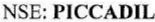
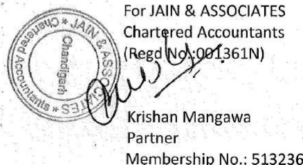
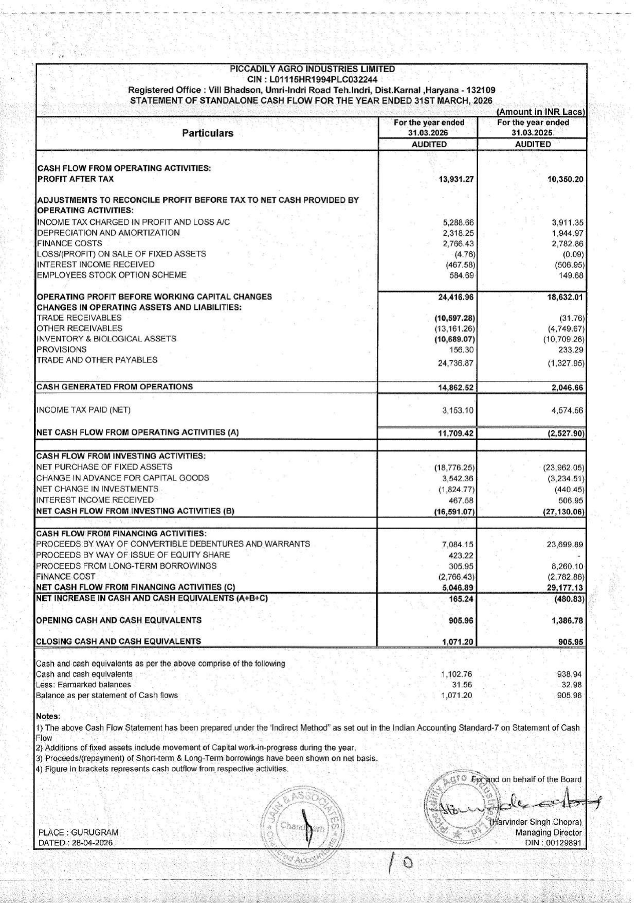
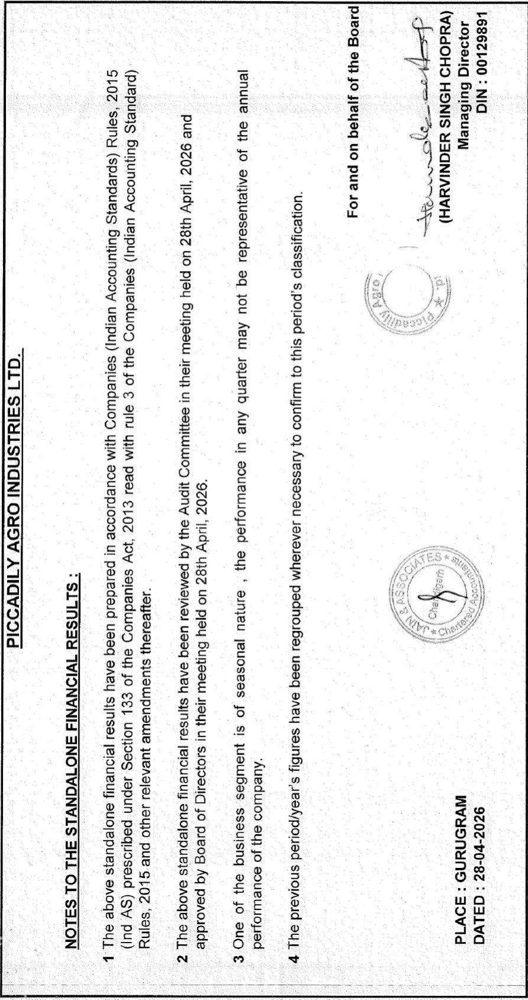
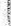
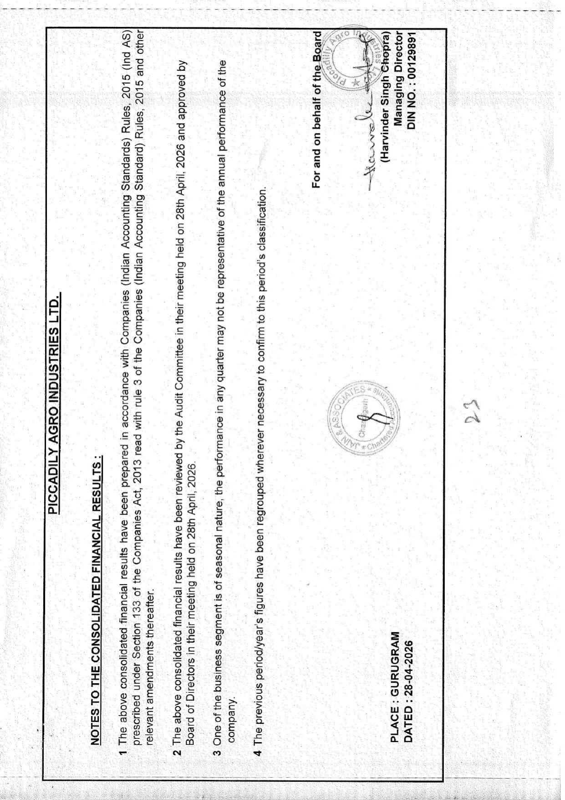
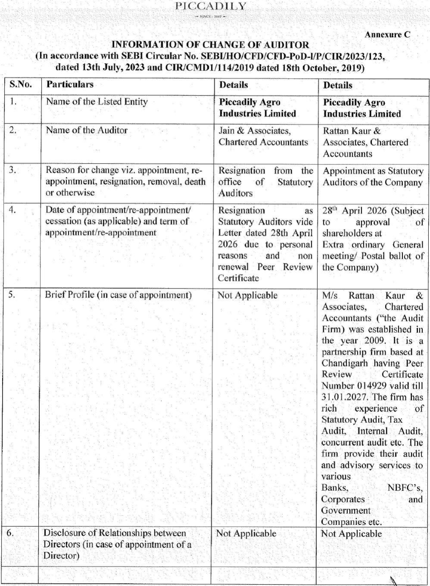

wo SCR TAZ om: April 28, 2026 BSE Limited National Stock Exchange of India Limited Phiroze Jeejeebhoy Tower, Exchange Plaza, C-1, G Block, Dalal Street, Mumbai - 400 001. Bandra Kurla Complex, Bandra (East), Mumbai - 400051 Scrip code: 530305 

**[Image: March2026Result.pdf-0001-01.png (155x22, 4.5KB)]**

<!-- Start of picture text -->
NSE:  PICCADIL <!-- End of picture text -->

Sub.: Outcome of the Board Meeting under Regulation 30 held on April 28, 2026, pursuant to the Securities and Exchange Board of India (Listing Obligations and Disclosure Requirements) Regulations, 2015 (“SEBI Listing Regulations”) 

###### Dear Sir/Madam, 

Pursuant to Regulations 30 of Securities and Exchange Board of India (Listing Obligations and Disclosure Requirements) Regulations, 2015 including circulars issued thereunder and other applicable provisions, if any (“SEBI LODR”}, we wish to inform you that the Board of Directors (‘Board’) of Piccadily Agro Industries Limited (‘the Company”), at its meeting held today, i.e., Tuesday, April 28, 2026 has inter alia, considered and approved the following matters: 

1. Audited Financial Results (Standalone and Consolidated) of the Company for the Quarter & Year ended on 31st March 2026 along with the Auditor’s Report. 

2. Statement on Impact of Audit Qualifications (For Audit Report with unmodified opinion) for the quarter and financial year ended 31 March 2026. 

We are also hereby enclosing Audited Financial Results (Standalone and Consolidated) of the Company for the Quarter & Year ended on 31st March 2026 along with the Auditor’s Report thereon as and Statement on Impact of Audit Qualifications (For Audit Report with unmodified opinion) for the quarter and financial year ended 31st March, 2026 as ‘Annexure A’. 

3. Approval of scheme of Arrangement between Piccadily Agro Industries Limited (“PAIL”) and Piccadily Food & Essential Limited (““PFEL”) and their respective shareholders and creditors in accordance with the applicable provisions of the Companies Act, 2013: 

Pursuant to the provisions of Regulation 30 of the SEBI (Listing Obligations and Disclosure Requirements) Regulations, 2015 (“SEBI Listing Regulations”) read with SEBI Circular number SEBI/HO/CFD/CFD-PoD1/P/CIR/2023/123 dated 13th July 2023 (““SEBI Disclosure Circular”), we write to inform you that, the Board of Directors (“Board”) of Piccadily Agro Industries Limited (‘Company”) at its meeting held today i.e., April 28, 2026, on basis of the recommendations of the Audit Committee and the Independent Directors of the Company, have approved a Scheme of Arrangement (“Scheme”) between Piccadily Agro Industries Limited (“PAIL” or “Demerged Company” or “Company”) and Piccadily Food & Essential Limited (“PFEL” or “Resulting Company”) (a wholly owned subsidiary of the Company) and their respective shareholders and creditors under Sections 230 to 232 and other applicable provisions of the Companies Act, 2013, which provides for the demerger of the Company's Sugar Business (as defined in the Scheme) into PFEL (‘‘Proposed Transaction”). 

The Proposed Transaction is, inter alia, subject to receipt of requisite approvals from statutory and regulatory authorities, including approval from the jurisdictional National Company Law Tribunal, BSE Limited (“BSE”), National Stock Exchange of India Limited (“NSE”) and the Securities and Exchange Board of India (“SEBI”), the respective shareholders and creditors of PAIL and PFEL, as may be necessary. 

The Scheme for the Proposed Transaction as approved by the Board of Directors and relevant associated documents would be available on the website of the Company at https://www.piccadily.com/investor-relations, 

\ 

> Piccadily Agro Industries Ltd. of Registered Office: Village Bhadson, Umri-~ {ndri Road, Teh. Indri, Distt. Karnal, Haryana- 132117 (India) 44-74 Corporate Office: G-17, IMD Pacific Square, Sector-15 (Part-2}, Gurugram, Haryana 122002 (India) mug A Ph.; +91-124-4300840, Website: www.piccadily.com, Email: info@piccadily.com Administrative Office: 275-276, Captain Gaur Marg, Sriniwaspuri, New Delhi 110065 Investor Relations; Ph.: +91-172-299765] CIN No. LOTISHRIS94PLC032244 - | 

###### PIC CA DILY 

post submitting the same with the Stock Exchanges. “The effectiveness of the Scheme would result in the creation of two listed companies with proportionate shareholding with the Resulting Company housing the Sugar Business and the Company housing the Distillery Business. 

Pursuant to Regulation 30 of the SEBI Listing Regulations read with the SEBI Master Circular no. HO/49/14/14(7)2025-CFDPOD2/1/3762/2026 dated January 30, 2026, details in respect of the Scheme are set out in Annexure B. 4. Approval of the Report under Section 232(2)(c) of the Companies Act, 2013: 

As required under the provisions of Section 232(2)(c) of the Companies Act, 2013, the Board considered and approved the report under Section 232(2)\(c) of the Companies Act, 2013 explaining the effect of the Scheme of Arrangement between Piccadily Agro Industries Limited and Piccadily Food and Essential Limited and their respective shareholders and creditors on each class of shareholders, key managerial personnel, promoters and non-promoter shareholders. 

We request you to take the above information on record and disseminate the same on your respective websites. 

5. Resignation of Statutory Auditors 

Pursuant to Regulation 30 of Securities and Exchange Board of India (Listing Obligations and Disclosure Requirements) Regulations, 2015 read with Securities and Exchange Board of India circular no. SEBI/HO/CFED/CFD-PoD-I/P/CIR/2023/123, dated 13th July, 2023 and Securities and Exchange Board of India circular no. CIR/CFD/CMDI /114/2019 dated October 18, 2019, We wish to inform that Jain & Associates, Chartered Accountants, (FRN: 01361N)Statutory Auditors of the Company have tendered their resignation vide their letter dated April 28, 2026 informing their inability to continue as the Statutory Auditors of the Company. The Audit Committee at its meeting held on April 28, 2026 considered the item w.r.t. resignation of Jain & Associates, Chartered Accountants, (FRN: 01361N) as Statutory Auditors of the Company. 

The Audit Committee was of the view that there were no such concerns raised/reported by the Statutory Auditors with respect to its resignation and the grounds stated by the statutory auditors for resignation were convincing. The Audit Committee took note of the same. 

The Board of Directors at its meeting held on April 28, 2026 also noted that there are no other reasons other than mentioned in the resignation letter received from the Statutory Auditors dated April 28, 2026. 

The Audit Committee and Board at their respective meetings placed on record their appreciation to Jain & Associates, Chartered Accountants, (FRN: 01361N) for their contribution to the Company with their audit processes and standards of auditing. * 

The copy of the resignation letter dated April 28, 2026 as received from Jain & Associates, Chartered Accountants is attached herewith. 

6. Appointment of Statutory Auditors 

The Board of Directors on the recommendations of the Audit Committee but subject to approval of shareholders to be obtained at the Extra Ordinary General Meeting /Postal Ballot of the Company, have recommended the appointment of Rattan Kaur & Associates, Chartered Accountants (ICAI Firm Registration No. 022513N), as Statutory Auditors of the Company to fill the casual vacancy in the office of Statutory Auditors. The said appointment is pursuant to applicable provisions of the Companies Act 2013 and the SEBI LODR Regulations, 2015. The existing/outgoing Auditors have not raised any concern or issue and there is no reason other than as mentioned in their letter. \ 

Piccadily Agro Industries Ltd. Registered Office: Village Bhadson, Umri-— Indri Road, Teh. Indri, Distt, Karnal, Haryana- 132117 (India) Corporate Office: G-17, IMD Pacific Square, Sector-15.(Part-2), Gurugram, Haryana 122002 (India) Ph. +91-124-4300840, Website: www.piccadily.com, Email: info@piccadily.com Administrative Office: 275-276, Captain Gaur Marg, Sriniwaspuri, New Delhi 110065 Investor Relations: Ph.: +91-172-2997651 CIN No. LOITSHRI994PLC032244 

**[Image: March2026Result.pdf-0002-14.png (38x34, 1.2KB)]**

<!-- Start of picture text -->
a <!-- End of picture text -->

PICCADILY ome SINCE 1 2967 0 

The details as required under Regulation 30 of Securities and Exchange Board of India (Listing Obligations and Disclosure Requirements) Regulations, 2015 read with Securities and Exchange Board of India circular no. SEB/HO/CFD/CFD-PoD-1/P/CIR/2023/123, dated 13th July, 2023, are enclosed herewith. 

The above-mentioned documents are also being disseminated on Company's website at www.piccadily.com. 

The said Board Meeting commenced at 04:30 P.M. and concluded at 06:00 P.M. This is for information and record. 

We hereby request you to take note of the same and updated record of the company accordingly. 

Niraj KumarSehgal 

Company Secretary & Compliance Officer 

###### Piccadily Agro Industries Ltd. 

**[Image: March2026Result.pdf-0003-08.png (37x17, 0.9KB)]**

<!-- Start of picture text -->
is <!-- End of picture text -->

Registered Office: Village Bhadson,Umri-—IndriRoad,Teh.Indri,Distt.Karnal,Haryana-132117(India) Corporate Office: G-17, IMDPacificSquare,Sector-15(Part-2),Gurugram,Haryana122002{India} Ph.: +91-124-4300840, Website: www.piccadily.com, Email: info@piccadily.com _. Administrative Office:.275-276,-Captain.GaurMarg,Sriniwaspuri,NewDelhi0065 investor: Relations: Ph: +91-172-2997651 deen ces tame creme cee tne + sim nee eens tag cannes . vey ean snare ste CIN-NoLOTHSH RISS4PLE0S2244 ° pees ete ames Sestmmnin estas names : - ee cera ea 

## “JAIN & ASSOCIATES CHARTERED ACCOUNTANTS 

###### | S.C.O. 178, Sector-5, Panchkula, Haryana - 134109 Phone: 0172-2575761, 2575762 Email: jainassociatesca@gmail.com 

###### INDEPENDENT AUDITOR’S REPORT ON AUDIT FINANCIAL RESULTS 

OF QUARTERLY AND ANNUAL STANDALONE 

TO THE BOARD OF DIRECTORS OF M/s PICCADILY AGRO INDUSTRIES LIMITED 

###### Opinion 

We have audited the accompanying statement of standalone financial results for the Quarter and year ended of M/s PICCADILY AGRO INDUSTRIES LIMITED (“the Company”), which comprises the Balance Sheet as at March 31, 2026, the Statement of Profit and Loss (including Other Comprehensive Income), the Cash Flow Statement for the year then ended, and a summary of significant accounting policies and other explanatory information. (Here in after referred to as “the standalone financial statements”), being submitted by the Company pursuant to the requirements of Regulation 33 of the SEBI (Listing Obligations and Disclosure Requirements) Regulations, 2015, as amended (“the Listing Regulations”). 

In our opinion and to the best of our information and according to the explanations given to us, the standalone financial results for the Quarter and year ended March 31, 2026: 

1. Presents in accordance with the requirements of Regulation 33 of the SEBI (Listing Obligations and Disclosure Requirements) Regulations, 2015, as amended and 

2. Gives a true and fair view in conformity with the recognition and measurement principles laid down in the Indian Accounting Standards (‘Ind As’) specified under section 133 of the Companies Act,2013 (‘the Act’) read with Companies (Indian. Accounting Standards) Rules,2015 and other accounting principles generally accepted in India of the net profit and total comprehensive income and other financial information of the company for the quarter and year ended. | Basis for Opinion We conducted our audit of the standalone financial statements in accordance with the Standards on Auditing (SA’s) specified under Section 143(10) of the Companies Act, 2013. Our responsibilities under those Standards are further described in the Auditor's Responsibilities for the Audit of the Standalone Financial Statements section of our repo 

###### Basis for Opinion 

# ‘JAIN & ASSOCIATES CHARTERED ACCOUNTANTS 

###### S.C.O. 178, Sector-5, Panchkula, Haryana - 134109 Phone: 0172-2575761, 2575762 Email: jainassociatesca@gmail.com 

independent of the Company in accordance with the Code of Ethics issued by the Institute of Chartered Accountants of India (ICAI) together with the independence requirements that are relevant to our audit of the standalone financial statements under the provisions of the Act and the Rules made there under, and we have fulfilled our other ethical responsibilities in accordance with these requirements and the ICAI's Code of Ethics. We believe that the audit evidence we have obtained is sufficient and appropriate to provide a basis for our audit opinion on the standalone financial statements. 

###### Management’s Responsibilities for the Statement 

This Statement, which includes the Standalone Financial Results is the responsibility of the Company’s Management and approved by the Board of Directors has been approved by them for the issuance. | 

This responsibility includes the preparation and presentation of the standalone financial results for the quarter and year ended March 31, 2026 that give a true and fair view of the net profit and OCI and other financial information in accordance with the recognition and measurement principles laid down in the IND AS prescribed under section 133 of the Act read with relevant rules issued thereunder and other accounting principles generally accepted in India and in compliance with Regulation 33 of the Listing Regulations. This responsibility also includes maintenance of adequate accounting records in accordance with the provisions of the Act for safeguarding the assets of the company and for preventing and detecting frauds and other irregularities; selection and application of appropriate accounting policies; making judgments and estimates that are reasonable and prudent; and the design, implementation and maintenance of adequate internal financial controls that were operating effectively for ensuring the. accuracy and completeness of the accounting records, relevant to the preparation and presentation of the standalone financial results that give a true and fair view and is free from the material misstatement, whether due to fraud or error. In preparing the standalone financial results, the board of directors is responsible for assessing the company’s ability, to continue as a going concern, disclosing, as applicable, matters related to going concern and using the going concern basis of accounting unless the board either intends to liquidate the company or to cease operations, or has no realistic alternative but to do so. 7 . | The Board of Directors:is also responsible for overseeing the financial reporting process of the company. 

### JAIN & ASSOCIATES CHARTERED ACCOUNTANTS 

a 

###### S.C.O. 178, Sector-5, Panchkula, Haryana - 134109: | ~ Phone: 0172-2575761, 2575762 Email: jainassociatesca@gmail.com 

###### Auditor's Responsibilities for the Audit of the Standalone Financial Results 

Our objectives are to obtain reasonable assurance about whether the standalone financial statements as a whole is free from material misstatement, whether due to fraud or error, and to issue an auditor's report that includes our opinion. Reasonable assurance is a high level of assurance, but is not a guarantee that an audit conducted in accordance with SAs will always detect a material misstatement when it exists. Misstatements can arise from fraud or error and are considered material if, individually or in the aggregate, they could reasonably be expected to influence the economic decisions of users taken on the basis of these standalone financial results. 

As part of an audit in accordance with SAs, we exercise professional judgment and maintain professional skepticism throughout the audit. We also: 

- e Identify and assess the risks of material misstatement of the standalone financial results, whether due to fraud or error, design and perform audit procedures responsive to those risks, and obtain audit evidence that is sufficient and appropriate to provide a basis for our opinion. The risk of not detecting a material misstatement resulting from fraud is higher than for one resulting from error, as fraud may involve collusion, forgery, intentional omissions, misrepresentations, or the override of interna! control. 

- ¢ Obtain an understanding of internal financial controls relevant to the audit in order to design audit procedures that are appropriate in the circumstances, but not for the purpose of expressing an opinion on the effectiveness of the Company’s internal control. 

- e Evaluate the appropriateness of accounting policies used and the reasonableness of . accounting estimates and related disclosures made by the management. 

- e Evaluate the appropriateness and reasonableness of disclosures made by the board of directors in terms of the requirements specified under Regulation 33 of the Listing Regulations. | 

- e Conclude on the appropriateness of Board of Director's use of the going concern basis of accounting and, based on the audit evidence obtained, whether a material-uncertainty exists related to events or conditions that may cast significant doubt on the Company's ability to continue as a going concern. If we conclude that a material uncertainty exists, we are required to draw attention in our auditor's report to the related disclosures in the standalone financial statements or, if such disclosures are inadequate, to modify our opinion. Our conclusions are based on the audit evidence obtained up to the date of our auditor's report. However, future events or conditions may cause the Company to cease to 

# JAIN & ASSOCIATES CHARTERED ACCOUNTANTS 

###### S.C.O. 178, Sector-5, Panchkula, Haryana - 134109 ‘Phone: 0172-2575761, 2575762 Email: jainassociatesca@gmail.com 

###### continue as a going concern. 

- e Evaluate the overall presentation, structure and content of the standalone financial results, including the disclosures, and whether the standalone financial results represent the underlying transactions and events in a manner that achieves fair presentation. 

- e Obtain sufficient appropriate audit evidence regarding the standalone financial results of the company to express an opinion on the standalone financial results. 

Materiality is the magnitude of misstatements in the standalone financial results that, individually or in aggregate, makes it probable that the economic decisions of a reasonably knowledgeable user of the financial results may be influenced. We consider quantitative materiality and qualitative factors in (i) planning the scope of our audit work and in evaluating the results of our work; and (ii) to evaluate the effect of any identified misstatements in the — standalone financial results. 

We communicate with those charged with governance regarding, among other matters, the planned scope and timing of the audit and significant audit findings, including any significant deficiencies in internal control that we identify during our audit. 

We also provide those charged with governance with a statement that we have complied with relevant ethical requirements regarding independence, and to communicate with them all relationships and other matters that may reasonably be thought to bear on our independence, and where applicable, related safeguards. 

###### OTHER MATTERS 

- e The standalone financial results include the results for the quarter ended 31°',March 2026 being the balancing figure between the audited figures in respect of the full financial year and the published unaudited year to date figures up to the third quarter of the current financial year which were subject to limited review by us. Our opinion is not modified in respect of this matter. 

Date: 28" April,2026, Place: Gurugram UDIN: 2454323 6OLFENCIIL4 

**[Image: March2026Result.pdf-0007-10.png (438x239, 94.9KB)]**

<!-- Start of picture text -->
Sy  For  JAIN  &  ASSOCIATES a 4  Chartered  Accountants |  /  Krishan  Mangawa Partner Membership  No.:  513236 <!-- End of picture text -->

| 32109 ED31STMARCH,2026 (Rs.InlakhsexceptforEarningsperShare:data) YEARENDED 31.03.2025 31.03.2026 31.03.2025 AUDITED AUDITED AUDITED         26823.68 4,13,024.11 87:927.60 339.90 482.13 698.05 27,163.58 4,13,506.24 88,625.65 224.56 777.97 655.13 27,388.14 1,14,284,.22 89,280.77 26807.87 63,107.27 §3,872.31 (13,602.74) (9,019.32) (8,893.36) 1,640.39 9,715.81 6,813.15 1,514.62 6,250.22 4,404.52 902.49 2,766.43 2782.86 497.01 2,318.25 1,944.97 610.13 5,572.07 2,913.37 3,586.16 14,333.73 11,027:32 21,955.92 95,044.45 74,865.14 5,432.22 19,239.77 14,415.63 (0.14) (4.76) (0.09) 5,432.36 19,244.53 14,415.72 1,369.31 4,303.57 3,497.77 21.91 757.61 214.73 3.50 227.49 237.65 4,037.64 13,955.87 10,465.56 : (154.18) (32.87) (154.18) 38.80 8.27 38.80 - - - - = et 3,922.27 13,931.27 10,350.19 9,433.93 9,857.15. 9,433.93 80,433.93 58,854.88 4.28 14.42 . 11.09 4.27 14.42 11.08                                 |ForandonbehalfoftheBoard (HARVINDERSINGHCHO ManagingDirec DIN“00129991 |
|---|---|
| arnal,Haryana-1 RANDYEAREND UARTERENDED 31.42.2025 UNAUDITED         31,271.36 108.84 31,380.20 142.91 31,523.12 18,606.78 (6,418.14) 3,748.01 4,738.74 559.56 607.62 1,225.36 4,652.15 24,720.08 6,803.04 : 6,803.04 1,400.57 396.99 191.60 4,813.87 - - - - 4,813.87 9,849.77 4.89 4.89                               ||
|  INDUSTRIESLIMITED R1994PLC032244  RoadTeh.Indri,Dist.K TSFORTHEQUARTE Q 31.03.2026 AUDITED         35,869.40 86.84 35,956.24 407.16 36,363.41 25,846.03 (7,966.19) 2,409.86 1,738.23 694.97 573.30 1,772.29 4,950.29 30,018.77 6,344.64 - 6,344.64 1,441.02 ~ 310.84 2.20 4,590.62 (32.87) 8.27 | - - 4,566.02 9,857.15 4.74 4.74                                 ||
| “ 2 PICCADILYAGRO cod ee CIN :L01115H cane an “yy RegisteredOffice :VillBhadson,Umri-Indri STATEMENTOFAUDITEDSTANDALONEFINANCIALRESUL PLCCADILY saENE,   PARTICULARS   1..|RevenuefromOperations GrossSales . : OtherCpératingRevenue : , TotalRevenuefromOperations : OtherIncome . TotalIncome : ; 2.41 Expenses (a)CostofMaterialsconsumed . (b):Changesininventoriesoffinishedgoods,work-in-progressandstock-in-trade (c)Excisedutyonsaleofgoods (d)Employeebenefitsexpense (e)Financecosts ” (f}Depreciationandamortizationexpense : (g)Power,fueletc. . (h)Otherexpenses TotalExpenses ~ Profit/(loss)beforeexceptionalitems andtax(1-2) . ExceptionalItems Profit/(loss)beforetax(3-4) TaxExpense -CurrentTax . | -DeferredTax " -TaxofEarlierYears .7..| ProfitforthePeriod(5-6) : 8...| OtherComprehensiveincome A())itemsthatwillnotbereclassifiedtoprofit&loss (ii)incometaxrelatingtoitemsthatwillnotbereclassifiedtoprofitorloss i) itemsthatwill ‘bereclassifiedtoprofit&loss (ii)incometaxrelatingtoitemsthatwillbereclassifiedtoprofitorloss 9.4 ‘Totalcomprehensiveincome{aftertax)(7+8) 10..| PaidupShareCapital(FaceValueRs.10/-each) “4t2]OtherEquity =“ 12.1]EPS(Rs.Perequity share) Basic — : . . Diluted               03)<F]15]oo               |PLACE :GURUGRAM DATED :28-04-2026 |

###### PICCADILY AGRO INDUSTRIES LIMITED CIN : L01115HR1994PLC032244 Registered Office : Vill Bhadson, Umri-Indri Road Teh.Indri, Dist.Karnal Haryana - 132109 STATEMENT OF STANDALONE ASSETS AND LIABILITIES AS ON 31ST MARCH, 2026 

||| As| (AmountinINRLacs) at|
|---|---|---|---|
|S.No.|Particulars| 31.03.2026(AUDITED)| 31.03.2025(AUDITED)|
| A) | ASSETS |||
|1|Non-Currentassets|||
||(a) PropertyPlant&Equipment   |57,974.45 |28,192.85 |
||(b) CapitalWorkinProgress   |4,901.03. |.18,219.86 |
||(c) Biologicalassets '(d) Financialassets|0.97|2.42|
||()Investments |9,955.21 |8,130.45 |
||(ii)Otherfinancialassets|37.22|37.22|
||(e) Othernoncurrentassets|1,384.70|4,927.07|
||Totalnon-currentassets|   74,253.59|   59,509.87|
|2|Currentassets|||
||(a) Inventories   |41,010.99|30,320.47|
||(b) Financialassets|||
||(i)Tradereceivables|24,284.22|13,686.94|
||di)Cash&CashEquivalents|1,102.76|938.94|
||(ii)OtherBankBalances |13,433.85 |3,794.14 |
||(iv)Otherfinancialassets|1,669.92|1,988.94|
||(c) Othercurrentassets| 8,208.82| 4,366.83|
||Totalcurrentassets|   89,710.56|   55,096.25|
||Totalassets|   1,63,964.14|   1,14,606.12|
| B)|EQUITY ANDLIABILITIES| ||
| 1|Equity| ||
|   | (a) EquityShareCapital|   9,857.15|9,433.93 |
| |(b) OtherEquity |     80,433.93 | 58854.88   |
| |Equityattributabletoshareholder|     90,291.08| 68,288.81 |
| 2 |NoncurrentLiabilities| ||
| |(a) Financialliabilities| ||
| |(i)Borrowings|   14,510.09|14,204.13 |
| |(b) Provisions   |   268.87 |162.60   |
| |(c) Deferredtaxfiabilities(Net)|   2,411.17|1,661.83 |
| |(d) Othernoncurrentliabilities|   1,230.78|235.04 |
| |Totalnon-currentliabilities|       18,420.90|   16,263.61 |
| 3 |CurrentLiabilities| ||
| |(a) Financialliabilities| ||
| |(i)Borrowings (ii)TradePayables|   38,552.19|16,612.51 |
| | -total-outstandingduesofmicro.andsmallenterprises |   1,063.50|1,683.48 |
| |-totaloutstandingduesof.creditorsother thanmicro and small.enterprises|   7,299.24|3,973.00 |
| |(ii)Otherfinancialliabilities|   2,320.58|1,754.80 |
| |(b) CurrentTaxLiabilities(Net) (c) OthercurrentLiabilities|   3,193.25 2,596.86|1,807.03 4,046.36 |
| |     (d) Provision :|     226.56| 176.53 |
| |Totalcurrentliabilities |       55,252.16|   30,053.74   |
|   | TOTALEQUITYANDLIABILITIES |       1,63,964.14|   : 1,14,606.12     |
|| |For|andonbehalf       |
|PLACE :G |. URUGRAM ||(Harvinder Managi   |
|    DATED.:2 | 8-04-2026 ||   |

**[Image: March2026Result.pdf-0010-00.png (1241x1754, 1409.6KB)]**

<!-- Start of picture text -->
PICCADILY  AGRO  INDUSTRIES  LIMITED CIN  :  L01115HR1994PLC032244 Registered  Office  :  Vill  Bhadson,  Umri-Indri  Road  Teh.Indri,  Dist.Karnal  ,Haryana  -  132109 STATEMENT  OF  STANDALONE  CASH  FLOW  FOR  THE  YEAR  ENDED  31ST  MARCH, .2026  / :  :  :  oo  .  :  (Amount.in  INR:  Lacs) oe  For  the  year  ended  For'the  year  ended Particulars  31.03.2026  31.03.2025. AUDITED  AUDITED CASH  FLOW  FROM  OPERATING  ACTIVITIES: PROFIT  AFTER  TAX  13,931.27  10,350.20 ADJUSTMENTS  TO  RECONCILE  PROFIT  BEFORE  TAX  TO  NET  CASH  PROVIDED  BY OPERATING  ACTIVITIES: INCOME  TAX  CHARGED  IN  PROFIT  AND  LOSS  A/C  5,288.66  3,911.35 DEPRECIATION  AND  AMORTIZATION  2,318.25  1,944.97 FINANCE  COSTS  2,766.43  2,782.86 LOSS/(PROFIT)  ON  SALE  OF  FIXED  ASSETS  (4.76)  (0.09) INTEREST  INCOME  RECEIVED  (467.58)  (506.95) EMPLOYEES  STOCK  OPTION  SCHEME  584.69  149.68 OPERATING  PROFIT  BEFORE  WORKING  CAPITAL  CHANGES  24,416.96  18,632.01 CHANGES  IN  OPERATING  ASSETS  AND  LIABILITIES: TRADE  RECEIVABLES  (10,597.28)  (31.78) OTHER  RECEIVABLES  (13,161.26)  (4,749.67) INVENTORY  &  BIOLOGICAL  ASSETS  (10,689.07)  (10,709.26) PROVISIONS  156.30  233.29 CASH  GENERATED  FROM  OPERATIONS  14,862.52  2,046.66 INCOME  TAX  PAID  (NET)  3,153.10  4,574.56 NET  CASH  FLOW  FROM  OPERATING  ACTIVITIES  (A)  11,709.42  (2,527.90) CASH  FLOW  FROM  INVESTING  ACTIVITIES: NET  PURCHASE  OF  FIXED  ASSETS  (18,776.25)  (23,962.05) CHANGE  JN  ADVANCE  FOR  CAPITAL  GOODS  3,542.36  (3,234.51) NET  CHANGE  IN  INVESTMENTS  (1,824.77)  (440.45) INTEREST  INCOME  RECEIVED  467.58  506.95 NET  CASH  FLOW FROM.INVESTING  ACTIVITIES  (B)  (16,591.07)  (27,130.06) CASH  FLOW  FROM  FINANCING  ACTIVITIES: PROCEEDS  BY  WAY  OF  CONVERTIBLE  DEBENTURES  AND  WARRANTS  7,084.15  23,699.89 JPROCEEDS  BY  WAY  OF  ISSUE  OF  EQUITY  SHARE  423.22  - PROCEEDS  FROM  LONG-TERM  BORROWINGS  305.95  8,260.10 FINANCE.  COST  (2,766.43)  (2,782.86) NET  CASH  FLOW  FROM  FINANCING  ACTIVITIES  (C)  5,046.89  29,177.13 NET  INCREASE  IN  CASH  AND  CASH  EQUIVALENTS  (A+B+C)  165.24  (480.83) OPENING  CASH  AND  CASH  EQUIVALENTS  905.96  1,386.78 CLOSING  CASH  AND  CASH  EQUIVALENTS  1,071.20  905.95 Cash  and-cash  equivaients  as  per  the  above  comprise  of  the  following Cash  and  cash  equivaients  .  1,102.76  938.94 Less:  Earmarked  balances  :  31.56  32.98 Balance  as  per  statement  of  Cash  flows  1,071.20  905.96 Notes: 1}  The  above  Cash  Flow  Statement  has  been prepared  under  the  ‘Indirect  Method”  as  set  out  in  the  Indian  Accounting  Standard-7  on  Statement  of  Cash Flow  : 2)  Additions  of  fixed  assets,  include  movement-of  Capital  work-in-progress  during  the  year. 3)  Proceeds/(repayment)  of  Short-term  &.Long-Term  borrowings  have been  shown  on  net  basis. 4)  Figure  in  brackets  represents  cash  outflow  from  respective  activities. d  on  behalf  of  the.  Board .  Harvinder.  Singh  Chopra) PLACE  :  GURUGRAM  Managing  Director DATED  :  28-04-2026  DIN  :.00129891 <!-- End of picture text -->

**[Image: March2026Result.pdf-0011-00.png (893x1689, 1029.8KB)]**

<!-- Start of picture text -->
Board the of behalf on and For _ Standard) - Accounting (Indian Companies the of 3 rule with read 2013 performance Act, the , Companies the of 133 Section prescribed under AS) (Ind 2015 Rules, Standards) Accounting (Indian Companies with accordance in prepared been  thereafter.  nature have seasonal of is results amendments financial  relevant  segment other business standalone the 2015.and of above The  Rules, 1 annual the of representative be not may quarter any in 2026. April, 28th on held meeting their in Directors of Board by approved classification. period’s this to confirm to necessary wherever regrouped been have figures period/year’s previous One  The 3  4 company. the of performance and 2026 April, 28th on held meeting their in Committee Audit the by reviewed been have results financial standaione above The 2 - Director Managing CHOPRA) SINGH (HARVINDER LTD. INDUSTRIES AGRO PICCADILY : RESULTS FINANCIAL STANDALONE THE TO NOTES 00129891 : DIN PLACE DATED GURUGRAM 28-04-2026 : : <!-- End of picture text -->

PHO aeoaeinn eau. 

|  31stMARCH,2026 |{AmountinINRLacs}   YEARENDED   31.03.2026 31.03.2025   AUDITED ‘AUDITED |23,305.03 90,201.21 777.37 24,950.10 63,675.55 655.13   1,14,284.22 89,280.77 |(904.62) 23,872.46 (327.13) 18,015.50   22,967.84 17,688.38   2,766.43 961.65 (4.76) 2,782.86 489.88 (0.09)   19,244.53 14,415.73     |10,553.97 1,53,410.18 33,423.23 81,182.89   | 1,63,964.14 1,14,606.12     |22,166.79 45,901.85 5,604.42 11,683.77 31,164.68 3,468.86   | 73,673.06  46,317.31   (HARVINDERSINGHCHOPRA} ‘ManagingDirector DIN :00129891  |
|---|---|---|---|---|---|---|---|
| ,Haryana-132109 RANDYEARENDED|   31.03.2025   AUDITED |"12,291.29 14,872.29 224.56   27,388.13 |1,334.95 5,332.11   6,667.07   902.49 332.37 (0.13)   5,432.34   |33,423.23 81,182.89 | 1,14,606.12   |11,683.77 31,164.68 3,468.86 | 46,317.31    |
| TRIESLIMITED LC032244 Teh.indri,Dist.Karnal E)FORTHEQUARTE| QUARTERENDED   31.12.2025   UNAUDITED |2,883.01 28,497.19 142.91   31,523.12 |(574.25) 8,176.18   7,601.94   659.56 239.34   6,803.04   |35,922.22 1,11,275.35 | 1,47,197.57   |7,040.76 49,621.18 4,914.37 | 61,576.31    |
| CADILYAGROINDUS CIN :L01115HR1994P son,Umri-IndriRoad BILITIES(STANDALON|   31.03.2026   AUDITED |11,322.86 24,633.39 407.16   36,363.40 |495.11 6,882.76   7,377.88   694.97 338.29   6,344.64   |10,553.97 1,53,410.18 | 1,63,964.14   |22,166.79 45,901.85 5,604.42 | 73,673.06    |
| PICCSDILY SEGMENTREVENUE 3 PIC RegisteredOffice :VillBhad RESULTS,ASSETSANDLIA| Particulars     |A: SegmentRevenue ‘Sugar Distillery Others ©   Total.income |B. -SegmentResults Profit/(loss)(beforeunallocatedexpenditure, financecostandtax) Sugar Distillery Others   Total   “Less: i)FinanceCosts ii)Otherunallocableexpenditurenet off unallocatedincome iii)ExceptionalItem   “ProfitBeforeTax   |CG.SeqmentAssets Sugar- Distillery OtherUnallocableAssets | Total   |D.SegmentLiabilities : Sugar Distillery OtherUnallocableLiabilities | Total     PLACE:-GURUGRAM DATED :28-04-2026|

| 

##### JAIN & ASSOCIATES CHARTERED ACCOUNTANTS 

S.C.O. 178, Sector-5, Panchkula, Haryana - 134109 Phone: 0172-2575761, 2575762 Email: jainassociatesca@gmail.com 

INDEPENDENT AUDITORS’ REPORT ON AUDIT OF QUARTERLY AND ANNUAL CONSOLIDATED FINANCIAL RESULTS. 

###### TO THE BOARD OF DIRECTORS OF PICCADILY AGRO INDUSTRIES LIMITED 

###### Opinion 

We have audited the accompanying statement of Consolidated financial results of M/s Piccadily Agro Industries Limited (hereinafter referred to as “the Company’), its subsidiaries and associate (the company, its subsidiaries and associate together referred to as “ the Group’), comprising of the Consolidated Balance Sheet as at March 31, 2026, the Consolidated Statement of Profit & Loss (including Other Comprehensive Income), the Consolidated Cash Flow Statement, and a summary of significant accounting policies and other explanatory information (hereinafter referred to as “the Consolidated financial statements’). 

In our opinion and to the best of our information and according to the explanations given to us and based on the consideration of the report of other auditors on the separate financial statements of the subsidiary referred to in “Other Matters” para below, the Consolidated financial results for the Quarter and year ended March 31, 2026: 

1. Includes the results of the following entities; 

a. Holding Company 

i. Piccadily Agro Industries Limited 

b. Overseas Subsidiary 

i. Portavadie Distillers and Blenders Ltd. 

c. Indian Subsidiaries 

i. Six Tress & Drinks Private Limited 

ii. Piccadily Food & Essentials Limited 

| 

##### JAIN & ASSOCIATES -CHARTERED ACCOUNTANTS 

###### S.C.O. 178, Sector-5, Panchkula, Haryana - 134109 Phone: 0172-2575761, 2575762 Email: jainassociatesca@gmail.com 

   - d. indian Associate i. Picccadily Sugar & Allied Industries Limited 

2. Is presented in accordance with the requirements of Regulation 33 of the SEBI (Listing Obligations and Disclosure Requirements) Regulations, 2015, as amended and 

3. Gives a true and fair view in conformity with the recognition and measurement principles laid down in the Indian Accounting Standards (‘Ind As’) specified under section 133 of the Companies Act, 2013 (‘the Act’) read with the Companies (Indian Accounting Standards) Rules, 2015 and other accounting principles generally accepted in India of the consolidated net profit and total comprehensive income and other financial information of the group for the quarter and year ended 2026. 

###### Basis for Opinion 

We conducted our audit of the Consolidated financial statements in accordance with the Standards on Auditing (SA’s) specified under Section 143(10) of the Act. Our responsibilities under those Standards are further described in the Auditor's Responsibilities for the Audit of the Consolidated Financial Statements section of our report. We are independent of the Group in accordance with the Code of Ethics issued by the Institute of Chartered Accountants of India (ICAI) together with the independence requirements that are relevant to our audit of the Consolidated financial statements under the provisions of the Act and the Rules made there under, and we have fulfilled our other ethical responsibilities in accordance with these requirements and the ICAI's Code of Ethics. We believe that the audit evidence we have obtained is sufficient and appropriate to provide a basis for our audit opinion on the Consolidated financial statements. 

###### Management's Responsibilities for the Statement 

This Statement, which includes the Consolidated Financial Results is the responsibility of the Holding Company’s: Board of Directors and has been approved by them for the 

( 

**[Image: March2026Result.pdf-0014-11.png (11x26, 0.6KB)]**

<!-- Start of picture text -->
dot <!-- End of picture text -->

#### JAIN & ASSOCIATES CHARTERED ACCOUNTANTS 

S.C.O. 178, Sector-5, Panchkula, Haryana - 134109 Phone: 0172-2575761, 2575762 Email: jainassociatesca@gmail.com 

issuance. The Statement has been compiled from the related audited consolidated financial statements for the year ended March 31, 2026. 

This responsibility includes the preparation and presentation of the Consolidated financial results for the quarter and year ended March 31, 2026 that give a true and fair view of the net profit and OCI and other financial information in accordance with the recognition and measurement principles laid down in the IND AS prescribed under section 133 of the Act read with relevant rules issued thereunder and other accounting principles generally accepted in India and in compliance with Regulation 33 of the Listing Regulations. This responsibility also includes maintenance of adequate accounting records in accordance with the provisions of the Act for safeguarding the assets of the group and for preventing and detecting frauds and other irregularities; selection and application of appropriate accounting policies; making judgments and estimates that are reasonable and prudent; and the design, implementation and maintenance of adequate internal financial controls that were operating effectively for ensuring the accuracy and completeness of the accounting records, relevant to the preparation and presentation of the Consolidated financial results that give a true and fair view and is free from the material misstatement, whether due to fraud or error. 

In preparing the Consolidated financial results, the board of directors are responsible for assessing the group’s ability, to continue as a going concern, disclosing, as applicable, matters related to going concern and using the going concern basis of accounting unless the respective board either intends to liquidate the group or cease operations, or has no realistic alternative but to do so. 

The Board of Directors are also responsible for overseeing the financial reporting process of the group. 

###### Auditor's Responsibilities for the Audit of the Consolidated Financial Results 

Our objectives are to obtain reasonable assurance about whether the Consolidated financial statements as a whole is free from material misstatement, whether due to fraud or error, and to issue an auditor's report that includes our opinion. Reasonable assurance is a high level of assurance, but is nota guarantee that an audit conducted in accordance with SAs will 

##### JAIN & ASSOCIATES CHARTERED ACCOUNTANTS 

###### S.C.O. 178, Sector-5, Panchkula, Haryana - 134109 Phone: 0172-2575761, 2575762 Email: jainassociatesca@gmail.com 

###### continue as a going concern. 

e Evaluate the overall presentation, structure and content of the Consolidated financial results, including the disclosures, and whether the Consolidated financial results represent the underlying transactions and events in a manner that achieves fair presentation. 

e Obtain sufficient appropriate audit evidence regarding the Consolidated financial results of the group to express an opinion on the Consolidated financial results. 

Materiality is the magnitude of misstatements in the Consolidated financial results that, individually or in aggregate, makes it probable that the economic decisions of a reasonably knowledgeable user of the financial statements may be influenced. We consider quantitative materiality and qualitative factors in (i) planning the scope of our audit work and in evaluating the results of our work; and (ii) to evaluate the effect of any identified misstatements in the financial statements. We communicate with those charged with governance regarding, among other matters, the planned scope and timing of the audit and significant audit findings, including any significant deficiencies in internal control that we identify during our audit. 

We also provide those charged with governance with a statement that we have complied with relevant ethical requirements regarding independence, and to communicate with them all relationships and other matters that may reasonably be thought to bear on our independence, and where applicable, related safeguards. 

##### JAIN & ASSOCIATES CHARTERED ACCOUNTANTS 

###### S.C.O. 178, Sector-5, Panchkula, Haryana - 134109 Phone: 0172-2575761, 2575762 Email: jainassociatesca@gmail.com 

###### Other Matters 

###### The accompanying Statement includes the financial statements audited in respect of: 

auditors and the procedures performed by us. Results, reflect total assets of Rs. 0.97 lakhs and net assets of Rs. 0.67 lakhs as at March 31, 2026, total revenues of Rs. NIL and Rs. NIL, total net (loss) after tax of Rs. (0.33) lakhs (0.33) lakhs for the year ended March 31, 2026 and for the period from January 1, 2026 to March 31, 2026 respectively, and cash flows (net) of Rs. 0.97 lakhs for the year ended as in the Consolidated statements whose report have been furnished to us by the Holding Company's Management and our in so far as disclosures included in respect on the reports One subsidiary , Piccadily Food and Essentials Ltd included in the Consolidated Financial and Rs. (0.33) lakhs, and total comprehensive income (Loss) of Rs. (0.33) lakhs and Rs. ‘March 31, 2026, considered Results. The financial / financial information of this subsidiary have been audited by other auditor opinion on the Consolidated Financial Results, it relates to the amounts and of this subsidiary is based of the other Financial 

The accompanying Statement includes financial statements unaudited in respect of : 

Consolidated Financial Results, in so far as it relates to the. amounts and -disclosures net and lakhs, in the statements/ financial this One Subsidiary, Portavadie Distillers and Blenders Ltd (Scotland,United Kingdom) , whose financial statements/ financial information reflect total assets of Rs. 2869.73 lakhs and net total (loss) after tax of Rs. (215.30) lakhs Rs. (67.30) total 31, 2026 and for the period from January 1, 2026 to March 31, 2026 respectively, and cash of Rs. 362 lakhs for the year ended March 31, 2026, as considered Consolidated Results. The financial information of. | assets of Rs. 2727.99 lakhs as at March 31, 2026, total revenue of Rs. NIL and Rs. NIL, and _ comprehensive income of Rs. 79.38 lakhs and Rs. 37.41 lakhs for the year ended March flows (net) Financial subsidiary is unaudited and have been certified by the respective company's management and furnished to us by the Management of the Holding Company and our opinion on the 

> Smee ee ee mec ae eaten men cee ce oem 

> ea a tite ee ee ee geben ms ces arms lam ct ones anise ten, amie Samm net a 

> te cg A i lesen met es oa ee 

##### JAIN & ASSOCIATES _ CHARTERED ACCOUNTANTS 

S.C.0. 178, Sector-5, Panchkula, Haryana - 134109 Phone: 0172-2575761, 2575762 Email: jainassociatesca@gmail.com 

included in respect of this subsidiary is based solely on such unaudited financial statements/ financial information. In our opinion and according to the information and explanations given to us by the Management, these financial statements/financial information are not material to the Group. 

Our opinion on the Consolidated Financial Results is not modified in respect of the above matters with respect to our reliance on the work done and the reports of the other auditors and the financial statements/financial information certified by the respective company's management and furnished to us by the Management of the Holding Company. 

The statement includes the consolidated financial results of the quarter ended 31st March 2026, being the balancing figures between the audited consolidated figures in respect of the full financial year and the published year to date consolidated figures up to third quarter of the current financial year, which were subject to limited review by us. 

Date: 28 April, 2026 

Place: Gurugram UDIN: 26543236 SP28 63843 

For JAIN & ASSOCIATES Chartered Accountants (FRN:001361N) Krishan Mangawa Partner Membership No.: 513236 

|ARCH,2026 (Rs.InlakhsexceptforEarningsperSharedata)   YEARENDED   31.03.2026 - 34.03.2025   AUDITED AUDITED |4,13,024.11 482.13 87,927.60 698.05   4,13,506.24 777.97 88,625.65 655.13   1,14,284.22 89,280.77|63,107.27 (9,019.32) 9,715.81 6,345.88 2,767.92 2,328.46 5,572.07 14,441.92 §3,872.31 (8,893.36) 6,813.15 4,494.84 2,784.76 1,946.95 2,913.37 41,128.51   95,260.01 75,060.54 | 19,024.24 14,220.23   (4.54) (0.09)   19,028.75 14,220.32     |4,303.57 757.64 227.49 3,497.77 214.72 237.65   13,740.09   =10,270.18 :   |13.34 (32.87) 8.27 294.69 270.09 (35.75) (154.48) 38.80 69.32 (46.05)   | 14,023.52 40;188.38   44,023.52 9,857.15 410186.38 9,433.93   80,246.20 58,574.90   14.214 14.21  10.85 10.84  |(HARVINDERSINGHCHORa).. ManagingDirectorPania a,we DIN:ootzeaet P|phe a|
|---|---|---|---|---|---|---|---|
|al,Haryana-132109  ANDYEARENDED31stM     31.03.2025   AUDITED |26,823.68 339.90   27,163.57 224.56   27,388.12|"26,807.87 (13,602.74) 1,640.39 4,531.77 902.75 497.54 610.13 3,625.48   22,013.17 | 5,374.96   {0.14)   5,375.10   |1,369.34 21.90 3.50   3,980.39   |5.83 (154.18) (46.05) | 3,940.16   3,940.16 9,433.93     4.23 4.22  ||
|iRoadTeh.indri,Dist.Karn ULTSFORTHEQUARTER   QUARTERENDED   31.12.2025   UNAUDITED |31,271.36 108.84   31,380.21 142.91   31,523.12|18,606.78 (6,418.13) 3,748.02 1,765.73 559.96 614.12 1225.36 4,673.98   24,772.84 | 6,750.30     6,750.30   |1,400.57 397.00 191.60.   4,761.14   |7.41 36.28 36.28 | 4,804.82   4,804.82 9,849.77     4.83 483  ||
|ffice:VillBhadson,Umri -indr SOLIDATEDFINANCIALRES     31.03.2026   AUDITED |35,869.40 86.84   35,956.24 407.16   36,363.44|25,846.03 (7,966.19) 2,409.86 1,753.06 695.48 576.13 4,772.29 4,999.68   30,086.34 | 6,277.07   0.23   6,276.85   |1,441.02 310.81 2.20   4,522.83   |(53.07) (32.87) 8.27 404,71 80.11 | 4,549.87   4,549.87 9,857.15       ||
|YP RegisteredO é STATEMENTOFAUDITEDCON PCCUAIDTEY seSNe:   PARTICULARS     |(a)RevenuefromOperations GrossSales OtherOperatingRevenue TotalRevenuefromOperations (b)OtherIncome Totalincome   |Expenses (a)CostofMaterialsconsumed {b)Changesininventoriesoffinishedgodds,work-in-progressandstock-in-trade (c)Excisedutyonsaleofgoods (d)Employeebenefitsexpense {e)Financecosts (f}Depreciationandamortizationexpense (g)Power,fueletc. (h)Otherexpenses   TotalExpenses |9.F100   Profit{Loss}BeforeExceptionalitemsandTax{1-2)   ExceptionalItems   Profit(loss)BeforeTax(3-4)   TaxExpense       |+CurrentTax -DeférredTax -(Excess)/ShortProvisionofEarlierYears   Net-ProfitfortheperiodafterTax(5-6)     |10. ShareofProfit/(Loss)inAssociates OtherComprehensiveincome A‘(i)itemsthatwillnot bereclassifiedtoprofit &loss incometaxrelatingtoitemsthatwillnotbereclassifiedtoprofitofloss B(i)itemsthatwillbereclassifiedtoprofit&loss (ii)incometaxrelatingtoitemsthatwillbereclassifiedtoprofit orloss TotalOtherComprehensiveIncome(netoftaxes)   | ad 12. 43. 14. TotalcomprehensiveincomefortheperiodcomprisingNetProfit/Lossfortheperiod &OtherComprehensiveIncome(7+8+10)     ~AttributabetoEquityHoldersoftheParent PaidupShareCapital(FaceValueRs.10/-each} OtherEquity EPS(Rs.Perequityshare) Basic Diluted       |PLACE:GURUGRAM DATED:28-04-2026|

###### PICCADILY AGRO INDUSTRIES LIMITED CIN : .01115HR1994PLC032244 Registered Office : Vill Bhadson, Umri-Indri Road Teh.Indri, Dist.Karnal ,Haryana - 132109 STATEMENT OF AUDITED CONSOLIDATED ASSETS AND LIABILITIES AS ON 31ST MARCH, 2026. 

|| .|   | (Amount:inINRLacs) |
|---|---|---|---|
||| Asa| t|
|SNo.|- Particulars| 31:03.2026 | 31.03.2025 |
| | | (AUDITED)| (AUDITED)|
| A)  1| |ASSETS Non-Currentassets   |||
||(a) PropertyPlant&Equipment   |; 58,018.32 |28,198.04 |
||(b) CapitalWorkinProgress|7,271.64|20,094.75|
||(c).. OtherIntangibleAssets :      | 0.18 | 0.18|
||(d).Biologicalassets. ~|0.97|2.42|
||(e) -Financialassets|||
||(i)Investments (ii)Other|7,038.20 |6,024.86 |
||   financialassets (f) Cthernoncurrentassets | 37.22 1,384.70| 37,22 4,927.07|
||   Totalnon-currentassets|   73,751.24|   59,284.51|
|2|Currentassets   |.|.|
||(a) Inventories ,|41,010.99| 30,320.47|
|| (b) Financialassets ,|||
||(i)Tradereceivables . |24,284.22   |13,686.94. |
||(ii)Cash&CashEquivalents|: 1,489.24|962.14|
||(ii)OtherBankBalances |13,433.85 |3,794.14 |
||(iv)Otherfinancialassets   |1,669.92|1,988.94|
||(c} Other.currentassets |8,279.56|4,400.34|
|   |    Totalcurrent.assets|    : 90,167.78|     55,152.97|
|   |    Totalassets|    1,63,919.01|     1,14,437.49||
| B)||  EQUITYANDLIABILITIES| ||
|| Equity : .|   :||
|| (a) EquityShareCapital|   9,857.15| 9,433.93|
|  |    (b) OtherEquity|      80,246.20|     58,574.90|
|    |      Equityattributabletoownersoftheparent|        90,103.35|     68,008.83|
| 2| Non-currentLiabilities| ||
|| (a).Financial:liabilities .| ||
|| (i)Borrowings|   14,510.09| 14,204.43|
|| (b).Provisions ,|   268.87| |” 162.60|
|| (c). Deferredtaxliabilities(Net)|   . 2,441.107| 1,661.77|
|  |    (d)|Othernoncurrentliabilities|      1,230.78|   235.04|
|    |      Totalnon-currentliabilities|        18,420.84|     16,263.54|
| 3| CurrentLiabilities | ||
|| (a). Financialliabilities , . .| | :|
|| (i)Borrowings |   38,552.19|   16,612.51 |
|| (ii)TradePayables| | ,|
||     ~total-outstandingduesofmicroandsmallenterprises -totaloutstandingduesofcreditorsotherthanmicroandsmallenterprises|   1,063.50 7,440.96|   1,683.48 4,025.89|
||              (iii)Otherfinancialliabilities |     (2,321.51 |   1,813.32|
|| (b)©Current.Tax:Liabilities(Net)|   3,193.25| 1,807.03 ||
|| (c). OthercurrentLiabilities :     |     2,596.86|     4,046.36|
|| (d)-:Provisions —— |   226,56|   176,53|
|    |      Totalcurrentliabilities|        55,394.83|       30,165.12|
| |     TOTALEQUITY.AND.LIABILITIES oe|       , 1,63,919.01|   1,14,437.49|
|||Forandon|behalfoft|
|||   Qeoudtes| |
|LACE: |GURUGRAM |     _(Har|   vinder Singh|
|ATED:|28-04-2026||Managing Dire DIN-NO. :00129891|

PLACE: GURUGRAM DATED: 28-04-2026 

|  31stMARCH,2026 |(AmountiinINRLacs)   YEARENDED   31.03.2026 31.03.2025   AUDITED AUDITED |23,305.03 90,201.21 777.97 24,950:10 63,675.55. 655.13   1,14,284.22 89,280.77 |(904.94) 23,658.72 (327.13) 17,822.00| 22,753.78 17,494.87 |2,767.92 961.65 (4.54) 2,784.76 489.88 (0.09) | 19,028.75 14,220.32   10,553.97 1,53,365.05 33,423.23 81,014.25   | 1,63,919.01 1,14,437.49     |22,166.79 46,044.22 5,604.35 11,683.77 31,276.09 3,468.79   |   73,815.36 46,428.66   |ForandonbehalfoftheBoard} (HARVINDERSINGH ManagingDirector- tA    DIN:00129891|
|---|---|---|---|---|---|---|---|---|---|---|
| rnal,Haryana-132109 ARTERANDYEARENDED|   31.03.2025   AUDITED |12,291.29 14,872.29 224.56   27,388.13 |1,334.95 5,275.12| 6,610.07 |902.75 332.36 (0.14) | 5,375.09   33,423.23 81,014.25 | 1,14,437.49   |14,683.77 31,276.09 3,468.79 | 46,428.66  ||
|  AGROINDUSTRIESLIMITED 01115HR1994PLC032244 ri-IndriRoadTeh..Indri,Dist.Ka (CONSOLIDATED)FORTHEQU| QUARTERENDED   31.12.2025   UNAUDITED |2,883.01 28,497.19 142.91   31,523.12 |(574.25) 8,123.86| 7,549.64 |559.96 239.35 | 6,750.30   35,922.22 1,11,264.29 | 1,47,186.51   |7,040.76 49,781.79 4,914.30 | 61,736.85  ||
| PICCADILY CIN:-L eredOffice:VillBhadson,Um ,ASSETSANDLIABILITIES|   31.03.2026   AUDITED |11,322.85 24,633.39 407.16   36,363.41 |494.79 6,816.05 | 7,310.84 |695.48 338.29 0.23 | 6,276.85   10,553.97 1,53,365.05 | 1,63,919.01   |22,166.79 46,044.22 5,604.35 | 73,815.36  ||
| PIc1oADLEY omeSECU eM Regist SEGMENT.REVENUE,RESULTS| PARTICULARS     |A. SegmentRevenue Sugar Distillery Others   TotalIncome |B.. SegmentResults(ProfitbeforeInterestandTax) Sugar Distillery Others| Total   Less:| i)InterestandFinanceCharges(Net) i)Otherunallocableexpenditure(netofunallocableincome) itil)ExceptionalItem*    | :‘Profit/(Loss)BeforeTax   wi.SegmentAssets Sugar Distillery OtherUnallocableAssets | Segment:AssetsfromContinuing Operations   |D.SegmentLiabilities Sugar Distillery OtherUnallocableliabilities |     Segment:LiabilitiesfromContinuing Operations|PLACE::.GURUGRAM   DATED:28-04-2026©.|

| PICCADILYAGROINDUSTRIESLIMITED CIN:L01115HR1994PLC032244||
|---|---|
| Oca RegisteredOffice:VillBhadson,Umri-IndriRoadTeh.Indri,Dist.Karnal,Haryana - 4324 as STATEMENTOFCONSOLIDATEDCASHFLOWFORTHEYEARENDED31STMARCH,2|09 026|
|   | (AmountinINRLacs} |
|__, Fortheyearended Particulars 31.03.2026-|Fortheyearended --£34.03.2025|
|        : : AUDITED -|     : AUDITED:|
|CASHFLOWFROMOPERATINGACTIVITIES:||
|PROFITAFTERTAXANDSHAREFROMASSOCIATES: 14,023.52|10,188.38|
|ADJUSTMENTSTORECONCILEPROFITBEFORETAXTONETCASHPROVIDEDBYOPERATING ACTIVITIES:||
|INCOMETAXCHARGEDINPROFITANDLOSSA/C 5,288.66|3,735.42|
|DEPRECIATIONANDAMORTIZATION 2,328.46|1,946.95|
|FINANCECOSTS : : 2,767.92: LOSS/(PROFIT)ONSALEOFFIXEDASSETS (4/54)     |2,784.76 (0.09) |
|INTERESTINCOMERECEIVED (467.58) EMPLOYEESTOCKOPTIONSCHEME 584,69|(506.95) 149.68|
|   OPERATINGPROFITBEFOREWORKINGCAPITALCHANGES 24,521.13|   18,298.15|
|CHANGESINOPERATINGASSETSANDLIABILITIES:||
| TRADERECEIVABLES (10,597.28)   |(31.76) |
|OTHER RECEIVABLES (13,198.49)|(4,761.04)|
|INVENTORY&BIOLOGICALASSETS (10,689.07) PROVISIONS / 156.30|(10,709.26) . 233.29|
|     TRADEANDOTHER PAYABLES 24,768.13|   (1,161.80)|
|     CASHGENERATEDFROMOPERATIONS . 14,960.73| 1,867.57|
|   INCOMETAXPAID(NET). . 3,183.10|4,574.56|
|       NETCASHFLOWFROMOPERATINGACTIVITIES(A) 11,807.62|   (2,706.99)|
|   CASHFLOWFROMINVESTINGACTIVITIES:||
|   NETPURCHASE/SALEOFFIXEDASSETS (19,321.11)|(24,262.72)|
|           CHANGEINADVANCEFORCAPITALGOODS 3,542.36      | (3,234,51) |
|   NETCHANGEININVESTMENTS (1,013.34) INTERESTINCOMERECEIVED 487,58|35.75 506.95|
|       NETCASHFLOW FROMINVESTINGACTIVITIES(B) (16,324.51)|   (26,954.53)|
|   CASHFLOWFROMFINANCINGACTIVITIES:||
|   PROCEEDSFROMCOMPULSORILYCONVERTIBLEDEBENTURESAND.CONVERTIBLEWARRANTS 7,084.15 PROCEEDSFROMLONG-TERMBORROWINGS 306.95    |23,699.89 8,260.10 |
|   FINANCECOST (2,767.92)        |(2,784.76) |
|   PROCEEDSFROMISSUEOFEQUITYSHARES 423.22 DIVIDENDSPAID -|- -|
|            NETCASHFLOWFROMFINANCINGACTIVITIES(C) 5,045.40|     29,175.23|
|   NETINCREASEINCASHANDCASHEQUIVALENTS(A+B+C) 528.52|(486.29)|
|   OPENINGCASHANDCASHEQUIVALENTS , 929.16|1,415.45|
|     CLOSINGCASHANDCASHEQUIVALENTS 1,457.68| 929.16|
|ReconciliationofcashandcashequivalentsaspertheCash flow.statement||
| Cashandcashequivalentsaspertheabovecompriseofthe ||
|following— Cashandcashequivalents : : 1,489.24 Less:Earmarkedbalances ‘ 31.56||
|     Balanceasperstatementof'Cashflows , 1,457.68||
|Notes: :||
|1)TheaboveCash-FlowStatement.hasbeenpreparedunderthe‘IndirectMethod”.asset.outintheIndianAccounting Standard-7onStatementofCashFlow||
| 2)AdditionsoffixedassetsincludemovementofCapitalwork-in-progressduringtheyear. ||
|3)Proceeds/(repayment)ofShort-term&Long-Termborrowingshave beenshownonnet.basi 4)Figureinbracketsrepresentscashoutflowfromrespectiveactivities.||
|: N        |     aninie:SinghChope |
|PLACE:-GURUGRAM : : ge DATED.:28-04-2026 : pe en|     ManagingDirector DIN :00129891|

**[Image: March2026Result.pdf-0023-00.png (1241x1754, 1447.6KB)]**

<!-- Start of picture text -->
the-Board of behalf on and For performance annual the of representative be not may quarter any in performance the nature, seasonal of is company. the of classification. period’s this to confirm to necessary wherever regrouped been have figures period/year’s previous The 4 segment business the of One 3 : 2026. April 28th on held meeting their in Directors of Board by approved and 2026 April, 28th on held meeting their in Committee Audit the by reviewed RESULTS been have FINANCIAL results financial CONSOLIDATED THE consolidated TO above NOTES  The 2 yoOpra) a other and 2015 Rules, Standard) Accounting (Indian Companies the of 3 rule with read 2013 Act, Companies the of 133 Section under prescribed NO. DIN AS) (Ind 00129891 : 2015 Rules, Standards) Accounting (Indian Companies with accordance in prepared been have results financial consolidated. above The 1 Singh (Harvinder thereafter. amendments relevant GURUGRAM  28-04-2026 :  : . PLACE  DATED Director Managing LTD. INDUSTRIES AGRO PICCADILY oe <!-- End of picture text -->

— PICCADILY sme SINCE: TOUR ay 0 Annexure B_ 

###### Details of the Scheme under Regulation 30 of SEBI Listing Regulations read with SEBI Master Circular no. HO/49/14/14(7)2025-CFD-POD2/1/3762/2026 dated January 30, 2026 

| Sr.  no.| |Particulars| Details|
|---|---|---|
|   1,||  Brief details of the  division(s) to be| demerged;| |TheSugarBusinessoftheCompany isproposedtobedemergedinto  PiccadilyFoodandEssentialLimited awhollyownedsubsidiaryofthe Company.|
||||ThesugarBusinessorDemergedUndertaking(asdefinedintheScheme) meansthedivisionoftheDemergedCompanyengagedinthebusinessof manufacturing,marketing,salesand/ordistributionofWhitecrystalsugar fromsugarcaneandalliedproductsincludingsugarcandy,jaggery,sugar fromsugarcaneandalliedproductsincludingsugarcandy,jaggery,sugar beet,sugarcane,molasses,syrups,meladaandallsugarproducts,suchas confectionery,glucose,cannedfruitsandallkindoffoodproductsand/or byproductssuchasbaggaseboards,paper,bee-ylalcoholacetone.|
| 2.||  Turnoverofthedemerged| divisionandaspercentage| tothetotalturnoverofthe|  TheturnoveroftheDemergedUndertakingoftheCompanyforthe  financialyearended31%March2026isasfollows: (Rs.InLakh)|
||listed _ entity in the| immediately —_preceding financialyear /basedon| financialsofthe lastfinancialyear;|     "Financial Turnoverofthe Percentagetothetotal Year demergeddivision turnoverofthelistedentity   4996 233.05 20.53%|
|   3.||      Rationalefordemerger|   TheBoardoftheDemergedCompanyintends toseparatetheSugar Business from theDemergedCompanythrough thisSchemewhich contemplatesthedemergeroftheDemergedBusinessandUndertaking intoandwiththeResultingCompany.TheproposedSchemewouldbein thebestinterestsoftheDemergedCompany,ResultingCompanyand theirrespectiveshareholders,employees,creditorsandotherstakeholders andisdrivenbythefollowingbusinessandcommercialobjectivesand likelytoresultinthefollowingbenefits: |
|| | ° Demerger of the Demerged Business and Undertaking and transferrmg it to a separatecompany would enable both the Demergéd Company and. the Resulting Company to provide focusedattentionforgrowthof theircorebusinessesandattract requiredinvestmentsforgrowingthatbusiness; |
|| | ° TheDemergedCompanyandResultingCompanywillhavethe abilitytobenefitfromtheportfolio,brandandresources.ofthe DistillerybusinessandSugarBusinessrespectivelytoenableitto accelerateandmaintain.itsgrowthintherespectiveindustry; |
||   f| e ImplementationoftheSchemeisexpectedtohelpbringingreater businessfocusandenhanceshareholdervalue; |
|| | e TheSchemewillbeconducivetobetterandmore’efficientand effectiveconduct of:business.andoperations oftherespective. companies,byutilizingthefinancialresources,managerialtalents, technical skills andmarketingresources and services delivery   |
| | RegisteredOffice:VillageBhad Corporate.Office:G-17,IMD Ph.:+91-124-4300840 AdministrativeOffice:   |   son,Umri—IndriRoad,Teh.Indri,Distt..Karnal,Haryana--132117(India) PacificSquare,Sector-15(Part-2},Gurugram,Haryana122002(India) ,Website:www.piccadily.com,.Emallinfo@piccadily.com  275-276,CaptainGaurMarg,Sriniwaspuri,NewDelhi110065 PiccadilyAgroIndustriesLtd. InvestorRelations.Ph.+91-172-299765) ~     CIN-No.LOTIISERIS94PLC032244°   |

##### PICCADILLY 

|| omeSURE 98   capabilities; ° TheSchemewouldunlockvaluefortheoverall-businessportfolio through price-discovery ofthe individual entities for existing shareholders; e TheSchemecouldleadtotherightoperatingarchitectureforboth companies with sharper focus on,their individual business strategies and clear capital allocation, in alignment with the respectivevaluecreationjourneys; e _— Separatelylistedcompaniestoattractspecificsetofinvestorsfor their’ business profile, achieve financial flexibility and consequently,encouragestrongercapitalmarketoutcomes.|
|---|---|
| Briefdetailsofchange in shareholding pattern (if any)ofallentities | Therewillbenochange intheshareholdingpatternofPiccadilyAgro IndustriesLimited.FurtherthePiccadilyFood&EssentialsLimitedisa whollyownedsubsidiary oftheCompany.Uponeffectivenessofthe Scheme,theentirepreschemepaidupsharecapitalofPFEL,shallstand cancelledandreduced. |
| In case of cash consideration—amountor otherwise shareexchange ratio; | ThereisnocashconsiderationbeingdischargedundertheScheme. PFEL are thewhollyownedsubsidiary ofPAIL.UpontheScheme becomingeffective,theequitysharesheldbyPAIL inPFELwillstand cancelledandnoconsiderationshallbeissuedbyPFEL. |
| Whether listingwould be sought for the resulting entity. . | Yes,allthenewsharesofPFELwillbelistedandwillbeadmittedfor tradingonBSELimitedandNationalStockExchangeofIndiaLimited, havingnationwidetradingterminals,pursuanttotheScheme,subjectto receiptofrequisiteapprovalsfromthestockExchanges. |
| ShareEntitlementRatio | forevery9(Nine)equity sharesoffacevalueofRs. 10/-fullypaidup heldintheDemergedCompany, |(One)equityshareoffacevalueofRs. 10/-creditedasfullypaidupintheResultingCompany. |
||TheShareEntitlementRatio isfixedkeeping inviewtheturnoverof   SugarBusinessUndertakingandassetsof theSugarBusiness.|

Piccadily Agro Industries Ltd. Registered Office: Village Bhadson, Umri-—indri Road, Teh.Indri, Distt. Karnal, Haryana-.132117 (india) Corporate Office. G-17, IMD. Pacific Square, Sector-15 (Part-2), Gurugram, Haryana 122002 (India) Administrative. Office: 275-276, Captain Gaur:Marg,-Sriniwaspuri, New. Delhi.110065 Investor Relations. Ph, +91-172-2997651 = “CIN'No. LOTISHRIS94PLCO32244 

**[Image: March2026Result.pdf-0026-00.png (999x1361, 986.6KB)]**

<!-- Start of picture text -->
PIC. CADIL, X Dont  RIENCE  BEEP  ore Annexure  C.  . INFORMATI ON  OF  CHANGE  OF  AUDITOR (In  accordance  with  SEBI  Circalar  No.  SEBI/HO/CFD/CFD-PoD-I/P/CIR/2023/123, dated  13th  July,  2023  and  CIR/CMD1/114/2019  dated  18th  October,  2019) S.No.  |  Particulars  Details  Details 11.  Name  of  the  Listed  Entity  Piceadily  Agro  Piceadily  Agro Industries  Limited  Industries  Limited 2,  Name  of  the  Auditor  Jain  &  Associates,  Rattan  Kaur  & Chartered  Accountants  |  Associates,  Chartered Accountants 3.  Reason  for  change  viz.  appointment,  re-  |  Resignation  from  the  | Appointment  as  Statutory appointment,  resignation,  removal,  death  |  office  of  |  Statutory  |  Auditors  of  the  Company or  otherwise  Auditors 4,  Date  of  appointment/re-appointment/  Resignation  as  |  28"  April  2026  (Subject cessation  (as  applicable)  and  term  of  Statutory  Auditors  vide |  to  approval  of appointment/re-appointment  Letter  dated  28th  April  |  shareholders  at 2026  due  to  personal  |  Extra  ordinary  General reasons  and  non |  meeting/  Postal  ballot  of renewal  Peer  Review |  the  Company) Certificate 5.  Brief  Profile  (in  case  of  appointment)  Not  Applicable  M/s  Rattan.  Kaur  & Associates,  Chartered Accountants  (“the  Audit Firm)  was  established  in the  year  2009.  It  is  a partnership  firm  based  at  - Chandigarh  having  Peer Review  Certificate Number  014929  valid  till 31.01.2027.  The  firm  has rich  experience  of Statutory  Audit,  Tax Audit,  Internal.  Audit, concurrent  audit  etc.  The firm  provide  their  audit and  advisory  services  to various Banks,  NBFC’s, Corporates  °  and Government Companies  etc. 6.  Disclosure  of  Relationships  between  Not  Applicable  -|  Not  Applicable Directors  (in  case  of  appointment  of'a Director) <!-- End of picture text -->

24 ‘Piceadily Agro Industries Ltd. Registered. Office: Village Bhadson, Umri=Inari Road, Teh.indri, Distt. Karnal; Haryana- 132117 (India) Corporate Office: G-17, IMD Pacific Square, Sector-15 (Part- 2), ourugram, Haryana 122002 (India) Administrative Office: 275. 216, Captain Gaur Marg, Sriniwaspuri, i New Delhi T0065 Investor Relations: Phi +91=172-2997651. Socom os es IN Now LOMSHRISS4PECOS2244 

###### JAIN & ASSOCIATES CHARTERED ACCOUNTANTS | 

S.C.O. 178, Sector-5, Panchkula, Haryana - 134109 Phone: 0172-2575761, 2575762 Email: jainassociatesca@gmail.com 

###### To the Board of Directors 

Piccadily Agro Industries Limited Vill Bhadson, Umri-Indri Road, Tehsil Indri, Distt. Karnal, Haryana - 132117 

Date: 28-04-2026 

###### Subject : Resignation as statutory auditors 

We hereby tender our resignation as the Statutory Auditors of Piccadily Agro Industries Limited , with immediate effect, due to personal reasons and non renewal of Peer Review of the firm. 

We would like to express our sincere gratitude for the cooperation and support extended to us during our tenure. We confirm that there are no other reasons or concerns pertaining to our resignation apart from those stated above. 

We request you to take note of our resignation and arrange to file the necessary forms with the Registrar of Companies and to the SEBI. We shall ensure a smooth transition and handover of all relevant documents and information to the incoming auditor, as may be required. 

For and on behalf of 

Date : 28-04-2026 Place : Gurugram 

. 

. 

Krishan Mangawa Membership Number: 513236 Partner 

PEQOCOAD YEE 

SY: 

To, The National Stock Exchange of India Limited Exchange Plaza, 5" Floor Plot No. C/1,G Block Bandra Kurla Complex Bandra (East) Mumbai -400 051 BSE Code: 530305 NSE SCRIP CODE: PICCADIL of Subject: India (Listing Declaration Obligations pursuant and to Disclosure Regulation Requirements) 33(3)(d)of the Securities Regulation, & 2015. Exchange Board The BSE Limited Rotunda Building Phiroze Jeejeebhoy Towers Dalal Street, Fort, Mumbai-400001 To, : Corporate Relationship Dept. 1*Floor, New Trading Ring 

’ DECLARATION M/ Requirements) Pursuant s Jain to & Associates, provisions Regulation, of Chartered 2015 Regulation we Accountants hereby 33()(dof declare (Firm SEBI that Reg. the (Listing Statutory No. 513236) Obligations Auditors have of issued and the Disclosure Company an Audit This declaration is given in compliance to Regulation 33(3) (d) of the SEBI (Listing Obligations and Disclosure Requirements) Regulation, 2015 (as amended). You are kindly requested to take this declaration on your records. & Report Consolidated) with unmodified for the year opinion ended on on the 31“ Audited March, Financial 2026. Results of the Company (Standalone 

Thanking you, 

Yours faithfully, 

###### For Piccadily Agro Industries-Limited 

ca 

> Date: 28.04.2026 

> Place: Gurugram 

> Piccadily Agro Industries Ltd. Registered Corporate Administrative Office: Ph: Office: +91-124-4300840, Village G-1 7, Office: Bhadson, IMD 275-276, Pacific Website: Umi Square, Captain - Indri www, Sector«[5 Road, Gaur piccadily.com, Marg, Teh, (Part-2), Indri, Sriniwaspuri, Email: Distt. Gurugram, Karnal, iInfo@piccadily.com New | laryana Maryana- Delhi 110065 122002 132117 (India) (india) Javestar Relations: Ph: +91 -] 72-299765 1] “CIN No, LOLI ISHR1994PLC032244 

2% | 

---

## Extracted Images

| # | File | Dimensions | Size |
|---|------|------------|------|
| 1 | March2026Result.pdf-0001-01.png | 155x22 | 4.5KB |
| 2 | March2026Result.pdf-0002-14.png | 38x34 | 1.2KB |
| 3 | March2026Result.pdf-0003-08.png | 37x17 | 0.9KB |
| 4 | March2026Result.pdf-0007-10.png | 438x239 | 94.9KB |
| 5 | March2026Result.pdf-0010-00.png | 1241x1754 | 1409.6KB |
| 6 | March2026Result.pdf-0011-00.png | 893x1689 | 1029.8KB |
| 7 | March2026Result.pdf-0014-11.png | 11x26 | 0.6KB |
| 8 | March2026Result.pdf-0023-00.png | 1241x1754 | 1447.6KB |
| 9 | March2026Result.pdf-0026-00.png | 999x1361 | 986.6KB |
