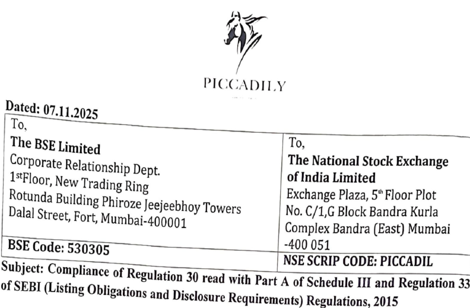
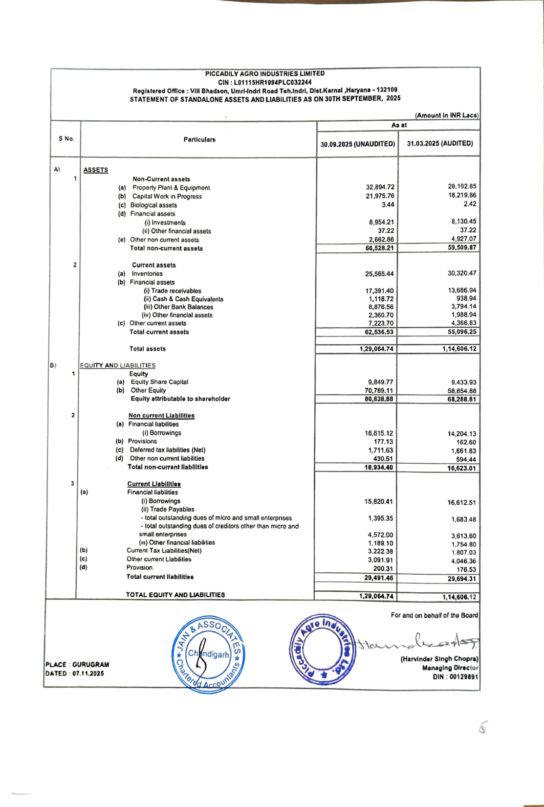
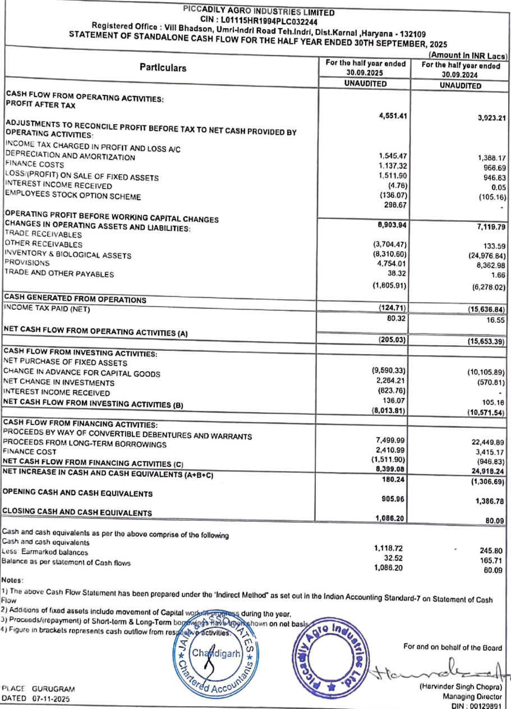
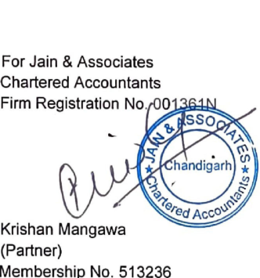
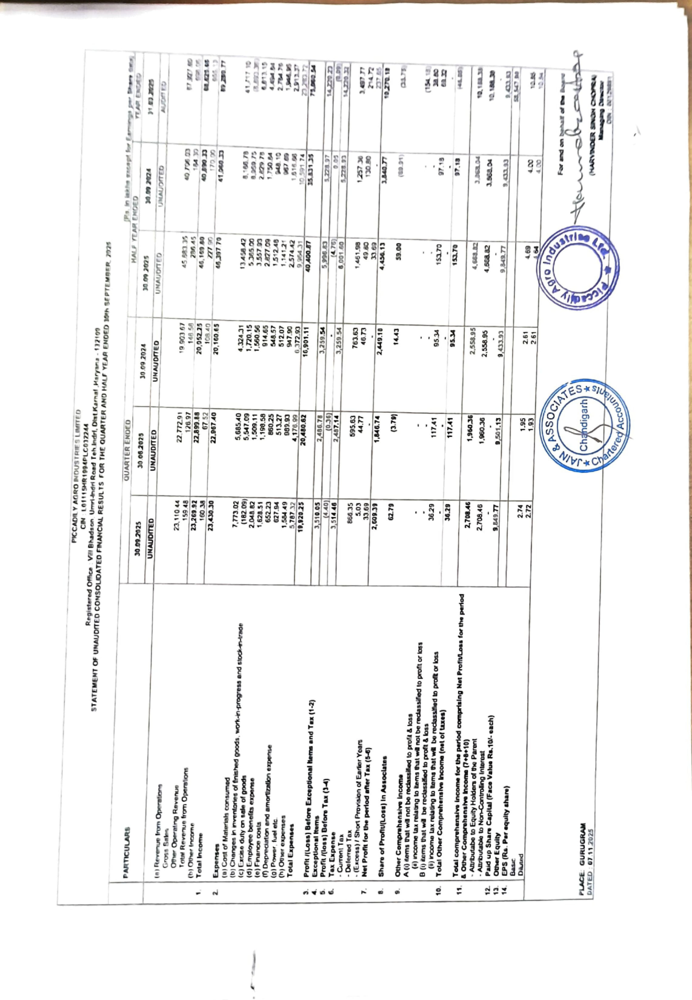
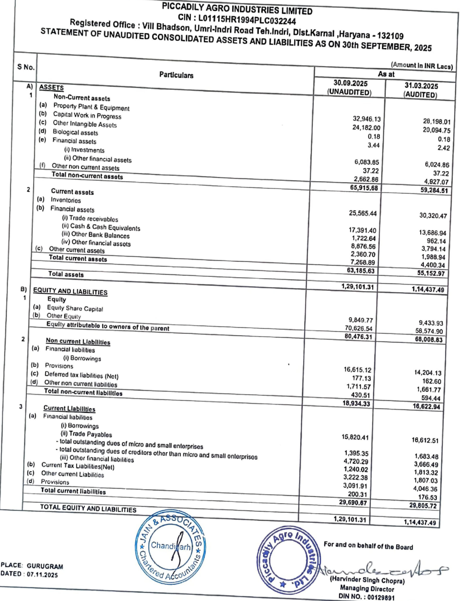
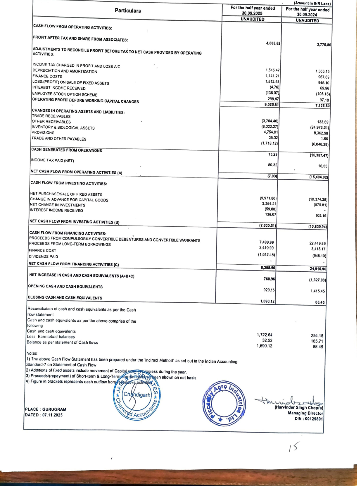

**[Image: Sept2025Result.pdf-0001-00.png (792x520, 226.5KB)]**

<!-- Start of picture text -->
Ay Y BSE  Code:  530305  -400  051 NSE  SCRIP  CODE:  PICCADIL of  SEBI  (Listing  Obligations  and Disclosure  Requirements)  Regulations,  2015 Subject:  Compliance  of  Regulation  30  read  with  Part  A  of  Schedule  III  and  Regulation  33 PICCADILY Dalal  Street,  Fort,  Mumbai-400001 Corporate Relationship Dept. 1“Floor,  New  Trading  Ring  of  India  Limited Rotunda  Building  Phiroze  Jeejeebhoy  Towers  No. Exchange C/1,G  Block Plaza, Bandra 5"  Floor Kurla Plot Complex  Bandra  (East)  Mumbai Dated: 07.11.2025 To, The  National  Stock  Exchange To, The  BSE  Limited <!-- End of picture text -->

###### 

& half year ended on 30th September, 2025 along with Limited Review Report. Obligations Pursuant to and Regulation Disclosure 30 Requirements) read with Part Regulations, A of Schedule 2015, III this and is Regulation to inform you 33 of that SEBI the Board (Listing of |. Un-Audited Standalone and Consolidated Financial Results of the Company for the Quarter discuss Directors and of approve the company the following in its items: meeting held today i.e. 07" November, 2025 hereby consider, 

The said Board Meeting commenced at information and record. 6.48 RM and concluded at % . bo p -M_This is for half year ended on 30!" September, 2025 along with Limited Review Report. We are also hereby enclosing Un-Audited Financial Results of the Company for the Quarter and 

We hereby request you to take note of the same and updated record of the company accordingly. 

Company Secretary Niraj Kumar ga Ly Compliance Officer A-8019 é For Picyadily Agyodudusities Limited YY \é \\ 

> Piccadily Agro Industries Ltd. Registered Corporate Administrative Office: Ph.: Office: +91-124-4300840, Village G-17, Office: Bhadson, IMD 275-276, Pacific Website: Umri Square, Captain - Wwww.piccadily,com, Indri Sector-15 Road, Gaur Marg, Teh, (Part-2), Indri, Sriniwaspuri, Email: Gurugram, Distt. inlo@piccadily.com Karnal, New Haryana Haryana-132109 Delhi | 122002 10065 (India) (India) dnvestor Relations: Ph.: +9}-| 72-299765 | CIN No.: LOH ISHR1994PLC032244 

JAIN & ASSOCIATES CHARTERED ACCOUNTANTS 

#### S.C.O. 178, Sector-5, Panchkula, Haryana - 134109 Phone: 0172-2575761, 2575762 Email: jainassociatesca@gmail.com 

Obligations and Disclosure Requirements) Regulations, 2015, as amended. Independent Auditor’s review Report on the Quarterly Unaudited Standalone Financial Results of the Company Pursuant to Regulation 33 of the SEBI (Listing 

##### Review Report to 

##### The Board of Directors of Piccadily Agro Industries Limited Village Bhadson, Umri Indri Road, Karnal (Haryana) 

- We have reviewed the accompanying Statement of unaudited standalone financial results of Piccadily Agro Industries Limited (“the Company”) for the quarter and six months ended September 30, 2025 (“the Statement’), being submitted by the company pursuant to the requirements of Regulation 33 of the SEBI (Listing Obligation and Disclosure Requirements) Regulation 2015 as amended (the “Listing Regulations’) This statement, which is the responsibility of the Company's Management and approved by the Board of Directors in their meeting held on 07""November, 2025 has been prepared in accordance with the recognition and measurement principles laid down in the Indian Accounting Standard 34 "Interim Financial Reporting" ("Ind AS 34"), prescribed under section 133 of the Companies Act, 2013 (‘the Act’), read with relevant rules, as amended, read with the Circular, issued there under and other accounting principles generally accepted in India and is in compliance with the presentation and disclosure requirements of Regulation 33 of the Listing Regulations. Our responsibility is to issue a report on these financial statements based on our review. We conducted our review in accordance with the Standard on Review Engagements (SRE) 2410, “Review of Interim Financial Information Performed by the Independent Auditor of the Entity’ issued by the Institute of Chartered Accountants of India. This standard requires that we plan and perform the review to obtain moderate assurance as to whether the financial statements are free of material misstatement. A review of Interim Financial information consists of making inquiries, primarily of persons 

## JAIN & ASSOCIATES CHARTERED ACCOUNTANTS 

#### Phone: 0172-2575761, 2575762 S.C.O. 178, Sector-5, Panchkula, Haryana - 134109 Email: jainassociatesca@gmail.com 

accordance with standards on Auditing specified under section 143(10) of the Act, and all significant matters that might be identified in an audit. Accordingly, we do not express and audit opinion. responsible for financial and accounting matters, and applying analytical and other review procedures. A review is substantially less in scope than an audit conducted in consequently does not enable us to obtain assurance that we would become aware of 

- nothing has come that 

- Based on causes us to believe that the accompanying statement, prepared in accordance with the in terms of Listing Regulations 33 of the Listing Regulations, including the manner in our review conducted as above, to our attention 

- recognition and measurement principles laid down in the aforesaid Indian Accounting Standards (‘Ind As 34’) specified under section 133 of the Companies Act, 2013 as amended, read with relevant rules issued thereunder and other accounting principles generally accepted in India, has not disclosed the information required to be disclosed which it is to be disclosed, or that it contains any material misstatement. 

For Jain & Associates Chartered Accountants 

| thSEPTEMBER,2025   (Rs.InlakhsoxceptforEarningsperSharedata) HALFYEARLY YearEnded   30.09.2025 30.09.2024   UNAUDITED UNAUDITED 31.03.2025 AUDITED   45,883.35 286.45 40,706.03 87,927.60   46,169.80 227.90 184.30 40,890.33 169.99 698.05 88,625.65   655.13   46,397.70 13,458.42 5,365.00 3,557.93 2,773.25 1,511.90 1,137.32 2,574.42 9,927.33 41,060.32 8,166.78 8,959.75 2,829.78 1,701.02 946.83 966.69 1,616.66 10,561.38 89,280.77 41,717.10 (8,893.36) 6,813.15 4,404.52 2,782.86 1,944.97 2,913.37   40,305.59 23,182.53   35,748.90 74,865.14 6,092.11 (4.76) §,311.42 0.05 14,415.63   6,096.87 (0.09) 1,461.98 49.80 33.69 5,311.38 1,257.36 130.81 14,415.72 3,497.77 214.73   237.65 4,551.41 3,923.21 10,465.57 (154.18) 38.80   4,551.44 3,923.21 9,849.77 9,433.93 10,350.20 9,433.93   4.79 4.74  4.16 4.16   58,854.88 11.09 11.08 |ForandonbehalfoftheBoard Lede (HARVINDERSINGHCHOPRA) ManagingDirector   DIN :00129891|
|---|---|
| alHaryana -132109  HALFYEARENDED30     30.09.2024   UNAUDITED   19,903.67 148.58   20,052.25 108.40   20,160.65   4,324,31 1,720,156 1,560.56 887.38 547.77 511.55 947.90 6,357.16   16,856.78   3,303.87   3,303.87 763.63 46.73   2,493.51   2,493.51 9,433.93   2.64 2.64  ||
| PICCADILYAGROINDUSTRIESLIMITED CIN :L01115HR1994PLC032244   :VillBhadson,Umri-IndtiRoadToh.Indri,Diet.Karn NEFINANCIALRESULTSFORTHEQUARTERAND   QUARTERENDED   30.09.2025 30.06.2025   UNAUDITED UNAUDITED   23,110.44 159.48 22,772.91 126.97   23,269.92 160.38 22,899.88 67.52   23,430.30 22,967.40   7,773.02 (182.09) 2,048.82 1,600.09 651.95 624.48 1,584.49 5,768.07 5,685.40 5,547.09 1,509.11 1,173.16 859.95 512.84 989.93 4,159.26   19,868.84 20,436.75   3,561.46 2,530.65 (4.40) 3,565.86 (0.36)   2,531.01   866.35 5.03 33.69 595.63 44,77   2,660.79 1,890.61 2,660.79 1,890.61   9,849.77 9,501.13       2.00 1.98  ||
| STATEMENTOFUNAU RegisteredOffice DITEDSTANDALO   PARTICULARS RevenuefromOperations   GrossSales OtherOperatingRevenue TotalRevenuetromOperations OtherIncome TotalIncome   Expenses   (a)CostofMaterialsconsumed (b)Changesininventoriesoffinishedgoods,work-in-progressandstock-in-trade (c)Excisedutyonsaleofgoods (cd)Employeebenefitsexpense (c)Financecosts (f)Depreciationandamortizationexpense (9)Power,fuel etc. (h)Otherexpenses TotalExpenses   Profit/(loss)beforeexceptionalItemsandtax(1-2)   ExceptionalItems oi)elud) oo Profit/(loss)beforetax(3-4) TaxExpense   -CurrentTax -DeferredTax -TaxofEarlierYears ProfitforthePeriod(5-6)   OtherComprehensiveIncome Ali)itemsthatwillnotbereclassifiedtoprofit&loss (i)incometaxrelatingtoitemsthalwillnotbereclassifiedtoprofitorloss B(1)itemsthatwillbereciassifiedtoprofit&loss (ti)incometaxrelatingtoitemsthatwillbereclassifiedtoprofitorloss Totalcomprehensiveincome(aftertax)(7+8)   11. PaldupShareCapital(FaceValueRs.10/-cach) 12 OtherEquity EPS(Rs.Perequityshare)   Basic Diluted   |PLACE :GURUGRAM DATED:07.11.2025 |

|   PICCADILYAGROINDUSTRIESLTD.   INANCIALRESULTS: ultshavebeenpreparedinaccordancewithCompanies  133oftheCom (IndianAccountingStandards)Rules,2015 paniesAct,2013readwithrule3oftheCompanies(IndianAccountingStandard) endmentsthereafter.|ultshavebeenreviewedbytheAuditCommitteeintheirmeetingheldonO5thNovember,2025and theirmeetingheldon07thNovember,2025.  ofseasonalnature .theperformance inanyquartermaynotberepresentative oftheannual|havebeenregroupedwherevernecessarytoconfirmtothisperiod’sclassification. |ForandonbehalfoftheBoard (HARVINDERSINGHCHOPRA) ManagingDirector DIN :00129891 |
|---|---|---|---|
|     NOTESTOTHESTANDALONEF 1Theabovestandalonefinancialres (IndAS)prescribedunderSection Rules,2015andotherrelevantam|2Theabovestandalonefinancialres approvedbyBoardofDirectorsin 3Oneofthebusinesssegment is performanceofthecompany.|4Thepreviousperiod/year’sfigures|PLACE:GURUGRAM DATED :07.11.2025|

**[Image: Sept2025Result.pdf-0006-00.png (1113x1650, 716.8KB)]**

<!-- Start of picture text -->
|  PICCADILY  AGRO  INDUSTRIES  LIMITED |  CIN  :  L01115HR1994PLC032244 Registered  Office  :  Vill  Bhadson,  Umri-Indri  Road  Teh,Indri,  Dist.Karnal  Haryana  -  132109 STATEMENT  OF  STANDALONE  ASSETS  AND  LIABILITIES  AS  ON  30TH  SEPTEMBER,  2025 (Amount  In  INR  Lacs) As  at SNe.  Particulars  30.09.2025  (UNAUDITED) |  31.03.2025  (AUDITED) A)  ASSETS 1  Non-Current  assets (a)  Property  Plant  &  Equipment  32,894.72  28,192.85 (b)  Capital  Work  in  Progress  21,975.76  18,219.86 (c)  Biological  assets  3.44  242 (d)  Financial  assets (i)  Investments  8,954.21  8,130.45 (ii)  Other  financial  assets  37.22  37.22 (e)  Other  non  current  assets  2,662.86  4,927.07 Total  non-current  assets  66,528.21  59,509.87 2  Current  assets (a)  Inventories  25,565.44  30,320.47 (b)  Financial  assets (i)  Trade  receivables  17,391.40  13,686.94 (ii)  Cash  &  Cash  Equivalents  4,118.72  938.94 (lii)  Other  Bank  Balances  8,876.56  3,794.14 (iv)  Other  financial  assets  2,360.70  1,988.94 (c)  Other  current  assets  7,223.70  4,366.83 Total  current  assets  62,536.53  §5,096.25 Total  assets  1,29,064.74  1,14,606.12 B)  EQUITY  AND  LIABILITIES 4  Equity (a)  Equity  Share  Capital  9,849.77  9,433,93 (b)  Other  Equity  70,789.11  58,854.88 Equity  attributable  to  shareholder  80,638.88  68,288.81 2  Non  current  Liabilities (a)  Financial  liabilities (i)  Borrowings  16,615.12  14,204.13 (b)  Provisions  177.13  162.60 (c)  Deferred  tax  liabilities  (Net)  1,711.63  1,661.83 (d)  Other  non  current  liabilities  430.51  594.44 Total  non-current  Ilabllitles  18,934.40  16,623.01 3  Current  Liabilities (a)  Financial  liabilities (|)  Borrowings  15,820.41  16,612.51 (ii)  Trade  Payables -  total  outstanding  dues  of  micro  and  small  enterprises  1,395.35  1,683.48 -  total  outstanding  dues  of  creditors  other  than  micro  and small  enterprises  4,572.00  3,613.60 (i)  Other  financial  liabilities  1,189.10  1,754.80 (b)  Current  Tax  Liabilities(Net)  3,222.38  1,807.03 (c)  Other  current  Liabilities  3,091.91  4,046.36 (d)  Provision  200.31  176.53 Total  current  Ilabilitles  29,491.46  29,694.31 TOTAL  EQUITY  AND  LIABILITIES  1,29,064.74  1,14,606.12 For  and  on  behalf  of  the  Board VCC AAN  ~<  ‘  s\a5 (Harvinder  Singh  Chopra) PLACE  :  GURUGRAM  Managing  Director DATED  :  07.11.2025  DIN  ;  00129891 <!-- End of picture text -->

**[Image: Sept2025Result.pdf-0007-00.png (911x1263, 813.9KB)]**

<!-- Start of picture text -->
Noles: Flow 1)  The  above  Cash  Flow  Statement  has  been  prepared  under  tho  ‘Indirect  Method"  as  set  out  In  the  Indian  Accounting  Standard-7  on  Statement  of  Cash 2)  Additions  of  fixed  assets  includo  mavamont  of  Capital  wo,  +4  during  the  yoar, 3)  Proceeds/(repayment)  of  Short-torm  &  Long-Torm  bogs 4)  Figure  in  brackels  represents  cash  outflow  from  respéatw: For  and  on  behalf  of  tha  Board PLACE  GURUGRAM  (Harvinder  Singh  Chopra) DATED  07-11-2025  Managing  Director DIN  ;  00129891 Particulars UNAUDITED PROFIT  AFTER  TAX INCOME  TAX  CHARGED  IN  PROFIT  AND  LOSS  A/C DEPRECIATION  AND  AMORTIZATION  1,545.47 1,511.90 (4.78) EMPLOYEES  STOCK  OPTION  SCHEME  (136.07) 6,903.94 (3,704.47) INVENTORY  &  BIOLOGICAL  ASSETS  (8,310.60) (15,636.84) (205.03) CASH  FLOW  FROM  INVESTING  ACTIVITIES: NET  CHANGE  IN  INVESTMENTS . (10,571.54) CASH  FLOW  FROM  FINANCING  ACTIVITIES: 2,410.99  3,415.17 6,399.08  24,918.24 1,386.78 CLOSING  CASH  AND  CASH  EQUIVALENTS 80.09 Less  Earmarked  balances  1,118.72 Balance  as  per  statement  of  Cash  flovs  32.52 ————_ (Amount  In  INR  Lacs) For  tha  half  yoar  endod  For  the  half  yoar  andod 30.09.2025  30.09.2024 UNAUDITED CASH  FLOW  FROM  OPERATING  ACTIVITIES: 4,551.41 OPERATING  ACTIVITIES: 1,388.17 LOSS/(PROFIT) FINANCE  COSTS ON  SALE  OF  FIXED  ASSETS  1,137.32  966.69 INTEREST  INCOME  RECEIVED  9.05 (105.16) 298.67  “ OPERATING  PROFIT  BEFORE  WORKING  CAPITAL  CHANGES CHANGES  IN  OPERATING  ASSETS  AND  LIABILITIES:  7,118.79 TRADE  RECEIVABLES OTHER  RECEIVABLES  133.59 (24,976.84) TRADE PROVISIONS AND  OTHER  PAYABLES  4,754.01  8,362.98 1,66 (1,805.91)  (6,278.02) CASH  GENERATED  FROM  OPERATIONS INCOME  TAX  PAID  (NET)  (124.71) 80.32  16.55 NET  CASH  FLOW  FROM  OPERATING  ACTIVITIES  (A) (15,653.39) NET  PURCHASE  OF  FIXED  ASSETS CHANGE  IN  ADVANCE  FOR  CAPITAL  GOODS  (9,690.33)  (10,105.89) 2,264.21 INTEREST  INCOME  RECEIVED NET  CASH  FLOW FROM  INVESTING  ACTIVITIES  (B)  136,07  105.16 (8,013.81) PROCEEDS  BY  WAY  OF  CONVERTIBLE  DEBENTURES  AND  WARRANTS PROCEEDS  FROM  LONG-TERM  BORROWINGS  7,499.99  22,449.89 FINANCE  COST NET  CASH  FLOW  FROM  FINANCING  ACTIVITIES  (C)  (1,511.90)  (946,83) NET  INCREASE  IN  CASH  AND  CASH  EQUIVALENTS  (A+B+C) 180.24  (1,306.69) OPENING  CASH  AND  CASH  EQUIVALENTS 905.06 Cash Cash  and and  cash cash  equivalents equivalents  as  per  tha  above  comprise  of  tho  following °  245.80 165.71 1,086.20  60.09 3,923.24 ADJUSTMENTS  To  RECONCILE  PROFIT  BEFORE  TAX  TO  NET  CASH  PROVIDED  BY 946,83 38.32 (570.81) (823.76) 1,086.20 CIN:  L01115HR1994PLC032244 STATEMENT  OF  STANDALONE  C PICCADILY  AGRO  INDUSTRIES LIMITED Registered  Office  :  Vill  Bhad son,  Umri-ndrl  Road  Toh.Indri,  Dist.Karnal  sHaryana  -  132109 ASH  FLOW  FOR  THE  HALF  YEAR  ENDED  30TH  SEPTEMBER,  2025 <!-- End of picture text -->

|ana -132109 FYEARENDED30thSEPTEMBER.2025 | MALFYEARENDED (BerendmniseLars) | TEARENDED   ~30.092095   UNAUDITED 30.09.2074 UNAUDITED ej 31.932925 AUDITED       9.009.17 57,07063 27:90 10.478.31 WAI202 169.99 14FH) 43 57555 | gne4)1   46,397.70 ___44,060.32 “b9.200.77   46,397.70 41,060.32 89.750.77   (825.48) 8.81351 (1.11828) 7A59.43 (3X2713 19.01450    7,988.03 6,351.15 17,688.38   1,511.90 384.01 (4.76) 946.23 92.80 0.05   2T8236 42985 7 AO   6,096.87 5.311.238 1441572   32,458.48 96.606.26 25.690_S0 73,096.77   43D 6118289   | 1,29,064.74 98,787.66 1.14606. 12   3,088.11 40,403.74 4,934.01 4,49738 23,324.45 5,503.70 11.58377 3116463 3458.85      38,325.53  |
|---|---|---|
|LIMITED 244 ri,Dist.KarnaliHary  QUARTERANDHAL  -|     30.09.2024   UNAUDITED   1,564.03 18.48822 10840   20,160.65       20,160.65   (566.66) 4,465.40   3,898.54   547.77 46.90   3,303.87   25,690.90 73,096.77 | 98,787.66   4,497.38 28,324.45 5,503.70     38,325.53 |
|YAGROINDUSTRIES :L01115HR1994PLC032 Umri-IndriRoadTeh.Ind STANDALONE)FORTHE | QUARTERENDED   30.06.2025   UNAUDITED   6,616.74 16,283.13 67.52   22,967.40     22,967.40   (432.04) 3,859.51   3,427.47   859.95 36.87 (0.36)   2,531.01   31,045.53 87,441.87   | 1,18,487.39   6,155.24 34,320.93 4,081.81       44,557.98   ification.|
|PICCADIL CIN Office :VillBhadson,  ANDLIABILITIES( |   30.09.2025   UNAUDITED 2482.43 20,787.50 160.37     23,430.30   23,430.30   (393.45) 4,95400   4,560.56   651.95 347.14 (4.40)   3,565.86   32,458.48 96,606.26   | 41,29,064.74   3,088.11 40,403.74 4,934.01       48,425.86   toconfirmtothisperiod'sclass|
|Registered  SEGMENTREVENUE,RESULTS,ASSETS |     A SeamentRevenue Sugar Distilory Others   Total, ee _ LessInterSegomentRevenue     TotalRevonuofromOperations   B. SegmentResults Profiv(loss)(beforeunallocatedexpenditure, financecostandtax) Sugar Distillery Others   Total   Less i)FinanceCosts li)Otherunallocableexpenditurenetoff unallocatedincome ti)Exceptionaltem   ProfitBeforeTax   C.SegmentAssets Sugar Distillery OtherUnallocableAssets       |   Total   D.SegmentLiabilities Sugar Drstillery OtherUnallocableLiabilities   Total     Thepreviousperiod/year'sfigureshavebeenregroupedwherevernecessary    DATED :07.11.2025|

## JAIN & ASSOCIATES CHARTERED ACCOUNTANTS 

### S.C.O. 178, Sector-5, Panchkula, Haryana - 134109 Phone: 0172-2575761, 2575762 Email: jainassociatesca@gmail.com 

Independent Auditor's Limited Review Report on the Quarterly Unaudited Consolidated Financial Results of the Company Pursuant to Regulation 33 of the SEBI (Listing Obligations and Disclosure Requirements) Regulations, 2015, as amended 

#### TO THE BOARD OF DIRECTORS OF PICCADILY AGRO INDUSTRIES LIMITED Village Bhadson, Umri-Indri Road, Karnal (Haryana) 

- Financial Results quarter ended 30th September, 2025 and the consolidated year being submitted by the Holding Company pursuant to the requirement of Regulation 33 of the SEBI (Listing Obligations and Disclosure Requirements) (‘the Statement”) 

- LIMITED (the “Holding Company”) , its subsidiaries (the Holding company and to as “the Group’) and associate for the 

- results for the period starting from 01st April, 2025 to 30 September, 2025, Regulations, 2015 (as amended) (“Listing Regulations’). 

- 1. We have reviewed the accompanying statement of Unaudited Consolidated of PICCADILY AGRO INDUSTRIES 

- its subsidiaries together referred to date 

2. is the responsibility has been prepared 2013, (‘the Act’) as amended, read with the relevant rules issued there under is 

the Listing Regulations. Our responsibility This Statement, which of the Holding Company's Management and approved by the Holding Company's Board of Directors, in accordance with the recognition and measurement 

principles laid down in Indian Accounting Standard 34 "Interim Reporting" (“Ind AS 34”) prescribed under section 133 of the Companies Act, accounting principles generally India and 

compliance with presentation and disclosure requirement of Regulation 33 of is to express a conclusion on the 

Statement based on our review. Financial 

and other accepted in in 

3. We conducted our review of the Statement in accordance with the Standard on Review Engagements (SRE) 2410 "Review of Interim Financial Information Performed by the Independent Auditor of the Entity’, issued by the Institute of Chartered Accountants of IngeesAseview of interim financial information 

# JAIN & ASSOCIATES CHARTERED ACCOUNTANTS 

### Phone: 0172-2575761, 2575762 Email: jainassociatesca@gmail.com S.C.O. 178, Sector-5, Panchkula, Haryana - 134109 

> significant matters that might be identified in an audit. Accordingly, we do not express an audit opinion. consists of making inquiries, primarily of persons responsible for financial and accounting matters, and applying analytical and other review procedures. A review is substantially less in scope than an audit conducted in accordance 

> with Standards on Auditing specified under Section 143(10) and consequently does not enable us to obtain assurance that we would become aware of all 

also circular No. CIR/CFD/CMD1/44/2019 date March 29, 2019 issued SEBI performed procedures in accordance with the by the SEBI under Regulation 33 (8) of the (Listing Obligations Disclosure Requirements) Regulations, 2015, as amended, to the extent applicable. We and 

4. The Statement includes the results of the following entities: Subsidiaries: 

   - a) Portavadie Distillers & Blenders Limited 

b) Six Trees Drinks Private Limited 

##### Associate: 

   - a) Piccadily Sugar & Allied Industries Limited 

5. Based on our review conducted and procedures performed as stated in paragraph 3 above nothing has come to our attention that causes us to believe that the accompanying Statement, prepared in accordance with the recognition and measurement principles laid down in the aforesaid Indian Accounting Standard and other accounting principles generally accepted in India, has not disclosed the information required to be disclosed in terms of Regulation 33 of the SEBI (Listing Obligations and Disclosure Requirements) Regulations, 2015, as amended, including the manner in which it is to be disclosed, or that it contains an jal misstatement. 

JAIN & ASSOCIATES CHARTERED ACCOUNTANTS 

### S.C.O. 178, Sector-5, Panchkula, Haryana - 134109 Phone: 0172-2575761, 2575762 Email: jainassociatesca@gmail.com 

- ended respectively, total profit after tax lacs and Rs. 58.42 lacs for the quarter and six months ended 30" September, 2025 respectively. 

- 6. We did not review the interim financial results ,which have been prepared by the management, of one subsidiary included financial results whose interim financial results reflect total assets of Rs. 2905.75 lacs, total revenue of Rs. 0 and Rs. 0 for the quarter and six months 30° September,2025 net of Rs. 

- (51.40) lacs and Rs. (95.28) lacs for the quarter and six months ended 30! September, 2025 respectively, total comprehensive income of Rs. (15.12) in the unaudited consolidated 

Our conclusion on the statement is not modified in respect of the aforesaid matter. 

Place: Gurugram Dated: 07.11.2025 UDIN: 25513236 roIP SP 6250 

**[Image: Sept2025Result.pdf-0011-05.png (332x355, 97.4KB)]**

<!-- Start of picture text -->
For  Jain  &  Associates Chartered  Accountants Firm  Registration  No,  /001364J Krishan  Mangawa (Partner) Membership  No.  513236 <!-- End of picture text -->

**[Image: Sept2025Result.pdf-0012-00.png (1142x1650, 971.9KB)]**

<!-- Start of picture text -->
| avosd  nm 21s 1616.66 20,480.62 16,901.11 10,920.25 A00_47 40, ee — 9,501.13 9,433.93 . face (1-4) Tax Before i(loss) Profit Items Exceptional 7,406.76 Mus 3,259.54 3,510.05 Expense Tax 4 | SS 5,996.83 S6 ThOS0 | 35 35.431 (0-36) ——_________ 0) Kf 3,514.46 okey PsP, 3,250.54 | 5273.93 | _ 6001.60 74 10.591 (1-2) Tax and ems Exceptional Before /(Loss) Profit i228.97 2,487.14 ——_ 78) (4 j 988% 148.58 126.97 159.48 a ore 6 067 2.827.099 | | Equity Other | 13. expense benefits costs Emptoyee Finance (4) (©) 46,169.89 20,052.25  947.90 22.967.40 (7+8+10) incoma Comprehensive Other & NOUSTA© AGRO PICCADA.Y | 736.45  5.305.00 914.65 expense amortization and Depreciation (1) tB.19 1. 179.90  97.13 - 089.93 2  3,549.77 period the for ProfivLoss Net comprising period the for income comprehensive Total 20,160.65 1,509.14 1,190.68 | 0.95975 Operations trom Revenue (8) (182.09) 3357.99  9,964.31 648.57 | 1,628.54 Operitions from 117.41 1,584.49 5,787.32 consumed etc. Materints  fuel Cost of  Power, (0)  (0) 1,720.15 each) Rs.10/- Value (Face Capital Share up Paid | 12. _  2,558.95 5,547.09 | 95.34 $.685.40 512.07 513.27 aust? 15.70 82 2.048. 1215 138170 Expenses Total  Basic ED stock-in-trade and work-in-progress Q00ds. finished of inventories in Cnanges (b) | 22,899.88 | 160.38 22,772.91 LOINISHRIP9APLCOI7244 CM expenses Other (h) 1. Lasmrep 7925 SEPTEMBER 20h ENDED YEAR HALF ANO QUARTER THE FOR RESULTS FINANCIAL Dikaed | 1750.44 | 13.458.42  V7AT 8,765.78 aT 2574.42 _ 627.94 Bates Gross Pe ea 27 _ 108.40 | UNAUDITED | 14490 1.141.241 67 19.903 7,773.02 708 __ |____UMALOFT 1,960.36 2311044 1s 4639770  | 4,176.99 share) equity Income  Per Other  (Rs. (b)  EPS | 14. rr epee Bs et 4 |  73 | 2.029  57.13 ee Interest Non-Controling to Atvibutable - 1 SS os GLazs | 4,324.31 860.25 652.23 151248 cr ow sUNAUOTTED | ~ UNAUDITED Revenue Tota! ao er? oo | 687.95 45 - 4069023 1,960.36 23,269.92 95.34 41.5603 9 income Total | 73,430.30 Revenue Operating Other 192109 - Maryanne Karnal Ota Indrt, Teh Road Urrritndri Bhadson. Vil Office Registered Parent the of Holders Equity to Aluibutabo » 2.708.486 | | Expenses | 2 1,560.56  6,372.93  2558.95 goods of vale on duty Excine (c) 67.52 | | | MITES (3.79) 59.00 20.06.2025 | 30.09.2025 Exot Ese 33.69 10. 30.09.2024 = — Some Bee peor Farmers fot oecept abhe in UNAUDITED loss or profit to reclassified bo wil that tems to relating Lax income () 763.63 62.79 Tax Deferres - SS 33.69 | . | __ TO “y 2005 30.99 __ 866.35 taxes) of (net Income a Comprehensive Other Tota! tees ENDED YEAR HALF - | 595.63 (s9.91 PARTICULARS 1,461.98  49.80 46.73 Yoarn Eartor of Provision Short / (Excess) + 2074 30.09 5.03 loss or proft to reclassified be not (5-6)  wil Tax  thal after  tems to period relating the for  tax Profit  income (4) Net SP. - income Comprehensive Other | 9. JI Tax Current » __ | ENDED _QUARTER 36.29 14.43 %29 —-— a ——— _ - _ 44.77 / loss & profit to reclassified be wil that tems B (i) loss & profil to reciassified bo not wil that tems A (i) a2" 4456.13 | 2,449.10 1,846.74 334077 2,609.39 Associates In Profiu(Loss) of Share | 8. 36 1.257 mar? - Bs 130.80 7? las? GURUGRAM PLACE. 07.11.2025 LDATED - 2.61  2.61 2.74  2.72 <!-- End of picture text -->

| PICCADILYAGROINDUSTRIESLTD. NOTESTOTHECONSOLIDATEDFINANCIALRESULTS :   1TheaboveconsolidatedfinancialresultshavebeenPreparedinaccordancewithCompanies(IndianAccountingStandards)Rules,2015(IndAS) prescribedunderSection133oftheCompaniesAct,2013readwithrule3oftheCompanies(IndianAccountingStandard)Rules,2015andother relevantamendmentsthereafter.|2TheaboveconsolidatedfinancialresultshavebeenreviewedbytheAuditCommitteeintheirmeetingheldonOSthNovember,2025andapprovedby BoardofDirectorsintheirmeetingheldon07thNovember,2025.|3Oneofthebusinesssegmentisofseasonalnature,theperformanceinanyquartermaynotberepresentativeoftheannualperformanceofthe company. |(HarvinderSinghChopra) ManagingDirector DINNO. :00129891 PLACE :GURUGRAM DATED :07.11.2025 |
|---|---|---|---|

**[Image: Sept2025Result.pdf-0014-00.png (959x1253, 756.0KB)]**

<!-- Start of picture text -->
PICCADILY  AGRO  INDUSTRIES  LIMITED :  Vill  Bhadson,  Umrl-Indri  Road  Teh.Indri,  Dist.Karnal  :#Haryana  -  132109 31.03.2025 28,198.01 Biological  assets 2.42 (i)  Other  financial  assets Total  non-current  assats 59,284.51 Inventories Financial  assets 17,391.40 63,185.63 Equity  Share Capital Equity  attributable  to  ownors  of  the  parent Financial  liabilities (i)  Borrowings 16,615.12 594.44 Current  Llabillties Financial  liabilities (il)  Trade  Payables 1,683.48 4,720.29 Current Tax Liabilities(Nel) 3,091.91 176.53 Registered  Office  CIN  :  LO1115HR1  994PLC032244 STATEMENT  OF  UNAUDITED  CONSOLIDATED  ASSETS  AND  LIABILITIES  AS  ON  30th  SEPTEMBER,  2025 (Amount  In  INR Lacs) 30.09.2025 1  Non-Current  assots  (UNAUDITED)  (AUDITED) Property  Plant  &  Equipment (b) (c)  Other  Intangible  Assets  32,946.13 (d)  20,094.75 Financial  assets  0.18 (i)  Investments 6,083.65 Other  non  current  assets  37.22  6,024.86 37.22 2,662.86 2  Current  assots  65,915.68 (a) (b) 25,565.44 (i)  Trade  receivables (ii)  Cash  &  Cash  Equivalents 13,686.94 Total Other (iv) current current Othor assals assots financial  assots  7,268.89 2,360.70 8,876.56  962.14 4,400.34 Total  assots  55,152.97 B)  |  Equity  AND  LIABILITIES  1,29,101.31  1,14,437.49 1 (b)  Other  Equily 9,849.77  9,433.93 70,626.54  §8,.574.90 2  Non  current  Liabilities  80,476.34  68,008.83 (a) ({b)  Provisions (c)  Deferred  tax  liabilities  (Net) (@)  Total Other  non-current non  current  liabilities Habilitias  1,711.57  1,661.77 3  18,934.33  16,622.94 (i)  Borrowings ~  lolal  outstanding  dues  of  micro  and  small  entorprises  15,820.44  16,612.51 1,395.35 (iil)  Other  financial  liabilities (b)  3,666.49 (d) (c)  Provisions Other  current  Liabilitios  3,222.38 1,240.02  1,813,392 4,046.36 29,690.67  29,805.72 1,29,101.31  1,14,437.49 (Harvinder  Singh  Chopra) Managing  Director :  00129894 S  No. Particulars  As  at A) |  ASSETS (a) Capital  Work  in  Progress 24,182.00 (e)  0.18 3.44 4,927.07 30,320.47 (lii)  Other  Bank  Balances  1,722.64 (c)  3,794.14 1,988.94 Equity (a) ‘ 14,204.13 177.13  162.60 430,51 (a) ~  lotal  outstanding  dues  of  croditors  othar  than  micro  and  Small  onlerprisos 1,807.03 Total  current  liabilities  200.31 TOTAL  EQUITY  AND  LIABILITIES DIN  NO, PLACE:  GURUGRAM DATED :  07.11.2025 <!-- End of picture text -->

\4 

###### PICCADILY AGRO INDUSTRIES LIMITED : LO1145HR1994PLC032244 Registered Office : Vill Bhadson, Umrl-Indri Road Teh.Indri, Dist.Karnal Haryana - 132109 CIN STATEMENT OF CONSOLIDATED CASH FLOW FOR THE HALF YEAR ENDED 30th SEPTEMBER, 2025 

**[Image: Sept2025Result.pdf-0015-01.png (1084x1473, 849.3KB)]**

<!-- Start of picture text -->
(Amount  In  INR Lacs) ~\  iniadng  s atlos. PLACE  :  GURUGRAM  (Harvinder  Singh  Chop/a) DATED :  07.11.2025  Managing  Director OIN  ;  00129991 1S 4)  Figure  in  brackets  represents  cash  outflow  fro 1)  The  above  Cash  Flow  Statement  has  been  prepared  under  the  ‘Indirect  Method"  as  sot out  in  the  Indian  Accounting Standard-7  on  Statement  of  Cash  Flow  7 2)  Additions  of  fixed  assets  includo  movement  of  Capitals  dg 3)  Proceeds/(repayment)  of  Short-term  &  Long-Term 30.09.2024 PROVISIONS (6,046.29) CASH  GENERATED  FROM  OPERATIONS 4,668,682  3,770.86 ACTIVITIES. - 1,545.67  1,388.16 FINANCE  COSTS LOSS(PROFIT)  ON  SALE  OF  FIXED  ASSETS (4.76) (136.07)  (105,16) OPERATING  PROFIT  BEFORE  WORKING  CAPITAL  CHANGES OTHER  RECEIVABLES  (3,704.46) INVENTORY  &  BIOLOGICAL  ASSETS  (8,322.27)  (24,976.21) 4,754.01  8,362.98 (15,387.47) 80.32, (7.03)  (15,404.02) NET  PURCHASE/SALE  OF  FIXED  ASSETS CHANGE  IN  ADVANCE  FOR CAPITAL  GOODS  (9,971,890)  (10,374.28) 2,264.21  (570.81) INTEREST  INCOME  RECEIVED  (59.00) 105.16 (7,630.51)  (10,839.94) “4 7,499.99 FINANCE  COST  2,410.99  3,415.17 (1,512.48)  (948.10) . 6,398.50  24,916.96 NET  INCREASE  IN  CASH  AND  CASH  EQUIVALENTS  (A*BtC) 1,415.45 CLOSING  CASH  AND  CASH  EQUIVALENTS 1,690.12  88.45 Reconciliation  of  cash  and  cash  equivalents  as  per  the  Cash Cash  and  cash  equivalents  as  per  the  above  comprise  of  the follovweng Cash  and  cash  equivalents Less  Earmarked  balances Balance  as  per  slalement  of  Cash  flows  32.52  165.71 1,690.12  88.45 Notes Particulars 30.09.2025 UNAUDITED  UNAUDITED CASH  FLOW  FROM  OPERATING  ACTIVITIES: PROFIT  AFTER  TAX  AND  SHARE  FROM  ASSOCIATES: ADJUSTMENTS  TO  RECONCILE  PROFIT  BEFORE  TAX  TO  NET  CASH  PROVIDED  BY  OPERATING INCOME  TAX  CHARGED  IN  PROFIT  AND  LOSS  AC DEPRECIATION  AND AMORTIZATION 1,141.21  967.69 1,512.48  948,10 INTEREST  INCOME  RECEIVED  69.96 EMPLOYEE  STOCK  OPTION  SCHEME 298.67  97.18 9,025.81  7,136.80 CHANGES  IN  OPERATING  ASSETS  AND LIABILITIES: TRADE  RECEIVABLES ,  133.59 TRADE  AND  OTHER  PAYABLES  38,32,  1,66 (1,718.12) 73.29 INCOME  TAX  PAID  (NET) 16,55 NET  CASH  FLOW  FROM  OPERATING  ACTIVITIES  (A)  . CASH  FLOW  FROM  INVESTING  ACTIVITIES: NET  CHANGE  IN  INVESTMENTS . 136,07 NET  CASH  FLOW  FROM  INVESTING  ACTIVITIES  (B) CASH  FLOW  FROM  FINANCING  ACTIVITIES: PROCEEDS  FROM  COMPULSORILY  CONVERTIBLE  DEBENTURES  AND  CONVERTIBLE  WARRANTS PROCEEDS  FROM  LONG-TERM  BORROWINGS  22,449.89 DIVIDENDS  PAID . NET  CASH  FLOW  FROM  FINANCING  ACTIVITIES  (Cc) 760.96  (1,327.00) OPENING  CASH  AND  CASH  EQUIVALENTS 929.16 flow  statement 1,722.64  254.15 For  tha  half  yoar  ended  For  tho  half  yoar  ended <!-- End of picture text -->

|a-132109 FYEARENDED301hSEPTEMBER,2025| (AmountinINRLacs)   HALFYEARENDED YEARENDED   30.09.2025   30.09.2024 31.03.2025   UNAUDITED UNAUDITED AUDITED     9,09917 37,070.63 227.90 10,478.31 W412.02 169.99 24.95010 63.67555 655.13   —__ 46,397.70, 41,060.32  COe)89,280.77   46,397.70 41,060.32 69,220.77   (825.48) 6,718.81 (1,118.28) 7,388.26 (327.13) 17,622.00   7,893.33 6,269.98 17A934.37   1,612.48 384.01 (4,76) 948.10 92.90 0.05 2,784.76 48968 (0.09)   6,001.60 5,228.93 14,220.32   32,458.48 96,642.83 25,690.90 73,276.33 3423.23 81,014.25   1,29,101.34 98,967.22     3,088.11 40,602.95 4,933.94 4,497.38 28,677.40 5,503.63 1,14,437.49 11,683.77 31,276.09 3,468.79     48,625.00    38,678.41 46,428.66   ForandonbehalfoftheBoard winch lg (HARVINDERSINGHCHOPRA) ManagingDirector DIN:00129891  |
|---|---|
|ESUL PICCADILYAGROINDUSTRIES LIMITED CIN :LO1115HR1994PLC032244 RegisteredOffice ;VillBhadson,Umri-IndriRoadTeh.Indri,DistKamalsHaryan TS,ASSETSANDLIABILITIES(CONSOLIDATED)FORTHEQUARTERANDHAL|   QUARTERENDED   30.09.2025 30.06.2025 30.09.2024   UNAUDITED UNAUDITED UNAUDITED   2,48243 20,787.50 160.37 6,616.74 16,283.13 67.52 1,564.03 18,488.21 108.40   23,430.30   22,967.40 | 20,160.64   }—   23,430.30 22,967.40 20,160.64   (393.45) 4,902.88 (432.04) 3.815.93 (566.88) 4,421.86   4,509.43 3,383.90 3,655.00   652.23 47.14 (4.40) 860.25 36.87 (0.36) 548.57 46.90   3,514.46 2,487.14 3,259.54   32,458.48 96,642.83 31,045.53 87,368.26 25,690.90 73,276.33   1,29,101.31 1,18,413.79 98,967.22   3,088.11 40,602.95 4,933.94     6,155.24 34,457.63 4,081.74 4,497.38 28,677.40 5,503.63   48,625.00 44,694.61   necessarytoconfirmtothisperiod'sClassificayety,     38,678.41  |
|SEGMENTREVENUE.R|   PARTICULARS         Less:InterSegomentRevenue a   NetSegmentRevenue   B. SegmentResults(ProfitbeforeInterestandTax) Sugar Distillery Others   Total   Less {)InterestandFinanceCharges(Net) \)Otherunallocableexpenditure(netofunallocableincome) it)ExceptionalItem   Profit/(Loss)BeforeTax   C.SegmentAssets Sugar Distilery OtherUnallocableAssets   SegmentAssetsfromContinuingOperations   D.SegmentLiabilities Sugar Otstiery Other UnallocableLiabilities     SegmentLiabilitiesfromContinuingOperations   PLACE:GURUGRAM OATED:07.11.2025   1.Thepreviousperiod/year'sfigureshavebeenregroupedwherever|

---

## Extracted Images

| # | File | Dimensions | Size |
|---|------|------------|------|
| 1 | Sept2025Result.pdf-0001-00.png | 792x520 | 226.5KB |
| 2 | Sept2025Result.pdf-0006-00.png | 1113x1650 | 716.8KB |
| 3 | Sept2025Result.pdf-0007-00.png | 911x1263 | 813.9KB |
| 4 | Sept2025Result.pdf-0011-05.png | 332x355 | 97.4KB |
| 5 | Sept2025Result.pdf-0012-00.png | 1142x1650 | 971.9KB |
| 6 | Sept2025Result.pdf-0014-00.png | 959x1253 | 756.0KB |
| 7 | Sept2025Result.pdf-0015-01.png | 1084x1473 | 849.3KB |
