Dated: 13-08-2025 

To, 

BSE Limited Phiroze Jeejeebhoy Towers, Dalal Street, Mumbai – 400 001 

###### To, 

The National Stock Exchange of India Limited Exchange Plaza, Plot No. C/1, G Block Bandra Kurla Complex, Bandra East, Mumbai-400051 

BSE Scrip Code : 530305 

NSE Symbol: PICCADIL 

Subject: Earnings presentation on Unaudited Financial Results for the quarter ended on June 30, 2025 

Dear Sir/Madam, 

Pursuant to Regulation 30 of the SEBI (Listing Obligations and Disclosure Requirements) Regulations, 2015, please find attached herewith the Earnings Presentation on the Unaudited Financial Results for the Quarter ended June 30, 2025. 

We request you to take the above on record. 

Thanking you. 

Yours faithfully, 

For Piccadily Agro Industries Limited 

Sd/- 

Niraj Kumar Sehgal 

Company Secretary & Compliance Officer M. No. A8019 

###### Piccadily Agro Industries Ltd. 

Registered Office: Village Bhadson, Umri - Indri Road, Teh. Indri, Distt. Karnal, Haryana-132109 (India) Corporate Office: G-17, JMD Pacific Square, Sector-15 (Part-2), Gurugram, Haryana 122002 (India) Ph.: +91-124-4300840, Website: www.piccadily.com, Email: info@piccadily.com 

Investor Relations: Ph.: +91-172-5083695, Website: www.picagro.com, Email: piccadilygroup34@rediffmail.com CIN No.: L01115HR1994PLC032244 

1 

PICCADILY EARNINGS PRESENTATION @ 2025-26 

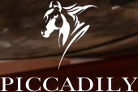

**[Image: ec836cff-71a2-465e-a90c-12508fba0df2.pdf-0002-00.png (170x114, 31.9KB)]**

Q1 FY2025-26 Earnings Presentation 

**[Image: ec836cff-71a2-465e-a90c-12508fba0df2.pdf-0002-02.png (21x25, 0.6KB)]**

<!-- Start of picture text -->
2 <!-- End of picture text -->

PICCADILY EARNINGS PRESENTATION @ 2025-26 

**[Image: ec836cff-71a2-465e-a90c-12508fba0df2.pdf-0003-00.png (170x114, 10.1KB)]**

## Disclaimer 

This presentation may include forward-looking statements regarding our Company’s future performance, including sales, revenues, earnings, strategic initiatives and market positioning. These statements are based on management’s current expectations but are subject to uncertainties such as economic fluctuations, evolving consumer preferences, regulatory changes, and competitive dynamics that may cause actual results to differ. 

While  we remain focused on excellence, innovation, and leadership, the future is shaped by both opportunities and uncertainties. We undertake no obligation to update these statements as conditions evolve. 

FY  refers to the 12 month period from  April 1 to March 31. Q1 FY2025-26 is the period April 1, 2025 to June 30, 2025 

3 

PICCADILY EARNINGS PRESENTATION @ 2025-26 

## Management’s Message 

During Q1, revenue from distillery products grew 37% YoY and IMFL volumes grew 38.6% YoY. In line with our focus on the distillery business and within it on IMFL, we launched 3 new products in Q1 – Indri Agneya, Indri Dubai City Series Edition and Cashmir, a premium Vodka. Whistler, our blended whisky, was repositioned and repackaged during the quarter and has been very well received in the market. In fact, all our products continue to find favour with customers and it is witnessed in IMFL volumes growing quarter on quarter. Expansions at Indri, Haryana, Chhattisgarh and Portvadie, Scotland are on track. The increase in capacity will provide support to existing and planned products while we strengthen domestic and internal distribution to take care of our future plans. Harvindar Chopra Managing Director 

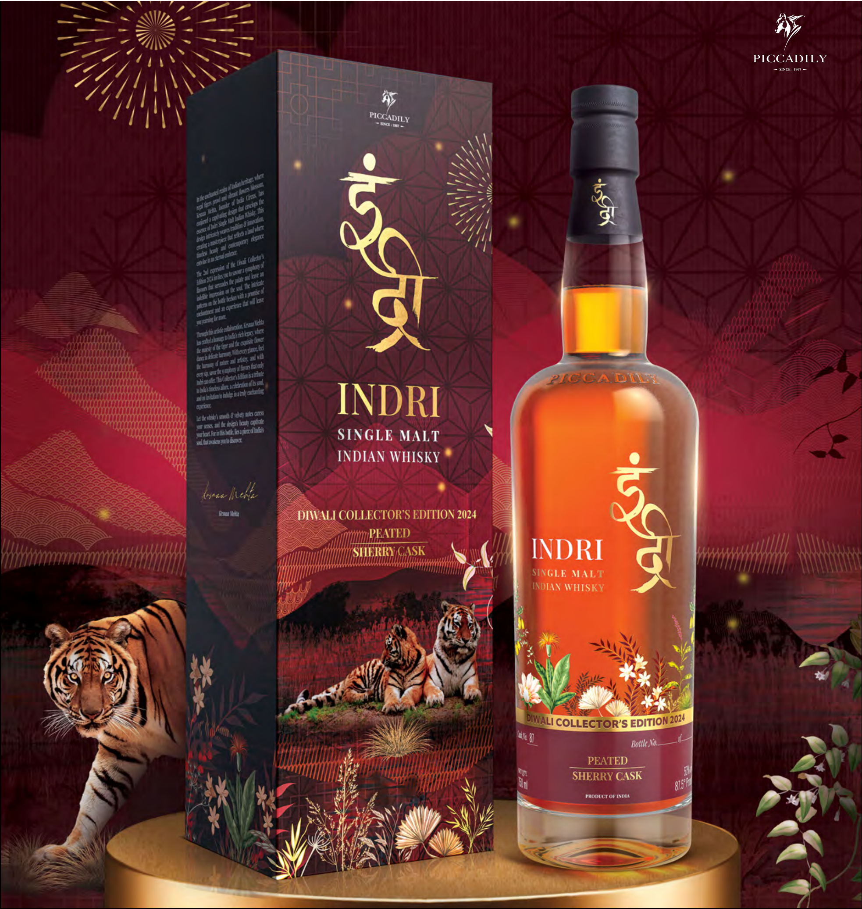

**[Image: ec836cff-71a2-465e-a90c-12508fba0df2.pdf-0004-02.png (1966x2072, 6912.4KB)]**

**4** 

PICCADILY EARNINGS PRESENTATION @ 2025-26 

**[Image: ec836cff-71a2-465e-a90c-12508fba0df2.pdf-0005-00.png (170x114, 6.6KB)]**

Q1 FY2025-26 Performance Highlights 

5 

PICCADILY EARNINGS PRESENTATION @ 2025-26 

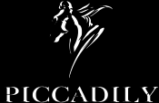

**[Image: ec836cff-71a2-465e-a90c-12508fba0df2.pdf-0006-00.png (175x114, 5.6KB)]**

- Q1 FY2025-26 Highlights: 

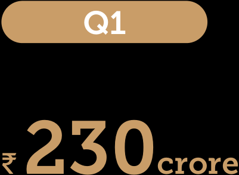

**[Image: ec836cff-71a2-465e-a90c-12508fba0df2.pdf-0006-02.png (401x293, 10.4KB)]**

<!-- Start of picture text -->
Q1 J 230crore <!-- End of picture text -->

**[Image: ec836cff-71a2-465e-a90c-12508fba0df2.pdf-0006-03.png (76x76, 2.2KB)]**

**[Image: ec836cff-71a2-465e-a90c-12508fba0df2.pdf-0006-04.png (170x82, 4.7KB)]**

<!-- Start of picture text -->
9.9% Y-o-Y growth <!-- End of picture text -->

**[Image: ec836cff-71a2-465e-a90c-12508fba0df2.pdf-0006-05.png (316x155, 6.6KB)]**

<!-- Start of picture text -->
J 19crore PAT <!-- End of picture text -->

**[Image: ec836cff-71a2-465e-a90c-12508fba0df2.pdf-0006-06.png (76x76, 2.2KB)]**

**[Image: ec836cff-71a2-465e-a90c-12508fba0df2.pdf-0006-07.png (209x82, 5.5KB)]**

<!-- Start of picture text -->
32.2%* Y-o-Y growth <!-- End of picture text -->

**[Image: ec836cff-71a2-465e-a90c-12508fba0df2.pdf-0006-08.png (324x157, 8.1KB)]**

<!-- Start of picture text -->
J 39crore EBITDA <!-- End of picture text -->

**[Image: ec836cff-71a2-465e-a90c-12508fba0df2.pdf-0006-09.png (76x76, 2.2KB)]**

**[Image: ec836cff-71a2-465e-a90c-12508fba0df2.pdf-0006-10.png (182x82, 5.6KB)]**

<!-- Start of picture text -->
36.4% Y-o-Y growth <!-- End of picture text -->

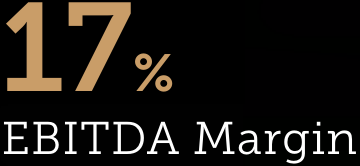

**[Image: ec836cff-71a2-465e-a90c-12508fba0df2.pdf-0006-11.png (360x166, 8.5KB)]**

<!-- Start of picture text -->
17% EBITDA Margin <!-- End of picture text -->

**[Image: ec836cff-71a2-465e-a90c-12508fba0df2.pdf-0006-12.png (76x76, 2.4KB)]**

330 bps 

J 2.00 

**[Image: ec836cff-71a2-465e-a90c-12508fba0df2.pdf-0006-15.png (76x75, 2.3KB)]**

31.6% 

## Financial Performance 

#### Standalone Profit & loss 

|Standalone Financials|Q|1|Y-o-Y|Q4|Q-o-Q|12 M|onths|Y-o-Y|
|---|---|---|---|---|---|---|---|---|
|Particular (Figures inJCr)|FY26|FY25|Growth (%)|FY25|Growth (%)|FY25|FY24|Growth (%)|
|Revenue from DistilleryVertical|162.8|119.2|36.6%|148.7|9.5%|636.8|552.8|15.2%|
|Revenue from Sugar Vertical|66.2|89.1|-25.8%|122.9|-46.2%|249.5|275.3|-9.4%|
|Revenue from Operations|229|208.4|9.9%|271.6|-15.7%|886.3|828.1|7.0%|
|Other Income|0.7|0.6|9.6%|2.2|-69.9%|6.6|0.8|702%|
|Total Income|229.7|209|9.9%|273.9|-16.1%|892.8|828.9|7.7%|
|Expenses|||||||||
|Cost of Materials Consumed|56.9|38.4|48.0%|236.4|-75.9%|417.2|364.4|14.5%|
|Changes In Inventories|55.5|72.4|-23.4%|-136.0|-140.8%|-88.9|-7.5|1086.2%|
|Excise DutyOn Sale Of Goods|15.1|12.7|18.9%|16.4|-8.0%|68.1|48.7|39.9%|
|Employee Benefts Expense|11.7|8.1|44.2%|15.1|-22.5%|44.0|32.6|35.3%|
|Power, Fuel etc.|9.9|6.7|48.0%|6.1|62.3%|29.1|33.0|-11.8%|
|Other Expenses|41.6|42.0|-1.0%|67.5|-38.4%|231.8|205.1|13.0%|
|Total expenses|190.7|180.4|5.7%|205.6|-7.3%|701.4|676.3|3.7%|
|EBITDA|39.0|28.6|36.4%|68.3|-42.9%|191.4|152.6|25.4%|
|EBITDA Margin|17.0%|13.7%|330 bps|24.9%|-790 bps|21.4%|18.4%|300 bps|

7 

PICCADILY EARNINGS PRESENTATION @ 2025-26 

### Financial Performance contd... 

|Standalone Financials|Q|1|Y-o-Y|Q4|Q-o-Q|12 M|onths|Y-o-Y|
|---|---|---|---|---|---|---|---|---|
|Particular (Figures inJCr)|FY26|FY25|Growth (%)|FY25|Growth (%)|FY25|FY24|Growth (%)|
|EBITDA|39.0|28.6|36.3%|68.3|-42.9%|191.4|152.6|25.4%|
|Finance Costs|8.6|4.0|115.5%|9.0|-4.7%|27.8|15.7|77.2%|
|Depreciation And Amortization Expense|5.1|4.6|12.7%|5.0|3.2%|19.4|18.2|6.9%|
|Proft /(Loss) Before Exceptional Items And Tax|25.3|20.1|26.0%|54.3|-53.4%|144.2|118.7|21.4%|
|Exceptional Items|0.0|0.0|620.7%|0.0|-|0.0|-29.4|-100.0%|
|Proft /(Loss) Before Tax (PBT)|25.3|20.1|26.0%|54.3|-53.5%|144.2|148.1|-2.7%|
|PBT Margin|0.1|0.1|140 bps|0.2|-880 bps|0.2|0.2|-180 bps|
|Taxes|6.4|5.8|10.8%|13.9|-54.1%|39.5|33.0|19.7%|
|Tax on Exceptional Item|0.0|0.0|-|0.0|-|0.0|3.0|-100.0%|
|Proft/ (Loss) After Tax (PAT) (excludingexceptional item)|18.9|14.3|32.2%|40.4|-53.2%|104.7|85.7|22.1%|
|PAT Margin (excludingexceptional item)|8.2%|6.8%|140 bps|14.7%|-650 bps|11.7%|10.3%|140 bps|
|Earnings Per Share (EPS) (excluding exceptional item)|2.00|1.52|31.6%|4.28|-53.3%|11.09|9.09|21.9%|

Increase in Finance Costs in Q1 FY 26 due to interest paid on CCD’s 

8 

PICCADILY EARNINGS PRESENTATION @ 2025-26 

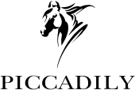

**[Image: ec836cff-71a2-465e-a90c-12508fba0df2.pdf-0009-00.png (170x114, 5.8KB)]**

## Profitability Trends 

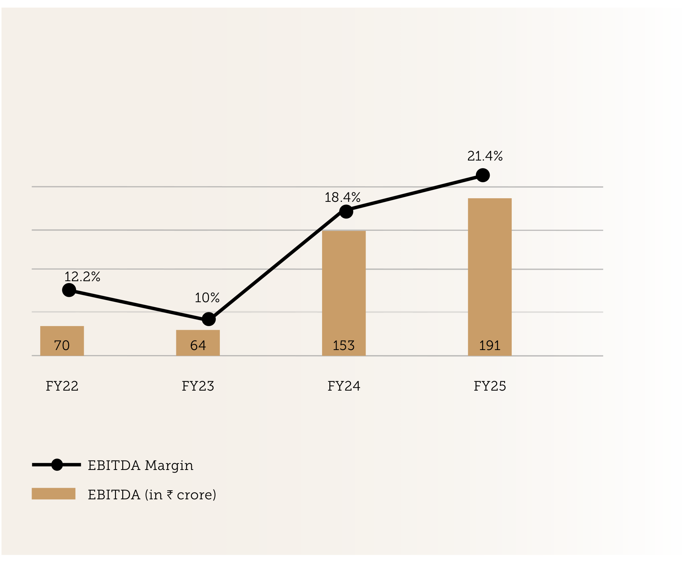

**[Image: ec836cff-71a2-465e-a90c-12508fba0df2.pdf-0009-02.png (1905x1551, 112.0KB)]**

<!-- Start of picture text -->
21.4% 18.4% 12.2% 10% 70 64 153 191 FY22 FY23 FY24 FY25 EBITDA Margin EBITDA (in H crore) <!-- End of picture text -->

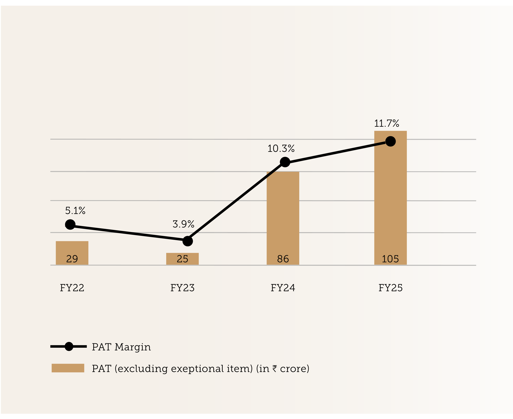

**[Image: ec836cff-71a2-465e-a90c-12508fba0df2.pdf-0009-03.png (1898x1551, 117.4KB)]**

<!-- Start of picture text -->
11.7% 10.3% 5.1% 3.9% 29 25 86 105 FY22 FY23 FY24 FY25 PAT Margin PAT (excluding exeptional item) (in H crore) <!-- End of picture text -->

9 

PICCADILY EARNINGS PRESENTATION @ 2025-26 

## Performance Commentary EBITDA increased by 36.4% 

#### Company 

#### Distillery 

Revenue from operations grew 9.9% YoY 

- Distillery by 36.6% and sugar declined by 25.8% 

EBITDA increased 36.4% YoY 

   - Distillery EBITDA grew 25.8% YoY to H42.9 crore in Q1 FY26 

- EBITDA margin in distillery is 26.3% / IMFL is higher 

- Share of distillery products is 71.2% of Revenue from operations vs 57.2% in Q1 FY25 

- Share of IMFL of Revenue from operations grew to 30.9% vs 30.6% in Q1 FY25 

- Branded Alcobev / IMFL has better margins in premium and luxury category which we are focussing on 

PAT increased 32.2% YoY in line with EBIDTA 

**10** 

PICCADILY EARNINGS PRESENTATION @ 2025-26 

**[Image: ec836cff-71a2-465e-a90c-12508fba0df2.pdf-0011-00.png (170x114, 5.2KB)]**

## Q1 FY2025-26 Business Highlights 

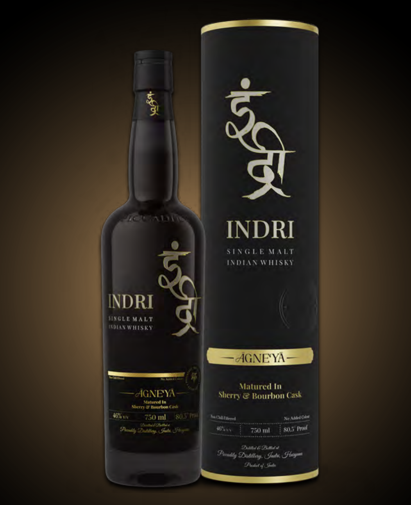

**[Image: ec836cff-71a2-465e-a90c-12508fba0df2.pdf-0011-02.png (1003x1231, 716.6KB)]**

IMFL sales volumes (Indri, Camikara, Whistler & Cashmir) grew 39% YoY 

Whistler grew 102%, Camikara 338% (on a smaller base) 

Indri’s growth momentum continues B2B Malt sales continue to be halted to cater to own IMFL demand 

Products / Expressions launched 

Indri Agneya 

Indri Dubai City Series Edition Cashmir Vodka 

#### Strenghtened distribution 

29 States and UT (incl CSD) in Q1 

Over 18,500 Retail outlets including On Trade in India CSD and Paramilitary focus continues on IMFL Products 28 countries, 16 Indian Duty free and 11 International Duty free - focus continues - to add more 

Participated, domestically and internationally, in Whisky & Spirits shows and events 

Curated events held for Indri and Camikara in Q1 

Products continue to win prestigious international awards 

Maturation capacity enhanced 

Number of Barrels at 75,000 - additional procurement underway 

#### Other updates 

Expansions on track - Indri, Haryana + Chhattisgarh + Portavadie, Scotland 

All warrants aggregating Rs. 50 Crores exercised by investors and converted into equity 

Company has been listed on BSE since 1994. In addition, it listed on NSE on July 2, 2025 

**11** 

PICCADILY EARNINGS PRESENTATION @ 2025-26 

**[Image: ec836cff-71a2-465e-a90c-12508fba0df2.pdf-0012-00.png (170x114, 5.6KB)]**

- Moving Towards Branded and Premium Portfolio 

Over the last four years, we have steadily shifted our revenue profile from bulk commodity-based sales towards branded and premium alcoholic beverages. The focus has progressively shifted towards value-added and branded Indian Made Foreign Liquor (IMFL) products. 

Revenue Composition – Segment-wise (Jcrore) 

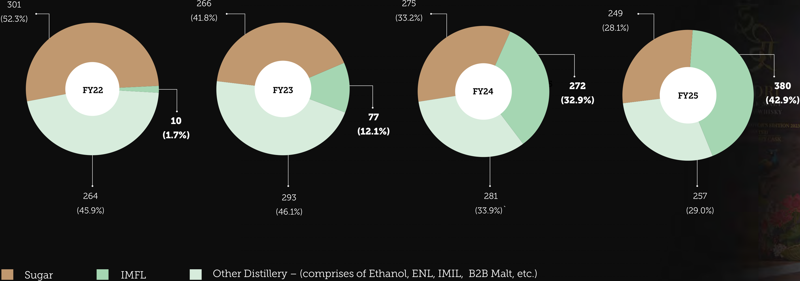

**[Image: ec836cff-71a2-465e-a90c-12508fba0df2.pdf-0012-04.png (3193x1126, 327.4KB)]**

<!-- Start of picture text -->
301 266 275 249 (52.3%) (41.8%) (33.2%) (28.1%) FY24 FY25 272 380 FY22 FY23 FY24 FY25 (32.9%) (42.9%) 77 10 (12.1%) (1.7%) 264 293 281 257 (45.9%) (46.1%) (33.9%)` (29.0%) Sugar IMFL Other Distillery – (comprises of Ethanol, ENL, IMIL,  B2B Malt, etc.) <!-- End of picture text -->

**12** 

PICCADILY EARNINGS PRESENTATION @ 2025-26 

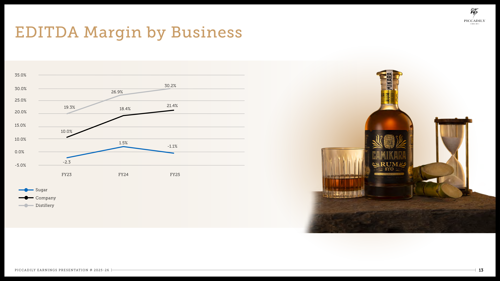

**[Image: ec836cff-71a2-465e-a90c-12508fba0df2.pdf-0013-00.png (4000x2250, 2277.4KB)]**

<!-- Start of picture text -->
EDITDA Margin by Business 35.0% 30.2% 30.0% 26.9% 25.0% 21.4% 19.3% 18.4% 20.0% 15.0% 10.0% 10.0% 1.5% -1.1% 0.0% -2.3 -5.0% FY23 FY24 FY25 Sugar Company Distillery PICCADILY EARNINGS PRESENTATION @ 2025-26 13 <!-- End of picture text -->

**[Image: ec836cff-71a2-465e-a90c-12508fba0df2.pdf-0013-01.png (4000x2250, 2277.4KB)]**

<!-- Start of picture text -->
EDITDA Margin by Business 35.0% 30.2% 30.0% 26.9% 25.0% 21.4% 19.3% 18.4% 20.0% 15.0% 10.0% 10.0% 1.5% -1.1% 0.0% -2.3 -5.0% FY23 FY24 FY25 Sugar Company Distillery PICCADILY EARNINGS PRESENTATION @ 2025-26 13 <!-- End of picture text -->

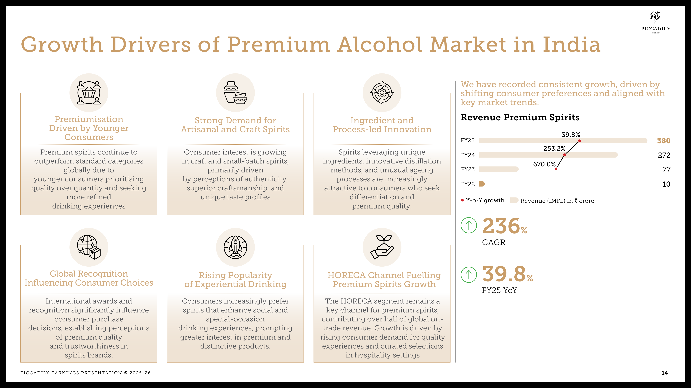

**[Image: ec836cff-71a2-465e-a90c-12508fba0df2.pdf-0014-00.png (4000x2250, 558.2KB)]**

<!-- Start of picture text -->
Growth Drivers of Premium Alcohol Market in India We have recorded consistent growth, driven by shifting consumer preferences and aligned with key market trends. Revenue Premium S irits Premiumisation  p Strong Demand for  Ingredient and Driven by Younger  Process-led Innovation Artisanal and Craft Spirits 39.8% Consumers FY25 380 253.2% Premium spirits continue to  Consumer interest is growing  Spirits leveraging unique  FY24 272 outperform standard categories  in craft and small-batch spirits,  ingredients, innovative distillation 670.0% globally due to  primarily driven  methods, and unusual ageing  FY23 77 younger consumers prioritising  by perceptions of authenticity,  processes are increasingly FY22 10 quality over quantity and seeking  superior craftsmanship, and   attractive to consumers who seek more refined  unique taste profiles  differentiation and   X Y-o-Y growth Revenue (IMFL) in H crore drinking experiences premium quality. 236% CAGR Global Recognition Rising Popularity  HORECA Channel Fuelling 39.8% Influencing Consumer Choices of Experiential Drinking Premium Spirits Growth FY25 YoY International awards and  Consumers increasingly prefer  The HORECA segment remains a recognition significantly influence  spirits that enhance social and  key channel for premium spirits, consumer purchase  special-occasion  contributing over half of global on- decisions, establishing perceptions  drinking experiences, prompting  trade revenue. Growth is driven by of premium quality   greater interest in premium and  rising consumer demand for quality and trustworthiness in  distinctive products. experiences and curated selections spirits brands. in hospitality settings PICCADILY EARNINGS PRESENTATION @ 2025-26 14 <!-- End of picture text -->

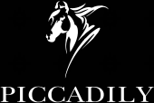

**[Image: ec836cff-71a2-465e-a90c-12508fba0df2.pdf-0015-00.png (170x114, 6.2KB)]**

# Company Overview 

15 

PICCADILY EARNINGS PRESENTATION @ 2025-26 

**[Image: ec836cff-71a2-465e-a90c-12508fba0df2.pdf-0016-00.png (170x114, 5.4KB)]**

## Introduction 

Crafting Excellence, Redefining India’s Premium Alco-Bev Landscape 

Piccadily Agro Industries Ltd. (PAIL) is a name synonymous with heritage, craftsmanship and innovation. Established in 1994, it has grown to become India’s largest independent producer of malt spirits. Our portfolio includes single malt whiskies, cane juice rum and a range of IMFL brands, setting new benchmarks in quality and innovation. Beyond spirits, we manufacture Ethanol, Extra Neutral Alcohol (ENA), DDGS and white crystal sugar. 

With a diverse portfolio of premium alco-bev brands and more products in the offing we endeavour to define the future of niche and premium Indian alco-bev spirits in India and overseas. We plan to capitalise organic and inorganic growth opportunities to achieve the above. 

##### Crafting the Future 

We operate across two strategic pillars, each driven by a commitment to excellence and innovation: 

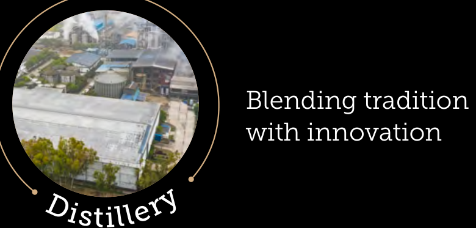

**[Image: ec836cff-71a2-465e-a90c-12508fba0df2.pdf-0016-07.png (780x373, 200.3KB)]**

<!-- Start of picture text -->
Blending tradition with innovation Distillery <!-- End of picture text -->

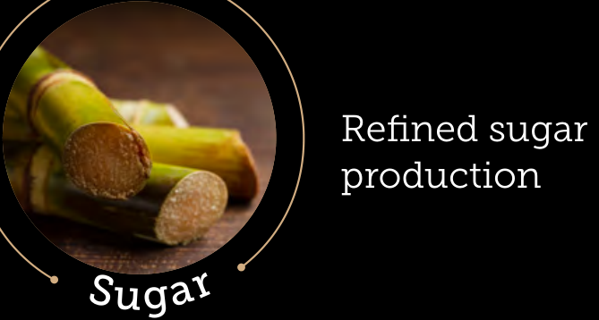

**[Image: ec836cff-71a2-465e-a90c-12508fba0df2.pdf-0016-08.png (669x358, 156.9KB)]**

<!-- Start of picture text -->
Refined sugar production ug S a r <!-- End of picture text -->

White Crystal Sugar Capacity of 5,000 TCD Collaborating with 5,000+ farmers for sustainable sugarcane sourcing 

Extra Neutral Alcohol (ENA) and Ethanol Capacity of 78 KLPD* Contributing to sustainable energy solutions and a greener future 

Malt Capacity of 12 KLPD* Setting new standards in quality and refinement 

At the heart of our operations lies a state-of-the-art manufacturing facility in Indri, Haryana, spanning 168 acres. This world-class facility seamlessly integrates cutting-edge technology to produce the above. 

*Excludes on-going expansions 

**16** 

PICCADILY EARNINGS PRESENTATION @ 2025-26 

**[Image: ec836cff-71a2-465e-a90c-12508fba0df2.pdf-0017-00.png (170x114, 5.4KB)]**

### Introduction contd... 

##### Architects of Premium Spirits 

Piccadily Agro is at the forefront of India’s evolving spirits landscape, by driving premiumization and setting new benchmarks in craftsmanship and innovation. With an insightful grasp of market dynamics and a steadfast dedication to fine craftsmanship, we cater to a select clientele who value not only quality but the artistry of innovation. 

Through our flagship brands, we deliver more than just spirits; we offer an experience that transcends the ordinary where timeless tradition meets contemporary mastery. Each creation is a testament to our relentless pursuit of excellence, refining the very essence of premium and redefining the art of indulgence. 

12 KLPD* Malt Plant 

78 KLPD* Ethanol / ENA Plant 18,500+ PAN India Retail Outlets including On Trade 

28 Countries *Excludes on-going expansions 

##### A Portfolio of Distinction 

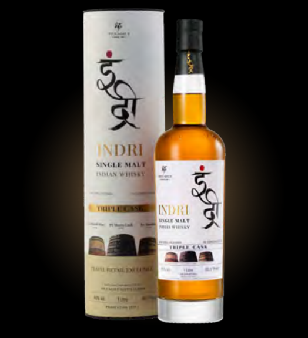

**[Image: ec836cff-71a2-465e-a90c-12508fba0df2.pdf-0017-09.png (524x576, 262.3KB)]**

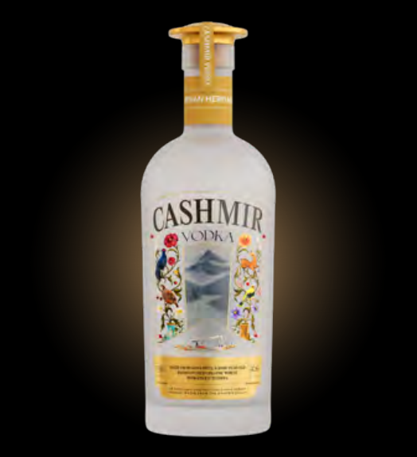

**[Image: ec836cff-71a2-465e-a90c-12508fba0df2.pdf-0017-10.png (524x575, 173.0KB)]**

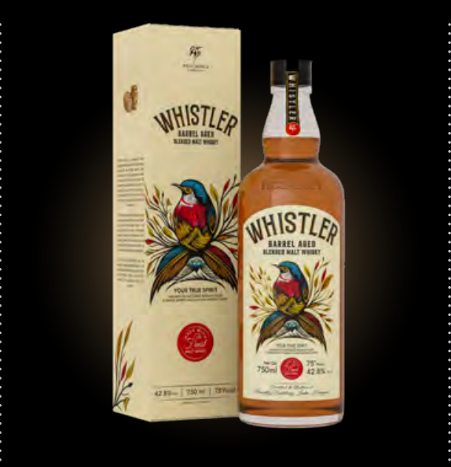

**[Image: ec836cff-71a2-465e-a90c-12508fba0df2.pdf-0017-11.png (574x594, 322.8KB)]**

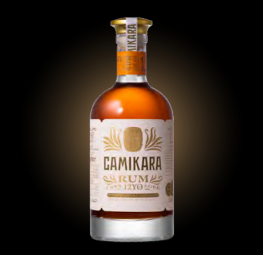

**[Image: ec836cff-71a2-465e-a90c-12508fba0df2.pdf-0017-12.png (524x507, 167.6KB)]**

Single Malt Whisky 

Single Malt Premium Blended Malt Vodka Whisky Sugarcane Juice Whisky Rum Indri, our flagship brand, a Camikara, a bold innovation Whistler is a barrel aged India’s 1st Premium Vodka trailblazer in redefining India’s that reimagines the spirit of blended malt whisky offering Made From Sona Moti, premium spirits landscape rum, blending creativity with a sophisticated balance of A  2000-Year-Old Rediscovered with unparalleled elegance and excellence. tradition and modernity. Organic Wheat Indigenous To character. India 

**17** 

PICCADILY EARNINGS PRESENTATION @ 2025-26 

2025 

**[Image: ec836cff-71a2-465e-a90c-12508fba0df2.pdf-0018-01.png (170x114, 5.8KB)]**

## Our Journey 

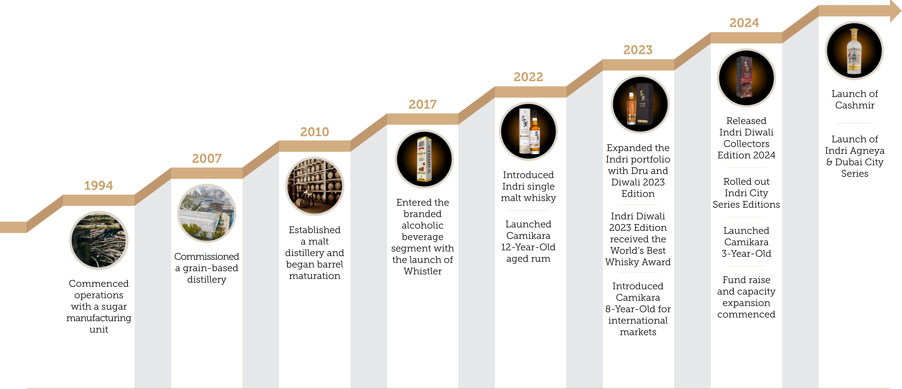

**[Image: ec836cff-71a2-465e-a90c-12508fba0df2.pdf-0018-03.png (3934x1697, 1040.8KB)]**

<!-- Start of picture text -->
2024 2023 2022 Launch of 2017 Cashmir Released 2010 Indri Diwali Launch of Collectors Expanded the Indri Agneya Edition 2024 2007 Indri portfolio & Dubai City with Dru and Introduced  Series Diwali 2023  Rolled out 1994 Indri single Edition Indri City malt whisky Entered the Series Editions branded Indri Diwali alcoholic  Launched 2023 Edition Established  Launched beverage  Camikara  received the a malt  Camikara segment with  12-Year-Old  World’s Best distillery and  3-Year-Old Commissioned the launch of  aged rum Whisky Award began barrel a grain-based  Whistler maturation distillery Fund raise Commenced Introduced and capacity operations  Camikara expansion with a sugar  8-Year-Old for commenced manufacturing  international unit markets <!-- End of picture text -->

18 

PICCADILY EARNINGS PRESENTATION @ 2025-26 

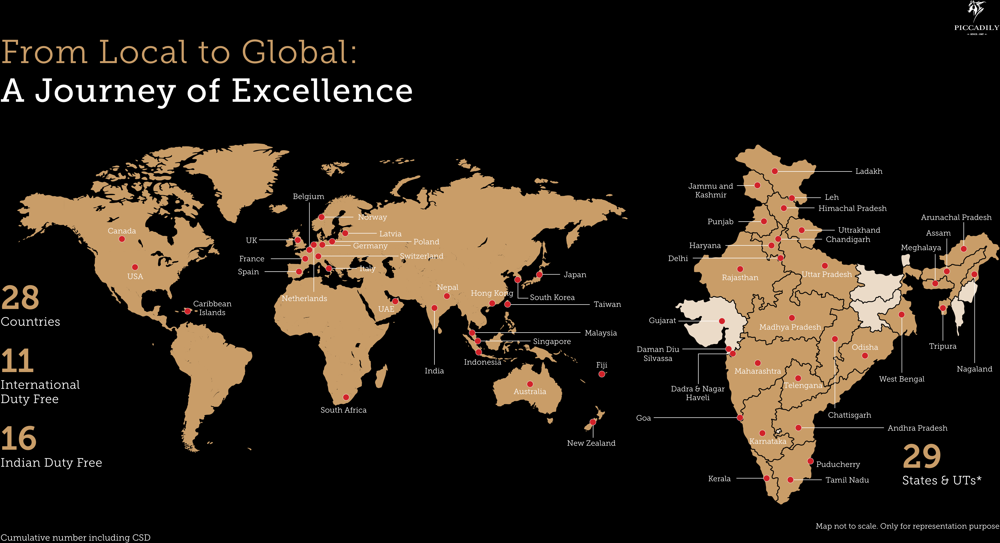

**[Image: ec836cff-71a2-465e-a90c-12508fba0df2.pdf-0019-00.png (3768x2049, 596.7KB)]**

<!-- Start of picture text -->
From Local to Global: A Journey of Excellence Ladakh Jammu and Kashmir Belgium Leh Himachal Pradesh Norway Arunachal Pradesh Punjab Canada Uttrakhand Latvia Assam UK Poland Chandigarh Germany Haryana Meghalaya Switzerland France Delhi Italy USA Spain Japan Rajasthan Uttar Pradesh Nepal Hong Kong Netherlands South Korea Caribbean  Taiwan 28 UAE Islands Countries Gujarat Madhya Pradesh Malaysia Singapore Odisha Tripura Daman Diu Silvassa Indonesia Fiji 11 India Maharashtra Nagaland West Bengal International  Telengana Australia Dadra & Nagar Duty Free Haveli South Africa Goa Chattisgarh Andhra Pradesh New Zealand Karnataka 16 Indian Duty Free Puducherry 29 Kerala Tamil Nadu States & UTs* Map not to scale. Only for representation purpose Cumulative number including CSD <!-- End of picture text -->

**19** 

PICCADILY EARNINGS PRESENTATION @ 2025-26 

**[Image: ec836cff-71a2-465e-a90c-12508fba0df2.pdf-0020-00.png (170x114, 5.4KB)]**

## Malt Manufacturing Process 

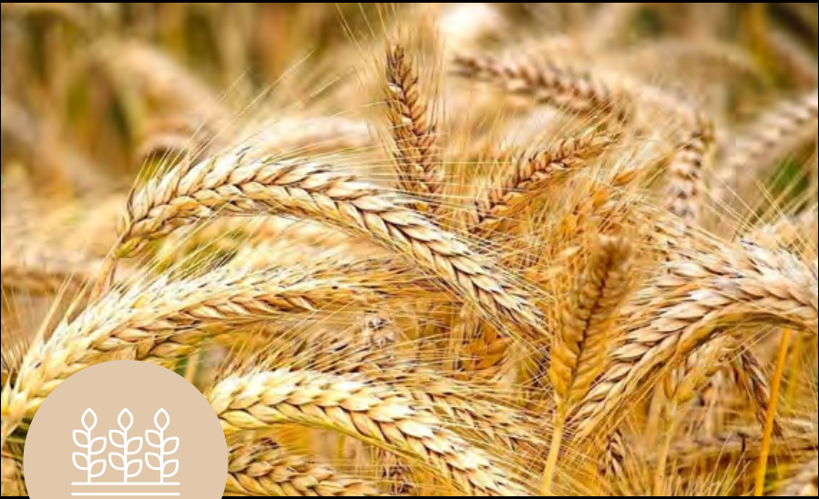

**[Image: ec836cff-71a2-465e-a90c-12508fba0df2.pdf-0020-02.png (899x548, 1250.1KB)]**

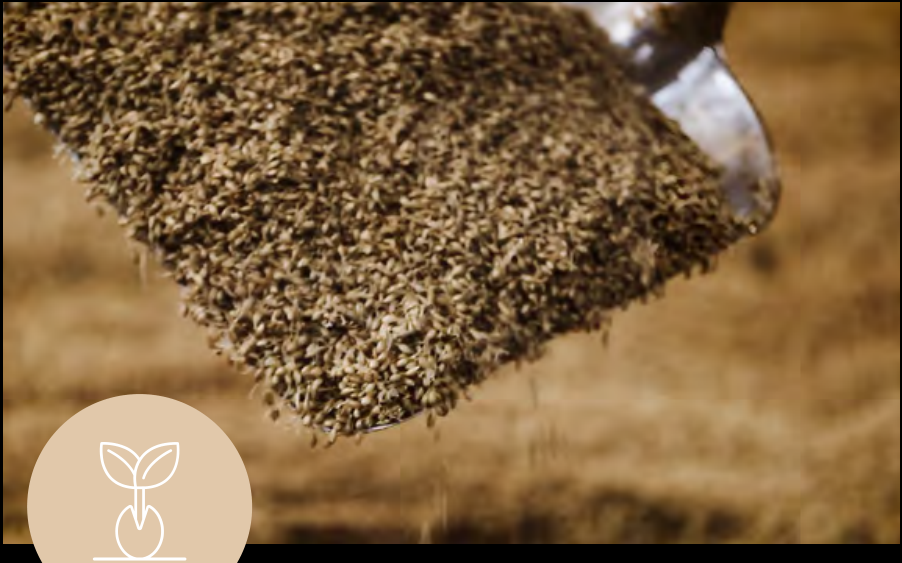

**[Image: ec836cff-71a2-465e-a90c-12508fba0df2.pdf-0020-03.png (902x563, 939.6KB)]**

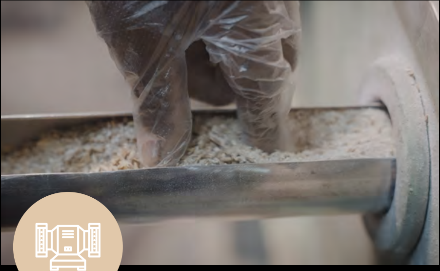

**[Image: ec836cff-71a2-465e-a90c-12508fba0df2.pdf-0020-04.png (902x555, 596.7KB)]**

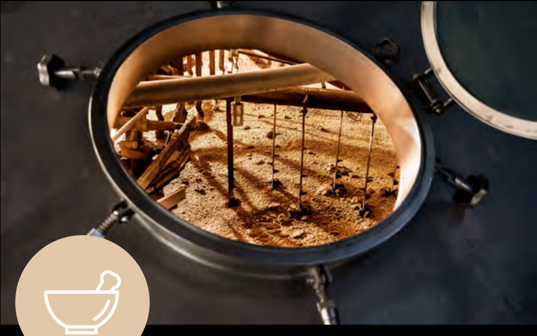

**[Image: ec836cff-71a2-465e-a90c-12508fba0df2.pdf-0020-05.png (899x563, 734.0KB)]**

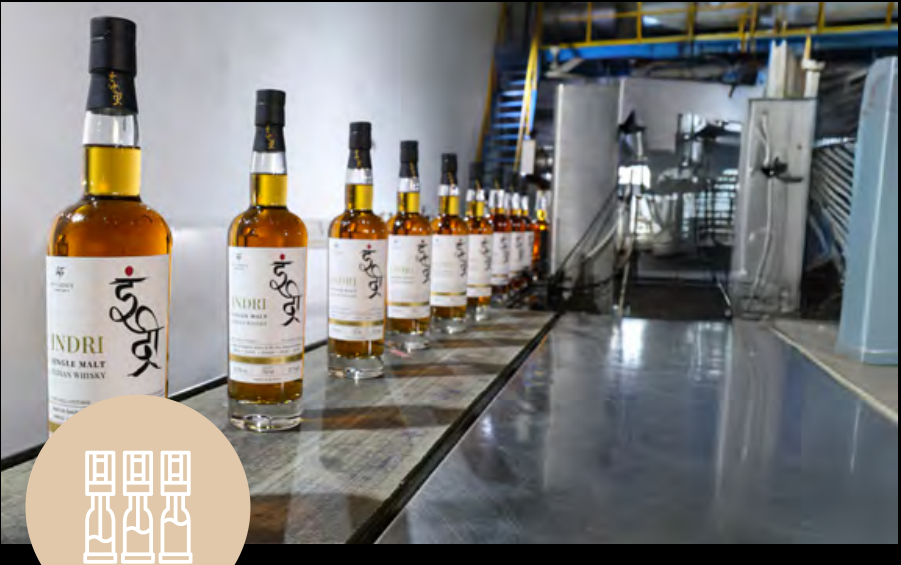

**[Image: ec836cff-71a2-465e-a90c-12508fba0df2.pdf-0020-06.png (901x565, 858.5KB)]**

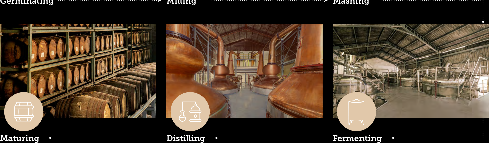

**[Image: ec836cff-71a2-465e-a90c-12508fba0df2.pdf-0020-07.png (2809x824, 3245.6KB)]**

<!-- Start of picture text -->
Maturing Distilling Fermenting <!-- End of picture text -->

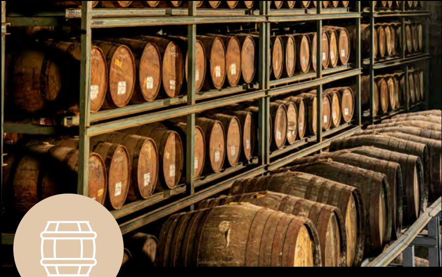

**[Image: ec836cff-71a2-465e-a90c-12508fba0df2.pdf-0020-08.png (901x565, 1113.1KB)]**

**20** 

PICCADILY EARNINGS PRESENTATION @ 2025-26 

**[Image: ec836cff-71a2-465e-a90c-12508fba0df2.pdf-0021-00.png (170x114, 5.4KB)]**

## Indri - Raising The Bar: A Spirit Designed to Inspire 

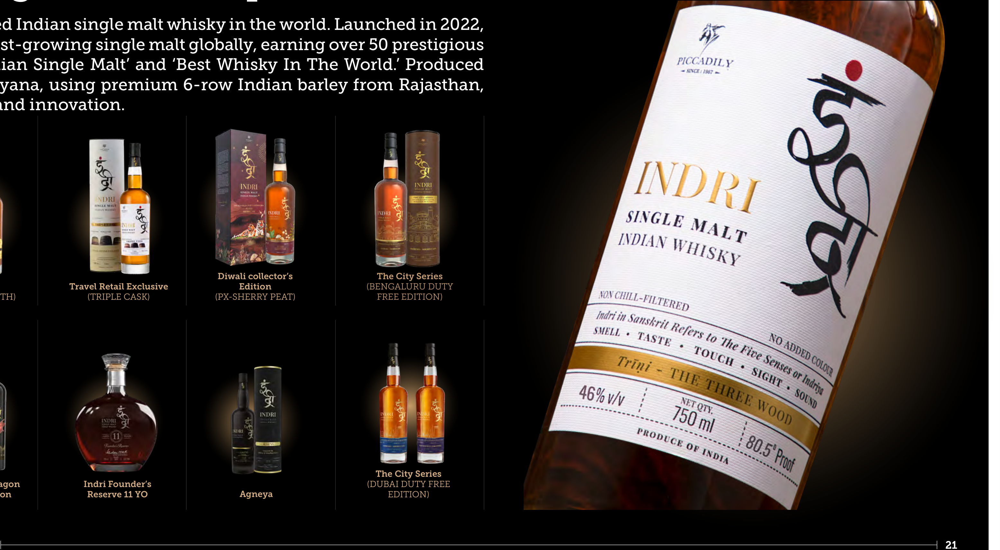

**[Image: ec836cff-71a2-465e-a90c-12508fba0df2.pdf-0021-02.png (3111x1712, 3949.4KB)]**

<!-- Start of picture text -->
Diwali collector’s  The City Series Travel Retail Exclusive Edition (BENGALURU DUTY (TRIPLE CASK) (PX-SHERRY PEAT) FREE EDITION) The City Series Indri Founder’s  (DUBAI DUTY FREE Reserve 11 YO Agneya EDITION) 21 <!-- End of picture text -->

Indri is one of the most awarded Indian single malt whisky in the world. Launched in 2022, it has quickly become the fastest-growing single malt globally, earning over 50 prestigious accolades, including ‘Best Indian Single Malt’ and ‘Best Whisky In The World.’ Produced in Indri, a small village in Haryana, using premium 6-row Indian barley from Rajasthan, showcases Indian excellence and innovation. 

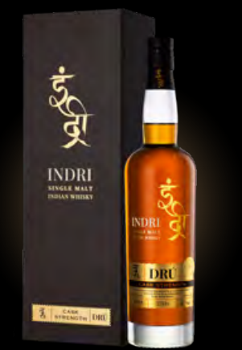

**[Image: ec836cff-71a2-465e-a90c-12508fba0df2.pdf-0021-04.png (301x435, 144.9KB)]**

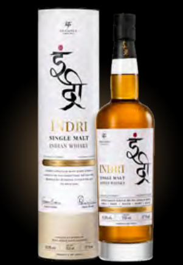

**[Image: ec836cff-71a2-465e-a90c-12508fba0df2.pdf-0021-05.png (301x436, 161.7KB)]**

Diwali collector’s Trini DRU Travel Retail Exclusive Edition (THE THREE WOOD) (CASK STRENGTH) (TRIPLE CASK) (PX-SHERRY PEAT) 

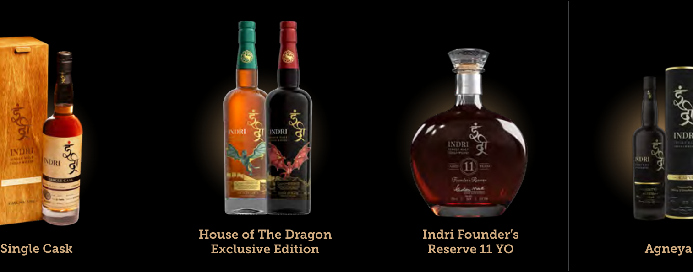

**[Image: ec836cff-71a2-465e-a90c-12508fba0df2.pdf-0021-07.png (1513x595, 582.5KB)]**

<!-- Start of picture text -->
House of The Dragon  Indri Founder’s Single Cask  Exclusive Edition Reserve 11 YO Agneya <!-- End of picture text -->

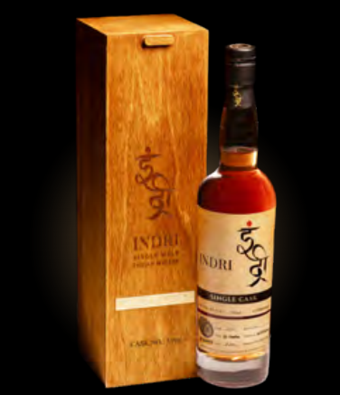

**[Image: ec836cff-71a2-465e-a90c-12508fba0df2.pdf-0021-08.png (376x437, 209.1KB)]**

PICCADILY EARNINGS PRESENTATION @ 2025-26 

**[Image: ec836cff-71a2-465e-a90c-12508fba0df2.pdf-0022-00.png (170x114, 5.4KB)]**

Camikara is India’s Camikara, derived from the Sanskrit word meaning “liquid gold,” first Pure Cane Juice Premium Aged Rum, redefining the country’s rum legacy. Aged in American oak barrels, Camikara stands apart with no added colors, flavors, sugar, or spices, delivering a truly authentic and refined experience. 

##### Camikara RUM 12 YO 

##### Camikara RUM 8 YO 

##### Camikara RUM 3 YO 

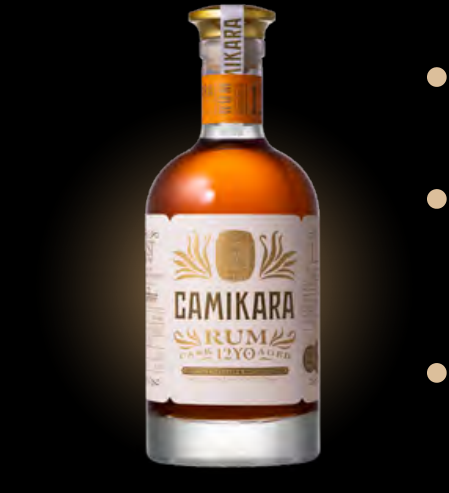

**[Image: ec836cff-71a2-465e-a90c-12508fba0df2.pdf-0022-05.png (449x493, 170.4KB)]**

Aged for 12 years in American oak barrels. 

Bottled at 50% ABV, offering a rich, complex, and smooth tasting experience. 

Available in select Indian and international markets. 

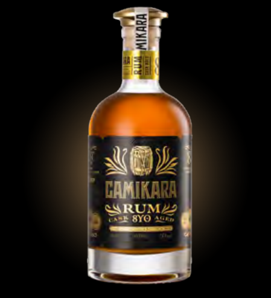

**[Image: ec836cff-71a2-465e-a90c-12508fba0df2.pdf-0022-09.png (449x493, 176.4KB)]**

A rare, 8-year-aged pure cane juice rum, offering a deep and aromatic profile. 

Aged in American oak barrels for a well-rounded character, with an ABV of 42.8%, delivering a smooth and balanced whisky experience. 

Available in select international markets. 

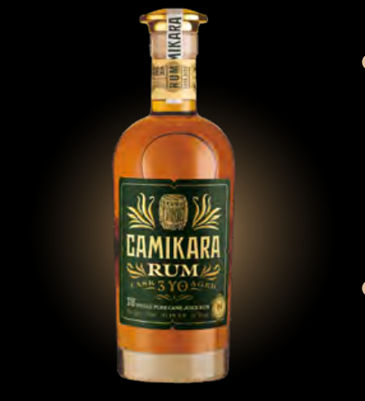

**[Image: ec836cff-71a2-465e-a90c-12508fba0df2.pdf-0022-13.png (449x493, 160.9KB)]**

Aged for 3 years in American oak barrels and bottled at 42.8% ABV, shattering the myth that rum is only a seasonal spirit. 

Launched Pan-India in On-Trade channels. 

Recognitions 

Recognitions 

Recognitions 

The 1st Indian Rum to ever win a gold medal at the prestigious IWSC wards 2023, with 95 points. 2023 Bartender Spirits awards - GOLD. 

The Spirits Business Global RUM & CACHACA Masters - GOLD 2024. 

The 1st Indian Rum to Ever win a Gold Medal at the Global RUM & CACHACA Masters 2024 USA Spirits ratings - Silver 2024 

The 1st Indian Rum to ever win a Silver medal at the Global RUM & Cachaca Masters 2024 

Camikara 3 YO: Bronze at London Spirits Competition 

**22** 

PICCADILY EARNINGS PRESENTATION @ 2025-26 

**[Image: ec836cff-71a2-465e-a90c-12508fba0df2.pdf-0023-00.png (170x114, 5.4KB)]**

## Camikara Mixers 

Introducing the all-new Camikara NonAlcoholic Mixers in two vibrant flavours – Mojito and Mai Tai. Expertly crafted to elevate every pour, these tropical mixers capture the essence of iconic cocktails. Camikara mixers deliver a premium, bar-quality experience— bringing the spirit of indulgence home, one exquisite sip at a time. 

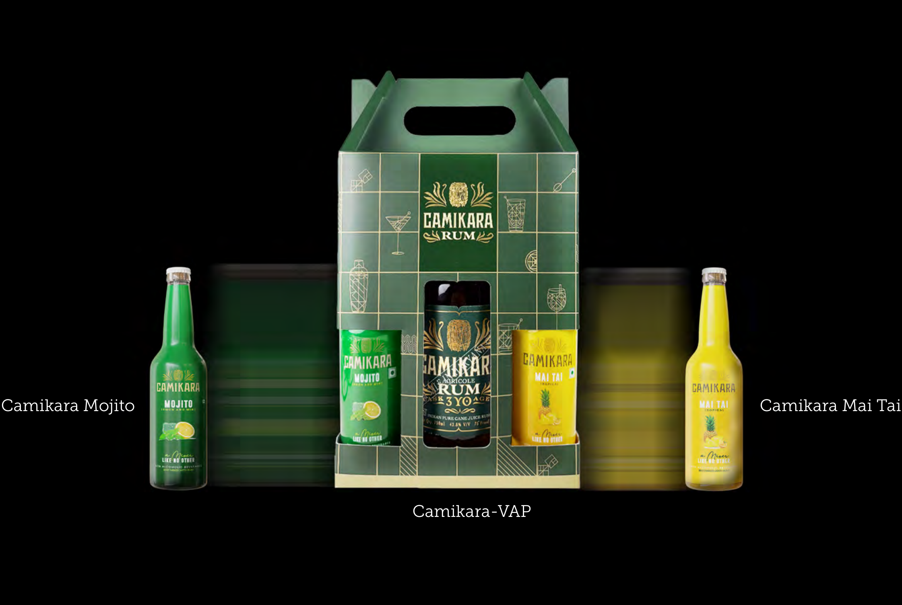

**[Image: ec836cff-71a2-465e-a90c-12508fba0df2.pdf-0023-03.png (2241x1504, 1767.9KB)]**

<!-- Start of picture text -->
Camikara Mojito Camikara Mai Tai Camikara-VAP <!-- End of picture text -->

**23** 

PICCADILY EARNINGS PRESENTATION @ 2025-26 

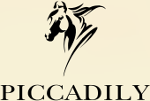

**[Image: ec836cff-71a2-465e-a90c-12508fba0df2.pdf-0024-00.png (170x114, 6.7KB)]**

24 

**[Image: ec836cff-71a2-465e-a90c-12508fba0df2.pdf-0025-00.png (170x114, 5.4KB)]**

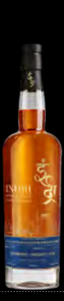

**[Image: ec836cff-71a2-465e-a90c-12508fba0df2.pdf-0025-01.png (92x432, 60.8KB)]**

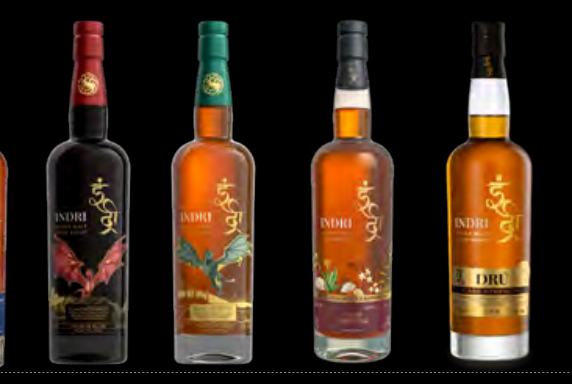

**[Image: ec836cff-71a2-465e-a90c-12508fba0df2.pdf-0025-02.png (572x384, 242.8KB)]**

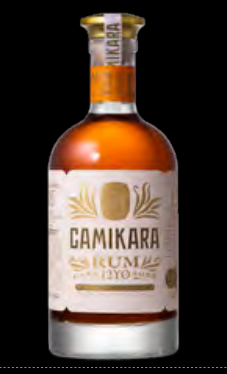

**[Image: ec836cff-71a2-465e-a90c-12508fba0df2.pdf-0025-03.png (227x374, 93.9KB)]**

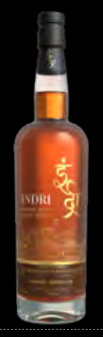

**[Image: ec836cff-71a2-465e-a90c-12508fba0df2.pdf-0025-04.png (115x376, 58.9KB)]**

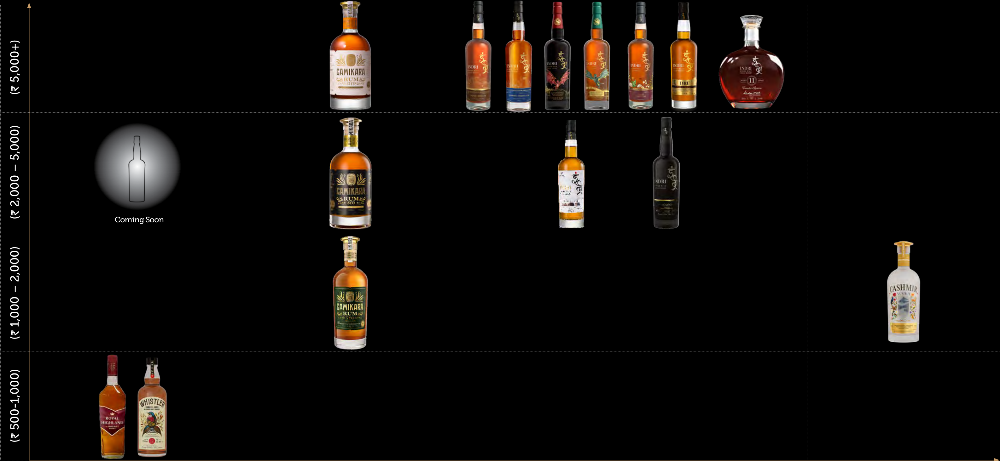

**[Image: ec836cff-71a2-465e-a90c-12508fba0df2.pdf-0025-05.png (3172x1464, 1208.9KB)]**

<!-- Start of picture text -->
Coming Soon  5,000+) J (  2,000 – 5,000) J (  1,000 – 2,000) J (  500-1,000) J ( <!-- End of picture text -->

**[Image: ec836cff-71a2-465e-a90c-12508fba0df2.pdf-0025-06.png (476x384, 6.7KB)]**

<!-- Start of picture text -->
ULTRA - LUXURY <!-- End of picture text -->

**[Image: ec836cff-71a2-465e-a90c-12508fba0df2.pdf-0025-07.png (309x384, 5.2KB)]**

<!-- Start of picture text -->
LUXURY <!-- End of picture text -->

**[Image: ec836cff-71a2-465e-a90c-12508fba0df2.pdf-0025-08.png (351x384, 5.6KB)]**

<!-- Start of picture text -->
PREMIUM <!-- End of picture text -->

**[Image: ec836cff-71a2-465e-a90c-12508fba0df2.pdf-0025-09.png (349x384, 5.9KB)]**

<!-- Start of picture text -->
PRESTIGE <!-- End of picture text -->

**25** 

PICCADILY EARNINGS PRESENTATION @ 2025-26 

## Recent Launches 

**[Image: ec836cff-71a2-465e-a90c-12508fba0df2.pdf-0026-01.png (170x114, 7.5KB)]**

Date of launch 23.5.25 

26 

PICCADILY EARNINGS PRESENTATION @ 2025-26 

Date of launch 05.8.25 

27 

PICCADILY EARNINGS PRESENTATION @ 2025-26 

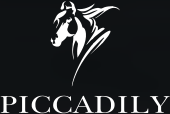

**[Image: ec836cff-71a2-465e-a90c-12508fba0df2.pdf-0028-00.png (170x114, 6.7KB)]**

Date of Launch 24.7.25 

28 

PICCADILY EARNINGS PRESENTATION @ 2025-26 

**[Image: ec836cff-71a2-465e-a90c-12508fba0df2.pdf-0029-00.png (170x114, 5.6KB)]**

## Committed to Our Consumer’s Trust 

Piccadily Becomes 1st Indian Alcobev Company To Adapt NFC Technology To Combat Counterfeiting 

Raising the Benchmark: Piccadily sets a new standard in safety, innovation and consumer protection amid rising counterfeit concerns. Smart Verification: Unlike QR codes, NFC tech lets customers tap bottles to instantly verify authenticity and batch details directly via smartphone - no app required. 

Advanced Security: Each bottle includes 128-bit encrypted, tamper-proof smart labels with a unique digital twin code tech. Blockchain Traceability: Ensures transparency, protects against counterfeiting and bottle reuse to boost consumer trust. 

29 

PICCADILY EARNINGS PRESENTATION @ 2025-26 

**[Image: ec836cff-71a2-465e-a90c-12508fba0df2.pdf-0030-00.png (170x114, 5.4KB)]**

## Charting the Path to Excellence: 

**[Image: ec836cff-71a2-465e-a90c-12508fba0df2.pdf-0030-02.png (97x108, 4.0KB)]**

**[Image: ec836cff-71a2-465e-a90c-12508fba0df2.pdf-0030-03.png (92x86, 1.4KB)]**

Innovate and Elevate 

**[Image: ec836cff-71a2-465e-a90c-12508fba0df2.pdf-0030-05.png (253x103, 5.4KB)]**

<!-- Start of picture text -->
Expand Horizons <!-- End of picture text -->

**[Image: ec836cff-71a2-465e-a90c-12508fba0df2.pdf-0030-06.png (95x95, 3.9KB)]**

**[Image: ec836cff-71a2-465e-a90c-12508fba0df2.pdf-0030-07.png (107x103, 3.3KB)]**

**[Image: ec836cff-71a2-465e-a90c-12508fba0df2.pdf-0030-08.png (297x105, 6.4KB)]**

<!-- Start of picture text -->
Accelerate Growth <!-- End of picture text -->

Financial Stability 

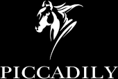

**[Image: ec836cff-71a2-465e-a90c-12508fba0df2.pdf-0031-00.png (170x114, 5.4KB)]**

## Scaling for the Future: 

**[Image: ec836cff-71a2-465e-a90c-12508fba0df2.pdf-0031-02.png (321x339, 17.8KB)]**

**[Image: ec836cff-71a2-465e-a90c-12508fba0df2.pdf-0031-03.png (90x91, 3.1KB)]**

**Indri, Haryana** Expansion underway increase distillery capacity from **78 KLPD** to **220 KLPD** for ENA and from **12 KLPD** to **30 KLPD** for malt. 

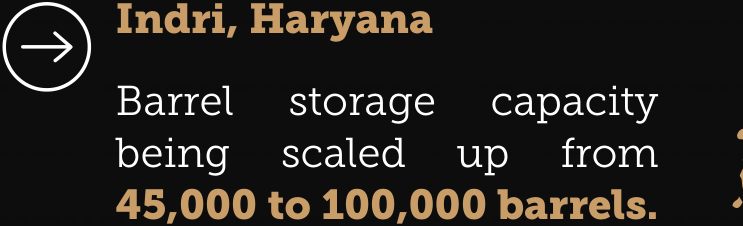

**[Image: ec836cff-71a2-465e-a90c-12508fba0df2.pdf-0031-05.png (743x226, 27.2KB)]**

<!-- Start of picture text -->
Indri, Haryana Barrel  storage  capacity scaled  from being  up 45,000 to 100,000 barrels. <!-- End of picture text -->

**[Image: ec836cff-71a2-465e-a90c-12508fba0df2.pdf-0031-06.png (372x530, 16.0KB)]**

**[Image: ec836cff-71a2-465e-a90c-12508fba0df2.pdf-0031-07.png (114x147, 3.8KB)]**

**Mahasamund, Chhattisgarh** A **210 KLPD** distillery for ENA, 

**[Image: ec836cff-71a2-465e-a90c-12508fba0df2.pdf-0031-09.png (457x38, 9.6KB)]**

<!-- Start of picture text -->
Portavadie, Scotland <!-- End of picture text -->

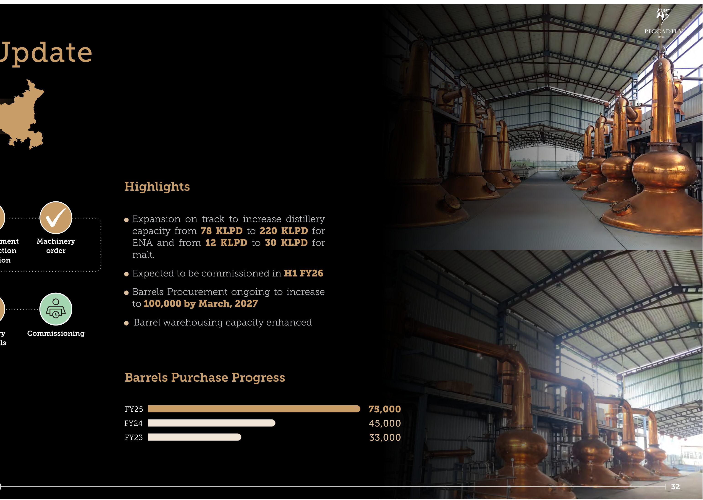

**[Image: ec836cff-71a2-465e-a90c-12508fba0df2.pdf-0032-00.png (3080x2192, 5215.4KB)]**

<!-- Start of picture text -->
Highlights Capex Year XX  Expansion on track to increase distillery capacity from  78 KLPD  to  220 KLPD  for Machinery  ENA and from  12 KLPD  to  30 KLPD  for order malt. Activity  Expected to be commissioned in  H1 FY26  Barrels Procurement ongoing to increase to  100,000 by March, 2027 Year XX  Barrel warehousing capacity enhanced Commissioning Activity Barrels Purchase Progress Amount  Utilisation FY25 75,000 FY24 45,000 FY23 33,000 32 <!-- End of picture text -->

## Expansion Update 

**[Image: ec836cff-71a2-465e-a90c-12508fba0df2.pdf-0032-02.png (940x178, 18.8KB)]**

<!-- Start of picture text -->
Indri, Haryana <!-- End of picture text -->

**[Image: ec836cff-71a2-465e-a90c-12508fba0df2.pdf-0032-03.png (314x43, 3.8KB)]**

<!-- Start of picture text -->
Milestones: <!-- End of picture text -->

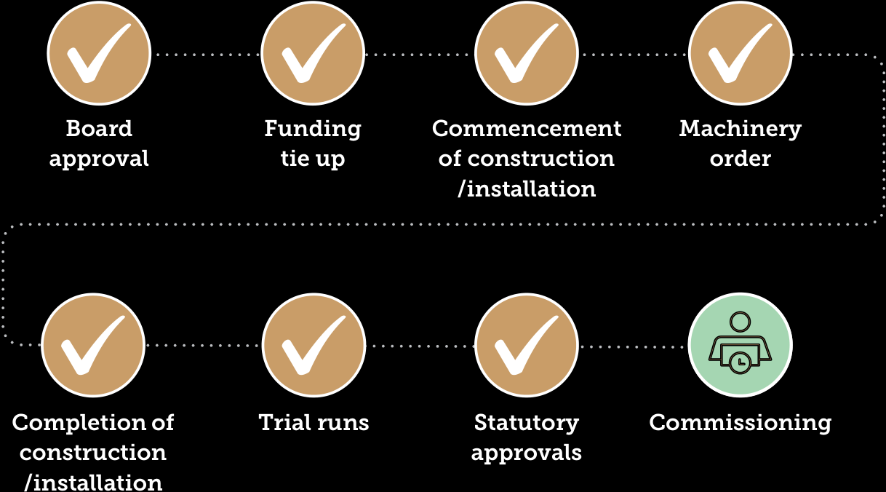

**[Image: ec836cff-71a2-465e-a90c-12508fba0df2.pdf-0032-04.png (1218x676, 88.9KB)]**

<!-- Start of picture text -->
Board  Funding  Commencement  Machinery approval tie up of construction  order /installation Completion of  Trial runs Statutory  Commissioning construction  approvals /installation <!-- End of picture text -->

**[Image: ec836cff-71a2-465e-a90c-12508fba0df2.pdf-0032-05.png (422x198, 12.4KB)]**

<!-- Start of picture text -->
Completed Work-In-Progress Pending <!-- End of picture text -->

PICCADILY EARNINGS PRESENTATION @ 2025-26 

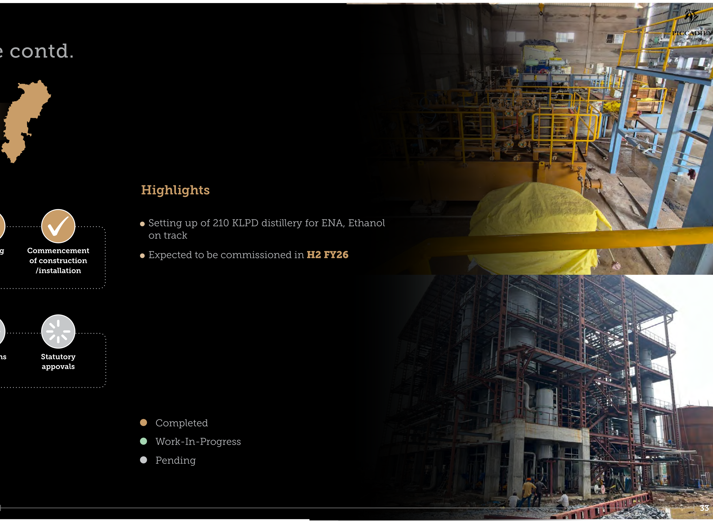

**[Image: ec836cff-71a2-465e-a90c-12508fba0df2.pdf-0033-00.png (2995x2190, 5693.5KB)]**

<!-- Start of picture text -->
Highlights Capex Setting up of 210 KLPD distillery for ENA, Ethanol  Year XX on track Commencement Expected to be commissioned in  H2 FY26 of construction /installation Activity Year XX Statutory appovals Activity Completed Amount  Utilisation Work-In-Progress Pending 33 <!-- End of picture text -->

### Expansion Update contd. 

**[Image: ec836cff-71a2-465e-a90c-12508fba0df2.pdf-0033-02.png (1005x484, 33.4KB)]**

<!-- Start of picture text -->
Mahasamund, Chhattisgarh Milestones: <!-- End of picture text -->

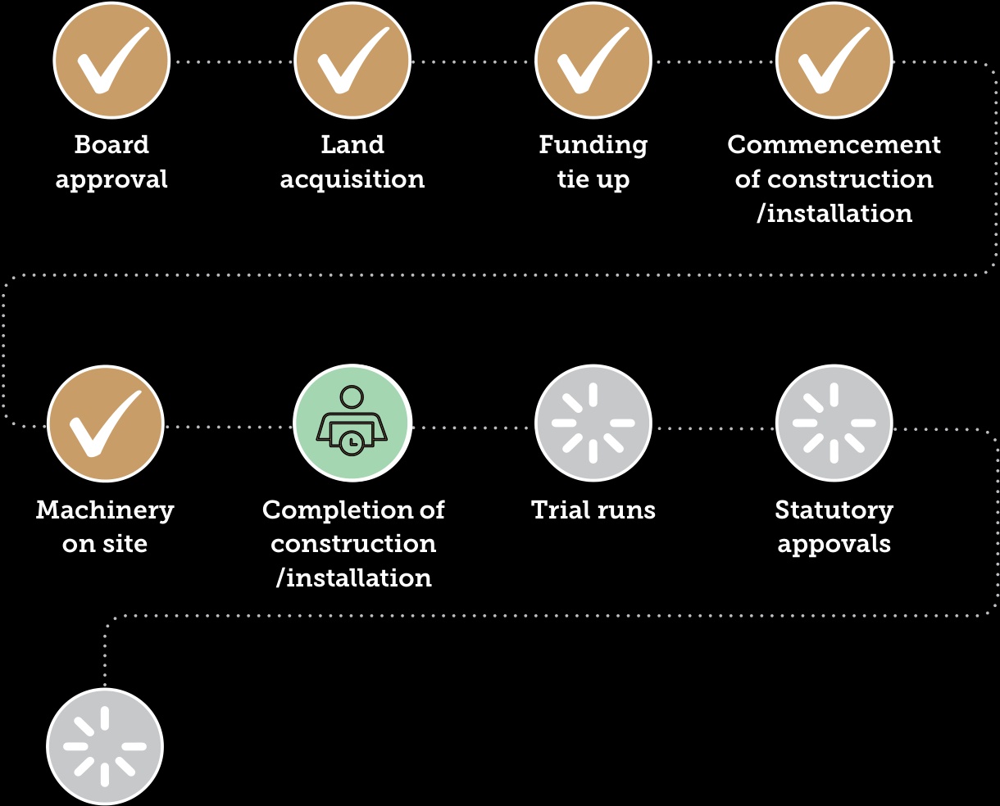

**[Image: ec836cff-71a2-465e-a90c-12508fba0df2.pdf-0033-03.png (1220x984, 100.9KB)]**

<!-- Start of picture text -->
Board  Land  Funding  Commencement approval acquisition tie up of construction /installation Machinery  Completion of  Trial runs Statutory on site construction  appovals /installation <!-- End of picture text -->

**[Image: ec836cff-71a2-465e-a90c-12508fba0df2.pdf-0033-04.png (255x32, 3.0KB)]**

<!-- Start of picture text -->
Commissioning <!-- End of picture text -->

PICCADILY EARNINGS PRESENTATION @ 2025-26 

### Expansion Update contd. 

**[Image: ec836cff-71a2-465e-a90c-12508fba0df2.pdf-0034-01.png (1238x301, 36.8KB)]**

<!-- Start of picture text -->
Portavadie, Scotland <!-- End of picture text -->

**[Image: ec836cff-71a2-465e-a90c-12508fba0df2.pdf-0034-02.png (314x42, 3.8KB)]**

<!-- Start of picture text -->
Milestones: <!-- End of picture text -->

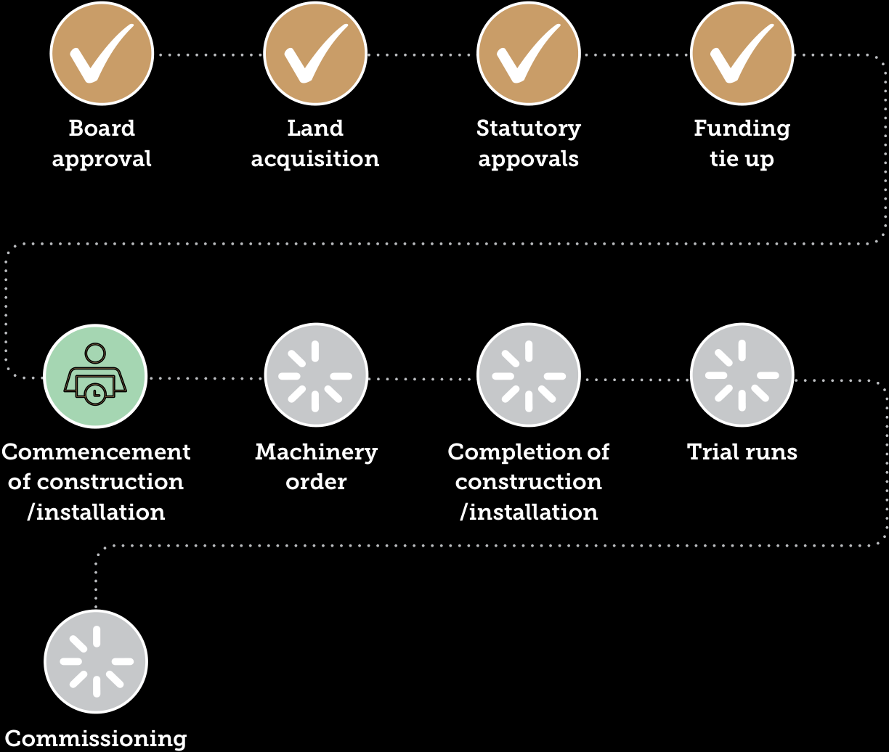

**[Image: ec836cff-71a2-465e-a90c-12508fba0df2.pdf-0034-03.png (1224x1036, 100.6KB)]**

<!-- Start of picture text -->
Board  Land  Statutory  Funding approval acquisition appovals tie up Commencement  Machinery  Completion of  Trial runs of construction  order construction /installation /installation Commissioning <!-- End of picture text -->

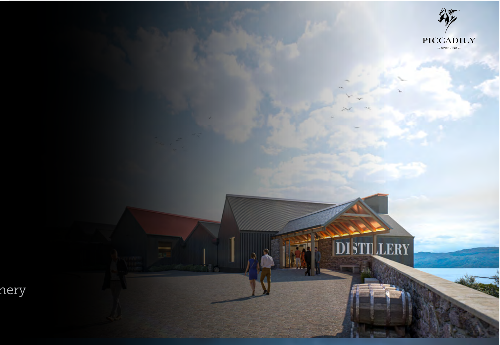

**[Image: ec836cff-71a2-465e-a90c-12508fba0df2.pdf-0034-04.png (1597x1105, 1771.9KB)]**

<!-- Start of picture text -->
Capex Year XX <!-- End of picture text -->

#### Highlights 

Evaluation of suitable plant and machinery in progress 

Likely commissioning in FY27 

Activity 

Presence in Scotland provides access to single malt industry - events, players, expertise, channels 

**[Image: ec836cff-71a2-465e-a90c-12508fba0df2.pdf-0034-10.png (201x40, 17.6KB)]**

<!-- Start of picture text -->
Year XX <!-- End of picture text -->

**[Image: ec836cff-71a2-465e-a90c-12508fba0df2.pdf-0034-11.png (168x40, 13.8KB)]**

<!-- Start of picture text -->
Activity <!-- End of picture text -->

**[Image: ec836cff-71a2-465e-a90c-12508fba0df2.pdf-0034-12.png (599x34, 20.5KB)]**

<!-- Start of picture text -->
Amount  Utilisation <!-- End of picture text -->

Completed Work-In-Progress Pending 

*3D rendered images 

**34** 

PICCADILY EARNINGS PRESENTATION @ 2025-26 

**[Image: ec836cff-71a2-465e-a90c-12508fba0df2.pdf-0035-00.png (170x114, 5.2KB)]**

## Indri Experience Centre 

Indri Experience Centre launched in Haryana to offer an immersive introduction to whisky making and tasting, enhancing consumer engagement and brand visibility. Includes guided tours, curated tastings and interactive exhibits Features sustainable architecture inspired by Northern Indian havelis Includes recreational golf greens to support premium positioning Built with scalability to support future brand growth. 

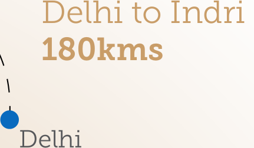

**[Image: ec836cff-71a2-465e-a90c-12508fba0df2.pdf-0035-03.png (431x251, 15.6KB)]**

<!-- Start of picture text -->
Delhi to Indri 180kms Delhi <!-- End of picture text -->

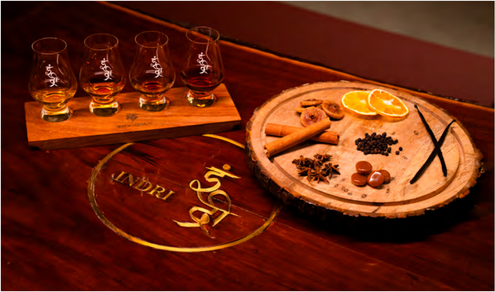

**[Image: ec836cff-71a2-465e-a90c-12508fba0df2.pdf-0035-04.png (1220x721, 1259.3KB)]**

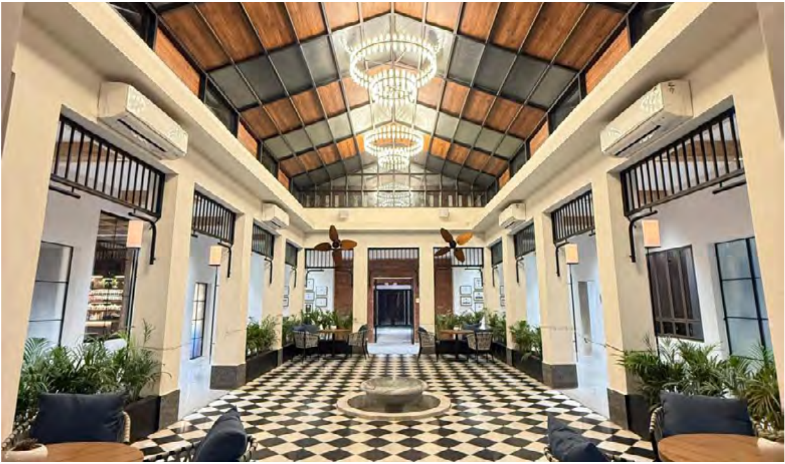

**[Image: ec836cff-71a2-465e-a90c-12508fba0df2.pdf-0035-05.png (1220x723, 2048.9KB)]**

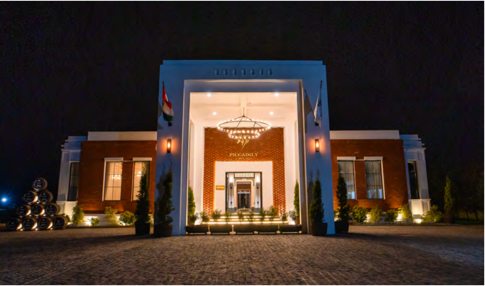

**[Image: ec836cff-71a2-465e-a90c-12508fba0df2.pdf-0035-06.png (1218x721, 1302.6KB)]**

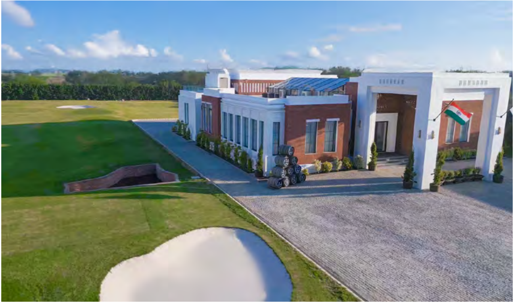

**[Image: ec836cff-71a2-465e-a90c-12508fba0df2.pdf-0035-07.png (1222x721, 1484.8KB)]**

**35** 

PICCADILY EARNINGS PRESENTATION @ 2025-26 

**[Image: ec836cff-71a2-465e-a90c-12508fba0df2.pdf-0036-00.png (170x114, 0.2KB)]**

## Awards and Recognition: Q1 FY2025-26 

**[Image: ec836cff-71a2-465e-a90c-12508fba0df2.pdf-0036-02.png (26x1266, 2.5KB)]**

**[Image: ec836cff-71a2-465e-a90c-12508fba0df2.pdf-0036-03.png (24x1266, 2.4KB)]**

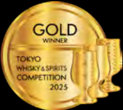

**[Image: ec836cff-71a2-465e-a90c-12508fba0df2.pdf-0036-04.png (203x182, 80.6KB)]**

Indri Trini: India whisky of the year at New York International spirits Competition 2025 

Indri Trini: Best of Category at International Spirits Competition 2025 by A.D.I. 

Indri DCE’24: Gold at Tokyo Whisky and spirits Competition 2025 

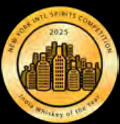

**[Image: ec836cff-71a2-465e-a90c-12508fba0df2.pdf-0036-08.png (170x176, 63.8KB)]**

**[Image: ec836cff-71a2-465e-a90c-12508fba0df2.pdf-0036-09.png (243x105, 7.5KB)]**

**[Image: ec836cff-71a2-465e-a90c-12508fba0df2.pdf-0036-10.png (3747x26, 2.9KB)]**

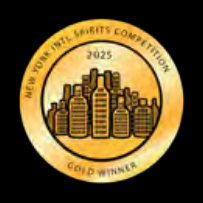

**[Image: ec836cff-71a2-465e-a90c-12508fba0df2.pdf-0036-11.png (203x203, 63.6KB)]**

**[Image: ec836cff-71a2-465e-a90c-12508fba0df2.pdf-0036-12.png (203x182, 63.0KB)]**

Indri Trini: Gold at New York International spirits Competition 2025 

Indri Dru: Silver at International Spirits Competition 2025 by A.D.I. 

CAMIKARA 8YO: SILVER AT TOKYO WHISKY AND SPIRITS COMPETITION 2025 

**[Image: ec836cff-71a2-465e-a90c-12508fba0df2.pdf-0036-16.png (243x105, 7.5KB)]**

**[Image: ec836cff-71a2-465e-a90c-12508fba0df2.pdf-0036-17.png (3747x25, 2.8KB)]**

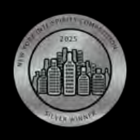

**[Image: ec836cff-71a2-465e-a90c-12508fba0df2.pdf-0036-18.png (203x203, 44.6KB)]**

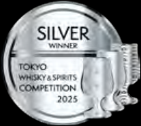

**[Image: ec836cff-71a2-465e-a90c-12508fba0df2.pdf-0036-19.png (203x182, 63.0KB)]**

Indri Dru: Silver at New York International spirits Competition 2025 

Camikara 3YO: Silver at Tokyo Whisky and spirits Competition 2025 

Indri Trini: Silver at International Spirits Competition 2025 by A.D.I. 

**[Image: ec836cff-71a2-465e-a90c-12508fba0df2.pdf-0036-23.png (243x105, 7.5KB)]**

36 

PICCADILY EARNINGS PRESENTATION @ 2025-26 

**[Image: ec836cff-71a2-465e-a90c-12508fba0df2.pdf-0037-00.png (170x114, 11.8KB)]**

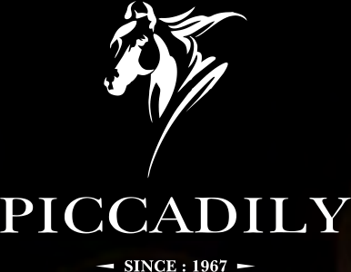

**[Image: ec836cff-71a2-465e-a90c-12508fba0df2.pdf-0037-01.png (386x300, 21.5KB)]**

For Further Information Contact: Investors Relations Piccadily Agro Industries Limited Ph.: +91-172-2997651 (Monday to Friday; IST 10 am to 5 pm) Website: www.piccadily.com Email:  ir@piccadily.com 

37 

PICCADILY EARNINGS PRESENTATION @ 2025-26 

---

## Extracted Images

| # | File | Dimensions | Size |
|---|------|------------|------|
| 1 | ec836cff-71a2-465e-a90c-12508fba0df2.pdf-0002-00.png | 170x114 | 31.9KB |
| 2 | ec836cff-71a2-465e-a90c-12508fba0df2.pdf-0002-02.png | 21x25 | 0.6KB |
| 3 | ec836cff-71a2-465e-a90c-12508fba0df2.pdf-0003-00.png | 170x114 | 10.1KB |
| 4 | ec836cff-71a2-465e-a90c-12508fba0df2.pdf-0004-02.png | 1966x2072 | 6912.4KB |
| 5 | ec836cff-71a2-465e-a90c-12508fba0df2.pdf-0005-00.png | 170x114 | 6.6KB |
| 6 | ec836cff-71a2-465e-a90c-12508fba0df2.pdf-0006-00.png | 175x114 | 5.6KB |
| 7 | ec836cff-71a2-465e-a90c-12508fba0df2.pdf-0006-02.png | 401x293 | 10.4KB |
| 8 | ec836cff-71a2-465e-a90c-12508fba0df2.pdf-0006-03.png | 76x76 | 2.2KB |
| 9 | ec836cff-71a2-465e-a90c-12508fba0df2.pdf-0006-04.png | 170x82 | 4.7KB |
| 10 | ec836cff-71a2-465e-a90c-12508fba0df2.pdf-0006-05.png | 316x155 | 6.6KB |
| 11 | ec836cff-71a2-465e-a90c-12508fba0df2.pdf-0006-06.png | 76x76 | 2.2KB |
| 12 | ec836cff-71a2-465e-a90c-12508fba0df2.pdf-0006-07.png | 209x82 | 5.5KB |
| 13 | ec836cff-71a2-465e-a90c-12508fba0df2.pdf-0006-08.png | 324x157 | 8.1KB |
| 14 | ec836cff-71a2-465e-a90c-12508fba0df2.pdf-0006-09.png | 76x76 | 2.2KB |
| 15 | ec836cff-71a2-465e-a90c-12508fba0df2.pdf-0006-10.png | 182x82 | 5.6KB |
| 16 | ec836cff-71a2-465e-a90c-12508fba0df2.pdf-0006-11.png | 360x166 | 8.5KB |
| 17 | ec836cff-71a2-465e-a90c-12508fba0df2.pdf-0006-12.png | 76x76 | 2.4KB |
| 18 | ec836cff-71a2-465e-a90c-12508fba0df2.pdf-0006-15.png | 76x75 | 2.3KB |
| 19 | ec836cff-71a2-465e-a90c-12508fba0df2.pdf-0009-00.png | 170x114 | 5.8KB |
| 20 | ec836cff-71a2-465e-a90c-12508fba0df2.pdf-0009-02.png | 1905x1551 | 112.0KB |
| 21 | ec836cff-71a2-465e-a90c-12508fba0df2.pdf-0009-03.png | 1898x1551 | 117.4KB |
| 22 | ec836cff-71a2-465e-a90c-12508fba0df2.pdf-0011-00.png | 170x114 | 5.2KB |
| 23 | ec836cff-71a2-465e-a90c-12508fba0df2.pdf-0011-02.png | 1003x1231 | 716.6KB |
| 24 | ec836cff-71a2-465e-a90c-12508fba0df2.pdf-0012-00.png | 170x114 | 5.6KB |
| 25 | ec836cff-71a2-465e-a90c-12508fba0df2.pdf-0012-04.png | 3193x1126 | 327.4KB |
| 26 | ec836cff-71a2-465e-a90c-12508fba0df2.pdf-0013-00.png | 4000x2250 | 2277.4KB |
| 27 | ec836cff-71a2-465e-a90c-12508fba0df2.pdf-0013-01.png | 4000x2250 | 2277.4KB |
| 28 | ec836cff-71a2-465e-a90c-12508fba0df2.pdf-0014-00.png | 4000x2250 | 558.2KB |
| 29 | ec836cff-71a2-465e-a90c-12508fba0df2.pdf-0015-00.png | 170x114 | 6.2KB |
| 30 | ec836cff-71a2-465e-a90c-12508fba0df2.pdf-0016-00.png | 170x114 | 5.4KB |
| 31 | ec836cff-71a2-465e-a90c-12508fba0df2.pdf-0016-07.png | 780x373 | 200.3KB |
| 32 | ec836cff-71a2-465e-a90c-12508fba0df2.pdf-0016-08.png | 669x358 | 156.9KB |
| 33 | ec836cff-71a2-465e-a90c-12508fba0df2.pdf-0017-00.png | 170x114 | 5.4KB |
| 34 | ec836cff-71a2-465e-a90c-12508fba0df2.pdf-0017-09.png | 524x576 | 262.3KB |
| 35 | ec836cff-71a2-465e-a90c-12508fba0df2.pdf-0017-10.png | 524x575 | 173.0KB |
| 36 | ec836cff-71a2-465e-a90c-12508fba0df2.pdf-0017-11.png | 574x594 | 322.8KB |
| 37 | ec836cff-71a2-465e-a90c-12508fba0df2.pdf-0017-12.png | 524x507 | 167.6KB |
| 38 | ec836cff-71a2-465e-a90c-12508fba0df2.pdf-0018-01.png | 170x114 | 5.8KB |
| 39 | ec836cff-71a2-465e-a90c-12508fba0df2.pdf-0018-03.png | 3934x1697 | 1040.8KB |
| 40 | ec836cff-71a2-465e-a90c-12508fba0df2.pdf-0019-00.png | 3768x2049 | 596.7KB |
| 41 | ec836cff-71a2-465e-a90c-12508fba0df2.pdf-0020-00.png | 170x114 | 5.4KB |
| 42 | ec836cff-71a2-465e-a90c-12508fba0df2.pdf-0020-02.png | 899x548 | 1250.1KB |
| 43 | ec836cff-71a2-465e-a90c-12508fba0df2.pdf-0020-03.png | 902x563 | 939.6KB |
| 44 | ec836cff-71a2-465e-a90c-12508fba0df2.pdf-0020-04.png | 902x555 | 596.7KB |
| 45 | ec836cff-71a2-465e-a90c-12508fba0df2.pdf-0020-05.png | 899x563 | 734.0KB |
| 46 | ec836cff-71a2-465e-a90c-12508fba0df2.pdf-0020-06.png | 901x565 | 858.5KB |
| 47 | ec836cff-71a2-465e-a90c-12508fba0df2.pdf-0020-07.png | 2809x824 | 3245.6KB |
| 48 | ec836cff-71a2-465e-a90c-12508fba0df2.pdf-0020-08.png | 901x565 | 1113.1KB |
| 49 | ec836cff-71a2-465e-a90c-12508fba0df2.pdf-0021-00.png | 170x114 | 5.4KB |
| 50 | ec836cff-71a2-465e-a90c-12508fba0df2.pdf-0021-02.png | 3111x1712 | 3949.4KB |
| 51 | ec836cff-71a2-465e-a90c-12508fba0df2.pdf-0021-04.png | 301x435 | 144.9KB |
| 52 | ec836cff-71a2-465e-a90c-12508fba0df2.pdf-0021-05.png | 301x436 | 161.7KB |
| 53 | ec836cff-71a2-465e-a90c-12508fba0df2.pdf-0021-07.png | 1513x595 | 582.5KB |
| 54 | ec836cff-71a2-465e-a90c-12508fba0df2.pdf-0021-08.png | 376x437 | 209.1KB |
| 55 | ec836cff-71a2-465e-a90c-12508fba0df2.pdf-0022-00.png | 170x114 | 5.4KB |
| 56 | ec836cff-71a2-465e-a90c-12508fba0df2.pdf-0022-05.png | 449x493 | 170.4KB |
| 57 | ec836cff-71a2-465e-a90c-12508fba0df2.pdf-0022-09.png | 449x493 | 176.4KB |
| 58 | ec836cff-71a2-465e-a90c-12508fba0df2.pdf-0022-13.png | 449x493 | 160.9KB |
| 59 | ec836cff-71a2-465e-a90c-12508fba0df2.pdf-0023-00.png | 170x114 | 5.4KB |
| 60 | ec836cff-71a2-465e-a90c-12508fba0df2.pdf-0023-03.png | 2241x1504 | 1767.9KB |
| 61 | ec836cff-71a2-465e-a90c-12508fba0df2.pdf-0024-00.png | 170x114 | 6.7KB |
| 62 | ec836cff-71a2-465e-a90c-12508fba0df2.pdf-0025-00.png | 170x114 | 5.4KB |
| 63 | ec836cff-71a2-465e-a90c-12508fba0df2.pdf-0025-01.png | 92x432 | 60.8KB |
| 64 | ec836cff-71a2-465e-a90c-12508fba0df2.pdf-0025-02.png | 572x384 | 242.8KB |
| 65 | ec836cff-71a2-465e-a90c-12508fba0df2.pdf-0025-03.png | 227x374 | 93.9KB |
| 66 | ec836cff-71a2-465e-a90c-12508fba0df2.pdf-0025-04.png | 115x376 | 58.9KB |
| 67 | ec836cff-71a2-465e-a90c-12508fba0df2.pdf-0025-05.png | 3172x1464 | 1208.9KB |
| 68 | ec836cff-71a2-465e-a90c-12508fba0df2.pdf-0025-06.png | 476x384 | 6.7KB |
| 69 | ec836cff-71a2-465e-a90c-12508fba0df2.pdf-0025-07.png | 309x384 | 5.2KB |
| 70 | ec836cff-71a2-465e-a90c-12508fba0df2.pdf-0025-08.png | 351x384 | 5.6KB |
| 71 | ec836cff-71a2-465e-a90c-12508fba0df2.pdf-0025-09.png | 349x384 | 5.9KB |
| 72 | ec836cff-71a2-465e-a90c-12508fba0df2.pdf-0026-01.png | 170x114 | 7.5KB |
| 73 | ec836cff-71a2-465e-a90c-12508fba0df2.pdf-0028-00.png | 170x114 | 6.7KB |
| 74 | ec836cff-71a2-465e-a90c-12508fba0df2.pdf-0029-00.png | 170x114 | 5.6KB |
| 75 | ec836cff-71a2-465e-a90c-12508fba0df2.pdf-0030-00.png | 170x114 | 5.4KB |
| 76 | ec836cff-71a2-465e-a90c-12508fba0df2.pdf-0030-02.png | 97x108 | 4.0KB |
| 77 | ec836cff-71a2-465e-a90c-12508fba0df2.pdf-0030-03.png | 92x86 | 1.4KB |
| 78 | ec836cff-71a2-465e-a90c-12508fba0df2.pdf-0030-05.png | 253x103 | 5.4KB |
| 79 | ec836cff-71a2-465e-a90c-12508fba0df2.pdf-0030-06.png | 95x95 | 3.9KB |
| 80 | ec836cff-71a2-465e-a90c-12508fba0df2.pdf-0030-07.png | 107x103 | 3.3KB |
| 81 | ec836cff-71a2-465e-a90c-12508fba0df2.pdf-0030-08.png | 297x105 | 6.4KB |
| 82 | ec836cff-71a2-465e-a90c-12508fba0df2.pdf-0031-00.png | 170x114 | 5.4KB |
| 83 | ec836cff-71a2-465e-a90c-12508fba0df2.pdf-0031-02.png | 321x339 | 17.8KB |
| 84 | ec836cff-71a2-465e-a90c-12508fba0df2.pdf-0031-03.png | 90x91 | 3.1KB |
| 85 | ec836cff-71a2-465e-a90c-12508fba0df2.pdf-0031-05.png | 743x226 | 27.2KB |
| 86 | ec836cff-71a2-465e-a90c-12508fba0df2.pdf-0031-06.png | 372x530 | 16.0KB |
| 87 | ec836cff-71a2-465e-a90c-12508fba0df2.pdf-0031-07.png | 114x147 | 3.8KB |
| 88 | ec836cff-71a2-465e-a90c-12508fba0df2.pdf-0031-09.png | 457x38 | 9.6KB |
| 89 | ec836cff-71a2-465e-a90c-12508fba0df2.pdf-0032-00.png | 3080x2192 | 5215.4KB |
| 90 | ec836cff-71a2-465e-a90c-12508fba0df2.pdf-0032-02.png | 940x178 | 18.8KB |
| 91 | ec836cff-71a2-465e-a90c-12508fba0df2.pdf-0032-03.png | 314x43 | 3.8KB |
| 92 | ec836cff-71a2-465e-a90c-12508fba0df2.pdf-0032-04.png | 1218x676 | 88.9KB |
| 93 | ec836cff-71a2-465e-a90c-12508fba0df2.pdf-0032-05.png | 422x198 | 12.4KB |
| 94 | ec836cff-71a2-465e-a90c-12508fba0df2.pdf-0033-00.png | 2995x2190 | 5693.5KB |
| 95 | ec836cff-71a2-465e-a90c-12508fba0df2.pdf-0033-02.png | 1005x484 | 33.4KB |
| 96 | ec836cff-71a2-465e-a90c-12508fba0df2.pdf-0033-03.png | 1220x984 | 100.9KB |
| 97 | ec836cff-71a2-465e-a90c-12508fba0df2.pdf-0033-04.png | 255x32 | 3.0KB |
| 98 | ec836cff-71a2-465e-a90c-12508fba0df2.pdf-0034-01.png | 1238x301 | 36.8KB |
| 99 | ec836cff-71a2-465e-a90c-12508fba0df2.pdf-0034-02.png | 314x42 | 3.8KB |
| 100 | ec836cff-71a2-465e-a90c-12508fba0df2.pdf-0034-03.png | 1224x1036 | 100.6KB |
| 101 | ec836cff-71a2-465e-a90c-12508fba0df2.pdf-0034-04.png | 1597x1105 | 1771.9KB |
| 102 | ec836cff-71a2-465e-a90c-12508fba0df2.pdf-0034-10.png | 201x40 | 17.6KB |
| 103 | ec836cff-71a2-465e-a90c-12508fba0df2.pdf-0034-11.png | 168x40 | 13.8KB |
| 104 | ec836cff-71a2-465e-a90c-12508fba0df2.pdf-0034-12.png | 599x34 | 20.5KB |
| 105 | ec836cff-71a2-465e-a90c-12508fba0df2.pdf-0035-00.png | 170x114 | 5.2KB |
| 106 | ec836cff-71a2-465e-a90c-12508fba0df2.pdf-0035-03.png | 431x251 | 15.6KB |
| 107 | ec836cff-71a2-465e-a90c-12508fba0df2.pdf-0035-04.png | 1220x721 | 1259.3KB |
| 108 | ec836cff-71a2-465e-a90c-12508fba0df2.pdf-0035-05.png | 1220x723 | 2048.9KB |
| 109 | ec836cff-71a2-465e-a90c-12508fba0df2.pdf-0035-06.png | 1218x721 | 1302.6KB |
| 110 | ec836cff-71a2-465e-a90c-12508fba0df2.pdf-0035-07.png | 1222x721 | 1484.8KB |
| 111 | ec836cff-71a2-465e-a90c-12508fba0df2.pdf-0036-00.png | 170x114 | 0.2KB |
| 112 | ec836cff-71a2-465e-a90c-12508fba0df2.pdf-0036-02.png | 26x1266 | 2.5KB |
| 113 | ec836cff-71a2-465e-a90c-12508fba0df2.pdf-0036-03.png | 24x1266 | 2.4KB |
| 114 | ec836cff-71a2-465e-a90c-12508fba0df2.pdf-0036-04.png | 203x182 | 80.6KB |
| 115 | ec836cff-71a2-465e-a90c-12508fba0df2.pdf-0036-08.png | 170x176 | 63.8KB |
| 116 | ec836cff-71a2-465e-a90c-12508fba0df2.pdf-0036-09.png | 243x105 | 7.5KB |
| 117 | ec836cff-71a2-465e-a90c-12508fba0df2.pdf-0036-10.png | 3747x26 | 2.9KB |
| 118 | ec836cff-71a2-465e-a90c-12508fba0df2.pdf-0036-11.png | 203x203 | 63.6KB |
| 119 | ec836cff-71a2-465e-a90c-12508fba0df2.pdf-0036-12.png | 203x182 | 63.0KB |
| 120 | ec836cff-71a2-465e-a90c-12508fba0df2.pdf-0036-16.png | 243x105 | 7.5KB |
| 121 | ec836cff-71a2-465e-a90c-12508fba0df2.pdf-0036-17.png | 3747x25 | 2.8KB |
| 122 | ec836cff-71a2-465e-a90c-12508fba0df2.pdf-0036-18.png | 203x203 | 44.6KB |
| 123 | ec836cff-71a2-465e-a90c-12508fba0df2.pdf-0036-19.png | 203x182 | 63.0KB |
| 124 | ec836cff-71a2-465e-a90c-12508fba0df2.pdf-0036-23.png | 243x105 | 7.5KB |
| 125 | ec836cff-71a2-465e-a90c-12508fba0df2.pdf-0037-00.png | 170x114 | 11.8KB |
| 126 | ec836cff-71a2-465e-a90c-12508fba0df2.pdf-0037-01.png | 386x300 | 21.5KB |
