Dated: 21.02.2025 

To, 

BSE Limited 25th Floor, Pheroze Jeejebhoy Towers Dalal Street, Mumbai – 400 001 

BSE Scrip Code : 530305 

Subject: Investor Presentation on Unaudited Financial Results for the Quarter and Year ended Mar 31, 2025 

Dear Sir/Madam, 

Pursuant to Regulation 30 of the SEBI (Listing Obligations and Disclosure Requirements) Regulations, 2015, please find attached herewith the Earnings Presentation on the Unaudited Financial Results for the Quarter and Year ended Mar 31, 2025. 

We request you to take the above on record. 

Thanking you. 

Yours faithfully, 

For Piccadily Agro Industries Limited 

Sd/- 

Niraj Kumar Sehgal 

Company Secretary & Compliance Officer M. No. A8019 

###### Piccadily Agro Industries Ltd. 

Registered Office: Village Bhadson, Umri - Indri Road, Teh. Indri, Distt. Karnal, Haryana-132109 (India) Corporate Office: G-17, JMD Pacific Square, Sector-15 (Part-2), Gurugram, Haryana 122002 (India) Ph.: +91-124-4300840, Website: www.piccadily.com, Email: info@piccadily.com 

Investor Relations: Ph.: +91-172-5083695, Website: www.picagro.com, Email: piccadilygroup34@rediffmail.com CIN No.: L01115HR1994PLC032244 

1 

PICCADILY EARNINGS PRESENTATION @ 2024-25 

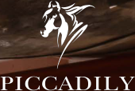

**[Image: f0d4fba6-704d-46e7-8f23-5f95fc3dd357.pdf-0002-00.png (170x114, 28.8KB)]**

Q4 and FY2024-25 Earnings Presentation 

2 

PICCADILY EARNINGS PRESENTATION @ 2024-25 

**[Image: f0d4fba6-704d-46e7-8f23-5f95fc3dd357.pdf-0003-00.png (170x114, 6.0KB)]**

## Disclaimer 

This presentation may include forward-looking statements regarding our Company’s future performance, including sales, revenues, earnings, strategic initiatives and market positioning. These statements are based on management’s current expectations but are subject to uncertainties such as economic consumer fluctuations, evolving preferences, regulatory changes, and competitive dynamics that may cause actual results to differ. While  we remain focused on excellence, innovation, and leadership, the future is shaped by both opportunities and uncertainties. We undertake no obligation to update these statements as conditions evolve. FY25 refers to the financial year from April 1, 2024, to March 31, 2025. 

**[Image: f0d4fba6-704d-46e7-8f23-5f95fc3dd357.pdf-0004-00.png (170x114, 11.1KB)]**

## Management’s Message 

Harvindar Chopra 

**[Image: f0d4fba6-704d-46e7-8f23-5f95fc3dd357.pdf-0005-00.png (170x114, 0.2KB)]**

Q4 & FY25 Performance Highlights 

**[Image: f0d4fba6-704d-46e7-8f23-5f95fc3dd357.pdf-0005-02.png (1624x1617, 1661.0KB)]**

5 

PICCADILY EARNINGS PRESENTATION @ 2024-25 

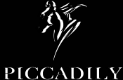

**[Image: f0d4fba6-704d-46e7-8f23-5f95fc3dd357.pdf-0006-00.png (175x114, 6.3KB)]**

## FY25 Highlights: 

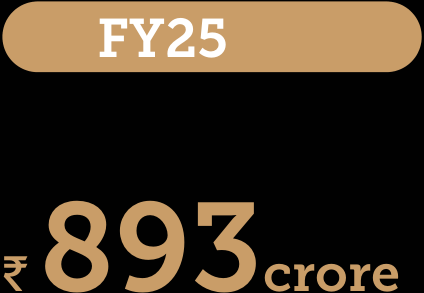

**[Image: f0d4fba6-704d-46e7-8f23-5f95fc3dd357.pdf-0006-02.png (424x293, 12.4KB)]**

<!-- Start of picture text -->
FY25 J  893crore <!-- End of picture text -->

**[Image: f0d4fba6-704d-46e7-8f23-5f95fc3dd357.pdf-0006-03.png (76x76, 2.3KB)]**

**[Image: f0d4fba6-704d-46e7-8f23-5f95fc3dd357.pdf-0006-04.png (170x82, 4.3KB)]**

<!-- Start of picture text -->
7.7% Y-o-Y growth <!-- End of picture text -->

**[Image: f0d4fba6-704d-46e7-8f23-5f95fc3dd357.pdf-0006-05.png (391x155, 8.2KB)]**

<!-- Start of picture text -->
J  105crore PAT <!-- End of picture text -->

**[Image: f0d4fba6-704d-46e7-8f23-5f95fc3dd357.pdf-0006-06.png (76x76, 2.4KB)]**

22%* 

**[Image: f0d4fba6-704d-46e7-8f23-5f95fc3dd357.pdf-0006-08.png (378x157, 8.1KB)]**

<!-- Start of picture text -->
J  191crore EBITDA <!-- End of picture text -->

**[Image: f0d4fba6-704d-46e7-8f23-5f95fc3dd357.pdf-0006-09.png (76x76, 2.3KB)]**

25.4% 

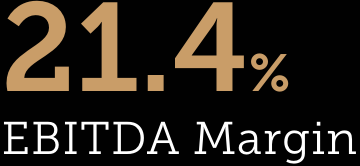

**[Image: f0d4fba6-704d-46e7-8f23-5f95fc3dd357.pdf-0006-11.png (360x166, 9.3KB)]**

<!-- Start of picture text -->
21.4% EBITDA Margin <!-- End of picture text -->

**[Image: f0d4fba6-704d-46e7-8f23-5f95fc3dd357.pdf-0006-12.png (76x76, 2.3KB)]**

300 bps 

**[Image: f0d4fba6-704d-46e7-8f23-5f95fc3dd357.pdf-0006-14.png (163x90, 1.6KB)]**

<!-- Start of picture text -->
J  11 <!-- End of picture text -->

**[Image: f0d4fba6-704d-46e7-8f23-5f95fc3dd357.pdf-0006-15.png (76x75, 2.3KB)]**

#### 22%* 

## Financial Performance 

##### Standalone Profit & loss 

|Standalone Financials|Q|4|Y-o-Y|Q3|Q-o-Q|Financ|ial Year|Y-o-Y|
|---|---|---|---|---|---|---|---|---|
|Particular (Figures in`J`Cr)|Q4 FY25|Q4 FY24|Growth (%)|Q3 FY25|Growth (%)|FY25|FY24|Growth (%)|
|Revenue from DistilleryVertical|148.7|186.5|-20.3%|183.9|-19.1%|636.8|552.8|15.2%|
|Revenue from Sugar Vertical|122.9|98.1|25.3%|21.8|463.7%|249.5|275.3|-9.4%|
|Revenue from Operations|271.6|284.6|-4.6%|205.7|32.0%|886.3|828.1|7.0%|
|Other Income|2.2|0.6|266.1%|2.6|-14.0%|6.6|0.8|701.8%|
|Total Income|273.9|285.2|-4.0%|208.3|31.5%|892.8|828.9|7.7%|
|Expenses|||||||||
|Cost of Materials Consumed|236.4|176.5|33.9%|99.1|138.5%|417.2|364.4|14.5%|
|Changes In Inventories|-136.0|-60.5|124.8%|-42.5|220.0%|-88.9|-7.5|1085.7%|
|Excise DutyOn Sale Of Goods|16.4|15.7|4.5%|23.4|-30.0%|68.1|48.7|39.9%|
|Employee Benefts Expense|15.1|11.6|30.2%|11.9|27.0%|44.0|32.6|35.1%|
|Power, Fuel etc.|6.1|6.6|-7.1%|6.9|-11.1%|29.1|33.0|-11.8%|
|Other Expenses|67.6|67.5|0.2%|58.7|15.2%|231.8|205.1|13.0%|
|Total expenses|205.6|217.4|-5.4%|157.5|30.6%|701.4|676.3|3.7%|
|EBITDA|68.3|67.8|0.6%|50.9|34.2%|191.4|152.6|25.4%|
|EBITDA Margin|24.9%|23.8%|110 bps|24.4%|50 bps|21.4%|18.4%|300 bps|

Other Income in FY25 primarily includes interest income on investments 

7 

PICCADILY EARNINGS PRESENTATION @ 2024-25 

### Financial Performance contd... 

|Standalone Financials|Q|4|Y-o-Y|Q3|Q-o-Q|Financ|ial Year|Y-o-Y|
|---|---|---|---|---|---|---|---|---|
|Particular (Figures in`J`Cr)|Q4 FY25|Q4 FY24|Growth (%)|Q3 FY25|Growth (%)|FY25|FY24|Growth (%)|
|EBITDA|68.3|67.8|0.6%|50.9|34.2%|191.4|152.6|25.4%|
|Finance Costs|9.0|4.2|113.9%|9.3|-3.4%|27.8|15.7|77.2%|
|Depreciation And Amortization Expense|5.0|4.0|24.3%|4.8|3.9%|19.4|18.2|6.6%|
|Proft /(Loss) Before Exceptional Items And Tax|54.2|59.6|-9.0%|36.7|47.7%|144.2|118.7|21.5%|
|Exceptional Items|0.0|0.0|-|0.0|-|0.0|-29.4|-100.0%|
|Proft /(Loss) Before Tax (PBT)|54.2|59.6|-9.0%|36.7|47.7%|144.2|148.1|-2.6%|
|PBT Margin|19.8%|20.9%|-90 bps|17.6%|220 bps|16.2%|17.9%|-180 bps|
|Taxes|13.9|16.1|-13.4%|11.7|19.3%|39.5|33.0|19.7%|
|Tax on Exceptional Item|0.0|0.0||0.0|-|0.0|3.0||
|Proft/ (Loss) After Tax (PAT) (excludingexceptional item)|40.3|43.5|-7.4%|25|60.9%|104.7|85.7|22.1%|
|PAT Margin (excludingexceptional item)|14.7%|15.3%|-60 bps|12%|70 bps|11.7%|10.3%|140  bps|
|Earnings Per Share (EPS) (excluding exceptional item)|4.28|4.61|-7.2%|2.64|62.1%|11.08|9.09|21.9%|

Increase in Finance Cost in FY25 due to interest paid on CCD’s + higher working capital + term loan 

8 

PICCADILY EARNINGS PRESENTATION @ 2024-25 

**[Image: f0d4fba6-704d-46e7-8f23-5f95fc3dd357.pdf-0009-00.png (170x114, 5.8KB)]**

## Profitability Trends 

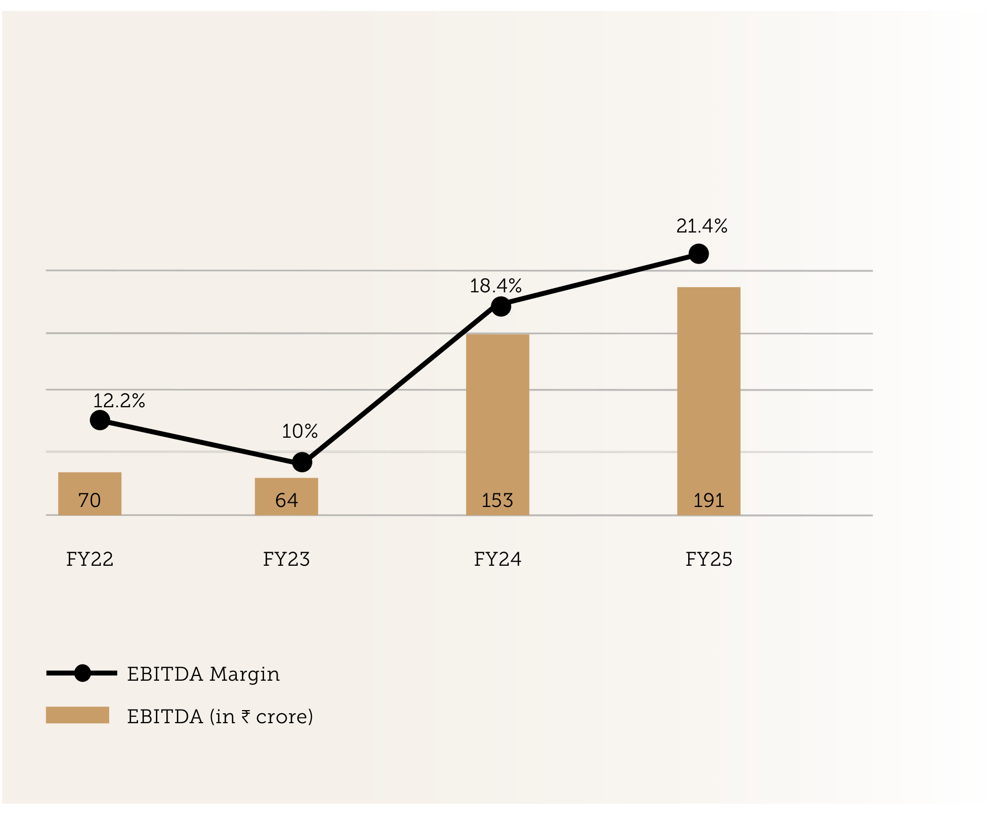

**[Image: f0d4fba6-704d-46e7-8f23-5f95fc3dd357.pdf-0009-02.png (1905x1551, 111.9KB)]**

<!-- Start of picture text -->
21.4% 18.4% 12.2% 10% 70 64 153 191 FY22 FY23 FY24 FY25 EBITDA Margin EBITDA (in  H  crore) <!-- End of picture text -->

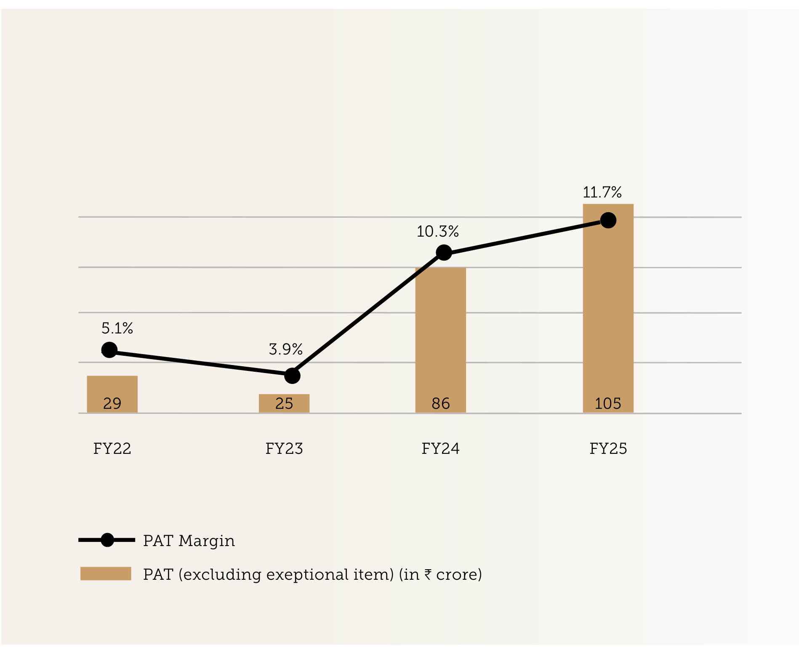

**[Image: f0d4fba6-704d-46e7-8f23-5f95fc3dd357.pdf-0009-03.png (1898x1551, 117.5KB)]**

<!-- Start of picture text -->
11.7% 10.3% 5.1% 3.9% 29 25 86 105 FY22 FY23 FY24 FY25 PAT Margin PAT (excluding exeptional item) (in  H  crore) <!-- End of picture text -->

9 

PICCADILY EARNINGS PRESENTATION @ 2024-25 

## Performance Commentary EBITDA Margin expands to 21.4% 

##### Company 

##### Distillery 

Revenue from operations grew 7.7% YoY 

- Distillery by 15.2% and sugar declined by 9.4% 

Excise duty increased 39.9% YoY in line with increase in IMFL sales 

EBITDA increased 25.4% YoY 

- Distillery EBITDA grew 30.7% YoY to `H` 194 crore in FY25 

- Share of distillery products is 71.9% of Revenue from operations vs 66.8% in FY24 

   - Share of IMFL of Revenue from operations grew to 42.9% from 32.9% YoY 

- Branded Alcobev / IMFL has better margins in premium and luxury category which we are focussing on 

EBITDA Margin grew to 21.4% from 18.4% 

EBITDA margin in distillery is 30.2% / IMFL is higher 

Finance cost increased due to interest on CCDs and term loan for expansion raised during the year and higher working capital 

PAT increased 22.1% over FY24 (excluding one time exceptional item) 

**10** 

PICCADILY EARNINGS PRESENTATION @ 2024-25 

**[Image: f0d4fba6-704d-46e7-8f23-5f95fc3dd357.pdf-0011-00.png (170x114, 5.2KB)]**

## FY25 Business Highlights 

IMFL sales volumes (Indri, Camikara and Whistler) grew 46% YoY 

Indri volumes grew over 37%, Whistler grew 54%, Camikara 310% (on a smaller base) 

Indri captured an estd 55% share of Indian Single Malt export market B2B Malt sales halted in FY25 to cater to own IMFL demand 

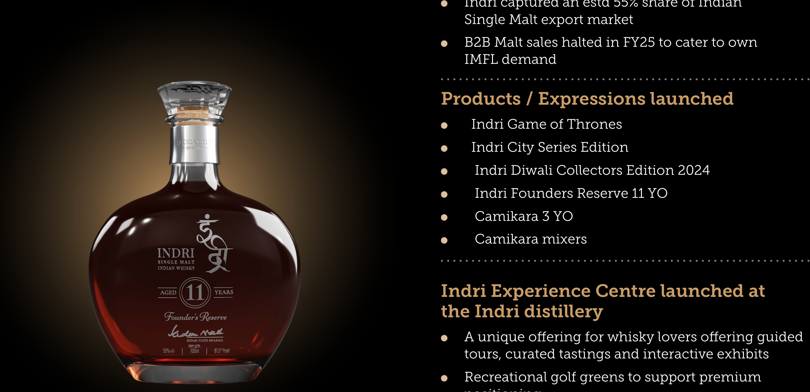

**[Image: f0d4fba6-704d-46e7-8f23-5f95fc3dd357.pdf-0011-05.png (2453x1191, 597.3KB)]**

<!-- Start of picture text -->
Single Malt export market B2B Malt sales halted in FY25 to cater to own IMFL demand Products / Expressions launched   Indri Game of Thrones   Indri City Series Edition    Indri Diwali Collectors Edition 2024    Indri Founders Reserve 11 YO    Camikara 3 YO    Camikara mixers Indri Experience Centre launched at the Indri distillery A unique offering for whisky lovers offering guided tours, curated tastings and interactive exhibits Recreational golf greens to support premium <!-- End of picture text -->

A unique offering for whisky lovers offering guided tours, curated tastings and interactive exhibits Recreational golf greens to support premium positioning 

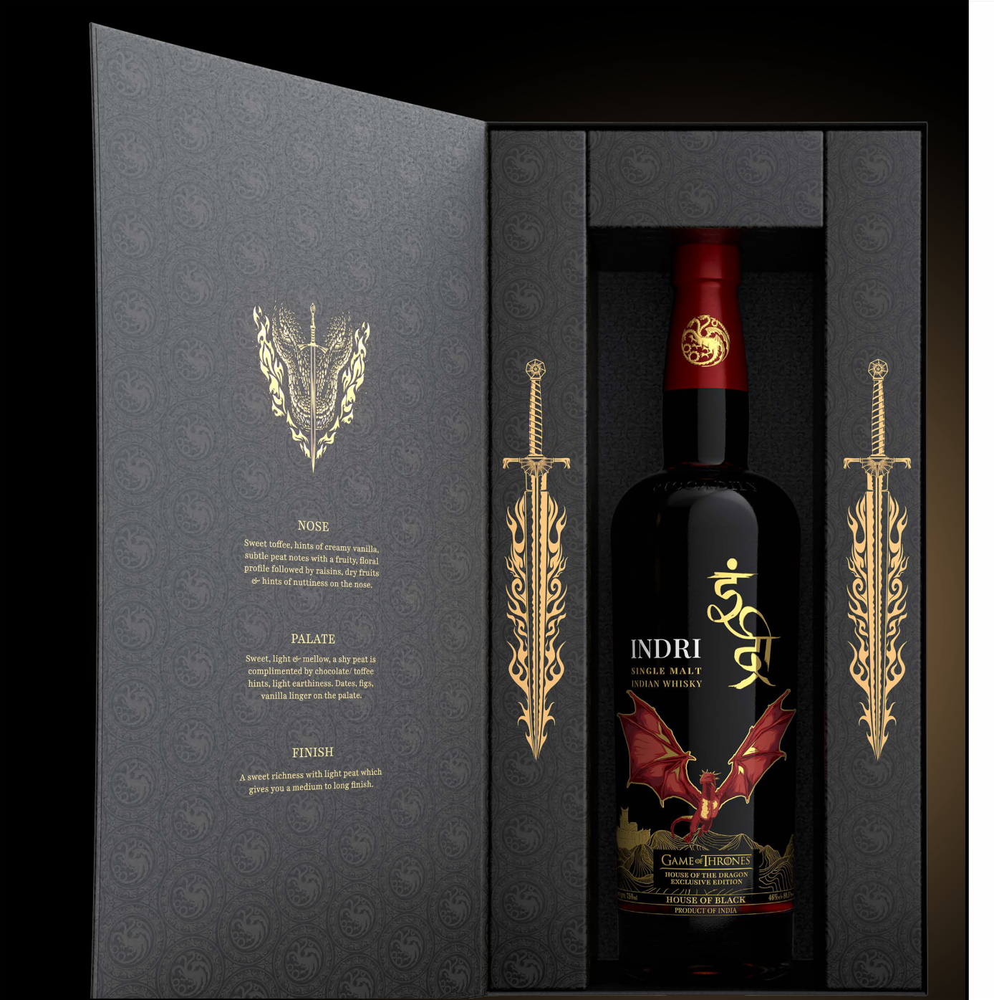

**[Image: f0d4fba6-704d-46e7-8f23-5f95fc3dd357.pdf-0011-07.png (1388x1395, 1896.6KB)]**

**11** 

**PICCADILY EARNINGS PRESENTATION @ 2024-25** 

**[Image: f0d4fba6-704d-46e7-8f23-5f95fc3dd357.pdf-0012-00.png (70x87, 3.2KB)]**

### FY25 Business Highlights contd... 

##### Strenghtened distribution 

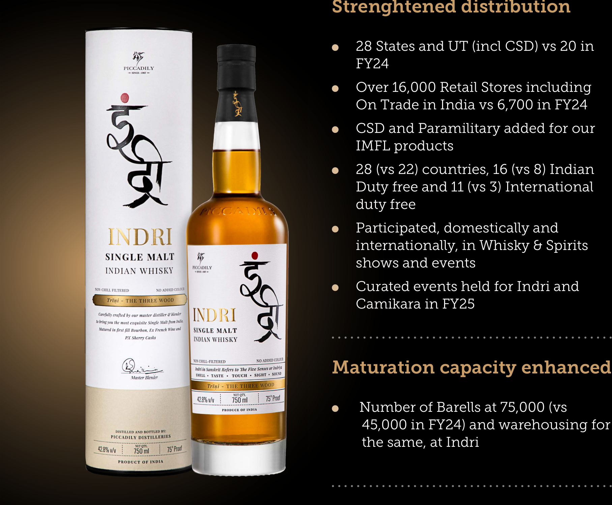

**[Image: f0d4fba6-704d-46e7-8f23-5f95fc3dd357.pdf-0012-03.png (1815x1501, 1209.1KB)]**

<!-- Start of picture text -->
Strenghtened distribution 28 States and UT (incl CSD) vs 20 in FY24 Over 16,000 Retail Stores including On Trade in India vs 6,700 in FY24 CSD and Paramilitary added for our IMFL products 28 (vs 22) countries, 16 (vs 8) Indian Duty free and 11 (vs 3) International duty free Participated, domestically and internationally, in Whisky & Spirits shows and events   Curated events held for Indri and Camikara in FY25 Maturation capacity enhanced  Number of Barells at 75,000 (vs 45,000 in FY24) and warehousing for the same, at Indri <!-- End of picture text -->

Number of Barells at 75,000 (vs 45,000 in FY24) and warehousing for the same, at Indri 

##### Other updates 

Expansions on track - Indri, Haryana + Chhattisgarh + Portavadie, Scotland Fund raise : `H` 312 crore raised by way of CCD’s and Warrants to part fund expansion plans. Of above `H` 50 crore infused by Promoters SAP implemented 

Camikara Millionaire Bartenders Challenge conducted Jan to April, 2025 - Winner prize money of `H` 1 million 

Strenghtening Management Team 

Mr Rakesh Vashisht joined as Head of Sales. He has 42+ years of work experience having worked at Pernod Ricard, Seagram, Shaw Wallace. 

Mr Natwar Agarwal joined as CFO. He is a CA with over 24 years of experience having worked at Walmart, Clark’s Shoes, Healthkart and Dehaat. 

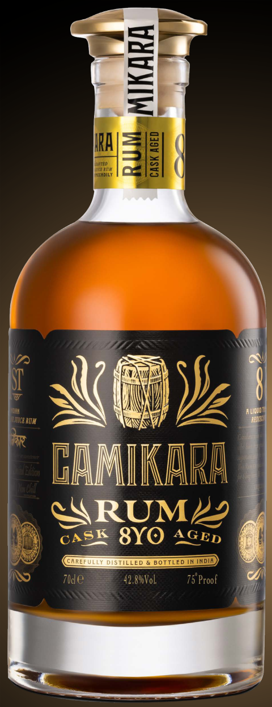

**[Image: f0d4fba6-704d-46e7-8f23-5f95fc3dd357.pdf-0012-11.png (480x1246, 797.2KB)]**

**12** 

PICCADILY EARNINGS PRESENTATION @ 2024-25 

**[Image: f0d4fba6-704d-46e7-8f23-5f95fc3dd357.pdf-0013-00.png (170x114, 5.6KB)]**

- Moving Towards Branded and Premium Portfolio 

Over the last four years, we have steadily shifted our revenue profile from bulk commodity-based sales towards branded and premium alcoholic beverages. The focus has progressively shifted towards value-added and branded Indian Made Foreign Liquor (IMFL) products. 

Revenue Composition – Segment-wise ( `J` crore) 

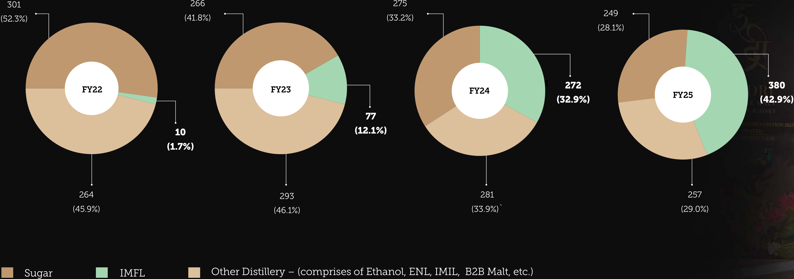

**[Image: f0d4fba6-704d-46e7-8f23-5f95fc3dd357.pdf-0013-04.png (3193x1126, 252.7KB)]**

<!-- Start of picture text -->
301 266 275 249 (52.3%) (41.8%) (33.2%) (28.1%) FY24 FY25 272 380 FY22 FY23 FY24 FY25 (32.9%) (42.9%) 77 10 (12.1%) (1.7%) 264 293 281 257 (45.9%) (46.1%) (33.9%)` (29.0%) Sugar IMFL Other Distillery – (comprises of Ethanol, ENL, IMIL,  B2B Malt, etc.) <!-- End of picture text -->

**13** 

**PICCADILY EARNINGS PRESENTATION @ 2024-25** 

**[Image: f0d4fba6-704d-46e7-8f23-5f95fc3dd357.pdf-0014-00.png (4000x2250, 2135.4KB)]**

<!-- Start of picture text -->
EDITDA Margin by Business 35.0% 30.2% 30.0% 26.9% 25.0% 21.4% 19.3% 18.4% 20.0% 15.0% 10.0% 10.0% 1.5% -1.1% 0.0% -2.3 -5.0% FY23 FY24 FY25 Sugar Company Distillery PICCADILY EARNINGS PRESENTATION @ 2024-25 14 <!-- End of picture text -->

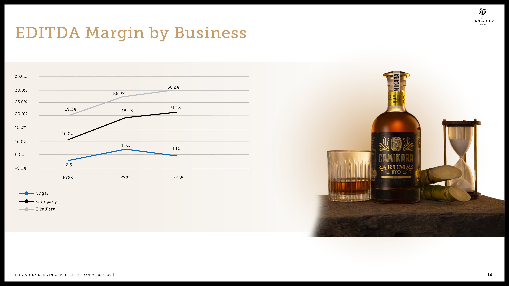

**[Image: f0d4fba6-704d-46e7-8f23-5f95fc3dd357.pdf-0014-01.png (4000x2250, 2135.4KB)]**

<!-- Start of picture text -->
EDITDA Margin by Business 35.0% 30.2% 30.0% 26.9% 25.0% 21.4% 19.3% 18.4% 20.0% 15.0% 10.0% 10.0% 1.5% -1.1% 0.0% -2.3 -5.0% FY23 FY24 FY25 Sugar Company Distillery PICCADILY EARNINGS PRESENTATION @ 2024-25 14 <!-- End of picture text -->

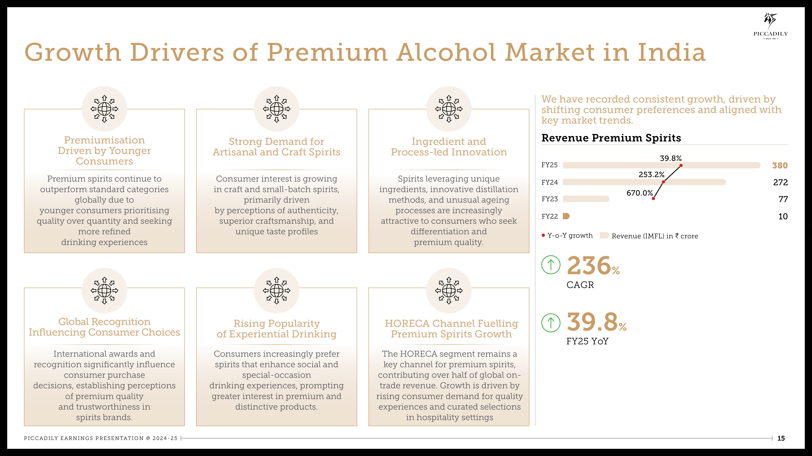

**[Image: f0d4fba6-704d-46e7-8f23-5f95fc3dd357.pdf-0015-00.png (4000x2250, 555.5KB)]**

<!-- Start of picture text -->
Growth Drivers of Premium Alcohol Market in India We have recorded consistent growth, driven by shifting consumer preferences and aligned with key market trends. Revenue Premium S irits Premiumisation  p Strong Demand for  Ingredient and Driven by Younger  Process-led Innovation Artisanal and Craft Spirits 39.8% Consumers FY25 380 253.2% Premium spirits continue to  Consumer interest is growing  Spirits leveraging unique  FY24 272 outperform standard categories  in craft and small-batch spirits,  ingredients, innovative distillation 670.0% globally due to  primarily driven  methods, and unusual ageing  FY23 77 younger consumers prioritising  by perceptions of authenticity,  processes are increasingly FY22 10 quality over quantity and seeking  superior craftsmanship, and   attractive to consumers who seek more refined  unique taste profiles  differentiation and   X Y-o-Y growth Revenue (IMFL) in  H  crore drinking experiences premium quality. 236% CAGR Global Recognition Rising Popularity  HORECA Channel Fuelling 39.8% Influencing Consumer Choices of Experiential Drinking Premium Spirits Growth FY25 YoY International awards and  Consumers increasingly prefer  The HORECA segment remains a recognition significantly influence  spirits that enhance social and  key channel for premium spirits, consumer purchase  special-occasion  contributing over half of global on- decisions, establishing perceptions  drinking experiences, prompting  trade revenue. Growth is driven by of premium quality   greater interest in premium and  rising consumer demand for quality and trustworthiness in  distinctive products. experiences and curated selections spirits brands. in hospitality settings PICCADILY EARNINGS PRESENTATION @ 2024-25 15 <!-- End of picture text -->

**[Image: f0d4fba6-704d-46e7-8f23-5f95fc3dd357.pdf-0016-00.png (170x114, 5.6KB)]**

# Company Overview 

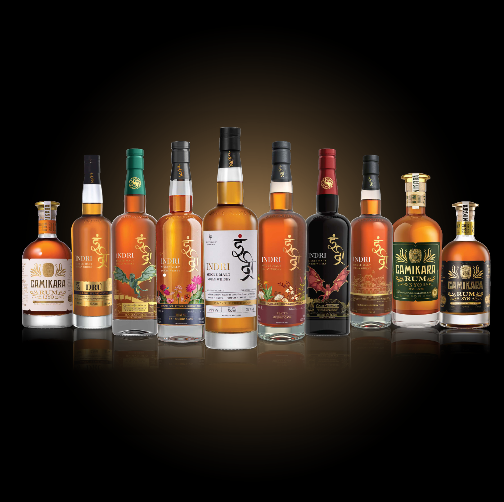

**[Image: f0d4fba6-704d-46e7-8f23-5f95fc3dd357.pdf-0016-02.png (1624x1617, 1661.0KB)]**

16 

PICCADILY EARNINGS PRESENTATION @ 2024-25 

**[Image: f0d4fba6-704d-46e7-8f23-5f95fc3dd357.pdf-0017-00.png (170x114, 5.4KB)]**

## Introduction 

Crafting Excellence, Redefining India’s Premium Alco-Bev Landscape 

Piccadily Agro Industries Ltd. (PAIL) is a name synonymous with heritage, craftsmanship and innovation. Established in 1994, it has grown to become India’s largest independent producer of malt spirits. Our portfolio includes single malt whiskies, cane juice rum and a range of IMFL brands, setting new benchmarks in quality and innovation. Beyond spirits, we manufacture Ethanol, Extra Neutral Alcohol (ENA), DDGS and white crystal sugar. 

With a diverse portfolio of premium alco-bev brands and more products in the offing we endeavour to define the future of niche and premium Indian alcobev spirits in India and overseas. We plan to capitalise organic and inorganic growth opportunities to achieve the above. 

###### Crafting the Future 

We operate across two strategic pillars, each driven by a commitment to excellence and innovation: 

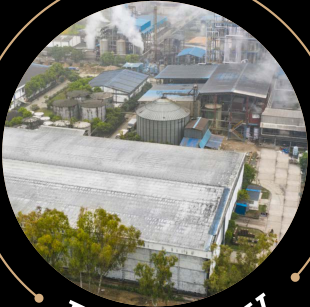

**[Image: f0d4fba6-704d-46e7-8f23-5f95fc3dd357.pdf-0017-07.png (310x307, 169.7KB)]**

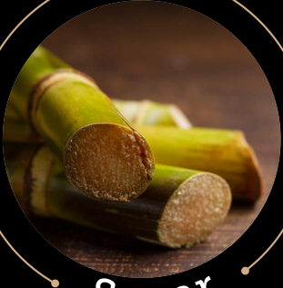

**[Image: f0d4fba6-704d-46e7-8f23-5f95fc3dd357.pdf-0017-08.png (311x317, 137.2KB)]**

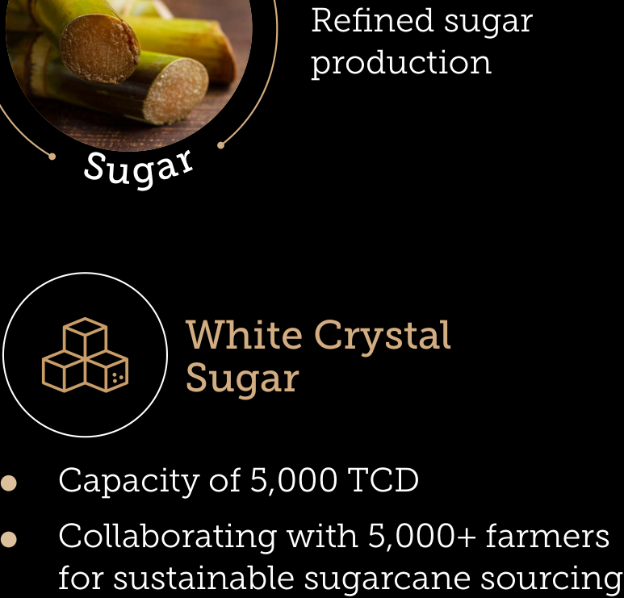

**[Image: f0d4fba6-704d-46e7-8f23-5f95fc3dd357.pdf-0017-09.png (773x741, 168.2KB)]**

<!-- Start of picture text -->
Refined sugar production White Crystal Sugar Capacity of 5,000 TCD Collaborating with 5,000+ farmers for sustainable sugarcane sourcing ug S a r <!-- End of picture text -->

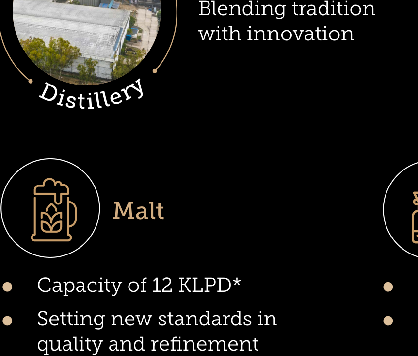

**[Image: f0d4fba6-704d-46e7-8f23-5f95fc3dd357.pdf-0017-10.png (862x733, 153.6KB)]**

<!-- Start of picture text -->
Blending tradition with innovation Malt Capacity of 12 KLPD* Setting new standards in quality and refinement Distillery <!-- End of picture text -->

Extra Neutral Alcohol (ENA) and Ethanol Capacity of 78 KLPD* Contributing to sustainable energy solutions and a greener future 

At the heart of our operations lies a state-of-the-art manufacturing facility in Indri, Haryana, spanning 168 acres. This world-class facility seamlessly integrates cutting-edge technology to produce the above. 

*Excludes on-going expansions 

**17** 

**PICCADILY EARNINGS PRESENTATION @ 2024-25** 

**[Image: f0d4fba6-704d-46e7-8f23-5f95fc3dd357.pdf-0018-00.png (170x114, 5.4KB)]**

### Introduction contd... 

###### Architects of Premium Spirits 

Piccadily Agro is at the forefront of India’s evolving spirits landscape, by driving premiumization and setting new benchmarks in craftsmanship and innovation. With an insightful grasp of market dynamics and a steadfast dedication to fine craftsmanship, we cater to a select clientele who value not only quality but the artistry of innovation. 

Through our flagship brands, we deliver more than just spirits; we offer an experience that transcends the ordinary where timeless tradition meets contemporary mastery. Each creation is a testament to our relentless pursuit of excellence, refining the very essence of premium and redefining the art of indulgence. 

12 KLPD* 

78 KLPD* Ethanol / ENA Plant + 16,000 PAN India Retail Outlets including On Trade 

Malt Plant 

28 Countries 

###### A Portfolio of Distinction 

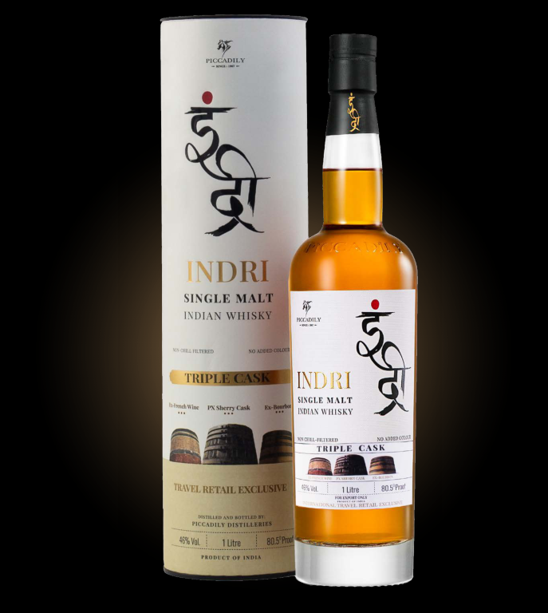

**[Image: f0d4fba6-704d-46e7-8f23-5f95fc3dd357.pdf-0018-10.png (687x768, 335.4KB)]**

Single Malt Whisky Indri, our flagship brand, a trailblazer in redefining India’s premium spirits landscape with unparalleled elegance and character. 

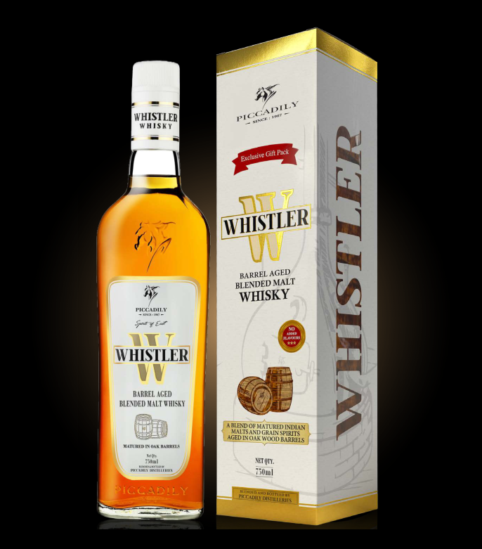

**[Image: f0d4fba6-704d-46e7-8f23-5f95fc3dd357.pdf-0018-12.png (686x781, 422.7KB)]**

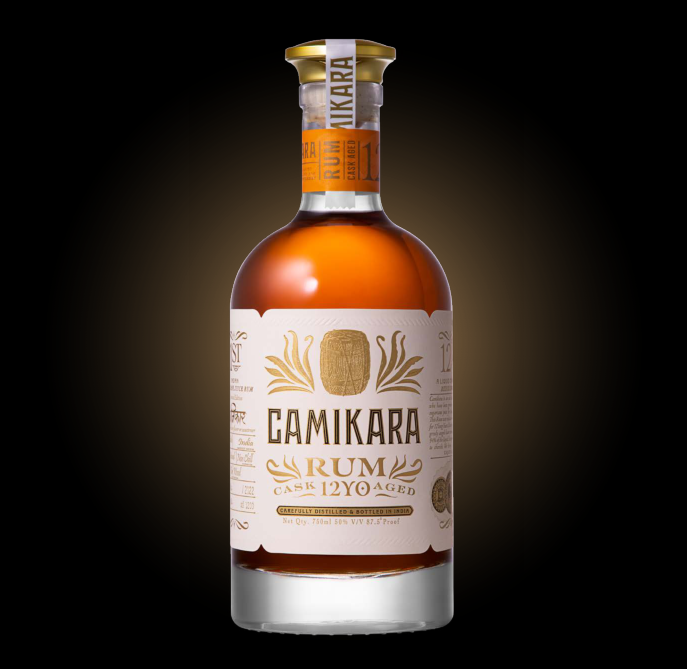

**[Image: f0d4fba6-704d-46e7-8f23-5f95fc3dd357.pdf-0018-13.png (687x669, 244.8KB)]**

Premium Sugarcane Juice Rum 

Premium Sugarcane Blended Malt Juice Rum Whisky Camikara, a bold Whistler is a barrel aged innovation that reimagines blended malt whisky offering the spirit of rum, blending a sophisticated balance of creativity with excellence. tradition and modernity. 

*Excludes on-going expansions 

**18** 

**PICCADILY EARNINGS PRESENTATION @ 2024-25** 

**[Image: f0d4fba6-704d-46e7-8f23-5f95fc3dd357.pdf-0019-00.png (170x114, 9.2KB)]**

## Our Journey 

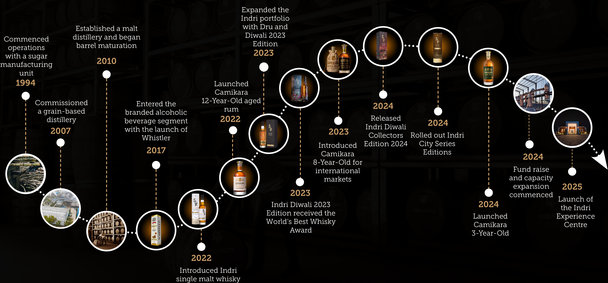

**[Image: f0d4fba6-704d-46e7-8f23-5f95fc3dd357.pdf-0019-02.png (3880x1806, 3743.7KB)]**

<!-- Start of picture text -->
Expanded the Indri portfolio with Dru and Established a malt Diwali 2023 Commenced  distillery and began Edition barrel maturation operations 2023 with a sugar 2010 manufacturing unit 1994 Launched Camikara Commissioned  12-Year-Old aged Entered the 2024 rum a grain-based  branded alcoholic 2022 Released distillery beverage segment 2024 Indri Diwali with the launch of 2007 2023 Collectors  Rolled out Indri Whistler Introduced  Edition 2024 City Series 2017 Editions Camikara 2024 8-Year-Old for Fund raise international markets and capacity expansion  2025 2023 commenced Launch of Indri Diwali 2023  2024 the Indri Edition received the Launched  Experience World’s Best Whisky Camikara  Centre Award 3-Year-Old 2022 Introduced Indri single malt whisky <!-- End of picture text -->

**19** 

**PICCADILY EARNINGS PRESENTATION @ 2024-25** 

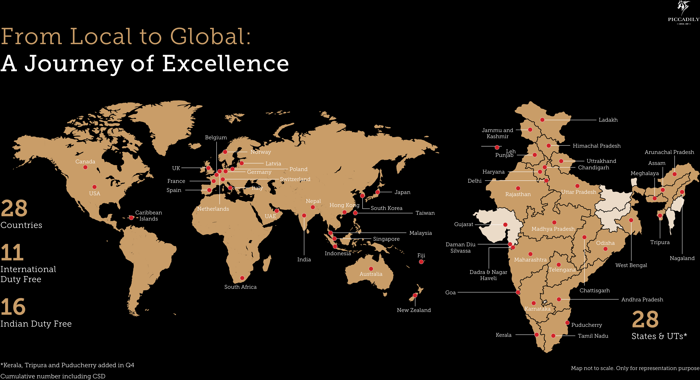

**[Image: f0d4fba6-704d-46e7-8f23-5f95fc3dd357.pdf-0020-00.png (3768x2049, 604.6KB)]**

<!-- Start of picture text -->
From Local to Global: A Journey of Excellence Ladakh Jammu and Belgium Kashmir Himachal Pradesh Norway Leh Arunachal Pradesh Punjab Canada Uttrakhand Latvia Assam UK Poland Chandigarh Germany Haryana Meghalaya Switzerland France Delhi Italy USA Spain Japan Rajasthan Uttar Pradesh Nepal Hong Kong Netherlands South Korea Caribbean  Taiwan 28 UAE Islands Countries Gujarat Madhya Pradesh Malaysia Singapore Odisha Tripura Daman Diu Silvassa Indonesia Fiji 11 India Maharashtra Nagaland West Bengal International  Telengana Australia Dadra & Nagar Duty Free Haveli South Africa Goa Chattisgarh Andhra Pradesh New Zealand Karnataka 16 Indian Duty Free Puducherry 28 Kerala Tamil Nadu States & UTs* *Kerala, Tripura and Puducherry added in Q4 Map not to scale. Only for representation purpose Cumulative number including CSD <!-- End of picture text -->

**20** 

**PICCADILY EARNINGS PRESENTATION @ 2024-25** 

**[Image: f0d4fba6-704d-46e7-8f23-5f95fc3dd357.pdf-0021-00.png (170x114, 5.4KB)]**

## Malt Manufacturing Process 

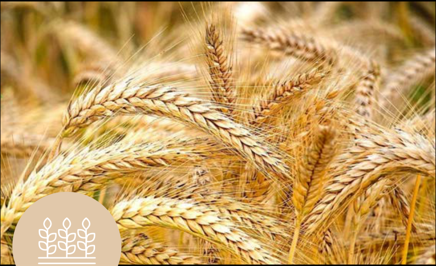

**[Image: f0d4fba6-704d-46e7-8f23-5f95fc3dd357.pdf-0021-02.png (899x548, 1253.1KB)]**

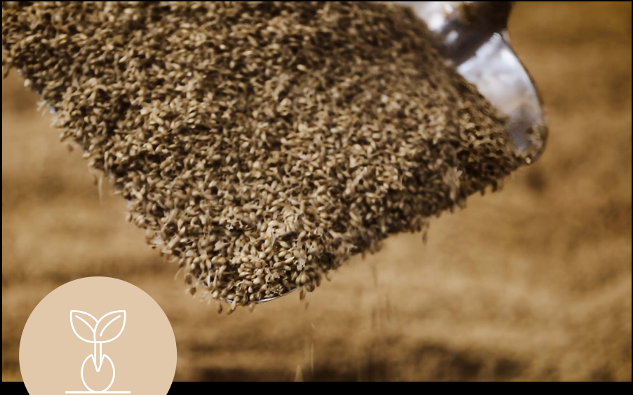

**[Image: f0d4fba6-704d-46e7-8f23-5f95fc3dd357.pdf-0021-03.png (902x563, 858.4KB)]**

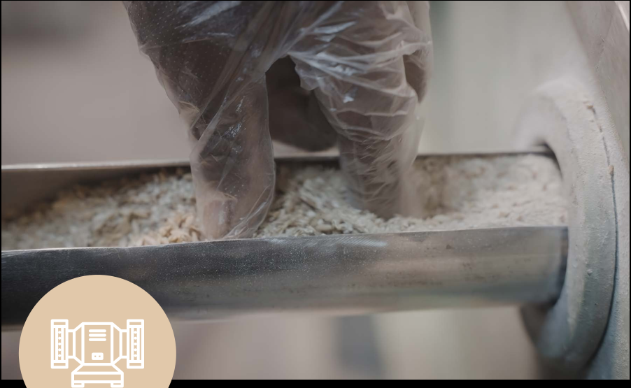

**[Image: f0d4fba6-704d-46e7-8f23-5f95fc3dd357.pdf-0021-04.png (902x555, 477.1KB)]**

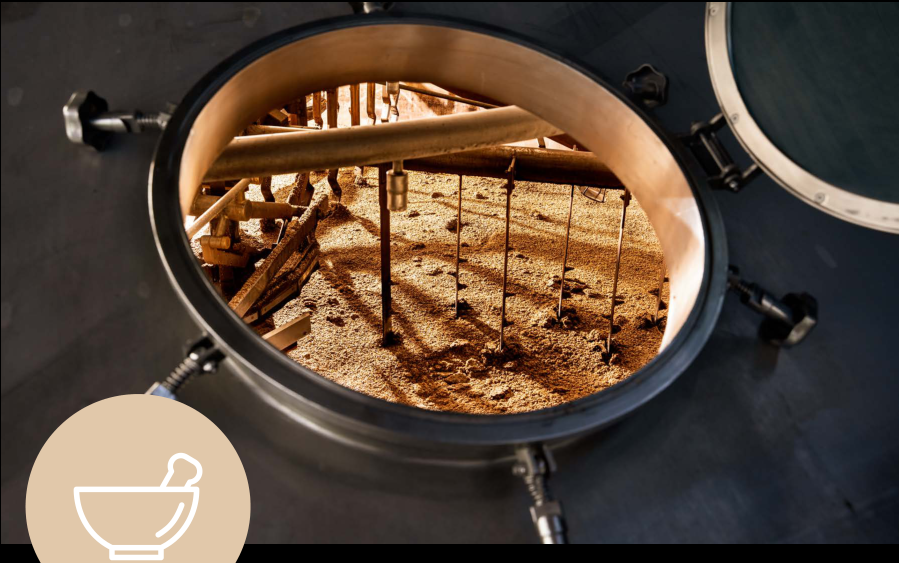

**[Image: f0d4fba6-704d-46e7-8f23-5f95fc3dd357.pdf-0021-05.png (899x563, 694.0KB)]**

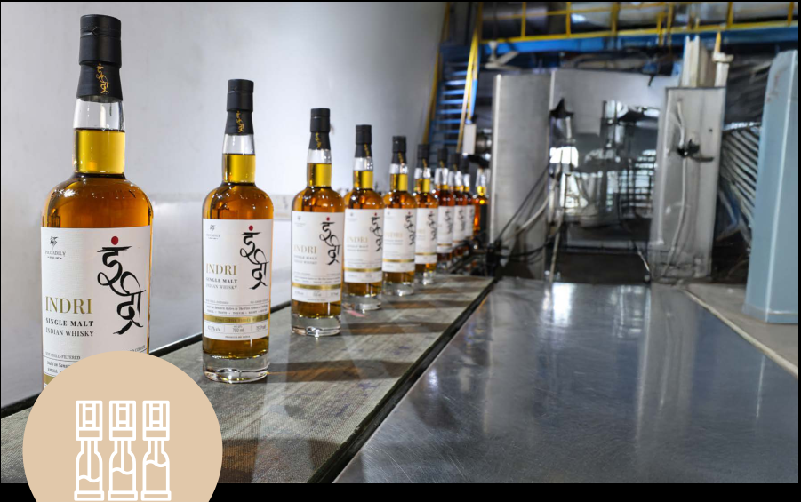

**[Image: f0d4fba6-704d-46e7-8f23-5f95fc3dd357.pdf-0021-06.png (901x565, 773.0KB)]**

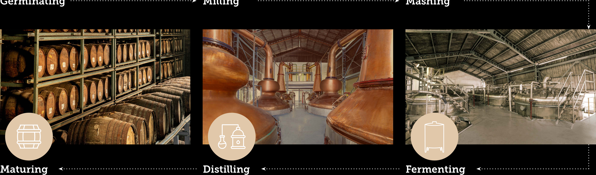

**[Image: f0d4fba6-704d-46e7-8f23-5f95fc3dd357.pdf-0021-07.png (2809x824, 3373.7KB)]**

<!-- Start of picture text -->
Maturing Distilling Fermenting <!-- End of picture text -->

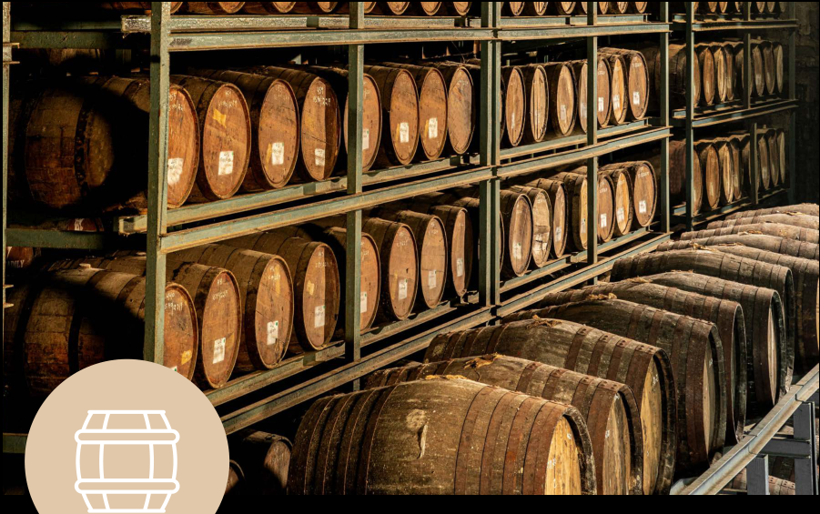

**[Image: f0d4fba6-704d-46e7-8f23-5f95fc3dd357.pdf-0021-08.png (901x565, 1150.0KB)]**

**21** 

**PICCADILY EARNINGS PRESENTATION @ 2024-25** 

**[Image: f0d4fba6-704d-46e7-8f23-5f95fc3dd357.pdf-0022-00.png (170x114, 5.4KB)]**

Indri - Raising The Bar: A Spirit Designed to Inspire Indri is one of the most awarded Indian single malt whisky in the world. Launched in 2022, it has quickly become the fastest-growing single malt globally, earning over 50 prestigious accolades, including ‘Best Indian Single Malt’ and ‘Best Whisky In The World.’ Produced in Indri, a small village in Haryana, using premium 6-row Indian barley from Rajasthan, showcases Indian excellence and innovation. 

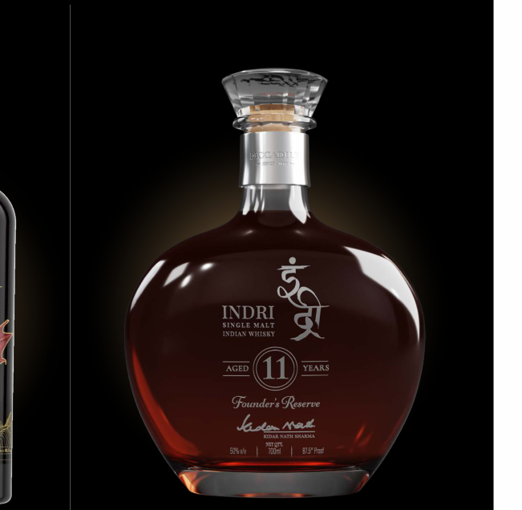

**[Image: f0d4fba6-704d-46e7-8f23-5f95fc3dd357.pdf-0022-02.png (651x636, 177.2KB)]**

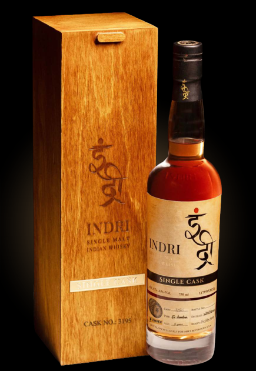

**[Image: f0d4fba6-704d-46e7-8f23-5f95fc3dd357.pdf-0022-03.png (435x631, 434.9KB)]**

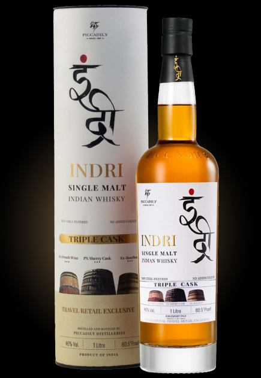

**[Image: f0d4fba6-704d-46e7-8f23-5f95fc3dd357.pdf-0022-04.png (435x631, 246.8KB)]**

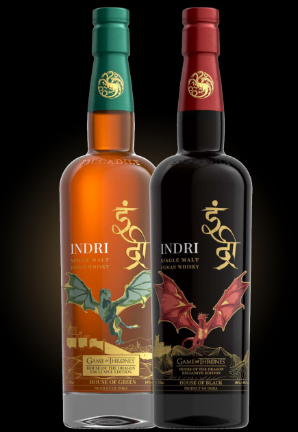

**[Image: f0d4fba6-704d-46e7-8f23-5f95fc3dd357.pdf-0022-05.png (435x631, 254.4KB)]**

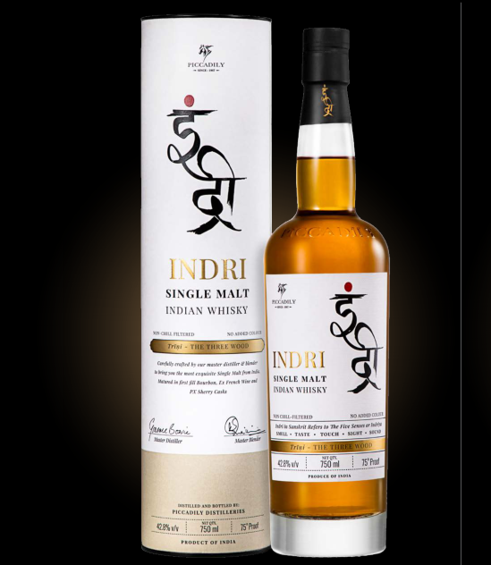

**[Image: f0d4fba6-704d-46e7-8f23-5f95fc3dd357.pdf-0022-06.png (549x632, 240.7KB)]**

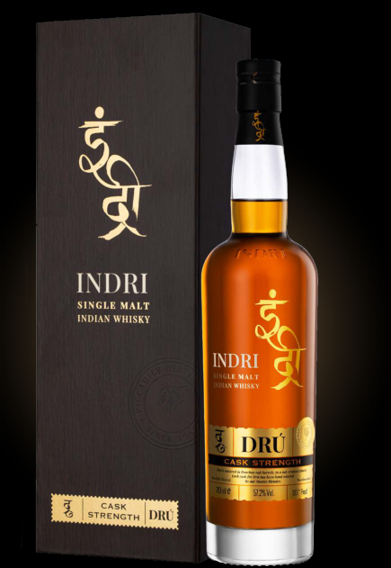

**[Image: f0d4fba6-704d-46e7-8f23-5f95fc3dd357.pdf-0022-07.png (435x631, 239.4KB)]**

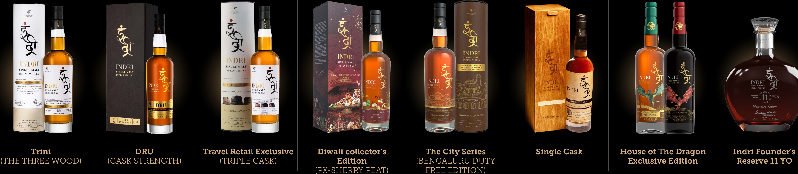

**[Image: f0d4fba6-704d-46e7-8f23-5f95fc3dd357.pdf-0022-08.png (3709x813, 2584.2KB)]**

<!-- Start of picture text -->
Trini DRU Travel Retail Exclusive Diwali collector’s  The City Series  Single Cask  House of The Dragon  Indri Founder’s (THE THREE WOOD) (CASK STRENGTH) (TRIPLE CASK) Edition (BENGALURU DUTY  Exclusive Edition Reserve 11 YO (PX-SHERRY PEAT) FREE EDITION) <!-- End of picture text -->

**22** 

**PICCADILY EARNINGS PRESENTATION @ 2024-25** 

**[Image: f0d4fba6-704d-46e7-8f23-5f95fc3dd357.pdf-0023-00.png (170x114, 5.4KB)]**

Camikara is India’s Camikara, derived from the Sanskrit word meaning “liquid gold,” first Pure Cane Juice Premium Aged Rum, redefining the country’s rum legacy. Aged in American oak barrels, Camikara stands apart with no added colors, flavors, sugar, or spices, delivering a truly authentic and refined experience. 

###### Camikara RUM 12 YO 

Camikara RUM 8 YO 

###### Camikara RUM 3 YO 

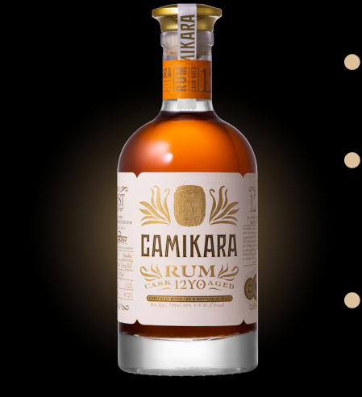

**[Image: f0d4fba6-704d-46e7-8f23-5f95fc3dd357.pdf-0023-05.png (449x493, 151.6KB)]**

Aged for 12 years in American oak barrels. 

Bottled at 50% ABV, offering a rich, complex, and smooth tasting experience. 

Available in select Indian and international markets. 

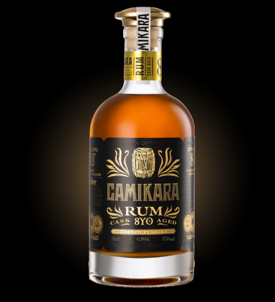

**[Image: f0d4fba6-704d-46e7-8f23-5f95fc3dd357.pdf-0023-09.png (449x493, 160.5KB)]**

A rare, 8-year-aged pure cane juice rum, offering a deep and aromatic profile. 

Aged in American oak barrels for a well-rounded character, with an ABV of 42.8%, delivering a smooth and balanced whisky experience. 

Available in select international markets. 

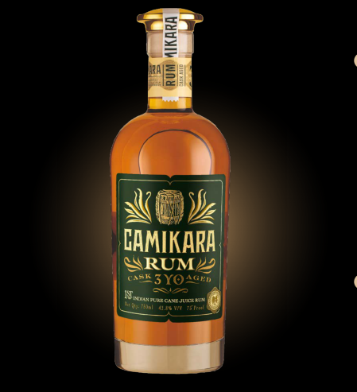

**[Image: f0d4fba6-704d-46e7-8f23-5f95fc3dd357.pdf-0023-13.png (449x493, 142.1KB)]**

Aged for 3 years in American oak barrels and bottled at 42.8% ABV, shattering the myth that rum is only a seasonal spirit. 

Launched Pan-India in On-Trade channels. 

Recognitions 

Recognitions 

Recognitions 

The 1st Indian Rum to ever win a gold medal at the prestigious IWSC wards 2023, with 95 points. 2023 Bartender Spirits awards - GOLD. 

The Spirits Business Global RUM & CACHACA Masters - GOLD 2024. 

The 1st Indian Rum to Ever win a Gold Medal at the Global RUM & CACHACA Masters 2024 USA Spirits ratings - Silver 2024 

The 1st Indian Rum to ever win a Silver medal at the Global RUM & Cachaca Masters 2024 

Camikara 3 YO: Bronze at London Spirits Competition 

**23** 

**PICCADILY EARNINGS PRESENTATION @ 2024-25** 

**[Image: f0d4fba6-704d-46e7-8f23-5f95fc3dd357.pdf-0024-00.png (170x114, 5.4KB)]**

- Mastery in Every Sip: Premium Spirits Across Price Segments Blended Whisky Aged Rum Single Malt Whisky 

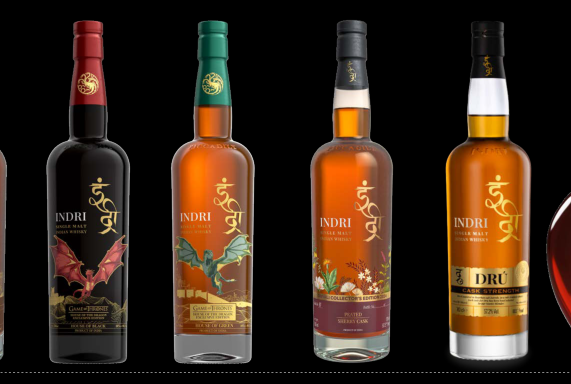

**[Image: f0d4fba6-704d-46e7-8f23-5f95fc3dd357.pdf-0024-03.png (571x384, 209.5KB)]**

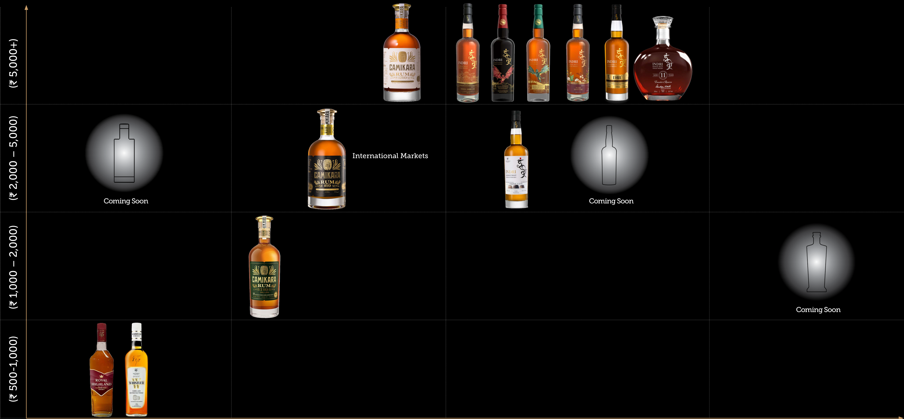

**[Image: f0d4fba6-704d-46e7-8f23-5f95fc3dd357.pdf-0024-04.png (3172x1473, 986.0KB)]**

<!-- Start of picture text -->
International Markets Coming Soon Coming Soon Coming Soon  5,000+) J (  2,000 – 5,000) J (  1,000 – 2,000) J (  500-1,000) J ( <!-- End of picture text -->

**[Image: f0d4fba6-704d-46e7-8f23-5f95fc3dd357.pdf-0024-05.png (476x384, 6.7KB)]**

<!-- Start of picture text -->
ULTRA - LUXURY <!-- End of picture text -->

**[Image: f0d4fba6-704d-46e7-8f23-5f95fc3dd357.pdf-0024-06.png (309x384, 5.2KB)]**

<!-- Start of picture text -->
LUXURY <!-- End of picture text -->

**[Image: f0d4fba6-704d-46e7-8f23-5f95fc3dd357.pdf-0024-07.png (353x384, 5.6KB)]**

<!-- Start of picture text -->
PREMIUM <!-- End of picture text -->

**[Image: f0d4fba6-704d-46e7-8f23-5f95fc3dd357.pdf-0024-08.png (349x384, 5.9KB)]**

<!-- Start of picture text -->
PRESTIGE <!-- End of picture text -->

**24** 

**PICCADILY EARNINGS PRESENTATION @ 2024-25** 

**[Image: f0d4fba6-704d-46e7-8f23-5f95fc3dd357.pdf-0025-00.png (170x114, 5.7KB)]**

## Recent Launches 

Recent Launches contd... 

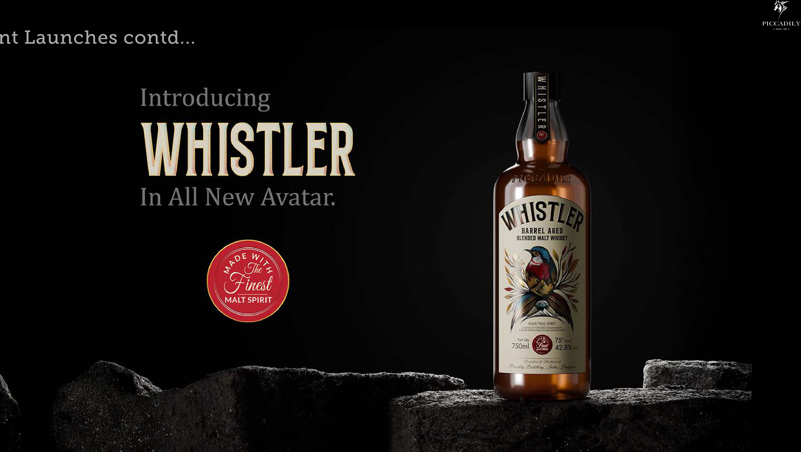

**[Image: f0d4fba6-704d-46e7-8f23-5f95fc3dd357.pdf-0026-01.png (3551x2006, 1016.3KB)]**

<!-- Start of picture text -->
Recent Launches contd... <!-- End of picture text -->

**26** 

**PICCADILY EARNINGS PRESENTATION @ 2024-25** 

**[Image: f0d4fba6-704d-46e7-8f23-5f95fc3dd357.pdf-0027-00.png (170x114, 5.6KB)]**

## Committed to Our Consumer’s Trust 

Piccadily Becomes 1st Indian Alcobev Company To Adapt NFC Technology To Combat Counterfeiting 

Raising the Benchmark: Piccadily sets a new standard in safety, innovation and consumer protection amid rising counterfeit concerns. Smart Verification: Unlike QR codes, NFC tech lets customers tap bottles to instantly verify authenticity and batch details directly via smartphone - no app required. 

Advanced Security: Each bottle includes 128-bit encrypted, tamper-proof smart labels with a unique digital twin code tech. Blockchain Traceability: Ensures transparency, protects against counterfeiting and bottle reuse to boost consumer trust. 

27 

PICCADILY EARNINGS PRESENTATION @ 2024-25 

**[Image: f0d4fba6-704d-46e7-8f23-5f95fc3dd357.pdf-0028-00.png (170x114, 5.4KB)]**

- Camikara Millionaire Bartenders’ Challenge (Jan - April 2025) 

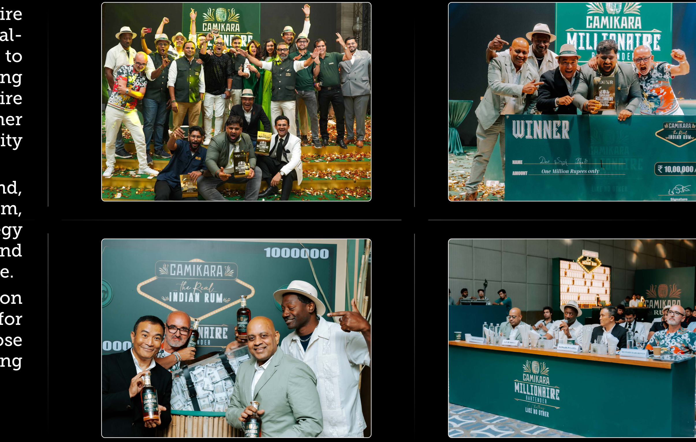

**[Image: f0d4fba6-704d-46e7-8f23-5f95fc3dd357.pdf-0028-02.png (2411x1532, 4650.1KB)]**

<!-- Start of picture text -->
, <!-- End of picture text -->

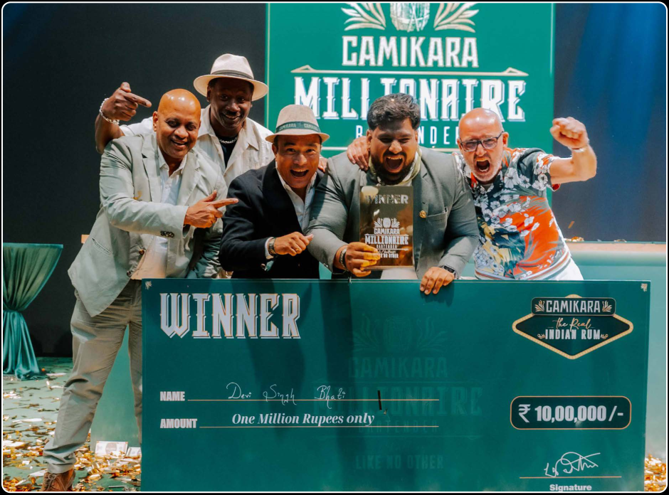

**[Image: f0d4fba6-704d-46e7-8f23-5f95fc3dd357.pdf-0028-03.png (940x696, 1126.9KB)]**

We organised the Camikara Millionaire Bartender Challenge,  a nationallevel cocktail competition created to identify and recognise India’s leading bartenders. The Camikara Millionaire Bartender Challenge brought together top talent from across the hospitality sector. 

**[Image: f0d4fba6-704d-46e7-8f23-5f95fc3dd357.pdf-0028-05.png (24x1532, 2.2KB)]**

Conducted under the Camikara brand, <u>,</u> India’s first pure cane juice aged rum the initiative aligned with our strategy to engage the on-trade channel and enhance product-led brand presence. The winner prize money was `J` 1 million and each participant was insured for `J` 1 million, as a mark of respect for those behind the bar and the skill they bring to their craft. 

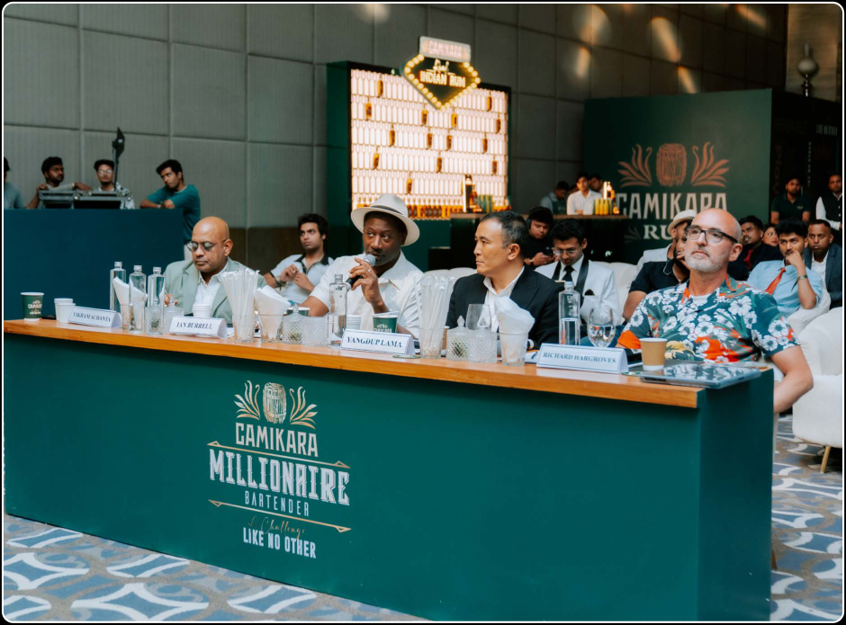

**[Image: f0d4fba6-704d-46e7-8f23-5f95fc3dd357.pdf-0028-07.png (940x695, 925.2KB)]**

**28** 

**PICCADILY EARNINGS PRESENTATION @ 2024-25** 

**[Image: f0d4fba6-704d-46e7-8f23-5f95fc3dd357.pdf-0029-00.png (170x114, 5.4KB)]**

## Camikara Mixers 

Introducing the all-new Camikara NonAlcoholic Mixers in two vibrant flavours – Mojito and Mai Tai. Expertly crafted to elevate every pour, these tropical mixers capture the essence of iconic cocktails. Camikara mixers deliver a premium, bar-quality experience— bringing the spirit of indulgence home, one exquisite sip at a time. 

Camikara Mojito 

Camikara Mai Tai 

Camikara-VAP 

**29** 

**PICCADILY EARNINGS PRESENTATION @ 2024-25** 

**[Image: f0d4fba6-704d-46e7-8f23-5f95fc3dd357.pdf-0030-00.png (170x114, 5.6KB)]**

## Charting the Path to Excellence: 

**[Image: f0d4fba6-704d-46e7-8f23-5f95fc3dd357.pdf-0030-02.png (97x108, 4.0KB)]**

**[Image: f0d4fba6-704d-46e7-8f23-5f95fc3dd357.pdf-0030-03.png (92x87, 1.6KB)]**

##### Innovate and Elevate 

Expand Horizons 

**[Image: f0d4fba6-704d-46e7-8f23-5f95fc3dd357.pdf-0030-06.png (95x95, 3.9KB)]**

**[Image: f0d4fba6-704d-46e7-8f23-5f95fc3dd357.pdf-0030-07.png (107x104, 3.2KB)]**

##### Accelerate Growth 

##### Financial Stability 

**[Image: f0d4fba6-704d-46e7-8f23-5f95fc3dd357.pdf-0031-00.png (170x114, 5.6KB)]**

Scaling for the Future: 

**[Image: f0d4fba6-704d-46e7-8f23-5f95fc3dd357.pdf-0031-02.png (321x339, 17.2KB)]**

**[Image: f0d4fba6-704d-46e7-8f23-5f95fc3dd357.pdf-0031-03.png (90x91, 3.0KB)]**

Indri, Haryana Expansion underway increase distillery capacity from 78 KLPD to 220 KLPD for ENA and from 12 KLPD to 30 KLPD for malt. 

**[Image: f0d4fba6-704d-46e7-8f23-5f95fc3dd357.pdf-0031-05.png (90x90, 3.0KB)]**

Indri, Haryana Barrel storage capacity scaled from being up 45,000 to 100,000 barrels. 

**[Image: f0d4fba6-704d-46e7-8f23-5f95fc3dd357.pdf-0031-07.png (372x530, 15.3KB)]**

**[Image: f0d4fba6-704d-46e7-8f23-5f95fc3dd357.pdf-0031-08.png (114x147, 3.8KB)]**

Mahasamund, Chhattisgarh A 210 KLPD distillery for ENA, 

**[Image: f0d4fba6-704d-46e7-8f23-5f95fc3dd357.pdf-0031-10.png (457x38, 8.2KB)]**

<!-- Start of picture text -->
Portavadie, Scotland <!-- End of picture text -->

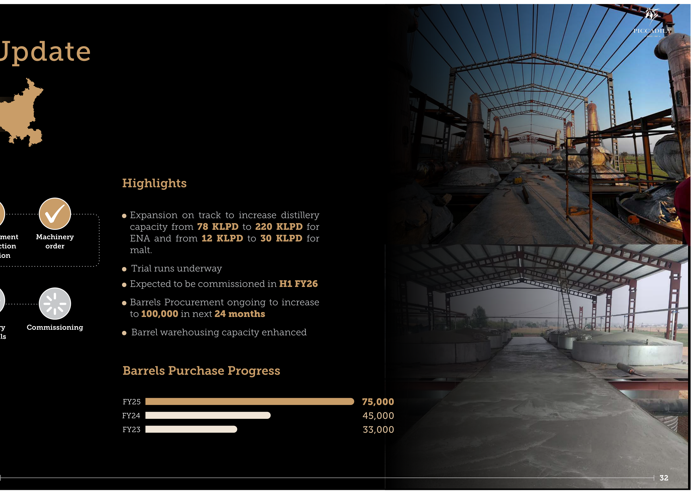

**[Image: f0d4fba6-704d-46e7-8f23-5f95fc3dd357.pdf-0032-00.png (3080x2192, 4319.2KB)]**

<!-- Start of picture text -->
Highlights Capex Year XX  Expansion on track to increase distillery capacity from  78 KLPD to  220 KLPD for Machinery  ENA and from  12 KLPD  to  30 KLPD for order malt. Activity  Trial runs underway  Expected to be commissioned in H1 FY26  Barrels Procurement ongoing to increase Year XX to 100,000 in next 24 months Commissioning  Barrel warehousing capacity enhanced Activity Barrels Purchase Progress Amount  Utilisation FY25 75,000 FY24 45,000 FY23 33,000 32 <!-- End of picture text -->

## Expansion Update 

**[Image: f0d4fba6-704d-46e7-8f23-5f95fc3dd357.pdf-0032-02.png (940x178, 18.8KB)]**

<!-- Start of picture text -->
Indri, Haryana <!-- End of picture text -->

**[Image: f0d4fba6-704d-46e7-8f23-5f95fc3dd357.pdf-0032-03.png (314x43, 3.8KB)]**

<!-- Start of picture text -->
Milestones: <!-- End of picture text -->

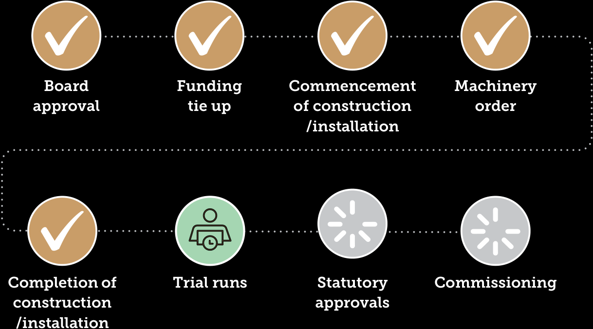

**[Image: f0d4fba6-704d-46e7-8f23-5f95fc3dd357.pdf-0032-04.png (1218x676, 90.8KB)]**

<!-- Start of picture text -->
Board  Funding  Commencement  Machinery approval tie up of construction  order /installation Completion of  Trial runs Statutory  Commissioning construction  approvals /installation <!-- End of picture text -->

**[Image: f0d4fba6-704d-46e7-8f23-5f95fc3dd357.pdf-0032-05.png (368x197, 11.0KB)]**

<!-- Start of picture text -->
Completed Work-In-Progress Pending <!-- End of picture text -->

**PICCADILY EARNINGS PRESENTATION @ 2024-25** 

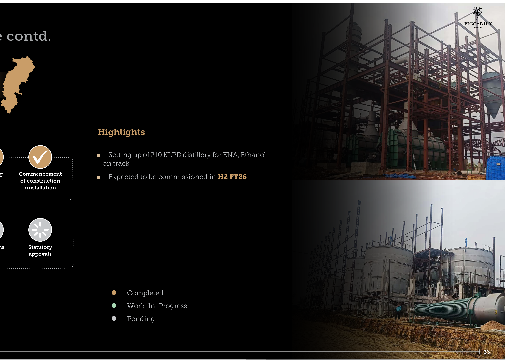

**[Image: f0d4fba6-704d-46e7-8f23-5f95fc3dd357.pdf-0033-00.png (3070x2191, 4207.5KB)]**

<!-- Start of picture text -->
Highlights Capex Setting up of 210 KLPD distillery for ENA, Ethanol  Year XX on track Commencement Expected to be commissioned in H2 FY26 of construction /installation Activity Year XX Statutory appovals Activity Completed Amount  Utilisation Work-In-Progress Pending 33 <!-- End of picture text -->

**[Image: f0d4fba6-704d-46e7-8f23-5f95fc3dd357.pdf-0033-01.png (1201x80, 11.1KB)]**

<!-- Start of picture text -->
Expansion Update contd. <!-- End of picture text -->

**[Image: f0d4fba6-704d-46e7-8f23-5f95fc3dd357.pdf-0033-02.png (892x178, 21.9KB)]**

<!-- Start of picture text -->
Mahasamund, Chhattisgarh <!-- End of picture text -->

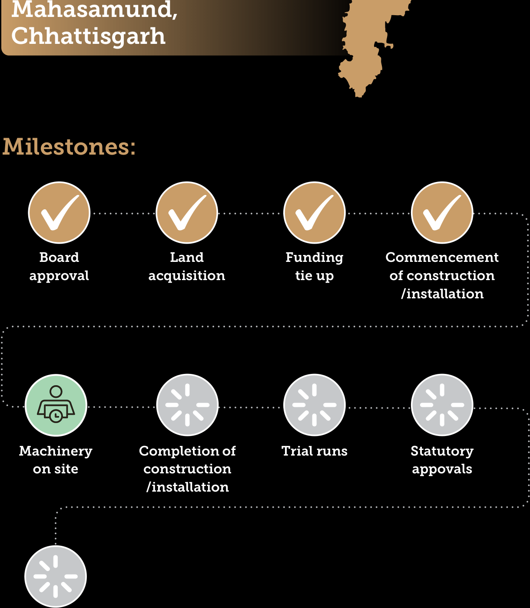

**[Image: f0d4fba6-704d-46e7-8f23-5f95fc3dd357.pdf-0033-03.png (1220x1400, 130.9KB)]**

<!-- Start of picture text -->
Mahasamund, Chhattisgarh Milestones: Board  Land  Funding  Commencement approval acquisition tie up of construction /installation Machinery  Completion of  Trial runs Statutory on site construction  appovals /installation <!-- End of picture text -->

**[Image: f0d4fba6-704d-46e7-8f23-5f95fc3dd357.pdf-0033-04.png (255x32, 3.0KB)]**

<!-- Start of picture text -->
Commissioning <!-- End of picture text -->

**PICCADILY EARNINGS PRESENTATION @ 2024-25** 

### Expansion Update contd. 

Portavadie, Scotland 

##### Milestones: 

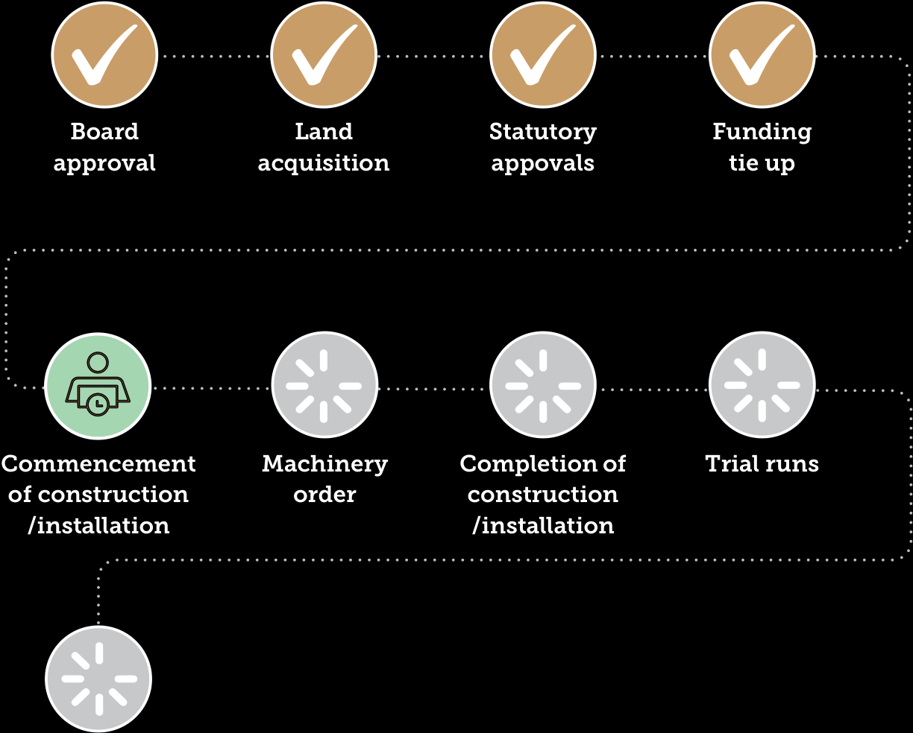

**[Image: f0d4fba6-704d-46e7-8f23-5f95fc3dd357.pdf-0034-03.png (1224x984, 96.3KB)]**

<!-- Start of picture text -->
Board  Land  Statutory  Funding approval acquisition appovals tie up Commencement  Machinery  Completion of  Trial runs of construction  order construction /installation /installation <!-- End of picture text -->

**[Image: f0d4fba6-704d-46e7-8f23-5f95fc3dd357.pdf-0034-04.png (255x32, 3.0KB)]**

<!-- Start of picture text -->
Commissioning <!-- End of picture text -->

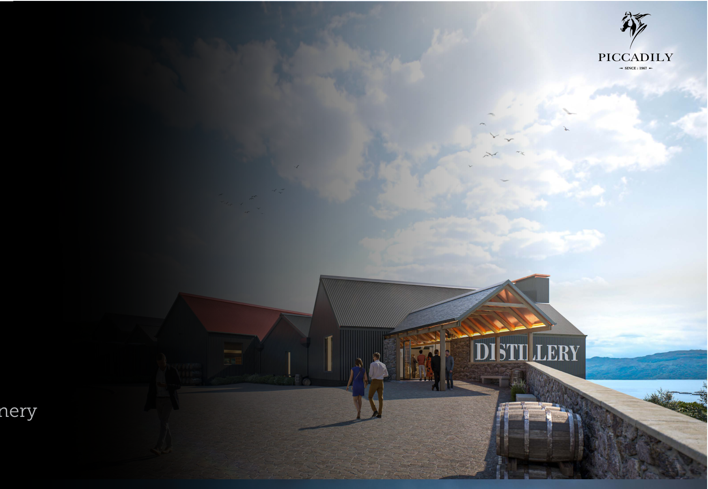

**[Image: f0d4fba6-704d-46e7-8f23-5f95fc3dd357.pdf-0034-05.png (1597x1105, 1752.6KB)]**

<!-- Start of picture text -->
Capex Year XX <!-- End of picture text -->

Highlights 

Evaluation of suitable plant and machinery in progress 

Likely commissioning in FY27 

Activity 

Presence in Scotland provides access to single malt industry - events, players, expertise, channels 

Year XX 

**[Image: f0d4fba6-704d-46e7-8f23-5f95fc3dd357.pdf-0034-12.png (168x40, 13.7KB)]**

<!-- Start of picture text -->
Activity <!-- End of picture text -->

**[Image: f0d4fba6-704d-46e7-8f23-5f95fc3dd357.pdf-0034-13.png (599x34, 17.8KB)]**

<!-- Start of picture text -->
Amount  Utilisation <!-- End of picture text -->

Completed Work-In-Progress Pending 

*3D rendered images 

**34** 

**PICCADILY EARNINGS PRESENTATION @ 2024-25** 

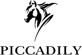

**[Image: f0d4fba6-704d-46e7-8f23-5f95fc3dd357.pdf-0035-00.png (170x114, 5.2KB)]**

## Indri Experience Centre 

Indri Experience Centre launched in Haryana to offer an immersive introduction to whisky making and tasting, enhancing consumer engagement and brand visibility. Includes guided tours, curated tastings and interactive exhibits Features sustainable architecture inspired by Northern Indian havelis Includes recreational golf greens to support premium positioning Built with scalability to support future brand growth. 

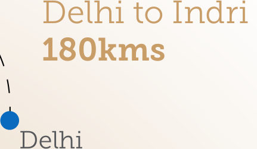

**[Image: f0d4fba6-704d-46e7-8f23-5f95fc3dd357.pdf-0035-03.png (431x251, 15.6KB)]**

<!-- Start of picture text -->
Delhi to Indri 180kms Delhi <!-- End of picture text -->

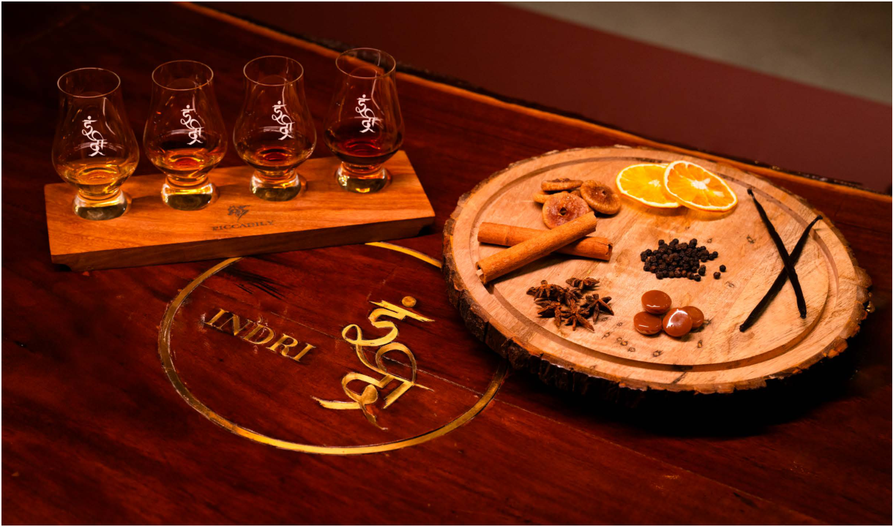

**[Image: f0d4fba6-704d-46e7-8f23-5f95fc3dd357.pdf-0035-04.png (1220x721, 1445.5KB)]**

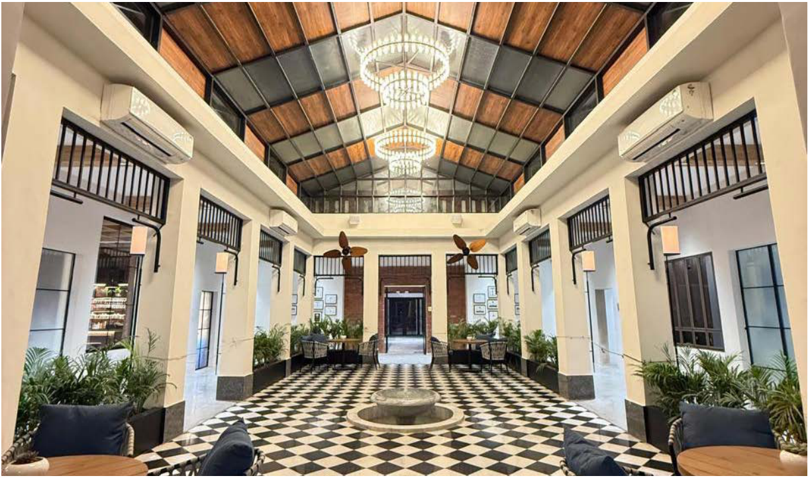

**[Image: f0d4fba6-704d-46e7-8f23-5f95fc3dd357.pdf-0035-05.png (1220x723, 1970.1KB)]**

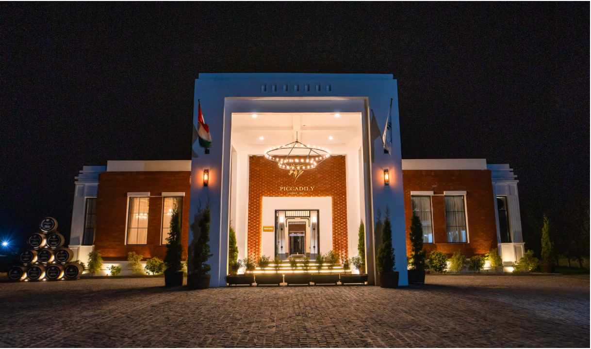

**[Image: f0d4fba6-704d-46e7-8f23-5f95fc3dd357.pdf-0035-06.png (1218x721, 1463.3KB)]**

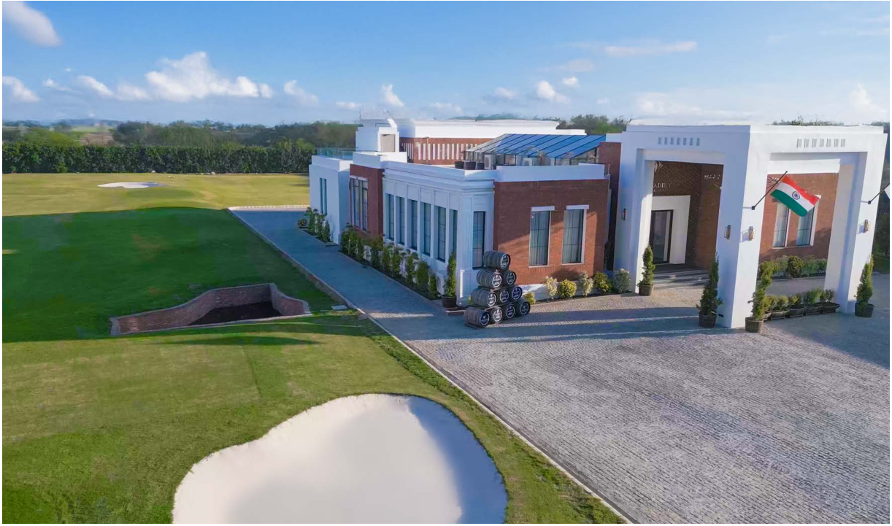

**[Image: f0d4fba6-704d-46e7-8f23-5f95fc3dd357.pdf-0035-07.png (1222x721, 1322.9KB)]**

**35** 

**PICCADILY EARNINGS PRESENTATION @ 2024-25** 

**[Image: f0d4fba6-704d-46e7-8f23-5f95fc3dd357.pdf-0036-00.png (170x114, 5.6KB)]**

## Awards and Recognition: Q4 FY25 

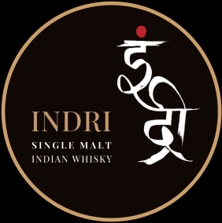

**[Image: f0d4fba6-704d-46e7-8f23-5f95fc3dd357.pdf-0036-02.png (282x284, 26.1KB)]**

**[Image: f0d4fba6-704d-46e7-8f23-5f95fc3dd357.pdf-0036-03.png (832x24, 2.2KB)]**

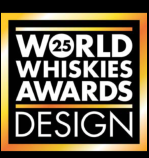

**[Image: f0d4fba6-704d-46e7-8f23-5f95fc3dd357.pdf-0036-04.png (149x158, 32.2KB)]**

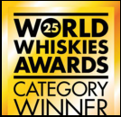

**[Image: f0d4fba6-704d-46e7-8f23-5f95fc3dd357.pdf-0036-05.png (134x130, 42.7KB)]**

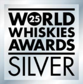

**[Image: f0d4fba6-704d-46e7-8f23-5f95fc3dd357.pdf-0036-06.png (140x142, 33.7KB)]**

Single Cask, Cask 03:Category Winner & Gold (Small Batch Single Indri Sauternes Wine Cask, 47050: Malt, No Age Statement) at World Silver at World Whiskies Awards Whiskies Awards Indri House of Black : Silver for Label Indri House of Green: Bronze at World Design at World Whiskies Awards Whiskies Awards Design 

Indri House of Black: Gold for Limited Edition Design at World Whiskies Awards Design Indri House of Black: Gold for Special Edition Design at World Whiskies Awards Design Indri DCE ‘24 : Gold for Special Edition Design at World Whiskies Awards Design 

**[Image: f0d4fba6-704d-46e7-8f23-5f95fc3dd357.pdf-0036-09.png (2430x26, 2.1KB)]**

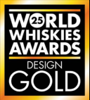

**[Image: f0d4fba6-704d-46e7-8f23-5f95fc3dd357.pdf-0036-10.png (128x142, 28.1KB)]**

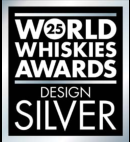

**[Image: f0d4fba6-704d-46e7-8f23-5f95fc3dd357.pdf-0036-11.png (130x142, 20.9KB)]**

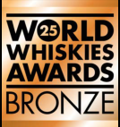

**[Image: f0d4fba6-704d-46e7-8f23-5f95fc3dd357.pdf-0036-12.png (134x142, 47.9KB)]**

**[Image: f0d4fba6-704d-46e7-8f23-5f95fc3dd357.pdf-0036-13.png (2430x26, 2.1KB)]**

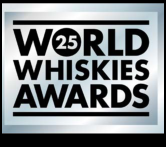

**[Image: f0d4fba6-704d-46e7-8f23-5f95fc3dd357.pdf-0036-14.png (166x147, 39.9KB)]**

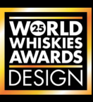

**[Image: f0d4fba6-704d-46e7-8f23-5f95fc3dd357.pdf-0036-15.png (132x145, 27.1KB)]**

Indri DCE ‘24: Silver at World Whiskies Awards Indri House of Black: Silver at World Whiskies Award Indri House of Green: Silver for Special Edition Design at World Whiskies Awards Design Indri House of Green : Silver for Limited Edition Design at World Whiskies Awards Design 

**[Image: f0d4fba6-704d-46e7-8f23-5f95fc3dd357.pdf-0036-17.png (1197x24, 1.5KB)]**

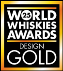

**[Image: f0d4fba6-704d-46e7-8f23-5f95fc3dd357.pdf-0036-18.png (130x145, 28.1KB)]**

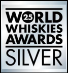

**[Image: f0d4fba6-704d-46e7-8f23-5f95fc3dd357.pdf-0036-19.png (134x145, 31.7KB)]**

Indri DCE ‘24 : Gold for Limited Edition Design at World Whiskies Awards Design 

**[Image: f0d4fba6-704d-46e7-8f23-5f95fc3dd357.pdf-0036-21.png (1197x23, 1.5KB)]**

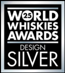

**[Image: f0d4fba6-704d-46e7-8f23-5f95fc3dd357.pdf-0036-22.png (130x145, 20.9KB)]**

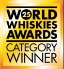

**[Image: f0d4fba6-704d-46e7-8f23-5f95fc3dd357.pdf-0036-23.png (132x142, 47.7KB)]**

Indri Founder’s Reserve : Category Winner & Gold (Single Malt 12 Years & Under) at World Whiskies Awards 

**[Image: f0d4fba6-704d-46e7-8f23-5f95fc3dd357.pdf-0036-25.png (1197x24, 1.7KB)]**

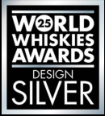

**[Image: f0d4fba6-704d-46e7-8f23-5f95fc3dd357.pdf-0036-26.png (130x144, 20.9KB)]**

Indri Refill Oloroso Sherry Cask 03 : Category Winner & Gold (Single Cask Single Malt, No Age Statement) at World Whiskies Awards 

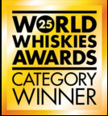

**[Image: f0d4fba6-704d-46e7-8f23-5f95fc3dd357.pdf-0036-28.png (134x143, 47.8KB)]**

**[Image: f0d4fba6-704d-46e7-8f23-5f95fc3dd357.pdf-0036-29.png (1195x23, 1.7KB)]**

**[Image: f0d4fba6-704d-46e7-8f23-5f95fc3dd357.pdf-0036-30.png (282x284, 55.1KB)]**

**[Image: f0d4fba6-704d-46e7-8f23-5f95fc3dd357.pdf-0036-31.png (682x24, 2.2KB)]**

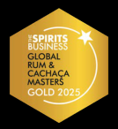

**[Image: f0d4fba6-704d-46e7-8f23-5f95fc3dd357.pdf-0036-32.png (134x146, 23.0KB)]**

Camikara 3 YO: Gold at Rum Cachaca Masters 2025 Camikara 3 YO: Bronze at London Spirits Competition Piccadily 

**[Image: f0d4fba6-704d-46e7-8f23-5f95fc3dd357.pdf-0036-34.png (1012x24, 1.8KB)]**

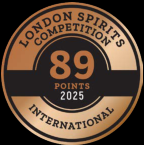

**[Image: f0d4fba6-704d-46e7-8f23-5f95fc3dd357.pdf-0036-35.png (144x145, 36.9KB)]**

**[Image: f0d4fba6-704d-46e7-8f23-5f95fc3dd357.pdf-0036-36.png (75x93, 3.5KB)]**

**[Image: f0d4fba6-704d-46e7-8f23-5f95fc3dd357.pdf-0036-37.png (682x23, 2.7KB)]**

**[Image: f0d4fba6-704d-46e7-8f23-5f95fc3dd357.pdf-0036-38.png (144x145, 37.8KB)]**

Sales Team of the Year (Highly Commended) at Icons of Whisky Master Distiller of the Year (Highly Commended) at Icons of Whisky Visitor Attraction of the Year (Highly Commended) at Icons of Whisky 

**[Image: f0d4fba6-704d-46e7-8f23-5f95fc3dd357.pdf-0036-40.png (1012x26, 1.4KB)]**

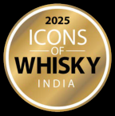

**[Image: f0d4fba6-704d-46e7-8f23-5f95fc3dd357.pdf-0036-41.png (144x145, 37.8KB)]**

**[Image: f0d4fba6-704d-46e7-8f23-5f95fc3dd357.pdf-0036-42.png (1012x26, 1.4KB)]**

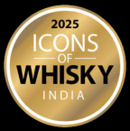

**[Image: f0d4fba6-704d-46e7-8f23-5f95fc3dd357.pdf-0036-43.png (144x145, 37.8KB)]**

**36** 

**PICCADILY EARNINGS PRESENTATION @ 2024-25** 

**[Image: f0d4fba6-704d-46e7-8f23-5f95fc3dd357.pdf-0037-00.png (170x114, 5.4KB)]**

### Awards and Recognition (FY24-25) 

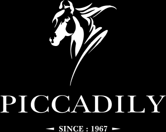

**[Image: f0d4fba6-704d-46e7-8f23-5f95fc3dd357.pdf-0037-02.png (334x267, 14.7KB)]**

Piccadily Agro Industries Limited 

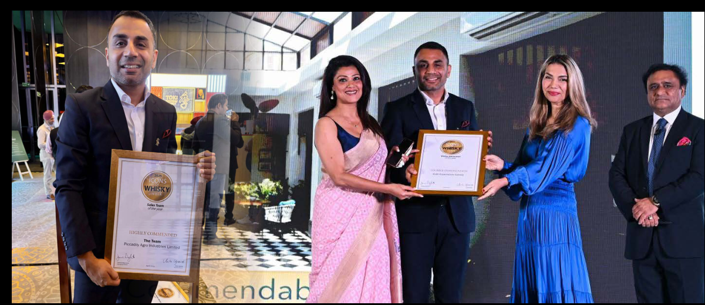

**[Image: f0d4fba6-704d-46e7-8f23-5f95fc3dd357.pdf-0037-04.png (1201x520, 1322.9KB)]**

Awarded Sales Team of the YearHighly commended at Icons of Whisky 2025 

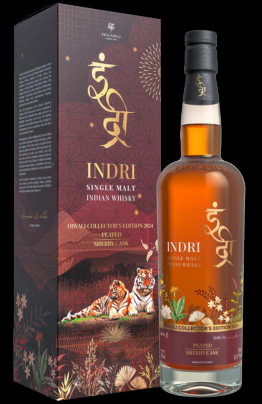

**[Image: f0d4fba6-704d-46e7-8f23-5f95fc3dd357.pdf-0037-06.png (262x404, 180.4KB)]**

Indri Diwali Collector’s Edition 2024 

**[Image: f0d4fba6-704d-46e7-8f23-5f95fc3dd357.pdf-0037-08.png (583x23, 2.3KB)]**

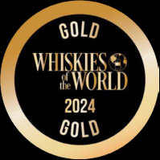

**[Image: f0d4fba6-704d-46e7-8f23-5f95fc3dd357.pdf-0037-09.png (199x199, 51.8KB)]**

Gold at the Whiskies of the World 2024 

**[Image: f0d4fba6-704d-46e7-8f23-5f95fc3dd357.pdf-0037-11.png (859x24, 1.5KB)]**

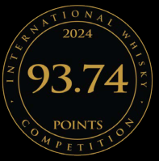

**[Image: f0d4fba6-704d-46e7-8f23-5f95fc3dd357.pdf-0037-12.png (197x199, 43.8KB)]**

Category Winner – Best Indian Whisky at the International Whisky Competition 2024 

**[Image: f0d4fba6-704d-46e7-8f23-5f95fc3dd357.pdf-0037-14.png (859x24, 1.7KB)]**

Best world whisky and Platinum at Las Vegas global spirit awards 2024 

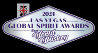

**[Image: f0d4fba6-704d-46e7-8f23-5f95fc3dd357.pdf-0037-16.png (199x107, 29.9KB)]**

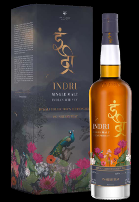

**[Image: f0d4fba6-704d-46e7-8f23-5f95fc3dd357.pdf-0037-17.png (283x410, 153.3KB)]**

Indri Diwali Collector’s Edition 2023 

**[Image: f0d4fba6-704d-46e7-8f23-5f95fc3dd357.pdf-0037-19.png (582x23, 2.3KB)]**

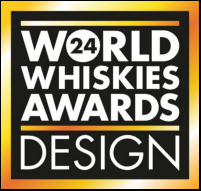

**[Image: f0d4fba6-704d-46e7-8f23-5f95fc3dd357.pdf-0037-20.png (201x191, 56.6KB)]**

Best Limited Edition at the World Whiskies Awards 2024 

**[Image: f0d4fba6-704d-46e7-8f23-5f95fc3dd357.pdf-0037-22.png (862x24, 1.5KB)]**

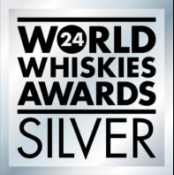

**[Image: f0d4fba6-704d-46e7-8f23-5f95fc3dd357.pdf-0037-23.png (197x198, 53.4KB)]**

Silver at the World Whiskies Awards 2024 

**37** 

**PICCADILY EARNINGS PRESENTATION @ 2024-25** 

**[Image: f0d4fba6-704d-46e7-8f23-5f95fc3dd357.pdf-0038-00.png (170x114, 5.4KB)]**

### Awards and Recognition (FY24-25) contd... 

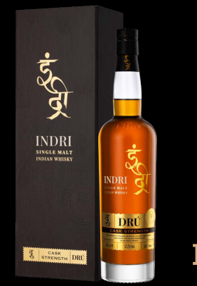

**[Image: f0d4fba6-704d-46e7-8f23-5f95fc3dd357.pdf-0038-02.png (281x406, 103.8KB)]**

Indri Dru Single Malt of the Year & Whisky of the Year at the USA Spirits Ratings 2024 Best Spirit of the Year – Country Category at the USA Spirits Ratings 2024 Gold (95 points) at the USA Spirits Ratings 2024 Superior gold winner at Tokyo Whisky & Spirits Competition 2024 

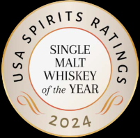

**[Image: f0d4fba6-704d-46e7-8f23-5f95fc3dd357.pdf-0038-04.png (201x199, 53.2KB)]**

**[Image: f0d4fba6-704d-46e7-8f23-5f95fc3dd357.pdf-0038-05.png (862x24, 1.5KB)]**

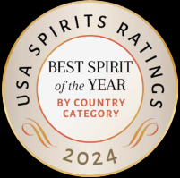

**[Image: f0d4fba6-704d-46e7-8f23-5f95fc3dd357.pdf-0038-06.png (201x199, 56.3KB)]**

**[Image: f0d4fba6-704d-46e7-8f23-5f95fc3dd357.pdf-0038-07.png (862x24, 1.7KB)]**

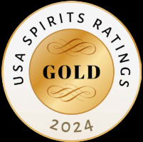

**[Image: f0d4fba6-704d-46e7-8f23-5f95fc3dd357.pdf-0038-08.png (201x199, 55.9KB)]**

**[Image: f0d4fba6-704d-46e7-8f23-5f95fc3dd357.pdf-0038-09.png (862x24, 1.6KB)]**

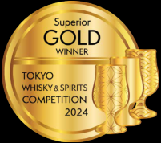

**[Image: f0d4fba6-704d-46e7-8f23-5f95fc3dd357.pdf-0038-10.png (201x178, 64.2KB)]**

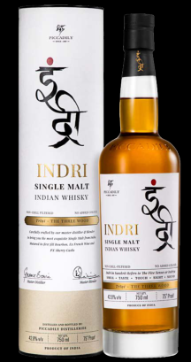

**[Image: f0d4fba6-704d-46e7-8f23-5f95fc3dd357.pdf-0038-11.png (216x409, 107.5KB)]**

Indri – Trini Best World Whisky at Whisky Explorer Canada 2024 Gold at the USA Spirits Ratings 2024 Best New World Whiskey at Vinepair 2024 

**[Image: f0d4fba6-704d-46e7-8f23-5f95fc3dd357.pdf-0038-13.png (583x23, 2.3KB)]**

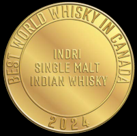

**[Image: f0d4fba6-704d-46e7-8f23-5f95fc3dd357.pdf-0038-14.png (201x199, 68.8KB)]**

**[Image: f0d4fba6-704d-46e7-8f23-5f95fc3dd357.pdf-0038-15.png (862x24, 1.5KB)]**

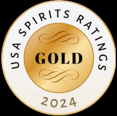

**[Image: f0d4fba6-704d-46e7-8f23-5f95fc3dd357.pdf-0038-16.png (201x199, 56.2KB)]**

**[Image: f0d4fba6-704d-46e7-8f23-5f95fc3dd357.pdf-0038-17.png (862x24, 1.7KB)]**

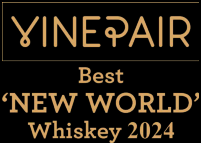

**[Image: f0d4fba6-704d-46e7-8f23-5f95fc3dd357.pdf-0038-18.png (201x143, 19.4KB)]**

**[Image: f0d4fba6-704d-46e7-8f23-5f95fc3dd357.pdf-0038-19.png (862x24, 1.6KB)]**

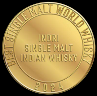

**[Image: f0d4fba6-704d-46e7-8f23-5f95fc3dd357.pdf-0038-20.png (201x199, 66.9KB)]**

Best Single Malt World Whisky at Whisky Explorer Canada 2024 

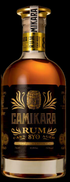

**[Image: f0d4fba6-704d-46e7-8f23-5f95fc3dd357.pdf-0038-22.png (141x363, 79.9KB)]**

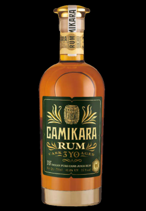

**[Image: f0d4fba6-704d-46e7-8f23-5f95fc3dd357.pdf-0038-23.png (246x355, 74.7KB)]**

Camikara 8 YO Pure Cane Juice Rum Camikara 3 YO Gold at World Rum Awards 2024 

**[Image: f0d4fba6-704d-46e7-8f23-5f95fc3dd357.pdf-0038-25.png (582x23, 2.2KB)]**

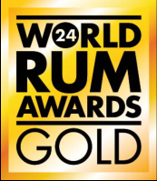

**[Image: f0d4fba6-704d-46e7-8f23-5f95fc3dd357.pdf-0038-26.png (173x199, 78.8KB)]**

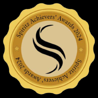

**[Image: f0d4fba6-704d-46e7-8f23-5f95fc3dd357.pdf-0038-27.png (197x198, 53.4KB)]**

Product Debut of the Year at the Spiritz Achiever’s Awards 2024 

**[Image: f0d4fba6-704d-46e7-8f23-5f95fc3dd357.pdf-0038-29.png (860x24, 1.5KB)]**

**[Image: f0d4fba6-704d-46e7-8f23-5f95fc3dd357.pdf-0038-30.png (860x24, 1.5KB)]**

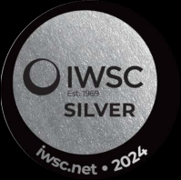

**[Image: f0d4fba6-704d-46e7-8f23-5f95fc3dd357.pdf-0038-31.png (199x198, 47.5KB)]**

**[Image: f0d4fba6-704d-46e7-8f23-5f95fc3dd357.pdf-0038-32.png (159x199, 74.0KB)]**

Silver at International Wine & Spirits Competition 2024 

Style Winner at World Rum Awards 2024 Gold at Global Rum & Cachaça Masters 2024 

**[Image: f0d4fba6-704d-46e7-8f23-5f95fc3dd357.pdf-0038-35.png (860x24, 1.7KB)]**

**[Image: f0d4fba6-704d-46e7-8f23-5f95fc3dd357.pdf-0038-36.png (860x24, 1.7KB)]**

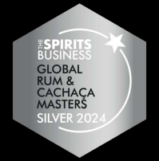

**[Image: f0d4fba6-704d-46e7-8f23-5f95fc3dd357.pdf-0038-37.png (199x202, 21.3KB)]**

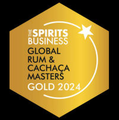

**[Image: f0d4fba6-704d-46e7-8f23-5f95fc3dd357.pdf-0038-38.png (201x202, 40.3KB)]**

Silver at Global Rum & Cachaça Masters 2024 

**[Image: f0d4fba6-704d-46e7-8f23-5f95fc3dd357.pdf-0038-40.png (860x24, 1.6KB)]**

**[Image: f0d4fba6-704d-46e7-8f23-5f95fc3dd357.pdf-0038-41.png (860x24, 1.6KB)]**

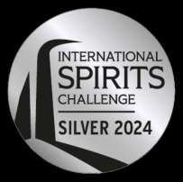

**[Image: f0d4fba6-704d-46e7-8f23-5f95fc3dd357.pdf-0038-42.png (203x202, 32.2KB)]**

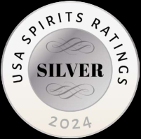

**[Image: f0d4fba6-704d-46e7-8f23-5f95fc3dd357.pdf-0038-43.png (201x199, 33.3KB)]**

Silver at the International Spirits Challenge 2024 

Silver at the USA Spirits Ratings 2024 

**38** 

**PICCADILY EARNINGS PRESENTATION @ 2024-25** 

**[Image: f0d4fba6-704d-46e7-8f23-5f95fc3dd357.pdf-0039-00.png (170x114, 5.6KB)]**

Community Empowerment We believe sustainable business growth must go hand in hand with community upliftment. Our CSR initiatives focus on empowering under-resourced communities through education, healthcare and promoting responsible natural resource management. 

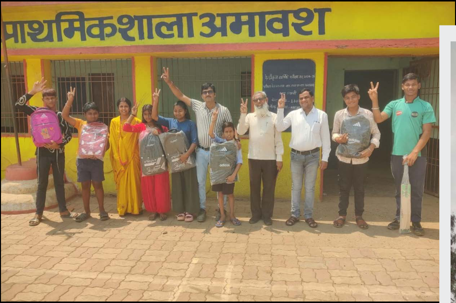

**[Image: f0d4fba6-704d-46e7-8f23-5f95fc3dd357.pdf-0039-02.png (927x615, 1005.5KB)]**

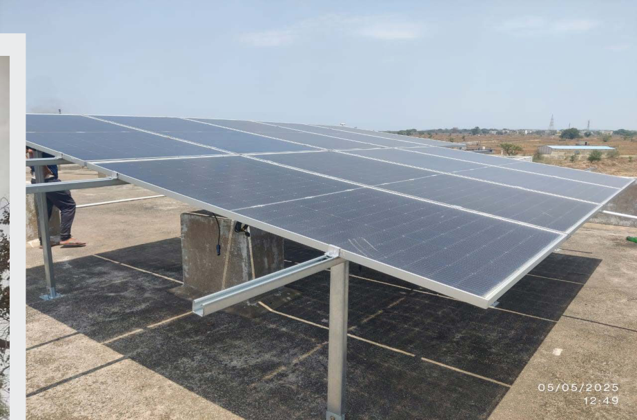

**[Image: f0d4fba6-704d-46e7-8f23-5f95fc3dd357.pdf-0039-03.png (923x609, 774.5KB)]**

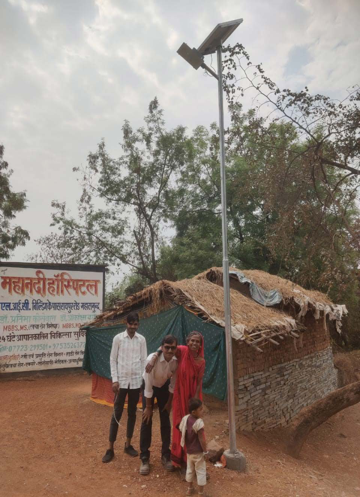

**[Image: f0d4fba6-704d-46e7-8f23-5f95fc3dd357.pdf-0039-04.png (875x1206, 1904.4KB)]**

**[Image: f0d4fba6-704d-46e7-8f23-5f95fc3dd357.pdf-0039-05.png (631x97, 11.1KB)]**

<!-- Start of picture text -->
Solar Panels at Village Birmajra, Bir Bhadson <!-- End of picture text -->

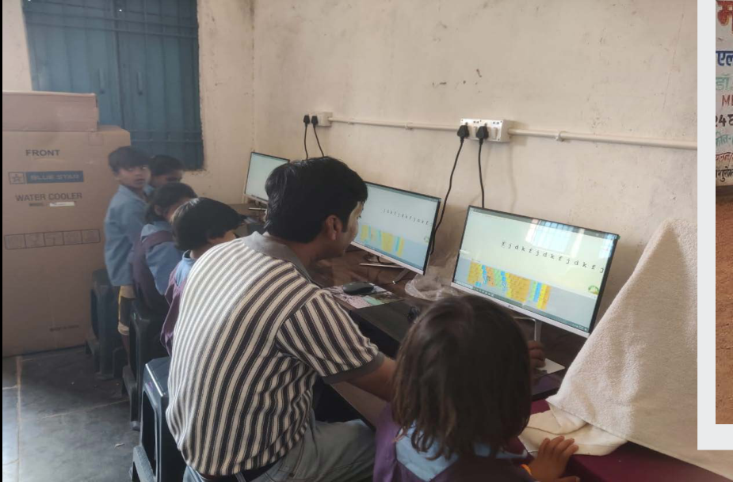

**[Image: f0d4fba6-704d-46e7-8f23-5f95fc3dd357.pdf-0039-06.png (925x609, 760.2KB)]**

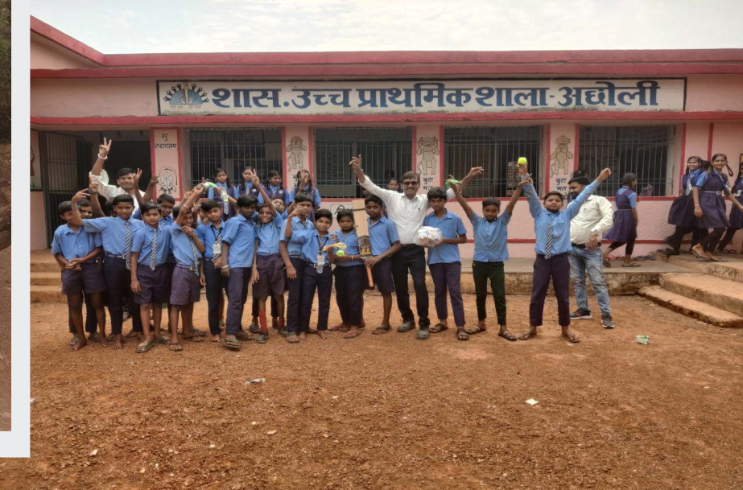

**[Image: f0d4fba6-704d-46e7-8f23-5f95fc3dd357.pdf-0039-07.png (923x609, 1121.0KB)]**

**[Image: f0d4fba6-704d-46e7-8f23-5f95fc3dd357.pdf-0039-08.png (512x104, 10.2KB)]**

<!-- Start of picture text -->
Solar Panel Street Light at Bir Majra, Karnal <!-- End of picture text -->

**[Image: f0d4fba6-704d-46e7-8f23-5f95fc3dd357.pdf-0039-09.png (780x101, 13.1KB)]**

<!-- Start of picture text -->
Distribution of Sports Kits in Schools at Beltukri, Acholi <!-- End of picture text -->

**39** 

PICCADILY EARNINGS PRESENTATION @ 2024-25 

**[Image: f0d4fba6-704d-46e7-8f23-5f95fc3dd357.pdf-0040-00.png (170x114, 8.1KB)]**

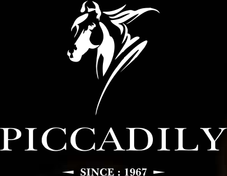

**[Image: f0d4fba6-704d-46e7-8f23-5f95fc3dd357.pdf-0040-01.png (386x300, 19.3KB)]**

For Further Information Contact: Investors Relations Piccadily Agro Industries Limited Ph.: +91-172-2997651 (Monday to Friday; IST 10 am to 5 pm) Website: www.picagro.com Email: piccadilygroup34@rediffmail.com 

40 

PICCADILY EARNINGS PRESENTATION @ 2024-25 

---

## Extracted Images

| # | File | Dimensions | Size |
|---|------|------------|------|
| 1 | f0d4fba6-704d-46e7-8f23-5f95fc3dd357.pdf-0002-00.png | 170x114 | 28.8KB |
| 2 | f0d4fba6-704d-46e7-8f23-5f95fc3dd357.pdf-0003-00.png | 170x114 | 6.0KB |
| 3 | f0d4fba6-704d-46e7-8f23-5f95fc3dd357.pdf-0004-00.png | 170x114 | 11.1KB |
| 4 | f0d4fba6-704d-46e7-8f23-5f95fc3dd357.pdf-0005-00.png | 170x114 | 0.2KB |
| 5 | f0d4fba6-704d-46e7-8f23-5f95fc3dd357.pdf-0005-02.png | 1624x1617 | 1661.0KB |
| 6 | f0d4fba6-704d-46e7-8f23-5f95fc3dd357.pdf-0006-00.png | 175x114 | 6.3KB |
| 7 | f0d4fba6-704d-46e7-8f23-5f95fc3dd357.pdf-0006-02.png | 424x293 | 12.4KB |
| 8 | f0d4fba6-704d-46e7-8f23-5f95fc3dd357.pdf-0006-03.png | 76x76 | 2.3KB |
| 9 | f0d4fba6-704d-46e7-8f23-5f95fc3dd357.pdf-0006-04.png | 170x82 | 4.3KB |
| 10 | f0d4fba6-704d-46e7-8f23-5f95fc3dd357.pdf-0006-05.png | 391x155 | 8.2KB |
| 11 | f0d4fba6-704d-46e7-8f23-5f95fc3dd357.pdf-0006-06.png | 76x76 | 2.4KB |
| 12 | f0d4fba6-704d-46e7-8f23-5f95fc3dd357.pdf-0006-08.png | 378x157 | 8.1KB |
| 13 | f0d4fba6-704d-46e7-8f23-5f95fc3dd357.pdf-0006-09.png | 76x76 | 2.3KB |
| 14 | f0d4fba6-704d-46e7-8f23-5f95fc3dd357.pdf-0006-11.png | 360x166 | 9.3KB |
| 15 | f0d4fba6-704d-46e7-8f23-5f95fc3dd357.pdf-0006-12.png | 76x76 | 2.3KB |
| 16 | f0d4fba6-704d-46e7-8f23-5f95fc3dd357.pdf-0006-14.png | 163x90 | 1.6KB |
| 17 | f0d4fba6-704d-46e7-8f23-5f95fc3dd357.pdf-0006-15.png | 76x75 | 2.3KB |
| 18 | f0d4fba6-704d-46e7-8f23-5f95fc3dd357.pdf-0009-00.png | 170x114 | 5.8KB |
| 19 | f0d4fba6-704d-46e7-8f23-5f95fc3dd357.pdf-0009-02.png | 1905x1551 | 111.9KB |
| 20 | f0d4fba6-704d-46e7-8f23-5f95fc3dd357.pdf-0009-03.png | 1898x1551 | 117.5KB |
| 21 | f0d4fba6-704d-46e7-8f23-5f95fc3dd357.pdf-0011-00.png | 170x114 | 5.2KB |
| 22 | f0d4fba6-704d-46e7-8f23-5f95fc3dd357.pdf-0011-05.png | 2453x1191 | 597.3KB |
| 23 | f0d4fba6-704d-46e7-8f23-5f95fc3dd357.pdf-0011-07.png | 1388x1395 | 1896.6KB |
| 24 | f0d4fba6-704d-46e7-8f23-5f95fc3dd357.pdf-0012-00.png | 70x87 | 3.2KB |
| 25 | f0d4fba6-704d-46e7-8f23-5f95fc3dd357.pdf-0012-03.png | 1815x1501 | 1209.1KB |
| 26 | f0d4fba6-704d-46e7-8f23-5f95fc3dd357.pdf-0012-11.png | 480x1246 | 797.2KB |
| 27 | f0d4fba6-704d-46e7-8f23-5f95fc3dd357.pdf-0013-00.png | 170x114 | 5.6KB |
| 28 | f0d4fba6-704d-46e7-8f23-5f95fc3dd357.pdf-0013-04.png | 3193x1126 | 252.7KB |
| 29 | f0d4fba6-704d-46e7-8f23-5f95fc3dd357.pdf-0014-00.png | 4000x2250 | 2135.4KB |
| 30 | f0d4fba6-704d-46e7-8f23-5f95fc3dd357.pdf-0014-01.png | 4000x2250 | 2135.4KB |
| 31 | f0d4fba6-704d-46e7-8f23-5f95fc3dd357.pdf-0015-00.png | 4000x2250 | 555.5KB |
| 32 | f0d4fba6-704d-46e7-8f23-5f95fc3dd357.pdf-0016-00.png | 170x114 | 5.6KB |
| 33 | f0d4fba6-704d-46e7-8f23-5f95fc3dd357.pdf-0016-02.png | 1624x1617 | 1661.0KB |
| 34 | f0d4fba6-704d-46e7-8f23-5f95fc3dd357.pdf-0017-00.png | 170x114 | 5.4KB |
| 35 | f0d4fba6-704d-46e7-8f23-5f95fc3dd357.pdf-0017-07.png | 310x307 | 169.7KB |
| 36 | f0d4fba6-704d-46e7-8f23-5f95fc3dd357.pdf-0017-08.png | 311x317 | 137.2KB |
| 37 | f0d4fba6-704d-46e7-8f23-5f95fc3dd357.pdf-0017-09.png | 773x741 | 168.2KB |
| 38 | f0d4fba6-704d-46e7-8f23-5f95fc3dd357.pdf-0017-10.png | 862x733 | 153.6KB |
| 39 | f0d4fba6-704d-46e7-8f23-5f95fc3dd357.pdf-0018-00.png | 170x114 | 5.4KB |
| 40 | f0d4fba6-704d-46e7-8f23-5f95fc3dd357.pdf-0018-10.png | 687x768 | 335.4KB |
| 41 | f0d4fba6-704d-46e7-8f23-5f95fc3dd357.pdf-0018-12.png | 686x781 | 422.7KB |
| 42 | f0d4fba6-704d-46e7-8f23-5f95fc3dd357.pdf-0018-13.png | 687x669 | 244.8KB |
| 43 | f0d4fba6-704d-46e7-8f23-5f95fc3dd357.pdf-0019-00.png | 170x114 | 9.2KB |
| 44 | f0d4fba6-704d-46e7-8f23-5f95fc3dd357.pdf-0019-02.png | 3880x1806 | 3743.7KB |
| 45 | f0d4fba6-704d-46e7-8f23-5f95fc3dd357.pdf-0020-00.png | 3768x2049 | 604.6KB |
| 46 | f0d4fba6-704d-46e7-8f23-5f95fc3dd357.pdf-0021-00.png | 170x114 | 5.4KB |
| 47 | f0d4fba6-704d-46e7-8f23-5f95fc3dd357.pdf-0021-02.png | 899x548 | 1253.1KB |
| 48 | f0d4fba6-704d-46e7-8f23-5f95fc3dd357.pdf-0021-03.png | 902x563 | 858.4KB |
| 49 | f0d4fba6-704d-46e7-8f23-5f95fc3dd357.pdf-0021-04.png | 902x555 | 477.1KB |
| 50 | f0d4fba6-704d-46e7-8f23-5f95fc3dd357.pdf-0021-05.png | 899x563 | 694.0KB |
| 51 | f0d4fba6-704d-46e7-8f23-5f95fc3dd357.pdf-0021-06.png | 901x565 | 773.0KB |
| 52 | f0d4fba6-704d-46e7-8f23-5f95fc3dd357.pdf-0021-07.png | 2809x824 | 3373.7KB |
| 53 | f0d4fba6-704d-46e7-8f23-5f95fc3dd357.pdf-0021-08.png | 901x565 | 1150.0KB |
| 54 | f0d4fba6-704d-46e7-8f23-5f95fc3dd357.pdf-0022-00.png | 170x114 | 5.4KB |
| 55 | f0d4fba6-704d-46e7-8f23-5f95fc3dd357.pdf-0022-02.png | 651x636 | 177.2KB |
| 56 | f0d4fba6-704d-46e7-8f23-5f95fc3dd357.pdf-0022-03.png | 435x631 | 434.9KB |
| 57 | f0d4fba6-704d-46e7-8f23-5f95fc3dd357.pdf-0022-04.png | 435x631 | 246.8KB |
| 58 | f0d4fba6-704d-46e7-8f23-5f95fc3dd357.pdf-0022-05.png | 435x631 | 254.4KB |
| 59 | f0d4fba6-704d-46e7-8f23-5f95fc3dd357.pdf-0022-06.png | 549x632 | 240.7KB |
| 60 | f0d4fba6-704d-46e7-8f23-5f95fc3dd357.pdf-0022-07.png | 435x631 | 239.4KB |
| 61 | f0d4fba6-704d-46e7-8f23-5f95fc3dd357.pdf-0022-08.png | 3709x813 | 2584.2KB |
| 62 | f0d4fba6-704d-46e7-8f23-5f95fc3dd357.pdf-0023-00.png | 170x114 | 5.4KB |
| 63 | f0d4fba6-704d-46e7-8f23-5f95fc3dd357.pdf-0023-05.png | 449x493 | 151.6KB |
| 64 | f0d4fba6-704d-46e7-8f23-5f95fc3dd357.pdf-0023-09.png | 449x493 | 160.5KB |
| 65 | f0d4fba6-704d-46e7-8f23-5f95fc3dd357.pdf-0023-13.png | 449x493 | 142.1KB |
| 66 | f0d4fba6-704d-46e7-8f23-5f95fc3dd357.pdf-0024-00.png | 170x114 | 5.4KB |
| 67 | f0d4fba6-704d-46e7-8f23-5f95fc3dd357.pdf-0024-03.png | 571x384 | 209.5KB |
| 68 | f0d4fba6-704d-46e7-8f23-5f95fc3dd357.pdf-0024-04.png | 3172x1473 | 986.0KB |
| 69 | f0d4fba6-704d-46e7-8f23-5f95fc3dd357.pdf-0024-05.png | 476x384 | 6.7KB |
| 70 | f0d4fba6-704d-46e7-8f23-5f95fc3dd357.pdf-0024-06.png | 309x384 | 5.2KB |
| 71 | f0d4fba6-704d-46e7-8f23-5f95fc3dd357.pdf-0024-07.png | 353x384 | 5.6KB |
| 72 | f0d4fba6-704d-46e7-8f23-5f95fc3dd357.pdf-0024-08.png | 349x384 | 5.9KB |
| 73 | f0d4fba6-704d-46e7-8f23-5f95fc3dd357.pdf-0025-00.png | 170x114 | 5.7KB |
| 74 | f0d4fba6-704d-46e7-8f23-5f95fc3dd357.pdf-0026-01.png | 3551x2006 | 1016.3KB |
| 75 | f0d4fba6-704d-46e7-8f23-5f95fc3dd357.pdf-0027-00.png | 170x114 | 5.6KB |
| 76 | f0d4fba6-704d-46e7-8f23-5f95fc3dd357.pdf-0028-00.png | 170x114 | 5.4KB |
| 77 | f0d4fba6-704d-46e7-8f23-5f95fc3dd357.pdf-0028-02.png | 2411x1532 | 4650.1KB |
| 78 | f0d4fba6-704d-46e7-8f23-5f95fc3dd357.pdf-0028-03.png | 940x696 | 1126.9KB |
| 79 | f0d4fba6-704d-46e7-8f23-5f95fc3dd357.pdf-0028-05.png | 24x1532 | 2.2KB |
| 80 | f0d4fba6-704d-46e7-8f23-5f95fc3dd357.pdf-0028-07.png | 940x695 | 925.2KB |
| 81 | f0d4fba6-704d-46e7-8f23-5f95fc3dd357.pdf-0029-00.png | 170x114 | 5.4KB |
| 82 | f0d4fba6-704d-46e7-8f23-5f95fc3dd357.pdf-0030-00.png | 170x114 | 5.6KB |
| 83 | f0d4fba6-704d-46e7-8f23-5f95fc3dd357.pdf-0030-02.png | 97x108 | 4.0KB |
| 84 | f0d4fba6-704d-46e7-8f23-5f95fc3dd357.pdf-0030-03.png | 92x87 | 1.6KB |
| 85 | f0d4fba6-704d-46e7-8f23-5f95fc3dd357.pdf-0030-06.png | 95x95 | 3.9KB |
| 86 | f0d4fba6-704d-46e7-8f23-5f95fc3dd357.pdf-0030-07.png | 107x104 | 3.2KB |
| 87 | f0d4fba6-704d-46e7-8f23-5f95fc3dd357.pdf-0031-00.png | 170x114 | 5.6KB |
| 88 | f0d4fba6-704d-46e7-8f23-5f95fc3dd357.pdf-0031-02.png | 321x339 | 17.2KB |
| 89 | f0d4fba6-704d-46e7-8f23-5f95fc3dd357.pdf-0031-03.png | 90x91 | 3.0KB |
| 90 | f0d4fba6-704d-46e7-8f23-5f95fc3dd357.pdf-0031-05.png | 90x90 | 3.0KB |
| 91 | f0d4fba6-704d-46e7-8f23-5f95fc3dd357.pdf-0031-07.png | 372x530 | 15.3KB |
| 92 | f0d4fba6-704d-46e7-8f23-5f95fc3dd357.pdf-0031-08.png | 114x147 | 3.8KB |
| 93 | f0d4fba6-704d-46e7-8f23-5f95fc3dd357.pdf-0031-10.png | 457x38 | 8.2KB |
| 94 | f0d4fba6-704d-46e7-8f23-5f95fc3dd357.pdf-0032-00.png | 3080x2192 | 4319.2KB |
| 95 | f0d4fba6-704d-46e7-8f23-5f95fc3dd357.pdf-0032-02.png | 940x178 | 18.8KB |
| 96 | f0d4fba6-704d-46e7-8f23-5f95fc3dd357.pdf-0032-03.png | 314x43 | 3.8KB |
| 97 | f0d4fba6-704d-46e7-8f23-5f95fc3dd357.pdf-0032-04.png | 1218x676 | 90.8KB |
| 98 | f0d4fba6-704d-46e7-8f23-5f95fc3dd357.pdf-0032-05.png | 368x197 | 11.0KB |
| 99 | f0d4fba6-704d-46e7-8f23-5f95fc3dd357.pdf-0033-00.png | 3070x2191 | 4207.5KB |
| 100 | f0d4fba6-704d-46e7-8f23-5f95fc3dd357.pdf-0033-01.png | 1201x80 | 11.1KB |
| 101 | f0d4fba6-704d-46e7-8f23-5f95fc3dd357.pdf-0033-02.png | 892x178 | 21.9KB |
| 102 | f0d4fba6-704d-46e7-8f23-5f95fc3dd357.pdf-0033-03.png | 1220x1400 | 130.9KB |
| 103 | f0d4fba6-704d-46e7-8f23-5f95fc3dd357.pdf-0033-04.png | 255x32 | 3.0KB |
| 104 | f0d4fba6-704d-46e7-8f23-5f95fc3dd357.pdf-0034-03.png | 1224x984 | 96.3KB |
| 105 | f0d4fba6-704d-46e7-8f23-5f95fc3dd357.pdf-0034-04.png | 255x32 | 3.0KB |
| 106 | f0d4fba6-704d-46e7-8f23-5f95fc3dd357.pdf-0034-05.png | 1597x1105 | 1752.6KB |
| 107 | f0d4fba6-704d-46e7-8f23-5f95fc3dd357.pdf-0034-12.png | 168x40 | 13.7KB |
| 108 | f0d4fba6-704d-46e7-8f23-5f95fc3dd357.pdf-0034-13.png | 599x34 | 17.8KB |
| 109 | f0d4fba6-704d-46e7-8f23-5f95fc3dd357.pdf-0035-00.png | 170x114 | 5.2KB |
| 110 | f0d4fba6-704d-46e7-8f23-5f95fc3dd357.pdf-0035-03.png | 431x251 | 15.6KB |
| 111 | f0d4fba6-704d-46e7-8f23-5f95fc3dd357.pdf-0035-04.png | 1220x721 | 1445.5KB |
| 112 | f0d4fba6-704d-46e7-8f23-5f95fc3dd357.pdf-0035-05.png | 1220x723 | 1970.1KB |
| 113 | f0d4fba6-704d-46e7-8f23-5f95fc3dd357.pdf-0035-06.png | 1218x721 | 1463.3KB |
| 114 | f0d4fba6-704d-46e7-8f23-5f95fc3dd357.pdf-0035-07.png | 1222x721 | 1322.9KB |
| 115 | f0d4fba6-704d-46e7-8f23-5f95fc3dd357.pdf-0036-00.png | 170x114 | 5.6KB |
| 116 | f0d4fba6-704d-46e7-8f23-5f95fc3dd357.pdf-0036-02.png | 282x284 | 26.1KB |
| 117 | f0d4fba6-704d-46e7-8f23-5f95fc3dd357.pdf-0036-03.png | 832x24 | 2.2KB |
| 118 | f0d4fba6-704d-46e7-8f23-5f95fc3dd357.pdf-0036-04.png | 149x158 | 32.2KB |
| 119 | f0d4fba6-704d-46e7-8f23-5f95fc3dd357.pdf-0036-05.png | 134x130 | 42.7KB |
| 120 | f0d4fba6-704d-46e7-8f23-5f95fc3dd357.pdf-0036-06.png | 140x142 | 33.7KB |
| 121 | f0d4fba6-704d-46e7-8f23-5f95fc3dd357.pdf-0036-09.png | 2430x26 | 2.1KB |
| 122 | f0d4fba6-704d-46e7-8f23-5f95fc3dd357.pdf-0036-10.png | 128x142 | 28.1KB |
| 123 | f0d4fba6-704d-46e7-8f23-5f95fc3dd357.pdf-0036-11.png | 130x142 | 20.9KB |
| 124 | f0d4fba6-704d-46e7-8f23-5f95fc3dd357.pdf-0036-12.png | 134x142 | 47.9KB |
| 125 | f0d4fba6-704d-46e7-8f23-5f95fc3dd357.pdf-0036-13.png | 2430x26 | 2.1KB |
| 126 | f0d4fba6-704d-46e7-8f23-5f95fc3dd357.pdf-0036-14.png | 166x147 | 39.9KB |
| 127 | f0d4fba6-704d-46e7-8f23-5f95fc3dd357.pdf-0036-15.png | 132x145 | 27.1KB |
| 128 | f0d4fba6-704d-46e7-8f23-5f95fc3dd357.pdf-0036-17.png | 1197x24 | 1.5KB |
| 129 | f0d4fba6-704d-46e7-8f23-5f95fc3dd357.pdf-0036-18.png | 130x145 | 28.1KB |
| 130 | f0d4fba6-704d-46e7-8f23-5f95fc3dd357.pdf-0036-19.png | 134x145 | 31.7KB |
| 131 | f0d4fba6-704d-46e7-8f23-5f95fc3dd357.pdf-0036-21.png | 1197x23 | 1.5KB |
| 132 | f0d4fba6-704d-46e7-8f23-5f95fc3dd357.pdf-0036-22.png | 130x145 | 20.9KB |
| 133 | f0d4fba6-704d-46e7-8f23-5f95fc3dd357.pdf-0036-23.png | 132x142 | 47.7KB |
| 134 | f0d4fba6-704d-46e7-8f23-5f95fc3dd357.pdf-0036-25.png | 1197x24 | 1.7KB |
| 135 | f0d4fba6-704d-46e7-8f23-5f95fc3dd357.pdf-0036-26.png | 130x144 | 20.9KB |
| 136 | f0d4fba6-704d-46e7-8f23-5f95fc3dd357.pdf-0036-28.png | 134x143 | 47.8KB |
| 137 | f0d4fba6-704d-46e7-8f23-5f95fc3dd357.pdf-0036-29.png | 1195x23 | 1.7KB |
| 138 | f0d4fba6-704d-46e7-8f23-5f95fc3dd357.pdf-0036-30.png | 282x284 | 55.1KB |
| 139 | f0d4fba6-704d-46e7-8f23-5f95fc3dd357.pdf-0036-31.png | 682x24 | 2.2KB |
| 140 | f0d4fba6-704d-46e7-8f23-5f95fc3dd357.pdf-0036-32.png | 134x146 | 23.0KB |
| 141 | f0d4fba6-704d-46e7-8f23-5f95fc3dd357.pdf-0036-34.png | 1012x24 | 1.8KB |
| 142 | f0d4fba6-704d-46e7-8f23-5f95fc3dd357.pdf-0036-35.png | 144x145 | 36.9KB |
| 143 | f0d4fba6-704d-46e7-8f23-5f95fc3dd357.pdf-0036-36.png | 75x93 | 3.5KB |
| 144 | f0d4fba6-704d-46e7-8f23-5f95fc3dd357.pdf-0036-37.png | 682x23 | 2.7KB |
| 145 | f0d4fba6-704d-46e7-8f23-5f95fc3dd357.pdf-0036-38.png | 144x145 | 37.8KB |
| 146 | f0d4fba6-704d-46e7-8f23-5f95fc3dd357.pdf-0036-40.png | 1012x26 | 1.4KB |
| 147 | f0d4fba6-704d-46e7-8f23-5f95fc3dd357.pdf-0036-41.png | 144x145 | 37.8KB |
| 148 | f0d4fba6-704d-46e7-8f23-5f95fc3dd357.pdf-0036-42.png | 1012x26 | 1.4KB |
| 149 | f0d4fba6-704d-46e7-8f23-5f95fc3dd357.pdf-0036-43.png | 144x145 | 37.8KB |
| 150 | f0d4fba6-704d-46e7-8f23-5f95fc3dd357.pdf-0037-00.png | 170x114 | 5.4KB |
| 151 | f0d4fba6-704d-46e7-8f23-5f95fc3dd357.pdf-0037-02.png | 334x267 | 14.7KB |
| 152 | f0d4fba6-704d-46e7-8f23-5f95fc3dd357.pdf-0037-04.png | 1201x520 | 1322.9KB |
| 153 | f0d4fba6-704d-46e7-8f23-5f95fc3dd357.pdf-0037-06.png | 262x404 | 180.4KB |
| 154 | f0d4fba6-704d-46e7-8f23-5f95fc3dd357.pdf-0037-08.png | 583x23 | 2.3KB |
| 155 | f0d4fba6-704d-46e7-8f23-5f95fc3dd357.pdf-0037-09.png | 199x199 | 51.8KB |
| 156 | f0d4fba6-704d-46e7-8f23-5f95fc3dd357.pdf-0037-11.png | 859x24 | 1.5KB |
| 157 | f0d4fba6-704d-46e7-8f23-5f95fc3dd357.pdf-0037-12.png | 197x199 | 43.8KB |
| 158 | f0d4fba6-704d-46e7-8f23-5f95fc3dd357.pdf-0037-14.png | 859x24 | 1.7KB |
| 159 | f0d4fba6-704d-46e7-8f23-5f95fc3dd357.pdf-0037-16.png | 199x107 | 29.9KB |
| 160 | f0d4fba6-704d-46e7-8f23-5f95fc3dd357.pdf-0037-17.png | 283x410 | 153.3KB |
| 161 | f0d4fba6-704d-46e7-8f23-5f95fc3dd357.pdf-0037-19.png | 582x23 | 2.3KB |
| 162 | f0d4fba6-704d-46e7-8f23-5f95fc3dd357.pdf-0037-20.png | 201x191 | 56.6KB |
| 163 | f0d4fba6-704d-46e7-8f23-5f95fc3dd357.pdf-0037-22.png | 862x24 | 1.5KB |
| 164 | f0d4fba6-704d-46e7-8f23-5f95fc3dd357.pdf-0037-23.png | 197x198 | 53.4KB |
| 165 | f0d4fba6-704d-46e7-8f23-5f95fc3dd357.pdf-0038-00.png | 170x114 | 5.4KB |
| 166 | f0d4fba6-704d-46e7-8f23-5f95fc3dd357.pdf-0038-02.png | 281x406 | 103.8KB |
| 167 | f0d4fba6-704d-46e7-8f23-5f95fc3dd357.pdf-0038-04.png | 201x199 | 53.2KB |
| 168 | f0d4fba6-704d-46e7-8f23-5f95fc3dd357.pdf-0038-05.png | 862x24 | 1.5KB |
| 169 | f0d4fba6-704d-46e7-8f23-5f95fc3dd357.pdf-0038-06.png | 201x199 | 56.3KB |
| 170 | f0d4fba6-704d-46e7-8f23-5f95fc3dd357.pdf-0038-07.png | 862x24 | 1.7KB |
| 171 | f0d4fba6-704d-46e7-8f23-5f95fc3dd357.pdf-0038-08.png | 201x199 | 55.9KB |
| 172 | f0d4fba6-704d-46e7-8f23-5f95fc3dd357.pdf-0038-09.png | 862x24 | 1.6KB |
| 173 | f0d4fba6-704d-46e7-8f23-5f95fc3dd357.pdf-0038-10.png | 201x178 | 64.2KB |
| 174 | f0d4fba6-704d-46e7-8f23-5f95fc3dd357.pdf-0038-11.png | 216x409 | 107.5KB |
| 175 | f0d4fba6-704d-46e7-8f23-5f95fc3dd357.pdf-0038-13.png | 583x23 | 2.3KB |
| 176 | f0d4fba6-704d-46e7-8f23-5f95fc3dd357.pdf-0038-14.png | 201x199 | 68.8KB |
| 177 | f0d4fba6-704d-46e7-8f23-5f95fc3dd357.pdf-0038-15.png | 862x24 | 1.5KB |
| 178 | f0d4fba6-704d-46e7-8f23-5f95fc3dd357.pdf-0038-16.png | 201x199 | 56.2KB |
| 179 | f0d4fba6-704d-46e7-8f23-5f95fc3dd357.pdf-0038-17.png | 862x24 | 1.7KB |
| 180 | f0d4fba6-704d-46e7-8f23-5f95fc3dd357.pdf-0038-18.png | 201x143 | 19.4KB |
| 181 | f0d4fba6-704d-46e7-8f23-5f95fc3dd357.pdf-0038-19.png | 862x24 | 1.6KB |
| 182 | f0d4fba6-704d-46e7-8f23-5f95fc3dd357.pdf-0038-20.png | 201x199 | 66.9KB |
| 183 | f0d4fba6-704d-46e7-8f23-5f95fc3dd357.pdf-0038-22.png | 141x363 | 79.9KB |
| 184 | f0d4fba6-704d-46e7-8f23-5f95fc3dd357.pdf-0038-23.png | 246x355 | 74.7KB |
| 185 | f0d4fba6-704d-46e7-8f23-5f95fc3dd357.pdf-0038-25.png | 582x23 | 2.2KB |
| 186 | f0d4fba6-704d-46e7-8f23-5f95fc3dd357.pdf-0038-26.png | 173x199 | 78.8KB |
| 187 | f0d4fba6-704d-46e7-8f23-5f95fc3dd357.pdf-0038-27.png | 197x198 | 53.4KB |
| 188 | f0d4fba6-704d-46e7-8f23-5f95fc3dd357.pdf-0038-29.png | 860x24 | 1.5KB |
| 189 | f0d4fba6-704d-46e7-8f23-5f95fc3dd357.pdf-0038-30.png | 860x24 | 1.5KB |
| 190 | f0d4fba6-704d-46e7-8f23-5f95fc3dd357.pdf-0038-31.png | 199x198 | 47.5KB |
| 191 | f0d4fba6-704d-46e7-8f23-5f95fc3dd357.pdf-0038-32.png | 159x199 | 74.0KB |
| 192 | f0d4fba6-704d-46e7-8f23-5f95fc3dd357.pdf-0038-35.png | 860x24 | 1.7KB |
| 193 | f0d4fba6-704d-46e7-8f23-5f95fc3dd357.pdf-0038-36.png | 860x24 | 1.7KB |
| 194 | f0d4fba6-704d-46e7-8f23-5f95fc3dd357.pdf-0038-37.png | 199x202 | 21.3KB |
| 195 | f0d4fba6-704d-46e7-8f23-5f95fc3dd357.pdf-0038-38.png | 201x202 | 40.3KB |
| 196 | f0d4fba6-704d-46e7-8f23-5f95fc3dd357.pdf-0038-40.png | 860x24 | 1.6KB |
| 197 | f0d4fba6-704d-46e7-8f23-5f95fc3dd357.pdf-0038-41.png | 860x24 | 1.6KB |
| 198 | f0d4fba6-704d-46e7-8f23-5f95fc3dd357.pdf-0038-42.png | 203x202 | 32.2KB |
| 199 | f0d4fba6-704d-46e7-8f23-5f95fc3dd357.pdf-0038-43.png | 201x199 | 33.3KB |
| 200 | f0d4fba6-704d-46e7-8f23-5f95fc3dd357.pdf-0039-00.png | 170x114 | 5.6KB |
| 201 | f0d4fba6-704d-46e7-8f23-5f95fc3dd357.pdf-0039-02.png | 927x615 | 1005.5KB |
| 202 | f0d4fba6-704d-46e7-8f23-5f95fc3dd357.pdf-0039-03.png | 923x609 | 774.5KB |
| 203 | f0d4fba6-704d-46e7-8f23-5f95fc3dd357.pdf-0039-04.png | 875x1206 | 1904.4KB |
| 204 | f0d4fba6-704d-46e7-8f23-5f95fc3dd357.pdf-0039-05.png | 631x97 | 11.1KB |
| 205 | f0d4fba6-704d-46e7-8f23-5f95fc3dd357.pdf-0039-06.png | 925x609 | 760.2KB |
| 206 | f0d4fba6-704d-46e7-8f23-5f95fc3dd357.pdf-0039-07.png | 923x609 | 1121.0KB |
| 207 | f0d4fba6-704d-46e7-8f23-5f95fc3dd357.pdf-0039-08.png | 512x104 | 10.2KB |
| 208 | f0d4fba6-704d-46e7-8f23-5f95fc3dd357.pdf-0039-09.png | 780x101 | 13.1KB |
| 209 | f0d4fba6-704d-46e7-8f23-5f95fc3dd357.pdf-0040-00.png | 170x114 | 8.1KB |
| 210 | f0d4fba6-704d-46e7-8f23-5f95fc3dd357.pdf-0040-01.png | 386x300 | 19.3KB |
