**[Image: Pitti2025AnnualReport.pdf-0001-00.png (1198x243, 55.2KB)]**

1st September 2025 

To, BSE Limited Floor 25, P J Towers, Dalal Street Mumbai – 400 001 Scrip Code: 513519 

To, 

National Stock Exchange of India Limited Exchange Plaza, Bandra Kurla Complex Bandra (E), Mumbai – 400 051 Scrip Code: PITTIENG 

Dear Sir, 

Sub: Submission of Annual Report for the financial year 2024-25 along with Notice of the 41st Annual General Meeting **** 

We are to inform you that the 41st Annual General Meeting (AGM) of the Company is scheduled to be held on Friday, 26th September 2025 at 2:30 P.M through Video Conferencing (VC) / Other Audio Visual Means (OAVM) in accordance with the relevant circulars issued by the Ministry of Corporate Affairs and the Securities and Exchange Board of India. 

Pursuant to Regulation 34(1) of SEBI (Listing Obligations and Disclosure Requirements) Regulation 2015, please find enclosed a copy of the Annual Report for the financial year 2024-25 (including Notice of the AGM to be held on 26th September 2025). 

We would like to inform you that the Annual Report, along with the Notice of the AGM, was emailed to the shareholders on 1st September 2025. For shareholders who have not registered their email address with the Company, RTA, or Depository, a letter with the web link to access the full Annual Report and AGM Notice is being dispatched by post. 

The Annual Report is also available on the company’s website at **<u>https://www.pitti.in/api/investor-relation/download/HS_Pitti%20Engineering%20Annual%20Report%202024-25.pdf?id=847&disposition=inline</u>** 

We request you to take the same on record. 

Thanking you. 

Yours faithfully, For Pitti Engineering Limited 

MARY MONICA Digitally signed by MARY MONICA BRAGANZA Date: 2025.09.01 13:52:02 +05'30' 

BRAGANZA 

Mary Monica Braganza Company Secretary & Chief Compliance Officer FCS 5532 

**[Image: Pitti2025AnnualReport.pdf-0001-17.png (1273x228, 70.7KB)]**

**[Image: Pitti2025AnnualReport.pdf-0002-00.png (80x72, 1.2KB)]**

Merge. Surge. Emerge. 

Pitti Engineering Limited Annual Report 2024-25 

### Across the Pages 

02-31 

###### **Corporate Overview** 

Management Message **02** About Pitti **06** Milestones Achieved in the Years **08** Geographical Presence **10** Operating Environment **12** Key Pillars of Growth **14** Spectrum of Capabilities **16** Synergy through Strategic M&A **20** Scalable and Integrated Manufacturing **22** Strength in Relationships **25** Stability through Consistency **26** Stewardship of Talent and Leadership **28** Awards & Accolades **30** Corporate Information **31** 

###### 32-121 

**Statutory Reports** Management Discussion & Analysis **32** Directors’ Report **46** Business Responsibility and **75** Sustainability Report Report on Corporate Governance **99** 

###### 122-245 

###### **Financial Statements** 

Standalone **122** Consolidated **185 Notice** 41st Annual General Meeting **246** 

###### **Notice** 

Scan this QR code to know more about the Company 

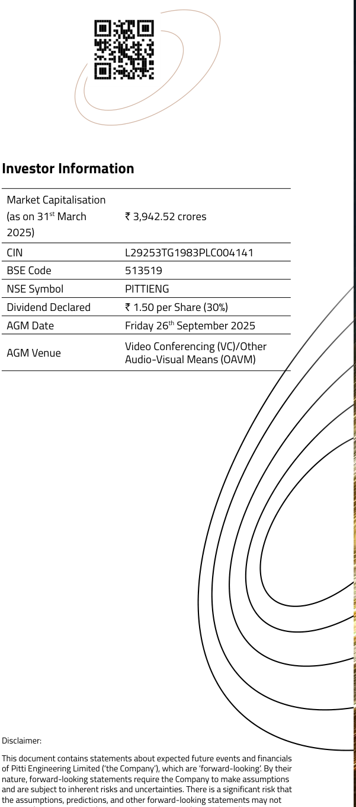

**[Image: Pitti2025AnnualReport.pdf-0003-11.png (601x1360, 110.0KB)]**

<!-- Start of picture text -->
Investor Information Market Capitalisation (as on 31 st  March  ` 3,942.52 crores 2025) CIN    L29253TG1983PLC004141 BSE Code 513519 NSE Symbol PITTIENG Dividend Declared ` 1.50 per Share (30%) AGM Date Friday 26 th  September 2025 Video Conferencing (VC)/Other AGM Venue Audio-Visual Means (OAVM) Disclaimer: This document contains statements about expected future events and financials of Pitti Engineering Limited (‘the Company’), which are ‘forward-looking’. By their nature, forward-looking statements require the Company to make assumptions and are subject to inherent risks and uncertainties. There is a significant risk that the assumptions, predictions, and other forward-looking statements may not <!-- End of picture text -->

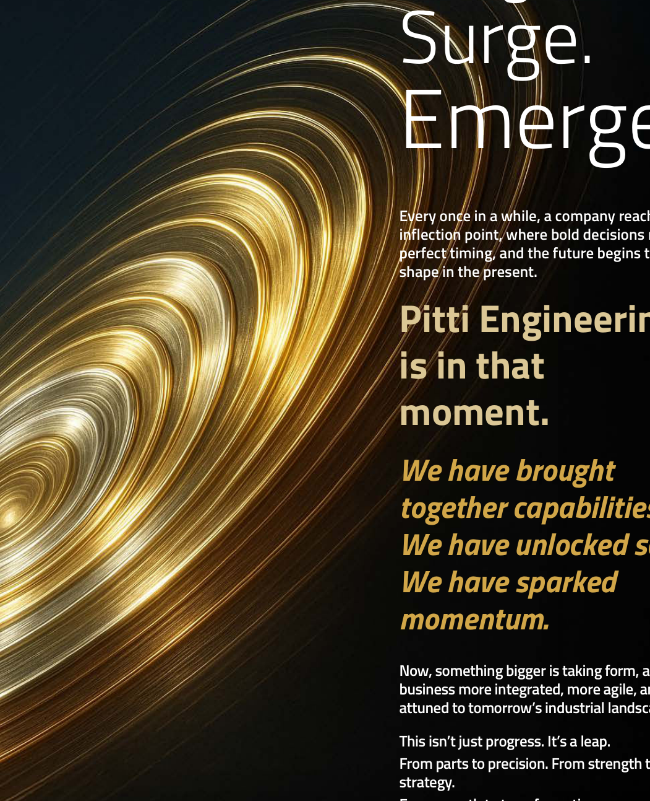

**[Image: Pitti2025AnnualReport.pdf-0003-12.png (1051x1293, 1937.1KB)]**

<!-- Start of picture text -->
Surge. Emerge. Every once in a while, a company reaches an inflection point, where bold decisions meet perfect timing, and the future begins to take shape in the present. Pitti Engineering is in that moment. We have brought together capabilities. We have unlocked scale. We have sparked momentum. Now, something bigger is taking form, a business more integrated, more agile, and more attuned to tomorrow’s industrial landscape. This isn’t just progress. It’s a leap. From parts to precision. From strength to strategy. <!-- End of picture text -->

## Surge. Emerge. 

**Every once in a while, a company reaches an inflection point, where bold decisions meet perfect timing, and the future begins to take shape in the present.** 

**Pitti Engineering is in that moment.** 

**_We have brought together capabilities. We have unlocked scale. We have sparked momentum._** 

**Now, something bigger is taking form, a business more integrated, more agile, and more attuned to tomorrow’s industrial landscape.** 

**This isn’t just progress. It’s a leap. From parts to precision. From strength to strategy.** 

This document contains statements about expected future events and financials of Pitti Engineering Limited (‘the Company’), which are ‘forward-looking’. By their nature, forward-looking statements require the Company to make assumptions and are subject to inherent risks and uncertainties. There is a significant risk that the assumptions, predictions, and other forward-looking statements may not prove to be accurate. Readers are cautioned not to place undue reliance on forward-looking statements as several factors could cause assumptions, actual future results and events to differ materially from those expressed in the forward-looking statements. Accordingly, this document is subject to the disclaimer and qualified in its entirety by the assumptions, qualifications and risk factors referred to in the Management Discussion and Analysis section of this Annual Report. 

Annual Report 2024-25 

Financial Statements 

Statutory Reports 

Corporate Overview 

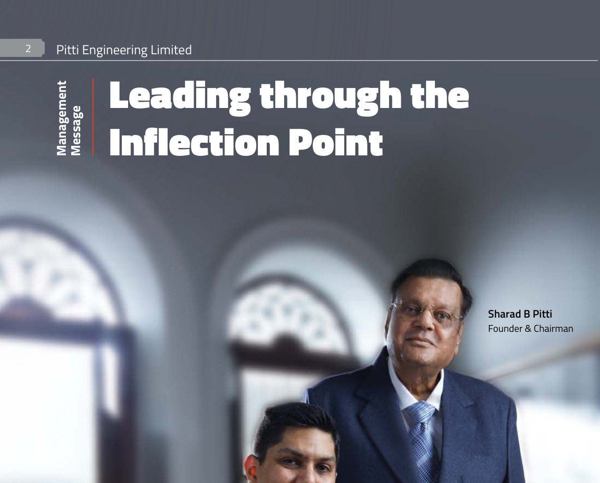

**[Image: Pitti2025AnnualReport.pdf-0004-04.png (1138x917, 727.3KB)]**

<!-- Start of picture text -->
2 Pitti Engineering Limited Leading through the Inflection Point Sharad B Pitti Founder & Chairman Management  Message <!-- End of picture text -->

**[Image: Pitti2025AnnualReport.pdf-0004-05.png (607x373, 290.4KB)]**

<!-- Start of picture text -->
Akshay S Pitti Managing Director & Chief Executive Officer <!-- End of picture text -->

**[Image: Pitti2025AnnualReport.pdf-0004-06.png (4x1754, 4.2KB)]**

###### **Dear Valued Shareholders,** 

Looking back, 2024–25 turned out to be a defining stretch for Pitti Engineering, a year where we saw our ideas come into focus, turned strategy into action, and leaned fully into our long-term goals. Everything we accomplished came from careful planning, timed moves, and a firm alignment with our broader aim of building something cohesive and ready for tomorrow. 

###### **Steady Progress in an Uneven World** 

The past year reminded us that progress is rarely linear. The global economy expanded by 3.3%, even as it navigated persistent geopolitical tensions, shifting trade patterns, and evolving capital flows. Many advanced economies found themselves balancing the delicate act of containing inflation while maintaining fiscal stability. In this landscape, India stood apart – resilient, confident, and driven by the strength of its domestic consumption and the clarity of its policy direction. 

Looking ahead, India is projected to grow at 6.2% in 2024-25. This is not an accident of circumstance, but the result of years of deliberate investment in industrial capabilities, infrastructure, and private enterprise. Landmark programmes like the Production Linked Incentive (PLI) schemes have already catalysed over ` 2.5 lakh crores in manufacturing-linked investments. Meanwhile, transformative initiatives such as the ` 111 lakh crore National Infrastructure Pipeline and the Smart Cities Mission are laying the groundwork for a more connected, future-ready India. 

We see this transformation most vividly in sectors where energy, transport, and industrial growth meet. Indian Railways, supported by a historic 

` 2.65 lakh crore capital allocation, is making decisive strides toward full electrification while expanding metro connectivity and dedicated freight corridors. The electric vehicle transition is accelerating, with 1.5 million units sold in 2023-24, a 40% increase in just one year. On the energy front, over 217 GW of non-fossil fuel capacity is already operational, taking us closer to the 500 GW target for 2030 

As urbanisation deepens and automation becomes a defining feature of industry, the demand for reliable, high-performance systems is growing, not just in scale, but in complexity and criticality. This is where our purpose is clear. We will focus on aligning our capabilities with the nation’s priorities, delivering products and solutions that support progress. 

###### **Performance Driving Growth** 

The year 2024–25 marked a high point in our performance journey, where strategic intent translated into measurable results. While on a standalone basis, our revenue for the year stood at ` 1,562.96 crores, reflecting a 20.91% growth over the previous year. EBITDA rose by 36.22% to ` 246.60 crores, and Profit After Tax (PAT) also saw a 19.10% increase, reaching ` 106.83 crores. Our consolidated revenue for the year stood at ` 1,743.36 crores, reflecting a 34.87% growth over the previous year. Consolidated EBITDA rose by 49.77% to ` 271.12 crores, demonstrating improved efficiency, a better product mix, and the early benefits of integration. Consolidated Profit After Tax (PAT) also saw a strong 36.32% increase, reaching ` 122.29 crores. These gains were underpinned by robust volume growth, particularly in our core lamination business, which 

recorded sales of 63,215 metric tonnes, up 49.43% year-on-year. 

To support this momentum and strengthen our financial position, we successfully raised ` 360 crores through a Qualified Institutional Placement (QIP). These funds were strategically deployed toward reducing debt and supporting our long-term growth initiatives. As of 31st March 2025, our consolidated net debt stood at ` 439.04 crores. In 2025-26, we remain committed to strategic investments focused on customercentric and growth-oriented capital expenditure, reinforcing our long-term vision and strengthening our competitive positioning. 

###### **Merging Strengths, Building Synergies** 

Our transformation in 2024-25 was a result of strategic planning rather than chance. Each decision was a part of a well-defined strategy focussed on enhancing capabilities, expanding market reach and strengthening vertical integration. 

Early on, we recognised that lasting competitiveness would depend on achieving scale, diversifying our portfolio, and delivering solutioncentric offerings. With this clarity, we took ambitious yet measured steps to develop a more resilient and adaptable business model. 

The acquisition of **Bagadia Chaitra Industries Private Limited (now Pitti Industries Private Limited)** was aimed at extending our presence into the pump segment, where agricultural and industrial applications are showing sustained demand. With marquee customers and a strong export potential, BCIPL has added both scale and stability. 

Annual Report 2024-25 

Financial Statements 

Statutory Reports 

Corporate Overview 

Pitti Engineering Limited 

The acquisition of **Dakshin Foundry Private Limited** was a strategic move to deepen our backward integration in high-value castings. By adding capabilities in grey and ductile iron, it complements our machining infrastructure, enhances our technical depth, and strengthens our overall margin profile. 

The merger of **Pitti Castings Private Limited** was a step to consolidate capacity, streamline operations, and broaden our ability to serve complex casting needs, from precision components to large-scale industrial parts. With this, and the addition of Dakshin, our casting capacity now stands at 18,600 MT, making us more capable and integrated than ever before. 

These integrations were guided by a deliberate strategy to create a business that is not only broader in scope but stronger in structure, designed to deliver across economic cycles and sectoral shifts. 

###### **Surge in Scale, Performance, and Capabilities** 

We have achieved a step-change in scale, performance, and technical capability due to the addition of new capacities, strong execution discipline, and a growing focus on higher-value engineering segments. Our current consolidated infrastructure includes 90,000 MT of sheet metal capacity, 6,33,600 hours of machining, and 18,600 MT of casting, making us one of India’s most integrated and efficient engineering providers. 

This expanded foundation supports our ongoing transition from basic supply roles to more complex, systemoriented offerings. A significant example is our newly commissioned generator lamination coating line, which now makes us the only 

###### **Emerging into the Future** 

Our roadmap for 2025-26 is underpinned by four strategic pillars: 

##### **1. 2.** 

###### **Seamless Integration & Synergies** 

###### **Margin Expansion & Operational Efficiency** 

Complete the absorption of our recent acquisitions and drive efficiencies in procurement, logistics, and production. 

Improve throughput and reduce waste to achieve EBITDA margins of 16.5–17% (excluding other income). 

commercial supplier in India offering revarnished laminations for hydro and thermal power, a strategically relevant, import-dependent segment. In parallel, we have entered the hydrogen electrolyser components space and are actively evaluating copper winding assemblies, ensuring we stay aligned with future energy and mobility trends. 

##### **3.** 

##### **4.** 

###### **Innovation & Product Leadership** 

###### **Capital Discipline & Return Optimisation** 

###### **In Closing** 

Invest in R&D and advanced manufacturing to strengthen our presence in high-value, future-oriented products. 

Maintain balance sheet strength with selective, ROI-driven capex and a clear path to improved return on capital employed. 

This past year, 2024-25, was about momentum. We pulled together our complementary strengths, expanded our scale, sharpened our performance, and began to find our voice as a next-generation solutions provider. We are shaping a business that does not just adapt; it anticipates. One that is built to be resilient but quick on its feet, broad in scope but tightly connected. We know the terrain ahead won’t stand still. But with your support, we are ready to move forward, to drive growth that is both sustainable and steady, and value that speaks for itself. 

Warm Regards, 

###### **Sharad B Pitti** 

Founder & Chairman 

###### **Akshay S Pitti** 

Managing Director & Chief Executive Officer 

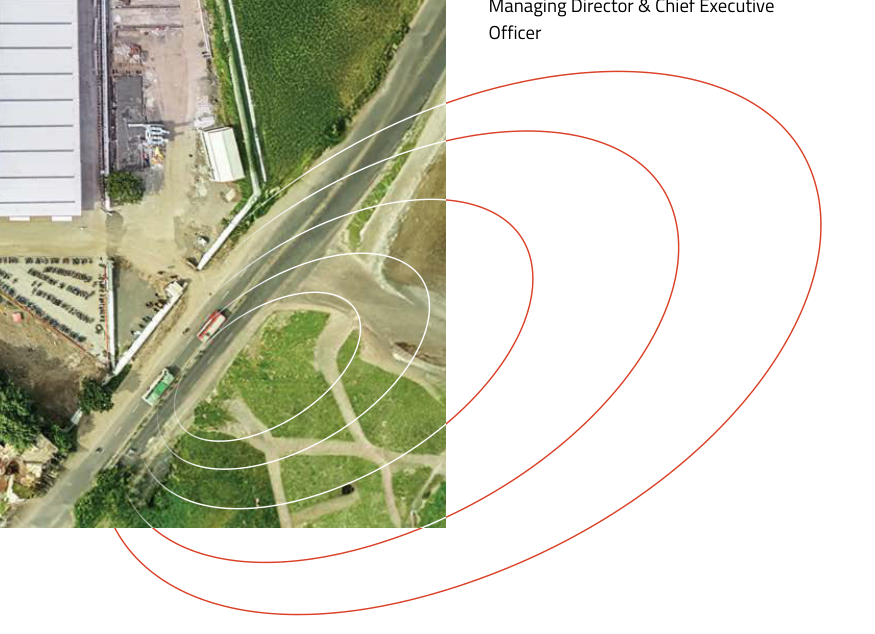

**[Image: Pitti2025AnnualReport.pdf-0005-32.png (875x634, 602.7KB)]**

<!-- Start of picture text -->
Managing Director & Chief Executive Officer <!-- End of picture text -->

Annual Report 2024-25 

Financial Statements 

Statutory Reports 

Corporate Overview 

Pitti Engineering Limited 

#### Engineering the Shift Forward 

From our early focus on laminations for electric motors, we have steadily expanded into a full-spectrum engineering solutions provider. Our portfolio now includes a broad range of high-value-added components, sub-assemblies, and ready-to-wind assemblies for use in rotating equipment such as stators and rotors, backed by improved engineering processes and a wider manufacturing base. 

Established in 1983, Pitti Engineering Limited (referred to as ‘Pitti Engineering’, ‘Company’ or ‘We’) is today India’s largest manufacturer and exporter of electrical steel laminations and a trusted partner for highperformance, precisionengineered products. 

Our work spans two principal verticals, Rotating Electrical Equipment and Machined Components, complemented by a specialised Foundry Division. Across these, we manage everything from machined castings and core building to shaft manufacturing and assembly, air gap turning, laser cutting, cleat forming, spot and special welding, heat treatment, precision machining, tool manufacturing, and fabrication. Our integrated, end-to-end supply chain enables us to serve a wide range of industries with efficiency and consistency, ensuring timely delivery and lasting value for our customers. 

###### **Mission** 

###### **Vision** 

###### **Values** 

Simplifying To enhance capabilities with cutting-edge technology. 

Responsibility 

Sustainability Customer Centricity 

Engineering 

To integrate multiple engineering processes. 

Supply Chain 

Quality First Employee Well-being 

To contract customer supply chain. 

Governance & Transparency Collaboration & Trust 

To provide uniquely integrated components. 

###### **Industries Served** 

**[Image: Pitti2025AnnualReport.pdf-0006-23.png (168x123, 5.6KB)]**

<!-- Start of picture text -->
Railways <!-- End of picture text -->

**[Image: Pitti2025AnnualReport.pdf-0006-24.png (168x123, 6.8KB)]**

<!-- Start of picture text -->
Power Generation <!-- End of picture text -->

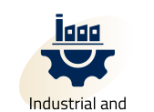

**[Image: Pitti2025AnnualReport.pdf-0006-25.png (169x123, 5.3KB)]**

<!-- Start of picture text -->
Industrial and <!-- End of picture text -->

**[Image: Pitti2025AnnualReport.pdf-0006-26.png (170x123, 5.7KB)]**

<!-- Start of picture text -->
Special Purpose <!-- End of picture text -->

**[Image: Pitti2025AnnualReport.pdf-0006-27.png (167x123, 7.2KB)]**

<!-- Start of picture text -->
Mining, Oil <!-- End of picture text -->

Railways Power Generation Renewable Energy Pumps 

Industrial and Commercial 

Special Purpose Mining, Oil Motors & Gas Automotive Appliances and Consumer 

**[Image: Pitti2025AnnualReport.pdf-0006-31.png (168x126, 5.5KB)]**

**[Image: Pitti2025AnnualReport.pdf-0006-32.png (170x126, 3.5KB)]**

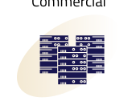

**[Image: Pitti2025AnnualReport.pdf-0006-33.png (169x126, 6.4KB)]**

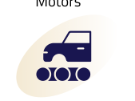

**[Image: Pitti2025AnnualReport.pdf-0006-34.png (169x126, 4.9KB)]**

**[Image: Pitti2025AnnualReport.pdf-0006-35.png (169x126, 4.3KB)]**

Data Centres 

###### **Highlights of the Year** 

###### **Operational Momentum** 

###### **Business Milestones** 

###### **72,000** MT 

**4** 

**[Image: Pitti2025AnnualReport.pdf-0006-42.png (201x46, 1.2KB)]**

**[Image: Pitti2025AnnualReport.pdf-0006-43.png (201x47, 1.7KB)]**

**Manufacturing Facilities** 

**Sheet Metal Capacity** 

**ISO 9001:2015 ISO 14001:2015 ISO 45001:2018** 

###### **6** **<u><mark>,</mark></u> 33** **<u><mark>,</mark></u> 600** Hrs 

**[Image: Pitti2025AnnualReport.pdf-0006-48.png (201x47, 1.7KB)]**

<!-- Start of picture text -->
, , <!-- End of picture text -->

**[Image: Pitti2025AnnualReport.pdf-0006-49.png (201x47, 2.8KB)]**

**Machining Capacity** 

**Certifications** 

###### **2015** 

###### **14,400** MT 

**[Image: Pitti2025AnnualReport.pdf-0006-54.png (202x47, 1.0KB)]**

**[Image: Pitti2025AnnualReport.pdf-0006-55.png (201x47, 1.5KB)]**

**Employees** 

**Casting Capacity** 

**[Image: Pitti2025AnnualReport.pdf-0006-58.png (395x303, 19.9KB)]**

#### Capturing the Pulse of a Transformative Year 

###### **Financial Performance** 

###### **Sustainability in Action** 

**Zero Liquid Discharge** implemented, with fully operational STPs. 

` **1,562.96** crores **Total income** up by 20.91% 

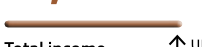

**[Image: Pitti2025AnnualReport.pdf-0006-64.png (202x47, 1.6KB)]**

**1 MW solar plant** operational at the Aurangabad facility, with plans underway to expand capacity to **3 MW.** 

###### ` **246.60** crores 

**[Image: Pitti2025AnnualReport.pdf-0006-67.png (202x46, 1.7KB)]**

up by 36.22% 

**EBITDA (excluding other income)** 

> Adoption of **energy-efficient HVAC systems, LED lighting and advanced energy** monitoring technologies. 

###### ` **106.83** crores 

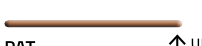

**[Image: Pitti2025AnnualReport.pdf-0006-72.png (202x46, 1.4KB)]**

**PAT** up by 19.10% 

###### ` **183.76** crores 

**[Image: Pitti2025AnnualReport.pdf-0006-75.png (202x47, 1.7KB)]**

**Net Cash Accruals** up by 23.81% 

Annual Report 2024-25 

Financial Statements 

Statutory Reports 

Corporate Overview 

Pitti Engineering Limited 

#### Tracing the Journey of Transformation 

Back in 1983, we started with just one facility. Since then, each step forward has been grounded in purpose: never rushed, always considered. By bringing together what we do best, investing in capacity, and building trusted relationships, we have grown into a company known not just for reliability, but for thoughtful, longterm growth. 

**1983** Founded by Shri Sharad B Pitti, with an installed capacity of 2,500 MT **1987** Commenced operations as a manufacturer of electrical laminations for application in motors used in a wide array of electrical equipment 

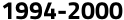

**[Image: Pitti2025AnnualReport.pdf-0007-08.png (124x20, 1.3KB)]**

<!-- Start of picture text -->
1994-2000 <!-- End of picture text -->

- Enhanced manufacturing capacity at Hyderabad with a focus on die cast rotor 

- Established international presence by exporting engineering products to USA 

**[Image: Pitti2025AnnualReport.pdf-0007-11.png (389x16, 3.8KB)]**

<!-- Start of picture text -->
 Initial Public Issue and Listed on BSE and HSE <!-- End of picture text -->

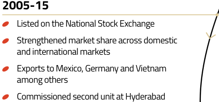

**[Image: Pitti2025AnnualReport.pdf-0007-12.png (444x207, 21.5KB)]**

<!-- Start of picture text -->
2005-15  Listed on the National Stock Exchange  Strengthened market share across domestic and international markets  Exports to Mexico, Germany and Vietnam among others  Commissioned second unit at Hyderabad <!-- End of picture text -->

**[Image: Pitti2025AnnualReport.pdf-0007-13.png (59x19, 0.9KB)]**

<!-- Start of picture text -->
2017 <!-- End of picture text -->

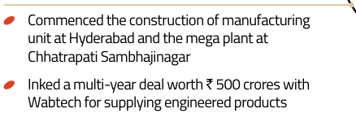

**[Image: Pitti2025AnnualReport.pdf-0007-14.png (438x139, 16.1KB)]**

<!-- Start of picture text -->
 Commenced the construction of manufacturing unit at Hyderabad and the mega plant at Chhatrapati Sambhajinagar  Inked a multi-year deal worth ` 500 crores with Wabtech for supplying engineered products <!-- End of picture text -->

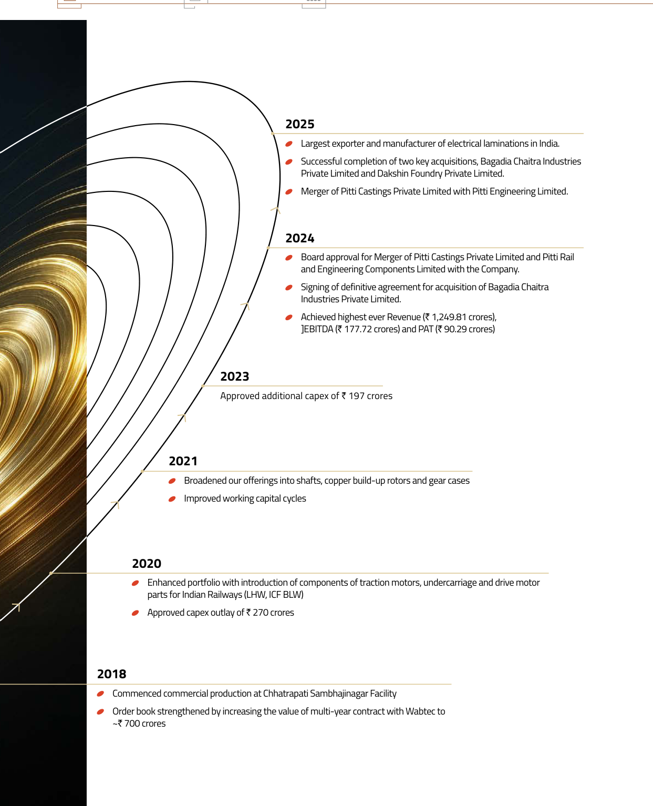

**[Image: Pitti2025AnnualReport.pdf-0007-15.png (1243x1533, 499.9KB)]**

<!-- Start of picture text -->
2025  Largest exporter and manufacturer of electrical laminations in India.  Successful completion of two key acquisitions, Bagadia Chaitra Industries Private Limited and Dakshin Foundry Private Limited.  Merger of Pitti Castings Private Limited with Pitti Engineering Limited. 2024  Board approval for Merger of Pitti Castings Private Limited and Pitti Rail and Engineering Components Limited with the Company.  Signing of definitive agreement for acquisition of Bagadia Chaitra Industries Private Limited.  Achieved highest ever Revenue (` 1,249.81 crores), ]EBITDA (` 177.72 crores) and PAT (` 90.29 crores) 2023 Approved additional capex of ` 197 crores 2021  Broadened our offerings into shafts, copper build-up rotors and gear cases  Improved working capital cycles 2020  Enhanced portfolio with introduction of components of traction motors, undercarriage and drive motor parts for Indian Railways (LHW, ICF BLW)  Approved capex outlay of ` 270 crores 2018  Commenced commercial production at Chhatrapati Sambhajinagar Facility  Order book strengthened by increasing the value of multi-year contract with Wabtec to ~` 700 crores <!-- End of picture text -->

**[Image: Pitti2025AnnualReport.pdf-0007-16.png (325x1495, 486.3KB)]**

Annual Report 2024-25 

Corporate Overview Statutory Reports Financial Statements 

Pitti Engineering Limited 

#### Expanding Presence to Deepen Impact 

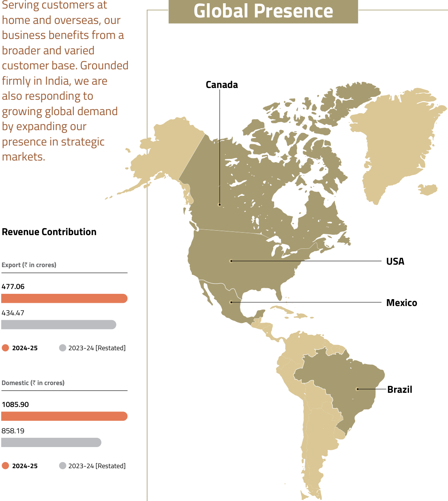

**[Image: Pitti2025AnnualReport.pdf-0008-05.png (1105x1236, 156.3KB)]**

<!-- Start of picture text -->
Serving customers at Global Presence home and overseas, our business benefits from a broader and varied customer base. Grounded firmly in India, we are  Canada also responding to growing global demand by expanding our presence in strategic markets. Revenue Contribution Export ( `  in crores) USA 477.06 Mexico 434.47 2024-25 2023-24 [Restated] Domestic ( `  in crores) Brazil 1085.90 858.19 2024-25 2023-24 [Restated] <!-- End of picture text -->

###### **Percentage Share of Revenue (%)** 

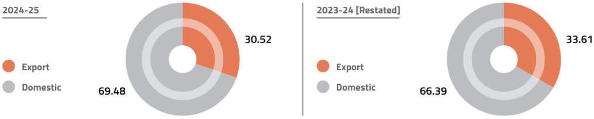

**[Image: Pitti2025AnnualReport.pdf-0008-07.png (1016x205, 28.1KB)]**

<!-- Start of picture text -->
2024-25 2023-24 [Restated] 30.52 33.61 Export Export Domestic 69.48 Domestic 66.39 <!-- End of picture text -->

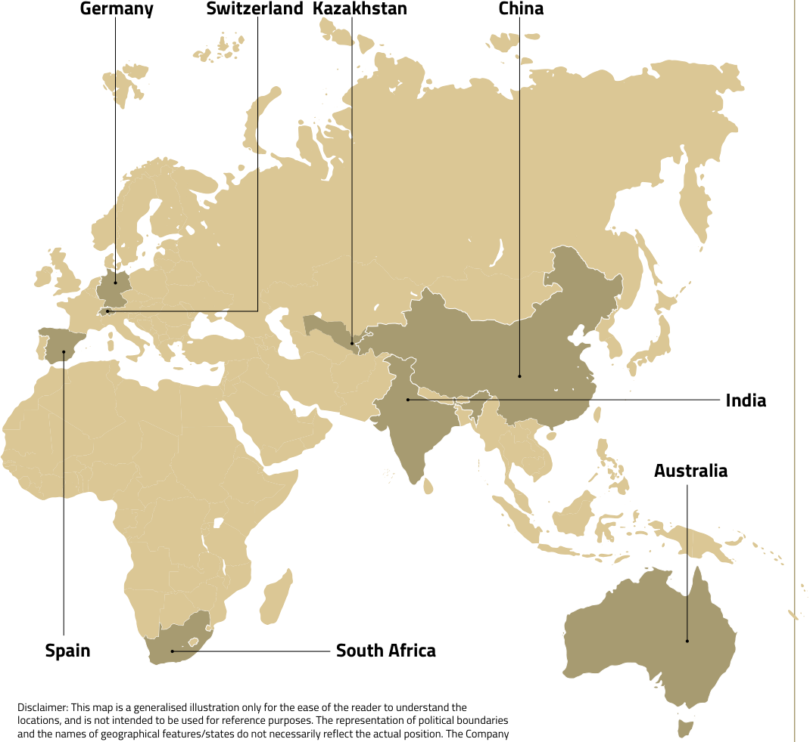

**[Image: Pitti2025AnnualReport.pdf-0008-08.png (1070x982, 145.2KB)]**

<!-- Start of picture text -->
Germany Switzerland Kazakhstan China India Australia Spain South Africa Disclaimer: This map is a generalised illustration only for the ease of the reader to understand the locations, and is not intended to be used for reference purposes. The representation of political boundaries and the names of geographical features/states do not necessarily reflect the actual position. The Company <!-- End of picture text -->

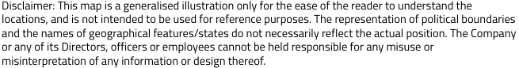

**[Image: Pitti2025AnnualReport.pdf-0008-09.png (655x86, 20.7KB)]**

<!-- Start of picture text -->
Disclaimer: This map is a generalised illustration only for the ease of the reader to understand the locations, and is not intended to be used for reference purposes. The representation of political boundaries and the names of geographical features/states do not necessarily reflect the actual position. The Company or any of its Directors, officers or employees cannot be held responsible for any misuse or misinterpretation of any information or design thereof. <!-- End of picture text -->

Annual Report 2024-25 

Financial Statements 

Statutory Reports 

Corporate Overview 

Pitti Engineering Limited 

#### Operating through Cycles of Change 

India’s industrial scene is changing fast. Increased infrastructure investment, a push on local manufacturing, and the move towards renewable energy are reshaping things. Railways, electrical equipment, renewable energy, and heavy engineering are all expanding, supported by government measures and changes in global supply networks. 

**[Image: Pitti2025AnnualReport.pdf-0009-07.png (111x80, 6.4KB)]**

**[Image: Pitti2025AnnualReport.pdf-0009-08.png (111x1026, 35.3KB)]**

**[Image: Pitti2025AnnualReport.pdf-0009-09.png (491x137, 139.5KB)]**

**[Image: Pitti2025AnnualReport.pdf-0009-10.png (491x137, 165.9KB)]**

###### **Indian Railways** 

###### **Data Centres** 

Indian Railways, along with the country’s growing metro networks, is undergoing a significant phase of modernisation, electrification, and capacity expansion. With the broad-gauge network fully electrified and backed by an unprecedented budget allocation, this sector is rapidly becoming a key driver of demand for energy-efficient, high-performance electrical machinery. This increased investments in rail and metro infrastructure are directly fuelling the need for advanced motors, alternators, and precision-engineered components, all essential for powering both passenger and freight services in a future-ready, sustainable transport ecosystem. 

India’s data centre market experienced exceptional growth in 2024–25, fuelled by surging digital demand, rapid cloud adoption, and significant investments from global and domestic players. According to the Economic Survey 2024–25, co-location data centre capacity reached 977 MW, with 258 MW added during the year, representing 105% year-on-year growth. The growing demand for motors in data centres is primarily driven by the critical need for efficient cooling systems. As data centres consume vast amounts of energy and generate substantial heat, motors are essential for powering cooling solutions such as CRAC units, chillers, and cooling towers. 

###### **Emerging Opportunities** 

###### **Emerging Opportunities** 

- Over 98% of the broad-gauge network electrification is complete, with full electrification targeted by 2026. 

As India’s data centre landscape expands, so does the need for: 

- Deployment of 200 Vande Bharat trains, 100 Amrit Bharat trains, and 50 Namo Bharat trains, upgrading 40,000 bogies to Vande Bharat standards. 

High-efficiency motors for thermal management. 

   - Reliable generators for uninterrupted power supply. 

- Development of 2,843 km of Dedicated Freight Corridors to improve logistics efficiency and increase demand for traction motors. 

   - Electrical laminations to enhance motor and transformer performance. 

- Metro rail network expected to double in size over the next 3–4 years, with plans for 2,000–2,500 new coaches. 

- Annual passenger traffic exceeding 6.4 billion; with traction power projected to reach 10,000 MW by 2030. 

- Focus on green mobility and achieving net-zero emissions by 2030 accelerating adoption of energy-efficient components. 

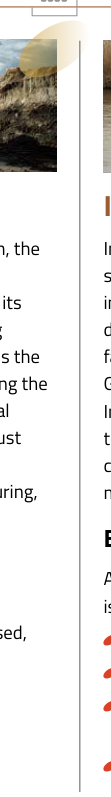

**[Image: Pitti2025AnnualReport.pdf-0009-27.png (111x797, 31.1KB)]**

**[Image: Pitti2025AnnualReport.pdf-0009-28.png (112x78, 7.1KB)]**

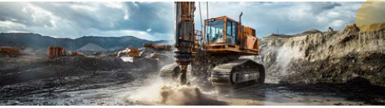

**[Image: Pitti2025AnnualReport.pdf-0009-29.png (491x138, 162.4KB)]**

**[Image: Pitti2025AnnualReport.pdf-0009-30.png (491x138, 149.9KB)]**

###### **Mining** 

###### **India’s Agricultural Growth** 

As mining operations scale up and integrate automation, the demand for high-efficiency, heavy-duty motors is accelerating. India’s mining sector is expected to record its highest-ever production in 2024–25, building on strong momentum from the previous year. The country remains the world’s second-largest aluminium producer, ranks among the top ten in refined copper, and is the fourth-largest global producer of iron ore. This growth is underpinned by robust demand from core sectors such as steel, energy, infrastructure, construction, and automotive manufacturing, all of which rely heavily on mechanised mining and dependable motorised systems. 

India’s agricultural sector is experiencing robust growth, supported by rising food demand, policy reforms, and increased investments in rural infrastructure. A key trend driving this transformation is the rapid mechanisation of farming practices, especially in irrigation and field operations. Government-backed initiatives such as PM-KUSUM, Make in India, and Atmanirbhar Bharat are accelerating the shift towards energy-efficient, electrified farm infrastructure, creating a strong demand environment for domestic manufacturing and component suppliers. 

###### **Emerging Opportunities** 

As agriculture embraces modern, electrified systems, the need is growing for: 

###### **Emerging Opportunities** 

With increasing production and a shift toward mechanised, high-output mining, there is a growing need for: 

Motors for solar and electric water pumps. 

- Components for threshers, tillers, and agro-machinery. Laminations, stator-rotor assemblies, and die-cast rotors tailored for rural usage. 

Durable, high-performance motors. 

- Advanced electrical systems. 

- Precision-engineered components tailored to tough mining environments. 

- Scalable, energy-efficient solutions for irrigation. 

**[Image: Pitti2025AnnualReport.pdf-0009-45.png (1037x78, 22.9KB)]**

**[Image: Pitti2025AnnualReport.pdf-0009-46.png (491x137, 126.4KB)]**

###### **Our Approach** 

We continue to build on our standing as one of India’s largest manufacturers of electrical laminations and motor sub-assemblies, aligning our growth with the broader wave of industrial and infrastructure transformation across the country. With a diversified product portfolio, deep design capabilities, and vertically integrated operations from machining and die-casting to insulation, we are positioned to address the requirements of a wide spectrum of industries. As the need for energy-efficient, high-performance rotating machines gains momentum, we are expanding manufacturing capacity and integrating automation to enhance precision and throughput. Our early investment in technology, close collaboration with OEMs, and strong export infrastructure strengthen our position as a long-term partner in high-value, technically demanding applications. Guided by sound capital discipline and a sharp focus on electrification-led growth, we continue to increase our relevance in India’s evolving industrial ecosystem and in global markets, pursuing efficiency and sustainability. 

###### **EV Revolution** 

Globally, the electric vehicle (EV) revolution is reshaping the automotive landscape, with 14 million EVs (including BEVs and PHEVs) sold worldwide. The global EV motor market was valued at ` 40,529.56 million in 2024 and is projected to grow to ` 97,394.32 million by 2029, reflecting a CAGR of 18.2%. India mirrors this global momentum, with rapid electrification driven by FAME India and related government initiatives, incentives for electric two- and three-wheelers, expanding EV infrastructure and consumer interest. 

###### **Emerging Opportunities** 

The rise of EVs presents powerful opportunities for the rotating electrical equipment industry. Key demand areas include: 

Propulsion and auxiliary motors. 

- High-speed electric motors. 

- High-frequency transformers. Advanced electrical laminations. 

Annual Report 2024-25 

Financial Statements 

Statutory Reports 

Corporate Overview 

**[Image: Pitti2025AnnualReport.pdf-0010-04.png (22x1754, 7.2KB)]**

**[Image: Pitti2025AnnualReport.pdf-0010-05.png (259x28, 6.4KB)]**

<!-- Start of picture text -->
Pitti Engineering Limited <!-- End of picture text -->

**As industries adjusted course and the pace of change picked up, we stayed grounded, strengthening what works and refining where it matters. Our progress continues to rest on the same pillars that have carried us forward: a wide range of capabilities, tightly integrated operations, strong client relationships, and leadership that thinks beyond the present. These strengths have not just helped us grow; they have allowed us to respond with clarity and confidence when new possibilities arise.** 

**[Image: Pitti2025AnnualReport.pdf-0010-07.png (459x1015, 149.9KB)]**

# Strengthening the Core to Scale the Future 

###### **Spectrum of Capabilities** 

We offer a diverse portfolio of products tailored to the needs of a wide range of end-use industries. 

**Page no. 16 onwards** 

###### **Scalable and Integrated Manufacturing** 

Our fully integrated, end-to-end consolidated manufacturing model enables us to scale efficiently, control quality at every stage and remain cost-competitive. 

**Page no. 22 onwards** 

###### **Stability through Consistency** 

Our steady operational performance and strong financial results across market cycles have brought long-term stability. 

**Page no. 26 onwards** 

###### **Synergy through Strategic M&A** 

Through targeted mergers and acquisitions, we have expanded our capabilities, deepened operational synergies, and enhanced our competitive edge. 

**Page no. 20 onwards** 

###### **Strength in Relationships** 

We maintain enduring partnerships with top domestic and global clients, built on trust, reliable execution, and technical depth. 

###### **Page no. 25 onwards** 

###### **Stewardship of Talent and Leadership** 

A track record of sustained growth and sound financial performance reflects the strength of our leadership and the depth of our talent pool. 

**Page no. 28 onwards** 

Annual Report 2024-25 

Financial Statements 

Statutory Reports 

Corporate Overview 

Pitti Engineering Limited 

#### Expanding the Portfolio with Precision and Purpose 

Reflecting the breadth of our capabilities, our business model is built on a welldiversified portfolio that spans across key end-use industries. We serve critical sectors such as rotating electrical machines and public transport systems to automation, clean energy, and heavy engineering. By staying present across these key areas, we not only expand our market reach but also stay resilient through shifts in demand, building for stability that lasts well into the future. 

###### **Rotating Electrical Equipment** 

In the rotating electrical equipment segment, we bring a complete suite of manufacturing capabilities, manufacturing components that range from individual laminations to stator assemblies and cast rotors. Our advanced facilities are equipped to manage varied sizes and technical requirements, delivering dependable performance and accuracy across all applications. 

###### **Key Products** 

**[Image: Pitti2025AnnualReport.pdf-0011-10.png (355x272, 83.7KB)]**

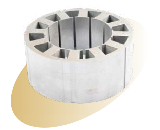

**[Image: Pitti2025AnnualReport.pdf-0011-11.png (315x257, 63.1KB)]**

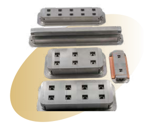

**[Image: Pitti2025AnnualReport.pdf-0011-12.png (316x252, 67.5KB)]**

Stator Glued Lamination 

Pole Lamination 

Loose Laminations 

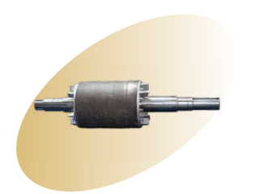

**[Image: Pitti2025AnnualReport.pdf-0011-16.png (315x240, 30.6KB)]**

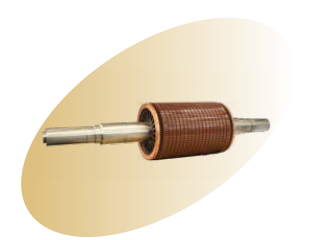

**[Image: Pitti2025AnnualReport.pdf-0011-17.png (315x240, 33.2KB)]**

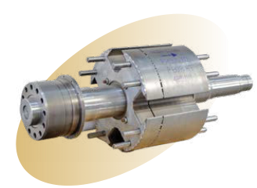

**[Image: Pitti2025AnnualReport.pdf-0011-18.png (328x240, 79.0KB)]**

RTU Rotor with Shaft 

Copper Built Up Rotor with Shaft 

Diecast Rotors with Shaft 

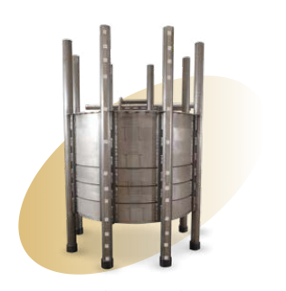

**[Image: Pitti2025AnnualReport.pdf-0011-22.png (316x321, 81.7KB)]**

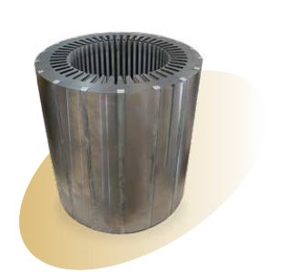

**[Image: Pitti2025AnnualReport.pdf-0011-23.png (315x299, 79.3KB)]**

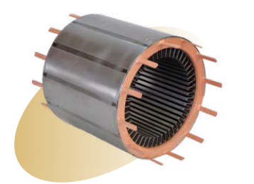

**[Image: Pitti2025AnnualReport.pdf-0011-24.png (357x259, 93.3KB)]**

Stator Core (Alternator) 

Assembled Stator Core 

Stator Core (Traction) 

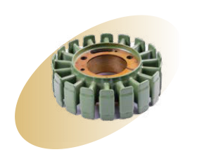

**[Image: Pitti2025AnnualReport.pdf-0011-28.png (280x216, 54.7KB)]**

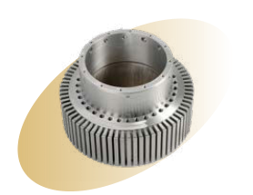

**[Image: Pitti2025AnnualReport.pdf-0011-29.png (278x215, 47.3KB)]**

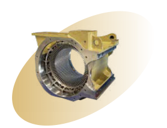

**[Image: Pitti2025AnnualReport.pdf-0011-30.png (278x213, 48.1KB)]**

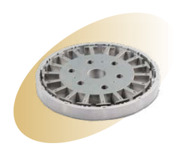

**[Image: Pitti2025AnnualReport.pdf-0011-31.png (278x222, 45.6KB)]**

Assembled Core with Auto Stitch Core powder coating (Stator & Rotor) (Magneto Pack) 

RTU Stator 

Assembled Core with Fab Barrel 

Annual Report 2024-25 

Financial Statements 

Corporate Overview Statutory Reports 

Pitti Engineering Limited 

**Machined Components** Drawing on our engineering skills and machining strengths, we have broadened our production to include complex, high-precision machined components, such as fabricated parts and forged shafts. This expansion allows us to meet the exacting machining and processing demands of diverse industries like mining, renewable energy, and automotive. 

###### **Key Products** 

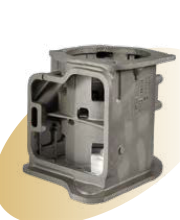

**[Image: Pitti2025AnnualReport.pdf-0012-06.png (180x220, 43.7KB)]**

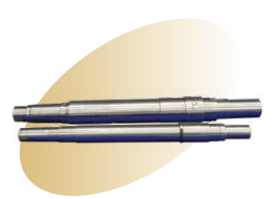

**[Image: Pitti2025AnnualReport.pdf-0012-07.png (280x199, 33.6KB)]**

Water Pump Shaft and Armature Shaft 

Housing 

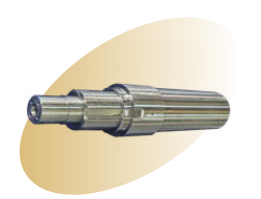

**[Image: Pitti2025AnnualReport.pdf-0012-10.png (261x199, 29.6KB)]**

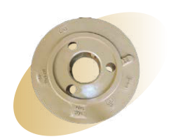

**[Image: Pitti2025AnnualReport.pdf-0012-11.png (261x199, 45.3KB)]**

Alternator Shaft 

Carrier Planet 

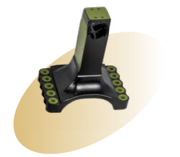

**[Image: Pitti2025AnnualReport.pdf-0012-14.png (261x228, 32.2KB)]**

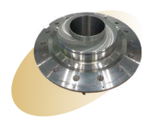

**[Image: Pitti2025AnnualReport.pdf-0012-15.png (261x199, 51.0KB)]**

Flywheel 

Centre Piot 

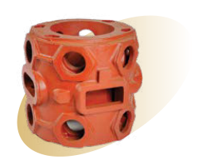

**[Image: Pitti2025AnnualReport.pdf-0012-18.png (264x200, 67.1KB)]**

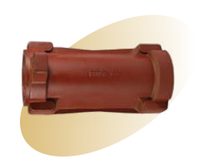

**[Image: Pitti2025AnnualReport.pdf-0012-19.png (268x199, 37.7KB)]**

Cylinder 

Canon Tube 

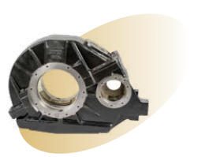

**[Image: Pitti2025AnnualReport.pdf-0012-22.png (265x199, 43.9KB)]**

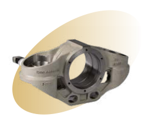

**[Image: Pitti2025AnnualReport.pdf-0012-23.png (264x199, 42.2KB)]**

Axle Box 

Gear Case 

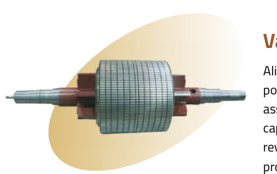

**[Image: Pitti2025AnnualReport.pdf-0012-26.png (394x247, 58.9KB)]**

###### **Value-added Products** 

Aligning with evolving market demands and customer priorities, we enrich our portfolio by offering value-added products that are machined, fabricated, and assembled to offer end-to-end solutions. This integrated model not only expands our capabilities but also strengthens client trust and improves financial outcomes in revenue and margins. Through this approach, we maintain a competitive position by providing tailored, solution-based support that meets complex market requirements. 

###### **Revenue Share (** ` **in crores)** 

###### **Castings** 

###### **1040.76** 

Following its strategic amalgamation, Pitti Castings Private Limited has become central to the Company’s casting operations. It plays a crucial role in supporting key applications in electric motors, traction systems, and power generators by supplying high-integrity components like rotor housings and stator frames. Emphasizing quality, cost-efficiency, and timely execution, this vertical is steadily expanding through value-added machining and increasing its importance across sectors, including railways, renewable energy, and high-power motors. 

232.93 

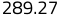

**[Image: Pitti2025AnnualReport.pdf-0012-34.png (59x15, 1.1KB)]**

<!-- Start of picture text -->
289.27 <!-- End of picture text -->

Rotating Electrical Equipment Machined Components Casting 

###### **Percentage Share (%)** 

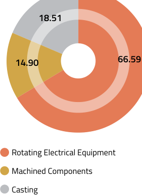

**[Image: Pitti2025AnnualReport.pdf-0012-37.png (283x388, 19.7KB)]**

<!-- Start of picture text -->
18.51 66.59 14.90 Rotating Electrical Equipment Machined Components Casting <!-- End of picture text -->

**[Image: Pitti2025AnnualReport.pdf-0012-38.png (237x192, 51.2KB)]**

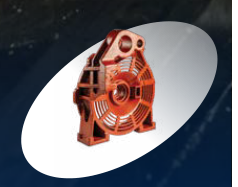

**[Image: Pitti2025AnnualReport.pdf-0012-39.png (238x187, 55.0KB)]**

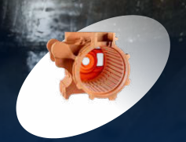

**[Image: Pitti2025AnnualReport.pdf-0012-40.png (237x181, 63.4KB)]**

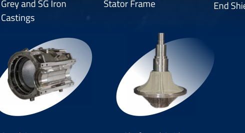

**[Image: Pitti2025AnnualReport.pdf-0012-41.png (490x267, 78.6KB)]**

<!-- Start of picture text -->
Grey and SG Iron  Stator Frame Castings <!-- End of picture text -->

Stator Frame End Shield 

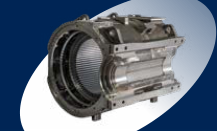

**[Image: Pitti2025AnnualReport.pdf-0012-43.png (217x131, 34.8KB)]**

Steel Casting Shaft and Spider 

Annual Report 2024-25 

Financial Statements 

Statutory Reports 

Corporate Overview 

Pitti Engineering Limited 

#### Harnessing Synergy to Accelerate Growth 

By pursuing targeted acquisitions and integrating them efficiently, we have strengthened our core operations, realised operational synergies, and positioned ourselves for lasting value generation. 

This approach to inorganic growth, underscored by key acquisitions and a landmark merger, has strengthened our technical breadth, expanded our market footprint, and diversified our offerings. Collectively, these initiatives are pivotal in driving efficiency, broadening customer reach, and supporting a sustained trajectory of value-driven growth. 

###### **Acquisition of Bagadia Chaitra Industries Private Limited** 

In May 2024, we completed the acquisition of Bagadia Chaitra Industries Private Limited (now Pitti Industries Private Limited), a specialist in electrical steel laminations, assemblies, and die-cast rotors, with operating manufacturing units in Tumakuru, Karnataka. 

###### **Key Synergies** 

Entry into the agricultural pump and appliance 

- segment, adding a new growth vertical. 

- Strengthening market footprint in South India, allowing deeper access to regional demand centres. 

Date of Acquisition: 6th May 2024. 

- Operational synergies are expected through the consolidation of production resulting in improved logistics and workforce efficiency. 

Manufacturing Facility: Tumakuru, Karnataka. 

- Cost advantages driven by raw material savings and improved procurement strategies, leading to improved overall cost structure. 

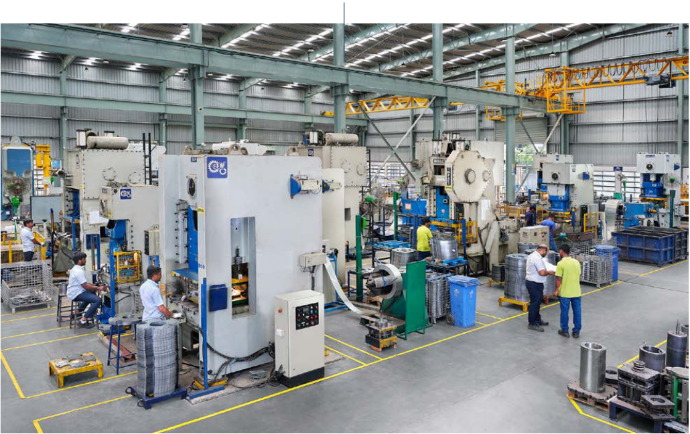

**[Image: Pitti2025AnnualReport.pdf-0013-18.png (1030x649, 1390.7KB)]**

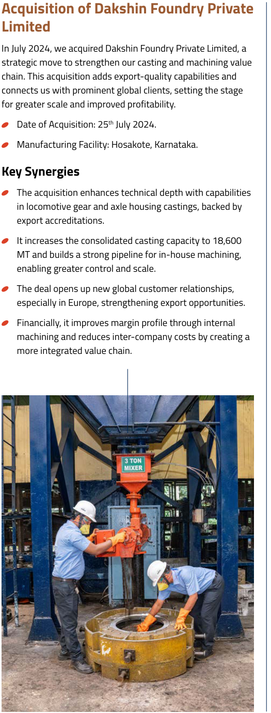

**[Image: Pitti2025AnnualReport.pdf-0013-19.png (525x1380, 839.5KB)]**

<!-- Start of picture text -->
Acquisition of Dakshin Foundry Private Limited In July 2024, we acquired Dakshin Foundry Private Limited, a strategic move to strengthen our casting and machining value chain. This acquisition adds export-quality capabilities and connects us with prominent global clients, setting the stage for greater scale and improved profitability.  Date of Acquisition: 25 th  July 2024.  Manufacturing Facility: Hosakote, Karnataka. Key Synergies  The acquisition enhances technical depth with capabilities in locomotive gear and axle housing castings, backed by export accreditations.  It increases the consolidated casting capacity to 18,600 MT and builds a strong pipeline for in-house machining, enabling greater control and scale.  The deal opens up new global customer relationships, especially in Europe, strengthening export opportunities.  Financially, it improves margin profile through internal machining and reduces inter-company costs by creating a more integrated value chain. <!-- End of picture text -->

**[Image: Pitti2025AnnualReport.pdf-0013-20.png (494x587, 658.9KB)]**

###### **Merger of Pitti Castings Private Limited (PCPL) and Pitti Rail and Engineering Components Limited (PRECL) with the Company** 

The merger of PCPL and PRECL, with the Company, effective from the appointed date of 1st April 2023, pursuant to the order of Hon’ble NCLT dated 3rd October 2024, was aimed at achieving vertical integration, streamlining operations, and consolidating group capabilities. This structural alignment supports our broader vision of delivering higher value-added solutions to our customers. 

###### **Key Synergies** 

- Product Segmentation & Technical Capabilities: Enables greater product focus with dedicated facilities for diversified segments. 

- Integrated Machining Backward Linkage: Strengthens internal supply chain for machined castings. 

- Capacity Rationalisation: Optimised use of casting facilities to improve efficiency. 

- Customer Consolidation: Strengthening customer relationships by offering a consolidated and comprehensive product suite. 

- Cost & Margin Optimisation: Improved operational economics, cost rationalisation, and better margin visibility. 

Annual Report 2024-25 

Financial Statements 

Statutory Reports 

Corporate Overview 

22 

Pitti Engineering Limited 

#### Building Scale through Operational Excellence 

What started as a specialised effort in electrical laminations has grown into something far broader. Through consistent investment and capability building, we have built a manufacturing ecosystem that connects every stage, from design to delivery. With end-to-end operations now working as a single unit, we offer seamless solutions that raise customer value and keep us ahead in the industry. 

**[Image: Pitti2025AnnualReport.pdf-0014-08.png (22x1754, 7.5KB)]**

###### **Manufacturing Footprint - Multi-Location Presence** 

We maintain six strategically chosen manufacturing sites across India, each contributing to our consolidated production strength. 

**[Image: Pitti2025AnnualReport.pdf-0014-11.png (492x379, 377.9KB)]**

**[Image: Pitti2025AnnualReport.pdf-0014-12.png (495x379, 371.3KB)]**

Kothur, Telangana 

Nandigaon, Telangana 

**[Image: Pitti2025AnnualReport.pdf-0014-15.png (496x381, 452.3KB)]**

**[Image: Pitti2025AnnualReport.pdf-0014-16.png (495x381, 400.2KB)]**

Macharam, Telangana 

Chhatrapati Sambhajinagar, Maharashtra 

**[Image: Pitti2025AnnualReport.pdf-0014-19.png (495x381, 252.3KB)]**

**[Image: Pitti2025AnnualReport.pdf-0014-20.png (496x381, 352.7KB)]**

Tumakuru, Karnataka 

Hosakote, Karnataka 

Annual Report 2024-25 

Corporate Overview Statutory Reports Financial Statements 

Pitti Engineering Limited 

###### **Scalability Backed by Strategic Expansion** 

We have grown by scaling smartly, always staying grounded in financial responsibility. Now that our large capex cycle is complete, we are shifting towards targeted upgrades with quicker returns, installing high-value equipment where it is needed most based on what our customers require. This lets us remain agile, without compromising on delivery or cost efficiency. 

Across our operations, we are steadily expanding our core strengths from machined castings and core building to shaft production, fabrication, and assembly, enabling a fully integrated approach from start to finish. By bringing operations closer together and refining our layouts, we are not just improving flow but also maximising how we use time, space, and resources. Each of our plants reflects this blend: long-standing engineering skill, paired with modern technology and smarter systems. 

**[Image: Pitti2025AnnualReport.pdf-0015-06.png (672x449, 387.8KB)]**

###### **Digital-First, Integrated Systems Approach** 

Pitti Engineering is evolving into a digitally enabled organisation, where integrated systems enhance precision, transparency, and operational efficiency across the value chain. To support this transformation, we are implementing advanced technologies, including: 

**4- and 5-axis CNC machines** to enable highprecision machining. 

**IoT-enabled devices** to streamline workflows and strengthen traceability. 

**CAM software** for accurate and complex programming. 

**SAP-integrated shop floors** to ensure smooth information flow across procurement, production, and dispatch. 

**Data analytics platforms** to facilitate real-time monitoring and predictive maintenance. 

###### **End-to-End Manufacturing Capabilities** 

Our in-house capabilities cover the entire production lifecycle from sourcing raw material to delivering finished assemblies. Key processes include: 

**[Image: Pitti2025AnnualReport.pdf-0015-16.png (186x222, 90.0KB)]**

**[Image: Pitti2025AnnualReport.pdf-0015-17.png (93x65, 2.7KB)]**

<!-- Start of picture text -->
Material Sourcing & Tooling <!-- End of picture text -->

**[Image: Pitti2025AnnualReport.pdf-0015-18.png (186x222, 96.7KB)]**

**[Image: Pitti2025AnnualReport.pdf-0015-19.png (116x63, 3.7KB)]**

<!-- Start of picture text -->
Laser Cutting, Welding, and Fabrication <!-- End of picture text -->

**[Image: Pitti2025AnnualReport.pdf-0015-20.png (186x222, 65.9KB)]**

Lamination, Shaft Manufacturing, and Core Building 

**[Image: Pitti2025AnnualReport.pdf-0015-22.png (185x224, 95.1KB)]**

Machining, Heat Treatment, and Coating 

**[Image: Pitti2025AnnualReport.pdf-0015-24.png (186x221, 90.8KB)]**

**[Image: Pitti2025AnnualReport.pdf-0015-25.png (122x66, 3.5KB)]**

<!-- Start of picture text -->
Painting, Assembly, and Packaging <!-- End of picture text -->

#### Driving Value through Trusted Relationships 

We start by understanding what our customers really need and what they might need next. Then we act fast, stay consistent, and deliver solutions built around those needs. That is how we earn trust, and keep customer focus at the core of how we grow. 

**[Image: Pitti2025AnnualReport.pdf-0015-28.png (197x484, 20.2KB)]**

**[Image: Pitti2025AnnualReport.pdf-0015-29.png (196x80, 3.2KB)]**

**[Image: Pitti2025AnnualReport.pdf-0015-30.png (197x282, 11.1KB)]**

**[Image: Pitti2025AnnualReport.pdf-0015-31.png (196x282, 12.0KB)]**

**[Image: Pitti2025AnnualReport.pdf-0015-32.png (199x82, 14.4KB)]**

**[Image: Pitti2025AnnualReport.pdf-0015-33.png (199x82, 6.6KB)]**

**[Image: Pitti2025AnnualReport.pdf-0015-34.png (198x82, 16.9KB)]**

**[Image: Pitti2025AnnualReport.pdf-0015-35.png (199x82, 10.2KB)]**

**[Image: Pitti2025AnnualReport.pdf-0015-36.png (196x787, 27.3KB)]**

**[Image: Pitti2025AnnualReport.pdf-0015-37.png (199x82, 9.2KB)]**

**[Image: Pitti2025AnnualReport.pdf-0015-38.png (197x79, 5.4KB)]**

**[Image: Pitti2025AnnualReport.pdf-0015-39.png (199x82, 12.0KB)]**

**[Image: Pitti2025AnnualReport.pdf-0015-40.png (198x82, 13.6KB)]**

**[Image: Pitti2025AnnualReport.pdf-0015-41.png (196x484, 17.3KB)]**

**[Image: Pitti2025AnnualReport.pdf-0015-42.png (199x82, 15.2KB)]**

**[Image: Pitti2025AnnualReport.pdf-0015-43.png (197x80, 4.6KB)]**

**[Image: Pitti2025AnnualReport.pdf-0015-44.png (198x82, 11.9KB)]**

**[Image: Pitti2025AnnualReport.pdf-0015-45.png (197x80, 3.5KB)]**

**[Image: Pitti2025AnnualReport.pdf-0015-46.png (199x82, 8.8KB)]**

**[Image: Pitti2025AnnualReport.pdf-0015-47.png (197x282, 12.3KB)]**

**[Image: Pitti2025AnnualReport.pdf-0015-48.png (199x82, 10.2KB)]**

**[Image: Pitti2025AnnualReport.pdf-0015-49.png (199x82, 13.1KB)]**

Annual Report 2024-25 

Financial Statements 

Statutory Reports 

Corporate Overview 

Pitti Engineering Limited 

###### **Net Worth (** ` **in crores)** 

#### Strengthening Foundations for Sustainable Growth 

|**762.69**|
|---|
|**352.37** **334.09** **283.97**|
|**235.82**|

Our financial performance remains steady, with revenue, margins, and operating scale all advancing steadily. Backed by strategic capital allocation, a more profitable product mix, and ongoing efficiency gains, we are on track to deliver durable value over the long term. 

FY 2020-21 FY 2021-22 FY 2022-23 FY 2023-24 (R) **FY 2024-25** 

###### **Total Income (** ` **in crores)** 

###### **EBITDA Margin (%)** 

###### **Total Assets (** ` **in crores)** 

**EBITDA (** ` **in crores)** 

**[Image: Pitti2025AnnualReport.pdf-0016-14.png (1676x413, 42.6KB)]**

<!-- Start of picture text -->
1,562.96 246.60 16.18% 1,954.04 1,292.66 181.03 1,391.05 14.55% 1,117.98 151.39 978.01 13.76% 970.26 132.63 956.45 13.91% 538.67 78.04 701.08 15.06% FY 2020-21 FY 2021-22 FY 2022-23 FY 2023-24 (R) FY 2024-25 FY 2020-21 FY 2021-22 FY 2022-23 FY 2023-24 (R) FY 2024-25 FY 2020-21 FY 2021-22 FY 2022-23 FY 2023-24 (R) <!-- End of picture text -->

FY 2020-21 FY 2021-22 FY 2022-23 FY 2023-24 (R) **FY 2024-25** 

###### **PAT (** ` **in crores) PAT Margin (%)** 

###### **Earnings per Share (in** **`₹` )** 

###### **ROCE (%)** 

**[Image: Pitti2025AnnualReport.pdf-0016-19.png (1034x415, 31.6KB)]**

<!-- Start of picture text -->
106.83 6.84% 29.11 89.70 26.20 6.94% 58.83 18.36 5.26% 51.90 16.19 5.35% 28.78 8.98 5.34% FY 2020-21 FY 2021-22 FY 2022-23 FY 2023-24 (R) FY 2024-25 FY 2020-21 FY 2021-22 FY 2022-23 FY 2023-24 (R) FY 2024-25 <!-- End of picture text -->

**[Image: Pitti2025AnnualReport.pdf-0016-20.png (495x376, 12.4KB)]**

<!-- Start of picture text -->
16.24 18.39 17.19 17.28 13.54 FY 2020-21 FY 2021-22 FY 2022-23 FY 2023-24 (R) FY 2024-25 <!-- End of picture text -->

###### **Capital Employed (** ` **in crores)** 

**1,209.53 1,023.77 617.58 602.13 483.75** 

FY 2020-21 FY 2021-22 FY 2022-23 FY 2023-24 (R) **FY 2024-25** 

###### **ROE (%)** 

**15.75 22.23 19.04 19.97 12.98** 

FY 2020-21 FY 2021-22 FY 2022-23 FY 2023-24 (R) **FY 2024-25** 

###### **Asset Turnover Ratio (No. of Times)** 

**[Image: Pitti2025AnnualReport.pdf-0016-28.png (495x376, 12.0KB)]**

<!-- Start of picture text -->
2.44 3.05 3.30 3.29 2.03 FY 2020-21 FY 2021-22 FY 2022-23 FY 2023-24 (R) FY 2024-25 <!-- End of picture text -->

_Note: Numbers are restated due to amalgamation._ 

Annual Report 2024-25 

Financial Statements 

Statutory Reports 

Corporate Overview 

Pitti Engineering Limited 

#### Balancing Ambition with Responsible Oversight 

Every decision we make is grounded in transparency, accountability, and ethical clarity, principles that guide us towards creating long-term value through responsible and future-ready leadership. 

**[Image: Pitti2025AnnualReport.pdf-0017-07.png (234x251, 82.4KB)]**

###### **Shri Sharad B Pitti, Founder & Chairman** 

He is a visionary leader who has played a pioneering role in establishing and advancing the lamination manufacturing industry in India. With a distinguished career spanning over four decades, he has been key in guiding the Company towards steady growth and long-term success. Under his direction, we have grown from humble origins into a respected industry name, known for our innovation, quality, and commitment to excellence. His profound industry expertise, entrepreneurial drive, and firm dedication have established a strong foundation for Pitti Engineering’s achievements and continue to inspire future generations. 

**[Image: Pitti2025AnnualReport.pdf-0017-10.png (234x251, 73.6KB)]**

###### **Shri Akshay S Pitti, Managing Director & Chief Executive Officer** 

Since October 2004, he has played a key role in the Company’s leadership, initially as a WholeTime Director and currently as the MD & CEO. From the outset of his career, he demonstrated a strong commitment to understanding the business at every level, undergoing comprehensive training across multiple functional areas. This hands-on approach gave him strong insight into our operations. 

As a forward-thinking leader, Akshay S Pitti has been pivotal in transforming the organisation through technology adoption, strategic expansion, and operational excellence. He led the shift to high-value assemblies and in-house machining, restructured manufacturing by phasing out outdated units, and established the state-of-the-art mega factory in Chhatrapati Sambhajinagar. With a strong focus on innovation, acquisitions, and efficiency, it helped position Pitti Engineering as a modern, scalable, and globally competitive player in the electrical and industrial manufacturing space. 

**[Image: Pitti2025AnnualReport.pdf-0017-14.png (234x252, 71.5KB)]**

###### **Shri Y B Sahgal, Non-Executive Independent Director** 

He is a seasoned Mechanical Engineer with over four decades of rich and diverse experience in the engineering and manufacturing industry. Throughout his distinguished career, he has held key middle and senior management positions at reputed organisations such as Sahney Steels and Techno Electricals, a unit of Vijay Electricals, where he contributed significantly to operational and strategic initiatives. He has also been closely associated with the Company in various leadership capacities over the years. His tenure at Pitti Engineering culminated in his role as Executive Director, a position from which he retired in 2016 after years of dedicated service. Y B Sahgal was appointed as Independent Director in November 2023 and continues to be respected for his commitment to excellence, technical acumen, and valuable contributions to the growth and development of the organisation. 

**[Image: Pitti2025AnnualReport.pdf-0017-17.png (234x251, 71.6KB)]**

**[Image: Pitti2025AnnualReport.pdf-0017-18.png (234x253, 79.6KB)]**

**[Image: Pitti2025AnnualReport.pdf-0017-19.png (234x252, 92.6KB)]**

**[Image: Pitti2025AnnualReport.pdf-0017-20.png (234x251, 77.2KB)]**

###### **Shri N Vinod Kumar, Non-Executive Independent Director** , (w.e.f. 14th August 2024) 

He is a Fellow Member of the Institute of Chartered Accountants of India, with over three decades of extensive experience in finance, accounts, and corporate governance within Central Public Sector Undertakings (CPSUs). He began his professional journey in 1977 as a Junior Officer at Western Coalfields Limited, demonstrating early on a strong foundation in financial management and operational control. 

Over the years, he served in various senior capacities across prominent CPSUs, including National Mineral Development Corporation Limited (NMDC), Electronics Corporation of India Ltd (ECIL), Praga Tools Ltd, and Bharat Dynamics Limited (BDL). His roles spanned financial planning, audit, compliance, and strategic decision-making, contributing significantly to the financial stability and growth of these organisations. 

Known for his integrity, analytical acumen, and deep understanding of public sector operations, Shri Vinod Kumar brings with him a wealth of experience in managing complex financial systems and ensuring regulatory compliance at the highest standards. 

###### **Smt Kemisha Soni, Non-Executive Independent Director,** (w.e.f. 14th August 2024) 

Kemisha Soni is a Chartered Accountant with over two decades of experience in the fields of accounting, auditing, and taxation. In August 2024, she was appointed as an Independent Director of Pitti Engineering. 

She is the Managing Partner at GDK & Associates, Chartered Accountants, where she leads a range of audit and advisory services, with a focus on statutory, tax, forensic, risk management, and internal audits. 

Kemisha has held several leadership roles within the Institute of Chartered Accountants of India (ICAI), as a Central Council Member elected for three consecutive terms (2016-19, 2019-22 and 2022-25). During her most recent tenure as a council member she served as the ViceChairperson of the Financial Reporting Review Board and Convenor of the UDIN Directorate and more. 

###### **Smt Priti Paras Savla, Non-Executive Independent Director,** (w.e.f. 14th August 2024) 

She is a Fellow Chartered Accountant with over two decades of expertise in strategic planning, business advisory, corporate governance, ESG advisory, CSR and impact assessment, audit, and risk mitigation. She is a Partner at K P B & Associates, where she plays a key role in providing integrated financial and advisory solutions to a diverse range of clients. 

Priti serves as a Central Council Member of the Institute of Chartered Accountants of India (ICAI) and chairs its Sustainability Reporting Standards Board. She also contributes internationally as a member of the International Sustainability Standards Board (ISSB) under the IFRS Foundation. Additionally, she holds leadership roles as Director at the Institute of Social Auditors of India and Governing Council Member of the Social Stock Exchange at BSE Ltd. 

###### **Shri S Thiagarajan, Non-Executive Independent Director,** (up to 23rd April 2025) 

He is a seasoned Chartered Accountant with deep expertise in financial management, corporate accounting, and strategic finance. He previously served as Director (Finance) at NMDC and held Board positions in several of its associate companies. With his profound financial acumen and governance experience, he provides valuable insights and guidance, contributing significantly to the strategic growth and financial oversight of the Company. 

Annual Report 2024-25 

Statutory Reports Financial Statements 

Corporate Overview 

30 

Pitti Engineering Limited 

#### Celebrating the Markers of Our Success 

Each accolade and award reflects our commitment to support quality, driving innovation, and maintaining the enduring trust of our stakeholders. These honours affirm a journey defined by purpose and performance, supported by those who believe in us. 

**[Image: Pitti2025AnnualReport.pdf-0018-07.png (261x199, 16.4KB)]**

<!-- Start of picture text -->
Supplier Excellence Recognition from Caterpillar 2024 <!-- End of picture text -->

**[Image: Pitti2025AnnualReport.pdf-0018-08.png (263x199, 15.3KB)]**

<!-- Start of picture text -->
Best Supplier Delivery from TMEIC 2024 <!-- End of picture text -->

**Supplier Excellence Best Supplier Delivery Recognition from Caterpillar from TMEIC 2024 2024 Two Excellence Awards in Supplier Cost Reduction New Development & Ideas - Wabtec Preferred Business Business Support from Corporation Partner from TMEIC ELIN WG 2023 2023 2023 Product Development Two Best Supplier Awards Outstanding Performance in Support from Cummins from Wabtec Corporation Quality from CG Power Generators 2019 2021 2019 & 2022** 

**[Image: Pitti2025AnnualReport.pdf-0018-10.png (264x199, 15.8KB)]**

<!-- Start of picture text -->
Outstanding Performance in Quality from CG Power 2021 <!-- End of picture text -->

**[Image: Pitti2025AnnualReport.pdf-0018-11.png (261x199, 17.2KB)]**

<!-- Start of picture text -->
Product Development Support from Cummins Generators 2019 <!-- End of picture text -->

**[Image: Pitti2025AnnualReport.pdf-0018-12.png (262x199, 17.9KB)]**

<!-- Start of picture text -->
Two Best Supplier Awards from Wabtec Corporation 2019 & 2022 <!-- End of picture text -->

#### Corporate Information 

###### **Board of Directors** 

###### **Registrar and Transfer Agent** 

###### **Shri Sharad B Pitti** 

XL Softech Systems Limited Plot No. 3, Sagar Society, Road No. 2, Banjara Hills, Hyderabad – 500 034 

Founder & Chairman 

###### **Shri Akshay S Pitti** 

Managing Director & Chief Executive Officer 

###### **Bankers** 

###### **Shri Y B Sahgal** 

Non-Executive Independent Director 

State Bank of India Kotak Mahindra Bank Limited Yes Bank Limited SVC Co-Operative Bank Limited 

###### **Shri N Vinod Kumar** 

Non-Executive Independent Director (w.e.f. 14th August 2024) 

###### **Smt Kemisha Soni** 

Non-Executive Independent Director (w.e.f. 14th August 2024) 

###### **Smt Priti Paras Savla** 

Non-Executive Independent Director (w.e.f. 14th August 2024) 

###### **Shri S Thiagarajan** 

Non-Executive Independent Director (up to 23rd April 2025) 

###### **Chief Financial Officer** 

Shri M Pavan Kumar 

###### **Company Secretary & Chief** 

**Compliance Officer** Kum Mary Monica Braganza 

###### **Factory** 

###### **Kothur, Telangana** 

Survey No. 1837 & 1838 Jingoniguda Road, Nandigaon, Kothur, Rangareddy – 509 228 

**[Image: Pitti2025AnnualReport.pdf-0018-40.png (263x199, 13.3KB)]**

<!-- Start of picture text -->
Best Supplier from GE Transportation 2012 <!-- End of picture text -->

**[Image: Pitti2025AnnualReport.pdf-0018-41.png (264x199, 16.9KB)]**

<!-- Start of picture text -->
Two Best Supplier Awards - Quality, Lean & Fast from One GE 2015 <!-- End of picture text -->

**[Image: Pitti2025AnnualReport.pdf-0018-42.png (262x199, 16.1KB)]**

<!-- Start of picture text -->
Two Growth Awards from GE Transportation 2007 & 2011 <!-- End of picture text -->

**Two Best Supplier Awards Two Growth Awards from - Quality, Lean & Fast from Best Supplier from GE GE Transportation One GE Transportation 2007 2015 2012 & 2011** 

###### **Nandigaon, Telangana** 

Survey No.1603 & 1607, Nandigaon Village, Kothur, Rangareddy – 509 228 

###### **Macharam, Telangana** 

Survey No.53, Balanagar Mandal, Macharam, Mahabubnagar – 509 202 

###### **Chhatrapati Sambhajinagar, Maharashtra** 

Gut No. 194, 195, 183, 191, 182 (Part of), Limbe Jalgaon, Gangapur, Chhatrapati Sambhajinagar – 431 133 

Annual Report 2024-25 

Financial Statements 

Statutory Reports 

Corporate Overview 

Pitti Engineering Limited 

#### Management Discussion and Analysis 

###### **Global Economy** 

The International Monetary Fund’s April 2025 World Economic Outlook reported that global GDP grew by 3.3% in 2024, surpassing expectations despite tight monetary conditions and ongoing geopolitical uncertainty. Advanced economies benefitted from resilient labour markets, a recovery in real wages, and sustained demand for services, while emerging and developing economies continued to drive global growth. 

strong consumer spending and business investment. However, the introduction of new U.S. tariffs during the period added a layer of uncertainty to the global trade environment, contributing to cautious sentiment in some markets. 

India and China remained key contributors to global momentum, with growth estimates of 6.5% and 5.0% respectively. Meanwhile, a notable bright spot was the easing of inflationary pressures worldwide. Tighter monetary policy, lower energy prices, and stabilising food supplies all played a role in this improvement. Headline inflation in advanced economies was projected to decline from 4.6% in 2023 to 2.6% in 2024, while emerging markets experienced a moderation from 8.0% to 7.7%. Looking ahead, inflation in advanced economies was expected to stabilise around 2.5% in 2025, with emerging and developing economies seeing a further decrease to 5.5%. Nevertheless, the global policy environment is shifting towards balance, with measured policy easing expected as inflation continues to moderate. Central banks across key regions are pivoting towards accommodative policies, in helping improve credit availability and support investment sentiment over the medium term. 

The year also saw a shift from crisis management to a phase of recovery and rebalancing. The United States stood out among advanced economies, with a projected 2.8% expansion fuelled by 

###### **Global GDP Growth Projections** 

|**Region/Economy**|**2024 (%) P**|**2025 (%) P**|**2026 (%) E**|
|---|---|---|---|
|World|3.3|2.8|3.0|
|Advanced Economies|1.8|1.4|1.5|
|USA|2.8|1.8|1.7|
|Euro Area|(0.2)|0.0|0.9|
|Japan|0.1|0.6|0.6|
|United Kingdom|1.1|1.1|1.4|
|Emerging & Developing Economies|4.3|3.7|3.9|
|China|5.0|4.0|4.0|
|India|6.5|6.2|6.3|
|Russia|4.1|1.5|0.9|
|Brazil|3.4|2.0|2.0|
|Sub-Saharan Africa|4.0|3.8|4.2|
|Middle East & Central Asia|2.4|3.0|3.5|

_(Source: https://www.imf.org/en/Publications/WEO/Issues/2025/04/22/world-economic-outlook-april-2025)_ 

Annual Report 2024-25 

Financial Statements 

Statutory Reports 

Corporate Overview 

Pitti Engineering Limited 

###### **Indian Economy** 

In 2024-25, India’s economy has not only demonstrated remarkable resilience but has also cemented its status as a dynamic global powerhouse by overtaking Japan to become the world’s fourth-largest economy by nominal GDP. The real GDP growth rate is expected to grow at 6.2 % for 2024-25 and increase slightly above by 6.3% for 2025-26. This growth signals the economy’s underlying strength, fuelled by a combination of strong industrial output, steady rural demand, and proactive government expenditure, navigating through the challenges posed by global trade disruptions and tariff tensions. 

###### **Indian Economy GDP Growth Rate (in %)** 

**[Image: Pitti2025AnnualReport.pdf-0020-08.png (482x395, 14.6KB)]**

<!-- Start of picture text -->
6.3 6.2 8.2 7.0 8.7 (6.6) 2025-26 (E) 2024-25 (E) 2023-24 2022-23 2021-22 2020-21 E= Estimated <!-- End of picture text -->

The inflation trajectory has been encouraging, with headline retail inflation easing to an average of 4.9 % in the first three quarters, down from 5.4 % in the previous fiscal year. Prudent monetary policy by the Reserve Bank of India and favourable supply-side improvements, are further helping maintain price stability without compromising growth momentum. 

Agriculture sector is also expected to see a 3.5% growth in 2024-25, supported by favourable monsoon conditions, which have boosted demand for essential and discretionary goods alike. India’s manufacturing sector remains a cornerstone of the economic landscape. The government’s strategic initiatives, such as Make in India and Production Linked Incentives (PLI), continue to invigorate domestic production capacities and technological advancement, driving self-reliance and competitiveness. The implementation of PLI schemes across 14 sectors, including electronics, pharmaceuticals, and automobiles has begun to show early signs of success, with approved investments of over ` 2.8 lakh crores in 2024-25. 

Meanwhile, the electrical and renewable energy sectors are witnessing unprecedented growth, propelled by decisive policy incentives and surging domestic demand. Recognising their importance, the Union Budget 2025-26 introduced measures such as increased investment and turnover limits, enhanced credit access, and targeted support for first-time entrepreneurs, ensuring MSMEs remain at the forefront of India’s industrial growth. 

The central government’s infrastructure push continued to play a key role in supporting economic activity. Capital expenditure allocations in the Union Budget 2025-26 reached ` 11.21 lakh crores, or about 3.4% of GDP, reflecting the government’s continued emphasis on infrastructure-led growth. Investment continues in roads, railways, green energy, and logistics, supporting both employment and productivity. 

###### **Industry Overview** 

**Complete Motor Frames and Casings:** Made from cast or fabricated structures, these frames provide protection, thermal management, and mounting capability. They house and support all internal motor components. 

###### **1. Rotating Electrical Equipment Industry** 

###### **Motor Laminations** 

Motor laminations are foundational components in the construction of rotating electrical machines, primarily motors and generators. Laminations are integral to forming the stator and rotor cores and are widely used across electric motors, transformers, and alternators. They are formed by stacking thin layers of electrical-grade silicon steel, insulated from one another, to minimise eddy current losses during operation. These laminations enhance magnetic efficiency and improve energy utilisation in rotating machines. 

###### **Types of Motors** 

**Permanent Magnet Synchronous Motors (PMSMs):** 

The transportation and railway networks are undergoing sweeping upgrades through sustained government investments, fostering improved connectivity, logistics efficiency, and regional integration. The broader industrial ecosystem, including emerging segments like data centres and technology-driven industries, continues to attract significant domestic and foreign investments, contributing meaningfully to job creation and economic diversification. 

PMSMs use embedded permanent magnets and require highefficiency laminations with precise magnetic properties. They are widely used in EVs, robotics, industrial drives, and HVAC compressors due to superior torque and energy efficiency. 

**Induction Motors:** The most common motor type in industrial use, built with squirrel-cage or wound rotor configurations. These rely on high-quality laminations and are used in pumps, HVAC systems, conveyors, and appliances. 

The demand for motor laminations is directly tied to growth in segments such as electric vehicles, industrial automation, household appliances, renewable energy systems, and infrastructure development. With electrification accelerating globally, the relevance of motor laminations continues to grow across geographies and applications. This growth is backed by policy support, sustainability goals, and the push for higher efficiency equipment. 

###### **Outlook** 

**Brushless DC Motors (BLDCs):** These electronically commutated motors are preferred for compact, high-efficiency operations. BLDCs are found in electric two-wheelers, fans, air conditioners, and power tools, where low core losses at high frequencies are crucial. 

Looking ahead, India’s economic outlook remains one of confident optimism and strategic resilience. This growth momentum is expected to be propelled by vibrant domestic consumption, especially within rural areas, alongside steady urban demand and continued expansion of infrastructure and industrial capabilities. Key sectors, including manufacturing, electricals, renewables, power, transportation, and railways, are well-positioned to benefit from supportive government policies and sustained capital investments. While global uncertainties such as trade tensions, geopolitical challenges, and financial market volatility remain pertinent, India’s solid macroeconomic fundamentals and forward-looking reforms provide a robust buffer. With a vigilant eye on evolving global and domestic challenges, India is strategically poised to sustain growth that is inclusive, resilient, and aligned with its longterm development ambitions. 

**Other Motor Types:** This category includes stepper, universal, switched reluctance, and hysteresis motors. These are applied in automation systems, medical devices, consumer electronics, and industrial instrumentation requiring precision control. 

###### **Key Component Assemblies** 

**Die-Cast Rotors:** Essential for induction motors, these rotors combine stacked laminations with embedded aluminium or copper conductors through die-casting. They help generate rotational torque via electromagnetic induction. 

###### **Key Industry Trends and Influencing Factors** 

**Industrial Electrification and Energy Efficiency:** Conventional motors are increasingly being replaced with highefficiency alternatives (IE3/IE4/IE5) due to a shift towards energy-efficient operations. Their popularity is due to the growing adoption of variable frequency drives (VFDs), and intelligent motor management systems. These are aimed at reducing lifecycle costs and enhancing operational visibility. 

**Machined Shafts and End Shields:** These provide structural stability and accurate positioning of rotating assemblies. Shafts transfer torque, while end shields hold bearings and support enclosure integrity. 

**Stator-Rotor Assemblies:** These are pre-stacked, aligned, and sometimes insulated lamination sets ready for direct integration. They help manufacturers reduce assembly time and ensure consistent build quality. 

_(Sources: https://timesofindia.indiatimes.com/etimes/trending/india-becomesworlds-4th-largest-economy-see-the-full-top-10-list/photostory/121410188. cms?picid=121410219; https://www.pib.gov.in/PressReleaseIframePage. aspx?PRID=2098353; https://www.pib.gov.in/PressReleasePage. aspx?PRID=2086811, https://www.thehindubusinessline.com/economy/agri-business/ indian-agriculture-sector-growth-estimated-at-3-35-in-fy26-says-shivraj-singhchouhan/article69593513.ece)_ 

**[Image: Pitti2025AnnualReport.pdf-0020-35.png (600x581, 916.7KB)]**

**[Image: Pitti2025AnnualReport.pdf-0020-36.png (1243x581, 1414.1KB)]**

Annual Report 2024-25 

Financial Statements 

Statutory Reports 

Corporate Overview 

Pitti Engineering Limited 

###### **Renewable Energy Integration and Grid Modernisation:** 

The growing adoption of clean energy, particularly wind, solar, and hybrid storage solutions, is driving demand for large-scale generators, alternators and power conditioning systems. This shift is also reinforcing the need for highly efficient and reliable rotating equipment across utility-scale installations. 

**Growth in Transportation and Mobility Infrastructure:** The demand for specialised rotating electrical machinery is being driven by the electrification of railways, expansion of metro networks, and rising deployment of electric vehicle (EV) infrastructure. Applications span traction motors, auxiliary drives, HVAC systems, and power converters used across rolling stock, airports, ports, and logistics hubs. 

**Recovery in Oil & Gas and Process Industries:** Improving capacity utilisation and capital investments in oil & gas, LNG, and downstream sectors are leading to increased deployment of compressors, turbines, and electric motor-driven systems for production, transportation, and processing facilities. 

**Technological Advancements in Motor Design:** Technological innovations such as the development of ultraefficient motor drives and the integration of IoT (Internet of Things) capabilities into motor systems are significant demand drivers. These advancements enable precise control and monitoring of motor operations, leading to better performance, reduced downtime, and low maintenance costs. 

**Local Manufacturing and Supply Chain Realignment:** India is emerging as a competitive hub for engineering and production of rotating equipment aided by its skilled workforce and maturing supplier ecosystem. Manufacturers are increasingly turning towards localised production, vendor consolidation, and backward integration in response to global supply disruptions and policy alterations. 

###### **Government Support and Policy Enablers** 

The industry continues to benefit from strong regulatory and policy tailwinds: 

**Mandatory Energy Efficiency Regulations:** Enforced IE3/ IE4 motor standards by agencies such as the Bureau of Energy Efficiency (BEE) are mandating the transition towards energyefficient systems. 

**Infrastructure and Transport Initiatives:** Programmes like PM Gati Shakti, railway electrification, and urban metro expansion are unlocking large-scale demand for traction and rotating equipment. 

**Renewable Energy Policies:** Initiatives under the National Green Hydrogen Mission are accelerating investments in grid infrastructure and energy systems, which rely heavily on rotating equipment. These are aligned with the national targets such as India’s 500 GW non-fossil energy goal by 2030. 

**Incentives for Local Manufacturing:** The Production Linked Incentive (PLI) schemes, and ‘Make in India’ initiatives are fostering domestic manufacturing of motors, alternators, and electrical sub-assemblies, thereby strengthening the value chain. 

###### **Growth Outlook** 

India is emerging as a key manufacturing and sourcing hub. The domestic electrical machinery sector is seeing strong momentum on account of the Government of India’s focus on the ‘Make in India’ initiative, ProductionLinked Incentive (PLI) schemes, and infrastructure investments. The Indian motor lamination and rotating equipment component segment is also being driven by localised production of traction motors, wind turbine generators, EV motors, and irrigation pumps. Also, as global OEMs diversify their supply chains, India is gaining strategic importance in the global supply map. This is enabled by its competitive cost structure, engineering capabilities, and growing domestic demand. 

**[Image: Pitti2025AnnualReport.pdf-0021-19.png (1243x1542, 2009.8KB)]**

<!-- Start of picture text -->
2. Machined Components Industry The global machined components industry is experiencing robust growth, driven by increasing demand for precision engineering across automotive, aerospace, medical, and industrial applications. This surge is supported by the rising adoption of advanced manufacturing technologies and the integration of Industry 4.0. It is further driven by the shift towards lightweight, high-performance components, especially in electric vehicles and next-generation aircraft. The Asia-Pacific region dominates the global market, with China, Japan, South Korea, and India emerging as key manufacturing hubs. Notably, the sector is witnessing increasing digitisation through the use of smart sensors, predictive maintenance systems, and digital twins. On the other hand, energy-efficient machining processes and hybrid additive-subtractive technologies are gaining traction due to increasing emphasis on the cause of sustainability. The machined components industry in India stands as a vital pillar of the country’s manufacturing ecosystem, significantly contributing to industrial output, economic growth, and technological advancement. The market is growing steadily, driven by expanding manufacturing activity, localisation of supply chains, and rising demand for precision-engineered parts. Sectors such as automotive, aerospace, and industrial machinery are investing in technological upgrades. Concurrently, digital adoption and improved material capabilities are redefining production standards and supplier competitiveness across the value chain. Key Growth Drivers and Industry Trends In the fiscal year 2024-25, the machined components market is experiencing robust growth propelled by several converging factors: Rising Demand for Precision and Quality:  Increasing industrial sophistication is driving demand for highly precise, dimensionally accurate machined parts. Advanced manufacturing technologies and automation are enabling higher quality standards and tighter tolerances, essential for modern applications. Infrastructure Expansion:  India’s ongoing infrastructure boom encompassing the building and development of roads, ports, urban transit, and industrial corridors is a big growth driver. It is fuelling demand for machined components, the backbone of construction and heavy machinery industries. Technological Advancements and Automation:  The industry is rapidly adopting automation, CNC machining, and Industry 4.0 practices, enhancing productivity, consistency, and reducing lead times. Government Support:  Initiatives like the Production Linked Incentive (PLI) scheme are incentivising domestic manufacturing, encouraging investments in advanced machinery, and promoting export competitiveness. <!-- End of picture text -->

Annual Report 2024-25 

Financial Statements 

Statutory Reports 

Corporate Overview 

39 

Pitti Engineering Limited 

###### **Sector-wise Demand Insights** 

**Off-Highway Vehicles and Construction Equipment:** The off-highway vehicles and construction equipment segment continues to be a major source of demand for machined components, especially machined cast parts. 

**Industrial Machinery and General Engineering:** The industrial segment, covering pumps, general engineering, and industrial machinery, is benefitting from: 

- Strong focus on energy efficiency, especially in water and wastewater management 

Growth in infrastructure projects, urban development, and material handling equipment at ports are also driving the surge in demand. The expansion of ports and logistics hubs, in particular, necessitates the supply of robust, durable machined components for cranes, loaders, and other heavy equipment. 

- Rapid urbanisation necessitating expanded industrial infrastructure 

- Automation and modernisation of manufacturing 

- processes 

**Indian Railways and Transportation:** India operates the fourth-largest railway network globally, and the sector is poised for significant expansion and modernisation. Modernisation of railway infrastructure is accelerating, with a historic ` 2.65 lakh crores budget allocation. This is reflected by over 98% electrification of the broad-gauge network in 2025 and plans for full electrification by 2026. Key drivers include: 

Machined components here include parts for pumps, valves, compressors, and various machinery, where precision and durability are non-negotiable. The shift towards smart manufacturing and Industry 4.0 integration is catalysing demand for complex, high-quality machined castings. 

Setting up of high-speed rail corridors 

- Expanding metro rail projects in major cities 

- Upgrading existing infrastructure for enhanced safety and efficiency 

This growth translates into rising demand for machined components. These parts are critical for the durability, safety, and performance of rolling stock and railway infrastructure. 

_(Sources: Frost & Sullivan analysis and Industry Discussions https://www.imarcgroup.com/india-machine-components-market https://www.motorindiaonline.in/indian-auto-comp-industry-grows-11-3-to-rs-3-32lakh-crore-39-6-billion-in-h1-fy-2425/)_ 

**[Image: Pitti2025AnnualReport.pdf-0022-21.png (1243x816, 2343.4KB)]**

**[Image: Pitti2025AnnualReport.pdf-0022-22.png (5x816, 8.6KB)]**

###### **Castings Market** 

The casting industry in India plays a critical role in supporting core manufacturing sectors such as automotive, industrial machinery, construction equipment, rail, and renewable energy. It comprises a large number of foundries, primarily MSMEs, with many meeting international quality standards. These foundries produce both raw and machined castings using materials like grey cast iron, ductile iron, and steel. As a key component supplier, the casting industry is integral to India’s manufacturing capabilities and global competitiveness. 

###### **Machined Casting Market** 

The machined casting market in India is witnessing steady growth, driven by increasing demand from key sectors such as off-highway vehicles, construction equipment, rail and metro, wind energy, industrial machinery, and automotive. This demand is further supported by Government initiatives like ‘Make in India’ and ‘Atmanirbhar Bharat’, which aim to strengthen domestic manufacturing capabilities. These developmental trends are creating a growing need for high-precision, quality machined castings. As end-user industries demand more sophisticated and dimensionally accurate components, the machined casting segment is poised for sustained expansion over the coming years. 

###### **Key Growth Drivers** 

Infrastructure Expansion: Government investments in railways, defense, oil & gas, and urban transport are driving demand for machined castings. 

Renewable Energy: Growth in wind energy and non-fossil fuel capacity is boosting the need for precision-machined components. 

Policy Support: Initiatives like ‘Make in India’ and ‘Atmanirbhar Bharat’ are encouraging domestic manufacturing of quality castings. 

Defense Sector: Planned increase in defense production is driving demand for machined components in military applications. 

Industrial and Automotive Growth: Rising adoption of industrial automation and vehicle production are pushing demand for high-performance machined castings. 

Annual Report 2024-25 

Financial Statements 

Statutory Reports 

Corporate Overview 

Pitti Engineering Limited 

###### **Company Overview** 

Pitti Engineering Limited specialises in the manufacturing of wide range of products such as electrical steel laminations, motor cores, sub-assemblies, die rotors and press tools. We specialise in delivering high-quality, precision-engineered components for rotating electrical equipment and precisionmachined components. We cater to a diverse range of industries including; appliances, cement, construction, data centres, DG sets, electric vehicle motors, freight rail, hydro generators, lift irrigation, medical equipment, mining, mass urban transport, oxygen plants, passenger rail, pumps, steel, sugar, thermal power, windmill generators, and wind energy. 

Operationally, we have four strategically located facilities in Telangana and Maharashtra, designed for proximity to key customers and raw material sources. These state-of-the-art plants are equipped with advanced automation and technology, enabling high-volume, precision manufacturing. Following the completion of our recent capex cycle in 2025, we have significantly scaled our capacities, reaching 72,000 MT in sheet metal, 6,33,600 machine hours, and 14,400 MT in casting. We have consistently advanced our manufacturing processes ensuring operational excellence, innovation, and responsiveness to the evolving needs of our customers across industries. 

###### **Mergers & Acquisitions** 

During the year, we undertook significant strategic initiatives to expand our capabilities, diversify product portfolio, and drive longterm value creation. The merger with Pitti Castings Private Limited (PCPL) and Pitti Rail and Engineering Components Limited (PRECL) enabled seamless integration of casting operations, optimising capacity utilisation and strengthening backward integration for the machine components business. Additionally, we acquired 100% equity of Dakshin Foundry Private Limited in July 2024 at an equity value of `153.12 crores. Dakshin Foundry, a debt-free entity with marquee clients in the railway and metro sectors, brings high-value casting expertise and further enhances our technical capabilities in precision castings. Earlier in the year, the acquisition of Bagadia Chaitra Industries Private Limited (now Pitti Industries Private Limited) at an enterprise value of `124.92 crores added the pump segment to our offerings, while also contributing to volume stability and revenue diversification. These strategic transactions position us to capitalise on operating synergies, expand margins, and accelerate the transition towards a more value-added and engineering-led product mix. 

With recent acquisitions and the expansion of our product portfolio and technical capabilities, we are progressing from volume-based basic products to high-end, value-added assembled products, setting the stage for strong business growth. Benefits are as follows: 

Client stickiness 

Dependable supplier 

One-stop solution 

Better financial profile 

Addition of wallet share among customers Addition of new customers and geographies 

###### **Operational Highlights** 

FY 2024-25 marked a pivotal year in our operational journey, underscored by strategic capacity expansion, successful corporate actions, and progressive product innovation. With major capex initiatives nearing completion and new capacities coming online, we significantly strengthened our manufacturing footprint across sheet metal, machining, and casting operations. While we achieved volumes in certain categories, we also navigated short-term industry headwinds with agility. 

###### **Financial Performance (in** ` **crores)** 

|**Particular**|**2024-25**|**2023-24** **Restated**|**Y-o-Y change**|
|---|---|---|---|
|Revenue from operations|1,524.55|1,244.16|22.54%|
|EBITDA|246.61|181.03|36.23%|
|PAT|106.83|89.70|19.10%|

**[Image: Pitti2025AnnualReport.pdf-0023-20.png (6x954, 13.2KB)]**

###### **Key Ratios** 

|**Particular**|**2024-25**|**2023-24** **Restated**|**Y-o-Y Change**|**Reason for variance more** **than 25%**|
|---|---|---|---|---|
|InventoryTurnover (No. of times)|5.08|4.73|7.40%||
|Debtors’ Turnover (No. of times)|6.87|6.29|9.22%||
|Interest Coverage Ratio (in times)|3.88|4.46|(13.00%)||
|Current Ratio (in times)|1.17|1.29|(9.30%)||
|Debt-to-Equity Ratio (in times)|0.85|1.36|(37.50%)|The decrease in the Debt- to-Equity ratio is primarily attributable to the increase in equity, mainly resulting from the issuance of share capital through a Qualified Institutional Placement during the year.|
|OperatingProfit Margin (%)|16.18|14.55|1.62%||
|Net Profit Margin (%)|7.01|7.21|(0.20%)||
|Return on Equity(%)|15.75|22.23|(6.48%)||
|Debt Service Coverage Ratio (in times)|2.41|1.99|21.11%||
|Trade Payables Turnover Ratio (in times)|5.27|4.73|11.42%||

Outlook Looking ahead, the Company is well-positioned to capitalise on the enhanced capacity and integrated operations achieved during 2024-25. The consolidation of newly acquired subsidiaries and the ramp-up of recent capital investments are expected to unlock operating leverage and strengthen our ability to serve diverse enduser segments with greater speed, precision, and scale. Demand visibility across key sectors remains encouraging, with recovery trends in impacted segments likely to support a more balanced volume mix. Additionally, the foray into new-age applications, such as hydrogen electrolysers and revarnished laminations, reflects our proactive approach to futureready innovation and import substitution opportunities. With a sharpened focus on cost efficiency, margin improvement, and valueadded offerings, we aim to sustain the growth trajectory and deepen our positioning as a preferred partner in precision-engineered electrical rotating components. 

Annual Report 2024-25 

Financial Statements 

Statutory Reports 

Corporate Overview 

Pitti Engineering Limited 

###### **Risk Management** 

At Pitti Engineering, risk management is a structured and proactive function, interwoven into decision-making and daily operations. The Company’s Enterprise Risk Management (ERM) framework enables identification, assessment, and mitigation of risks that may adversely impact its business objectives, financial health, or long-term strategic plans. 

**This framework is built on three core pillars:** 

###### **Enterprise Risk Management (ERM)** 

**Compliance Risk Management** 

**Process Risk Management** 

###### **Commercial Risks** 

###### **Operational Risks** 

###### **1. Growth Risk** 

###### **1. Geopolitical and Supply Chain Risk** 

Operating within a niche yet organically expanding segment, the Company is exposed to the possibility of investments outpacing near-term growth opportunities. A delay in capturing new-age, tech-driven opportunities, especially in emerging sectors like Electric Vehicles (EVs) or in geographies such as Europe, could constrain future momentum. To mitigate this, Pitti Engineering is actively securing talent, technology partnerships, and infrastructure, while remaining agile to evolving market trends. 

Unpredictable global events such as geopolitical tensions in Eastern Europe and the Middle East, or trade policy shifts in the U.S. and China have introduced volatility across supply chains and demand cycles. The Company continues to stay informed about global developments and is taking measured steps to enhance supply chain reliability through improved planning and operational flexibility. 

###### **2. Talent and Workforce Risk** 

###### **2. Customer Concentration Risk** 

The availability of skilled machine operators and second-in-line leadership is essential for sustained execution. The Company addresses this by investing in reskilling programmes, leadership pipelines, and employee engagement aligned with its vision and growth aspirations. 

A concentrated client portfolio can pose risks if a key customer experiences disruption or shifts sourcing strategies. To counter this, the Company continues to invest in long-term client relationships while broadening its footprint across geographies and sectors. Forward and backward integration further strengthens its value proposition, enhancing client stickiness. 

###### **3. Health and Safety Risk** 

Safety remains a non-negotiable priority. As the Company increases automation on the shop floor, it has simultaneously raised the bar on safety protocols. Comprehensive training on the use of PPE, safety inductions, and emergency response drills are conducted routinely. 

###### **3. Competitive Risk** 

The engineered goods market is characterised by intense competition and pricing pressure. By building differentiated capabilities across the value chain and adopting an integrationled strategy, the Company has created a defensible position. Continuous innovation and customer intimacy serve as core differentiators. 

###### **Information and Cybersecurity Risk** 

The Company’s digital transformation marked by automation, IoT integration, cloud-based systems, and SAP expansion has significantly enhanced productivity. However, it also introduces vulnerabilities related to data integrity, privacy breaches, and cyberattacks. To mitigate these, the Company has embedded cybersecurity protocols across operations and regularly updates its workforce on IT compliance and control measures. 

###### **Sectoral and Technological Risks** 

###### **1. Technology Obsolescence** 

As a manufacturer of highly customised, engineered products, the risk of process or product obsolescence remains material. The Company addresses this through strategic capex in modern facilities and periodic upgrades of legacy plants. Global technology benchmarking and continuous improvement remain embedded in its operational DNA. 

###### **2. Economic Cyclicality** 

The capital goods sector is closely tied to macroeconomic and infrastructural investment cycles. Any slowdown in industrial momentum could impact demand. To hedge this risk, the Company is actively diversifying its revenue streams, including select non-capex-linked product lines. 

###### **Financial Risks** 

###### **1. Commodity and Forex Volatility** 

Input costs and exchange rates have seen sharp fluctuations driven by global uncertainty. The Company leverages price pass-through mechanisms in contracts, long-term supplier relationships, and, where feasible, hedging instruments to manage exposure. 

###### **2. Liquidity and Working Capital Risk** 

Operating in a capital-intensive business with long production cycles requires robust capital planning. The Company maintains sufficient credit lines and access to financial markets, while following prudent working capital policies and cash flow discipline. 

###### **Sustainability and ESG Risks** 

###### **1. ESG Compliance and Reputation Risk** 

The growing emphasis on sustainability from regulators, investors, and customers has raised the bar on disclosures and compliance. Any gaps in meeting expectations could impact stakeholder confidence. Pitti Engineering is committed to the 4Rs (Reduce, Reuse, Recycle, Recover), and is steadily rationalising energy and water usage. Investments in energyefficient capital equipment continue, and ESG initiatives are increasingly integrated into core strategy. 

###### **2. Climate-related Transition Risks** 

Emerging regulations, particularly related to carbon emissions, are shaping global trade flows. The EU’s upcoming Carbon Border Adjustment Mechanism (CBAM), effective January 2026, could impact exports. The Company is monitoring this development and exploring measures to address indirect carbon exposure originating from upstream steel and iron suppliers. 

Annual Report 2024-25 

Financial Statements 

Statutory Reports 

Corporate Overview 

Pitti Engineering Limited 

###### **Strategic Continuity Amid Emerging Global Shifts** 

Pitti Engineering has strengthened its business continuity and crisis response frameworks to address a new generation of high-velocity risks, including geopolitical tensions, supply chain disruptions. With a proactive stance, the Company integrates scenario planning and agile cross-functional coordination to ensure uninterrupted operations. These efforts reflect a shift from reactive crisis management to strategic resilience enabling Pitti not only to navigate disruptions but also to adapt and thrive in a dynamic global environment. 

###### **Human Capital and Organisational Culture** 

Our success lies in dedicated and skilled workforce. Recognising that human capital is a strategic differentiator in the engineering sector, we actively foster a workplace culture built on trust, empowerment, and purpose. With a strong focus on structured career growth, continuous learning, and employee well-being, we offer more than just employment but a platform for personal and professional transformation. 

Our career progression is merit-driven and transparent, ensuring every individual is seen, supported, and set up for success. As of 31st March 2025, our talent base stood at 2015 employees, each playing a critical role in fulfilling the organisational vision. 

We take pride in nurturing a workplace where achievement is recognised, voices are heard, and innovation is encouraged. Open communication, collaborative engagement, and participatory decision-making drive day-to-day operations. Regular feedback loops and team-building initiatives reinforce a sense of belonging and shared purpose laying the foundation for a high-performance, future-ready workforce. 

###### **Internal Controls and Governance Architecture** 

We maintain a comprehensive, risk-responsive internal control framework, designed to ensure operational efficiency, safeguard assets, and uphold regulatory compliance in both letter and spirit. Aligned with the evolving complexities of its business model, our internal controls are benchmarked regularly against global best practices. 

At the core of this framework is a robust Management Information System (MIS) that provides timely, accurate, and actionable insights across all critical functions. Functional and unit heads serve as the first layer of governance, while an independent internal auditor M/s. Laxminiwas & Co., Chartered Accountants provides an external lens, reinforcing objectivity and rigour. 

The Audit Committee, acting as a strategic overseer, evaluates the effectiveness of control systems periodically and recommends course corrections or enhancements as needed. In addition, internal controls over financial reporting are validated by the Company’s statutory auditors, offering an added layer of assurance to all stakeholders. 

###### **Forward-looking Statement** 

This Management Discussion and Analysis contains certain forward-looking statements that reflect the Company’s current views, expectations, and strategic intentions. These statements based on projections, estimates, and assumptions are inherently subject to risks and uncertainties that are beyond our control. As such, actual results could differ materially from those anticipated. 

We assume no obligation to publicly revise or update these statements in light of future developments. The risks presented herein are indicative and not exhaustive. Readers are advised to use their discretion when interpreting forward-looking elements and are encouraged to consider broader economic, geopolitical, and sectoral dynamics in their evaluation. 

Annual Report 2024-25 

Financial Statements 

Statutory Reports 

Corporate Overview 

Pitti Engineering Limited 

###### **Directors’ Report** 

Dear Members, 

The Directors are pleased to present the 41st Annual Report on the business and operations of the Company together with the Audited Financial Statements (Standalone and Consolidated) for the year ended 31st March 2025. 

###### **BUSINESS OVERVIEW** 

The Company is engaged in the manufacturing of high-precision engineering products made from iron and steel. Its product range includes electrical steel laminations, castings, die-cast rotors, sub-assemblies for motor and generator cores, as well as fully machined and fabricated components such as shafts. The Company serves a wide range of industries by supplying its products to sectors such as hydro and thermal power generation, wind energy, mining, cement, steel, sugar, construction, lift irrigation, freight and passenger rail, urban mass transit, e-mobility, consumer appliances, medical equipment, oil and gas, and various other industrial applications. 

###### **FINANCIAL RESULTS** 

The financial performance of the Company for the year ended 31st March 2025 is summarised below: 

**w** ` in lakhs 

|**Particulars**|**Standal**|**one**|**Consolid**|**ated**|
|---|---|---|---|---|
||**2024-25**|**2023-24** **[Restated]**|**2024-25**|**2023-24** **[Restated]**|
|Net Revenue from Operations|1,52,454.81|1,24,415.51|1,70,456.71|1,24,415.51|
|Other Income|3,841.00|4,850.78|3,879.30|4,850.78|
|**Total Income**|**1,56,295.81**|**1,29,266.29**|**1,74,336.01**|**1,29,266.29**|
|Profit before Finance Costs, Depreciation, Amortisation|28,501.43|22,953.76|30,990.86|22,953.76|
|and Tax|||||
|Less : Finance costs|6,759.32|5,142.13|6,779.03|5,142.13|
|Profit before Depreciation,Amortisation and Tax|21,742.11|17,811.63|24,211.83|17,811.63|
|Less : Depreciation & Amortisation|7,693.09|5,872.67|8,051.66|5,872.67|
|Profit before Tax|14,049.02|11,938.96|16,160.17|11,938.96|
|Less : Tax expenses|3,365.55|2,968.54|3,931.54|2,968.54|
|Profit after Tax|10,683.47|8,970.42|12,228.63|8,970.42|
|Add : Other comprehensive income|1.88|(532.15)|(60.84)|(532.15)|
|Total comprehensive income for theyear|10,685.35|8,438.27|12,167.79|8,438.27|
|Add : Surplus at the beginningof theyear|24,667.49|16,613.82|24,667.49|16,613.82|
|Less : Dividend|531.97|384.60|531.97|384.60|
|Less : Transfer to General reserve|-|-|-|-|
|Surplus carried to Balance sheet|34,820.87|24,667.49|36,303.31|24,667.49|

further contributed to a healthier order pipeline and stronger positioning across strategic industries. 

###### **OPERATING RESULTS AND BUSINESS** 

Financial year 2024–25 was a year of meaningful progress, marked by steady improvements in operational performance and the execution of key strategic initiatives. These included capacity expansion, selective acquisitions and mergers, and successful capital raising through a Qualified Institutional Placement (QIP), all aimed at supporting long-term growth. 

The total income for the financial year 2024–25 was ` 1,562.96 crore, as compared to ` 1,292.66  crore in the previous year. The total debt as on 31st March 2025 stood at ` 579.46 crore, comprising ` 281.27 crore in long-term debt and ` 298.19 crore in short-term debt (including accrued interest). Cash and cash equivalents and other bank balances at the year-end stood at ` 108.09 crore, resulting in a net debt position of ` 471.37 crore. The Company continued to maintain a conservative leverage profile, with a total debt-to-equity ratio of 0.85. 

Operations scaled during the year, supported by enhanced technical capabilities and a continued shift towards highervalue engineering segments. Our consolidated capacities as on 31st March 2025 stood at 90,000 MT of sheet metal, 6,33,600 of machining hours and 18,600 MT of castings. This integrated setup has improved overall efficiency and execution, while also strengthening the ability to serve a diverse and growing customer base. Improvements in planning, process optimisation, and customer engagement have 

###### **TRANSFER TO RESERVES** 

The Board of Directors have decided to retain the entire amount of profit under Retained Earnings. Accordingly, your Company 

###### **Directors’ Report** (Contd.) 

has not transferred any amount to General Reserves for the year ended 31st March 2025. 

###### **SCHEME OF AMALGAMATION** 

The Board of Directors, at its meeting held on 15th June 2023, approved a Scheme of Amalgamation among Pitti Castings Private Limited (PCPL), Pitti Rail and Engineering Components Limited (PRECL), and the Company, under Sections 230–232 of the Companies Act, 2013. 

The Scheme was approved by shareholders and creditors at their respective NCLT-convened meetings on 22nd March 2024. Following this, a joint petition was filed with the Hon’ble National Company Law Tribunal (NCLT), Hyderabad Bench, which approved the Scheme vide its order dated 3rd October 2024. The amalgamation became effective on 24th October 2024 with the appointed date as 1st April 2023. In accordance with the Scheme 21,88,772 equity shares as per the share entitlement ratio were allotted to eligible PCPL shareholders. Further the shares held by the Company in PCPL and PRECL were cancelled. 

The standalone and consolidated financial statements have been restated effective from the appointed date, i.e., 1st April 2023. 

###### **ACQUISITIONS** 

During the year under review, the Company acquired a 100% stake in Bagadia Chaitra Industries Private Limited (now Pitti Industries Private Limited) pursuant to the Share Purchase Agreement dated 11th March 2024, making it a wholly-owned subsidiary of the Company with effect from 6th May 2024. 

During the year under review, the Board of Directors, at its meeting held on 25th July 2024, approved the acquisition of 100% stake in Dakshin Foundry Private Limited. Pursuant to this approval, the Company entered into a Share Purchase Agreement on the same date and completed the acquisition making Dakshin Foundry Private Limited a wholly-owned subsidiary of the Company with effect from 25th July 2025. 

###### **QUALIFIED INSTITUTION PLACEMENT (QIP)** 

During the year under review, the Company had raised ` 35,999.99 lakhs through a Qualified Institutions Placement (QIP) by allotting 34,14,749 equity shares of face value ` 5 each at an issue price of ` 1,054.25 per share (including a premium of ` 1,049.25 per share) to eligible Qualified Institutional Buyers (QIBs) on 11th July 2024. The issue was made in accordance with the SEBI (Issue of Capital and Disclosure Requirements) Regulations, 2018. The objects of the QIP as stated in the Placement Document dated 11th July 2024 were for the repayment and/or prepayment, in full or in part, of certain 

borrowings availed by the Company and for general corporate purposes. 

As of 31st March 2025, the entire QIP proceeds have been fully utilised in line with the objects stated in the Placement Document and there was no deviation or variation in the utilisation of the funds. 

###### **SHARE CAPITAL** 

Pursuant to the approval of the Scheme of Amalgamation by the Hon’ble NCLT, Hyderabad Bench, and in accordance with clause 12.2 (‘Combination of the Authorised Share Capital’) of the Scheme, the authorised share capital of the Company stands increased from ` 30,00,00,000 (6,00,00,000 equity shares of ` 5 each) to ` 166,89,25,000 (33,37,85,000 equity shares of ` 5 each). 

|During the year allotments:|under review, t|he Company made following|
|---|---|---|
|**Date**|**No. of shares **|**Remarks**|
|11thJuly 2024|34,14,749|Allotment to Qualified Institutional Buyers (QIB)|
|13thNovember 2024|21,88,772|Allotment under the Scheme of Amalgamation|

As a result, the fully paid-up equity share capital increased from ` 16,02,50,335 (3,20,50,067 equity shares of ` 5 each) to ` 18,82,67,940 (3,76,53,588 equity shares of ` 5 each). 

The Company has not issued shares with differential voting rights and sweat equity shares. 

###### **DIVIDEND** 

The Board of Directors have recommended a final dividend of ` 1.50/- (30%) per fully paid equity share of ` 5/- for the financial year ended 31st March 2025. The record date for payment of dividend is Friday, 19th September 2025.  The final dividend subject to the approval of members at the ensuing 41st AGM will be paid within 30 days from the conclusion of the AGM. 

As per the Income-Tax Act, 1961, dividends paid or distributed by the Company shall be taxable in the hands of the shareholders. Accordingly, the Company makes the payment of the dividend after deduction of tax at source (“TDS”). 

The dividend recommended is in accordance with the Dividend Distribution Policy of the Company. The said policy in terms of Regulation 43A of the SEBI Listing Regulations is available - on the Company’s website at <u>https://pitti.in/api/investor relation/download/Dividend%20distribution%20policy. pdf?id=148&disposition=inline</u> 

Annual Report 2024-25 

Financial Statements 

Statutory Reports 

Corporate Overview 

Pitti Engineering Limited 

###### **Directors’ Report** (Contd.) 

###### **SUBSIDIARIES, ASSOCIATES AND JOINT VENTURES** 

As on 31st March 2025, the Company has two wholly owned subsidiaries viz., Pitti Industries Private Limited (Formerly Bagadia Chaitra Industries Private Limited) (“PIPL”) and Dakshin Foundry Private Limited (“DFPL”). PIPL is engaged in the manufacture of electrical steel laminations, assemblies, and die-cast rotors, with manufacturing facility in Tumakuru, Karnataka and DFPL is engaged in the manufacture of highquality casting in ductile iron, grey iron, low carbon, alloy steel grades and simo iron castings along with value added services like pattern making with manufacturing facility in Hosakote, Karnataka. 

During the year under review, the Board of Directors reviewed the affairs of the subsidiaries. There has been no material change in the nature of the business of the subsidiaries. As required under the provisions of Section 129 (3) of the Companies Act, 2013, read with Companies (Accounts) Rules, 2014, a statement containing salient features of the financial statements of subsidiaries is provided in the prescribed format AOC-1 as Annexure to the consolidated financial statements and hence not repeated here. 

In accordance with Regulation 16 of the Securities and Exchange Board of India (Listing Obligations and Disclosure Requirements) Regulations, 2015, PIPL and DFPL have been identified as material unlisted subsidiaries of the Company. The Company has formulated a Policy for Determining Material Subsidiaries, which is available on its website at: <u>https://pitti.in/api/ investor-relation/download/Policy%20for%20Determining%20 Material%20Subsidiary%20(Effective%20from%20April%20 1%2C%202019).pdf?id=152&disposition=inline</u> 

The Company does not have any joint venture or associate companies. 

###### **CONSOLIDATED FINANCIAL STATEMENTS** 

The Audited Consolidated Financial Statements of the Company as on 31st March 2025, which forms part of this Annual Report, have been prepared pursuant to the provisions of the Companies Act, 2013, SEBI Listing Regulations and applicable Indian Accounting Standard (IndAS) on Consolidated Financial Statements (IndAS-110) as notified by the Ministry of Corporate Affairs. 

In accordance with Section 136 of the Companies Act, 2013 the financial statements of the subsidiary companies will be made available to the Company’s members on request and kept for inspection during business hours at the Company’s registered office. The statements are also available on the website of the Company https://pitti.in/investors/annual-reports/subsidiary. 

###### **MATERIAL CHANGES** 

There have been no material changes and commitments affecting the financial position of the Company between the end of the financial year of the Company to which the financial statements relate and the date of this report. Further, it is hereby confirmed that there has been no change in the nature of business of the Company. 

###### **PUBLIC DEPOSITS** 

During the year under review, the Company has not accepted any deposit within the meaning of Section 73 and 74 of the Companies Act, 2013 read with Companies (Acceptance of Deposits) Rules, 2014 (including any statutory modification(s) or re-enactment for the time being in force. 

###### **CONSERVATION OF ENERGY, TECHNOLOGY ABSORPTION AND FOREIGN EXCHANGE EARNINGS AND OUTGO** 

The information on conservation of energy, technology absorption and foreign exchange earnings and outgo pursuant to Section 134(3)(m) of the Companies Act, 2013, read with the Rule 8(3) of the Companies (Accounts) Rules, 2014 is annexed as an Annexure-1 and forms an integral part of this report. 

###### **SIGNIFICANT AND MATERIAL ORDERS PASSED BY THE REGULATORS OR COURTS** 

There are no significant and material orders passed by the regulators / courts that would impact the going concern status of the Company and its future operations. 

There are no proceeding pending under the Insolvency and Bankruptcy Code, 2016 and there are no instances of onetime settlement with any Bank or Financial Institution. 

###### **DIRECTOR’S & KEY MANAGERIAL PERSONNEL** 

During the year under review, the shareholders at the AGM held on 20th September 2024, approved the appointment of Shri Vinod Kumar Nagururu (DIN 00121111), Smt Kemisha Soni (DIN 06805708), and Smt Priti Paras Savla (DIN 00662996) as Independent Directors for a term of five years from 14th August 2024 to 13th August 2029. 

Shri N R Ganti (DIN 00021592), Shri Gummalla Vijaya Kumar (DIN 00780356), Shri M Gopala Krishna (DIN 00088454), and Kumari Gayathri Ramachandran (DIN 02872723) completed their second term as Independent Directors on 21st September 2024 and ceased to be Directors effective 22nd September 2024. Shri S Thiagarajan will complete his second term on 23rd April 2025 and will cease to be a Director from 24th April 2025. 

The Board places on record its appreciation for the services rendered by the Independent Directors during their tenure. 

###### **Directors’ Report** (Contd.) 

With effect from 15th May 2024, Shri Sharad B Pitti, Chairman & Managing Director and Shri Akshay S Pitti, Vice-Chairman & Managing Director were re-designated as Founder & Chairman and Managing Director & Chief Executive Officer respectively. 

In accordance with Section 152 of the Companies Act, 2013, Shri Sharad B Pitti, Founder & Chairman retires by rotation and being eligible offers himself for re-appointment. The details of the Director seeking re-appointment will be provided in the notice convening the  41st AGM of the Company. 

None of the Directors of the Company are disqualified under the provisions of the Companies Act, 2013 and SEBI Listing Regulations. The certificate of non-disqualification of Directors pursuant to SEBI Listing Regulations is annexed to this Report. 

The Independent Directors of the Company have submitted a declaration confirming that they meet the criteria of independence as provided in Section 149(6) of the Companies Act, 2013 and Regulation 16 (1) (b) of the SEBI Listing Regulations and that they are not aware of any circumstance or situation, which exist or may be reasonably anticipated, that could impair or impact their ability to discharge duties with an objective independent judgement and without any external influence. In the opinion of the Board, all Independent Directors are independent of the management. 

In terms of Section 150 of the Companies Act, 2013 read with Rule 6 of the Companies (Appointment and Qualification of Directors) Rules, 2014, all the Independent Directors of the Company have registered themselves with the databank maintained by the Indian Institute of Corporate Affairs. Further all Independent Directors are exempted from the requirement to undertake online proficiency self-assessment test as required under the said rules. 

The following are the Key Managerial Personnel of the Company as on the date of this report. 

Shri Sharad B Pitti, Founder & Chairman, Shri Akshay S Pitti, Managing Director & Chief Executive Officer, Shri M Pavan Kumar, Chief Financial Officer and Kumari Mary Monica Braganza, Company Secretary & Chief Compliance Officer. 

###### **MEETINGS OF THE BOARD** 

Seven meetings of the Board were held during the year. The details of composition of the Board, particulars of meetings held and attended by each Director are detailed in the Corporate Governance Report, which forms part of this Report. 

###### **COMMITTEES OF THE BOARD** 

Detailed composition of the Board committees, number of meetings held during the year under review and other related details are set out in the Corporate Governance Report, which forms a part of this Report. 

###### **BOARD EVALUATION** 

Pursuant to the provisions of the Companies Act, 2013 and SEBI Listing Regulations, the Board has carried out the annual evaluation of the Directors as well as the evaluation of the Board and its Committees. The performance evaluation of the Independent Directors was carried out by the entire Board, except the Director being evaluated. The performance evaluation of the Founder & Chairman and the Managing Director & Chief Executive Officer was carried out by the Independent Directors. The process was carried out by circulating questionnaires on the functioning of the Board, its Committees and Individual Directors on parameters approved by the Nomination and Remuneration Committee. 

As an outcome of the above exercise, it was noted that the overall performance of the Board as a whole, its Committees and Individual Directors continue to function effectively and contribute meaningfully to the Company’s governance and growth. The Board exhibited strategic foresight, strong governance, stakeholder focus, and a collaborative approach to decision-making. The Independent Directors expressed satisfaction with the Board’s functioning and reaffirmed their confidence in its ability to steer the Company towards sustainable, long-term growth. 

###### **PARTICULARS OF EMPLOYEES AND RELATED DISCLOSURES** 

The information relating to remuneration and other details as required pursuant to Section 197 of the Companies Act, 2013 read with Rule 5(1) of the Companies (Appointment and Remuneration of Managerial Personnel) Rules, 2014, as amended, is provided as an Annexure-2 to this report. 

The statement containing particulars of the top ten employees and those drawing remuneration in excess of the limits prescribed under the Companies (Appointment and Remuneration of Managerial Personnel) Rules, 2014 is provided in a separate annexure forming part of this Report. However, in accordance with the provisions of Section 136(1) of the Companies Act, 2013, the Annual Report is being sent to all members excluding the said statement. The statement is available for inspection at the Registered Office of the Company on all working days during business hours. Any member desirous of obtaining a copy may write to the Company Secretary, and the same will be furnished upon request. 

###### **DIRECTORS’ RESPONSIBILITY STATEMENT** 

Pursuant to Section 134(3)(c) of the Companies Act, 2013, the Directors of the Company confirm that: 

- a) in the preparation of the annual accounts for the financial year ended 31st March 2025, the applicable Accounting Standards have been followed and there are no material departures from the same. 

Annual Report 2024-25 

Financial Statements 

Corporate Overview Statutory Reports 

Pitti Engineering Limited 

###### **Directors’ Report** (Contd.) 

- b) such accounting policies as mentioned in the notes to the financial statements have been applied consistently and judgements and estimates that are reasonable and prudent have been made so as to give a true and fair view of the state of affairs of the Company as at 31st March 2025 and of the profit of the Company for the year ended on that date. 

- c) proper and sufficient care has been taken for the maintenance of adequate accounting records in accordance with the provisions of the Companies Act, 2013 for safeguarding the assets of the Company and for preventing and detecting fraud and other irregularities. 

- d) the annual accounts have been prepared on a ‘going concern’ basis. 

- e) proper internal financial controls laid down by the Directors were followed by the Company and that such internal financial controls are adequate and operating effectively and 

- f) proper systems to ensure compliance with the provisions of all applicable laws were in place and that such systems were adequate and operating effectively. 

###### **INDUSTRIAL RELATIONS** 

The Company maintained cordial and stable industrial relations during the year under review. The Company continues to view its employees as a key asset and remains committed to their development while aligning performance with business goals. Regular training programmes, performance-based incentives, increments, and other employee welfare initiatives have ensured healthy industrial relations. During the year, the Company also introduced an Employee Stock Option Scheme to further strengthen employee engagement and create a sense of ownership among key talent. The total number of employees on rolls as on 31st March 2025 was 2015. 

###### **PREVENTION OF SEXUAL HARASSMENT** 

The Company has formulated a policy for the prevention of sexual harassment at the workplace, in line with the provisions of the Sexual Harassment of Women at Workplace (Prevention, Prohibition and Redressal) Act, 2013 (POSH Act). The policy aims to ensure a safe, respectful, and inclusive working environment by preventing and addressing any form of sexual harassment, while also outlining procedures for the resolution and redressal of complaints. 

The Company is committed to upholding a workplace culture that fosters equality, dignity, and mutual respect, and maintains zero tolerance towards any violation of its Code of Conduct, including its sexual harassment policy. An Internal Complaints 

Committee has been duly constituted in compliance with the said Act.  Details of complaints received during the year under review under POSH Act are as under: 

- a) Number of complaints of sexual harassment received during the financial year: Nil 

- b) Number of complaints disposed of during the financial year: Nil 

- c) Number of complaints pending as on end of the financial year: Nil 

- d) Number of complaints pending for more than ninety days: Nil 

###### **VIGIL MECHANISM / WHISTLE BLOWER POLICY** 

The Company has adopted a whistle blower policy and has established necessary vigil mechanism as defined under Regulation 22 of the SEBI Listing Regulations and section 177 of the Companies Act, 2013 for stakeholders including directors and employees to report their concerns about unethical behaviour, actual or suspected fraud or violation of the Company’s code of conduct or ethical policy. The policy provides for adequate safeguards against victimisation of employees who avail of the mechanism. 

During the year under review, no personnel was denied access to the Audit Committee. The policy is posted on the website of the Company at: 

<u>https://pitti.in/api/investor-relation/download/Whistle%20 Blower%20Policy%20%20Vigil%20Mechanism%20 Policy%20(Effective%20from%20April%201%2C%202019). pdf?id=159&disposition=inline</u> 

###### **INTERNAL CONTROL SYSTEMS AND THEIR ADEQUACY** 

The Company has an effective internal control and risk mitigation system, which are constantly assessed and strengthened with new / revised standard operating procedures. The Company’s internal control system is commensurate with its size, scale and complexities of its operations. The internal audit is entrusted to M/s. Laxminiwas & Co, Chartered Accountants. The main thrust of internal audit is to test and review controls, appraisal of risks and business processes, besides benchmarking controls with best practices in the industry. 

The Audit Committee actively reviews the adequacy and effectiveness of the internal control systems and suggests improvements to strengthen the same. The Company has a robust Management Information System, which is an integral part of the control mechanism. 

Further, the Statutory Auditors of the Company have also issued an attestation report on internal control over financial 

###### **Directors’ Report** (Contd.) 

reporting (as defined in section 143 of Companies Act, 2013) for the financial year ended 31st March 2025, which forms part to the Statutory Auditors Report. 

###### **RISK MANAGEMENT** 

Risk management is embedded in the Company’s operating framework. The Company believes that managing risks help in maximising returns. The Company has an elaborate risk management framework in place, which helps in identifying the risks and proper mitigation thereof and lays down the procedure for risk assessment and its mitigation through a Risk Management Committee. The risk management framework is periodically reviewed by the Board and the Audit Committee. The major risks which may pose challenges are set out in the Management Discussion and Analysis which forms an integral part of this report. 

The Company has constituted a Risk Management Committee, details of the same are set out in the Corporate Governance Report. A Risk Management Policy has been formulated and adopted pursuant to the applicable provisions of the Companies Act, 2013 and SEBI Listing Regulations. 

###### **CORPORATE SOCIAL RESPONSIBILITY** 

Corporate Social Responsibility continues to be an integral part of the Company’s values and culture. During the year under review, the Company undertook various CSR initiatives in the areas of education, healthcare, and animal welfare, in accordance with the provisions of Section 135 of the Companies Act, 2013. 

The Annual Report on CSR activities, as required under Rule 8 of the Companies (Corporate Social Responsibility Policy) Rules, 2014, read with Sections 134(3) and 135(2) of the Companies Act, 2013, forms an integral part of this Report and is annexed as Annexure–3. 

The policy for Corporate Social Responsibility is available on the website of the Company at 

<u>https://pitti.in/api/investor-relation/download/CSR%20 Policy%20(Effective%20from%20April%201%2C%202021). pdf?id=143&disposition=inline</u> 

###### **PARTICULARS OF LOANS, GUARANTEES AND INVESTMENTS** 

The details of loans, guarantees and investments under the provisions of Section 186 of the Companies Act, 2013 read with the Companies (Meetings of Board and its Powers) Rules, 2014 as of 31st March 2025, are given in Notes to the standalone financial statements of the Company. 

###### **RELATED PARTY TRANSACTIONS** 

All transactions entered with related parties during the year under review were on arm’s length basis and in the ordinary 

course of business and is in accordance with the provisions of the Companies Act, 2013 and the SEBI Listing Regulations. The material related party transactions entered by the Company are made with the approval of the Members. The information on transactions with related parties is given in Annexure-4 in Form No.AOC-2 and the same forms part of this report. 

All related party transactions are placed before the Audit Committee and omnibus approval is obtained for transactions which are of repetitive nature. 

The policy on related party transactions as approved by the Board of Directors has been uploaded on the - website of the Company at <u>https://pitti.in/api/investor relation/download/Policy%20on%20Related%20Party%20 Transaction%20(Effective%20from%20April%201%2C%202022). pdf?id=156&disposition=inline</u> 

###### **PITTI ENGINEERING LIMITED EMPLOYEES STOCK OPTION SCHEME 2024** 

During the year under review the shareholders had approved the “Pitti Engineering Limited Employees Stock Option Scheme 2024” (Pitti ESOP Scheme 2024 or Scheme). The Scheme was introduced to attract and retain talent, align employee interests with long-term goals, and promote performance through ownership and wealth creation opportunities. The vesting criteria are primarily based on the achievement of annual performance parameters by the eligible employees, number of years of service, and such other criteria as may be prescribed by the Nomination and Remuneration Committee from time to time. The Scheme is implemented and administered through trust route wherein the trust can either acquire the equity shares of the Company by way of secondary acquisition or the Company will issue shares to the Trust in accordance with the Scheme. 

The Nomination and Remuneration Committee, in its meeting held on 13th March 2025, approved the first grant of 7,87,500 employee stock options under the Scheme at an exercise price of ` 736.72. These options were granted to eligible employees of the Company and its subsidiaries, out of the shareholderapproved limit of 13,00,000 options. 

Details of the stock options granted under the Pitti ESOP Scheme 2024, along with disclosures as required under the SEBI (Share Based Employee Benefits and Sweat Equity) Regulations, 2021 (“SEBI SBEB Regulations”), are provided in Annexure-5. A certificate from the Secretarial Auditor confirming that the Scheme has been implemented in line with Regulation 13 of the SEBI SBEB Regulations is provided in Annexure- 6. The Scheme has been implemented in compliance with the provisions of the Companies Act, 2013 and the SEBI SBEB Regulations and the details are available at Company’s website at <u>https://pitti.in/investors/corporate-actions/pittiesop-2024.</u> 

Annual Report 2024-25 

Financial Statements 

Statutory Reports 

Corporate Overview 

Pitti Engineering Limited 

###### **Directors’ Report** (Contd.) 

###### **EXTRACT OF ANNUAL RETURN** 

Pursuant to the provisions of Section 92(3) and Section 134(3) of the Companies Act, 2013 read with Rule 12 of the Companies (Management and Administration) Rules, 2014, the Annual Return of the Company as on 31st March 2025 is available on the website of the Company at 

<u>https://www.pitti.in/api/investor-relation/download/Draft%20 Annual%20return%20for%20the%20year%202024-2025. pdf?id=842&disposition=inline.</u> 

###### **SECRETARIAL STANDARDS** 

During the year under review, the Company has complied with all the applicable secretarial standards. The same has also been confirmed by Secretarial Auditors of the Company. 

###### **MANAGEMENT DISCUSSION AND ANALYSIS** 

The Management Discussion and Analysis Report on the operations of the Company as required under SEBI Listing Regulations is provided in a separate section and forms an integral part of this Report. 

###### **BUSINESS RESPONSIBILITY AND SUSTAINABILITY REPORT** 

The Business Responsibility and Sustainability Report as stipulated under Regulation 34 (2)(f) of the SEBI Listing Regulations is applicable to the Company and the same forms an integral part of this Report. 

###### **CORPORATE GOVERNANCE REPORT** 

As per Regulation 34(3) read with Schedule V of the SEBI Listing Regulations, a detailed report on corporate governance, together with a certificate from the Company’s Auditors confirming compliance forms an integral part of this Report. 

Companies Act, 2013 and accordingly such accounts and records are maintained by the Company. 

The Board of Directors, on the recommendation of Audit Committee has appointed M/s.S S Zanwar & Associates, Cost Accountants (Firm Registration No.100283) as the Cost Auditors to audit the cost accounts of the Company for the financial year 2025-26. As required under the Companies Act, 2013 a resolution seeking Member’s ratification for the remuneration payable to the cost auditor forms part of the notice convening the 41st AGM. 

###### **Secretarial Auditor** 

The Board of Directors of the Company had appointed Shri Ajay Kishen, Practicing Company Secretary (FCS No: 6298  CP. No. 5146  and Peer Review Certificate No. 1759/2022), as the Secretarial Auditor of the Company for the financial year 202425. The Secretarial Audit Report for the financial year ended 31st March 2025 is annexed as Annexure – 7 to this Report. The Secretarial Audit Report does not contain any qualification, reservation, adverse remark. 

In accordance with Regulation 24A of the SEBI Listing Regulations, the Audit Committee and the Board of Directors, at their meeting held on 21st April  2025, have recommended for approval of the Members, the appointment of Shri Ajay Kishen, Practicing Company Secretary, as the Secretarial Auditor of the Company for a term of five consecutive years from the financial year 2025-26 to 2029-30. 

Shri Ajay Kishen has given his consent to act as the Secretarial Auditor and has confirmed that he is eligible for appointment and not disqualified under the applicable provisions of law. The resolution for his appointment forms part of the Notice convening the 41st AGM. 

###### **Directors’ Report** (Contd.) 

The Board also conveys its gratitude for the continued support, cooperation, and trust extended to the Company by its customers, suppliers, bankers, financial institutions, government authorities, business partners, and all other stakeholders. 

###### **ACKNOWLEDGEMENT** 

The Board of Directors wishes to place on record its sincere appreciation for the commitment, dedication, and valuable contributions of the employees at all levels of the Company. 

For and on behalf of the Board of Directors 

**Akshay S Pitti Y B Sahgal** Managing Director & Independent Director Chief Executive Officer DIN:01622420 DIN: 00078760 

Place : Hyderabad Date : 21st April 2025 

###### **AUDITORS AND AUDITOR’S REPORT** 

###### **Reporting of Frauds by Auditors** 

###### **Statutory Auditors** 

In terms of Section 139 of the Companies Act, 2013 and the rules made thereunder Talati & Talati LLP, Chartered Accountants, (ICAI Firm Registration Number 110758W/ W100377) were appointed as Statutory Auditors of the Company for a term of five consecutive years to hold office from conclusion of 38th Annual General Meeting (“AGM”) till the conclusion of the 43rd AGM of the Company. 

The notes on the financial statement referred to in the Auditor’s Report are self-explanatory and do not call for any further comments. The Auditor’s Report does not contain any qualification, reservation, adverse remark. 

###### **Cost Auditors** 

The Company is required to maintain cost records as specified by the Central Government under section 148(1) of the 

None of the Auditors of the Company has identified and reported any fraud as specified under the Section 143(12) of the Companies Act, 2013. 

###### **SECRETARIAL AUDIT REPORT OF MATERIAL UNLISTED SUBSIDIARY** 

As per Regulation 24A of the SEBI Listing Regulations, listed companies are required to attach the Secretarial Audit Report of their material unlisted subsidiaries to the Annual Report. 

Pitti Industries Private Limited (Formerly Bagadia Chaitra Industries Private Limited) (“PIPL”) and Dakshin Foundry Private Limited (“DFPL”) have been identified as material unlisted subsidiaries of the Company for the financial year 2024-25. Accordingly, the Secretarial Audit Reports of PIPL and DFPL are annexed as Annexure-8 and Annexure-9  to this report. 

Annual Report 2024-25 

Financial Statements 

Statutory Reports 

Corporate Overview 

Pitti Engineering Limited 

###### **Annexure – 1** 

###### **ANNEXURE TO THE DIRECTORS’ REPORT** 

[Pursuant to Section 134 of the Companies Act, 2013 read with Rule 8(3) of the Companies (Accounts) Rules, 2014] 

- **ii. Steps taken by the Company for utilising alternate sources of energy** 

###### **A. Conservation of Energy** 

- **i. Steps taken or impact on conservation of energy** 

   - The 1 MW solar plant installed at the Chhatrapati Sambhajinagar facility continues to contribute toward sustainable and clean energy generation. 

- Installed high-bay LED lights (160 lumens/ watt) for improved illumination and energy savings. 

- Selected high-efficiency hydropneumatic pump systems for optimised water pressure and reduced power use. 

   - Transition from fuel vehicles to electric vehicles (21 Nos) for daily use thereby helping reduction in carbon footprint and promoting sustainability. 

- Deployed VRF-based HVAC systems with high COP for better temperature control and lower energy consumption. 

   - **iii. Capital investment on energy conservation equipment.** 

- Used high SRI (>80) roof sheets with 50mm insulation to reduce heat gain and cooling needs. 

      - ` 314.05 lakhs 

   - **B. Technology Absorption** 

- Implemented advanced energy monitoring systems for real-time tracking and optimisation. 

   - **i. Efforts made towards technology absorption** 

      - Nil 

   - **ii. Benefits derived like product improvement, cost reduction, product development or import substitution** 

- Introduced automation and smart controls for lighting, HVAC, and other systems to minimise wastage and enhance efficiency. 

- Nil 

**iii. In case of imported technology (imported during the last three years reckoned from the beginning of the financial year)** 

|a)|the details of technologyimported:||
|---|---|---|
|b)|theyear of import:|2024-25|
|c)|whether the technologybeen fullyabsorbed:|Yes|
|d)|if not fullyabsorbed,areas where absorption has not takenplace,and the reasons thereof:|Not applicable|

**iv. The expenditure incurred on Research and Development:** 

###### **Annexure – 2** 

###### **PARTICULARS OF REMUNERATION** 

###### **[Pursuant to Section 197(12) of the Companies Act, 2013 read with Rule 5 of the Companies (Appointment and Remuneration of Managerial Personnel) Rules, 2014]** 

1. The ratio of the remuneration of each Director to the median remuneration of the employees of the Company for the financial year and percentage increase in the remuneration of each Director, Chief Financial Officer, Company Secretary or Manager, if any, in the financial year 

|**Name and Designation**|**Ratio of Remuneration to the** **median remuneration of the** **employees**|**Percentage increase in the** **remuneration**|
|---|---|---|
|Shri Sharad B Pitti, Founder & Chairman|50.07 : 1|72.28%|
|Shri Akshay S Pitti, Managing Director & Chief Executive Officer|145.17 : 1|399.48%|
|Shri M Pavan Kumar, Chief Financial Officer|28.25 : 1|66.23%|
|Kumari Mary Monica Braganza, Company Secretary & Chief Compliance officer|21.18 : 1|52.38%|

The Non-Executive Directors of the Company are entitled to sitting fees as approved by the Board, hence the ratio of remuneration and percentage increase for Non-Executive Directors remuneration is not stated. 

   - exceptional circumstances for increase in the managerial remuneration. 

2. Percentage increase in the median remuneration of employees in the financial year was (0.68)%. The median remuneration of employees declined by 0.68% during the financial year, primarily due to the integration of the workforce following the amalgamation and higher proportion of new recruits in lower salary brackets. 

   - During the financial year 2024–25, the average salary increase for employees other than managerial personnel was 0.58%. While the increase in managerial remuneration was 77.28% and 399.48%, the higher increase in managerial remuneration is primarily due to revisions in the compensation of the Founder & Chairman and the MD & CEO, whose remuneration includes performance-linked incentives based on the Company’s profitability. 

3. Number of permanent employees on the rolls of the Company: There were 2,015 employees on the rolls as on 31st March 2025. 

4. Average percentile increase already made in the salaries of employees other than the managerial personnel in the last financial year and its comparison with the percentile increase in the managerial remuneration and justification thereof and point out if there are any 

5. Affirmation that the remuneration is as per the remuneration policy of the Company. 

   - The Company affirms that the remuneration is as per the remuneration policy of the Company. 

For and on behalf of the Board of Directors 

Nil 

###### **C. Foreign exchange earnings and outgo** 

|||**w**`in lakhs|
|---|---|---|
|**Particulars**|**2024-25**|**2023-24** **[Restated]**|
|Foreign exchange earnings|48,949.85|44,347.70|
|CIF Value of imports|11,029.92|7,573.77|
|Expenditure in foreign currency|493.39 |489.00|

Place : Hyderabad Date : 21st April 2025 

**Akshay S Pitti Y B Sahgal** Managing Director & Independent Director Chief Executive Officer DIN:01622420 DIN: 00078760 

For and on behalf of the Board of Directors 

Place : Hyderabad Date : 21st April 2025 

**Akshay S Pitti Y B Sahgal** Managing Director & Independent Director Chief Executive Officer DIN:01622420 DIN: 00078760 

Annual Report 2024-25 

Financial Statements 

Statutory Reports 

Corporate Overview 

Pitti Engineering Limited 

###### **Annexure – 3** 

###### **ANNUAL REPORT ON CORPORATE SOCIAL RESPONSIBILITY ACTIVITIES** 

[Pursuant to the Companies (Corporate Social Responsibility) Amendment Rules, 2022] 

###### **1. Brief outline on CSR Policy of the Company** 

Social and environmental responsibility has always been at the forefront of our operating philosophy and the Company has consistently contributed to socially responsible activities. CSR portraits the deep symbiotic relationship that the Company enjoys with the communities it is engaged with. 

The Company’s CSR Policy is in alignment with the provisions of the Companies Act, 2013. The activities undertaken include projects in urban and rural development, protection of national heritage, art and culture, animal welfare, women empowerment, eradicating hunger, promoting health care and education. 

###### **2. Composition of CSR Committee** 

|**Sl.** **No.**|**Name of Director**|**Designation / Nature of Directorship**|**Number of** **meetings of CSR** **Committee held** **during the year**|**Number of** **meetings of** **CSR Committee** **attended during** **theyear**|
|---|---|---|---|---|
|1.|Shri Sharad B Pitti|Chairperson,Executive Director|2|1|
|2.|Shri AkshayS Pitti|Member,Executive Director|2|2|
|3.|Shri Y B Sahgal*|Member, Independent, Non-Executive Director|2|1|

- *Shri Gummalla Vijaya Kumar, ceased as the member of the committee with effect from 21st September 2024 and Shri Y B Sahgal was appointed as member of the Committee with effect from 21st September 2024 

###### **3. Provide the web-link(s) where Composition of CSR Committee, CSR Policy and CSR Projects approved by the Board are disclosed on the website of the Company.** 

###### **Annexure – 3** (Contd.) 

|||`**in lakhs**|
|---|---|---|
|**6.** (a)|Amount spent on CSR Projects (both Ongoing Project and other than Ongoing Project)|215.50|
|(b)|Amount spent in Administrative Overheads|Nil|
|(c)|Amount spent on Impact Assessment, if applicable|Nil|
|(d)|Total amount spent for the Financial Year [(a)+(b)+(c)]|215.50|

- (e) CSR amount spent or unspent for the Financial Year: 

|**To**|**tal Amount**|**Amo**|**unt Unspent(**`**in lakhs)**|
|---|---|---|---|
|**Sp** **Fin**|**ent for the** **ancial Year**|**Total Amount transferred to Unspent** **CSR Account as per sub-section (6) of** **section 135**|**Amount transferred to any fund specified under Schedule** **VII as per second proviso to sub-section (5) of section 135**|
|||**Amount** **Date of transfer**|**Name of the Fund** **Amount** **Date of transfer**|
||215.50|NIL NIL|NIL NIL NIL|
|Exce **Sl.** **No.**|ss amount for **Particular**|set-off, if any:|**Amount** **(**`**in lakhs)**|
|**(1)**|**(2)**||**(3)**|
|(i)|Two percent 135|of average net profit of the Company as p|er sub-section (5) of section 158.70|
|(ii)|Total amoun|t spent for the Financial Year*|220.22|
|(iii)|Excess amo|unt spent for the Financial Year[(ii)-(i)]|61.52|
|(iv)|Surplus arisi Financial Yea|ng out of the CSR projects or programmes rs,if any|or activities of the previous -|
|(v)|Amount avai|lable for set off in succeedingFinancial Ye|ars[(iii)-(iv)] 61.52|

- (f) Excess amount for set-off, if any: 

   - Includes excess amount of ` 4.72 lakhs spent in financial year 2023-24 and available for set off in financial year 202425 

The weblinks are as follows: 

Composition of CSR Committee 

- <u>https://pitti.in/api/investor relation/download/Board%20Committees.pdf?id=60&disposition=inline</u> 

CSR Policy 

- <u>https://pitti.in/api/investor relation/download/CSR%20Policy%20(Effective%20from%20April%201%2C%202021). pdf?id=143&disposition=inline</u> 

CSR Projects 

<u>https://pitti.in/api/investor-relation/download/CSR%20Annual%20Action%20Plan%20%E2%80%93%20FY%202024-25. pdf?id=142&disposition=inline</u> 

###### **4. Provide the executive summary along with web-link(s) of Impact Assessment of CSR Projects carried out in pursuance of sub-rule(3) of rule 8, if applicable.** 

Not applicable. The Company does not have an average CSR obligation of ` 10 crores or more in the 3 immediately preceding financial years as specified in Rule 8(3) of the Companies (Corporate Social Responsibility Policy) Rules, 2014. 

|||`**in lakhs**|
|---|---|---|
|(a)|Average net profit of the Company as per sub-section (5) of section 135|7934.72|
|(b)|Two percent of average net profit of the Company as per sub-section (5) of section 135|158.70|
|(c)|Surplus arising out of the CSR Projects or programmes or activities of the previous financial years|-|
|(d)|Amount required to be set-off for the financial year, if any|4.72|
|(e)|Total CSR obligation for the financial year [(b)+(c)-(d)]|153.98|

###### **5.** 

**7. Details of Unspent Corporate Social Responsibility amount for the preceding three financial years:** 

|**Sl.** **No.**|**Preceding** **Financial** **Year(s)**|**Amount** **transferred to** **Unspent CSR** **Account under** **sub-section (6)**|**Balance** **amount in** **unspent CSR** **account under** **sub-section (6)**|**Amount** **spent in the** **reporting** **financial** **year**|**Amount transferred to a** **fund as specified under** **Schedule VII as per second** **proviso to sub-section (5) of** **section 135, if any**|**Amount** **remaining to** **be spent in** **succeeding** **financial**|**Deficiency,** **if any**|
|---|---|---|---|---|---|---|---|
|||**of section 135**|**of section 135**|Nil|**Amount** **Date of** **transfer**|**years.**||

**8. Whether any capital assets have been created or acquired through Corporate Social Responsibility amount spent in the Financial Year:** 

No 

###### **9. Specify the reason(s), if the Company has failed to spend two per cent of the average net profit as per sub-section (5) of Section 135** 

Not applicable 

###### **Sharad B Pitti** 

###### **Akshay S Pitti** 

**Y B Sahgal** 

Founder & Chairman Managing Director & Independent Director Place : Hyderabad Chairman – CSR Committee Chief Executive Officer Member – CSR Committee Date : 21st April 2025 DIN: 00078716 Member – CSR Committee DIN:01622420 DIN: 00078760 

The amounts have been calculated based on the restated financials for the financial year 2023–24, pursuant to the scheme of amalgamation. 

Annual Report 2024-25 

Financial Statements 

Statutory Reports 

Corporate Overview 

Pitti Engineering Limited 

###### **Annexure – 4** 

###### **FORM NO. AOC-2** 

- [Pursuant to clause (h) of sub-section (3) of Section 134 of the Companies Act, 2013 and Rule 8(2) of the Companies (Accounts) Rules, 2014] 

Form for disclosure of particulars of contracts / arrangements entered into by the Company with related parties referred to in subsection (1) of Section 188 of the Companies Act, 2013 including certain arm’s length transactions under third proviso thereto: 

1. Details of contracts or arrangements or transactions not at arm’s length basis. 

   - There were no contracts or arrangements or transactions entered into during the year ended 31st March 2025 which were not at arm’s length basis. 

2. Details of material contracts or arrangements or transactions at arm’s length basis. 

The details of contracts or arrangements or transactions at arm’s length basis for the year ended 31st March 2025 are given below:- 

|**Name of the related party and** **nature of relationship**|**Nature of contracts /** **arrangements**|**Duration of the contract / arrangements /** **transactions and salient terms**|**Amount** `**in lakhs**|
|---|---|---|---|
|Shri Sharad B Pitti Founder & Chairman (KMP)|Lease rentals paid for office and factory premises|Ongoing [Lease of Office premise for a period of 20 years from 1stApril 2018, Plant II for a period of 10 years from 1stNovember 2016 |118.69|
|Smt Madhuri S Pitti Spouse of Shri Sharad B Pitti||and Plant IV for a period of 30 years from 1stNovember 2016. The lease rentals are at arms length]|215.25|
|Pitti Industries Private Limited (Formerly Bagadia Chaitra Industries Private Limited) Wholly Owned Subsidiary|Purchase and Sale of goods & services|Ongoing [Purchase and sale of goods & services, property, plant & equipment at arm’s length. Advance, if any as per terms of contract are adjusted against the invoice.]|8,233.31|
||Interest Income on Inter corporate deposits|Ongoing [Sanction of unsecured loan/borrowings/ |89.40|
||Inter corporate deposits given|advances on such terms and conditions as may be agreed such that the interest rate is 1bs lower or hiher than lowest of the|8,080.00|
||Inter corporate deposits received back|p   g consortium lenders ROI applicable to the Company|5,800.00|
|Dakshin Foundry Private Limited Wholly Owned Subsidiary|Purchase and Sale of goods & services|Ongoing [Purchase and sale of goods & services at arm’s length. Advance, if any as per terms of contract are adjusted against the invoice.]|11.47|
|Pitti Electrical Equipment Private Limited Entity having significant influence over the entity|Purchase and Sale of goods & services|Ongoing [Purchase of goods & services at arm’s length. Advance, if any as per terms of contract are adjusted against the invoice.]|2,394.64|
||Interest paid on Inter corporate deposits|Ongoing [Availing of unsecured loan/borrowings/|75.08|
||Inter corporate deposits Repaid|advances for principal business activities of the Company on such terms and conditions as may be agreed such that the interest rate is 1bps lower or higher than lowest of the consortium lenders ROI applicable to the Company|2,510.00|

###### **Annexure – 4** (Contd.) 

|**Name of the related party and** **nature of relationship**|**Nature of contracts /** **arrangements**|**Duration of the contract / arrangements /** **transactions and salient terms**|**Amount** `**in lakhs**|
|---|---|---|---|
|Pitti Trade and Investment Private Limited Enterprise over which KMP or relative of KMP having significant |Purchase and Sale of goods & services|Ongoing [Purchase of goods & services at arm’s length. Advance, if any as per terms of contract are adjusted against the invoice.]|251.25|
|influence|Rental Income|Ongoing [Sublease of office premise for a period of 19 years from 21stJune 2019, the lease rentals are at arms length]|1.82|
|Smt Radhika A Pitti Spouse of Shri AkshayS Pitti|Remuneration|Ongoing [Asper terms of employment]|15.25|

For and on behalf of the Board of Directors 

**Akshay S Pitti Y B Sahgal** Managing Director & Independent Director Chief Executive Officer DIN:01622420 DIN: 00078760 

Place : Hyderabad Date : 21st April 2025 

Annual Report 2024-25 

Financial Statements 

Statutory Reports 

Corporate Overview 

Pitti Engineering Limited 

###### **Annexure – 5** 

###### **DISCLOSURE IN RELATION TO PITTI ENGINEERING LIMITED EMPLOYEE STOCK OPTION SCHEME 2024** 

- [Pursuant to Regulation 14 read with Part F of Schedule I of the Securities and Exchange Board of India (Share Based Employee Benefits and Sweat Equity) Regulations, 2021] 

As on 31st March 2025, the Company has the following Scheme: Pitti Engineering Limited Employee Stock Option Scheme 2024. 

###### ESOP Scheme 2024 

13,00,000 

Accordingly, the disclosures pertaining to stock options granted by the Company under the aforesaid Scheme and as required under the applicable provisions of the Companies Act, 2013 and the Securities and Exchange Board of India (Share Based Employee Benefits and Sweat Equity) Regulations, 2021 are provided herein below and also available on the website of the - - Company at <u>https://pitti.in/investors/corporate actions/pitti esop-2024</u> 

###### c) Vesting requirements 

The minimum vesting period for options shall not be less than 12 months from the date of grant, or as prescribed under the Companies Act, 2013 and SEBI SBEB Regulations. 

A minimum of 25%, and up to a maximum of 50%, of the options may vest based on the satisfactory performance of the grantee, as determined solely by the Nomination and Remuneration Committee at the time of grant (“Performance-Linked Conditions”). 

- **A. Relevant disclosures in terms of the accounting standards prescribed by the Central Government in terms of section 133 of the Companies Act, 2013 (18 of 2013) including the ‘Guidance note on accounting for employee share-based payments’ issued in that regard from time to time:** 

The remaining options will vest over an 8-year period from the date of grant, with a cliff period of 2 years and vesting schedule as follows: 

Disclosures relating to share-based payment arrangements have been provided in Note 25.4(C) of both the standalone and consolidated financial statements, in compliance with section 133 of the Companies Act, 2013 including the requirements of Indian Accounting Standard (Ind AS) 102 – Share-Based Payment. 

|**End of Year**|**% of Options Vested**|
|---|---|
|Year 1|NIL|
|Year 2|NIL|
|Year 3|15%|
|Year 4|15%|
|Year 5|15%|
|Year 6|15%|
|Year 7|20%|
|Year 8|20%|

- **B. Diluted EPS on issue of shares pursuant to all the schemes covered under the regulations shall be disclosed in accordance with ‘Indian Accounting Standard 33 - Earnings Per Share’ issued by Central Government or any other relevant accounting standards** 

Vesting may occur in one or more tranches, subject to the terms and conditions outlined in the Scheme. 

###### **as issued from time to time:** 

Disclosures relating to Diluted EPS have been provided in Note 25.1 of both the standalone and consolidated financial statements, in compliance with section 133 of the Companies Act, 2013 including the requirements of Indian Accounting Standard (Ind AS) 33 – Earnings Per Share. 

- d) 

###### Exercise price or pricing formula 

The Exercise Price shall be decided by the Board or Nomination and Remuneration Committee as is allowed under the Companies Act, 2013 and SEBI SBEB Regulations. 

###### **C. Details related to Pitti Engineering Limited Employee Stock Option Scheme 2024. (“Pitti ESOP Scheme 2024”)** 

The Nomination and Remuneration Committee have approved an Exercise Price of ` 736.72 for the first grant after considering a discount of 20% to the latest available closing price prevailing on the National Stock Exchange of India Limited, being the Stock Exchange, which recorded the highest trading volumes in the equity shares of the Company on Wednesday 12th March 2025, i.e., being the previous trading day immediately preceding the date on 

###### **(i) General terms and conditions of Pitti ESOP Scheme 2024** 

- a) Date of Shareholders’ Approval 

###### 13th June 2024 

- b) Total number of options approved under Pitti 

###### **Annexure – 5** (Contd.) 

g) Variation in terms of options 

###### which the grant of options has been approved. 

- e) Maximum term of options granted 

- None 

The Option Grantee is entitled to Exercise the Options from the first date of Vesting till the expiry of 5 years from the vesting of final tranche of the granted options. 

   - **(ii) Method used to account for ESOP - Intrinsic or fair value** 

      - Fair Value Method 

   - **(iii) Where the Company opts for expensing of the options using the intrinsic value of the options, the difference between the employee compensation cost so computed and the employee compensation cost that shall have been recognised if it had used the fair value of the options shall be disclosed. The impact of this difference on profits and on EPS of the Company** 

- f) Source of shares (primary, secondary or combination) 

The Pitti ESOP Scheme 2024 envisages the source of shares either by way of issuance and allotment of equity shares by the Company or from the secondary market or by way of both, through Pitti Engineering Limited Employee Welfare Trust (“ESOP Trust”). 

Not Applicable 

###### **(iv) Option movement during the year (For each ESOS):** 

|**Particulars**|**Details**|
|---|---|
|Number of options outstanding at the beginning of the period|None|
|Number of options granted during the year|7,87,500|
|Number of options forfeited / lapsed during the year|0|
|Number of options vested during the year|0|
|Number of options exercised during the year|0|
|Number of shares arising as a result of exercise of options|Not Applicable|
|Money realised by exercise of options (`), if scheme is implemented directly by the Company|Not Applicable|
|Loan repaid by the Trust during the year from exercise price received|Not Applicable|
|Number of options outstanding at the end of the year|7,87,500|
|Number of options exercisable at the end of the year|0|

- **(v) Weighted-average exercise prices and weighted average fair values of options shall be disclosed separately for options whose exercise price either equals or exceeds or is less than the market price of the stock** Weighted-average exercise price of options: ` 736.72 

Weighted-average fair value of options: ` 662.29 

- **(vi) Employee wise details (name of employee, designation, number of options granted during the year, exercise price) of options granted to:** 

   - a) Senior Management Personnel as defined under Regulation 16(d) of the Securities and Exchange Board of India (Listing Obligations and Disclosure Requirements) Regulations, 2015 

|**Sr.** **No**|**Name**|**Designation**|**Number of options** **granted**|**Exercise Price of** **Options (in**`**)**|
|---|---|---|---|---|
|1.|Shri Sandip Agarwala|COO-Motor & Generator Components Business|1,50,000|736.72|
|2.|Shri Rishab Gupta|Chief Operating Officer – Machined Components & Enterprise Sourcing|1,50,000|736.72|
|3.|Shri Chaitra Sundaresh|Deputy Chief Operating Officer|30,000|736.72|

Annual Report 2024-25 

Financial Statements 

Statutory Reports 

Corporate Overview 

Pitti Engineering Limited 

###### **Annexure – 5** (Contd.) 

|**Sr.** **No**|**Name**|**Designation**|**Number of options** **granted**|**Exercise Price of** **Options (in**`**)**|
|---|---|---|---|---|
|4.|Shri M Pavan Kumar|Chief Financial Officer|30,000|736.72|
|5.|Kum. Mary Monica Braganza|Company Secretary & Chief Compliance Officer|30,000|736.72|

- b) any other employee who receives a grant in any one year of option amounting to 5% or more of option granted during that year; and 

- b) the method used and the assumptions made to incorporate the effects of expected early exercise 

   - Not applicable as there is no early exercise option 

###### None 

- c) identified employees who were granted option, during any one year, equal to or exceeding 1% of the issued capital (excluding outstanding warrants and conversions) of the Company at the time of grant 

- c) how expected volatility was determined, including an explanation of the extent to which expected volatility was based on historical volatility 

   - The volatility is determined based on the observed stock returns of the Company over a period equivalent to the expected life of the option from the respective grant date. 

None 

- **(vii)  Description of the method and significant assumptions used during the year to estimate the fair value of options including the following information:** 

- d) whether and how any other features of the options granted were incorporated into the measurement of fair value, such as a market condition 

Fair value of share options was calculated using the Black Scholes Model. The key assumptions used for calculating the option fair values are as below: 

- Market price of the underlying share was also used in determining the fair value of option. 

|a)|the weighted-average values|of share price,|
|---|---|---|
||exercise price, expected vola option life, expected dividend interest rate and any other inp|tility, expected s, the risk-free uts to the model|
||Exercise Price|`736.72|
||Share price at the grant date|`920.90|
||Fair value of option granted|`662.29|
||Expected life of the option|9.17 years|
||Risk free interest rate|6.86%|
||Expected volatility|51.57%|
||Dividend yield|0.20%|

      - Disclosures in respect of grants made in three years prior to IPO under each ESOP 

      - Not Applicable 

- **D. Details related to ESPS** 

   - Not Applicable 

- **E. Details related to SAR** 

   - Not Applicable 

- **F. Details related to GEBS/RBS** 

   - Not Applicable 

###### **Annexure – 5** (Contd.) 

|**Sl.**|**Particulars**|**Details**|
|---|---|---|
|**No.**|||
|4.|Amount of loan outstanding (repayable to company / any companyin thegroup) as at the end of theyear|`4000.21 lakhs|
|5.|Amount of loan, if any, taken from any other source for which company / any company in the group has provided anysecurityorguarantee|None|
|6.|Anyother contribution made to the Trust duringtheyear|Nil|

- **ii) Brief details of the transactions in shares by the Trust** 

Number of shares held at the beginning of the year 

###### Nil 

Number of shares acquired during the year through (i) primary issuance (ii) secondary acquisition, also as a percentage of paid up equity capital as at the end of the previous financial year, along with information on weighted average cost of acquisition per share 

|**Date**|**Mode of acquisition**|**% of paid-up equity capital as at** **the end of the previous financial** **year**|**No. of shares**|
|---|---|---|---|
|17thMarch 2025|Secondary Acquisition|0.04%|13,624|
|18thMarch 2025||0.27%|86,754|
|19thMarch 2025||0.45%|1,43,500|
|24thMarch 2025||0.17%|53,437|
|25thMarch 2025||0.03%|8,789|
|26thMarch 2025||0.02%|4,934|
|27thMarch 2025||0.03%|9,744|
|28thMarch 2025*||0.21%|67,600|
|**Total**||**1.21%**|**3,88,382**|

*Shares were credited to the account on 2nd April 2025 due to unforeseen trading holidays 

Held at the beginning of the year 

###### Primary Issuance: Nil 

Weightage average cost of acquisition per share: ` 1029.44 

###### Nil 

Acquired during the year 

Number of shares transferred to the employees / sold along with the purpose thereof 

- 3,88,382 shares 

- Sold during the year 

###### Nil 

###### Nil 

Number of shares held at the end of the year 

   - Transferred to the employees during the year 

- 3,88,382 

- Nil 

###### **G. Details related to Trust:** 

###### **i) General Information on all schemes** 

|**Sl.**|**Particulars**|**Details**|
|---|---|---|
|**No.**|||
|1.|Name of the Trust|Pitti EngineeringLimited Employee Welfare Trust|
|2.|Details of the Trustee(s)|1.    Shri Bagi Thirumala Rao Reddy|
|||2.    Shri Baditha Krishna Rao|
|3.|Amount of loan disbursed by company / any company in thegroup, duringtheyear|`4000.21 lakhs was given by the Company to Pitti EngineeringLimited Employee Welfare Trust|

###### **iii) In case of secondary acquisition of shares by the Trust** 

- Held at the end of the year 

- 3,88,382 shares [67,600 shares purchased on 28th March 2025 were credited to Demat account on 2nd April 2025 due to trading holidays] 

Number of shares 

For and on behalf of the Board of Directors 

###### **Akshay S Pitti** 

**Y B Sahgal** 

Independent Director DIN:01622420 

Managing Director 

- & Chief Executive Officer 

Place : Hyderabad Date : 21st April 2025 

DIN: 00078760 

Annual Report 2024-25 

Financial Statements 

Statutory Reports 

Corporate Overview 

Pitti Engineering Limited 

###### **Annexure – 6** 

###### **COMPLIANCE CERTIFICATE** 

###### **For the financial year ended on 31****st** **March 2025** 

[Pursuant to Regulation 13 of the Securities and Exchange Board of India (Share Based Employee Benefits and Sweat Equity) Regulations, 2021] 

6. Relevant Accounting Standards as prescribed by the Central Government; 

###### To, 

The Members, 

Pitti Engineering Limited Hyderabad 

7. Detailed terms and conditions of the Scheme as approved by Nomination & Remuneration Committee. 

8. Exercise Price / Pricing formula; 

I Ajay Kishen, Company Secretary in practice  was appointed as the Secretarial Auditor for the financial year 2024-25 vide a resolution passed at the meeting held on 15th May 2024 by the Board of Directors of Pitti Engineering Limited (hereinafter referred to as ‘the Company), having CIN L29253TG1983PLC004141 and having its registered office at IV Floor, Padmaja Landmark, 6-3-648/401, Somajiguda, Hyderabad - 500082. This certificate is issued under Securities and Exchange Board of India (Share Based Employee Benefits and Sweat Equity) Regulations, 2021 (hereinafter referred to as “the Regulation”), for the year ended 31st March 2025. 

9. Disclosure by the Board of Directors 

10. Relevant provisions of the Regulations, Companies Act, 2013 and Rules made thereunder; 

###### **Certification** 

In my opinion and to the best of my knowledge and according to the verifications as considered necessary and explanations furnished to me by the Company and its officers, I certify that the Company has implemented the Scheme in accordance with the Regulations and the Special Resolutions passed by the members. 

###### **Management Responsibility** 

It is the responsibility of the Management of the Company to implement the Scheme(s) including designing, maintaining records and devising proper systems to ensure compliance with the provisions of all applicable laws and regulations and to ensure that the systems are adequate and operate effectively. 

###### **Assumption & Limitation of Scope and Review** 

1. Ensuring the authenticity of documents and information furnished is the responsibility of the Board of Directors of the Company. 

2. My responsibility is to give a certificate based upon my examination of relevant documents and information. It is neither an audit nor an investigation. 

###### **Verification** 

The Company has implemented the  Pitti Engineering Limited Employee Stock Option Scheme 2024 (Pitti ESOP Scheme 2024/Scheme) in accordance with the Regulations and the Special Resolutions passed by the members of the Company at the Extraordinary General Meeting held on 13th June 2024. 

3. This certificate is neither an assurance as to the future viability of the Company nor of the efficiency or effectiveness with which the management has conducted the affairs of the Company. 

For the purpose of verifying the compliance of the Regulations, I have examined the following: 

   4. This certificate is solely for your information and it is not to be used, circulated, quoted, or otherwise referred to for any purpose other than for the Regulations. 

1. Pitti ESOP Scheme 2024; 

2. Articles of Association of the Company; 

**Ajay Kishen** Practicing Company Secretary M.No:  6298 CP:5146 UDIN: F006298G000158362 Peer Review Certificate No: 1759/2022 

3. Resolutions passed at the meeting of the Board of Directors; 

4. Special resolution passed by Members for approval of Scheme; 

Place: Hyderabad Date: 21st April 2025 

5. Minutes of the meetings of the Nomination & Remuneration Committee; 

###### **Annexure – 7** 

###### **SECRETARIAL AUDIT REPORT** 

###### **For the financial year ended on 31****st** **March 2025** 

[Pursuant to section 204(1) of the Companies Act, 2013 and Rule No. 9 of the Companies (Appointment and Remuneration of Managerial Personnel) Rules, 2014] 

- a) Securities and Exchange Board of India (Substantial Acquisition of Shares and Takeovers) Regulations, 2011; 

###### To, 

The Members, 

Pitti Engineering Limited Hyderabad 

- b) Securities and Exchange Board of India (Prohibition of Insider Trading) Regulations, 2015; 

I have conducted the secretarial audit of the compliance of applicable statutory provisions and the adherence to good corporate practices by Pitti Engineering Limited (hereinafter called the Company). Secretarial Audit was conducted in a manner that provided me a reasonable basis for evaluating the corporate conducts/statutory compliances and expressing our opinion thereon. 

- c) Securities and Exchange Board of India (Issue of Capital and Disclosure Requirements) Regulations, 2018; 

- d) Securities and Exchange Board of India (Share Based Employee Benefits and Sweat Equity) Regulations 2021; 

Based on my verification of the Company’s books, papers, minute books, forms and returns filed and other records maintained by the Company and also information provided by the Company, its officers, agents and authorised representatives during the conduct of secretarial audit, I hereby report that in my opinion, the Company has, during the audit period covering the financial year ended on 31st March, 2025, complied with the statutory provisions listed hereunder and also that the Company has proper Board-processes and compliance-mechanism in place to the extent, in the manner and subject to the reporting made hereinafter: 

- e) Securities and Exchange Board of India (Issue and Listing of Non-Convertible Securities) Regulations, 2021; [Not applicable to the Company during the Audit period]; 

- f) Securities and Exchange Board of India (Registrars to an Issue and Share Transfer Agents) Regulations, 1993 regarding the Companies Act and dealing with client; 

- g) Securities and Exchange Board of India (Delisting of Equity Shares) Regulations, 2021; [Not applicable to the Company during the Audit period]; 

I have examined the books, papers, minute books, forms and returns filed and other records maintained by the Company for the financial year ended on 31st March 2025 according to the provisions of: 

   - h) Securities and Exchange Board of India (Buyback of Securities) Regulations, 2018; [Not applicable to the Company during the Audit period]; 

   - i) Securities and Exchange Board of India (Listing Obligations and Disclosure Requirements) Regulations, 2015; 

- (i) The Companies Act, 2013 (the Act) and the rules made thereunder; 

- (ii) The Securities Contracts (Regulation) Act, 1956 (SCRA) and the rules made thereunder; 

   - (vi) The other laws, as informed and certified by the management of the Company which are specifically applicable to the Company are: 

- (iii) The Depositories Act, 1996 and the Regulations and Byelaws framed thereunder; 

   1. Factories Act, 1948, 

- (iv) Foreign Exchange Management Act, 1999 and the rules and regulations made thereunder to the extent of Foreign Direct Investment, Overseas Direct Investment and External Commercial Borrowings; 

   2. Payment of Wages Act, 1936, and rules made thereunder, 

   3. The Minimum Wages Act, 1948, and rules made thereunder, 

- (v) The following Regulations and Guidelines prescribed under the Securities and Exchange Board of India Act, 1992 (‘SEBI Act’) viz.; 

4. Employee’s State Insurance Act, 1948, and rules made thereunder, 

5. The Employee’s Provident Fund and Miscellaneous Provisions Act, 1952, and rules made thereunder, 

Annual Report 2024-25 

Financial Statements 

Statutory Reports 

Corporate Overview 

Pitti Engineering Limited 

###### **Annexure – 7** (Contd.) 

6. The Payment of Bonus Act, 1965, and rules made As per the minutes, the decisions at the Board Meetings were thereunder, taken unanimously. 

7. Payment of Gratuity Act, 1972, and rules made I further report that during the audit period under review the thereunder, Company had: 

8. The Water (Prevention & Control of Pollution) Act, 1974, read with Water (Prevention & Control of Pollution) Rules, 1975, 

   1. Completed the acquisition of 100% of the equity share capital of Pitti Industries Private Limited (Formerly Bagadia Chaitra Industries Private Limited) on 6th May 

      - 2024 thereby making it a wholly owned subsidiary of the Company. 

9. Industrial Disputes Act, 1947, 

10. The Air (Prevention and Control of Pollution) Act, 1981, 

2. Obtained the approval of shareholders of the Company 

1981, at the Extraordinary General Meeting held on 13th June 

11. The Environment (Protection) Act, 1986, 2024 for raising of funds in one or more tranches by way of issuance of equity shares and/or other eligible 

12. Hazardous and other Wastes (Management and securities by way of Qualified Institutions Placement 

Transboundary Movement) Rules, 2016, and allotted 34,14,749 Equity Shares of face value of 

13. Contract Labour (Regulation and Abolition Act), ` 5/- each to eligible qualified institutional buyers at the 1970, Issue price of ` 1,054.25 per Equity Share (including a 

14. Maternity Benefit Act, 1961 premium of ` 1,049.25 per Equity Share) aggregating to ` 35,999.99 lakhs only) in accordance with provisions of 

15. Child Labour (Prohibition and Regulation) Act, 1986, SEBI ICDR Regulations. 

11. The Environment (Protection) Act, 1986, 

12. Hazardous and other Wastes (Management and Transboundary Movement) Rules, 2016, 

16. Industrial Employment (Standing Orders) Act, 1946, 

3. Obtained the approval of shareholders of the Company at 

17. Employee’s Compensation Act, 1976 the Extraordinary General Meeting held on 13th June 2024 for re-designation and revision in remuneration of Shri 

18. Equal Remuneration Act, 1976, Sharad B Pitti as Founder & Chairman of the Company 

19. Employment Exchange (Compulsory Notification of and re-designation, revision in remuneration and reVacancies) Act, 1959, appointment of Shri Akshay S Pitti as Managing Director & Chief Executive Officer (MD & CEO) of the Company. 

17. Employee’s Compensation Act, 1976 

18. Equal Remuneration Act, 1976, 

I have also examined compliance with the applicable clauses of the following: 

   4. Obtained the approval of shareholders of the Company at the Extraordinary General Meeting held on 13th June 2024 for the Pitti Engineering Limited - Employee Stock Option Plan 2024 and matters connected thereto. 

- (i) Secretarial Standards issued by the Institute of Company Secretaries of India. 

- (ii) The listing Agreements entered into by the Company with National Stock Exchange of India Limited and BSE Limited. 

5. Obtained the approval of Board of Directors at their meeting held on 25th July 2024 and completed the acquisition of 100% of the equity share capital of Dakshin Foundry Private Limited from the existing shareholders thereby making it a wholly owned subsidiary of the Company. 

During the period under review the Company has complied with the provisions of the Act, Rules, Regulations, Guidelines, Standards, etc mentioned above. 

I further report that, 

6. Obtained the approval of shareholders of the Company at the Annual General Meeting held on 20th September 2024 for the appointment of Shri Vinod Nagururu Kumar [DIN:00121111], Smt Kemisha Soni [DIN:06805708] and Smt Priti Paras Savla [DIN: 00662996] as  Independent Directors. 

The Board of Directors of the Company is duly constituted with proper balance of Executive Directors, Non-Executive Directors and Independent Directors. The Changes in the composition of the Board of Directors that took place during the period under review were carried out in compliance with the provisions of the Act and Listing Regulations. 

7. Obtained the approval of the shareholders of the Company through a postal ballot notice dated 24th October 2024 for entering into a related party transaction for purchase of land from the promoter of the Company. 

Adequate notice is given to all directors to schedule the Board Meetings, agenda and detailed notes on agenda were sent at least seven days in advance for meetings other than those held at shorter notice. 

###### **Annexure – 7** (Contd.) 

8. Obtained the approval of the National Company Law Tribunal, Hyderabad Bench vide order dated 3rd October 2024 for the Scheme of Amalgamation among Pitti Castings Private Limited (“Amalgamating Company 1”), Pitti Rail and Engineering Components Limited (“Amalgamating Company 2”)  and Pitti Engineering Limited (“Amalgamated Company”) and pursuant to the approval, the Board of Directors at their meeting held on 13th November 2024 allotted 21,88,772 Equity Shares of ` 5/- to the shareholders of Amalgamating Company 1 pursuant to the scheme of Amalgamation. 

I further report that there are adequate systems and processes in the Company commensurate with the size and operations of the Company to monitor and ensure compliance with applicable laws, rules, regulations and guidelines. 

- I further report that during the audit period of the Company no events occurred which had bearing on the Company’s affairs in pursuance of the above referred laws, rules, regulations, guidelines, standards etc. 

###### **Ajay Kishen** 

Practicing Company Secretary M.No:  6298 CP:5146 UDIN: F006298G000158241 Peer Review Certificate No: 1759/2022 

Place: Hyderabad Date: 21st April 2025 

Note: This report is to be read with my letter of even date which is annexed as ‘Annexure A’ and forms an integral part of this report. 

Annual Report 2024-25 

Financial Statements 

Statutory Reports 

Corporate Overview 

Pitti Engineering Limited 

###### **Annexure – 7** (Contd.) 

###### **ANNEXURE A** 

4. Wherever required, I have obtained the Management representation about the compliance of laws, rules and regulations and happening of events etc. 

###### To, 

The Members, Pitti Engineering Limited Hyderabad 

5. The compliance of the provisions of Corporate and other applicable laws, rules, regulations, standards is the responsibility of the management. My examination was limited to the verification of procedures on test basis. 

My report of even date is to be read along with this letter. 

1. Maintenance of secretarial record is the responsibility of the management of the Company. My responsibility is to express an opinion on these secretarial records based on my audit. 

   6. The Secretarial Audit report is neither an assurance as to the future viability of the Company nor of the efficacy or effectiveness with which the management has conducted the affairs of the Company. 

2. I have followed the audit practices and processes as were appropriate to obtain reasonable assurance about the correctness of the contents of the Secretarial records. The verification was done on test basis to ensure that correct facts are reflected in secretarial records. I believe that the processes and practices, we followed provide a reasonable basis for our opinion. 

###### **Ajay Kishen** 

Practicing Company Secretary M.No: 6298 CP:5146 Place: Hyderabad Date: 21st April 2025 

3. I have not verified the correctness and appropriateness of financial records and Books of Accounts of the Company. 

###### **Annexure – 8** 

###### **SECRETARIAL AUDIT REPORT OF PITTI INDUSTRIES PRIVATE LIMITED (FORMERLY BAGADIA CHAITRA INDUSTRIES PRIVATE LIMITED) (UNLISTED MATERIAL SUBSIDIARY)** 

###### **Secretarial Audit Report for the financial year ended on 31****st** **March 2025** 

[Pursuant to section 204(1) of the Companies Act, 2013 and Rule No. 9 of the Companies (Appointment and Remuneration of Managerial Personnel) Rules, 2014] 

- (v) The following Regulations and Guidelines prescribed under the Securities and Exchange Board of India Act, 1992 (‘SEBI Act’) viz. 

###### To, 

The Members, 

Pitti Industries Private Limited 

- [Formerly Bagadia Chaitra Industries Private Limited] Karnataka 

- a) Securities and Exchange Board of India (Substantial Acquisition of Shares and Takeovers) Regulations, 2011; [Not Applicable for the period under review] 

I have conducted the secretarial audit of the compliance of applicable statutory provisions and the adherence to good corporate practices by Pitti Industries Private Limited (hereinafter called the Company) which is a material subsidiary company of a listed company i.e. Pitti Engineering Limited. Secretarial Audit was conducted in a manner that provided me a reasonable basis for evaluating the corporate conducts/ statutory compliances and expressing our opinion thereon. 

- b) Securities and Exchange Board of India (Prohibition of Insider Trading) Regulations, 2015; [Not Applicable for the period under review] 

- c) Securities and Exchange Board of India (Issue of Capital and Disclosure Requirements) Regulations, 2018; [Not Applicable for the period under review] 

Based on my verification of the Company’s books, papers, minute books, forms and returns filed and other records maintained by the Company and also information provided by the Company, its officers, agents and authorised representatives during the conduct of secretarial audit, I hereby report that in my opinion, the Company has, during the audit period covering the financial year ended on 31st March 2025, complied with the statutory provisions listed hereunder and also that the Company has proper Board-processes and compliance-mechanism in place to the extent, in the manner and subject to the reporting made hereinafter: 

- d) Securities and Exchange Board of India (Share based Employee Benefits and Sweat Equity) Regulations, 2021; [Not Applicable for the period under review] 

- e) Securities and Exchange Board of India (Issue and Listing of Non-Convertible Securities) Regulations, 2021; [Not Applicable for the period under review] 

- j) Securities and Exchange Board of India (Registrars to an Issue and Share Transfer Agents) Regulations, 1993 regarding the Companies Act and dealing with client; [Not applicable to the Company during the Audit period]; 

I have examined the books, papers, minute books, forms and returns filed and other records maintained by the Company for the financial year ended on 31st March 2025 according to the provisions of: 

   - f) Securities and Exchange Board of India (Delisting of Equity Shares) Regulations, 2021; [Not Applicable for the period under review] 

- (i) The Companies Act, 2013 (the Act) and the rules made thereunder; 

   - g) Securities and Exchange Board of India (Buyback of Securities) Regulations, 2018; [Not Applicable for the period under review] 

- (ii) The Securities Contracts (Regulation) Act, 1956 (SCRA) and the rules made thereunder; 

      - h) Securities and Exchange Board of India (Listing Obligations and Disclosure Requirements) Regulations, 2015; 

   - [Not Applicable for the period under review] 

- (iii) The Depositories Act, 1996 and the Regulations and Byelaws framed thereunder; 

   - (vi) The other laws, as informed and certified by the management of the Company which are specifically applicable to the Company are: 

- (iv) Foreign Exchange Management Act, 1999 and the rules and regulations made thereunder to the extent of Foreign Direct Investment, Overseas Direct Investment and External Commercial Borrowings; [Not Applicable for the period under review] 

1. Factories Act, 1948, 

2. Payment of Wages Act, 1936, and rules made thereunder, 

Annual Report 2024-25 

Financial Statements 

Statutory Reports 

Corporate Overview 

Pitti Engineering Limited 

###### **Annexure – 8** (Contd.) 

Adequate notice is given to all directors to schedule the Board Meetings, agenda and detailed notes on agenda were sent at least seven days in advance for meetings other than those held at shorter notice. 

3. The Minimum Wages Act, 1948, and rules made thereunder, 

4. Employee’s State Insurance Act, 1948, and rules made thereunder, 

As per the minutes, the decisions at the Board Meetings were taken unanimously. 

5. The Employee’s Provident Fund and Miscellaneous Provisions Act, 1952, and rules made thereunder, 

   - I further report that during the audit period under review 

6. The Payment of Bonus Act, 1965, and rules made thereunder, 

- thereunder, 1. On 6th May 2024, the Company became a wholly owned subsidiary of Pitti Engineering Limited following the 

- 7. Payment of Gratuity Act, 1972, and rules made acquisition of 100% of its equity shares by Pitti Engineering 

- thereunder, Limited from the existing shareholders, pursuant to the 

- 8. The Water (Prevention & Control of Pollution) Act, Share Purchase Agreement dated 11th March 2024. 1974, read with Water (Prevention & Control of 2. Pursuant to the above acquisition, Smt. Ronak Bagadia 

- Pollution) Rules, 1975, 

7. Payment of Gratuity Act, 1972, and rules made thereunder, 

   2. Pursuant to the above acquisition, Smt. Ronak Bagadia resigned from the position of Director with effect from 6th May 2024. Shri Akshay S. Pitti and Shri Sandip Agarwala were appointed as Directors, and Shri Y. B. Sahgal was appointed as an Independent Director, all with effect from 6th May 2024. Shri Chaitra Sundresh was reappointed as Managing Director on 1st April 2024. 

9. Industrial Disputes Act, 1947, 

10. The Air (Prevention and Control of Pollution) Act, 1981, 

11. The Environment (Protection) Act, 1986, 

12. Hazardous and other Wastes (Management and Transboundary Movement) Rules, 2016, 

   3. The name of the Company was changed from Bagadia Chaitra Industries Private Limited to Pitti Industries Private Limited, pursuant to the approval of the members by way of a special resolution passed at the Extra Ordinary General Meeting held on 30th July 2024 and a fresh certificate of incorporation pursuant to change of name dated 17th September 2024 was issued by the Registrar of Companies, Central Processing Centre. 

13. Contract Labour (Regulation and Abolition Act), 1970, 

14. Maternity Benefit Act, 1961, 

15. Child Labour (Prohibition and Regulation) Act, 1986, 

16. Industrial Employment (Standing Orders) Act, 1946, 

   - I further report that there are adequate systems and processes in the Company commensurate with the size and operations of the Company to monitor and ensure compliance with applicable laws, rules, regulations and guidelines. 

17. Employee’s Compensation Act, 1976 

18. Equal Remuneration Act, 1976, 

19. Employment Exchange (Compulsory Notification of Vacancies) Act, 1959 

I further report that during the audit period of the Company no events occurred which had bearing on the Company’s affairs in pursuance of the above referred laws, rules, regulations, guidelines, standards etc. 

I have also examined compliance with the applicable clauses of the Secretarial Standards issued by the Institute of Company Secretaries of India. 

During the period under review the Company has complied with the provisions of the Act, Rules, Regulations, Guidelines, Standards, etc mentioned above. 

**Ajay Kishen** Practicing Company Secretary M.No:  6298 CP:5146 UDIN: F006298G000163391 Peer Review Certificate No: 1759/2022 

I further report that, 

The Board of Directors of the Company is duly constituted with proper balance of Executive Directors, Non-Executive Directors and Independent Director/s. The Changes in the composition of the Board of Directors and Key Managerial Personnel that took place during the period under review were carried out in compliance with the provisions of the Act. 

Place: Hyderabad Date: 21st April 2025 

Note: This report is to be read with my letter of even date which is annexed as ‘Annexure A’ and forms an integral part of this report. 

###### **Annexure – 8** (Contd.) 

###### **ANNEXURE A** 

3. I have not verified the correctness and appropriateness of financial records and Books of Accounts of the Company. 

###### To, 

The Members, Pitti Industries Private Limited 

4. Wherever required, I have obtained the Management representation about the compliance of laws, rules and regulations and happening of events etc. 

[Formerly Bagadia Chaitra Industries Private Limited] Karnataka 

My report of even date is to be read along with this letter. 

   5. The compliance of the provisions of Corporate and other applicable laws, rules, regulations, standards is the responsibility of the management. My examination was limited to the verification of procedures on test basis. 

1. Maintenance of secretarial record is the responsibility of the management of the Company. My responsibility is to express an opinion on these secretarial records based on my audit. 

   6. The Secretarial Audit report is neither an assurance as to the future viability of the Company nor of the efficacy or effectiveness with which the management has conducted the affairs of the Company. 

2. I have followed the audit practices and processes as were appropriate to obtain reasonable assurance about the correctness of the contents of the Secretarial records. The verification was done on test basis to ensure that correct facts are reflected in secretarial records. I believe that the processes and practices, we followed provide a reasonable basis for our opinion. 

**Ajay Kishen** Practicing Company Secretary M.No: 6298 CP:5146 Place: Hyderabad Date: 21st April 2025 

Annual Report 2024-25 

Financial Statements 

Statutory Reports 

Corporate Overview 

Pitti Engineering Limited 

###### **Annexure – 9** 

###### **SECRETARIAL AUDIT REPORT OF DAKSHIN FOUNDRY PRIVATE LIMITED  (UNLISTED MATERIAL SUBSIDIARY)** 

###### **Secretarial Audit Report  for the financial year ended on 31****st** **March 2025** 

[Pursuant to section 204(1) of the Companies Act, 2013 and Rule No. 9 of the Companies (Appointment and Remuneration of Managerial Personnel) Rules, 2014] 

- (v) The following Regulations and Guidelines prescribed under the Securities and Exchange Board of India Act, 1992 (‘SEBI Act’) viz.; 

To, 

The Members, Dakshin Foundry Private Limited Karnataka 

- a) Securities and Exchange Board of India (Substantial Acquisition of Shares and Takeovers) Regulations, 2011; [Not Applicable for the period under review]. 

I have conducted the secretarial audit of the compliance of applicable statutory provisions and the adherence to good corporate practices by Dakshin Foundry Private Limited (hereinafter called the Company) which is a material subsidiary company of a listed company i.e. Pitti Engineering Limited. Secretarial Audit was conducted in a manner that provided me a reasonable basis for evaluating the corporate conducts/ statutory compliances and expressing our opinion thereon. 

- b) Securities and Exchange Board of India (Prohibition of Insider Trading) Regulations, 2015; [Not Applicable for the period under review]. 

- c) Securities and Exchange Board of India (Issue of Capital and Disclosure Requirements) Regulations, 2018; [Not Applicable for the period under review]. 

Based on my verification of the Company’s books, papers, minute books, forms and returns filed and other records maintained by the Company and also information provided by the Company, its officers, agents and authorised representatives during the conduct of secretarial audit, 

- d) Securities and Exchange Board of India (Share Based Employee Benefits and Sweat Equity) Regulations, 2021; [Not Applicable for the period under review] 

- e) Securities and Exchange Board of India (Issue and Listing of Non-Convertible Securities) Regulations, 2021; [Not Applicable for the period under review] 

I hereby report that in my opinion, 

1. The Company has, during the audit period covering the financial year ended on 31st March, 2025, complied with the statutory provisions listed hereunder and also 

   - f) Securities and Exchange Board of India (Registrars to an Issue and Share Transfer Agents) Regulations, 1993 regarding the Companies Act and dealing with client; [Not Applicable for the period under review] 

2. That the Company has proper Board-processes and compliance-mechanism in place to the extent, in the manner and subject to the reporting made hereinafter: 

- g) Securities and Exchange Board of India (Delisting of Equity Shares) Regulations, 2021; [Not Applicable for the period under review] 

I have examined the books, papers, minute books, forms and returns filed and other records maintained by the Company for the financial year ended on 31st March, 2025 according to the provisions of: 

   - h) Securities and Exchange Board of India (Buyback of Securities) Regulations, 2018; [Not Applicable for the period under review] 

- (i) The Companies Act, 2013 (the Act) and the rules made thereunder; 

   - i) Securities and Exchange Board of India (Listing Obligations and Disclosure Requirements) Regulations, 2015; 

- (ii) The Securities Contracts (Regulation) Act, 1956 (SCRA) and the rules made thereunder; 

      - (vi) The other laws, as informed and certified by the management of the Company which are specifically applicable to the Company are: 

   - [Not Applicable for the period under review] 

- (iii) The Depositories Act, 1996 and the Regulations and Byelaws framed thereunder; 

   1. Factories Act, 1948, 

- (iv) Foreign Exchange Management Act, 1999 and the rules and regulations made thereunder to the extent of Foreign Direct Investment, Overseas Direct Investment and External Commercial Borrowings; [Not Applicable for the period under review] 

2. Payment of Wages Act, 1936, and rules made thereunder, 

3. The Minimum Wages Act, 1948, and rules made thereunder, 

###### **Annexure – 9** (Contd.) 

4. Employee’s State Insurance Act, 1948, and rules made thereunder, 

5. The Employee’s Provident Fund and Miscellaneous Provisions Act, 1952, and rules made thereunder, 

6. The Payment of Bonus Act, 1965, and rules made thereunder, 

7. Payment of Gratuity Act, 1972, and rules made thereunder, 

8. The Water (Prevention & Control of Pollution) Act, 1974, read with Water (Prevention & Control of Pollution) Rules, 1975, 

9. Industrial Disputes Act, 1947, 

10. The Air (Prevention and Control of Pollution) Act, 1981, 

11. The Environment (Protection) Act, 1986, 

12. Hazardous and other Wastes (Management and Transboundary Movement) Rules, 2016, 

13. Contract Labour (Regulation and Abolition Act), 1970, 

14. Maternity Benefit Act, 1961 

15. Child Labour (Prohibition and Regulation) Act, 1986, 

16. Industrial Employment (Standing Orders) Act, 1946, 

17. Employee’s Compensation Act, 1976, 

18. Equal Remuneration Act, 1976, 

19. Employment Exchange (Compulsory Notification of Vacancies) Act, 1959, 

I have also examined compliance with the applicable clauses of the Secretarial Standards issued by the Institute of Company Secretaries of India. 

During the period under review the Company has complied with the provisions of the Act, Rules, Regulations, Guidelines, Standards, etc mentioned above. However, there was a delay in depositing dividend amount in a scheduled bank as required under Section 123(4) of the Act. 

###### I further report that, 

The Board of Directors of the Company is duly constituted with proper balance of Executive Directors, Non-Executive Directors. The Changes in the composition of the Board of Directors and 

- Key Managerial Personnel that took place during the period under review were carried out in compliance with the provisions of the Act. 

- Adequate notice is given to all directors to schedule the Board Meetings, agenda and detailed notes on agenda were sent at least seven days in advance for meetings other than those held at shorter notice. 

- As per the minutes, the decisions at the Board Meetings were taken unanimously. 

- I Further report that during the audit period under review: 

1. On 25th July 2024, the Company became a wholly owned subsidiary of Pitti Engineering Limited following the acquisition of 100% of its equity shares by Pitti Engineering Limited from the existing shareholders, pursuant to the Share Purchase Agreement dated 25th July 2024. 

2. Pursuant to the above acquisition, Ms. Shivangini Bhartia and  Mr. Nirmal Kumar Jain resigned as Directors with effect from 25th July 2024 . Shri Akshay S Pitti and Shri Sandip Agarwala were appointed as Directors with effect from 25th July 2024. Further Shri Vishwajeet Banerjee’s tenure as Managing Director ended  on 31st March 2025 and Shri Chaitra Sundaresh was appointed as Director w.e.f 12th February 2025. 

I further report that there are adequate systems and processes in the Company commensurate with the size and operations of the Company to monitor and ensure compliance with applicable laws, rules, regulations and guidelines. 

- I further report that during the audit period of the Company no events occurred which had bearing on the Company’s affairs in pursuance of the above referred laws, rules, regulations, guidelines, standards etc. 

###### **Ajay Kishen** 

Practicing Company Secretary M.No:  6298 CP:5146 UDIN: F006298G000163345 Peer Review Certificate No: 1759/2022 

Place: Hyderabad Date: 21st April 2025 

Note: This report is to be read with my letter of even date which is annexed as ‘Annexure A’ and forms an integral part of this report. 

Annual Report 2024-25 

Financial Statements 

Statutory Reports 

Corporate Overview 

Pitti Engineering Limited 

###### **Annexure – 9** (Contd.) 

###### **ANNEXURE A** 

3. I have not verified the correctness and appropriateness of financial records and Books of Accounts of the Company. 

To, 

The Members, Dakshin Foundry Private Limited Karnataka 

4. Wherever required, I have obtained the Management representation about the compliance of laws, rules and regulations and happening of events etc. 

My report of even date is to be read along with this letter. 

1. Maintenance of secretarial record is the responsibility of the management of the Company. My responsibility is to express an opinion on these secretarial records based on my audit. 

   5. The compliance of the provisions of Corporate and other applicable laws, rules, regulations, standards is the responsibility of the management. My examination was limited to the verification of procedures on test basis. 

2. I have followed the audit practices and processes as were appropriate to obtain reasonable assurance about the correctness of the contents of the Secretarial records. The verification was done on test basis to ensure that correct facts are reflected in secretarial records. I believe that the processes and practices, we followed provide a reasonable basis for our opinion. 

6. The Secretarial Audit report is neither an assurance as to the future viability of the Company nor of the efficacy or effectiveness with which the management has conducted the affairs of the Company. 

**Ajay Kishen** Practicing Company Secretary M.No: 6298 CP:5146 

Place: Hyderabad Date: 21st April 2025 

###### **Business Responsibility & Sustainability Report** 

###### **SECTION A: GENERAL DISCLOSURES** 

- **I. Details of the Company** 

|**S. No**|**Particulars**|**Details**|
|---|---|---|
|1.|Corporate Identity Number (CIN) of the Company|L29253TG1983PLC004141|
|2.|Name of the Company|Pitti EngineeringLimited|
|3.|Year of Incorporation|17thSeptember 1983|
|4.|Registered Office Address|6-3-648/401, IV Floor, Padmaja Landmark,|
|5.|Corporate Address|Somajiguda, Hyderabad – 500 082|
|6.|Email Address|shares@pitti.in|
|7.|Telephone|91 40-23312774/ 23312770|
|8.|Website|www.pitti.in|
|9.|Financial Year for which reporting is done|1stApril 2024 to 31stMarch 2025|
|10.|Name of the Stock Exchanges where shares are listed|BSE Limited National Stock Exchange of India Limited|
|11.|Paid-up Capital|`1,882.68 lakhs|
|12.|Name and contact details (telephone, email address) of the person who may be contacted in case of any queries on the BRSR report|Shri Sandip Agarwala COO – Motor & Generator Components Business Email:brsr@pitti.in Contact: 91 40-23312774/ 23312770|
|13.|Reporting boundary|Standalone The amalgamation of Pitti Castings Private Limited and Pitti Rail and Engineering Components Limited with the Company was approved by the Hon’ble National Company Law Tribunal, Hyderabad Bench (NCLT) vide order dated 3rdOctober 2024. Accordingly, this Business Responsibility and Sustainability Report for the year ended 31stMarch 2025 includes the business operations and activities of the amalgamated entities.|
|14.|Name of assurance provider|Not Applicable|
|15.|Type of assurance obtained|Not Applicable|

- **II. Products/Services** 

###### **16. Details of business activities** 

|**S.**|**Description of Main Activity**|**Description of Business Activity**|**% of Turnover**|
|---|---|---|---|
|**No.**||||
|1|Manufacturing|Electrical laminations, sub-assemblies for motor cores and|100|
|||generators, die-cast rotors, castings and machining of metal components.||

**17. Products/Services sold by the Company** 

|**S.** **No.**|**Product/Service**|**NIC Code**|**% of total turnover** **contributed**|
|---|---|---|---|
|1|Electrical laminations and stampings|25910|59.72|
|2|Machining of metal components|25920|18.03|
|3|Casting|24109|2.99|
|4|Others- Metal scrap, traded goods, and tools|3830, 46699, 28229|19.26|

Annual Report 2024-25 

Financial Statements 

Statutory Reports 

Corporate Overview 

Pitti Engineering Limited 

###### **Business Responsibility & Sustainability Report** (Contd.) 

###### **III. Operations** 

###### **18.  Number of locations where plants and/or operations/offices are situated:** 

|**Location**|**Number of plant**|**Number of offices**|**Total**|
|---|---|---|---|
||**locations**|||
|National|4|1|5|
|International||NIL||

###### **19.  Markets served by the Company** 

###### **a. Number of locations** 

|**Locations**|**Number**|
|---|---|
|National(No. of States)|28 States and 8 Union Territories|
|International(No. of Countries)|11 Countries|

###### **b. What is the contribution of exports as a percentage of the total turnover of the Company?** 

31.55% 

###### **c. Types of customers** 

The Company serves Business to Business (B2B) customers. The Company specialises in the manufacturing of a wide range of products such as electrical steel laminations, motor cores, sub-assemblies, die rotors, press tools, castings and machining of metal components. These products cater to a broad spectrum of industries, including renewable energy, power generation, automotive, data centres, special purpose motors, and mining. 

###### **IV. Employees** 

###### **20.  Details as at 31****st** **March 2025** 

- a. Employees and Workers (including differently abled): 

|**S.**|**Particulars**|**Total**|**Ma**|**le**|**Fe**|**male**|
|---|---|---|---|---|---|---|
|**No.**||**(A)**|**No.(B)**|**%(B / A)**|**No.(C)**|**%(C / A)**|
||||**Employees**||||
|1.|Permanent (D)|1,064|1,036|97.37|28|2.63|
|2.|Other than Permanent (E)|Nil|Nil|Nil|Nil|Nil|
|3.|**Total Employees  (D + E)**|**1,064**|**1,036**|**97.37**|**28**|**2.63**|
||||**Workers**||||
|4.|Permanent (F)|951|951|100|Nil|NIL|
|5.|Other than  Permanent (G)|2,344|2,338|99.74|6|0.26|
|6.|**Total Workers(F + G)**|**3,295**|**3,289**|**99.82**|**6**|**0.18**|
|b. |Differently abled Employees and |Workers: |||||
|**S.**|**Particulars**|**Total**|**M**|**ale**|**Fe**|**male**|
|**No.**||**(A)**|**No.(B)**|**%(B / A)**|**No.(C)**|**%(C / A)**|
||||**Employees**||||
|1.|Permanent(D)||||||
|2.|Other than Permanent(E)|||Nil|||
|3.|**Total Employees(D + E)**||||||
||||**Workers**||||
|4.|Permanent(F)||||||
|5.|Other than Permanent(G)|||Nil|||
|6.|**Total Workers(F + G)**||||||

###### **Business Responsibility & Sustainability Report** (Contd.) 

###### **21.  Participation/Inclusion/Representation of Women** 

||**Total (A)**|**No. andperce**|**ntage of Females**|
|---|---|---|---|
|||**No.(B)**|**%(B/A)**|
|Board of Directors|7|2|28.57|
|KeyManagement Personnel|2|1|50.00|

Note- Executive Directors who are KMP are included in the Board of Directors. The Chief Financial Officer and Company Secretary & Chief Compliance Officer are shown in KMP. 

###### **22. Turnover rate for Permanent Employees and Workers** 

|||**2024-25(%)**|||**2023-24(%)**|||**2022-23(%)**||
|---|---|---|---|---|---|---|---|---|---|
||**Male**|**Female**|**Total**|**Male**|**Female**|**Total**|**Male**|**Female**|**Total**|
|Permanent|22.84|8.00|22.48|20.89|24.39|20.99|7.68|-|7.68|
|Employees||||||||||
|Permanent Workers|12.18|NA|12.18|16.40|NA|16.40|7.36|NA|7.36|

- **V. Holding, Subsidiary and Associate Companies (including joint ventures)** 

###### **23.  Name of holding/subsidiary/associate companies/joint ventures** 

|**S.** **No.**|**Name of the holding/ subsidiary/** **associate companies/joint ventures** **(A)**|**Indicate whether** **Holding/Subsidiary/** **Associate/Joint Venture**|**% of shares held by** **the Company**|**Does the entity indicated at** **column A, participate in the** **Business Responsibility initiatives** **of the Company (Yes/No)**|
|---|---|---|---|---|
|1|Pitti Industries Private Limited (Formerly Bagadia Chaitra Industries Private Limited)|Wholly Owned Subsidiary|100|Yes|
|2|Dakshin Foundry Private Limited|Wholly Owned Subsidiary|100|Yes|

###### **VI. CSR Details** 

**24.** (i) Whether CSR is applicable as per section 135 of Companies Act, 2013: Yes 

   - (ii) Turnover: ` 1,51,187.30 lakhs 

   - (iii)  Net worth: ` 76,269.25 lakhs 

- **VII. Transparency and Disclosure Compliances** 

**25.   Complaints/Grievances on any of the principles (Principle 1 to 9) under the National Guidelines on Responsible Business Conduct:** 

|**Stakeholder group from**|**Grievance Redressal**||**2024-25**|||**2023-24**||
|---|---|---|---|---|---|---|---|
|**whom complaint is** **received**|**Mechanism in place** **(Yes/No)** **(If yes, then provide** **web link for grievance** **redressal policy)**|**No. of** **complaints** **filed** **during the** **year**|**No. of** **complaints** **pending** **resolution** **at close of** **theyear**|**Remarks**|**No. of** **complaints** **filed** **during the** **year**|**No. of** **complaints** **pending** **resolution** **at close of** **theyear**| **Remarks**|
|Communities|Yes|Nil|Nil|NA|Nil|Nil|NA|
|Investors (other than shareholders)|Refer link below|Nil|Nil|NA|Nil|Nil|NA|
|Shareholders||6|Nil|NA|8|Nil|NA|
|Employees and workers||Nil|Nil|NA|Nil|Nil|NA|
|Customers||17|Nil|NA|13|Nil|NA|
|Value Chain Partners||Nil|Nil|NA|Nil|Nil|NA|

- <u>https://pitti.in/api/investor relation/download/Grievance%20Redressal.pdf?id=150&disposition=inline</u> 

Annual Report 2024-25 

Financial Statements 

Statutory Reports 

Corporate Overview 

Pitti Engineering Limited 

###### **Business Responsibility & Sustainability Report** (Contd.) 

**26.   Overview of the Company’s material responsible business conduct and sustainability issues pertaining to environment and social matters that present a risk or an opportunity to the business of the Company, rationale for identifying the same approach to adapt or mitigate the risk along with its financial implications:** 

|**S.** **No.**|**Material issue** **identified**|**Indicate whether risk** **or opportunity**|**Rationale for** **identifying the risk/** **opportunity**|**In case of risk, approach to** **adapt or mitigate**|**Financial** **implications** **of the risk or** **opportunity** **(Indicate** **positive or** **negative** **implications)**|
|---|---|---|---|---|---|
|1|Health and Safety|Risk|Occupational hazards may endanger the safety of our employees and communities around our manufacturing locations.|Increased automation, use of protective equipment, and a strong focus on safety- oriented operations helps to manage and improve health and safety outcomes while reducingworkplace incidents.|Negative|
|2|ESG|Opportunity|Following-through on Environment, Social and Governance commitments to regulators, customers and investors enables the Company to secure its reputation and future business opportunities.|NA|Positive|
|3|Employee Retention and Talent Development|Risk|The Company requires employees of a special skill set. Given there are very few companies in this genre of business who operate around the Company’s plants, retention is important.|Multiple learning and development programmes are implemented to upskill and reskill the workforce, supported by a robust system for attracting, developing, and retaining the right talent.|Negative|
|4|Cybersecurity|Risk|Increased digitalisation and automation exposes the Company to new risks including data breaches, identity theft and other types of cybercrime.|Establishing strong cybersecurity systems to avoid any kind of data breach, safeguard digital assets, ensure business continuity and protect Company’s integrityand core values.|Negative|
|5|Regulatory Compliance|Risk|Failure to comply with relevant laws and regulations may result in legal and financial penalties.|Embedding strong ethical governance, transparency, and compliance monitoring within the organisation’s risk culture and internal controls.|Negative|
|6|Social Responsibility|Opportunity|Ensuring goodwill with local, and marginalised communities through community development.|NA|Positive|

###### **Business Responsibility & Sustainability Report** (Contd.) 

###### **SECTION B: MANAGEMENT AND PROCESS DISCLOSURES** 

|**Discl**|**osure Questions**|**P**|**P**|**P**|**P**|**P**|**P**|**P**|**P**|**P**|
|---|---|---|---|---|---|---|---|---|---|---|
|||**1**|**2**|**3**|**4**|**5**|**6**|**7**|**8**|**9**|
|**Polic**|**y and managementprocesses**||||||||||
|1.|a. Whether the Company’s policy/policies cover each principle and its core elements of the NGRBCs.(Yes/No)|Yes|Yes|Yes|Yes|Yes|Yes|No|Yes|Yes|
||b. Has the policy been approved by the Board? (Yes/No)|The polici & Chief Ex and regul|es are appr ecutive Of atoryrequi|oved eithe ficer, depe rements.|r by the B nding on t|oard of Dir he nature o|ectors or f the polic|by the Man y and the a|aging Di pplicabl|rector e legal|
||c. Weblink of the policies, if available|The Corp corporate|orate polic -governan|ies of the ce#Policie|Compan sotherpo|y can be licies are a|viewed at vailable int|https://pit ernallyin t|ti.in/inve he Comp|stors/ any|
|2.|Whether the Company has translated the policy into procedures.(Yes/No)|Yes|Yes|Yes|Yes|Yes|Yes|Yes|Yes|Yes|
|3.|Do the enlisted policies extend to the Company’s value chain partners?(Yes/No)|||||Yes|||||
|4.|Name of the national and international codes/certifications/ labels/ standards (e.g. Forest Stewardship Council, Fairtrade, Rainforest Alliance, Trustea) standards (e.g. SA 8000, OHSAS, ISO, BIS) adopted by the Company and mapped to eachprinciple.|ISO 1400 During th 37001:20 Machara|1-2015;  IS e year, IS 16 certifi m Facility.|O 9001-2 O 45001: cations w|015 2018, IS ere obtai|O 50001:2 ned for T|018, ISO elangana|27001:2 facilities,|022, an excludin|d ISO g the|
|5.|Specific commitments, goals and targets set by the Company with defined timelines, if any.|a. Affo The facili|restation a Company ties to pr|nd Greenb aims to in omote ca|elt Develo crease a rbon seq|pment fforestatio uestration|n initiative The Co|s within t pany util|he Comp ses Miy|any’s awaki|

   - The Company aims to increase afforestation initiatives within the Company’s facilities to promote carbon sequestration. The Company utilises Miyawaki plantation method for the enhanced growth of the greenery. By employing the Miyawaki method, the Company aims to create self-sustaining, low-maintenance green spaces. 

- b. Shifting towards Eco-Friendly Transportation 

The Company aims to transition its fleet from fuel vehicles to electric vehicles. Electric vehicles, with their superior energy efficiency, offer a substantial reduction in carbon footprint and promote sustainable resource utilisation. 

- c. Energy Management 

The Company aims to increase energy generation from renewable sources for all its manufacturing facilities and to support resource conservation. 

Annual Report 2024-25 

Financial Statements 

Statutory Reports 

Corporate Overview 

Pitti Engineering Limited 

###### **Business Responsibility & Sustainability Report** (Contd.) 

6. Performance of the Company against a. To support biodiversity and carbon sequestration, the Company has reserved the specific commitments, goals and 7 acres of land at its Chhatrapati Sambhajinagar facility and 1 acre at its Kothur targets along with reasons, in case facility for afforestation and greenbelt development. This initiative involves the the same are not met. plantation of approximately 21,500 trees in Chhatrapati Sambhajinagar and 15,000 trees in Hyderabad. 

As of the reporting period, the Company has successfully planted: 

- 16,000 trees at the Chhatrapati Sambhajinagar facility 

- 12,850 trees at the Kothur facility 

These plantations utilise a combination of traditional methods and the Miyawaki afforestation technique, which encourages dense, multi-layered, and self-sustaining forests. With an expected annual growth rate of 1 metre, the plantations are projected to become self-sustainable within two years of plantation, contributing to long-term ecological restoration and improved air quality around the facilities. 

- b. In line with its commitment to reduce direct emissions, the Company has added 21 Electric Vehicles (EVs) to its operational fleet over the past three financial years: 

   - 6 EVs in 2022–23 

   - 10 EVs in 2023–24 

   - 5 EVs in 2024-25 

The Company is committed to continuing this transition and plans to expand the EV fleet further based on operational requirements, reinforcing its support for clean mobility and energy-efficient logistics. 

c. The Company continues to strengthen its commitment to clean energy by operating a 1 MW solar power plant at its Chhatrapati Sambhajinagar facility. This installation plays a key role in reducing reliance on non-renewable energy sources and supports the Company’s long-term sustainability goals. While there was no capacity expansion during the current reporting year, the Company remains focused on increasing the share of renewable electricity in its overall energy mix. Plans for future enhancement to 3 MW remain under consideration and will be <u>pursued in alignment with operational and regulatory readiness.</u> 

###### **Governance, leadership and oversight** 

7. **Statement by Director, responsible for the Business Responsibility Report, highlighting ESG related challenges, targets and achievements** 

Our journey toward sustainable growth is guided by a deep commitment to Environmental, Social, and Governance (ESG) principles. In an increasingly complex global environment—marked by climate risks, stakeholder scrutiny, and the evolving regulatory landscape—we recognise that building a future-ready business requires a holistic approach to sustainability. 

As part of our ongoing efforts to address climate change and reduce our carbon footprint, we have undertaken a series of initiatives focused on clean energy, afforestation, and green mobility. Our 1 MW solar power plant at the Chhatrapati Sambhajinagar facility continues to make a significant impact, while there was no expansion in renewable capacity this year, we remain committed to enhancing our clean energy share in the future. In afforestation, we have initiated a large-scale greenbelt programme covering 8 acres (7 acres in Chhatrapati Sambhajinagar and 1 acre in Kothur) using both traditional and Miyawaki plantation methods. So far, over 28,800 trees have been planted. These plantations are designed to grow rapidly, become self-sustaining within two years of plantation, and contribute meaningfully to biodiversity and carbon absorption. To further support our decarbonisation goals, we added 21 electric vehicles to our fleet over the past three years. We will continue to assess opportunities to expand this fleet based on operational requirements. 

A significant milestone this year was the completion of our new expansion facility at Chhatrapati Sambhajinagar, which has been awarded the LEED Gold certification. This achievement reflects our commitment to sustainable infrastructure and green building practices. 

Our broader commitment to sustainability also includes continuous investment in employee health, safety, and well-being. We are proud to report zero workplace injuries during the reporting year, supported by robust training and safety protocols. Our people remain at the core of our success, and we are focused on fostering an inclusive and secure work environment. 

###### **Business Responsibility & Sustainability Report** (Contd.) 

Our Corporate Social Responsibility (CSR) initiatives continued to make a positive impact across communities, we remain engaged with local stakeholders to ensure that our contributions are meaningful and sustainable. 

We also place strong emphasis on ethical governance and transparent decision-making. Our governance framework ensures that business is conducted responsibly, with oversight and accountability built into every level of operation. 

Looking ahead, we remain committed to aligning our business practices with sustainability principles. While challenges remain, we are steadily progressing toward our goals—reducing emissions, conserving biodiversity, managing natural resources responsibly, and creating shared value for all our stakeholders. 

###### Akshay S Pitti 

###### Managing Director & Chief Executive Officer 

|8.|**Details of the highes** **responsible for impl** **and oversight of the** **Responsibility policy**|**t authority** **ementation** **Business** **(ies). ** Shri Akshay S Pitti (DIN 000787 under the guidance of the Board implementation and oversight of th|60), Managing Director & Chief Executive Officer, of Directors and its Committees is responsible for e Business Responsibility policies.|
|---|---|---|---|
|9.|**Does the Company h** **Committee of the Bo** **responsible for decis** **sustainability relate** **/ No). If yes, provide**|**ave a specified** **ard/Director** **ion making on** **d issues? (Yes** **details.** Yes. The Risk Management Commi the Environment, Social and Gover Board of Directors. The Corporate factors and provide necessary ins Committeesplease refer to the Re|ttee of the Company oversees the factors related to nance aspects and provides adequate inputs to the Social Responsibility Committee oversees the social ights to the Board of Directors. For details on the port on Corporate Governance in the Annual Report.|
|10.|Details of review of N|GRBCs by the Company:||
||**Subject for review**|**Indicate whether review was undertaken by** **Director/Committee of the Board/any other** **Committee**|**Frequency (Annually/Half yearly/Quarterly/Any** **other – please specify)**|
|||**P** **1** **P** **2** **P** **3** **P** **4** **P** **5** **P** **6** **P** **7** **P** **8** **P** **9**|**P** **1** **P** **2** **P** **3** **P** **4** **P** **5** **P** **6** **P** **7** **P** **8** **P** **9**|
||Performance against above policies and follow upaction|The policies of the Company are reviewed by Department Heads / Board Committees and Board of Directors wherever applicable|Reviewed at frequency stated in respective policies or on need basis.|
||Compliance with statutory requirements of relevance to the principles, and, rectification of any non-compliances|The status of compliance with all applicable statutory requirements is reviewed by the Board.|Quarterly|
|11.|Has the Company car independent assessm evaluation of the wor policies by an externa (Yes/No). If yes, provid name of the agency.|ried out ent / king of its l agency? e the **P1** **P2** **P3** **P4** No. The policies and processes are subje from time to time.|**P5** **P6** **P7** **P8** **P9** ct to audits / reviews done internally in the Company|

12.  If answer to question (1) above is ‘No’ i.e. not all Principles are covered by a Policy, reasons to be stated: 

|**Questions**|**P7**|
|---|---|
|The Companydoes not consider the Principle material to its business(Yes/No)|No|
|The Company is not at a stage where it is in a position to formulate and implement thepolicies on specifiedprinciples(Yes/No)|No|
|The Company does not have the financial or/human and technical resources available for the task(Yes/No)|No|
|It isplanned to be done in the next financialyear(Yes/No)|No|
|Any other reason (please specify)|There is no specific policy outlined for Principle 7. The Company through associations /institutions / trade and industry chambers strives to advocate and pursue various causes that are in the larger interest of the industry,economy,societyandpublic.|

Annual Report 2024-25 

Statutory Reports Financial Statements 

Pitti Engineering Limited 

###### **Business Responsibility & Sustainability Report** (Contd.) 

###### **SECTION C: PRINCPLE WISE PERFORMANCE DISCLOSURE** 

###### **PRINCIPLE 1: BUSINESSES SHOULD CONDUCT AND GOVERN THEMSELVES WITH INTEGRITY AND IN A MANNER THAT IS ETHICAL, TRANSPARENT AND ACCOUNTABLE.** 

###### **Essential Indicators:** 

###### **1. Percentage coverage by training and awareness programmes on any of the principles during the financial year:** 

|**Segment**|**Total number of** **training and awareness** **programmes held**|**Topics/principles covered under the** **training and its impact**|**% of persons in respective** **category covered by the** **awarenessprogrammes**|
|---|---|---|---|
|Board of Directors|5|The Board and KMP engage in awareness|100|
|Key Managerial Personnel|4|sessions pertaining to business, strategy, risk and regulatory training.||
|Employees other than Board of Directors and KMPs|144|The employees/ workers undergo various trainings /awareness sessions such as induction training at the time of joining|97.04|
|Workers||and leadership, policy, safety, environment, social, governance, occupational health, mental health, soft skills, risk management, function specific technical and compliance trainingduringthe course of employment.||

**2. Details of fines /penalties/punishment/award/compounding fees/settlement amount paid in proceedings (by the Company or by Directors/KMPs) with regulators/law enforcement agencies/judicial institutions, in the financial year:** 

   - **Note: The Company shall make disclosures on the basis of materiality as specified in Regulation 30 of SEBI (Listing Obligations and Disclosure Requirements) Regulations, 2015 and as disclosed on the Company’s website:** 

|||**Monetar**|**y**|||
|---|---|---|---|---|---|
|**Type**|**NGRBC Principle**|**Name of the** **regulatory/** **enforcement** **agencies/** **judicial** **institutions**|**Amount (**`**)**|**Brief of the**|**Case** **Has an appeal** **been preferred?** **(Yes/No)**|
|Imprisonment Punishment||||||
|Settlement|||Nil|||
|Compoundingfee||||||
|||**Non-Monet**|**ary**|||
|**Type**|**NGRBC Principle**|**Name of the** **regulatory/** **enforcement a** **judicial** **institutions**|**gencies/** **Brie**|**f of the Case**|**Has an appeal been** **preferred?** **(Yes/No)**|
|Penalty/ Fine||||||
|Settlement|||Nil|||
|Compoundingfee||||||

**3. Of the instances disclosed in Question 2 above, details of the appeal/revision preferred in cases where monetary or nonmonetary action has been appealed.** 

**S.No. Case Details Name of the regulatory/ enforcement agencies/ judicial institutions** Not Applicable 

###### **Business Responsibility & Sustainability Report** (Contd.) 

###### **4. Does the Company have an anti-corruption or anti-bribery policy? If yes, provide details in brief and if available, provide a web-link to the policy** 

- Yes, the Company has a policy for anti-bribery and corruption for all employees and is available internally. The Company has also adopted a Code of Conduct applicable to the Board of Directors and senior management personnel of the Company. The members of the Board of Directors and senior management personnel of the Company are required to affirm an annual compliance of this code. 

Weblink:https://pitti.in/api/investor-relation/download/Code%20of%20Conduct.pdf?id=146&disposition=inline 

**5. Number of Directors/KMPs/employees/workers against whom disciplinary action was taken by any law enforcement agency for the charges of bribery/ corruption:** 

**[Image: Pitti2025AnnualReport.pdf-0044-21.png (997x347, 37.1KB)]**

<!-- Start of picture text -->
2024-25 2023-24 Directors KMPs Nil Nil Employees Workers Details of complaints with regard to conflict of interest 2024-25 2023-24 Number Remarks Number Remarks Number of complaints received in relation to issues of Conflict of Interest of the Directors Nil Nil Nil Nil Number of complaints received in relation to issues of Conflict of Interest of the KMPs <!-- End of picture text -->

**6. Details of complaints with regard to conflict of interest** 

**7. Provide details of any corrective action taken or underway on issues related to fines / penalties / action taken by regulators/ law enforcement agencies/ judicial institutions, on cases of corruption and conflict of interest.** 

Not Applicable 

**8. Number of days of accounts payables ((Accounts payable *365) / Cost of goods/services procured).** 

||**2024-25**|**2023-24**|
|---|---|---|
|Number of days of accountspayables|70|81|

**9. Open-ness of business** 

**Provide details of concentration of purchases and sales with trading houses, dealers, and related parties along-with loans and advances & investments, with related parties.** 

|**Parameter**|**Met**|**rics**|**2024-25**|**2023-24**|
|---|---|---|---|---|
|Concentration of Purchases|a)|Purchases from trading houses as % of totalpurchases|Nil|Nil|
||b)|Number of trading houses where purchases are made from|Nil|Nil|
||c)|Purchases from top 10 trading houses as % of totalpurchases from tradinghouses.|Nil|Nil|
|Concentration of Sales|a)|Sales to dealers / distributors as % of total sales|Nil|Nil|
||b)|Number of dealers / distributors to whom sales are made|Nil|Nil|
||c)|Sales to top 10 dealers / distributors as % of total sales to dealers / distributors|Nil|Nil|

Annual Report 2024-25 

Statutory Reports Financial Statements 

Corporate Overview 

Pitti Engineering Limited 

###### **Business Responsibility & Sustainability Report** (Contd.) 

|**Parameter**|**Met**|**rics**|**2024-25**|**2023-24**|
|---|---|---|---|---|
|Share of RPTs in|a)|Purchases (Purchases with related parties/ Total Purchases)|0.94%|13.14%|
||b)|Sales (Sales to related parties / Total Sales)|6.09%|0.56%|
||c)|Loans & advances (Loan & advances given to related parties / Total loans & advances)|100%|Nil|
||d)|Investments (Investments in related parties / Total Investments made)|100%|100%|

###### **PRINCIPLE 2: BUSINESS SHOULD PROVIDE GOODS AND SERVICES IN A MANNER THAT IS SUSTAINABLE AND SAFE** 

###### **Essential Indicators:** 

###### **1. Percentage of R&D and capital expenditure (capex) investments in specific technologies to improve the environmental and social impacts of products and processes to total R&D and capex investments made by the Company, respectively.** 

|**Segment**|**2024-25**|**2023-24**|**Details of improvements in environmental and social** **impacts**|
|---|---|---|---|
|**R & D**|Nil|Nil|**NA**|
|**Capex**|0.76%|2.78%|The Company has undertaken investments in Electric Vehicles (EVs) and energy-efficient LED lighting systems as part of its strategy to reduce Scope 1 and Scope 2 Greenhouse Gas (GHG) emissions. These measures are aligned with the Company’s commitment to energy efficiency, carbon footprint reduction, and adoption of environmentallyresponsible technologies|

###### **2. a. Does the Company have procedures in place for sustainable sourcing? (Yes/No)** 

Yes 

###### **b. If yes, what percentage of inputs were sourced sustainably?** 

- 91.68% 

* Raw materials only considered 

###### **3. Describe the processes in place to safely reclaim your products for reusing, recycling and disposing at the end of life, for (a) Plastics (including packaging) (b) E-waste (c) Hazardous waste and (d) other waste.** 

End of life procedures are currently not mandated for the Company as Extended Producer Responsibility is not applicable. 

###### **4. Whether Extended Producer Responsibility (EPR) is applicable to the Company’s activities (Yes / No). If yes, whether the waste collection plan is in line with the Extended Producer Responsibility (EPR) plan submitted to Pollution Control Boards? If not, provide steps taken to address the same.** 

Not Applicable 

###### **Business Responsibility & Sustainability Report** (Contd.) 

###### **PRINCIPLE 3: BUSINESS SHOULD RESPECT AND PROMOTE THE WELLBEING OF ALL EMPLOYEES, INCLUDING THOSE IN THEIR VALUE CHAINS** 

###### **Essential indicators:** 

###### **1. a. Details of measures for the well-being of employees:** 

|**Category**|||||**% of em**|**ployees co**|**vered by**|||||
|---|---|---|---|---|---|---|---|---|---|---|---|
||**Total** **(A)**|**Health in**|**surance**|**Accid** **insura**|**ent** **nce**|**Mater** **benef**|**nity** **its**|**Paternity b**|**enefits**|**Day Care**|**facilities**|
|||**Number** |**% (B/A)**|**Number** |**% (C/A)**|**Number** |**% (D/A)**|**Number** |**% (E/A)**|**Number** |**% (F/A)**|
|||**(B)**||**(C)**||**(D)**||**(E)**||**(F)**||
|||||**Pe**|**rmanent**|**employees**||||||
|Male|1,036|1,036|100|1,036|100|NA|NA|||||
|Female|28|28|100|28|100|28|100|Nil||Nil||
|**Total**|1,064|1,064|100|1,064|100|28|100|||||
|||||**Ot**|**her than e**|**mployees**||||||
|Male|-|-|-|-|-|-|-|-|-|-|-|
|Female|-|-|-|-|-|-|-|-|-|-|-|
|**Total**|-|-|-|-|-|-|-|-|-|-|-|
|**b.** **Details o** |**f measur**|**es for the**|**well-bein**|**g of worke**|**rs:** |||||||
|**Category**|||||**% of w** |**orkers cov** |**ered by** |||||
||**Total 1** **(A)**|**Health in**|**surance** |**Acci** **insur**|**dent** **ance** |**Mate** **ben**|**rnity** **efits** |**Paternity**|**benefits ** |**Day Care**|**acilities** |
|||**Number** |**% (B/A)**|**Number** |**% (C/A)**|**Number** |**% (D/A)**|**Number** |**% (E/A)**|**Number** |**% (F/A)**|
|||**(B)**||**(C)**||**(D)**||**(E)**||**(F)**||
|||||**P** |**ermanent** |**workers** ||||||
|Male|951|951|100|951|100|NA|NA|||||
|Female|Nil|NA|NA|NA|NA|NA|NA|Nil||Ni|l|
|**Total**|951|951|100|951|100|NA|NA|||||
|||||**Other t**|**han Perm**|**anent wor** |**kers** |||||
|Male|2,338|2,338|100|2,338|100|NA|NA|||||
|Female|6|6|100|6|100|6|100|Nil||Ni|l|
|**Total**|2,344|2,344|100|2,344|100|6|100|||||
|**c.** **Spendin** **permane**|**g on me** **nt)**|**asures to**|**wards w**|**ell-being**|**of empl**|**oyees and**|**workers**|**(including** |**permane**|**nt and ot** |**her than** |
|||||||||**2024-25**||**2023-**|**24**|
|Cost incurred|on wellbe|ingmeasu|res as a %|of total re|venue of t|he Compan|y|0.25||0.20||

**2. Details of retirement benefits, for current and previous financial year.** 

|**Benefits**||**2024-25**|||**2023-24**||
|---|---|---|---|---|---|---|
||**No. of** **employees** **covered as** **a % of total** **employees**|**No. of** **workers** **covered as** **a % of total** **workers**|**Deducted and** **deposited with** **the authority** **(Y/N/N.A.)**|**No. of** **employees** **covered as** **a % of total** **employees**|**No. of** **workers** **covered as** **a % of total** **workers**|**Deducted and** **deposited with** **the authority** **(Y/N/N.A.)**|
|**PF**|100|100|Yes|100|100|Yes|
|**Gratuity**|100|100|Yes|100|100|Yes|
|**ESI**|16.82|82.37|Yes|19.70|89.04|Yes|
|**NPS**|1.50|Nil|Yes|2.15|Nil|Yes|

Annual Report 2024-25 

Financial Statements 

Statutory Reports 

Corporate Overview 

Pitti Engineering Limited 

###### **Business Responsibility & Sustainability Report** (Contd.) 

###### **3. Accessibility of workplaces** 

###### **Are the premises/offices of the Company accessible to differently abled employees and workers, as per the requirements of the Rights of Persons with Disabilities Act, 2016? If not, whether any steps are being taken by the Company in this regard.** 

###### Yes 

###### **4. Does the Company have an equal opportunity policy as per the Rights of Persons with Disabilities Act, 2016? If so, provide a web-link to the policy.** 

Yes. the Company is firmly committed to providing equal opportunities for all individuals. We are dedicated to ensuring that all job applicants and employees are treated fairly and without discrimination, regardless of gender, marital status, disability, race, color, religion, age, sexual orientation, nationality, or ethnic/national origin. The policy is available internally within the Company. 

**5. Return to work and Retention rates of permanent employees and workers that took parental leave.** 

###### Nil 

**6. Is there a mechanism available to receive and redress grievances for the following categories of employees and worker? If yes, give details of the mechanism in brief.** 

**Yes/No** **<u>(If yes, then give details of the mechanism in brief)</u> Permanent workers** Yes **Other than permanent workers** The Company follows a structured three-stage Grievance Redressal **Permanent employees** mechanism, with a designated forum available at each stage to address **Other than permanent employees** concerns appropriately. For grievances related to sexual harassment, individuals may approach the Internal Complaints Committee. Additionally, the Company’s Whistle Blower Policy provides a safe and confidential channel for reporting any illegal or unethical practices by writing to the dedicated email address. 

**7. Membership of employees and workers in association(s) or Unions recognised by the Company:** 

No unions existing. 

###### **Business Responsibility & Sustainability Report** (Contd.) 

|**Category**||**2024-25**|||**2023-24**||
|---|---|---|---|---|---|---|
||**Total(A)**|**No.(B)**|**%(B/A)**|**Total(C)**|**No.(D)**|**%(D/C)**|
||||**Workers**||||
|Male|951|830|87.28|710|624|87.89|
|Female|-|-|-|-|-|-|
|**Total**|951|830|87.28|710|624|87.89|

###### **10. Health and Safety Management System:** 

   - **a. Whether an occupational health and safety management system has been implemented by the Company? (Yes/ No). If yes, the coverage of such system?** 

      - The Company has established a comprehensive Workplace Health and Safety Management System designed to ensure a safe and compliant working environment. This system encompasses a wide range of safety components, including Environmental Health and Safety (EHS) plans and policies, work authorisation procedures, environmental monitoring, risk assessments, safety guidelines, detailed work instructions, on-site occupational health centre, firefighting equipment, and annual medical examinations. It also ensures compliance with legal standards, incorporates hazard identification protocols, safe work practices, preventive maintenance schedules, incident reporting systems, SOP management, provision of personal protective equipment (PPE), and regular safety committee meetings. During the year, the Company obtained ISO 45001:2018 certification for all its facilities located in Telangana, with the exception of the Macharam facility, which became part of the Company pursuant to the scheme of amalgamation. 

- **b. What are the processes used to identify work-related hazards and assess risks on a routine and non-routine basis by the Company?** 

The Company conducts planned safety drills to check how well its safety systems function and discover potential workplace risks that may develop during operations. The Company regularly communicates with on-site staff members to receive feedback and examine any safety hazards they have met or anticipate. The Company employs multiple systematic approaches to identify and evaluate workplace hazards and risks including: 

   - Hazard Identification and Risk Assessment (HIRA) 

   - Failure Modes and Effects Analysis (FMEA) 

   - Internal and External Audits 

**8. Details of training given to employees and workers:** 

|**Category**|||**2024-25**|||||**2023-24**|||
|---|---|---|---|---|---|---|---|---|---|---|
||**Total (A)**|**On hea** **safety m**|**lth and** **easures**|**On skill u**|**pgradation**|**Total (D)**|**On hea** **safety m**|**lth and** **easures**|**On skill up**|**gradation**|
|||**No.(B)**|**%(B/A)**|**No.(C)**|**%(C/A)**||**No.(E)**|**%(E/D)**|**No.(F)**|**%(F/D)**|
||||||**Employees**||||||
|Male|1,036|642|61.97|202|19.50|771|347|45.01|334|43.32|
|Female|28|15|53.57|0|0.00|21|1|4.76|1|4.76|
|**Total**|1,064|657|61.75|202|18.98|792|348|43.94|335|42.30|
||||||**Workers**||||||
|Male|951|907|95.37|455|47.84|710|328|46.20|261|36.76|
|Female|-|-|-|-|-|-|-|-|-|-|
|**Total**|951|907|95.37|455|47.84|710|328|46.20|261|36.76|

**9. Details of performance and career development reviews of employees and workers:** 

|**Category**||**2024-25**|||**2023-24**||
|---|---|---|---|---|---|---|
||**Total(A)**|**No.(B)**|**%(B/A)**|**Total(C)**|**No.(D)**|**%(D/C)**|
||||**Employees**||||
|Male|1,036|753|72.68|771|613|79.51|
|Female|28|21|75.00|21|16|76.19|
|**Total**|1,064|774|72.74|792|629|79.42|

   - Why-Why Analysis 

   - Work Permit System and 

   - A Near Miss Reporting System 

   - Work zone monitoring, noise assessment, and preventive maintenance are carried out to ensure workplace safety. 

- **c. Whether you have processes for workers to report work related hazards and to remove themselves from such risks. (Y/N)** 

###### Yes. 

- **d. Do the employees/ workers of the Company have access to non-occupational medical and healthcare services? (Yes/ No)** 

Yes. 

###### **11. Details of safety related incidents.** 

|**Safety Incident /Number**|**Category**|**2024-25**|**2023-24**|
|---|---|---|---|
|Lost Time Injury Frequency Rate (LTIFR) (per one million-person |Employees|0|0|
|hours worked)|Workers|0|0|
|Total recordable work-related injuries|Employees|0|0|
||Workers|0|0|
|No. of fatalities|Employees|0|0|
||Workers|0|0|
|High consequence work-related injury or ill-health (excluding |Employees|0|0|
|fatalities)|Workers|0|0|

Annual Report 2024-25 

Financial Statements 

Statutory Reports 

Corporate Overview 

Pitti Engineering Limited 

###### **Business Responsibility & Sustainability Report** (Contd.) 

###### **12. Describe the measures taken by the Company to ensure a safe and healthy workplace.** 

The Company is committed to maintaining the highest standards of occupational health and safety. Our proactive approach to risk assessment, safety audits, and incident management ensures continuous improvement of our processes and the wellbeing of our employees. Following are some of the steps taken to ensure a safe and healthy workplace: 

- To provide a safe and healthy workplace, all applicable statutory requirements are followed and monitored at all times. 

- All employees and workers get training on a range of topics pertaining to health and safety, including a health and safety induction programmes for workers, job-specific training on the use of PPES, training on identifying and understanding all work-related hazards and risks, and so on. 

- Periodic medical check-ups and health awareness sessions are conducted to maintain a healthy workforce. 

- There is a planned emergency response strategy, which involves recognising potential risks and taking apt measures to mitigate them. 

- The Company has established a number of safety procedures and equipment to maintain a healthy and safe working environment, including: 

   - Installing safety sensors and light curtains 

   - Setting up safety fencing around all revolving machines 

   - Installing emergency alarms, fire hydrant, sprinkler and smoke detector systems 

   - Regular ambient air monitoring to maintain a safe workspace 

   - Providing appropriate personal protective equipment (PPE) for job requirements 

   - Proper collection and disposal of hazardous waste through authorized recyclers 

   - Availability of safety showers 

These measures collectively contribute to maintaining a secure and protected working environment. 

###### **13. Number of Complaints on the following made by employees and workers:** 

|||**2024-25**|||**2023-24**||
|---|---|---|---|---|---|---|
||**Filed during** **the year**|**Pending** **resolution** **at the end of** **theyear**|**Remarks**|**Filed during** **the year**|**Pending** **resolution** **at the end of** **theyear**|**Remarks**|
|WorkingConditions|||||||
|Health & Safety||Nil|||Nil||
|**ssessment for the year:**||**(by**|**% of plant** **Company or**|**s and offices th** **statutory auth**|**at were assess** **orities or third**|**ed** **parties)**|
|Health and safety practices||||100|||
|WorkingConditions||||100|||

###### **14. Assessment for the year:** 

**15. Provide details of any corrective action taken or underway to address safety-related incidents (if any) and on significant risks / concerns arising from assessments of health & safety practices and working conditions.** 

There are no such instances of safety-related incidents / risks / concerns arising from assessments of health & safety practices and working conditions. 

###### **Business Responsibility & Sustainability Report** (Contd.) 

###### **PRINCIPLE 4: BUSINESS SHOULD RESPECT THE INTERESTS OF AND BE RESPONSIVE TO ALL ITS STAKEHOLDERS** 

###### **Essential indicators** 

###### **1. Describe the processes for identifying key stakeholder groups of the Company.** 

The stakeholders are identified based on the significance of their impact on the business and value creation. The Company focuses on developing trust-based relationships and understanding the priorities of its stakeholders to foster shared value. 

###### **2. List stakeholder groups identified as key for the Company and the frequency of engagement with each stakeholder group.** 

|**Stakeholder** **Group**|**Whether identified** **as vulnerable &** **marginalised group** **(Yes/No)**|**Channels of communication** (Emails, SMS, Newspapers, Pamphlets, Advertisements, Community Meetings, Notice Board,Website,Others)|**Frequency of** **engagement** (Annually, Half yearly, quarterly /others- please specify)|**Purpose and scope of** **engagement including key** **topics and concerns raised** **during such engagement**|
|---|---|---|---|---|
|Employees and Workers|No|Email, Phone calls, SMS, Meetings, Notice Board, Training Programmes, festival and foundation day celebration, Intranet|Regular|Day to day activities/ Conduct of Business. Trainings, addressing concerns, innovation, operational efficiencies, health, safety and recreational activities.|
|Investors and Shareholders|No|Email, Website, Quarterly publication of results, Newspaper advertisements, Analysts/Investor Calls, Annual General Meetings, Stock Exchange intimations|Annually/Half yearly/ Quarterly/Event basis|Compliance, Governance Practices Update on business, financial, and operational results. Keeping communication channels open with shareholders and investor community helps to connect them with the Company.|
|Communities|Yes|Physical Meetings/Reviews/ Assessments|Event Based|CSR Programmes and other initiatives. Community involvement through Corporate Social Responsibility initiatives, responding to the needs and concerns of surroundingcommunities.|
|Customers and Value Chain Partners|No|Email, Meetings, Survey, Phone calls, Websites|Regular|Business / Project Related Product quality and availability, timely delivery and payments, ESG consideration. responsiveness to customer needs, customer satisfaction, customer surveys and feedback mechanisms.|
|Government and Regulatory Bodies|No|Filings and submissions, Engagement during visits to our facilities, Email and website|Event Based|Compliance with applicable laws and regulations Transparency, Disclosure, Compliance, Constructive engagement|

Annual Report 2024-25 

Financial Statements 

Statutory Reports 

Corporate Overview 

Pitti Engineering Limited 

###### **Business Responsibility & Sustainability Report** (Contd.) 

###### **PRINCIPLE 5: BUSINESS SHOULD RESPECT AND PROMOTE HUMAN RIGHTS** 

###### **Essential Indicators** 

###### **1. Employees and workers who have been provided training on human rights issues and policy(ies) of the Company:** 

|**Category**||**2024-25**|||**2023-24**||
|---|---|---|---|---|---|---|
||**Total (A)**|**No. of** **employees** **/workers** **covered(B)** **Employe**|**% (B/A)** **es**|**Total (C)**|**No. of** **employees** **/workers** **covered(D)**|**% (D/C)**|
|Permanent|1,064|296|27.82|792|348|43.94|
|Other than Permanent|Nil|NA|NA|Nil|NA|NA|
|**Total Employees**|1,064|296|27.82|792|348|43.94|
|||**Worker**|**s**||||
|Permanent|951|376|39.54|710|328|46.20|
|Other than Permanent|2,344|776|33.11|2,147|966|44.99|
|**Total Workers**|3,295|1,152|34.96|2,857|1,294|45.29|

###### **2. Details of minimum wages paid to employees and workers.** 

|**Category**|||**2024-25**||||**202**|**3-24**|||
|---|---|---|---|---|---|---|---|---|---|---|
||**Total** **(A)**|**Equ** **Mini** **W**|**al to** **mum** **age**|**More** **Minim** **Wa**|**than** **um** **ge**|**Total (D)**|**Equ** **Mini** **W**|**al to** **mum** **age**|**More** **Mini** **Wa**|**than** **mum** **ge**|
|||**No.** **(B)**|**%** **(B/A)**|**No.** **(C)**|**%** **(C/A)**||**No.** **(E)**|**%** **(E/D)**|**No.** **(F)**|**%** **(F/D)**|
||||**Em** **Pe**|**ployees** **rmanent**|||||||
|Male|1,036|Nil|Nil|1,036|100|771|Nil|Nil|771|100|
|Female|28|Nil|Nil|28|100|21|Nil|Nil|21|100|
||||**Other th**|**an Perm**|**anent**||||||
|Male|||Nil||||N|il|||
|Female|||||||||||
||||**W**|**orkers**|||||||
||||**Pe**|**rmanent**|||||||
|Male|951|Nil|Nil|951|100|710|Nil|Nil|710|100|
|Female|Nil|NA|NA|NA|NA|Nil|NA|NA|NA|NA|
||||**Other th**|**an Perm**|**anent**||||||
|Male|2,338|Nil|Nil|2,338|100|2,141|Nil|Nil|2,141|100|
|Female|6|Nil|Nil|6|100|6|Nil|Nil|6|100|

**3. Details of remuneration/salary/wages:** 

###### **a. The details are provided below:** 

|||**Male**|**Fe**|**male**|
|---|---|---|---|---|
||**Number**|**Median** **remuneration /** **salary / wages** **of respective** **category** **(**`**in lakhs)**|**Number**|**Median** **remuneration/** **salary/ wages** **of respective** **category** **(**`**in lakhs)**|
|Board of Directors(BoD)1|2|331.77|Nil|NA|
|KeyManagerial Personnel|1|96.00|1|72.00|
|Employees other than BoD and KMP|1033|4.32|27|4.45|
|Workers|951|2.94|Nil|NA|

Note1: Median remuneration is calculated only for Executive Directors; Independent Directors receive sitting fees which is not included above. 

###### **Business Responsibility & Sustainability Report** (Contd.) 

###### **b. Gross wages paid to females as % of total wages paid by the Company.** 

||**2024-25**|**2023-24**|
|---|---|---|
|Gross wagespaid to females as % of total wages|2.47|2.72|

**4. Do you have a focal point (Individual/ Committee) responsible for addressing human rights impacts or issues caused or contributed to by the business? (Yes/No)** 

###### Yes 

###### **5. Describe the internal mechanisms in place to redress grievances related to human rights issues.** 

Any grievances concerning violations of human rights should be reported through the Grievance Policy Mechanism implemented by the Company. We ensure that all grievances received are thoroughly investigated, and appropriate actions are taken to resolve the issue or complaint. In cases where necessary, disciplinary actions are initiated as deemed fit. 

###### **6. Number of Complaints on the following made by employees and workers.** 

|||**2024-25**|||**2023-24**||
|---|---|---|---|---|---|---|
||**Filed during** **the year**|**Pending** **resolution** **at the end of** **theyear**|**Remarks**|**Filed during** **the year**|**Pending** **resolution** **at the end of** **theyear**|**Remarks**|
|**Sexual Harassment**|||||||
|**Discrimination at workplace**|||||||
|**Child Labour**|||||||
|**Forced Labour/Involuntary Labour**||Nil|||Nil||
|**Wages**|||||||
|**Other Human rights related** **issues**|||||||

**7. Complaints filed under the Sexual Harassment of Women at Workplace (Prevention, Prohibition and Redressal) Act, 2013.** 

||**2024-25**|**2023-24**|
|---|---|---|
|Total Complaints reported under Sexual Harassment of Women at Workplace|Nil|Nil|
|(Prevention,Prohibition and Redressal)Act,2013(POSH)|||
|Complaints on POSH as a % of female employees / workers|Nil|Nil|
|Complaints on POSH upheld|Nil|Nil|

**8. Mechanisms to prevent adverse consequences to the complainant in discrimination and harassment cases.** 

The Company has implemented Whistle Blower Mechanism where any discrimination and harassment cases can be directly brought to the notice of the Audit Committee. The Company also ensures protection against discrimination for employees who make disclosures or raise concerns under Grievance Redressal Mechanism. The POSH policy ensures that the complainant, anyone assisting the complainant, and anyone investigating into the complaint are not subjected to any adverse consequences. 

**9. Do human rights requirements form part of your business agreements and contracts? (Yes/No)** Yes 

**10. Assessment for the year** 

**% of the Company’s plants and offices that were assessed (by the Company or statutory authorities or third parties)** 

|**Child Labour**||
|---|---|
|**Forced Labour/Involuntary Labour**||
|**Sexual Harassment**|100|
|**Discrimination at workplace**||
|**Wages**||
|**Other-please specify**||

**11.  Provide details of any corrective actions taken or underway to address significant risks / concerns arising from the assessments at Question 10 above.** 

No such significant risks / concerns  were identified by the Company. 

Annual Report 2024-25 

Financial Statements 

Statutory Reports 

Corporate Overview 

Pitti Engineering Limited 

###### **Business Responsibility & Sustainability Report** (Contd.) 

###### **PRINCIPLE 6: BUSINESS SHOULD RESPECT AND MAKE EFFORTS TO PROTECT AND RESTORE THE ENVIRONMENT.** 

###### **Business Responsibility & Sustainability Report** (Contd.) 

**Indicate if any independent assessment/ evaluation/assurance has been carried out by an external agency? (Y/N) If yes, name of the external agency.** 

###### **Essential indicators** 

###### No 

**1. Details of total energy consumption (in Joules or multiples) and energy intensity.** 

|**Parameter**|**2024-25**|**2023-24**|
|---|---|---|
|**From renewable sources**|||
|Total electricityconsumption(A)(Gigajoules)|4,911.00|5,297.29|
|Total fuel consumption(B) (Gigajoules)|-|-|
|Energyconsumption through other sources(C) (Gigajoules)|-|-|
|**Total energy consumed from renewable sources(A+B+C)**|4,911.00|5,297.29|
|**From non-renewable sources**|||
|Total electricityconsumption(D) (Gigajoules)|1,23,174.54|44,214.40|
|Total fuel consumption(E) (Gigajoules)|4,240.36|16,829.80|
|Energyconsumption through other sources(Gigajoules) (F)|-|-|
|**Total energy consumed from non-renewable sources(D+E+F)**|1,27,414.90|61,044.20|
|**Total energy consumed(A+B+C+D+E+F)**|1,32,325.90|66,341.49|
|**Energy intensity per rupee of turnover**|86.79|55.21|
|(Total energyconsumed / Revenue from operations)(GJ/`in crores)|||
|**Energy intensity per rupee of turnover adjusted for Purchasing Power Parity (PPP)**|1,793.08|1,140.64|
|(Total energyconsumed / Revenue from operations adjusted for PPP)*|||
|**Energy intensity in terms of physical Output (GJ/Output in MT)** **(GJ/Crore US Dollar)**|2.29|1.62|
|Energy intensity (optional) – the relevant metric may be selected by the Company|-|-|

*Note: Comparative PPP index for the financial year 2023-24 has been corrected. 

For the financial year 2024–25, the methodology for calculating fuel consumption has been revised to account solely for fuel used in the generation of energy. 

**Indicate if any independent assessment/evaluation/assurance has been carried out by an external agency? (Y/N) If yes, name of the external agency.** 

###### No 

**2. Does the Company have any sites / facilities identified as designated consumers (DCs) under the Performance, Achieve and Trade (PAT) Scheme of the Government of India? (Y/N) If yes, disclose whether targets set under the PAT scheme have been achieved. In case targets have not been achieved, provide the remedial action taken, if any.** 

###### Not Applicable 

**3. Provide details of the following disclosures related to water.** 

|**Parameter**|**2024-25**|**2023-24**|
|---|---|---|
|**Water withdrawal by source(in kiloliters)**|||
|(i)Surface water||-|
|(ii)Groundwater|27,632.35|16,142.37|
|(iii)Thirdpartywater|9,133.46|1,254.65|
|(iv)Seawater / desalinated water|-|-|
|(v)Others|-|-|
|**Total volume of water withdrawal(in kilolitres) (i + ii + iii + iv + v)**|36,765.81|17,397.02|
|**Total volume of water consumption(in kilolitres)**|36,765.81|17,397.02|
|**Water intensity per rupee of  turnover**|24.32|14.48|
|(Total water consumption / Revenue from operations)|||
|**Water intensity per rupee of turnover adjusted for Purchasing Power Parity** **(PPP)**|502.45|299.16|
|(Total water consumption / Revenue from operations adjusted for PPP)*|||
|**Water intensity in terms ofphysical Output(Consumption in KL/Output in MT)**|0.64|0.43|
|Water intensity (optional)– the relevant metric maybe selected bythe Company|-|-|

###### **4. Provide the following details related to water discharged.** 

|**Par**|**ameter**|**2024-25**|**2023-24 **|
|---|---|---|---|
|**Wat**|**er discharge by destination and level of treatment(in kilolitres)**|||
|(i)|To Surface water|||
|-|No treatment|Nil|Nil|
|-|With treatment –please specifylevel of Treatment|Nil|Nil|
|(ii)|To Groundwater|||
|-|No treatment|Nil|Nil|
|-|With treatment –please specifylevel of Treatment|Nil|Nil|
|(iii)|To Seawater|||
|-|No treatment|Nil|Nil|
|-|With treatment –please specifylevel of Treatment|Nil|Nil|
|(iv)|Sent to third-parties|||
|-|No treatment|Nil|Nil|
|-|With treatment –please specifylevel of Treatment|Nil|Nil|
|(v)|Others|||
|-|No treatment|Nil|Nil|
|-|With treatment –please specifylevel of Treatment|Nil|Nil|
|**Tota**|**l water discharged(in kiloliters)**|Nil|Nil|

Indicate if any independent assessment/ evaluation/assurance has been carried out by an external agency? (Y/N) If yes, name of the external agency. 

###### No 

###### **5. Has the Company implemented a mechanism for Zero Liquid Discharge? If yes, provide details of its coverage and implementation.** 

Our manufacturing facilities have an effective zero liquid discharge mechanism. We have installed Sewage Treatment Plants (STPs) at both locations to treat sewage and canteen wastewater. The Kothur Plant has an STP capacity of 40 KLD, the Macharam Plant has an STP of 50 KLD and the Chhatrapati Sambhajinagar Plant has a capacity of 50 KLD. 

The treated water from these plants is utilised for on-site gardening, promoting a sustainable approach to water management. Additionally, the sludge generated undergoes is carefully digested in a controlled wetland area in the STP. The dried sludge is used as fertiliser, reducing waste while promoting eco-friendly practices. 

**6. Please provide details of air emissions (other than GHG emissions) by the Company.** 

|**Parameter**|**Unit**|**2024-25**|**2023-24**|
|---|---|---|---|
|**NOx**|Avgmg/Nm3|1,498.57|945.68|
|**SOx**|Avgmg/Nm3|1,085.97|637.24|
|**Particulate matter(PM)**|Avgmg/Nm3|846.00|464.63|
|**Persistent organicpollutants(POP)**|Avgmg/Nm3|Nil|Nil|
|**Volatile organic compounds(VOC)**|Avgmg/Nm3|NA|NA|
|**Hazardous airpollutants(HAP)**|Avgmg/Nm3|NA|NA|
|**Others -please specify**|-|NA|NA|

**Note: Indicate if any independent assessment/ evaluation/assurance has been carried out by an external agency? (Y/N) If yes, name of the external agency.** 

###### No 

*Note: Comparative PPP index for the financial year 2023-24 has been corrected. 

Annual Report 2024-25 

Financial Statements 

Statutory Reports 

Corporate Overview 

Pitti Engineering Limited 

###### **Business Responsibility & Sustainability Report** (Contd.) 

###### **7. Provide details of greenhouse gas emissions (Scope1 and Scope 2 emissions) & its intensity.** 

|**Parameter**|**Unit**|**2024-25**|**2023-24**|
|---|---|---|---|
|**Total Scope 1 emissions** (Break-up of the GHG into CO2, CH4, N2O, HFCs,PFCs,SF~~6~~,NF~~3~~,if available)|Metric tonnes of CO2Equivalent|4,495.00|847.40|
|**Total Scope 2 emissions** (Break-up of the GHG into  CO2, CH4, N2O, HFCs,PFCs,SF~~6~~,NF~~3~~,if available)|Metric tonnes of CO2Equivalent|24,874.40|8,759.36|
|**Total Scope 1 and Scope 2 emission** **intensity per rupee of turnover** (Total Scope 1 and Scope 2 GHG emissions / Revenue from operations)|Metric tonnes of CO2Equivalent/`In crore|19.43|8.00|
|**Total Scope 1 and Scope 2 emission** **intensity per rupee of turnover adjusted** **for Purchasing Power Parity (PPP)** (Total Scope 1 and Scope 2 GHG emissions / Revenue from operations adjusted for PPP)|Metric tonnes of CO2Equivalent/ Crore US Dollar|401.43|183.46|
|**Total Scope 1 and Scope 2 emission** **intensity in terms ofphysical output**|Metric tonnes of CO2Equivalent/ MT|0.51|0.24|
|**Total Scope 1 and Scope 2 emission** **intensity**(optional)– the relevant metric may be selected by the Company||-|-|

**Note: Indicate if any independent assessment/ evaluation/assurance has been carried out by an external agency? (Y/N) If yes, name of the external agency.** 

Yes, Tirkha Consultants & Advisors LLP, Jaipur 

**8. Does the Company have any project related to reducing Green House Gas emission? If yes, then provide details.** 

The Company has installed 1MW solar plant at its Chhatrapati Sambhajinagar plant, resulting in reduction of greenhouse gas (GHG) emissions of over 1162 MT of CO2 equivalent from electricity consumption. The Company has undertaken afforestation on 7 acres at its Chhatrapati Sambhajinagar plant and 1 acre at its Kothur Plant, this project entails plantation of about 21,500 trees at the Chhatrapati Sambhajinagar Facility and about 15,000 trees at the Kothur Facility, which will help enhance the overall air quality, mitigate GHG emissions, regulate temperature and create a better environment in its surroundings. The Company has started replacing conventional vehicles with electric vehicles, contributing to reducing GHG emissions 

###### **9. Provide details related to waste management by the Company.** 

|**Parameter**|**2024-25**|**2023-24**|
|---|---|---|
|**Total Wastegenerated (in metric tonnes)**|||
|Plastic waste**(A)**|24.35|6.51|
|E-waste**(B)**|0.56|1.01|
|Bio-medical waste**(C)**|-|-|
|Construction and demolition waste**(D)**|-|48.39|
|Batterywaste**(E)**|0.44|8.79|
|Radioactive waste**(F)**|-|-|
|Other Hazardous waste. Please specify, if any.**(G)**|11.33|5.32|
|Other Non-hazardous waste generated**(H)**. Please specify, if any. (Break-up by composition i.e. bymaterials relevant to the sector)|60,867.75|31,252.22|
|**Total (A+B+C+D+E+F+G+H)**|60,904.43|31,322.24|

###### **Business Responsibility & Sustainability Report** (Contd.) 

|**Parameter**|**2024-25**|**2023-24**|
|---|---|---|
|**Waste intensity per rupee of turnover** (Total wastegenerated / Revenue from operations)|39.95|26.07|
|**Waste intensity per rupee of turnover adjusted for Purchasing Power Parity** **(PPP)** (Total wastegenerated / Revenue from operations adjusted for PPP)|825.35|598.16|
|**Waste intensity in terms of physical output (Waste generated in MT/Output** **in MT)**|1.05|0.77|
|**Waste intensity**(optional)– the relevant metric may be selected by the Company **For each category of waste generated, total waste recovered through recycling, re** **(in metric tonnes)**|- **-using or other recove**|- **ry operations**|
|**Category of waste**|||
|(i) Recycled|||
|Plastic Waste|24.35|6.51|
|E-waste|0.56|1.02|
|(ii) Re-used|60,868.19|31,261.00|
|(iii)  Other recoveryoperations|-|-|
|**Total**|**60,893.10**|**31,268.53**|
|**For each category of wastegenerated, total waste disposed by nature of disposal**|**method (in metric ton**|**nes)**|
|**Category of waste**|||
|(i) Incineration|11.33|5.32|
|(ii) Landfilling|-|48.39|
|(iii)  Other disposal operations|-|-|
|**Total**|**11.33**|**53.71**|

**Indicate if any independent assessment/ evaluation/assurance has been carried out by an external agency? (Y/N) If yes, name of the external agency.** 

No 

###### **10.  Briefly describe the waste management practices adopted in your establishment. Describe the strategy adopted by your Company to reduce usage of hazardous and toxic chemicals in your products and processes and the practices adopted to manage such wastes.** 

As part of our commitment to building a sustainable ecosystem, we actively implement the 3R principles- **Reduce, Reuse, and Recycle** - across our operations. At our manufacturing facilities, waste is categorised into hazardous and non-hazardous categories. Non-hazardous waste is further categorised as recyclable or non-recyclable. We manage waste in compliance with the OCP for Material Handling, with recyclable waste handled by state-authorised vendors who have been certified by the pollution control board. Battery recycling is facilitated by returning the batteries to the suppliers, whilst e-waste is processed by state authorised recyclers. This necessitates a constant emphasis on three essential areas: Minimising energy use,  Recycling solid and liquid waste , Recovering reusable carbide, oils, and lubricants. 

###### **11. If the Company has operations/offices in/around ecologically sensitive areas (such as national parks, wildlife sanctuaries, biosphere reserves, wetlands, biodiversity hotspots, forests, coastal regulation zones etc.) where environmental approvals/ clearances are required, please specify details.** 

The Company does not have any office or plants located around ecologically sensitive areas. 

**12. Details of environmental impact assessments of projects undertaken by the Company based on applicable laws, in the current financial year.** 

None 

Annual Report 2024-25 

Financial Statements 

Statutory Reports 

Corporate Overview 

Pitti Engineering Limited 

###### **Business Responsibility & Sustainability Report** (Contd.) 

**13. Is the Company compliant with the applicable environmental law/ regulations/ guidelines in India; such as the Water (Prevention and Control of Pollution) Act, Air (Prevention and Control of Pollution) Act, Environment protection Act and rules thereunder (Y/N). If not, provide details of all such non-compliances.** 

During the reporting period, there were no cases of non-compliance with applicable laws, regulations, guidelines in India. The Company is complying with all applicable environmental law/regulations/guidelines in India such as Water (Prevention and Control of Pollution) Act, Air (Prevention and Control of Pollution) Act, Environment Protection Act, and rules made thereunder. 

|**S.**|**Specify the law/regulation/**|**Provide details of**|**Any fines/penalties/**|**Corrective action taken, if any**|
|---|---|---|---|---|
|**No.**|**guidelines which was not** **complied with**|**the non-compliance**|**action taken by regulatory** **agencies such as pollution** **control boards or by**||
||||**courts**||
|||No|ne||

###### **PRINCIPLE 7: BUSINESSES, WHEN ENGAGING IN INFLUENCING PUBLIC AND REGULATORY POLICY, SHOULD DO SO IN A MANNER THAT IS RESPONSIBLE AND TRANSPARENT.** 

###### **Essential indicators** 

**1. a. Number of affiliations with trade and industry chambers/associations.** 

###### Five 

###### **b. List the top 10 trade and industry chambers/associations (determined based on the total members of such body) the Company is a member of/affiliated to.** 

|**S.** **No.**|**Name of the trade and industry chambers/associations**|**Reach of trade and industry** **chambers/associations (State/** **National)**|
|---|---|---|
|1|Chamber of Marathwada Industries & Agriculture(CMIA)|State|
|2|The Federation of Telangana Chambers of Commerce and Industry (FTCCI)|State|
|3|EngineeringExport Promotion Council(EEPC)|National|
|4|Indian Electrical & Electronics Manufacturers’ Association(IEEMA)|National|
|5|Indo - German Chamber of Commerce(IGCC)|India and Germany|

###### **Business Responsibility & Sustainability Report** (Contd.) 

**4. Percentage of input material (inputs to total inputs by value) sourced from suppliers.** 

||**2024-25**|**2023-24**|
|---|---|---|
|Directlysourced from MSMEs/smallproducers|4.01|3.25|
|Sourced directlyfrom within the district and neighbouringdistricts.|92.14|95.19|

**5. Job creation in smaller towns – Disclose wages paid to persons employed (including employees or workers employed on a permanent or non-permanent / on contract basis) in the following locations, as % of total wage cost** 

|**Location**|**2024-25**|**2023-24**|
|---|---|---|
|Rural|Nil|Nil|
|Semi-urban|51.03|46.54|
|Urban|48.97|53.46|
|Metropolitan|Nil|Nil|

###### **PRINCIPLE 9: BUSINESSES SHOULD ENGAGE WITH AND PROVIDE VALUE TO THEIR CONSUMERS IN A RESPONSIBLE MANNER Essential indicators** 

**1. Describe the mechanisms in place to receive and respond to consumer complaints and feedback.** 

   - When we receive a customer complaint, we promptly register and acknowledge it. Our Quality Assurance team investigates the issue, prepares an interim response, and shares it with the Marketing team within 48 hours. We work closely with the customer to implement corrective actions and continuously monitor their effectiveness. Repairs or reworks are carried out as necessary, with the Quality team ensuring thorough inspections at every step. The respective departments take responsibility for following up on the recommended actions. We are fully committed to delivering zero-defect products and ensuring customer satisfaction through proactive and responsive quality management. 

**2. Turnover of products and/ services as a percentage of turnover from all products/service that carry information about environmental and social parameters relevant to the product, safe and responsible usage, recycling and/or safe disposal** 

The Company manufactures electrical steel laminations, sub-assemblies for motor & generator cores, die-cast rotors and machined casted & fabricated parts and shafts. The customer uses these parts to build their final product. Therefore, product information is not applicable at this stage. 

###### **3. Number of consumer complaints in respect of the following:** 

**2. Provide details of corrective action taken or underway on any issues related to anti-competitive conduct by the Company, based on adverse orders from regulatory authorities.** 

No cases of anticompetitive conduct reported. There is no action taken or underway against the Company. 

###### **PRINCIPLE 8: BUSINESSES SHOULD PROMOTE INCLUSIVE GROWTH AND EQUITABLE DEVELOPMENT.** 

###### **Essential Indicators** 

**1. Details of Social Impact Assessments (SIA) of projects undertaken by the Company, based on applicable laws, in the current financial year.** 

###### Not Applicable 

**2. Provide information on project(s) for which ongoing Rehabilitation and Resettlement (R&R) is being undertaken by the Company.** 

Not Applicable 

**3. Describe the mechanisms to receive and redress grievances of the community.** 

Communities can reach out to the Company through mail or written communication for any grievances. The complaints or grievances received from Community is redressed by the respective Departments. 

||**202**|**4-25**|**Remarks**|**202**|**3-24**|**Remarks**|
|---|---|---|---|---|---|---|
||**Received** **during the** **year**|**Pending** **resolution at** **end ofyear**||**Received** **during the** **year**|**Pending** **resolution at** **end ofyear**||
|Dataprivacy|||||||
|Advertising|||||||
|Cyber-security|||||||
|Deliveryof essential services||Nil|||Nil||
|Restrictive Trade Practices|||||||
|Unfair Trade Practices|||||||
|Other **Details of instances of product r**|**ecalls on accoun**|**t of safety issues**|||||
|||**Number**|||**Reasons for rec**|**all**|
|**Voluntary recalls**||Nil|||NA||
|**Forced recalls**||Nil|||NA||

**4. Details of instances of product recalls on account of safety issues** 

**5. Does the Company have a framework/policy on cyber security and risks related to data privacy? (Yes/No) If available, provide a web-link of the policy.** 

Yes. The Company has an internally available policy on cyber security. 

Annual Report 2024-25 

Financial Statements 

Statutory Reports 

Corporate Overview 

Pitti Engineering Limited 

###### **Business Responsibility & Sustainability Report** (Contd.) 

**6. Provide details of any corrective actions taken or underway on issues relating to advertising, and delivery of essential services; cyber security and data privacy of customers; re-occurrence of instances of product recalls; penalty/action taken by regulatory authorities on safety of products/services.** 

Not applicable as there have been no reported incidents of such issues to date. 

**7. Provide the following information relating to data breaches** 

   - **a. Number of instances of data breaches along-with impact** None **b. Percentage of data breaches involving** **<u>personally identifiable information of customer</u>** Not Applicable **c. Impact, if any, of the data breaches** Not Applicable 

###### **Report on Corporate Governance** 

###### **STATEMENT ON COMPANY’S PHILOSOPHY ON CODE OF GOVERNANCE** 

Pitti Engineering Limited (“the Company”) philosophy on Corporate Governance is led by a strong emphasis on transparency, accountability and integrity and the Company has been practicing these principles of Corporate Governance over the years. Your Company firmly believes that Corporate Governance is an important instrument of investor protection, and essentially a system by which Companies are directed and controlled by the management in the best interest of all stakeholders. 

###### **BOARD OF DIRECTORS** 

###### **Composition of Board** 

As on 31st March 2025, the Board has seven Directors, comprising five Independent Directors, (including two Woman Directors) and two Promoter Executive Directors. The composition of the Board is in conformity with Regulation 17 of the SEBI Listing Regulations. 

###### **Directors’ Directorships/Committee Memberships** 

The following table provides details of the Board of Directors as on 31st March 2025, including the number of Directorships and Committee positions (as Members or Chairpersons) held by each Director in other companies: 

|**Name of the Director**|**Category**|**Number of** **Directorships** **in other** |**No. of c** **positions** **public c**|**ommittee** **held in other** **ompanies**|**Directorship in list**|**ed Company(ies)**|
|---|---|---|---|---|---|---|
|||**companies**|**Member**|**Chairperson**|**Name of the** **Company**|**Position Held**|
|Shri Sharad Badrivishal Pitti DIN 00078716|Founder & Chairman Promoter Executive Director|4|Nil|Nil|Nil|NA|
|Shri Akshay Sharad Pitti DIN 00078760|MD & CEO Promoter Executive Director|6|Nil|Nil|Nil|NA|
|Shri Swaminathan Thiagarajan DIN 02721001|Independent Non-Executive|Nil|Nil|Nil|Nil|NA|
|Shri Yogender Bahadur Sahgal DIN 01622420|Independent Non-Executive|1|Nil|Nil|Nil|NA|
|Shri Vinod Nagururu Kumar DIN 00121111|Independent Non-Executive|1|Nil|Nil|Nil|NA|
|Smt. Kemisha Soni DIN 06805708|Independent Non-Executive|5|6|4|Poonawalla FincorpLimited Jagran Prakashan Limited|Independent Director Independent Director|
|Smt. Priti Paras Savla DIN 00662996|Independent Non-Executive|10|5|3|IRB Infrastructure Developers Limited|Independent Director|
||||||Apcotex Industries Limited|Independent Director|

In accordance with Regulation 26 of the SEBI Listing Regulations, none of the Directors are members in more than 10 committees excluding membership in private limited companies, foreign companies, high value debt listed entities and companies under Section 8 of the Act or acts as Chairperson of more than 5 committees across all listed entities in which he/she is a Director. The Audit Committee and Stakeholders Relationship Committee are only considered in computation 

of limits. Further all the Directors have informed about their directorships and committee memberships/chairmanships including any change in their positions. The number of directorships, committee membership(s)/chairmanship(s) of all Directors is within respective limits prescribed under the Act and the SEBI Listing Regulations. 

None of the Directors are related to each other, except Shri Sharad B Pitti and Shri Akshay S Pitti. 

Annual Report 2024-25 

Financial Statements 

Statutory Reports 

Corporate Overview 

Pitti Engineering Limited 

###### **Report on Corporate Governance** (Contd.) 

participation, video conferencing facilities are made available to Directors in accordance with the provisions of the Companies Act, 2013 and applicable secretarial standards. 

###### **Meetings of the Board** 

The Board meets at regular intervals to discuss and decide on business strategies/policies and review the financial performance of the Company and its subsidiaries, apart from other statutory matters as required to be deliberated and approved by the Board. The notice and detailed agenda along with the relevant notes and other material information are sent in advance separately to each Director and in exceptional cases tabled at the Meeting with the approval of the Board. With the unanimous consent of the Board, information which is in the nature of Unpublished Price Sensitive Information, is circulated to the Board and its Committees in advance and/or at a shorter notice. The minimum information required to be made available to the Board as set out in Regulation 17 read with Part A of Schedule II of the SEBI Listing Regulations has been placed before the Board for its consideration. To ensure effective 

Minimum four prescribed Board meetings are held every year. Additional meetings are held to address specific needs of the Company. In case of special and urgent business matters, approval of the Board/Committees is taken by passing a resolution by circulation, as permitted by law, which is noted in the next Board/Committee meeting. 

During the year under review, seven meetings of the Directors were held on 15th May 2024, 25th July 2024, 14th August 2024, 24th October 2024, 13th November 2024, 13th February 2025 and 13th March 2025. The gap between the meetings did not exceed 120 days. The Company follows the applicable Secretarial Standards in relation to the Board meetings. The necessary quorum was present for all the meetings. 

###### **Attendance of Directors at the Board Meetings and at the last Annual General Meeting (AGM)** 

|**Name of the Director**|**Category**|**Nu**|**mber of Board Mee**|**tings**|**Whether attended**|
|---|---|---|---|---|---|
|||**Held**|**Eligible to** **attend**|**Attended**|**last AGM held on 20****th** **September 2024**|
|Shri Sharad Badrivishal Pitti DIN 00078716|Founder & Chairman|7|7|5|Yes|
|Shri Akshay Sharad Pitti DIN 00078760|MD & CEO|7|7|7|Yes|
|Shri Swaminathan Thiagarajan DIN 02721001|Independent Director|7|7|7|Yes|
|Shri Yogender Bahadur Sahgal DIN 01622420|Independent Director|7|7|7|Yes|
|Shri Vinod Nagururu Kumar* DIN 00121111|Independent Director|7|5|1|Yes|
|Smt. Kemisha Soni* DIN 06805708|Independent Director|7|5|5|Yes|
|Smt. Priti Paras Savla* DIN 00662996|Independent Director|7|5|5|Yes|
|Shri Ganti Nagabhushan Rao# DIN 00021592|Independent Director|7|3|3|Yes|
|Shri Vijaya Kumar Gummalla# DIN 00780356|Independent Director|7|3|3|Yes|
|Shri Gopala Krishna Muddusetty# DIN 00088454|Independent Director|7|3|3|Yes|
|Kum. Comal Ramachandran Gayathri# DIN 02872723|Independent Director|7|3|3|Yes|

- Appointed w.e.f. 14th August 2024. 

- # Ceased to be a Director upon completion of second term on 22nd September 2024. 

###### **Report on Corporate Governance** (Contd.) 

###### **BOARD’S SKILLS / EXPERTISE / COMPETENCIES** 

The Board comprises of qualified members who bring the required skills, expertise and competence on the following matrix which allows the Company to carry its business efficiently. 

- Governance and Board Services 

- Business Understanding 

- Risk/Legal/Regulatory Compliance 

- Information Technology/Accounting/Financial Experience 

- Industry/Sector knowledge 

- Strategy development and implementation 

The matrix setting out the skills/expertise/competence of the Board of Directors is as under 

|**Sl.** **N**|  **Name of the** **Dit**|**Category**||**Skills/Ex** |**pertise/Comp** |**etence of the D** |**irectors** ||
|---|---|---|---|---|---|---|---|---|
|**o**|**recor**||**Governance** **and Board** **Service**|**Business** **Understanding**|**Risk/Legal/** **Regulatory** **Compliance**|**Information** **Technology/** **Accounting/** **Financial** **Experience**|**Industry/** **Sector** **Knowledge**|**Strategy** **Development** **and** **Implementation**|
|1|Shri Sharad B Pitti|Founder & Chairman Executive Director|√|√|√||√|√|
|2|Shri Akshay S Pitti|MD & CEO Executive Director|√|√||√|√|√|
|3|Shri S Thiagarajan|Non-Executive Independent Director|√|√|√|√||√|
|4|Shri Y B Sahgal|Non-Executive Independent Director|√|√||√|√|√|
|5|Shri N Vinod Kumar|Non-Executive Independent Director|√|√|√|√||√|
|6|Smt. Kemisha Soni|Non-Executive Independent Director|√|√|√|√||√|
|7|Smt. Priti Paras Savla|Non-Executive Independent Director|√|√|√|√||√|

shareholders of Pitti Castings Private Limited pursuant to the Scheme of Amalgamation. 

###### **MEETING OF THE INDEPENDENT DIRECTORS** 

During the year under review, two separate meeting of the Independent Directors were held on 14th May 2024 and 6th January 2025. The meeting held on 14th May 2024 was held without the presence of Non-Independent Directors and members of Management. The meeting was attended by all the Independent Directors.  The Independent Directors discussed matters pertaining to the Company’s affairs and reviewed the performance of Non-Independent Directors, the Chairman and the Board as a whole, and assessed the quality, quantity and timeliness of flow of information between the Company Management and the Board for effective functioning of the Board and performance of its duties. 

###### **CONFIRMATION FROM THE BOARD** 

The Board of Directors verified the veracity of declarations given by the Independent Directors and in the opinion of Board, the Independent Directors fulfil the conditions specified by the Companies Act, 2013 and SEBI Listing Regulations and are independent from the Management. 

During the year, based on the recommendation of the Nomination and Remuneration Committee, the Board of Directors appointed Shri N Vinod Kumar, Smt. Kemisha Soni, and Smt. Priti Paras Savla as Independent Directors of the Company for a term of five years, effective from 14th August 2024. The said appointments were approved by the Members at the Annual General Meeting held on 20th September 2024. 

At the meeting held on 6th January 2025, the Independent Directors adopted the report certifying the distribution of proceeds from sale of fractional shares entitlement to eligible 

Annual Report 2024-25 

Financial Statements 

Statutory Reports 

Corporate Overview 

Pitti Engineering Limited 

###### **Report on Corporate Governance** (Contd.) 

During the year under review, there has been no resignation of Independent Directors. The tenure of Shri N R Ganti, Shri Gummalla Vijaya Kumar, Shri M Gopala Krishna and Kum. Gayathri Ramachandran, ceased to be Director of the Company w.e.f. 22nd September 2024 on completion of their second tenure as Independent Directors. 

###### **EQUITY SHARES AND CONVERTIBLE INSTRUMENTS HELD BY DIRECTORS** 

The number of equity shares held by Executive and NonExecutive Directors as on 31st March 2025 is given below: 

|**Name**|**Equity shares**|
|---|---|
|Shri Sharad B Pitti|44,38,653|
|Shri Akshay S Pitti|34,71,687|
|Shri S Thiagarajan|Nil|
|Shri Y B Sahgal|Nil|
|Shri N Vinod Kumar|Nil|
|Smt. Kemisha Soni|Nil|
|Smt. Priti Paras Savla|Nil|

###### **FAMILIARISATION PROGRAMME** 

The Board members are provided with necessary documents brochures, reports and internal policies to enable them to familiarise with the Company’s procedures and practices. Periodic presentations are made at the Board and Committee meetings on business and performance updates of the Company, global business environment, business strategy and risks involved. Site visits to various plant locations are organised for the Independent Directors to enable them to understand and become acquainted with the operations of the Company. The details of the familiarisation programme for Independent Directors is - available on the Company’s website https://pitti.in/api/investor <u>relation/download/Familiarisation%20Programme%20for%20 Independent%20Directors.pdf?id=149&disposition=inline</u> 

###### **SENIOR MANAGEMENT** 

In terms of Regulation 16(1)(d) of SEBI Listing Regulations, details of senior management personnel of the Company as on 31st March 2025 are provided below. 

###### **Designation as on 31****st** **March 2025** 

|**Name**|**Designation as on 31****st****March 2025**|
|---|---|
|Shri Sandip Agarwala|COO – Motor & Generator Components Business|
|Shri Varun Agarwal*|COO–Machined Components Business|
|Shri Rishab Gupta#|Chief Procurement & Technology Officer|
|Shri Chaitra Sundaresh|Deputy Chief Operating Officer|
|Shri M Pavan Kumar|Chief Financial Officer|
|Kumari Mary|Company Secretary & Chief Compliance|
|Monica Braganza|Officer|

###### **GOVERNANCE POLICIES** 

The Company in order to adhere to the ethical standards have adopted various codes and policies to carry out the duties in an ethical manner. Some of these codes and policies are: 

- Code of conduct & ethics for Directors & senior management 

- Code for independent Directors 

*Shri Varun Agarwal, resigned with effect from 7th April 2025 

- Corporate social responsibility policy 

#Shri Rishab Gupta was redesignated as COO-Machined Components & Enterprise Sourcing with effect from 21st April 2025 

- Remuneration policy 

- Policy for preservation of documents 

- Policy for determining the materiality of an event 

###### **COMMITTEES OF THE BOARD** 

- Dividend distribution policy 

###### **Audit Committee** 

- Insider trading policy 

The Audit Committee comprises entirely of Independent Directors. All members of the Audit Committee have accounting, financial and management expertise. The Chairperson of the Committee attended the AGM held on 20th September 2024 to answer the shareholders queries. 

- Code of practices and procedures for fair disclosure of unpublished price sensitive information 

- Vigil mechanism / Whistle blower policy 

- Policy and Procedure of enquiry in case of leak of unpublished price sensitive information 

During the year under review, the Committee met seven times on the following dates: 

- Policy for determining material subsidiaries 

15th May 2024, 25th July 2024, 14th August 2024, 24th October 2024, 13th November 2024, 6th January 2025 and 13th February 2025 

- Policy on related party transactions 

- Risk Management Policy 

The above policies are available on the website of the Company at <u>https://pitti.in/investors/corporate-governance#Policies</u> under the head Investors Desk. 

The gap between the meetings did not exceed 120 days. 

###### **Report on Corporate Governance** (Contd.) 

The below table gives the composition and attendance record of the Audit Committee. 

|**Name**|**Category**|**Position**||**Number of meetings**||
|---|---|---|---|---|---|
||||**Held**|**Eligible to attend**|**Attended**|
|Shri S Thiagarajan|Independent Director|Chairperson|7|7|7|
|Shri Y B Sahgal*|Independent Director|Member|7|4|4|
|Shri N Vinod Kumar*|Independent Director|Member|7|4|0|
|Smt. Priti Paras Savla*|Independent Director|Member|7|4|4|
|Shri N R Ganti#|Independent Director|Member|7|3|3|
|Shri G Vijaya Kumar#|Independent Director|Member|7|3|3|

*Appointed as member of the Committee with effect from 21st September 2024 

#Ceased as the member of the Committee with effect from 21st September 2024 

5. Reviewing along with the management, the quarterly financial statements before submission to the board for approval. 

The Chief Financial Officer, Statutory Auditors, Internal Auditors are permanent invitees to the Audit Committee. The Company Secretary acts as the Secretary to the Audit Committee. 

6. Reviewing with the management, the statement of uses / application of funds raised through an issue (public issue, rights issue, preferential issue, etc.), the statement of funds utilised for purposes other than those stated in the offer document/prospectus/notice and   the  report submitted by  the  monitoring agency  monitoring the utilisation   of proceeds of a public issue or rights issue or preferential issue or qualified institutions placement, and making appropriate recommendations  to the Board to take up steps in this matter. 

The terms of reference of the Audit Committee include the matters as specified in Section 177 of the Act and Regulation 18(3) of the SEBI Listing Regulations as follows: 

1. Overseeing the Company’s financial reporting process and the disclosure of its financial information to ensure that the financial statement is correct, sufficient and credible. 

2. Recommendation for appointment, re-appointment and terms of appointment of the auditors and the fixation of audit fees. 

3. Approval of payment to statutory auditors for any other services rendered by the statutory auditors. 

   7. Reviewing and monitoring the auditor’s independence and performance, and effectiveness of audit process. 

4. Reviewing with the management, the annual financial statements and auditor’s report thereon before submission to the Board for approval, with particular reference to: 

   8. Approval of any subsequent modification of transactions of the listed entity with related parties. 

   9. Scrutiny of inter-corporate loans and investments. 

   10. Valuation of undertakings or assets of the listed entity, whenever it is necessary. 

- a) Matters required to be included in the Director’s Responsibility Statement to be included in the Board’s report in terms of the Companies Act, 2013; 

   11. Evaluation of internal financial controls and risk management systems 

- b) Changes, if any, in accounting policies and practices and reasons for the same; 

   12. Reviewing, with the management, performance of statutory and internal auditors, and adequacy of the internal control systems. 

- c) Major accounting entries involving estimates based on the exercise of judgement by management; 

   13. Reviewing the adequacy of internal audit function, if any, including the structure of the internal audit department, staffing and seniority of the official heading the department, reporting structure coverage and frequency of internal audit. 

- d) Significant adjustments made in the financial statements arising out of audit findings; 

- e) Compliance with listing and other legal requirements relating to financial statements; 

- f) Disclosure of any related party transactions; and 

   14. Discussion with internal auditors of any significant findings and follow up thereon. 

- g) Modified opinion(s) in the draft audit report. 

Annual Report 2024-25 

Financial Statements 

Corporate Overview Statutory Reports 

Pitti Engineering Limited 

###### **Report on Corporate Governance** (Contd.) 

The Audit Committee shall mandatorily review the following information 

15. Reviewing the findings of any internal investigations by the internal auditors into matters where there is suspected fraud or irregularity or a failure of internal control systems of a material nature and reporting the matter to the board. 

   - i. Management discussion and analysis of financial condition and results of operations; 

   - ii. Management letters / letters of internal control weaknesses issued by the statutory auditors; 

16. Discussion with statutory auditors before the audit commences, about the nature and scope of audit as well as post-audit discussion to ascertain any area of concern. 

   - iii. Internal audit reports relating to internal control weaknesses; 

17. To look into the reasons for substantial defaults in the payment to the depositors, debenture holders, shareholders (in case of non-payment of declared dividends) and creditors. 

   - iv. The appointment, removal and terms of remuneration of the Chief Internal Auditor shall be subject to review by the Audit Committee. 

   - v. Statement of deviations: 

18. To review the functioning of the Whistle Blower mechanism. 

   - Quarterly statement of deviation(s) including report of monitoring agency, if applicable, submitted to stock exchange(s) in terms  of Regulation 32(1) of the SEBI Listing Regulations. 

19. Approval of appointment of chief financial officer after assessing the qualifications, experience & background, etc. of the candidate. 

   - Annual statement of funds utilised for purposes other than those stated in the offer document / prospectus / notice in terms of Regulation 32(7) of the SEBI Listing Regulations. 

20. Carrying out any other function as is mentioned in the terms of reference of the Audit Committee. 

21. Reviewing the utilisation of loans and/ or advances from/ investment by  the  holding Company in   the  subsidiary exceeding rupees 100 crore or 10% of the asset size of the subsidiary, whichever is lower including existing loans / advances / investments. 

###### **NOMINATION AND REMUNERATION COMMITTEE** 

The Committee’s composition is in compliance with the provisions of section 178 of the Companies Act, 2013 and Regulation 19 of the SEBI Listing Regulations. The Chairperson of the Committee attended the AGM held on 20th September 2024 to answer the shareholders queries. 

22. Consider and comment on rationale, cost-benefits and impact of schemes involving merger, demerger, amalgamation etc., on the listed entity and its shareholders. 

During the year under review, the Committee met on 14th May 2024, 14th August 2024, 13th February 2025 and 13th March 2025. 

23. Carry out any other function as is referred by the Board from time to time or enforced by any statutory notification / amendment or modification as may be applicable. 

The below table gives the composition and attendance record of the Nomination and Remuneration Committee. 

|**Name**|**Category**|**Position**||**Number of meetings**||
|---|---|---|---|---|---|
||||**Held**|**Eligible to attend**|**Attended**|
|Shri S Thiagarajan*|Independent Director|Chairperson|4|2|2|
|Shri N Vinod Kumar#|Independent Director|Member|4|2|0|
|Smt. Kemisha Soni#|Independent Director|Member|4|2|2|
|Shri Y B Sahgal^|Independent Director|Member|4|1|1|
|Shri M Gopalakrishna$|Independent Director|Chairperson$|4|2|2|
|Kum. Gayathri|Independent Director|Member$|4|2|2|
|Ramachandran$||||||
|Shri G Vijaya Kumar$|Independent Director|Member$|4|2|2|

- Appointed as member and chairman of the Committee with effect from 21st September 2024 

#Appointed as member of the Committee with effect from 21st September 2024 

###### **Report on Corporate Governance** (Contd.) 

The terms of reference include the matters as specified in Section 178 of the Companies Act, 2013 and amended Regulation 19 of the SEBI Listing Regulations. The terms of reference of the Nomination and Remuneration Committee are as follows: 

   7. Administer Employee Stock Option Schemes of the Company. 

   8. Carry out any other function as is referred by the Board from time to time or enforced by any statutory notification / amendment or modification as may be applicable. 

1. Formulation of the criteria for determining qualifications, positive attributes and independence of a director and recommend to the Board of Directors a policy relating to, the remuneration of the directors, key managerial personnel and other employees; 

###### **EMPLOYEE STOCK OPTION SCHEME 2024** 

The Members of the Company approved the Pitti Engineering Limited Employee Stock Option Scheme 2024  on 13th June 2024, authorising the grant of up to 13,00,000 stock options to eligible employees of the Company and its subsidiary and associate companies. Pursuant to the said approval the Nomination and Remuneration Committee granted 7,87,500 stock options on 13th March 2025. 

1A For every appointment of an Independent Director, the Nomination and Remuneration Committee shall evaluate the balance of skills, knowledge and experience on the Board and on the basis of such evaluation, prepare a description of the role and capabilities required of an independent director. The person recommended to the Board for appointment as an independent director shall have the capabilities identified in such description. For the purpose of identifying suitable candidates, the Committee may: 

###### **PERFORMANCE EVALUATION CRITERIA FOR INDEPENDENT DIRECTORS** 

The performance evaluation criteria for Independent Directors is determined by the Nomination and Remuneration Committee. An indicative list of factors that were evaluated include participation in meetings and contribution by Directors, commitment, effective deployment of knowledge and skills, effective management of relationship with stakeholders, integrity and maintenance of confidentiality, independence of behaviour and judgement. 

- a. use the services of external agencies, if required; 

- b. consider candidates from a wide range of backgrounds, having due regard to diversity; and 

- c. consider the time commitments of the candidates. 

###### **REMUNERATION POLICY** 

2. Formulation of criteria for evaluation of performance of independent directors and the Board of Directors. 

The key objective of the Remuneration policy is to enable a framework that allows for competitive and fair rewards for the achievement of key deliverables and also align with practice in the industry and shareholders expectations. 

3. Devising a policy on diversity of Board of Directors; 

4. Identifying persons who are qualified to become directors and who may be appointed in senior management in accordance with the criteria laid down, and recommend to the Board of Directors their appointment and removal. 

The Policy on remuneration of Directors, Senior Management Personnel,  Key Managerial Personnel and other employees of the Company is available on the Company’s website at 

5. Whether to extend or continue the term of appointment of the independent director, on the basis of the report of performance evaluation of independent directors. 

<u>https://pitti.in/api/investor- relation/download/ Remuneration%20Policy%20(Effective%20from%20April%20 1%2C%202019).pdf?id=157&disposition=inline</u> 

6. Recommend to the Board, all remuneration, in whatever form, payable to senior management. 

###### **REMUNERATION OF DIRECTORS** 

The details of remuneration to the Directors for the financial year ended 31st March 2025. 

|**Name**|**Salary**|**Benefits &** **Allowances**|**Performance** **linked incentive**|**Sitting Fees**|`in lakhs **Total**|
|---|---|---|---|---|---|
|Shri Sharad B Pitti|170.17|-|-|-|170.17|
|Shri AkshayS Pitti|165.36|4.81|323.20|-|493.37|
|Shri S Thiagarajan|-|-|-|12.75|12.75|

- ^ Appointed as member of the Committee with effect from 14th February 2025 

$ Ceased as the member/chairman of the committee with effect from 21st September 2024 

Annual Report 2024-25 

Financial Statements 

Statutory Reports 

Corporate Overview 

Pitti Engineering Limited 

###### **Report on Corporate Governance** (Contd.) 

||||||`in lakhs|
|---|---|---|---|---|---|
|**Name**|**Salary**|**Benefits &** **Allowances**|**Performance** **linked incentive**|**Sitting Fees**|**Total**|
|Shri Y B Sahgal|-|-|-|13.25|13.25|
|Shri N Vinod Kumar*|-|-|-|1.00|1.00|
|Smt. Kemisha Soni*|-|-|-|7.00|7.00|
|Smt. Priti Paras Savla*|-|-|-|8.00|8.00|
|Shri N R Ganti#|-|-|-|5.25|5.25|
|Shir G Vijaya Kumar#|-|-|-|9.25|9.25|
|Shri M Gopalakrishna#|-|-|-|4.50|4.50|
|Kum. Gayathri Ramachandran#|-|-|-|4.50|4.50|

- Appointed w.e.f. 14th August 2024. 

- # Ceased to be a Director upon completion of second term on 22nd September 2024. 

During the year, the Non-Executive Directors of the Company had no pecuniary relationship or transactions with the Company, other than sitting fees and reimbursement of expenses incurred by them for the purpose of attending meetings of the Company. There were no grants of stock options to any of the Directors of the Company. The services of the Founder & Chairman and MD & CEO are governed by the resolutions as approved by the Members in the general meeting. There is no separate provision for payment of severance fees and notice period for termination of services. There was no remuneration or commission paid to the Directors from the Subsidiary Companies. 

the permissible limits prescribed under the Companies Act, 2013 and rules framed thereunder for attending meetings of the Board and Committees thereof. During the financial year 2024-25, the Non-Executive Directors were paid Sitting fee of ` 1,00,000 for attending each meeting of the Board of Directors and ` 50,000 for attending each meeting of the Committees. The Independent Directors were paid a fee of ` 50,000 each for the separate meeting of the Independent Directors. 

###### **STAKEHOLDERS RELATIONSHIP COMMITTEE** 

The Committee’s composition and terms of reference are in compliance with the provisions of section 178 of the Companies Act, 2013 and Regulation 20 of the SEBI Listing Regulations. 

###### **CRITERIA OF MAKING PAYMENTS TO NON-EXECUTIVE DIRECTORS:** 

During the year under review, the Committee met on 14th August 2024 and 13th February 2025. 

The Non-Executive Directors of the Company would be paid sitting fees as approved by the Board of Directors within 

The below table gives the composition and attendance record of the Stakeholders Relationship Committee. 

|**Name**|**Category**|**Position**||**Number of meetings**||
|---|---|---|---|---|---|
||||**Held**|**Eligible to attend**|**Attended**|
|Smt. Kemisha Soni*|Independent Director|Chairperson|2|1|1|
|Shri Y B Sahgal*|Independent Director|Member|2|1|1|
|Shri N Vinod Kumar*|Independent Director|Member|2|1|0|
|Kum. Gayathri Ramachandran#|Independent Director|Chairperson#|2|1|1|
|Shri N R Ganti#|Independent Director|Member|2|1|1|
|Shri M Gopalakrishna#|Independent Director|Member|2|1|1|
|Shri S Thiagarajan#|Independent Director|Member|2|1|1|

* Appointed as member /chairperson of the Committee with effect from 21st September 2024 

- # Ceased as the member/chairperson of the Committee with effect from 21st September 2024 

###### **Report on Corporate Governance** (Contd.) 

The terms of reference include the matters as specified in Section 178 of the Companies Act, 2013 and amended Regulation 20 of the SEBI Listing Regulations. The terms of reference of Stakeholders Relationship Committee include:- 

   5. Approve issue of the Company’s duplicate share / debenture certificates. 

   6. Carry out any other function as is referred by the Board from time to time or enforced by any statutory notification /amendment or modification as may be applicable. 

1. Resolving the grievances of the security holders of the Company including complaints related to transfer/ transmission of shares, non-receipt of annual report, nonreceipt of declared dividends, issue of new/duplicate certificates, general meetings etc. 

###### **Name, designation and address of Compliance Officer:** 

Kumari Mary Monica Braganza 

Company Secretary & Chief Compliance Officer 

Pitti Engineering Limited 

2. Review of measures taken for effective exercise of voting rights by shareholders. 

6-3-648/401, IV Floor 

Padmaja Landmark 

3. Review of adherence to the service standards adopted by the listed entity in respect of various services being rendered by the Registrar & Share Transfer Agent. 

- by the listed entity in respect of various services being Somajiguda rendered by the Registrar & Share Transfer Agent. Hyderabad – 500 082 

- 4. Review of the various measures and initiatives taken by Ph: 040-23312774 the listed entity for reducing the quantum of unclaimed Email: shares@pitti.in dividends and ensuring timely receipt of dividend warrants/ annual reports/statutory notices by the shareholders of the Company. 

The status of the complaints received during the year ended 31st March 2025 is as follows 

|**Opening Balance** Nil|**Received during the year** 6|**Resolved during the year** 6|**Closing Balance** Nil|
|---|---|---|---|

All the complaints have been disposed of to the satisfaction of the complainant(s). 

###### **CORPORATE SOCIAL RESPONSIBILITY COMMITTEE** 

The Committee’s composition and terms of reference are in compliance with the provisions of section 135 of the Companies Act, 2013. 

During the year under review, the Committee met on 14th May 2024 and 21st January 2025 

The below table gives the composition and attendance record of the Corporate Social Responsibility Committee 

|**Name**|**Category**|**Position**||**Number of meetings**||
|---|---|---|---|---|---|
||||**Held**|**Eligible to attend**|**Attended**|
|Shri Sharad B Pitti|Promoter Executive Director|Chairperson|2|2|1|
|Shri Akshay S Pitti|Promoter Executive Director|Member|2|2|2|
|Shri Y B Sahgal*|Independent Director|Member|2|1|1|
|Shri G Vijaya Kumar#|Independent Director|Member|2|1|1|

- Appointed as member of the Committee with effect from 21st September 2024 

# Ceased as the member of the Committee with effect from 21st September 2024 

Annual Report 2024-25 

Financial Statements 

Statutory Reports 

Corporate Overview 

Pitti Engineering Limited 

###### **Report on Corporate Governance** (Contd.) 

- d) Formulate and recommend to the Board an Annual Action Plan in pursuance of the CSR policy. 

The terms of reference include the matters as specified in Section 135 of the Companies Act, 2013 

- a) Formulate and recommend to the Board, a Corporate Social Responsibility Policy which shall indicate the activities to be undertaken by the Company as per the provisions of applicable laws. 

###### **RISK MANAGEMENT COMMITTEE** 

The Committee’s composition and terms of reference are in compliance with the provisions of Regulation 21 of SEBI Listing Regulations. 

- b) Recommend the amount of expenditure to be incurred on CSR Activities. 

   - During the year under review, the Committee met two times on the following dates: 

- c) Monitor the CSR Policy of the Company from time to time. 

- 6th September 2024 and 13th February 2025 

The below table gives the composition and attendance record of the Risk Management Committee 

|**Name**|**Category**|**Position**||**Number of meetings**||
|---|---|---|---|---|---|
||||**Held**|**Eligible to attend**|**Attended**|
|Smt. Priti Paras Savla*|Independent Director|Chairperson|2|1|1|
|Shri Akshay S Pitti|Promoter Executive Director|Member|2|2|1|
|Shri Sandip Agarwala|COO-Motor and Generator Components Business| Member|2|2|2|
|Shri G Vijaya Kumar#|Independent Director|Chairperson#|2|1|1|

- Appointed as member and Chairperson of the Committee with effect from 21st September 2024 

# Ceased as the member/chairperson of the Committee with effect from 21st September 2024 

5. To keep the Board of Directors informed about the nature and content of its discussions, recommendations and actions to be taken; 

The terms of reference include the matters as specified in Regulation 21 of SEBI Listing Regulations. 

1. Formulate a detailed risk management policy which shall include: 

   6. The appointment, removal and terms of remuneration of the Chief Risk Officer (if any) shall be subject to review by the Risk Management Committee. 

- a) A framework for identification of internal and external risks specifically faced by the listed entity, in particular including financial, operational, sectoral, sustainability (particularly, ESG related risks), information, cyber security risks or any other risk as may be determined by the Committee. 

7. Carry out any other function as is referred by the Board from time to time or enforced by any statutory notification / amendment or modification as may be applicable. 

###### **COMMITTEE OF DIRECTORS** 

- b) Measures for risk mitigation including systems and processes for internal control of identified risks. 

The Committee of Directors conducts the business in respect of matters in the ordinary course of business not specifically reserved to be exercised by the Board, Audit Committee, Nomination and Remuneration Committee, Stakeholders Relationship Committee, Corporate Social Responsibility Committee and Risk Management Committee. 

   - c) Business continuity plan 

2. To ensure that appropriate methodology, processes and systems are in place to monitor and evaluate risks associated with the business of the Company; 

During the year under review, the Committee met two times on the following dates: 

3. To monitor and oversee implementation of the risk management policy, including evaluating the adequacy of risk management systems; 

   - 21st June 2024, 16th September 2024 

4. To periodically review the risk management policy, at least once in two years, including by considering the changing industry dynamics and evolving complexity; 

###### **Report on Corporate Governance** (Contd.) 

The below table gives the composition and attendance record of the Committee of Directors. 

|**Name**|**Category**|**Position**||**Number of meeti**|**ngs**|
|---|---|---|---|---|---|
||||**Held**|**Eligible to atten**|**d** **Attended**|
|Shri Sharad B Pitti|Promoter Executive Director|Chairperson|2|2|1|
|Shri Akshay S Pitti|Promoter Executive Director|Member|2|2|2|
|Shri Y B Sahgal*|Independent Director|Member|2|0|0|
|Shri G Vijaya Kumar#|Independent Director|Member|2|2|2|

* Appointed as member of the Committee with effect from 21st September 2024 

# Ceased as the member of the Committee with effect from 21st September 2024 

###### **FUND RAISING COMMITTEE** 

During the year under review, the Board of Directors constituted a Fund Raising Committee on 15th May 2024 for raising of funds through issuance of securities by QIP. The Fund Raising Committee met four times on the following dates: 8th July 2024, 11th July 2024 (twice on each day). 

The below table gives the composition and attendance record of the Fund Raising Committee. 

|**Name**|**Cate**|**gory** **Posit**|**ion** **Number of meeti**|**ngs**|
|---|---|---|---|---|
||||**Held**|**Attended**|
|Shri Aksha|yS Pitti Prom|oter Executive Director Chair|person 4|4|
|Shri Y B Sa|hgal Indep|endent Director Mem|ber 4|4|
|Shri Gumm|alla Vijaya Kumar Indep|endent Director Mem|ber 4|4|
|**GENERAL** **Annual Ge** **Year**|**BODY MEETINGS** **neral Meetings** **Date  & Time**|**Venue**|**Special Resolutions**||
|2021-22|23rdSeptember 2022 4:00pm|Through Video Conferencing / Other Audio-Visual Means|1.     Appointment of Shri D V Aditya (DIN: Independent Director|02847635) as an|
|2022-23|18thAugust 2023 4:00pm|Through Video Conferencing / Other Audio-Visual Means|None||
|2023-24 **EXTRA OR**|20thSeptember 2024 4:00 pm **DINARY GENERAL MEETI**|Through Video Conferencing / Other Audio-Visual Means **NGS**|1.     Appointment of Shri Vinod Kumar 00121111) as an Independent Director 2.     Appointment of Smt Kemisha Soni (DIN: Independent Director 3.     Appointment of Smt Priti Paras Savla (D an Independent Director|Nagururu (DIN: 06805708) as an IN: 00662996) as|
|**Year**|**Date & Time**|**Venue** **Spe**|**cial Resolutions**||
|2024-25|13thJune 2024 4:00 pm|Through Video Conferencing / Other   1.|Approval for Raising of funds in one or issuance of equity shares and / or other eligi|more tranches, by ble securities.|
|||Audio-Visual Means 2.|Approval for Re-designation and revision i Shri Sharad B Pitti as Founder & Chairman o|n remuneration of f the Company|
|||3.|Approval for Re-designation, revision in r re-appointment of Shri Akshay S Pitti as Company.|emuneration and MD & CEO of the|

Annual Report 2024-25 

Financial Statements 

Statutory Reports 

Corporate Overview 

Pitti Engineering Limited 

###### **Report on Corporate Governance** (Contd.) 

|**Year** **Date & Time**|
|---|

###### **Special Resolutions** 

|**Venue**|
|---|

4.     Approval of Pitti Engineering Limited – Employee Stock Option Plan 2024. 

5.     Approval to extend Pitti Engineering Limited - Employee Stock Option Plan 2024 to the eligible employees of its associate and subsidiary companies. 

6.     Approval for implementation of the Pitti Engineering Limited - Employee Stock Option Plan 2024 through the trust route. 

7.     Approval for Acquisition or purchase of equity shares of the Company by way of issuance and allotment of equity shares by the Company or from secondary market or by way of both for implementation of the Pitti Engineering Limited – Employee Stock Option Plan 2024. 

8.     Approval for provision of funds by the Company for purchase of its own shares by the trust / trustees for implementation of Pitti Engineering Limited – Employee Stock Option Plan 2024 

###### **Report on Corporate Governance** (Contd.) 

|**Year**|**No of postal ballots conducted **|**Details of resolution and voting pattern**|||
|---|---|---|---|---|
|2023-24|One|**Business transacted:**|||
|||1.     Special resolution to approve the appoin an Independent Director|tment of Shri Yogender|Bahadur Sahgal as|
|||**Particulars**|**No of shares**|**%**|
|||Votes cast in favour|1,99,77,318|96.20|
|||Votes cast against|7,88,826|3.80|
|||Total valid votes|2,07,66,144|100.00|
|||Invalid votes|-|-|

The shareholders approved the said resolution with requisite majority on 27th December 2023 and the results were declared on 28th December 2023. Shri Ajay Kishen, Practicing Company Secretary was appointed as scrutiniser for conducting voting through remote e-voting in a fair and transparent manner. 

1.    Ordinary resolution to approve the material related party transaction 

2024-25 One 

###### **MEETINGS CONVENED BY THE NATIONAL COMPANY LAW TRIBUNAL** 

In compliance with the directions of the Hon’ble National Company Law Tribunal, Hyderabad Bench (“NCLT”), meetings of the Unsecured Creditors was convened on Friday, 22nd March 2024, at 11:00 a.m. (IST) at The Synergy Hall, Hotel Taj Deccan, Road No.1, Banjara Hills, Hyderabad – 500034, and meeting of the Equity Shareholders was convened at 5:00 p.m. (IST) through Video Conferencing (VC) / Other Audio Visual Means (OAVM). These meetings were held to consider and approve the Scheme of Amalgamation among Pitti Castings Private Limited, Pitti Rail and Engineering Components Limited, and the Company, along with their respective shareholders and creditors, under Sections 230 to 232 of the Companies Act, 2013, as detailed in the Notice dated 16th February 2024. 

The Scheme was approved by the requisite majority of both the Unsecured Creditors and Equity Shareholders of the Company. 

###### **POSTAL BALLOT DURING THE LAST THREE YEARS** 

Details of postal ballot conducted during the last three years is as below: 

|**Year**|**No of postal ballots conducted **|**Details of resolution and voting pa**|**ttern**||
|---|---|---|---|---|
|2022-23|One|**Business transacted:**|||
|||1.     Special resolution to approve th & Managing Director|e re-appointment of Shri Sharad|B Pitti as Chairman|
|||**Particulars**|**No of shares**|**%**|
|||Votes cast in favour|1,97,26,763|99.94|
|||Votes cast against|11,643|0.06|
|||Total valid votes|1,97,38,406|100.00|
|||Invalid votes|-|-|

The shareholders approved the said resolution with requisite majority on 7th July 2022 and the results were declared on 8th July 2022. Shri Ajay Kishen, Practicing Company Secretary was appointed as scrutiniser for conducting voting through remote e-voting in a fair and transparent manner. 

|**Particulars**|**No of shares**|**%**|
|---|---|---|
|Votes cast in favour|57,03,943|99.996|
|Votes cast against|248|0.004|
|Total valid votes|57,04,191|100.000|
|Invalid votes|-|-|

The shareholders approved the said resolution with requisite majority on 11th December 2024 and the results were declared on 12th December 2024. Shri Ajay Kishen, Practicing Company Secretary was appointed as scrutiniser for conducting voting through remote e-voting in a fair and transparent manner. 

There is no proposal to conduct postal ballot for any matter in the ensuing 41st Annual General Meeting. 

The scrutiniser submitted his report to the Chairperson of the Board of Directors, the consolidated results of the voting were then announced. The results were displayed on the website of the Company i.e. www.pitti.in besides being communicated to the stock exchanges and NSDL. 

###### **PROCEDURE FOR POSTAL BALLOT** 

In compliance with the SEBI Listing Regulations and section 108, 110 and other applicable provisions of the Act, read with applicable rules, made thereunder read with the Ministry of Corporate Affairs Circulars and Regulation 44 of the SEBI Listing Regulations read with circular of SEBI on e-Voting facility, Secretarial Standard-2 on General Meetings issued by the Institute of Company Secretaries of India, the notice of Postal Ballot was sent in electronic form only to the shareholders to their email ids registered with the Depository Participants/ Registrar and share transfer agents. The Company engaged the services of NSDL for the purpose of providing e-voting facility to all its shareholders. 

###### **DISCLOSURES** 

###### **a) Related party transactions** 

The Company’s major related party transactions are generally with the promoters, subsidiaries and the group companies. The related party transactions are entered into based on considerations of various factors such as business exigencies, synergy in operations, optimisation of market share, profitability, legal requirements, liquidity and capital resources. 

The voting rights were reckoned on the paid-up value of the shares registered in the name of the shareholder as of the cut-off date. Shareholders desiring to exercise their votes by electronic mode were requested to vote before the close of business hours on the last day of e-voting. The last date specified by the Company for receipt of e-voting is deemed to be the date of passing of the resolution. 

All contracts / arrangements / transactions entered by the Company during the financial year with related parties are in the ordinary course of business and at an arm’s length basis. 

Annual Report 2024-25 

Financial Statements 

Statutory Reports 

Corporate Overview 

Pitti Engineering Limited 

###### **Report on Corporate Governance** (Contd.) 

about unethical behaviour, actual or suspected fraud or violation of the Company’s code of conduct or ethical policy. The policy provides for adequate safeguards against victimisation of employees who avail of the mechanism. During the year under review, no personnel was denied access to the Audit Committee. The Whistle Blower Policy is available on the Company’s website at <u>https:// pitti.in/api/investor-relation/download/Whistle%20 Blower%20Policy%20%20Vigil%20Mechanism%20 Policy%20(Effective%20from%20April%201%2C%202019). pdf?id=159&disposition=inline</u> 

During the year, the Company has entered into transactions with related parties which could be considered material in accordance with the policy of the Company on materiality of related party transactions. The details of related party transactions are provided in Note 25.7 of the Notes to Financial Statements. 

None of the transactions with any of related parties were in potential conflict with the Company’s interest. 

The Company has amended the Policy on dealing with and Materiality of Related Party Transactions to incorporate the changes pursuant to amendment in the SEBI Listing Regulations. The revised policy on Related Party Transactions is available on the website of the Company at <u>https://pitti.in/api/investor-relation/ download/Policy%20on%20Related%20Party%20 Transaction%20(Effective%20from%20April%201%2C%20 2022).pdf?id=156&disposition=inline</u> 

###### **d) Subsidiaries** 

As on 31st March 2025, the Company has two unlisted wholly owned subsidiaries viz., Pitti Industries Private Limited (Formerly Bagadia Chaitra Industries Private Limited) (“PIPL”) and Dakshin Foundry Private Limited (“DFPL”). 

In terms of Regulation 16 of the SEBI Listing Regulations PIPL & DFPL are identified as the unlisted material subsidiaries of the Company for 2024-25. The minutes of the subsidiary companies are placed before the Board of Directors of the Company on a quarterly basis and the attention of the Directors is drawn to significant transactions and arrangements entered into by the subsidiary companies. The performance of its subsidiaries is also reviewed by the Audit Committee and Board periodically. The Company is compliant with other requirements under Regulation 24 of the SEBI Listing Regulations with regards to its subsidiary companies. 

###### **b) Details of Non-compliances** 

There were no non-compliances by the Company and no instances of penalties and strictures imposed on the Company by the Stock Exchanges or SEBI or any other statutory authority on any matter related to the capital markets during the last three years. 

###### **c) Vigil mechanism / Whistle blower policy** 

The Company has adopted the whistle blower policy and has established necessary vigil mechanism as defined under Regulation 22 of the SEBI Listing Regulations for the Directors and Employees to report their concerns 

###### **Details of material subsidiaries** 

|**Name of the Subsidiary**|**Date and place of** **incorporation**|**Name of Statutory Auditors and** **Date of Appointment**|
|---|---|---|
|Pitti Industries Private Limited|19thJanuary 2006, Tumakuru|SVD & Associates Chartered Accountants|
|(Formerly Bagadia Chaitra Industries Private Limited)||22ndJuly 2024|
|Dakshin Foundry Private Limited|7thOctober 2004, Hosakote|SVD & Associates Chartered Accountants 26thSeptember 2024|

During the year, the Company amended its Policy on Material Subsidiaries to incorporate the revised definition pursuant to recent amendments to the SEBI Listing Regulations. The said policy is available on the Company’s website at 

- <u>https://pitti.in/api/investor relation/download/Policy%20for%20Determining%20Material%20Subsidiary%20(Effective%20 from%20April%201%2C%202019).pdf?id=152&disposition=inline</u> 

###### **e) Commodity price risk or foreign exchange risk and hedging activities** 

year under review the Company has not undertaken any commodity hedging activities. 

The Company generally has a price variation clause with all its customers which broadly mitigates the commodity price risk. However, as the price variation clause is fixed on a quarterly basis, there is a risk on carrying inventory for the quarterly variance in the commodity price. During the 

The Company is a net foreign exchange earner and thus faces foreign currency fluctuation risk. The Company tries to minimise the risk through natural hedge via foreign currency liabilities to the extent possible. For the balance, looking at the trend the Company may keep its position 

###### **Report on Corporate Governance** (Contd.) 

**j) Details of total fees for all services paid by the listed entity and its subsidiaries, on a consolidated basis, to the statutory auditor and all entities in the network firm / network entity of which the statutory auditor is a part.** 

open or hedge the same. The Company reviews its foreign currency risks and evaluates the same on a periodic basis. 

###### **f) Credit Ratings** 

|During the year under review, India Ratings and Research|**part.**||
|---|---|---|
|Private Limited has upgraded the long-term bank loan rating to “IND AA-“ from “IND A” with a Stable Outlook||`in lakhs|
|and short term bank loan rating to “IND A1+” from “IND|**Particulars**|**2024-25**|
|A1”.|Audit fees|15.00|
|**Utilisation of funds raised through preferential**|Tax audit fees|5.25|
|**allotment or qualified institutions placement.** |Certification fee / taxation matter|21.00|
|During the year under review the Company has raised funds through issue of equity shares via Qualified|Out of pocket expenses|1.58|

###### **g) Utilisation of funds raised through preferential allotment or qualified institutions placement.** 

During the year under review the Company has raised funds through issue of equity shares via Qualified Institutions Placement (QIP) to Qualified Institutional Buyers for an aggregate amount of ` 35,999.99 lakhs. 

###### **k) Disclosure of complaints received under Sexual Harassment of Women at Workplace (Prevention, Prohibition and Redressal) Act, 2013** 

The Company has fully utilised ` 35,999.99 lakhs (which include ` 27,022.54 lakhs for repayment of borrowings, ` 7,663.35 lakhs for general corporate purpose and ` 1,336.64 lakhs towards issue related expenses). The Company affirms that there has been no deviation or variation in the utilisation of issue proceeds. 

During the year, no complaints were received under Sexual Harassment of Women at Workplace (Prevention, Prohibition and Redressal) Act, 2013. 

###### **l) Loans and advances in the nature of loans to firms/ companies in which directors are interested** 

Pursuant to Regulation 32 of the SEBI Listing Regulations, the use / application of proceeds/funds raised from the QIP was reviewed by Audit Committee as part of quarterly review of financial results and the details were also filed with the Stock Exchanges. 

During the year, neither the Company nor its wholly owned subsidiaries have granted any loans or advances in the nature of loans to firms or companies in which the directors are interested, except for loans extended by the Company to its wholly owned subsidiary and by the subsidiaries to fellow subsidiaries. 

###### **h) Certificate from Company Secretary in Practice with regard to disqualification of Directors** 

###### **m) Adoption of Mandatory and Non-Mandatory Requirements** 

A Certificate from Shri Ajay Kishen, Practicing Company Secretary certifying that none of the Directors on the Board of the Company have been debarred or disqualified from being appointed or continuing as Directors of the Company is annexed to this report. 

Your Company has complied with all applicable mandatory requirements of the SEBI Listing Regulations. The Company also complies with the following nonmandatory requirements of Regulation 27 (1) of the SEBI Listing Regulations: 

###### **i) Details of recommendation of any Committee of the Board which are not accepted by the Board.** 

The financial statements for the year ending 31st March 2025 do not contain any audit qualification. The internal auditor reports to the Audit Committee. 

The Board of Directors accepted all the recommendation(s) of the Committees of the Board during the financial year ended 31st March 2025. 

###### **n) The Disclosure of the compliance with Corporate Governance requirements specified in Regulation 17 to 27 and regulation 46 are as follows:** 

|**Regulation**|**Particulars of Regulations**|**Compliance status (Yes/No/NA)**|
|---|---|---|
|17|Board of Directors|Yes|
|18|Audit Committee|Yes|
|19|Nomination and Remuneration Committee|Yes|
|20|Stakeholders Relationship Committee|Yes|
|21|Risk Management Committee|Yes|

Annual Report 2024-25 

Financial Statements 

Statutory Reports 

Corporate Overview 

Pitti Engineering Limited 

###### **Report on Corporate Governance** (Contd.) 

|**Regulation**|**Particulars of Regulations**|**Compliance status (Yes/No/NA)**|
|---|---|---|
|22|Vigil Mechanism|Yes|
|23|Related PartyTransactions|Yes|
|24|Corporate Governance Requirements with respect to subsidiaries of listed entity|Yes|
|25|Obligations with respect to Independent Directors|Yes|
|26|Obligations with respect to Employees including Senior Management personnel, Key Managerial Personnel, Directors and Promoters|Yes|
|27|Other Corporate Governance Requirements|Yes|
|46|Disclosures on website|Yes|

###### **o) Disclosure of accounting treatment** 

Exchange of India Limited viz <u>www.bseindia.com</u> and <u>www. nseindia.com.</u> 

The Financial Statements of the Company have been prepared in accordance with the Indian Accounting Standard (Ind As), notified under the Companies (Indian Accounting Standard) Rules, 2015 and the relevant provisions of Companies Act, 2013. 

All periodical compliance filings like the quarterly results, corporate governance report, shareholding pattern, quarterly compliances, official news releases and other corporate communication are made electronically in the BSE Listing Centre and NSE Electronic Application Processing System (NEAPS) and are also put on the Company’s website. 

###### **p) Risk management** 

Business risk evaluation and management is an ongoing process within the Company. The risk assessment and mitigation are periodically examined by the Board. The Board of Directors also reviews the reports of compliance to all applicable laws and regulations on a quarterly basis. 

###### **Presentations to institutional investors / analysts** 

Presentations are made to institutional investors and financial analysts on the Company’s financial results. These presentations and schedule of analyst or institutional investors meet are also put on the Company’s website. 

###### **q) Disclosure of agreements binding listed entities** 

There are no agreement impacting management or control of the Company or imposing any restriction or create any liability upon the Company. 

###### **Website** 

The Company’s website (www.pitti.in) contains comprehensive information about the Company, its business and operations. A separate dedicated section ‘Investor Desk’ is available which gives information on shareholding pattern, financial results and other relevant information of interest to the investors. The Company’s annual report is also available in downloadable form on the Company’s website. 

###### **MEANS OF COMMUNICATION** 

###### **Quarterly results and filings** 

The approved financial results are filed with the Stock Exchanges and are published in Business Line, a national level English newspaper as well as in Andhra Prabha / Nava Telangana, a regional language newspaper circulating in the state of Telangana. The financial results of the Company are provided on the Company’s website www.pitti.in and are also available on the websites of BSE Limited and National Stock 

###### **GENERAL SHAREHOLDER INFORMATION** 

###### **Company Registration details** 

The Company is registered in the State of Telangana, India. The Corporate Identity Number allotted to the Company by the Ministry of Corporate Affairs is L29253TG1983PLC004141. 

Annual General Meeting for the Financial Year 2024-25 

|Day& Date|Friday, 26thSeptember 2025|
|---|---|
|Time|2:30 P.M|
|Venue|The AGM will be held through Video Conferencing(‘VC’) / Other Audio Visual Means (“OAVM”) only|

###### **Report on Corporate Governance** (Contd.) 

###### **Financial Calendar** 

|Financial Year|: 1stApril to 31stMarch||
|---|---|---|
|Tentative calendar for declaration of results|forquarter ending||
|30thJune 2025|: on or before 14thAugust 2025||
|30thSeptember 2025|: on or before 14thNovember 2025||
|31stDecember 2025|: on or before 14thFebruary2026||
|31stMarch 2025|: on or before 30thMay2026||
|Book Closure **Dividend**|: From 20thSeptember 2025 to 26thSeptemb|er 2025 [both days inclusive]|
|**Dividend**|**Amount and %** **Date of Declaration**|**Date of Payment**|
|Proposed Final Dividend subject to the approval of members at the ensuingAGM|`1.50/- (30%) At the ensuing AGM|Within 30 days from the date of declaration.|

Members may please note that SEBI, vide its Circular No. SEBI/ HO/MIRSD/MIRSD_ RTAMB/PICIR/2022/8 dated 25th January 2022, has mandated all listed companies to issue securities in demat form only while processing service requests viz. Issue of duplicate securities certificate; claim from Unclaimed Suspense Account; Renewal/Exchange of securities certificate; Endorsement; Sub division/Splitting of securities certificate; Consolidation of securities certificates/folios; Transmission and Transposition. 

###### **Listing information** 

The Company’s equity shares are listed on BSE Limited and National Stock Exchange of India Limited. The Company shall pay the requisite annual listing fees to both the Stock Exchanges and Depositories viz; Central Depository Services Limited (‘CDSL’) and National Securities Depository Limited (‘NSDL’), respectively for financial year 2025-26.  The securities of the Company have never been suspended from trading. 

###### **REGISTRAR AND SHARE TRANSFER AGENTS** 

Accordingly, Shareholders are requested to make service requests by submitting a duly filled and signed Form ISR-4, the format of which is available on the Company’s website under the weblink at <u>https://pitti.in/api/investor-relation/download/ Form%20ISR-4.pdf?id=538&disposition=inline and on the</u> website of the Company’s RTA. It may be noted that any service request can be processed only after the folio is KYC compliant. In view of the same and to eliminate all risks associated with physical shares and avail various benefits of dematerialisation, Members are advised to dematerialise the shares held by them in physical form. Members can contact the Company or RTA, for assistance in this regard. 

XL Softech Systems Limited 

Plot No. 3, Sagar Society, Road No.2, Banjara Hills, Hyderabad - 500 034 

Ph: +91 40 23545913 / 14 / 15 Email: xlfield@gmail.com 

###### **SHARE TRANSFER SYSTEM** 

As per Regulation 40 of SEBI Listing Regulations, as amended, shares of the Company can be transferred only in dematerialised form with effect from 1st April 2019. 

###### **DISTRIBUTION OF SHAREHOLDING AS ON 31****ST** **MARCH 2025** 

|**Shares held**|**No. of Shareholders**|**%**|**No. of Shares**|**%**|
|---|---|---|---|---|
|Upto 5,000|51456|96.42|24,74,307|6.57|
|5,001 to 10,000|924|1.73|7,11,287|1.89|
|10,001 to 20,000|455|0.85|6,67,526|1.77|
|20,001 to 30,000|169|0.32|4,31,521|1.15|
|30,001 to 40,000|80|0.15|2,87,200|0.76|
|40,001 to 50,000|25|0.05|1,15,692|0.31|
|50,001 to 1,00,000|130|0.24|9,27,600|2.46|
|Above 1,00,000|129|0.24|3,20,38,455|85.09|
|**Total**|**53368**|**100.00**|**3,76,53,588**|**100.00**|

Annual Report 2024-25 

Financial Statements 

Statutory Reports 

Corporate Overview 

Pitti Engineering Limited 

###### **Report on Corporate Governance** (Contd.) 

###### **DISTRIBUTION OF SHAREHOLDING AS ON 31****ST** **MARCH 2025** 

|**Category of shareholders**|**Total number of shares**|**% of shares held**|
|---|---|---|
|Promoters & Promotergroup|2,03,99,999|54.178|
|Non-Promoter Non-Public|3,20,782|0.852|
|Individuals|71,21,262|18.913|
|Mutual Funds|51,76,365|13.747|
|Insurance Companies|15,13,162|4.019|
|BodyCorporates|12,13,508|3.223|
|NRI|4,86,578|1.292|
|IEPF|3,94,317|1.047|
|Alternate Investment Funds|3,86,047|1.025|
|Foreign Portfolio Investors|3,39,392|0.901|
|HUF|2,71,222|0.720|
|Trusts|30,954|0.082|
|**Total**|**3,76,53,588**|**100.00**|

(“herein after referred to as “RTA”). In case shares are held in dematerialised form, the information regarding change of address and bank particulars should be given to their respective Depository Participant (“DP”). 

###### **DEMATERIALISATION OF SHARES AND LIQUIDITY** 

The Company’s shares are compulsorily traded in dematerialised form on NSE and BSE. Equity shares of the Company representing 99.58% of the Company’s equity share capital are dematerialised as on 31st March 2025. Under the Depository System, the International Securities Identification Number (ISIN) allotted to the Company’s shares is INE450D01021. 

Accordingly, the members are advised to register their details with the RTA or DPs, in compliance with the aforesaid SEBI guidelines for smooth processing of their service requests and trading without any hindrances. 

|**Mode of holding**|**No of Shares**|**%**|
|---|---|---|
|NSDL|32740659|86.95|
|CDSL|4755880|12.63|
|Physical|157049|0.42|
|Total|37653588|100.00|

###### **SEBI SCORES PORTAL** 

SEBI has requested the shareholders to approach the Company directly at the first instance for grievance. If the Company does not resolve the grievances of the shareholders within stipulated time, then they may lodge the complaint on the SEBI SCORES Portal for further action. The revised framework for handling and monitoring of investor complaints received through SCORES platform by the Company and designated stock exchanges is provided by SEBI in its Master Circular No. SEBI/HO/MIRSD/POD-1/P/CIR/2024/37 dated 7th May 2024. 

The Company confirms that the entire Promoter’s holdings are in electronic form and the same is in line with the directions issued by SEBI. 

###### **UPDATION OF PAN, KYC DETAILS AND NOMINATION** 

SEBI vide its Master Circular No. SEBI/HO/MIRSD/POD-1/P/ CIR/2024/37 dated 7th May 2024), has mandated that with effect from 1st April 2024, dividend to security holders who are holding securities in physical form, shall be paid only through electronic mode. Such payment shall be made only after the shareholders furnish their PAN, contact details (postal address with PIN and mobile number), Bank Account details & Specimen Signature (“KYC”) and nomination details. 

###### **DISPUTE RESOLUTION MECHANISM AT STOCK EXCHANGES** 

After exhausting all the available options for resolution of the grievance with the RTA / Company, if the Shareholder is still not satisfied with the outcome, they may initiate dispute resolution through the Online Dispute Resolution Portal (“ODR”) at https:// <u>smartodr.in/login. The process for online resolution of disputes</u> in the securities market has been provided by SEBI in its Master Circular No. SEBI/HO/OIAE/OIAE_IAD-3/P/CIR/2023/195 dated 28th December 2023. 

Members holding shares in physical form are requested to furnish Form ISR-1, Form ISR-2 and SH-13 (available on the - Company’s website at <u>https://pitti.in/investors/corporate governance#Shareholder%20Request%20Forms%20%26%20 Unclaimed%20Dividend/Service%20Request%20Forms</u> to update KYC and for choice of Nomination (in case the same are not already updated), to Company’s Registrar and Share Transfer Agent viz., XL Softech Systems Limited, 3, Sagar Society, Road No.2, Banjara Hills, Hyderabad – 500 034, India 

###### **OUTSTANDING GDRS / ADRS / WARRANTS /CONVERTIBLE INSTRUMENTS AND THEIR IMPACT ON EQUITY** 

The Company does not have any outstanding GDRs/ADRs/ Convertible Instruments as on 31st March 2025. 

###### **Report on Corporate Governance** (Contd.) 

###### **PLANT LOCATIONS** 

|**Kothur, Telangana**|**Nandigaon, Telangana**|**Macharam, Telangana**|
|---|---|---|
|Survey No. 1837 & 1838|Survey No.1603 & 1607, Nandigaon|Survey No.53, Balanagar Mandal,|
|Jingoniguda Road,|Village, Kothur, Rangareddy, Telangana-|Macharam, Mahabubnagar,|
|Nandigaon, Kothur, Rangareddy, Telangana - 509228|509228|Telangana-509202|

###### **Chhatrapati Sambhajinagar, Maharashtra** 

Gut No. 194, 195, 183, 191, 182 (Part of), Limbe Jalgaon, Gangapur, Chhatrapati Sambhajinagar, Maharashtra, 431 133 

###### **ADDRESS FOR CORRESPONDENCE** 

|**For shares held inphysical form**|**For shares held in demat form**|
|---|---|
|XL Softech Systems Limited 3, Sagar Society, Road No.2 Banjara Hills, Hyderabad – 500 034 Ph: +91 40 23545913 / 14 / 15 Email:xlfield@gmail.com|To the Depository Participant|
|**Forquery on Annual Report**|**For investorgrievances**|
|Kumari Mary Monica Braganza Company Secretary & Chief Compliance officer Pitti Engineering Limited 6-3-648/401, IV Floor Padmaja Landmark Somajiguda Hyderabad – 500 082 Ph: 040-23312774 Email:shares@pitti.in|Email:shares@pitti.in|

###### **UNCLAIMED DIVIDEND** 

Sections 124 of the Companies Act, 2013 read with the Investor Education and Protection Fund Authority (Accounting, Audit, Transfer and Refund) Rules, 2016 (“the Rules”) mandates that companies transfer dividend that has remained unclaimed for a period of seven years from the unpaid dividend account to the Investors’ Education and Protection Fund (IEPF). Further the rules mandate that the shares on which dividend has not been paid or claimed for seven consequent years or more be transferred to IEPF. 

The below table provides the details of unclaimed dividends that would become eligible to be transferred to the IEPF on the dates mentioned below: 

|**Financial Year**|**Date of Declaration**|**Due date for transfer**|
|---|---|---|
|2021-22 First Interim|5thAugust 2021|10thSeptember 2028|
|2021-22 Second Interim|8thNovember 2021|14thDecember 2028|
|2021-22 Third Interim|11thFebruary2022|19thMarch 2029|
|2021-22 Final|23rdSeptember 2022|29thOctober 2029|
|2022-23 Interim|14thFebruary2023|22ndMarch 2030|
|2022-23 Final|18thAugust 2023|23rdSeptember 2030|
|2023-24 Final|20thAugust 2024|27thOctober 2031|

Those members who have not encashed their dividend for the aforesaid years are requested to claim it from the Company or XL Softech Systems Limited, the Registrars and Share Transfer Agents. 

The details of the unpaid / unclaimed amounts lying with the Company is available on the website of the Company at https:// - <u>pitti.in/investors/corporate governance#Shareholder%20 Request%20Forms%20%26%20Unclaimed%20Dividend/Other.</u> 

Annual Report 2024-25 

Financial Statements 

Statutory Reports 

Corporate Overview 

Pitti Engineering Limited 

###### **Report on Corporate Governance** (Contd.) 

The form IEPF-5 should be filed online and the said form duly self-certified should be forwarded to the Company to furnish the E-Verification Report, in the prescribed format, to the IEPF authority. No claims shall lie against the Company in respect of the dividend/shares so transferred. The Members/Claimants can file only one consolidated claim in a financial year as per the IEPF Rules. 

###### **UNCLAIMED DIVIDEND AND EQUITY SHARES TRANSFERRED TO THE INVESTOR EDUCATION AND PROTECTION FUND** 

The Shareholders may claim their unclaimed dividend for the years prior to the financial year 2014-15 and the corresponding shares, from the IEPF Authority by making an online application to the IEPF authority in web form IEPF-5 as available on the website of the Ministry of Corporate Affairs www.mca.gov.in. 

###### **EQUITY SHARES IN THE SUSPENSE ACCOUNT** 

In accordance with the requirement of Schedule V to the SEBI Listing Regulations, details of equity shares in suspense account are as follows: 

|**Particulars**|**No. of shareholders**|**No. of shares**|
|---|---|---|
|Aggregate number of shareholder and the outstanding shares lying in the unclaimed suspense account as on 1stApril 2024|114|27400|
|Number of shareholders who approached the Company for transfer of shares from the unclaimed suspense account duringtheyear|5|2400|
|Number of shareholders to whom the shares were transferred from the unclaimed suspense account duringtheyear|5|2400|
|Number of shareholders whose shares were transferred from unclaimed suspense account to IEPF account asper section 124 of the Companies Act, 2013|--|-|
|Aggregate number of shareholders and the outstanding shares lying in the unclaimed suspense account as on 31stMarch 2025|109|25000|

The voting rights on the shares outstanding in the suspense account shall remain frozen till the rightful owners claims the shares. 

The dividend on the shares in the unclaimed suspense account will be remitted to the shareholders on their claiming the shares, till which time, the dividend will be available in the unpaid dividend bank account for a period of 7 years from date of transfer to respective accounts. 

###### **COMPLIANCE CERTIFICATE OF THE AUDITORS** 

Certificate from the Company’s Auditors Talati & Talati LLP, Chartered Accountants confirming compliance with conditions of Corporate Governance, as stipulated under Regulation 34 of the SEBI Listing Regulations is attached to this report. 

###### **DECLARATION** 

As provided under Regulation 26(3) of the SEBI (Listing Obligations and Disclosure Requirements) Regulations, 2015, all Board Members and Senior Management Personnel have affirmed compliance with the Company’s Code of Conduct and Ethics for the year ended 31st March 2025. 

For and on behalf of the Board of Directors 

###### **Akshay S Pitti** 

**Y B Sahgal** Independent Director DIN:01622420 

Managing Director & Place : Hyderabad Chief Executive Officer Date : 21st April 2025 DIN: 00078760 

###### **Report on Corporate Governance** (Contd.) 

###### **CERTIFICATE OF NON-DISQUALIFICATION OF DIRECTORS** 

(Pursuant to Regulation 34(3) read with Schedule V Para-C Sub clause (10) (i) of Securities Exchange Board of India (Listing Obligations and Disclosure Requirements) Regulations, 2015 

###### To, 

The Members, Pitti Engineering Limited, 

Hyderabad. 

I, Ajay Kishen, Practicing Company Secretary, have examined the relevant registers, records, forms, returns and disclosures received from the Directors of Pitti Engineering Limited (CIN: L29253TG1983PLC004141) having its Registered office at IVth Floor, Padmaja Landmark, 6-3-648/401, Somajiguda, Hyderabad – 500 082, Telangana (hereinafter referred to as “the Company”) produced before me by the Company for the purpose of issuing this certificate, in accordance with Regulation 34(3) read with Schedule V Para-C sub clause 10(i) of Securities Exchange Board of India (Listing Obligations and Disclosure Requirements) Regulations, 2015. 

In my opinion and to the best of my knowledge and according to the verification (including Directors Identification Number (DIN) status at the portal www.mca.gov.in) as considered necessary and explanation furnished to me by the Company and its officers, I hereby certify that none of the Directors as stated below for the financial year ending on 31st March 2025 have been debarred or disqualified from being appointed or continuing as Directors of Companies by the Securities Exchange Board of India, Ministry of Corporate Affairs or any such statutory authority. 

|**Sl.** **No.**|**Director Identification** **Number**|**Name of the Director**|**Date of Appointment in Company**|
|---|---|---|---|
|1.|00078716|Shri Sharad Badrivishal Pitti|17thSeptember 1983|
|2.|00078760|Shri AkshaySharad Pitti|14thOctober 2004|
|3.|02721001|Shri Swaminathan Thiagarajan|24thApril 2015|
|4.|01622420|Shri Yogender Bahadur Sahgal|9thNovember 2023|
|5.|06805708|Smt Kemisha Soni|14thAugust 2024|
|6.|00121111|Shri Vinod Nagururu Kumar|14thAugust 2024|
|7.|00662996|Smt Priti Paras Savla|14thAugust 2024|

Ensuring the eligibility of for the appointment / continuity of every Director on the Board is the responsibility of the management of the Company. My responsibility is to express an opinion on these based on my verification. This certificate is neither an assurance as to the future viability of the Company nor of the efficiency or effectiveness with which the management has conducted the affairs of the Company. 

###### **Ajay Kishen** 

Practicing Company Secretary M.No: 6298 CP:5146 UDIN: F006298G000158142 

Place: Hyderabad Date: 21st April 2025 

Annual Report 2024-25 

Financial Statements 

Statutory Reports 

Corporate Overview 

Pitti Engineering Limited 

###### **Report on Corporate Governance** (Contd.) 

###### **INDEPENDENT AUDITORS’ CERTIFICATE ON CORPORATE GOVERNANCE** 

###### **Report on Corporate Governance** (Contd.) 

###### **CEO / CFO CERTIFICATION** 

[Pursuant to Regulation 17(8) of SEBI (LODR) Regulations, 2015] 

To 

Members of Pitti Engineering Limited 

We, Talati & Talati LLP, Chartered Accountants, the Statutory Auditors of Pitti Engineering Limited (“the Company”), have examined the compliance of conditions of Corporate Governance by the Company, for the year ended on 31st March 2025, as stipulated in regulation 17 to 27 and clauses (b) to (i) and (t) of Regulation 46(2) and Para C, D and E of schedule V of the SEBI (Listing Obligations and Disclosure Requirements) Regulations, 2015 as amended (“SEBI Listing Regulations”). 

###### **Management’s Responsibilities:** 

The Compliance of conditions of Corporate Governance is the responsibility of the Management. This responsibility includes the design, implementation and maintenance of internal control and procedures to ensure the compliance with the conditions of the corporate governance stipulated in the SEBI Listing Regulations. 

###### **Auditor’s Responsibilities:** 

Our responsibility is limited to examining the procedures and implementation thereof, adopted by the Company for ensuring compliance with the conditions of the Corporate Governance. It is neither an audit nor an expression of opinion on the financial statements of the Company. 

We have examined the books of accounts and other relevant records and documents maintained by the Company for the purposes of providing reasonable assurance on compliance with Corporate Governance requirement by the Company. 

We have carried out an examination of the relevant records of the Company in accordance with the Guidance Note on Certification of Corporate Governance (“the Guidance Note”) issued by Institute of Chartered Accountants India “ICAI” and the Standards on Auditing (“SA”s) specified under Section 

143(10) of the Companies Act, 2013, in so far as applicable for the purpose of this certificate as per the Guidance Note issued by ICAI which requires that we comply with the ethical requirements of the Code of Ethics issued by ICAI. 

We have complied with the relevant applicable requirements of the Standard on Quality Control (SQC) 1 “Quality Control for Firms that Perform Audits and Reviews of Historical Financial Information, and Other Assurance Related Services Engagements”. 

###### **OPINION:** 

Based on our examination of relevant records and according to the information and explanations provided to us and the representation provided by the Management, we certify that the Company has complied with the conditions of Corporate Governance as stipulated in Regulations 17 to 27 and clauses (b) to (i) and (t) of Regulation 46(2) and Para C, D and E of Schedule V of the SEBI (Listing Obligations and Disclosure Requirements) Regulations, 2015 during the year ended 31st March 2025. 

We state that such compliance is neither an assurance as to the future viability of the Company nor the efficiency or effectiveness with which the Management has conducted the affairs of the Company. 

###### **Restriction on Use:** 

This certificate is addressed to and provided to the members of the Company solely for the purpose of enabling it to comply with its obligations under the Listing Regulations and should not be used by any other person or for any other purpose. Accordingly, we do not accept or assume any liability or any duty of care or for any other purpose or to any other party to whom it is shown or into whose hands it may come without our prior consent in writing. We have no responsibility to update the Report for events and circumstances occurring after the date of this Certificate. 

- C. We are responsible for establishing and maintaining internal controls for financial reporting and that we have evaluated the effectiveness of internal control systems of the Company pertaining to financial reporting and we have disclosed to the auditors and the audit committee, deficiencies in the design or operation of such internal controls, if any, of which we are aware and the steps we have taken or propose to take to rectify these deficiencies. 

We, the undersigned, in our respective capacities as Managing Director & Chief Executive Officer and Chief Financial Officer of Pitti Engineering Limited (‘the Company “) to the best of our knowledge and belief certify that: 

- A. We have reviewed financial statements and the cash flow statement (Standalone and Consolidated) for the year ended 31st March 2025 and that to the best of our knowledge and belief, we state that: 

   - D. We have indicated to the auditors and the Audit committee that: 

- a) these statements do not contain any materially untrue statement or omit any material fact or contain statements that might be misleading; 

   - a) there are no significant changes in internal control over financial reporting during the year 

- b) these statements together present a true and fair view of the Company’s affairs and are in compliance with existing accounting standards, applicable laws and regulations. 

   - b) there are no significant changes, if any, in accounting policies during the year and 

   - c) there are no instances of significant fraud of which we have become aware. 

- B. We further state that to the best of our knowledge and belief, no transactions are entered into by the Company during the year, which are fraudulent, illegal or violative of the Company’s code of conduct. 

###### **Akshay S Pitti** 

###### **M Pavan Kumar** 

Managing Director  & Chief Executive Officer DIN: 00078760 

Chief Financial Officer M No. 216936 

Place : Hyderabad Date : 21st April 2025 

###### **For Talati & Talati LLP** 

Chartered Accountants (Firm Reg No: 110758W/W100377) 

###### **CA Amit Shah** 

Place of Signature: Hyderabad Date: 21st April 2025 

Partner Membership Number: 122131 UDIN: 25122131BMOZNH3789 

Annual Report 2024-25 

Financial Statements 

Statutory Reports 

Corporate Overview 

Pitti Engineering Limited 

###### **Independent Auditor’s Report** 

###### To 

The Members of 

Pitti Engineering Limited 

###### **REPORT ON THE AUDIT OF THE STANDALONE FINANCIAL STATEMENTS** 

###### **Opinion** 

We have audited the accompanying Standalone Financial Statements of Pitti Engineering Limited (“the Company”), which comprise the Standalone Balance Sheet as at 31st March 2025, and the Standalone Statement of Profit and Loss (including Other Comprehensive Income), the statement of changes in Equity and the Standalone Statement of Cash Flows, and notes to the Standalone Financial Statements for the year ended on the date and including a summary of material accounting policies and other explanatory information (hereinafter referred to as “the Standalone Financial Statements”) 

In our opinion and to the best of our information and according to the explanations given to us, the aforesaid Standalone Financial Statements give the information required by the Companies Act, 2013 (“the Act”) in the manner so required and give a true and fair view in conformity with the Indian Accounting Standards (“Ind AS”) prescribed under Section 133 of the Act read with Companies (Indian Accounting Standards) Rules, 2015, as amended and other accounting principles generally accepted in India, of the state of affairs of the Company as at 31st March, 2025, its Profit including Other Comprehensive Income, changes in equity and its cash flows for the year ended on that date. 

###### **Basis for Opinion** 

We conducted our audit of Standalone Financial Statements in accordance with the Standards on Auditing (SAs) specified under section 143(10) of the Act. Our responsibilities under those Standards are further described in the Auditor’s Responsibilities for the audit of the Standalone Financial Statements section of our report. We are independent of the Company in accordance with the Code of Ethics issued by the Institute of Chartered Accountants of India (“ICAI”) together with the ethical requirements that are relevant to our audit of the Standalone Financial Statements under the provisions of the Act and the Rules made thereunder, and we have fulfilled our other ethical responsibilities in accordance with these requirements and the ICAI’s Code of Ethics. We believe that the audit evidence we have obtained is sufficient and appropriate to provide a basis for our opinion on the Standalone Financial Statements. 

###### **Emphasis of Matter** 

We draw attention to the following matters in Note 25.17 of the Standalone Financial Statements: 

The Hon’ble National Company Law Tribunal, pursuant to the order dated 3rd October, 2024 (NCLT order), approved the scheme of amalgamation amongst Pitti Engineering Limited (“PEL”), Pitti Castings Private Limited (“PCPL”) and Pitti Rail and Engineering Components Limited (“PRECL”) with the appointed date of 1st April, 2023 (Scheme). The statement of audited Standalone Financial Statements of the Company, for the quarter and year ended 31st March, 2024, have been restated to give the effect of amalgamation. 

Our opinion is not modified in respect of this matter. 

###### **Key Audit Matters** 

Key audit matters are those matters that, in our professional judgment, were of most significance in our audit of the Standalone Financial Statements of the financial year ended 31st March, 2025. These matters were addressed in the context of our audit of the financial statements as a whole, and in forming our opinion thereon, and we do not provide a separate opinion on these matters. We have determined that there are no key audit matters to communicate in our report. 

###### **INFORMATION OTHER THAN THE STANDALONE FINANCIAL STATEMENTS AND AUDITOR’S REPORT THEREON:** 

The Company’s Board of Directors are responsible for the other information. The other information comprises the information included in the Management Discussion and Analysis, Board’s Report including Annexures to Board’s Report, Business Responsibility and Sustainability Report, Corporate Governance and Shareholder’s Information, but does not include the Standalone Financial Statements, Consolidated Financial Statements and our auditor’s report thereon. 

Our opinion on the Standalone Financial Statements does not cover the other information and we do not express any form of assurance conclusion thereon. 

In connection with our audit of the Standalone Financial Statements, our responsibility is to read the other information and, in doing so, consider whether the other information is materially inconsistent with the Standalone Financial Statements or our knowledge obtained during the course of our audit, or otherwise appears to be materially misstated. 

If, based on the work we have performed on the other information that we obtained prior to the date of this auditor’s report, we conclude that there is a material misstatement of this other information, we are required to report that fact. We have nothing to report in this regard. 

###### **Independent Auditor’s Report** (Contd.) 

As part of an audit in accordance with SAs, specified under section 143(10) we exercise professional judgment and maintain professional skepticism throughout the audit. We also: 

###### **RESPONSIBILITIES OF MANAGEMENT AND THOSE CHARGED WITH GOVERNANCE FOR THE STANDALONE FINANCIAL** 

###### **STATEMENTS** 

The Company’s Board of Directors is responsible for the matters stated in Section 134(5) of the Act with respect to the preparation and presentation of these Standalone Financial Statements that give a true and fair view of the financial position, financial performance, changes in equity including other comprehensive income, and cash flows of the Company in accordance with the accounting principles generally accepted in India, including the Indian Accounting Standards (Ind AS) specified under Section 133 of the Act read with the Companies (Indian Accounting Standards) Rules, 2015, as amended. 

- Identify and assess the risks of material misstatement of the Standalone Financial Statements, whether due to fraud or error, design and perform audit procedures responsive to those risks, and obtain audit evidence that is sufficient and appropriate to provide a basis for our opinion. The risk of not detecting a material misstatement resulting from fraud is higher than for one resulting from error, as fraud may involve collusion, forgery, intentional omissions, misrepresentations, or the override of internal control. 

This responsibility also includes maintenance of adequate accounting records in accordance with the provisions of the Act for safeguarding of the assets of the Company and for preventing and detecting frauds and other irregularities; selection and application of appropriate accounting policies; making judgments and estimates that are reasonable and prudent; and design, implementation and maintenance of adequate internal financial controls, that were operating effectively for ensuring the accuracy and completeness of the accounting records, relevant to the preparation and presentation of the Standalone Financial Statement that give a true and fair view and are free from material misstatement, whether due to fraud or error. 

   - Obtain an understanding of internal financial controls relevant to the audit in order to design audit procedures that are appropriate in the circumstances. Under section 143(3)(i) of the Act, we are also responsible for expressing our opinion on whether the Company has an adequate internal financial control with reference to standalone financials statements in place and the operating effectiveness of such controls. 

- 

- Evaluate the appropriateness of accounting policies used and the reasonableness of accounting estimates and related disclosures made by management. 

- Conclude on the appropriateness of management’s use of the going concern basis of accounting and, based on the audit evidence obtained, whether a material uncertainty exists related to events or conditions that may cast significant doubt on the Company’s ability to continue as a going concern. If we conclude that a material uncertainty exists, we are required to draw attention in our auditor’s report to the related disclosures in the Standalone Financial Statements or, if such disclosures are inadequate, to modify our opinion. Our conclusion are based on the audit evidence obtained up to the date of our auditor’s report. However, future events or conditions may cause the Company to cease to continue as a going concern. 

In preparing the Standalone Financial Statements, Management and Board of Directors are responsible for assessing the Company’s ability to continue as a going concern, disclosing, as applicable, matters related to going concern and using the going concern basis of accounting unless management either intends to liquidate the Company or to cease operations, or has no realistic alternative but to do so. 

The Board of Directors are also responsible for overseeing the financial reporting process of the Company. 

###### **AUDITOR’S RESPONSIBILITIES FOR THE AUDIT OF THE STANDALONE FINANCIAL STATEMENTS** 

Our objectives are to obtain reasonable assurance about whether the Standalone Financial Statements as a whole are free from material misstatement, whether due to fraud or error, and to issue an auditor’s report that includes our opinion. Reasonable assurance is a high level of assurance, but is not a guarantee that an audit conducted in accordance with SAs will always detect a material misstatement when it exists. Misstatements can arise from fraud or error and are considered material if, individually or in the aggregate, they could reasonably be expected to influence the economic decisions of users taken on the basis of these Standalone Financial Statements. 

- Evaluate the overall presentation, structure, and content of the Standalone Financial Statements, including the disclosures, and whether the Standalone Financial Statements represent the underlying transactions and events in a manner that achieves fair presentation. 

We communicate with those charged with governance regarding, among other matters, the planned scope and timing of the audit and significant audit findings, including any significant deficiencies in internal control that we identify during our audit. 

Annual Report 2024-25 

Financial Statements 

Statutory Reports 

Corporate Overview 

Pitti Engineering Limited 

###### **Independent Auditor’s Report** (Contd.) 

We also provide those charged with governance with a statement that we have complied with relevant ethical requirements regarding independence, and to communicate with them all relationships and other matters that may reasonably be thought to bear on our independence, and where applicable, related safeguards. 

From the matters communicated with those charged with governance, we determine those matters that were of most significance in the audit of the Standalone Financial Statements of the current period and are therefore the key audit matters. We describe these matters in our auditor’s report unless law or regulation precludes public disclosure about the matter or when, in extremely rare circumstances, we determine that a matter should not be communicated in our report because the adverse consequences of doing so would reasonably be expected to outweigh the public interest benefits of such communication. 

**REPORT ON OTHER LEGAL AND REGULATORY** 

###### **REQUIREMENTS** 

1. As required by the Companies (Auditor’s Report) Order, 2020 (“the Order”), issued by the Central Government of India in terms of sub-section (11) of section 143 of the Companies Act, 2013, we give in the “Annexure A”, a statement on the matters specified in paragraphs 3 and 4 of the Order, to the extent applicable. 

2. As required by Section 143(3) of the Act, we report that: 

   - (a) We have sought and obtained all the information and explanations which to the best of our knowledge and belief were necessary for the purposes of our audit of the accompanying Standalone Financial Statements. 

   - (b) In our opinion, proper books of account as required by law relating to preparation of the aforesaid Standalone Financial Statements have been kept by the Company so far as it appears from our examination of those books. 

   - (c) The Balance Sheet, the Statement of Profit and Loss (including Other Comprehensive Income), the Statement of Cash Flow and the Statement of Changes in Equity dealt with by this Report are in agreement with the books of account; 

   - (d) In our opinion, the aforesaid Standalone Financial Statements comply with the Ind AS specified under Section 133 of the Act, read with Companies (Indian Accounting Standards) Rules, 2015, as amended. 

   - (e) On the basis of the written representations received from the directors as of 31st March, 2025, taken 

on record by the Board of Directors, none of the directors is disqualified as of 31st March, 2025 from being appointed as a director in terms of Section 164 (2) of the Act. 

- (f) With respect to the adequacy of the internal financial controls over financial reporting of the Company and the operating effectiveness of such controls, refer to our separate Report in “Annexure B”. 

- (g) With respect to the other matters to be included in the Auditor’s Report in accordance with Rule 11 of the Companies (Audit and Auditors) Rules, 2014 as amended, in our opinion and to the best of our information and according to the explanations given to us: 

   - i. The Company has disclosed the impact of pending litigations as at 31st March, 2025 on its financial position in its Standalone Financial Statements – Refer Note 25.2 to the Standalone Financial Statements; 

   - ii. The Company did not have any long-term contracts including derivative contracts for which there were any material foreseeable losses as on 31st March 2025; 

   - iii. There has been no delay in transferring amounts, required to be transferred, to the Investor Education and Protection Fund by the Company 

- (h) a. The management has represented that to the best of its knowledge and belief as disclosed in Note No: 25.19 (vii) to the Standalone Financial Statement, no funds has been advanced or loaned or invested (either from borrowed funds or share premium or any other sources or kind of funds) by the Company to or in any other person or entity, including foreign entities (“Intermediaries”), with the understanding, whether recorded in writing or otherwise, that the intermediary shall, whether, directly or indirectly lend or invest in other person or entity identified in any manner whatsoever by or on behalf of the Company (“Ultimate Beneficiaries”) or provide any guarantee, security or the like on behalf of the Ultimate Beneficiaries; 

   - b. The management has represented that, to the best of its knowledge and belief as disclosed in Note No: 25.19 (viii) to the Standalone Financial Statement, no funds have been received by the 

###### **Independent Auditor’s Report** (Contd.) 

Company from any person or entity, including foreign entities (“Funding Parties”), with the understanding, whether recorded in writing or otherwise, that the Company shall, whether, directly or indirectly, lend or invest in other person or entities identified in any manner whatsoever by or on behalf of the Funding Party (“Ultimate Beneficiaries”) or provide any guarantee, security or the like on behalf of the Ultimate Beneficiaries; and 

   - c. Based on the such audit procedures that were considered reasonable and appropriate in the circumstances, nothing has come to our notice that has caused us to believe that the representations under sub-clause (i) and (ii) of Rule 11(e), as provided under (a) and (b) above, contain any material misstatement. 

- (i) The final dividend paid by the Company during the year, in respect of the same declared for the previous year, is in accordance with Section 123 of the Act to the extent it applies to payment of dividend. As stated in Note 8 to the Standalone Financial Statements, the Board of Directors of the Company has proposed final dividend for the year which is subject to the approval of the members at the ensuing Annual General Meeting. The dividend 

**Place of Signature:** Hyderabad **Date:** 21/04/2025 

Proposed is in accordance with Section 123 of the Act to the extent it applies to declaration of dividend. 

- (j) With respect to the matter to be included in the Auditor’s Report under Section 197(16) of the Act, in our opinion and according to the information and explanations given to us, the remuneration paid by the Company to its directors during the current year is in accordance with the provisions of Section 197 of the Act. The remuneration paid to any director is not in excess of the limit laid down under Section 197 of the Act. The Ministry of Corporate Affairs has not prescribed other details under Section 197(16) of the Act which are require to be commented upon by us. 

- (k) Based on our examination which included test checks, the company has used an accounting software for maintaining its books of account  for the financial year ended 31st March, 2025 which has a feature of recording audit trail (edit log) facility and the same has operated throughout the year for all relevant transactions re-corded in the software. Further, during the course of our audit we did not come across any instance of audit trail feature being tampered with and the audit trail has been preserved by the Company as per the statutory requirements for record retention. 

For **Talati & Talati LLP,** Chartered Accountants (Firm Reg No: 110758W/W100377) 

###### **CA Amit Shah** 

Partner 

Membership Number: 122131 UDIN: 25122131BMOZNI8528 

Annual Report 2024-25 

Financial Statements 

Statutory Reports 

Corporate Overview 

Pitti Engineering Limited 

###### **Annexure A to the Independent Auditor’s Report** 

banks and financial institutions based on the security of current assets; the quarterly returns or statements have been filed by the Company as per the terms of sanction letter with such banks or financial institutions are in agreement with the books of accounts of the Company. 

Referred to in paragraph 1 under the heading “Report on Other Legal and Regulatory Requirements” of our report of even date to the members of Pitti Engineering Limited on the Standalone Financial Statements as on 31st March, 2025 we report that: 

- i. a) (A)  The Company is maintaining proper records showing full particulars including quantitative details and situation of property plant and equipment and right of use assets. 

      - iii. According to the information and explanations given to us and on the basis of our examination of the records, the Company has made investments in subsidiaries by way of acquisition of equity shares from the existing shareholders of Pitti Industries Private Limited(Formerly Bagadia Chaitra Industries Private Limited) and Dakshin Foundry Private Limited during the year. The company has not provided any guarantee or security or granted any advances in the nature of loans, secured or unsecured to companies, firms, limited liability partnership or any other parties during the year. The Company has granted loan to its wholly owned subsidiary, Pitti Industries Private Limited, and the same is disclosed in the table below. Further, the Company has not given any advance in the nature of loans to any parties during the year. 

   - (B)  The Company is maintaining proper records showing full particulars of intangible assets. 

- b) The Company has a program of verification of property, plant and equipment, investment property, right of use asset and capital work-in-progress to cover all the items in a phased manner over a period of three years, which, in our opinion, is reasonable having regard to the size of the Company and the nature of its assets. Pursuant to the program, certain property, plant, and equipment were due for verification during the year and were physically verified by the Management during the year. According to the information and explanations given to us, no material discrepancies were noticed on such verification. 

   - a) Based on the audit procedures carried on by us and as per the information and explanations given to us the Company has provided loans as below: 

- c) The title deeds of all the immovable properties held by the Company (other than properties where the Company is the lessee and the lease agreements are duly executed in favor of the lessee) disclosed in the Note 2A of Standalone Financial Statements are held in the name of the Company. 

||**Loans (**`**in** **lakhs)**|
|---|---|
|Aggregate amount provided during||
|theyear||
|- Subsidiaries|8,080.00|
|Balance outstanding as at balance||
|sheet date in respect of above cases||
|- Subsidiaries|2,280.00|

- d) The Company has not revalued its Property, Plant and Equipment (and Right of Use Assets) or Intangible assets, or both during the year. Accordingly, reporting under Clause 3(i)(d) of the Order is not applicable to the company. 

      - b) According to the information and explanations given to us and based on the audit procedures conducted by us, in our opinion the investments made during the year and the terms and conditions of the grant of loans during the year are, prima facie, not prejudicial to the interest of the Company. The Company has not provided any guarantees or security or granted any advances in the nature of loans during the year. 

   - e) No proceeding has been initiated or pending against the company for holding any benami property under the Benami Transaction (Prohibition) Act, 1988. Accordingly, reporting under Clause 3(i)(e) of the Order is not applicable to the Company. 

- ii. a) The management has conducted physical verification of inventory at reasonable intervals during the year. In our opinion, the frequency, coverage and procedure of such verification by the management is appropriate and discrepancies of 10% or more in the aggregate for each class of inventory noticed were dealt with properly in the books of accounts. 

   - c) According to the information and explanations given to us and on the basis of our examination of the records of the Company, in respect of loans granted by the Company, the schedule of repayment of principal and payment of interest has been stipulated and the repayments of principal amounts and receipts of interest are generally regular as per stipulation. 

- b) The Company has been sanctioned working capital limits of over five crore rupees, in aggregate, from 

###### **Annexure A to the Independent Auditor’s Report** (Contd.) 

- d) According to the information and explanations given to us and on the basis of our examination of the records of the Company, in respect of loans granted by the Company, there is no overdue amount remaining outstanding as at the balance sheet date. 

   - v. In our opinion and according to the information and explanations given to us, the Company has not accepted any deposits or there is no amount which has been considered as deemed deposit within the meaning of Sections 73 to 76 of the Act and the Companies (Acceptance of Deposits) Rules, 2014 (as amended). Accordingly, reporting under Clause 3(v) of the Order is not applicable to the Company. 

- e) According to the information and explanations given to us and on the basis of our examination of the records of the Company, there is no loan or advance in the nature of loan granted falling due during the year, which has been renewed or extended or fresh loans granted to settle the overdue of existing loans given to same parties. 

   - vi. We have broadly reviewed the cost records maintained by the Company pursuant to the Companies (Cost Records and Audit) Rules, 2014, as by the Central Government under sub-section (1) of Section 148 of the Companies Act, 2013, and are of the opinion that, prima facie, the prescribed cost records have been made and maintained. We have not, however made a detailed examination of the same. 

- f) According to the information and explanations given to us and on the basis of our examination of the records, in our opinion the Company has not granted any loans or advances in the nature of loans either repayable on demand or without specifying any terms or period of repayment to its related parties as defined in Clause (76) of Section 2 of the Companies Act, 2013 (“the Act”): 

      - vii. a) The Company is regular in depositing with appropriate authorities undisputed statutory dues including goods and services tax, provident fund, employees’ state insurance, income-tax, sales-tax, service tax, duty of customs, duty of excise, value added tax, cess and other statutory dues applicable to it. According to the information and explanations given to us and based on audit procedures performed by us, no undisputed amounts payable in respect of these statutory dues were outstanding, at the year end, for a period of more than six months from the date they became payable. 

- iv. According to the information and explanations given to us and based on our audit, the company has not given any loans or guarantees, and has not made any investments to which the provisions of Section 185 are applicable. The company has complied with the provisions of Section 186 of the Act. 

   - b) Details of dues of Income Tax, Excise Duty and Goods and Service Tax which has not been deposited as of 31st March, 2025, on account of dispute are given below: 

|**Sr.** **No.**|**Name of statute**|**Nature of Dues**|**Amount** **in (INR in** **Lakhs)**|**Amount** **Paid** **under** **Protest** **(INR in** **Lakhs)**|**Period to which** **the amount** **relates**|**Forum where the dispute is** **pending**|
|---|---|---|---|---|---|---|
|1|Central Excise Act, 1944|Excise Duty|185.12|-|Financial Year 2008-09 & 2010- 11|Customs, Excise & Service Tax Appellate Tribunal, Bangalore|
|2|CGST Act, 2017|Goods and Service Tax|21.08|1.00|Financial Year 2017-18|Joint Commissioner|
|3|CGST Act, 2017|Goods and Service Tax|13.68|0.68|Financial Year 2016-17 to 2021- 22|Additional/joint commissioner (commercial tax)|
|4|CGST Act, 2017|Goods and Service Tax|117.96|23.60|Financial Year 2018-19|Appellate joint commissioner|
|5|Income Tax Act, 1961|Income Tax|923.08|184.62|Assessment Year 2017-18|Commissioner of Income Tax, Hyderabad|
|6|Income Tax Act, 1961|Income Tax|8.19|-|Assessment Year 2019-20|Commissioner of Income tax, Hyderabad|

Annual Report 2024-25 

Financial Statements 

Statutory Reports 

Corporate Overview 

Pitti Engineering Limited 

###### **Annexure A to the Independent Auditor’s Report** (Contd.) 

our examination of the records of the Company, the company has not made any preferential allotment of shares and has not raised funds by way of issue of fully, partly or optionally convertible debentures during the year. Further, the funds raised to private placement of shares have been used for the purposes for which such funds were raised. 

viii. According to the information and explanations given to us and on the basis of our examination of the records, the Company has not surrendered or disclosed any transaction, previously unrecorded in the books of account, in the tax assessments under the Income Tax Act, 1961 as income during the year. Accordingly, reporting under Clause 3(viii) of the Order is not applicable to the Company. 

      - xi. a) According to the information and explanations given to us and based on our examination of the records of the Company, based upon the audit procedures performed, we report that no fraud by the Company or no material fraud on the Company by the officers and employees of the Company has been noticed or reported during the year. Accordingly, reporting under Clause 3(xi)(a) of the Order is not applicable to the Company. 

- ix. a) According to the information and explanations given to us and based on our examination of the records, during the period the Company has not defaulted in repayment of its loans or borrowings or in the payment of interest thereon to any lender. 

   - b) According to the information and explanations are given to us, the Company has not been declared a willful defaulter by any bank or financial institution or any other lenders. 

   - b) According to the information and explanations given to us and on the basis of our examination of the records during the year, no report under sub-section (12) of Section 143 of the Act has been filed by the auditors in Form ADT – 4 as prescribed under Rule 13 of Companies (Audit and Auditors) Rules, 2014 with the Central Government. Accordingly, reporting under Clause 3(xi)(b) of the Order is not applicable to the Company. 

- c) According to the information and explanations given to us and based on the examination of records of the Company, Term loans were applied for the purpose for which the loans were obtained. 

- d) According to the information and explanations given to us and on an overall examination of the financial statements of the Company, no funds raised on short term basis have been used for long term purpose by the Company 

      - c) According to the information and explanations are given to us, there were no whistle-blower complaints received during the year by the Company. Accordingly, the requirement to report on Clause 3(xi)(c) of the Order is not applicable to the Company. 

   - e) According to the information and explanations given to us on an overall examination of the financial statements of the Company, the Company has not taken any funds from any entity or a person on account of or to meet the obligations of its subsidiary 

   - xii. According to the information and explanations given to 

   - f) According to the information and explanations given us and on the basis of our examination of the records of to us and based on the examination of records of the the Company, the Company is not Nidhi Company as per Company, the Company has not raised loans during the provisions of the Act. Accordingly, the requirement the year on the pledge of the securities held in its to report on Clause (xii)(a), (b) and (c) of the Order is not subsidiary. applicable to the Company. 

- x. a) According to the information and explanations given to us and based on our examination of the records of the Company, the Company has not raised any moneys by way of initial public offer or further public offer (including debt instruments) during the year. Accordingly, clause 3(x)(a) of the Order is not applicable to the Company. 

   - xiii. According to the information and explanations given to us and based on our examination of the records of the Company, transactions with the related parties are in compliance with sections 177 and 188 of the Act where applicable and details of such transactions have been disclosed in the note no 25.7 of the notes to the Standalone Financial Statements as required by the applicable accounting standards. 

- b) The Company has made private placement of shares during the year and have complied with the provisions of section 42 and 62 of the Act read with applicable rules thereto and relevant provisions of the SEBI Regulations. According to information and explanations given to us and on the basis of 

- xiv. a) According to the information and explanations given to us and based on our examination of the records of the Company, the Company has an internal audit system commensurate with the size and nature of its business. 

###### **Annexure A to the Independent Auditor’s Report** (Contd.) 

   - on Clause 3(xvii) of the Order is not applicable to the Company. 

- b) The internal audit reports of the Company issued till the date of the audit report, for the period under audit have been considered by us. 

   - xviii. There has been no resignation of the statutory auditors during the year. Accordingly, the requirement to report on Clause 3(xviii) of the Order is not applicable to the Company. 

- xv. According to the information and explanations given to us and based on our examination of the records of the Company, the Company has not entered into any noncash transactions with directors or persons connected with its directors. Accordingly, the requirement to report on Clause 3(xv) of the Order is not applicable to the Company. 

      - xix. On the basis of the financial ratios, ageing and expected dates of realization of financial assets and payment of financial liabilities, other information accompanying the Standalone Financial Statements, our knowledge of the plans of the Board of Directors and management, nothing has come to our attention, which causes us to believe that any material uncertainty exists as on the date of the audit report that Company is not capable of meeting its liabilities existing at the date of balance sheet as and when they fall due within a period of one year from the balance sheet date. We, however, state that this is not an assurance as to the future viability of the Company. We further state that our reporting is based on the facts up to the date of the audit report and we neither give any guarantee nor any assurance that all liabilities falling due within a period of one year from the balance sheet date, will get discharged by the Company as and when they fall due. 

- xvi. a) The Company is not required to be registered under Section 45-IA of the Reserve Bank of India Act, 1934. Accordingly, the requirement to report on Clause 3(xvi)(a) of the Order is not applicable to the Company. 

   - b) The Company is not engaged in any Non-Banking Financial or Housing Finance activities. Accordingly, the requirement to report on Clause 3(xvi)(b) of the Order is not applicable to the Company. 

   - c) The Company is not a Core Investment Company (CIC) as defined in the regulations made by the Reserve Bank of India. Accordingly, the requirement to report on Clause 3(xvi)(c) of the Order is not applicable to the Company. 

      - xx. The Company has fully spent the required amount towards Corporate Social Responsibility (CSR) and there is no unspent amount for the year requiring a transfer to a Fund specified in Schedule VII to the Companies Act or special account in compliance with the provision of sub section (6) of section 135 of Companies Act. Accordingly, reporting under clause 3 (xx) of the Order is not applicable for the year. 

   - d) According to the information and explanations given to us and on the basis of our examination of the records of the Company, the group does not have core investment Company. Accordingly, the requirement to report on Clause 3(xvi)(d) of the Order is not applicable to the Company 

- xvii. The Company has not incurred any cash losses in the current financial year and in the immediately preceding financial year. Accordingly, the requirement to report 

- xxi. The requirements of clause 3(xxi) of the order is not applicable to the standalone financial statements. 

###### For **Talati & Talati LLP,** 

Chartered Accountants (Firm Reg No: 110758W/W100377) 

###### **CA Amit Shah** 

Partner 

**Place of Signature:** Hyderabad **Date:** 21/04/2025 

Membership Number: 122131 UDIN: 25122131BMOZNI8528 

Annual Report 2024-25 

Financial Statements 

Statutory Reports 

Corporate Overview 

Pitti Engineering Limited 

###### **Annexure B to the Independent Auditor’s Report** 

(Referred to in paragraph 2 (f) under the heading “Report on other Legal and Regulatory Requirements” of our report to the members of Pitti Engineering Limited on the Standalone Financial Statements as on 31st March, 2025) 

effectiveness. Our audit of internal financial controls over financial reporting included obtaining an understanding of internal financial controls over financial reporting, assessing the risk that a material weakness exists, and testing and evaluating the design and operating effectiveness of internal control based on the assessed risk. The procedures selected depend on the auditor’s judgment, including the assessment of the risks of material misstatement of the Standalone Financial Statements, whether due to fraud or error. 

Report on the Internal Financial Controls over Financial Reporting under Clause (i) of Sub-section 3 of Section 143 of the Companies Act, 2013 (“the Act”) 

We have audited the internal financial controls over financial reporting of **Pitti Engineering Limited** (“the Company”) as of 31st March 2025 in conjunction with our audit of the Standalone Financial Statements of the Company for the year ended on that date. 

We believe that the audit evidence we have obtained is sufficient and appropriate to provide a basis for our audit opinion on the internal financial controls system over the financial reporting of the Company. 

###### **MANAGEMENT’S RESPONSIBILITY FOR INTERNAL FINANCIAL CONTROLS** 

###### **MEANING OF INTERNAL FINANCIAL CONTROLS OVER FINANCIAL REPORTING** 

The Company’s Management responsible for establishing and maintaining internal financial controls based on the internal control over financial reporting criteria established by the Company considering the essential components of internal control stated in the Guidance Note on Audit of Internal Financial Controls Over Financial Reporting issued by the Institute of Chartered Accountants of India (‘ICAI’). These responsibilities include the design, implementation, and maintenance of adequate internal financial controls that were operating effectively for ensuring the orderly and efficient conduct of its business, including adherence to the Company’s policies, the safeguarding of its assets, the prevention and detection of frauds and errors, the accuracy and completeness of the accounting records, and the timely preparation of reliable financial information, as required under the Companies Act 2013. 

A Company’s internal financial control over financial reporting is a process designed to provide reasonable assurance regarding the reliability of financial reporting and the preparation of Standalone Financial Statements for external purposes in accordance with generally accepted accounting principles. A Company’s internal financial control over financial reporting includes those policies and procedures that: 

- (1)  Pertain to the maintenance of records that, in reasonable detail, accurately and fairly reflect the transactions and dispositions of the assets of the Company; 

- (2)  Provide reasonable assurance that transactions are recorded as necessary to permit the preparation of Standalone Financial Statements in accordance with generally accepted accounting principles, and that receipts and expenditures of the Company are being made only in accordance with the authorizations of management and directors of the Company; and; 

###### **AUDITOR’S RESPONSIBILITY** 

Our responsibility is to express an opinion on the Company’s internal financial controls over financial reporting based on our audit. We conducted our audit in accordance with the Guidance Note on Audit of Internal Financial Controls Over Financial Reporting (the “Guidance Note”) and the standards on auditing issued by the Institute of Chartered Accountants of India prescribed under section 143(10) of the Companies Act, 2013, to the extent applicable to an audit of internal financial controls. Those Standards and the Guidance Note require that we comply with ethical requirements and plan and perform the audit to obtain reasonable assurance about whether adequate internal financial controls over financial reporting was established and maintained and if such controls operated effectively in all material respects. 

- (3)  Provide reasonable assurance regarding the prevention or timely detection of unauthorized acquisition, use, or disposition of the Company’s assets that could have a material effect on the Standalone Financial Statements. 

###### **INHERENT LIMITATIONS OF INTERNAL FINANCIAL CONTROLS OVER FINANCIAL REPORTING** 

Because of the inherent limitations of internal financial controls over financial reporting, including the possibility of collusion or improper management override of controls, material misstatements due to error or fraud may occur and not be detected. Also, projections of any evaluation of the internal financial controls over financial reporting to future periods are subject to the risk that the internal financial control over financial reporting may become inadequate because of changes in conditions, or that the degree of compliance with the policies or procedures may deteriorate. 

Our audit involves performing procedures to obtain audit evidence about the adequacy of the internal financial controls system over financial reporting and their operating 

###### **Annexure B to the Independent Auditor’s Report** (Contd.) 

financial reporting were operating effectively as at 31st March 2025, based on the internal control over financial reporting criteria established by the Company considering the essential components of internal control stated in the Guidance Note issued by the ICAI. 

###### **OPINION** 

In our opinion, to the best of our information and according to the explanations given to us, the Company has, in all material respects, an adequate internal financial controls system over financial reporting, and such internal financial controls over 

###### For **Talati & Talati LLP,** 

Chartered Accountants (Firm Reg No: 110758W/W100377) 

###### **CA Amit Shah** 

Partner 

**Place of Signature:** Hyderabad **Date:** 21/04/2025 

Membership Number: 122131 UDIN: 25122131BMOZNI8528 

Annual Report 2024-25 

Financial Statements 

Corporate Overview Statutory Reports 

Pitti Engineering Limited 

###### **Standalone Balance Sheet** 

###### as at 31st March 2025 

||||**w**`in lakhs|
|---|---|---|---|
|**Particulars**|**Notes**|**As at**|**As at**|
|||**31****st****March 2025**|**31****st****March 2024** |
||||**Restated**|
|**ASSETS**||||
|**NON-CURRENT ASSETS**||||
|(a)      Property, plant and equipment|2A|67,153.81|37,175.26|
|(b)      Capital work-in-progress||6,047.06|12,222.95|
|(c)      Intangible assets|2B|781.98|929.78|
|(d)      Capital work-in-progress-Intangible||8.31|-|
|(e)      Right-of-use assets|2C|11,373.00|8,348.03|
|(f)       Financial assets||||
|(i)    Investments|3A|25,765.91|0.01|
|(ii)   Other financial assets|3B|1,104.36|382.37|
|(g)      Other non-current assets|4|3,830.11|6,636.96|
|**TOTAL NON- CURRENT ASSETS**||**1,16,064.54**|**65,695.36**|
|**CURRENT ASSETS**||||
|(a)      Inventories |5|31,354.32|28,723.23|
|(b)      Financial assets ||||
|(i)    Investments|6A|1.16|1.23|
|(ii)   Trade receivables |6B|22,953.92|21,418.80|
|(iii)  Cash and cash equivalents |6C|6,728.70|7,704.53|
|(iv)  Other bank balances|6D|4,080.13|3,396.44|
|(v)   Other financial assets|6E|1,947.94|139.46|
|(c)       Other current assets|7|12,273.29|12,025.67|
|**TOTAL CURRENT ASSETS**||**79,339.46**|**73,409.36**|
|**TOTAL ASSETS**||**1,95,404.00**|**1,39,104.72**|
|**EQUITY AND LIABILITIES**||||
|**EQUITY** ||||
|(a)      Equity share capital|8|1,883.10|1,602.92|
|(b)      Instrument Entirely Equity in nature||-|109.44|
|(c)      Other equity|9|86,499.96|45,579.72|
|**TOTAL EQUITY**||**88,383.06**|**47,292.08**|
|**LIABILITIES**||||
|**NON-CURRENT LIABILITIES**||||
|(a)       Financial Liabilities||||
|(i)    Borrowings|10A|28,127.15|26,294.34|
|(ii)   Lease liability|10B|8,245.92|6,269.46|
| (iii)  Other financial liabilities||0.36|0.36|
|(b)       Provisions|11|2,385.18|2,064.81|
|(c)       Deferred tax liabilities (net)|12|389.84|195.86|
|**TOTAL NON-CURRENT LIABILITIES**||**39,148.45**|**34,824.83**|
|**CURRENT LIABILITIES**||||
|(a)      Financial Liabilities||||
|(i)    Borrowings|13A|29,717.53|28,516.34|
| (ii)   Lease liability|13B|2,588.87|1,693.90|
| (iii)  Trade payables|13C|||
|Dues to micro and small enterprises||350.48|330.06|
|Dues to other than micro and small enterprises||31,527.44|23,577.69|
| (iv)  Other financial liabilities|13D|2,089.59|1,397.68|
|(b)       Other current liabilities|14|922.65|350.56|
|(c)       Provisions|15|613.88|684.80|
|(d)Income tax liabilities(net)|16|62.05|436.78|
|**TOTAL CURRENT LIABILITIES**||**67,872.49**|**56,987.81**|
|**TOTAL EQUITY AND LIABILITIES**||**1,95,404.00**|**1,39,104.72**|

###### **Standalone Statement of Profit & Loss** 

for the year ended 31st March 2025 

||||**w**`in lakhs|
|---|---|---|---|
|**Particulars**|**Notes**|**For the Year ended** **31****st****March 2025**|**For the Year ended** **31****st****March 2024** **Restated**|
|**INCOME**||||
|Revenue from operations|17|1,52,454.81|1,24,415.51|
|Other income|18|3,841.00|4,850.78|
|**TOTAL INCOME**||**1,56,295.81**|**1,29,266.29**|
|**EXPENSES**||||
|Cost of materials consumed|19|94,425.08|76,397.30|
|Changes in inventories of work-in-process,finishedgoods and scrap|20|(3,632.46)|705.73|
|Employee benefits expenses|21|16,934.29|12,867.51|
|Finance costs|22|6,759.32|5,142.13|
|Depreciation and amortisation expenses|2|7,693.09|5,872.67|
|Other expenses|23|20,067.47|16,341.99|
|**TOTAL EXPENSES**||**1,42,246.79**|**1,17,327.33**|
|**Profit Before Tax**||**14,049.02**|**11,938.96**|
|**TAX EXPENSES**|24|||
|(a)Current tax||3,266.35|1,251.80|
|(b)Tax relatingto earlieryears||(94.15)|(6.48)|
|(c)Deferred tax||193.35|1,723.22|
|**TOTAL TAX EXPENSES**||**3,365.55**|**2,968.54**|
|**Profit for theperiod**||**10,683.47**|**8,970.42**|
|**Other comprehensive income**||||
|**(i)     Items that will not be reclassified subsequently toprofit or loss**||||
|Remeasurement of defined benefitplans||2.51|(709.21)|
|Change in fair value of investment||-|-|
|Income tax relating to items that will not be reclassified subsequently toprofit or loss||(0.63)|177.06|
|**(ii)   Items that will be reclassified subsequently toprofit or loss**||**-**|**-**|
|**Total other comprehensive income**||**1.88**|**(532.15)**|
|**Total Comprehensive Income**||**10,685.35**|**8,438.27**|
|**Earnings per share of face value of**`**5/- each**|25.1|||
|(a)Basic||29.11|26.20|
|(b)Diluted||29.11|26.20|

Material accounting policies and the accompanying notes 1 to 25 are an integral part of the standalone financial statements. 

As per our report of even date 

**For and on behalf of the Board of Directors of** Pitti Engineering Limited CIN : L29253TG1983PLC004141 

Material accounting policies and the accompanying notes 1 to 25 are an integral part of the standalone financial statements. 

As per our report of even date 

###### **For and on behalf of the Board of Directors of** 

Pitti Engineering Limited CIN : L29253TG1983PLC004141 

For **Talati & Talati LLP Akshay S Pitti** Chartered Accountants Managing Director & Firm’s Registration Number: Chief Executive Officer 110758W/W100377 DIN: 00078760 

**S Thiagarajan Y B Sahgal** Director Director DIN: 02721001 DIN: 01622420 **Mary Monica Braganza** Company Secretary & Chief Compliance Officer M.No: F5532 

**Amit Shah** 

###### **M Pavan Kumar** 

Partner Chief Financial Officer M.No: 122131 M.No: 216936 Place : Hyderabad Place : Hyderabad Date : 21st April 2025 Date : 21st April 2025 

For **Talati & Talati LLP** Chartered Accountants Firm’s Registration Number: 110758W/W100377 

**Akshay S Pitti S Thiagarajan Y B Sahgal** Managing Director & Director Director Chief Executive Officer DIN: 02721001 DIN: 01622420 DIN: 00078760 

###### **Amit Shah** 

**Mary Monica Braganza** Company Secretary & Chief Compliance Officer M.No: F5532 

###### **M Pavan Kumar** 

Partner Chief Financial Officer M.No: 122131 M.No: 216936 Place : Hyderabad Place : Hyderabad Date : 21st April 2025 Date : 21st April 2025 

Annual Report 2024-25 

Financial Statements 

Statutory Reports 

Corporate Overview 

Pitti Engineering Limited 

###### **Standalone Statement of Changes in Equity** 

for the year ended 31st March 2025 

###### **(A) EQUITY SHARE CAPITAL** 

|||`in lakhs|
|---|---|---|
|**Particulars**|**Note No.**|**Amount**|
|**Balance as at 1****st****April  2023**||1,602.92|
|Changes in equity share capital during the year||-|
|**Balance as at 31****st****March  2024**|8|1,602.92|
|**Balance as at 1****st****April  2024**||1,602.92|
|Changes in equity share capital during the year||280.18|
|**Balance as at 31****st****March 2025**|**8**|**1,883.10**|

###### **(B) INSTRUMENT ENTIRELY EQUITY IN NATURE** 

|||`in lakhs|
|---|---|---|
|**Particulars**|**Note No.**|**Amount**|
|**Balance as at 1****st****April  2023**||109.44|
|Changes in equity share capital during the year||-|
|**Balance as at 31****st****March  2024**|8|109.44|
|**Balance as at 1****st****April  2024**||109.44|
|Changes in equity share capital during the year||(109.44)|
|**Balance as at 31****st****March 2025**|**8**|**-**|

###### **(C)  OTHER EQUITY** 

||||||||||`in lakhs|
|---|---|---|---|---|---|---|---|---|---|
|**Particulars**|||**Reserve**|**s and Surplu**|**s**||**Items of oth**|**er comprehens**|**ive income**|
||**Securities** **premium**|**Capital** **reserve**|**General** **reserve**|**Retained** **Earnings**|**Share** **options** **outstanding** **reserve**|**Treasury** **shares**|**Equity** **Instruments** **through other** **comprehen-** **sive income**|**Other items** **of other** **comprehen-** **sive income**|**Total Other** **Equity**|
|Balance as at 1stApril  2023|8,106.46|12,055.29|750.48|16,669.52|-|-|(187.81)|132.11|37,526.05|
| Profit/(loss) for the year|-|-|-|8,970.42|-|-|-|-|8,970.42|
|Premium on equity shares issued during the year|-|-|-|-|-|-|-|-|-|
|Fair valuation of investments|-|-|-|-|-|-|-|-|-|
|Actuarial gain / (loss)|-|-|-|-|-|-|-|(532.15)|(532.15)|
|**Total comprehensive income for the** **previous year**|**8,106.46**|**12,055.29**|**750.48**|**25,639.94**|**-**|**-**|**(187.81)**|**(400.04)**|**45,964.32**|
|Dividends|-|-|-|(384.60)|-|-|-|-|(384.60)|
|Transfer to retained earnings|-|-|-|-|-|-|-|-|-|
| **Balance as at 31****st****March 2024**|**8,106.46**|**12,055.29**|**750.48**|**25,255.34**|**-**|**-**|**(187.81)**|**(400.04)**|**45,579.72**|
|Balance as at 1stApril  2024|8,106.46|12,055.29|750.48|25,255.34|-|-|(187.81)|(400.04)|45,579.72|
| Profit/(loss) for the year|-|-|-|10,683.47|-|-|-|-|10,683.47|
|Premium on equity shares issued|35,829.25|-|-|-|-|-|-|-|35,829.25|
|during the year||||||||||
|Adjusted against share issue expenses|(1,122.77)|-|-|-|-|-|-|-|(1,122.77)|
|Share based payment expense|-|-|-|-|58.52|-|-|-|58.52|
|Purchase of treasury shares by ESOP|-|-|-|-|-|(3,998.14)|-|-|(3,998.14)|
|Trust during the year||||||||||
| Fair valuation of investments|-|-|-|-|-|-|-|-|-|
|Actuarial gain / (loss)|-|-|-|-|-|-|-|1.88|1.88|
| **Total comprehensive income for the** **current year**|**42,812.94**|**12,055.29**|**750.48**|**35,938.81**|**58.52**|**(3,998.14)**|**(187.81)**|**(398.16)**|**87,031.93**|
|Dividends|-|-|-|(531.97)|-|-|-|-|(531.97)|
|Transfer to retained earnings|-|-|-|-|-|-|-|-|-|
|**Balance as at 31****st****March 2025**|**42,812.94**|**12,055.29**|**750.48**|**35,406.84**|**58.52**|**(3,998.14)**|**(187.81)**|**(398.16)**|**86,499.96**|

Material accounting policies and the accompanying notes 1 to 25 are an integral part of the standalone financial statements. 

As per our report of even date 

###### **For and on behalf of the Board of Directors of** 

###### **Standalone Statement of Cash Flows** 

for the year ended 31st March 2025 

|||||**w**`in lakhs|
|---|---|---|---|---|
|**Particulars**|**For the ye** **31****st****Marc**|**ar ended** **h 2025**|**For the ye** **31****st****Mar** **Rest**|**ar ended** **ch 2024** **ated**|
|**A.** **CASH FLOW FROM OPERATING ACTIVITIES**|||||
|**Netprofit before tax**|14,049.02||11,938.96||
|**Adjusted for**|||||
|Depreciation and amortisation expenses|7,693.09||5,872.67||
|Interest income|(774.82)||(291.81)||
|Credit risk impaired|26.11||9.37||
|Credit risk allowance|1.67||15.63||
|(Gain) / Loss on sale of property, plant and equipment including intangable assets(net of loss on assets scrapped/written off)|(8.80)||1.62||
|(Gain)/ Loss on lease modification|(1.88)||(0.99)||
|Re-measurement gains/(losses) on employee defined benefit plans|2.51||(709.21)||
|Re-measurementgains/(losses)on investments|0.07||0.13||
|(Gain)/ Loss on current financial assets measured at FVTPL|(0.14)||(0.26)||
|Unrealised foreign exchange differences|68.95||100.09||
|Finance costs|6,759.32||5,142.13||
|Share basedpayment expense(net)|55.54||-||
|Dividend income|(0.02)||-||
|Other non cash adjustment|2.97|27,873.59|-|22,078.33|
|**Operating profit before working capital changes**||**27,873.59**||**22,078.33**|
|**Working capital changes adjusted for**|||||
|Trade & other receivables|(4,215.70)||(8,785.72)||
|Inventories|(2,631.09)||(1,027.75)||
|Trade and otherpayables|8,665.10||(3,214.63)||
|||1,818.31||(13,028.10)|
|**Cashgenerated from operations**||**29,691.90**||**9,050.23**|
|Direct taxespaid||(3,546.93)||(1,047.78)|
|**Cash flow before extraordinary items**||**26,144.97**||**8,002.45**|
|**Net cash flow from operating activities -(A)**||**26,144.97**||**8,002.45**|
|**B.** **CASH FLOW FROM INVESTING ACTIVITIES**|||||
|Investments||(25,765.76)||-|
|Purchase ofproperty, plant & equipment and intangibles||(30,245.98)||(18,595.39)|
|Advances toproperty, plant & equipment and intangibles||3,016.42||(3,992.59)|
|ROU assets asper IND AS 116||(4,272.65)||(2,441.32)|
|Proceeds from sale ofproperty, plant & equipment||719.52||98.50|
|Dividend income received||0.02||-|
|Interest income received||782.33||234.61|
|**Net cash used in investing activities -(B)**||**(55,766.10)**||**(24,696.19)**|

Pitti Engineering Limited CIN : L29253TG1983PLC004141 

For **Talati & Talati LLP Akshay S Pitti S Thiagarajan Y B Sahgal** Chartered Accountants Managing Director & Director Director Firm’s Registration Number: Chief Executive Officer DIN: 02721001 DIN: 01622420 110758W/W100377 DIN: 00078760 

**Amit Shah M Pavan Kumar Mary Monica Braganza** Partner Chief Financial Officer Company Secretary & M.No: 122131 M.No: 216936 Chief Compliance Officer M.No: F5532 Place : Hyderabad Place : Hyderabad Date : 21st April 2025 Date : 21st April 2025 

Annual Report 2024-25 

Financial Statements 

Statutory Reports 

Corporate Overview 

Pitti Engineering Limited 

###### **Standalone Statement of Cash Flows** 

for the year ended 31st March 2025 (Contd.) 

|||||**w**`in lakhs|
|---|---|---|---|---|
|**Particulars**|**For the yea** **31****st****Marc**|**r ended** **h 2025**|**For the ye** **31****st****Marc** **Resta**|**ar ended** **h 2024** **ted**|
|**C.** **CASH FLOW FROM FINANCING ACTIVITIES**|||||
|Proceeds from issue of equityshares(net of issue expenses)|34,685.89||-||
|Proceeds from ESOP Trust/(Purchase) of treasury shares by ESOP Trust(net)|(3,998.14)||-||
|Cashpayments forprincipalportion of lease liability|2,931.80||1,420.54||
|Cashpayments for interestportion of lease liability|(60.37)||(130.36)||
|Proceeds from borrowings - noncurrent (including current maturities)|24,488.26||21,481.93||
|Repayment of borrowings - noncurrent (including current maturities)|(21,276.20)||(2,881.94)||
|Proceeds/(repayments)of short-term borrowings(Net)|(178.06)||6,777.66||
|Finance charges|(6,736.98)||(5,088.74)||
|Term deposits with financial institutions|(678.93)||(848.51)||
|Payment of dividend|(529.17)||(383.13)||
|Unclaimed dividend|(2.80)||(1.47)||
|||**28,645.30**||**20,345.98**|
|**Net cash used in finance activities -(C)**||**28,645.30**||**20,345.98**|
|**Net increase/(decrease) in cash & cash equivalents( A+B+C)**||**(975.83)**||**3,652.24**|
|**Opening balance in cash and cash equivalents**||**7,704.53**||**4,052.29**|
|**Closing balance in cash and cash equivalents**||**6,728.70**||**7,704.53**|
|**Components of cash and cash equivalents:**|||||
|Cash on hand||3.12||3.02|
|Balances with Banks|||||
|Current Accounts||3,476.60||1,138.80|
|EEFC Accounts||3,248.98||1.12|
|Term deposit accounts with in 3 months of maturity (Without lien)||-||6,561.59|
|**Total cash and cash equivalents**||**6,728.70**||**7,704.53**|

Material accounting policies and the accompanying notes 1 to 25 are an integral part of the standalone financial statements. 

As per our report of even date 

###### **For and on behalf of the Board of Directors of** 

Pitti Engineering Limited CIN : L29253TG1983PLC004141 For **Talati & Talati LLP Akshay S Pitti S Thiagarajan Y B Sahgal** Chartered Accountants Managing Director & Director Director Firm’s Registration Number: Chief Executive Officer DIN: 02721001 DIN: 01622420 110758W/W100377 DIN: 00078760 

###### For **Talati & Talati LLP** 

###### **Amit Shah** 

**Mary Monica Braganza** Company Secretary & Chief Compliance Officer M.No: F5532 

###### **M Pavan Kumar** 

Partner Chief Financial Officer M.No: 122131 M.No: 216936 Place : Hyderabad Place : Hyderabad Date : 21st April 2025 Date : 21st April 2025 

###### **Notes to Standalone Financial Statements** 

for the year ended 31st March 2025 

measurement date regardless of whether that price is directly observable or estimated using another valuation technique. In estimating the fair value of an asset or a liability the Company takes into account the characteristics of the asset or liability if market participants would take those characteristics into account when pricing the asset or liability at the measurement date. Fair value for measurement and / or disclosure purposes in these standalone financial statements is determined on such basis except for measurements that have some similarities to fair value but are not fair value such as net realisable value in Ind AS 2. 

###### **NOTE 1: CORPORATE INFORMATION & MATERIAL ACCOUNTING POLICIES** 

###### **1.1. CORPORATE INFORMATION** 

Pitti Engineering Limited (“The Company”) is a public Company incorporated in India. The registered office of the Company is located at 4th floor, Padmaja Landmark, Somajiguda, Hyderabad – 500 082, Telangana, India. Its shares are listed on Bombay Stock Exchange Limited and National Stock Exchange of India Limited. 

The Company is engaged in the manufacturing of engineering products of iron and steel including castings, electrical steel laminations stator & rotor core assemblies sub-assemblies pole assemblies die-cast rotors press tools and high precision machining of various metal components. 

###### **(b) Significant accounting judgments estimates and assumptions** 

The preparation of the Company’s standalone financial statements in conformity with Ind AS requires the management to make judgments estimates and assumptions that affect the reported amounts of revenues expenses assets and liabilities and the accompanying disclosures and the disclosure of contingent liabilities. Uncertainty about these assumptions and estimates could result in outcomes that require a material adjustment to the carrying amount of assets or liabilities affected in future periods. 

###### **1.2. MATERIAL ACCOUNTING POLICIES** 

###### **1.2.1 BASIS OF PREPARATION AND PRESENTATION** 

The standalone financial statements of the Company have been prepared in accordance with Indian Accounting standards (Ind AS) notified under the Companies (Indian Accounting Standards) Rules, 2015 as amended from time to time. 

Company’s standalone financial statements are presented in Indian Rupees (`) which is also its functional currency, and all values are rounded to the nearest lakhs (` 00000) except when otherwise indicated. 

The management believes that the estimates used in preparation of standalone financial statements are prudent and reasonable. 

The Shareholders have the power to amend the Standalone Financial Statements after the issue. 

Estimates and underlying assumptions are reviewed at each reporting date. Revisions to accounting estimates are recognised in the period in which the estimate is revised and future period is effected. 

###### **1.2.2 PREPARATION OF STANDALONE FINANCIAL STATEMENTS** 

###### **(a) Basis of Accounting** 

###### **(c) Current/ Non-Current Classification** 

The standalone financial statements of the Company have been prepared in accordance with Indian Accounting Standards (Ind AS) notified under the Companies (Indian Accounting Standards) Rules, 2015 read with Section 133 of Companies Act, 2013 as amended from time to time. 

The Company presents assets and liabilities in the balance sheet based on current/ non-current classification. An asset is treated as current when it is 

- (i) Expected to be realised or intended to be sold or consumed in normal operating cycle 

The standalone financial statements have been prepared on an accrual basis and in accordance with the historical cost basis except for certain financial instruments measured at fair value at the end of each reporting period as explained in the accounting policies below. 

- (ii) Held primarily for the purpose of trading 

- (iii)  Expected to be realised within twelve months after the reporting period or 

- (iv)  Cash or cash equivalent unless restricted from being exchanged or used to settle a liability for at least twelve months after the reporting period 

Fair value is the price that would be received to sell an asset or paid to transfer a liability in an orderly transaction between market participants at the 

Annual Report 2024-25 

Financial Statements 

Statutory Reports 

Corporate Overview 

Pitti Engineering Limited 

###### **Notes to Standalone Financial Statements** 

for the year ended 31st March 2025 (Contd.) 

All other assets are classified as non-current. 

A liability is current when 

- (i)    It is expected to be settled in normal operating cycle 

- (ii) It is held primarily for the purpose of trading 

- (iii)  It is due to be settled within twelve months after the reporting period or 

- (iv)  There is no unconditional right to defer the settlement of the liability for at least twelve months after the reporting period 

The Company classifies all other liabilities as noncurrent. 

###### **1.2.3 A. PROPERTY PLANT AND EQUIPMENT** 

Freehold land is measured at cost and not depreciated.  All other items of property plant and equipment (includes Tools and Dies) are stated at cost less accumulated depreciation and impairment loss if any. 

Cost includes cost of acquisition installation or construction other direct expenses incurred to bring the assets to its working condition and finance costs incurred up to the date the asset is ready for its intended use and excludes GST eligible for credit / setoff. 

Such cost includes the cost of replacing part of the plant and equipment costs of dismantling and removing the item and restoring the site on which it is located and borrowing costs for long-term construction projects if the recognition criteria are met.  When significant parts of plant and equipment are required to be replaced at intervals the same were depreciated separately based on their specific useful lives. 

All other repair and maintenance costs are recognised in the statement of profit or loss as incurred. 

The Company records a provision for dismantling cost towards Plant and Machinery wherever applicable.  Dismantling costs are provided at the present value of future expenditure using the current pre-tax rate expected to be incurred to fulfil dismantling obligation and are recognised as part of the cost of the underlined asset.  Any change in the 

present value of expenditure other than unwinding of discount on the provision is reflected as adjustment to the provision and the corresponding asset. The change in the provision due to the unwinding of discount is recognised in the statement of profit and loss. 

Capital work-in-progress in respect of assets which are not ready for their intended use are carried at cost comprising of direct costs related incidental expenses and attributable interest. 

All identifiable Revenue expenses including interest incurred in respect of various projects / expansion net of income earned during the project development stage prior to its intended use are considered as pre – operative expenses and disclosed under Capital Work-in-Progress. 

Depreciation is not recorded on capital work-inprogress until construction and installation is complete and the asset is ready for its intended use. 

Advances paid towards the acquisition of fixed assets outstanding at each balance sheet date are disclosed as “Capital Advances” under other noncurrent assets. 

Property plant and equipment are eliminated from standalone financial statements either on disposal or when retired from active use.  Losses arising in the case of the retirement of property plant and equipment and gains or losses arising from disposal of property plant and equipment are recognised in the statement of profit and loss in the year of occurrence. 

Depreciable amount for assets is the cost of an asset or other amount substituted for cost less its estimated residual value.  Property Plant and Equipment is provided on straight-line method over the useful life of the assets as specified in Schedule II to the Companies Act, 2013.  Building constructed on leasehold land is depreciated based on the useful life specified in Schedule II to the Companies Act, 2013 where the lease period of the land is beyond the life of the building. Any Capital Expenditure costing ` 5,000 or less are treated as a Revenue Expenditure and recognised in the statement of profit and loss in the year in which it is incurred. 

###### **Notes to Standalone Financial Statements** 

for the year ended 31st March 2025 (Contd.) 

Depreciation on property, plant & equipment has been provided on the straight-line method as per the useful life prescribed in Schedule II to the Companies Act, 2013 except in respect of the assets where the useful life estimated by Management is different from the Act, details are given below. 

|**Category of Asset**|**Estimated useful lives as** **assessed by the Management**|**Useful lives as per** **Schedule II to the Act**|
|---|---|---|
|FactoryBuilding|3-30years|30years|
|Leasehold Building|3-30years|30years|
|Furniture and Fixtures|1-14years|10years|
|Patterns Match Plates|2-10years|15years|
|Plant & Machinery|1-20years|15years|
|Tools|15years|15years|
|Electricals|2-20years|10years|
|Office Equipment|2-15years|5years|
|Lab & Test Equipment|2-10years|10years|
|Other Miscellaneous Equipment|2-25years|15years|
|Vehicles-Motor Cycle|8years|10years|
|Vehicles-Motor Cars|2-10years|8years|
|Computers – Servers|3-6years|6years|
|Computers – Desktops|2-8years|3years|
|Computer Software|3-10years|3years|

Product development cost is amortised on a straight-line basis over a period of 60 months. 

###### **B. INTANGIBLE ASSETS** 

Intangible assets are recognised when it is probable that the future economic benefits that are attributable to the assets will flow to the Company and the cost of the assets can be measured reliably. 

###### **Subsequent cost** 

Subsequent costs incurred for replacement of a major component of an asset are included in the asset’s carrying cost or recognised as a separate asset as appropriate. The carrying values of the replaced components are recognised to statement of Profit and Loss when replaced. 

Intangible assets are stated at cost or acquisition less accumulated amortisation and impairment loss if any. 

Intangible assets including software is amortised over their estimated useful life on straight line basis from the date they are available for intended use subject to impairment test. 

###### **De-recognition** 

An item of property plant and equipment and any significant part initially recognised is derecognised upon disposal or when no future economic benefits are expected from its use or disposal. Any gain or loss arising on de-recognition of the asset (calculated as the difference between the net disposal proceeds and the carrying amount of the asset) is included in the income statement when the asset is derecognised. 

The estimated useful life and the amortisation period of the intangible assets are reviewed at the end of each financial year and the amortisation period is revised to reflect the changed pattern if any. 

Development expenditures on an individual product/ project are recognised as an intangible asset when the Company can demonstrate the technical feasibility of completing the intangible asset so that the asset will be available for use or sale its intention to complete and use or sell the asset its ability to use or sell the asset how the asset will generate future economic benefits the availability of resources to complete the asset and the availability to measure reliably the expenditure during development. 

Gains or losses arising from de-recognition of an intangible assets are measured as the difference between the net disposal proceeds and the carrying amount of the asset and are recognised in the statement of profit and loss when the asset is derecognised. 

Annual Report 2024-25 

Financial Statements 

Statutory Reports 

Corporate Overview 

Pitti Engineering Limited 

###### **Notes to Standalone Financial Statements** 

for the year ended 31st March 2025 (Contd.) 

various discounts offered by the Company as part of the contract. Variable considerations are determined based on the most likely amount. Consideration is due upon satisfaction of performance obligations and a receivable is recognised when it becomes unconditional. 

###### **1.2.4 IMPAIRMENT OF NON-FINANCIAL ASSETS** 

An asset is treated as impaired when the carrying cost of asset exceeds its recoverable value. An impairment loss is charged to the Statement of Profit and Loss in the year in which an asset is identified as impaired. The impairment loss recognised in prior accounting period is reversed if there has been a change in the estimate of recoverable amount. 

Payment terms agreed with a customer are as per business practice and there is no financing component involved in the transaction price. 

Assessment of impairment is done at each Balance Sheet date as to whether there is any indication that an asset (tangible and intangible) may be impaired. For assessing impairment, the smallest identifiable group of assets that generates cash inflows from continuing use that are largely independent of the cash inflows from other assets or groups of assets is considered as a cash generating unit. If any such indication exists an estimate of the recoverable amount of the individual asset/cash generating unit is made. 

###### **(a) Interest income** 

Interest Income from financial asset is recognised when it is probable that the economic benefits flow to the Company and the amount of income can be measured reliably. Interest income is accrued on a time basis by reference to the principal outstanding and at the effective interest applicable which is the rate that exactly discounts estimated future cash receipts through the expected life of the financial asset to the asset’s net carrying amount on initial recognition. 

An impairment loss is reversed in the statement of profit and loss if there has been a change in the estimates used to determine the recoverable amount. The carrying amount of the asset is increased to its revised recoverable amount provided that this amount does not exceed the carrying amount that would have been determined (net of any accumulated amortisation or depreciation) had no impairment loss been recognised for the asset in prior years. 

###### **(b) Dividend income** 

Dividend income is recognised when the Company’s right to receive the payment is established, which is generally when shareholders approve the dividend. 

###### **(c) Other income** 

Revenue in respect of other incomes is recognised when a reasonable certainty as to its realisation exists. 

###### **1.2.5 REVENUE RECOGNITION** 

Revenue from contracts with customers is recognised when control of the goods or services is transferred to the customer at an amount that reflects the consideration entitled in exchange for those goods or services. 

Income from export incentives under Foreign Trade Policy relating to Rod Tep, duty drawback premium on sale of import licenses and lease license fee are recognised as income when the right to receive credit as per the terms of the Scheme is established in respect of the exports made and where there is no significant uncertainty regarding the ultimate collection of the relevant export proceeds. 

The control is transferred upon shipment of goods to the customer or when the goods are made available to the customer, provided transfer of title to the customer occurs and the Company has not retained any significant risks of ownership or future obligations with respect to the goods shipped. 

###### **1.2.6 INVESTMENTS** 

The Company has accounted for its investment in subsidiaries at cost less impairment loss (if any). 

Revenue from rendering services is recognised over time by measuring progress towards complete satisfaction of performance obligations in the reporting period. While in case of Job work services, the same is recognised after the completion of service. 

All other equity investments are measured at fair value, with value changes recognised in the Statement of Profit and Loss, except for those equity investments for which the Company has elected to present the change in ‘Other Comprehensive Income’. 

Revenue towards satisfaction of a performance obligation is measured at the amount of transaction price (net of variable consideration) allocated to that performance obligation. The transaction price of goods sold, and services rendered is net of variable consideration on account of 

Investments are classified into current and non-current investments. Investments that are readily realisable and intended to be held for not more than a year 

###### **Notes to Standalone Financial Statements** 

for the year ended 31st March 2025 (Contd.) 

on ‘Borrowing costs’ in accordance with Ind AS 23 which is directly attributable to the acquisition construction or production of a qualifying asset forming part of the cost of the asset. 

from the date of acquisition are classified as current investments. All other investments are classified as noncurrent investments. However, that part of long term investments which are expected to be realised within twelve months from Balance Sheet date is also presented under “Current Investment” under “Current portion of long term investments” in consonance with the current / noncurrent classification of Schedule III of the Act. 

Net gain or loss on foreign currency translations on trade receivables and trade payables is classified under other income or other expenses. 

###### **(a) Initial Recognition** 

###### **1.2.7 INVENTORIES** 

Foreign currency transactions are translated into the functional currency using the exchange rates at the date of the transaction. Exchange differences arising on foreign currency transactions settled during the year are recognised in the Statement of Profit and Loss. 

- **(a)** Inventories include raw material, work in progress, finished goods, scrap and stores, spares and consumables. Work in progress & finished goods are carried at the weighted average cost or net realisable value whichever is lower. 

- **(b)** Raw materials including materials in transit, stores & spares, consumables and additives are valued at lower of cost or net realisable value. However, these items are realisable at cost if the finished products in which they will be used, are expected to be sold at or above cost. The cost is computed on weighted average basis and the same is charged off to revenue on its issue. 

###### **(b) Measurement of foreign currency items at the Balance Sheet date** 

Monetary assets and liabilities denominated in foreign currencies as at the balance sheet date not covered by forward exchange contracts are translated at year end rates. The resultant exchange differences are recognised in the Statement of Profit and Loss. Non-Monetary assets are recorded at the rates prevailing on the date of the transaction. 

- **(c)** The cost of inventories is computed to include all cost of purchases cost of conversion standard overheads and other related cost incurred in bringing the inventories to their present condition. 

###### **1.2.10.EMPLOYEE BENEFITS** 

###### **Short-term employee benefits** 

- **(d)** Net realisable value is the estimated selling price in the ordinary course of business less the estimated cost of completion and the estimated costs necessary to make the sale. 

All employee benefits payable wholly within twelve months after the end of the annual reporting period in which the employees render the related services, are classified as short-term employee benefits. Benefits such as salaries, wages, short-term compensated absences, performance incentives etc., and the expected cost of bonus, ex-gratia are recognised during the period in which the employee renders related service. 

###### **1.2.8 CASH AND CASH EQUIVALENTS** 

Cash and cash equivalents in the balance sheet comprise cash at Banks and on hand and short-term deposits with an original maturity of three months or less, which are subject to an insignificant risk of changes in value. 

###### **Post-employment benefits** 

For the statement of cash flows, cash and cash equivalents consist of cash and short-term deposits, as defined above. 

###### **Defined Contribution Plan** 

Payments to defined contribution retirement benefit plans are recognised as an expense when employees have rendered the service entitling them to the contributions. 

###### **1.2.9 FOREIGN CURRENCY TRANSACTIONS AND BALANCES** 

Contribution as per Employee’s Provident Funds and Miscellaneous Provisions Act, 1952 towards Provident Fund and Family Pension Fund are provided for and payments in respect thereof are made to the relevant authorities on actual basis. 

Items included in the standalone financial statements are measured using the currency of the primary economic environment in which the Company operates (functional currency). The standalone financial statements are presented in Indian Rupee (`) which is the Company’s functional and presentation currency. 

Short term employee benefits are recognised on an undiscounted basis whereas long term employee benefits are recognised on a discounted basis. 

Foreign exchange differences arising on foreign currency borrowings is disclosed under finance cost other than 

Annual Report 2024-25 

Financial Statements 

Statutory Reports 

Corporate Overview 

Pitti Engineering Limited 

**Notes to Standalone Financial Statements** for the year ended 31st March 2025 (Contd.) 

###### **Defined Benefit Plan** 

###### **Employee Share based payments** 

The cost of providing benefits under the defined benefit plan is determined using the projected unit credit method with the actuarial valuations being carried out at the end of each annual reporting period. 

The Company operates equity settled share-based plan for the employees (Referred to as Employee Stock Option Plan (ESOP)). ESOP granted to the employees are measured at fair value of the stock options at the grant date. Such fair value of the equity settled share-based payments is expensed on a straight-line basis over the vesting period, based on the Company’s estimate of equity shares that will eventually vest, with a corresponding increase in equity (Share option outstanding A/c). At the end of each reporting period, the Company revises its estimate of the number of equity shares expected to vest. The impact of the revision of the original estimates, if any, is recognised in the Statement of Profit and Loss such that cumulative expense reflects the revision estimate, with a corresponding adjustment to the Share option outstanding reserve. 

**Gratuity:** In accordance with applicable Indian Laws the Company provides gratuity, a defined benefit retirement plan (the Gratuity Plan) covering eligible employees.  The gratuity plan provides a lump sum payment to vested employees at retirement or termination of employment an amount based on the respective employees last drawn salary and the years of employment with the Company. Liability regarding Gratuity Plan is accrued based on actuarial valuation at the Balance Sheet date. 

Remeasurements comprising of actuarial gains and losses the effect of the asset ceiling excluding amounts included in net interest on the net defined benefit liability and the return on plan assets (excluding amounts included in net interest on the net defined benefit liability) are recognised immediately in the balance sheet with a corresponding debit or credit to retained earnings through Other Comprehensive Income (OCI) in the period in which they occur. Remeasurements are not reclassified to profit or loss in subsequent periods. 

The Company grants stock options to the employees of its subsidiaries. The cost of such options, as determined based on the fair value on the grant date, is accounted for as an employee benefit expense in the books of the Company. Since the Company does not recover this cost from its subsidiaries, the corresponding amount is treated as a deemed investment in the respective subsidiaries. 

**Leave Encashment:** In accordance with applicable Indian Laws the Company provides Encashment of Leave a defined benefit plan (Leave Encashment Plan) covering all employees.  Liability with regard to Leave Encashment Plan is accrued based on actuarial valuation at the Balance Sheet date. 

###### **Treasury Shares** 

The Company has established the Pitti Engineering Limited Employee Welfare Trust for administering its Employee Stock Option Scheme and provided a loan to the Trust for acquiring the Company’s shares from the secondary market, of which shares were purchased during the year. As the Trust is considered an extension of the Company, all transactions between the Company and the Trust including the loan and the investment in shares have been eliminated in the standalone financial statements, and the shares held by the Trust have been treated as treasury shares. These shares are recognised at cost and is disclosed separately as reduction from Other Equity as Treasury Shares. No gain or loss is recognised in the Statement of Profit and Loss on purchase, sale, issuance, or cancellation of Treasury Shares. 

Past service costs are recognised in profit or loss on the earlier of 

- (i) The date of the plan amendment or curtailment and 

- (ii) The date that the Company recognises related restructuring costs 

Net interest is calculated by applying the discount rate to the net defined benefit liability or asset. The Company recognises the following changes in the net defined benefit obligation as an expense in the statement of profit and loss 

- (i) Service costs comprising current service costs pastservice costs gains and losses on curtailments and non-routine Settlements; and 

###### **1.2.11.BUSINESS COMBINATION** 

Business combinations involving entities or businesses under common control are accounted for using the pooling of interest method. Under pooling of interest method, the assets and liabilities of the combining entities or businesses are reflected at their carrying amounts after adjusting necessary to harmonies the accounting policies. The financial information in the financial statements in respect of prior periods is restated as if the business 

- (ii) Net interest expense or income 

###### **Termination Benefits** 

When the employee early retirement/termination/ resignation/withdrawal the normal retirement benefit will be paid based on the service up to the date of exit. 

###### **Notes to Standalone Financial Statements** 

for the year ended 31st March 2025 (Contd.) 

For these short-term and low-value leases the Company recognises the lease payments as an operating expense. 

combination had occurred from the beginning of the preceding period in the financial statements, irrespective of the actual date of the combination. The identity of the reserves is preserved in the same form in which they appear in the financial statements of the transferor and the difference, if any, between the amount recorded as share capital issued plus any additional consideration in the form of cash or other assets and the amount of share capital of the transferor is transferred to capital reserve. 

Certain lease arrangements include the options to extend or terminate the lease before the end of the lease term. ROU assets and lease liabilities includes these options when it is reasonably certain that they will be exercised. 

The lease liability is initially measured at amortised cost at the present value of the future lease payments. The lease payments are discounted using the interest rate implicit in the lease or if not readily determinable using the incremental borrowing rates in the country of domicile of these leases. 

###### **1.2.12BORROWING COSTS** 

Borrowing costs which are directly attributable to the acquisition/construction or production of a qualifying asset which are the assets that necessarily takes substantial period to get ready for intended use or sale till the time such assets are ready for intended use are capitalised as part of the costs of such assets. Other Borrowing costs are recognised as expenses in the year in which they are incurred. 

ROU assets are depreciated from the commencement date on a straight-line basis over the shorter of the lease term and useful life of the underlying asset. ROU assets are evaluated for recoverability whenever events or changes in circumstances indicate that their carrying amounts may not be recoverable. For the purpose of impairment testing the recoverable amount (i.e. the higher of the fair value less cost to sell and the value-in-use) is determined on an individual asset basis unless the asset does not generate cash flows that are largely independent of those from other assets. In such cases the recoverable amount is determined for the Cash Generating Unit (CGU) to which the asset belongs. 

Borrowing cost includes interest amortisation of ancillary costs incurred in connection with the arrangement of borrowings and exchange differences arising from foreign currency borrowings to the extent they are regarded as an adjustment to the interest cost if any. 

###### **1.2.13LEASES** 

###### **The Company as a lessee** 

Lease liability and ROU assets have been separately presented in the Balance Sheet and lease payments have been classified as financing cash flows. 

As per Ind AS-116 the Company has recognised lease liabilities and corresponding equivalent right-of-use assets. The Company’s lease asset primarily consist of leases for Land, Buildings, Plant & Machinery and Vehicles. The Company assesses whether a contract contains a lease at inception of a contract. A contract is or contains a lease if the contract conveys the right to control the use of an identified asset for a period of time in exchange for consideration. To assess whether a contract conveys the right to control the use of an identified asset the Company assesses whether 

###### **1.2.14 EARNINGS PER SHARE** 

The basic Earnings Per Share (‘EPS’) is computed by dividing the net profit after tax for the period attributable to equity shareholders (after deducting preference dividends and attributable taxes) by the weighted average number of equity shares outstanding during the year, adjusted with treasury shares. 

   - For calculating Diluted earnings Per Share the net profit after tax for the period attributable to equity shareholders and the weighted average number of shares outstanding during the year are adjusted for the effects of all dilutive potential equity shares. The dilutive potential equity shares are deemed to be converted as of the beginning of the year unless they have been issued at a later date. After considering the number of options as per Scheme, The effect is antidilution, hence there is no change in diluted earning per share. 

- (i) The contract involves the use of an identified asset. 

- (ii) The Company has substantially all the economic benefits from use of the asset through the period of the lease and 

- (iii) The Company has the right to direct the use of the asset 

At the date of commencement of the lease the Company recognises a Right-of-Use (ROU) asset and a corresponding lease liability for all lease arrangements in which it is a lessee except for leases with a term of 12 months or less (short-term leases) and low value leases. 

Potential equity shares are deemed to be dilutive only if their conversion to equity shares decrease the net profit per share from continuing ordinary operations. Potential 

Annual Report 2024-25 

Financial Statements 

Statutory Reports 

Corporate Overview 

Pitti Engineering Limited 

**Notes to Standalone Financial Statements** for the year ended 31st March 2025 (Contd.) 

or directly in equity. Management periodically evaluates positions taken in the tax returns with respect to situations in which applicable tax regulations are subject to interpretation and establishes provisions where appropriate. 

dilutive equity shares are deemed to be converted as at the beginning of the period unless they have been issued at a later date. The dilutive potential equity shares are adjusted for the proceeds receivable had the shares been actually issued at fair value (i.e. average market value of the outstanding shares). Dilutive potential equity shares are determined independently for each period presented. The number of equity shares and potentially dilutive equity shares are adjusted for share splits / reverse share splits and bonus shares as appropriate. 

The Company has adopted and effected the reduced corporate tax rate permitted under section 115BAA of the Income Tax Act, 1961 as per the Taxation Laws (Amendment) Ordinance, 2019.  The tax calculations for the year ended 31st March 2024 have been made accordingly. 

###### **1.2.15SEGMENT REPORTING** 

Operating segments are reported in a manner consistent with the internal reporting provided to the Chief Operating Decision Maker. The Founder & Chairman and Managing Director & Chief Executive Officer have been identified as the Chief Operating Decision Maker. Refer note 25.6 for the segment information presented in the Consolidated Financial Statements. 

###### **Deferred Tax** 

Deferred tax is recognised on temporary differences between the carrying amounts of assets and liabilities in the Standalone Financial Statements and the corresponding tax bases used in the computation of taxable profit. 

Deferred tax assets are recognised to the extent it is probable that taxable profit will be available against which the deductible temporary differences and the carry forward of unused tax losses can be utilised. 

###### **1.2.16PROVISIONS AND CONTINGENCIES** 

The Company creates a provision when there exists a present obligation as a result of a past event that probably requires an outflow of resources and a reliable estimate can be made of the amount of the obligation. 

Deferred tax liabilities and assets are measured at the tax rates that are expected to apply in the period in which the liability is settled or the asset realised based on tax rates (and tax laws) that have been enacted or substantively enacted by the end of the reporting period. The carrying amount of Deferred tax liabilities and assets are reviewed at the end of each reporting period. 

A disclosure for a contingent liability is made when there is a possible obligation or a present obligation that may but probably will not require an outflow of resources. 

When there is a possible obligation or a present obligation in respect of which likelihood of outflow of resources is remote no provision or disclosure is made. 

###### **1.2.18FINANCIAL INSTRUMENTS** 

A financial instrument is any contract that gives rise to a financial asset of one entity and a financial liability or equity instrument of another entity. 

The expenses relating to a provision is presented in the Statement of Profit & Loss net of any reimbursement. 

###### **1.2.17TAXATION** 

###### **Financial Assets** 

###### **Current Income Tax** 

###### **Initial Recognition and Measurement** 

Current income tax assets and liabilities are measured at the amount expected to be recovered from or paid to the taxation authorities. The tax rates and tax laws used to compute the amount are those that are enacted or substantively enacted at the reporting date in the countries where the Company operates and generates taxable income. 

All financial assets are initially recognised at fair value. Transaction costs that are directly attributable to the acquisition or issue of financial assets, which are not at Fair Value Through Profit or Loss, are adjusted to the fair value on initial recognition. Purchases or sales of financial assets that require delivery of assets within a time frame established by regulation or convention in the marketplace (regular way trades) are recognised on the trade date i.e. the date that the Company commits to purchase or sell the asset. 

Current income tax relating to items recognised outside profit or loss is recognised outside profit or loss (either in other comprehensive income or in equity). Current tax items are recognised in correlation to the underlying transaction either in Other Comprehensive Income (OCI) 

However, Trade Receivables that do not contain significant financing components are measured at transaction price. 

###### **Notes to Standalone Financial Statements** 

for the year ended 31st March 2025 (Contd.) 

- (i) The rights to receive cash flows from the asset have expired or 

###### **Subsequent Measurement** 

For purposes of subsequent measurement financial assets are classified in four categories 

   - (ii) The Company has transferred its rights to receive cash flows from the asset or has assumed an obligation to pay the received cash flows in full without material delay to a third party under a ‘passthrough’ arrangement; and either 

- (i) Debt instruments at amortised cost 

- (ii) Debt instruments at fair value through other comprehensive income (FVTOCI) 

- (iii) Debt instruments derivatives and equity instruments at fair value through profit or loss (FVTPL) 

   - (a) The Company has transferred substantially all the risks and rewards of the asset or 

- (iv) Equity instruments measured at fair value through other comprehensive income (FVTOCI) 

- (b) The Company has neither transferred nor retained substantially all the risks and rewards of the asset but has transferred control of the asset. 

###### **Debt Instruments at Amortised Cost** 

A ‘debt instrument’ is measured at the amortised cost if both the following conditions are met 

###### **Impairment of Financial Assets** 

   - In accordance with Ind AS 109 the Company uses expected credit loss model for evaluating impairment of financial assets other than those measured at sale value through profit and loss.  Expected credit losses are measured through a loss allowance at an amount equal to 

- a) The asset is held within a business model whose objective is to hold assets for collecting contractual cash flows and 

- b) Contractual terms of the asset give rise on specified dates to cash flows that are solely payments of principal and interest (SPPI) on the principal amount outstanding. This category is the most relevant to the Company. After initial measurement such financial assets are subsequently measured at amortised cost using the Effective Interest Rate (EIR) method. 

- The twelve months expected credit losses (expected credit losses that result from those default events on the financial instrument but are possible within twelve months after the reporting date): or 

- Full lifetime expected credit losses (expected credit losses that result from those default events over the life of the financial instrument). 

###### **Equity Investments** 

For trade receivables the Company applies a simplified approach which requires expected lifetime losses to be recognised from initial recognition of the receivables at every reporting date the existing trade receivables are reviewed and accordingly the required credit loss is recognised in books. 

All equity investments in scope of Ind AS 109 are measured at fair value. Equity instruments which are held for trading and contingent consideration recognised by an acquirer in a business combination to which Ind AS 103 applies are classified as at FVTPL. For all other equity instruments the Company may make an irrevocable election to present in other comprehensive income subsequent changes in the fair value. The Company makes such election on an instrument by - instrument basis. The classification is made on initial recognition and is irrevocable. 

For other assets (other than trade receivables) the Company uses twelve months expected credit loss to provide for impairment loss where there is no significant increase in credit risk.  If there is a significant increase in credit risk full life time expected credit loss is used. 

If the Company decides to classify an equity instrument as at FVTOCI then all fair value changes on the instrument excluding dividends are recognised in the OCI. There is no recycling of the amounts from OCI to P&L even on sale of investment. However, the Company may transfer the cumulative gain or loss within equity. 

###### **Financial Liabilities** 

###### **Initial Recognition and Measurement** 

Financial liabilities are classified at initial recognition as financial liabilities at fair value through profit or loss loans and borrowings payables or as derivatives designated as hedging instruments in an effective hedge as appropriate. 

###### **Derecognition** 

A financial asset (or where applicable a part of a financial asset or part of a group of similar financial assets) is primarily derecognised when 

All financial liabilities are recognised initially at fair value and in the case of loans and borrowings and payables net of directly attributable transaction costs. 

Annual Report 2024-25 

Pitti Engineering Limited 

###### **Notes to Standalone Financial Statements** 

for the year ended 31st March 2025 (Contd.) 

into account when pricing the asset or liability at the measurement date. Fair value for measurement and / or disclosure purposes in these standalone financial statements is determined on such basis except for measurements that have some similarities to fair value but are not fair value such as net realisable value in Ind AS 2. 

The Company’s financial liabilities include trade and other payables loans and borrowings including bank overdrafts financial guarantee contracts and derivative financial instruments. 

###### **Subsequent Measurement** 

The measurement of financial liabilities depends on their classification as described below 

###### **Levels of Risk in Fair Value Measurement** 

###### **Loans and Borrowings** 

**Level 1 –** The fair value of financial instruments quoted in active markets is based on their quoted closing price at the balance sheet date. 

This is the category most relevant to the Company. After initial recognition interest-bearing loans and borrowings are subsequently measured at amortised cost using the Effective Interest Rate (EIR) method. Gains and losses are recognised in profit or loss when the liabilities are derecognised as well as through the EIR amortisation process. 

**Level 2 -** The fair value of financial instruments that are not traded in an active market is determined by using valuation techniques using observable market data. Such valuation techniques include discounted cash flows, standard valuation models based on market parameters for interest rates, yield curves or foreign exchange rates, dealer quotes for similar instruments and use of comparable arm’s length transactions. 

Amortised cost is calculated by taking into account any discount or premium on acquisition and fees or costs that are an integral part of the EIR. The EIR amortisation is included as finance costs in the statement of profit and loss. 

**Level 3 -** The fair value of financial instruments that are measured on the basis of entity specific valuations using inputs that are not based on observable market data (unobservable inputs). 

###### **Derecognition** 

A financial liability is derecognised when the obligation under the liability is discharged or cancelled or expires. When an existing financial liability is replaced by another from the same lender on substantially different terms or the terms of an existing liability are substantially modified such an exchange or modification is treated as the derecognition of the original liability and the recognition of a new liability. The difference in the respective carrying amounts is recognised in the statement of profit or loss. 

###### **1.2.19EXCEPTIONAL ITEM** 

Exceptional items are disclosed separately in the standalone financial statements where it is necessary to do so to provide further understanding of the financial performance of the    Company. These    are material items of income or expense that have to be shown separately due to their nature or incidence. 

###### **1.2.20GOVERNMENT GRANT** 

###### **Derivative Financial Instrument and Hedge Accounting** 

Government grants including any non-monetary grants are recognised where there is reasonable assurance that the grant will be received, and all attached conditions will be compiled with. Government grants are recognised in the statement of profit and loss on a systematic basis over the periods in which the related costs, which the grants are intended to compensate, are recognised as expenses. Government grants related to property, plant and equipment are presented at fair value and grants are recognised as deferred income. 

The Company uses derivative financial instruments such as forward exchange contracts and interest rate risk exposures to hedge its risk associated with foreign currency fluctuations and changes in interest rates. 

###### **Fair Value Measurement** 

Fair value is the price that would be received to sell an asset or paid to transfer a liability in an orderly transaction between market participants at the measurement date regardless of whether that price is directly observable or estimated using another valuation technique. In estimating the fair value of an asset or a liability The Company takes into account the characteristics of the asset or liability if market participants would take those characteristics 

Grants from government authorities relating to income are recognised in the profit or loss as other Income when the reasonable assurance is established as per the terms of the Scheme. 

|**w**`in lakhs **lock** **As at** **31st March** **2024** 3,079.49 Statut Corporate Overview|5,256.58 593.09 ory Report|141.89 20,348.08 5,525.07 309.50 305.59 294.23 148.65 1,173.09 **37,175.26** **12,222.95** Financial Statements s|**w**`in lakhs **Total** 12,222.95 - **12,222.95** Annual Report 2024-2|
|---|---|---|---|
|**Net B**     **As at** **31st March** **2025**   4,474.30|16,124.81 538.11|151.19 37,053.31 6,121.14 302.00 378.61 330.39 214.06 1,465.89 **67,153.81** **6,047.06**|**d of** **ore than 3** **years** - - **-**|
|**As at** **31st March** **2025**   -| 2,175.95   921.32| 28.43   30,104.74   1,697.86   326.90   380.42   321.42   385.62   433.46 **36,776.12**|**t March 2024** **WIP for aperio** **-3 years** **M** - - **-**|
|**ts** -|- -|- - - - - - - - **-**|**1s** **C** **2**|
|**Depreciation** **Deletions Adjustmen** -|- -|- (950.33) (70.31) (2.57) (2.16) (0.13) - (258.09) **(1,283.59)**|**As at 3** **Amount in** **han 1** **year** **1-2 years** 99.67 623.28 - - **99.67** **623.28**|
|**For the** **year** -|463.62 54.98|16.06 4,212.51 745.13 80.12 87.82 55.96 68.73 210.21 **5,995.14**|**Less t**   11,5     **11,5**|
|**As at** **1st April** **2024** -|1,712.33 866.34|12.37 26,842.56   1,023.04 249.35 294.76 265.59 316.89 481.34 **32,064.57**|loans.   **Total**   6,047.06   -   **6,047.06**|
|**As at** **31st March** **2025** 4,474.30|18,300.76 1,459.43|179.62 67,158.05 7,819.00 628.90 759.03 651.81 599.68 1,899.35 **1,03,929.93** **6,047.06**|alised on term **25** **eriod of** **More than 3** **years** - - **-**|
|**PROGRESS**  **Adjustments** - **ents**|- -|- - - - - - - - **-** -|)  interest capit **31st March 20** **n CWIP for ap ** **2-3 years** 6.12 - **6.12**|
|**ITAL WORK IN** **Gross Block** **Deletions ** - **Statem**|- -|- (1,543.96) (97.16) (27.46) (4.72) (0.59) - (333.61) **(2,007.50)** (40,465.72)|418.49 lakhs **As at** **Amount i** **1-2 years** 151.93 - **151.93**|
|**NT AND EQUIPMENT, CAP** **As at** **1st April** **2024** **Additions** 3,079.49 1,394.81 **alone Financial** arch 2025 (Contd.)|6,968.91 11,331.85 1,459.43 -|154.26 25.36 47,190.64 21,511.37 6,548.11 1,368.05 558.85 97.51 600.35 163.40 559.82 92.58 465.54 134.14 1,654.43 578.53 **69,239.83  36,697.60** 12,222.95 34,289.83|0.81 lakhs (Previous year` **eing schedule** **Less than 1** **year** 5,889.01 ded - **5,889.01**|
|**NOTE : 2** **NOTE : 2A PROPERTY, PLA** **Particulars** **Property, plant &** **equipment** Land **Notes to Stand** for the year ended 31stM|Factory building - on Own premises - on Lease hold property |Office building - on Lease hold property Plant & equipment Tools Patterns, match plates & mould box Office equipment Furniture & fixtures Other-computers Vehicles **Sub Total** **Capital Work in Progress**|During the current year`41 **Capital work in progress ag** **Particulars** Projects in progress Projects temporarily suspen **Total**|

Annual Report 2024-25 

Financial Statements 

Statutory Reports 

Corporate Overview 

Pitti Engineering Limited 

|**w**`in lakhs **Block**     **As at** **31st March** **2024**   **83.62**   846.16   **929.78**   **-**|**w**`in lakhs **Total** - - **-** **w**`in lakhs **Block**     **As at** **31st March** **2024**   138.29   1,902.31   6,243.82 63.61 **8,348.03** **46,453.07**|39,876.33||
|---|---|---|---|
|**Net** **As at** **31st March** **2025** **337.38** 444.60 **781.98** **8.31**|**d of** **ore than 3** **years** - - **-** **Net** **As at** **31st March** **2025** 120.41 1,744.95 9,459.56 48.08 **11,373.00** **79,308.79**|46,453.07||
|**As at** **31st March** **2025** **605.99** 2,092.76 **2,698.75**|**March 2024** **IP for aperio** **-3 years** **M** - - **-** **As at** **31st March** **2025** 107.28 862.50 2,359.19 66.19 **3,395.16** **42,870.03**|36,492.42||
|**Depreciation** **Deletions Adjustments** **-** **-** - - **-** **-**|**Asat 31st** **Amount in CW** **han 1** **year** **1-2 years** **2** - - - - **-** **-** **Depreciation** **Deletions Adjustments** - - - - - - (31.88) - **(31.88)** **-** **(1,315.47)** **-**|(1,102.18) -||
|**For the** **year** **46.83** 401.56 **448.39**|**l** **Less t** 1 - **1** **For the** **year** 17.88 157.36 1,057.15 17.17 **1,249.56** **7,693.09**|5,872.67||
|**As at** **1st April** **2024** **559.16** 1,691.20 **2,250.36**|**Tota** 8.3   **8.3** **As at** **1st April** **2024** 89.40 705.14 1,302.04 80.90 **2,177.48** **36,492.41**|31,721.93||
|**As at** **31st March** **2025** **943.37** 2,537.36 **3,480.73** **8.31**|**25** **eriod of** **More than 3** **years** - - **-** **As at** **31st March** **2025** 227.69 2,607.45 11,818.75 114.27 **14,768.16** **1,22,178.82**|82,945.49||
|  **Adjustments** **-** - **-** -|**t 31st March 20** **in CWIP for ap ** **2-3 years** - - **-**    **Adjustments** - - - - **-** **-**|-||
|**Gross Block** **Deletions ** **-** - **-** -| **Asa** **Amount** **1-2 years** - - **-** **Gross Block** **Deletions ** - - - (42.12) **(42.12)** **(2,049.62)**|(1,460.14)||
|**Additions** **300.59** - **300.59** 8.31|**- Intangible** **ss than 1** **year** 8.31 - **8.31** **Additions** - - 4,272.89 11.88 **4,284.77** **41,282.96**|12,807.37|10A & 13A|
|**As at** **1st April** **2024** **642.78** 2,537.36 **3,180.14** -|**geing schedule** **Le** nded **SSETS** **As at** **1st April** **2024** 227.69 2,607.45 7,545.86 144.51 **10,525.51** **82,945.48**|71,598.26|ge, refer notes|
|**Particulars** **Computer software** Product development expenses **Sub Total** **Capital Work in Progress**|**Capital work in progress a** **Particulars** Projects in progress Projects temporarily suspe **Total** **NOTE: 2C RIGHT OF USE A** **Particulars** Land Building Plant and Machinery Vehicles **Subtotal** **Grand total (A+B+C)** **ldi CWIP**|**excung** Previous year|**Note:**For security / mortga|

###### **Notes to Standalone Financial Statements** 

for the year ended 31st March 2025 (Contd.) 

###### **NOTE 3A :  INVESTMENTS** 

|||**w**`in lakhs|
|---|---|---|
|**Particulars**|**As at** **31****st****March 2025**|**As at** **31****st****March 2024** **Restated**|
|**Investment with wholly owned subsidiary (Unquoted)**|||
|**Pitti Industries Private Limited (Formerly Bagadia Chaitra Industries Private** **Limited)**|||
|**Equity Shares**|10,450.41|-|
|30,94,200 equityshares at face value`10/- each( previousyear - nil)|||
|**Dakshin Foundry Private Limited**|||
|**Equity Shares**|||
|17,50,000 equityshares at face value`100/- each(previousyear - nil)|15,312.50|-|
|**Investment with others(Unquoted)**|||
|**Equity Shares -(measured at cost)**|||
|Saraswat Co-Operative Bank Limited|0.01|0.01|
|50(previousyear 50)EquityShares of`10/- each|||
|S.V. Co-operative Bank Limited 250 EquityShares of`10/- each( previousyear - nil)|0.02|-|
|**Deemed Investment***|||
|Pitti Industries Private Limited(FormerlyBagadia Chaitra Industries Private Limited)|1.30|-|
|Dakshin FoundryPrivate Limited|1.67|-|
|**TOTAL**|**25,765.91**|**0.01**|

* Deemed Investment due to implementation of ESOP Scheme 

###### **NOTE 3B : OTHER FINANCIAL ASSETS** 

|||**w**`in lakhs|
|---|---|---|
|**Particulars**|**As at** **31****st****March 2025**|**As at** **31****st****March 2024** **Restated**|
|**Unsecured, consideredgood**|||
|Term deposits with Finacial Institutions|550.44|327.96|
|ICD's Receivables|500.00|-|
|**Security Deposits:**|||
|With Lessor|36.66|33.39|
|With Suppliers|17.26|21.02|
|**TOTAL**|**1,104.36**|**382.37**|

###### **NOTE 4 : OTHER NON CURRENT ASSETS** 

|||**w**`in lakhs|
|---|---|---|
|**Particulars**|**As at** **31****st****March 2025**|**As at** **31****st****March 2024** **Restated**|
|**Unsecured, consideredgood**|||
|Capital advance for Property,Plant and Equipment|3,190.91|6,207.33|
|Prepaid expenses - Rent Deposits|37.24|41.70|
|Gold Coins|1.49|1.49|
|**Deposits:**|||
|With Government Bodies|600.47|386.44|
|**TOTAL**|**3,830.11**|**6,636.96**|

Annual Report 2024-25 

Financial Statements 

Statutory Reports 

Corporate Overview 

Pitti Engineering Limited 

###### **Notes to Standalone Financial Statements** 

for the year ended 31st March 2025 (Contd.) 

###### **NOTE 5 : INVENTORIES** 

|||**w**`in lakhs|
|---|---|---|
|**Particulars**|**As at** **31****st****March 2025**|**As at** **31****st****March 2024** **Restated**|
|**(At lower of cost or Net realisable value)***|||
|Raw Material|15,717.54|16,555.02|
|Material in Transit - Raw Material|337.88|857.54|
|Work inprocess|7,653.64|5,999.45|
|Finished Goods|4,200.42|2,188.18|
|Stores and Spares|3,356.57|3,000.80|
|Scrap|88.27|122.24|
|**TOTAL**|**31,354.32**|**28,723.23**|

*Raw materials including materials in transit, stores & spares, consumables and additives are valued at lower of cost or net realisable value. However, these items are considered to be realisable at cost if the finished products in which they will be used, are expected to be sold at or above cost. The cost is computed on weighted average basis and the same is charged off to revenue on its issue. 

**Note:** For security / hypothecation, refer note 10A & 13A. 

###### **NOTE 6A : INVESTMENTS** 

|||**w**`in lakhs|
|---|---|---|
|**Particulars**|**As at** **31****st****March 2025**|**As at** **31****st****March 2024** **Restated**|
|**Investment in Equity Shares**|||
|**I.** **Quoted**|||
|Development Credit Bank Limited 1,000 Equity Shares at face value of`10/- each (Previous year 1,000) Presented asper Fair Market Value asper Ind AS Requirement|1.12|1.19|
|**II.** **Unquoted**|||
|Saraswat Co-operative Bank Limited 50 EquityShares at face value of`10/- each (Previousyear 50)|0.01|0.01|
|S.V. Co-operative Bank Limited 250 EquityShares at face value of`10/- each  (Previousyear 250)|0.03|0.03|
|**TOTAL**|**1.16**|**1.23**|

###### **NOTE 6B : TRADE RECEIVABLES** 

|||**w**`in lakhs|
|---|---|---|
|**Particulars**|**As at** **31****st****March 2025**|**As at** **31****st****March 2024** **Restated**|
|**Trade Receivables consideredgood - Secured***|1,289.37|322.15|
|**Trade Receivables considerdgood - Unsecured**|21,752.80|21,166.49|
|Trade Receivables  - credit impaired|(26.11)|(9.37)|
|Allowance for Credit losses|(62.14)|(60.47)|
|**TOTAL**|**22,953.92**|**21,418.80**|

*Sales against Letter of Credit 

###### **Notes to Standalone Financial Statements** 

for the year ended 31st March 2025 (Contd.) 

###### **NOTE 6B : TRADE RECEIVABLES (CONTD.)** 

###### **Trade Receivables ageing schedule for the year ended 31****st** **March 2025** 

**w** ` in lakhs 

|**Part**|**iculars**||**Outsanding **|**for followin**|**g periods fro**|**mdue date o**|**fpayment**||
|---|---|---|---|---|---|---|---|---|
|||**Amount** **not due**|**Less than** **6 months**|**6 months** **-1year**|**1-2 years**|**2-3 years**|**More than** **3 years**|**Total**|
|(i)|Undisputed Trade receivables — considered good|18,872.15|4,088.91|9.99|4.86|19.97|46.29|**23,042.17**|
|(ii)|Undisputed Trade Receivables — which have significant increase in creditrisk|-|-|-|-|-|-|**-**|
|(iii)|Undisputed Trade Receivables — creditimpaired|-|-|(3.15)|(3.50)|(19.46)|-|**(26.11)**|
|(iv)|Disputed Trade Receivables — considered good|-|-|-|-|-|-|**-**|
|(v)|Disputed Trade Receivables — which have significant increase in creditrisk|-|-|-|-|-|-|**-**|
|(vi)|Disputed Trade Receivables — creditimpaired|-|-|-|-|-|-|**-**|
|(vii)|AllowancesforCreditlosses|-|(11.90)|(3.52)|(1.37)|(0.51)|(44.84)|**(62.14)**|
|**Tota** **Trad**|**l{(i)-[(ii)-(iii)]}+{(iv)-[(v)-(vi)]}-(vii)}** **e Receivables ageing schedule for th**|**18,872.15** **e year ended**|**4,077.01 ** **31****st****March 2**|**3.32 ** **024**|**(0.01)**|**-**|**1.45  **|**22,953.92 ** **w**`in lakhs|
|**Part**|**iculars**||**Outsanding **|**for followin**|**g periods fro**|**mdue date o**|**fpayment**||
|||**Amount** **not due**|**Less than** **6 months**|**6 months** **-1year**|**1-2 years**|**2-3 years**|**More than** **3 years**|**Total**|
|(i)|Undisputed Trade receivables — considered good|18,907.76|2,505.95|8.16|5.79|16.01|44.97|**21,488.64**|
|(ii)|Undisputed Trade Receivables — which have significant increase in creditrisk|-|-|-|-|-|-|**-**|
|(iii)|Undisputed Trade Receivables — creditimpaired|-|(2.88)|(2.09)|(1.24)|(3.11)|(0.05)|**(9.37)**|
|(iv)|Disputed Trade Receivables — considered good|-|-|-|-|-|-|**-**|
|(v)|Disputed Trade Receivables — which have significant increase in creditrisk|-|-|-|-|-|-|**-**|
|(vi)|Disputed Trade Receivables — creditimpaired|-|-|-|-|-|-|**-**|
|(vii)|AllowancesforCreditlosses|-|(11.15)|(2.99)|(1.41)|-|(44.92)|**(60.47)**|
|**Tota** **(vii)**|**l  {(i)-[(ii)-(iii)]}+{(iv)-[(v)-(vi)]}-** **}**|**18,907.76**|**2,491.92**|**3.08**|**3.14**|**12.90**|**-**|**21,418.80**|

###### **Trade Receivables ageing schedule for the year ended 31****st** **March 2024** 

**w** ` in lakhs 

###### **NOTE 6C : CASH AND CASH EQUIVALENTS** 

|||**w**`in lakhs|
|---|---|---|
|**Particulars**|**As at** **31****st****March 2025**|**As at** **31****st****March 2024** **Restated**|
|Cash on hand|3.12|3.02|
|**Balances with banks**|||
|Current Accounts|3,476.60|1,138.80|
|EEFC Accounts|3,248.98|1.12|
|Term Deposit Accounts with in 3 months of maturity|-|6,561.59|
|**TOTAL**|**6,728.70**|**7,704.53**|

Annual Report 2024-25 

Financial Statements 

Statutory Reports 

Corporate Overview 

Pitti Engineering Limited 

###### **Notes to Standalone Financial Statements** 

for the year ended 31st March 2025 (Contd.) 

###### **NOTE 6D : OTHER BANK BALANCES** 

|||**w**`in lakhs|
|---|---|---|
|**Particulars**|**As at** **31****st****March 2025**|**As at** **31****st****March 2024** **Restated**|
|**Bank Balances other than Cash & Cash Equivalents mentioned above**|||
|Unclaimed Dividend Account|13.00|10.20|
|Balance with Kotak Securities Limited|1.96|-|
|Term Deposits - held as margin moneyfor NFB limits|4,065.17|3,331.34|
|Other Deposits with Banks|-|54.90|
|**TOTAL**|**4,080.13**|**3,396.44**|

###### **NOTE 6E : OTHER FINANCIAL ASSETS** 

|||**w**`in lakhs|
|---|---|---|
|**Particulars**|**As at** **31****st****March 2025**|**As at** **31****st****March 2024** **Restated**|
|Interest accrued on Deposits|117.70|125.21|
|Earnest MoneyDeposit Amount|50.24|14.25|
|Intercorporate deposit Receivables|1,780.00|-|
|**TOTAL**|**1,947.94**|**139.46**|

###### **NOTE 7 : OTHER CURRENT ASSETS** 

|||**w**`in lakhs|
|---|---|---|
|**Particulars**|**As at** **31****st****March 2025**|**As at** **31****st****March 2024** **Restated**|
|**(Unsecured and consideredgood)**|||
|**Advances to:**|||
|Material Suppliers/Contractors|614.03|340.82|
|Central Excise, Sales Tax, GST etc.,|2,104.33|4,368.43|
|Employees|3.09|3.38|
|Export Incentive Receivables|489.11|340.96|
|State Industrial Promotion SubsidyReceivables|8,032.32|5,663.25|
|Income Tax and other Taxes|300.06|590.39|
|Prepaid expenses|730.35|718.44|
|**TOTAL**|**12,273.29**|**12,025.67**|

###### **NOTE 8 : EQUITY SHARE CAPITAL** 

|||**w**`in lakhs|
|---|---|---|
|**Particulars**|**As at** **31****st****March 2025**|**As at** **31****st****March 2024** **Restated**|
|**Authorised Capital**|||
|33,37,85,000  (Previous Year 33,37,85,000) EquityShares of`5/- each|16,689.25|16,689.25|
|**TOTAL**|**16,689.25**|**16,689.25**|
|**Issued, Subscribed and Paid up**|||
|3,76,53,588 (Previousyear 3,20,50,067) Equityshares of`5/- each|1,882.68|1,602.50|
|8,300 (Previousyear 8,300) EquityShares forfeited of`5/- each|0.42|0.42|

###### **Notes to Standalone Financial Statements** 

for the year ended 31st March 2025 (Contd.) 

###### **NOTE 8 : EQUITY SHARE CAPITAL (CONTD.)** 

|||**w**`in lakhs|
|---|---|---|
|**Particulars**|**As at** **31****st****March 2025**|**As at** **31****st****March 2024** **Restated**|
|**Instrument Entirely Equity in nature**|||
|Nil (Previousyear 21,88,772) EquityShares of`5/- each|-|109.44|
|**TOTAL**|**1,883.10**|**1,712.36**|

###### **Notes** 

|**(a)**|**Reconciliation of equity shares**|||||
|---|---|---|---|---|---|
||**Particulars**|**As at 31****st****Ma**|**rch 2025**|**As at 31****st****M**|**arch 2024**|
|||**No. of** **Shares** |`**in lakhs**|**No. of** **Shares** |`**in lakhs**|
||Issued, subscribed andpaid-upcapital|||||
||At the beginningof theperiod|3,20,50,067|1,602.50|3,20,50,067|1,602.50|
||Issued duringtheperiod*|56,03,521|280.18|-|-|
||**At the closing of theperiod**|**3,76,53,588**|**1,882.68**|**3,20,50,067**|**1,602.50**|

*During  the year, the Company raised capital through a Qualified Institutions Placement (QIP) in compliance with the SEBI (Issue of Capital and Disclosure Requirements) Regulations, 2018. On 11th July 2024, the Company allotted 34,14,749 equity shares of face value ` 5/- each at an issue price of ` 1,054.25 per share (including a share premium of ` 1,049.25 per share) to eligible Qualified Institutional Buyers (QIBs), aggregating to ` 35,999.99 lakhs. Expenses amounting to ` 1,122.77 lakhs incurred in connection with the QIP have been adjusted against the Securities Premium Account in accordance with the applicable accounting standards. 

*The Board of Directors, at its meeting held on 15th June 2023, approved a Scheme of Amalgamation between Pitti Castings Private Limited (PCPL), Pitti Rail and Engineering Components Limited (PRECL), and Pitti Engineering Limited (PEL). The Scheme was sanctioned by the Hon’ble National Company Law Tribunal (NCLT), Hyderabad Bench, on 3rd October 2024 and became effective upon filing with the Registrar of Companies on 24th October 2024. The appointed date for the amalgamation is 1st April 2023. Pursuant to the Scheme and in accordance with the approved share exchange ratio, 21,88,772 equity shares of PEL were allotted to the eligible shareholders of PCPL on 13th November 2024. 

###### **Instrument Entirely Equity in nature** 

|**Particulars**|**As at 31****st****Ma**|**rch 2025**|**As at 31****st****Ma**|**rch 2024**|
|---|---|---|---|---|
||**No. of** **Shares** |`**in lakhs**|**No. of** **Shares** |`**in lakhs**|
|At the beginningof theperiod|21,88,772|109.44|21,88,772|109.44|
|converted in to equity|(21,88,772)|(109.44)|-|-|
|**At the closing of theperiod**|**-**|**-**|**21,88,772**|**109.44**|

- **(b)  Rights, preferences and restrictions attached to shares :** 

The Company has only one class of equity shares having a par value of ` 5/- each and the holder of the equity share is entitled to one vote per share. The dividend proposed by the Board of Directors is subject to approval of the shareholders in the Annual General Meeting except in the case of interim dividend.  In the event of liquidation of the Company the holders of equity shares will be entitled to receive the remaining assets of the Company in proportion to their share holding. 

Annual Report 2024-25 

Financial Statements 

Corporate Overview Statutory Reports 

Pitti Engineering Limited 

###### **Notes to Standalone Financial Statements** 

for the year ended 31st March 2025 (Contd.) 

###### **NOTE 8 : EQUITY SHARE CAPITAL (CONTD.)** 

###### **(c) Details of Shareholders holding more than 5% equity shares in the Company** 

|**Name**|**As at 31****st****Ma**|**rch 2025**|**As at 31****st****Ma**|**rch 2024**|
|---|---|---|---|---|
||**No. of** **shares**|**% of Total** **Shares**|**No. of** **shares**|**% of Total** **Shares**|
|Shri Sharad B Pitti|44,38,653|11.79|43,49,926|13.57|
|Shri AkshayS Pitti|34,71,687|9.22|42,28,414|13.19|
|Smt Madhuri S Pitti|17,58,620|4.67|17,58,620|5.49|
|Pitti Electrical Equipment Private Limited|1,07,14,039|28.45|86,47,267|26.98|

- **(d) Shares held by promoters at the end of the year** 

|**Promoter Name**|**As at 31****st****Ma**|**rch 2025**|**As at**|**31****st****March 20**|**24**|
|---|---|---|---|---|---|
||**No. of** **shares**|**% of total** **shares**|**No. of** **shares**|**% of total** **shares**|**% Change** **during the** **year**|
|Shri Sharad B Pitti|44,38,653|11.79|43,49,926|13.57|(1.78)|
|Shri AkshayS Pitti|34,71,687|9.22|42,28,414|13.19|(3.97)|
|Smt Madhuri S Pitti*|17,58,620|4.67|17,58,620|5.49|(0.82)|
|Pitti Electrical Equipment Private Limited*|1,07,14,039|28.45|86,47,267|26.98|1.47|
|Sharad B Pitti HUF*|17,000|0.05|17,000|0.06|(0.01)|

* Promoter Group 

###### **(e)  Dividend paid:** 

|**Particulars**|**2024-25**|**2023-24**|
|---|---|---|
|Dividend Paid* (`in lakhs)|531.97|384.60|
|Dividend Paidper share (`)|1.50|1.20|

The Board of Directors have recommended a dividend of ` 1.50 per equity share of ` 5/- each for the year ended 31st March 2025 subject to approval of members of the Company at the  ensuing 41 Annual General Meeting 

*The dividend was paid on the fully paid equity shares outstanding as on the record date. The proposed issuance of shares pursuant to the Scheme of Amalgamation was not considered for dividend purposes, as the approval from the Hon’ble National Company Law Tribunal (NCLT) had not been received as of the record date. 

###### **NOTE 9 : OTHER EQUITY** 

|||**w**`in lakhs|
|---|---|---|
|**Particulars**|**As at** **31****st****March 2025**|**As at** **31****st****March 2024** **Restated**|
|**Securitiespremium**|||
|At the beginningof theyear|8,106.46|8,106.46|
|Add: Premium on equityshares issued duringtheyear|35,829.25|-|
|Less: Adjusted against share issue expense|(1,122.77)|-|
|**At the closing of theperiod**|**42,812.94**|**8,106.46**|
|**Capital reserve**|||
|At the beginningof theyear|12,055.29|12,055.29|

###### **Notes to Standalone Financial Statements** 

for the year ended 31st March 2025 (Contd.) 

###### **NOTE 9 : OTHER EQUITY (CONTD.)** 

|||**w**`in lakhs|
|---|---|---|
|**Particulars**|**As at** **31****st****March 2025**|**As at** **31****st****March 2024** **Restated**|
|Add: duringtheperiod|-|-|
|**At the closing of theperiod**|**12,055.29**|**12,055.29**|
|**General reserve**|||
|At the beginningof theyear|750.48|750.48|
|Less: adjustment asper Schedule -II of Companies Act, 2013|-|-|
|Add: Transferred from P&L Account duringtheyear|-|-|
|**At the closing of theperiod**|**750.48**|**750.48**|
|**Other reserve**|||
|**Retained Earnings**|||
|At the beginningof theyear|25,255.34|16,669.52|
|Less :  Final dividend declared forpreviousyear|(531.97)|(384.60)|
|Add :   Profit for theyear|10,683.47|8,970.42|
|**At the closing of theperiod**|**35,406.84**|**25,255.34**|
|**Share options outstanding reserve**|||
|At the beginningof theyear|-|-|
|Add: Share basedpayment expense|58.52|-|
|**At the closing of theperiod**|**58.52**|**-**|
|**Treasury shares**|||
|At the beginningof theyear|-|-|
|Purchase of  shares byESOP Trust duringtheyear|(3,998.14)|-|
|**At the closing of theperiod**|**(3,998.14)**|**-**|
|**Items of Other Comprehensive Income**|||
|Remeasurement of the net defined benefit (liability)/assets|(398.16)|(400.04)|
|Change in fair value of investment|(187.81)|(187.81)|
|**At the closing of theperiod**|**(585.97)**|**(587.85)**|
|**TOTAL**|**86,499.96**|**45,579.72**|

###### **Securities premium** 

The amount received in excess of face value of the equity shares is recognised in Securities Premium. 

The utilisation of Securities Premium will be as per Provisions of the Act. 

###### **Capital reserve** 

A Capital Reserve amounting to ` 12,055.29 lakhs has been created pursuant to the amalgamation of Pitti Castings Private Limited and Pitti Rail and Engineering Components Limited with the Company, in accordance with the scheme of amalgamation approved by the Hon’ble National Company Law Tribunal (NCLT). 

###### **General reserve** 

General reserve is created through an annual transfer of net profit in accordance with applicable regulations. 

###### **Retained earnings** 

Retained earnings are the profits that the Company has earned till date, less any transfers to general reserve, dividends or other distributions paid to shareholders. 

Annual Report 2024-25 

Financial Statements 

Statutory Reports 

Corporate Overview 

Pitti Engineering Limited 

###### **Notes to Standalone Financial Statements** 

for the year ended 31st March 2025 (Contd.) 

###### **NOTE 9 : OTHER EQUITY (CONTD.)** 

###### **Share options outstanding reserve** 

This represents the fair value of the stock options granted by the Company under the Pitti ESOP 2024 Scheme accumulated over the vesting period. This will be utilised on exercise of the options. 

###### **Treasury shares** 

This represents cost incurred by the Company to purchase its own equity shares from secondary market through the Company’s ESOP Trust for issuing the shares to the eligible employees on exercise of stock options granted under the Pitti ESOP 2024 Scheme. 

###### **NOTE 10A : BORROWINGS** 

|||**w**`in lakhs|
|---|---|---|
|**Particulars**|**As at** **31****st****March 2025**|**As at** **31****st****March 2024** **Restated**|
|**A.** **Secured Loans**|||
|Term Loans from Banks (Refer Note a)|17,009.97|23,247.78|
|Term Loans from others (Refer Note b)|10,717.66|134.83|
|**Sub total**|**27,727.63**|**23,382.61**|
|**Vehicle Loans**|||
|From Lenders (Refer Note c)|399.52|401.73|
|**Sub total**|**399.52**|**401.73**|
|**Total -  A**|**28,127.15**|**23,784.34**|
|**B.** **Unsecured loans**|||
|From Related Parties (Refer Note d)|-|2,510.00|
|**Total - B**|**-**|**2,510.00**|
|**TOTAL - (A+B)**|**28,127.15**|**26,294.34**|

###### **Terms and conditions of Loans and Security** 

###### **(a)  Term Loans from Banks** 

|||||||**w**`in lakhs|
|---|---|---|---|---|---|---|
|**Secured Loans**|**Long**|**Term**|**Term loan ins** **less than 1**|**talments due** **2 months**|**Repayment Terms**|**Security**|
||**Outstanding** **Amount as at** **31****st****March** **2025**|**Outstanding** **Amount as at** **31****st****March** **2024**|**Outstanding** **Amount as at** **31****st****March** **2025**|**Outstanding** **Amount as at** **31****st****March** **2024**|||
|Term Loans|17,009.97|22,703.32|3,880.34|6,268.18|Monthly/Quarterly instalments payable over remaining period  of 9 years.|Notes 1|
|WCTL/GECL|-|544.46|-|657.50|-||
|**Total - (a)**|**17,009.97**|**23,247.78**|**3,880.34**|**6,925.68**|||

###### **Notes to Standalone Financial Statements** 

for the year ended 31st March 2025 (Contd.) 

###### **NOTE 10A : BORROWINGS (CONTD.)** 

###### **(b)  Term Loans from Others** 

|||||||**w**`in lakhs|
|---|---|---|---|---|---|---|
|**Secured Loans**|**Long**|**Term**|**Term loan ins** **less than 1**|**talments due** **2 months**|**Repayment Terms**|**Security**|
||**Outstanding** **Amount as at** **31****st****March** **2025**|**Outstanding** **Amount as at** **31****st****March** **2024**|**Outstanding** **Amount as at** **31****st****March** **2025**|**Outstanding** **Amount as at** **31****st****March** **2024**|||
|Term Loans|10,717.66|134.83|1,821.02|49.59|Monthly/Quarterly|Notes 1|
|**Total - (b)**|**10,717.66**|**134.83**|**1,821.02**|**49.59**|instalments payable over remaining period  of 7years.||
|**Total - (a+b)**|**27,727.63**|**23,382.61**|**5,701.36**|**6,975.27**|||

- **(c)  Vehicle loans are secured by hypothecation of vehicles funded by respective lenders.  Vehicle loans are repayable in monthly instalments till April 2029** 

- **(d)  Unsecured loans Nil (Previous year** ` **2,510 lakhs, brought in by the promoters and promoters group as subordinate debt to the secured debt)** 

###### **Notes :** 

- 1) Pari passu 1st charge on present and future Fixed Assets of the Company and pari passu 2nd charge on present and future Current Assets of the Company and guaranteed by the Promoters of the Company. Term Loans from banks carry interest rates in the range of  8.88% p.a. to 10.00% p.a. Term Loans from others lenders carry interest rates in the range of  9.75% p.a. to 11.10% p.a. 

###### **NOTE 10B : LEASE LIABILITY** 

|||**w**`in lakhs|
|---|---|---|
|**Particulars**|**As at** **31****st****March 2025**|**As at** **31****st****March 2024** **Restated**|
|Lease Liability|8,245.92|6,269.46|
|**TOTAL**|**8,245.92**|**6,269.46**|

###### **Refer note no: 25.6 (B)** 

###### **NOTE 11 : PROVISIONS** 

|||**w**`in lakhs|
|---|---|---|
|**Particulars**|**As at** **31****st****March 2025**|**As at** **31****st****March 2024** **Restated**|
|Provision for Gratuity*|1,153.56|1,116.97|
|Provision for Leave encashment*|634.89|381.57|
|Provision for Dismantlingcost of Property, Plant & Equipment#|596.73|566.27|
|**TOTAL**|**2,385.18**|**2,064.81**|

- Refer note no.25.4 

- # The movement in the provision is towards (i) Additions during the period (ii) unwinding of discount 

Annual Report 2024-25 

Corporate Overview Statutory Reports Financial Statements 

Pitti Engineering Limited 

###### **Notes to Standalone Financial Statements** 

for the year ended 31st March 2025 (Contd.) 

###### **NOTE 11 : PROVISIONS (CONTD.)** 

###### **Provision for Dismantling cost of Property, Plant & Equipment** 

|||**w**`in lakhs|
|---|---|---|
|**Particulars**|**As at** **31****st****March 2025**|**As at** **31****st****March 2024** **Restated**|
|Openingbalance|566.27|526.39|
|Add : Additions duringtheyear|20.55|7.92|
|Add : Interest added duringtheyear|26.89|31.96|
|Less  : Utilised/reversed|(16.98)|-|
|**Closing balance**|**596.73**|**566.27**|

###### **NOTE 12 : DEFERRED TAX LIABILITIES (NET)*** 

|||**w**`in lakhs|
|---|---|---|
|**Particulars**|**As at** **31****st****March 2025**|**As at** **31****st****March 2024** **Restated**|
|At the beginningof theyear|195.86|(1,350.30)|
|Provision for theyear|193.98|1,546.16|
|**Closing balance**|**389.84**|**195.86**|

* Refer note no.25.8 (B) 

###### **NOTE 13A : BORROWINGS** 

|||**w**`in lakhs|
|---|---|---|
|**Particulars**|**As at** **31****st****March 2025**|**As at** **31****st****March 2024** **Restated**|
|Workingcapital borrowings from Banks (Secured)  (Refer Note (a))|23,855.33|20,479.87|
|Current maturities of longterm borrowings: (Refer Note (b))|||
|Term loans|5,701.36|6,975.27|
|Vehicle loans|160.84|91.20|
|Inter Corporate Deposit|-|970.00|
|**TOTAL**|**29,717.53**|**28,516.34**|

###### **Note:** 

- (a)  Working capital facilities are availed at interest rate ranging from 5.17% p.a. to 9.85% p.a. which are secured on a pari paasu first charge basis against hypothecation of Inventory (stocks), Trade Receivables and all other current assets both present and future, pari passu second charge on movable and immovable properties of the Company both present and future, and guaranteed by the Promoters of the Company. 

- (b)  Refer Note 10A 

###### **NOTE 13B : LEASE LIABILITY** 

|||**w**`in lakhs|
|---|---|---|
|**Particulars**|**As at** **31****st****March 2025**|**As at** **31****st****March 2024** **Restated**|
|Lease Liability|2,588.87|1,693.90|
|**TOTAL**|**2,588.87**|**1,693.90**|

###### **Notes to Standalone Financial Statements** 

for the year ended 31st March 2025 (Contd.) 

###### **NOTE 13C : TRADE PAYABLES** 

|||**w**`in lakhs|
|---|---|---|
|**Particulars**|**As at** **31****st****March 2025**|**As at** **31****st****March 2024** **Restated**|
|Dues to micro enterprises and small enterprises (Refer Note 25.11)*|350.48|330.06|
|Dues to other than micro and small enterprises|31,527.44|23,577.69|
|**TOTAL**|**31,877.92**|**23,907.75**|

###### **Note:** 

The information has been given in respect of such vendors to the extent they could be identified as micro and small enterprises on the basis of information available with the Company on records. 

* The amount mentioned is principal only. 

###### **Trade Payables ageing schedule for the year ended 31****st** **March 2025** 

|||||||**w**`in lakhs|
|---|---|---|---|---|---|---|
|**Particulars**|**Not Due**|**Outstandin**|**g for followin**|**g periods from**|**due date ofp**|**ayment**|
|||**Less than** **1 Year**|**1-2 Years**|**2-3 Years**|**More than** **3 Years**|**Total**|
|(i) Undisputed dues - MSME|350.48|-|-|-|-|**350.48**|
|(ii) Undisputed dues - Others|28,944.76|2,485.03|40.99|30.65|26.01|**31,527.44**|
|(iii) Disputed dues - MSME|-|-|-|-|-|**-**|
|(iv) Disputed dues - Others|-|-|-|-|-|**-**|
|**Total(i)+(ii)+(iii)+(iv)**|**29,295.24**|**2,485.03**|**40.99**|**30.65**|**26.01**|**31,877.92**|

###### **Trade Payables ageing schedule for the year ended 31 st March 2024** 

|||||||**w**`in lakhs|
|---|---|---|---|---|---|---|
|**Particulars**|**Not Due**|**Outstandi**|**ng for followin**|**g periods from**|**due date ofpa**|**yment**|
|||**Less than** **1 Year**|**1-2 Years**|**2-3 Years**|**More than** **3 Years**|**Total**|
|(i) Undisputed dues - MSME|330.06|-|-|-|-|**330.06**|
|(ii) Undisputed dues - Others|21,243.15|2,257.97|48.70|19.08|8.79|**23,577.69**|
|(iii) Disputed dues - MSME|-|-|-|-|-|-|
|(iv) Disputed dues - Others|-|-|-|-|-|-|
|**Total(i)+(ii)+(iii)+(iv)**|**21,573.21**|**2,257.97**|**48.70**|**19.08**|**8.79**|**23,907.75**|

###### **NOTE 13D : OTHER FINANCIAL LIABILITIES** 

|||**w**`in lakhs|
|---|---|---|
|**Particulars**|**As at** **31****st****March 2025**|**As at** **31****st****March 2024** **Restated**|
|Unclaimed Dividend|13.00|10.20|
|Interest accrued*|101.30|78.96|
|Others|1,975.29|1,308.52|
|**TOTAL**|**2,089.59**|**1,397.68**|

***There is no interest payable to MSME vendors during the current or previous year** 

**Refer note no: 25.6 (B)** 

Annual Report 2024-25 

Financial Statements 

Statutory Reports 

Corporate Overview 

Pitti Engineering Limited 

###### **Notes to Standalone Financial Statements** 

for the year ended 31st March 2025 (Contd.) 

###### **NOTE 14 : OTHER CURRENT LIABILITIES** 

|||**w**`in lakhs|
|---|---|---|
|**Particulars**|**As at** **31****st****March 2025**|**As at** **31****st****March 2024** **Restated**|
|Advances from Customers|635.95|78.25|
|Other Liabilities|286.70|272.31|
|**TOTAL**|**922.65**|**350.56**|

###### **NOTE 15 : PROVISIONS** 

|||**w**`in lakhs|
|---|---|---|
|**Particulars**|**As at** **31****st****March 2025**|**As at** **31****st****March 2024** **Restated**|
|**Provision for employee benefits:**|||
|Provision for Gratuity|-|122.86|
|Provision for Bonus|555.49|427.99|
|Provision for Leave Encashment|58.39|133.95|
|**TOTAL**|**613.88**|**684.80**|

###### **NOTE 16 : INCOME TAX LIABILITIES (NET)** 

|||**w**`in lakhs|
|---|---|---|
|**Particulars**|**As at** **31****st****March 2025**|**As at** **31****st****March 2024** **Restated**|
|Provision for taxation (net)|62.05|436.78|
|**TOTAL**|**62.05**|**436.78**|

###### **NOTE 17 : REVENUE FROM OPERATIONS** 

|||**w**`in lakhs|
|---|---|---|
|**Particulars**|**For the Year ended** **31****st****March 2025**|**For the Year ended** **31****st****March 2024** **Restated**|
|**Sales & Services:**|||
|Sale ofproducts|1,71,886.60|1,38,698.96|
|Job work & service income|823.31|956.59|
|**Gross sales & services (inclusive of GST)**|**1,72,709.91**|**1,39,655.55**|
|Less : GST|(18,800.49)|(14,483.74)|
|**Net sales & services**|**1,53,909.42**|**1,25,171.81**|
|Sale ofproducts|1,53,175.64|1,24,315.45|
|Job work & service income|733.78|856.36|
|**Net Sales & Services**|**1,53,909.42**|**1,25,171.81**|
|Less : Discounts to customers|(2,722.12)|(1,741.36)|
|**Revenue from Sales & Services**|**1,51,187.30**|**1,23,430.45**|
|Export incentives and others|1,267.51|985.06|
|**Revenue from Operations**|**1,52,454.81**|**1,24,415.51**|

###### **Notes to Standalone Financial Statements** 

for the year ended 31st March 2025 (Contd.) 

###### **NOTE 18 : OTHER INCOME** 

|||**w**`in lakhs|
|---|---|---|
|**Particulars**|**For the Year ended** **31****st****March 2025**|**For the Year ended** **31****st****March 2024** **Restated**|
|Interest on Deposits|685.42|291.81|
|Interest on Inter Corporate Depostis|89.40|-|
|Profit on Sale of Property, Plant & Equipment (net off loss on assets scrapped/written off)|8.80|-|
|Profit on lease modification|1.88|0.99|
|State industrialpromotion subsidy|3,001.60|4,354.02|
|Forexgain on Export Receivables and Imports Payables|-|2.66|
|Other Misc. Receipts|53.88|201.17|
|Change in fair value of investments|-|0.13|
|Dividend Income|0.02|-|
|**TOTAL**|**3,841.00**|**4,850.78**|

###### **NOTE 19 : COST OF MATERIALS CONSUMED** 

|||**w**`in lakhs|
|---|---|---|
|**Particulars**|**For the Year ended** **31****st****March 2025**|**For the Year ended** **31****st****March 2024** **Restated**|
|Openingstock|17,412.56|15,946.03|
|Add: Purchases|93,067.94|77,863.83|
|Less : Material in Transit - Raw Material|(337.88)|(857.54)|
|Less: Closingstock|(15,717.54)|(16,555.02)|
|**Consumption**|**94,425.08**|**76,397.30**|

###### **NOTE 20: CHANGES IN INVENTORIES OF WORK-IN-PROCESS, FINISHED GOODS AND SCRAP** 

||||**w**`in lakhs|
|---|---|---|---|
|**Par**|**ticulars**|**For the Year ended** **31****st****March 2025**|**For the Year ended** **31****st****March 2024** **Restated**|
|**A.**|**Opening stocks:**|||
||Work-in-process|5,999.45|4,503.84|
||Finishedgoods|2,188.18|4,489.04|
||Scrap|122.24|22.72|
||**Total  - A**|**8,309.87**|**9,015.60**|
|**B.**|**Closing stocks:**|||
||Work-in-process|7,653.64|5,999.45|
||Finishedgoods|4,200.42|2,188.18|
||Scrap|88.27|122.24|
||**Total  - B**|**11,942.33**|**8,309.87**|
|**C.**|**(Increase)/Decrease in stocks (A-B)**|**(3,632.46)**|**705.73**|

Annual Report 2024-25 

Financial Statements 

Statutory Reports 

Corporate Overview 

Pitti Engineering Limited 

###### **Notes to Standalone Financial Statements** 

for the year ended 31st March 2025 (Contd.) 

###### **NOTE  21 : EMPLOYEE BENEFITS EXPENSES** 

|||**w**`in lakhs|
|---|---|---|
|**Particulars**|**For the Year ended** **31****st****March 2025**|**For the Year ended** **31****st****March 2024** **Restated**|
|Employees remuneration and benefits|14,354.03|11,131.94|
|Contribution to PF/ESI*|493.88|443.10|
|Gratuity expenses*|334.23|210.79|
|Remuneration to Directors|663.55|192.72|
|Staff welfare expenses|1,033.06|888.96|
|Share based payment expenses*|55.54|-|
|**TOTAL**|**16,934.29**|**12,867.51**|

*Refer note no.25.4 

During the year ended 31st March 2025, the Company has recognised an amount of ` 831.55 lakhs (2023-24: ` 302.56 lakhs) as remuneration to Key Managerial Personnel. The details of such remuneration are as below 

|||**w**`in lakhs|
|---|---|---|
|**Particulars**|**For the Year ended** **31****st****March 2025**|**For the Year ended** **31****st****March 2024** **Restated**|
|Short-term employee benefits|819.93|293.74|
|Post-employment benefits*|11.62|8.82|
|Other long-term employee benefits|-|-|
|Share based payments|-|-|
|**TOTAL**|**831.55**|**302.56**|

* Does not include the provision made for gratuity and leave Encashment benefits, as they are determined on an actuarial basis for the Company as a whole 

###### **NOTE  22 : FINANCE COSTS** 

|||**w**`in lakhs|
|---|---|---|
|**Particulars**|**For the Year ended** **31****st****March 2025**|**For the Year ended** **31****st****March 2024** **Restated**|
|Interest on Long term debt*|2,904.92|1,344.46|
|Interest on short term debt|1,969.14|2,102.30|
|Interest others|470.95|689.01|
|Other Finance cost|1,203.50|961.76|
|Forex Loss/(Gain) (net)|210.81|44.60|
|**TOTAL**|**6,759.32**|**5,142.13**|

*Interest capitalised during the year 2024-25 is ` 410.81 lakhs (Previous year ` 418.49 lakhs) 

###### **Notes to Standalone Financial Statements** 

for the year ended 31st March 2025 (Contd.) 

###### **NOTE  23 : OTHER EXPENSES** 

|||**w**`in lakhs|
|---|---|---|
|**Particulars**|**For the Year ended** **31****st****March 2025**|**For the Year ended** **31****st****March 2024** **Restated**|
|Consumption of Stores, spares, tools & dies|5,894.59|5,199.57|
|Power & fuel|3,451.81|3,909.05|
|Repairs & Maintenance :|||
|Plant|693.95|601.97|
|Building|158.01|120.70|
|Vehicles|28.19|40.26|
|Maintenance charges|433.57|190.94|
|Other assets|171.28|146.91|
|Loss on Sale of Property, Plant & Equipment (net off loss on assets scrapped/written|-|1.62|
|off)|||
|Credit risk impaired|26.11|9.37|
|Credit risk allowance|1.67|15.63|
|Other selling& distribution expenses|925.79|740.52|
|PackingCost|2,010.54|1,585.77|
|Carriage outwards|1,537.81|680.17|
|Travelling& Conveyance|552.19|458.83|
|Insurance|533.79|469.66|
|Rent|81.20|55.77|
|Rates & Taxes ( ExcludingTaxes on Income )|512.53|111.12|
|Director's SittingFees|65.50|28.75|
|Forex loss on Export Receivables and Imports Payables|333.62|111.66|
|Remuneration to Auditors :|||
|Audit Fee|15.00|18.25|
|Tax Audit Fee|5.25|6.25|
|Certification Fee /Taxation matter|21.00|16.05|
|Out of Pocket Expenses|1.58|1.52|
|Communication Expenses|57.29|56.09|
|Professional Consultancy|1,405.89|809.60|
|CSR Expenses|215.50|134.65|
|Miscellaneous Expenses|933.81|821.31|
|**TOTAL**|**20,067.47**|**16,341.99**|

###### **NOTE 24 : TAX EXPENSES** 

|||**w**`in lakhs|
|---|---|---|
|**Particulars**|**For the Year ended** **31****st****March 2025**|**For the Year ended** **31****st****March 2024** **Restated**|
|Current Tax|3,266.35|1,251.80|
|Taxes relatingto earlieryears|(94.15)|(6.48)|
|Deferred tax (credit)/expenses|193.98|1,583.43|
|Deferred tax (credit)/expenses on other comprehensive income|(0.63)|139.79|
|**TOTAL**|**3,365.55**|**2,968.54**|

Annual Report 2024-25 

Financial Statements 

Statutory Reports 

Corporate Overview 

Pitti Engineering Limited 

###### **Notes to Standalone Financial Statements** 

for the year ended 31st March 2025 (Contd.) 

###### **NOTE 25** 

###### **25.1 Earnings Per Share (EPS) from continuing operations** 

|||**w**`in lakhs|
|---|---|---|
|**Particulars**|**For the Year** **2024 – 25**|**For the Year** **2023 – 24** **Restated**|
|**Earnings**|||
|Profit for theperiod attributable to owners of the Company(`in lakhs)|10,683.47|8,970.42|
|**Shares**|||
|Number of shares at the beginningof theperiod|3,42,38,839|3,20,50,067|
|Add: Shares issued duringtheperiod throughQIP|34,14,749|-|
|Add: Adjustment relatingto the scheme of amalgamation|-|21,88,772|
|Total number of equityshares outstandingat the end of theperiod|3,76,53,588|3,42,38,839|
|Weighted average number of equityshares outstandingduringtheperiod|3,67,08,685|3,42,38,839|
|**Less:**Weighted average shares held byESOP Trust as TreasuryShares|(10,230)|-|
|Weighted average number of equityshares outstandingduringtheperiod|3,66,98,455|3,42,38,839|
|**Earnings per share ofpar value**`**5/- Basic (**`**)**|29.11|26.20|
|**Earnings per share ofpar value**`**5/- Diluted (**`**)**|29.11|26.20|

###### **25.2 Contingent Liabilities and Commitment** 

||||**w**`in lakhs|
|---|---|---|---|
|**Particulars**||**As at** **31****st****March 2025**|**As at** **31****st****March 2024** **Restated**|
|**(A)** **Continge **|**nt Liabilities**|||
|**a.** **Clai**|**ms against the Company not acknowledged as debts**|||
|(i)|Central Exercise liability for which appeals preferred by the Company is pending with CESTAT, Bangalore for the FY 2008-09 and FY 2010-11|185.12 *|185.12*|
|(ii)|Service Tax liability for which appeals preferred by the Company is pending with CESTAT, Bangalore for the FY 2008-09 to FY 2011-12 upto December 2011.|-|82.99 *|
|(iii)|GST liability for which appeals preferred by the Company is pending with Superintendent of Central Tax – Range III, Div-IV, Pune-1 for the FY 2017-18|-|7.58 *|
|(iv)|GST liability for which appeals preferred by the Company is pending with Deputy Commissioner State Tax, Pune for the FY 2018-19|-|1.60*|
|(v)|GST liability for which appeals to be filed with the Commissioner of Appeals Hyderabad -1 for the FY 2017-18|21.08*|21.08*|
|(vi)|GST liability for which appeals preferred by the Company is pending with the commissioner of appeals Hyderabad -1 for the FY 2016-2017 to FY 2021-2022|13.68*|13.68*|
|(vii)|GST liabilityfor which appeals arependingfor the FY 2017-18|-|6.62|
|(viii)|GST liabilityfor which appeals arependingfor the FY 2018-19|117.96|-|
|(ix)|Income Tax liability for which appeal preferred by the Company is pending with Commissioner of Income Tax, Hyderabad for the AY 2017-18|923.08*|923.08*|

###### **Notes to Standalone Financial Statements** 

for the year ended 31st March 2025 (Contd.) 

###### **NOTE 25 (CONTD.)** 

||||**w**`in lakhs|
|---|---|---|---|
|**Particula**|**rs**|**As at** **31****st****March 2025**|**As at** **31****st****March 2024** **Restated**|
||(x) Income Tax liability for which appeal preferred by the Company is pending with Commissioner of Income Tax Hyderabad for the AY 2018-19|-|5.14*|
||(xi) Income Tax liability for which appeal preferred by the Company is pending with Commissioner of Income Tax Hyderabad for the AY 2019-20|8.19*|-|
||(xii) Income Tax liability for which appeal preferred by the Company is pending with Commissioner of Income Tax Hyderabad for the AY 2020-21|-|38.24*|
|**b.**|**Income recognised against the scrip generation (under RodTEP** **Scheme) andpending forgeneration of EBRC**|394.90|154.70|
|**c.**|**Duty payable in case nonperformance of export obligation in futures** **periods against EPCG License**|2,348.39|235.60|
|**d.**|**Duty Payable in case nonperformance export obligation against** **advance Licenses**|6.21*|-|
|**e.**|**Bank Guarantees**|1,430.07|1,166.22|
|**B)** **Com**|**mitments**|||
|(i)|Estimated amount of liabilityon account of capital commitments|6,556.72|7,276.70|

* No Provision is considered since the Company expects favorable decision and the above liability is excluding Interest. 

The Company has deposited ` 184.62 lakhs towards Income tax liabilities which are classified under “Income tax and other taxes” and deposited ` 25.28 lakhs towards GST liabilities which are classified under “Central Excise, Sales Tax, GST etc.,” under Current Assets. 

###### **25.3 Capital Management** 

The Company’s Capital management is intended to create value for shareholders by facilitating the achievement of long-term and short-term goals of the Company. 

The Company determines the amount of capital required based on an annual business plan coupled with long-term and shortterm strategic investment and expansion plans. The funding needs are met through equity, cash generated from operations, long-term and short-term bank borrowings. 

The Company monitors the capital structure based on net debt to equity ratio and maturity profile of the overall debt portfolio of the Company. 

Net debt includes interest bearing borrowings excluding lease obligations, less cash and cash equivalents, other bank balances (including non-current earmarked balances) and current investments. 

The table below summarises the capital, net debt, and net debt to equity ratio of the Company. 

|||**w**`in lakhs|
|---|---|---|
|**Particulars**|**As at** **31****st****March 2025**|**As at** **31****st****March 2024** **Restated**|
|EquityShare Capital|1,883.10|1,712.36|
|Other Equity|86,499.96|45,579.72|
|**Total equity (A)**|**88,383.06**|**47,292.08**|
|Non-Current borrowings|28,127.15|26,294.34|
|Current borrowings includinginterest accrued|29,818.83|28,595.30|

Annual Report 2024-25 

Corporate Overview Statutory Reports Financial Statements 

Pitti Engineering Limited 

###### **Notes to Standalone Financial Statements** 

for the year ended 31st March 2025 (Contd.) 

###### **NOTE 25 (CONTD.)** 

|||**w**`in lakhs|
|---|---|---|
|**Particulars**|**As at** **31****st****March 2025**|**As at** **31****st****March 2024** **Restated**|
|**Gross debt(B)**|**57,945.98**|**54,889.64**|
|**Total capital(A+B)**|**1,46,329.04**|**1,02,181.72**|
|**Gross debt as above**|**57,945.98**|**54,889.64**|
|Less: Current investments|1.16|1.23|
|Less: Cash and cash equivalents|6,728.70|7,704.53|
|Less: Other balances with financial institutions|4,080.13|3,396.44|
|**Net debt(C)**|**47,135.99**|**43,787.44**|
|**Net Debt to Equity**|**0.53**|**0.93**|

###### **25.4 Employee Benefit Plans** 

As per Indian Accounting Standard 19 – “Employee Benefits” the disclosures as defined are given below 

###### **A) Defined Benefit Plan** 

###### **A summary of the Gratuity & Leave Encashment plans are as follows** 

|**Assumptions**|**Gratuity **|**Plan**|**Leave Encash**|**ment Plan**|
|---|---|---|---|---|
||**2024-25**|**2023-24** **Restated**|**2024-25**|**2023-24** **Restated**|
|Discount Rate|6.83 %|7.10 %|6.83 %|7.10 %|
|Rate of increase in Compensation levels|8%p.a.|8%p.a.|8%p.a.|8%p.a.|
|Rate of Return on Plan Assets|7.40 %|6.40 %|0%|0%|
|Expected Average remaining working lives of employees|24 yrs|24 yrs|24 yrs|24 yrs|
|(years)|||||

|||||**w**`in lakhs|
|---|---|---|---|---|
|**Changes in Present Value of Obligations**|**Gratuity **|**Plan**|**Leave Encash**|**ment Plan**|
||**2024-25**|**2023-24** **Restated**|**2024-25**|**2023-24** **Restated**|
|Present Value of Obligation as at the beginningof theyear|1,502.18|610.43|515.52|188.27|
|Interest Cost|104.33|43.31|33.99|12.00|
|Current Service Cost|232.01|190.96|179.87|128.25|
|Benefitspaid|(65.12)|(49.35)|(73.46)|(51.98)|
|Actuarial (gain)/ loss on obligations|28.05|706.83|37.36|238.98|
|Present Value of Obligation as at the end of theyear|1,801.46|1,502.18|693.28|515.52|
|**Amount to be recognised in Balance Sheet**|||||
|Present Value of Obligation as at the end of theyear|1,801.46|1,502.18|693.28|515.52|
|Fair Value of Plan Assets as at the end of theyear|647.90|262.35|-|-|
|Funded Status|(1,153.56)|(1,239.83)|(693.28)|(515.52)|
|Net Asset / (Liability) Recognised in Balance Sheet|(1,153.56)|(1,239.83)|(693.28)|(515.52)|
|**Expenses Recognised in the Statement of Profit and Loss**|||||
|Current Service Cost|232.01|190.96|179.87|128.25|
|Past Service Cost|-|-|-|-|
|Interest Cost|104.33|43.31|33.99|12.00|
|Expected Return on Plan Assets|(2.12)|(19.27)|-|-|

###### **Notes to Standalone Financial Statements** 

for the year ended 31st March 2025 (Contd.) 

###### **NOTE 25 (CONTD.)** 

|||||**w**`in lakhs|
|---|---|---|---|---|
|**Changes in Present Value of Obligations**|**Gratuity **|**Plan**|**Leave Encash**|**ment Plan**|
||**2024-25**|**2023-24** **Restated**|**2024-25**|**2023-24** **Restated**|
|Net actuarial (gain)/ loss recognised in theyear|(2.51)|709.21|37.36|238.98|
|Expenses Recognised in the Statement of Profit & Loss|331.72|924.20|251.22|379.23|
|Acquisition Adjustments|17.99|4.20|-|-|
|Fair Value of the Planned Assets at the beginning of the year|262.35|280.37|-|-|
|Employer’s contribution|400.00|-|-|-|
|Interest on Planned Assets|2.12|19.27|-|-|
|Actuarial Gain/(Loss) on Planned Assets|30.56|(2.38)|||
|Actual return onplan assets less interest onplan assets|-|-|-|-|
|Benefitspaid|(65.12)|(39.11)|-|-|
|Asset acquired/(settled)|-|-|-|-|
|Present Value of Planned Assets at the end of theyear|647.90|262.35|-|-|

###### **Maturity profile of defined benefit obligation (on an undiscounted basis) – Gratuity** 

|||**w**`in lakhs|
|---|---|---|
|**Particulars**|**2024-25**|**2023-24** **Restated**|
|Within next 12 months|30.46|27.64|
|Between 2 to 5years|401.71|339.59|
|Between 6 to 10years|532.15|439.37|
|More than 10years|5457.85|4750.18|

###### **Rate of return for the plan asset** 

|**Particulars**|**2024-25**|**2023-24** **Restated**|
|---|---|---|
|Guaranteed Rate of Return|6.83%|6.40%|
|Discounted Rate for remainingterm to Maturityof Investment|6.83%|6.40%|
|Expected Rate of Return on Investment|7.40%|7.10%|

###### **Sensitivity Analysis – Gratuity Plan** 

Significant actuarial assumptions for the determination of the defined benefit obligation are discount rate expected salary increase and mortality. The sensitivity analysis below has been determined based on reasonably possible changes of the assumptions occurring at the end of the reporting period while holding all other assumptions constant. 

The results of sensitivity analysis is given below 

|||||**w**`in lakhs|
|---|---|---|---|---|
|**Particulars**||**Gratuit** |**y Plan** ||
||**As at 31****st****Ma**|**rch 2025**|**As at 31****st****Ma** **Restat**|**rch 2024** **ed**|
||**Decrease**|**Increase**|**Decrease**|**Increase**|
|Change in Rate of discount (Delta effect of +/-1%)|2,034.66|1,607.03|1,694.91|1,341.17|
|Change in Rate of SalaryGrowth (Delta effect of +/-1%)|1,589.58|2,049.08|1,321.87|1,713.10|
|Change in Rate of Attrition (Delta effect of +/- 50%)|1,787.79|1,815.87|1,490.56|1,514.45|
|Change in MortalityRate (Delta effect of +/-10%)|1,799.17|1,803.78|1,499.77|1,504.73|

Annual Report 2024-25 

Financial Statements 

Statutory Reports 

Corporate Overview 

Pitti Engineering Limited 

###### **Notes to Standalone Financial Statements** 

**for the year ended 31****st** **March 2025 (Contd.)** 

###### **NOTE 25 (CONTD.)** 

###### **B) Defined Contribution Plan** 

Contribution to Defined Contribution plan recognised as expense for the year is as under 

|||**w**`in lakhs|
|---|---|---|
|**Description**|**2024-25**|**2023-24** **Restated**|
|Employer Contribution to ESI|31.87|37.44|
|Employer Contribution to PF|425.70|337.16|
|Employer Contribution to Pension Scheme|35.48|68.15|
|Labor Welfare Fund|0.83|0.35|
|**Total**|**493.88**|**443.10**|

###### **C) Employee share-based payment plans** 

The Company has established the Pitti ESOP Scheme 2024, which was approved by the shareholders through a Special Resolution dated 13th June 2024. The objective of the scheme is to reward and motivate employees for their performance, enhance their contribution to the growth and profitability of the Company, and promote long-term talent retention. The scheme is administered through the Pitti Engineering Limited Employee Welfare Trust, which has been set up specifically for this purpose. 

Under the Pitti ESOP Scheme 2024, the Nomination and Remuneration Committee has been authorised to grant up to 13,00,000 stock options to eligible employees, in one or more tranches, each option conferring a right to apply for one fully paid-up equity share of the Company having a face value of ` 5/-. The total number of options that may be granted to any individual employee during the tenure of the scheme shall not exceed 2,00,000 options, in accordance with applicable laws and regulatory requirements. 

In accordance with the terms of the scheme, the minimum vesting period of an option shall not be less than 12 months from the date of grant, or such other period as prescribed under the Companies Act, 2013 and SEBI (Share Based Employee Benefits and Sweat Equity) Regulations. A minimum of 25%, and up to a maximum of 50%, of the granted options shall vest based on the satisfactory performance of the option grantee, as determined by the Nomination and Remuneration Committee at the time of grant. The remaining options shall vest over a period of 8 years from the date of grant, with a cliff period of 2 years. The vested options may be exercised by the grantee from the date of vesting up to a period of 5 years from the vesting of the final tranche. 

Pursuant to the scheme, the Nomination and Remuneration Committee granted 7,47,500 stock options to eligible employees of Pitti Engineering Limited as on 13th March 2025, at an exercise price of ` 736.72 per option. In addition, 17,500 options were granted to employees of Pitti Industries Private Limited (PIPL) and 22,500 options to employees of Dakshin Foundry Private Limited (DFPL) on the same date and at the same exercise price. 

The eligible employees of the Company receive remuneration in the form of share-based payments in consideration of the services rendered. Under the equity settled share-based payment, the fair value of the options is determined on the grant date and is recognised as employee benefit expenses over the vesting period with a corresponding increase in equity. The fair value of the options at the grant date is determined by an independent valuer using the Black Scholes valuation model. At the end of each reporting period, apart from the non-market vesting conditions, the expense is reviewed and adjusted to reflect changes to the level of options expected to vest. 

The expenditure recognised under the Scheme for the year ended 31st March 2025 is ` 55.54 lakhs (Previous Year – Nil). 

###### **Reconciliation of outstanding share options** 

|**Particulars**|**For theperiod ende**|**d 31****st****March 2025**|
|---|---|---|
||**No. of options**|**Weighted average** **exerciseprice**|
|Options outstandingat the beginningof theyear|-|-|
|Granted duringtheyear|7,87,500|736.72|

###### **Notes to Standalone Financial Statements** 

for the year ended 31st March 2025 (Contd.) 

###### **NOTE 25 (CONTD.)** 

|**Particulars**|**For theperiod ende**|**d 31****st****March 2025**|
|---|---|---|
||**No. of options**|**Weighted average** **exerciseprice**|
|Forfeited / surrendered duringtheyear|-|-|
|Exercise duringtheyear|-|-|
|Options outstandingat the end ofyear|7,87,500|736.72|
|Options exercisingat the end of theyear|-|-|
|Weighted average remainingcontractual life|12.95|Years|

Weighted average share price on exercise of options is not applicable (Since, no share options are exercised during the period). 

###### **Fair value and weighted assumptions of the options granted during the year** 

|**Particulars**||
|---|---|
|Exercise Price(`)|736.72|
|Shareprice at thegrant date(`)|920.90|
|Fair value of optiongranted(`)|662.29|
|Expected life of the option(years)|9.17years|
|Risk free interest rate(%)|6.86%|
|Expected volatility (%)|51.57%|
|Dividendyield(%)|0.20%|

###### **25.5 Disclosure as per Section 186 of the Companies Act, 2013** 

The details of loans guarantees and investments under Section 186 of the Companies Act, 2013 read with the Companies (Meetings of Board and its Powers) Rules, 2014 are as follows: 

- (i)    Details of investment & loans made are given in Note 3A & 25.7 

- (ii) There are no guarantees issued by the Company in accordance with section 186 of the Companies Act, 2013 read with rules issued there under 

###### **25.6 Financial Instruments** 

###### **(A) Fair Values Hierarchy** 

Financial assets and financial liabilities measured at fair value in the statement of financial position are grouped into three levels of a fair value hierarchy. The three levels are defined based on the observability of significant inputs to the measurement as follows 

Level 1: Quoted prices (unadjusted) in active markets for identical assets or liabilities. 

Level 2: The fair value of financial instruments that are not traded in an active market is determined using valuation techniques which maximise the use of observable market data and rely as little as possible on entity specific estimates. 

Level 3: Inputs for the asset or liability that are not based on observable market data (unobservable inputs). 

|||||||**w**`in lakhs|
|---|---|---|---|---|---|---|
|**Fair value hierarchy**|||||||
|**Particulars**|**Total**|**Quoted** **prices** **in active** **markets**|**Significant** **observable** **inputs**|**Significant** **unobservable** **inputs**|**FVTOCI**|**Amortised** **Cost**|
|||**Level 1**|**Level 2**|**Level 3**|||
|**31****st****March 2025**|||||||
|**Financial Asset (A)**|||||||
|Investment|1.19|1.12|-|-|-|0.07|
|Other financialasset|3,052.30|-|-|-|-|3,052.30|
|Tradereceivables|22,953.92|-|-|-|-|22,953.92|

Annual Report 2024-25 

Financial Statements 

Statutory Reports 

Corporate Overview 

Pitti Engineering Limited 

###### **Notes to Standalone Financial Statements** 

for the year ended 31st March 2025 (Contd.) 

###### **NOTE 25 (CONTD.)** 

###### **w** ` in lakhs 

|**Fair value hierarchy**|||||||
|---|---|---|---|---|---|---|
|**Particulars**|**Total**|**Quoted** **prices** **in active** **markets**|**Significant** **observable** **inputs**|**Significant** **unobservable** **inputs**|**FVTOCI**|**Amortised** **Cost**|
|||**Level 1**|**Level 2**|**Level 3**|||
|Cashand cashequivalents|6,728.70|-|-|-|-|6,728.70|
|Otherbankbalances|4,080.13|-|-|-|-|4,080.13|
|**Total (A)**|**36,816.24**|**1.12**|**-**|**-**|**-**|**36,815.12**|
|**Financial Liability (B)**|||||||
|Borrowings|57,844.68|-|-|-|-|57,844.68|
|Leaseliability|10,834.79|-|-|-|-|10,834.79|
|Other financial liabilities|2,089.95|-|-|-|-|2,089.95|
|Trade payables|31,877.92|-|-|-|-|31,877.92|
|**Total (B)**|**1,02,647.34**|**-**|**-**|**-**|**-**|**1,02,647.34 **|
|**Total (A+B) =C**|**1,39,463.58**|**1.12**|**-**|**-**|**-**|**1,39,462.46**|
|**31****st****March 2024(Restated)**|||||||
|**Financial Asset (A)**|||||||
|Investment|1.24|1.19|-|-|-|0.05|
|Other financialasset|521.83|-|-|-|-|521.83|
|Tradereceivables|21,418.80|-|-|-|-|21,418.80|
|Cashand cashequivalents|7,704.53|-|-|-|-|7,704.53|
|Otherbankbalances|3,396.44|-|-|-|-|3,396.44|
|**Total (A)**|**33,042.84 **|**1.19**|**-**|**-**|**-**|**33,041.65**|
|**Financial Liability (B)**|||||||
|Borrowings|54,810.68|-|-|-|-|54,810.68|
|Leaseliability|7,963.36|-|-|-|-|7,963.36|
|Other financial liabilities|1,398.04|-|-|-|-|1,398.04|
|Trade payables|23,907.75|-|-|-|-|23,907.75|
|**Total (B)**|**88,079.83**|**-**|**-**|**-**|**-**|**88,079.83**|
|**Total (A+B) =C**|**1,21,122.67**|**1.19**|**-**|**-**|**-**|**1,21,121.48**|

**Note:** Investments exclude investment in Subsidiaries 

###### **(B) Financial Risk Management** 

The Company has exposure to the following risk 

###### **(i)** 

###### **Credit Risk** 

Credit risk is the risk that counterparty will not meet its obligations leading to a financial loss. The Company is exposed to credit risk arising from its operating (primarily trade receivables) and investing activities including deposits placed with banks, financial institutions and other corporate deposits. The Company establishes an allowance for impairment that represents its estimate of expected losses in respect of financial assets. Financial assets are classified into performing, under-performing and non-performing. All financial assets are initially considered performing and evaluated periodically for expected credit loss. A default on a financial asset is when there is a significant increase in the credit risk which is evaluated based on the business environment. The assets are written off when the Company is certain about the non-recovery. 

###### **(ii)  Liquidity Risk** 

Liquidity risk is the risk that the Company may encounter difficulty in meeting its obligations. The Company’s approach is to ensure that it has sufficient liquidity or borrowing headroom to meet its obligations at all point in time. The Company has sufficient short term fund based lines, which provides healthy liquidity and these carry highest credit quality rating from reputed credit rating agency. 

###### **Notes to Standalone Financial Statements** 

for the year ended 31st March 2025 (Contd.) 

###### **NOTE 25 (CONTD.)** 

The table below analyses financial liabilities of the Company into relevant maturity groupings based on the remaining period from the reporting date to the contractual maturity date. The amounts disclosed in the table are the contractual undiscounted cash flows. 

###### **As at 31****st** **March 2025** 

||||||**w**`in lakhs|
|---|---|---|---|---|---|
|**Particulars**|**Carrying** **Value**|**Contractual** **Cashflows**|**Less than** **1year**|**Between** **1 to 5years**|**More than** **5years**|
|Borrowings other than lease obligation|57,844.68|57,990.52|29,717.53|25,324.42|2,948.57|
|Lease obligations|10,834.79|15,238.66|2,588.87|8,498.84|4,150.95|
|Tradepayables|31,877.92|31,877.92|31,877.92|-|-|
|Other financial liabilities|2,089.95|2,089.95|2,089.59|-|0.36|
|**Total**|**1,02,647.34**|**1,07,197.05**|**66,273.91**|**33,823.26**|**7,099.88**|
|**s at 31****st****March 2024 (Restated)**|||||**w**`in lakhs|
|**Particulars**|**Carrying** **Value**|**Contractual** **Cashflows**|**Less than** **1year**|**Between** **1 to 5years**|**More than** **5years**|
|Borrowings other than lease obligation|54,810.68|54,883.00|26,150.98|24,997.77|3,734.25|
|Lease obligations|7,963.36|12,093.26|1,565.92|5,943.58|4,583.76|
|Tradepayables|23,907.75|23,907.75|23,907.75|-|-|
|Other financial liabilities|1,398.04|1,398.04|1,397.68|-|0.36|
|**Total**|**88,079.83**|**92,282.05**|**53,022.33**|**30,941.35**|**8,318.37**|

###### **As at 31****st** **March 2024 (Restated)** 

###### **(iii)  Market Risk** 

Market risk is the risk that the fair value of the future cash flows will fluctuate because of changes in the market prices. Market risk comprises of currency risk and interest risk. 

###### **Foreign Currency exchange risk** 

###### **A.** 

The Company operates globally, and a portion of the business transacted are carried out in more than one currency, hence it is exposed to currency risks through its transactions in foreign currency or where assets or liabilities are denominated in currency other than functional currency. 

The Company evaluates exchange rate exposure arising from foreign currency transactions and follows established risk management policies including the use of derivatives like foreign exchange forward or option contracts to hedge exposure to foreign currency risks. 

For every one percentage depreciation / appreciation in the exchange rate between the functional currency and foreign currency on the open exposure, the profit before tax of the Company on the open position as at the yearend for the year would increase or decrease as follows 

**w** ` in lakhs 

|**Particulars**|**For the year ended** **31****st****March 2025**|**For the Year ended** **31****st****March 2024** **Restated**|
|---|---|---|
|Impact onprofit before tax for theyear|18.92|45.93|

###### **Interest Risk** 

The Company is exposed to changes in interest rates due to its financing, investing and cash management activities. The risks arising from interest rate movements arise from borrowings with variable interest rates. The Company manages its interest rate risk by having a balanced portfolio of fixed and variable rate loans and borrowings. 

Annual Report 2024-25 

Financial Statements 

Statutory Reports 

Corporate Overview 

Pitti Engineering Limited 

**Notes to Standalone Financial Statements** for the year ended 31st March 2025 (Contd.) 

###### **NOTE 25 (CONTD.)** 

For the Company’s floating rate borrowings, the analysis is prepared assuming that the amount of the liability outstanding at the end of the reporting period was outstanding for the whole year. A 25-basis point increase or decrease is used, which represents management’s assessment of the reasonably possible change in interest rates. 

|||**w**`in lakhs|
|---|---|---|
|**Particulars**|**For the year ended**|**For the Year ended**|
||**31****st****March 2025**|**31****st****March 2024** **Restated**|
|Variable Cost Borrowings|57,844.68|54,810.68|

In case of fluctuation in interest rates by 25 basis points and all other variables were held constant, the impact on profit before tax for the year due to fluctuation in the interest rate on the outstanding borrowings at the year end would increase or decrease as follows 

|||**w**`in lakhs|
|---|---|---|
|**Particulars**|**For the year ended**|**For the Year ended**|
||**31****st****March 2025**|**31****st****March 2024** **Restated**|
|Impact onprofit before tax for theyear|144.61|137.03|

###### **B. Disclosure Regarding Derivative Instruments and Unhedged Foreign Currency Exposure** 

- (a) Foreign Currency exposure covered under Financial Hedge (Forward derivative contracts) in respect of Trade Exports, Imports, Other Receivables/Payables, Borrowings and Others 

|**Particulars**|**Currency**|**As at 31****st****Ma**|**rch 2025**|**As at 31****st****Ma** **Restat**|**rch 2024** **ed**|
|---|---|---|---|---|---|
|||**Foreign** **Currency** **in lakhs**|`**in lakhs**|**Foreign** **Currency** **in lakhs**|`**in lakhs**|
|Trade receivables|USD|-|-|-|-|
||EURO|-|-|-|-|
|EEFC Bank Account|USD|-|-|-|-|
|Others|USD|101.83|8,714.58|105.11|8,763.83|
|Trade Payable|USD|6.82|584.14|-|-|
||EURO|0.50|45.70|-|-|
|Borrowings|USD|-|-|-|-|
|Borrowings|EURO|-|-|-|-|
|Others|USD|11.67|1,084.08|-|-|
||EURO|19.91|1,838.01|-|-|
||GBP|1.13|125.62|-|-|

- (b) Foreign Currency exposure covered under Natural Hedge in respect of Trade Exports, Imports, Other Receivables/Payables, Borrowings and Others 

|**Particulars**|**Currency**|**As at 31****st****Ma**|**rch 2025**|**As at 31****st****Ma** **Restat**|**rch 2024** **ed**|
|---|---|---|---|---|---|
|||**Foreign** **Currency** **in lakhs**|`**in lakhs**|**Foreign** **Currency** **in lakhs**|`**in lakhs**|
|Trade receivables|USD|142.40|12,187.19|178.54|14,885.74|
||EURO|6.47|597.22|6.40|577.41|
|EEFC Bank Account|USD|37.96|3,248.98|-|-|

###### **Notes to Standalone Financial Statements** 

for the year ended 31st March 2025 (Contd.) 

###### **NOTE 25 (CONTD.)** 

|**Particulars**|**Currency**|**As at 31****st****Ma**|**rch 2025**|**As at 31****st****Ma** **Restat**|**rch 2024** **ed**|
|---|---|---|---|---|---|
|||**Foreign** **Currency** **in lakhs**|`**in lakhs**|**Foreign** **Currency** **in lakhs**|`**in lakhs**|
|Others|USD|45.34|3,880.10|-|-|
|Trade Payable|USD|0.12|9.89|-|-|
||EURO|-|-|0.43|38.67|
|Borrowings|USD|225.59|19,306.38|178.54|14,885.74|
|**Foreign currency exposur** |EURO **es not covered by** |6.47 **derivative instru** |597.22 **ments or othe** |5.97 **rwise are as un** |538.73 **der** |
|**Particulars**|**Currency**|**As at 31****st****Ma** |**rch 2025** |**As at 31****st****Ma** **Restat** |**rch 2024** **ed** |
|||**Foreign**|`**in lakhs**|**Foreign**|`**in lakhs**|
|||**Currency** **in lakhs**||**Currency** **in lakhs**||
|Trade receivables|EURO|11.86|1095.14|4.01|361.33|
|EEFC Bank Account|EURO|-|-|0.01|1.12|
|Others|USD|-|-|27.71|2,310.54|
|Trade Payable|USD|-|-|7.01|584.40|
||EURO|-|-|0.19|17.10|
||JPY|-|-|208.00|114.59|
|Borrowings|USD|4.88|417.90|18.09|1,508.32|
||EURO|9.34|862.69|15.81|1,426.60|
||JPY|5,188.44|2,944.44|932.84|513.90|
|Others|USD|0.18|15.01|-|-|

###### **(c)  Foreign currency exposures not covered by derivative instruments or otherwise are as under** 

###### **25.7 Related party disclosures** 

###### **List of Related parties** 

###### **I Wholly owned subsidiary** 

- (i) Pitti Industries Private Limited (w.e.f. 6th May 2024) 

{Formerly Bagadia Chaitra Industries Private Limited} 

- (ii) Dakshin Foundry Private Limited (w.e.f. 25th July 2024) 

###### **II Entity having significant influence over the entity** 

- (i) Pitti Electrical Equipment Private Limited 

###### **III Key Management Personnel** 

###### **Executive Promoter Directors** 

- (i) Shri Sharad B Pitti, Founder & Chairman 

- (ii) Shri Akshay S Pitti, Managing Director & Chief Executive Officer 

###### **Independent & Non-Executive Directors** 

- (i) Shri S Thiagarajan, Independent Director 

- (ii) Shri Y B Sahgal, Independent Director (From 9th November 2023) 

- (iii) Smt Kemisha Soni (From 14th August 2024) 

Annual Report 2024-25 

Statutory Reports Financial Statements 

Corporate Overview 

Pitti Engineering Limited 

###### **Notes to Standalone Financial Statements** 

for the year ended 31st March 2025 (Contd.) 

###### **NOTE 25 (CONTD.)** 

- (iv) Shri Vinod Nagururu Kumar (From 14th August 2024) 

- (v) Smt Priti Paras Savla (From 14th August 2024) 

- (vi) Kumari Gayathri Ramachandran, Independent Director (Up to 21st September 2024) 

- (vii) Shri G Vijaya Kumar, Independent Director (Up to 21st September 2024) 

- (viii) Shri M Gopalakrishna, Independent Director (Up to 21st September 2024) 

- (ix) Shri N R Ganti, Independent Director (Up to 21st September 2024) 

###### **Others** 

- (i) Shri M Pavan Kumar, Chief Financial Officer 

- (ii) Kumari Mary Monica Braganza, Company Secretary & Chief Compliance Officer 

###### **IV Other Related Parties with whom transactions have taken place.** 

###### **Enterprises over which KMP or relatives of KMP having significant influence** 

(i) Pitti Trade & Investment Private Limited 

###### **Relatives of Executive Promoter Directors** 

- (i) Smt Madhuri S Pitti 

- (ii) Smt Radhika A Pitti 

- (iii) Sharad B Pitti (HUF) 

###### **A. Transactions/balances outstanding with related parties** 

###### **(1) For the Financial Year 2024-25** 

|||||||**w**`in lakhs|
|---|---|---|---|---|---|---|
|**Sl.** **No**|**Transactions / Outstanding** **balances**|**Wholly** **Owned** **Subsidiary**|**Entity having** **Significant** **influence** **over the** **entity**|**Key** **Management** **Personnel**|**Other** **related** **parties**|**Total**|
|1|Remuneration|-|-|831.55|15.25|**846.80**|
|2|Rent / Lease Expenses|-|-|118.69|215.25|**333.94**|
|3|Rent / Lease Income|-|-|-|1.82|**1.82**|
|4|Purchases ofgoods|83.85|1,215.52|-|251.25|**1,550.62**|
|5|Purchases of Property, plant & equipment|43.24|-|-|-|**43.24**|
|6|Job work charge|5.74|-|-|-|**5.74**|
|7|Sales ofgoods|8,053.69|1,179.12|-|-|**9,232.81**|
|8|Sales of Property, plant & equipment|45.59|-|-|-|**45.59**|
|9|Job work income|12.67|-|-|-|**12.67**|
|10|Investment|2.97|-|-|-|**2.97**|
|11|Interestpaid|-|75.08|-|-|**75.08**|
|12|Interest Received|89.40|-|-|-|**89.40**|
|13|Inter Corporate Deposit Given|8,080.00|-|-|-|**8,080.00**|
|14|Inter Corporate Deposit received back - unsecured|5,800.00|-|-|-|**5,800.00**|
|15|Inter Corporate deposits - Repaid|-|2,510.00|-|-|**2,510.00**|
|16|Amountpayable at theyear end|-|-|375.82|20.55|**396.37**|

###### **Notes to Standalone Financial Statements** 

for the year ended 31st March 2025 (Contd.) 

###### **NOTE 25 (CONTD.)** 

|||||||**w**`in lakhs|
|---|---|---|---|---|---|---|
|**Sl.** **No**|**Transactions / Outstanding** **balances**|**Wholly** **Owned** **Subsidiary**|**Entity having** **Significant** **influence** **over the** **entity**|**Key** **Management** **Personnel**|**Other** **related** **parties**|**Total**|
|17|Amount receivable at the year end|2,508.06|-|20.21|40.02|**2,568.29**|
|18|Investments at theyear end|2.97|-|-|-|**2.97**|

###### **Note:** 

- 1) As per Regulation 2(1)(ZC) (ii) SEBI LODR Regulations Dividend paid by Listed Entity to related party as part of Corporate Action is not a related party transaction, accordingly dividend paid to related party is not included in the above statement. 

- 2) Remuneration paid to the Key Management Personnel does not include the sitting fee amount of ` 65.50 lakhs to the Independent Directors. 

###### **(2) For the previous Financial Year 2023-24 (Restated)** 

||||||**w**`in lakhs|
|---|---|---|---|---|---|
|**Sl.** **No**|**Transactions / Outstanding** **balances**|**Entity having** **Significant** **influence over** **the entity**|**Key** **Management** **Personnel**|**Other related** **parties**|**Total**|
|1|Remuneration|-|302.56|15.25|**317.81**|
|2|Rent / Lease Expenses|-|112.20|204.30|**316.50**|
|3|Rent / Lease Income|-|-|1.74|**1.74**|
|4|Purchases ofgoods & services|566.38|-|-|**566.38**|
|5|Interest Paid|212.04|-|-|**212.04**|
|6|Unsecured Loan - received|900.00|300.00|-|**1,200.00**|
|7|Unsecured Loan – repaid|900.00|300.00|-|**1,200.00**|
|8|Amountpayable at theyear end|3,177.81|34.80|1.34|**3,213.95**|
|9|Amount receivable at theyear end|-|20.21|40.02|**60.23**|

###### **Note:** 

- 1) As per Regulation 2(1)(ZC) (ii) SEBI LODR Regulations Dividend paid by Listed entity to related party as part of Corporate Action is not a related party transaction, accordingly dividend paid to related party is not included in the above statement. 

- 2) Remuneration paid to the Key Management Personnel does not include the sitting fee amount of ` 28.75 lakhs to the Independent Directors. 

###### **Terms & Conditions for Related Party Transactions** 

- a) The Company has been entering into transactions with related parties for its business purposes. The related party transactions are entered in the ordinary course of business and on an arm’s length basis, with the approval of the Audit Committee, Board of Directors and Shareholders, as applicable 

- b) Transactions with Related Parties are shown net of taxes 

- c) The remuneration to the key managerial personnel does not include the provisions made for gratuity, leave benefits, as they are determined on an actuarial basis for the Company as a whole. 

Annual Report 2024-25 

Financial Statements 

Statutory Reports 

Corporate Overview 

Pitti Engineering Limited 

###### **Notes to Standalone Financial Statements** 

for the year ended 31st March 2025 (Contd.) 

###### **NOTE 25 (CONTD.)** 

###### **B. Disclosure pursuant to regulation 34(3) read with Schedule V of SEBI (Listing Obligations and Disclosure Requirements) Regulations 2015** 

Transaction with Promoter / Promoter Group holding more than 10% of equity share capital of the Company. 

||||**w**`in lakhs |
|---|---|---|---|
|**Sl.** **No.**|**Particulars**|**For the year** **2024-25**|**For the year** **2023-24** **Restated**|
|1|Shri Sharad B Pitti|||
||- Remuneration|170.17|98.78|
||- Lease rental|118.69|111.48|
||- Amountpayable at theyear end|9.16|5.34|
||- Amount receivable (rent deposit) atyear end|20.21|20.21|
|2|Shri AkshayS Pitti|||
||- Remuneration|493.37|98.78|
||- Unsecured loans received|-|300.00|
||- Unsecured loans repaid|-|300.00|
||- Amountpayable at theyear end|332.13|4.63|
|3|Pitti Electrical Equipment Private Limited|||
||- Purchase ofgoods|1,215.52|566.38|
||- Sale ofgoods|1,179.12|-|
||- Interest on Inter Corporate Deposits|75.08|212.04|
||- Inter Corporate Deposits received|-|900.00|
||- Inter Corporate Deposits repaid|2,510.00|900.00|
||- Amountpayable at theyear end|-|3,177.81|

**Note:** As per Regulation 2(1)(ZC) (ii) SEBI LODR Regulations Dividend paid by Listed entity to related party as part of Corporate Action is not a related party transaction, accordingly dividend paid to related party is not included in the above statement. 

###### **25.8 A) Income Tax** 

||||**w**`in lakhs|
|---|---|---|---|
|**Part**|**iculars**|**Year ended** **31****st****March 2025**|**Year ended** **31****st****March 2024** **Restated**|
|**Prof**|**it/(loss) before tax**|14,049.02|11,938.96|
|Expe (202|cted income tax expense at statutory income tax rate of 25.168% 3-24: 25.168%)|3,535.86|3,004.80|
|(a)|Disallowances in respect of impairment of investments and allowance|-|-|
|(b)|Income exempts from tax/ Items not deductible/ adjustments in respect ofpriorperiods|3,072.94|2,346.27|
|(c)|Adjustment of Brought Forward Business Loss and Unabsorbed depreciation|-|(2,003.91)|
|(d)|Expenses allowable for taxpurposes whenpaid/written of|(3,342.45)|(2,095.36)|
|**Tax**|**expense as reported**|**3,266.35**|**1,251.80**|

###### **Notes to Standalone Financial Statements** 

for the year ended 31st March 2025 (Contd.) 

###### **NOTE 25 (CONTD.)** 

###### **B) Deferred Tax** 

||||||**w**`in lakhs |
|---|---|---|---|---|---|
|**Sl.** **No**|**Particulars**|**Deferred Tax** **(Liability)/** **Asset as at** **1****st****April 2024** **(Restated)**|**Statement of** **Profit & Loss**|**Other** **Comprehensive** **income**|**Deferred Tax** **(Liability)/** **Asset as at** **31****st****March 2025**|
||**Deferred tax assets**|||||
|1|Provision for Lease liability as per IND AS 116|1,175.47|285.95|-|1,461.42|
|2|Employee benefits|353.51|(213.70)|-|139.81|
|3|Provision for Dismantling Cost of Property,plant & equipment|142.52|7.67|-|150.19|
|4|Remeasurement of defined benefitplans|2,052.59|(1,659.41)|(0.63)|392.55|
|5|Others|97.28|395.32|-|492.60|
||**Total (a)**|**3,821.37**|**(1,184.17)**|**(0.63)**|**2,636.57**|
||**Deferred tax liabilities**|||||
|1|Difference between Depreciation as per Co’s Act & asper IT Act|(3,941.82)|961.49|-|(2,980.33)|
|2.|Remeasurement of defined benefitplans|(46.72)|46.72|-|-|
|3|Others|(28.69)|(17.39)|-|(46.08)|
||**Total (b)**|**(4,017.23)**|**990.82**|**-**|**(3,026.41)**|
||**Net Deferred Tax Liability (a-b)**|**(195.86)**|**(193.35)**|**(0.63)**|**(389.84)**|

- **25.9** The Company has provided for cess as specified in section 441A of the Companies Act, 1956 and in the absence of any notification by the Central Government. The Company could not deposit the same with the appropriate authority. 

- **25.10** The assessment for impairment of assets has taken place at the end of reporting period as per guidelines laid down in Ind AS 36 ‘Impairment of assets’. For the assets having recoverable amount less than its carrying amount the carrying amount of the asset is reduced to its recoverable amount and the resulting impairment loss is recognised in profit or loss. 

###### **25.11** Micro Small and Medium Enterprises Development Act, 2006 

Disclosure required as per section 22 of the Micro Small and Medium Enterprise Development Act, 2006 (MSMED Act) is given below 

||||**w**`in lakhs|
|---|---|---|---|
|**Sl.** **No.**|**Description**|**Year 2024-25**|**Year 2023-24** **Restated**|
|1|Principal amount outstandingand not due to suppliers under MSMED|350.48|330.06|
|2|Interest accrued and due to suppliers covered under MSMED on the above amount unpaid|-|-|
|3|Payment made to suppliers (with Interest) beyond the appointed day duringtheyear.|-|-|
|4|Interestpaid to suppliers covered under MSMED|-|-|
|5|Interest due & Payable to suppliers covered under MSMED Act towards payments alreadymade.|-|-|

The information has been given in respect of such vendors to the extent they could be identified as micro and small enterprises on the basis of information available with Company. 

Annual Report 2024-25 

Financial Statements 

Statutory Reports 

Corporate Overview 

Pitti Engineering Limited 

###### **Notes to Standalone Financial Statements** 

for the year ended 31st March 2025 (Contd.) 

###### **NOTE 25 (CONTD.)** 

###### **25.12 Right of Use Assets** 

###### **For the Financial Year 2024-25** 

|||||||**w**`in lakhs|
|---|---|---|---|---|---|---|
|**Particulars**||**Categ**|**ory of ROU Asse**|**ts**||**Total**|
||**Land**|**Building**|**Plant &** **Machinery**|**Vehicles**|**Computers**||
|Balance as on 1stApril 2024|138.29|1,902.31|6,243.82|63.61|-|**8,348.03**|
|Reclassified on account of|-|-|-|-|-|**-**|
|adoption of Ind AS 116|||||||
|Additions/Adjustments|-|-|4,272.89|11.88|-|**4,284.77**|
|Deletions/Adjustments|-|-|-|(10.24)|-|**(10.24)**|
|Depreciation|(17.88)|(157.36)|(1,057.15)|(17.17)|-|**(1,249.56)**|
|**Balance as on 31****st****March 2025**|**120.41**|**1,744.95**|**9,459.56**|**48.08**|**-**|**11,373.00**|

###### **For the Previous Financial Year 2023-24 (Restated)** 

|||||||**w**`in lakhs|
|---|---|---|---|---|---|---|
|**Particulars**||**Categ**|**ory of ROU Asse**|**ts**||**Total**|
||**Land**|**Building**|**Plant &** **Machinery**|**Vehicles**|**Computers**||
|Balance as on 1stApril 2023|156.17|2,059.67|5,196.01|40.52|-|**7,452.37**|
|Reclassified on account of|-|-|-|-|-|**-**|
|adoption of Ind AS 116|||||||
|Additions/Adjustments|-|-|2,401.51|46.78|-|**2,448.29**|
|Deletions/Adjustments|-|-|(545.18)|(5.98)|-|(551.16)|
|Depreciation|(17.88)|(157.36)|(808.52)|(17.71)|-|(1,001.47)|
|**Balance as on 31****st****March 2024**|**138.29**|**1,902.31**|**6,243.82**|**63.61**|**-**|**8,348.03**|

- **25.13** Letters have been written for confirmation of balances pertaining to debtors and creditors and replies from certain parties are awaited. 

###### **Notes to Standalone Financial Statements** 

for the year ended 31st March 2025 (Contd.) 

###### **NOTE 25 (CONTD.)** 

- **25.16.** The previous year figures have been regrouped/rearranged to the extent necessary to be in line with the current period’s classification. All the numbers have been rounded off to the nearest lakh. 

###### **25.17.Business Combinations** 

###### **<u>Scheme of Amalgamation</u>** 

The Board of Directors, at its meeting held on 15th June 2023, approved a Scheme of Amalgamation involving Pitti Castings Private Limited (PCPL), Pitti Rail and Engineering Components Limited (PRECL), and Pitti Engineering Limited (the Company), along with their respective shareholders and creditors, under Sections 230 to 232 of the Companies Act, 2013 (“the Scheme”). 

The Scheme provided for the amalgamation of PCPL and PRECL with the Company. The objective of amalgamating PCPL was to achieve vertical integration, strengthen the Company’s position across the supply chain, and improve operating margins and profitability. The amalgamation of PRECL aimed to simplify the corporate structure, reduce duplication in administrative functions, and generate cost efficiencies. 

The share exchange ratio approved for the amalgamation of PCPL was as follows 

###### **“1 (One) equity share of** ` **5/- each fully paid-up in Pitti Engineering Limited for every 55 (Fifty-Five) equity shares of** ` **10/each fully paid-up held in PCPL.”** 

As PRECL was a wholly owned subsidiary, no consideration was payable upon its amalgamation. 

The Scheme was approved by the Hon’ble National Company Law Tribunal (NCLT), Hyderabad Bench, vide its order dated 3rd October 2024, and became effective upon filing with the Registrar of Companies on 24th October 2024. The appointed date of the Scheme is 1st April 2023. 

In accordance with Ind AS 103 – Business Combinations, other applicable accounting standards, and the Ministry of Corporate Affairs General Circular No. 9/2019 dated 21st August 2019, the impact of the amalgamation has been given effect from 1st April 2023, being the appointed date as per the Scheme and the financial results for the relevant periods have been restated to reflect the accounting treatment prescribed in the Scheme. 

The difference between the net assets of PCPL (after adjustment for inter-company transactions) and the aggregate value of shares issued has been recorded as Capital Reserve, amounting to ` 12,055.29 lakhs under “Other Equity.” 

###### **Reconciliation of Balance Sheet as on 31****st** **March 2024** 

###### **Reconciliation between Reported and Restated Financials as at 31****st** **March 2024** 

###### **25.14 Financial and derivative instruments** 

|||**w**`in lakhs|
|---|---|---|
|**Description**|**As at**|**As at**|
||**31****st****March 2025**|**31****st****March 2024**|
|||**Restated**|
|Forward Contracts|12,392.04|11,460.08|

All financial and forward contracts entered into by the Company are for hedging purposes only. 

###### **25.15 Statutory Auditor’s Remuneration** 

**w** ` in lakhs 

|**Sl.** **No.**|**Description**|**Year 2024-25**|**Year 2023-24** **Restated**|
|---|---|---|---|
|1|StatutoryAudit|15.00|18.25|
|2|Tax Audit|5.25|6.25|
|3|Certification fee / Taxation matter|21.00|16.05|
|4|Out of Pocket Expenses|1.58|1.52|
|5|Certification forQIP*|40.00|-|

*** Certification for QIP expenses included in the equity issue expenses, refer to note: 9** 

||||||**w**`in lakhs|
|---|---|---|---|---|---|
|**Par**|**ticulars**|**Notes**|**31****st****March** **2024 (Audited-** **Reported)**|**Adjustments** **due to Scheme** **Amalgamation**|**31****st****March** **2024 (Audited-** **Restated)**|
|**ASS**|**ETS**|||||
|**NO**|**N-CURRENT ASSETS**|||||
|(a)|Property, plant and equipment|2A|33,363.83|3,811.43|37,175.26|
|(b)|Capital work-in-progress||11,807.77|415.18|12,222.95|
|(c)|Intangible assets|2B|524.13|405.65|929.78|
|(d)|Right ofuse assets|2C|8,329.66|18.37|8,348.03|
|(e)|Financial Assets|||||
||(i) Investments|3A|1,530.23|(1,530.22)|0.01|
||(ii) Other financialassets|3B|377.43|4.94|382.37|
|(f)|Other non-current assets|4|6,402.26|234.70|6,636.96|
|**TOT **|**AL NON -CURRENT ASSETS**||**62,335.31**|**3,360.05**|**65,695.36**|
|**CUR **|**RENT ASSETS**|||||
|(a)|Inventories|5|27,019.95|1,703.28|28,723.23|
|(b)|Financial Assets|||||
||(i) Investments|6A|1.23|-|1.23|
||(ii) Tradereceivables|6B|21,039.22|379.58|21,418.80|
||(iii) Cashand Cashequivalents|6C|7,588.81|115.72|7,704.53|

Annual Report 2024-25 

Corporate Overview Statutory Reports Financial Statements 

Pitti Engineering Limited 

###### **Notes to Standalone Financial Statements** 

for the year ended 31st March 2025 (Contd.) 

###### **NOTE 25 (CONTD.)** 

|||||**w**`in lakhs |
|---|---|---|---|---|
|**Particulars**|**Notes**|**31****st****March** **2024 (Audited-** **Reported)**|**Adjustments** **due to Scheme** **Amalgamation**|**31****st****March** **2024 (Audited-** **Restated)**|
|(iv) Otherbankbalances  |6D|3,351.24|45.20|3,396.44|
|(v) Other financialassets|6E|139.46|-|139.46|
|(c) Othercurrent assets|7|11,528.76|496.91|12,025.67|
|**TOTALCURRENT ASSETS**||**70,668.67**|**2,740.69**|**73,409.36**|
|**TOTAL ASSETS**||**1,33,003.98**|**6,100.74**|**1,39,104.72**|
|**EQUITY AND LIABILITIES**|||||
|**EQUITY** |||||
|(a) Equity share capital|8|1,602.92|-|1,602.92|
|(b) InstrumentEntirelyEquityin nature||-|109.44|109.44|
|(c) Otherequity|9|40,025.26|5,554.46|45,579.72|
|**TOTAL EQUITY**||**41,628.18**|**5,663.90**|**47,292.08**|
|**LIABILITIES**|||||
|**NON-CURRENT LIABILITIES**|||||
|(a) Financial Liabilities|||||
|(i) Borrowings|10A|26,294.34|-|26,294.34|
|(ii) Leaseliability|10B|6,258.49|10.97|6,269.46|
|(iii) Other financial liabilities ||0.36|-|0.36|
|(b) Provisions|11|1,729.31|335.50|2,064.81|
|(c) Deferred tax liabilities(net)|12|365.52|(169.66)|195.86|
|**TOTAL NON-CURRENT LIABILITIES**||**34,648.02**|**176.81**|**34,824.83**|
|**CURRENT LIABILITIES**|||||
|(a) Financial Liabilities|||||
|(i) Borrowings|13A|27,374.29|1,142.05|28,516.34|
|(ii) Leaseliability|13B|1,689.94|3.96|1,693.90|
|(iii) Trade payables|13C||||
|Dues to micro and small enterprises||254.28|75.78|330.06|
|Dues tomicro and smallotherenterprises||22,500.76|1,076.93|23,577.69|
|(iv) Other financial liabilities|13D|1,265.62|132.06|1,397.68|
|(b) Othercurrentliabilities|14|317.03|33.53|350.56|
|(c) Provisions|15|617.09|67.71|684.80|
|(d) Income tax liabilities (net)|16|2,708.77|(2,271.99)|436.78|
|**TOTALCURRENT LIABILITIES**||**56,727.78**|**260.03**|**56,987.81**|
|**TOTAL EQUITY AND LIABILITIES**||**1,33,003.98**|**6,100.74**|**1,39,104.72**|

###### **Reconciliation of Statement of Profit & Loss for the year ended 31****st** **March 2024** 

###### **Reconciliation between Reported and restated Financials as at 31****st** **March 2024** 

|||||**w**`in lakhs|
|---|---|---|---|---|
|**Particulars**|**Notes**|**For the Year** **ended 31****st** **March 2024** **(Audited-** **Reported)**|**Adjustments** **Due to** **Scheme of** **Amalgamation**|**For the Year** **ended** **31****st****March** **2024 (Audited-** **Restated)**|
|**INCOME**|||||
|Revenuefromoperations|17|1,20,159.64|4,255.87|1,24,415.51|
|Other income|18|4,820.89|29.89|4,850.78|
|**TOTAL INCOME**||**1,24,980.53**|**4,285.76**|**1,29,266.29**|
|**EXPENSES**|||||
|Cost of Materials consumed|19|80,040.96|(3,643.66)|76,397.30|
|Changes in inventories of work-in-process, finished goods and scrap|20|550.41|155.32|705.73|
|Employee benefits expenses|21|10,816.48|2,051.03|12,867.51|
|Finance costs|22|4,999.29|142.84|5,142.13|

###### **Notes to Standalone Financial Statements** 

for the year ended 31st March 2025 (Contd.) 

###### **NOTE 25 (CONTD.)** 

|||||**w**`in lakhs|
|---|---|---|---|---|
|**Particulars**|**Notes**|**For the Year** **ended 31****st** **March 2024** **(Audited-** **Reported)**|**Adjustments** **Due to** **Scheme of** **Amalgamation**|**For the Year** **ended** **31****st****March** **2024 (Audited-** **Restated)**|
|Depreciationand amortisationexpenses|2|5,401.91|470.76|5,872.67|
|Otherexpenses|23|10,980.19|5,361.80|16,341.99|
|**TOTAL EXPENSES**||**1,12,789.24**|**4,538.09**|**1,17,327.33**|
|**Profit before tax**||**12,191.29**|**(252.33)**|**11,938.96**|
|**TAX EXPENSES**|24||||
|(a) Current tax||3,523.79|(2,271.99)|1,251.80|
|(b) Tax relating to earlieryears||(6.48)|-|(6.48)|
|(c) Deferred tax||(345.77)|2,068.99|1,723.22|
|**TOTAL TAX EXPENSES**||**3,171.54 **|**(203.00)**|**2,968.54 **|
|**Profit for the period**||**9,019.75**|**(49.33)**|**8,970.42**|
|**Other Comprehensive Income**|||||
|**(i)** **Items that will not be reclassified subsequently to** **profit or loss**|||||
|Remeasurement ofdefined benefit plans||(561.14)|(148.07)|(709.21)|
|Changein fair value of investment||5.71|(5.71)|-|
|Income tax relating to items that will not be reclassified subsequently to profit or loss||139.79|37.27|177.06|
|**(ii)** **Items that will be reclassified subsequently to profit** **or loss**|||||
|**Total other comprehensive income**||**(415.64)**|**(116.51)**|**(532.15)**|
|**Total Comprehensive Income**||**8,604.11**|**(165.84)**|**8,438.27**|
|**Earnings per Equity Share of Face Value of**`**5/-** **each**|25.1||||
|(a)Basic||28.14||26.20|
|(b)Diluted||28.14||26.20|

###### **<u>Acquisition</u>** 

The Company had entered into a Share Purchase Agreement dated 11th March 2024 with Shri Chaitra Sundaresh and Smt Ronak Bagadia (Sellers) for the acquisition of 100% of the equity share capital of Pitti Industries Private Limited (PIPL) (formerly Bagadia Chaitra Industries Private Limited). The acquisition was completed on 6th May 2024, and with effect from 6th May 2024, PIPL has become a Wholly Owned Subsidiary of the Company. 

The Company had entered into a Share Purchase Agreement dated 25th July 2024 with Shivangini Bhartia Family Trust, Shivangini Properties Private Limited (Sellers) for the acquisition of 100% of the equity share capital of Dakshin Foundry Private Limited (DFPL). The acquisition was completed on 25th July 2024, and with effect from that date, DFPL has become a Wholly Owned Subsidiary of the Company. 

###### **25.18.Key Ratios** 

||||||||**w**`in lakhs|
|---|---|---|---|---|---|---|---|
|**S.** **no**|**Particulars**|**Numerator**|**Denominator**|**31****st****March** **2025**|**31****st****March** **2024** **Restated**|**Variance **|**Reason for** **variance** **more than** **25%**|
|1.|Current Ratio(in times)|Current assets|Current liabilities|1.17|1.29|(9.30%)||
|2.|Debt - Equity Ratio (in times)|Debt *|Average equity|0.85|1.36|(37.50%)|Note 1(a)|
|3.|Debt Service Coverage Ratio(in times)|Earnings available for debt service|Interest|2.41|1.99|21.11%||
|4.|Return on Equity (in %)|Profit after tax|Average equity|15.75%|22.23%|(6.48%)||

Annual Report 2024-25 

Financial Statements 

Corporate Overview Statutory Reports 

Pitti Engineering Limited 

###### **Notes to Standalone Financial Statements** 

for the year ended 31st March 2025 (Contd.) 

###### **NOTE 25 (CONTD.)** 

||||||||**w**`in lakhs|
|---|---|---|---|---|---|---|---|
|**S.** **no**|**Particulars**|**Numerator**|**Denominator**|**31****st****March** **2025**|**31****st****March** **2024** **Restated**|**Variance **|**Reason for** **variance** **more than** **25%**|
|5.|Inventory Turnover Ratio (in times)|Revenue from operation|Average Inventory|5.08|4.73|7.40%||
|6.|Trade Receivables Turnover Ratio (in times)|Revenue from operation|Average Receivables|6.87|6.29|9.22%||
|7.|Trade Payables Turnover ratio (in times)|Net Purchases|Average payables|5.27|4.73|11.42%||
|8.|Net Capital turnover ratio (in times)| Revenue from operation|Working Capital|13.30|7.58|75.46%|Note 1(b)|
|9.|Net Profit Ratio (in %)|Profit after tax|Revenue from operations|7.01%|7.21%|(0.20%)||
|10.|Return on capital employed (in %)|Earnings before interest and taxes|Average capital employed|16.24%|18.39%|(2.15%)||
|11.|Return on Investment (in %)|Earnings from invested funds|Average invested funds|Nil|Nil|||

* Debt excludes lease liabilities 

###### **Note 1** 

- (a) The decrease in the Debt-to-Equity ratio is primarily attributable to the increase in equity, mainly resulting from the issuance of share capital through a Qualified Institutional Placement during the year. 

- (b) The increase in the Net Capital Turnover Ratio is primarily due to higher utilisation of working capital limits and an increase in lease liabilities. 

###### **Definitions** 

- (a) Current Assets = Total Current Assets 

- (b) Current Liabilities = Total Current Liabilities 

- (c) Debt = Long term and short-term borrowings as per Note 10A and Note 13A respectively of the Balance Sheet 

- (d) Average Equity = (Opening Total Equity + Closing Total Equity)/2 

- (e) Earnings available for debt service (EBDIT) = Profit Before Tax + Depreciation + Interest on Term Loans + Interest on working capital borrowings 

- (f) Earnings before interest and taxes (EBIT) = Profit before tax -Interest on investment income/ICD’s – (Profit)/Loss on Sale of PPE and Lease modification + Interest Cost (all interest cost except Ind AS) 

- (g) Interest = Total Interest cost on Borrowings (Term Loans and Working Capital Borrowings) 

- (h) Revenue from Operations: Revenue from sales & Service + Other operating revenue 

- (i) Average Inventory = (Opening Inventory + Closing Inventory)/2 

###### **Notes to Standalone Financial Statements** 

for the year ended 31st March 2025 (Contd.) 

###### **NOTE 25 (CONTD.)** 

- (k) Average Payables = (Opening Payables + Closing Payables)/2 

- (l) Working Capital = Current Assets – Current Liabilities 

- (m) Capital Employed = Total Equity – Noncurrent Investment +Longterm and Short term Borrowings + Interest accrued 

- (n) Earnings from Investor Funds= Earnings from Investment 

- (o) Average Investment Funds = (Opening Investments + Closing Investments)/2 

###### **25.19. Other Statutory Information** 

- (i) The Company does not have any Benami property where any proceeding has been initiated or pending against the Company for holding any Benami property. 

- (ii) The quarterly returns or statements of current assets filed by the Company with banks or financial institutions are in agreement with the books of accounts. 

- (iii) The Company has not been declared willful defaulter by any Bank or Financial Institution or Government or any Government Authority. 

- (iv) The Company does not have any transactions with companies struck off. 

- (v) The Company does not have any charges or satisfaction which is yet to be registered with Registrar of Companies beyond the statutory period. 

- (vi) The Company has complied with the requirements of the number of layers prescribed under clause (87) of section 2 of the Companies (Restriction on number of Layers) Rules, 2017. 

- (vii) The Company has not advanced or loaned or invested funds to any other person(s) or entity(ies) including foreign entities (Intermediaries) with the understanding that the Intermediary shall 

   - (a) Directly or indirectly lend or invest in other persons or entities identified in any manner whatsoever by or on behalf of the Company (Ultimate Beneficiaries) or 

   - (b) Provide any guaranteed security or the like to or on behalf of the Ultimate Beneficiaries. 

- (viii) The Company has not received any funds from any person(s) or entity(ies) including foreign entities (Funding Party) with the understanding (whether recorded in writing or otherwise) that the Group shall 

   - (a) Directly or indirectly lend or invest in other persons or entities identified in any manner whatsoever by or on behalf of the Funding Party (Ultimate Beneficiaries) or 

   - (b) Provide any guaranteed security or the like on behalf of the Ultimate Beneficiaries. 

- (ix) The Company has not entered into any such transaction which is not recorded in the books of accounts that has been surrendered or disclosed as income during the year in the tax assessments under the Income Tax Act, 1961 (such as search or survey or any other relevant provisions of the Income Tax Act, 1961). 

- (x) **Corporate Social Responsibility (CSR)** 

As per Section 135 of the Companies Act, 2013, the Company has formed a Corporate Social Responsibility (CSR) Committee. The Company is liable to incur CSR expense as per the requirement of Section 135 of Companies Act, 2013. 

   - (a) Gross amount to be spent as per section 135 of the Companies Act, 2013: ` 158.70 lakhs (Previous year - ` 130.63 lakhs) 

- (j) Average Receivables = (Opening Receivables + Closing Receivables)/2 

- (b) Amount contributed during the year: ` 215.50 lakhs (Previous year - ` 134.65 lakhs) 

- (c) Amount spent during the year on 

   - (i) Construction / acquisition of any assets: Nil (Previous year - Nil) 

   - (ii) Other than Construction / acquisition of any assets: ` 215.50 lakhs (Previous year - ` 134.65 lakhs) 

Annual Report 2024-25 

Financial Statements 

Corporate Overview Statutory Reports 

Pitti Engineering Limited 

###### **Notes to Standalone Financial Statements** 

###### **Independent Auditor’s Report** 

for the year ended 31st March 2025 (Contd.) 

###### **NOTE 25 (CONTD.)** 

||||**w**`in lakhs|
|---|---|---|---|
|**Sl.**|**Particulars**|**Year ended**|**Year ended**|
|**No.**||**31****st****March 2025**|**31****st****March 2024** **Restated**|
|a.|Amount required to be spent by the Company during the year as per section 135 of the Companies Act,2013|158.70|130.63|
|b.|Less : Excess incurred inprevious financialyear|(4.72)|(0.70)|
|c.|Net amount to be incurred duringthe financialyear|153.98|129.93|
|d.|Amount of expenditure incurred duringthe financialyear|215.50|134.65|
|e.|(Excess)/Shortfall at the end of theyear|(61.52)|(4.72)|
|f.|Total ofpreviousyears shortfall|-|-|
|g.|Nature of CSR Activities|1)     Promotion of Education & Culture 2)    Animal Welfare|1)     Promotion of Health Care 2)     Protection of National Heritage 3)     Promotion of National Recognised Sports 4)    Animal Welfare 5)     Promotion of Education, Culture & Social Activities|
|h.|Details of related party transactions, e.g., contribution to a Trust controlled bythe Company|Nil|Nil|
|i.|Where a provision is made with respect to a liability incurred by entering a contractual obligation, the movements in the provision duringtheyear should be shown separately|Nil|Nil|

###### **Amount of expenses excess spent** 

|||||**w**|`in lakhs|
|---|---|---|---|---|---|
|**Financial Year**|**Opening Balance **|**Amount Required** **to spent during** **theyear**|**Amount Spent** **during the year**|**Closing**|**Balance**|
|2024-25|4.72|158.70|215.50||15.93|
|2023-24(Restated)|0.70|130.63|134.65||61.52|
|(xi) The Company has not trad|ed or invested in Crypto currency or|Virtual Currency duri|ng the financial year|.||
|As per our report of even date|**For and on behalf of the Boar** Pitti Engineering Limited CIN : L29253TG1983PLC0041|**d of Directors of** 41||||
|For**Talati & Talati LLP**|**Akshay S Pitti**|**S Thiagarajan**|**Y B Sah**|**gal**||
|Chartered Accountants|Managing Director &|Director|Director|||
|Firm’s Registration Number: 110758W/W100377|Chief Executive Officer DIN: 00078760|DIN: 02721001|DIN: 01|622420||
|**Amit Shah**|**M Pavan Kumar**||**Mary M**|**onica Bra**|**ganza**|
|Partner|Chief Financial Officer||Compan|y Secreta|ry &|
|M.No: 122131|M. No: F216936||Chief Co M.No: F|mpliance 5532|Officer|
|Place : Hyderabad|Place : Hyderabad|||||
|Date : 21stApril 2025|Date : 21stApril 2025|||||

###### To 

The Members of 

Pitti Engineering Limited 

###### **REPORT ON AUDIT OF THE CONSOLIDATED FINANCIAL STATEMENTS** 

###### **Opinion** 

We have audited the accompanying Consolidated Financial Statements of Pitti Engineering Limited (“Holding Company”) and its subsidiaries (Holding Company and its subsidiaries together referred to as “the Group”), which comprise the Consolidated Balance Sheet as at March 31 2025, the Consolidated Statement of Profit and Loss (including Other Comprehensive Income), the Consolidated Statement of Changes in Equity and the Consolidated Statement of Cash Flows, for the year then ended and notes to the Consolidated Financial Statements, including a summary of the material accounting policies and other explanatory information here in after referred to as (“the Consolidated Financial Statements”). 

In our opinion and to the best of our information and according to the explanations given to us and based on the consideration of reports of other auditors on separate financial statements and on the other financial information of the subsidiaries , the aforesaid Consolidated Financial Statements give the information required by the Companies Act, 2013, as amended (“the Act”) in the manner so required and give a true and fair view in conformity with the Indian Accounting Standards (“Ind AS”) prescribed under Section 133 of the Act read with Companies (Indian Accounting Standards) Rules 2015, as amended and other accounting principles generally accepted in India, of the consolidated state of affairs of the Group as at March 31 2025, and its consolidated profit including other comprehensive income, consolidated changes in equity and the consolidated cash flows for the year ended on that date. 

###### **Basis for Opinion** 

We conducted our audit of the Consolidated Financial Statements in accordance with the Standards on Auditing (“SAs”) specified under section 143(10) of the Act. Our responsibilities under those standards are further described in the Auditor’s Responsibilities for the Audit of the Consolidated Financial Statements section of our report. We are independent of the Group in accordance with the ‘Code of Ethics’ issued by the Institute of Chartered Accountants of India (“the ICAI”) together with the ethical requirements that are relevant to our audit of the Consolidated Financial Statements under the provisions of the Act and the Rules issued there under, and we have fulfilled our other ethical responsibilities in accordance with these requirements and the ICAI’s Code of Ethics. 

We believe that the audit evidence we have obtained is sufficient and appropriate to provide a basis for our audit opinion on the Consolidated Financial Statements. 

###### **Emphasis of Matter** 

We draw attention to the following matters in Note 25.16 of the Consolidated Financial Statements: 

The Hon’ble National Company Law Tribunal, pursuant to the order dated 3rd October, 2024 (NCLT order), approved the scheme of amalgamation amongst Pitti Engineering Limited (“PEL”), Pitti Castings Private Limited (“PCPL”) and Pitti Rail and Engineering Components Limited (“PRECL”) with the appointed date of 1st April, 2023 (Scheme). The statement of audited Consolidated Financial Statements of the Company, for the quarter and year ended 31st March, 2024, have been restated to give the effect of amalgamation. 

Our opinion is not modified in respect of this matter. 

###### **Key Audit Matters** 

Key audit matters are those matters that, in our professional judgment, were of most significance in our audit of the Consolidated Financial Statements for the financial year ended March 31, 2025. These matters were addressed in the context of our audit of the Consolidated Financial Statements as a whole, and in forming our opinion thereon, and we do not provide a separate opinion on these matters. We have determined that there are no key audit matters to communicate in our report. 

###### **Other Matters** 

We did not audit the financial statements of 2 (two) subsidiaries, whose financial statements reflect total assets of Rs. 16,094.39 Lakhs as at March 31, 2025, total revenues of Rs. 26,158.87 Lakhs, total comprehensive income of Rs. 1,500.20 Lakhs and net cash outflows amounting to Rs. 46.60 Lakhs for the year ended on that date, as considered in the Consolidated Financial Statements. The Consolidated Financial Statements also include the Group’s share of net profit of Rs. 1,562.92 Lakhs for the year ended March 31, 2025, as considered in the Consolidated Financial Statements. These financial statements have been audited by other auditors whose reports have been furnished to us by the Management and our opinion on the Consolidated Financial Statements, in so far as it relates to the amounts and disclosures included in respect of these subsidiaries our report in terms of sub-sections (3) of Section 143 of the Act, in so far as it relates to the aforesaid subsidiaries is based solely on the reports of the other auditors. 

Our opinion on the Consolidated Financial Statements above and our report on Other Legal and Regulatory Requirements below, is not modified in respect of the above matters with respect to our reliance on the work done and the reports of the other auditors. 

Annual Report 2024-25 

Financial Statements 

Statutory Reports 

Corporate Overview 

Pitti Engineering Limited 

###### **Independent Auditor’s Report** (Contd.) 

effectively for ensuring the accuracy and completeness of the accounting records, relevant to the preparation and presentation of the Consolidated Financial Statements that give a true and fair view and are free from material misstatement, whether due to fraud or error, which have been used for the purpose of preparation of the Consolidated Financial Statements by the Directors of the Holding Company, as aforesaid. 

###### **INFORMATION OTHER THAN THE CONSOLIDATED FINANCIAL STATEMENTS AND AUDITOR’S REPORT THEREON** 

The Holding Company’s Board of Directors are responsible for the other information. The other information comprises the information included in the Management Discussion and Analysis, Board’s Report including Annexures to Board’s Report, Business Responsibility Report, Corporate Governance and Shareholder’s Information and other information in the Holding Company’s annual report, but does not include the Consolidated Financial Statements, Standalone Financial Statements and our auditor’s report thereon. 

In preparing the Consolidated Financial Statements, the respective Board of Directors of the companies included in the Group are responsible for assessing the ability of the Group to continue as a going concern, disclosing, as applicable, matters related to the going concern, and using the going concern basis of accounting unless management either intends to liquidate the Group or to cease operations, or has no realistic alternative but to do so. 

Our opinion on the Consolidated Financial Statements does not cover the other information and we do not express any form of assurance conclusion thereon. 

In connection with our audit of the Consolidated Financial Statements, our responsibility is to read the other information and, in doing so, consider whether such other information is materially inconsistent with the Consolidated Financial Statements, or our knowledge obtained in the audit or otherwise appears to be materially misstated. Other information so far as it relates to the subsidiaries is traced from their financial statements audited by the other auditors. 

The respective Board of Directors of the companies included in the Group are responsible for overseeing the financial reporting process of the Group. 

###### **AUDITOR’S RESPONSIBILITIES FOR THE AUDIT OF THE CONSOLIDATED FINANCIAL STATEMENTS** 

Our objectives are to obtain reasonable assurance about whether the Consolidated Financial Statements as a whole are free from material misstatement, whether due to fraud or error, and to issue an auditor’s report that includes our opinion. Reasonable assurance is a high level of assurance, but is not a guarantee that an audit conducted in accordance with SAs will always detect a material misstatement when it exists. Misstatements can arise from fraud or error and are considered material if, individually or in the aggregate, they could reasonably be expected to influence the economic decisions of users taken on the basis of these Consolidated Financial Statements. 

If, based on the work we have performed, we conclude that there is a material misstatement of this other information, we are required to report that fact. We have nothing to report in this regard. 

###### **RESPONSIBILITIES OF MANAGEMENT AND THOSE CHARGED WITH GOVERNANCE FOR THE CONSOLIDATED FINANCIAL STATEMENTS** 

The Holding Company’s Board of Directors is responsible for the matters stated in Section 134(5) of the Act with respect to the preparation and presentation of these Consolidated Financial Statements that give a true and fair view of the consolidated financial position, consolidated financial performance, consolidated statement of changes in equity including other comprehensive income and consolidated cash flows of the Group in accordance with the accounting principles generally accepted in India, including the Indian Accounting Standards (Ind AS) specified under Section 133 of the Act read with the Companies (Indian Accounting Standards) Rules, 2015, as amended. The respective Board of Directors of the companies included in the Group are responsible for maintenance of the adequate accounting records in accordance with the provisions of the Act for safeguarding the assets of the Group and for preventing and detecting frauds and other irregularities; selection and application of appropriate accounting policies; making judgments and estimates that are reasonable and prudent; and the design, implementation, and maintenance of adequate internal financial controls, that were operating 

As part of an audit in accordance with SAs, specified under section 143(10) we exercise professional judgment and maintain professional skepticism throughout the audit. We also: 

- Identify and assess the risks of material misstatement of the Consolidated Financial Statements, whether due to fraud or error, design and perform audit procedures responsive to those risks, and obtain audit evidence that is sufficient and appropriate to provide a basis for our opinion. The risk of not detecting a material misstatement resulting from fraud is higher than for one resulting from error, as fraud may involve collusion, forgery, intentional omissions, misrepresentations, or the override of internal control. 

- Obtain an understanding of internal control relevant to the audit in order to design audit procedures that are appropriate in the circumstances. Under section 143(3) 

###### **Independent Auditor’s Report** (Contd.) 

We communicate with those charged with governance of the Holding Company regarding, among other matters, the planned scope and timing of the audit and significant audit findings, including any significant deficiencies in internal control that we identify during our audit. 

- (i) of the Act, we are also responsible for expressing our opinion on whether the Group has adequate internal financial control with reference to Consolidated Financial Statements in place and the operating effectiveness of such controls. 

   - We also provide those charged with governance with a statement that we have complied with relevant ethical requirements regarding independence, and to communicate with them all relationships and other matters that may reasonably be thought to bear on our independence, and where applicable, related safeguards. 

- Evaluate the appropriateness of accounting policies used and the reasonableness of accounting estimates and related disclosures made by management. 

- Conclude on the appropriateness of management’s use of the going concern basis of accounting and, based on the audit evidence obtained, whether a material uncertainty exists related to events or conditions that may cast significant doubt on the ability of the Group to continue as a going concern. If we conclude that a material uncertainty exists, then we are required to draw attention in our auditor’s report to the related disclosures in the Consolidated Financial Statements or, if such disclosures are inadequate, then to modify our opinion. Our conclusions are based on the audit evidence obtained up to the date of our auditor’s report. However, future events or conditions may cause the Group to cease to continue as a going concern. 

From the matters communicated with those charged with governance, we determine those matters that were of most significance in the audit of the Consolidated Financial Statements of the current period  and are therefore the key audit matters. We describe these matters in our auditor’s report unless law or regulation precludes public disclosure about the matter or when, in extremely rare circumstances, we determine that a matter should not be communicated in our report because the adverse consequences of doing so would reasonably be expected to outweigh the public interest benefits of such communication. 

- Evaluate the overall presentation, structure and content of the Consolidated Financial Statements, including the disclosures, and whether the Consolidated Financial Statements represent the underlying transactions and events in a manner that achieves fair presentation. 

**REPORT ON OTHER LEGAL AND REGULATORY** 

###### **REQUIREMENTS** 

   1. As required by Section 143(3) of the Act, based on our audit and on the consideration of report of the other auditors on separated financial statements and the other financial information of subsidiaries as noted in the other matter paragraph, we report, to the extent applicable, that: 

- Obtain sufficient appropriate audit evidence regarding the financial information of the entities or business activities within the Group to express an opinion on the Consolidated Financial Statements. We are responsible for the direction, supervision and performance of the audit of the financial statements of such entities included in the Consolidated Financial Statements of which we are the independent auditors. For the other entities included in the Consolidated Financial Statements, which have been audited by other auditors, such other auditors remain responsible for the direction, supervision and performance of the audits carried out by them. We remain solely responsible for our audit opinion. 

- a) We have sought and obtained all the information and explanations which to the best of our knowledge and belief were necessary for the purposes of our audit of the aforesaid Consolidated Financial Statements. 

- b) In our opinion, proper books of account as required by law relating to preparation of the aforesaid Consolidated Financial Statements have been kept so far as it appears from our examination of those books and the reports of the other auditors. 

Materiality is the magnitude of misstatements in the Consolidated Financial Statements that, individually or in aggregate, makes it probable that the economic decisions of a reasonably knowledgeable user of the Consolidated Financial Statements may be influenced. We consider quantitative materiality and qualitative factors in (i) planning the scope of our audit work and in evaluating the results of our work; and (ii) to evaluate the effect of any identified misstatements in the Consolidated Financial Statements. 

- c) The Consolidated Balance Sheet, the Consolidated Statement of Profit and Loss (including Other Comprehensive Income), the Consolidated Statement of Cash Flow, and the Consolidated Statement of Changes in Equity dealt with by this Report are in agreement with the relevant books of account maintained for the purposes of preparation of Consolidated Financial Statement. 

Annual Report 2024-25 

Financial Statements 

Statutory Reports 

Corporate Overview 

Pitti Engineering Limited 

###### **Independent Auditor’s Report** (Contd.) 

d) In our opinion, the aforesaid Consolidated Financial Statements comply with the Ind AS  specified under Section 133 of the Act, read with Companies (Indian Accounting Standards) Rules, 2015, as amended. 

- e) On the basis of the written representations received from the directors of the Holding Company taken on record by the Board of Directors of the Holding Company and the reports of the statutory auditors who are appointed under Section 139 of the Act, of its subsidiary companies as on March 31, 2025 none of the directors is disqualified as on March 31, 2025 from being appointed as a director in terms of Section 164 (2) of the Act; 

- f) With respect to the adequacy of the internal financial controls with reference to financial statements of the Holding Company and its subsidiary incorporated in India and the operating effectiveness of such controls, refer to our separate Report in “Annexure A”. 

- g) With respect to the other matters to be included in the Auditors’ Report in accordance with the requirements of Section 197(16) of the Act, as amended, in our opinion and to the best of our information and according to the explanations given to us and based on the auditor’s report of subsidiary companies incorporated in India, the remuneration paid / payable by the Holding Company and such subsidiary companies to their respective directors during the year is in accordance with the provisions of Section 197 of the Act 

- h) With respect to the other matters to be included in the Auditor’s Report in accordance with Rule 11 of the Companies (Audit and Auditors) Rules, 2014, in our opinion and to the best of our information and according to the explanations given to us: 

   - i) The Consolidated Financial Statements disclose the impact of pending litigations on the consolidated financial position of the group in its financial statements – Refer to Note 25.2 to the Consolidated Financial Statements. 

   - ii) The Group does not have any long-term contracts, including derivative contracts, for which there were any material foreseeable losses as on March 31, 2025. 

   - iii) There were no such amounts which were required to be transferred to the Investor Education and Protection Fund by the Group during the year ended March 31, 2025. 

- iv) a) The respective management of the Holding Company and its subsidiaries which are companies incorporated in India whose financial statements have been audited under the Act have represented to us that, to the best of its knowledge and belief, as disclosed in Note No. 25.17 (vii) to the Consolidated Financial Statements, no funds have been advanced or loaned or invested (either from borrowed funds or share premium or any other sources or kind of funds) by the Holding Company or its subsidiary companies incorporated in India to or in any other person or entity, including foreign entities (“Intermediaries”), with the understanding, whether recorded in writing or otherwise, that the Intermediary shall, whether, directly or indirectly lend or invest in other person or entities identified in any manner whatsoever by or on behalf of the Holding Company or its subsidiary companies incorporated in India (“Ultimate Beneficiaries”) or provide any guarantee, security or the like on behalf of the Ultimate Beneficiaries; 

   - b) The respective management of the Holding Company and its subsidiaries which are companies incorporated in India whose financial statements have been audited under the Act have represented to us that, to the best of its knowledge and belief, as disclosed in Note No. 25.17(viii) to the Consolidated Financial Statements, no funds have been received by the Company or its subsidiary company incorporated in India from any person or entity, including foreign entities (“Funding Parties”), with the understanding, whether recorded in writing or otherwise, that the Holding Company or its subsidiary companies incorporated in India shall, whether, directly or indirectly, lend or invest in other person or entities identified in any manner whatsoever by or on behalf of the Funding Parties (“Ultimate Beneficiaries”) or provide any guarantee, security or the like on behalf of the Ultimate Beneficiaries; and 

###### **Independent Auditor’s Report** (Contd.) 

      - vi) Based on our examination which included test checks, the company has used an accounting software system for maintaining its books of account  for the financial year ended 31st March, 2025, which has a feature of recording audit trail (edit log) facility and the same has operated throughout the year for all relevant transactions re-corded in the software systems. Further, during the course of our audit we did not come across any instance of audit trail feature being tampered with and the audit trail has been preserved by the Company as per the statutory requirements for record retention. 

   - c) Based on the audit procedures that were considered reasonable and appropriate in the circumstances, performed by us on holding company and performed by the other auditor in respect of subsidiaries which are incorporated in India whose financials have been audited under the act, nothing has come to our or other auditors notice that has caused us to believe that the representations under sub- clause (i) and (ii) of Rule 11(e), as provided under (a) and (b) above, contain any material misstatement. 

- v) The final dividend paid by the Holding Company during the year, in respect of the same declared for the previous year, is in accordance with Section 123 of the Act to the extent it applies to payment of dividend. As stated in Note 8 to the Consolidated Financial Statements, the Board of Directors of the Holding Company has proposed final dividend for the year which is subject to the approval of the members at the ensuing Annual General Meeting. The dividend Proposed is in accordance with Section 123 of the Act to the extent it applies to declaration of dividend. 

2. With respect to the matters specified in clause (xxi) of paragraph 3 and paragraph 4 of the Companies (Auditor’s Report) Order, 2020 (“CARO”/ “the Order”) issued by the Central Government in terms of Section 143(11) of the Act, according to the information and explanations given to us, and based on the CARO reports issued by us and the auditors of respective companies included in the consolidated financial statements to which reporting under CARO is applicable, as provided to us by the Management of the Holding Company, we report that there are no qualifications or adverse remarks by the respective auditors in the CARO reports of the said companies included in the consolidated financial statements 

###### For **Talati & Talati LLP,** 

Chartered Accountants (Firm Reg No: 110758W/W100377) 

###### **CA Amit Shah** 

Partner 

**Place of Signature:** Hyderabad **Date:** 21/04/2025 

Membership Number: 122131 UDIN: 25122131BMOZNJ7323 

Annual Report 2024-25 

Financial Statements 

Statutory Reports 

Corporate Overview 

Pitti Engineering Limited 

###### **Annexure - A to the Auditor’s Report** 

(Referred to in paragraph 1 (f) under the heading “Report on other Legal and Regulatory Requirements” of our report to the members of Pitti Engineering Limited on the Consolidated Financial Statements as on 31st March, 2025) 

and plan and perform the audit to obtain reasonable assurance about whether adequate internal financial controls over financial reporting were established and maintained and if such controls operated effectively in all material respects. 

Our audit involves performing procedures to obtain audit evidence about the adequacy of the internal financial controls system with reference to Consolidated Financial Statements and their operating effectiveness. Our audit of internal financial controls with reference to Consolidated Financial Statements included obtaining an understanding of internal financial controls with reference to Consolidated Financial Statements, assessing the risk that a material weakness exists, and testing and evaluating the design and operating effectiveness of internal control based on the assessed risk. The procedures selected depend on the auditor’s judgment, including the assessment of the risks of material misstatement of the Consolidated Financial Statements, whether due to fraud or error. 

Report on the Internal Financial Controls with reference to Consolidated Financial Statements under Clause (i) of Subsection 3 of Section 143 of the Companies Act, 2013 (“the Act”) 

###### **TO THE MEMBERS OF PITTI ENGINEERING LIMITED** 

In conjunction with our audit of the Consolidated Financial Statements of Pitti Engineering Limited (herein after referred to as “the Holding Company”) as of and for the year ended 31st March, 2025, we have audited the internal financial controls with reference to Consolidated Financial Statements of the Holding Company and its subsidiaries, which are companies incorporated in India, as of that date. 

###### **MANAGEMENT’S RESPONSIBILITY FOR INTERNAL FINANCIAL CONTROLS** 

We believe that the audit evidence we have obtained and the audit evidence obtained by the other auditors in terms of their reports referred to in the Other Matters paragraph, is sufficient and appropriate to provide a basis for our audit opinion on the internal financial controls with reference to consolidated financial statements. 

The respective Board of directors of the Holding Company and its subsidiary which is companies incorporated in India, are responsible for establishing and maintaining internal financial controls based on the internal control over financial reporting criteria established by the Holding Company and its subsidiary considering the essential components of internal control stated in the Guidance Note on Audit of Internal Financial Controls Over Financial Reporting issued by the Institute of Chartered Accountants of India (‘ICAI’). These responsibilities include the design, implementation, and maintenance of adequate internal financial controls that were operating effectively for ensuring the orderly and efficient conduct of its business, including adherence to the respective company’s policies, the safeguarding of its assets, the prevention and detection of frauds and errors, the accuracy and completeness of the accounting records, and the timely preparation of reliable financial information, as required under the Act. 

###### **MEANING OF INTERNAL FINANCIAL CONTROLS OVER FINANCIAL REPORTING** 

A company’s internal financial control with reference to Consolidated Financial Statements is a process designed to provide reasonable assurance regarding the reliability of financial reporting and the preparation of consolidated financial statements for external purposes in accordance with generally accepted accounting principles. A company’s internal financial control with reference to Consolidated Financial Statements includes those policies and procedures that 

- (1) Pertain to the maintenance of records that, in reasonable detail, accurately and fairly reflect the transactions and dispositions of the assets of the company; 

###### **AUDITOR’S RESPONSIBILITY** 

Our responsibility is to express an opinion on the internal financial controls with reference to financial statements of the Holding Company and its subsidiary which are companies incorporated in India, based on our audit. We conducted our audit in accordance with the Guidance Note on Audit of Internal Financial Controls Over Financial Reporting (the “Guidance Note”) and the standards on auditing issued by the Institute of Chartered Accountants of India prescribed under section 143(10) of the Companies Act, 2013, to the extent applicable to an audit of internal financial controls with reference to Consolidated Financial Statements. Those Standards and the Guidance Note require that we comply with ethical requirements 

- (2) Provide reasonable assurance that transactions are recorded as necessary to permit the preparation of Consolidated Financial Statements in accordance with generally accepted accounting principles and that receipts and expenditures of the company are being made only in accordance with the authorizations of management and directors of the company; and 

- (3) Provide reasonable assurance regarding the prevention or timely detection of unauthorized acquisition, use, or disposition of the company’s assets that could have a material effect on the consolidated financial statements. 

###### **Annexure - A to the Auditor’s Report** (Contd.) 

###### **OPINION** 

###### **INHERENT LIMITATIONS OF INTERNAL FINANCIAL CONTROLS WITH REFERENCE TO CONSOLIDATED FINANCIAL STATEMENTS** 

In our opinion and to the best of our information and according to the explanations given to us, the Holding Company and its subsidiary company which are company incorporated in India, have, in all material respects, an adequate internal financial controls system with reference to Consolidated Financial Statements and such internal financial controls with reference to Consolidated Financial Statements were operating effectively as at 31st March 2025, based on the internal control with reference to Consolidated Financial Statements criteria established by the respective companies considering the essential components of internal control stated in the Guidance Note on Internal Financial Controls Over Financial Reporting issued by the Institute of Chartered Accountants of India. 

Because of the inherent limitations of internal financial controls with reference to Consolidated Financial Statements, including the possibility of collusion or improper management override of controls, material misstatements due to error or fraud may occur and not be detected. Also, projections of any evaluation of the internal financial controls over financial reporting to future periods are subject to the risk that the internal financial control with reference to Consolidated Financial Statements may become inadequate because of changes in conditions, or that the degree of compliance with the policies or procedures may deteriorate. 

For **Talati & Talati LLP,** Chartered Accountants (Firm Reg No: 110758W/W100377) 

###### **CA Amit Shah** 

Partner 

**Place of Signature:** Hyderabad **Date:** 21/04/2025 

Membership Number: 122131 UDIN: 25122131BMOZNJ7323 

Annual Report 2024-25 

Financial Statements 

Corporate Overview Statutory Reports 

Pitti Engineering Limited 

###### **Consolidated Balance Sheet** 

as at 31st March 2025 

||||**w**`in lakhs|
|---|---|---|---|
|**Particulars**|**Notes**|**As at**|**As at**|
|||**31****st****March 2025**|**31****st****March 2024** |
||||**Restated**|
|**ASSETS**||||
|**NON-CURRENT ASSETS**||||
|(a)      Property, plant and equipment|2A|76,623.16|37,175.26|
|(b)      Capital work-in-progress ||6,297.31 |12,222.95 |
|(c)       Intangible assets||785.66|929.78|
|(d)      Capital work-in-progress-Intangible|2B|8.31|-|
|(e)      Right-of-use assets|2C|11,680.93|8,348.03|
|(f)       Goodwill ||13,609.05|-|
|(g)       Financial Assets||||
|(i)    Investments|3A|0.03|0.01|
|(ii)   Other financial assets|3B|1,730.90|382.37|
|(h)      Other non-current assets|4|4,179.96|6,636.96|
|**TOTAL NON- CURRENT ASSETS**||**1,14,915.31**|**65,695.36**|
|**CURRENT ASSETS**||||
|(a)       Inventories|5|32,910.83|28,723.23|
|(b)       Financial Assets ||||
|(i)    Investments|6A|1.16|1.23|
|(ii)   Trade receivables|6B|25,623.25|21,418.80|
|(iii)  Cash and Cash equivalents |6C|9,865.34|7,704.53|
|(iv)  Other bank balances|6D|4,180.13|3,396.44|
|(v)   Other financial assets|6E|179.67|139.46|
|(c)       Other current assets|7|12,728.89|12,025.67|
|**TOTAL CURRENT ASSETS**||**85,489.27**|**73,409.36**|
|**TOTAL ASSETS**||**2,00,404.58**|**1,39,104.72**|
|**EQUITY AND LIABILITIES**||||
|**EQUITY**||||
|(a)       Equity share capital|8|1,883.10|1,602.92|
| (b)       Instrument Entirely Equity in nature||-|109.44|
|(c)       Other equity|9|87,982.40|45,579.72|
|**TOTAL EQUITY**||**89,865.50**|**47,292.08**|
|**LIABILITIES**||||
|**NON-CURRENT LIABILITIES**||||
|(a)       Financial Liabilities ||||
|(i)    Borrowings |10 A|28,127.15|26,294.34|
|(ii)   Lease liability|10 B|8,467.61|6,269.46|
|(iii)  Other financial liabilities||0.36|0.36|
|(b)       Provisions|11|2,627.82|2,064.81|
|(c)       Deferred tax liabilities (net)|12|1,498.85|195.86|
|**TOTAL NON-CURRENT LIABILITIES**||**40,721.79**|**34,824.83**|
|**CURRENT LIABILITIES** ||||
|(a)       Financial Liabilities||||
|(i)    Borrowings|13A|29,717.53|28,516.34|
|(ii)   Lease liability|13B|2,671.92|1,693.90|
|(iii)  Trade payables |13C|||
|Dues to micro and small enterprises||598.01|330.06|
| Dues to other enterprises||32,498.21|23,577.69|
|(iv)  Other financial liabilities|13D|2,241.93|1,397.68|
|(b)       Other current liabilities|14|1,155.80|350.56|
|(c)       Provisions|15|823.61|684.80|
|(d)Income tax liabilities(net)|16|110.28|436.78|
|**TOTAL CURRENT LIABILITIES**||**69,817.29**|**56,987.81**|
|**TOTAL EQUITY AND LIABILITIES**||**2,00,404.58**|**1,39,104.72**|

Material accounting policies  and the accompanying notes 1 to 25 are an integral part of the Consolidated Financial Statements. 

As per our report of even date 

###### **For and on behalf of the Board of Directors of** 

Pitti Engineering Limited CIN : L29253TG1983PLC004141 

For **Talati & Talati LLP Akshay S Pitti S Thiagarajan Y B Sahgal** Chartered Accountants Managing Director & Director Director Firm’s Registration Number: Chief Executive Officer DIN: 02721001 DIN: 01622420 110758W/W100377 DIN: 00078760 

###### **Amit Shah** 

**Mary Monica Braganza** Company Secretary & Chief Compliance Officer M.No: F5532 

###### **M Pavan Kumar** 

Partner Chief Financial Officer M.No: 122131 M.No: 216936 Place : Hyderabad Place : Hyderabad Date : 21st April 2025 Date : 21st April 2025 

###### **Consolidated Statement of Profit & Loss** 

for the year ended 31st March 2025 

||||**w**`in lakhs|
|---|---|---|---|
|**Particulars**|**Notes**|**For the Year ended** **31****st****March 2025**|**For the Year ended** **31****st****March 2024** **Restated**|
|**INCOME**||||
|Revenue from operations|17|1,70,456.71|1,24,415.51|
|Other income|18|3,879.30|4,850.78|
|**TOTAL INCOME**||**1,74,336.01**|**1,29,266.29**|
|**EXPENSES**||||
|Cost of Materials consumed|19|1,05,295.87|76,397.30|
|Changes in inventories of work-in-process,finishedgoods and scrap|20|(3,643.54)|705.73|
|Employee benefits expenses|21|19,670.90|12,867.51|
|Finance costs|22|6,779.03|5,142.13|
|Depreciation and amortisation expenses|2|8,051.66|5,872.67|
|Other expenses|23|22,021.92|16,341.99|
|**TOTAL EXPENSES**||**1,58,175.84**|**1,17,327.33**|
|**Profit Before Tax**||**16,160.17**|**11,938.96**|
|**TAX EXPENSES**|24|||
|(a)Current tax||3,827.61|1,251.80|
|(b)Tax relatingto earlieryears||(82.42)|(6.48)|
|(c)Deferred tax||186.35|1,723.22|
|**TOTAL TAX EXPENSES**||**3,931.54**|**2,968.54**|
|**Profit for the Period**||**12,228.63**|**8,970.42**|
|**Other Comprehensive Income**||||
|**(i)     Items that will not be reclassified subsequently toprofit or loss**||||
|Remeasurement of defined benefitplans||(81.31)|(709.21)|
|Change in fair value of investment||-|-|
|Income tax relating to items that will not be reclassified subsequently toprofit or loss||20.47|177.06|
|**(ii)   Items that will be reclassified subsequently toprofit or loss**||||
|**Total other comprehensive income**||**(60.84)**|**(532.15)**|
|**Total Comprehensive Income**||**12,167.79**|**8,438.27**|
|**Earnings per Equity Share of Face Value of**`**5/- each**|25.1|||
|(a)Basic||33.32|26.20|
|(b)Diluted||33.32|26.20|

Material accounting policies  and the accompanying notes 1 to 25 are an integral part of the Consolidated Financial Statements. 

As per our report of even date 

**For and on behalf of the Board of Directors of** Pitti Engineering Limited CIN : L29253TG1983PLC004141 

For **Talati & Talati LLP** Chartered Accountants Firm’s Registration Number: 110758W/W100377 

**Akshay S Pitti S Thiagarajan Y B Sahgal** Managing Director & Director Director Chief Executive Officer DIN: 02721001 DIN: 01622420 DIN: 00078760 

###### **Amit Shah** 

**Mary Monica Braganza** Company Secretary & Chief Compliance Officer M.No: F5532 

###### **M Pavan Kumar** 

Partner Chief Financial Officer M.No: 122131 M.No: 216936 Place : Hyderabad Place : Hyderabad Date : 21st April 2025 Date : 21st April 2025 

Annual Report 2024-25 

Financial Statements 

Statutory Reports 

Corporate Overview 

Pitti Engineering Limited 

###### **Consolidated Statement of Changes in Equity** 

for the year ended 31st March 2025 

###### **(A) EQUITY SHARE CAPITAL** 

|||`in lakhs|
|---|---|---|
|**Particulars**|**Note No.**||
|**Balance as at 1****st****April  2023**||1,602.92|
|Changes in equity share capital during the year||-|
|**Balance as at 31****st****March  2024**|8|1,602.92|
|**Balance as at 1****st****April  2024**||1,602.92|
|Changes in equity share capital during the year||280.18|
|**Balance as at 31****st****March 2025**|**8**|**1,883.10**|

###### **(B) INSTRUMENT ENTIRELY EQUITY IN NATURE** 

|||`in lakhs|
|---|---|---|
|**Particulars**|**Note No.**||
|**Balance as at 1****st****April 2023**||109.44|
|Changes in equity share capital during the year||-|
|**Balance as at 31****st****March  2024**|8|109.44|
|**Balance as at 1****st****April  2024**||109.44|
|Changes in equity share capital during the year||(109.44)|
|**Balance as at 31****st****March 2025**|**8**|**-**|

###### **(C) OTHER EQUITY** 

||||||||||`in lakhs|
|---|---|---|---|---|---|---|---|---|---|
|**Particulars**|||**Reserve**|**s and Surplu**|**s**||**Items of oth**|**er comprehensiv**|**e income**|
||**Securities** **premium**|**Capital** **reserve**|**General** **reserve**|**Retained** **earnings**|**Share** **options** **outstanding** **reserve**|**Treasury** **shares**|**Equity** **Instruments** **through other** **comprehensive** **income**|**Other items** **of other** **comprehensive** **income**|     **Total** **Other** **Equity**|
|**Balance as at 1****st****April  2023**|**8,106.46**|**12,055.29**|**750.48**|**16,669.52**|**-**|**-**|**(187.81)**|**132.11**|**37,526.05**|
|Profit for the Period|-|-|-|8,970.42|-|-|-|-|8,970.42|
|Premium on equity shares issued during the year|-|-|-|-|-|-|-|-| -|
|Fair valuation of investments|-|-|-|-|-|-|-|-|-|
|Actuarial Gain /(Loss)|-|-|-|-|-|-|-|(532.15)|(532.15)|
|**Total Comprehensive Income for the** **previous year**|**8,106.46**|**12,055.29**|**750.48**|**25,639.94**|**-**|**-**|**(187.81)**|**(400.04)**|**45,964.32**|
|Dividends|-|-|-|(384.60)|-|-|-|-|(384.60)|
|Transfer to retained earnings|-||-|||-|-|-|-|
| **Balance as at 31****st****March 2024**|**8,106.46**|**12,055.29**|**750.48**|**25,255.34**|**-**|**-**|**(187.81)**|**(400.04)**|**45,579.72**|
|**Balance as at 1****st****April  2024**|**8,106.46**|**12,055.29**|**750.48**|**25,255.34**|**-**|**-**|**(187.81)**|**(400.04)**|**45,579.72**|
|Profit for the Period|-|-|-|12,228.63|-|-|-|-|12,228.63|
|Premium on equity shares issued|35,829.25|-|-|-|-|-|-|-|35,829.25|
|during the year||||||||||
|Adjusted against share issue expenses|(1,122.77)|-|-|-|-|-|-|-|(1,122.77)|
|Share based payment expense|-|-|-|-|58.52|-|-|-|58.52|
|Purchase of treasury shares by ESOP|-|-|-|-|-|(3,998.14)|-|-|(3,998.14)|
|Trust during the year||||||||||
|Fair valuation of investments|-|-|-|-|-|-|-|-|-|
|Actuarial Gain /(Loss)|-|-|-|-|-|-|-|(60.84)|(60.84)|
|**Total Comprehensive Income for the** **current year**|**42,812.94**|**12,055.29**|**750.48**|**37,483.97**|**58.52**|**(3,998.14)**|**(187.81)**|**(460.88)**|**88,514.37**|
|Dividends|-|-|-|(531.97)|-|-|-|-|(531.97)|
|Transfer to retained earnings|-|-|-|-|-|-|-|-|-|
|**Balance as at 31****st****March 2025**|**42,812.94**|**12,055.29**|**750.48**|**36,952.00**|**58.52**|**(3,998.14)**|**(187.81)**|**(460.88)**|**87,982.40**|

Material accounting policies and the accompanying notes 1 to 25 are an integral part of the Consolidated Financial Statements. 

As per our report of even date **For and on behalf of the Board of Directors of** 

###### **Consolidated Statement of Cash Flows** 

for the year ended 31st March 2025 

|||||**w**`in lakhs|
|---|---|---|---|---|
|**Particulars**|**For the ye** **31****st****Marc**|**ar ended** **h 2025**|**For the ye** **31****st****Mar** **Rest**|**ar ended** **ch 2024** **ated**|
|**A.** **CASH FLOW FROM OPERATING ACTIVITIES**|||||
|**Netprofit before tax**|16,160.17||11,938.96||
|**Adjusted for**|||||
|Depreciation and amortisation expenses|8,051.66||5,872.67||
|Interest Income|(803.05)||(291.81)||
|Credit Risk Impaired|26.11||9.37||
|Credit Risk Allowance|4.12||15.63||
|(Gain) / Loss on sale of property, plant and equipment including intangable assets(net of loss on assets scrapped/written off)|(7.62)||1.62||
|(Gain)/ Loss on Lease modification|(1.88)||(0.99)||
|Re-measurement gains/(losses) on employee defined benefit plans|(81.31)||(709.21)||
|Re-measurementgains/(losses)on Investments|0.07||0.13||
|Loss on current financial assets measured at FVTPL|(0.14)||(0.26)||
|Unrealised foreign exchange differences|65.73||100.09||
|Finance Costs|6,779.03||5,142.13||
|Dividend income|(0.02)||-||
|Share basedpayment expense|58.51||-||
|Other non cash adjustment|-|30,251.38|-|22,078.33|
|**Operating Profit before Working Capital changes**||**30,251.38**||**22,078.33**|
|**Working Capital changes adjusted for**|||||
|Trade & Other Receivables|(859.50)||(8,785.72)||
|Inventories|(3,379.93)||(1,027.75)||
|Trade and otherpayables|6,595.99||(3,214.63)||
|||**2,356.56**||**(13,028.10)**|
|**Cashgenerated from operations**||**32,607.94**||**9,050.23**|
|Direct Taxes Paid||(3,754.35)||(1,047.78)|
|**Cash Flow before extraordinary items**||**28,853.59**||**8,002.45**|
|**Net Cash Flow From Operating Activities -(A)**||**28,853.59**||**8,002.45**|
|**B.** **CASH FLOW FROM INVESTING ACTIVITIES**|||||
|Investments||(22,579.54)||-|
|Purchase of Property,Plant & equipment and intangibles||(30,999.69)||(18,595.39)|
|Advances to Property,Plant & equipment and intangibles||2,828.61||(3,992.59)|
|ROU Assets asper IND AS 116||(4,444.63)||(2,441.32)|
|Proceeds from sale ofproperty, plant & equipment||762.87||98.50|
|Dividend income received||0.02||-|
|Interest income received||810.45||234.61|
|**Net Cash used in Investing Activities -(B)**||**(53,621.91)**||**(24,696.19)**|

Pitti Engineering Limited CIN : L29253TG1983PLC004141 For **Talati & Talati LLP Akshay S Pitti S Thiagarajan Y B Sahgal** Chartered Accountants Managing Director & Director Director Firm’s Registration Number: Chief Executive Officer DIN: 02721001 DIN: 01622420 110758W/W100377 DIN: 00078760 **Amit Shah M Pavan Kumar Mary Monica Braganza** Partner Chief Financial Officer Company Secretary & M.No: 122131 M.No: 216936 Chief Compliance Officer M.No: F5532 Place : Hyderabad Place : Hyderabad Date : 21st April 2025 Date : 21st April 2025 

Annual Report 2024-25 

Financial Statements 

Corporate Overview Statutory Reports 

Pitti Engineering Limited 

###### **Consolidated Statement of Cash Flows** 

for the year ended 31st March 2025 (Contd.) 

|||||**w**`in lakhs|
|---|---|---|---|---|
|**Particulars**|**For the yea** **31****st****Marc**|**r ended** **h 2025**|**For the ye** **31****st****Marc** **Resta**|**ar ended** **h 2024** **ted**|
|**C.** **CASH FLOW FROM FINANCING ACTIVITIES**|||||
|Proceeds from issue of equityshares(net of issue expenses)|34,685.89||-||
|Cash Payments for Principalportion of lease liability|3,072.41||1,420.54||
|Cash Payments for Interestportion of lease liability|(69.84)||(130.36)||
|Proceeds from Borrowings - Noncurrent (including current maturities)|24,488.26||21,481.93||
|Repayment of Borrowings - Noncurrent (including current maturities)|(21,058.01)||(2,881.94)||
|Proceeds/(repayments)of short-term borrowings(Net)|(1,263.03)||6,777.66||
|Purchase/sale of own equityinstruments|(3,998.14)||-||
|Finance charges|(6,756.22)||(5,088.74)||
|Term Deposit Accounts with financial institutions|(1,640.22)||(848.51)||
|Payment of Dividend|(529.17)||(383.13)||
|Unclaimed Dividend|(2.80)||(1.47)||
|||**26,929.13**||**20,345.98**|
|**Net Cash used in Finance Activities -(C)**||**26,929.13**||**20,345.98**|
|**Net Increase/(Decrease) in Cash & Cash Equivalents( A+B+C)**||**2,160.81**||**3,652.24**|
|**Opening Balance in Cash and Cash Equivalents**||**7,704.53**||**4,052.29**|
|**Closing Balance in Cash and Cash Equivalents**||**9,865.34**||**7,704.53**|
|**Components of cash and cash equivalents:**|||||
|Cash on hand||5.15||3.02|
|Balances with Banks|||||
|Current Accounts||6,311.21||1,138.80|
|EEFC Accounts||3,248.98||1.12|
|Term Deposit Accounts with in 3 months of maturity (Without lien)||300.00||6,561.59|
|**Total Cash and Cash Equivalents**||**9,865.34**||**7,704.53**|

Material accounting policies and the accompanying notes 1 to 25 are an integral part of the Consolidated Financial Statements. 

As per our report of even date 

###### **For and on behalf of the Board of Directors of** 

Pitti Engineering Limited CIN : L29253TG1983PLC004141 

###### For **Talati & Talati LLP** 

**Akshay S Pitti S Thiagarajan Y B Sahgal** Managing Director & Director Director Chief Executive Officer DIN: 02721001 DIN: 01622420 DIN: 00078760 

Chartered Accountants Firm’s Registration Number: 110758W/W100377 

###### **Amit Shah** 

###### **Mary Monica Braganza** 

###### **M Pavan Kumar** 

Partner Chief Financial Officer M.No: 122131 M.No: 216936 

Company Secretary & Chief Compliance Officer M.No: F5532 

Place : Hyderabad Place : Hyderabad Date : 21st April 2025 Date : 21st April 2025 

###### **Notes to Consolidated Financial Statements** 

for the year ended 31st March 2025 

- (d)  The carrying amount of the parent’s investment in each subsidiary is offset (eliminated) against the parent’s portion of equity in each subsidiary. 

###### **NOTE 1: CORPORATE INFORMATION & MATERIAL ACCOUNTING POLICIES** 

###### **1.1. CORPORATE INFORMATION** 

Pitti Engineering Limited (“The Company”) is a public Company incorporated in India. The registered office of the Company is located at 4th floor, Padmaja Landmark, Somajiguda, Hyderabad – 500 082, Telangana India. Its shares are listed on Bombay Stock Exchange Limited and National Stock Exchange of India Limited. 

###### **1.2.3 PREPARATION OF CONSOLIDATED FINANCIAL STATEMENTS** 

###### **(a) Basis of Accounting** 

The Consolidated financial statements of the Group have been prepared in accordance with Indian Accounting Standards (Ind AS) notified under the Companies (Indian Accounting Standards) Rules, 2015 read with Section 133 of Companies Act, 2013 as amended from time to time. 

The Company and its Subsidiaries are collectively referred to as ‘The Group’.  The Group is engaged in the manufacturing of engineering products of iron and steel including castings, electrical steel laminations, stator & rotor core assemblies, sub-assemblies, pole assemblies, die-cast rotors, press tools and high precision machining of various metal components. 

The Consolidated Financial Statement comprise financial statements of Pitti Engineering Limited (‘the Parent’ or ‘the Company’) its subsidiaries Pitti Industries Private Limited and Dakshin Foundry Private Limited collectively, ‘the Group’ 

The Consolidated financial statements as at 31st March 2025 present the financial position of the Group. 

The Consolidated financial statements comprise financial statements of Pitti Engineering Limited (‘the Parent’ or ‘the Company’), its wholly owned subsidiaries Pitti Industries Private Limited (Formerly Bagadia Chaitra Industries Private Limited) and Dakshin Foundry Private Limited being the entities that it controls collectively, ‘the Group’. Control is assessed in accordance with the requirement of Ind AS 110 – Consolidated financial statements. 

###### **1.2. MATERIAL ACCOUNTING POLICIES** 

###### **1.2.1 BASIS OF PREPARATION AND PRESENTATION** 

The Consolidated financial statements of the Group have been prepared in accordance with Indian Accounting standards (Ind AS) notified under the Companies (Indian Accounting Standards) Rules, 2015 as amended from time to time. 

The Consolidated financial statements of the Group are presented in Indian Rupees (`), which is also its functional currency and all values are rounded to the nearest lakhs (` 00,000), except when otherwise indicated. 

Fair value is the price that would be received to sell an asset or paid to transfer a liability in an orderly transaction between market participants at the measurement date, regardless of whether that price is directly observable or estimated using another valuation technique. In estimating the fair value of an asset or a liability, the Group takes into account the characteristics of the asset or liability if market participants would take those characteristics into account when pricing the asset or liability at the measurement date. Fair value for measurement and / or disclosure purposes in these Consolidated financial statements is determined on such basis, except for measurements that have some similarities to fair value but are not fair value, such as net realisable value in Ind AS 2. 

The Shareholders have the power to amend the Consolidated Financial Statements after the issue. 

###### **1.2.2 PRINCIPLES OF CONSOLIDATION** 

- (a) The financial statements of the Company and its Group are combined on a line-by-line basis by adding together like - items of assets, liabilities, equity, income, expenses and cash flows, after fully eliminating intra-group balances and intragroup transactions. 

- (b)  Profits or losses resulting from intra-group transactions that are recognised in assets, such as Inventory and Property, Plant and Equipment, are eliminated in full. 

###### **(b) Significant accounting judgments, estimates and assumptions** 

- (c) The Consolidated financial statements have been prepared using uniform accounting policies like transactions and other events in similar circumstances. 

The preparation of the Group’s Consolidated financial statements in conformity with Ind AS requires the management to make judgments, estimates and assumptions that affect the reported 

Annual Report 2024-25 

Financial Statements 

Statutory Reports 

Corporate Overview 

Pitti Engineering Limited 

**Notes to Consolidated Financial Statements** for the year ended 31st March 2025 (Contd.) 

cost less accumulated depreciation and impairment loss, if any. 

amounts of revenues, expenses, assets and liabilities, and the accompanying disclosures, and the disclosure of contingent liabilities. Uncertainty about these assumptions and estimates could result in outcomes that require a material adjustment to the carrying amount of assets or liabilities affected in future periods. 

Cost includes cost of acquisition, installation or construction, other direct expenses incurred to bring the assets to its working condition and finance costs incurred up to the date the asset is ready for its intended use and excludes GST eligible for credit / setoff. 

The management believes that the estimates used in the preparation of Consolidated financial statements are prudent and reasonable. 

Such cost includes the cost of replacing part of the plant and equipment, costs of dismantling and removing the item and restoring the site on which it is located and borrowing costs for long-term construction projects if the recognition criteria are met.  When significant parts of plant and equipment are required to be replaced at intervals, the same were depreciated separately based on their specific useful lives. 

Estimates and underlying assumptions are reviewed at each reporting date. Revisions to accounting estimates are recognised in the period in which the estimate is revised and future period is effected. 

###### **(c) Current / Non-Current Classification** 

The Group presents assets and liabilities in the balance sheet based on current/ non-current classification. An asset is treated as current when it is 

All other repair and maintenance costs are recognised in the statement of profit or loss as incurred. 

The Group records a provision for dismantling cost towards Plant and Machinery wherever applicable. Dismantling costs are provided at the present value of future expenditure using the current pre-tax rate expected to be incurred to fulfil dismantling obligation and are recognised as part of the cost of the underlined asset.  Any change in the present value of expenditure other than unwinding of discount on the provision is reflected as adjustment to the provision and the corresponding asset. The change in the provision due to the unwinding of discount is recognised in the Statement of Profit and Loss. 

- (i) Expected to be realised or intended to be sold or consumed in normal operating cycle 

- (ii)    Held primarily for the purpose of trading 

- (iii) Expected to be realised within twelve months after the reporting period, or 

- (iv) Cash or cash equivalent unless restricted from being exchanged or used to settle a liability for at least twelve months after the reporting period 

The Group classifies all other assets as non-current 

A liability is current when 

Capital work-in-progress in respect of assets which are not ready for their intended use are carried at cost, comprising of direct costs, related incidental expenses and attributable interest. 

- (i) It is expected to be settled in normal operating cycle 

- (ii)   It is held primarily for the purpose of trading 

All identifiable revenue expenses including interest incurred in respect of various projects / expansion, net of income earned during the project development stage prior to its intended use, are considered as pre – operative expenses and disclosed under Capital Work-in-Progress. 

- (iii)  It is due to be settled within twelve months after the reporting period, or 

- (iv)  There is no unconditional right to defer the settlement of the liability for at least twelve months after the reporting period 

The Group classifies all other liabilities as noncurrent. 

Depreciation is not recorded on capital work-inprogress until construction and installation is complete and the asset is ready for its intended use. 

###### **1.2.4 A. PROPERTY, PLANT AND EQUIPMENT** 

Freehold land is measured at cost and not depreciated.  All other items of property, plant and equipment (includes Tools and Dies) are stated at 

Advances paid towards the acquisition of fixed assets outstanding at each balance sheet date are 

###### **Notes to Consolidated Financial Statements** 

for the year ended 31st March 2025 (Contd.) 

‘Depreciable amount for assets is the cost of an asset, or other amount substituted for cost, less its estimated residual value.  Property, Plant and Equipment is provided on straight-line method, over the useful life of the assets, as specified in Schedule II to the Companies Act, 2013.  Building constructed on leasehold land is depreciated based on the useful life specified in Schedule II to the Companies Act, 2013, where the lease period of the land is beyond the life of the building. Any Capital Expenditure costing ` 5,000 or less are treated as a Revenue Expenditure and recognised in the Statement of Profit and Loss in the year in which it is incurred. 

disclosed as “Capital Advances” under other noncurrent assets. 

Property, plant and equipment are eliminated from Consolidated financial statements, either on disposal or when retired from active use.  Losses arising in the case of the retirement of property, plant and equipment and gains or losses arising from disposal of property, plant and equipment are recognised in the Statement of Profit and Loss in the year of occurrence. 

Depreciation on Property, Plant & Equipment has been provided on the straight-line method as per the useful life prescribed in Schedule II to the Companies Act, 2013 except in respect of the assets where the useful life estimated by Management is different from the Act details are given below. 

|**Category of Asset**|**Estimated useful lives as** **assessed by the Management**|**Useful lives as per** **Schedule II to the Act**|
|---|---|---|
|FactoryBuilding|3-30years|30years|
|Leasehold Building|3-30years|30years|
|Furniture and Fixtures|1-14years|10years|
|Patterns Match Plates|2-10years|15years|
|Plant & Machinery|1-20years|15years|
|Tools|15years|15years|
|Electricals|2-20years|10years|
|Office Equipment|2-15years|5years|
|Lab & Test Equipment|2-10years|10years|
|Other Miscellaneous Equipment|2-25years|15years|
|Vehicles - Motor Cycle|8years|10years|
|Vehicles - Motor Cars|2-10years|8years|
|Computers - Servers|3-6years|6years|
|Computers - Desktops|2-8years|3years|
|Computer Software|3-10years|3years|

end of each financial year and the amortisation period is revised to reflect the changed pattern, if any. 

###### **B. INTANGIBLE ASSETS** 

Intangible assets are recognised when it is probable that the future economic benefits that are attributable to the assets will flow to the Group and the cost of the assets can be measured reliably. 

Development expenditures on an individual product/ project are recognised as an intangible asset when the Group can demonstrate, the technical feasibility of completing the intangible asset so that the asset will be available for use or sale, its intention to complete and use or sell the asset, its ability to use or sell the asset, how the asset will generate future economic benefits, the availability of resources to complete the asset and the availability to measure reliably the expenditure during development. 

Intangible assets are stated at cost or acquisition less accumulated amortisation and impairment loss, if any. 

Intangible assets including software is amortised over their estimated useful life on straight line basis from the date they are available for intended use, subject to impairment test. 

The estimated useful life and the amortisation period of the intangible assets are reviewed at the 

Product development cost is amortised on a straight-line basis over a period of 60 months. 

Annual Report 2024-25 

Financial Statements 

Statutory Reports 

Corporate Overview 

Pitti Engineering Limited 

**Notes to Consolidated Financial Statements** for the year ended 31st March 2025 (Contd.) 

impairment loss been recognised for the asset in prior years. 

###### **Subsequent cost** 

Subsequent costs incurred for replacement of a major component of an asset are included in the asset’s carrying cost or recognised as a separate asset, as appropriate. The carrying values of the replaced components are recognised to Statement of Profit and Loss when replaced. 

###### **1.2.6 REVENUE RECOGNITION** 

Revenue from contracts with customers is recognised when control of the goods or services are transferred to the customer at an amount that reflects the consideration entitled in exchange for those goods or services. 

###### **De-recognition** 

The control is transferred upon shipment of goods to the customer or when the goods is made available to the customer, provided transfer of title to the customer occurs and the Group has not retained any significant risks of ownership or future obligations with respect to the goods shipped. 

An item of property, plant and equipment and any significant part initially recognised is derecognised upon disposal or when no future economic benefits are expected from its use or disposal. Any gain or loss arising on de-recognition of the asset (calculated as the difference between the net disposal proceeds and the carrying amount of the asset) is included in the income statement when the asset is derecognised. 

Revenue from rendering of services is recognised over the time by measuring the progress towards complete satisfaction of performance obligations at the reporting period. While in case of job work services, the same is recognised after the completion of service. 

Gains or losses arising from de-recognition of an intangible assets are measured as the difference between the net disposal proceeds and the carrying amount of the asset and are recognised in the statement of profit and loss when the asset is derecognised. 

Revenue towards satisfaction of a performance obligation is measured at the amount of transaction price (net of variable consideration) allocated to that performance obligation. The transaction price of goods sold, and services rendered is net of variable consideration on account of various discounts offered by the Group as part of the contract. Variable considerations are determined based on the most likely amount. Consideration is due upon satisfaction of performance obligations and a receivable is recognised when it becomes unconditional. 

###### **1.2.5 IMPAIRMENT OF NON-FINANCIAL ASSETS** 

An asset is treated as impaired when the carrying cost of asset exceeds its recoverable value. An impairment loss is charged to the Statement of Profit and Loss in the year in which an asset is identified as impaired. The impairment loss recognised in prior accounting period is reversed if there has been a change in the estimate of recoverable amount. 

Payment terms with a customer are as per business practice and there is no financing components involved in the transaction price. 

Assessment for impairment is done at each Balance Sheet date as to whether there is any indication that an asset (tangible and intangible) may be impaired. For the purpose of assessing impairment, the smallest identifiable group of assets that generates cash inflows from continuing use that are largely independent of the cash inflows from other assets or groups of assets is considered as a cash generating unit. If any such indication exists, an estimate of the recoverable amount of the individual asset/cash generating unit is made. 

###### **(a) Interest income** 

- Interest Income from financial asset is recognised when it is probable that the economic benefits flow to the Group and the amount of income can be measured reliably. Interest income is accrued on a time basis, by reference to the principal outstanding and at the effective interest applicable, which is the rate that exactly discounts estimated future cash receipts through the expected life of the financial asset to the asset’s net carrying amount on initial recognition. 

An impairment loss is reversed in the Statement of Profit and Loss if there has been a change in the estimates used to determine the recoverable amount. The carrying amount of the asset is increased to its revised recoverable amount, provided that this amount does not exceed the carrying amount that would have been determined (net of any accumulated amortisation or depreciation) had no 

###### **(b) Dividend income** 

- Dividend income is recognised when the Group’s right to receive the payment is established, which is generally when shareholders approve the dividend. 

###### **Notes to Consolidated Financial Statements** 

for the year ended 31st March 2025 (Contd.) 

###### **(c)** 

overheads and other related cost incurred in bringing the inventories to their present condition. 

###### **Other income** 

Revenue in respect of other income is recognised when a reasonable certainty as to its realisation exists. 

- (d) Net realisable value is the estimated selling price in the ordinary course of business, less the estimated cost of completion and the estimated costs necessary to make the sale. 

Income from export incentives under Foreign Trade Policy relating to RodTep, duty drawback, premium on sale of import licenses, and lease license fee are recognised as income when the right to receive credit as per the terms of the Scheme is established in respect of the exports made and where there is no significant uncertainty regarding the ultimate collection of the relevant export proceeds. 

###### **1.2.9 CASH AND CASH EQUIVALENTS** 

- Cash and cash equivalents in the balance sheet comprise cash at banks and on hand and short-term deposits with an original maturity of three months or less, which are subject to an insignificant risk of changes in value. 

For the purpose of the statement of cash flows, cash and cash equivalents consist of cash and short-term deposits, as defined above. 

###### **1.2.7 INVESTMENTS** 

The Group has accounted for its investment in subsidiary at cost less impairment loss (if any). 

###### **1.2.10 FOREIGN CURRENCY TRANSACTIONS AND BALANCES** 

All other equity investments are measured at fair value, with value changes recognised in Statement of Profit and Loss, except for those equity investments for which the Company has elected to present the change in ‘Other Comprehensive Income’. 

- Items included in the Consolidated financial statements are measured using the currency of the primary economic environment in which the Group operates (‘functional currency’). The Consolidated financial statements are presented in Indian Rupee (`), which is the Group’s functional and presentation currency. 

Investments are classified into current and non-current investments. Investments that are readily realisable and intended to be held for not more than a year from the date of acquisition are classified as current investments. All other investments are classified as noncurrent investments. However, that part of long-term investments which are expected to be realised within twelve months from Balance Sheet date is also presented under “Current Investment” under “Current portion of long-term investments” in consonance with the current / non-current classification of Schedule III of the Act. 

Foreign exchange differences arising on foreign currency borrowings is disclosed under finance cost, other than on ‘Borrowing costs’ in accordance with Ind AS 23, which is directly attributable to the acquisition, construction, or production of a qualifying asset forming part of the cost of the asset. 

Net gain or loss on foreign currency translations on trade receivables and trade payables is classified under other income or other expenses as the case may be. 

###### **1.2.8 INVENTORIES** 

###### **(a) Initial Recognition** 

- (a) Inventories include raw material, work in progress, finished goods, scrap and stores, spares and consumables. Work in progress & finished goods are carried at the weighted average cost or net realisable value whichever is lower. 

   - Foreign currency transactions are translated into the functional currency using the exchange rates at the date of the transaction. Exchange differences arising on foreign currency transactions settled during the year are recognised in the Statement of Profit and Loss. 

- (b) Raw materials including materials in transit, stores & spares, consumables and additives are valued at lower of cost or net realisable value. However, these items are considered to be realisable at cost if the finished products in which they will be used, are expected to be sold at or above cost. The cost is computed on weighted average basis and the same is charged off to revenue on its issue. 

###### **(b) Measurement of foreign currency items at the Balance Sheet date** 

Monetary assets and liabilities denominated in foreign currencies as at the balance sheet date, not covered by forward exchange contracts, are translated at year end rates. The resultant exchange differences are recognised in the Statement of Profit and Loss. Non-Monetary assets are recorded at the rates prevailing on the date of the transaction. 

- (c) The cost of inventories is computed to include all cost of purchases, cost of conversion, standard 

Annual Report 2024-25 

Financial Statements 

Statutory Reports 

Corporate Overview 

Pitti Engineering Limited 

###### **Notes to Consolidated Financial Statements** 

for the year ended 31st March 2025 (Contd.) 

**Leave Encashment:** In accordance with applicable Indian Laws, the Group provides Encashment of Leave, a defined benefit plan (Leave Encashment Plan) covering all employees.  Liability with regard to Leave Encashment Plan is accrued based on actuarial valuation at the Balance Sheet date. 

###### **1.2.11 EMPLOYEE BENEFITS** 

###### **Short term employee benefits** 

All employee benefits payable wholly within twelve months after the end of the annual reporting period in which the employees render the related services, are classified as short term employee benefits. Benefits such as salaries, wages, short-term compensated absences, performance incentives etc., and the expected cost of bonus, ex-gratia are recognised during the period in which the employee renders related service. 

Past service costs are recognised in profit or loss on the earlier of 

- (i) The date of the plan amendment or curtailment, and 

- (ii) The date that the Group recognises related restructuring costs 

###### **Post-employment benefits** 

Net interest is calculated by applying the discount rate to the net defined benefit liability or asset. The Group recognises the following changes in the net defined benefit obligation as an expense in the statement of profit and loss 

###### **Defined Contribution Plan** 

Payments to defined contribution retirement benefit plans are recognised as an expense when employees have rendered the service entitling them to the contributions. 

Contribution as per Employee’s Provident Funds and Miscellaneous Provisions Act, 1952 towards Provident Fund and Family Pension Fund are provided for and payments in respect thereof are made to the relevant authorities on actual basis. 

- (i) Service costs comprising current service costs, pastservice costs, gains and losses on curtailments and non-routine Settlements; and 

- (ii) Net interest expense or income 

Short term employee benefits are recognised on an undiscounted basis whereas Long-term employee benefits are recognised on a discounted basis. 

###### **Termination Benefits** 

When the employee early retirement/termination/ resignation/withdrawal the normal   retirement benefit will be paid based on the service up to the date of exit. 

###### **Defined Benefit Plan** 

The cost of providing benefits under the defined benefit plan is determined using the projected unit credit method with the actuarial valuations being carried out at the end of each annual reporting period. 

###### **Employee Share based payments** 

The Group operates equity settled share-based plan for the employees (Referred to as Employee Stock Option Plan (ESOP)). ESOP granted to the employees are measured at fair value of the stock options at the grant date. Such fair value of the equity settled share-based payments is expensed on a straight-line basis over the vesting period, based on the Group estimate of equity shares that will eventually vest, with a corresponding increase in equity (Share option outstanding reserve). At the end of each reporting period, the Group revises its estimate of the number of equity shares expected to vest. The impact of the revision of the original estimates, if any, is recognised in the Consolidated statement of Profit and Loss such that cumulative expense reflects the revision estimate, with a corresponding adjustment to the Share option outstanding reserve. 

**Gratuity:** In accordance with applicable Indian Laws, the Group provides gratuity, a defined benefit retirement plan (the Gratuity Plan) covering eligible employees.  The gratuity plan provides a lump sum payment to vested employees, at retirement, or termination of employment, an amount based on the respective employee’s last drawn salary and the years of employment with the Group. Liability with regard to Gratuity Plan is accrued based on actuarial valuation at the Balance Sheet date. 

Remeasurements comprising of actuarial gains and losses the effect of the asset ceiling excluding amounts included in net interest on the net defined benefit liability and the return on plan assets (excluding amounts included in net interest on the net defined benefit liability) are recognised immediately in the balance sheet with a corresponding debit or credit to retained earnings through Other Comprehensive Income (OCI) in the period in which they occur. Remeasurements are not reclassified to profit or loss in subsequent periods. 

###### **Treasury shares** 

The Group has established the Pitti Engineering Limited Employee Welfare Trust for administering its Employee Stock Option Scheme and provided a loan to the Trust 

###### **Notes to Consolidated Financial Statements** 

for the year ended 31st March 2025 (Contd.) 

for acquiring the Company’s shares from the secondary market, of which shares were purchased during the year. As the Trust is considered an extension of the Company, all transactions between the Company and the Trust including the loan and the investment in shares have been eliminated in the standalone financial statements, and the shares held by the Trust have been treated as treasury shares. These shares are recognised at cost and are disclosed separately as reduction from Other Equity as treasury shares. No gain or loss is recognised in the Consolidated Statement of Profit and Loss on purchase, sale, issuance, or cancellation of treasury shares. 

###### **1.2.14LEASES** 

###### **The Group as a lessee** 

As per Ind AS-116, the Group has recognised lease liabilities and corresponding equivalent right-of-use assets. The Group’s lease asset primarily consist of leases for Land, Buildings, Plant & Machinery and Vehicles. The Group assesses whether a contract contains a lease, at inception of a contract. A contract is, or contains, a lease if the contract conveys the right to control the use of an identified asset for a period of time in exchange for consideration. To assess whether a contract conveys the right to control the use of an identified asset, the Group assesses whether 

###### **1.2.12 BUSINESS COMBINATIONS** 

Acquisition of subsidiaries and businesses are accounted for using the acquisition method. The consideration transferred in each business combination is measured at the aggregate of the acquisition date fair values of assets transferred, liabilities incurred by the Group to the former owners of the acquiree and equity interests issued by the Group in exchange for control of the acquiree. 

- (i) The contract involves the use of an identified asset 

- (ii) The Group has substantially all the economic benefits from use of the asset through the period of the lease and 

- (iii) The Group has the right to direct the use of the asset 

At the date of commencement of the lease, the Group recognises a Right-of-Use (ROU) asset and a corresponding lease liability for all lease arrangements in which it is a lessee, except for leases with a term of 12 months or less (short-term leases) and low value leases. For these short-term and low-value leases, the Group recognises the lease payments as an operating expense. 

Acquisition-related costs are recognised in the consolidated Statement of Profit and Loss. 

Goodwill arising on acquisition is recognised as an asset and measured at cost, being the excess of the consideration transferred in the business combination over the Group’s interest in the net fair value of the identifiable assets acquired, liabilities assumed and contingent liabilities recognised, as applicable. Where the fair value of the identifiable assets and liabilities exceed the cost of acquisition, after re-assessing the fair values of the net assets and contingent liabilities, the excess is recognised as capital reserve on consolidation. 

Certain lease arrangements include the options to extend or terminate the lease before the end of the lease term. ROU assets and lease liabilities includes these options when it is reasonably certain that they will be exercised. 

The lease liability is initially measured at amortised cost at the present value of the future lease payments. The lease payments are discounted using the interest rate implicit in the lease or, if not readily determinable, using the incremental borrowing rates in the country of domicile of these leases. 

###### **1.2.13BORROWING COSTS** 

- Borrowing costs, which are directly attributable to the acquisition/construction or production of a qualifying asset which are the assets that necessarily takes substantial period of time to get ready for intended use or sale till the time such assets are ready for intended use, are capitalised as part of the costs of such assets. Other Borrowing costs are recognised as expenses in the year in which they are incurred. 

ROU assets are depreciated from the commencement date on a straight-line basis over the shorter of the lease term and useful life of the underlying asset. ROU assets are evaluated for recoverability whenever events or changes in circumstances indicate that their carrying amounts may not be recoverable. For the purpose of impairment testing, the recoverable amount (i.e. the higher of the fair value less cost to sell and the value-in-use) is determined on an individual asset basis unless the asset does not generate cash flows that are largely independent of those from other assets. In such cases, the recoverable amount is determined for the Cash Generating Unit (CGU) to which the asset belongs. 

Borrowing cost includes interest, amortisation of ancillary costs incurred in connection with the arrangement of borrowings and exchange differences arising from foreign currency borrowings to the extent they are regarded as an adjustment to the interest cost, if any. 

Annual Report 2024-25 

Financial Statements 

Statutory Reports 

Corporate Overview 

Pitti Engineering Limited 

###### **Notes to Consolidated Financial Statements** 

for the year ended 31st March 2025 (Contd.) 

When there is a possible obligation or a present obligation in respect of which likelihood of outflow of resources is remote, no provision or disclosure is made. 

Lease liability and ROU assets have been separately presented in the Balance Sheet and lease payments have been classified as financing cash flows. 

The expenses relating to a provision is presented in the Statement of Profit & Loss net of any reimbursement. 

###### **1.2.15 EARNINGS PER SHARE** 

The basic Earnings Per Share (‘EPS’) is computed by dividing the net profit after tax for the period attributable to equity shareholders (after deducting preference dividends and attributable taxes) by the weighted average number of equity shares outstanding during the year, adjusted with treasury shares. 

###### **1.2.18TAXATION** 

###### **Current Income Tax** 

Current income tax assets and liabilities are measured at the amount expected to be recovered from or paid to the taxation authorities. The tax rates and tax laws used to compute the amount are those that are enacted or substantively enacted, at the reporting date in the countries where the Group operates and generates taxable income. 

For the purpose of calculating Diluted earnings Per Share, the net profit after tax for the period attributable to equity shareholders and the weighted average number of shares outstanding during the year are adjusted for the effects of all dilutive potential equity shares. The dilutive potential equity shares are deemed to be converted as of the beginning of the year, unless they have been issued at a later date. After considering the number of options as per Scheme, the effect is antidilution, hence there is no change in diluted earning per share. 

Current income tax relating to items recognised outside profit or loss is recognised outside profit or loss (either in other comprehensive income or in equity). Current tax items are recognised in correlation to the underlying transaction either in Other Comprehensive Income (OCI) or directly in equity. 

Potential equity shares are deemed to be dilutive only if their conversion to equity shares decrease the net profit per share from continuing ordinary operations. Potential dilutive equity shares are deemed to be converted as at the beginning of the period unless they have been issued at a later date. The dilutive potential equity shares are adjusted for the proceeds receivable had the shares been actually issued at fair value (i.e. average market value of the outstanding shares). Dilutive potential equity shares are determined independently for each period presented. The number of equity shares and potentially dilutive equity shares are adjusted for share splits / reverse share splits and bonus shares as appropriate. 

###### **Deferred Tax** 

Deferred tax is recognised on temporary differences between the carrying amounts of assets and liabilities in the Consolidated financial statements and the corresponding tax bases used in the computation of taxable profit. 

Deferred tax assets are recognised to the extent it is probable that taxable profit will be available against which the deductible temporary differences, and the carry forward of unused tax losses can be utilised. 

Deferred tax liabilities and assets are measured at the tax rates that are expected to apply in the period in which the liability is settled or the asset realised, based on tax rates (and tax laws) that have been enacted or substantively enacted by the end of the reporting period. The carrying amount of Deferred tax liabilities and assets are reviewed at the end of each reporting period. 

###### **1.2.16 SEGMENT REPORTING** 

Operating segments are reported in a manner consistent with the internal reporting provided to the Chief Operating Decision Maker. The Founder & Chairman and Managing Director & Chief Executive Officer have been identified as the Chief Operating Decision Maker. Refer note 25.6 for the segment information presented. 

###### **1.2.19FINANCIAL INSTRUMENTS** 

A financial instrument is any contract that gives rise to a financial asset of one entity and a financial liability or equity instrument of another entity. 

###### **1.2.17 PROVISIONS AND CONTINGENCIES** 

The Group creates a provision when there exists a present obligation as a result of a past event that probably requires an outflow of resources, and a reliable estimate can be made of the amount of the obligation. 

###### **Financial Assets** 

###### **Initial Recognition and Measurement** 

A disclosure for a contingent liability is made when there is a possible obligation or a present obligation that may, but probably will not require an outflow of resources. 

All financial assets are initially recognised at fair value. Transaction costs that are directly attributable to the 

###### **Notes to Consolidated Financial Statements** 

for the year ended 31st March 2025 (Contd.) 

on an instrument by- instrument basis. The classification is made on initial recognition and is irrevocable. 

acquisition or issue of financial assets, which are not at Fair Value Through Profit or Loss, are adjusted to the fair value on initial recognition. Purchases or sales of financial assets that require delivery of assets within a time frame established by regulation or convention in the marketplace (regular way trades) are recognised on the trade date i.e. the date that the Company commits to purchase or sell the asset. 

If the Group decides to classify an equity instrument as at FVTOCI, then all fair value changes on the instrument, excluding dividends, are recognised in the OCI. There is no recycling of the amounts from OCI to P&L, even on sale of investment. However, the Group may transfer the cumulative gain or loss within equity. 

However, Trade Receivables that do not contain significant financing components are measured at transaction price. 

###### **Derecognition** 

A financial asset (or, where applicable, a part of a financial asset or part of a group of similar financial assets) is primarily derecognised when 

###### **Subsequent Measurement** 

For purposes of subsequent measurement, financial assets are classified in four categories: 

   - (i) The rights to receive cash flows from the asset have expired, or 

- (i) Debt instruments at amortised cost 

   - (ii) The Group has transferred its rights to receive cash flows from the asset or has assumed an obligation to pay the received cash flows in full without material delay to a third party under a ‘pass-through’ arrangement; and either 

- (ii) Debt instruments at fair value through other comprehensive income (FVTOCI) 

- (iii) Debt instruments, derivatives and equity instruments at fair value through profit or loss (FVTPL) 

   - (a) The Group has transferred substantially all the risks and rewards of the asset, or 

- (iv) Equity instruments measured at fair value through other comprehensive income (FVTOCI) 

- (b) The Group has neither transferred nor retained substantially all the risks and rewards of the asset but has transferred control of the asset 

###### **Debt Instruments at Amortised Cost** 

A ‘debt instrument’ is measured at the amortised cost if both the following conditions are met 

###### **Impairment of Financial Assets** 

- a) The asset is held within a business model, whose objective is to hold assets for collecting contractual cash flows, and 

   - In accordance with Ind AS 109, the Group uses expected credit loss model, for evaluating impairment of financial assets other than those measured at sale value through profit and loss. Expected credit losses are measured through a loss allowance at an amount equal to 

- b) Contractual terms of the asset give rise on specified dates to cash flows that are solely payments of principal and interest (SPPI) on the principal amount outstanding. This category is the most relevant to the Group. After initial measurement, such financial assets are subsequently measured at amortised cost using the effective interest rate (EIR) method. 

- The twelve months expected credit losses (expected credit losses that result from those default events on the financial instrument but are possible within twelve months after the reporting date): or 

- Full lifetime expected credit losses (expected credit losses that result from those default events over the life of the financial instrument) 

###### **Equity Investments** 

All equity investments in scope of Ind AS 109 are measured at fair value. Equity instruments which are held for trading and contingent consideration recognised by an acquirer in a business combination to which Ind AS103 applies are classified as at FVTPL. For all other equity instruments, the Group may make an irrevocable election to present in other comprehensive income subsequent changes in the fair value. The Group makes such election 

For trade receivables, the Group applies simplified approach which requires expected lifetime losses to be recognised from initial recognition of the receivables at every reporting date the existing trade receivables are reviewed and accordingly required credit loss is recognised in books. 

Annual Report 2024-25 

Financial Statements 

Statutory Reports 

Corporate Overview 

Pitti Engineering Limited 

###### **Notes to Consolidated Financial Statements** 

for the year ended 31st March 2025 (Contd.) 

For other assets (other than trade receivables), the Group uses twelve months expected credit loss to provide for impairment loss where there is no significant increase in credit risk.  If there is significant increase in credit risk full lifetime expected credit loss is used. 

###### **Derivative Financial Instrument and Hedge Accounting** 

The Company uses derivative financial instruments such as forward exchange contracts and interest rate risk exposures to hedge its risk associated with foreign currency fluctuations and changes in interest rates. 

###### **Financial Liabilities** 

###### **Fair Value Measurement** 

Fair value is the price that would be received to sell an asset or paid to transfer a liability in an orderly transaction between market participants at the measurement date, regardless of whether that price is directly observable or estimated using another valuation technique. In estimating the fair value of an asset or a liability, the Group takes into account the characteristics of the asset or liability if market participants would take those characteristics into account when pricing the asset or liability at the measurement date. Fair value for measurement and/or disclosure purposes in these Consolidated financial statements is determined on such basis, except for measurements that have some similarities to fair value but are not fair value, such as net realisable value in Ind AS 2. 

###### **Initial Recognition and Measurement** 

Financial liabilities are classified, at initial recognition, as financial liabilities at fair value through profit or loss, loans and borrowings, payables, or as derivatives designated as hedging instruments in an effective hedge, as appropriate. 

All financial liabilities are recognised initially at fair value and, in the case of loans and borrowings and payables, net of directly attributable transaction costs. 

The Group’s financial liabilities include trade and other payables, loans and borrowings including bank overdrafts, financial guarantee contracts and derivative financial instruments. 

###### **Notes to Consolidated Financial Statements** 

for the year ended 31st March 2025 (Contd.) 

expenses. Government grants related to property, plant and equipment are presented at fair value and grants are recognised as deferred income. 

###### **1.2.21GOVERNMENT GRANT** 

Government grants including any non-monetary grants are recognised where there is reasonable assurance that the grant will be received, and all attached conditions will be compiled with. Government grants are recognised in the statement of profit and loss on a systematic basis over the periods in which the related costs, which the grants are intended to compensate, are recognised as 

Grants from government authorities relating to income are recognised in the profit or loss as other Income when the reasonable assurance is established as per the terms of the scheme. 

###### **Subsequent Measurement** 

The measurement of financial liabilities depends on their classification, as described below: 

###### **Loans and Borrowings** 

This is the category most relevant to the Group. After initial recognition, interest-bearing loans and borrowings are subsequently measured at amortised cost using the Effective Interest Rate (EIR) method. Gains and losses are recognised in profit or loss when the liabilities are derecognised as well as through the EIR amortisation process. 

Amortised cost is calculated by taking into account any discount or premium on acquisition and fees or costs that are an integral part of the EIR. The EIR amortisation is included as finance costs in the statement of profit and loss. 

###### **Derecognition** 

A financial liability is derecognised when the obligation under the liability is discharged or cancelled or expires. When an existing financial liability is replaced by another from the same lender on substantially different terms, or the terms of an existing liability are substantially modified, such an exchange or modification is treated as the derecognition of the original liability and the recognition of a new liability. The difference in the respective carrying amounts is recognised in the statement of profit or loss. 

###### **Levels of Risk in Fair Value Measurement** 

**Level 1** – The fair value of financial instruments quoted in active markets is based on their quoted in active market is based on their quoted closing price at the balance sheet date. 

**Level 2** – The fair value of financial instruments that are not traded in an active market is determined by using valuation techniques using observable market data. Such valuation techniques include discounted cash flows, standard valuation models based on market parameters for interest rates, yield curves or foreign exchange rates, dealer quotes for similar instruments and use of comparable arm’s length transactions. 

**Level 3** – The fair value of financial instruments that are measured on the basis of entity specific valuation using inputs that are not based on observable market data (unobservable inputs). 

###### **1.2.20 EXCEPTIONAL ITEM** 

Exceptional items are disclosed separately in the financial statements where it is necessary to do so to provide further understanding of the financial performance of the Company. These are material items of income or expenses that have to be shown separately due to their nature or incidence. 

|**w**`in lakhs **lock** **As at** **31st March** **2024** 3,079.49 5,256.58 593.09 141.89 20,348.08 5,525.07 309.50 305.59 294.23 148.65 1,173.09 **37,175.26** **12,222.95** **w**`in lakhs **Total** 12,222.95 - **12,222.95** gLimited **w**`in lakhs **lock** **As at** **31st March** **2024** 83.62 846.16 **929.78** **w**`in lakhs **Total** - - **-** **w**`in lakhs **Block**     **As at** **31st March** **2024**   138.29   1,902.31   6,243.82   63.61   **8,348.03** **46,453.07** 39,876.33 Annual Report 2024-25 209 Financial Statements Statutory Reports Corporate Overview|
|---|
|**Net B** **As at** **31st March** **2025** 8,884.71 17,707.81 538.11 151.19 39,613.16 6,801.42 302.00 411.37 398.67 234.36 1,580.36 **76,623.16** **6,297.31** **of** **re than 3** **years** - - **-** **Net B** **As at** **31st March** **2025** 341.06 444.60 **785.66** **8.31** **of** **re than 3** **years** - - **-** **Net** **As at** **31st March** **2025** 120.41 2,052.88 9,459.56 48.08 **11,680.93** **89,089.75** 46,453.07|
|**Depreciation** **cquisitions** **through** **business** **mbinations** **For the** **year** **Deletions/** **Adjustment** **As at** **31st March** **2025** - - - - 1,033.17 516.07 - 3,261.57 - 54.98 - 921.32 - 16.06 - 28.43 4,021.76  4,399.67 (951.67) 34,312.32 373.08 789.18 (74.88) 2,110.42 - 80.12 (2.57) 326.90 55.10 93.93 (2.16) 441.63 95.80 63.34 (0.13) 424.60 113.26 80.21 - 510.36 65.55 218.12 (280.13) 484.88 **5,757.72  6,311.68  (1,311.54)** **42,822.43** **As at 31st March 2024** **Amount in CWIP for aperiod** **Less than 1** **year** **1-2 years** **2-3 years** **Mo**   11,599.67 623.28 -   - - -   **11,599.67** **623.28** **-** **Depreciation** **cquisitions** **through** **business** **mbinations** **For the** **year** **Deletions/** **Adjustment** **As at** **31st March** **2025** 37.51 50.49 - 647.16 - 401.56 - 2,092.76 **37.51** **452.05** **-** **2,739.92** **Asat 31st March 2024** **Amount in CWIP for aperiod** **Less than 1** **year** **1-2 years** **2-3 years** **Mo**   - - -   - - -   **-** **-** **-** **Depreciation** **Acquisitions** **through** **business** **combinations** **For the** **year** **Deletions/** **Adjustment** **As at** **31st March** **2025** - 17.88 - 107.28 53.44 195.73 - 954.31 -  1,057.15 - 2,359.19 - 17.17 (31.88) 66.19 **53.44  1,287.93** **(31.88)** **3,486.97** **5,848.67  8,051.66  (1,343.42) 49,049.32** -  5,872.67 (1,102.18) 36,492.42|
|**As at** **1st April** **2024** **A** **co** - 1,712.33 866.34 12.37 26,842.56 1,023.04 249.35 294.76 265.59 316.89 481.34 **32,064.57** ans. **Total** 6,297.31 - **6,297.31** **As at** **1st April** **2024** **A** **co** 559.16 1,691.20 **2,250.36** **Total** 8.31 - **8.31** **As at** **1st April** **2024**  89.40 705.14 1,302.04 80.90 **2,177.48** **36,492.41** 31,721.93|
|**As at** **31st March** **2025** 8,884.71 20,969.38 1,459.43 179.62 73,925.48   8,911.84 628.90 853.00 823.27 744.72 2,065.24 **1,19,445.59** **6,297.31** alised on term lo **25** **eriod of** **More than 3** **years** - - **-** **As at** **31st March** **2025** 988.22 2,537.36   **3,525.58**   **8.31** **25** **eriod of** **More than 3** **years** - - **-**   **t** **As at** **31st March** **2025** - 227.69 - 3,007.19 - 11,818.75 ) 114.27 **)** **15,167.90** **) 1,38,139.07** ) 82,945.49|
|**Deletions/** **Adjustment** - - - - (1,543.96) (144.97) (27.46) (4.72) (0.59) - (355.65) **(2,077.35)** interest capit **31st March 20** **CWIP for ap ** **2-3 years** 6.12 - **6.12** **ments** **Deletions/** **Adjustment** - - **-** - **31st March 20** **CWIP for ap ** **2-3 years** - - **-**       **Deletions/** **Adjustmen**               (42.12   **(42.12**   **(2,119.47**   (1,460.14|
|**Gross Block** **Acquisitions** **through** **business** **ombinations** 4,410.41 2,665.36 - - 6,564.93 981.86 - 76.23 165.90 126.35 92.93 **15,083.97** **(40,465.72)** 418.49 lakhs) **As at** **Amount in** **1-2 years** 151.93 - **151.93** **al State** **Gross Block** **Acquisitions** **through** **business** **ombinations**  42.99 - **42.99** - **e** **Asat ** **Amount in** **1-2 years** - - **-** **Gross Block** **Acquisitions** **through** **business** **combinations** - 233.30 - - **233.30** **15,360.26** -|
|**As at** **1st April** **2024** **Additions** **c** 3,079.49 1,394.81 6,968.91  11,335.11 1,459.43 - 154.26 25.36 47,190.64  21,713.87 6,548.11 1,526.84 558.85 97.51 600.35 181.14 559.82 98.14 465.54 152.83 1,654.43 673.53 **69,239.83  37,199.14** **12,222.95  34,540.08** 0.81 lakhs (Previous year` **eing schedule** **Less than 1** **year** 6,139.26 ded - **6,139.26** **lidated Financi** arch 2025 (Contd.) **ETS** **As at** **1st April** **2024** **Additions**   **c** 642.78 302.45 2,537.36 - **3,180.14** **302.45** - 8.31 **eing schedule  - Intangibl** **Less than 1** **year** 8.31 ded - **8.31** **SETS** **As at** **1st April** **2024** **Additions** 227.69 - 2,607.45 166.44 7,545.86 4,272.89 144.51 11.88 **10,525.51** **4,451.21** **82,945.48  41,952.80** 71,598.26  12,807.37 e, refer notes 10A & 13A|
|**Particulars** **Property, Plant &** **Equipment** Land Factory Building - on Own premises - on Lease hold Property Office Building - on Lease hold Property Plant & Equipment Tools Patterns, Match plates & Mould Box Office Equipment Furniture & Fixtures Other-Computers Vehicles **Sub Total**   **Capital Work In Progress**   During the current year,`41 **Capital Work in Progress ag** **Particulars** Projects in progress Projects temporarily suspen **Total** **Notes to Conso** for the year ended 31stM **NOTE : 2B INTANGIBLE ASS** **Particulars** Computer Software Product Development Expenses **Sub Total** **Capital Work In Progress** **Capital Work in Progress ag** **Particulars** Projects in progress Projects temporarily suspen **Total** **NOTE: 2C RIGHT OF USE AS** **Particulars** Land Building Plant and Machinery Vehicles **Subtotal** **Grand Total (A+B+C)** **Excluding CWIP** Previous Year **Note:**For security / mortgag|

###### Pitti Engineering Limited 

Annual Report 2024-25 

Financial Statements 

Statutory Reports 

Corporate Overview 

Pitti Engineering Limited 

###### **Notes to Consolidated Financial Statements** 

for the year ended 31st March 2025 (Contd.) 

###### **NOTE 3A :  INVESTMENTS** 

|||**w**`in lakhs|
|---|---|---|
|**Particulars**|**As at** **31****st****March 2025**|**As at** **31****st****March 2024** **Restated**|
|**I.** **Unquoted**|||
|**Equity Shares-(measured at cost)**|||
|**Saraswat Co-operative Bank Limited** 50 EquityShares of`10/- each(Previousyear of 50)|0.01|0.01|
|**S.V. Co-operative Bank Limited**|0.02|-|
|250 EquityShares of`10/- each|||
|**TOTAL OF UNQUOTED INVESTMENTS**|**0.03**|**0.01**|

###### **NOTE 3B : OTHER FINANCIAL ASSETS** 

|||**w**`in lakhs|
|---|---|---|
|**Particulars**|**As at** **31****st****March 2025**|**As at** **31****st****March 2024** **Restated**|
|**Unsecured, consideredgood**|||
|Term Deposits with Finacial Institutions|1,550.44|327.96|
|**Security Deposits:**|||
|With Lessor|163.20|33.39|
|With suppliers|17.26|21.02|
|**TOTAL**|**1,730.90**|**382.37**|

###### **NOTE 4 : OTHER NON CURRENT ASSETS** 

|||**w**`in lakhs|
|---|---|---|
|**Particulars**|**As at** **31****st****March 2025**|**As at** **31****st****March 2024** **Restated**|
|**Unsecured, consideredgood**|||
|Capital Advance for Property,Plant and Equipment|3,421.49|6,207.33|
|Prepaid Expenses - Rent Deposits|37.24|41.70|
|Gold Coins|1.49|1.49|
|**Deposits:**|||
|Withgovernment bodies|719.74|386.44|
|**TOTAL**|**4,179.96**|**6,636.96**|

###### **NOTE 5 : INVENTORIES** 

|||**w**`in lakhs|
|---|---|---|
|**Particulars**|**As at** **31****st****March 2025**|**As at** **31****st****March 2024** **Restated**|
|**(At lower of cost or Net realisable value)***|||
|Raw material|16,798.81|16,555.02|
|Material in Transit - Raw Material|337.88|857.54|
|Work inprocess|7,870.66|5,999.45|
|Finishedgoods|4,426.98|2,188.18|
|Stores and spares|3,356.57|3,000.80|
|Scrap|119.93|122.24|
|**TOTAL**|**32,910.83**|**28,723.23**|

###### **Notes to Consolidated Financial Statements** 

for the year ended 31st March 2025 (Contd.) 

###### **NOTE 5 : INVENTORIES (CONTD.)** 

*Raw materials including materials in transit, stores & spares, consumables and additives are valued at lower of cost or net realisable value. However, these items are considered to be realisable at cost if the finished products in which they will be used, are expected to be sold at or above cost. The cost is computed on weighted average basis and the same is charged off to revenue on its issue. 

**Note:** For security / hypothecation, refer note 10A & 13A 

###### **NOTE 6A : INVESTMENTS** 

|||**w**`in lakhs|
|---|---|---|
|**Particulars**|**As at** **31****st****March 2025**|**As at** **31****st****March 2024** **Restated**|
|**Investment in Equity Shares**|||
|**I.** **Quoted**|||
|Development Credit Bank Limited Face Value 1,000 Equity Shares of`10/- each (Previous year 1,000) Presented asper Fair Market Value asper Ind AS Requirement|1.12|1.19|
|**II.** **Unquoted**|||
|Saraswat Co-operative Bank Limited|0.01|0.01|
|50 EquityShares of`10/- each (Previousyear 50)|||
|S.V. Co-operative Bank Limited|0.03|0.03|
|250 EquityShares of`10/- each (Previousyear 250)|||
|**TOTAL**|**1.16**|**1.23**|

###### **NOTE 6B : TRADE RECEIVABLES** 

|||**w**`in lakhs|
|---|---|---|
|**Particulars**|**As at** **31****st****March 2025**|**As at** **31****st****March 2024** **Restated**|
|**Trade Receivables consideredgood - Secured***|1,289.37|322.15|
|**Trade Receivables considerdgood - Unsecured**|24,454.58|21,163.23|
|Allowance for credit losses|(94.59)|(57.21)|
|Trade Receivables  - credit impaired|(26.11)|(9.37)|
|**TOTAL**|**25,623.25**|**21,418.80**|

*Sales against Letter of Credit 

###### **Trade Receivables ageing schedule for the year ended 31****st** **March 2025** 

|||||||||**w**`in lakhs|
|---|---|---|---|---|---|---|---|---|
|**Part**|**iculars**||**Outsanding **|**for followin**|**g periods fro**|**mdue date o**|**fpayment**||
|||**Amount** **not due**|**Less than** **6 months**|**6 months** **-1year**|**1-2 years**|**2-3 years**|**More than** **3 years**|**Total**|
|(i)|Undisputed Trade receivables — considered good|20,518.04|5,110.71|14.03|4.91|19.97|76.29|**25,743.95**|
|(ii)|Undisputed Trade Receivables — which have significant increase in creditrisk|-|-|-|-|-|-|**-**|
|(iii)|Undisputed Trade Receivables — creditimpaired|-|-|(3.15)|(3.50)|(19.46)|-|**(26.11)**|
|(iv)|Disputed Trade Receivables — considered good|-|-|-|-|-|-|**-**|
|(v)|Disputed Trade Receivables — which have significant increase in creditrisk|-|-|-|-|-|-|**-**|

Annual Report 2024-25 

Financial Statements 

Statutory Reports 

Corporate Overview 

Pitti Engineering Limited 

###### **Notes to Consolidated Financial Statements** 

for the year ended 31st March 2025 (Contd.) 

###### **NOTE 6B : TRADE RECEIVABLES (CONTD.)** 

|||||||||**w**`in lakhs|
|---|---|---|---|---|---|---|---|---|
|**Part**|**iculars**||**Outsanding **|**for followin**|**g periods fro**|**mdue date **|**of payment**||
|||**Amount** **not due**|**Less than** **6 months**|**6 months** **-1year**|**1-2 years**|**2-3 years**|**More than** **3 years**|**Total**|
|(vi)|Disputed Trade Receivables — creditimpaired|-|-|-|-|-|-|**-**|
|(vii)|Less: AllowancesforCreditlosses|(0.56)|(11.90)|(3.86)|(1.90)|(0.90)|(75.47)|**(94.59)**|
|**Tota** |**l {(i)-[(ii)-(iii)]}+{(iv)-[(v)-(vi)]}-** |**20,517.48**|**5,098.81**|**7.02**|**(0.49)**|**(0.39)**|**0.82**|**25,623.25**|
|**(vii)**|**}}**||||||||
|**Trad**|**e Receivables ageing schedule for th**|**e year ended**|**31****st****March 2**|**024**||||**w**`in lakhs|
|**Part**|**iculars**||**Outsanding **|**for followin**|**g periods fro**|**mdue date **|**of payment**||
|||**Amount** **not due**|**Less than** **6 months**|**6 months** **-1year**|**1-2 years**|**2-3 years**|**More than** **3 years**|**Total**|
|(i)|Undisputed Trade receivables — considered good|18,904.50|2,505.95|8.16|5.79|16.01|44.97|**21,485.38**|
|(ii)|Undisputed Trade Receivables — which have significant increase in creditrisk|-|-|-|-|-|-|**-**|
|(iii)|Undisputed Trade Receivables — creditimpaired|3.26|(2.88)|(2.09)|(1.24)|(3.11)|(44.89)|**(50.95)**|
|(iv)|Disputed Trade Receivables — consideredgood|-|-|-|-|-|-|**-**|
|(v)|Disputed Trade Receivables — which have significant increase in creditrisk|-|-|-|-|-|-|**-**|
|(vi)|Disputed Trade Receivables — creditimpaired|-|-|-|-|-|-|**-**|
|(vii)|Less:allowancesforCreditlosses|-|(11.15)|(2.99)|(1.41)|-|(0.08)|**(15.63)**|
|**Tota** **(vii)**|**l  {(i)-[(ii)-(iii)]}+{(iv)-[(v)-(vi)]}-** **}}**|**18,907.76**|**2,491.92**|**3.08**|**3.14**|**12.90**|**(0.00)**|**21,418.80**|

###### **NOTE 6C : CASH AND CASH EQUIVALENTS** 

|||**w**`in lakhs|
|---|---|---|
|**Particulars**|**As at** **31****st****March 2025**|**As at** **31****st****March 2024** **Restated**|
|Cash on Hand|5.15|3.02|
|**Balances with banks**|||
|Current Accounts|6,311.21|1,138.80|
|EEFC Accounts|3,248.98|1.12|
|Term Deposit Accounts with in 3 months of maturity|300.00|6,561.59|
|**Cash & Cash equivalents - Total**|**9,865.34**|**7,704.53**|

###### **Notes to Consolidated Financial Statements** 

for the year ended 31st March 2025 (Contd.) 

###### **NOTE 6E : OTHER FINANCIAL ASSETS** 

|||**w**`in lakhs|
|---|---|---|
|**Particulars**|**As at** **31****st****March 2025**|**As at** **31****st****March 2024** **Restated**|
|Interest accrued on Deposits|129.43|125.21|
|Earnest MoneyDeposit Amount|50.24|14.25|
|**TOTAL**|**179.67**|**139.46**|

###### **NOTE 7 : OTHER CURRENT ASSETS** 

|||**w**`in lakhs|
|---|---|---|
|**Particulars**|**As at** **31****st****March 2025**|**As at** **31****st****March 2024** **Restated**|
|**(Unsecured and consideredgood)**|||
|**Advances to:**|||
|Material suppliers/contractors|796.54|340.82|
|Central Excise, Sales Tax, GST etc.,|2,143.75|4,368.43|
|Employees|4.66|3.38|
|Export Incentive Receivables|508.10|340.96|
|State Industrial Promotion Subsidyreceivables|8,032.32|5,663.25|
|Income Tax and other Taxes|416.62|590.39|
|Prepaid expenses|826.90|718.44|
|**TOTAL**|**12,728.89**|**12,025.67**|

###### **NOTE 8 : EQUITY SHARE CAPITAL** 

|||**w**`in lakhs|
|---|---|---|
|**Particulars**|**As at** **31****st****March 2025**|**As at** **31****st****March 2024** **Restated**|
|**Authorised Capital**|||
|33,37,85,000(Previous Year 33,37,85,000)EquityShares of`5/- each|16,689.25|16,689.25|
|**TOTAL**|**16,689.25**|**16,689.25**|
|**Issued, Subscribed and Paid up**|||
|**3,76,53,588  Equity shares of**`**5/- each(Previousyear 3,20,50,067)**|1,882.68|1,602.50|
|8,300 EquityShares forfeited of`5/- each(Previousyear 8,300)|0.42|0.42|
|**Instrument Entirely Equity in nature**|-|109.44|
|Nil(Previousyear 21,88,772)EquityShares of`5/- each|||
|**TOTAL**|**1,883.10**|**1,712.36**|

###### **Notes** 

###### **NOTE 6D : OTHER BANK BALANCES** 

|||**w**`in lakhs|
|---|---|---|
|**Particulars**|**As at** **31****st****March 2025**|**As at** **31****st****March 2024** **Restated**|
|**Bank Balances other than cash & cash equivalents mentioned above**|||
|Unclaimed dividend account|13.00|10.20|
|Balance with Kotak Securities|1.96|-|
|Term Deposits - held as margin moneyfor NFB limits|4,065.17|3,331.34|
|Other Deposits|100.00|54.90|
|**Other Bank Balances - Total**|**4,180.13**|**3,396.44**|

|**(a)**|**Reconciliation of equity shares** |||||
|---|---|---|---|---|---|
||**Particulars**|**As at 31****st****Ma**|**rch 2025**|**As at 31****st****M**|**arch 2024**|
|||**No. of** **Shares** |`**in lakhs**|**No. of** **Shares** |`**in lakhs**|
||Issued,subscribed andpaid-upcapital|||||
||At the beginningof theperiod|3,20,50,067|1,602.50|3,20,50,067|1,602.50|
||Issued duringtheperiod*|56,03,521|280.18|-|-|
||**At the closing of theperiod**|**3,76,53,588**|**1,882.68**|**3,20,50,067**|**1,602.50**|

Annual Report 2024-25 

Financial Statements 

Statutory Reports 

Corporate Overview 

Pitti Engineering Limited 

**Notes to Consolidated Financial Statements** for the year ended 31st March 2025 (Contd.) 

###### **NOTE 8 : EQUITY SHARE CAPITAL (CONTD.)** 

*During  the year, the Company raised capital through a Qualified Institutions Placement (QIP) in compliance with the SEBI (Issue of Capital and Disclosure Requirements) Regulations, 2018. On 11th July 2024, the Company allotted 34,14,749 equity shares of face value ` 5/- each at an issue price of ` 1,054.25 per share (including a share premium of ` 1,049.25 per share) to eligible Qualified Institutional Buyers (QIBs), aggregating to ` 35,999.99 lakhs. Expenses amounting to ` 1,122.77 lakhs incurred in connection with the QIP have been adjusted against the Securities Premium Account in accordance with the applicable accounting standards. 

*The Board of Directors, at its meeting held on 15th June 2023, approved a Scheme of Amalgamation between Pitti Castings Private Limited (PCPL), Pitti Rail and Engineering Components Limited (PRECL), and Pitti Engineering Limited (PEL). The Scheme was sanctioned by the Hon’ble National Company Law Tribunal (NCLT), Hyderabad Bench, on 3rd October 2024, and became effective upon filing with the Registrar of Companies on 24th October 2024. The appointed date for the amalgamation is 1st April 2023. Pursuant to the Scheme and in accordance with the approved share exchange ratio, 21,88,772 equity shares of PEL were allotted to the eligible shareholders of PCPL on 13th November 2024. 

|**Particulars**|**As at 31****st****Ma**|**rch 2025**|**As at 31****st****Ma**|**rch 2024**|
|---|---|---|---|---|
||**No. of** **Shares** |`**in lakhs**|**No. of** **Shares** |`**in lakhs**|
|**Instrument Entirely Equity in nature**|||||
|At the beginningof theperiod|21,88,772|109.44|21,88,772|109.44|
|Converted into equity|(21,88,772)|(109.44)|-|-|
|**At the closing of theperiod**|**-**|**-**|**21,88,772**|**109.44**|

###### **(b) Rights, preferences and restrictions attached to shares :** 

The Company has only one class of equity shares having a par value of ` 5/- each and the holder of the equity share is entitled to one vote per share. The dividend proposed by the Board of Directors is subject to approval of the shareholders in the Annual General Meeting except in the case of interim dividend.  In the event of liquidation of the Company the holders of equity shares will be entitled to receive the remaining assets of the Company in proportion to their share holding. 

###### **(c) Details of Shareholders holding more than 5% equity shares in the Company** 

|**Name**|**As at 31****st****Ma**|**rch 2025**|**As at 31****st****Ma**|**rch 2024**|
|---|---|---|---|---|
||**No. of** **shares**|**% of Total** **Shares**|**No. of** **shares**|**% of Total** **Shares**|
|Shri Sharad B Pitti|44,38,653|11.79|43,49,926|13.57|
|Shri AkshayS Pitti|34,71,687|9.22|42,28,414|13.19|
|Smt Madhuri S Pitti|17,58,620|4.67|17,58,620|5.49|
|Pitti Electrical Equipment Private Limited|1,07,14,039|28.45|86,47,267|26.98|

###### **(d) Shares held by Promoters at the end of the year** 

|**Promoter Name**|**As at 31****st****Ma**|**rch 2025**|**As at**|**31****st****March 20**|**24**|
|---|---|---|---|---|---|
||**No. of** **shares**|**% of total** **shares**|**No. of** **shares**|**% of total** **shares**|**% Change** **during the** **year**|
|Shri Sharad B Pitti|44,38,653|11.79|43,49,926|13.57|(1.78)|
|Shri AkshayS Pitti|34,71,687|9.22|42,28,414|13.19|(3.97)|
|Smt Madhuri S Pitti*|17,58,620|4.67|17,58,620|5.49|(0.82)|
|Pitti Electrical Equipment Private Limited*|1,07,14,039|28.45|86,47,267|26.98|1.47|
|Sharad B Pitti HUF*|17,000|0.05|17,000|0.06|(0.01)|

###### **Notes to Consolidated Financial Statements** 

for the year ended 31st March 2025 (Contd.) 

###### **NOTE 8 : EQUITY SHARE CAPITAL (CONTD.)** 

- **(e)  Dividend paid** 

|**Particulars**|**2024-25**|**2023-24**|
|---|---|---|
|Dividend Paid* (`in lakhs)|531.97|384.60|
|Dividend Paidper share (`)|1.50|1.20|

The Board of Directors have recommended a dividend of ` 1.50 per equity share of ` 5/- each for the year ended 31st March 2025 subject to approval of members of the Company at the  ensuing 41 Annual General Meeting. 

*The dividend was paid on the fully paid equity shares outstanding as on the record date. The proposed issuance of shares pursuant to the scheme of amalgamation was not considered for dividend purposes, as the approval from the Hon’ble National Company Law Tribunal (NCLT) had not been received as of the record date. 

###### **NOTE 9 : OTHER EQUITY** 

|||**w**`in lakhs|
|---|---|---|
|**Particulars**|**As at** **31****st****March 2025**|**As at** **31****st****March 2024** **Restated**|
|**Securitiespremium**|||
|At the beginningof theyear|8,106.46|8,106.46|
|Add: Premium on equityshares issued duringtheyear|35,829.25|-|
|Less: Adjusted against share issue expense|(1,122.77)|-|
|**At the closing of theperiod**|**42,812.94**|**8,106.46**|
|**Capital reserve**|||
|At the beginningof theyear|12,055.29|-|
|Add: duringtheperiod|-|12,055.29|
|**At the closing of theperiod**|**12,055.29**|**12,055.29**|
|**General reserve**|||
|At the beginningof theyear|750.48|750.48|
|Less: adjustment asper Schedule - II of Companies Act, 2013|-|-|
|Add: Transferred from P&L Account duringtheyear|-|-|
|**At the closing of theperiod**|**750.48**|**750.48**|
|**Other Reserve**|||
|**Retained Earnings**|||
|At the beginningof theyear|25,255.34|16,669.52|
|Less :  Final dividend declared forpreviousyear|(531.97)|(384.60)|
|Add : Profit for theyear|12,228.63|8,970.42|
|Less : Transferred  togeneral reserve duringtheyear|-|-|
|**At the closing of theperiod**|**36,952.00**|**25,255.34**|
|**Share options outstanding reserve**|||
|At the beginningof theyear|-|-|
|Add: Share basedpayment expense|58.52|-|
|Less : Allotment of shares|-|-|
|**At the closing of theperiod**|**58.52**|**-**|

* Promoter Group 

Annual Report 2024-25 

Financial Statements 

Statutory Reports 

Corporate Overview 

Pitti Engineering Limited 

###### **Notes to Consolidated Financial Statements** 

for the year ended 31st March 2025 (Contd.) 

###### **NOTE 9 : OTHER EQUITY (CONTD.)** 

|||**w**`in lakhs|
|---|---|---|
|**Particulars**|**As at** **31****st****March 2025**|**As at** **31****st****March 2024** **Restated**|
|**Treasury shares**|||
|At the beginningof theyear|-|-|
|Purchase of  shares byESOP Trust duringtheyear|(3,998.14)|-|
|**At the closing of theperiod**|**(3,998.14)**|**-**|
|**Items of Other Comprehensive Income**|||
|Remeasurement of the net defined benefit (liability)/assets|(460.88)|(400.04)|
|Change in fair value of  investments|(187.81)|(187.81)|
|**At the closing of theperiod**|**(648.69)**|**(587.85)**|
|**TOTAL**|**87,982.40**|**45,579.72**|

###### **Securities premium** 

The amount received in excess of face value of the equity shares is recognised in Securities Premium. 

The utilisation of securities premium will be as per the Provisions of the Act. 

###### **Capital reserve** 

A Capital Reserve amounting to ` 12,055.29 lakhs has been created pursuant to the amalgamation of Pitti Castings Private Limited and Pitti Rail and Engineering Components Limited with the Company, in accordance with the scheme of amalgamation approved by the Hon’ble National Company Law Tribunal (NCLT). 

###### **General reserve** 

General reserve is created through an annual transfer of net profit in accordance with applicable regulations. 

###### **Retained earnings** 

Retained earnings are the profits that the Company has earned till date, less any transfers to general reserve, dividends or other distributions paid to shareholders. 

###### **Share options outstanding reserve** 

This represents the fair value of the stock options granted by the Company under the Pitti ESOP 2024 Scheme accumulated over the vesting period. This will be utilised on exercise of the options. 

###### **Treasury shares** 

This represents cost incurred by the Company to purchase its own equity shares from secondary market through the Company’s ESOP Trust for issuing the shares to the eligible employees on exercise of stock options granted under the Pitti ESOP 2024 Scheme. 

###### **NOTE 10A : BORROWINGS** 

|||**w**`in lakhs|
|---|---|---|
|**Particulars**|**As at** **31****st****March 2025**|**As at** **31****st****March 2024** **Restated**|
|**A.** **Secured Loans**|||
|Term Loans from Banks (Refer Note a)|17,009.97|23,247.78|
|Term Loans from others (Refer Note b)|10,717.66|134.83|
|**Sub total**|**27,727.63**|**23,382.61**|
|**Vehicle Loans**|||

###### **Notes to Consolidated Financial Statements** 

for the year ended 31st March 2025 (Contd.) 

###### **NOTE 10A : BORROWINGS (CONTD.)** 

|||**w**`in lakhs|
|---|---|---|
|**Particulars**|**As at** **31****st****March 2025**|**As at** **31****st****March 2024** **Restated**|
|From Lenders (Refer Note c)|399.52|401.73|
|**Sub total**|**399.52**|**401.73**|
|**Total -  A**|**28,127.15**|**23,784.34**|
|**B.** **Unsecured loans**|||
|From Related Parties (Refer Note d)|-|2,510.00|
|**Total -  B**|**-**|**2,510.00**|
|**TOTAL - ( A+B)**|**28,127.15**|**26,294.34**|

###### **Terms and Conditions of Loans and Security** 

- **(a)  Term Loans from Banks** 

|||||||**w**`in lakhs|
|---|---|---|---|---|---|---|
|**Secured Loans**|**Long**|**Term**|**Term loan ins** **less than 1**|**talments due** **2 months**|**Repayment Terms**|**Security**|
||**Outstanding** **Amount as at** **31****st****March** **2025**|**Outstanding** **Amount as at** **31****st****March** **2024**|**Outstanding** **Amount as at** **31****st****March** **2025**|**Outstanding** **Amount as at** **31****st****March** **2024**|||
|Term Loans|17,009.97|22,703.32|3,880.34|6,268.17|Monthly/Quarterly instalments payable over remaining period of  6 years.|Notes 1|
|WCTL/GECL|-|544.46|-|657.50|Monthly instalments payable over remaining period of 5 years||
|**Total - (a)**|**17,009.97**|**23,247.78**|**3,880.34**|**6,925.67**|||
|**Term Loans from** |**Others** |||||**w**`in lakhs |
|**Secured Loans**|**Long**|**Term**|**Term loan ins** **less than 1**|**talments due** **2 months**|**Repayment Terms**|**Security**|
||**Outstanding** **Amount as at** **31****st****March**|**Outstanding** **Amount as at** **31****st****March**|**Outstanding** **Amount as** **at 31****st****March**|**Outstanding** **Amount as at** **31****st****March**|||
||**2025**|**2024**|**2025**|**2024**|||
|Term Loans|10,717.66|134.83|1,821.02|49.60|Monthly instalments payable|NA|
|**Total - (b)**|**10,717.66**|**134.83**|**1,821.02**|**49.60**|over remaining period of 4 years||
|**Total - (a+b)**|**27,727.63**|**23,382.61**|**5,701.36**|**6,975.27**|||

- **(b)  Term Loans from Others** 

- **(c)  Vehicle loans are secured by hypothecation of vehicles funded by respective lenders. Vehicle loans are repayable in monthly instalments till April 2029** 

- **(d)  Unsecured loans Nil (previous year** ` **2,510 lakhs brought in by the Promoters and Promoters Group as subordinate debt to the secured debt)** 

Annual Report 2024-25 

Financial Statements 

Statutory Reports 

Corporate Overview 

Pitti Engineering Limited 

###### **Notes to Consolidated Financial Statements** 

for the year ended 31st March 2025 (Contd.) 

###### **NOTE 10A : BORROWINGS (CONTD.)** 

###### **Notes :** 

- 1) Pari passu 1st charge on present and future Fixed Assets of the Company and pari passu 2nd charge on present and future Current Assets of the Company and guaranteed by the Promoters of the Company. Term Loans from Banks carry interest rates in the range of  8.88% p.a. to 10.00% p.a. Term Loans from other lenders carry interest rates in the range of  9.75% p.a. to 11.10% p.a. 

###### **NOTE 10B : LEASE LIABILITY** 

|||**w**`in lakhs|
|---|---|---|
|**Particulars**|**As at** **31****st****March 2025**|**As at** **31****st****March 2024** **Restated**|
|Lease Liability|8,467.61|6,269.46|
|**TOTAL**|**8,467.61**|**6,269.46**|

###### **Refer note no: 25.13 (B)** 

###### **NOTE 11 : PROVISIONS** 

|||**w**`in lakhs|
|---|---|---|
|**Particulars**|**As at** **31****st****March 2025**|**As at** **31****st****March 2024** **Restated**|
|Provision for Gratuity*|1,229.28|1,116.97|
|Provision for Leave encashment*|801.81|381.57|
|Provision for Dismantlingof Property, Plant & Equipment#|596.73|566.27|
|**TOTAL**|**2,627.82**|**2,064.81**|

- Refer note no.25.4 

###### **Notes to Consolidated Financial Statements** 

for the year ended 31st March 2025 (Contd.) 

###### **NOTE 13A : BORROWINGS** 

|||**w**`in lakhs|
|---|---|---|
|**Particulars**|**As at** **31****st****March 2025**|**As at** **31****st****March 2024** **Restated**|
|Workingcapital borrowings from Banks(Secured) (Refer Note(a))|23,855.33|20,479.87|
|Current maturities of longterm borrowings:(Refer Note(b))|||
|Term Loans|5,701.36|6,975.27|
|Vehicle Loans|160.84|91.20|
|Inter Corporate Deposit|-|970.00|
|**TOTAL**|**29,717.53**|**28,516.34**|

###### **Note:** 

- (a)  Working capital facilities are availed at interest rate ranging from 5.17% p.a. to 9.85% p.a. which are secured on a pari paasu first charge basis against hypothecation of Inventory (stocks), Trade Receivables and all other current assets both present and future, pari passu second charge on movable and immovable properties of the Company both present and future, and guaranteed by the Promoters of the Company. 

- (b)  Refer Note 10A 

###### **NOTE 13B : LEASE LIABILITY** 

|||**w**`in lakhs|
|---|---|---|
|**Particulars**|**As at** **31****st****March 2025**|**As at** **31****st****March 2024** **Restated**|
|Lease Liability|2,671.92|1,693.90|
|**TOTAL**|**2,671.92**|**1,693.90**|

**Refer Note No: 25.7 (B)** 

- # The movement in the provision is towards (i) Additions during the period (ii) unwinding of discount 

###### **NOTE 13C : TRADE PAYABLES** 

###### **Provision for Dismantling cost of Property, Plant & Equipment** 

|||**w**`in lakhs|
|---|---|---|
|**Particulars**|**As at** **31****st****March 2025**|**As at** **31****st****March 2024** **Restated**|
|Openingbalance|566.27|526.39|
|Add : Additions duringtheyear|20.55|7.92|
|Add : Interest added duringtheyear|26.89|31.96|
|Less  : Utilised/reversed|(16.98)|-|
|**Closing Balance**|**596.73**|**566.27**|

###### **NOTE 12 : DEFERRED TAX LIABILITIES (NET)*** 

|||**w**`in lakhs|
|---|---|---|
|**Particulars**|**As at** **31****st****March 2025**|**As at** **31****st****March 2024** **Restated**|
|At the beginningof theyear|195.86|(1,350.30)|
|Acquisitions through Business Combinations|1,137.11|-|
|Provision for theyear|165.88|1,546.16|
|**Closing Balance**|**1,498.85**|**195.86**|

* Refer note no.25.9(B) 

|||**w**`in lakhs|
|---|---|---|
|**Particulars**|**As at** **31****st****March 2025**|**As at** **31****st****March 2024** **Restated**|
|Dues to micro enterprises and small enterprises*|598.01|330.06|
|Dues to other enterprises|32,498.21|23,577.69|
|**TOTAL**|**33,096.22**|**23,907.75**|

###### **Note:** 

The information has been given in respect of such vendors to the extent they could be identified as micro and small enterprises on the basis of information available with the Company on records. 

- The amount mentioned is principal only. 

###### **Trade Payables ageing schedule for the year ended 31****st** **March 2025** 

|||||||**w**`in lakhs|
|---|---|---|---|---|---|---|
|**Particulars**|**Not Due**|**Outstandin**|**g for followin**|**g periods from**|**due date ofpa**|**yment**|
|||**Less than** **1 Year**|**1-2 Years**|**2-3 Years**|**More than** **3 Years**|**Total**|
|(i) Undisputed dues -  MSME|598.01|-|-|-|-|**598.01**|
|(ii) Undisputed dues -  Others|29,779.30|2,621.02|41.16|30.65|26.08|**32,498.21**|
|(iii) Disputed dues — MSME|-|-|-|-|-|**-**|
|(iv) Disputed dues - Others|-|-|-|-|-|**-**|
|**Total(i)+(ii)+(iii)+(iv)**|**30,377.31**|**2,621.02**|**41.16**|**30.65**|**26.08**|**33,096.22**|

Annual Report 2024-25 

Financial Statements 

Statutory Reports 

Corporate Overview 

Pitti Engineering Limited 

###### **Notes to Consolidated Financial Statements** 

for the year ended 31st March 2025 (Contd.) 

###### **NOTE 13C : TRADE PAYABLES (CONTD.)** 

###### **Trade Payables ageing schedule for the year ended 31****st** **March 2024** 

|||||||**w**`in lakhs|
|---|---|---|---|---|---|---|
|**Particulars**|**Not Due**|**Outstandi**|**ng for followin**|**g periods from**|**due date ofp**|**ayment**|
|||**Less than** **1 Year**|**1-2 Years**|**2-3 Years**|**More than** **3 Years**|**Total**|
|(i) Undisputed dues -  MSME|330.06|-|-|-|-|**330.06**|
|(ii) Undisputed dues -  Others|21,243.15|2,257.97|48.70|19.08|8.79|**23,577.69**|
|(iii) Disputed dues — MSME|-|-|-|-|-||
|(iv) Disputed dues - Others|-|-|-|-|-||
|**Total(i)+(ii)+(iii)+(iv)**|**21,573.21**|**2,257.97**|**48.70**|**19.08**|**8.79**|**23,907.75**|

###### **NOTE 13D : OTHER FINANCIAL LIABILITIES** 

|||**w**`in lakhs|
|---|---|---|
|**Particulars**|**As at** **31****st****March 2025**|**As at** **31****st****March 2024** **Restated**|
|Unclaimed Dividend|13.00|10.20|
|Interest accrued*|104.35|78.96|
|Others|2,124.58|1,308.52|
|**TOTAL**|**2,241.93**|**1,397.68**|

*There is no interest payable to MSME vendors during the current or previous year. 

###### **NOTE 14 : OTHER CURRENT LIABILITIES** 

|||**w**`in lakhs|
|---|---|---|
|**Particulars**|**As at** **31****st****March 2025**|**As at** **31****st****March 2024** **Restated**|
|Advances from Customers|796.50|78.25|
|Other Liabilities|359.30|272.31|
|**TOTAL**|**1,155.80**|**350.56**|

###### **NOTE 15 : PROVISIONS** 

|||**w**`in lakhs|
|---|---|---|
|**Particulars**|**As at** **31****st****March 2025**|**As at** **31****st****March 2024** **Restated**|
|**Provision for employee benefits :**|||
|Provision for Gratuity|21.31|122.86|
|Provision for Bonus|740.55|427.99|
|Provision for Leave Encashment|61.75|133.95|
|**TOTAL**|**823.61**|**684.80**|

###### **NOTE 16 : INCOME TAX LIABILITIES (NET)** 

|||**w**`in lakhs|
|---|---|---|
|**Particulars**|**As at** **31****st****March 2025**|**As at** **31****st****March 2024** **Restated**|
|Provision for taxation(net)|110.28|436.78|
|**TOTAL**|**110.28**|**436.78**|

###### **Notes to Consolidated Financial Statements** 

for the year ended 31st March 2025 (Contd.) 

###### **NOTE 17 : REVENUE FROM OPERATIONS** 

|||**w**`in lakhs|
|---|---|---|
|**Particulars**|**For the Year ended** **31****st****March 2025**|**For the Year ended** **31****st****March 2024** **Restated**|
|**Sales  &  Services:**|||
|Sale of Products|1,93,910.56|1,38,698.96|
|Job work & Service Income|811.28|956.59|
|**Gross Sales & Services (inclusive of GST)**|**1,94,721.84**|**1,39,655.55**|
|Less : GST|(22,660.30)|(14,483.74)|
|**Net Sales & Services**|**1,72,061.54**|**1,25,171.81**|
|Sale of Products|1,71,340.44|1,24,315.45|
|Job work & Service Income|721.10|856.36|
|**Net Sales & Services**|**1,72,061.54**|**1,25,171.81**|
|Less : Discounts to Customers|(2,937.89)|(1,741.36)|
|**Revenue from Sales & Services**|**1,69,123.65**|**1,23,430.45**|
|Export incentives and others|1,333.06|985.06|
|**Revenue from Operations**|**1,70,456.71**|**1,24,415.51**|

###### **NOTE 18 : OTHER INCOME** 

|||**w**`in lakhs|
|---|---|---|
|**Particulars**|**For the Year ended** **31****st****March 2025**|**For the Year ended** **31****st****March 2024** **Restated**|
|Interest on Deposits|803.05|291.81|
|Profit on Sale of Property, Plant & Equipment (net off loss on assets scrapped/written off)|8.89|-|
|Profit on Lease Modification|1.88|0.99|
|State Industrial Promotion Subsidy|3,001.60|4,354.02|
|Forexgain on Export Receivables and Imports Payables|9.98|2.66|
|Other Misc. Receipts|53.88|201.17|
|Change in Fair Value of Investments|-|0.13|
|Dividend Income|0.02|-|
|**TOTAL**|**3,879.30**|**4,850.78**|

###### **NOTE 19 : COST OF MATERIALS CONSUMED** 

|||**w**`in lakhs|
|---|---|---|
|**Particulars**|**For the Year ended** **31****st****March 2025**|**For the Year ended** **31****st****March 2024** **Restated**|
|Openingstock|17,412.56|15,946.03|
|Add: Purchases|1,04,676.49|77,863.83|
|Add : Acquisitions through Business Combinations|343.51|-|
|Less : Material in Transit - Raw Material|(337.88)|(857.54)|
|Less: Closingstock|(16,798.81)|(16,555.02)|
|**Consumption**|**1,05,295.87**|**76,397.30**|

Annual Report 2024-25 

Financial Statements 

Statutory Reports 

Corporate Overview 

Pitti Engineering Limited 

###### **Notes to Consolidated Financial Statements** 

for the year ended 31st March 2025 (Contd.) 

###### **NOTE 20: CHANGES IN INVENTORIES OF WORK-IN-PROCESS, FINISHED GOODS AND SCRAP** 

|||**w**`in lakhs|
|---|---|---|
|**Particulars**|**For the Year ended** **31****st****March 2025**|**For the Year ended** **31****st****March 2024** **Restated**|
|**A.** **Opening stocks:**|||
|Work-in-process|5,999.45|4,503.84|
|Finishedgoods|2,188.18|4,489.04|
|Scrap|122.24|22.72|
|Acquisitions through Business Combinations|464.16|-|
|**Total  - A**|**8,774.03**|**9,015.60**|
|**B.** **Closing stocks:**|||
|Work-in-process|7,870.66|5,999.45|
|Finishedgoods|4,426.98|2,188.18|
|Scrap|119.93|122.24|
|**Total  - B**|**12,417.57**|**8,309.87**|
|**C.** **(Increase)/Decrease in stocks (A-B)**|**(3,643.54)**|**705.73**|

###### **NOTE  21 : EMPLOYEE BENEFITS EXPENSES** 

|||**w**`in lakhs|
|---|---|---|
|**Particulars**|**For the Year ended** **31****st****March 2025**|**For the Year ended** **31****st****March 2024** **Restated**|
|Employees remuneration and benefits|15,998.72|11,131.94|
|Contribution to PF/ESI*|591.94|443.10|
|Gratuityexpenses*|380.55|210.79|
|Remuneration to Directors|1,315.55|192.72|
|Staff welfare expenses|1,325.63|888.96|
|Share basedpayment expenses|58.51|-|
|**TOTAL**|**19,670.90**|**12,867.51**|

###### ***Refer note no.25.4** 

During the year ended 31st March 2025, the Company has recognised an amount of ` 1,046.54 lakhs (2023-24: ` 302.56 lakhs) as remuneration to Key Managerial Personnel. The details of such remuneration are as below: 

|||**w**`in lakhs|
|---|---|---|
|**Particulars**|**For the Year ended** **31****st****March 2025**|**For the Year ended** **31****st****March 2024** **Restated**|
|Short-term employee benefits|1,034.92|293.74|
|Post-employment benefits*|11.62|8.82|
|Other long-term employee benefits|-|-|
|Share basedpayments|-|-|
|**TOTAL**|**1,046.54**|**302.56**|

* Does not include the provision made for gratuity and leave Encashment benefits, as they are determined on an actuarial basis for the Company as a whole 

###### **Notes to Consolidated Financial Statements** 

for the year ended 31st March 2025 (Contd.) 

###### **NOTE  22 : FINANCE COSTS** 

|||**w**`in lakhs|
|---|---|---|
|**Particulars**|**For the Year ended** **31****st****March 2025**|**For the Year ended** **31****st****March 2024** **Restated**|
|Interest on Long term debt*|2,904.92|1,344.46|
|Interest on short term debt|1,969.60|2,102.30|
|Interest others|485.99|689.01|
|Other Finance cost|1,207.71|961.76|
|Forex Loss/(Gain) (net)|210.81|44.60|
|**TOTAL**|**6,779.03**|**5,142.13**|

*Interest capitalised during the year 2024-25 is ` 410.81 lakhs (Previous year ` 418.49 lakhs) 

###### **NOTE  23 : OTHER EXPENSES** 

|||**w**`in lakhs|
|---|---|---|
|**Particulars**|**For the Year ended** **31****st****March 2025**|**For the Year ended** **31****st****March 2024** **Restated**|
|Consumption of Stores,Spares,Tools & Dies|6,393.15|5,199.57|
|Power & fuel|3,904.72|3,909.05|
|Repairs & Maintenance :|||
|Plant|753.45|601.97|
|Building|161.28|120.70|
|Vehicles|30.17|40.26|
|Maintenance charges|437.02|190.94|
|Other Assets|206.53|146.91|
|Loss on Sale of Property, Plant & Equipment (net off loss on assets scrapped/written|1.27|1.62|
|off)|||
|Credit Risk Impaired|26.11|9.37|
|Credit Risk Allowance|4.12|15.63|
|Other selling& Distribution expenses|1,018.34|740.52|
|PackingCost|2,153.57|1,585.77|
|Carriage outwards|1,806.30|680.17|
|Travelling& Conveyance|589.86|458.83|
|Insurance|559.42|469.66|
|Rent|95.82|55.77|
|Rates & Taxes(ExcludingTaxes on Income)|527.66|111.12|
|Director's SittingFees|65.80|28.75|
|Forex loss on Export Receivables and Imports Payables|359.37|111.66|
|Remuneration to Auditors :|||
|Audit Fee|25.42|18.25|
|Tax Audit Fee|7.06|6.25|
|Certification Fee /Taxation matter|21.00|16.05|
|Out of Pocket Expenses|1.58|1.52|
|Communication Expenses|67.40|56.09|
|Professional Consultancy|1,501.66|809.60|
|CSR Expenses|261.84|134.65|
|Miscellaneous Expenses|1,042.00|821.31|
|**TOTAL**|**22,021.92**|**16,341.99**|

Annual Report 2024-25 

Financial Statements 

Statutory Reports 

Corporate Overview 

Pitti Engineering Limited 

###### **Notes to Consolidated Financial Statements** 

for the year ended 31st March 2025 (Contd.) 

###### **NOTE 24 : TAX EXPENSES** 

|||**w**`in lakhs|
|---|---|---|
|**Particulars**|**For the Year ended** **31****st****March 2025**|**For the Year ended** **31****st****March 2024** **Restated**|
|Current tax|3,827.61|1,251.80|
|Tax relatingto earlieryears|(82.42)|(6.48)|
|Deferred tax (credit)/expenses|165.88|1,583.43|
|Deferred tax (credit)/expenses on other comprehensive income|20.47|139.79|
|**TOTAL**|**3,931.54**|**2,968.54**|

###### **NOTE 25** 

###### **25.1 Earnings Per Share (EPS) from continuing operations** 

|**Particulars**|**For the Year** **2024 – 25**|**For the Year** **2023 – 24** **Restated**|
|---|---|---|
|**Earnings**|||
|Profit for theperiod attributable to owners of the Company(`in lakhs)|12,228.63|8,970.42|
|**Shares**|||
|Number of shares at the beginningof theperiod|3,42,38,839|3,20,50,067|
|Add: Shares issued duringtheperiod throughQIP|34,14,749|-|
|Add: Adjustment relatingto the Scheme of Amalgamation|-|21,88,772|
|Total number of equityshares outstandingat the end of theperiod|3,76,53,588|3,42,38,839|
|Weighted average number of equityshares outstandingduringtheperiod|3,67,08,685|3,42,38,839|
|Less : Weighted average shares held byESOP Trust as TreasuryShares|(10,230)|-|
|Weighted average number of equityshares outstandingduringtheperiod|3,66,98,455|3,42,38,839|
|**Earnings per share ofpar value**`**5/- Basic (**`**)**|33.32|26.20|
|**Earnings per share ofpar value**`**5/- Diluted (**`**)**|33.32|26.20|

###### **25.2 Contingent Liabilities & Commitment** 

||||**w**`in lakhs|
|---|---|---|---|
|**Particulars**||**As at** **31****st****March 2025**|**As at** **31****st****March 2024** **Restated**|
|**(A)** **Continge **|**nt Liabilities**|||
|**a.** **Clai**|**ms against the Company not acknowledged as debts**|||
|(i)|Central Exercise liability for which appeals preferred by the Company is pending with CESTAT, Bangalore for the FY 2008-09 and FY 2010-11|185.12 *|185.12*|
|(ii)|Service Tax liability for which appeals preferred by the Company is pending with CESTAT, Bangalore for the FY 2008-09 to FY 2011-12 upto December 2011.|-|82.99*|
|(iii)|GST liability for which appeals preferred by the Company is pending with Superintendent of Central Tax – Range III, Div-IV, Pune-1 for the FY 2017-18|-|7.58*|
|(iv)|GST liability for which appeals preferred by the Company is pending with Deputy Commissioner State Tax, Pune for the FY 2018-19|-|1.60*|
|(v)|GST liability for which appeals to be filed with the Commissioner of Appeals Hyderabad -1 for the FY 2017-18|21.08*|21.08*|

###### **Notes to Consolidated Financial Statements** 

for the year ended 31st March 2025 (Contd.) 

###### **NOTE 25 (CONTD.)** 

||||**w**`in lakhs|
|---|---|---|---|
|**Particula**|**rs**|**As at** **31****st****March 2025**|**As at** **31****st****March 2024** **Restated**|
||(vi) GST liability for which appeals preferred by the Company is pending with the Commissioner of Appeals Hyderabad -1 for the FY 2016-2017 to FY 2021-2022|13.68*|13.68*|
||(vii) GST liabilityfor which appeals arependingfor the FY 2017-18|-|6.62|
||(viii) GST liabilityfor which appeals arependingfor the FY 2018-19|117.96|-|
||(ix) Income Tax Liability for which appeal preferred by the Company is pending with Commissioner of Income Tax, Hyderabad for the AY 2017-18|923.08*|923.08*|
||(x) Income Tax liability for which appeal preferred by the Company is pending with Commissioner of Income Tax, Hyderabad for the AY 2018-19|-|5.14*|
||(xi) Income Tax liability for which appeal preferred by the Company is pending with Commissioner of Income Tax, Hyderabad for the AY 2019-20|8.19*|-|
||(xii) Income Tax liability for which appeal preferred by the Company is pending with Commissioner of Income Tax, Hyderabad for the AY 2020-21|-|38.24*|
|**b.**|**Income recognised against the scrip generation** **(under RodTEP scheme) andpending forgeneration of EBRC**|394.90|154.70|
|**c.**|**Duty payable in case nonperformance of export obligation in** **futuresperiods against EPCG License**|2,348.39|235.60|
|**d.**|**Duty payable in case nonperformance export obligation against** **advance Licenses**|6.21*|-|
|**e.**|**Bank Guarantees**|1,430.07|1,166.22|
|**B)** **Com**|**mitments**|||
|(i)|Estimated amount of liabilityon account of capital commitments|6,556.72|7,276.70|

* No provision is considered since the Company expects favorable decision, and the above liability is excluding Interest. 

The Company has deposited ` 184.62 lakhs towards Income Tax liabilities which are classified under “Income Tax and other taxes” and deposited ` 25.28 lakhs towards GST liabilities which are classified under “Central Excise, Sales Tax, GST etc.,” under Current Assets. 

###### **25.3 Capital Management** 

The Group Capital management is intended to create value for shareholders by facilitating the achievement of long-term and short-term goals of the Company. 

The Group determines the amount of capital required based on an annual business plan coupled with long-term and short-term strategic investment and expansion plans. The funding needs are met through equity, cash generated from operations, longterm and short-term bank borrowings. 

The Group monitors the capital structure based on net debt to equity ratio and maturity profile of the overall debt portfolio of the Company. 

Net debt includes interest bearing borrowings excluding lease obligations, less cash and cash equivalents, other bank balances (including non-current earmarked balances) and current investments. 

Annual Report 2024-25 

Financial Statements 

Statutory Reports 

Corporate Overview 

Pitti Engineering Limited 

###### **Notes to Consolidated Financial Statements** 

for the year ended 31st March 2025 (Contd.) 

###### **NOTE 25 (CONTD.)** 

The table below summarises the capital, net debt, and net debt to equity ratio of the Company. 

|||**w**`in lakhs|
|---|---|---|
|**Particulars**|**As at** **31****st****March 2025**|**As at** **31****st****March 2024** **Restated**|
|EquityShare Capital|1,883.10|1,712.36|
|Other Equity|87,982.40|45,579.72|
|**Total Equity (A)**|**89,865.50**|**47,292.08**|
|Non-Current borrowings|28,127.15|26,294.34|
|Current borrowings includinginterest accrued|29,821.88|28,595.30|
|**Gross Debt(B)**|**57,949.03**|**54,889.64**|
|**Total Capital(A+B)**|**1,47,814.53**|**1,02,181.72**|
|**Gross Debt as above**|**57,949.03**|**54,889.64**|
|Less: Current investments|1.16|1.23|
|Less: Cash and cash equivalents|9,865.34|7,704.53|
|Less: Other balances with financial institutions|4,180.13|3,396.44|
|**Net Debt(C)**|**43,902.40**|**43,787.44**|
|**Net Debt to Equity**|**0.49**|**0.93**|

###### **25.4 Employee Benefit Plans** 

As per Indian Accounting Standard 19 – “Employee Benefits”, the disclosures as defined are given below: 

###### **A) Defined Benefit Plan** 

###### **A summary of the Gratuity & Leave Encashment plans are as follows:** 

|**Assumptions**|**Gratuity **|**Plan**|**Leave Encash**|**ment Plan**|
|---|---|---|---|---|
||**2024-25**|**2023-24** **Restated**|**2024-25**|**2023-24** **Restated**|
|Discount Rate|6.82%-6.89%|7.10 %|6.82%-6.89%|7.10 %|
|Rate of increase in Compensation levels|8%p.a|8%p.a|8%p.a|8%p.a|
|Rate of Return on Plan Assets|7.23% - 7.40%|7.10 %|0 %|0 %|
|Expected Average remaining working lives of employees|20-29 yrs|24 yrs|20-29 yrs|24 yrs|
|(years)|||||

**w** ` in lakhs 

|**Changes in Present Value of Obligations**|**Gratuity **|**Plan**|**Leave Encash**|**ment Plan**|
|---|---|---|---|---|
||**2024-25**|**2023-24** **Restated**|**2024-25**|**2023-24** **Restated**|
|Present Value of Obligation as at the beginningof theyear|1502.18|610.43|515.52|188.27|
|Acquisition Adjustments|162.50|-|52.15|-|
|Interest Cost|115.82|43.31|35.45|12.00|
|Current Service Cost|278.73|190.96|245.14|128.25|
|Benefitspaid|(68.51)|(49.35)|(100.42)|(51.98)|
|Actuarial (gain)/ loss on obligations|95.81|706.83|115.72|238.98|
|Present Value of Obligation as at the end of theyear|2,086.53|1,502.18|863.56|515.52|
|**Amount to be recognised in Balance Sheet**|||||
|Present Value of Obligation as at the end of theyear|2,086.53|1,502.18|863.56|515.52|
|Fair Value of Plan Assets as at the end of theyear|835.94|262.35|-|-|

###### **Notes to Consolidated Financial Statements** 

for the year ended 31st March 2025 (Contd.) 

###### **NOTE 25 (CONTD.)** 

|||||**w**`in lakhs|
|---|---|---|---|---|
|**Changes in Present Value of Obligations**|**Gratuity**|**Plan**|**Leave Encash**|**ment Plan**|
||**2024-25**|**2023-24** **Restated**|**2024-25**|**2023-24** **Restated**|
|Funded Status|(1,250.59)|(1,239.83)|(863.56)|(515.52)|
|Net Asset / (Liability) Recognised in Balance Sheet|(1,250.59)|(1,239.83)|(863.56)|(515.52)|
|**Expenses Recognised in the Statement of Profit and Loss**|||||
|Current Service Cost|278.73|190.96|231.10|128.25|
|Past Service Cost|-|-|-|-|
|Interest Cost|115.64|43.31|35.45|12.00|
|Expected Return on Plan Assets|(11.01)|(19.27)|-|-|
|Net actuarial (gain)/ loss recognised in theyear|(4.53)|709.21|115.72|238.98|
|Expenses recognised in the Statement of Profit & Loss|377.86|924.20|396.31|379.23|
|Acquisition Adjustments|18.34|4.20|-|-|
|Fair Value of the Planned Assets at the beginning of the year|417.20|280.37|-|-|
|Employer’s contribution|435.86|-|-|-|
|Interest on Planned Assets|2.89|19.27|-|-|
|Expected Return on Plan Assets|9.27|-|-|-|
|Actuarial Gain/(Loss) on Planned Assets|21.28|(2.38)|-|-|
|Actual return onplan assets less interest onplan assets|(0.39)|-|-|-|
|Benefitspaid|(68.51)|(39.11)|-|-|
|Asset acquired/(settled)|-|-|-|-|
|Present Value of Planned Assets at the end of theyear|835.94|262.35|-|-|

###### **Maturity profile of defined benefit obligation (on an undiscounted basis) – Gratuity** 

|||**w**`in lakhs|
|---|---|---|
|**Particulars**|**2024-25**|**2023-24** **Restated**|
|Within next 12 months|32.86|27.64|
|Between 2 to 5years|423.16|339.59|
|Between 6 to 10years|594.74|439.37|
|More than 10years|6,701.97|4,750.18|

###### **Rate of return for the plan asset** 

|**Particulars**|**2024-25**|**2023-24** **Restated**|
|---|---|---|
|Guaranteed Rate of Return|6.83%-6.89%|6.43%|
|Discounted Rate for remainingterm to Maturityof Investment|6.83%-6.89%|7.10%|
|Expected Rate of Return on Investment|6.82%-7.40%|7.10%|

Annual Report 2024-25 

Financial Statements 

Statutory Reports 

Corporate Overview 

Pitti Engineering Limited 

###### **Notes to Consolidated Financial Statements** 

for the year ended 31st March 2025 (Contd.) 

###### **NOTE 25 (CONTD.)** 

###### **Sensitivity Analysis – Gratuity Plan** 

Significant actuarial assumptions for the determination of the defined benefit obligation are discount rate, expected salary increase and mortality. The sensitivity analysis below has been determined based on reasonably possible changes of the assumptions occurring at the end of the reporting period, while holding all other assumptions constant. The result of sensitivity analysis is given below: 

###### **Notes to Consolidated Financial Statements** 

for the year ended 31st March 2025 (Contd.) 

###### **NOTE 25 (CONTD.)** 

The eligible employees receive remuneration in the form of share-based payments in consideration of the services rendered. Under the equity settled share-based payment, the fair value of the options is determined on the grant date and is recognised as employee benefit expenses over the vesting period with a corresponding increase in equity. The fair value of the options at the grant date is determined by an independent valuer using the Black Scholes valuation model. At the end of each reporting period, apart from the non-market vesting conditions, the expense is reviewed and adjusted to reflect changes to the level of options expected to vest. 

**w** ` in lakhs 

|**Particulars**||**Gratuity**|**Plan**||
|---|---|---|---|---|
||**As at 31****st****Ma**|**rch 2025**|**As at 31****st****Ma** **Restat**|**rch 2024** **ed**|
||**Decrease**|**Increase**|**Decrease**|**Increase**|
|Change in Rate of discount (Delta effect of +/-1%)|2,288.62|1,797.54|1,694.91|1,341.17|
|Change in Rate of SalaryGrowth (Delta effect of +/-1%)|1,760.64|2,329.40|1,321.87|1,713.10|
|Change in Rate of Attrition (Delta effect of +/-50%)|1,984.53|2,056.73|1,490.56|1,514.45|
|Change in MortalityRate (Delta effect of +/-10%)|2,014.13|2,027.34|1,499.77|1,504.73|

###### **B) Defined Contribution Plan** 

Contribution to Defined Contribution plan, recognised as expense for the year is as under: 

|||**w**`in lakhs|
|---|---|---|
|**Description**|**2024-25**|**2023-24** **Restated**|
|Employer Contribution to ESI|45.59|37.44|
|Employer Contribution to PF|509.87|337.16|
|Employer Contribution to Pension Scheme|35.48|68.15|
|Labor Welfare Fund|1.00|0.35|
|**Total**|**591.94**|**443.10**|

###### **C) Employee share-based payment plans** 

The Company has established the Pitti ESOP Scheme 2024, which was approved by the shareholders through a Special Resolution dated 13th June 2024. The objective of the scheme is to reward and motivate employees for their performance, enhance their contribution to the growth and profitability of the Company and promote long-term talent retention. The scheme is administered through the Pitti Engineering Limited Employee Welfare Trust, which has been set up specifically for this purpose. 

Under the Pitti ESOP Scheme 2024, the Nomination and Remuneration Committee has been authorised to grant up to 13,00,000 stock options to eligible employees, in one or more tranches, each option conferring a right to apply for one fully paid-up equity share of the Company having a face value of ` 5/-. The total number of options that may be granted to any individual employee during the tenure of the scheme shall not exceed 2,00,000 options, in accordance with applicable laws and regulatory requirements. 

In accordance with the terms of the scheme, the minimum vesting period of an option shall not be less than 12 months from the date of grant, or such other period as prescribed under the Companies Act, 2013 and SEBI (Share Based Employee Benefits and Sweat Equity) Regulations, 2021. A minimum of 25%, and up to a maximum of 50%, of the granted options shall vest based on the satisfactory performance of the option grantee, as determined by the Nomination and Remuneration Committee at the time of grant. The remaining options shall vest over a period of 8 years from the date of grant, with a cliff period of 2 years. The vested options may be exercised by the grantee from the date of vesting up to a period of 5 years from the vesting of the final tranche. 

Pursuant to the scheme, the Nomination and Remuneration Committee granted 7,47,500 stock options to eligible employees of Pitti Engineering Limited as on 13th March 2025, at an exercise price of ` 736.72 per option. In addition, 17,500 options were granted to employees of Pitti Industries Private Limited (PIPL) and 22,500 options to employees of Dakshin Foundry Private Limited (DFPL) on the same date and at the same exercise price. 

The expenditure recognised under the Scheme for the year ended 31st March 2025 is ` 55.54 lakhs (Previous Year – Nil). 

###### **Reconciliation of outstanding share options** 

|**Particulars**|**For theperiod ende**|**d 31****st****March 2025**|
|---|---|---|
||**No. of options**|**Weighted average** **exerciseprice**|
|Options outstandingat the beginningof theyear|-|-|
|Granted duringtheyear|7,87,500|736.72|
|Forfeited / surrendered duringtheyear|-|-|
|Exercise duringtheyear|-|-|
|Options outstandingat the end ofyear|7,87,500|736.72|
|Options exercisingat the end of theyear|-|-|
|Weighted average remainingcontractual life|12.95|Years|

Weighted average share price on exercise of options is not applicable (Since, no share options are exercised during the period). 

###### **Fair value and weighted assumptions of the options granted during the year** 

|**Particulars**||
|---|---|
|Exercise Price(`)|736.72|
|Shareprice at thegrant date(`)|920.90|
|Fair value of optiongranted(`)|662.29|
|Expected life of the option(years)|9.17years|
|Risk free interest rate(%)|6.86%|
|Expected volatility (%)|51.57%|
|Dividendyield(%)|0.20%|

###### **25.5 Disclosure as per Section 186 of the Companies Act, 2013** 

The details of loans, guarantees and investments under Section 186 of the Companies Act, 2013 read with the Companies (Meetings of Board and its Powers) Rules, 2014 are as follows: 

- (i) Details of investment & loans made are given in Note 3A & 25.8 

- (ii) There are no guarantees issued by the Group in accordance with section 186 of the Companies Act, 2013 read with rules issued there under 

###### **25.6. Segment Reporting** 

Segments are identified in line with Indian Accounting Standards (Ind AS) 108 “Operating Segments”, taking into consideration the internal organisation and management structure. 

Operating Segments are components of the Group whose operating results are regularly reviewed by the Chief Operating Decision Maker (CODM) to make decisions about resources to be allocated to the segment and assesses its performance and for which discreet information is available. 

The operating segment of the Group is identified to be manufacturing of “Engineering Products of Iron and Steel” and the CODM reviews business performance at an overall Group level as one segment. Hence no separate disclosure is provided. 

Annual Report 2024-25 

Financial Statements 

Statutory Reports 

Corporate Overview 

Pitti Engineering Limited 

###### **Notes to Consolidated Financial Statements** 

for the year ended 31st March 2025 (Contd.) 

###### **NOTE 25 (CONTD.)** 

###### Information by Geographies 

In presenting geographic information, segment revenue has been based on the location of the customer and segment assets are based on geographical location of assets. 

###### **a) Revenue from External Customers** 

||||**w**`in lakhs|
|---|---|---|---|
|**Sl.**|**Segment Revenue**|**For the Year**|**For the Year**|
|**No**||**2024-25**|**2023-24**|
||||**Restated**|
|a)|India|1,20,417.27|80,968.44|
|b)|Outside  India|50,039.44|43,447.07|
||**TOTAL**|**1,70,456.71**|**1,24,415.51**|

###### **b) Assets** 

**w** ` in lakhs 

|**Segment Assets**|**Carrying amoun**|**t of assets**|
|---|---|---|
||**As at** **31****st****March 2025**|**As at** **31****st****March 2024** **Restated**|
|India|1,85,914.51|1,23,565.14|
|Outside India|14,490.07|15,539.58|
|**TOTAL**|**2,00,404.58**|**1,39,104.72**|

###### **c) Revenue from Major Customers** 

Details of single external customer from whom the Company receives more than 10% of the revenue. 

Revenue from two customers of the Company, having more than 10% of the total revenue aggregating to ` 68,792.97 lakhs (previous year two customers ` 63,128.18 lakhs). 

###### **25.7. Financial Instruments** 

###### **(A) Fair values hierarchy** 

Financial assets and financial liabilities measured at fair value in the statement of financial position are grouped into three levels of a fair value hierarchy. The three levels are defined based on the observability of significant inputs to the measurement, as follows: 

Level 1: Quoted prices (unadjusted) in active markets for identical assets or liabilities. 

Level 2: The fair value of financial instruments that are not traded in an active market is determined using valuation techniques which maximise the use of observable market data and rely as little as possible on entity specific estimates. 

Level 3: Inputs for the asset or liability that are not based on observable market data (unobservable inputs). 

|||||||**w**`in lakhs|
|---|---|---|---|---|---|---|
|**Fair value hierarchy**|||||||
|**Particulars**|**Total**|**Quoted** **prices** **in active** **markets**|**Significant** **observable** **inputs**|**Significant** **unobservable** **inputs**|**FVTOCI**|**Amortised** **Cost**|
|||**Level 1**|**Level 2**|**Level 3**|||
|**31****st****March 2025**|||||||
|**Financial Asset (A)**|||||||
|Investment|1.19|1.12|-|-|-|0.07|
|Other financialasset|1,910.57|-|-|-|-|1,910.57|

###### **Notes to Consolidated Financial Statements** 

for the year ended 31st March 2025 (Contd.) 

###### **NOTE 25 (CONTD.)** 

|||||||**w**`in lakhs|
|---|---|---|---|---|---|---|
|**Fair value hierarchy**|||||||
|**Particulars**|**Total**|**Quoted** **prices** **in active** **markets**|**Significant** **observable** **inputs**|**Significant** **unobservable** **inputs**|**FVTOCI**|**Amortised** **Cost**|
|||**Level 1**|**Level 2**|**Level 3**|||
|Tradereceivables|25,623.25|-|-|-|-|25,623.25|
|Cashand cashequivalents|9,865.34|-|-|-|-|9,865.34|
|Otherbankbalances|4,180.13|-|-|-|-|4,180.13|
|**Total (A)**|**41,580.48**|**1.12**|**-**|**-**|**-**|**41,579.36**|
|**Financial Liability (B)**|||||||
|Borrowings|57,844.68|-|-|-|-|57,844.68|
|Leaseliability|11,139.53|-|-|-|-|11,139.53|
|Other financial liabilities|2,242.29|-|-|-|-|2,242.29|
|Trade payables|33,096.22|-|-|-|-|33,096.22|
|**Total (B)**|**1,04,322.72**|**-**|**-**|**-**|**-**|**1,04,322.72**|
|**Total (A+B) =C**|**1,45,903.20**|**1.12**|**-**|**-**|**-**|**1,45,902.08**|
|**31****st****March 2024(Restated)**|||||||
|**Financial Asset (A)**|||||||
|Investment|1.24|1.19|-|-|-|0.05|
|Other financialasset|521.83|-|-|-|-|521.83|
|Tradereceivables|21,418.80|-|-|-|-|21,418.80|
|Cashand cashequivalents|7,704.53|-|-|-|-|7,704.53|
|Otherbankbalances|3,396.44|-|-|-|-|3,396.44|
|**Total (A)**|**33,042.84**|**1.19**|**-**|**-**|**-**|**33,041.65**|
|**Financial Liability (B)**|||||||
|Borrowings|54,810.68|-|-|-|-|54,810.68|
|Leaseliability|7,963.36|-|-|-|-|7,963.36|
|Other financial liabilities|1,398.04|-|-|-|-|1,398.04|
|Trade payables|23,907.75|-|-|-|-|23,907.75|
|**Total (B)**|**88,079.83**|**-**|**-**|**-**|**-**|**88,079.83**|
|**Total (A+B) =C**|**1,21,122.67**|**1.19**|**-**|**-**|**-**|**1,21,121.48**|

###### **(B) Financial Risk Management** 

The Group has exposure to the following risk: 

###### **Credit Risk** 

Credit risk is the risk that counterparty will not meet its obligations leading to a financial loss. The Group is exposed to credit risk arising from its operating (primarily trade receivables) and investing activities including deposits placed with banks, financial institutions and other corporate deposits. The Group establishes an allowance for impairment that represents its estimate of expected losses in respect of financial assets. Financial assets are classified into performing, under-performing and non-performing. All financial assets are initially considered performing and evaluated periodically for expected credit loss. A default on a financial asset is when there is a significant increase in the credit risk which is evaluated based on the business environment. The assets are written off when the Group is certain about the non-recovery. 

###### **Liquidity Risk** 

Liquidity risk is the risk that the Group may encounter difficulty in meeting its obligations. The Company’s approach is to ensure that it has sufficient liquidity or borrowing headroom to meet its obligations at all point in time. The Group has sufficient short term fund based lines, which provides healthy liquidity and these carry highest credit quality rating from reputed credit rating agency. 

The table below analyses financial liabilities of the Group into relevant maturity groupings based on the remaining period from the reporting date to the contractual maturity date. The amounts disclosed in the table are the contractual undiscounted cash flows. 

Annual Report 2024-25 

Corporate Overview Statutory Reports Financial Statements 

Pitti Engineering Limited 

###### **Notes to Consolidated Financial Statements** 

for the year ended 31st March 2025 (Contd.) 

###### **NOTE 25 (CONTD.)** 

###### **As at 31****st** **March 2025** 

||||||**w**`in lakhs|
|---|---|---|---|---|---|
|**Particulars**|**Carrying** **Value**|**Contractual** **Cashflows**|**Less than** **1year**|**Between** **1 to 5years**|**More than** **5years**|
|Borrowings other than lease obligation|57,844.68|57,990.52|29,717.53|25,324.42|2,948.57|
|Lease obligations|11,139.53|15,608.89|2,672.26|8,785.68|4,150.95|
|Tradepayables|33,096.22|33,096.22|33,096.22|-|-|
|Other financial liabilities|2,242.29|2,242.29|2,241.93|-|0.36|
|**Total**|**1,04,322.71**|**1,08,937.92**|**67,727.94**|**34,110.10**|**7,099.88**|

###### **As at 31****st** **March 2024 (Restated)** 

||||||**w**`in lakhs|
|---|---|---|---|---|---|
|**Particulars**|**Carrying** **Value**|**Contractual** **Cashflows**|**Less than** **1year**|**Between** **1 to 5years**|**More than** **5years**|
|Borrowings other than lease obligation|54,810.68|54,883.00|26,150.98|24,997.77|3,734.25|
|Lease obligations|7,963.36|12,093.26|1,565.92|5,943.58|4,583.76|
|Tradepayables|23,907.75|23,907.75|23,907.75|-|-|
|Other financial liabilities|1,398.04|1,398.04|1,397.68|-|0.36|
|**Total**|**88,079.83**|**92,282.05**|**53,022.33**|**30,941.35**|**8,318.37**|

###### **Market Risk** 

Market risk is the risk that the fair value of the future cash flows will fluctuate because of changes in the market prices. 

###### **A. Foreign Currency Exchange Risk** 

The Group operates globally, and a portion of the business transacted are carried out in more than one currency, hence it is exposed to currency risks through its transactions in foreign currency or where assets or liabilities are denominated in currency other than functional currency. 

The Group evaluates exchange rate exposure arising from foreign currency transactions and follows established risk management policies including the use of derivatives like foreign exchange forward or option contracts to hedge exposure to foreign currency risks. 

For every one percentage depreciation / appreciation in the exchange rate between the functional currency and foreign currency on the open exposure, the profit before tax of the Group on the open position as at the year-end for the year would increase or decrease as follows 

|||**w**`in lakhs|
|---|---|---|
|**Particulars**|**For the year ended** **31****st****March 2025**|**For the Year ended** **31****st****March 2024** **Restated**|
|Impact onprofit before tax for theyear|26.21|45.93|

###### **B. Interest Risk** 

The Group is exposed to changes in interest rates due to its financing, investing and cash management activities. The risks arising from interest rate movements arise from borrowings with variable interest rates. The Group manages its interest rate risk by having a balanced portfolio of fixed and variable rate loans and borrowings. 

For the Group floating rate borrowings, the analysis is prepared assuming that the amount of the liability outstanding at the end of the reporting period was outstanding for the whole year. A 25-basis point increase or decrease is used, which represents management’s assessment of the reasonably possible change in interest rates. 

|||**w**`in lakhs|
|---|---|---|
|**Particulars**|**For the year ended** **31****st****March 2025**|**For the Year ended** **31****st****March 2024**|
|||**Restated**|
|Variable Cost Borrowings|57,844.68|54,810.68|

###### **Notes to Consolidated Financial Statements** 

for the year ended 31st March 2025 (Contd.) 

###### **NOTE 25 (CONTD.)** 

In case of fluctuation in interest rates by 25 basis points and all other variables were held constant, the impact on profit before tax for the year due to fluctuation in the interest rate on the outstanding borrowings at the year end would increase or decrease as follows: 

|||**w**`in lakhs|
|---|---|---|
|**Particulars**|**For the year ended**|**For the Year ended**|
||**31****st****March 2025**|**31****st****March 2024**|
|||**Restated**|
|Impact onprofit before tax for theyear|144.61|137.03|

###### **C. Disclosure Regarding Derivative Instruments and Unhedged Foreign Currency Exposure** 

The outstanding foreign currency derivative contracts as at 31st March 2025 & 31st March 2024 in respect of various types of derivative hedge instruments and nature of risk being hedged are as follows: 

- (a) Foreign Currency exposure covered under Financial Hedge (Forward derivative contracts) in respect of Trade Exports, Imports, Other Receivables/Payables, Borrowings and Others: 

|**Particulars**|**Currency**|**As at 31****st****Ma** |**rch 2025** |**As at 31****st****Ma** **Restat** |**rch 2024** **ed** |
|---|---|---|---|---|---|
|||**Foreign** **Currency** **in lakhs**|`**in lakhs**|**Foreign** **Currency** **in lakhs**|`**in lakhs**|
|Trade receivables|USD|-|-|-|-|
||EURO|-|-|-|-|
|EEFC Bank Account|USD|-|-|-|-|
|Others|USD|101.83|8,714.58|105.11|8,763.83|
|Trade Payable|USD|6.82|584.14|-|-|
||EURO|0.50|45.70|-|-|
|Borrowings|USD|-|-|-|-|
||EURO|-|-|-|-|
|Others|USD|11.67|1,084.08|-|-|
||EURO|19.91|1,838.01|-|-|
||GBP|1.13|125.62|-|-|

- (b) Foreign Currency exposure covered under Natural Hedge in respect of Trade Exports, Imports, Other Receivables/ Payables, Borrowings and Others: 

|**Particulars**|**Currency**|**As at 31****st****Ma**|**rch 2025**|**As at 31****st****Ma** **Resta**|**rch 2024** **ted**|
|---|---|---|---|---|---|
|||**Foreign** **Currency** **in lakhs**|`**in lakhs**|**Foreign** **Currency** **in lakhs**|`**in lakhs**|
|Trade receivables|USD|142.40|12,187.19|178.54|14,885.74|
||EURO|6.47|597.22|6.40|577.41|
|EEFC Bank Account|USD|37.96|3,248.98|-|-|
|Others|USD|45.34|3,880.10|-|-|
|Trade Payable|USD|0.12|9.89|-|-|
||EURO|-|-|0.43|38.67|
|Borrowings|USD|225.59|19,306.38|178.54|14,885.74|
||EURO|6.47|597.22|5.97|538.73|

Annual Report 2024-25 

Financial Statements 

Statutory Reports 

Corporate Overview 

Pitti Engineering Limited 

###### **Notes to Consolidated Financial Statements** 

for the year ended 31st March 2025 (Contd.) 

###### **NOTE 25 (CONTD.)** 

(c) Foreign currency exposures not covered by derivative instruments or otherwise as at 31st March 2025 & 31st March 2024 are as under: 

|**Particulars**|**Currency**|**As at 31****st****Ma**|**rch 2025**|**As at 31****st****Ma** **Restat**|**rch 2024** **ed**|
|---|---|---|---|---|---|
|||**Foreign** **Currency** **in lakhs**|`**in lakhs**|**Foreign** **Currency** **in lakhs**|`**in lakhs**|
|Trade receivables|EURO|18.23|1,683.10|4.01|361.33|
||USD|2.12|181.78|-|-|
|EEFC Bank Account|EURO|-|-|0.01|1.12|
|Others|USD|-|-|27.71|2,310.54|
|Trade Payable|USD|0.69|59.32|7.01|584.40|
||JPY|-|-|208.00|114.59|
||EURO|-|-|0.19|17.10|
|Borrowings|USD|4.88|417.90|8.48|706.95|
||EURO|9.34|862.69|15.81|1,426.60|
||JPY|5,188.44|2,944.44|932.84|513.90|
|Others|USD|0.18|15.01|-|-|

###### **25.8. Related party disclosures** 

###### **Notes to Consolidated Financial Statements** 

for the year ended 31st March 2025 (Contd.) 

###### **NOTE 25 (CONTD.)** 

###### **Others** 

- (i) Shri M Pavan Kumar, Chief Financial Officer 

- (ii) Kumari Mary Monica Braganza, Company Secretary & Chief Compliance Officer 

- (iii) Shri Yash Agarwal, Company Secretary (DFPL) (From 12th November 2024) 

###### **III Other Related Parties with whom transactions have taken place** 

###### **The Enterprises over which KMP or relatives of KMP having significant influence** 

- (i) Pitti Trade & Investment Private Limited 

###### **The Relatives of Executive Promoter Directors** 

- (i) Smt Madhuri S Pitti 

- (ii) Smt Radhika A Pitti 

- (iii) Sharad B Pitti (HUF) 

###### **The Relative of Executive Directors** 

- (i) Shri Nishanth Sundaresh (PIPL) 

   - **A. Transactions/balances outstanding with related parties** 

###### **For the Financial Year 2024-25** 

###### **List of Related parties** 

**I Entity having significant influence over the entity** 

(i) Pitti Electrical Equipment Private Limited 

###### **II Key Management Personnel** 

###### **Executive Promoter Directors** 

(i) Shri Sharad B Pitti, Founder & Chairman 

(ii) Shri Akshay S Pitti, Managing Director & Chief Executive Officer 

###### **Executive Directors** 

(i) Shri Chaitra Sundaresh, Managing Director (PIPL) 

(ii) Shri Vishwajeet Banerjee, Managing Director (DFPL) (Up to 31st March 2025) 

###### **Independent & Non-Executive Directors** 

(i) Shri S Thiagarajan, Independent Director 

(ii) Shri Y B Sahgal, Independent Director (From 9th November 2023) 

(iii) Smt Kemisha Soni (From 14th August 2024) 

- (iv) Shri Vinod Nagururu Kumar (From 14th August 2024) 

- (v) Smt Priti Paras Savla (From 14th August 2024) 

- (vi) Kumari Gayathri Ramachandran, Independent Director (Up to 21st September 2024) 

- (vii) Shri G Vijaya Kumar, Independent Director (Up to 21st September 2024) 

- (viii) Shri M Gopalakrishna, Independent Director (Up to 21st September 2024) 

||||||**w**`in lakhs|
|---|---|---|---|---|---|
|**Sl.** **No**|**Transactions / Outstanding balances**|**Entity having** **Significant** **influence** **over the** **entity**|**Key** **Management** **Personnel**|**Other** **related** **parties**|**Total**|
|1|Remuneration|-|1,046.54|48.08|**1,094.62**|
|2|Reimbursement of Expenses|-|1.69|-|**1.69**|
|3|Rent / Lease Expenses|-|118.69|215.25|**333.94**|
|4|Rent / Lease Income|-|-|1.82|**1.82**|
|5|Purchases ofgoods|1,215.52|-|251.25|**1,466.77**|
|6|Sales ofgoods and Services|1,179.12|-|-|**1,179.12**|
|7|Interestpaid|75.08|-|-|**75.08**|
|8|Inter Corporate deposits/ Unsecured loans – Repaid|2,510.00|55.08|95.00|**2,660.08**|
|9|Amountpayable at theyear end|-|377.70|22.75|**400.45**|
|10|Amount receivable at theyear end|-|20.21|40.02|**60.23**|

###### **Note:** 

- 1) As per Regulation 2(1)(ZC) (ii) SEBI LODR Regulations Dividend paid by Listed entity to related party as part of Corporate action is not a related party transaction, accordingly dividend paid to related party is not included in the above statement. 

- 2) Remuneration paid to the Key Management Personnel does not include the sitting fee amount of  ` 65.80 lakhs to the Independent Directors. 

(ix) Shri N R Ganti, Independent Director (Up to 21st September 2024) 

Annual Report 2024-25 

Financial Statements 

Statutory Reports 

Corporate Overview 

Pitti Engineering Limited 

###### **Notes to Consolidated Financial Statements** 

for the year ended 31st March 2025 (Contd.) 

###### **NOTE 25 (CONTD.)** 

###### **For the Financial Year 2023-24 (Restated)** 

||||||**w**`in lakhs|
|---|---|---|---|---|---|
|**Sl.** **No**|**Transactions / Outstanding balances**|**Entity having** **Significant** **influence** **over the** **entity**|**Key** **Management** **Personnel**|**Other** **related** **parties**|**Total**|
|1|Remuneration|-|302.56|15.25|**317.81**|
|2|Rent / Lease Expenses|-|112.20|204.30|**316.50**|
|3|Rent / Lease Income|-|-|1.74|**1.74**|
|4|Purchases ofgoods & services|566.38|-|-|**566.38**|
|5|Interestpaid|212.04|-|-|**212.04**|
|6|Unsecured Loan - received Accepted|900.00|300.00|-|**1,200.00**|
|7|Unsecured Loan – repaid|900.00|300.00|-|**1,200.00**|
|8|Amountpayable at theyear end|3,177.81|34.80|1.34|**3,213.95**|
|9|Amount receivable at theyear end|-|20.21|40.02|**60.23**|

###### **Note:** 

- 1) As per Regulation 2(1)(ZC) (ii) SEBI LODR Regulations Dividend paid by Listed entity to related party as part of Corporate Action is not a related party transaction, accordingly dividend paid to related party is not included in the above statement. 

- 2) Remuneration paid to the Key Management Personnel does not include the sitting fee amount of ` 28.75 lakhs to the Independent Directors. 

###### **Terms & Conditions for Related Party Transactions** 

- a) The Company has been entering into transactions with related parties for its business purposes. The related party transactions are entered in the ordinary course of business and on an arm’s length basis, with the approval of the Audit Committee, Board of Directors and Shareholders, as applicable. 

- b) Transactions with Related Parties are shown net of taxes. 

- c) The remuneration to the key managerial personnel does not include the provisions made for gratuity, leave benefits, as they are determined on an actuarial basis for the Company as a whole. 

###### **B. Disclosure pursuant to regulation 34(3) read with Schedule V of SEBI (Listing Obligations and Disclosure Requirements) Regulations 2015** 

###### **Transaction with Promoter / Promoter Group holding more than 10% of equity share capital of the Company** 

||||**w**`in lakhs|
|---|---|---|---|
|**Sl.** **No.**|**Particulars**|**For the year** **2024-25**|**For the year** **2023-24** **Restated**|
|**1**|**Shri Sharad B Pitti**|||
||- Remuneration|170.17|98.78|
||- Lease Rental|118.69|111.48|
||- Amount Payable at theyear end|9.16|5.34|
||- Amount Receivable (Rent deposit) at theyear end|20.21|20.21|

###### **Notes to Consolidated Financial Statements** 

for the year ended 31st March 2025 (Contd.) 

###### **NOTE 25 (CONTD.)** 

||||**w**`in lakhs|
|---|---|---|---|
|**Sl.** **No.**|**Particulars**|**For the year** **2024-25**|**For the year** **2023-24** **Restated**|
|**2**|**Shri Akshay S Pitti**|||
||- Remuneration|493.37|98.78|
||- Unsecured Loans Received|-|300.00|
||- Unsecured Loans Repaid|-|300.00|
||- Amount Payable at theyear end|332.13|4.63|
|**3**|**Pitti Electrical Equipment Private Limited**|||
||- Purchase of Goods|1,215.52|566.38|
||- Sale ofgoods|1,179.12|-|
||- Interest on Intercorporate Deposits|75.08|212.04|
||- Intercorporate Deposits Received|-|900.00|
||- Intercorporate Deposits Repaid|2,510.00|900.00|
||- Amount Payable at theyear end|-|3,177.81|

**Note:** As per Regulation 2(1)(ZC) (ii) SEBI LODR Regulations Dividend paid by Listed Entity to related party as part of Corporate Action is not a related party transaction, accordingly dividend paid to related party is not included in the above statement. 

###### **25.9 A. Income Tax** 

||||**w**`in lakhs|
|---|---|---|---|
|**Part**|**iculars**|**Year ended** **31****st****March 2025**|**Year ended** **31****st****March 2024** **Restated**|
|**Prof**|**it/(loss) before tax**|16,160.17|11,938.96|
|Exp (202|ected income tax expense at statutory income tax rate of 25.168% 3-24: 25.168%)|4,067.19|3,004.80|
|(a)|Disallowances in respect of impairment of investments and allowance|-|-|
|(b)|Income exempt from tax/ Items not deductible/ adjustments in respect ofpriorperiods|3,307.31|2,346.27|
|(c)|Adjustment of Brought Forward Business Loss and Unabsorbed depreciation|-|(2,003.91)|
|(d)|Expenses allowable for taxpurposes whenpaid/written of|(3,546.89)|(2,095.36)|
|**Tax**|**expense as reported**|**3,827.61**|**1,251.80**|

###### **B. Deferred Tax** 

|||||||**w**`in lakhs|
|---|---|---|---|---|---|---|
|**Sl.** **No**|**Particulars**|**Deferred Tax** **(Liability)/** **Asset as at** **1****st****April 2024** **Restated**|**Statement** **of Profit &** **Loss**|**Other** **Comprehensive** **income**|**Take over** **effect**|**Deferred Tax** **(Liability) /** **Asset as at** **31****st****March 2025**|
||**Deferred tax assets**||||||
|1|Provision for Lease liability as per IND AS 116|1,175.48|313.42|-|49.22|1,538.12|
|2|Employee benefits|353.51|(183.51)|-|37.03|207.03|

Annual Report 2024-25 

Financial Statements 

Statutory Reports 

Corporate Overview 

Pitti Engineering Limited 

###### **Notes to Consolidated Financial Statements** 

for the year ended 31st March 2025 (Contd.) 

###### **NOTE 25 (CONTD.)** 

|||||||**w**`in lakhs |
|---|---|---|---|---|---|---|
|**Sl.** **No**|**Particulars**|**Deferred Tax** **(Liability)/** **Asset as at** **1****st****April 2024** **Restated**|**Statement** **of Profit &** **Loss**|**Other** **Comprehensive** **income**|**Take over** **effect**|**Deferred Tax** **(Liability) /** **Asset as at** **31****st****March 2025**|
|3|Provision for Dismantling Cost of Property,plant & equipment|142.52|7.67|-|-|150.19|
|4|Remeasurement of defined benefit plans|2,052.59|(1,659.41)|20.47|25.53|439.18|
|5|Others|97.28|384.17|-|15.86|497.31|
||**Total (a)**|**3,821.38**|**(1,137.66)**|**20.47**|**127.64**|**2,831.83**|
||**Deferred tax liabilities**||||||
|1|Difference between Depreciation as per Co’s Act & asper IT Act|(3,941.82)|914.99|-|(1,258.51)|(4,285.34)|
|2|Remeasurement of defined benefit plans|(46.72)|46.72|-|-|-|
|3|Others|(28.70)|(10.40)|-|(6.24)|(45.34)|
||**Total (b)**|**(4,017.24)**|**951.31**|**-**|**(1,264.75)**|**(4,330.68)**|
||**Net Deferred Tax Liability (a-b)**|**(195.86)**|**(186.35)**|**20.47 **|**(1,137.11)**|**(1,498.85)**|

- **25.10.** The Group has provided for cess as specified in section 441 A of the Companies Act, 1956 and in the absence of any notification by the Central Govt. the Group could not deposit the same with the appropriate authority. 

- **25.11.** The assessment for impairment of assets has taken place at the end of reporting period as per guidelines laid down in Ind AS 36, ‘Impairment of assets’. For the assets having recoverable amount less than its carrying amount, the carrying amount of the asset is reduced to its recoverable amount and the resulting impairment loss is recognised in profit or loss. 

- **25.12.** Additional Information as required by Paragraph 2 of the General Instructions for preparation of consolidated Statements to Schedule III to the Companies Act, 2013: 

**w** ` in lakhs 

|**Particulars**|**As at  31****st****M**|**arch 2025**||**Year E**|**nded 31****st**|**March 20**|**25**||
|---|---|---|---|---|---|---|---|---|
||**Net As** **i,e Total Ass** **Total Lia**|**sets** **ets minus** **bilities**|**Share in Pro**|**fit or Loss**|**Share in** **compreh** **inco**|**other** **ensive** **me**|**Share** **compre** **inc**|**of total** **hensive** **ome**|
||**As a % of** **Consoli-** **dated net** **assets**|**Amount**|**As a % of** **Consoli-** **dated profit** **or Loss**|**Amount**|**As a %** **of  other** **compre-** **hensive** **income**|**Amount**|**As a %** **of total** **compre-** **hensive** **income**|**Amount**|
|**Parent**|||||||||
|Pitti EngineeringLimited|98.35%|88,383.06|87.36%|10,683.47|(3.09%)|1.88|87.82%|10,685.35|
|**Subsidiary**|||||||||
|Pitti Industries Private Limited|4.30%|3,864.12|7.41%|905.96|97.34%|(59.22)|6.96%|846.74|
|Dakshin Foundry Private Limited|7.91%|7,107.74|5.37%|656.96|5.75%|(3.50)|5.37%|653.46|
|Total Elimination|(10.56%)|(9,489.42)|(0.14%)|(17.76)|-|-|(0.15%)|(17.76)|
|**Total**|**100% **|**89,865.50**|**100% **|**12,228.63**|**100%**|**(60.84)**|**100% **|**12,167.79**|

###### **Notes to Consolidated Financial Statements** 

for the year ended 31st March 2025 (Contd.) 

###### **NOTE 25 (CONTD.)** 

###### **25.13.Right of Use of Assets** 

###### **For the Financial Year 2024-25** 

|||||||**w**`in lakhs|
|---|---|---|---|---|---|---|
|**Particulars**||**Categ** |**ory of ROU Asse** |**ts** ||**Total**|
||**Land**|**Building**|**Plant &** **Machinery**|**Vehicles**|**Computers**||
|Balance as on 1stApril 2024|138.29|1,902.31|6,243.82|63.61|-|**8,348.03**|
|**(Restated)**|||||||
|Reclassified on account of|-|-|-|-|-|**-**|
|adoption of Ind AS 116|||||||
|Additions|-|166.44|4,272.89|11.88|-|**4,451.21**|
|Acquisition Adjustments|-|189.26|-|-|-|**189.26**|
|Deletions|-|-|-|(10.24)|-|**(10.24)**|
|Depreciation|(17.88)|(205.13)|(1,057.15)|(17.17)|-|**(1,297.33)**|
|**Balance as on 31****st****March 2025**|**120.41**|**2,052.88**|**9,459.56**|**48.08**|**-**|**11,680.93**|

###### **For the Financial Year 2023-24** 

|||||||**w**`in lakhs|
|---|---|---|---|---|---|---|
|**Particulars**||**Categ**|**ory of ROU Asse**|**ts**||**Total**|
||**Land**|**Building**|**Plant &** **Machinery**|**Vehicles**|**Computers**||
|Balance as on 1stApril 2023 **(Restated)**|156.17|2,059.67|5,196.01|40.52|-|**7,452.37**|
|Reclassified on account of adoption of Ind AS 116|-|-|-|-|-|**-**|
|Additions/Adjustments|-|-|2,401.51|46.78|-|**2,448.29**|
|Deletions/Adjustments|-|-|(545.18)|(5.98)|-|**(551.16)**|
|Depreciation|(17.88)|(157.36)|(808.52)|(17.71)|-|**(1,001.47)**|
|**Balance as on 31****st****March 2024**|**138.29**|**1,902.31**|**6,243.82**|**63.61**|**-**|**8,348.03**|

###### **25.14.Financial and Derivative Instruments** 

|||**w**`in lakhs|
|---|---|---|
|**Description**|**As at**|**As at**|
||**31****st****March 2025**|**31****st****March 2024**|
|||**Restated**|
|Forward Contracts|12,392.04|11,460.08|

All financial and forward contracts entered into by the Group are for hedging purpose only. 

- **25.15.** The Previous year figures have been regrouped/rearranged to the extent necessary to Conform with the current period’s classification. All the numbers have been rounded off to the nearest lakhs. 

###### **25.16.Business Combinations** 

###### **<u>Scheme of Amalgamation</u>** 

The Board of Directors of the Company, at its meeting held on 15th June 2023, approved a Scheme of Amalgamation involving Pitti Castings Private Limited (PCPL), Pitti Rail and Engineering Components Limited (PRECL), and Pitti Engineering Limited (the Company), along with their respective shareholders and creditors, under Sections 230 to 232 of the Companies Act, 2013 (“the Scheme”). 

Annual Report 2024-25 

Corporate Overview Statutory Reports Financial Statements 

Pitti Engineering Limited 

###### **Notes to Consolidated Financial Statements** 

for the year ended 31st March 2025 (Contd.) 

###### **NOTE 25 (CONTD.)** 

The Scheme provided for the amalgamation of PCPL and PRECL with the Company. The objective of amalgamating PCPL was to achieve vertical integration, strengthen the Company’s position across the supply chain, and improve operating margins and profitability. The amalgamation of PRECL aimed to simplify the corporate structure, reduce duplication in administrative functions, and generate cost efficiencies. 

The share exchange ratio approved for the amalgamation of PCPL was as follows: 

###### **“1 (One) equity share of** ` **5/- each fully paid-up in Pitti Engineering Limited for every 55 (Fifty-Five) equity shares of** ` **10/each fully paid-up held in PCPL.”** 

As PRECL was a wholly owned subsidiary, no consideration was payable upon its amalgamation. 

The Scheme was approved by the Hon’ble National Company Law Tribunal (NCLT), Hyderabad Bench, vide its order dated 3rd October 2024, and became effective upon filing with the Registrar of Companies on 24th October 2024. The appointed date of the Scheme is 1st April 2023. 

In accordance with Ind AS 103 – Business Combinations, other applicable accounting standards, and the Ministry of Corporate Affairs General Circular No. 9/2019 dated 21st August 2019, the impact of the amalgamation has been given effect from 1st April 2023, being the appointed date as per the Scheme and the financial results for the relevant periods have been restated to reflect the accounting treatment prescribed in the Scheme. 

The difference between the net assets of PCPL (after adjustment for inter-company transactions) and the aggregate value of shares issued has been recorded as Capital Reserve, amounting to ` 12,055.29 lakhs under “Other Equity.” 

###### **Reconciliation of Balance Sheet as on 31****st** **March 2024** 

**Reconciliation between Reported and restated Financials as at 31****st** **March 2024** 

||||||**w**`in lakhs|
|---|---|---|---|---|---|
|**Par**|**ticulars**|**Notes**|**31****st****March** **2024 (Audited-** **Reported)**|**Adjustments** **due to Scheme** **Amalgamation**|**31****st****March** **2024 (Audited-** **Restated)**|
|**ASS**|**ETS**|||||
|**NO**|**N-CURRENT ASSETS**|||||
|(a)|Property, plant and equipment|2A|33,363.83|3,811.43|37,175.26|
|(b) |Capital work-in-progress||11,807.77|415.18|12,222.95|
|(c)|Intangible assets|2B|524.13|405.65|929.78|
|(d)|Right ofuse assets|2C|8,329.66|18.37|8,348.03|
|(e)|Financial Assets|||||
||(i) Investments|3A|1,530.23|(1,530.22)|0.01|
||(ii) Other financialassets|3B|377.43|4.94|382.37|
|(f)|Other non-current assets|4|6,402.26|234.70|6,636.96|
|**TOT **|**AL NON -CURRENT ASSETS**||**62,335.31**|**3,360.05**|**65,695.36**|
|**CUR **|**RENT ASSETS**|||||
|(a)|Inventories|5|27,019.95|1,703.28|28,723.23|
|(b)|Financial Assets|||||
||(i) Investments|6A|1.23|-|1.23|
||(ii) Tradereceivables|6B|21,039.22|379.58|21,418.80|
||(iii) Cashand Cashequivalents|6C|7,588.81|115.72|7,704.53|
||(iv) Otherbankbalances |6D|3,351.24|45.20|3,396.44|
||(v) Other financialassets|6E|139.46|-|139.46|
|(c)|Othercurrent assets|7|11,528.76|496.91|12,025.67|
|**TOT **|**ALCURRENT ASSETS**||**70,668.67**|**2,740.69**|**73,409.36**|
|**TOT **|**AL ASSETS**||**1,33,003.98**|**6,100.74**|**1,39,104.72**|
|**EQU**|**ITY AND LIABILITIES**|||||
|**EQU**|**ITY**|||||
|(a)|Equity share capital|8|1,602.92|-|1,602.92|
|(b)|InstrumentEntirelyEquityin nature||-|109.44|109.44|
|(c)|Otherequity|9|40,025.26|5,554.46|45,579.72|

###### **Notes to Consolidated Financial Statements** 

for the year ended 31st March 2025 (Contd.) 

###### **NOTE 25 (CONTD.)** 

|||||**w**`in lakhs|
|---|---|---|---|---|
|**Particulars**|**Notes**|**31****st****March** **2024 (Audited-** **Reported)**|**Adjustments** **due to Scheme** **Amalgamation**|**31****st****March** **2024 (Audited-** **Restated)**|
|**TOTAL EQUITY**||**41,628.18**|**5,663.90**|**47,292.08**|
|**LIABILITIES**|||||
|**NON-CURRENT LIABILITIES**|||||
|(a) Financial Liabilities|||||
|(i) Borrowings|10A|26,294.34|-|26,294.34|
|(ii) Leaseliability|10B|6,258.49|10.97|6,269.46|
|(iii) Other financial liabilities||0.36|-|0.36|
|(b) Provisions|11|1,729.31|335.50|2,064.81|
|(c) Deferred tax liabilities(net)|12|365.52|(169.66)|195.86|
|**TOTAL NON-CURRENT LIABILITIES**||**34,648.02**|**176.81**|**34,824.83**|
|**CURRENT LIABILITIES**|||||
|(a) Financial Liabilities|||||
|(i) Borrowings|13A|27,374.29|1,142.05|28,516.34|
|(ii) Leaseliability|13B|1,689.94|3.96|1,693.90|
|(iii) Trade payables|13C||||
|Dues tomicro and smallenterprises||254.28|75.78|330.06|
|Dues tomicro and smallotherenterprises||22,500.76|1,076.93|23,577.69|
|(iv) Other financial liabilities|13D|1,265.62|132.06|1,397.68|
|(b) Othercurrentliabilities|14|317.03|33.53|350.56|
|(c) Provisions|15|617.09|67.71|684.80|
|(d) Income tax liabilities (net)|16|2,708.77|(2,271.99)|436.78|
|**TOTALCURRENT LIABILITIES**||**56,727.78**|**260.03**|**56,987.81**|
|**TOTAL EQUITY AND LIABILITIES**||**1,33,003.98**|**6,100.74**|**1,39,104.72**|

###### **Reconciliation of Statement of Profit & Loss for the year ended 31****st** **March 2024** 

###### **Reconciliation between Reported and restated Financials as at 31****st** **March 2024** 

|||||**w**`in lakhs|
|---|---|---|---|---|
|**Particulars**|**Notes**|**For the Year** **ended 31****st** **March 2024** **(Audited-** **Reported)**|**Adjustments** **Due to** **Scheme of** **Amalgamation**|**For the Year** **ended 31****st****March** **2024 (Audited-** **Restated)**|
|**INCOME**|||||
|Revenuefromoperations|17|1,20,159.64|4,255.87|1,24,415.51|
|Other income|18|4,820.89|29.89|4,850.78|
|**TOTAL INCOME**||**1,24,980.53**|**4,285.76**|**1,29,266.29**|
|**EXPENSES**|||||
|Cost of Materials consumed|19|80,040.96|(3,643.66)|76,397.30|
|Changes in inventories of work-in-process, finished goods and scrap|20|550.41|155.32|705.73|
|Employee benefits expenses|21|10,816.48|2,051.03|12,867.51|
|Finance costs|22|4,999.29|142.84|5,142.13|
|Depreciationand amortisationexpenses|2|5,401.91|470.76|5,872.67|
|Otherexpenses|23|10,980.19|5,361.80|16,341.99|
|**TOTAL EXPENSES**||**1,12,789.24**|**4,538.09**|**1,17,327.33**|
|**Profit before tax**||**12,191.29**|**(252.33)**|**11,938.96**|
|**TAX EXPENSES**|24||||
|(a) Current tax||3,523.79|(2,271.99)|1,251.80|
|(b) Tax relating to earlieryears||(6.48)|-|(6.48)|
|(c) Deferred tax||(345.77)|2,068.99|1,723.22|
|**TOTAL TAX EXPENSES**||**3,171.54 **|**(203.00)**|**2,968.54 **|
|**Profit for the period**||**9,019.75**|**(49.33)**|**8,970.42**|

Annual Report 2024-25 

Financial Statements 

Statutory Reports 

Corporate Overview 

Pitti Engineering Limited 

###### **Notes to Consolidated Financial Statements** 

for the year ended 31st March 2025 (Contd.) 

###### **NOTE 25 (CONTD.)** 

||||||**w**`in lakhs |
|---|---|---|---|---|---|
|**Part**|**iculars**|**Notes**|**For the Year** **ended 31****st** **March 2024** **(Audited-** **Reported)**|**Adjustments** **Due to** **Scheme of** **Amalgamation**|**For the Year** **ended 31****st****March** **2024 (Audited-** **Restated)**|
|**Oth**|**er Comprehensive Income**|||||
|**(i)**|**Items that will not be reclassified subsequently to** **profit or loss**|||||
||Remeasurement ofdefined benefit plans||(561.14)|(148.07)|(709.21)|
||Changein fair value of investment||5.71|(5.71)|-|
||Income tax relating to items that will not be reclassified subsequently to profit or loss||139.79|37.27|177.06|
|**(ii)**|**Items that will be reclassified subsequently to profit** **or loss**|||||
||**Total other comprehensive income**||**(415.64)**|**(116.51)**|**(532.15)**|
||**Total Comprehensive Income**||**8,604.11**|**(165.84)**|**8,438.27**|
||**Earnings per Equity Share of Face Value of**`**5/-** **each **|25.1||||
||(a)Basic||28.14||26.20|
||(b)Diluted||28.14||26.20|

###### **<u>Acquisition</u>** 

###### **1. Acquisition of Pitti Industries Private Limited (Formerly Bagadia Chaitra Industries Private Limited)** 

- Consequent to the Share Purchase Agreement dated 11th March 2024 entered by the Company with Shri Chaitra Sundaresh and Smt Ronak Bagadia, the Company had acquired 100% of the equity share capital of Pitti Industries Private Limited (PIPL) (formerly Bagadia Chaitra Industries Private Limited) CINU31200KA2006PTC038273 for a cash consideration of ` 10,450.41 lakhs. 

Accordingly, PIPL became a wholly-owned subsidiary of the Company with effect from 6th May 2024 and has been consolidated with effect from that date. The transaction is accounted as per acquisition method of accounting in accordance with Ind AS 103 – “Business Combinations”. 

PIPL is primarily engaged in the business of manufacturing engineering products, including electrical laminations and aluminium die-cast rotors. The acquisition is aligned with the Company’s strategic objectives of inorganic growth and is expected to strengthen its operational capabilities, enhance its presence in South India, expand its customer base, and provide access to new end-use sectors. 

The below table summarises the considerations paid, and the fair value of the assets acquired, and liabilities assumed as at the acquisition date: 

|**Particulars**|`**in lakhs**|
|---|---|
|Identifiable Intangible assets|4.15|
|Property, plant & equipment|3,846.31|
|Cash & cash equivalents|89.94|
|Trade receivables|2,131.57|
|Tradepayables|(1,918.28)|
|Deferred tax liabilities|(150.43)|
|Other assets(net)|(755.97)|
|**Net Identifiable assets(A)**|**3,247.29**|
|Goodwill(B)|7,203.12|
|**Total Consideration(A+B)**|**10,450.41**|

###### **Notes to Consolidated Financial Statements** 

for the year ended 31st March 2025 (Contd.) 

###### **NOTE 25 (CONTD.)** 

###### **2. Acquisition of Dakshin Foundry Private Limited** 

The Company had entered into a Share Purchase Agreement dated 25th July 2024 with Shivangini Bhartia Family Trust, Shivangini Properties Private Limited (Sellers) for the acquisition of 100% of the equity share capital of Dakshin Foundry Private Limited (DFPL). The acquisition was completed on 25th July 2024, and with effect from that date, DFPL has become a Wholly Owned Subsidiary of the Company. 

Consequent to the Share Purchase Agreement dated 25th July 2024 entered by the Company with Shivangini Bhartia Family Trust, Shivangini Properties Private Limited, the Company had acquired 100% of the equity share capital of Dakshin Foundry Private Limited (DFPL) CIN U02710KA2004PTC034823 for a cash consideration of ` 15,312.50 lakhs. 

Accordingly, DFPL became a wholly-owned subsidiary of the Company with effect from 25th July 2024 and has been consolidated with effect from that date. The transaction is accounted as per acquisition method of accounting in accordance with Ind AS 103 – “Business Combinations”. 

DFPL is primarily engaged in the business of manufacturing of high-quality casting in ductile iron, grey iron, low carbon, alloy steel grades and simo iron castings along with value added services like pattern making, painting, heat and surface treatments and machining. The acquisition supports the Company’s inorganic growth strategy by adding valuable assets and enhancing production capacity, enabling better economies of scale. It also strengthens the Company’s operational capabilities and expands its market reach. 

The below table summarises the considerations paid, and the fair value of the assets acquired, and liabilities assumed as at the acquisition date: 

|**Particulars**|`**in lakhs**|
|---|---|
|IdentifiableIntangible assets|1.33|
|Property, plant & equipment|5,482.53|
|Cash& cashequivalents|3,131.97|
|Tradereceivables|1,832.83|
|Trade payables|(724.27)|
|Deferred tax liabilities|(83.61)|
|Otherassets (net)|(734.21)|
|**Net Identifiable assets (A)**|**8,906.57**|
|Goodwill(B)|6,405.93|
|**Total Consideration (A+B)**|**15,312.50**|

###### **25.17.Other Statutory Information** 

- (i) The Group does not have any Benami property where any proceeding has been initiated or pending against the Group for holding any Benami property. 

- (ii) The quarterly returns or statements of current assets filed by the Group with banks or financial institutions are in agreement with the books of accounts. 

- (iii) The Group has not been declared willful defaulter by any bank or financial institution or Government or any Government authority. 

- (iv) The Group does not have any transactions with companies struck off. 

- (v) The Group does not have any charges or satisfaction which is yet to be registered with Registrar of Companies beyond the statutory period. 

- (vi) The Group has complied with the requirements of the number of layers prescribed under clause (87) of section 2 of the Companies (Restriction on number of Layers) Rules, 2017. 

- (vii) The Group has not advanced or loaned or invested funds to any other person(s) or entity(ies) including foreign entities (Intermediaries) with the understanding that the Intermediary shall 

   - (a) Directly or indirectly lend or invest in other persons or entities identified in any manner whatsoever by or on behalf of the Company (Ultimate Beneficiaries) or 

Annual Report 2024-25 

Financial Statements 

Statutory Reports 

Corporate Overview 

Pitti Engineering Limited 

###### **Notes to Consolidated Financial Statements** 

for the year ended 31st March 2025 (Contd.) 

###### **NOTE 25 (CONTD.)** 

   - (b) Provide any guarantee security or the like to or on behalf of the Ultimate Beneficiaries. 

- (viii) The Group has not received any fund from any person(s) or entity(ies) including foreign entities (Funding Party) with the understanding (whether recorded in writing or otherwise) that the Group shall 

   - (a) Directly or indirectly lend or invest in other persons or entities identified in any manner whatsoever by or on behalf of the Funding Party (Ultimate Beneficiaries) or 

   - (b) Provide any guarantee security or the like on behalf of the Ultimate Beneficiaries. 

- (ix) The Group has not entered into any such transaction which is not recorded in the books of accounts that has been surrendered or disclosed as income during the year in the tax assessments under the Income Tax Act, 1961 (such as search or survey or any other relevant provisions of the Income Tax Act, 1961). 

- (x) The Group has not traded or invested in Crypto Currency or Virtual Currency during the financial year. 

As per our report of even date 

###### **For and on behalf of the Board of Directors of** 

Pitti Engineering Limited CIN : L29253TG1983PLC004141 

###### For **Talati & Talati LLP** 

**Akshay S Pitti S Thiagarajan Y B Sahgal** Managing Director & Director Director Chief Executive Officer DIN: 02721001 DIN: 01622420 DIN: 00078760 

Chartered Accountants Firm’s Registration Number: 110758W/W100377 

###### **Amit Shah** 

###### **Mary Monica Braganza** 

###### **M Pavan Kumar** 

Partner Chief Financial Officer M.No: 122131 M.No: 216936 

Company Secretary & Chief Compliance Officer M.No: F5532 

Place : Hyderabad Place : Hyderabad Date : 21st April 2025 Date : 21st April 2025 

###### **Notes to Consolidated Financial Statements** 

for the year ended 31st March 2025 (Contd.) 

###### **FORM NO. AOC-1** 

[Pursuant to first proviso to sub-section (3) of section 129 read with rule 5 of Companies (Accounts) Rules, 2014] **Statement containing salient feature of the financial statement of subsidiaries / associate companies/ joint ventures** 

###### **PART-A: Subsidiaries** 

||||**w**`in lakhs|
|---|---|---|---|
|**Sl.** **No**|**Particulars**|**Details**|**Details**|
|1.|Name of the subsidiary|Pitti Industries Private Limited (Formerly Bagadia Chaitra Industries Private Limited) (Wholly Owned Subsidiary)|Dakshin Foundry Private Limited (Wholly Owned Subsidiary)|
|2.|Reporting period for the subsidiary concerned, if different from the holding company’s reporting period|NA|NA|
|3.|Date of acquiringsubsidiary|6thMay2024|25th July2024|
|4.|Reporting currency and Exchange rate as on the last date of the relevant financial year in the case of foreign subsidiaries|NA|NA|
|5.|Share capital|309.42|1,750.00|
|6.|Reserves & surplus|3,554.70|5,357.81|
|7.|Total Assets|8,119.76|7,974.63|
|8.|Total Liabilities|4,255.64|866.82|
|9.|Investments|Nil|Nil|
|10.|Turnover|24,094.25|6,850.15|
|11.|Profit before taxation|1,252.91|1,370.47|
|12.|Provision for taxation|267.30|425.40|
|13.|Profit after taxation|985.61|945.07|
|14.|Proposed Dividend|Nil|Nil|
|15.|% of shareholding|100%|100%|

###### **PART – B:  Associate Companies / Joint Ventures:** Not Applicable 

As per our report of even date 

###### **For and on behalf of the Board of Directors of** 

Pitti Engineering Limited CIN : L29253TG1983PLC004141 

For **Talati & Talati LLP** Chartered Accountants Firm’s Registration Number: 110758W/W100377 

**Akshay S Pitti S Thiagarajan Y B Sahgal** Managing Director & Director Director Chief Executive Officer DIN: 02721001 DIN: 01622420 DIN: 00078760 

###### **Amit Shah** 

**Mary Monica Braganza** Company Secretary & Chief Compliance Officer M.No: F5532 

**Amit Shah M Pavan Kumar** Partner Chief Financial Officer M.No: 221671 M.No: 216936 Place : Hyderabad Place : Hyderabad Date : 21st April 2025 Date : 21st April 2025 

Annual Report 2024-25 

Notice 

Pitti Engineering Limited 

###### **Notice** 

Notice is hereby given that the 41st Annual General Meeting of Pitti Engineering Limited will be held on Friday, 26th September 2025 at 2.30 P.M IST through Video Conferencing (“VC”) / Other Audio Visual Means (“OAVM”) to transact the following business: 

###### **ORDINARY BUSINESS:** 

**1. To receive, consider and adopt:** 

   - a) the audited financial statements of the Company for the financial year ended 31st March 2025 and the reports of the Board of Directors and Auditors thereon and in this regard to consider and if thought fit, to pass the following resolution as an Ordinary Resolution. 

      - “RESOLVED THAT the audited financial statements of the Company for the financial year ended 31st March 2025 and the reports of the Board of Directors and Auditors thereon as circulated to the Members, be and are hereby considered and adopted.” 

   - b) the audited consolidated financial statements of the Company for the financial year ended 31st March 2025 and the report of the Auditors thereon and in this regard to consider and if thought fit, to pass the following resolution as an Ordinary Resolution. 

“RESOLVED THAT the audited consolidated financial statements of the Company for the financial year ended 31st March 2025 and the report of the Auditors thereon as circulated to the Members, be and are hereby considered and adopted.” 

2. To declare a final dividend on equity shares of the Company for the year ended 31st March 2025 and in this regard to consider and if thought fit, to pass the following resolution as an Ordinary Resolution. 

   - “RESOLVED THAT the final dividend of ` 1.50/- (30%) per equity share of face value ` 5/- each fully paid-up of the Company, as recommended by the Board of Directors, be and is hereby declared for the financial year ended 31st March 2025 and the same be paid out of the profits of the Company.” 

3. To appoint a Director in place of Shri Sharad B Pitti (DIN:00078716), who retires by rotation and being eligible, offers himself for re-appointment and in this regard to consider and if thought fit, to pass the following resolution as an Ordinary Resolution. 

Place: Hyderabad Date: 7th August 2025 

“RESOLVED THAT Shri Sharad B Pitti (DIN:00078716) who retires by rotation at this meeting and being eligible for reappointment, be and is hereby re-appointed as a Director of the Company, liable to retire by rotation.” 

###### **SPECIAL BUSINESS:** 

4. To ratify the payment of remuneration to the Cost Auditors for the financial year 2025-26 and in this regard to consider and if thought fit, to pass the following resolution as an Ordinary Resolution. 

“RESOLVED THAT pursuant to the provisions of Section 148 and other applicable provisions, if any, of the Companies Act, 2013 and the rules made there under, as amended from time to time, the remuneration payable to M/s. S S Zanwar & Associates, Cost Accountants (Firm Registration No.100283), appointed by the Board of Directors as Cost Auditors to conduct the audit of the cost records of the Company for the financial year ending 31st March 2026 amounting to ` 3,00,000/- (Rupees three lakhs only) plus applicable taxes and reimbursement of out-of-pocket expenses incurred in connection with the audit, be and is hereby ratified.” 

5. To consider and approve appointment of Shri Ajay Kishen, Practicing Company Secretary as Secretarial Auditor of the Company and in this regard to consider and if thought fit, to pass the following resolution as an Ordinary Resolution. 

“RESOLVED THAT pursuant to the provisions of the Section 204 and other applicable provisions of the Companies Act, 2013, read with Rule 9 of the Companies (Appointment and Remuneration of Managerial Personnel) Rules, 2014 and Regulation 24A and other applicable provisions of the Securities and Exchange Board of India (Listing Obligations and Disclosure Requirements) Regulations, 2015, (including any statutory modification(s), amendment(s), or re-enactment(s) thereof, for the time being in force), and based on the recommendations of the Audit Committee and Board of Directors of the Company, Shri Ajay Kishen, Practicing Company Secretary (FCS No 6298 CP No. 5146 and having Peer Review Certificate No. 1759/2022) be and is hereby appointed as Secretarial Auditor of the Company for a term of 5 (five) consecutive financial years, commencing from financial year 2025-26 till financial year 2029-30, at such remuneration and out of pocket expenses, as may be decided the Board of Directors of the Company in consultation with the Secretarial Auditor.” 

By order of the Board For Pitti Engineering Limited 

**Mary Monica Braganza** Company Secretary & Chief Compliance Officer 

FCS: 5532 

###### **Notice** (Contd.) 

###### **Notes:** 

1. An Explanatory Statement pursuant to Section 102 of the Companies Act, 2013 (“Act”) relating to the Special Business to be transacted at the AGM is annexed hereto. Details of Directors retiring by rotation is provided in the “Annexure-1” to the Notice. 

2. The Ministry of Corporate Affairs (“MCA”) has, vide its circular dated 19th September 2024 read together with circulars dated 8th April 2020, 13th April 2020, 5th May 2020, 13th January 2021, 14th December 2021, 5th May 2022, 28th December 2022 and 25th September 2023 (collectively referred to as “MCA Circulars”), permitted convening the AGM through Video Conferencing (“VC”) or Other Audio Visual Means (“OAVM”), without physical presence of the members at a common venue. In accordance with the MCA Circulars and applicable provisions of the Act read with Rules made thereunder and the SEBI Listing Regulations, the AGM of the Company is being held through VC / OAVM. The registered office of the Company shall be deemed to be the venue for the AGM. Further, SEBI vide its circulars dated 12th May 2020, 15th January 2021, 13th May 2022, 5th January 2023, 7th October 2023 and 3rd October 2024 (“SEBI Circulars”) and other applicable circulars issued in this regard, have provided relaxations from compliance with certain provisions of the SEBI Listing Regulations. 

3. In compliance with the aforesaid Circulars issued by MCA and SEBI, Notice of the AGM along with the Annual Report 2024-25 is being sent only through electronic mode to those Members whose email addresses are registered with the Company/Depositories/RTA. Members may note that the Notice and Annual Report 2024-25 will also be available on the Company’s website <u>www.pitti. in, websites of the Stock Exchanges i.e. BSE Limited</u> and National Stock Exchange of India Limited at <u>www. bseindia.com</u> and <u>www.nseindia.com</u> respectively, and on the website of NSDL https://www.evoting.nsdl.com. 

   - Additionally, in accordance with Regulation 36 (1) (b) of the SEBI Listing Regulations, the Company is also sending a letter to members whose e-mail address is not registered with Company/ Depository Participant/RTA providing the exact web-link of Company’s website from where the Annual Report for financial year 2024-25 can be accessed. 

4. Members who have not yet registered their email addresses are requested to register the same with their DPs in case the shares are held by them in electronic form and with XL Softech Systems Limited in case the shares 

###### are held by them in physical form. 

5. Pursuant to the provisions of the Act, a Member entitled to attend and vote at the AGM is entitled to appoint a proxy to attend and vote on his/her behalf and the proxy need not be a Member of the Company. Since this AGM is being held pursuant to MCA and SEBI Circulars through VC/OAVM, physical attendance of Members has been dispensed with. Accordingly, the facility for appointment of proxies by the Members will not be available for the AGM and hence the Proxy Form and Attendance Slip are not annexed to this Notice. 

6. Members attending the AGM through VC / OAVM shall be counted for the purpose of reckoning the quorum under Section 103 of the Act. 

7. The Register of Directors’ and Key Managerial Personnel and their shareholding maintained under Section 170 of the Act, the Register of Contracts or Arrangements in which the Directors are interested under Section 189 of the Act, will be available electronically for inspection by the Members during the AGM. All documents referred to in accompanying notice are open for inspection by the members at the Registered office of the Company on all working days between 11.00 A.M and 1.00 P.M and will also be available for electronic inspection by the members from the date of circulation of this Notice up to the date of this AGM. Members seeking to inspect such documents can send an e-mail to shares@pitti.in. 

8. Members seeking any information with regard to the accounts or any matter to be placed at the AGM, are requested to write to the Company on or before 24th September 2025 through email on <u>shares@pitti.in. The</u> same will be replied by the Company suitably. 

9. The register of members and share transfer books of the Company will remain closed from Saturday, 20th September 2025 to Friday, 26th September 2025 (both days inclusive) for determining the entitlement of the shareholders for the final dividend for the financial year ended 31st March 2025 and for annual book closure. 

10. Members are requested to: 

   - a) Intimate/update changes, if any, in their postal address, email address, mobile number, PAN, nominations, power of attorney, bank details such as name of the bank and branch, bank account number, IFS code etc, to the Registrar and Transfer Agent of the Company in case of shares held in physical form and to their Depository Participants in case the shares are held by them in dematerialised form. 

Annual Report 2024-25 

Notice 

Pitti Engineering Limited 

###### **Notice** (Contd.) 

b) Submit the following mandated forms along with requisite supporting documents while making their request for change/ updation. The said forms are also available on the website of the Company at www.pitti.in. 

|**Sl.**|**Particulars**|**Form**|
|---|---|---|
|**No.**|||
|1.|Registration of PAN, postal address, e-mail address, mobile number, Bank Account Details or changes /updation thereof|ISR-1|
|2.|Confirmation of Signature of shareholder bythe Banker|ISR-2|
|3.|Registration of Nomination|SH-13|
|4.|Cancellation or Variation of Nomination|SH-14|
|5.|Declaration to opt out of Nomination|ISR-3|
|6.|Service requests for issue of duplicate securities, certificates, claim from unclaimed suspense account, renewal/ exchange of securities certificate|ISR-4|

and Administration) Rules, 2014, as amended from time to time, and Regulation 44 of the SEBI Listing Regulations, the Members are provided with the facility to cast their vote electronically, through the e-voting services provided by NSDL, on all the resolutions set forth in this Notice. The instructions for e-voting are given herein below. 

- c) SEBI vide Circular No.SEBI/HO/MIRSD/MIRSDPoD1/P/ CIR/2023/37 dated 16th March 2023 (subsumed as part of the SEBI Master Circular No. SEBI/HO/MIRSD/POD-1/P/CIR/2024/37 dated 7th May, 2024), in supersession of earlier Circular(s), has prescribed common and simplified norms for processing investor service requests by RTAs and norms for furnishing PAN, KYC (contact details, bank details and specimen signature), and nomination details. 

- ii. The remote e-voting period commences on Tuesday, 23rd September 2025 (9:00 a.m. IST) and ends on Thursday, 25th September 2025 (5:00 p.m. IST). During this period, Members holding shares either in physical form or in dematerialised form, as on Friday, 19th September 2025 i.e. cut-off date, may cast their vote electronically. The e-voting module shall be disabled by NSDL for voting thereafter. 

As per the said Circular, it is mandatory for the shareholders holding securities in physical form to, inter alia, furnish PAN, KYC, and nomination details. Physical folios wherein the said details are not available would be eligible for lodging grievance or any service request only after registering the required details. Any payments including dividend in respect of such folios shall only be made electronically with effect from 1st April 2024 upon registering the required details. 

- iii. Those Members, who will be present in the AGM through VC / OAVM facility and have not cast their vote on the Resolutions through remote e-voting and are otherwise not barred from doing so, shall be eligible to vote through e-voting system during the AGM. 

- iv. The Board of Directors have appointed Shri Saurabh Poddar (Membership No. FCS 9190 and CP No.10787) Proprietor of M/s Saurabh Poddar & Associates Company Secretaries (Firm UIN: S2012AP177700) as the Scrutiniser to scrutinise the voting during the AGM and remote e-voting process in a fair and transparent manner. 

In view of the above, members are requested to submit their PAN, KYC and nomination details to the Company’s registrars XL Softech Systems Limited. The forms for updation of PAN, KYC, bank details and nomination viz., Forms ISR-1, ISR-2, ISR-3, SH13 are available on our website https://www.pitti.in/ - <u>investors/corporate governance#Shareholder%20 Request%20Forms%20%26%20Unclaimed%20 Dividend/Service%20Request%20Forms.</u> 

   - v. The Members who have cast their vote by remote e-voting prior to the AGM may also attend / participate in the AGM through VC / OAVM but shall not be entitled to cast their vote again. 

11. Since the AGM will be held through VC / OAVM, the Route Map is not annexed in this Notice. 

   - vi. The voting rights of Members shall be in proportion to their shares in the paid-up equity share capital of the Company as on the cut-off date. 

12. Instructions for e-voting and joining the AGM are as follows: 

- vii. Any person, who acquires shares of the Company and becomes a Member of the Company after sending of the Notice and holding shares as of the cut-off date, may 

###### **Voting Through Electronic Means** 

- i. In compliance with the provisions of Section 108 of the Act, read with Rule 20 of the Companies (Management 

###### **Notice** (Contd.) 

mentioned below under “Login method for remote e-voting and joining virtual meeting for individual shareholders holding securities in demat mode”. 

obtain the login ID and password by sending a request at <u>evoting@nsdl.com. However, if he/she is already</u> registered with NSDL for remote e-voting then he/she can use his/her existing User ID and password for casting the vote. 

The details of the process and manner for remote e-voting are explained below: 

In case of individual shareholders holding securities in demat mode and who acquires shares of the Company and becomes a Member of the Company after sending of the Notice and holding shares as of the cut-off date may follow steps 

Step 1: Access to NSDL e-voting system 

Step 2: Cast your vote electronically and join virtual meeting on NSDL e-voting system 

###### **DETAILS ON STEP 1 ARE MENTIONED BELOW:** 

- **A. Login method for remote e-voting and joining virtual meeting for individual shareholders holding securities in demat mode.** 

   - As per SEBI circular on e-voting facility provided by listed entities, dated 9th December 2020, all “individual shareholders holding shares of the Company in demat mode” can cast their vote, by way of a single login credential, through their demat accounts / websites of Depositories / Depository Participants. Shareholders are advised to update their mobile number and email Id in their demat accounts in order to access e-Voting facility. The procedure to login and access e-voting, as implemented by the Depositories / Depository Participant(s), is given below. 

|**NSDL**|**CDSL**|
|---|---|
|**1.      Users already registered for IDeAS e-Services facility of NSDL** **may follow the following procedure:**|**1.      Users already registered for Easi / Easiest facility** **of CDSL may follow the following procedure:**|
|i.    Visit URL:|i.    Visit URL:|
|https://eservices.nsdl.com|https://web.cdslindia.com/myeasitoken/home/|
|ii.    Click on the button “Beneficial Owner” available for login under ‘IDeAS’ section.|login orhttps://www.cdslindia.com/and click on login and then on New System Myeasi.|
|iii.   A new page will open, enter User ID and Password for accessing IDeAS. After successful authentication, click on|ii.    Click on “New System Myeasi” icon/ Login to Myeasi option under Quick Login|
|“Access to e-voting” under Value Added Services on the panel available on the left hand side. Click on “Access to e-voting” under e-voting services.|iii.   Login with your Registered User ID and Password. iv.   After successful login of Easi/Easiest the user will be also able to see the e-Voting Menu. The|
|iv.   Click on the Company name or e-voting service provider i.e NSDL and you will be re-directed to the e-voting website of NSDL for casting your vote duringthe remote e-voting period.|Menu will have links of e-Voting service provider i.e. NSDL. Click on NSDL to cast your vote.|
|**2.      Users not registered for IDeAS e-Services facility of NSDL** **may follow the following procedure:**|**2.      Users not registered for Easi/Easiest facility of** **CDSL may follow the following procedure:**|
|i.    To register click on the link:  https://eservices.nsdl.com|i.     To register click on the link:https://web.cdslindia. com/myeasitoken/Registration/EasiRegistration|
|ii.    Select “Register Online for IDeAS” or click on the link:  https://eservices.nsdl.com/SecureWeb/IdeasDirectReg.jsp|ii.    After successful registration, please follow Point No. 1 above to cast your vote.|
|iii.   Click on the icon “Login” which is available under||
|‘Shareholder/Member’ section.||

- iv.   A new page will open. You will have to enter your User ID (i.e. your sixteen digit demat account number held with NSDL), Password/OTP and a Verification Code as shown on the screen. 

- v.    After successful registration, please follow Point No. 1 above to cast your vote. 

Annual Report 2024-25 

Notice 

Pitti Engineering Limited 

###### **Notice** (Contd.) 

###### **NSDL** 

###### **CDSL** 

   3.      Alternatively, the user can directly access e-Voting page by providing demat Account Number and PAN from a link in <u>www.cdslindia.com home page. The</u> system will authenticate the user by sending OTP on registered Mobile & e-mail as recorded in the demat Account. After successful authentication, user will be provided links for the respective e-Voting service provider i.e. NSDL where the e-Voting is in progress. 

3. Shareholders can also download NSDL Mobile App “NSDL Speede” facility by scanning the QR code mentioned below for seamless voting experience. 

**[Image: Pitti2025AnnualReport.pdf-0128-08.png (995x135, 46.8KB)]**

<!-- Start of picture text -->
registered Mobile & e-mail as recorded in the demat Account. After successful authentication, user will be provided links for the respective e-Voting service provider i.e. NSDL where the e-Voting is in progress. <!-- End of picture text -->

2. Once the home page of e-voting system is launched, click on the icon ‘Login” which is available under “Shareholders/Member” section. 

###### **Login Method for Individual Members holding Shares of the Company in Demat mode through their Depository Participants:** 

You can also login using the login credentials of your demat account through your Depository Participant registered with NSDL/CDSL for e-Voting facility. 

3. A new screen will open. You will have to enter your User ID, your Password/OTP and a Verification Code as shown on the screen. 

Upon logging in, you will be able to see e-Voting option. Click on e-Voting option, you will be redirected to NSDL/ CDSL Depository site after successful authentication, wherein you can see e-Voting feature. Click on Company name or e-Voting service provider i.e. NSDL and you will be redirected to e-Voting website of NSDL for casting your vote during the remote e-Voting period or joining virtual meeting and voting during the meeting. 

4. Alternatively, if you are registered for NSDL eservices i.e. IDeAS, you can log-in at <u>https://eservices.nsdl. com/ with your existing IDeAS login. Once you log-in</u> to NSDL eservices after using your log in credentials, click on e-voting and you can proceed to Step 2 i.e.cast your vote electronically. 

5. Your User ID details are given below: 

###### **Manner of holding** 

###### **Your User ID is** 

Important note: Members who are unable to retrieve User ID/ Password are advised to use Forgot User ID and Forgot Password option available at above mentioned website. 

|A]     For Members who hold shares in demat account with NSDL|8 Character DP ID followed by 8 Digit Client ID For example, if your DP ID is IN300*** and Client ID is 12****** then your user ID is lN300***12*’*’*’|
|---|---|
|B]     For Members who hold shares in demat account with CDSL.|16 Digit Beneficiary ID For example, if your Beneficiary ID is 12************** then your user ID is 12**************|
|C]     For Members holding shares in Physical Form.|EVEN Number followed by Folio Number registered with the Company For example, if EVEN is 123456 and folio number is 001 *** then user ID is 123456001***|

Helpdesk for Individual Shareholders holding securities in demat mode for any technical issues related to login through Depository i.e. NSDL and CDSL. 

###### **Login type** 

###### **Helpdesk details** 

Individual Members facing any technical issue Shareholders in login can contact NSDL helpdesk by holding securities sending a request at <u>evoting@nsdl.</u> in demat mode <u>com  or call at 022-4886 7000</u> with NSDL Individual Members facing any technical issue Shareholders in login can contact CDSL helpdesk holding securities by sending a request at <u>helpdesk.</u> in demat mode <u>evoting@cdslindia.com  or contact at</u> with CDSL <u>toll free no. 1800 21 09911</u> 

6. Password details for shareholders other than individual Shareholders are given below: 

   - a. If you are already registered for e-voting, then you can use your existing password to login and cast your vote. 

###### **B. Login method for e-voting and joining virtual meeting for shareholders other than individual shareholders holding securities in demat mode and shareholders holding securities in physical mode.** 

   - b. If you are using NSDL e-voting system for the first time, you will need to retrieve the ‘initial password’ which was communicated to you by NSDL. Once you retrieve your ‘initial password’, you need to enter the ‘initial password’ and the system will force you to change your password. 

- How to Log-in to NSDL e-voting website? 

1. Visit the e-voting website of NSDL. Open web browser by typing the following URL: <u>https://www. evoting.nsdl.com either on a personal computer or</u> on a mobile. 

###### **Notice** (Contd.) 

###### How to retrieve your ’initial password’? 

- c. 

i. If your email ID is registered in your demat account or with the Company, your ‘initial password’ is communicated to you on your email ID. Trace the email sent to you from NSDL in your mailbox. Open the email and open the attachment i.e. a .pdf file. Open the .pdf file. The password to open the .pdf file is your 8 digit client ID for NSDL account, last 8 digits of client ID for CDSL account or folio number for shares held in physical form. The .pdf file contains your User ID’ and your ‘initial password’. 

- ii. In case you have not registered your email address with the Company/ Depository, please follow instructions. 

Process for those shareholders whose email ids are not registered with the depositories / Company for procuring User ID and password and registration of email IDs for e-voting for the resolutions set out in this notice. 

a) In case shares are held in physical mode please provide Folio No., Name of Shareholder, scanned copy of the share certificate (front and back), PAN (self-attested scanned copy of PAN card), AADHAR (self-attested scanned copy of Aadhar Card) by email to shares@pitti.in. 

b) In case shares are held in demat mode, please provide DPID—Client ID (16 digit DPID + Client ID or 16 digit beneficiary ID) Name, client master or copy of consolidated account statement, PAN (self-attested scanned copy of PAN card), AADHAR (self-attested scanned copy of Aadhar Card) to <u>shares@pitti.in. If</u> you are an Individual shareholders holding securities in demat mode, you are requested to refer to the login method explained at step 1 (A) i.e. Login method for e-Voting for Individual shareholders holding securities in demat mode. 

c) Alternatively shareholder / members may send an e-mail request to <u>evoting@nsdl.com for</u> procuring User ID and password for e-voting by providing above mentioned documents. 

7. If you are unable to retrieve or have not received the 

   - ‘initial password’ or have forgotten your password: 

   - a) Click on “Forgot User Details/ Password?” (If you are holding shares in your demat account with NSDL or CDSL) option available on www. <u>evoting.nsdl. com.</u> 

   - b) “Physical User Reset Password?” (If you are holding shares in physical mode) option available on www.evoting.nsdl.com. 

   - c) If you are still unable to get the password by aforesaid two options, you can send a request at <u>evoting@nsdl.com mentioning your demat</u> account number/folio number, your PAN, your name and your registered address. 

   - d) Members can also use the one-time password (OTP) based login for casting the votes on the e-Voting system of NSDL. 

8. After entering your password, click on Agree to Terms and Conditions” by selecting on the check box. 

9. Now, you will have to click on “Login” button. 

10. After you click on the “Login” button, Home page of e-voting will open. 

###### **Details on Step 2 are mentioned below:** 

How to cast your vote electronically on NSDL e-voting system? 

1. After successful login at Step 1, you will be able to see all the companies “EVEN” in which you are holding shares and whose voting cycle and General meeting is in active status. 

2. Select “EVEN” of the Company, for which you wish to cast your vote during the remote e-voting period and casting your vote during the Annual General Meeting. For joining virtual meeting, you need to click on “VC/OAVM” link placed under “Join Meeting”. 

3. Now you are ready for e-voting as the Voting page opens. 

4. Cast your vote by selecting appropriate options i.e. assent or dissent, verify/modify the number of shares for which you wish to cast your vote and click on ‘Submit” and also “Confirm” when prompted. 

5. Upon confirmation, the message ‘Vote cast successfully” will be displayed. 

6. You can also take the printout of the votes cast by you by clicking on the print option on the confirmation page. 

Annual Report 2024-25 

Notice 

Pitti Engineering Limited 

###### **Notice** (Contd.) 

7. Once you confirm your vote on the resolution, you will not be allowed to modify your vote. 

###### **General Guidelines for shareholders** 

Institutional/Corporate shareholders [i.e. other than individuals, HUF, NRI, etc.] are required to send a scanned copy (PDF/JPG Format] of the relevant Board Resolution/ Authority letter etc., with attested specimen signature of the duly authorised signatory(ies) who are authorised to vote, to the scrutiniser by email to saurabhpoddar1977@ gmail.com with a copy marked to <u>evoting@nsdl.com.</u> Institutional shareholders (i.e. other than individuals, HUF, NRI etc) can also upload their Board Resolution / Power of Attorney / Authority letter etc by clicking on “Upload Board Resolution / Authority letter” displayed under “e-Voting” tab in their login. 

It is strongly recommended not to share your password with any other person and take utmost care to keep your password confidential. Login to the e-voting website will be disabled upon five unsuccessful attempts to key in the correct password. In such an event, you will need to go through the “Forgot User Details/Password?” or “Physical User Reset Password?” option available on https://www. <u>evoting.nsdl.com to reset the password.</u> 

In case of any queries, you may refer the Frequently Asked Questions (FAQs) for Shareholders and e-voting user manual for Shareholders available at the download section of <u>www.evoting.nsdl.com or call on 022-</u> 48867000 or send a request at evoting@nsdl.com. 

###### **The instructions for members for e-voting on the day of the AGM are as under:-** 

1. The procedure for e-Voting on the day of the AGM is same as the instructions mentioned above for remote e-voting. 

2. Only those Members / shareholders, who will be present in the AGM through VC / OAVM facility and have not casted their vote on the resolutions through remote e-Voting and are otherwise not barred from doing so, shall be eligible to vote through e-voting system in the AGM. 

3. Members who have voted through remote e-voting will be eligible to attend the AGM through VC /OAVM. However, they will not be eligible to vote at the AGM. 

4. The contact details for any grievances connected with the facility for e-Voting on the day of the AGM shall be the same person mentioned for remote e-voting. 

###### **Instructions for members for attending the AGM through VC/ OAVM are as under** 

- a) Member will be provided with a facility to attend the AGM through VC/OAVM through the NSDL e-Voting system. Members may access by following the steps mentioned above for Access to NSDL e-Voting system. After successful login, you can see link of “VC/OAVM” placed under “Join meeting” menu against company name. You are requested to click on VC/OAVM link placed under Join Meeting menu. The link for VC/OAVM will be available in Shareholder/ Member login where the EVEN of Company will be displayed. Please note that the members who do not have the User ID and Password for e-Voting or have forgotten the User ID and Password may retrieve the same by following the remote e-Voting instructions mentioned in the notice to avoid last minute rush. 

- b) Members are encouraged to join the Meeting through Laptops for better experience. 

- c) Please note that Participants connecting from Mobile Devices or Tablets or through Laptop connecting via Mobile Hotspot may experience Audio/Video loss due to Fluctuation in their respective network. It is therefore recommended to use Stable Wi-Fi or LAN Connection to mitigate any kind of aforesaid glitches. 

- d) Members are encouraged to submit their questions in advance with regard to the financial statements or any other matter placed at the 41st AGM, from their registered e-mail address, mentioning their name, DP ID and Client ID number / folio number and mobile number, to reach the Company’s e-mail address at <u>shares@pitti.in</u> before 3:00 p.m. (IST on 24th September 2025). Such questions by the Members shall be suitably replied by the Company. 

- e) Members who would like to express their views or ask questions during the AGM may register themselves as a speaker by sending their request from their registered email address mentioning their name, DP ID and Client ID /folio number, PAN, mobile number at shares@pitti.in from 20th September 2025 (9:00 a.m. (IST)) to 23rd September 2025 (3:00 p.m. (lST)). Those members who have registered themselves as a speaker will only be allowed to express their views/ask questions during the AGM. The Company reserves the right to restrict the number of speakers depending on the availability of time for the AGM. 

###### **Notice** (Contd.) 

###### **Other Instructions** 

1. The Scrutiniser shall immediately after the conclusion of voting at the AGM, unblock the votes cast through remote e-voting and e-voting on the date of the AGM and make, not later than 2 working days of the conclusion of the Meeting, a consolidated Scrutiniser’s Report of the total votes cast in favour or against, if any, forthwith to the Chairman of the Company or any person authorised by him in writing and the Results shall be declared by the Chairman or any person authorised by him thereafter. 

2. The result declared along with the Scrutiniser’s Report shall be placed on the Company’s website <u>www.pitti.in and on the website of NSDL https:// www.evoting.nsdl.com immediately. The Company</u> shall simultaneously forward the results to National Stock Exchange of India Limited and BSE Limited, where the shares of the Company are listed. 

###### **13. Dividend Related Information** 

- Subject to approval of the Members at the AGM, the final dividend will be paid within 30 days from the conclusion of the AGM, to the Members whose names appear on the Company’s Register of Members as on 19th September 

2025 and in respect of the shares held in dematerialised mode, to the Members whose names are furnished by National Securities Depository Limited and Central Depository Services (India) Limited as beneficial owners as on that date. 

Payment of dividend shall be made through electronic mode to the Members who have updated their bank account details. 

Members are requested to register / update their complete bank details with their Depository participant(s) with which they maintain their demat accounts, if shares are held in dematerialised mode, by submitting forms and documents as may be required by the Depository Participant(s) and the process to be followed for updation of bank details, if shares are held in physical mode, is given in Note No.10 in this Notice. 

###### **Tax Deductible at Source (TDS) / Withholding tax** 

In terms of the provisions of the Income-tax Act, 1961, (“the Act”), dividend paid or distributed by a Company on or after 1st April 2020 is taxable in the hands of the shareholders. Accordingly, the Company will be required to withhold taxes at the prescribed rates on the dividend paid to its shareholders. The TDS / withholding tax rate would vary depending on the residential status of the 

shareholder and documents submitted by shareholder with the Company / XL Softech Systems Limited (RTA). 

###### **A. For resident shareholders** 

Tax will be deducted at source (“TDS”) under Section 194 of the Act at 10% on the amount of dividend payable unless exempt under any of the provisions of the Act. However, in case of individuals, TDS would not apply if the aggregate of total dividend distributed to them by the Company during financial year does not exceed ` 10,000/-. 

Tax at source will not be deducted in cases where a shareholder provides Form 15G (applicable to individual) / Form 15H (applicable to an individual above the age of 60 years), provided that the eligibility conditions are being met. Blank Form 15G and 15H can be downloaded from the Company website at <u>www.pitti.in. Please note that all fields</u> mentioned in the Form are mandatory and Company may reject the forms submitted, if it does not fulfil the requirement of law. 

Needless to mention, valid Permanent Account Number (“PAN”) will be mandatorily required. Shareholders who do not have PAN or whose PAN is invalid due to not being linked with Aadhar, TDS would be deducted at higher rates u/s 206AA of the Act. 

NIL / lower tax shall be deducted on the dividend payable to following resident shareholders on submission of self-declaration (as per format available on the Company website at <u>www.pitti.in)</u> as listed below: 

- i. Insurance companies: Declaration by shareholder qualifying as Insurer as per section 2(7A) of the Insurance Act, 1938 along with self-attested copy of PAN card; 

- ii. Mutual Funds: Declaration by Mutual Fund shareholder eligible for exemption u/s 10(23D) of the Income-tax Act, 1961 along with selfattested copies of registration documents and PAN card; 

- iii. Alternative Investment Fund (AIF) established in India: Declaration that the shareholder is eligible for exemption under section 10(23FBA) of the Act and they are established as Category I or Category II AIF under the SEBI regulations. Copy of self-attested registration documents and PAN card should be provided. 

Annual Report 2024-25 

Notice 

Pitti Engineering Limited 

###### **Notice** (Contd.) 

   - iv. New Pension System Trust: Declaration along with self-attested copy of documentary evidence supporting the exemption and self attested copy of PAN card. 

   - v. Other shareholders – Declaration along with self-attested copy of documentary evidence supporting the exemption and self-attested copy of PAN card. 

   - vi. Shareholders who have provided a valid certificate issued u/s. 197 of the Act for lower/ nil rate of deduction or an exemption certificate issued by the income tax authorities along with Declaration. 

- **B. For non-resident shareholders (including Foreign Institutional Investors and Foreign Portfolio Investors)** 

Tax is required to be withheld in accordance with the provisions of Section 195 and section 196D of the Act at applicable rates in force. As per the relevant provisions of the Act, the tax shall be withheld @ 20% (plus applicable surcharge and cess) on the amount of dividend payable. In case non-resident shareholders provide a certificate issued under section 197/195 of the Act, for lower / NIL withholding taxes, rate specified in the said certificate shall be considered, on submission of self-attested copy of the same. However, as per Section 90 of the Act, a non-resident shareholder has the option to be governed by the provisions of the Double Tax Avoidance Agreement (“DTAA”) between India and the country of tax residence of the shareholder, if they are more beneficial to the shareholder. For this purpose, i.e.to avail the tax treaty benefits, the non-resident shareholder will have to provide the following: 

- i. Self-attested copy of PAN card, if any, allotted by the Indian income tax authorities; In case PAN is not available, the non-resident shareholder shall furnish (a) name, (b) e-mail ID, (c) contact number, (d) address in residency country, (e) Tax Identification Number of the residency country. 

- ii. Self-attested copy of Tax Residency Certificate (“TRC”) for the period FY 2025-26 or calendar year 2025 obtained from the tax authorities of the country of which the shareholder is resident; 

- iii. Form 10F and its acknowledgement submitted online on income tax website for the period 1st April 2025 to 31st March 2026; 

- iv. Self-declaration by the non-resident shareholder specifically addressed to the Company of meeting treaty eligibility requirement and satisfying beneficial ownership requirement 1st April 2025 to 31st March 2026 (Non-resident having PE in India would need to comply with provisions of section 206AB of the Act). 

- v. In case of Foreign Institutional Investors and Foreign Portfolio Investors, self-attested copy of SEBI registration certificate. 

- vi. In case of shareholder being tax resident of Singapore, please furnish the letter issued by the competent authority or any other evidence demonstrating the non-applicability of Article 24 - Limitation of Relief under India-Singapore Double Taxation Avoidance Agreement (DTAA). 

The self-declarations referred to above can be downloaded from the website of the Company <u>www.pitti.in  under Investor Desk section.</u> 

Application of beneficial DTAA rate shall depend upon the completeness and satisfactory review by the Company, of the documents submitted by nonresident shareholders and meeting requirement of Act read with applicable tax treaty. In absence of the same, the Company will not be obligated to apply the beneficial DTAA rates at the time of tax deduction on dividend amounts. 

- Note: The Resident Non-Individual Members i.e .Insurance companies, Mutual Funds and Alternative Investment Fund (AIF) established in India and Non-Resident Non-Individual Members i.e. Foreign Institutional Investors and Foreign Portfolio Investors may alternatively submit the relevant forms /declarations / documents through their respective custodian who is registered on NSDL platform, on or before 26th September, 2025. 

###### **Section 139AA of the Act** 

As per Section 139AA of the Act, every person who has been allotted a PAN and who is eligible to obtain Aadhaar, shall be required to link the PAN with Aadhaar. In case of failure to comply to this, from 1st July 2023, the PAN allotted shall be deemed to be invalid/inoperative and tax shall be deducted at the rate of 20% as per the provisions 

###### **Notice** (Contd.) 

of section 206AA of the Act. The Company will be using functionality of the Income tax department for the above purpose. Shareholders may visit https://www.incometax. <u>gov.in /iec/foportal/</u> for FAQ issued by Government on PAN Aadhar linking. 

To enable us to determine the appropriate TDS / withholding tax rate applicable, we request you to provide the above details and documents not later than 26th September 2025. 

To summarise, dividend will be paid after deducting the tax at source as under: 

- i. NIL for resident shareholders receiving dividend upto ` 10,000 or in case Form 15G / Form 15H (as applicable) along with self-attested copy of the PAN card is submitted. 

- ii. 10% for other resident shareholders in case copy of PAN card is provided/available. 

- iii. NIL / lower withholding tax rate for resident shareholders on submission of self-attested copy of the certificate issued under section 197 of the Act. 

- iv. 20% for resident shareholders if copy of PAN card is not provided / not available. 

- v. Tax will be assessed on the basis of documents submitted by the non-resident shareholders. 

- vi. 20% plus applicable surcharge and cess for non-resident shareholders in case the relevant documents are not submitted. 

- vii. Lower/ NIL TDS on submission of self-attested copy of the valid certificate issued under section 197/195 of the Act. 

Aforesaid rates will be subject to applicability of section 206AB of the Act. 

In terms of Rule 37BA of Income Tax Rules 1962, if dividend income on which tax has been deducted at source is assessable in the hands of a person other than the deductee, then such deductee should file declaration with Company in the manner prescribed by the Rules on or before 26th September 2025. The Company will not accept any declarations referred to Rule 37BA of Income Tax Rules, 1962 after 26th September 2025. 

In case tax on dividend is deducted at a higher rate in the absence of receipt or defect in any of the aforementioned details / documents, you will be able to claim refund of the excess tax deducted by filing your income tax return. 

No claim shall lie against the Company for such taxes deducted. 

###### **Other Information** 

- i. For shareholders having multiple accounts under different status / category Shareholders holding equity shares under multiple accounts under different status / category and single PAN, may note that, higher of the tax as applicable to status in which shares are held under a PAN will be considered on their entire holding in different accounts. 

- ii. Clearing member should ensure that as on record date no shares are lying in their account. 

- iii. Please note the form 15H, 15G, 10F and Self declaration forms for Residents and Non-Residents are available on the website of the Company at <u>www.pitti.in. Kindly note that the aforementioned</u> documents should be emailed to <u>shares@pitti.in</u> and in the prescribed format. If the Non-Resident declarations are not received in the prescribed format, Company reserves the right to reject the same. No communication on the tax determination / deduction shall be entertained after 26th September 2025. 

###### **14. IEPF Related Information** 

- i. Shareholders/Members are requested to note that dividends remaining unclaimed for a consecutive period of seven years from the date of transfer to the Company’s Unpaid Dividend Account, are liable to be transferred to the Investor Education and Protection Fund (“IEPF”). In addition, all shares in respect of such unclaimed dividends are also liable to be transferred to the demat account of the IEPF Authority. 

- ii. In view of above Shareholders/Members are requested to claim their dividends from the Company, within the stipulated timeline as prescribed under the Companies Act 2013. Members intending to claim their unclaimed dividends are requested to correspond with the XL Softech Systems Limited at <u>xlfield@gmail.com or write to the Company at shares@pitti.in</u> 

- iii. In the event of transfer of shares and the unclaimed dividends to IEPF, Members may claim the same by making an online application to the IEPF Authority in web Form No. IEPF-5 available on www.iepf.gov.in. 

Annual Report 2024-25 

Notice 

Pitti Engineering Limited 

###### **Notice** (Contd.) 

###### **EXPLANATORY STATEMENT UNDER SECTION 102 OF THE COMPANIES ACT, 2013** 

###### **Item No. 4** 

The Board of Directors of the Company at the meeting held on 21st April 2025, on the recommendation of the Audit Committee, approved the appointment and remuneration of M/s. S S Zanwar & Associates, Cost Accountants to conduct an audit of cost records maintained by the Company for the financial year ending 31st March 2026. In terms of Section 148 of the Act read with the Companies (Audit and Auditors) Rules, 2014, remuneration of the Cost Auditors needs ratification by the Members of the Company. 

None of the Directors or Key Managerial Personnel of the Company or their relatives, are concerned or interested, financially or otherwise, in the resolution set out in Item No.4 of the notice. 

The Board recommends the ordinary resolution set out at Item No.4 of the notice for approval by the Members. 

###### **Item No. 5** 

SEBI vide its notification dated 12th December 2024, amended the SEBI (Listing Obligations and Disclosure Requirements) Regulations, 2015 (“SEBI Listing Regulations”). The amended regulations require Listed Company to obtain shareholders’ approval for appointment of Secretarial Auditors, in addition to approval by the Board of Directors. 

Accordingly, the Board of Directors of the Company at their meeting held on 21st April 2025, based on the recommendation of the Audit Committee, approved the appointment of Shri Ajay Kishen, Practicing Company Secretary (FCS No 6298 CP No. 5146 and having Peer Review Certificate No. 1759/2022), as the Secretarial Auditor of the Company for a term of five consecutive years from financial year 2025-26 to financial year 2029-30, subject to the approval of the shareholders of the Company. 

Shri Ajay Kishen is a Peer-Reviewed, qualified Company Secretary with over two decades of experience, practicing since 2003. He provides corporate consultancy services to listed, unlisted, and private limited companies. His areas of expertise include corporate law, SEBI regulations, FEMA, and overall regulatory compliance. He offers a wide range of professional services, including conducting secretarial audits, due diligence audits, and issuing certifications required by regulatory authorities such as the ROC, RBI, banks, and financial institutions. 

Shri Ajay Kishen has given his consent for the appointment as Secretarial Auditor and confirmed his appointment, if made, would be within the limits specified under the Act & Rules made thereunder and SEBI Listing Regulations. He has further confirmed he is not disqualified to be appointed as Secretarial Auditor in terms of the provisions of the Act & Rules made thereunder and SEBI Listing Regulations, as amended from time to time. 

The proposed remuneration to be paid to the Secretarial Auditor for the secretarial audit for the financial year 2025-26 is ` 1,00,000/- (Rupees one lakh only). In addition to conducting the Secretarial Audit, the Secretarial Auditor shall also issue to the Company such certificates, as may be required under applicable laws from time to time for which they will be remunerated separately on mutually agreed terms. The remuneration for the subsequent year(s) of their term shall be fixed by the Board of Directors of the Company based on the recommendation of the Audit Committee. Shri Ajay Kishen, Practicing Company Secretary has been conducting the Secretarial Audit of the Company since the financial year 201516. 

None of the Directors or Key Managerial Personnel of the Company or their relatives, are concerned or interested, financially or otherwise, in the resolution set out in Item No.5 of the notice. 

The Board recommends the ordinary resolution set out at Item No.5 of the notice for approval by the Members. 

###### **Notice** (Contd.) 

###### **ANNEXURE-1** 

###### **Details of Directors seeking appointment / re-appointment at the Annual General Meeting** 

|Name |Shri Sharad B Pitti|
|---|---|
|DIN |00078716|
|Age |68years|
|Date of first appointment on the Board |17stSeptember 1983|
|Expertise in specific functional area |Industrial Management|
|Profile                 |Sharad B Pitti, founder of the Company, is a visionary leader who played a pioneering role in establishing and advancing the lamination manufacturing industry in India. With an illustrious career spanning over four decades, he has been instrumental in steering the Company toward consistent growth and long-term success. Under his leadership, the Company has evolved from a modest beginning into a respected name in the industry, known for its innovation, quality, and commitment to excellence. His deep industry knowledge, entrepreneurial spirit, and unwavering dedication have laid a strong foundation for the Company’s achievements and continue to inspire future generations.|
|Directorship held in other Companies as on date of AGM Notice       |Pitti Electrical Equipment Private Limited (Unlisted) Pitti Holdings Private Limited (Unlisted) Pitti Components Limited (Unlisted) Pitti Trade and Investment Private Limited (Unlisted)|
|Membership / Chairmanship of Committees of other Boards |NIL|
|Shareholding in the Company as on date of AGM Notice |44,38,653 equity shares|
|Relationship with other Directors / Key Managerial Personnel   |Father of Shri Akshay S Pitti. Not related to anyother Director or KeyManagerial Personnel|
|Listed Entities from which resigned in the past threeyears |Nil|

For other details please refer to the Corporate Governance Report. 

During the year 2024-25 Shri Sharad B Pitti could not attend all Board and Committee meetings as he was unwell for certain periods. 

By order of the Board For Pitti Engineering Limited 

Place: Hyderabad Date: 7th August 2025 

**Mary Monica Braganza** Company Secretary & Chief Compliance Officer 

FCS: 5532 

**Notes** 

**Notes** 

**Notes** 

**[Image: Pitti2025AnnualReport.pdf-0133-01.png (22x16, 0.6KB)]**

**[Image: Pitti2025AnnualReport.pdf-0134-00.png (73x66, 0.7KB)]**

**Pitti Engineering Limited** Registered Office 6-3-648/401, 4th Floor Padmaja Landmark, Somajiguda, Hyderabad – 500 082 Telangana, India T: +91 40 2331 2774/2331 2770 Email: info@pitti.in CIN: L29253TG1983PLC004141 

---

## Extracted Images

| # | File | Dimensions | Size |
|---|------|------------|------|
| 1 | Pitti2025AnnualReport.pdf-0001-00.png | 1198x243 | 55.2KB |
| 2 | Pitti2025AnnualReport.pdf-0001-17.png | 1273x228 | 70.7KB |
| 3 | Pitti2025AnnualReport.pdf-0002-00.png | 80x72 | 1.2KB |
| 4 | Pitti2025AnnualReport.pdf-0003-11.png | 601x1360 | 110.0KB |
| 5 | Pitti2025AnnualReport.pdf-0003-12.png | 1051x1293 | 1937.1KB |
| 6 | Pitti2025AnnualReport.pdf-0004-04.png | 1138x917 | 727.3KB |
| 7 | Pitti2025AnnualReport.pdf-0004-05.png | 607x373 | 290.4KB |
| 8 | Pitti2025AnnualReport.pdf-0004-06.png | 4x1754 | 4.2KB |
| 9 | Pitti2025AnnualReport.pdf-0005-32.png | 875x634 | 602.7KB |
| 10 | Pitti2025AnnualReport.pdf-0006-23.png | 168x123 | 5.6KB |
| 11 | Pitti2025AnnualReport.pdf-0006-24.png | 168x123 | 6.8KB |
| 12 | Pitti2025AnnualReport.pdf-0006-25.png | 169x123 | 5.3KB |
| 13 | Pitti2025AnnualReport.pdf-0006-26.png | 170x123 | 5.7KB |
| 14 | Pitti2025AnnualReport.pdf-0006-27.png | 167x123 | 7.2KB |
| 15 | Pitti2025AnnualReport.pdf-0006-31.png | 168x126 | 5.5KB |
| 16 | Pitti2025AnnualReport.pdf-0006-32.png | 170x126 | 3.5KB |
| 17 | Pitti2025AnnualReport.pdf-0006-33.png | 169x126 | 6.4KB |
| 18 | Pitti2025AnnualReport.pdf-0006-34.png | 169x126 | 4.9KB |
| 19 | Pitti2025AnnualReport.pdf-0006-35.png | 169x126 | 4.3KB |
| 20 | Pitti2025AnnualReport.pdf-0006-42.png | 201x46 | 1.2KB |
| 21 | Pitti2025AnnualReport.pdf-0006-43.png | 201x47 | 1.7KB |
| 22 | Pitti2025AnnualReport.pdf-0006-48.png | 201x47 | 1.7KB |
| 23 | Pitti2025AnnualReport.pdf-0006-49.png | 201x47 | 2.8KB |
| 24 | Pitti2025AnnualReport.pdf-0006-54.png | 202x47 | 1.0KB |
| 25 | Pitti2025AnnualReport.pdf-0006-55.png | 201x47 | 1.5KB |
| 26 | Pitti2025AnnualReport.pdf-0006-58.png | 395x303 | 19.9KB |
| 27 | Pitti2025AnnualReport.pdf-0006-64.png | 202x47 | 1.6KB |
| 28 | Pitti2025AnnualReport.pdf-0006-67.png | 202x46 | 1.7KB |
| 29 | Pitti2025AnnualReport.pdf-0006-72.png | 202x46 | 1.4KB |
| 30 | Pitti2025AnnualReport.pdf-0006-75.png | 202x47 | 1.7KB |
| 31 | Pitti2025AnnualReport.pdf-0007-08.png | 124x20 | 1.3KB |
| 32 | Pitti2025AnnualReport.pdf-0007-11.png | 389x16 | 3.8KB |
| 33 | Pitti2025AnnualReport.pdf-0007-12.png | 444x207 | 21.5KB |
| 34 | Pitti2025AnnualReport.pdf-0007-13.png | 59x19 | 0.9KB |
| 35 | Pitti2025AnnualReport.pdf-0007-14.png | 438x139 | 16.1KB |
| 36 | Pitti2025AnnualReport.pdf-0007-15.png | 1243x1533 | 499.9KB |
| 37 | Pitti2025AnnualReport.pdf-0007-16.png | 325x1495 | 486.3KB |
| 38 | Pitti2025AnnualReport.pdf-0008-05.png | 1105x1236 | 156.3KB |
| 39 | Pitti2025AnnualReport.pdf-0008-07.png | 1016x205 | 28.1KB |
| 40 | Pitti2025AnnualReport.pdf-0008-08.png | 1070x982 | 145.2KB |
| 41 | Pitti2025AnnualReport.pdf-0008-09.png | 655x86 | 20.7KB |
| 42 | Pitti2025AnnualReport.pdf-0009-07.png | 111x80 | 6.4KB |
| 43 | Pitti2025AnnualReport.pdf-0009-08.png | 111x1026 | 35.3KB |
| 44 | Pitti2025AnnualReport.pdf-0009-09.png | 491x137 | 139.5KB |
| 45 | Pitti2025AnnualReport.pdf-0009-10.png | 491x137 | 165.9KB |
| 46 | Pitti2025AnnualReport.pdf-0009-27.png | 111x797 | 31.1KB |
| 47 | Pitti2025AnnualReport.pdf-0009-28.png | 112x78 | 7.1KB |
| 48 | Pitti2025AnnualReport.pdf-0009-29.png | 491x138 | 162.4KB |
| 49 | Pitti2025AnnualReport.pdf-0009-30.png | 491x138 | 149.9KB |
| 50 | Pitti2025AnnualReport.pdf-0009-45.png | 1037x78 | 22.9KB |
| 51 | Pitti2025AnnualReport.pdf-0009-46.png | 491x137 | 126.4KB |
| 52 | Pitti2025AnnualReport.pdf-0010-04.png | 22x1754 | 7.2KB |
| 53 | Pitti2025AnnualReport.pdf-0010-05.png | 259x28 | 6.4KB |
| 54 | Pitti2025AnnualReport.pdf-0010-07.png | 459x1015 | 149.9KB |
| 55 | Pitti2025AnnualReport.pdf-0011-10.png | 355x272 | 83.7KB |
| 56 | Pitti2025AnnualReport.pdf-0011-11.png | 315x257 | 63.1KB |
| 57 | Pitti2025AnnualReport.pdf-0011-12.png | 316x252 | 67.5KB |
| 58 | Pitti2025AnnualReport.pdf-0011-16.png | 315x240 | 30.6KB |
| 59 | Pitti2025AnnualReport.pdf-0011-17.png | 315x240 | 33.2KB |
| 60 | Pitti2025AnnualReport.pdf-0011-18.png | 328x240 | 79.0KB |
| 61 | Pitti2025AnnualReport.pdf-0011-22.png | 316x321 | 81.7KB |
| 62 | Pitti2025AnnualReport.pdf-0011-23.png | 315x299 | 79.3KB |
| 63 | Pitti2025AnnualReport.pdf-0011-24.png | 357x259 | 93.3KB |
| 64 | Pitti2025AnnualReport.pdf-0011-28.png | 280x216 | 54.7KB |
| 65 | Pitti2025AnnualReport.pdf-0011-29.png | 278x215 | 47.3KB |
| 66 | Pitti2025AnnualReport.pdf-0011-30.png | 278x213 | 48.1KB |
| 67 | Pitti2025AnnualReport.pdf-0011-31.png | 278x222 | 45.6KB |
| 68 | Pitti2025AnnualReport.pdf-0012-06.png | 180x220 | 43.7KB |
| 69 | Pitti2025AnnualReport.pdf-0012-07.png | 280x199 | 33.6KB |
| 70 | Pitti2025AnnualReport.pdf-0012-10.png | 261x199 | 29.6KB |
| 71 | Pitti2025AnnualReport.pdf-0012-11.png | 261x199 | 45.3KB |
| 72 | Pitti2025AnnualReport.pdf-0012-14.png | 261x228 | 32.2KB |
| 73 | Pitti2025AnnualReport.pdf-0012-15.png | 261x199 | 51.0KB |
| 74 | Pitti2025AnnualReport.pdf-0012-18.png | 264x200 | 67.1KB |
| 75 | Pitti2025AnnualReport.pdf-0012-19.png | 268x199 | 37.7KB |
| 76 | Pitti2025AnnualReport.pdf-0012-22.png | 265x199 | 43.9KB |
| 77 | Pitti2025AnnualReport.pdf-0012-23.png | 264x199 | 42.2KB |
| 78 | Pitti2025AnnualReport.pdf-0012-26.png | 394x247 | 58.9KB |
| 79 | Pitti2025AnnualReport.pdf-0012-34.png | 59x15 | 1.1KB |
| 80 | Pitti2025AnnualReport.pdf-0012-37.png | 283x388 | 19.7KB |
| 81 | Pitti2025AnnualReport.pdf-0012-38.png | 237x192 | 51.2KB |
| 82 | Pitti2025AnnualReport.pdf-0012-39.png | 238x187 | 55.0KB |
| 83 | Pitti2025AnnualReport.pdf-0012-40.png | 237x181 | 63.4KB |
| 84 | Pitti2025AnnualReport.pdf-0012-41.png | 490x267 | 78.6KB |
| 85 | Pitti2025AnnualReport.pdf-0012-43.png | 217x131 | 34.8KB |
| 86 | Pitti2025AnnualReport.pdf-0013-18.png | 1030x649 | 1390.7KB |
| 87 | Pitti2025AnnualReport.pdf-0013-19.png | 525x1380 | 839.5KB |
| 88 | Pitti2025AnnualReport.pdf-0013-20.png | 494x587 | 658.9KB |
| 89 | Pitti2025AnnualReport.pdf-0014-08.png | 22x1754 | 7.5KB |
| 90 | Pitti2025AnnualReport.pdf-0014-11.png | 492x379 | 377.9KB |
| 91 | Pitti2025AnnualReport.pdf-0014-12.png | 495x379 | 371.3KB |
| 92 | Pitti2025AnnualReport.pdf-0014-15.png | 496x381 | 452.3KB |
| 93 | Pitti2025AnnualReport.pdf-0014-16.png | 495x381 | 400.2KB |
| 94 | Pitti2025AnnualReport.pdf-0014-19.png | 495x381 | 252.3KB |
| 95 | Pitti2025AnnualReport.pdf-0014-20.png | 496x381 | 352.7KB |
| 96 | Pitti2025AnnualReport.pdf-0015-06.png | 672x449 | 387.8KB |
| 97 | Pitti2025AnnualReport.pdf-0015-16.png | 186x222 | 90.0KB |
| 98 | Pitti2025AnnualReport.pdf-0015-17.png | 93x65 | 2.7KB |
| 99 | Pitti2025AnnualReport.pdf-0015-18.png | 186x222 | 96.7KB |
| 100 | Pitti2025AnnualReport.pdf-0015-19.png | 116x63 | 3.7KB |
| 101 | Pitti2025AnnualReport.pdf-0015-20.png | 186x222 | 65.9KB |
| 102 | Pitti2025AnnualReport.pdf-0015-22.png | 185x224 | 95.1KB |
| 103 | Pitti2025AnnualReport.pdf-0015-24.png | 186x221 | 90.8KB |
| 104 | Pitti2025AnnualReport.pdf-0015-25.png | 122x66 | 3.5KB |
| 105 | Pitti2025AnnualReport.pdf-0015-28.png | 197x484 | 20.2KB |
| 106 | Pitti2025AnnualReport.pdf-0015-29.png | 196x80 | 3.2KB |
| 107 | Pitti2025AnnualReport.pdf-0015-30.png | 197x282 | 11.1KB |
| 108 | Pitti2025AnnualReport.pdf-0015-31.png | 196x282 | 12.0KB |
| 109 | Pitti2025AnnualReport.pdf-0015-32.png | 199x82 | 14.4KB |
| 110 | Pitti2025AnnualReport.pdf-0015-33.png | 199x82 | 6.6KB |
| 111 | Pitti2025AnnualReport.pdf-0015-34.png | 198x82 | 16.9KB |
| 112 | Pitti2025AnnualReport.pdf-0015-35.png | 199x82 | 10.2KB |
| 113 | Pitti2025AnnualReport.pdf-0015-36.png | 196x787 | 27.3KB |
| 114 | Pitti2025AnnualReport.pdf-0015-37.png | 199x82 | 9.2KB |
| 115 | Pitti2025AnnualReport.pdf-0015-38.png | 197x79 | 5.4KB |
| 116 | Pitti2025AnnualReport.pdf-0015-39.png | 199x82 | 12.0KB |
| 117 | Pitti2025AnnualReport.pdf-0015-40.png | 198x82 | 13.6KB |
| 118 | Pitti2025AnnualReport.pdf-0015-41.png | 196x484 | 17.3KB |
| 119 | Pitti2025AnnualReport.pdf-0015-42.png | 199x82 | 15.2KB |
| 120 | Pitti2025AnnualReport.pdf-0015-43.png | 197x80 | 4.6KB |
| 121 | Pitti2025AnnualReport.pdf-0015-44.png | 198x82 | 11.9KB |
| 122 | Pitti2025AnnualReport.pdf-0015-45.png | 197x80 | 3.5KB |
| 123 | Pitti2025AnnualReport.pdf-0015-46.png | 199x82 | 8.8KB |
| 124 | Pitti2025AnnualReport.pdf-0015-47.png | 197x282 | 12.3KB |
| 125 | Pitti2025AnnualReport.pdf-0015-48.png | 199x82 | 10.2KB |
| 126 | Pitti2025AnnualReport.pdf-0015-49.png | 199x82 | 13.1KB |
| 127 | Pitti2025AnnualReport.pdf-0016-14.png | 1676x413 | 42.6KB |
| 128 | Pitti2025AnnualReport.pdf-0016-19.png | 1034x415 | 31.6KB |
| 129 | Pitti2025AnnualReport.pdf-0016-20.png | 495x376 | 12.4KB |
| 130 | Pitti2025AnnualReport.pdf-0016-28.png | 495x376 | 12.0KB |
| 131 | Pitti2025AnnualReport.pdf-0017-07.png | 234x251 | 82.4KB |
| 132 | Pitti2025AnnualReport.pdf-0017-10.png | 234x251 | 73.6KB |
| 133 | Pitti2025AnnualReport.pdf-0017-14.png | 234x252 | 71.5KB |
| 134 | Pitti2025AnnualReport.pdf-0017-17.png | 234x251 | 71.6KB |
| 135 | Pitti2025AnnualReport.pdf-0017-18.png | 234x253 | 79.6KB |
| 136 | Pitti2025AnnualReport.pdf-0017-19.png | 234x252 | 92.6KB |
| 137 | Pitti2025AnnualReport.pdf-0017-20.png | 234x251 | 77.2KB |
| 138 | Pitti2025AnnualReport.pdf-0018-07.png | 261x199 | 16.4KB |
| 139 | Pitti2025AnnualReport.pdf-0018-08.png | 263x199 | 15.3KB |
| 140 | Pitti2025AnnualReport.pdf-0018-10.png | 264x199 | 15.8KB |
| 141 | Pitti2025AnnualReport.pdf-0018-11.png | 261x199 | 17.2KB |
| 142 | Pitti2025AnnualReport.pdf-0018-12.png | 262x199 | 17.9KB |
| 143 | Pitti2025AnnualReport.pdf-0018-40.png | 263x199 | 13.3KB |
| 144 | Pitti2025AnnualReport.pdf-0018-41.png | 264x199 | 16.9KB |
| 145 | Pitti2025AnnualReport.pdf-0018-42.png | 262x199 | 16.1KB |
| 146 | Pitti2025AnnualReport.pdf-0020-08.png | 482x395 | 14.6KB |
| 147 | Pitti2025AnnualReport.pdf-0020-35.png | 600x581 | 916.7KB |
| 148 | Pitti2025AnnualReport.pdf-0020-36.png | 1243x581 | 1414.1KB |
| 149 | Pitti2025AnnualReport.pdf-0021-19.png | 1243x1542 | 2009.8KB |
| 150 | Pitti2025AnnualReport.pdf-0022-21.png | 1243x816 | 2343.4KB |
| 151 | Pitti2025AnnualReport.pdf-0022-22.png | 5x816 | 8.6KB |
| 152 | Pitti2025AnnualReport.pdf-0023-20.png | 6x954 | 13.2KB |
| 153 | Pitti2025AnnualReport.pdf-0044-21.png | 997x347 | 37.1KB |
| 154 | Pitti2025AnnualReport.pdf-0128-08.png | 995x135 | 46.8KB |
| 155 | Pitti2025AnnualReport.pdf-0133-01.png | 22x16 | 0.6KB |
| 156 | Pitti2025AnnualReport.pdf-0134-00.png | 73x66 | 0.7KB |
