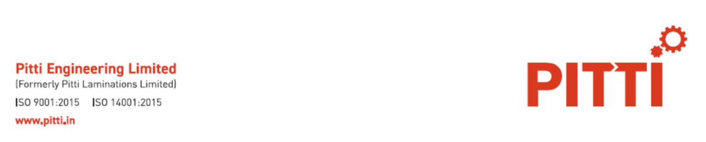
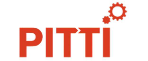
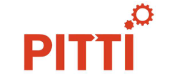

**[Image: PittiAug2025Concall.pdf-0001-00.png (1198x243, 55.2KB)]**

13th August 2025 

To, BSE Limited Floor 25, P J Towers, Dalal Street Mumbai – 400 001 

Scrip Code: 513519 

To, 

National Stock Exchange of India Limited Exchange Plaza, Bandra Kurla Complex Bandra (E), Mumbai – 400 051 

Scrip Code: PITTIENG 

Dear Sir, 

Sub: Disclosure under Regulation 30 of the SEBI (Listing Obligations and Disclosure Requirements) Regulations, 2015 - Transcript of the Audio Conference call for investors on 8th August 2025 

****** 

With reference to our letter dated 29th July 2025, intimating about the conference call with investors to be held on 8th August 2025, please find attached transcript of the aforesaid conference call. 

The above information is also available on the website of the Company at www.pitti.in. 

This is for your information and record. 

Thanking you, 

Yours faithfully, For Pitti Engineering Limited MARY Digitally signed by MARY MONICA MONICA BRAGANZA Date: 2025.08.13 BRAGANZA 16:28:35 +05'30' Mary Monica Braganza Company Secretary & Chief Compliance Officer FCS 5532 

**[Image: PittiAug2025Concall.pdf-0001-15.png (1273x228, 70.7KB)]**

**[Image: PittiAug2025Concall.pdf-0002-00.png (295x123, 14.3KB)]**

# “Pitti Engineering Limited Q1 FY-26 Earnings Conference Call” 

## **August 8, 2025** 

E&OE - This transcript is edited for factual errors. In case of discrepancy, the audio recordings uploaded on the stock exchange on 8th August 2025 will prevail 

**[Image: PittiAug2025Concall.pdf-0002-04.png (218x92, 10.0KB)]**

**[Image: PittiAug2025Concall.pdf-0002-05.png (214x101, 11.4KB)]**

**MANAGEMENT: MR. AKSHAY PITTI – MANAGING DIRECTOR AND CHIEF EXECUTIVE OFFICER, PITTI ENGINEERING LIMITED MR. CHAITRA SUNDARESH – DEPUTY CHIEF OPERATING OFFICER, PITTI ENGINEERING LIMITED MR. SANDIP AGARWALA – CHIEF OPERATING OFFICER FOR MOTOR AND GENERATOR COMPONENTS, PITTI ENGINEERING LIMITED MR. RISHAB GUPTA – CHIEF OPERATING OFFICER, FOR MACHINED COMPONENTS, PITTI ENGINEERING LIMITED MR. PAVAN KUMAR – CHIEF FINANCIAL OFFICER, PITTI ENGINEERING LIMITED** 

Page 1 of 19 

**[Image: PittiAug2025Concall.pdf-0003-00.png (295x126, 13.6KB)]**

### _Pitti Engineering Limited August 8, 2025_ 

#### **Moderator:** 

Ladies and gentlemen, good day, and welcome to the Q1 FY '26 Earnings Conference Call of Pitti Engineering Limited. 

As a reminder, all participants’ lines will be in the listen-only mode, and there will be an opportunity for you to ask questions after the presentation concludes. Should you need assistance during the conference call, please signal an operator by pressing ‘*’ then ‘0’ on your touchtone phone. Please note that this call is being recorded. 

A brief disclaimer: 

This conference call may contain forward-looking statements about the company, which are based on the beliefs, opinions and expectations of the company as on the date of this call. These statements do not guarantee the future performance of the company, and it may involve risks and uncertainties that are difficult to predict. 

With this, I now hand the conference over to Mr. Akshay Pitti – Managing Director and Chief Executive Officer of Pitti Engineering Limited. Thank you, and over to you, sir. 

#### **Akshay Pitti:** 

Thank you. Good afternoon, everyone, and a very warm welcome to the Q1 FY '26 Earnings Call of Pitti Engineering Limited. 

Along with me, I am joined by Mr. Chaitra Sundaresh – Deputy COO, Mr. Sandip Agarwala – COO for Motor and Generator Components, Mr. Rishab Gupta – CEO for Machined Components, and Mr. Pavan Kumar – CFO. Along with us is also SGA, our Investor Relations partner. 

We have uploaded our results and related documents on the stock exchanges and company's website. I hope everybody had an opportunity to go through the same. I would like to note that unfortunately, there's an error on Slide number 19 of the investor presentation, related to Q1FY '25 volumes, which will be rectified and uploaded shortly. 

Over the years, we have transformed from a specialist in electrical steel lamination into a comprehensive provider for engineering solutions. We have expanded our capabilities and diversified our offerings to include a wide range of high value-added components and subassemblies for rotating electrical equipment. 

Our operations are now structured around 2 key verticals – rotating electrical equipment and machined components, supported by our dedicated foundry division. We offer a broad range of services, including machined castings, co-building, shaft manufacturing, assembly, laser cutting, precision machining, tool manufacturing, fabrication to name a few. Serving a wide range of industries, our integrated end-to-end supply chain enables us to provide seamless delivery and exceptional value to our customers. 

Page 2 of 19 

_Pitti Engineering Limited August 8, 2025_ 

**[Image: PittiAug2025Concall.pdf-0004-01.png (295x126, 13.6KB)]**

FY '25 marked a transformational year for Pitti. We successfully completed the acquisition of Bagadia Chaitra Industries Private Limited and Dakshin Foundry Private Limited, along with the merger of Pitti Castings. These strategic moves are set to significantly enhance our product portfolio and broaden our industry reach, increase in capacities and capabilities and strengthen our customer base. Additionally, they support backward integration, enabling a more seamless and efficient manufacturing process. With this consolidation, we are now positioned as one of the most integrated engineering solution providers in this space in the country, offering a comprehensive product range and the ability to serve a wide spectrum of industry. 

Our strategic priorities moving forward include seamless integration of the acquired entities to realize the synergies and drive operational efficiencies, enhance productivity and efficiency to improve our consolidated margin profile, investing in R&D and automation and lean manufacturing to reinforce our presence in high-value, high-margin product segments. 

Let me give key specific highlights for this quarter before dwelling into the financial performance: 

Based on our current revenue run rate and FY '26 projections, we expect to operate near peak capacity for the fourth quarter of the current financial year. 

To support the next phase of growth, the Board has approved a capital expenditure of INR 150 crores to be deployed over the next 18 months. This investment will enable the following capacity expansion. Sheet metal capacity will increase from 90,000 metric tons to 1,08,000 metric tons per annum. Machine hour capacity will increase from 6,48,000 machine hours to 7,20,000 machine hours annually. Casting capacity will expand from 18,600 metric tons to 24,600 metric tons. 

This CAPEX is a strategic step to ensure we are well positioned to meet growing customer demand and capture emerging business opportunities. In the previous call, we had mentioned the commissioning of the revarnishing line. We are pleased to share that technical approvals have all been received and commercial production and supplies have commenced. 

We are seeing strong global demand from data centers and have successfully secured a second platform with an existing customer. The development of the alternator for this platform  will begin shortly. At peak revenue potential, this platform is expected to generate more than INR 20 crores of recurring annual revenue. 

Now to share the operational and financial highlights, I will hand over to Mr. Sandip Agarwala. 

**Sandip Agarwala** _:_ 

Thank you. Welcome, everybody. 

Let me now share the key operational and financial highlights for Q1 FY '26: 

Page 3 of 19 

**[Image: PittiAug2025Concall.pdf-0005-00.png (295x126, 13.6KB)]**

### _Pitti Engineering Limited August 8, 2025_ 

Our consolidated revenue for the quarter stood at INR 457 crores, marking a 17% year-on-year growth compared to INR 391 crores in Q1 FY '25. Exports accounted for 31% of the total revenue during the quarter. EBITDA came at INR 75 crores, reflecting a strong 30% year-onyear increase with EBITDA margins improving to 16.5%, up 170 basis points from 14.8% in Q1 FY '25. Profit after tax also grew by 17% year-on-year to INR 23 crores. 

Sheet metal volumes for the quarter were about 16,000 metric tons. It is worth noting that Q1 and Q2 have historically been softer quarters for the industry. And in line with our past trend, we typically see about 45% of our annual revenue generated in H1 and the remaining 55% in H2, a pattern we expect to continue this year as well. 

We continue to closely monitor evolving geopolitical development and tariff situations. However, we remain optimistic of achieving a top line growth of about 15% for FY '26. This is supported by strong pipeline of inquiries and robust order visibility. 

With the anticipated increase in revenues and combined with improved operational efficiencies and benefits of operating leverages, we are confident in our ability to drive further margin expansion in the coming quarter. 

With this, I hand over to Mr. Akshay for the Q&A session. Thank you. 

**Moderator:** Thank you very much.  We will now begin the question-and-answer session.The first question comes from the line of Sani from Axis Securities. Please go ahead. 

**Sani Vishe:** 

Yes. Thanks for taking my question. And I understand, as you mentioned, there is some error on Slide 19, but I would like to appreciate the effort that I think the presentation has been improved a lot. So, it seems a lot more sorted. But having said that, I think the numbers for Dakshin and PIPL were excluded. So, could you just elaborate, give the larger numbers, because you have just mentioned that sheet metal volumes were 16,000 metric tons. But otherwise, it would be good if you could give the other numbers as well. 

**Akshay Pitti:** So, what we have done here, we are trying to consolidate the sheet metal and casting and give the consolidated numbers. So, the Dakshin and Bagadia numbers are rolled up into Slide number 19 itself. 

**Sani Vishe:** Okay. Understood. And the correction, would you be rolling it out just after the call? Or would you prefer correcting whatever is there on the call itself? 

**Akshay Pitti:** Just after the call, SGA team will be correcting it and sending it out. 

**Sani Vishe:** Okay, fine. Thank you. And in terms of the numbers, I think in the last call, we had mentioned that the depreciation number going ahead will be similar to the Q4 number, and the finance cost 

Page 4 of 19 

**[Image: PittiAug2025Concall.pdf-0006-00.png (295x126, 13.6KB)]**

### _Pitti Engineering Limited August 8, 2025_ 

will actually start declining. Both the numbers seem to have increased. So, can you throw some light on that and expectations going ahead? 

#### **Akshay Pitti:** 

Yes. So, on the working capital side, if you see, we have moved from about 57 days to about 75 days in the working capital cycle. This is mainly on account of 2 issues. 1, we have stopped factoring export receivables like in the past. Therefore, the cost of finance of that particular business is not reduced from the sales. It's now coming into the interest line. So, if you see the EBIT margin has increased and so has the interest rate.. 

Number 2, we have also stocked up a little extra raw material, considering the current situation related to BIS and import of materials and the quality control orders on the steel mills. So, we have seen huge shortages in raw materials in Q1, and the situation is expected to continue up till Q2 end as a result of this disruption, which is why our net debt has actually gone up to about INR 525 crores. 

**Sani Vishe:** Okay. But can we expect it to reduce a bit or because we have announced CAPEX, it would remain elevated or may increase further going ahead? 

**Akshay Pitti:** The RM we are stocking up will be reduced by December end only, depending on the situation in the market and the availability of raw material. 

**Sani Vishe:** No, no, I am asking about the net debt. 

**Akshay Pitti:** Net debt will be related to that because right now, the driver for the increase in net debt is mainly the inventory. 

**Sani Vishe:** Okay. So, financing the inventory. 

**Akshay Pitti:** Yes. 

**Sani Vishe:** Understood. Okay. And depreciation would the current quarter's rate be a fair assumption? Or do you think it may change? 

**Akshay Pitti:** So, like we have announced this CAPEX, which we will start implementing probably from second half of the year. And as that CAPEX will move from CWIP to gross block, the depreciation will rise. Till then, this should be the steady rate approximately. We have about INR 25-odd crores of CWIP currently left to be capitalized. So, it's not going to be significant. 

**Sani Vishe:** Okay. And given the new CAPEX, I think it will be in phased manner and there will be some breakeven period. So, is there any expectation in terms of our target for FY '27? Or shall we assume that the meaningful contribution to earnings side will only come in FY '28? 

Page 5 of 19 

**[Image: PittiAug2025Concall.pdf-0007-00.png (295x126, 13.6KB)]**

### _Pitti Engineering Limited August 8, 2025_ 

**Akshay Pitti:** 

No. See, CAPEX that we are currently incurring is all aimed towards FY '27 sales numbers. As we mentioned, we are expecting a 15% top line growth for the current year. And in terms of Quarter 4, we expect to be at  optimum capacity utilization. 

**Sani Vishe:** 

Right. 

**Akshay Pitti:** So, the Quarter 4, we will be at full utilization. So, for Q1 of FY '27 growth, we will be doing this CAPEX in a phased manner. 

**Sani Vishe:** Okay.. But we had earlier stated that you would be doing around INR 2,100 crores to INR 2,200 crores of sales in FY '27. So, does it change? And if yes, how much? 

**Akshay Pitti:** I think that should get revised upward. I think this year itself, we should be ending around INR 2,000 crores, if you go by our guidance of 15% Y-o-Y growth. And for FY '27, that will change. But like we said, it's an evolving geopolitical situation, and we are still optimistic. The visibility and order pipeline is quite strong. 

**Sani Vishe:** Understood. Okay. Thanks a lot for answering my question. 

**Moderator:** Thank you.The next question comes from the line of Deepesh Agarwal from UTI AMC. Please go ahead. 

**Deepesh Agarwal:** Congrats, sir, for the good set of numbers. Akshay, my question is, how you plan to mitigate the U.S. tariff situation? Are you looking for alternate manufacturing or you would be looking for a newer market? Or do you think the customers can absorb this kind of a price increase? 

**Akshay Pitti:** So, see, there are 2 parts to this answer. The first part, if you see our consolidated exports is about 31% of revenue. Of that revenue, about 30% goes to U.S. So, on a total revenue basis, the exposure to U.S. is about 9% to 10%, which is going to be impacted by this tariff. So, while it is a decent amount of revenue, it's not critical to the company, if you may put it in one sense. Second, if you see the kind of tariff announced, I don't think any company, us or the customer can absorb it. Eventually, it has to be the end user. 

And secondly, if you see the supplier base, like I had mentioned in the previous call as well, it's either India or China. So, currently, China has a 30% duty from what I understand, and we are at a 25% duty. There is a discussion on the Russia penalty, which is still an evolving situation. So, from whatever discussions we have had with our clients, they are also a little confused as to how to navigate the situation. We are not seeing any decline in order inputs. I think  Q3, our projections are really robust for our export business, including that to the U.S. market. 

Page 6 of 19 

**[Image: PittiAug2025Concall.pdf-0008-00.png (295x126, 13.6KB)]**

### _Pitti Engineering Limited August 8, 2025_ 

#### **Deepesh Agarwal:** 

Do you think the capacity, so 10% of the revenue comes from U.S., do you think if you are not able to supply to U.S. because of tariff, you can chip into the other markets and actually compensate for this kind of a decline? 

**Akshay Pitti:** For sure. If you look at the other North American markets, what our customers they have facilities all over the globe. So, if it is prohibitive for them to probably import this material to U.S. and manufacture it there, they probably will move it to some other facility in the global supply chain and get it manufactured there. 

See, what is interesting about our U.S. business is, this business is primarily linked to miningrelated parts and not the locomotive-related part of our customers. And that is not in U.S. consumption. Those mining trucks are exported all over the world. So, like it will be very easy for them to move that production somewhere else if this tariff situation continues. 

What we can't assess is the indirect impact of the tariff. So, if we have customers in India who are exporting their products to U.S., that is still an unknown portion for us. 

**Deepesh Agarwal:** Right. The other thing I want to understand from you is on the capacity expansion. Right now, if I see you would be operating roughly at 70% utilization across the various verticals and there is a geopolitical uncertainty. Still you are going for expansion. So, how confident are you on actually having the exit run rate on capacity utilization healthy enough for us to see next year new capacity being absorbed? 

**Akshay Pitti:** So, if I talk of the total tonnage of laminations that we export to the U.S., I think that's in a year, somewhere around 3,000 tons, not significant, like I mentioned, in tonnage terms. In revenue terms, it's slightly higher because there's significant value add in those parts. If you ask me on volume projections for the current year, our annual business plan of 68,000 tons still looks very, very achievable. 

And it will be split something like 16,000 tons what we have done in the current quarter, 17,000 in the next quarter and somewhere close to 18,500 and 19,000 in the quarter 3, Quarter 4. So, if you look at our Quarter 4 run rate, that will be actually well above the optimum 80% utilization levels, which is why we have decided to go ahead and invest. 

**Deepesh Agarwal:** Sure, sure. And this new capacity will be up and running by when, Q1 of next year, right? **Akshay Pitti:** It will be progressively implemented starting Q1 of next year. 

**Deepesh Agarwal:** Sure. And lastly, the current margin levels of 16.5%, would we think that these margins would be sustainable and as you increase the utilization to 80% by Q4, there could be some upside risk to this? 

Page 7 of 19 

**[Image: PittiAug2025Concall.pdf-0009-00.png (295x126, 13.6KB)]**

### _Pitti Engineering Limited August 8, 2025_ 

**Akshay Pitti:** Definitely. So, if you see the employee cost, other expenses, those are all factored in for the higher operating level. So, as we move from 16,000 to 19,000 quarterly output levels in the Lamination business, the incremental margin should technically flow to the EBITDA line. 

#### **Moderator:** 

The next question comes from the line of Mohit Jain from DRChoksey Finserv Private Limited. Please go ahead. 

**Mohit Jain:** Sir, my first question would be on the EBITDA per ton wise. So, we have seen a good jump in EBITDA margin from last year Y-o-Y, 16.5% from 14.5%. What is the EBITDA per ton realization this quarter? And could you please compare it sequentially and Y-o-Y? 

**Akshay Pitti:** So, if you look at EBITDA per ton, we can just work that out at INR 75.4 crores is the EBITDA for the quarter and the tonnage is about 16,000. But like we had mentioned in the past, that would not be the right metric to measure the company given the complex product mix that we have now because we have casting, machining, fabrication and even in lamination, different levels of assembly. 

**Mohit Jain:** All right, sir., on the sector side, I have seen renewable energy share mix in the overall sector declining from like 5%, 6% to 3% this quarter. So, what are the reasons behind this drop? And what sort of demand do you see in renewable space in the next like 1 and 2 years? 

**Akshay Pitti:** See, renewable space is typically a seasonal business as well, the windmills which need to be installed or the power generation projects that are getting implemented. So, seasonally, this will keep varying. Overall, renewable energy in this year will be much higher than last year in absolute rupee terms. We are seeing huge demand coming in from domestic as well as international wind players as well as the requirement of electrolyzers for our hydrogen part of the business continues to grow. And with this revarnishing line that has been implemented, the Hydro Power-related business also should start growing starting Q3. 

**Akshay Pitti:** Sorry, just coming back to your EBITDA per ton. At a very simplistic level, it's about 46,875 tons on a consolidated basis. 

**Mohit Jain:** Got it. And sequentially last quarter? 

**Akshay Pitti:** That I think you can work it out. We have given the quantitative numbers. You can just divide the EBITDA by the tonnage. I don't have that on hand with me. 

**Mohit Jain:** Got it. And sir, you earlier mentioned about 15% growth this year, which you are targeting, which comes to around INR 1,950 crores to INR 2,000-odd crores of revenue. And you also maintain a positive outlook for FY '27. I guess, sir, before like 2, 3 quarters, you mentioned about around INR 2,300 crores guidance for FY '27 at a constant raw material prices and EBITDA margin guidance was around 15% to 16%. Now do you think we will achieve this 

Page 8 of 19 

**[Image: PittiAug2025Concall.pdf-0010-00.png (295x126, 13.6KB)]**

### _Pitti Engineering Limited August 8, 2025_ 

revenue guidance or given the new CAPEX, you are going to have incremental guidance on this number on FY '25? 

#### **Akshay Pitti:** 

I think we will maintain that guidance for now. What we are doing is also a lot to do with the margin-accretive products. So, I think you should see margin growth in FY '27 post CAPEX progressively through the year. See, the capacity in lamination, the headline number is increasing significantly. While that's the case, if you look in the casting side of the capacity, it's increasing even more than the lamination. So, you will be seeing those benefits in FY '28 because the machining and casting will be a higher profit margin business. 

**Moderator:** Thank you. The next question comes from the line of Rahul Kumar from Vaikarya. Please go ahead. 

**Rahul Kumar:** Sir, just on the U.S. exports, what is the outlook for growth in the next few quarters you are seeing, especially in the context of the merger of their end customers? 

**Akshay Pitti:** Sorry, if you can just clarify what you mean the merger of the end customers? **Rahul Kumar:** No, I think there's an expectation of merger of the railroads in U.S., right? 

**Akshay Pitti:** Yes. So, see, those are the end customers of my customers. So, as that consolidation capacity takes place, I think it will help drive more CAPEX and more modernization in railways in any case. That's for the overall market. The growth anyways is there. 

When we talk to our clients, we see robust order visibility and order flows coming to us. Ex of tariff, I think quarter 3 is slated to be our best export performance ever. And if you see Quarter 4 of last year and current quarter, they were also some of the best quarters in our export history. The major question that needs to be answered is the tariff bit. 

**Rahul Kumar:** Okay. And second question is, you mentioned briefly, but what is the update on this import of electrical steel situation? When do you expect it to be resolved for, let's say, industry in general? 

**Akshay Pitti:** So, see, what we are expecting was the imports from China would be stopped starting April. What we did not expect or nobody in the country expected was that there would be quality control orders for even integrated steel mills, which have BIS approvals, mills such as Korean POSCO or Nippon from Japan or the Russian mills. So, that has actually resulted in a constrained supply to India of electrical steel. 

While we wanted a stop to the Chinese material, we didn't want to stop to all materials coming to India. So, it kind of backfired dramatically. And I think the quality control orders are already lifted for the Japanese and Korean mills in this month itself. So, we should start seeing the situation easing out from September onwards. We should see the shipments coming in. So, on 

Page 9 of 19 

**[Image: PittiAug2025Concall.pdf-0011-00.png (295x126, 13.6KB)]**

### _Pitti Engineering Limited August 8, 2025_ 

hoarding mode for our raw material. We rather hoard the material and keep it so that we don't incur any shocks in supply chain. 

#### **Rahul Kumar:** 

Okay. And the third question, which I wanted to  asked was,  if I look at your product mix, which you have disclosed, I think this is for the stand-alone business. In that, if I see the value-added mix has improved sharply this quarter versus, let's say, Q4 of last year. Do we expect this kind of value-added product mix to continue? Or this is more of a one-off phenomenon this quarter? 

**Akshay Pitti:** See, the percentage is very sharp, but in absolute terms, it's not so big a number. So, we will see percentage-wise sharp increases. This business is stated  to grow. Like I said, the Wind Power business is going to do well. The Railway business is doing well. The Mining business is doing well. Data centers is doing well. So, these are all the segments that take the higher value-added products, higher level assemblies and subassemblies. 

**Rahul Kumar:** Okay. And the last question, which I had was, I think goodwill,   last year acquisition. 

**Rahul Kumar:** If I remember correctly, I think there was some discussion for how do you want to amortize it going forward? Or do you want to impair it? Have you reached some sort of conclusion regarding that? 

**Akshay Pitti:** Currently, we are not impairing it as we have been advised. We are still taking some more advice from our tax auditors on how to amortize this correctly. So, I think we will come up with a policy of that shortly. 

**Rahul Kumar:** Okay. And on your U.S. exports, I think one of the key customers which you export, so given this tariff situation , is it possible for the customer to move that business out of that location and therefore, circumvent the tariffs like that? 

**Akshay Pitti:** See, part of the business, yes, not all of it. Certain things, I don't think they would be able to move out immediately. It will take significant time. But certain parts where they have dual capacities in the other global facilities, I believe they would start moving it down, especially for those businesses where the end market is not within the United States. 

**Rahul Kumar:** Okay. So, broadly speaking, let's say, for the products which goes out of U.S. for those particular products, what would that be percentage? Let's say, if your sales to U.S. was 10%, what percentage of that related to the products exported from U.S.? 

**Akshay Pitti:** See, it's very difficult to correlate our quarterly sales or our annual sales to their sales, because they also have an inventory, there's a transit time. And where they ship it, like it's very difficult for us to kind of correlate that. But if I have to make a guess estimate based on our discussions, it would be something like 30-odd%. 

Page 10 of 19 

**[Image: PittiAug2025Concall.pdf-0012-00.png (295x126, 13.6KB)]**

### _Pitti Engineering Limited August 8, 2025_ 

#### **Rahul Kumar:** 

Okay. Okay. Fair enough. And I think last question is on your business, is it possible that given the tariff on India is at a higher level, and let's say, if it sustains, do you believe that you can move the business to some other location, maybe reshoring it to, let's say, Mexico or some facility like that? 

**Akshay Pitti:** So, we have explored Mexico as an option. What we understand, if you take the steel prices that are prevalent in Mexico and the cost of labor arbitrage, I don't think it makes much sense to reshore it to Mexico. Anyways, Mexico is one of our largest export markets. Out of our total exports, about 55% odd goes to Mexico. So, we have looked at that as an opportunity, not even due to tariff, even pre-tariff, trying to be close to customer. 

**Moderator:** Thank you. The next question comes from the line of Balasubramanian from Arihant Capital Markets Limited. Please go ahead. 

**Balasubramanian A:** Good afternoon, sir. Congratulations on the good set of numbers. Sir, this INR 155 crores CAPEX, how much CAPEX to be incurred in FY '26? Probably we are starting at H2 only. And FY '26 number and FY '27 number on the CAPEX side. We are doing as a brownfield CAPEX, or we are setting up new facilities. Whether we are doing it out of Aurangabad or we are setting up some other plant? Are we getting any incentives or subsidies for this CAPEX? 

**Akshay Pitti:** Yes. So, if you ask whether it's a brownfield, yes,  these are all brownfield expansions.. There's no new facility being created. As you recall, the infrastructure is in place  for  both Bangalore and Aurangabad for increasing the capacity, and we will be only doing incremental CAPEX quarter-on-quarter in a brownfield expansion manner. 

In terms of CAPEX spend of INR 150 crores, which is a fresh CAPEX, apart from this, we already have about INR 40 crores of unspent, unutilized CAPEX, which was approved from the last financial year carry forward. If I take the total INR 190 crores, including the carry-forward, we will be spending somewhere around INR 80-odd crores in the current year and the remaining INR 110 crores in FY '27. 

**Balasubramanian A:** And how is the funding mix, sir? 

**Akshay Pitti:** It will be a mix of internal accruals and debt. 

**Balasubramanian A:** Okay, sir,, earlier, we plan to repay some INR 100 crores kind of debt, whether   we are going to repay or we will continue the same in this year? 

**Akshay Pitti:** So, like I was saying, we intend to repay those debts and take fresh loans for this with better cost of funds. 

Page 11 of 19 

**[Image: PittiAug2025Concall.pdf-0013-00.png (295x126, 13.6KB)]**

### _Pitti Engineering Limited August 8, 2025_ 

#### **Balasubramanian A:** 

Okay, sir. Sir actually, based on this tariff arbitrage, I think the last quarter you mentioned about 200% increase in RFQs from U.S. and EU clients are diversifying from China. And how this order conversion, how the traction is there? 

**Akshay Pitti:** So, the traction is still good. See, this tariff has just come in a few days ago. Despite that, the discussions are still encouraging. Nobody believes that this is the final tariff that we will have to pay, 25% plus 25%, total 50%. And even in that case, they want an alternate supply chain to China. So, the RFQs are continuing to be well. Like I said, the recent platform on the data center has been finalized with the customer with a 20% annual revenue potential. So, we are continuing to see the same kind of order flow and inquiry flows. 

**Balasubramanian A:** Okay, sir. Sir, and lastly, on the automotive side, right now, maybe 1% or 2% kind of revenue share only, but we are targeting 10% to 12% kind of share. And what specific OEM partnerships or any order pipelines are underlying in coming quarters? 

**Akshay Pitti:** So, if you see the overall EV market globally also is under a lot of pressure. We are still focused on both EV and non-EV related automotive. And we have few customer additions going on. This will be a very slow and steady process as the supply chains move to India, as I had mentioned in the past. It is not a near-term prospect, it's a longer-term prospect. 

**Balasubramanian A:** Okay, sir. Sir, and lastly, our clients are really doing good. I think we have seen in that Q1 itself. I just want to like understand, is there any reiteration of our revenue guidance and margin and volume guidance in this year for this pipeline? 

**Akshay Pitti:** Whatever I mentioned previously in the call, I hold that guideline. I don't think I will be revising that within the call. 

**Balasubramanian A:** Okay, sir. Okay. Thank you. **Moderator:** Thank you.The next question comes from the line of Naysar Parikh from Native Investment Managers. Please go ahead. **Naysar Parikh:** Hi, Akshay. Thanks for taking the question. My question is on volumes. The volumes this quarter are obviously soft. So, what is driving that? And how should we look at it for the rest of the year? 

**Akshay Pitti:** See, typically, Q1 is always slightly slower due to the upheaval in April related to raw material. April as a month was quite bad. So, we have made up a lot of ground in May and June. So, for Quarter 2, if you look, we are projecting somewhere around 17,500 tons. And for the whole year, we still maintain our guidance. 

Page 12 of 19 

**[Image: PittiAug2025Concall.pdf-0014-00.png (295x126, 13.6KB)]**

### _Pitti Engineering Limited August 8, 2025_ 

#### **Naysar Parikh:** 

Right. Okay. And specifically, within that, we are seeing high-value assembly parts, machined components, et cetera, the decline is higher. I am assuming these would be better margin products generally. And earlier, you mentioned that we will try to increase component of highvalue parts and all that, but that's not happening. So, is there any product shift which will eventually flow down to margins? 

**Akshay Pitti:** So, if you are referring to Slide number 19, like I had mentioned in my opening remarks, there is an error wherein Q1 FY '25 is wrongfully labeled. Those numbers are actually for Q4 FY '25. SGA team and our team will be restating these numbers and sending out. However, if you see even on a quarter-on-quarter basis, the move is from high value-added assemblies to stator frame and rotor shaft integrated assemblies, which is the next level of value add. So, what is happening is, if you see the higher value-added parts are moving into an even higher value-added bracket. 

**Naysar Parikh:** Right. Understood. Okay, got it. And just on the U.S. bit that you mentioned, right, that 10% of your revenues are the U.S. So, the balance that you are kind of obviously selling, do you know if your end consumer, they are using it mainly domestically? Or are they exporting to U.S.? So, do you have any indirect risk that you are bearing? 

**Akshay Pitti:** So, indirect risk would be there. It is very difficult to quantify that. Like if you see the data center products that we do, those go all over the world. So, in a given quarter, it might be U.S. heavy, in a given quarter, it might be Europe heavy or Australia. We don't get that granular detail from our domestic customers as to what their export mix is. 

**Naysar Parikh:** Okay. But at least, even from your domestic customers right now, you are not getting signals of slower ramp-up or delayed ordering or anything like that. You are not seeing that right now. **Akshay Pitti:** Nothing such as that. In fact, like I said, Quarter 2 is expected to be the best quarter in the company's history in terms of volumes. **Moderator:** Thank you. The next question comes from the line of Het Choksey from Deven Choksey. Please go ahead. **Het Choksey:** Yes, good afternoon, Akshay, and thank you for a very detailed presentation, and a very, very detailed approach towards tackling these uncertain times. So, keep up the good work. I have 2 questions out here. First thing is, I am seeing a substantial jump this quarter, although I don't like to see the number on a quarterly basis, but in the railway component business, there is a substantial jump as a percentage of your overall revenue breakup. Can you just elaborate on the traction motor and the railway component business exactly what is happening? 

**Akshay Pitti:** So, as you recall, we were in the final stages of approval for a lot of our domestic parts that will be going to the CLW, DLW factories for machined castings. So, those have come through and now our commercial supplies have started and are ramping up for those businesses. Apart from 

Page 13 of 19 

**[Image: PittiAug2025Concall.pdf-0015-00.png (295x126, 13.6KB)]**

### _Pitti Engineering Limited August 8, 2025_ 

that, if you see this is on a consolidated basis. So, post the acquisition of Dakshin Foundry's, a lot of their business also is towards railway and traction motor-related parts. So, those are the 2 things which have changed there. 

And the remaining is attributable to the increase for our supplies to a project called Simandou project for Wabtec, where they have this new locomotive being built for somewhere in Africa, I keep forgetting the country. So, that is kind of a one-time bump 

#### **Het Choksey:** 

Is it the Mozambique order? 

**Akshay Pitti:** 

Could be. I don't have that off-hand with me. I will just ask my team to check on that. It's called the Simandou Consortium or something. So, that is one thing which is again bumping it up. And apart from that, Quarter 1 was very good for our traditional U.S. and Mexico railway-related business. 

#### **Het Choksey:** 

Okay. So, does this trend continue as a percentage of the revenue breakup? Like I just wanted to get a pecking order of the profile of the margin. As I understand, the Mining business, the Renewable business and the Wind Power business and the Data Center business is a really highmargin business. But as a percentage of your revenue, it's still small. It's like a sunrise space, whereas the power generation business or, let's say, the industrial and commercial might be the low-margin business, but a significant volume driver business. So, where does the traction motor and railway components stand here? 

**Akshay Pitti:** 

Traction motor and railway components are also very high-margin business. So, if you have to take a margin profile-wise, traction motor, railway components is one mining, oil and gas, renewables and data centers, these would be your higher value-add, higher gross margin business. 

**Het Choksey:** 

Okay. And do you have a breakup of the data center part as a percentage of this revenue? 

**Akshay Pitti:** 

Data center, it's combined under power generation, but I think that should be about 4%. 

**Het Choksey:** 

Okay. And you see it going up to close to 7% this year? 

**Akshay Pitti:** 

See, the overall power generation space is increasing. As I mentioned, we are going to see increase from hydro power-related projects and thermal power-related projects as a consequence of the new varnish line that we have commissioned. Apart from that, the traditional DG set business volumes also are going up and are projected to go up further. So, while there will be a significant absolute increase in the Data Center-related business, in percentage terms, it's a little difficult for me to say whether it will go to 7%, because the other segments also are growing. 

Page 14 of 19 

**[Image: PittiAug2025Concall.pdf-0016-00.png (295x126, 13.6KB)]**

### _Pitti Engineering Limited August 8, 2025_ 

See, what we are seeing, Het, is that, it's a broad-based growth. Okay? Some sectors such as, say, Wind Power is going to grow faster than the rest. But every other sector also is growing significantly. Maybe they are not going 50% up, but they are still doing 10%, 12%. 

#### **Het Choksey:** 

Okay. And just to get a feel of this part to continue on this, we have seen this government's plan of next 5 years that about INR 6 lakh crores will be invested in the entire power distribution and transmission space to strengthen the HVDC and UHVDC space. How do we fit into this story? Can you elaborate us that? 

**Akshay Pitti:** So, that is mostly on the transmission lines and transformers. That's what they require. We are not into the transformer business. That is static electrical equipment. We are only in the rotating electrical equipment. We may look at it as an opportunity going forward, but the steel-sourcing of transformer grade steel is very,  difficult, complicated and very high cost, so, your gross margins there are much lower. Capital employed is higher. So, while we have explored those opportunities, we feel that our capital can be better deployed with better returns currently in this segment. 

If an opportunity in inorganic way presents itself to us in that space, we would be interested to look at that rather than doing it greenfield. 

**Het Choksey:** Fair enough, sir. Great. And just one clarity on this traction motor and railway component business. What's your share as far as the Dakshin is concerned to, let's say, the metro projects and the high-speed rail projects coming up? 

**Akshay Pitti:** So, metro and high-speed rail, I believe you are talking of Vande Bharat in this case? **Het Choksey:** In some form, yes, the upcoming future projects. **Akshay Pitti:** Not the Mumbai Ahmedabad, right? **Het Choksey:** No, no, no. You can elaborate on that, but I was definitely talking on the Vande Bharat. **Akshay Pitti:** Talking of the Vande Bharat, so there, I think I would not want to put out a percentage, but yes, I would say a very,  high percentage market share. 

**Het Choksey:** Okay. And we are like the de facto player in this place who can supply to MEIL and anybody? 

**Akshay Pitti:** For the motor bodies, yes, for MEIL, MEDHA and all of these people, we are the preferred vendor of choice. Because see, Dakshin does the casting. Now we are starting to do the machining in-house for those castings. And we make the laminations from Pitti Engineering. So, now with all of this coming under one roof, it's an unbeatable combination. 

Page 15 of 19 

**[Image: PittiAug2025Concall.pdf-0017-00.png (295x126, 13.6KB)]**

### _Pitti Engineering Limited August 8, 2025_ 

#### **Het Choksey:** 

Perfect. Perfect. I think it sounds good. And just 1 last question, clarity. See, you mentioned on the call earlier to one of the participants that the U.S. business is like 10% of your revenue. But as I understand, it is not easy to shift the supply chain overnight despite China having, let's say, today, 30% tariff, and we are moving from 25% to 50%. So, just want to get your understanding on the mining part, which is the main component in the U.S. What is your interaction with your customers? Will they easily move to China if this continues for the China business? 

**Akshay Pitti:** Whatever parts are dual source and they are already vendors approved, it is not that big a deal to move it. It will take 6 to 9 months if they are already approved suppliers. They have to ramp up. That's about it. But where there are no approved suppliers, it's a multiyear project. 

So, if I have to give an estimate of that 10% revenue, I would say about 7% is there's no dual source or there's no dual source in economically competitive region ex of tariff. If you take the 10%, about 3% is where there's dual source in an economically competitive region. For the 7%, there may be some dual source, some no dual source in some cases. And wherever there is, it's not in an economically competitive region. 

**Het Choksey:** Okay. So, it means that the 3% business is where there will be a lot of negotiations and discussions on part of the customers. 

**Akshay Pitti:** Potentially there will be a discussion or they might just start shifting 6 to 9 months later. Because see, with the 50% tariff, there's nothing much that we can discuss. Our gross margins also are not 50%. 

**Het Choksey:** Correct. Correct. Okay. Great. All the best. Looking forward to progress and just keep up the good work, yes. 

**Moderator:** The next question comes from the line of Shyam Maheshwari from Aditya Birla Mutual Fund. Please go ahead. 

**Shyam Maheshwari:** Yes. Hi, Akshay. Congrats on a good set of numbers. Just a question from my side on the strategic initiatives. So, when we last spoke on the con call, I think the focus was more towards debt repayment. But, obviously, now we have announced this CAPEX as well. Just wanted to understand, has there been some positive development on ground because of which now we are kind of focusing more on capacity augmentation? And has anything changed on the ground in that respect over the last few months? 

**Akshay Pitti:** Yes. So, over the last few months, we have been seeing quite a few positive developments. But more concretely in the last 30, 40 days, the domestic side of the business is really picking up and there's consolidation taking place. So, what CAPEX we thought will probably kick off post September of current year, we are trying to pull in because we see that Quarter 1 itself, we will be requiring new capacities to meet the increased demand. 

Page 16 of 19 

**[Image: PittiAug2025Concall.pdf-0018-00.png (295x126, 13.6KB)]**

### _Pitti Engineering Limited August 8, 2025_ 

Our projected volumes based on our internal calculations and visibility is about 19,000 tons for Quarter 4. So, that takes us beyond the current installed optimum utilization of our capacities. 

**Shyam Maheshwari:** Understood. And this should be lasting in the sense that even for FY'27 and maybe beyond, we see this sustaining and maybe improving? **Akshay Pitti:** Yes, absolutely. See, we are only looking at those projects, which will continue to sustain, which are not going to be tariff-related movements to India, like I had said in the last call that we are very focused not to go into this hyperbole of putting investment based on tariffs, which is why we have waited for the situation to crystallize, let the dust settle and then decided to go ahead with this. And as far as the debt reduction goes, we are still committed to the reduction in debt. Like I mentioned, the net debt is up to INR 525 crores vis-a-vis INR 470-odd crores in the previous quarter. That's mainly on account of the inventory rise as well as moving from export bill factoring to on our books for a better cost. And if you look at the CAPEX announced about INR 150 crores, that is over 18 months. So, over 18 months, our cash accruals will be significantly higher than the CAPEX projected. On a net basis, you will see a net debt reduction. **Shyam Maheshwari:** Makes sense. So, even with inventory rationalizing post September, as you mentioned **Akshay Pitti:** Around December. **Shyam Maheshwari:** Yes, around December. So, at least maybe some sort of debt reduction should happen this year. That is still possible. **Akshay Pitti:** Yes, absolutely. **Shyam Maheshwari:** Understood. Perfect. Yes, all the best. **Moderator:** Thank you. The next question comes from the line of Kuleen Tanna from Aionios Alpha Investment Management. Please go ahead. **Abhijit Mitra:** Yes, this is Abhijit here. So, just a couple of questions on the export business. For the clarity of understanding, whatever is going to Mexico is essentially for the locomotive and the passenger freight, and the rest which is going to U.S. directly is majorly mining. is that the broad categorization? **Akshay Pitti:** Yes, absolutely correct. So, what goes to Mexico is mainly for freight and what goes to U.S. is predominantly for mining. 

Page 17 of 19 

**[Image: PittiAug2025Concall.pdf-0019-00.png (295x126, 13.6KB)]**

### _Pitti Engineering Limited August 8, 2025_ 

**Abhijit Mitra:** Understood. And on Mexico, there are no duties as such, at least for the next 90 days, there are no duties sort of intend about and then probably they are going to follow the FTA, which they have sort of got into in the first month. 

#### **Akshay Pitti:** 

Yes. That's exactly what we read. So, the revised FTA that they had signed is what I think will prevail. And the continuity structure with India and Mexico remains constant. There's no change there. 

**Abhijit Mitra:** Understood.. Got it. And on the business as such, if I take out the traction motors and the railway components, if I look at the rest of the revenues, that has grown by around 5% on a Y-o-Y basis. That growth is constrained by the availability of raw material largely, right? Because since traction motor and railway components is a high-margin business, you would have prioritized it. And correspondingly, the rest of the pack has been deprioritized to a certain extent, which leads to a 5% revenue growth per se. And probably as the supply sort of moves up, this growth sort of comes back. Is that the way of looking at it? 

**Akshay Pitti:** I think at a macro level, you can frame it like that. But see, what's happened, if you see the industrial and commercial motor space or the power generation, especially the DG sets, they are extremely price sensitive. So, when the raw material constraints took place and the prices went up in India in Quarter 1, if you would have seen the results of all the steel mills, they have given fantastic results in Quarter 1 on account of those increases. Those increases were not appreciated and accepted by the end consumers of these products, which is why April, as I mentioned, was slow. 

And May and June have picked up pretty well. So, we continue to see the growth in those higher profit segments such as traction motor, renewables, data centers. And now with the rationalization and availability of material coming in from Korea and Japan, the prices are going to lower in India and the same is going to result in volume growth in the price-sensitive segments of the business as well. 

**Abhijit Mitra:** Understood. Got it. And the last question is, when you say 16,000 tons and you target 19,000 tons, these are purely lamination volumes, right? This does not include casting? 

**Akshay Pitti:** Not casting. 

**Abhijit Mitra:** Okay. Understood. Sir, can you help me with casting volumes also for the quarter? Laminations plus castings would be how much for the quarter? 

**Akshay Pitti:** Castings in terms of machined castings, we did about 420 tons, and we did about 1,236 tons of plain vanilla machined castings and 676 tons of raw castings. So, roughly about 3,000 tons in total. 

Page 18 of 19 

_Pitti Engineering Limited August 8, 2025_ 

**[Image: PittiAug2025Concall.pdf-0020-01.png (295x126, 13.6KB)]**

**Abhijit Mitra:** Okay.. Got it. So, whatever numbers that you have reported in your presentation on Slide 19, if I include the other components, that is essentially laminations plus castings. So, Slide 19, if you add loose laminations plus other components, essentially, that's lamination plus castings put together, right? **Akshay Pitti:** Absolutely correct. **Abhijit Mitra:** So, shouldn't one be looking at that number as than purely laminations, for consolidated? **Akshay Pitti:** I think that is the right way to do it, which is the intent, and that's the reason that we have decided to put it in this way, so that we can move away from an EBITDA per ton on lamination to a product mix-based percentage margin on revenue. **Abhijit Mitra:** Understood. Okay. Got it. But when you say you are exiting Q4 at 19,000 tons of laminations, what is the targeted castings volumes by Q4? 

**Akshay Pitti:** That will be about 4,000 tons per quarter, 30% growth rate there. **Abhijit Mitra:** Got it. Great. Thanks for taking my question and wish you all the best. Due to time constraints, I would now like to hand the conference over to the Management for closing comments. **Akshay Pitti:** Yes. Thank you all for joining us today. I hope we have addressed all your questions. We remain committed to keeping the investor community informed with regular updates on any development in the company. If you have any further questions, regarding our company, please feel to reach out to us or SGA, our Investor Relations advisers. 

Thank you again, everyone, for attending the call, and have a good day. 

**Moderator:** Thank you. On behalf of Pitti Engineering Limited, that concludes this conference. Thank you all for joining us, and you may now disconnect your lines. 

Page 19 of 19 

---

## Extracted Images

| # | File | Dimensions | Size |
|---|------|------------|------|
| 1 | PittiAug2025Concall.pdf-0001-00.png | 1198x243 | 55.2KB |
| 2 | PittiAug2025Concall.pdf-0001-15.png | 1273x228 | 70.7KB |
| 3 | PittiAug2025Concall.pdf-0002-00.png | 295x123 | 14.3KB |
| 4 | PittiAug2025Concall.pdf-0002-04.png | 218x92 | 10.0KB |
| 5 | PittiAug2025Concall.pdf-0002-05.png | 214x101 | 11.4KB |
| 6 | PittiAug2025Concall.pdf-0003-00.png | 295x126 | 13.6KB |
| 7 | PittiAug2025Concall.pdf-0004-01.png | 295x126 | 13.6KB |
| 8 | PittiAug2025Concall.pdf-0005-00.png | 295x126 | 13.6KB |
| 9 | PittiAug2025Concall.pdf-0006-00.png | 295x126 | 13.6KB |
| 10 | PittiAug2025Concall.pdf-0007-00.png | 295x126 | 13.6KB |
| 11 | PittiAug2025Concall.pdf-0008-00.png | 295x126 | 13.6KB |
| 12 | PittiAug2025Concall.pdf-0009-00.png | 295x126 | 13.6KB |
| 13 | PittiAug2025Concall.pdf-0010-00.png | 295x126 | 13.6KB |
| 14 | PittiAug2025Concall.pdf-0011-00.png | 295x126 | 13.6KB |
| 15 | PittiAug2025Concall.pdf-0012-00.png | 295x126 | 13.6KB |
| 16 | PittiAug2025Concall.pdf-0013-00.png | 295x126 | 13.6KB |
| 17 | PittiAug2025Concall.pdf-0014-00.png | 295x126 | 13.6KB |
| 18 | PittiAug2025Concall.pdf-0015-00.png | 295x126 | 13.6KB |
| 19 | PittiAug2025Concall.pdf-0016-00.png | 295x126 | 13.6KB |
| 20 | PittiAug2025Concall.pdf-0017-00.png | 295x126 | 13.6KB |
| 21 | PittiAug2025Concall.pdf-0018-00.png | 295x126 | 13.6KB |
| 22 | PittiAug2025Concall.pdf-0019-00.png | 295x126 | 13.6KB |
| 23 | PittiAug2025Concall.pdf-0020-01.png | 295x126 | 13.6KB |
