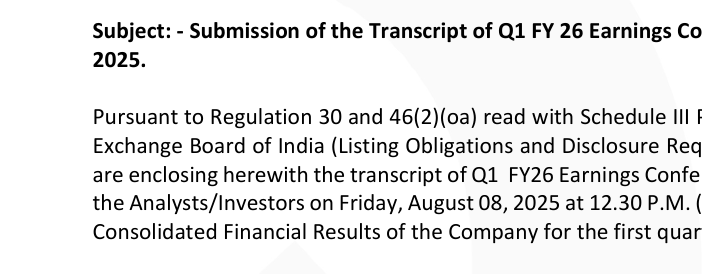

**[Image: Aug2025.pdf-0001-00.png (57x28, 2.0KB)]**

**[Image: Aug2025.pdf-0001-01.png (32x28, 2.0KB)]**

**[Image: Aug2025.pdf-0001-02.png (34x28, 1.7KB)]**

14th August, 2025 

To, 

National Stock Exchange of India Limited, Exchange Plaza, Plot No. C/1, G Block, Bandra-Kurla Complex, Bandra (East), Mumbai – 400051 

## **NSE Symbol: QPOWER** 

To, BSE Limited Phiroze Jeejeebhoy Towers, Dalal Street, Fort, Mumbai – 400001 

## **BSE Scrip Code: 544367** 

## **ISIN: INE0SII01026** 

Dear Sir/ Ma'am, 

**[Image: Aug2025.pdf-0001-11.png (702x274, 45.9KB)]**

<!-- Start of picture text -->
2025. <!-- End of picture text -->

**Subject: - Submission of the Transcript of Q1 FY 26 Earnings Conference Call held on 08****th** **August 2025.** 

Pursuant to Regulation 30 and 46(2)(oa) read with Schedule III Part A Para A of the Securities and Exchange Board of India (Listing Obligations and Disclosure Requirements) Regulations, 2015, we are enclosing herewith the transcript of Q1  FY26 Earnings Conference Call that was organized with the Analysts/Investors on Friday, August 08, 2025 at 12.30 P.M. (IST) on Unaudited Standalone and Consolidated Financial Results of the Company for the first quarter ended June 30, 2025. 

The aforementioned transcript of the ‘Q1 FY26 Earnings Conference Call’ is also uploaded on the Company’s website i.e. www.qualitypower.com. 

We request you to take the above on record and treat the same as compliance under the applicable provisions of the SEBI Listing Regulations. 

Thanking You, 

Yours faithfully, 

## **For QUALITY POWER ELECTRICAL EQUIPMENTS LIMITED** 

DEEPAK Digitally signed by DEEPAK RAMCHANDRA RAMCHANDRA SURYAVANSHI Date: 2025.08.14 SURYAVANSHI 18:09:02 +05'30' 

**Deepak Ramchandra Suryavanshi Company Secretary and Compliance Officer ICSI Membership No.: A27641** 

**[Image: Aug2025.pdf-0001-21.png (1011x68, 45.5KB)]**

**[Image: Aug2025.pdf-0002-00.png (378x59, 19.0KB)]**

# “Quality Power Electrical Equipments Limited Q1 FY 26 Earnings Conference Call” 

# August 08, 2025 

**[Image: Aug2025.pdf-0002-03.png (228x37, 8.1KB)]**

**[Image: Aug2025.pdf-0002-04.png (228x41, 14.9KB)]**

**[Image: Aug2025.pdf-0002-05.png (228x107, 10.9KB)]**

**MANAGEMENT: MR. BHARANIDHARAN PANDYAN – JOINT MANAGING DIRECTOR – QUALITY POWER ELECTRICAL EQUIPMENTS LIMITED MR. RAJESH JAYARAMAN – CHIEF FINANCIAL** 

**OFFICER – QUALITY POWER ELECTRICAL EQUIPMENTS LIMITED MS. SARIKA JADHAV – SENIOR VICE PRESIDENT FINANCE – QUALITY POWER ELECTRICAL EQUIPMENTS LIMITED MR. SACHIN SHETTI – VICE PRESIDENT FINANCE – QUALITY POWER ELECTRICAL EQUIPMENTS LIMITED** 

**MODERATOR: MR. SIDDARTH BHAMRE – ASIT C. MEHTA INVESTMENT INTERMEDIATE** 

Ladies and gentlemen, good day and welcome to the Q1 FY 2026 Earnings Conference Call of Quality Power Electrical Equipments Limited, hosted by Asit C. Mehta Investment 

**Moderator:** 

Page **1** of **21** 

_Quality Power Electrical Equipments Limited August 08, 2025_ 

**[Image: Aug2025.pdf-0003-01.png (230x37, 8.2KB)]**

Intermediate. As a reminder, all participant lines will be in the listen-only mode and there will be an opportunity for you to ask questions after the presentation concludes. Should you need assistance during this conference call, please signal an operator by pressing star then zero on your touch-tone phone. Please note that this conference is being recorded. 

I would now hand the conference over to Mr. Siddarth Bhamre from Asit C. Mehta Investment Intermediate. Thank you, and over to you, sir. 

### **Siddarth Bhamre:** 

Thank you. Good afternoon, everyone. I am Siddharth Bhamre, Head-Institutional Research at Asit C Mehta Investment Intermediates Limited. It gives us immense pleasure at Asit C. Mehta to host this conference call for Q1 FY 2026 for Quality Power Electrical Equipments Limited. 

I would also like to state the fact that our group company, Pantomath Capital Advisors Private Limited, was the merchant banker for the IPO of Quality Power. It is the largest issue done by a single merchant banker till date in India. This quarter, Quality Power on a standalone basis has delivered an excellent set of numbers. Also, the group companies have witnessed heightened execution. 

Let me now introduce you to management from Quality Power on today's Q1 FY 2026 con call. We have Mr. Bharanidharan Pandyan, Joint Managing Director; Mr. Rajesh Jayaraman, CFO; Ms. Sarika Jadhav, Senior VP Finance, and Mr. Sachin Shetti, VP Finance. 

Over to you, Bharanidharan. 

**Bharanidharan Pandyan:** Thank you, Siddharth. Good afternoon, ladies and gentlemen. On behalf of the board and the management team, I thank you all for joining us today and for your continued trust in the company. We are pleased to report another quarter of consistent performance. 

The sector we operate, that is high voltage electrical equipment and power quality solutions, is witnessing a structural long-term demand surge driven by grid modernization, renewable energy integration, and digital infrastructure. This momentum is intensifying globally. It is important to note that this demand is now constrained by supply, especially for technical advanced products like ours. This is creating a shift towards a supply-driven environment. 

Our traditional coil products group under Quality Power delivered a record high margin of 34%, and Endoks delivered a margin of 27% with an exponential increase in revenue growth. Mehru, the recent entrant in the family, also has an increase of 45% this quarter over the last year's operating margins. 

This quarter also saw us sign a binding term sheet for an acquisition of Sukrut Electric through a joint venture with Yash Highvoltage Limited. This great gem is again a value buy and allows us access to hundreds of transformer manufacturers in India and abroad for our instrument transformer and composite product lines. 

Over the last several years, we have made conscious, sustained investments in technology, global approval, and manufacturing quality. Today, that work is translating into opportunities 

Page **2** of **21** 

_Quality Power Electrical Equipments Limited August 08, 2025_ 

**[Image: Aug2025.pdf-0004-01.png (230x37, 8.2KB)]**

of scale and strategic importance. We are now approved suppliers of HVDC and STATCOM products with all the leading global companies, including the Chinese OEMs. 

This opens up doors not just to immediate orders but to long-term participation in global grid stability projects. Further, we are on track for key HVDC order announcements in the near term. These projects are at the highest end of technical complexity and signify a growing confidence in our capabilities. 

Our qualifications for such projects reflect our technological achievements. This quarter's numbers highlight our gradual shift from participating in the market to playing a more defining role in it. Our order pipeline remains strong with healthy visibility across sectors and geographies. 

While we remain optimistic, we are mindful of ongoing supply chain fluctuations and are planning accordingly. We remain committed to transparent communication, capital discipline, and long-term value creation. 

Thank you once again, all the investors, for being a part of this journey. I now invite our CFO, Mr. Jayaraman, to share his thoughts with this distinguished gathering. Jai Hind. 

### **Rajesh Jayaraman:** 

Thank you, Bharanidharan. Good afternoon, everyone. It's a pleasure to share this quarter's highlights. We have seen strong top-line growth. Consolidated revenue rose from INR80 crores to INR194 crores, more than doubling year on year. This reflects sustained demand across product lines and strong execution across entities. 

On profitability, Quality Power stand-alone delivered a historic EBITDA margin of 34%, our highest ever. Endoks maintained a healthy margin of 27%, driven by operating discipline and a solid product pipeline. Mehru's margin stands at 9.5%. But importantly, profitability has improved by 47% in its first full quarter post acquisition, showing our integration strategy is on track. We expect further improvement as synergies play out. The higher consolidated expenditure is due to Mehru's consolidation. 

Core cost structures at Quality Power and Endoks remain stable and efficient. Cash flows remain strong, enabling growth investment without impacting profitability. On PAT, the quarter-onquarter moderation is due to a one-time forex gain in the previous quarter. 

Adjusted for PAT, underlying profitability remains healthy and growing across businesses. Looking ahead, with new additions like Sukrut and continued group-level consolidation, we are confident of meeting our revenue and earnings guidance for the year. 

I would also like to note a minor correction yesterday's limited review profit loss account. The controlling interest profits of Q1 FY 2025 were reported as INR31.12 crores. The correct figure is INR19.37 crores. The increase in debt this quarter stems from a temporary promoter support as INR70 crores interest-free stock loans for proposed acquisitions, which also raise net assets. 

Page **3** of **21** 

_Quality Power Electrical Equipments Limited August 08, 2025_ 

**[Image: Aug2025.pdf-0005-01.png (230x37, 8.2KB)]**

||This is purely a strategy with no operational impact. Group debt stands at INR13 crores against|
|---|---|
||cash and cash equivalents of INR250 crores. Thank you for your trust and support. Now, I open the floor for discussion.|
|**Moderator:**|We will now begin the question-and-answer session. The first question is from the line of Pritesh Chheda from Lucky. Please go ahead.|
|**Pritesh Chheda:**|Sir, can you share the revenue for Mehru and revenue for Endoks for the quarter 1?|
|**Bharanidharan Pandyan:**|Good morning, Pritesh ji Thank you for always being with us. The numbers for Endoks is INR91.91 crores in sales. And Mehru is INR61.5 crores in sales. For electrical equipment, it's INR41.8 crores in sales. And projects, which is our subsidiary, which is related party transactions, is about INR4 crores in sales. And capacity utilization at Mehru at this moment is close to 95%. But they are scaling up every month as the new ovens for the addition is coming over.|
|**Pritesh Chheda:**|So Mehru capacity utilization is 95%?|
|**Bharanidharan Pandyan:**|At this moment, but they are scaling every month because they have ordered new ovens. They have got into warehouses, put in a lot more effort into what we say, into expanding the factory capacity. So that will come up in the next few quarters. You will see their capacity utilization is always around 95% because of the order book. Even with the expanded capacities.|
|**Pritesh Chheda:**|Mehru, you guys mentioned that it's 9.5% EBITDA margin. What will be the Endoks EBITDA margin?|
|**Bharanidharan Pandyan:**|The Endoks EBITDA margin is about 27% profit before tax.|
|**Bharanidharan Pandyan:**|And for Quality Power, which is the coil product is about 34% for HVDC and FACTS, where we are expanding the factory.|
|**Pritesh Chheda:**|Okay. Now from the capacity utilization perspective, even Quality is at a high capacity utilization, right?|
|**Bharanidharan Pandyan:**|Correct, sir.|
|**Pritesh Chheda:**|Correct. And Mehru, based on whatever ovens and all that you are adding, so let's say this INR60 crores is 90% capacity utilization. So what kind of capacity and a business size will we see in Mehru as we progress ahead with whatever capacity expansion that you have planned?|
|**Bharanidharan Pandyan:**|We are anticipating that the numbers may improve by about 20% to 30% in the next quarter for Mehru.|
|**Pritesh Chheda:**|And if you take a slightly longer opinion over the next two years based on the capacity that you are adding in Mehru, or sorry, the capacity which will get commercialized in Mehru, what kind of business size will Mehru reach to?|

Page **4** of **21** 

_Quality Power Electrical Equipments Limited August 08, 2025_ 

**[Image: Aug2025.pdf-0006-01.png (230x37, 8.2KB)]**

|**Bharanidharan Pandyan:**|The maximum capacity that the current factory can deliver is about INR450 crores to INR500|
|---|---|
||crores, depending on the pricing advantages. Our current focus is to bring them to the mid-teens margin. That has been our guidance. That is where our focus is at this moment as management.|
|**Pritesh Chheda:**|So, at INR110 crores to INR125 crores per quarter and 18% margin is what you mentioned in Mehru, right?|
|**Bharanidharan Pandyan:**|At this moment, our current focus is to bring them to around 15%.|
|**Pritesh Chheda:**|And when do you see this happening? Is it two quarters from now or four quarters from now?|
|**Bharanidharan Pandyan:**|Ideally, we are attempting in the next four quarters.|
|**Pritesh Chheda:**|Okay. Okay. And my last question is, on the order backlog of INR775 crores that you guys have mentioned, can you give quality power backlog in this Mehru and Endoks, the split?|
|**Bharanidharan Pandyan:**|Mehru is about INR350 crores. Quality Power is about, I think, INR250 crores and the balance is Endoks.|
|**Pritesh Chheda:**|And execution timeline?|
|**Bharanidharan Pandyan:**|Most of the execution is about 12 to 15 months.|
|**Pritesh Chheda:**|Okay. And what is the progress on your new site and when should we see it up and running?|
|**Bharanidharan Pandyan:**|We are ahead of schedule, sir. A lot of people are being put in. We are working with the best companies in the country. We are slightly ahead of schedule at this moment.|
|**Pritesh Chheda:**|Okay. Thank you very much, Bharanidharan, and all the best.|
|**Bharanidharan Pandyan:**|Thank you, Pritesh sir.|
|**Moderator:**|Our next question is from the line of Nemish Sundar from Elara Capital. Please go ahead.|
|**Nemish Sundar:**|Yes. Thank you for the opportunity. Just wanted to expand on the previous capacity-related question a bit. So I want to understand, is the capacity hindering our ability to get new large orders, especially in the HVDC, given the capacities are coming up?|
|**Bharanidharan Pandyan:**|I believe it is not hindering us, but we are not able to take the entire HVDC order. So let's assume our HVDC order is, say, 100 rupees. We are only able to eat 30 or 40 rupees because that is what we are able to deliver and not more than that. When I say 30 or 40 rupees, it is just not my own factory. It is also the current set of supply chain. That is why we are also putting a CPC factory, what you typically call an electrical magnet wire. We are also putting across a huge backward integration that would have an advantage, not only of capacity supply, but small improvement in operating margins also.|
|**Nemish Sundar:**|So by when could you expect to cater to, let's say, more than 50% to 60% or 70% of the HVDC order that you are getting?|

Page **5** of **21** 

_Quality Power Electrical Equipments Limited August 08, 2025_ 

**[Image: Aug2025.pdf-0007-01.png (230x37, 8.2KB)]**

|**Bharanidharan Pandyan:**|You would see some orders as we guided sometime in the H2 of this year. We will be delivering.|
|---|---|
||Even recently we won a very prestigious order from Pagre along with partnership with Hitachi. We won the 500 kV HVDC smoothing coil. Each coil is about 250 megawatts. This is one of the world's largest coils. This opens up not only agreements with Pagre, but also domestic supply as being the only guys who can supply this part of the world.|
|**Nemish Sundar:**|Okay. And sir, is there any impact of the tariff situation on your exports to US?|
|**Bharanidharan Pandyan:**|At this moment, as you are aware, tariffs are changing every week. So the orders and the projects of ours are already predetermined, pre-linked. So I would not see an impact in the next 12 to 15 months. After 15 months, we need to see how the geopolitics comes in. However, as I said, right now it's a capacity allocation. If the Americans don't want it, we can send the capacity to anybody. So we just announced a large order intake from Middle East. That is for the UAE transmission company. So customers, because we sell in over 100 countries, we are not short of customers.|
|**Nemish Sundar:**|Okay. Thanks, sir. And could you just give your revenue guidance for the year?|
|**Bharanidharan Pandyan:**|We had given guidance of between INR700 crores and INR800 crores conservatively at the beginning of the year.|
|**Nemish Sundar:**|This is including all your subsidiaries, including the new acquisition also?|
|**Bharanidharan Pandyan:**|Sukrut would not be consolidated. It would be an associated company because it's going under a joint venture. So I believe it would not come in the main P&L, but would come as investments if I'm correct.|
|**Nemish Sundar:**|Okay. Thank you. Thanks a lot, sir. I'll get back in the queue.|
|**Moderator:**|Thank you. Our next question is from the line of Rahul Agarwal from Aventus Capital. Please go ahead.|
|**Rahul Agarwal:**|Thanks a lot for giving me this opportunity. Sir so the first question that I had was when I was looking at the recent concalls, I just wanted to classify the numbers for the bid success ratios that we have for HVDC and FACTS, if you could just tell me for domestic and international.|
|**Bharanidharan Pandyan:**|So Rahul, in the domestic, we are the only people. So it is how much deliveries we can give would depend on whether it is 100% or 80%. So, because a lot of tenders are coming simultaneously every month, our supply chains are not able to take it. It's just not our factory. It's also the supply chain. So, we are working together to be able to take 100% in India. Globally, we are still at a favorable stage by the end of next year when our entire factory is up and running. At full-swing, I think we would not make so much. Right now, our hit and win ratio is not because of pricing. It is on deliveries.|
|**Rahul Agarwal:**|Okay, understood sir. So the next question that I had was that in the documents that are there, the public documents for QP, we were a little confused to understand the peers and your clients. So the same names were mentioned Hitachi, Siemens, all of the companies that you said were|

Page **6** of **21** 

_Quality Power Electrical Equipments Limited August 08, 2025_ 

**[Image: Aug2025.pdf-0008-01.png (230x37, 8.2KB)]**

||mentioned as clients and peers. So can you just clarify how this relationship works between us and them?|
|---|---|
|**Bharanidharan Pandyan:**|In high-technology businesses, all of us are customers, suppliers, competitors, partners and peers. So in our FACTS business, we buy components from Hitachi, Siemens and GE. In their FACTS and HVDC business, they buy components from our facilities, because these are not overlapping components and overlapping supply chains. So we are a supplier to all the three big guys that you mentioned across the world.|
|**Bharanidharan Pandyan:**|But we are also in competing them in certain businesses. We are partnering them in certain businesses and we also buy from them in certain businesses.|
|**Rahul Agarwal:**|Understood. So there is no, especially in the part where we are competing with them, there is no threat of sort of them making those same products later on the line and eating the market share for us. Is there any threat for us?|
|**Bharanidharan Pandyan:**|It is not determined by the middlemen in between. When I say middlemen, it is like companies like Quality Power and others. It is determined by the utility at the end of the day. So something like we are now working with TRANSCO in Abu Dhabi. We are working with Transca Craftnet in Sweden, FinGrid in Finland. So those are the guys who approve the company and the people in between us just component and solution providers. So we are approved in over 100 countries. The technology is well proven. The moat is normally between 5 and 10 years. So competition would still take between 5 and 7 years even with the best people across the world, because there is so many utilities. Even in India, if you see a transmission utility, we have three large players, Power Grid being the largest, Adani and Sterlite, and the new ones coming in for the HVDC line. So all these, they will have to approve you.|
|**Rahul Agarwal:**|Okay, understood. And just one last thing, could you just tell us the capex number? Like the amount of capex that is being done? I know the capacity number. I just wanted to know the capex amount.|
|**Bharanidharan Pandyan:**|I believe it should be around INR125 crores at post-IPO. That is what. A lot of money has been spent pre-IPO also. A lot of the equipment that we bought, about INR20-27 crores of equipment that we bought during the IPO, is also being used for the same project, so overall around INR125 crores.|
|**Moderator:**|Thank you. Our next question is from the line of Dev Gulwani from CARE PMS. Please go ahead.|
|**Dev Gulwani:**|Good morning. Thank you for the opportunity. My first question is what is the market size of products while making HVDC substations? So how much percentage of our products contribute?|

Page **7** of **21** 

_Quality Power Electrical Equipments Limited August 08, 2025_ 

**[Image: Aug2025.pdf-0009-01.png (230x37, 8.2KB)]**

|**Bharanidharan Pandyan:**|At this moment, we deliver three key product lines in HVDC. That is reactors, various types of reactors, instrument transformers, and special purpose medium voltage transformers like zigzag- connected earthing transformer. These are the three product lines, which we do. In the components lines with all the transformers and HVDC, we have now components from Sukrut that get into those transformers. That is as accessories. At this current moment, we are sitting on these four different opportunity size. In a normal HVDC project, we believe the opportunity size for us is about INR200 crores per order.|
|---|---|
|**Dev Gulwani:**|Okay. And what is the competitive edge of our products that we are getting so many orders? How are we different from others?|
|**Bharanidharan Pandyan:**|I believe we have, given our peers and global competition; we have two guys in Europe. For the high voltage, we are the only guys in this part of the world. So, obviously, whatever comes or the demand comes in, the first preference is given to us. Because we are local, we are able to serve it better and we have proven ourselves in over 100 geographies. It is only when we are not able to deliver them on the time that we require that it is one normally outside the country.|
|**Dev Gulwani:**|And last question, how much percentage of order book consists from India?|
|**Bharanidharan Pandyan:**|At the current moment, we should be about 50/50 or maybe 60/40, 60% being export, 40% being domestic.|
|**Moderator:**|Thank you. Our next question is from the line of Nishita from Sapphire Capital. Please go ahead.|
|**Nishita:**|Hello. So, congratulations on a very good set of numbers. I would just like to know whether you have any new acquisition plans like you had mentioned in Q3 FY 2025 that you are in talks of potential acquisition of Statcom Energy. So what is the update on that?|
|**Bharanidharan Pandyan:**|Nishita, good question. So the Statcon deal has been called off in what we say about three, four months back. It's been mutually called off. With regards to other acquisitions, I believe, yes, we are normally hungry for acquisitions based on technology and pricing apart from the culture that the company brings along. We are in talks with a few. Nothing concluded as of yet. You would see some small debt that we have put into the company for certain bids. As and when it happens, I'm sure the markets will know about it.|
|**Nishita:**|Okay. Also, I just wanted to know that from the new global coil factory that you built in Sangli, how much revenue do you expect to generate from that factory?|
|**Bharanidharan Pandyan:**|The facility is quite large. The facility can also make, apart from coils, a lot more products, including mid-sized power transformers. So, the peak revenue from the facility is expected to be between INR1,500 crores and INR2,000 crores, depending on the pricing policies that we may have. At this moment, our focus is to get the facility immediately on, staff the facility, and get the raw material aligned. Our focus, instead of numbers, is more on execution at this moment.|

Page **8** of **21** 

_Quality Power Electrical Equipments Limited August 08, 2025_ 

**[Image: Aug2025.pdf-0010-01.png (230x37, 8.2KB)]**

|**Nishita:**|Okay. Perfect. And in the margin guidance for FY 2026 of 15% to 16%, are we still on the same line?|
|---|---|
|**Bharanidharan Pandyan:**|I believe so. If you look at most of the margins that the parent companies are delivering, I think, pre-Mehru, we are still at very, very high numbers. I think closer to 30% console. It's only with Mehru coming down, we have been pushed on the numbers. But as soon as Mehru starts increasing, I believe the average would also start pushing. So we are still in the guidance. No bad news from that side.|
|**Moderator:**|Thank you. Our next question is from the line of Sanjay Jain from Intellect Capital Fund. Please go ahead.|
|**Sanjay Jain:**|Hello. Good afternoon, sir. Thank you for the opportunity. My question is from the transformer side. So historically, we have seen that the transformer's capacity utilization of Quality Power was on the lower side. And with Mehru coming in, so how does this help? Can you give us a visibility on how does this help with the orders? As in if the synergy is going to work out or how are we going to use the existing capacity that we have of transformers?|
|**Bharanidharan Pandyan:**|So Sanjay, to clarify, transformers and instrument transformers are two different product lines. Transformers are used to convert energy from high voltage to low voltage, what we normally call a distribution of power to be able to feed power to utilities or houses, whereas instrument transformers are used to measure electricity. So these are much smaller transformers, but still at the same high voltage and more complex, technically speaking. Now, instrument transformers are totally different business. Line has nothing to do with transformers, even though all transformers use instrument transformers, A. B, we have been making transformers, non-standard custom designed transformers for the past 25 years. Sometimes we worry about the overcapacity coming across the world, so we have been also trying to slowly reduce our dependence on transformers. However, we still do deliver transformers to some of our key customers and we still continue to export some transformers. The new factory, we will be able to take a little bit more transformer orders. In the current factory, our coil products have been delivering almost 34% margins. We are more focused on high profit businesses because the factory is fungible on product lines.|
|**Moderator:**|Thank you. Our next question is from the line of Viraj Mahadevia from MoneyGrow. Please go ahead. Viraj sir, please go ahead.|
|**Viraj Mahadevi:**|Hi, sir. Congratulations on stable and upward results. Can you give us some color as to why you did a joint deal to acquire Sukrut with Yash Voltage, the thought process behind that, as opposed to acquiring it outside?|
|**Bharanidharan Pandyan:**|So, Viraj, that is a very, very tricky question, so I will answer it like this. So, we put a factory - - the first factory in England in 2010 and we had to close it down in 2017. And one of the key learnings when we ran the factory in England was the management bandwidth.|

Page **9** of **21** 

_Quality Power Electrical Equipments Limited August 08, 2025_ 

**[Image: Aug2025.pdf-0011-01.png (230x37, 8.2KB)]**

Now, as we are growing rapidly, we want to preserve the management bandwidth. We were approached by the management of Sukrut, a German company. We had negotiated a good deal, but transformer manufacturers are even though strategically important, a very large customer, a growing business, is not in the vicinity of our current sales and strategic team. 

So, we did not want to open up another front in war. So, Yash Highvoltage, which was already establishing themselves in the US, Europe, and already had a large set of customers in India, seemed like a natural partner. So what our intention to do together is to use the brand and legacy of 70 years of Sukrut to be able to consolidate more companies in the transformer component and create it as a board-level company. 

So, that is why right from day one, it is taken as a board-level company and this is primarily to ensure that we don't lose focus on HVDC and FACTS, which is high-growth, high-profit business. 

**Viraj Mahadevia:** Understood. So, this business is like such for you, mainly run by Yash Highvoltage, is that right? **Bharanidharan Pandyan:** I would say that we have access to technology, marketing, customer base, and also internally their customers happen to our customers to our instrument and composite products. But Yash would bring a significant advantage of customer connect. So, from a customer side of things, I would say Yash definitely would need to take the front end. **Viraj Mahadevia:** Understood, Sir. Second question is regarding your raw material security. Can you give us a sense us to your raw material basket, whether it comes largely from India, from Europe, US, or China? Are there any, sort of certain market dependencies? **Bharanidharan Pandyan:** So, our raw material is traditionally being 100% India. We make our own special cables and our vendor works with our own machinery. However, we are not able to scale up that factory, because we are typically the only guys in this part of the world who make those kind of equipments. So, we are spending our own money in developing that facility where we should be almost delivering 50% of our needs from that facility, A. B, now for global orders, we are also looking at importing from China, primarily because the Indian orders do not allow Chinese origin raw material. 

So, what we are trying to do is we are trying to use the Indian raw material for Indian projects and global raw material for global projects. At this moment, we do not foresee a problem on cable so much, but we see a huge problem on porcelain or what we call as insulators. 

**Viraj Mahadevia:** Understood. And is there a reason you choose to source from China for global orders versus elsewhere or India? Is it purely just pricing and product availability? **Bharanidharan Pandyan:** The Chinese are actually more expensive when you compare the freight, import duties and everything. It is just availability at this moment. We simply pass it on to the customer. 

**Moderator:** Thank you. Our next question is from the line of Akshay from AK Investment. Please go ahead. 

Page **10** of **21** 

_Quality Power Electrical Equipments Limited August 08, 2025_ 

**[Image: Aug2025.pdf-0012-01.png (230x37, 8.2KB)]**

|**Akshay:**|Yes. Thanks for giving me the opportunity. Sir, our order book currently is INR775 crores. So,|
|---|---|
||can you please guide us how much consolidated order inflow are we expecting in FY 2026 and what would be our order book at the end of FY 2026?|
|**Bharanidharan Pandyan:**|Akshay, ideally, we would like to have about one year of order book forward cover, because more than one year, the metal prices swing too much for our likes and also the raw material visibility starts diminishing. Ideally, we would like to be having about one year to 14 months of order book. That is what, as a management is a guidance to the sales team. At this moment, we are very comfortable on that. You would see that we started the quarter with INR750 crores of order book. Now, we have done about INR194 crores in sales and we still increase order book by INR25 crores. With some of the HVDC orders that we are planning in the H2, I think we should be comfortable. We have already guided that we may have another additional INR500 crores of orders by the end of the year.|
|**Akshay:**|Sure, Sir. And Sir, my second question is more on the fundamentals, right? Currently, there is a huge shortage of transformers, especially in the European markets. There is a very huge replacement demand in the US and European markets. So, as per your perspective, how do you see this market evolving in the next 5 to 10 years? Is this a temporary demand or is this a structural demand? It will evolve over the 5 to 10 years?|
|**Bharanidharan Pandyan:**|I would say at 400 kV and above, we are seeing a demand of at least a decade, at least a decade. That is 400 kV and above. 132 kV and below, I think the capacity that is coming in is so shocking across the world that we keep our fingers crossed. And because we operate our transformer businesses around that voltage, we have been very conservative on that. However, on the transformer play, where there is anyway demand, irrespective of what the supply is, we have already had one hand with Sukrut, where Sukrut has only two or three peers in India and about 10 peers across the world. We will contribute, at full contribution, about 1% of the transformer value from the component space, which itself is a big business. So, with Yash, we intend to consolidate more transformer component companies under Sukrut.|
|**Akshay:**|Okay. Yes so, we are more on the high voltage demand, especially above the 400 kV, right?|
|**Bharanidharan Pandyan:**|Correct. That is where we see that the demand, because to enter the 400 kV, you still need five or seven or 10 years of experience. So, the utilities normally would not allow new entrants into 400 or 765 kV without that experience, irrespective of demand, because the cost of shutdown is too high, unlike a 11 kV or a 33 kV or IDT transformer. So, at that voltage, even if people develop right now, by the time they come in, it will be seven-eight years.|
|**Moderator:**|Thank you. Our next question is from the line of Hitesh Randhawa from CAGR Quest Capital. Please go ahead.|
|**Hitesh Randhawa:**|Hi, sir. My question is on the lines of accounting as far as other income is concerned. I think in the last quarter, we said that out of INR53 crores of other income, around about INR40 crores|

Page **11** of **21** 

_Quality Power Electrical Equipments Limited August 08, 2025_ 

**[Image: Aug2025.pdf-0013-01.png (230x37, 8.2KB)]**

were attributable to hyperinflation accounting actually in Turkey. So, in this quarter, how much of other income is attributable to that? 

**Bharanidharan Pandyan:** I will ask the CFO Mr. Rajesh to answer that, please. 

**Rajesh Jayaraman:** Yes. Thank you. Now, it is now other income hyperinflation in this quarter is coming down drastically just not that. Other income basically is interest and other things. So, practically, it is a very minimum. We got that in the earlier quarters. **Bharanidharan Pandyan:** Hitesh, this hyperinflation formula or whatever we call as a forward hedge is based on the inflation rate in Turkey. As the inflation rate is reducing there, automatically, the other income goes into traditional income, operating income. At this quarter, I think the other income is only INR2 crores to INR3 crores, rest of coming in into operational. Because inflation is softening in that part of the world. 

**Hitesh Randhawa:** Right, sir. So, my, sorry to stretch this a bit further. So, what is the exact amount this quarter? And other point being, could you please elaborate on why would this flow into operating income? Because these are hyperinflation related adjustments. So, once Turkey is out of hyperinflation, then shouldn't this just kind of go out of other income? That's it? And it shouldn't be or it wouldn't be part of our operating income in that case? So, the extra benefit, because this is kind of an extra benefit, right? So, that should go away, right? **Bharanidharan Pandyan:** Hitesh, there is accounting. As an engineer, I can only answer this, accounting entries don't create profits and balance sheets. Profits are created by sales and purchase. Okay. That doesn't change. However, what changes is that let's assume if I do a forward hedge or what we say, I have to account for what we say hedge call, where we have to have a dollar hedge against a depreciation. Now, what happens over the course of a contract, you lose money because you know, the inflation is 60%. So 60% goes off in your operating income and the 60% comes in one quarter as a hyperinflation adjustment. So, what happens that adjustment comes into other income in my operating, I would operate at 3% margin. But if your inflation is only sitting at about say 10%-20%, then what happens is you do not lose so much in operation. So, your hedge call is not so profitable. But eventually, when you hedge, you have technically what we say, close your profit at the time of the order. 

**Hitesh Randhawa:** Right. Okay, sir. Thanks for that. And sir, as far as the capacity is concerned, I think E5 in Sangli, Cochin and Mehru, all of these kind of should most probably go live by November 2025. So, my question is incrementally, how much of potential peak revenue would these three facilities add actually by going live in November 2025? **Bharanidharan Pandyan:** So, Sangli is not going live in November 2025. Sangli will go down as per the guidance that is given in Q2 of what we say next year. Cochin will go live. It's a small incremental capacity. Mehru is giving an incremental capacity. At this current moment, we would like to stick to the guidance of INR700 crores to INR800 crores. With the next quarter, we would give you any change in guidance if required. 

Page **12** of **21** 

_Quality Power Electrical Equipments Limited August 08, 2025_ 

**[Image: Aug2025.pdf-0014-01.png (230x37, 8.2KB)]**

|**Moderator:**|Thank you. Our next question is from the line of Yashovardhan Banka from Tiger Assets. Please go ahead.|
|---|---|
|**Yashovardhan Banka:**|So, I wanted to understand a bit more on Nebeskie, sir, because you increased our stake in the same.|
|**Bharanidharan Pandyan:**|Yes, I think as a returning customer, I should give you the first preference of normally starting because you are there in every earning call. Thank you for believing in us. So, Nebeskie, as I told you, is in the IoT and embedded space.|
||Now, in Sukrut, where we bought in the transformer components business, now to develop the next generation of transformer components where every component is connected because a transformer, the core and copper is not connected. That is, iron and steel cannot be connected. It is the accessories in the transformer which are normally connected, which means that they need to go from an analog to a digital transformation to be able to be ready for the next generation grids. Now, Sukrut as a team does not have the access to that, whereas Nebeskie in an embedded IoT network with a kind of edge computing data space can help them get there. So, this becomes our in-house product lab technology center for digitization of all the high voltage equipments that we are doing. Nebeskie is also working with Mehru for creating a separate device, again for digitization of analog to digital signals. They are also internally working with us for some other R&D projects. So, we use them for critical R&D projects to be able to create technologies, especially on IoT software and embedded systems. That is why we decided to increase it slow and steadily.|
|**Yashovardhan Banka:**|Understood. So, the developments are moving well, right?|
|**Bharanidharan Pandyan:**|Yes.|
|**Yashovardhan Banka:**|Okay. So, the second question is regarding our best applications, which you mentioned in the last call. So, I think we have executed two 5 megawatts projects where we are supplying a few on the EMS, BMS side. So, if you can just touch upon that a bit more and the progress as well.|
|**Bharanidharan Pandyan:**|So, we have already developed two projects on BESS, not as an EPC. We are a component manufacturer in BESS. So, we have some sort of EMS and power conversion already deployed for two projects. Maybe in a year, year and a half, we may qualify for most of the tenders in that part of the world. But as I said, these are two 5 megawatts or 4 megawatts ones, not at the gigawatt level. At the gigawatt level, we are scouting for acquisitions which we can bring in because there is a new policy change in India where the EMS has to be totally domestic from Indian origin sources. The software has to be integrated into grid. I am sure even the power conversion would come up. This would be a large play. We have one hand and one leg in it already with the software and hardware through Endoks. How do we indigenize it? How do we bring it to scale is a part|

Page **13** of **21** 

_Quality Power Electrical Equipments Limited August 08, 2025_ 

**[Image: Aug2025.pdf-0015-01.png (230x37, 8.2KB)]**

of execution strategy our M&A team is looking at and we are deliberating at every board meeting. 

|**Moderator:**|Thank you. Our next question is from the line of Sahil Garg from CCV Emerging Opportunities Fund. Please go ahead.|
|---|---|
|**Sahil Garg:**|Hi, sir. Good afternoon. Sir, I have only one question. So, what kind of EBITDA margins and PAT margins we are expecting on a consolidated basis for the given estimated revenue of INR700 crores to INR800 crores for FY 2026? Why I am asking this question is because when a company grows both organically and inorganically, so it is easy to estimate the top line, but it is difficult to estimate the bottom-line. So, that is why I am asking.|
|**Bharanidharan Pandyan:**|I will answer your question, Mr. Garg. If you look at even without Mehru, I will just for a sake remove Mehru. Last quarter our numbers were INR61 crores. INR194 crores minus INR61 crores, we are still about INR130 crores organically. We are expanding organically 9x. We are also bullish on technologies with our own current set of numbers and technologies. But the acquisitions what we are doing when you see a blended margins can go reducing, but at the magnitude level, our PAT will continue to increase significantly, because these are businesses that we are buying in for the next two, three years. Like as I just told you, Mehru we got a 47% increase in margins in one single quarter. Now, a business of say about INR300 crores give and take, if I am able to improve another say 50%, 60% from where they are, my acquisition is paid for.|
|**Bharanidharan Pandyan:**|So, that is the kind of value that we normally bring into companies.|
|**Sahil Garg:**|Sir, can you also put the number to the statement on a consolidated level?|
|**Bharanidharan Pandyan:**|At this moment, the companies that we currently operate, we have given a guidance of high teens. That is the guidance at this moment. As I said earlier in the second quarter, high teens between 17% and 20%|
|**Moderator:**|Thank you. Our next question is from the line of Nilabja Dey from Ashmore Research. Please go ahead.|
|**Nilabja Dey:**|Good afternoon, sir. Congratulations on a very good number. Sir, my question is that given that usually we have seen that margins are higher on the export site and you have a subsidiary in Turkey and now, after this particular new deal has been signed, I think the tariff situation in that area is more or less stabilized. So, why are you scaling up or focusing more on the export site or you are more on the domestic sites? Also, in terms of the premium equipments, why are the demands are more? Because as we understand from some of the cable conductors, they are saying that surprisingly premium products are using better margin in India. And they are getting decent margin from the standard products. Can you just throw some lights on this, specifically since you are on the power equipment sides?|

Page **14** of **21** 

_Quality Power Electrical Equipments Limited August 08, 2025_ 

**[Image: Aug2025.pdf-0016-01.png (230x37, 8.2KB)]**

**Bharanidharan Pandyan:** So, Mr. Dev, with regards to exports or domestic, we have worked the past 15 years in developing customers in over 100 countries. We do not want to just give away the customer and the market share that we have developed just because the Indian market is booming. The margins in India and globally are similar and not different. 

There may be a small advantage when you export because of what we say the reduction in finance cost or some duty drawbacks and nothing more. With regards to what we say the supply, what we call, when we say from an Indian market, in the Indian markets and advantages, you get paid faster because you are not waiting 90 days end of the month receiving at the site. So, there is not much of a difference in margins. 

However, the demand I can just tell you, if you take a simple piece of data, a normal search data on a Google search takes you about 0.3 watt hour of data. If you use an AI agent for doing the same search, it takes you 2.7 watt hour of data which is 9 times increase. Now, we would say how many people ChatGPT use, but I would say how many people use Samsung phone because every photograph is now digitally enhanced through AI. 

As you are doing quant trading, there are driverless cars which are continuously using AI. So, the surge in demand of AI and AI technologies would also mean 9 times to 10 times increase in power consumption. Even if you look at an EV charger, EV charger which used to be now, a good charger would start at 1250 kilowatt, whereas the average house in Bombay has about 3 kilowatt of power. 

Now, imagine 10% or 20% of the houses going into EV in the next 5 years, the entire distribution and transmission system is designed to deliver at about 5%-6% growth per year, not 5 times, 6 times in 2-3 years. So, that is a structural mismatch that we have. In the demand side, from I would say on a distribution side, say at sub 33 kV, there is not much of a moat on technology or branding. 

So, there can be a lot more players. Even so, the market gets bigger, the competition also catches up. However, in the transmission side, when I say 220, 400, 765 kV, the moat of that 5 or 10 years means that nobody wants to enter because the rewards are after 7 or 10 years. So, that becomes the basic supply-demand mismatch. And as we are going forward, we see that even getting worse. Now, you asked about global demand and Indian demand. 

I think the last con call I pointed out, one HVDC order, frame contract in England, awarded in March is 59 billion pounds, okay, which is about 6,25,000 crores, one single framework contract. If you look at, say, a power grid contract in India, it is typically about 10,000, 20,000 crores. So, even if you have five contracts, it is only 100,000 crores, compared to six times higher for one single contract in England. 

So, the global markets are even larger than the Indian markets. Even though we are gung-ho about India, we also want to ensure that we have 50% of our hands and legs in the other part of the world, that we have created over time. 

Thank you. Our next question is from the line of Aniket Jain from YES Securities. Please go ahead. 

**Moderator:** 

Page **15** of **21** 

_Quality Power Electrical Equipments Limited August 08, 2025_ 

**[Image: Aug2025.pdf-0017-01.png (230x37, 8.2KB)]**

|**Aniket Jain:**|Hi, sir. I wanted to check if there is any service intensity in the components of products you are designing. Are you planning to do any kind of EPC business?|
|---|---|
|**Moderator:**|Aniket, sir, sorry to interrupt. Aniket, sir, your voice is breaking.|
|**Aniket Jain:**|I wanted to check if there is any service intensity in the components of products that you are supplying, and are you also doing any EPC business as well, along with supply of those components?|
|**Bharanidharan Pandyan:**|Yes. So, on the service side, no. Most of our equipment’s do not require service. Either it operates or it does not operate. We sometimes do get pulled into a service contract where we are used to commission our own equipments and nothing more.|
|**Aniket Jain:**|Okay, sir. And so what is the typical replacement cycle for these components that you are supplying? Can those be replaced after 10 years, 15 years, or is it slightly shorter?|
|**Bharanidharan Pandyan:**|Ideally, my customers would not want to replace it for 30 years.|
|**Aniket Jain:**|Okay, got it.|
|**Bharanidharan Pandyan:**|That is the kind of reliability that is put in.|
|**Aniket Jain:**|That you have put in. Got it. And second question would be, how is the competition from China and the international markets, for example, in Europe or US, and who are the main competitors that you are mainly dealing with?|
|**Bharanidharan Pandyan:**|The Chinese competition has been there for a very long time. We have been fighting them outside the country also for a very long time. Even today morning, we got a INR34.5 crores order against the Chinese in Abu Dhabi with similar margins. So I do not think that we fear Chinese competition from a price standpoint. But yes, Chinese have one advantage on scale, which we are building internally with others also. So I believe in next year, we should be apples to apples with the Chinese.|
|**Moderator:**|Thank you. Our next question is from the line of Naman Parmar from Niveshaay Investments. Please go ahead.|
|**Naman Parmar:**|Yes, good afternoon, sir. Thank you so much for the opportunity. So firstly, I wanted to understand on the bookkeeping. There is a slight error. I think in financial results, you have shown a INR177 crores of revenue and control. And in presentation, it's showing INR194 crores. So what's the correct number?|
|**Bharanidharan Pandyan:**|My colleague, Sarika, will answer the question.|
|**Sarika Jadhav**:|That INR177 crores is the revenue from operation. And our total revenue is INR194 crores.|
|**Naman Parmar:**|Okay, you are including the other income also.|
|**Sarika Jadhav**:|Other income. Yes, sir.|

Page **16** of **21** 

_Quality Power Electrical Equipments Limited August 08, 2025_ 

**[Image: Aug2025.pdf-0018-01.png (230x37, 8.2KB)]**

|**Naman Parmar:**|Yes. So what will be the bifurcation in other income? How much will be interest income and hyperinflation part?|
|---|---|
|**Sarika Jadhav**:|Hyperinflationary part is only INR2 crores to INR3 crores. And other is interest income only.|
|**Naman Parmar:**|Okay. And currently, how much cash is there in the Turkey plant?|
|**Bharanidharan Pandyan:**|Last quarter, it was around INR75 crores. Just one second.|
|**Sarika Jadhav**:|Yes. Now it is INR72 crores, sir.|
|**Naman Parmar:**|Okay. Okay, I understand. And on the business side, so how much percentage of revenue would be coming from the major 3, 4 products? Like how much is from the coil reactors and transformers?|
|**Bharanidharan Pandyan:**|Quality power is basically coil products. Mehru is instant transformer products. Endoks is power quality products. If you look at it, I think the numbers are clear for you.|
|**Naman Parmar:**|Yes, understood. And what will be the PAT of the all 3? Mehru, Endoks and Sukrut?|
|**Bharanidharan Pandyan:**|The PAT is already guided, sir. We have given for different companies. We have given PAT forecasting also on the margin side. Even I have just reiterated sometime before.|
|**Naman Parmar:**|No, no, no. On the future not, I am telling you. For the current quarter, what will be the PAT of the Mehru, Endoks?|
|**Bharanidharan Pandyan:**|In the current quarter PAT of which consolidated level?|
|**Naman Parmar:**|No, no. For Mehru, for Endoks, like you mentioned the revenue.|
|**Bharanidharan Pandyan:**|The PAT for electrical equipment is INR10.9 crores. Along with projects is about INR11.4 crores. Endoks is INR21.8 crores and Mehru is INR4.2 crores.|
|**Naman Parmar:**|Okay. And Sukrut has ended the year with how much revenue or PAT in FY 2025?|
|**Bharanidharan Pandyan:**|Sukrut, I believe this year they will be doing about INR24 crores to INR26 crores. That is the number that we have been projected. At this moment, they are not at cash loss.|
|**Moderator:**|Our next question is from the line of Raj Vyas from TM Investment Technologies Pvt. Ltd. Please go ahead.|
|**Raj Vyas:**|Congratulations on a good set of numbers, sir. So, as I can see we have the order backlog of INR775 crores. So if you can give me the bifurcation for Mehru and Quality Power. And what will be the execution timeline for completing all these orders?|
|**Bharanidharan Pandyan:**|Good afternoon, Vyas. I have already answered that question earlier. INR350 crores Mehru, INR250 crores Quality Power. Rest is Endoks. And the delivery would be between 12 and 15 months.|

Page **17** of **21** 

_Quality Power Electrical Equipments Limited August 08, 2025_ 

**[Image: Aug2025.pdf-0019-01.png (230x37, 8.2KB)]**

**Raj Vyas:** Okay. And I might have missed that. So other than this, we have, as you have mentioned that we are in international market and we cater to more than 120 plus countries. So, what is the dependency on each and every or what is the highest dependency on countries that you can provide? And earlier as well, in the last con call, you have mentioned that we are in the ongoing project and bid with Finland, Brazil, Canada. So what is the progress with respect to those bids if you can provide some details? **Bharanidharan Pandyan:** We are project and country agnostic for us. Everything is one market, one margin. In the recent past week, we have had orders from the US, Abu Dhabi. We have orders from Finland. We have more incoming orders from, say, the Middle East. We see some good traction in Southeast Asia, Australia. So we are country agnostic, what we say. Company, we go as a project. And as I said, depending on our relationship with the customer, we are at this moment having a capacity allocation. We also see a lot of domestic demand, especially on the STATCOM markets where we cannot ignore the customers. **Raj Vyas:** If my memory serves me right, in the earlier con calls that we have had, so you have mentioned that the dependency is not more than 5% to 7%. Is that right? **Bharanidharan Pandyan:** Correct. The biggest market would not be more than 5%, compared to the Indian market where I would say at this moment we have set a 40% kind of revenue in India. **Raj Vyas:** And also, you have mentioned that there is no impact of tariffs. But we can see that from FY 2024 to FY 2025, the dependence in America has significantly dropped from 20% to 25% to just 1-2%. But you have said that it all depends upon the execution and for that after the... **Bharanidharan Pandyan:** I think you have misunderstood the dependency. I believe that we have no problems on the tariffs for the next 12 months because the projects which are supposed to be awarded to us will be awarded. Because those are weighed with our technical bids cannot be changed. That is point one. Point two, we keep changing markets every year depending on the scale of projects. So if we have some major HVDC orders in India this year, we may have India as a big customer this year. Next year, if we get a huge contract, say South Korea, we may have South Korea as a big market. So because we are starting with a smaller base, so you would see the flavor of the country changing every year at this moment. But traditionally, at the end of two, three years, we would say India would continue to deliver 40%, 50% and 50% globally. And those markets would change depending on the size and type of the project. Now, if you get a very large order for an oil-cooled equipment in America and in Abu Dhabi, we do not have further capacity to sell in Europe. So, it depends a lot on how much capacity you can deliver. **Bharanidharan Pandyan:** But as we speak, we are negotiating larger contracts in the US market. The customers do not seem to be worried so much on the tariffs. They are more worried about delivery. If you see the big beautiful bill that Mr. Trump had given, the energy subsidies are closing in 2027, which 

Page **18** of **21** 

_Quality Power Electrical Equipments Limited August 08, 2025_ 

**[Image: Aug2025.pdf-0020-01.png (230x37, 8.2KB)]**

means most of the renewable energy projects need to be commissioned by 2027 and the subsidies go off. So, in the US, they are ready to give an airlift equipment. It is only how much delivery you can give to them. 

### **Moderator:** 

The next question is from the line of Aditya Agarwal from FinAvenue. Please go ahead. 

**Aditya Agarwal:** Thank you so much for the opportunity. Sir, I just wanted to ask, the kind of work or the kind of product that we are making, so how difficult will it be for an established player in the HVDC market like GE, TND or Hitachi to open up a new vertical because we are receiving orders from them. So, to open up a new business vertical and deliver the same products for getting it inhouse. So, just wanted to know about this. 

**Bharanidharan Pandyan:** So, nothing is impossible, Mr. Agarwal. If anybody is intending to do it, yes, they can do it. I believe the timeline for them to do that would be 5 to 7 years, not because technology is not available in the world. They can always find technology. But they should have to wait that 5 or 7 years for them to enter the market based on market qualification. Point one. 

Point two, by then we would have consolidated the market share with the capacity, people and what we are envisaging. We will be one of the lowest cost producers in the world. So, eventually when the competition kicks in, you still have a lot of margin to sacrifice for volume. 

**Aditya Agarwal:** Okay. And, sir, what will be, like, according to us, what is the exact total addressable market for us? And, I mean, on our prospectus, it is mentioned something. But in the Google, the industry growth is somewhat different for different HVDCs. In different sources, it is showing difference. So, can you just guide, what is the absolute TAM that you are projecting and the kind of industry growth for next three to five years, the overall industry growth? 

**Bharanidharan Pandyan:** So, Mr. Agarwal, we are not a one product, one location company. We are a multi-product, multi-location company, say, in the likes of, say, CG Power or, I wouldn't compare myself with Hitachi, but I would say we are multi-product, multi-technology. We go from embedded power electronics in Turkey to, say, components in Pune, to say, instrument transformers in Delhi, to coil products and transformers in Sangli. 

Having said that, if I talk about the largest growth prospect of HVDC and FACTS, when we had to go to SEBI, the regulation says that we need to use a research agency from India, and most of the research has to be sourced from peer-reviewed research in India, because HVDC and FACTS is such a closed market, there's not much of peer-reviewed A-class data that was available. But if you look at the Google data of, say, HVDC order of, say, UK, or you put HVDC and TenneT, you would see multi-billion-dollar orders coming in. 

If you look at the volume of data, the HVDC market was about $8 billion or $11 billion last year, as per the research report. I just told you, in England, they released an order for $59 billion in one single year. So, the data is, at this moment, not technically proper, available online. But I would say that you can do an industry check with the users in the market. That would be typically for Power Grid, Adanis of the world. 

Page **19** of **21** 

_Quality Power Electrical Equipments Limited August 08, 2025_ 

**[Image: Aug2025.pdf-0021-01.png (230x37, 8.2KB)]**

|**Aditya Agarwal:**|Okay, sir. Okay. And the kind of growth in the industry domain, are we still projecting that 60%|
|---|---|
||to 70% growth, which was mentioned earlier? I mean, the HVDC and FACTS side for the next three to five years?|
|**Bharanidharan Pandyan:**|I believe our order book is already reflecting that kind of growth because for all renewable energy interconnections in this country and most parts of the world, FACTS is now compulsory, which means no new renewable plant is delivered without a FACTS interconnection. And in the FACTS interconnection, which can be SVC or STATCOM or this, we have our components in it already. And we are approved and we are creating capacity to deliver.|
|**Moderator:**|Thank you. Ladies and gentlemen, due to paucity of time, we will take the last question. Saurabh Garg from Pranshi Investments. Please go ahead.|
|**Saurabh Garg:**|Yes. Congratulations on a good set of numbers. I just want to inquire on the consolidated shape. Employee benefit expenses have risen a lot. So what is the full year projection for this? And what will be the hand call for this quarter? And are we going to increase it as our capacity expands?|
|**Sarika Jadhav:**|Sir, our current employee benefit expenses on consolidated basis is INR25 crores.|
|**Saurabh Garg:**|They have risen a lot compared to the last quarter ended on March 25. So what is the full year projection for that?|
|**Bharanidharan Pandyan:**|Sir, the employee benefit expenses increased because we had to include Mehru in it. Without Mehru, our employee benefit expenses are only about INR12 crores. Sorry, Mehru was INR12 crores that came as an incremental into our employee benefit. Our employee benefit has more or less been stagnant.|
|**Bharanidharan Pandyan:**|It's just that when we acquire companies, these things come into our P&L.|
|**Saurabh Garg:**|Okay. So as our capacity expands, so are we looking to expand or increase our headcount also? And what would be the full year projection for this employee benefit expenses that are we looking at?|
|**Bharanidharan Pandyan:**|Very difficult to answer that question at this moment. But, yes, we have started recruiting people across divisions, across companies.|
|**Bharanidharan Pandyan:**|As number of people grow up in Sangli, because the plant is such a huge plant, we may require another 600, 700 people at various levels and capacities coming up in the next year. And they need to be ideally taken before the plant opens so that we can train them. So we would see a small spike in employee benefit analysis. That is in Endoks and Quality Power. Mehru, I believe it will be stable.|
|**Bharanidharan Pandyan:**|So it will not be much of a difference. I would say that INR25 crores of what was there last year would be, say, about INR30 crores or INR32 crores this year.|
|**Moderator:**|Thank you. Ladies and gentlemen, that was the last question for today. I now hand the conference over to Mr. Siddarth Bhamre from Asit C Mehta Investment Intermediates.|

Page **20** of **21** 

_Quality Power Electrical Equipments Limited August 08, 2025_ 

**[Image: Aug2025.pdf-0022-01.png (230x37, 8.2KB)]**

**Siddarth Bhamre:** Thank you to all the participants for participating in this con call. And also, once again, we would like to thank Management of Quality Power to give us this opportunity to host con call on their behalf. Thank you. 

**Moderator:** Thank you. On behalf of Asit C Mehta Investment Intermediates, that concludes this conference. Thank you for joining us. And you may now disconnect your line. 

**Notes:** 

1. This transcript has been edited for readability and does not purport to be a verbatim record of the proceedings 

2. No part of this publication may be reproduced or transmitted in any form or by any means without the prior written consent of Quality Power Electrical Equipments Limited 

Page **21** of **21** 

---

## Extracted Images

| # | File | Dimensions | Size |
|---|------|------------|------|
| 1 | Aug2025.pdf-0001-00.png | 57x28 | 2.0KB |
| 2 | Aug2025.pdf-0001-01.png | 32x28 | 2.0KB |
| 3 | Aug2025.pdf-0001-02.png | 34x28 | 1.7KB |
| 4 | Aug2025.pdf-0001-11.png | 702x274 | 45.9KB |
| 5 | Aug2025.pdf-0001-21.png | 1011x68 | 45.5KB |
| 6 | Aug2025.pdf-0002-00.png | 378x59 | 19.0KB |
| 7 | Aug2025.pdf-0002-03.png | 228x37 | 8.1KB |
| 8 | Aug2025.pdf-0002-04.png | 228x41 | 14.9KB |
| 9 | Aug2025.pdf-0002-05.png | 228x107 | 10.9KB |
| 10 | Aug2025.pdf-0003-01.png | 230x37 | 8.2KB |
| 11 | Aug2025.pdf-0004-01.png | 230x37 | 8.2KB |
| 12 | Aug2025.pdf-0005-01.png | 230x37 | 8.2KB |
| 13 | Aug2025.pdf-0006-01.png | 230x37 | 8.2KB |
| 14 | Aug2025.pdf-0007-01.png | 230x37 | 8.2KB |
| 15 | Aug2025.pdf-0008-01.png | 230x37 | 8.2KB |
| 16 | Aug2025.pdf-0009-01.png | 230x37 | 8.2KB |
| 17 | Aug2025.pdf-0010-01.png | 230x37 | 8.2KB |
| 18 | Aug2025.pdf-0011-01.png | 230x37 | 8.2KB |
| 19 | Aug2025.pdf-0012-01.png | 230x37 | 8.2KB |
| 20 | Aug2025.pdf-0013-01.png | 230x37 | 8.2KB |
| 21 | Aug2025.pdf-0014-01.png | 230x37 | 8.2KB |
| 22 | Aug2025.pdf-0015-01.png | 230x37 | 8.2KB |
| 23 | Aug2025.pdf-0016-01.png | 230x37 | 8.2KB |
| 24 | Aug2025.pdf-0017-01.png | 230x37 | 8.2KB |
| 25 | Aug2025.pdf-0018-01.png | 230x37 | 8.2KB |
| 26 | Aug2025.pdf-0019-01.png | 230x37 | 8.2KB |
| 27 | Aug2025.pdf-0020-01.png | 230x37 | 8.2KB |
| 28 | Aug2025.pdf-0021-01.png | 230x37 | 8.2KB |
| 29 | Aug2025.pdf-0022-01.png | 230x37 | 8.2KB |
