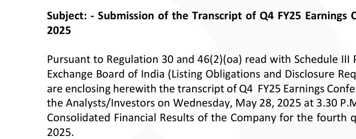

**[Image: Jun2025.pdf-0001-00.png (57x28, 2.0KB)]**

**[Image: Jun2025.pdf-0001-01.png (32x28, 2.0KB)]**

**[Image: Jun2025.pdf-0001-02.png (34x28, 1.7KB)]**

4th June 2025 

To, National Stock Exchange of India Limited, Exchange Plaza, Plot No. C/1, G Block, Bandra-Kurla Complex, Bandra (East), Mumbai – 400051 

## **NSE Symbol: QPOWER** 

To, BSE Limited Phiroze Jeejeebhoy Towers, Dalal Street, Fort, Mumbai – 400001 

## **BSE Scrip Code: 544367** 

## **ISIN: INE0SII01026** 

Dear Sir/ Ma'am, 

**[Image: Jun2025.pdf-0001-10.png (702x274, 46.8KB)]**

<!-- Start of picture text -->
2025 2025. <!-- End of picture text -->

**Subject: - Submission of the Transcript of Q4 FY25 Earnings Conference Call held on 28****th** **May 2025** 

Pursuant to Regulation 30 and 46(2)(oa) read with Schedule III Part A Para A of the Securities and Exchange Board of India (Listing Obligations and Disclosure Requirements) Regulations, 2015, we are enclosing herewith the transcript of Q4  FY25 Earnings Conference Call that was organized with the Analysts/Investors on Wednesday, May 28, 2025 at 3.30 P.M. (IST) on audited Standalone and Consolidated Financial Results of the Company for the fourth quarter and year ended March 31, 2025. 

The aforementioned transcript of the ‘Q4 FY25 Earnings Conference Call’ will also be uploaded on the Company’s website i.e. www.qualitypower.com. 

We request you to take the above on record and treat the same as compliance under the applicable provisions of the SEBI Listing Regulations. 

Thanking You, 

Yours faithfully, 

## **For QUALITY POWER ELECTRICAL EQUIPMENTS LIMITED** 

DEEPAK Digitally signed by DEEPAK RAMCHANDRA RAMCHANDRA SURYAVANSHI Date: 2025.06.04 18:02:25 SURYAVANSHI +05'30' **Deepak Ramchandra Suryavanshi Company Secretary and Compliance Officer ICSI Membership No.: A27641** 

**[Image: Jun2025.pdf-0001-19.png (75x27, 2.1KB)]**

**[Image: Jun2025.pdf-0001-20.png (67x20, 1.8KB)]**

**[Image: Jun2025.pdf-0001-21.png (77x21, 1.9KB)]**

**[Image: Jun2025.pdf-0001-22.png (219x12, 3.4KB)]**

**[Image: Jun2025.pdf-0001-23.png (1011x18, 18.8KB)]**

**[Image: Jun2025.pdf-0002-00.png (443x71, 15.1KB)]**

“Quality Power Electrical Equipments Limited 

# Q4 FY25 Earnings Conference Call” 

# May 28, 2025 

**[Image: Jun2025.pdf-0002-04.png (242x39, 6.7KB)]**

**[Image: Jun2025.pdf-0002-05.png (237x40, 7.4KB)]**

**[Image: Jun2025.pdf-0002-06.png (224x112, 5.7KB)]**

**– MANAGEMENT: MR. BHARANIDHARAN PANDYAN JOINT MANAGING DIRECTOR** 

**– MR. RAJESH JAYARAMAN CHIEF FINANCIAL OFFICER** 

**– MRS. SARIKA JADHAV SENIOR VICE PRESIDENT FINANCE** 

**MR. SACHIN SHETTI - VICE PRESIDENT FINANCE** 

**– MODERATOR: MS. NIDHI SHAH ICICI SECURITIES LIMITED** 

Page **1** of **19** 

_Quality Power Electrical Equipments Limited May 28, 2025_ 

**[Image: Jun2025.pdf-0003-01.png (242x39, 6.7KB)]**

### **Moderator:** 

Ladies and gentlemen, good day and welcome to the Quality Power Electrical Equipments Limited Q4 FY25 Earnings Conference Call hosted by ICICI Securities Limited. As a reminder, all participant lines will be in the listen-only mode and there will be an opportunity for you to ask questions after the presentation concludes. Should you need assistance during the conference call, please signal an operator by pressing star then zero on your touch-tone phone. Please note that this conference is being recorded. 

I now hand the conference over to Ms. Nidhi Shah. Thank you and over to you, ma'am. 

### **Nidhi Shah:** 

Thanks. On behalf of ICICI Securities, I would like to welcome you all to the Q4 Quality Power Electrical Equipments Limited conference call. Today, from the management side, we have Mr. Bharanidharan Pandyan, the Joint Managing Director, Mr. Rajesh Jayaraman, the CFO, Mrs. Sarika Jadhav, Senior VP Finance, and Mr. Sachin Shetti, VP Finance. First, we will have opening comments from the management, post which we will have a Q&A session. Over to you, sir and ma'am. 

**Bharanidharan Pandyan:** Good afternoon, everyone. This is Bharanidharan Pandyan from Quality Power. First and foremost, let me begin by expressing my heartfelt gratitude to each of you this evening and our valued investors. Over this past few months, we have navigated through challenging and turbulent times together, especially when our share prices touched historic lows. Your unwavering patience, belief, and trust in us and our management team have deeply touched us, reinforcing our commitment to delivering on your faith. From the bottom of my heart, thank you for standing by us. 

At Quality Power, we remain passionately dedicated to innovation and technological excellence. This year has seen us achieve significant milestones. We have successfully typetested the world's largest three-phase MSR at about 200 MVR power. We have also done typetesting of HVDC converter reactors for a western market for a global customer, and we have passed all the tests and type-tests in the first attempt. 

These accomplishments place us among a very select global group, reinforcing our technical edge and more to our competitors across the world. Moreover, we are currently in advanced negotiations for several international HVDC and FACTS projects, and we anticipate sharing more positive developments in the coming few quarters. 

Our commitment to growth is clearly reflected in our expanding global footprint. We have successfully onboarded notable new customers and utilities from Sweden, Finland, Iraq, Romania, Italy, Brazil, South Korea, Hong Kong, Australia, and across the Middle East, further diversifying our reach and strengthening our global reputation. The strategic partnership with Mehru has flourished remarkably, bringing substantial domestic and international orders. The order book at Mehru has surged beyond INR 350 crores in the last few months, clearly demonstrating the confidence the customers have in this alliance. 

Customer response has been highly positive, and we are actively integrating teams across organizations to optimize synergies and deliver greater value. We continue to invest deeply in 

Page **2** of **19** 

_Quality Power Electrical Equipments Limited May 28, 2025_ 

**[Image: Jun2025.pdf-0004-01.png (242x39, 6.7KB)]**

the future, steadily enhancing our R&D capabilities and building a strong bench of technical talent in anticipation of forthcoming expansions. 

The recent geopolitical developments concerning Turkey have naturally drawn your attention. I want to reassure you, as a part of the top management, we are proactively managing the situation. We are maintaining transparent communication with all stakeholders in India, including our employees, customers, suppliers and shareholders. 

Prominent investors in Turkey, along with us, include reputed names like Birla, Mahindra, Dabur, TAFE, Jubilee, and Redington, among others. Our exposure right now remains very minimal with Turkey, and vice versa with Endoks. We have less than INR 8 crores of spending offers from our Turkish subsidiary to Indian customers, and less than INR 5 crores from Indian companies to our Turkish customers, which are minuscule. And these engagements are purely industrial, with very, very minimal local competition. 

Our morale and operations at this current moment in all the countries remain stable. Our Turkish operations also serve largely global markets, currently executing projects in Australia, Burkina Faso, Morocco, among others. Hence, we do not anticipate a very large-scale backlash at this moment. However, our Risk Committee has continuous diligent oversight to manage and mitigate any related concerns, if any. 

Looking ahead, our strong consolidated order backlog at this quarter stands almost close to INR 750 crores, positions us confidently for sustained growth over the next few years. The ongoing capex at our Sangli facility will not only make it one of the largest coil factories in the world, but also potentially the most sustainable. We are actively pursuing an IGBC Gold or Platinum certification to underscore our commitment to sustainability. 

At Mehru, the planned capex is on track and expected to deliver shortly about 45% additional capacity in the next 4-5 months. Overall, our production capacity in Sangli will increase nearly 9-fold within the next 18 months, with robust order booking anticipated to commence within 6-9 months. Additionally, our inorganic growth strategy is advancing rapidly, with several strategic acquisition opportunities under careful evaluation. We remain disciplined and prudent, prioritizing accurate valuations, product alignment and strong cultural synergy. 

Lastly, as promoters, we have consciously and transparently decided to waive off our dividends, amounting to approximately INR 5 crores to conserve vital capital during this crucial investment cycle. We trust our recent results align with your expectations and remain committed to continual improvement in performance. 

Once again, thank you for your steadfast belief, continued support and partnership. Together, we believe we are embarking on an exciting journey towards an even brighter future. Thank you. Jai Hind. Now I give the dais to Mr. Rajesh Jayaraman, our CFO. 

Good evening, everyone. Thank you, Mr. Bharanidharan, for setting the tone so powerfully. And to our investors, thank you for being with us on this journey. It is just not the capital we value, but your belief, especially during the most distinct times. It is that trust which makes today's progress truly meaningful. 

**Rajesh Jayaraman:** 

Page **3** of **19** 

_Quality Power Electrical Equipments Limited May 28, 2025_ 

**[Image: Jun2025.pdf-0005-01.png (242x39, 6.7KB)]**

FY25 has been a pivotal year for Quality Power. I am pleased to share that we closed the year with an 18% growth in revenue, reaching INR 392 crores, and a 74% growth in profit after tax INR 101 crores. These are not just numbers. They reflect the resilience of our people, the relevance of our products, and the strength of the strategy we have put into motion. 

Our reserves have grown fourfold, and net debt has come down by 77% putting us in a significantly stronger position to pursue growth without compromising financial discipline. Our cash and bank balances now stand at nearly INR 210 crores, giving us both confidence and optionality as we invest ahead. 

Working capital was a core focus. Through tighter control on receivables and smarter inventory planning, we have strengthened operating cash flows, which are now robust enough to fund our capex internally without stretching the balance sheet. We have made disciplined investments this year. Sangli and Cochin are transforming into high-capacity, sustainable hubs. Mehru too is scaling, with a 45% capacity expansion expected to go live shortly. These investments are strategic, not just in terms of growth, but in technology, debt, and global readiness. 

To supplement our capital position, the promoters have extended an INR 125 crore soft credit line at a concessional rate, demonstrating alignment, trust, and long-term commitment to the company's growth cycle. Looking ahead, our goal remains clear to grow profitably, build predictably, and invest responsibly. The coming quarters will be focused on scaling operations to match the opportunity pipeline. And as always, we will continue to apply a disciplined lens to everything we do. Thank you again for your support and trust. Moderator, we can now open the floor for questions. 

### **Moderator:** 

Thank you. The first question is from the line of Agastya Dave from CAO Capital. Please go ahead. 

### **Agastya Dave:** 

Sir, thank you very much for the opportunity. I have one request, sir. Can you re-release your results again? Because there are a number of line items, especially in the balance sheet, which at least I could not read them properly. They are not at all clear. Sir, kindly change the font and the format that you're using for printing these PDFs. Otherwise, it makes it very difficult to understand the results. 

Sir, I have two questions. One is, again, I could be wrong here because of the lack of clarity on the printed results, but there seems to be a fairly substantial drop in margins and a fairly substantial jump in all the line items regarding the working capital. So, can you tell us what exactly happened there? 

And the second question is, given the expansion that you guys are undertaking, once the expanded facilities are fully commissioned, what would be our peak revenue for the entire company based on that asset block? 

**Bharanidharan Pandyan:** Good afternoon, Mr. Dave. This is Bharani here. Point taken on the fonts, we will definitely have a re-look at what you have just given us a comment. With regards to drop in margins, I believe one of the reasons why the comments are is primarily because the other operating 

Page **4** of **19** 

_Quality Power Electrical Equipments Limited May 28, 2025_ 

**[Image: Jun2025.pdf-0006-01.png (242x39, 6.7KB)]**

income is not normally taken in the accounting standard as an operating income. In the other operating income in India and in Turkey, we have cash, which accrues deposit and interest, interest money on the deposits, what we have. Apart from it, in Turkey, whatever the hedge call or whatever is the difference in dollar to Turkish Lira prices, which is normally hedged at the time of the contract, all the money comes, accounted into the other income, which is not normally taken as an operational income. We believe our margins are at this moment stable. And with regards to the working capital, I'll ask my colleague, Sarika, to reply on it. **Sarika Jadhav:** Hello. Sir, our working capital increased because of the high sale in the last quarter and which also resulted into the increase in debtors. It also, due to the acquisitions of new Mehru Electrical, which is reflected in the 31st March 2025 figures and which was not there in the 31st March 2024 figures. **Agastya Dave:** All right. **Bharanidharan Pandyan:** So, Mr. Dave, you need to look at the balance sheet in conjunction that Mehru's numbers also add to almost INR 250 crores of total sales. So, when you look at the percentage on what is the last quarter revenue, you would have a fair idea. **Agastya Dave:** Right. I guess I need to do the quarterly adjustments. Sir, and what about the peak revenue potential of the company post the expansion? **Bharanidharan Pandyan:** Post the current expansion, what we have as Quality Power in the factory block, we believe we have facility to deliver almost close to INR 1,500 crores from the current factory. Mehru, we are anticipating we should peak out at about INR 450 to INR 500 crores. That is one of the reasons why within a month of we going in, we have already proposed a capex. The order books are supporting. As I said, the company is already sitting on more than INR 350 crores of order book and which we have lost almost about INR 100, INR 150 crores in the last month because we were not able to commit deliveries. So, with the capex coming in, the smaller capex, we are moving out some of our operations to our warehouses around. We are putting in a clean and lean team right now, which can deliver another INR 150 crores from the same plant. But obviously, we will require a larger facility. We are in lookout for that. **Agastya Dave:** So, consolidated, both the entities put together post expansion would be closer to INR 2,000 crores? **Bharanidharan Pandyan:** I agree, sir. That would be our peak capacity at what we are right now. **Agastya Dave:** Perfect, sir. Sir, any commentary on the margins going forward, especially post expansion? Given the scale of the expansion, I am just wondering whether there would be some drag on the margins in the initial few months. Will you ramp up? How should we look at the margins going forward? 

Page **5** of **19** 

_Quality Power Electrical Equipments Limited May 28, 2025_ 

**[Image: Jun2025.pdf-0007-01.png (242x39, 6.7KB)]**

|**Bharanidharan Pandyan:**|Interesting observation, Agastya. Yes, that is how the curve goes normally. We have already in the last few quarters started adding manpower, management, and people. We have started internally our own learning and training division because we anticipate we need more than 1,000 people walking into the new facility immediately. So, this will slightly drag down, but I believe the pricing power and the markets would support a lot of it. So, I do not think the drag would be too much.|
|---|---|
|**Agastya Dave:**|And, sir, you have added all the fixed costs in terms of employees or you need to add more. So, if I look at the quarterly numbers, I believe the employee cost is around INR 11 crores. So, annualized, that would be INR 44 crores. So, is that enough or would you be adding more?|
|**Bharanidharan Pandyan:**|We would be adding more because the plant what we are expanding would be almost 9X our current capacity, which means that we would need more labor, more engineers in the workforce, but we cannot absorb everybody on one go. So, we are attempting to get about 100 to 200 people every quarter till we are able to reach and then progress forward because our current facilities also cannot handle more than that much of people working together.|
|**Agastya Dave:**|At current labor prices, would your wage bill approach INR 100 crores then or would it cross it? Because, again, the expansion is so large, sir, it's difficult to get a proper estimate from where we are sitting. That is why I am asking.|
|**Bharanidharan Pandyan:**|So, we anticipate our labor force would triple in the next 2 years. So, I would believe that would be a good statement.|
|**Agastya Dave:**|It's a very useful statement, sir. Thank you very much, sir. And thank you for giving me the opportunity. All the best, sir. Very interesting business model. Thank you, sir.|
|**Bharanidharan Pandyan:**|Thank you.|
|**Moderator:**|Thank you. The next question is from the line of Nemish Sundar from Elara Capital. Please go ahead.|
|**Nemish Sundar:**|Yes. Thank you, sir. Sir, just a few questions. So, firstly, you had indicated that on the revenue front, you expect to grow at the HVDC FACTS market growth, which was expectedly around 40% to 50%. So, do you maintain that growth for the next 1, 2 years?|
|**Bharanidharan Pandyan:**|HVDC normally is a 3-year project timeline for us and the end customer has a 4-year project timeline. So, let's assume a large vendor for a HVDC project gets about 4 years on the contract and we are normally given a contract in about, say, 6 to 9 months from him getting the contract post-engineering. So, we would see some HVDC orders coming in, in the next few quarters. One of the reasons why we are expanding the facility is to be able to execute it next year. So, all the HVDC orders, we would see a surge in the numbers by, I would say, third quarter this year. Because at this moment, we are not able to commit capacities, but there are a few orders in India we are likely to back.|

Page **6** of **19** 

_Quality Power Electrical Equipments Limited May 28, 2025_ 

**[Image: Jun2025.pdf-0008-01.png (242x39, 6.7KB)]**

**Nemish Sundar:** And these orders would be for reactors or for any of the other offerings that you have currently? **Bharanidharan Pandyan:** So, for HVDC, in India and most parts of the world, what we have qualified is reactors. We have also qualified for line traps. We have qualified for instrument transformers. We have qualified for medium-voltage oil-filled transformers for special applications, like zigzagconnected earthing transformers. So, we have four products that we go into the HVDC lines. We are also attempting to add more products in that same segment. **Nemish Sundar:** Okay. Thanks, sir. And, sir, the current order book that you have on Mehru and Quality Power, so what would be the execution timeline for the order book? **Bharanidharan Pandyan:** I would say approximately 15 months, give and take. **Nemish Sundar:** Okay. And one last question, sir. What would be the split between Quality Power and Mehru revenue contribution as of now and in the next year, maybe? **Bharanidharan Pandyan:** Mehru has a higher revenue at this moment. However, the margins of Quality Power are far higher. In the next few quarters, because of the order intake that has been changed and the push that we have had internally because of the margins, I believe Mehru also would deliver great margins. Not as higher as us, but far better than what they were delivering. And at a higher revenue base, that would come substantially higher. **Nemish Sundar:** Okay. Thank you so much, sir. And all the best. **Bharanidharan Pandyan:** Thank you. **Moderator:** Thank you. The next question is from the line of Yashovardhan Banka from Tiger Asset. Please go ahead. **Yashovardhan Banka:** Thank you, sir. Sir, I just wanted to understand a bit more on the Nebeskie business model around it. **Bharanidharan Pandyan:** So, Nebeskie is a company that we had invested about 3 years back. Nebeskie is working on creating a technology called Edge Automation or Edge Computing, where there is a computer, a small computer, which is fitted on every device. Basically, it is an IoT connected device where the device is able to understand what is going in and out of the data and based on the learning of the data that is going in and out, it is able to create its own ML and intelligence. Now, we believe in the next 5 to 10 years, the substations that are in this world would slowly become personless. It's like self-driving cars, the substations where you have about four or five people manning a substation. There is a shortage of people in places like Australia or say in Germany or Europe for manning the substations. 

So, in these unmanned substations, all these high voltage equipment need to discuss, talk and communicate with the people, including during maintenance. So, the manufacturers would like to connect to the device or our equipment and talk to them. All this is possible only through IoT, which as you are aware is already an ongoing market. 

Page **7** of **19** 

_Quality Power Electrical Equipments Limited May 28, 2025_ 

**[Image: Jun2025.pdf-0009-01.png (242x39, 6.7KB)]**

But along with IoT, there is also cybersecurity, which comes into picture. That means you cannot directly connect it. And if there is a network shutdown, the device needs to learn based on historic data and take decisions itself. That is a product that these smart kids are developing. We believe that these will be useful to us in the near future. And that's why we are investing in the technology and they are in a technology development space to do their bread and butter, to pay for the stuff, they sell energy management solutions. 

But basically on the energy management solutions, what they are doing is they are collecting data. And based on data, they are training their data models. So, that is the business they are currently doing. But the development is a different process. So, it's basically an R&D expenditure from our portion for our future. 

**Yashovardhan Banka:** Okay, got it. So, is this related to something in the outage that recently happened in Spain? 

**Bharanidharan Pandyan:** The outage that happened in Spain and Portugal is because of the same problem we have been talking about in India, that the renewable energy grids cannot be connected by the traditional method to the normal networks, AC networks. It needs to have HVDC and FACTS, even though Spain has a huge amount of asset, but still not enough. This is a disaster that is waiting to happen in most parts of the world. That is why the orders for HVDC and FACTS equipments are speaking across. 

Now, last, I think in March of 2025, UK, which is a small country with about 6 crore population, released the HVDC orders for £59 billion or INR 6,50,000 crores. So, this only tells you that those utilities have realized what is happening. And these are the problems that even India started facing in some locations in Rajasthan where the trippings have become far too common. It just doesn't get highlighted in our media as trippings like what it has done in Europe. 

**Yashovardhan Banka:** Understood, sir. Understood. And just one last question before I fall back on the line. So, I wanted to understand what is the internal focus on the domestic demand? 

**Bharanidharan Pandyan:** Yash, in domestic demand, we have a Make in India clause. So, a lot of orders have to come to us, ideally for all the government contracts. We are likely to focus on HVDC and FACTS in India. But as I said, we have developed about 100 countries, markets, utilities. The boom and bust cycle is normally 5, 7, 10 years. But after that, you need to go and explore new markets. 

So, we would ideally like to keep 50% domestic and 50% global. And that's why the new capacities, whatever is coming in, we believe we should be able to reach its full potential very soon. 

### **Yashovardhan Banka:** 

Amazing, sir. Thank you so much. 

**Moderator:** Thank you. The next question is from the line of Naman Parmar from Niveshaay Investments.. Please go ahead. 

**Naman Parmar:** Good afternoon, sir. Thank you so much for the opportunity. I want to know how much the coil product is being consumed in the revenue? 

Page **8** of **19** 

_Quality Power Electrical Equipments Limited May 28, 2025_ 

**[Image: Jun2025.pdf-0010-01.png (242x39, 6.7KB)]**

**Bharanidharan Pandyan:** Coil products are, I think, more or less about INR 160 crores at this moment. 

**Naman Parmar:** Okay, INR 160. And any lead time is there in the coil product currently? **Bharanidharan Pandyan:** For large HVDC and FACTS projects, we are quoting for FACTS between 12 and 15. For HVDC, 2 to 3 years. **Naman Parmar:** 2 to 3 years. Okay. So, with the current capacity coming in for these all products, transformers and the coil product in the Sangli and the Cochin. So, how much revenue potential would be there after the capacity addition? Currently, it is 2,000 with both Mehru and the Quality Powers. With the capacity coming in, how much revenue you can do it? **Bharanidharan Pandyan:** As I just committed to Mr. Aditya earlier, about INR 1,500 plus minus crores. **Naman Parmar:** Okay. After the new capacity comes, the INR 1,500 you can. **Bharanidharan Pandyan:** Yes. We are already close to our max capacity at the coil products business. **Naman Parmar:** Okay. And on the order book side, overall your order book is around INR 750 crores. So, what's the bid pipeline for them? For both Mehru and the Quality Power? **Bharanidharan Pandyan:** The bid pipeline for Quality Power as on last month is excess of INR 1,000 crores. And for Mehru is excess of INR 400 crores. **Naman Parmar:** Okay. And lastly, on the margin side, if you see on the broad level, your margin has also impacted even though your stand-alone parent company has done very good. But if we see on the console level, the margin has fallen. So, what will be the reason for that? And what will be the sustainable margin going forward that you have guided in the process that you will be able to maintain 19% to 20%? So, you will maintain over that? **Bharanidharan Pandyan:** One second, Mr. Rajesh, will direct, yes. 

**Rajesh Jayaraman:** Yes. Console level, as was answered by Mr. Bharani in the start of the meet, what happens is that the other income effect doesn't form part of gross margin. It becomes in the net margin. So, typically, when you see in the consol level, the gross margin is a bit lower than the standalone. So, we have this, our Turkish subsidiary, Mr. Bharanidharan, at the start of the meeting, first question addressed. So, that's where the difference is. As overall, the net profit is more or less the same. 

**Naman Parmar:** Okay. So, what do you expect for the future? What will be the sustainable? 

**Bharanidharan Pandyan:** So, with Mehru coming in, Mehru is coming at a lower margin, but we have a drastic improvement in the margins and the bids and the orders that have come in. We believe the blended would still be upwards of 16%, 17%. We would ideally like to target 20%, but I believe whatever the improvements we do, we will see an improvement in margin on Mehru. Our margins are more or less sustainable. So, the blended margins is what would be about 17%, 18% is what I would say. 

Page **9** of **19** 

_Quality Power Electrical Equipments Limited May 28, 2025_ 

**[Image: Jun2025.pdf-0011-01.png (242x39, 6.7KB)]**

**Naman Parmar:** Okay. 

|**Moderator:**|The next question is from the line of Viraj Mahadevia from MoneyGrow. Please go ahead.|
|---|---|
|**Viraj Mahadevia:**|Hi, sir. Congratulations on fabulous results. Just for some clarity, what is your typical bid pipeline win ratio?|
|**Bharanidharan Pandyan:**|It depends on the sector. On HVDC, I would say it's 2 in out of 10. In FACTS, it's right now 6 or 7 out of 10. For Mehru, if they want to take in, it is almost 100% at this moment. It is how much capacity we can deliver from that factory.|
|**Viraj Mahadevia:**|Understood.|
|**Bharanidharan Pandyan:**|And that is why a lot of the customers are right now writing long-term contracts. We have announced two long-term contracts, one with Fingrid, that is Finland utility, which signed a 3- year contract with us. Recently, again, a global utility from Israel signed a 4-year contract with us. So, the utilities, what they are doing is they are locking capacities with companies like us for 3 to 4 years so that their equipment can be secured.|
|**Viraj Mahadevia:**|Understood. Typically, what is the order cycle? How long does it take from receiving an order in terms of your production cycles to deliver it?|
|**Bharanidharan Pandyan:**|It depends on the value of the order. HVDC order is north of INR 50 crores. It can go between INR 50 and INR 150. FACTS orders can be between INR 20 and IN R50.|
|**Viraj Mahadevia:**|I meant in terms of timeline. How long does it take to execute an order?|
|**Bharanidharan Pandyan:**|HVDC order is normally about 2 to 3 years where you bill every month. A FACTS order is about 12 to 15 months.|
|**Viraj Mahadevia:**|Okay. Lastly, if I may, with these capacities coming online, you mentioned that there is an expansion later this year and then the big Sangli expansion is second half of next year. Is that correct?|
|**Bharanidharan Pandyan:**|Correct. So, we are adding additional capacity in our Cochin factory that will be able to cater to the medium voltage markets. But for the HVDC and FACTS, we will be taking orders from about 6 months' time because the factory will be online by second half of next year.|
|**Viraj Mahadevia:**|Understood. All the best.|
|**Bharanidharan Pandyan:**|Thank you.|
|**Moderator:**|Thank you. The next question is from the line of Rushabh from RBSA Investment Manager, LLP. Please go ahead.|
|**Rushabh:**|Sir, currently we are facing a supply shortage in many of our products as we understand. Just want to understand, when do you see the demand supply normalizing over how many years?|

Page **10** of **19** 

_Quality Power Electrical Equipments Limited May 28, 2025_ 

**[Image: Jun2025.pdf-0012-01.png (242x39, 6.7KB)]**

**Bharanidharan Pandyan:** Rushabh, I think you are very invested in the electrical sector. So, you have caught the secret. Yes, we are having shortages. Some of the products, the shortages are in decades. Some of the products, the shortages are in 6 months' time. Mostly, we are finding shortages whenever it is related to high voltage, which is 220 kV and above. So, to give you an idea, insulators, which used to be about 2 months, is now being quoted 1 year. Equipment, let's say even a FACTS equipment, what we used to sell in about 4 or 5 months, we are quoting 15 to 18 months nowadays. But as soon as you go down to high voltage, say 400 kV or 765 kV, it moves on to years now. Most of the European factories, on an average, are closed for 6 to 7 years. And Europe is normally the hub for all high voltage electrical equipments. **Rushabh:** Okay. So, you book for next 6 to 7 years is what your understanding is? **Bharanidharan Pandyan:** That is why you are seeing the boom in the Indian Class A, Tier A market because all the capacities are going abroad. **Rushabh:** And you mentioned about this INR 2,000 crore revenue target. So, over how many years can you execute that? **Bharanidharan Pandyan:** We are assuming that if all things go good, we should be home safe in about 4 years. **Rushabh:** Okay. Thank you. **Moderator:** Thank you. The next question is from the line of Praveen Motwani from BOI. Please go ahead. **Praveen Motwani:** Yes. Hi. Sir, thanks for this opportunity. Firstly, sir, congrats on the good set of numbers. Sir, just two clarifications I want. Sir, FY25 revenue is INR 392 crores. So, sir, on the existing capacity that you have, how much revenue we can do? Sorry, you have already mentioned, but I have missed out somehow. **Bharanidharan Pandyan:** Praveen, thank you for your belief on us. You have been a very supportive investor. I wish to thank you and your team for that. The current capacity is what we are sitting on. The coil products is stretched. With Mehru, we are able to create some additional capacities with our small capacity addition that we are having in Cochin. We believe next year our internal budgets are north of INR 700 crores. **Praveen Motwani:** So, existing facility can reach to INR 700 crores of revenue? **Bharanidharan Pandyan:** Not existing facility. The budget for next year for the company is north of INR 700 crores in revenue. And by next year, most of the capacities would come online, which means we can dream bigger. **Praveen Motwani:** Okay. And you are saying after the capex is completed, you will achieve the revenue of INR 2,000 crores at a peak level, correct? 

|**Bharanidharan Pandyan:**Correct.|
|---|

Page **11** of **19** 

_Quality Power Electrical Equipments Limited May 28, 2025_ 

**[Image: Jun2025.pdf-0013-01.png (242x39, 6.7KB)]**

**Praveen Motwani:** Okay. So, this INR 2,000 includes both your stand-alone that is Quality and the Mehru? **Bharanidharan Pandyan:** Correct. And this does not include any other acquisitions that we may pursue. **Praveen Motwani:** Okay. Got it. And sir, the last question is what explains this increase in the other income in this quarter that you have reported? **Bharanidharan Pandyan:** So, the increase in other income is directly proportional to Turkish operations of ours, not Indian operations. We have more than INR 100 crores in cash. I think it is more than INR 150 crores. So, that cash will deliver us some interest. I believe that will be a part of the interest income. But apart from this income, whenever there is an inflation of almost 27% officially in Turkey, so when your contracts are being signed, all the contracts are in dollars, your supplier is paid in dollars. But, you know, the contract currency is lira because the government has banned dollars in that country for foreign contracts. But we get an exchange-linked Turkish lira. So, whatever is the difference of the exchange-linked Turkish lira is paid to us as other income or as an exchange bill. So, that is treated as other income that is nothing but an operational income due to our ongoing activities. To also clarify, out of our cash, about INR 70 to INR 75 crores is the cash and cash equivalent that is currently in Turkey and not more. So, out of that, you would see almost close to INR 50-INR 60 crores as other income. That much money cannot be delivered by, you know, a simple cash in hand. **Praveen Motwani:** Got it. Got it. Thank you. And all the best. **Moderator:** Thank you. The next question is from the line of Arthik Satya, an Individual Investor. Please go ahead. **Arthik Satya:** Thank you for the opportunity. On the bookkeeping side, I had a question. Our EPS is shown as 9.11. But for the PAT and the number of shares that we have, it comes around 13.75. So, if I am missing something or would you like to give us something on the controlling asset and non-controlling asset side? **Sarika Jadhav:** Yes. Sir, you are telling about 7,27,00,000 number of shares, yes? **Arthik Satya:** Yes. 7,27,00,000. Yes. **Sarika Jadhav:** Yes. So, that is the weighted average number of shares because we have the issue allotted during the month of February. So, for 38 days, that weighted average number of newly issued shares of 52,94,100, which comes to around 5,51,000 number of shares. So, that is included in 7,27,00,000 number of shares. That is as per India side segment. **Arthik Satya:** Yes. But still, the diluted EPS calculation, I am not clear. 9.11. 9.10, if I am not wrong. Can you. Is it something to do with the controlling stake in the subsidiary of Turkey or something like that? 

Page **12** of **19** 

_Quality Power Electrical Equipments Limited May 28, 2025_ 

**[Image: Jun2025.pdf-0014-01.png (242x39, 6.7KB)]**

|**Sarika Jadhav:**|Yes, sir.|
|---|---|
|**Rajesh Jayaraman:**|It is a combination of both. But what we'll do, we will again check once again and come back to you. But you are correct. It is a combination of two. Controlling non-controlling interest also and also the pro rata or weighted average. It's a combination of both.|
|**Arthik Satya:**|But ideally, if you are declaring the complete PAT of your Turkey subsidiary, then the EPS calculation should be also on the complete side of the PAT. So, I can get more clarity on that.|
|**Rajesh Jayaraman:**|Yes. I will give you clarity. But we have to keep in mind, it is the main competitive Quality Power. Okay. I have got your point. I will check and revert on this question. Yes.|
|**Arthik Satya:**|Right. Right. And second question is, any guidelines for the year FY25? How much of top line could we achieve?|
|**Bharanidharan Pandyan:**|Satya, I just declared about INR 700 crores, north of INR 700 crores.|
|**Arthik Satya:**|That is your pipeline, if I am not wrong.|
|**Bharanidharan Pandyan:**|No, no, no. That is our target that our revenue should be north of INR 700 crores. So, the band is between INR 700 and INR 850 crores is our target band on the revenue. The order book as of right now is INR 750 crores. At this moment, which is 2 months into the year, we still have about 10 more months to book orders. It is the first quarter of our booking orders. So, I believe we will show a very high order book every quarter.|
|**Arthik Satya:**|This is without any further acquisitions, right? If at all you go ahead with any other acquisitions.|
|**Bharanidharan Pandyan:**|It is without any further acquisitions, whatever we plan will be a bonus on top of it.|
|**Arthik Satya:**|Right. Great. Thanks. Thanks. All the best.|
|**Bharanidharan Pandyan:**|Thank you.|
|**Moderator:**|Thank you. The next question is from the line of Sanjan Yadav, an individual investor.|
|**Sanjan Yadav:**|Yes, sir. My question is, who are other companies which are making coil products in India?|
|**Bharanidharan Pandyan:**|For HVDC and FACTS application, we are the only company making coil products in India. 220 kV and above, we are the only company that is making these products in India. That can be checked by Power Grid, Adani and Sterlite, who are the HVDC and FACTS operators in this country.|
|**Sanjan Yadav:**|Okay, sir. And you mentioned that our order pipeline is north of INR 1,000 crores. So we will get completed INR 1,000 crores plus, it will come to us only, sir?|
|**Bharanidharan Pandyan:**|Our port pipeline is INR 1,000 crores, sir, at this current moment. We believe a good section of it should come to us.|

Page **13** of **19** 

_Quality Power Electrical Equipments Limited May 28, 2025_ 

**[Image: Jun2025.pdf-0015-01.png (242x39, 6.7KB)]**

|**Sanjan Yadav:**|Okay. And sir, can you bifurcate the revenue in terms of what the contribution from coil products, transformers and power quality solutions?|
|---|---|
|**Bharanidharan Pandyan:**|Our current focus is only coil products where there is a huge peak demand. Our transformer products are miniscule. Our power quality is at this moment about 40%-45% of our total revenue.|
|**Sanjan Yadav:**|Okay. And you want to take it to 20%-25% as you mentioned in last con call too?|
|**Bharanidharan Pandyan:**|Correct, sir. As we grow on our power products and manufacturing business, our solutions business would slowly start going down as a percentage even though they would have a growth.|
|**Sanjan Yadav:**|Okay, sir. And margins in coil products are how much, sir?|
|**Bharanidharan Pandyan:**|Sir, it is already displayed. What are the margins? One second. Roughly north of 20%-22%, sir, or higher.|
|**Sanjan Yadav:**|Okay. Okay. Thank you, sir. Thank you very much.|
|**Moderator:**|Thank you. The next question is from the line of Yashovardhan Banka from Tiger Asset. Please go ahead.|
|**Yashovardhan Banka:**|Thank you, sir. So just wanted to get an update on the STATCOM Energy acquisition and if we are going through.|
|**Bharanidharan Pandyan:**|Sir, we have a certain what we say process and acquisition including sometimes we may request the promoters to have a share swap in a few years where we normally intend to buy 100% of the company over a few years. So we have had discussions which are determinant both to us and the company. So even though it's a good company, it did not fit in the investment philosophy of how we normally do a takeover. So we have decided to mutually call it off.|
|**Yashovardhan Banka:**|Okay. Got it. And just one more question I wanted to understand. What is your average client acquisition timeline?|
|**Bharanidharan Pandyan:**|We do not have an average customer acquisition. Most of the customers who are already there have been acquired on a utility space. As I said, there are 100 utilities more or less which control the world and we are more or less approved in most of these. It is how much capacity we can deliver to these guys as and when they are having projects. So to give you an India, in India suddenly there is peak. There is also England is peak, Netherlands is peaking on HVDC. So how much capacity we can give compared to the size of projects. So sometimes one customer is able to keep your factory full for 5 years or 10 years, it's that kind of business in HVDC.|

**Yashovardhan Banka:** Understood. So if I understood this correctly, for the year, for FY26 and moving ahead, are we projecting our margins to be sustainable around 15% to 16%? Is that right? 

Page **14** of **19** 

_Quality Power Electrical Equipments Limited May 28, 2025_ 

**[Image: Jun2025.pdf-0016-01.png (242x39, 6.7KB)]**

**Bharanidharan Pandyan:** I believe so. That is what we are forecasting. 

|**Yashovardhan Banka:**|Thank you.|
|---|---|
|**Moderator:**|Thank you. The next question is from the line of Jainam Doshi from Kriis Portfolio. Please go ahead.|
|**Jainam Doshi:**|Yes. Thank you for the opportunity. Like we are currently paying around 10% to 11% taxes on a consolidated basis. So can you explain the reason for the lower tax rate?|
|**Sarika Jadhav:**|Hello. Yes, sir. Our foreign subsidiary is basically a technology company and which is the certified R&D center and they are doing the research and development expenses. So for that, their country is offering some taxation benefits and that's why the total on consolidated basis, the tax expense is lower.|
|**Bharanidharan Pandyan:**|Okay. So for all our Indian subsidiaries, we have the same level of tax rate of about 27% give and take. The Turkish company, because of the projects we undertake and the investments we do, has almost close to nil tax rate. It's basically an R&D benefit which the government of India removed a few years back, but that government continues to have.|
|**Jainam Doshi:**|Okay. Okay. Got it. And second question is pertaining to the R&D budget which we are targeting moving ahead and due to the benefit which we are getting due to the R&D expenses which we incur in Turkey, how long it will be available to us and when we start paying normalized taxes in Turkey?|
|**Bharanidharan Pandyan:**|For our historical memory, sir, in the last 10 years, I think we have been using the benefit. What we say, I cannot comment upon what the government policies would change. But I'm sure R&D is very crucial to most European countries for development of technologies. We have developed great technologies there including SCADA, SVC, STATCOMS, and the government supports that initiative. They have far more programs on R&D and actually a lot more funding on R&D in those parts of the world. So I believe that in the near future, I don't think any probability of change in policies.|
|**Jainam Doshi:**|Okay. And what would be our R&D budget which we are targeting?|
|**Bharanidharan Pandyan:**|In India, because we do not have any R&D budget per se where there is a benefit to it, most of the R&D what we do gets into your P&L. Most of the expenses are used in our P&L and we don't capitalize it separately.|
|**Jainam Doshi:**|Okay. Okay. Got it. Thank you for the detailed explanation.|
|**Bharanidharan Pandyan:**|Thank you.|
|**Moderator:**|Thank you. The next question is from the line of Harshit Sachdeva from Columbus Capital. Please go ahead.|

Page **15** of **19** 

_Quality Power Electrical Equipments Limited May 28, 2025_ 

**[Image: Jun2025.pdf-0017-01.png (242x39, 6.7KB)]**

### **Harshit Sachdeva:** 

Oh, hi. Great set of numbers have been following the company since Q3. I'm sorry if you've been hearing this too much but these are the kind of times we live in. About Turkey, I mean, you've already mentioned it in the opening remarks as well but just wanted to clarify what are the conversations you're having and I hope that the backlash is only limited to social media rhetoric and nothing gets affected on ground. Because like you said, there are a lot of businesses other than QP as well operating for India. 

And on follow-up on that would be like any bifurcation of numbers for the Turkey operations? Like how much does it contribute to revenue profitability? I mean, you mentioned tax before this. So just a bit of clarity on that because that's the environment. 

**Bharanidharan Pandyan:** Point taken, Harshit. I can clarify two things to you. What we say, the first is we are the only company in Turkey making SVCs and STATCOMs. We are the only company. So the industrial market of Turkey does not have options other than us unless they go to Chinese. As a local company, they are preferred in 90% of the contracts which they bid in. That is point one. 

From what we have had discussions with our partners there and our employees, the backlash from Turkey is not so much. The social media of Turkey was with a couple of anchors but in the country, it is still not covered in the news media. In India, there has been a backlash against us including one of our anchor investors who decided to exit because of our Turkish heritage. 

But however, from an Indian operation, we are not exposed much to the Turkish market in such a way that what we say the Turkish guys cancel our contracts. Our total offers at this moment to them is less than INR 5 crores out of a INR 1,000 crores pipeline that we have. So the impact is technically at this moment negligible unless the Turkish government decides to, you know, again support something against what we say Indian investments in Turkey. But then we are not alone in that country. 

**Harshit Sachdeva:** 

Cool. Thank you so much, sir 

**Moderator:** Thank you. The next question is from the line of Deepankar from CCV-IM. Please go ahead. 

**Deepankar:** Thank you for the opportunity, sir. In the document, you have mentioned funding in organic growth through unidentified acquisition. Could you please provide some color on the type of companies or technologies you are targeting for future acquisitions? Like, are they based on the geographical regions or what? 

**Bharanidharan Pandyan:** Sir, we believe 50% organic growth and 50% inorganic growth historically is what we have been doing also. The acquisition normally we do, we do not do it for expansion of geography or expansion of markets. These are stuff that we could do cheaper with our own cells. What we do is for acquisition of technology so that we increase our bouquet of offering in the HVDC FACTS and critical power transmission segments. 

So there are some interesting companies that we are evaluating, including battery energy storage, on the best part electronics, on component levels, on high voltage manufacturing. We 

Page **16** of **19** 

_Quality Power Electrical Equipments Limited May 28, 2025_ 

**[Image: Jun2025.pdf-0018-01.png (242x39, 6.7KB)]**

are evaluating a lot of companies at this moment with us. We have formed a mini committee under our director, Mr. Raj Iyer, who used to be on the board of ABB Switzerland and GE Paris. He has run factories even in China. He was president of ABB Japan for some time. So we are evaluating one by one. But as I said, culture, price and technology should fit in our portfolio before we make an acquisition. One of the reasons why we funded as promoters our own capex is primarily because we wanted to keep the free cash and the free profits for further inorganic growth rather than putting all our money into the capex. **Deepankar:** Okay. And sir, I believe 25%-30% of your revenue comes from the international market. So can you please provide the country-wide revenue segregation and do you expect any change in it moving forward? **Bharanidharan Pandyan:** It keeps changing every year because the size of some of these projects can be quite large. So to give you an idea, a couple of years back, America was our biggest market. Last year, Europe was our biggest market. This year, I believe, Middle East and Australia is our biggest market. Maybe next year, we are looking at India being our biggest market. So it depends on the project size and volume. Based on some of these large projects, our revenues are miniscule. So one or two large projects can tilt a company anyways. **Deepankar:** And sir, last question. How does the high proportion of international sales impact your overall margin profile compared to domestic sales? **Bharanidharan Pandyan:** Our margins across markets are similar. It is not a special price for domestic or a different price for global because we have to keep in mind that in global markets, in some places, let's say LATAM or say Southeast Asia, we may also face Chinese pressure. So the margins are more or less similar. We have recently got a 1-year blanket with a utility of Hong Kong where we fought the Chinese in similar margins. So from margin profile, it is not different. But from a sustainability profile of a company where we intend to grow over a period of 10 years, more markets, more large utilities means that every time we have an inorganic acquisition, our cost of customer acquisition is zero. We have a sales channel that can do. Some products sell in certain regions and do not sell in other regions. So we need to have a spread of regions. **Deepankar:** Okay, sir. Thank you, sir. I'll get back in queue. 

### **Bharanidharan Pandyan:** Thank you, Deepankar. 

**Moderator:** Thank you. The next question is from the line of Yashovardhan Banka from Tiger Asset. Please go ahead. **Yashovardhan Banka:** Thanks again, sir. So just for my clarity and sorry for coming back again. So the margins that we are adding for that is around 15% to 16% is excluding the income that is shown in other income from Endoks is that correct? 

Page **17** of **19** 

_Quality Power Electrical Equipments Limited May 28, 2025_ 

**[Image: Jun2025.pdf-0019-01.png (242x39, 6.7KB)]**

**Bharanidharan Pandyan:** That is excluding the other income of interest from them. Other than interest, all the other income is nothing but operational income for us. Those will start getting cleared up into income, I believe, in the next 18 to 24 months because the inflation is coming under control in Turkey. 

And the IAS 29, which is the IFRS equivalent of reporting, needs the country to be in 100% hyperinflation for 3 years to be able to go into that module. Once they clean up that, I believe it will go into operational income from our reporting parameters. 

**Yashovardhan Banka:** Got it. And, sir, what are the margins from Endoks? 

**Bharanidharan Pandyan:** They are into high-end power electronic products, as I said, SVC, STATCOMs, and Power Quality. They have been traditionally around 25% plus, but this year we are looking at about 20% to 22% primarily because of inflation-related costs at that market. **Yashovardhan Banka:** Okay. But sustainable moving ahead, say, 2, 3 years? 

**Bharanidharan Pandyan:** Historically, it has always been about 20%, 25%. 

**Yashovardhan Banka:** Got it. Okay. Thank you, sir. 

**Moderator:** Thank you. The next question is from the line of Mihir from Prithvi Finmart. Please go ahead. 

**Mihir:** Thank you for the opportunity. I'm sorry to repeat the question again. Like, can you please give some clarity in simple language regarding the reporting principle that you are following for the Turkish operation in the other income? 

**Bharanidharan Pandyan:** See, I have about INR 75 crore in cash, between INR 70 and INR 75, that cash and cash equity, including FDs. Okay. That generates approximately about INR 12 crores give and take as interest and investment income. Anything over that is an operational income. When I say operational income, all the electrical equipment vendors across the globe, including in Asia, all are LM. If I buy copper, aluminum, steel and oil in rupees, the rupees is hedged to a dollar. Like, basically, I need to pay in dollar equivalent. All are LM. Same way, when they have to buy equipment in Turkey, to any vendor, they have to pay in dollars. Okay. 

When the country went into hyperinflation, most countries tend to ensure that no foreign currency contracts are signed, because that means forex outgo. So, they sign a contract in Turkish lira, but they write a countervailing con that equivalent to so much dollars. So, at the end of the contract, because, you know, even my supplier is also equivalent to the dollars, my customer is also equivalent to the dollars. 

So, your margin as a percentage is normally fixed, what we call as a hedge, say, plain vanilla option hedge. Okay. But whether I make profit or loss is immaterial. If the currency goes upward or downward, in the contract, the customer pays equivalent of that. That's all. So, the margins are always protected. 

Page **18** of **19** 

_Quality Power Electrical Equipments Limited May 28, 2025_ 

**[Image: Jun2025.pdf-0020-01.png (242x39, 6.7KB)]**

**Mihir:** 

Okay. Got it. That's it. Thank you so much. 

**Bharanidharan Pandyan:** Thank you. 

**Moderator:** Thank you. As there are no further questions, I would now like to hand the conference over to the management for closing comments. **Bharanidharan Pandyan:** Hello. We have covered all the key developments over the past quarter and outlined our outlook as we move forward in this journey. Our focus, as I reiterated, remains firmly on execution of the numbers that have been committed, innovation on a technology front, and creating long-term value for our investors. If any of you have any further questions or would like to meet the management, please feel free to reach out to our IR, Churchgate Partners. And we look similarly to have a continued engagement with you guys in the next few quarters. Thank you and good day. **Moderator:** Thank you. On behalf of ICICI Securities Limited, that concludes this conference. Thank you for joining us and you may now disconnect the line. 

Page **19** of **19** 

---

## Extracted Images

| # | File | Dimensions | Size |
|---|------|------------|------|
| 1 | Jun2025.pdf-0001-00.png | 57x28 | 2.0KB |
| 2 | Jun2025.pdf-0001-01.png | 32x28 | 2.0KB |
| 3 | Jun2025.pdf-0001-02.png | 34x28 | 1.7KB |
| 4 | Jun2025.pdf-0001-10.png | 702x274 | 46.8KB |
| 5 | Jun2025.pdf-0001-19.png | 75x27 | 2.1KB |
| 6 | Jun2025.pdf-0001-20.png | 67x20 | 1.8KB |
| 7 | Jun2025.pdf-0001-21.png | 77x21 | 1.9KB |
| 8 | Jun2025.pdf-0001-22.png | 219x12 | 3.4KB |
| 9 | Jun2025.pdf-0001-23.png | 1011x18 | 18.8KB |
| 10 | Jun2025.pdf-0002-00.png | 443x71 | 15.1KB |
| 11 | Jun2025.pdf-0002-04.png | 242x39 | 6.7KB |
| 12 | Jun2025.pdf-0002-05.png | 237x40 | 7.4KB |
| 13 | Jun2025.pdf-0002-06.png | 224x112 | 5.7KB |
| 14 | Jun2025.pdf-0003-01.png | 242x39 | 6.7KB |
| 15 | Jun2025.pdf-0004-01.png | 242x39 | 6.7KB |
| 16 | Jun2025.pdf-0005-01.png | 242x39 | 6.7KB |
| 17 | Jun2025.pdf-0006-01.png | 242x39 | 6.7KB |
| 18 | Jun2025.pdf-0007-01.png | 242x39 | 6.7KB |
| 19 | Jun2025.pdf-0008-01.png | 242x39 | 6.7KB |
| 20 | Jun2025.pdf-0009-01.png | 242x39 | 6.7KB |
| 21 | Jun2025.pdf-0010-01.png | 242x39 | 6.7KB |
| 22 | Jun2025.pdf-0011-01.png | 242x39 | 6.7KB |
| 23 | Jun2025.pdf-0012-01.png | 242x39 | 6.7KB |
| 24 | Jun2025.pdf-0013-01.png | 242x39 | 6.7KB |
| 25 | Jun2025.pdf-0014-01.png | 242x39 | 6.7KB |
| 26 | Jun2025.pdf-0015-01.png | 242x39 | 6.7KB |
| 27 | Jun2025.pdf-0016-01.png | 242x39 | 6.7KB |
| 28 | Jun2025.pdf-0017-01.png | 242x39 | 6.7KB |
| 29 | Jun2025.pdf-0018-01.png | 242x39 | 6.7KB |
| 30 | Jun2025.pdf-0019-01.png | 242x39 | 6.7KB |
| 31 | Jun2025.pdf-0020-01.png | 242x39 | 6.7KB |
