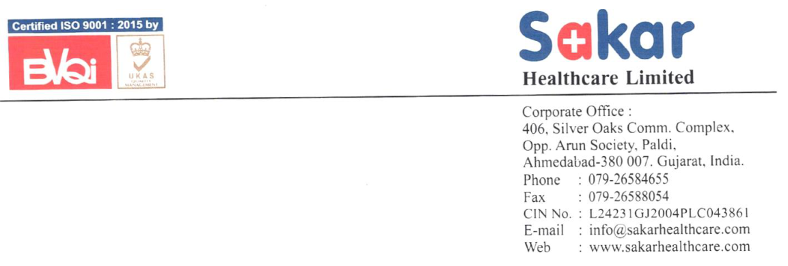

**[Image: AR_27786_SAKAR_2024_2025_A_4597943_28082025130003.pdf-0001-00.png (1153x390, 178.6KB)]**

###### **28****th** **August, 2025** 

To, **National Stock Exchange Limited** Exchange Plaza, C-1 Block-G Bandra Kundra Complex, Bandra (E), Mumbai – 400051 

###### **SYMBOL: SAKAR** 

Dear Sir; 

###### **Sub: Submission of Notice of 21****st** **Annual General Meeting and Annual Report 2024-25** 

Pursuant to Regulation 30 and 34(1) (a) of SEBI (LODR) Regulations, 2015, we are enclosing herewith: 

1. Notice of 21st Annual General Meeting of the members/shareholders of the Company. 

2. Annual Report 2024-25. 

Kindly acknowledge receipt of the same. 

Thanking you, 

Yours faithfully, 

###### **For SAKAR HEALTHCARE LIMITED** 

BHARATKUMAR Digitally signed by BHARATKUMAR SUKHLAL SONI SUKHLAL SONI Date: 2025.08.28 12:37:09 +05'30' 

**BHARAT S. SONI COMPANY SECRETARY & COMPLIANCE OFFICER** 

Encl: As above. 

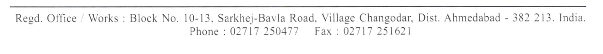

**[Image: AR_27786_SAKAR_2024_2025_A_4597943_28082025130003.pdf-0001-16.png (1248x113, 49.2KB)]**

###### Specializing for Impact. Scaling with Purpose. 

**[Image: AR_27786_SAKAR_2024_2025_A_4597943_28082025130003.pdf-0002-01.png (584x666, 377.8KB)]**

**[Image: AR_27786_SAKAR_2024_2025_A_4597943_28082025130003.pdf-0002-02.png (473x118, 119.0KB)]**

**[Image: AR_27786_SAKAR_2024_2025_A_4597943_28082025130003.pdf-0002-03.png (1091x526, 598.1KB)]**

**[Image: AR_27786_SAKAR_2024_2025_A_4597943_28082025130003.pdf-0003-00.png (290x421, 209.2KB)]**

<!-- Start of picture text -->
Healthcare Ltd. <!-- End of picture text -->

At **Sakar Healthcare** , our journey is charted by an attempt to do more than just bridge the gap between the needs of today and an understanding of what tomorrow will bring. With the theme "Elevating Value, Empowering Lives," we put in a nutshell the mere endeavor of striving to enhance health care in pursuit of creating value that resonates through each business dimension and positively touches all the lives it comes in contact with. 

**[Image: AR_27786_SAKAR_2024_2025_A_4597943_28082025130003.pdf-0003-02.png (346x518, 345.8KB)]**

**[Image: AR_27786_SAKAR_2024_2025_A_4597943_28082025130003.pdf-0003-03.png (722x482, 316.4KB)]**

<!-- Start of picture text -->
Elevating Value, <!-- End of picture text -->

**[Image: AR_27786_SAKAR_2024_2025_A_4597943_28082025130003.pdf-0003-04.png (634x99, 53.0KB)]**

<!-- Start of picture text -->
Elevating Value, <!-- End of picture text -->

**[Image: AR_27786_SAKAR_2024_2025_A_4597943_28082025130003.pdf-0003-05.png (291x435, 258.4KB)]**

#### Empowering Lives 

the platform of 'empowering lives.' �is pertains to access to medicines at affordable costs and leading in finding treatments for chronic and critical conditions to enhance the quality of life of millions around the world. 

###### **Elevating Value:** 

Innovation, quality, and strategic growth have been the hallmarks of our journey, through which we have consistently raised the bar of healthcare. We invest in cutting-edge technologies, expand our product portfolio, and optimize operations to ensure that our stakeholders receive value without parallel. �is culture of excellence shows in our strong financial performance, growing global presence, and the continuous pursuit of new opportunities. 

###### **A Future of Growth and Impact:** 

**[Image: AR_27786_SAKAR_2024_2025_A_4597943_28082025130003.pdf-0003-11.png (291x435, 245.7KB)]**

Our strategic direction moving forward is to "Elevate Value, Empower Lives". We have an even greater potential to positively impact global health while working with a vision of value that lasts and which has p r o t e c t e d a n d e m p o w e r e d communities. What we want to make sure of—through aligning our goals in business with the demands of our social responsibility—is that this growth proves to be a very impactful one, and that value created today empowers lives tomorrow. 

###### **Empowering Lives:** 

A re l e n t l e s s co m m i t m e n t t o continuously working and striving for the betterment of patient outcomes, to make a tangible difference in our communities, is at the core of our success. From our vantage view, every product developed or partnership forged with any initiative will be on 

Annual Report  |  FY **2024 - 25** 

**Healthcare Ltd.** 

#### Table of 

**[Image: AR_27786_SAKAR_2024_2025_A_4597943_28082025130003.pdf-0004-02.png (624x109, 21.7KB)]**

<!-- Start of picture text -->
CONTENT <!-- End of picture text -->

**[Image: AR_27786_SAKAR_2024_2025_A_4597943_28082025130003.pdf-0004-03.png (313x30, 8.1KB)]**

<!-- Start of picture text -->
COMPANY OVERVIEW <!-- End of picture text -->

**[Image: AR_27786_SAKAR_2024_2025_A_4597943_28082025130003.pdf-0004-04.png (359x30, 7.8KB)]**

<!-- Start of picture text -->
FINANCIAL STATEMENTS <!-- End of picture text -->

|Corporate  Information .....................................................1|
|---|
|Oncology  in I ndian|
|Pharmaceutical  landscape  .............................................2|
|Sakar  Healthcare:|
|Advancing  Pharmaceutical  Excellence  ......................3|
|Key  strengths  of  Sakar  Healthcare  ..............................4|
|Vision,  Mission  &  Values   ................................................5|
|Chairman  &  Managing  Director's|
|Visionary  Insights  ..........................................................6-7|

###### **Standalone** 

|Independent A uditors’  Report ....................................60|
|---|
|Balance  Sheet ...................................................................67|
|Statement  of  Proft  and  Loss .......................................68|
|Cash  Flow  Statement .....................................................69|
|Statement  of  Change  in  Equity ...................................71|
|Notes  to A ccounts ............................................................72|

###### **Consolidated** 

|Independent A uditors’  Report ..................................101|
|---|
|Balance  Sheet ................................................................107|
|Statement  of  Proft  and  Loss ....................................108|
|Cash  Flow  Statement ..................................................109|
|Statement  of  Change  in  Equity ................................111|
|Notes  to A ccounts .........................................................112|

**[Image: AR_27786_SAKAR_2024_2025_A_4597943_28082025130003.pdf-0004-10.png (382x30, 8.4KB)]**

<!-- Start of picture text -->
BUSINESS PERFORMANCE <!-- End of picture text -->

|Milestones ............................................................................8|
|---|
|Operational  Snapshots  . ..................................................9|
|Financial  Highlights  . .....................................................10|
|Operational  Excellence ..................................................11|
|Driving  Growth . ................................................................12|
|Strategic  Growth  Focus . ................................................13|
|�erapeutic  Excellence A cross|
|Categories  and  Dosage  Forms . ...................................14|
|State  of  the A rt  Centre  of  Excellence  ........................15|
|Strategic  Partnerships . ..................................................16|
|Achievements . . .................................................................17|

**[Image: AR_27786_SAKAR_2024_2025_A_4597943_28082025130003.pdf-0004-12.png (1137x726, 662.5KB)]**

<!-- Start of picture text -->
�erapeutic  Excellence A cross Categories  and  Dosage  Forms . ...................................14 State  of  the A rt  Centre  of  Excellence  ........................15 Strategic  Partnerships . ..................................................16 Achievements . . .................................................................17 PEOPLE AND SUSTAINABILITY Empowering  People . ......................................................18 Corporate  Social  Responsibility ..................................19 Sustainability . ..................................................................20 STATUTORY REPORTS Notice  .................................................................................21 Directors’  Report  Including  Corporate Governance  Report  and Secretarial A udit  Report ......................................................................34 Annual Report  |  FY  2024 - 25 <!-- End of picture text -->

**Healthcare Ltd.** 

#### Corporate 

**[Image: AR_27786_SAKAR_2024_2025_A_4597943_28082025130003.pdf-0005-02.png (912x111, 32.0KB)]**

<!-- Start of picture text -->
INFORMATION <!-- End of picture text -->

**[Image: AR_27786_SAKAR_2024_2025_A_4597943_28082025130003.pdf-0005-03.png (166x81, 4.7KB)]**

[CIN: L24231GJ2004PLC043861] 

**[Image: AR_27786_SAKAR_2024_2025_A_4597943_28082025130003.pdf-0005-05.png (326x28, 7.2KB)]**

<!-- Start of picture text -->
BOARD OF DIRECTORS <!-- End of picture text -->

**Mr. Sanjay S. Shah** Chairman & Managing Director **Mr. Aarsh S. Shah** Joint Managing Director **Ms. Rita S. Shah** Non-Executive Director **Mr. Sunil Marathe** Whole Time Director - Technical **Mr. Prashant C. Srivastav** Independent Director **Mr. Shailesh B. Patel** Independent Director **Mr. Hemendra C. Shah** Independent Director **Ms. Visalakshi Chandramouli** Non-Executive Director **Mr. Jignesh Parikh** Independent Director **Mrs. Khyati Shah** Independent Director **Ms. Megha Samdani** Independent Director **Ms. Reeya Kothari** Independent Director **Ms. Hiral Patel** Independent Director 

**[Image: AR_27786_SAKAR_2024_2025_A_4597943_28082025130003.pdf-0005-07.png (505x30, 10.0KB)]**

<!-- Start of picture text -->
REGISTERED OFFICE AND FACTORY <!-- End of picture text -->

Block No. 10/13, Village: Changodar, Sarkhej-Bavla Highway, Tal: Sanand, Dist: Ahmedabad - 382 213 

**[Image: AR_27786_SAKAR_2024_2025_A_4597943_28082025130003.pdf-0005-09.png (334x30, 6.9KB)]**

<!-- Start of picture text -->
STATUTORY AUDITORS <!-- End of picture text -->

**M/s. J.S. Shah & Co.** 

**M/s. J.S. Shah & Co.** Chartered Accountants, Ahmedabad. **SECRETARIAL AUDITORS M/s. Kashyap R Mehta & Associates** Company Secretaries, Ahmedabad. 

**[Image: AR_27786_SAKAR_2024_2025_A_4597943_28082025130003.pdf-0005-12.png (359x30, 7.7KB)]**

<!-- Start of picture text -->
SECRETARIAL AUDITORS <!-- End of picture text -->

**[Image: AR_27786_SAKAR_2024_2025_A_4597943_28082025130003.pdf-0005-13.png (649x30, 14.1KB)]**

<!-- Start of picture text -->
REGISTERED AND SHARE TRANSFER AGENTS <!-- End of picture text -->

MUFG Intime India Private Limited, 506-508, Amarnath Business Centre-1 (ABC-1), Besides Gala Business Centre, Near St. Xavier’s College Corner, Off C.G. Road, Ahmedabad - 380 006 Tel.: 079-26465179 Email : ahmedabad@in.mpms.mufg.com 

**[Image: AR_27786_SAKAR_2024_2025_A_4597943_28082025130003.pdf-0005-15.png (307x30, 6.8KB)]**

<!-- Start of picture text -->
MANAGEMENT TEAM <!-- End of picture text -->

**Mr. Dharmesh R. �aker Mr. Bharat S. Soni** 

Chief Finance Officer Company Secretary 

**[Image: AR_27786_SAKAR_2024_2025_A_4597943_28082025130003.pdf-0005-18.png (304x963, 81.9KB)]**

www.sakarhealthcare.com 

Annual Report  |  FY **2024 - 25** 

Page [ 1 ] 

**[Image: AR_27786_SAKAR_2024_2025_A_4597943_28082025130003.pdf-0006-00.png (1042x393, 811.9KB)]**

<!-- Start of picture text -->
Healthcare Ltd. <!-- End of picture text -->

# Oncology 

**[Image: AR_27786_SAKAR_2024_2025_A_4597943_28082025130003.pdf-0006-02.png (384x87, 10.6KB)]**

<!-- Start of picture text -->
in Indian <!-- End of picture text -->

**[Image: AR_27786_SAKAR_2024_2025_A_4597943_28082025130003.pdf-0006-03.png (806x78, 24.8KB)]**

<!-- Start of picture text -->
Pharmaceutical landscape <!-- End of picture text -->

�e oncology market in India is experiencing significant growth, with projections indicating a compound annual growth rate (CAGR) exceeding 10%. By 2030, the market is expecting to touch $10.6 billion, a substantial increase from $3.6 billion in 2022. �is growth is due to rising cancer incidence, increased awareness, and advancements in diagnostic technologies. 

###### **Key Drivers:** 

Rising Cancer Incidence: India faces a growing cancer burden, with an estimated 1.4 million new cases in 2020. �e burden has been projected to increase to over 1.5 million cases by current year. 

Increased Awareness: Growing awareness about cancer, early detection, and the use of advanced diagnostic technologies are contributing to market growth. 

Technological Advancements: �e development and adoption of innovative technologies like NGS (NextGeneration Sequencing), targeted therapies, and precision medicine are also driving the market. 

###### **Challenges:** 

High Treatment Costs: �e cost of cancer treatment, particularly in private hospitals, can be a significant barrier for many patients, leading to high out-ofpocket expenses and financial distress. 

Limited Access: Despite the growth, access to advanced cancer care and treatment remains unevenly distributed, with disparities based on location, socioeconomic status, and access to healthcare facilities. 

###### **Specific Segments:** 

Oncology Drugs: �e oncology drugs market is a major segment, with a projected value of $7.8 billion by 2030. 

Oncology NGS (Next-Generation Sequencing): �e NGS market, particularly for targeted and gene panel sequencing, is also experiencing rapid growth, with a CAGR of 18% from 2024 to 2030. 

Cancer Diagnostics: �e diagnostics market, including in-vitro diagnostics, is also expanding, with a focus on imaging, biomarkers, and biopsy techniques. 

###### **Government Initiatives:** 

Government initiatives to improve access to healthcare and promote early detection are crucial for addressing the cancer burden in India. 

Steps have been taken to build adequate infrastructure and improve accessibility of treatment across the country 

Annual Report  |  FY **2024 - 25** 

Page [ 2 ] 

**Healthcare Ltd.** 

#### **Sakar Healthcare** 

**[Image: AR_27786_SAKAR_2024_2025_A_4597943_28082025130003.pdf-0007-02.png (950x87, 28.3KB)]**

<!-- Start of picture text -->
Advancing Pharmaceutical <!-- End of picture text -->

**[Image: AR_27786_SAKAR_2024_2025_A_4597943_28082025130003.pdf-0007-03.png (388x68, 11.8KB)]**

<!-- Start of picture text -->
Excellence <!-- End of picture text -->

**[Image: AR_27786_SAKAR_2024_2025_A_4597943_28082025130003.pdf-0007-04.png (699x30, 16.0KB)]**

<!-- Start of picture text -->
CONTINUOUSLY EXPANDING GLOBAL FOOTPRINT <!-- End of picture text -->

**Sakar Healthcare** is a leading force in India's pharmaceutical sector, recognized for its vertically i n t e g ra t e d ca p a b i l i t i e s i n oncology manufacturing. Our advanced facilities are equipped t o p r o d u c e b o t h A c t i v e Pharmaceutical Ingredients (APIs) and finished dosage formulations, ensuring seamless quality control across the entire value chain. 

Driven by a commitment to innovation and sustainability, we have made significant investments in research and development. Our state-of-the-art laboratories, featuring technologies like flow chemistry, empower us to deliver cutting-edge, environmentally conscious solutions. 

A cornerstone of our operations is our oncology division. Operating within a highly regulated and fastgrowing global market, we have built a strong presence. Our oncology manufacturing unit holds both WHO GMP and EU GMP certifications—testament to our a d h e r e n c e t o s t r i n g e n t international quality standards. W e h a v e s u c c e s s f u l l y commercialized APIs, oral solid d o s a g e s , i n j e c t a b l e s , a n d numerous product development projects. 

In addition to oncology, Sakar Healthcare offers a broad portfolio of products across various therapeutic areas. Our four worldclass manufacturing plants support diverse dosage forms 

including oral liquids, tablets, injectables, and dry powder inhalers. With a strong export orientation, we reach customers in more than 60 countries through our global distribution network. 

Our continued success is grounded in unwavering quality, strict regulatory compliance, and customer-centric practices. Strategic collaborations with l e a d i n g p h a r m a c e u t i c a l companies have fueled our growth and innovation. Looking ahead, Sakar Healthcare remains focused on expanding its global footprint, pioneering new healthcare s o l u t i o n s , a n d d e l i v e r i n g exceptional value to partners and patients worldwide. 

Annual Report  |  FY **2024 - 25** 

Page [ 3 ] 

**Healthcare Ltd.** 

**[Image: AR_27786_SAKAR_2024_2025_A_4597943_28082025130003.pdf-0008-01.png (444x67, 11.5KB)]**

<!-- Start of picture text -->
Key strengths of <!-- End of picture text -->

### Sakar Healthcare 

**[Image: AR_27786_SAKAR_2024_2025_A_4597943_28082025130003.pdf-0008-03.png (191x192, 13.7KB)]**

**[Image: AR_27786_SAKAR_2024_2025_A_4597943_28082025130003.pdf-0008-04.png (354x32, 7.9KB)]**

<!-- Start of picture text -->
Vertically integrated oncology <!-- End of picture text -->

**[Image: AR_27786_SAKAR_2024_2025_A_4597943_28082025130003.pdf-0008-05.png (176x35, 3.4KB)]**

<!-- Start of picture text -->
manufacturing <!-- End of picture text -->

**[Image: AR_27786_SAKAR_2024_2025_A_4597943_28082025130003.pdf-0008-06.png (275x26, 6.0KB)]**

<!-- Start of picture text -->
Advanced research and <!-- End of picture text -->

**[Image: AR_27786_SAKAR_2024_2025_A_4597943_28082025130003.pdf-0008-07.png (292x35, 6.7KB)]**

<!-- Start of picture text -->
development capabilities <!-- End of picture text -->

**[Image: AR_27786_SAKAR_2024_2025_A_4597943_28082025130003.pdf-0008-08.png (168x232, 15.4KB)]**

**[Image: AR_27786_SAKAR_2024_2025_A_4597943_28082025130003.pdf-0008-09.png (297x35, 6.6KB)]**

<!-- Start of picture text -->
Diverse product portfolio <!-- End of picture text -->

**[Image: AR_27786_SAKAR_2024_2025_A_4597943_28082025130003.pdf-0008-10.png (147x232, 12.6KB)]**

**[Image: AR_27786_SAKAR_2024_2025_A_4597943_28082025130003.pdf-0008-11.png (32x38, 1.4KB)]**

**[Image: AR_27786_SAKAR_2024_2025_A_4597943_28082025130003.pdf-0008-12.png (316x32, 7.3KB)]**

<!-- Start of picture text -->
Strategic partnerships with <!-- End of picture text -->

**[Image: AR_27786_SAKAR_2024_2025_A_4597943_28082025130003.pdf-0008-13.png (409x34, 9.1KB)]**

<!-- Start of picture text -->
leading pharmaceutical companies <!-- End of picture text -->

**[Image: AR_27786_SAKAR_2024_2025_A_4597943_28082025130003.pdf-0008-14.png (103x100, 8.3KB)]**

**[Image: AR_27786_SAKAR_2024_2025_A_4597943_28082025130003.pdf-0008-15.png (8x9, 0.3KB)]**

**[Image: AR_27786_SAKAR_2024_2025_A_4597943_28082025130003.pdf-0008-16.png (8x9, 0.3KB)]**

**[Image: AR_27786_SAKAR_2024_2025_A_4597943_28082025130003.pdf-0008-17.png (10x7, 0.2KB)]**

**[Image: AR_27786_SAKAR_2024_2025_A_4597943_28082025130003.pdf-0008-18.png (10x7, 0.2KB)]**

**[Image: AR_27786_SAKAR_2024_2025_A_4597943_28082025130003.pdf-0008-19.png (76x51, 2.5KB)]**

**[Image: AR_27786_SAKAR_2024_2025_A_4597943_28082025130003.pdf-0008-20.png (351x32, 7.9KB)]**

<!-- Start of picture text -->
Strong regulatory compliance <!-- End of picture text -->

**[Image: AR_27786_SAKAR_2024_2025_A_4597943_28082025130003.pdf-0008-21.png (251x32, 5.7KB)]**

<!-- Start of picture text -->
(WHO GMP, EU GMP) <!-- End of picture text -->

**[Image: AR_27786_SAKAR_2024_2025_A_4597943_28082025130003.pdf-0008-22.png (168x233, 14.3KB)]**

**[Image: AR_27786_SAKAR_2024_2025_A_4597943_28082025130003.pdf-0008-23.png (213x32, 4.8KB)]**

<!-- Start of picture text -->
Wide global reach <!-- End of picture text -->

**[Image: AR_27786_SAKAR_2024_2025_A_4597943_28082025130003.pdf-0008-24.png (168x232, 11.1KB)]**

**[Image: AR_27786_SAKAR_2024_2025_A_4597943_28082025130003.pdf-0008-25.png (292x28, 5.9KB)]**

<!-- Start of picture text -->
Flexible business models <!-- End of picture text -->

Annual Report  |  FY **2024 - 25** 

Page [ 4 ] 

**Healthcare Ltd.** 

**[Image: AR_27786_SAKAR_2024_2025_A_4597943_28082025130003.pdf-0009-01.png (101x101, 4.0KB)]**

**[Image: AR_27786_SAKAR_2024_2025_A_4597943_28082025130003.pdf-0009-02.png (257x78, 8.4KB)]**

<!-- Start of picture text -->
Vision <!-- End of picture text -->

To become a global healthcare organization based on three pillars- people, partnership and performance; making lives healthy happy and more meaningful by providing world class healthcare solutions 

To strengthen our core competencies to become the preferred choice in existing partnerships and explore new market opportunities to expand range of products and services- respecting laws, protecting environment and benefiting mankind 

**[Image: AR_27786_SAKAR_2024_2025_A_4597943_28082025130003.pdf-0009-05.png (322x78, 10.4KB)]**

<!-- Start of picture text -->
Mission <!-- End of picture text -->

**[Image: AR_27786_SAKAR_2024_2025_A_4597943_28082025130003.pdf-0009-06.png (118x111, 4.3KB)]**

**[Image: AR_27786_SAKAR_2024_2025_A_4597943_28082025130003.pdf-0009-07.png (282x80, 9.9KB)]**

<!-- Start of picture text -->
Values <!-- End of picture text -->

Ÿ Committed Team Ÿ Loyal to Partners Ÿ Innovative approach Ÿ Focused on results 

Annual Report  |  FY **2024 - 25** 

Page [ 5 ] 

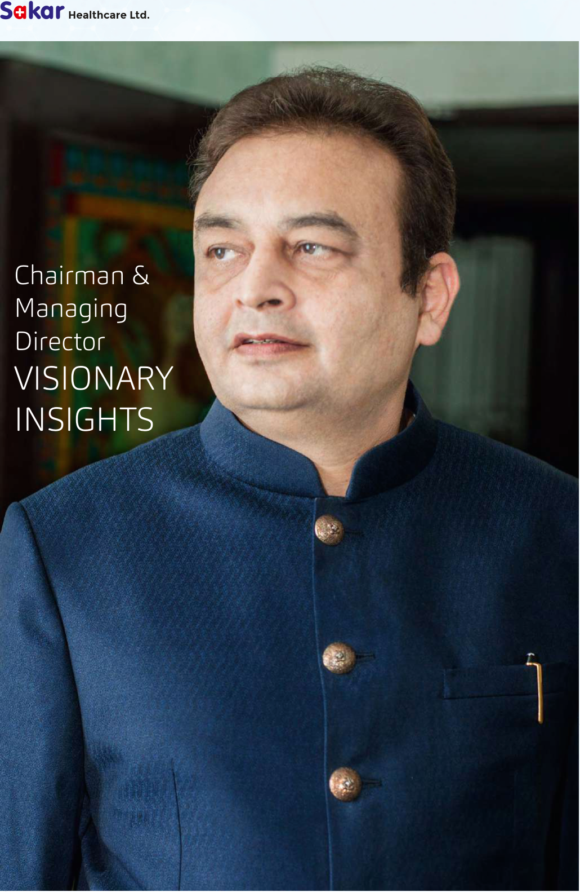

**[Image: AR_27786_SAKAR_2024_2025_A_4597943_28082025130003.pdf-0010-00.png (1030x1582, 2374.1KB)]**

<!-- Start of picture text -->
Healthcare Ltd. Chairman & Managing Director VISIONARY INSIGHTS <!-- End of picture text -->

Annual Report  |  FY **2024 - 25** 

Page [ 6 ] 

**Healthcare Ltd.** 

### ~~”~~ 

###### Annual Message to Shareholders 

**[Image: AR_27786_SAKAR_2024_2025_A_4597943_28082025130003.pdf-0011-03.png (736x43, 14.1KB)]**

<!-- Start of picture text -->
By Sanjay Shah, Chairman & Managing Director <!-- End of picture text -->

###### **Dear Shareholders,** 

A journey of a thousand miles begins with a single step. �is timeless proverb perfectly encapsulates the path Sakar Healthcare has taken—from humble beginnings to becoming a leading pharmaceutical company in from Gujarat. It has been a journey marked by challenges, victories, and our relentless commitment to excellence with your continues support and encouragement. 

As we step into the future under the theme **“Elevating Value, Empowering Lives”** we take a moment to reflect on how these guiding principles have influenced our strategies and achievements. Much like the athletes who strive for glory on the Olympic stage, we too draw strength from that same spirit of relentless pursuit, resilience, and excellence. Our team's hard work and never-give-up attitude have laid a solid foundation for the long-term success we are now poised to achieve—strengthened by your unwavering support. 

###### **Financial Performance & Growth** 

Sakar Healthcare has delivered strong and consistent financial performance, achieving a CAGR of 17% in revenue from FY21 to FY25. Our revenue for FY25 stood at INR 1,789 million, with an EBITDA margin of ~29%. �ese results not only reflect our operational efficiency but also provide the momentum to invest further in growth-oriented initiatives that create exceptional value for our shareholders. 

###### **Strategic Focus: Oncology Leadership** 

A key pillar of our growth strategy is our bold entry into the oncology segment. �e launch of our state-of-the-art oncology manufacturing facility, along with a robust and innovative R&D pipeline, places Sakar Healthcare at the forefront 

of this critical therapeutic area. Recent milestones—the grant of a patent for IMATINIB and the **EU GMP certification for our oncology unit** —underscore our commitment to quality, compliance, and innovation. We look further with next step of approvals of Marketing Authorizations from EU in few months' time. 

We remain dedicated to excellence in operations and scientific innovation. Our progress in developing and delivering cytotoxic oral liquids, HME-enhanced solubility anti-cancer products, and liposomal formulations stands as proof of our ongoing efforts to improve patient compliance outcomes across the globe. 

###### **Global Expansion & Future Outlook** 

Geographically, we continue to expand our global footprint across key regulated markets, fuel by a strong pipeline and new business opportunities. Our relationships with partners and customers—built on trust, reliability, and performance—remain central to our sustained growth. 

Looking ahead, Sakar Healthcare is wellpositioned to capitalize on emerging opportunities. With continued investment in innovation, expansion, and operational excellence, we are confident in our ability to deliver long-term value to shareholders, improve patient lives, and strengthen our impact on the communities we serve. 

�ank you for your continued trust and boosting. Together, let us move forward with more of focus—elevating value and empowering lives. 

Warm regards, **Sanjay Shah** Chairman & Managing Director Sakar Healthcare Ltd. 

Annual Report  |  FY **2024 - 25** 

Page [ 7 ] 

**Healthcare Ltd.** 

**[Image: AR_27786_SAKAR_2024_2025_A_4597943_28082025130003.pdf-0012-01.png (142x51, 5.9KB)]**

<!-- Start of picture text -->
2004 <!-- End of picture text -->

Incorporated as Sakar Healthcare Pvt. Ltd. Operations begun as a contract manufacturer. 

**[Image: AR_27786_SAKAR_2024_2025_A_4597943_28082025130003.pdf-0012-03.png (140x51, 4.4KB)]**

<!-- Start of picture text -->
2020 <!-- End of picture text -->

EU GMP for SVP unit — further fortifying Sakar's commitment to global quality standards. 

**[Image: AR_27786_SAKAR_2024_2025_A_4597943_28082025130003.pdf-0012-05.png (141x51, 3.5KB)]**

<!-- Start of picture text -->
2021 <!-- End of picture text -->

Oncology manufacturing unit, Bavla, Gujarat—strategic shift towards focused specialization. 

**[Image: AR_27786_SAKAR_2024_2025_A_4597943_28082025130003.pdf-0012-07.png (140x51, 4.7KB)]**

<!-- Start of picture text -->
2005 <!-- End of picture text -->

Oral liquid products launched. ISO 9001 certification (a quality commitment) accredited and acquired. 

**[Image: AR_27786_SAKAR_2024_2025_A_4597943_28082025130003.pdf-0012-09.png (138x51, 4.1KB)]**

<!-- Start of picture text -->
2019 <!-- End of picture text -->

Uplisted to the main board of National Stock Exchange, Mumbai. 

**[Image: AR_27786_SAKAR_2024_2025_A_4597943_28082025130003.pdf-0012-11.png (141x51, 4.5KB)]**

<!-- Start of picture text -->
2022 <!-- End of picture text -->

Commercialization of oncology products started after getting WHO GMP certification. 

###### <mark>Milestones in our</mark> 

**[Image: AR_27786_SAKAR_2024_2025_A_4597943_28082025130003.pdf-0012-14.png (1043x111, 36.3KB)]**

<!-- Start of picture text -->
GROWTH STORY <!-- End of picture text -->

**[Image: AR_27786_SAKAR_2024_2025_A_4597943_28082025130003.pdf-0012-15.png (140x51, 5.1KB)]**

<!-- Start of picture text -->
2008 <!-- End of picture text -->

**[Image: AR_27786_SAKAR_2024_2025_A_4597943_28082025130003.pdf-0012-16.png (140x51, 3.9KB)]**

<!-- Start of picture text -->
2017 <!-- End of picture text -->

Oral solid dosage forms (antibiotics) and Entered into the lyophilized injections small volume parenteral injections added segment Expanding and diversifying to the product pipeline. its product basket. Exports initiated—Sakar's global journey begins. 

**[Image: AR_27786_SAKAR_2024_2025_A_4597943_28082025130003.pdf-0012-18.png (143x51, 4.3KB)]**

<!-- Start of picture text -->
2024 <!-- End of picture text -->

EU GMP approval to oncology FDF unit, confirming Sakar's leadership position in oncology globally 

**[Image: AR_27786_SAKAR_2024_2025_A_4597943_28082025130003.pdf-0012-20.png (142x51, 4.5KB)]**

<!-- Start of picture text -->
2012 <!-- End of picture text -->

**[Image: AR_27786_SAKAR_2024_2025_A_4597943_28082025130003.pdf-0012-21.png (140x51, 4.6KB)]**

<!-- Start of picture text -->
2016 <!-- End of picture text -->

Dry powder injections Listed on NSE SME Emerge introduced into the A step-up in the growth product portfolio. trajectory of the company. 

**[Image: AR_27786_SAKAR_2024_2025_A_4597943_28082025130003.pdf-0012-23.png (141x51, 4.0KB)]**

<!-- Start of picture text -->
2025 <!-- End of picture text -->

Grant of first Marketing Authorisation (MA) in the EU – a new beginning to supplying oncology products 

Annual Report  |  FY **2024 - 25** 

Page [ 8 ] 

**Healthcare Ltd.** 

**[Image: AR_27786_SAKAR_2024_2025_A_4597943_28082025130003.pdf-0013-01.png (538x222, 41.3KB)]**

<!-- Start of picture text -->
Operational Snapshots <!-- End of picture text -->

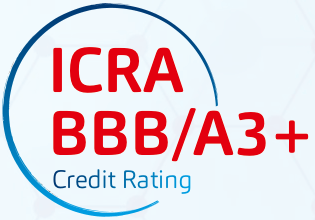

**[Image: AR_27786_SAKAR_2024_2025_A_4597943_28082025130003.pdf-0013-02.png (315x220, 25.9KB)]**

<!-- Start of picture text -->
ICRA BBB/A3+ Credit Rating <!-- End of picture text -->

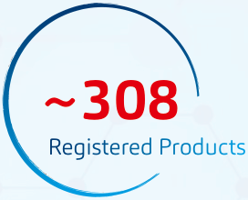

**[Image: AR_27786_SAKAR_2024_2025_A_4597943_28082025130003.pdf-0013-03.png (272x220, 19.8KB)]**

<!-- Start of picture text -->
~308 Registered Products <!-- End of picture text -->

**[Image: AR_27786_SAKAR_2024_2025_A_4597943_28082025130003.pdf-0013-04.png (219x219, 19.8KB)]**

<!-- Start of picture text -->
~342 Workforce <!-- End of picture text -->

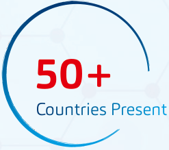

**[Image: AR_27786_SAKAR_2024_2025_A_4597943_28082025130003.pdf-0013-05.png (247x219, 19.0KB)]**

<!-- Start of picture text -->
50+ Countries Present <!-- End of picture text -->

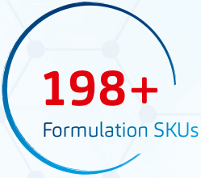

**[Image: AR_27786_SAKAR_2024_2025_A_4597943_28082025130003.pdf-0013-06.png (249x220, 22.7KB)]**

<!-- Start of picture text -->
198+ Formulation SKUs <!-- End of picture text -->

**[Image: AR_27786_SAKAR_2024_2025_A_4597943_28082025130003.pdf-0013-07.png (251x220, 20.4KB)]**

<!-- Start of picture text -->
81+ Overseas Partners <!-- End of picture text -->

**[Image: AR_27786_SAKAR_2024_2025_A_4597943_28082025130003.pdf-0013-08.png (296x219, 25.0KB)]**

<!-- Start of picture text -->
24+ �erapeutic Segments <!-- End of picture text -->

**[Image: AR_27786_SAKAR_2024_2025_A_4597943_28082025130003.pdf-0013-09.png (261x209, 24.7KB)]**

<!-- Start of picture text -->
52.86% Promoter Holding (as of 31 Mar, 25) <!-- End of picture text -->

**[Image: AR_27786_SAKAR_2024_2025_A_4597943_28082025130003.pdf-0013-10.png (399x1509, 1164.9KB)]**

Annual Report  |  FY **2024 - 25** 

Page [ 9 ] 

**[Image: AR_27786_SAKAR_2024_2025_A_4597943_28082025130003.pdf-0014-00.png (292x610, 319.6KB)]**

<!-- Start of picture text -->
Healthcare Ltd. <!-- End of picture text -->

**[Image: AR_27786_SAKAR_2024_2025_A_4597943_28082025130003.pdf-0014-01.png (292x538, 282.3KB)]**

**[Image: AR_27786_SAKAR_2024_2025_A_4597943_28082025130003.pdf-0014-02.png (291x573, 288.1KB)]**

**Sakar Healthcare** has demonstrated superior financial performance, marked by a robust CAGR of 17% in revenue from FY21 to FY25. In FY25, revenue stood at INR 1,789 Mn with an EBITDA margin of ~29%. �is financial growth has been driven by a combination of own brand exports and CDMO services. �e company's attractive working capital cycle, maintained through a policy of organized payment collection from overseas customers, has further strengthened its financial position. Consequently, net profit has increased by 21% CAGR to INR 175 million. 

###### Sakar Healthcare 

**[Image: AR_27786_SAKAR_2024_2025_A_4597943_28082025130003.pdf-0014-05.png (749x101, 22.2KB)]**

<!-- Start of picture text -->
Financial and <!-- End of picture text -->

**[Image: AR_27786_SAKAR_2024_2025_A_4597943_28082025130003.pdf-0014-06.png (634x130, 24.8KB)]**

<!-- Start of picture text -->
Operational <!-- End of picture text -->

###### Performance at a Glance 

A strong promoter holding of 52.86% underscores the management's commitment to the company's longterm success. 

to over 81 overseas partners, offering a diverse product portfolio of 198+ formulations across 24 therapeutic segments. �is extensive product range has translated into a significant market presence with approximately 308 registered products. 

Backed by a credit rating of ICRABB/A3+, the company has solidified its position in the market. With a workforce of over 342. Sakar has successfully expanded its reach 

###### **Key Financial Highlights:** 

**[Image: AR_27786_SAKAR_2024_2025_A_4597943_28082025130003.pdf-0014-12.png (261x259, 94.5KB)]**

|**Financial Measure**|**Result**|
|---|---|
|Revenue CAGR|17%|
|Revenue (Current FY)|INR 1,789 Mn|
|EBITDA Margin|29%|
|EBITDA CAGR|21%|
|PAT Margin|10%|
|PAT CAGR|13%|

�ese figures collectively reflect Sakar Healthcare's strong financial performance and its potential for sustained growth. 

Annual Report  |  FY **2024 - 25** 

Page [ 10 ] 

**Healthcare Ltd.** 

###### Operational Excellence 

**[Image: AR_27786_SAKAR_2024_2025_A_4597943_28082025130003.pdf-0015-02.png (1038x99, 31.1KB)]**

<!-- Start of picture text -->
�e Engine of Our Growth <!-- End of picture text -->

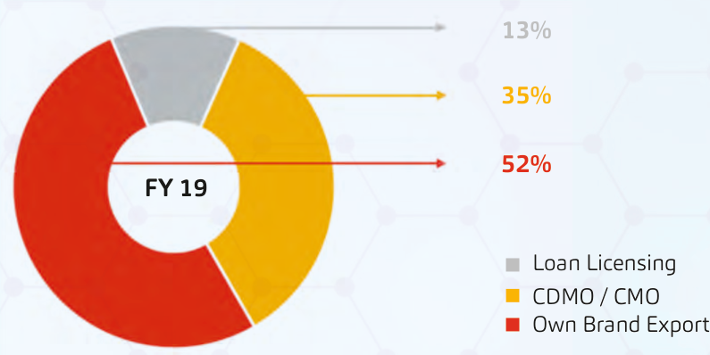

**[Image: AR_27786_SAKAR_2024_2025_A_4597943_28082025130003.pdf-0015-03.png (795x398, 162.3KB)]**

<!-- Start of picture text -->
13% 35% 52% FY 19 Loan Licensing CDMO / CMO Own Brand Export <!-- End of picture text -->

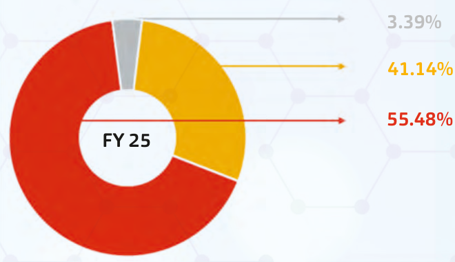

**[Image: AR_27786_SAKAR_2024_2025_A_4597943_28082025130003.pdf-0015-04.png (660x380, 147.0KB)]**

<!-- Start of picture text -->
3.39% 41.14% 55.48% FY 25 <!-- End of picture text -->

**[Image: AR_27786_SAKAR_2024_2025_A_4597943_28082025130003.pdf-0015-05.png (853x47, 20.7KB)]**

<!-- Start of picture text -->
BUSINESS VERTICAL CONTRIBUTION <!-- End of picture text -->

###### **CDMO Services** 

Sakar Healthcare provides Contract Development and Manufacturing Organization (CDMO) services to leading multinational pharmaceutical companies in India. Our offerings encompass a comprehensive range of services, from product development to largescale manufacturing. 

###### **Loan Licensing** 

Sakar Healthcare undertakes necessary conversion and testing of the product into its finished 

formulation. Our loan licensing services adhere to stringent quality standards and regulatory requirements. 

###### **Own Brand Export** 

Sakar Healthcare exports its own branded formulations to over 53 countries across branded and generic markets. Our global presence extends to regions including APAC, Latin America, East and French-West Africa, CIS, and Europe covering +60 countries. 

Annual Report  |  FY **2024 - 25** 

Page [ 11 ] 

**Healthcare Ltd.** 

## Driving Growth 

**[Image: AR_27786_SAKAR_2024_2025_A_4597943_28082025130003.pdf-0016-02.png (728x78, 55.7KB)]**

<!-- Start of picture text -->
a Strategic Positioning <!-- End of picture text -->

**[Image: AR_27786_SAKAR_2024_2025_A_4597943_28082025130003.pdf-0016-03.png (461x80, 28.7KB)]**

<!-- Start of picture text -->
with Oncology <!-- End of picture text -->

**Sakar** is strategically positioned to advance in the oncology domain through a diverse set of business models. �e company has made significant strides in Research & Development, manufacturing, and global partnerships, aligning with its long-term growth and expansion plans. 

###### **Research & Development** 

Sakar's R&D unit is equipped with state-of-the-art infrastructure and is actively engaged in the in-house development of anti-cancer products. �ese initiatives are designed to support future scalability and global expansion. �e scientific team is also involved in the co-development of selected patent non-infringing oncology formulations in collaboration with European partners, including from Greece and Sweden. Several ongoing projects have the potential to result in successful technology transfers in the near future. 

###### **CDMO/CMO Services** 

Sakar operates EU-GMP approved manufacturing facilities for oral and injectable oncology formulations. �e facilities have successfully executed multiple technology transfers for leading Indian multinational companies, that includes Zydus Lifesciences, Glenmark Pharmaceuticals, Intas Pharmaceuticals, and Emcure Pharmaceuticals. �ese partnerships focus on supplying oncology products for both domestic markets and regulated international markets such as the EU, UK, and Canada. 

###### **Business Development** 

An aggressive and well-organized business 

development strategy has resulted in collaborations with over 40 international partners, with half located in the UK and EU. Sakar is expanding its reach in Africa, Latin America, MENA and Asia-Pacific through varied partnership models including out-licensing, product supply agreements, distribution arrangements, and profit-sharing deals. 

To support this growth, the company has developed 32 eCTD dossiers aligned with region-specific regulatory requirements. Over 200 dossiers have been shared with partners globally, with more than 30 already submitted to regional regulatory authorities. All dossiers are supported by bioequivalence studies where necessary, and reference products are procured from the EU to ensure compliance and quality. 

In addition, Sakar supports several domestic partners by manufacturing their branded oncology generics at its facility. Currently, over 40 international prospects are in active discussions with Sakar to establish product supply partnerships. 

###### **Product Portfolio** 

Sakar has developed 52 oncology products in-house, spanning oral solids (tablets, capsules) and injectable formats, including liquids, lyophilized, and complex injections. �e company is also ready to launch 12 oncology oral liquid products, which can be scaled based on specific market requirements. 

�ere remains strong demand for value-added generics in oncology, and Sakar continues to expand its portfolio strategically to meet evolving market needs. 

Annual Report  |  FY **2024 - 25** 

Page [ 12 ] 

**Healthcare Ltd.** 

##### Sakar Healthcare 

**[Image: AR_27786_SAKAR_2024_2025_A_4597943_28082025130003.pdf-0017-02.png (1037x109, 36.9KB)]**

<!-- Start of picture text -->
Strategic Growth Focus <!-- End of picture text -->

**Sakar Healthcare** is committed to advancing global healthcare by expanding its geographic footprint and diversifying its product portfolio. Our strategic priorities of Expanding the Horizons include: 

- 

###### **Strategic Partnerships** 

      - Exploring joint ventures and collaborations that leverage the complementary strengths of partner organizations, enabling entry into new markets. 

- **Product Expansion:** 

   - Scaling up commercialization of lyophilized products across key markets to serve a broader patient population. 

      - **Business Development:** 

         - Implementing a robust business development strategy to identify and acquire high-potential products and technologies. 

- **Market Entry:** 

   - Targeting high-growth segments and securing regulatory approvals to extend our global presence. 

By executing these initiatives, Sakar aims to reinforce our market position, deliver differentiated value to shareholders, and contribute meaningfully to global healthcare outcomes. 

Annual Report  |  FY **2024 - 25** 

Page [ 13 ] 

**Healthcare Ltd.** 

##### �erapeutic Excellence Across 

**[Image: AR_27786_SAKAR_2024_2025_A_4597943_28082025130003.pdf-0018-02.png (1034x87, 32.5KB)]**

<!-- Start of picture text -->
Categories and Dosage Forms <!-- End of picture text -->

Sakar Healthcare is a dynamic pharmaceutical manufacturer that provides both Rx and Gx products in domestic and international markets. �e comprehensive product portfolio ensures flexibility in business to our clients and overseas partners 

1. Anti-infective 1. Anticoagulant 2. Analgesics 2. Anaesthetic 3. Anti-histamine 3. Bronchodilator 4. Anti-helminthic 4. Proton pump inhibitor (PPI) 5. Anti-malarial 5. Adrenergic 6. Antibacterial 6. Sedative 7. Vitamins 7. Anti-inflammatory 8. Anti-fungal 8. Anti-emetic 9. Diuretics 9. Anticonvulsants 10. Oxytocics 10. Antipsychotic 11. Antacid 11. Antidepressants 12. Laxative 12. **Anti-cancer** 

###### **DOSAGES** 

**[Image: AR_27786_SAKAR_2024_2025_A_4597943_28082025130003.pdf-0018-06.png (786x9, 1.1KB)]**

**[Image: AR_27786_SAKAR_2024_2025_A_4597943_28082025130003.pdf-0018-07.png (5x7, 0.2KB)]**

**[Image: AR_27786_SAKAR_2024_2025_A_4597943_28082025130003.pdf-0018-08.png (194x32, 4.5KB)]**

<!-- Start of picture text -->
ORAL LIQUIDS <!-- End of picture text -->

**[Image: AR_27786_SAKAR_2024_2025_A_4597943_28082025130003.pdf-0018-09.png (6x7, 0.2KB)]**

**[Image: AR_27786_SAKAR_2024_2025_A_4597943_28082025130003.pdf-0018-10.png (47x53, 2.2KB)]**

**[Image: AR_27786_SAKAR_2024_2025_A_4597943_28082025130003.pdf-0018-11.png (267x26, 5.4KB)]**

<!-- Start of picture text -->
ANTIBIOTIC SOLIDS <!-- End of picture text -->

**[Image: AR_27786_SAKAR_2024_2025_A_4597943_28082025130003.pdf-0018-12.png (395x36, 7.0KB)]**

<!-- Start of picture text -->
(Tablets, Capsules, Dry Syrups) <!-- End of picture text -->

**[Image: AR_27786_SAKAR_2024_2025_A_4597943_28082025130003.pdf-0018-13.png (7x11, 0.2KB)]**

**[Image: AR_27786_SAKAR_2024_2025_A_4597943_28082025130003.pdf-0018-14.png (10x8, 0.3KB)]**

**[Image: AR_27786_SAKAR_2024_2025_A_4597943_28082025130003.pdf-0018-15.png (352x26, 8.2KB)]**

<!-- Start of picture text -->
ANTIBIOTIC DRY POWDER <!-- End of picture text -->

**[Image: AR_27786_SAKAR_2024_2025_A_4597943_28082025130003.pdf-0018-16.png (159x30, 3.8KB)]**

<!-- Start of picture text -->
INJECTIONS <!-- End of picture text -->

**[Image: AR_27786_SAKAR_2024_2025_A_4597943_28082025130003.pdf-0018-17.png (8x11, 0.2KB)]**

**[Image: AR_27786_SAKAR_2024_2025_A_4597943_28082025130003.pdf-0018-18.png (9x8, 0.2KB)]**

**[Image: AR_27786_SAKAR_2024_2025_A_4597943_28082025130003.pdf-0018-19.png (422x26, 7.9KB)]**

<!-- Start of picture text -->
SMALL VOLUME PARENTERALS <!-- End of picture text -->

**[Image: AR_27786_SAKAR_2024_2025_A_4597943_28082025130003.pdf-0018-20.png (406x37, 8.0KB)]**

<!-- Start of picture text -->
(Liquid /  Lyophilised Injections) <!-- End of picture text -->

**[Image: AR_27786_SAKAR_2024_2025_A_4597943_28082025130003.pdf-0018-21.png (7x9, 0.2KB)]**

**[Image: AR_27786_SAKAR_2024_2025_A_4597943_28082025130003.pdf-0018-22.png (10x9, 0.3KB)]**

**[Image: AR_27786_SAKAR_2024_2025_A_4597943_28082025130003.pdf-0018-23.png (263x33, 6.1KB)]**

<!-- Start of picture text -->
Cytotoxic Injections <!-- End of picture text -->

**[Image: AR_27786_SAKAR_2024_2025_A_4597943_28082025130003.pdf-0018-24.png (269x37, 5.6KB)]**

<!-- Start of picture text -->
(Liquid / Lyophilised) <!-- End of picture text -->

**[Image: AR_27786_SAKAR_2024_2025_A_4597943_28082025130003.pdf-0018-25.png (8x9, 0.2KB)]**

**[Image: AR_27786_SAKAR_2024_2025_A_4597943_28082025130003.pdf-0018-26.png (9x9, 0.2KB)]**

**[Image: AR_27786_SAKAR_2024_2025_A_4597943_28082025130003.pdf-0018-27.png (277x34, 5.7KB)]**

<!-- Start of picture text -->
Cytotoxic Oral Solids <!-- End of picture text -->

**[Image: AR_27786_SAKAR_2024_2025_A_4597943_28082025130003.pdf-0018-28.png (251x37, 5.3KB)]**

<!-- Start of picture text -->
(Tablets / Capsules) <!-- End of picture text -->

Annual Report  |  FY **2024 - 25** 

Page [ 14 ] 

**Healthcare Ltd.** 

#### State of the art - Integrated Oncology Facility 

**[Image: AR_27786_SAKAR_2024_2025_A_4597943_28082025130003.pdf-0019-02.png (1030x92, 30.0KB)]**

<!-- Start of picture text -->
A centre of Excellence <!-- End of picture text -->

Sakar Healthcare's Oncology division is based in a 39,121 sq. meters area within the state-of-the-art facility built in adherence to the best quality and safety standards. Our integrated campus, fully equipped with state-of-the-art technology and infrastructure, enables us to stay at the forefront in the sphere of cancer treatment through continuous innovation. 

adherence to the highest standards in terms of quality and safety for the products. 

###### **Strong Infrastructure for Sustainability** 

Additionally, it is supported by world-class Eurovent certified utilities, including a zero-liquid discharge effluent treatment plant, which has a minimum effect on the environment. Also, invariation of solar panels underlines our commitment to sustainability. 

###### **Excellence in Research and Development** 

Equipped with investments in advanced instruments such as flow chemistry equipments, fume hoods, biosafety cabinets, our scientists can carry out complicated research and come up with drug development that are worthy to patient treatment and compliance. 

###### **High-Potency API Manufacturing** 

�e facility contains an independent unit with glass line reactors and special equipment to handle highly potent compounds for the manufacture of APIs. Having an annual capacity of 9,600 kgs, this unit further solidifies our comprehensive oncology portfolio. 

###### **Next-Generation Formulation and Manufacturing Capabilities** 

We possess formulation capabilities across both oral solid dosage forms and sterile injectables in oncology. Containment systems, state-of-the-art packaging lines, and lyophilization technology guarantee 

Equipped with state-of-the-art technology, highly trained personnel, and stringent quality standards, Sakar Healthcare's oncology facility is fully equipped to develop innovative and effective cancer treatments. 

###### **Key Equipment:** 

- Vapourtec R Series System 

- De-Dietrich Glass Line Reactors 

- GEA Containment Line 

- Glatt Autocoater 

- Sensum Inspection Machines 

- Tofflon Lyophilizer 

- Kevin Roll Compactor 

- IMA Bulk Packaging Line 

�ese well-supported infrastructures leverage us in developing and manufacturing high-standard oncology products to meet the unmet needs of patients. 

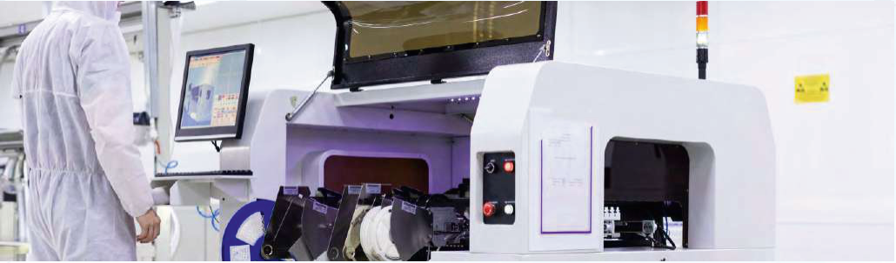

**[Image: AR_27786_SAKAR_2024_2025_A_4597943_28082025130003.pdf-0019-24.png (1030x303, 434.2KB)]**

Annual Report  |  FY **2024 - 25** 

Page [ 15 ] 

**Healthcare Ltd.** 

###### Strategic Partnerships 

**[Image: AR_27786_SAKAR_2024_2025_A_4597943_28082025130003.pdf-0020-02.png (926x105, 30.5KB)]**

<!-- Start of picture text -->
Driving Global Impact <!-- End of picture text -->

**[Image: AR_27786_SAKAR_2024_2025_A_4597943_28082025130003.pdf-0020-03.png (1031x415, 663.9KB)]**

At Sakar Healthcare, we are proud of our robust network of national and international partners who share our vision for delivering high-quality, accessible healthcare solutions. �ese strategic alliances empower us to harness complementary strengths, expand our global footprint, and continually enhance our product portfolio. 

Our collaborations with leading pharmaceutical companies and trusted distributors play a vital role in our continued success. �rough these partnerships, we bring innovative, effective, and reliable healthcare products to patients across the world—improving lives and setting new standards in healthcare delivery. 

**[Image: AR_27786_SAKAR_2024_2025_A_4597943_28082025130003.pdf-0020-06.png (101x65, 9.6KB)]**

**[Image: AR_27786_SAKAR_2024_2025_A_4597943_28082025130003.pdf-0020-07.png (250x20, 3.2KB)]**

**[Image: AR_27786_SAKAR_2024_2025_A_4597943_28082025130003.pdf-0020-08.png (251x22, 3.9KB)]**

**[Image: AR_27786_SAKAR_2024_2025_A_4597943_28082025130003.pdf-0020-09.png (253x22, 3.6KB)]**

**[Image: AR_27786_SAKAR_2024_2025_A_4597943_28082025130003.pdf-0020-10.png (253x22, 3.2KB)]**

**[Image: AR_27786_SAKAR_2024_2025_A_4597943_28082025130003.pdf-0020-11.png (169x70, 5.8KB)]**

**[Image: AR_27786_SAKAR_2024_2025_A_4597943_28082025130003.pdf-0020-12.png (253x24, 4.0KB)]**

**[Image: AR_27786_SAKAR_2024_2025_A_4597943_28082025130003.pdf-0020-13.png (253x22, 2.5KB)]**

**[Image: AR_27786_SAKAR_2024_2025_A_4597943_28082025130003.pdf-0020-14.png (253x22, 1.9KB)]**

**[Image: AR_27786_SAKAR_2024_2025_A_4597943_28082025130003.pdf-0020-15.png (253x21, 3.3KB)]**

**[Image: AR_27786_SAKAR_2024_2025_A_4597943_28082025130003.pdf-0020-16.png (251x24, 3.4KB)]**

**[Image: AR_27786_SAKAR_2024_2025_A_4597943_28082025130003.pdf-0020-17.png (251x22, 3.4KB)]**

**[Image: AR_27786_SAKAR_2024_2025_A_4597943_28082025130003.pdf-0020-18.png (146x78, 8.2KB)]**

**[Image: AR_27786_SAKAR_2024_2025_A_4597943_28082025130003.pdf-0020-19.png (251x22, 2.1KB)]**

**[Image: AR_27786_SAKAR_2024_2025_A_4597943_28082025130003.pdf-0020-20.png (251x21, 2.5KB)]**

**[Image: AR_27786_SAKAR_2024_2025_A_4597943_28082025130003.pdf-0020-21.png (253x24, 2.5KB)]**

**[Image: AR_27786_SAKAR_2024_2025_A_4597943_28082025130003.pdf-0020-22.png (253x24, 3.7KB)]**

**[Image: AR_27786_SAKAR_2024_2025_A_4597943_28082025130003.pdf-0020-23.png (91x69, 3.4KB)]**

**[Image: AR_27786_SAKAR_2024_2025_A_4597943_28082025130003.pdf-0020-24.png (76x74, 2.7KB)]**

**[Image: AR_27786_SAKAR_2024_2025_A_4597943_28082025130003.pdf-0020-25.png (253x22, 1.7KB)]**

**[Image: AR_27786_SAKAR_2024_2025_A_4597943_28082025130003.pdf-0020-26.png (253x22, 4.7KB)]**

**[Image: AR_27786_SAKAR_2024_2025_A_4597943_28082025130003.pdf-0020-27.png (118x66, 3.6KB)]**

**[Image: AR_27786_SAKAR_2024_2025_A_4597943_28082025130003.pdf-0020-28.png (510x22, 6.1KB)]**

**[Image: AR_27786_SAKAR_2024_2025_A_4597943_28082025130003.pdf-0020-29.png (153x73, 3.5KB)]**

**[Image: AR_27786_SAKAR_2024_2025_A_4597943_28082025130003.pdf-0020-30.png (136x66, 14.4KB)]**

**[Image: AR_27786_SAKAR_2024_2025_A_4597943_28082025130003.pdf-0020-31.png (510x21, 7.8KB)]**

�ese partnerships are built on a foundation of shared values, mutual respect, and a commitment to excellence. We believe that by working together, we can create a healthier future for all. 

Annual Report  |  FY **2024 - 25** 

Page [ 16 ] 

**Healthcare Ltd.** 

###### Achievements 

**[Image: AR_27786_SAKAR_2024_2025_A_4597943_28082025130003.pdf-0021-02.png (1024x82, 30.4KB)]**

<!-- Start of picture text -->
a Chronicle of Innovation <!-- End of picture text -->

**[Image: AR_27786_SAKAR_2024_2025_A_4597943_28082025130003.pdf-0021-03.png (538x101, 17.7KB)]**

<!-- Start of picture text -->
and Progress <!-- End of picture text -->

**[Image: AR_27786_SAKAR_2024_2025_A_4597943_28082025130003.pdf-0021-04.png (128x260, 16.9KB)]**

**[Image: AR_27786_SAKAR_2024_2025_A_4597943_28082025130003.pdf-0021-05.png (126x260, 15.3KB)]**

###### **EU GMP approval for oncology unit** 

**[Image: AR_27786_SAKAR_2024_2025_A_4597943_28082025130003.pdf-0021-07.png (668x7, 1.0KB)]**

**Q4 FY 2024** 

Sakar's oncology unit receives EU GMP approval, allowing them to export oncology products and expand into new markets. 

**[Image: AR_27786_SAKAR_2024_2025_A_4597943_28082025130003.pdf-0021-10.png (128x259, 15.4KB)]**

**[Image: AR_27786_SAKAR_2024_2025_A_4597943_28082025130003.pdf-0021-11.png (126x259, 16.3KB)]**

###### **Granted patent for Imatinib process** 

**Q4 FY 2024** 

**[Image: AR_27786_SAKAR_2024_2025_A_4597943_28082025130003.pdf-0021-14.png (667x7, 1.1KB)]**

Sakar receives a patent for a novel process to prepare Imatinib, a globally high-selling anti-cancer drug. 

**[Image: AR_27786_SAKAR_2024_2025_A_4597943_28082025130003.pdf-0021-16.png (128x259, 17.3KB)]**

**[Image: AR_27786_SAKAR_2024_2025_A_4597943_28082025130003.pdf-0021-17.png (126x259, 15.8KB)]**

###### **Contract: Oncology Product in EU** 

**[Image: AR_27786_SAKAR_2024_2025_A_4597943_28082025130003.pdf-0021-19.png (668x7, 0.9KB)]**

Contract with Glenmark, Emcure, Intas and importantly with Accord for their oncology product in EU 

**FY 2025** 

**[Image: AR_27786_SAKAR_2024_2025_A_4597943_28082025130003.pdf-0021-22.png (128x259, 13.4KB)]**

**[Image: AR_27786_SAKAR_2024_2025_A_4597943_28082025130003.pdf-0021-23.png (126x259, 15.4KB)]**

###### **Marketing Authorisation from EU** 

**[Image: AR_27786_SAKAR_2024_2025_A_4597943_28082025130003.pdf-0021-25.png (667x7, 1.1KB)]**

Awaiting first Marketing Authorisation from EU for oncology product 

**[Image: AR_27786_SAKAR_2024_2025_A_4597943_28082025130003.pdf-0021-27.png (89x89, 2.5KB)]**

###### **EU GMP APPROVED** 

HIGH POTENT ONCOLOGY OSD (Tablet, Capsule, Granule) HIGH POTENT ONCOLOGY INJECTION (Liquid, Lyophilised) GENERAL SMALL VOLUME PARENTERAL (Liquid, Lyophilised) 

Annual Report  |  FY **2024 - 25** 

Page [ 17 ] 

**Healthcare Ltd.** 

#### Empowering People 

**[Image: AR_27786_SAKAR_2024_2025_A_4597943_28082025130003.pdf-0022-02.png (978x116, 29.0KB)]**

<!-- Start of picture text -->
Nurturing Talent and <!-- End of picture text -->

**[Image: AR_27786_SAKAR_2024_2025_A_4597943_28082025130003.pdf-0022-03.png (719x115, 25.0KB)]**

<!-- Start of picture text -->
Driving Growth <!-- End of picture text -->

**Sakar Healthcare** stands firm on the ideology of developing an effective and proficient workforce. Our family of 342 professionals is getting stronger, with more women coming on board and making some invaluable contributions toward the success of our organization. 

We have instituted an all-inclusive training program at Sakar for skill development in order to groom future leaders in the industry. Last year we have mentored o v e r 3 0 p h a rm a c y u n d e r g ra d u a t e s a n d postgraduates from across India. It includes a 30-days on-job training workshop wherein the student gets first-hand practical exposure in the core pharma operation areas of research, manufacturing, quality control, quality assurance, and production. 

###### **Key Highlights:** 

- Strong workforce with 342 employees 

- Increasing female representation within the workforce 

- Robust training and skill development programme 

- Successful mentorship of more than 30 pharmacy students 

- Commitment to industry growth and development 

- Academicia & Industrial Bonding 

�ese activities also provide Sakar Healthcare with an opportunity to be socially responsible while contributing to the growth of the industry itself. 

**[Image: AR_27786_SAKAR_2024_2025_A_4597943_28082025130003.pdf-0022-14.png (1030x572, 338.3KB)]**

Annual Report  |  FY **2024 - 25** 

Page [ 18 ] 

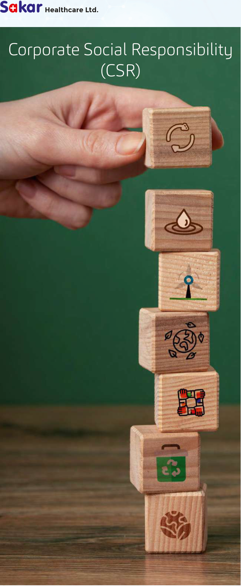

**[Image: AR_27786_SAKAR_2024_2025_A_4597943_28082025130003.pdf-0023-00.png (651x1582, 1095.4KB)]**

<!-- Start of picture text -->
Healthcare Ltd. Corporate Social Responsibility (CSR) <!-- End of picture text -->

**[Image: AR_27786_SAKAR_2024_2025_A_4597943_28082025130003.pdf-0023-01.png (90x47, 1.8KB)]**

<!-- Start of picture text -->
Our <!-- End of picture text -->

**[Image: AR_27786_SAKAR_2024_2025_A_4597943_28082025130003.pdf-0023-02.png (313x47, 6.0KB)]**

<!-- Start of picture text -->
Commitment <!-- End of picture text -->

**[Image: AR_27786_SAKAR_2024_2025_A_4597943_28082025130003.pdf-0023-03.png (334x56, 6.6KB)]**

<!-- Start of picture text -->
to Community <!-- End of picture text -->

**[Image: AR_27786_SAKAR_2024_2025_A_4597943_28082025130003.pdf-0023-04.png (259x59, 6.9KB)]**

<!-- Start of picture text -->
Well-Being <!-- End of picture text -->

**Sakar Healthcare** is dedicated to creating a positive impact on society through it's Corporate Social Responsibility (CSR) initiatives. Aligned with the principles of sustainable development, the company has focused its efforts on empowering under-privileged communities. �ese initiatives are in line with Schedule VII of the Companies Act, 2013, focusing on “promoting healthcare, including p re v e n t i v e h e a l t h ca re ” a n d demonstrate the Company's commitment to community welfare and sustainable social development. 

###### **CSR Focus: Construction of Hospital and Promotion of Medical Facilities** 

In **FY 2024-25** , Sakar Healthcare allocated a total of INR 35,00,000 towards CSR initiatives.  �ese funds were exclusively directed towards Supporting the establishment and upgradation of healthcare units and provision of essential healthcare services to underserved communities for rural youth in Gujarat. 

###### **Key Highlights:** 

- Total CSR Expenditure: INR 35,00,000 

- Focus Area: Construction of Hospital 

- Beneficiaries: Rural youth in Gujarat 

- Impact: �e construction of a hospital with modern medical amenities, aimed at providing a ff o r d a b l e t r e a t m e n t a n d specialized care to the general public, especially in rural and semi-urban areas. 

Annual Report  |  FY **2024 - 25** 

Page [ 19 ] 

**[Image: AR_27786_SAKAR_2024_2025_A_4597943_28082025130003.pdf-0024-00.png (1030x458, 600.3KB)]**

<!-- Start of picture text -->
Healthcare Ltd. <!-- End of picture text -->

#### Sustainability 

**[Image: AR_27786_SAKAR_2024_2025_A_4597943_28082025130003.pdf-0024-02.png (1034x59, 26.7KB)]**

<!-- Start of picture text -->
Commitment to a Greener Future <!-- End of picture text -->

Sakar Healthcare is privileged to operate a world-class facility emulating greenchemistry principles and practices in sustainability. Our manufacturing processes are oriented towards the least possible disturbance of the environment, coupled with resource efficiency. 

###### **Adherence to green chemistry principles** 

By working on our processes, Sakar Healthcare has reduced byproducts, consumption of energy, and use of toxic chemicals through modern equipments that follows the twelve principles of green chemistry. �e state-of-the-art technologies invested in our facility include flow chemistry and containment systems to enhance efficiency and safety. 

###### **Key Technology Investments** 

We have invested in advanced machinery and equipment supporting our green chemistry initiatives, notably the following: 

- Vapourtec R Series System (UK): Efficiently conducts chemical r e a c t i o n s u n d e r c o n t r o l l e d conditions. 

• 

- 

• 

• 

• 

• 

Glass Line Reactors De-Dietrich (Italy): Versatile and scalable range of reactors for any chemical process. 

OSD Containment Granulation and Compression Line GEA (Belgium): Safeguarding the safety of your products and the environment. 

Glatt Autocoator (Germany): Coating solutions accurately delivered for improved performance of your products. 

Tablet Capsule Inspection Machine Sensum (Slovenia): Deliver quality and integral products. 

Sterile Manufacturing Line with Ly o p h i l i s e r To ffl o n ( C h i n a ) : Production of sterile injectable products. 

Kevin Roll Compacter: Powder compaction is optimized to produce tablets efficiently. Bulk packaging Line IMA, Germany: It ensures safe and effective product packaging. 

Annual Report  |  FY **2024 - 25** 

Page [ 20 ] 

**[Image: AR_27786_SAKAR_2024_2025_A_4597943_28082025130003.pdf-0025-00.png (347x13, 10.1KB)]**

###### **NOTICE** 

NOTICE IS HEREBY GIVEN THAT THE 21ST ANNUAL GENERAL MEETING OF THE MEMBERS/SHAREHOLDERS OF **SAKAR HEALTHCARE LIMITED** WILL BE HELD ON TUESDAY, THE 23RD SEPTEMBER, 2025 AT 1:00 P.M. IST THROUGH VIDEO CONFERENCING (“VC”) /OTHER AUDIO VISUAL MEANS (“OAVM”) TO TRANSACT THE FOLLOWING BUSINESS: 

###### **ORDINARY BUSINESS:** 

1. To consider and adopt the Audited Standalone & Consolidated Financial Statements of the Company for the financial year ended 31st March, 2025, the reports of the Board of Directors and Auditors thereon. 

2. To appoint a Director in place of Mr. Sunil Marathe (DIN –08777180), who retires by rotation in terms of Section 152(6) of the Companies Act, 2013 and he being eligible, offers himself for reappointment. 

###### **SPECIAL BUSINESS:** 

3. To consider and, if thought fit, to pass with or without modification, the following Resolution as an **Ordinary Resolution** : “RESOLVED THAT pursuant to the provisions of Section 148 and other applicable provisions, if any, of the Companies Act, 2013 and the Companies (Audit and Auditors) Rules, 2014 including any statutory modification(s) or reenactment(s) thereof, for the time being in force) and any other applicable law, the remuneration of Rs. 55,000/(Rupees Fifty FiveThousand only) plus GST & out-of-pocket expenses, if any, payable to M/s Dalwadi& Associates, Cost Accountants, Ahmedabad (Firm Registration No. 000338), the Cost Auditors appointed by the Board of Directors of the Company, to conduct the audit of the cost accounting records of the Company for the financial year 2025-26, be and is hereby ratified and confirmed.” 

   - “RESOLVED FURTHER THAT the Board of Directors of the Company be and is hereby authorized to do all acts and take all such steps as may be necessary to give effect to this resolution.” 

4. To consider and, if thought fit, to pass with or without modification, the following Resolution as a **Special Resolution** : “RESOLVED THAT pursuant to provisions of Sections 149, 150 and 152 read with Schedule IV of the Companies Act, 2013 and the Companies (Appointment and Qualifications of Directors) Rules, 2014 (including any statutory modification(s) or re-enactment thereof for the time being in force) and Regulation 17(1C) and Regulation 25 of SEBI (Listing Obligations and Disclosure Requirements) Regulations, 2015, (‘Listing Regulations’) as amended from time to time, Ms. Megha Samdani (DIN:08956059), an Independent Director of the Company, who is appointed as an Independent Director by the Board of Directors with effect from 25th July, 2025 pursuant to provisions of Section 161(1) of the Companies Act, 2013 as amended from time to time and in accordance with the Articles of Association of the Company and in respect of whom the Company has received a notice in writing under Section 160 of the Companies Act, 2013 from a member proposing her candidature for the office of the Director, be and is hereby appointed as an Independent Director of the Company to hold office for a term of 5 (five) consecutive years from 25th July, 2025 to 24th July, 2030 considering the recommendation made by the Nomination and Remuneration Committee of the Company and approval of the Board of Directors in this regard.” 

“RESOLVED FURTHER THAT the Board of Directors of the Company be and is hereby authorized to do all acts and take all such steps as may be necessary, proper or expedient to give effect to this resolution.” 

5. To consider and, if thought fit, to pass with or without modification, the following Resolution as a **Special Resolution** : “RESOLVED THAT pursuant to provisions of Sections 149, 150 and 152 read with Schedule IV of the Companies Act, 2013 and the Companies (Appointment and Qualifications of Directors) Rules, 2014 (including any statutory modification(s) or re-enactment thereof for the time being in force) and Regulation 17(1C) and Regulation 25 of SEBI (Listing Obligations and Disclosure Requirements) Regulations, 2015, (‘Listing Regulations’) as amended from time to time, Ms. Reeya Kothari (DIN: 10312461), an Independent Director of the Company, who is appointed as an Independent Director by the Board of Directors with effect from 25th July, 2025 pursuant to provisions of Section 161(1) of the Companies Act, 2013 as amended from time to time and in accordance with the Articles of Association of the Company and in respect of whom the Company has received a notice in writing under Section 160 of the Companies Act, 2013 from a member proposing her candidature for the office of the Director, be and is hereby appointed as an Independent Director of the Company to hold office for a term of 5 (five) consecutive years from 25th July, 2025 to 24th July, 2030 considering the recommendation made by the Nomination and Remuneration Committee of the Company and approval of the Board of Directors in this regard.” 

   - “RESOLVED FURTHER THAT the Board of Directors of the Company be and is hereby authorized to do all acts and take all such steps as may be necessary, proper or expedient to give effect to this resolution.” 

6. To consider and, if thought fit, to pass with or without modification, the following Resolution as a **Special Resolution** : “RESOLVED THAT pursuant to provisions of Sections 149, 150 and 152 read with Schedule IV of the Companies Act, 2013 and the Companies (Appointment and Qualifications of Directors) Rules, 2014 (including any statutory modification(s) or re-enactment thereof for the time being in force) and Regulation 17(1C) and Regulation 25 of SEBI (Listing Obligations and Disclosure Requirements) Regulations, 2015, (‘Listing Regulations’) as amended from time to time, Ms. Hiral Patel (DIN – 09719512), an Independent Director of the Company, who is appointed as an Independent Director by the Board of Directors with effect from 25th July, 2025 pursuant to provisions of Section 

FY 2024-25  Annual Report 

**21** 

**[Image: AR_27786_SAKAR_2024_2025_A_4597943_28082025130003.pdf-0026-00.png (347x13, 10.1KB)]**

161(1) of the Companies Act, 2013 as amended from time to time and in accordance with the Articles of Association of the Company and in respect of whom the Company has received a notice in writing under Section 160 of the Companies Act, 2013 from a member proposing her candidature for the office of the Director, be and is hereby appointed as an Independent Director of the Company to hold office for a term of 5 (five) consecutive years from 25th July, 2025 to 24th July, 2030 considering the recommendation made by the Nomination and Remuneration Committee of the Company and approval of the Board of Directors in this regard.” 

“RESOLVED FURTHER THAT the Board of Directors of the Company be and is hereby authorized to do all acts and take all such steps as may be necessary, proper or expedient to give effect to this resolution.” 

7. To consider and, if thought fit, to pass with or without modification, the following resolution as an **Ordinary Resolution:** 

“RESOLVED THAT pursuant to the provisions of Section 204 and other applicable provisions, if any, of the Companies Act, 2013 read with Rule 9 of the Companies (Appointment and Remuneration of Managerial Personnel) Rules, 2014 and Regulation 24A of the Securities and Exchange Board of India (Listing Obligations and Disclosure Requirements) Regulations, 2015 (“SEBI Listing Regulations”), other applicable laws/statutory provisions, if any, as amended from time to time (including any statutory modification(s) or amendment(s) thereto or re-enactment(s) thereof for the time being in force), and in accordance with the recommendation of Audit Committee and the Board of Directors of the Company, M/s. Nishant Pandya & Associates, Practising Company Secretaries (FRN: S2019GJ700100, COP No.: 22435 and Peer Reviewed Certificate No. 2552/2022) be and are hereby appointed as Secretarial Auditors of the Company for a term of five (5) consecutive years to conduct the Secretarial Audit of five consecutive financial years commencing from financial year 2025-26 to 2029-30, at such fees, plus applicable taxes and other out-of-pocket expenses as may be approved by the Audit Committee and as may be mutually agreed upon between the Board of Directors of the Company and the Secretarial Auditors.” 

“RESOLVED FURTHER THAT approval of the members/shareholders be and is hereby accorded to the Board of Directors (hereinafter referred to as the ‘Board’ which expression shall include any Committee thereof or person(s) authorized by the Board) to avail or obtain from the Secretarial Auditor, such other services or certificates, reports, or opinions which the Secretarial Auditors may be eligible to provide or issue under the applicable laws, at a remuneration to be determined by the Audit committee/Board of Directors of the Company.” 

“RESOLVED FURTHER THAT the Board of Directors of the Company be and is hereby authorised to take all actions and do all such deeds, matters and things, as may be necessary, proper or desirable and to settle any question, difficulty or doubt that may arise in this regard.” 

###### **Registered Office :** 

Block No. 10/13, Village: Changodar, Sarkhej- Bavla Highway, Tal: Sanand, Dist: Ahmedabad -382 213 [CIN: L24231GJ2004PLC043861] Date : 25th July, 2025 

**By Order of the Board of Directors of Sakar Healthcare Limited,** 

**Bharat S. Soni Company Secretary & Compliance Officer** 

###### **NOTES:** 

1. The Explanatory Statement pursuant to Section 102 of the Companies Act, 2013, in respect of Special Business in the Notice is annexed hereto. 

2. The 21st Annual General Meeting (AGM) will be held on 23rd September, 2025 at 1:00 p.m. IST through Video Conferencing (VC)/Other Audio Visual Means (OAVM), in compliance with the applicable provisions of the Companies Act, 2013 read with General Circular No. 9/2024 dated September 19, 2024 read with the requirements laid down in Para 3 and Para 4 of the General Circular No.20/2020 dated 5th May, 2020 and earlier circulars issued in this regard extending relaxation by the Ministry of Corporate Affairs (“MCA circulars”) read with the Securities and Exchange Board of India Circular dated October 3, 2024 (“SEBI Circular”) and SEBI (Listing Obligations and Disclosure Requirements) Regulations, 2015. The deemed venue for the 21st AGM shall be the Registered Office of the Company. Annual Report will not be sent in physical form. 

3. This AGM is being held through VC / OAVM pursuant to MCA Circulars, physical attendance of the Members/ Shareholders has been dispensed with. Accordingly, the facility for appointment of proxies by the Members/ Shareholders will not be available for the AGM and hence the Proxy Form, Attendance Slip and Route Map are not annexed to this Notice. Members/Shareholders have to attend and participate in the ensuing AGM though VC/OAVM. However, the Body Corporates are entitled to appoint authorized representatives to attend the AGM through VC/ OAVM and participate there at and cast their votes through e-voting. 

4. Shareholders/Members of the Company under the category of Institutional Investors are encouraged to attend and vote at the AGM through VC. Body Corporates whose Authorised Representatives are intending to attend the Meeting through VC/OAVM are requested to send to the Company on their email Id cs@sakarhealthcare.com, a certified copy 

FY 2024-25  Annual Report 

**22** 

**[Image: AR_27786_SAKAR_2024_2025_A_4597943_28082025130003.pdf-0027-00.png (347x13, 10.1KB)]**

of the Board Resolution/authorization letter authorising their representative to attend and vote on their behalf at the Meeting and through E-voting. 

5. In compliance with the aforesaid MCA Circulars and SEBI Circulars, Notice of the AGM along with the Annual Report 2024-25 is being sent only through electronic mode to those Members / Shareholders whose email addresses are registered with the Registrar & Share Transfer Agent of the Company/Depositories. Members / Shareholders may note that the Notice and Annual Report will also be available on the Company’s website www.sakarhealthcare.com, website of stock exchange viz. National Stock Exchange of India Limited at www.nseindia.com that of Central Depository Services (India) Limited (agency for providing remote e-voting facility) at www.evotingindia.com 

6. Members/ Shareholders attending the AGM through VC / OAVM shall be counted for the purpose of reckoning the quorum under Section 103 of the Act. 

7. In case of joint holders attending the Meeting, only such joint holder who is higher in the order of names will be entitled to vote. 

8. The Members/ Shareholders can join the AGM in the VC/OAVM mode 15 minutes before and after the scheduled time of the commencement of the Meeting by following the procedure mentioned in the Notice. Instructions and other information for members for attending the AGM through VC/OAVM are given in this Notice below. 

9. As the Annual General Meeting (AGM) of the Company is held through Video Conferencing/OAVM, we therefore request the members/ shareholders to submit questions in advance relating to the business specified in this Notice of AGM on the email ID cs@sakarhealthcare.com. 

10. Shareholders/Members holding shares in the dematerialized mode are requested to intimate all changes with respect to their bank details, ECS mandate, nomination, power of attorney, change of address, change in name, etc, to their Depository Participant (DP). These changes will be automatically reflected in the Company’s records, which will help the Company to provide efficient and better service to the Members. Shareholders/Members holding shares in physical form are requested to intimate the changes to the Registrar & Share Transfer Agents of the Company (RTA). Members are also advised to not leave their demat account(s) dormant for long. Periodic statement of holdings should be obtained from the concerned Depository Participant and holdings should be verified from time to time. 

11. Pursuant to the requirement of Regulation 26(4) and 36(3) of the Securities and Exchange Board of India (Listing Obligations and Disclosure Requirements) Regulations, 2015 and Secretarial Standard 2 issued by The Institute of Company Secretaries of India, the brief profile/particulars of the Directors of the Company seeking their appointment or re-appointment at the Annual General Meeting (AGM) are stated at the end of this Notes annexed hereto. 

12. As per the provisions of the MCA Circulars, the matters as appearing as Special Business at Item No(s). 3 to 7 of the accompanying Notice, are considered to be unavoidable by the Board of directors of the Company and hence, forms part of this Notice. 

13. SEBI has mandated the submission of Permanent Account Number (PAN) by every participant in securities market. Shareholders holding shares in dematerialized form are, therefore requested to submit their PAN to the Depositary Participant(s) with whom they are maintaining their dematerialized accounts. 

The Registrar and Transfer Agent of the Company is MUFG Intime India Private Limited. Consequent to the acquisition of Link Group by Mitsubishi UFJ Trust & Banking Corporation, Link Intime India Private Limited is known as MUFG Intime India Private Limited. The change of name is effective December 31, 2024. 

14. The members are requested to intimate to the Company, queries, if any, at least 10 days before the date of the meeting to enable the management to keep the required information available at the meeting. 

15. In respect of shares held in electronic / demat form, the nomination form may be filed with the respective Depository Participant. 

16. Shareholder/Member who wish to inspect the Register of Directors and Key Managerial Personnel and their shareholding maintained under section 170 of Companies Act, 2013 and Register of Contracts or arrangements in which directors are interested maintained under section 189 of the Companies Act, 2013 and Relevant documents referred to in this Notice of AGM in electronic mode can send an email to cs@sakarhealthcare.com. 

17. The business set out in the Notice will be transacted through electronic voting system and the Company is providing facility for voting by electronic means. Instructions and other information relating to e-voting are given in this Notice below. 

18. Shareholders/Members of the Company holding shares as on Benpos date i.e. 8th August, 2025 will receive Annual Report for the financial year 2024-25 through electronic mode only. 

19. Shareholders/Members are requested to quote their DP ID/ Client ID in all correspondence with the Company / Registrar and Share Transfer Agent. 

20. To support the “Green Initiative”, Shareholders/Members who have not registered their e-mail addresses so far with their Demat Account are requested to register their e-mail address with the Depository Participant where the Demat account is maintained for receiving all communication including Annual Report, Notices, Circulars, etc. from the Company electronically. 

FY 2024-25  Annual Report 

**23** 

**[Image: AR_27786_SAKAR_2024_2025_A_4597943_28082025130003.pdf-0028-00.png (347x13, 10.1KB)]**

###### **Instructions for e-voting and joining the AGM are as follows:** 

1. As you are aware, the general meetings of the companies shall be conducted as per the guidelines issued by the Ministry of Corporate Affairs read with General Circular No. 9/2024 dated September 19, 2024 read with the requirements laid down in Para 3 and Para 4 of the General Circular No.20/2020 dated 5th May, 2020 and earlier circulars issued in this regard extending relaxation by the Ministry of Corporate Affairs (“MCA circulars”) read with the Securities and Exchange Board of India Circular dated October 3, 2024 (“SEBI Circular”) and SEBI (Listing Obligations and Disclosure Requirements) Regulations, 2015. The forthcoming AGM will thus be held through video conferencing (VC) or other audio-visual means (OAVM).  Hence, Members can attend and participate in the ensuing AGM through VC/OAVM. 

2. Pursuant to the provisions of Section 108 of the Companies Act, 2013 read with Rule 20 of the Companies (Management and Administration) Rules, 2014 (as amended) and Regulation 44 of SEBI (Listing Obligations & Disclosure Requirements) Regulations 2015 (as amended), and MCA Circulars the Company is providing facility of remote e-voting to its Members in respect of the business to be transacted at the AGM. For this purpose, the Company has entered into an agreement with Central Depository Services (India) Limited (CDSL) for facilitating voting through electronic means, as the authorized e-Voting’s agency. The facility of casting votes by a member using remote e- voting as well as the e-voting system on the date of the AGM will be provided by CDSL. 

3. The Shareholders/Members can join the AGM in the VC/OAVM mode 15 minutes before and after the scheduled time of the commencement of the Meeting by following the procedure mentioned in the Notice. The facility of participation at the AGM through VC/OAVM will be made available to atleast 1000 members on first come first served basis. This will not include large Shareholders (Shareholders holding 2% or more shareholding), Promoters, Institutional Investors, Directors, Key Managerial Personnel, the Chairpersons of the Audit Committee, Nomination and Remuneration Committee and Stakeholders Relationship Committee, Auditors etc. who are allowed to attend the AGM without restriction on account of first come first served basis. 

4. The attendance of the Shareholders/Members attending the AGM through VC/OAVM will be counted for the purpose of ascertaining the quorum under Section 103 of the Companies Act, 2013. 

5. Pursuant to MCA Circular No. 14/2020 dated April 08, 2020, the facility to appoint proxy to attend and cast vote for the members is not available for this AGM. However, in pursuance of Section 112 and Section 113 of the Companies Act, 2013, representatives of the shareholders/members such as the President of India or the Governor of a State or body corporate can attend the AGM through VC/OAVM and cast their votes through e-voting. 

6. In line with the Ministry of Corporate Affairs (MCA) Circular No. 17/2020 dated April 13, 2020, the Notice calling the AGM has been uploaded on the website of the Company at <u>www.sakarhealthcare.com.The Notice can also be</u> accessed from the websites of NSE (the Stock Exchange)at www.nseindia.com. The AGM Notice is also disseminated on the website of CDSL (agency for providing the Remote e-Voting facility and e-voting system during the AGM) i.e. <u>www.evotingindia.com.</u> 

###### **THE INTRUCTIONS OF SHAREHOLDERS FOR E-VOTING AND JOINING VIRTUAL MEETINGS ARE AS UNDER:** 

- **Step 1** : Access through Depositories CDSL/NSDL e-Voting system in case of individual shareholders holding shares in Demat mode. 

- **Step 2** : Access through CDSL e-Voting system in case of shareholders holding shares in physical mode and nonindividual shareholders in Demat mode. 

- (i) The voting period begins on at **9:00 a.m. on 20****th** **September, 2025 and ends at 5:00 p.m. on 22****nd** **September, 2025.** During this period shareholders’ of the Company, holding shares either in physical form or in dematerialized form, as on the **cut-off date i.e. 16****th** **September, 2025** may cast their vote electronically. The e-voting module shall be disabled by CDSL for voting thereafter. 

- (ii) Shareholders who have already voted prior to the meeting date would not be entitled to vote at the meeting venue. 

- (iii) Pursuant to SEBI Circular No. SEBI/HO/CFD/CMD/CIR/P/2020/242 dated 09.12.2020 **,** under Regulation 44 of Securities and Exchange Board of India (Listing Obligations and Disclosure Requirements) Regulations, 2015, listed entities are required to provide remote e-voting facility to its shareholders, in respect of all shareholders’ resolutions. However, it has been observed that the participation by the public non-institutional shareholders/retail shareholders is at a negligible level. 

Currently, there are multiple e-voting service providers (ESPs) providing e-voting facility to listed entities in India. This necessitates registration on various ESPs and maintenance of multiple user IDs and passwords by the shareholders. 

In order to increase the efficiency of the voting process, pursuant to a public consultation, it has been decided to enable e-voting to **all the demat account holders** , **by way of a single login credential, through their demat accounts/ websites of Depositories/ Depository Participants** . Demat account holders would be able to cast their vote without having to register again with the ESPs, thereby, not only facilitating seamless authentication but also enhancing ease and convenience of participating in e-voting process. 

**Step 1** : Access through Depositories CDSL/NSDL e-Voting system in case of individual shareholders holding shares in Demat mode. 

FY 2024-25  Annual Report 

**24** 

**[Image: AR_27786_SAKAR_2024_2025_A_4597943_28082025130003.pdf-0029-00.png (347x13, 10.1KB)]**

- (iv) In terms of SEBI circular no. SEBI/HO/CFD/CMD/CIR/P/2020/242 dated December 9, 2020 on e-Voting facility provided by Listed Companies, Individual shareholders holding securities in demat mode are allowed to vote through their demat account maintained with Depositories and Depository Participants. Shareholders are advised to update their mobile number and email Id in their demat accounts in order to access e-Voting facility. 

Pursuant to above said SEBI Circular **,** Login method for e-Voting and joining virtual meetings **for Individual shareholders holding securities in Demat mode CDSL/NSDL** is given below: 

|**Type of shareholders**|**Login Method**|
|---|---|
|Individual Shareholders holding securities in Demat mode with**CDSL** **Depository**|1) Users who have opted for CDSL Easi / Easiest facility, can login through their existing user id and password. Option will be made available to reach e-Voting page without any further authentication. The users to login Easi / Easiest are requested to visit CDSL website www.cdslindia.com and click on login icon & New System Myeasi Tab and then user your existing my easi username & password. 2) After successful login the Easi / Easiest user will be able to see the e-Voting option for eligible companies where the evoting is in progress as per the information provided by company. On clicking the evoting option, the user will be able to see e-Voting page of the e-Voting service provider for casting your vote during the remote e-Voting period or joining virtual meeting & voting during the meeting. Additionally, there is also links provided to access the system of all e-Voting Service Providers i.e. CDSL/NSDL/KARVY/ MUFGINTIME, so that the user can visit the e-Voting service providers’ website directly. 3) If the user is not registered for Easi/Easiest, option to register is available at https://web.cdslindia.com/myeasitoken/Registration/EasiRegistration 4) Alternatively, the user can directly access e-Voting page by providing Demat Account Number and PAN No. from a e-Voting link available on www.cdslindia.com home page or click onhttps://evoting.cdslindia.com/ Evoting/EvotingLogin  The system will authenticate the user by sending OTP on registered Mobile & Email as recorded in the Demat Account. After successful authentication, user will be able to see the e-Voting option where the e-voting is in progress and also able to directly access the system of all e- Voting Service Providers.|
|Individual Shareholders holding securities in demat mode with**NSDL Depository**|1) If you are already registered for NSDL IDeAS facility, please visit the e-Services website of NSDL. Open web browser by typing the following URL:https://eservices.nsdl.com either on a Personal Computer or on a mobile. Once the home page of e-Services is launched, click on the “Beneficial Owner” icon under “Login” which is available under ‘IDeAS’ section. A new screen will open. You will have to enter your User ID and Password. After successful authentication, you will be able to see e-Voting services. Click on “Access to e-Voting” under e-Voting services and you will be able to see e- Voting page. Click on company name or e-Voting service provider name and you will be re-directed to e-Voting service provider website for casting your vote during the remote e-Voting period or joining virtual meeting & voting during the meeting. 2) If the user is not registered for IDeAS e-Services, option to register is available athttps://eservices.nsdl.com .Select “Register Online for IDeAS “Portal or click athttps://eservices.nsdl.com /SecureWeb/IdeasDirectReg.jsp 3) Visit the e-Voting website of NSDL. Open web browser by typing the following URL:https://www.evoting.nsdl.com/  either on a Personal Computer or on a mobile. Once the home page of e-Voting system is launched, click on the icon “Login” which is available under ‘Shareholder/Member’ section. A new screen will open. You will have to enter your User ID (i.e. your sixteen digit demat account number hold with NSDL), Password/OTP and a Verification Code as shown on the screen. After successful authentication, you will be redirected to NSDL Depository site wherein you can see e-Voting page. Click on company name or e-Voting service provider name and you will be redirected to e-Voting service provider website for casting your vote during the remote e-Voting period or joining virtual meeting & voting during the meeting.|

FY 2024-25  Annual Report 

**25** 

**[Image: AR_27786_SAKAR_2024_2025_A_4597943_28082025130003.pdf-0030-00.png (347x13, 10.1KB)]**

||4) For OTP based login you can click on https://eservices.nsdl.com/SecureWeb/ evoting/evotinglogin.jsp. You will have to enter your 8-digit DP ID,8-digit Client Id, PAN No., Verification code and generate OTP. Enter the OTP received on registered email id/mobile number and click on login. After successful authentication, you will be redirected to NSDL Depository site wherein you can see e-Voting page. Click on company name or e-Voting service provider name and you will be re-directed to e-Voting service provider website for casting your vote during the remote e-Voting period or joining virtual meeting & voting during the meeting.|
|---|---|
|Individual Shareholders (holding securities in demat mode) login through their **Depository Participants** **(DP)**|You can also login using the login credentials of your demat account through your Depository Participant registered with NSDL/CDSL for e-Voting facility.  After Successful login, you will be able to see e-Voting option. Once you click on e-Voting option, you will be redirected to NSDL/CDSL Depository site after successful authentication, wherein you can see e-Voting feature. Click on company name or e-Voting service provider name and you will be redirected to e-Voting service provider website for casting your vote during the remote e-Voting period or joining virtual meeting & voting during the meeting.|

**Important note:** Members who are unable to retrieve User ID/ Password are advised to use Forget User ID and Forget Password option available at abovementioned website. 

###### **Helpdesk for Individual Shareholders holding securities in demat mode for any technical issues related to login through Depository i.e. CDSL and NSDL** 

|**Login type**|**Helpdesk details**|
|---|---|
|Individual Shareholders holding securities in Demat mode with**CDSL**|Members facing any technical issue in login can contact CDSL helpdesk by sending a request athelpdesk.evoting@cdslindia.com or contact at toll free no. 18002109911|
|Individual Shareholders holding securities in Demat mode with**NSDL**|Members facing any technical issue in login can contact NSDL helpdesk by sending a request atevoting@nsdl.co.in / evoting@nsdl.com or call at 022 – 48867000 and 022-24997000|

**Step 2** : Access through CDSL e-Voting system in case of shareholders holding shares in physical mode and nonindividual shareholders in demat mode. 

- (v) Login method for e-Voting and joining virtual meetings for **Physical shareholders and shareholders other than individual holding in Demat form.** 

   - 1) The shareholders should log on to the e-voting website www.evotingindia.com. 

   - 2) Click on “Shareholders” module. 

   - 3) Now enter your User ID 

      - a. For CDSL: 16 digits beneficiary ID, 

      - b. For NSDL: 8 Character DP ID followed by 8 Digits Client ID, 

      - c. Shareholders holding shares in Physical Form should enter Folio Number registered with the Company. 

   - 4) Next enter the Image Verification as displayed and Click on Login. 

   - 5) If you are holding shares in demat form and had logged on to www.evotingindia.com and voted on an earlier e-voting of any company, then your existing password is to be used. 

   - 6) If you are a first-time user follow the steps given below: 

||**For Physical shareholders and other than individual shareholders holding shares** **in Demat.**|
|---|---|
|PAN|Enter your 10 digit alpha-numeric *PAN issued by Income Tax Department (Applicable for both demat shareholders as well as physical shareholders). Shareholders who have not updated their PAN with the Company/Depository Participant are requested to use the sequence number sent by Company/RTA or contact Company/ RTA.|
|Dividend Bank Details**OR** Date of Birth (DOB)|Enter the Dividend Bank Details or Date of Birth (in dd/mm/yyyy format) as recorded in your demat account or in the company records in order to login. If both the details are not recorded with the depository or company, please enter the member id / folio number in the Dividend Bank details field.|

FY 2024-25  Annual Report 

**26** 

**[Image: AR_27786_SAKAR_2024_2025_A_4597943_28082025130003.pdf-0031-00.png (347x13, 10.1KB)]**

- (vi) After entering these details appropriately, click on “SUBMIT” tab. 

- (vii) Shareholders holding shares in physical form will then directly reach the Company selection screen. However, shareholders holding shares in demat form will now reach ‘Password Creation’ menu wherein they are required to mandatorily enter their login password in the new password field. Kindly note that this password is to be also used by the demat holders for voting for resolutions of any other company on which they are eligible to vote, provided that company opts for e-voting through CDSL platform. It is strongly recommended not to share your password with any other person and take utmost care to keep your password confidential. 

- (viii) For shareholders holding shares in physical form, the details can be used only for e-voting on the resolutions contained in this Notice. 

- (ix) Click on the EVSN for SAKAR HEALTHCARE LIMITED on which you choose to vote. 

- (x) On the voting page, you will see “RESOLUTION DESCRIPTION” and against the same the option “YES/NO” for voting. Select the option YES or NO as desired. The option YES implies that you assent to the Resolution and option NO implies that you dissent to the Resolution. 

- (xi) Click on the “RESOLUTIONS FILE LINK” if you wish to view the entire Resolution details. 

- (xii) After selecting the resolution, you have decided to vote on, click on “SUBMIT”. A confirmation box will be displayed. If you wish to confirm your vote, click on “OK”, else to change your vote, click on “CANCEL” and accordingly modify your vote. 

- (xiii) Once you “CONFIRM” your vote on the resolution, you will not be allowed to modify your vote. 

- (xiv) You can also take a print of the votes cast by clicking on “Click here to print” option on the Voting page. 

- (xv) If a demat account holder has forgotten the login password then Enter the User ID and the image verification code and click on Forgot Password & enter the details as prompted by the system. 

- (xvi) There is also an optional provision to upload BR/POA if any uploaded, which will be made available to scrutinizer for verification. 

- (xvii) **Additional Facility for Non – Individual Shareholders and Custodians –For Remote Voting only.** 

   - Non-Individual shareholders (i.e. other than Individuals, HUF, NRI etc.) and Custodians are required to log on to www.evotingindia.com and register themselves in the “Corporates” module. 

   - A scanned copy of the Registration Form bearing the stamp and sign of the entity should be emailed to <u>helpdesk.evoting@cdslindia.com.</u> 

   - After receiving the login details a Compliance User should be created using the admin login and password. The Compliance User would be able to link the account(s) for which they wish to vote on. 

   - The list of accounts linked in the login will be mapped automatically & can be delink in case of any wrong mapping. 

   - It is Mandatory that, a scanned copy of the Board Resolution and Power of Attorney (POA) which they have issued in favour of the Custodian, if any, should be uploaded in PDF format in the system for the scrutinizer to verify the same. 

   - Alternatively Non Individual shareholders are required mandatory to send the relevant Board Resolution/ Authority letter etc. together with attested specimen signature of the duly authorized signatory who are authorized to vote, to the Scrutinizer and to the Company at the email address viz. cs@sakarhealthcare.com (designated email address by company), if they have voted from individual tab & not uploaded same in the CDSL e-voting system for the scrutinizer to verify the same. 

###### **INSTRUCTIONS FOR SHAREHOLDERS ATTENDING THE AGM THROUGH VC/OAVM & E-VOTING DURING MEETING ARE AS UNDER:** 

- (i) The procedure for attending meeting & e-Voting on the day of the AGM is same as the instructions mentioned above for e-voting. 

- (ii) The link for VC/OAVM to attend meeting will be available where the EVSN of Company will be displayed after successful login as per the instructions mentioned above for e-voting. 

- (iii) Shareholders who have voted through Remote e-Voting will be eligible to attend the meeting. However, they will not be eligible to vote at the AGM. 

- (iv) Shareholders are encouraged to join the Meeting through Laptops / IPads for better experience. 

- (v) Further shareholders will be required to allow Camera and use Internet with a good speed to avoid any disturbance during the meeting. 

- (vi) Please note that Participants Connecting from Mobile Devices or Tablets or through Laptop connecting via Mobile Hotspot may experience Audio/Video loss due to Fluctuation in their respective network. It is therefore recommended to use Stable Wi-Fi or LAN Connection to mitigate any kind of aforesaid glitches. 

FY 2024-25  Annual Report 

**27** 

**[Image: AR_27786_SAKAR_2024_2025_A_4597943_28082025130003.pdf-0032-00.png (347x13, 10.1KB)]**

- (vii) Shareholders who would like to express their views/ask questions during the meeting may register themselves as a speaker by sending their request in advance atleast **10 days prior to meeting** mentioning their name, demat account number/folio number, email id, mobile number at (company email id). The shareholders who do not wish to speak during the AGM but have queries may send their queries in advance **10 days prior to meeting** mentioning their name, demat account number/folio number, email id, mobile number at cs@sakarhealthcare.com. These queries will be replied to by the company suitably by email. 

- (viii) Those shareholders who have registered themselves as a speaker will only be allowed to express their views/ask questions during the meeting. 

- (ix) Only those shareholders, who are present in the AGM through VC/OAVM facility and have not casted their vote on the Resolutions through remote e-Voting and are otherwise not barred from doing so, shall be eligible to vote through e- Voting system available during the AGM. 

- (x) If any Votes are cast by the shareholders through the e-voting available during the AGM and if the same shareholders have not participated in the meeting through VC/OAVM facility, then the votes cast by such shareholders may be considered invalid as the facility of e-voting during the meeting is available only to the shareholders attending the meeting. 

###### **PROCESS FOR THOSE SHAREHOLDERS WHOSE EMAIL/MOBILE NO. ARE NOT REGISTERED WITH THE COMPANY/ DEPOSITORIES.** 

1. Please update your email id & mobile no. with your respective Depository Participant (DP) 

2. For Individual Demat shareholders – Please update your email id & mobile no. with your respective Depository Participant (DP) which is mandatory while e-Voting & joining virtual meetings through Depository. 

If you have any queries or issues regarding attending AGM & e-Voting from the CDSL e-Voting System, you can write an email to helpdesk.evoting@cdslindia.com or contact at toll free no. 18002109911. 

All grievances connected with the facility for voting by electronic means may be addressed to Mr. RakeshDalvi, Sr. Manager, (CDSL) Central Depository Services (India) Limited, A Wing, 25th Floor, Marathon Futurex, Mafatlal Mill Compounds, N M Joshi Marg, Lower Parel (East), Mumbai - 400013 or send an email to helpdesk.evoting@cdslindia.com or call  toll free no. 18002109911. 

###### **Scrutinizer to scrutinize the e-voting process** 

The Board of Directors has appointed Mr. Kashyap R. Mehta (Membership No. FCS 1821) and failing him,Mr. Yash K. Mehta (Membership No. ACS 43020), Partners of Kashyap R. Mehta & Partners, Practising Company Secretaries as the Scrutinizer to scrutinize the e-voting process in a fair and transparent manner. The Results declared along with the report of the Scrutinizer shall be placed on the website of the Company and on the website of CDSL after the declaration of result by the Chairman or a person authorized by him in writing. The results shall also be communicated to the Stock Exchange viz. National Stock Exchange of India Limited. 

FY 2024-25  Annual Report 

**28** 

**[Image: AR_27786_SAKAR_2024_2025_A_4597943_28082025130003.pdf-0033-00.png (347x13, 10.1KB)]**

###### **ANNEXURE TO THE NOTICE** 

**EXPLANATORY STATEMENT PURSUANT TO SECTION 102 OF THE COMPANIES ACT, 2013 IN RESPECT OF SPECIAL BUSINESSES MENTIONED IN THE NOTICE OF 21****ST** **ANNUAL GENERAL MEETING** 

###### **In respect of Item No. 3:** 

The Board of Directors of the Company, on the recommendation of the Audit Committee, appointed that M/s. Dalwadi & Associates, Cost Accountants, Ahmedabad (Firm Registration No. 000338), as Cost Auditors for the financial year 202526. 

As per Section 148 of Companies Act, 2013 and applicable rules there under, the remuneration payable to the cost auditors is to be ratified by the members of the Company. 

The Board considers the remuneration payable to the cost auditors as fair and recommends the resolution contained in item no. 3 of the notice for approval of the members/shareholders. 

None of the Directors, Key Managerial Personnel or their relatives are in any way concerned or interested, financially or otherwise in this resolution. 

The Board recommends the resolution for your approval as an Ordinary Resolution. 

###### **In respect of Item No. 4:** 

Based on the recommendation of the Nomination and Remuneration Committee, the Board of Directors of the Company appointed Ms. Megha Samdani (DIN – 08956059) as an Independent Director of the Company w.e.f. 25th July, 2025 pursuant to provisions of Section 149 and 161 of the Companies Act 2013 subject to the approval of the shareholders/ members of the Company. 

The Company has received a Notice in writing from a Member of the Company under Section 160 (1) of the Companies Act, 2013 proposing the candidature of Ms. Megha Samdani for the office of Director of the Company. 

In the opinion of the Board, Ms. Megha Samdani fulfils the conditions specified in the Companies Act, 2013 and SEBI - Listing Regulations for appointment as Independent Director and is independent of the management of the Company. 

Ms. Megha Samdani holds Master’s degree in Commerce as well as qualified Company Secretary (ACS). Her profile includes experience in Merger and Amalgamation, Private Placement, Right issue financial restructuring and other related matters. 

Additional information in respect of Ms. Megha Samdani pursuant to Regulation 36 of SEBI (Listing Obligations and Disclosure Requirements) Regulations, 2015 and the Secretarial Standards on General Meetings (SS- 2), is provided at Annexure A to this Notice. 

Pursuant to the provisions of the Regulation 17(1C) of the SEBI (Listing Obligations and Disclosure Requirements) Regulations, 2015, the listed entity shall ensure that approval of shareholders/members for appointment of a person on the Board of Directors is taken at the next general meeting or within a time period of three months from the date of appointment, whichever is earlier. 

In view of above and also considering the recommendation of Nomination and Remuneration Committee of the Company for appointment of Ms. Megha Samdani as Independent Director of the Company for a consecutive term of five years period w.e.f. 25th July, 2025 till 24th July, 2030, on basis of her skills, extensive and enriched experience in diverse areas and suitability to the Company and fulfilling the criteria of her independence under Section 149(6) of Companies Act, 2013 read with Schedule IV thereto and Regulation 16(1)(b) and 25 of SEBI (Listing Obligations and Disclosure Requirements) Regulations, 2015, the said Resolution No. 4 is being recommended by the Board of Directors to the members/shareholders of the Company for their consideration and accord approval thereto by way of Special Resolution. 

None of the Directors, Key Managerial Personnel (KMP) of the Company or their relatives except Ms. Megha Samdani, relating to her own appointment, may be deemed to be concerned or interested in the Resolution stated at item No. 4 of the Notice. 

###### **Item No. 5:** 

Based on the recommendation of the Nomination and Remuneration Committee, the Board of Directors of the Company appointed Ms. Reeya Kothari (DIN – 10312461) as an Independent Director of the Company w.e.f. 25th July, 2025 pursuant to provisions of Section 149 and 161 of the Companies Act 2013 subject to the approval of the shareholders/ members of the Company. 

The Company has received a Notice in writing from a Member of the Company under Section 160 (1) of the Companies Act, 2013 proposing the candidature of Ms. Reeya Kothari for the office of Director of theCompany. 

In the opinion of the Board, Ms. Reeya Kothari fulfils the conditions specified in the Companies Act, 2013 and SEBI - Listing Regulations for appointment as Independent Director and is independent of the management of the Company. Ms. Reeya Kothari holds a Bachelor degree in Commerce as well as qualified Company Secretary (ACS). Her profile includes experience in Taxation, Secretarial, Legal and other related matters. 

Additional information in respect of Ms. Reeya Kothari pursuant to Regulation 36 of SEBI (Listing Obligations and Disclosure Requirements) Regulations, 2015 and the Secretarial Standards on General Meetings (SS- 2), is provided at Annexure A 

FY 2024-25  Annual Report 

**29** 

**[Image: AR_27786_SAKAR_2024_2025_A_4597943_28082025130003.pdf-0034-00.png (347x13, 10.1KB)]**

###### to this Notice. 

Pursuant to the provisions of the Regulation 17(1C) of the SEBI (Listing Obligations and Disclosure Requirements) Regulations, 2015, the listed entity shall ensure that approval of shareholders/members for appointment of a person on the Board of Directors is taken at the next general meeting or within a time period of three months from the date of appointment, whichever is earlier. 

In view of above and also considering the recommendation of Nomination and Remuneration Committee of the Company for appointment of Ms. Reeya Kothari as Independent Director of the Company for a consecutive term of five years period w.e.f. 25th July, 2025 till 24th July, 2025 on basis of her skills, extensive and enriched experience in diverse areas and suitability to the Company and fulfilling the criteria of her independence under Section 149(6) of Companies Act, 2013 read with Schedule IV thereto and Regulations 16(1)(b) and 25 of SEBI (Listing Obligations and Disclosure Requirements) Regulations, 2015, the said Resolution No. 5 is being recommended by the Board of Directors to the members/shareholders of the Company for their consideration and accord approval thereto by way of Special Resolution. 

None of the Directors, Key Managerial Personnel (KMP) of the Company or their relatives except Ms. Reeya Kothari, relating to her own appointment, may be deemed to be concerned or interested in the Resolution stated at item No. 5 of the Notice. 

###### **Item No. 6:** 

Based on the recommendation of the Nomination and Remuneration Committee, the Board of Directors of the Company appointed Ms. Hiral Patel (DIN – 09719512) as an Independent Director of the Company w.e.f. 25th July, 2025 pursuant to provisions of Section 149 and 161 of the Companies Act 2013 subject to the approval of the shareholders/members of the Company. 

The Company has received a Notice in writing from a Member of the Company under Section 160 (1) of the Companies Act, 2013 proposing the candidature of Ms. Hiral Patel for the office of Director of theCompany. 

In the opinion of the Board, Ms. Hiral Patel fulfils the conditions specified in the Companies Act, 2013 and SEBI - Listing Regulations for appointment as Independent Director and is independent of themanagement of the Company. 

Ms. Hiral Patel holds a Bachelor degree in Commerce and Law as well as she holds degree of MBA Finance. She is also a qualified Company Secretary (ACS). Her profile includes experience of more than 7 years in Finance, Banking, Taxation Secretarial, Legal, and other related matters. 

Additional information in respect of Ms. Hiral Patel pursuant to Regulation 36 of SEBI (Listing Obligations and Disclosure Requirements) Regulations, 2015 and the Secretarial Standards on General Meetings (SS- 2), is provided at Annexure A to this Notice. 

Pursuant to the provisions of the Regulation 17(1C) of the SEBI (Listing Obligations and Disclosure Requirements) Regulations, 2015, the listed entity shall ensure that approval of shareholders for appointment of a person on the Board of Directors is taken at the next general meeting or within a time period of three months from the date of appointment, whichever is earlier. 

In view of above and also considering the recommendation of Nomination and Remuneration Committee of the Company for appointment of Ms. Hiral Patel as Independent Director of the Company for a consecutive term of five years period w.e.f. 25th July, 2025 till 24th July, 2030 on basis of her skills, extensive and enriched experience in diverse areas and suitability to the Company and fulfilling the criteria of her independence under Section 149(6) of Companies Act, 2013 read with Schedule IV thereto and Regulation 16(1)(b) and 25 of SEBI (Listing Obligations and Disclosure Requirements) Regulations, 2015, the said Resolution No. 6 is being recommended by the Board of Directors to the members/shareholders of the Company for their consideration and accord approval thereto by way of Special Resolution. 

None of the Directors, Key Managerial Personnel (KMP) of the Company or their relatives except Ms. Hiral Patel, relating to her own appointment, may be deemed to be concerned or interested in the Resolution stated at item No. 6 of the Notice. 

###### **Item No. 7:** 

The Board at its meeting held on 25th July, 2025, based on recommendation of the Audit Committee, after evaluating and considering various factors such as industry experience, competency of the audit team, efficiency in conduct of audit, independence, etc., has approved the appointment of M/s. Nishant Pandya & Associates, Practising Company Secretaries, a peer reviewed firm (Firm Registration Number: S2019GJ700100) as Secretarial Auditors of the Company for a term of five (5) consecutive years commencing from FY 2025-26 to FY 2029-30, subject to approval of the Members/Shareholders. 

The appointment of Secretarial Auditors shall be in terms of the amended Regulation 24A of the SEBI Listing Regulations vide SEBI Notification dated 12th December, 2024 and provisions of Section 204 of the Act and Rule 9 of the Companies (Appointment and Remuneration of Managerial Personnel) Rules, 2014. 

M/s. Nishant Pandya & Associates, Practising Company Secretaries firm has been Peer Reviewed and Quality Reviewed by the Institute of Company Secretaries of India (ICSI). Mr. Nishant Pandya, Proprietor of M/s. Nishant Pandya & Associates holds degree of B.Com & ACS. He is a Company Secretary in practice since more than 6 years. He has experience in Corporate Laws & Finance. The firm focusses on providing comprehensive professional services in Corporate laws and SEBI regulations and allied fields, delivering strategic solutions to ensure regulatory adherence and operational efficiency. 

FY 2024-25  Annual Report 

**30** 

**[Image: AR_27786_SAKAR_2024_2025_A_4597943_28082025130003.pdf-0035-00.png (347x13, 10.1KB)]**

M/s. Nishant Pandya & Associates, Practising Company Secretaries has confirmed that the firm is not disqualified and is eligible to be appointed as Secretarial Auditors in terms of Regulation 24A of the SEBI Listing Regulations. The services to be rendered by M/s. Nishant Pandya & Associates as Secretarial Auditors is within the purview of the said regulation read with SEBI circular no. SEBI/HO/CFD/CFD-PoD-2/CIR/P/2024/185 dated 31st December, 2024. 

The proposed fees in connection with the secretarial audit shall be uptoRs. 75,000/- (Rupees Seventy Five Thousand only) plus applicable taxes and other out-of-pocket expenses for FY 2026, and for subsequent year(s) of their term, such fees as may be mutually agreed between the Board of Directors and M/s. Nishant Pandya & Associates. 

In addition to the secretarial audit, M/s. Nishant Pandya & Associates, Practising Company Secretaries shall provide such other services in the nature of certifications and other professional work, as approved by the Board of Directors. The relevant fees will be determined by the Board, as recommended by the Audit Committee in consultation with the Secretarial Auditors. 

The Board recommends the Ordinary Resolution as set out in Item No. 7 of this Notice for approval of the Members/ Shareholders. 

None of the Directors and/or Key Managerial Personnel of the Company and/or their relatives are concerned or interested, in the Resolution set out in Item No. 7 of this Notice. 

###### **Registered Office :** 

Block No. 10/13, Village: Changodar, Sarkhej- Bavla Highway, Tal: Sanand, Dist: Ahmedabad -382 213 [CIN: L24231GJ2004PLC043861] Date : 25th July, 2025 

**By Order of the Board of Directors of Sakar Healthcare Limited,** 

**Bharat S. Soni Company Secretary & Compliance Officer** 

FY 2024-25  Annual Report 

**31** 

**[Image: AR_27786_SAKAR_2024_2025_A_4597943_28082025130003.pdf-0036-00.png (347x13, 10.1KB)]**

###### **BRIEF PARTICULARS/PROFILE OF THE DIRECTORS SEEKING APPOINTMENT/RE-APPOINTMENT PURSUANT TO THE PROVISIONS OF REGULATION 26(4) & 36(3) OF SEBI (LISTING OBLIGATIONS AND DISCLOSURE REQUIREMENTS) REGULATIONS, 2015 AND SECRETARIAL STANDARD 2 ISSUED BY ICSI:** 

|**Name of Directors**|**Sunil Marathe** **(DIN: 08777180)**|**Ms. Megha Samdani** **(DIN: 08956059)**|
|---|---|---|
|Age (in years)|55|32|
|Date of Birth|01/06/1970|28/05/1993|
|Date of Appointment|06/11/2023|25/07/2025|
|Qualifications|Master in Organic Chemistry|ACS, M.com|
|Experience/ Expertise|Experience of more than 30 years in the field of Manufacturing  of Pharmaceuticals products, Quality, Technology transfer and operation with respect to all the Pharmaceuticals activities.|Ms. Megha Samdani holds a  Masters degree in Commerce as well as qualified Company Secretary (ACS). Her profile includes experience in Merger and Amalgamation, Private Placement, Right issue financial restructuring and other related matters.|
|Terms and conditions of appointment or re-appointment along with details of remuneration sought to be paid|As per ordinary business item no. 2 of the Notice convening 21stAGM.|Appointment as Independent Directors (Non-Executive) of the Company for a term of 5 consecutive years w.e.f. 25thJuly, 2025, subject to the approval of the members/ shareholders of the Company as per business items no. 4 to 6 of the Notice convening 21stAGM.|
|Remuneration last drawn by such person, if any.|Rs. 32.25 lakh|Not Applicable|
|Shareholding in the Company|NIL|NIL|
|Relationship with other Directors, Manager and other Aarsh S. Shah are related KMP of the Company|Not Related|Not Related|
|Number of Meetings of the Board attended during the year|5|Not Applicable|
|List of other Public Companies in which Directorships held|NIL|Iron Triangle Limited|
|List of Private Limited Companies in which Directorships held|Sunrup Medilife Private Limited|Monarch Networth Capital IFSC Private Limited|
|Chairman/Member of the Committees of Directors of other Companies|-|Not Applicable|
|Listed entities from which resigned in the past three years|-|NIL|
|Justification for choosing the appointee for appointment as Independent Directors|Not applicable|On the basis of the skills, performance evaluation, extensive and enriched experience in diverse areas and suitability to the Company.|

FY 2024-25  Annual Report 

**32** 

**[Image: AR_27786_SAKAR_2024_2025_A_4597943_28082025130003.pdf-0037-00.png (347x13, 10.1KB)]**

|**Name of Directors**|**Ms. Reeya Kothari** **(DIN: 10312461)**|**Ms. Hiral Patel** **(DIN: 09719512)**|
|---|---|---|
|Age(inyears)|25|35|
|Date of Birth|18/02/2000|08/02/1990|
|Date of Appointment|25/07/2025|25/07/2025|
|Qualifications|ACS, B.Com|ACS, MBA (Finance Management), LLB, B.Com (Cost & work Accountancy)|
|Experience/ Expertise|Ms. Reeya Kothari holds a Bachelor degree in Commerce as  well as qualified Company Secretary (ACS). Her profile includes experience in Taxation, Secretarial, Legal and other related matters.|Ms. Hiral Patel holds a Bachelor  degree in Commerce and Law as well as she holds degree of MBA Finance. She is also a qualified Company Secretary (ACS).  Her profile includes experience of more than 7 years in Finance, Banking, Taxation Secretarial, Legal, and other related matters.|
|Terms and conditions of appointment or re-appointment along with details of remuneration sought to be paid|Appointment as Independent Direc for a term of 5 consecutive years w approval of the members/sharehol items no. 4 to 6 of the Notice conv|tors (Non-Executive) of the Company .e.f. 25thJuly, 2025, subject to the ders of the Company as per business ening 21stAGM.|
|Remuneration last drawn by such person, if any.|Not Applicable|Not Applicable|
|Shareholdingin the Company|NIL|NIL|
|Relationship with other Directors, Manager and other Aarsh S. Shah are related KMP of the Company|Not Related|Not Related|
|Number of Meetings of the Board attended during the year|Not Applicable|Not Applicable|
|List of other Public Companies in which Directorships held|Avishkar Infra Realty Limited|1. Madhav Infra Projects Limited 2. Hemo Organic Limited 3. Easy Pay Limited 4. Starlineps Enterprises Limited 5. 7NR Retails Limited|
|List of Private Limited Companies in which Directorships held|NIL|NIL|
|Chairman/Member of the Committees of Directors of other Companies|Chairperson of Audit Committee, Nomination and Remuneration Committee and Stakeholders’ Relationship Committee of Avishkar Infra Realty Limited|1. Chairperson of Stakeholders’ Relationship Committee and Member of Audit Committee and Nomination and remuneration committee of Madhav Infra Projects Limited 2. Member of Audit Committee, Nomination and remuneration committee and Stakeholders’ Relationship Committee of Easy Pay Limited. 3. Chairperson of Audit Committee, Nomination and remuneration committee of 7NR Retails Limited|
|Listed entities from which resigned in the past three years|NIL|1. Konark Builders & Developers Ltd.|
|Justification for choosing the appointee for appointment as Independent Directors|On the basis of the skills, performa enriched experience in diverse are|nce evaluation, extensive and as and suitability to the Company.|

###### **Registered Office :** 

Block No. 10/13, Village: Changodar, Sarkhej- Bavla Highway, Tal: Sanand, Dist: Ahmedabad -382 213 [CIN: L24231GJ2004PLC043861] Date : 25th July, 2025 

**By Order of the Board of Directors of Sakar Healthcare Limited,** 

**Bharat S. Soni Company Secretary & Compliance Officer** 

FY 2024-25  Annual Report 

**33** 

**[Image: AR_27786_SAKAR_2024_2025_A_4597943_28082025130003.pdf-0038-00.png (347x13, 10.1KB)]**

###### **DIRECTORS' REPORT** 

###### The Members, 

Sakar Healthcare Limited, 

Your Directors have pleasure in presenting the 21ST ANNUAL REPORT together with the Audited Financial Statements for the Financial Year 2024-25 ended 31st March, 2025. 

###### **1. FINANCIAL RESULTS AND OPERATIONS:** 

|(Rs. in lakh)|
|---|

|**Particulars**|**Stan**|**dalone** |**Conso**|**lidated**|
|---|---|---|---|---|
||**2024-25**|**2023-24**|**2024-25**|**2023-24**|
|Revenue from Operation and other Income|17889.74|15652.88|17889.74|15652.88|
|Profit before Interest and Depreciation|5094.45|4154.06|5094.45|4154.06|
|Less: Finance cost|853.50|759.05|853.50|759.05|
|Profit before Depreciation|4240.95|3395.01|4240.95|3395.01|
|Less: Depreciation|2088.22|1805.04|2088.22|1805.04|
|Profit before Taxation|2152.73|1589.97|2152.73|1589.97|
|Less: CurrentTax|366.03|273.65|366.03|273.65|
|Less: Deferred Tax|402.53|422.88|402.53|422.88|
|(Add): MAT credit entitlement|(366.03)|(273.65)|(366.03)|(273.65)|
|Profit for the year|1750.20|1167.09|1750.20|1167.09|

There are no material changes and commitment affecting the financial position of the Company which have occurred between 1st April, 2025 and date of this report. 

During the year under review, the Company achieved turnover of Rs. 17758.47 lakh as compared to Rs. 15335.17 lakh during 2023-24. The Company earned profit before interest, depreciation and tax of Rs. 5094.45 lakh during as compared to Rs. 4154.06 lakh during 2023-24. After providing for interest, depreciation and taxes, the net profit for the year under review stood at Rs. 1750.20 lakh as compared to Rs. 1167.09 lakh during 2023-24. 

###### **2. DIVIDEND:** 

With view to conserve the financial resources for the future requirement of the Company, the Board of Directors has not recommended any dividend for the year. 

###### **3. ALLOTMENT OF EQUITY SHARES ON PREFERENTIAL BASIS :** 

The Company has allotted 2,00,000 Equity Shares (upon conversion of Warrants into equal number of Equity Shares) of Rs. 10/- each at a premium of Rs. 374/- per share to Promoters on 27th December, 2024 in compliance with the provisions and guidelines under the Companies Act, 2013 and SEBI Regulations. The Company also obtained approval of National Stock Exchange of India Limited (NSE) for Listing & Trading of the said Equity Shares in due course of time. 

The disclosure as required under Regulation 32(7A) of SEBI LODR Regulations, 2015 is as under: 

|Date of Raising Funds|27thDecember, 2024|
|---|---|
|Amount Raised|Rs. 5,76,00,000/-|
|Monitoring Agency|Not applicable|
|Is there a Deviation / Variation / Modification  in use of funds raised|No|

FY 2024-25  Annual Report 

**34** 

**[Image: AR_27786_SAKAR_2024_2025_A_4597943_28082025130003.pdf-0039-00.png (347x13, 10.1KB)]**

|Objects for which funds have been raised: ||||
|---|---|---|---|
|Original Object|Funds raised on 27.12.2024 (Rs.)|Funds Utilised till 31.12.2024 (Rs.)|Funds Utilised till 31-03-2025 & as on date of this report|
|Repayment/ prepayment of all or a portion of certain borrowings from State Bank of India availed by our Company|1,45,35,000|1,45,35,000 (100% utilized)|N.A.|
|Capital expenditure for Procurement of Lipid Complex Injections Machinery and Equipments/ Utilities with  electrification for Oncology unit|3,90,65,000|NIL|3,90,65,000 (100% utilized)|
|General corporate purposes|40,00,000|40,00,000 (100% utilized)|N.A.|

- On 17th June, 2025, the Company allotted 3,00,000 Equity Shares (upon conversion of Warrants into equal number of Equity Shares) of Rs. 10/- each at a premium of Rs. 374/- per share to Non-Promoters in compliance with the provisions and guidelines under the Companies Act, 2013 and SEBI Regulations. The Company has made necessary listing application to National Stock Exchange of India Limited (NSE) which is under active consideration of NSE. 

The disclosure as required under Regulation 32(7A) of SEBI LODR Regulations, 2015 is as under: 

|Date of Raising Funds||17thJune, 2025||
|---|---|---|---|
|Amount Raised||Rs. 8,64,00,000/-||
|Monitoring Agency||Not applicable||
|Is there a Deviation / Variation / Modification  in u|se of funds raised|No||
|Objects for which funds have been raised: ||||
|Original Object|Funds raised on 17.06.2025 (Rs.)|Funds Utilised till 30.06.2025 (Rs.)|Funds Utilised till date of this report|
|Repayment/ prepayment of all or a portion of certain borrowings  from State Bank of India availed by our Company|1,54,65,000|1,54,65,000 (100% utilized)|1,54,65,000|
|Capital expenditure for procurement of Lipid Complex Injections Machinery and Equipments/ Utilities with Electrification for Oncology unit|7,09,35,000|1,84,56,064|1,84,56,064.|

Post allotments of Equity Shares as aforesaid, the paid-up Capital of the Company stood at Rs. 22,24,99,100/divided into 2,22,49,910 Equity Shares Equity Shares of Rs.10/- each as on date of this report. 

After the aforesaid conversions, no outstanding warrants left for conversion as on the date of this report. 

###### **4. SHARE CAPITAL:** 

There have been no changes in Authorised Share Capital of the Company during the period under review. The Authorised Share Capital of the Company as on 31st March, 2025 was Rs. 25.00 Crore. 

During the fiscal 2025, the Company allotted 2,00,000 Equity Shares of Rs. 10/- each at a premium of Rs. 374/- per share to Promoters on 27th December, 2024 pursuant to conversion of Warrants into Equity shares as stated above. Post allotment, the paid-up Share Capital of the Company as on 31st March, 2025 was Rs. 21.94 Crore. 

As on 31st March, 2025, the Company has not issued shares with differential voting rights nor granted stock options nor sweat equity. 

###### **5. RESERVES:** 

The Company does not propose to transfer any amount to General Reserves. 

###### **6. DEMATERIALISATION OF EQUITY SHARES:** 

All the Equity Shares of the Company are in dematerialised form with either of the depository viz. NSDL and CDSL. 

The ISIN allotted to the Company for Equity shares is INE732S01012. 

FY 2024-25  Annual Report 

**35** 

**[Image: AR_27786_SAKAR_2024_2025_A_4597943_28082025130003.pdf-0040-00.png (347x13, 10.1KB)]**

###### **7. DIRECTORS & KEY MANAGERIAL PERSONNEL & SENIOR MANAGEMENT:** 

- 7.1 One of your Directors viz. Mr. Sunil Marathe (DIN: 08777180) retires by rotation in terms of the Articles of Association of the Company. However, being eligible offers himself for reappointment. 

- 7.2 At the 20th Annual General Meeting of the Company held on 21st September, 2024: 

   - Mr. Sanjay S. Shah (DIN: 01515296) was re-appointed as Managing Director of the Company w.e.f. 1st December, 2024 for a period of 3 years; and 

   - Mr. Aarsh S. Shah (DIN: 05294294) was re-appointed as Joint Managing Director of the Company w.e.f. 1st December, 2024 for a period of 3 years. 

- 7.3 The Board in their meeting held on 25th July, 2025, based on the recommendation of the Nomination and Remuneration Committee and subject to the approval of members/shareholders of the Company, has appointed Ms. Megha Samdani (DIN: 08956059), Ms. Reeya Kothari (DIN: 10312461) and Ms. Hiral Patel (DIN: 09719512)as Non- Executive Independent Directors of the Company w.e.f. 25th July, 2025 for a period of 5 years. 

- 7.4 The Company has received necessary declaration from each Independent Director of the Company under Section 149(7) of the Companies Act, 2013 (the Act) that they meet with the criteria of their independence laid down in Section 149(6) of the Act. The Independent Director shall enroll his / her name in the Databank, being maintained by Indian Institute of Corporate Affairs to qualify as an Independent Director. The enrollment of Independent Directors has been completed and they have furnished the declaration affirming their compliance to the Board with the provisions contained under sub rule 1 & 2 of Rule 6 of Companies (Appointment & Qualification of Directors) Rules. 

- 7.5 Brief profile of the Directors who are being appointed or re-appointed as required under Regulations 36(3) of Listing Regulations, 2015 and Secretarial Standard on General Meetings is provided in the notice for the forthcoming AGM of the Company. 

- 7.6 The Board of Directors duly met 6 times during the financial year under review. 

- 7.7 Formal Annual Evaluation: 

The Nomination and Remuneration Committee adopted a formal mechanism for evaluating the performance of the Board of Directors as well as that of its Committees and individual Directors, including Chairman of the Board, Key Managerial Personnel/ Senior Management etc. The exercise was carried out through an evaluation process covering aspects such as composition of the Board, experience, competencies, governance issues etc. 

###### 7.8 DIRECTORS’ RESPONSIBILITY STATEMENT: 

Pursuant to the requirement of Section 134 of the Companies Act, 2013, it is hereby confirmed: 

   - (i) that in the preparation of the annual accounts, the applicable accounting standards had been followed along with proper explanation relating to material departures; 

   - (ii) that the Directors had selected such accounting policies and applied them consistently and made judgments and estimates that are reasonable and prudent, so as to give a true and fair view of the state of affairs of the Company at 31st March, 2025 being end of the financial year 2024-25 and of the profit of the Company for the year; 

   - (iii) That the Directors had taken proper and sufficient care for maintenance of adequate accounting records in accordance with the provisions of the Companies Act, 2013 for safeguarding the assets of the Company and for preventing and detecting fraud and other irregularities; 

   - (iv) that the Directors had prepared the annual accounts on a going concern basis. 

   - (v) the Directors, had laid down internal financial controls to be followed by the Company and that such internal financial controls are adequate and were operating effectively. 

   - (vi) the Directors had devised proper systems to ensure compliance with the provisions of all applicable laws and that such systems were adequate and operating effectively. 

- 7.9 The Board in their meeting held on 25th July, 2025, appointed following personnel as Senior Management Personnel: 

   - Appointments of Mr. Sudhir Ghule as Chief Operating Officer (COO) of the Company 

   - Appointment of Mr. Raviraj Karia as Senior Vice President (Finance & Accounts) of the Company; and 

   - Appointment of Mr. Nimesh Suthar as Senior Vice President (International Business) of the Company. 

###### **8. INTERNAL FINANCIAL CONTROL AND ITS ADEQUACY:** 

The Board has adopted policies and procedures for ensuring the orderly and efficient conduct of its business, including adherence to the Company’s policies, safeguarding of assets, prevention and detection of frauds and errors, accuracy and completeness of the accounting records and the timely preparation of reliable financial disclosures. 

FY 2024-25  Annual Report 

**36** 

**[Image: AR_27786_SAKAR_2024_2025_A_4597943_28082025130003.pdf-0041-00.png (347x13, 10.1KB)]**

###### **9. MANAGERIAL REMUNERATION:** 

|**Sr.** **No.**|**Name of the** **Director** **& Designation**|**Remuneration** **for the year** **2024-25** **(Rs. In Lakh)**|**%** **increase** **over last** **year**|**Parameters**|**Median of** **Employees** **Remuneration**|**Ratio**|**Commission** **received** **from** **Holding/** **Subsidiary**|
|---|---|---|---|---|---|---|---|
|1|Sanjay S. Shah Managing Director|72.00|50%|Higher responsibility and time involvement|492000|14.63%|-|
|2|Aarsh S. Shah Joint Managing Director|60.00|67%|Higher responsibility and time involvement|492000|12.20%|-|
|3|Sunil Marathe Whole time Director- Technical|32.25|169%|Higher responsibility and time involvement|492000|6.55%|-|

The Board of Directors has framed a Remuneration Policy that assures the level and composition of remuneration is reasonable and sufficient to attract, retain and motivate Directors, Key Managerial Personnel and Senior Management to enhance the quality required to run the Company successfully. The Relationship of remuneration to performance is clear and meets appropriate performance benchmarks.  All the Board Members and Senior Management personnel have affirmed time to time implementation of the said Remuneration policy. 

The Nomination and Remuneration Policy is available on the Company’s website www.sakarhealthcare.com 

###### **10. KEY MANAGERIAL PERSONNEL:** 

###### 10.1 % INCREASE IN REMUNERATION OF DIRECTORS AND KMP: 

|**Sr. No.**|**Name of the Director & KMP**|**Designation**|**Percentage (%)** **Increase(If any)**|
|---|---|---|---|
|1.|Sanjay S. Shah|Managing Director|50%|
|2.|Aarsh S. Shah|Joint Managing Director|67%|
|3.|Sunil Marathe|Wholetime Director - Technical|169%|
|4.|Dharmesh R. Thaker|CFO|37.50%|
|5.|Bharat Soni|Company Secretary|Nil|

- 10.2 COMPARISON BETWEEN REMUNERATION OF KMP & PERFORMANCE OF THE COMPANY: 

As per the Remuneration Policy and based on the Recommendation of Nomination & Remuneration Committee the Relationship of remuneration to KMP & performance of Company is clear and meets appropriate performance benchmarks. 

###### **11. PERSONNEL AND H. R. D.:** 

###### 11.1 INDUSTRIAL RELATIONS: 

The industrial relations continued to remain cordial and peaceful and your Company continued to give ever increasing importance to training at all levels and other aspects of H. R. D. 

The number of Employees of the Company is 342. The relationship between average increase in remuneration and Company’s performance is as per the appropriate performance benchmarks and reflects short and long term performance objectives appropriate to the working of the Company and its goals. 

###### 11.2 PARTICULARS OF EMPLOYEES: 

There is no Employee drawing remuneration requiring disclosure under Rule 5(2) of Companies Appointment & Remuneration of Managerial personnel) Rules, 2014. 

###### **12. PARTICULARS OF LOANS, GUARANTEES, INVESTMENT& SECURITIES PROVIDED:** 

Details of Loans, Guarantees and Investments covered under the provisions of Section 186 of the Companies Act, 2013 respectively are given in the notes to the Financial Statements attached to the Auditors’ Report. 

###### **13. RELATED PARTY TRANSACTION AND DETAILS OF LOANS, GUARANTEES, INVESTMENT& SECURITIES PROVIDED:** 

Details of Related Party Transactions and Details of Loans, Guarantees and Investments covered under the provisions of Section 188 and 186 of the Companies Act, 2013 respectively are given in the notes to the Financial Statements attached to the Auditors’ Report. 

FY 2024-25  Annual Report 

**37** 

**[Image: AR_27786_SAKAR_2024_2025_A_4597943_28082025130003.pdf-0042-00.png (347x13, 10.1KB)]**

All transactions entered by the Company during the financial year with related parties were in the ordinary course of business and on an arm’s length basis. During the year, the Company had not entered into any transactions with related parties which could be considered as material in accordance with the policy of the Company on materiality of related party transactions. 

###### **14. CONSERVATION OF ENERGY, TECHNOLOGY ABSORPTION AND FOREIGN EXCHANGE EARNINGS AND OUTGO:** 

The information required under Section 134(3)(m) of the Companies Act, 2013 and rule 8(3) of Companies (Accounts) Rules, 2014, relating to the conservation of Energy and Technology Absorption forms part of this report and is given by way of **Annexure- A.** 

###### **15. CORPORATE GOVERNANCE AND MDA:** 

As per Regulation 34 (3) read with Schedule V of the SEBI (Listing Obligations and Disclosure Requirements) Regulations, 2015, Report on Corporate Governance, Management Discussion and Analysis (MDA) and a certificate regarding compliance with the conditions of Corporate Governance are appended to the Annual Report as **Annexure - B** . 

###### **16. SECRETARIAL AUDIT REPORT:** 

Your Company has obtained Secretarial Audit Report as required under Section 204(1) of the Companies Act, 2013 from M/s. Kashyap R. Mehta & Associates, Company Secretaries, Ahmedabad. The said Report is attached with this Report as **Annexure – C** . 

There are no remarks / qualification in the Secretarial Audit Report, hence no explanation has been offered. 

Based on the recommendation of the Audit Committee, in terms of Section 204 of the Companies Act, 2013 read with Companies (Appointment and Remuneration of Managerial Personnel) Rules, 2014 and Regulation 24A of the Securities and Exchange Board of India (Listing Obligations and Disclosure Requirements) Regulations, 2015 (“SEBI Listing Regulations”), the Board of Directors has recommended the appointment of M/s. Nishant Pandya & Associates, Practising Company Secretaries (Firm Registration No. S2019GJ700100) as Secretarial Auditors of the Company for a term of five (5) consecutive years to conduct the Secretarial Audit of five consecutive financial years commencing from financial year 2025-26 to 2029-30, for approval of shareholders/members of the Company. 

The Company has obtained consent from M/s. Nishant Pandya & Associates, Practising Company Secretaries to the effect that their appointment as Secretarial Auditors of the Company for period of 5 years i.e. for the Financial Years 2025-26 to 2029-30, if made, will be in accordance with the provisions of Section 204 of the Companies Act, 2013. 

The Shareholders/members are requested to consider and approve the appointment of the Secretarial Auditors of the Company. 

###### **17. WEB ADDRESS OF ANNUAL RETURN:** 

Pursuant to Section 92(3) read with Section 134(3)(a) of the Act, the draft Annual Return as on 31st March, 2025 is available on the Company’s website <u>www.sakarhealthcare.com.</u> 

###### **18. AUDIT COMMITTEE/ NOMINATION AND REMUNERATION COMMITTEE/ STAKEHOLDERS’ RELATIONSHIP COMMITTEE:** 

The details of various committees and their functions are part of Corporate Governance Report. 

###### **19. CORPORATE SOCIAL RESPONSIBILITY (CSR):** 

As per provisions of 135 of the Companies Act, 2013 and Rules made thereunder, the Company has constituted a CSR Committee of Directors consisting of Mr. Sanjay S. Shah, Chairman, Mr. Aarsh S. Shah and Mr. Prashant C. Srivastav, as members and has laid down a CSR policy. 

Some of the core areas identified by the Committee are Education, Health, Environment, women empowerment, Animal Welfare, Hungeretc. 

###### <u>ANNUAL REPORT ON CORPORATE SOCIAL RESPONSIBILITY:</u> 

As per Rule 8(1) of Companies (Corporate Social Responsibility Policy) Rules, 2014 the Annual Report on Corporate Social Activities has been attached herewith as **Annexure –D** . 

###### **20. GENERAL:** 

###### 20.1 AUDITORS: 

###### <u>STATUTORY AUDITORS:</u> 

The present Auditors of the Company M/s. J S Shah & Co., Chartered Accountants, Ahmedabad (Firm Registration No. 132059W), were appointed as Statutory Auditors of the Company at the 18th Annual General Meeting for a period of 5 years i.e. for financial years 2022-23 to 2026-27. They continue to hold office as Statutory Auditors till the conclusion of 23rd AGM to be held in the year 2027. 

FY 2024-25  Annual Report 

**38** 

**[Image: AR_27786_SAKAR_2024_2025_A_4597943_28082025130003.pdf-0043-00.png (347x13, 10.1KB)]**

The remarks of Auditor are self explanatory and have been explained in Notes on Accounts. 

###### <u>COST AUDITORS:</u> 

As per the requirement of Central Government and pursuant to Section 148 of the Companies Act, 2013 read with the Companies (Cost Records and Audit) Rules, 2014 as amended from time to time, the Company has been carrying out audit of cost records every year. 

The Board of Directors, on the recommendation of Audit Committee, has appointed M/s. Dalwadi& Associates, Cost Accountants, (Firm Registration Number 000338) as Cost Auditor to audit the cost accounts of the Company for the financial year 2025-26. 

As required under the Companies Act, 2013, a resolution seeking Shareholders’ approval for the remuneration payable to the Cost Auditor forms part of the Notice convening the Annual General Meeting for their ratification. 

###### 20.2 INSURANCE: 

The Company’s properties including building, plant and machinery, stocks, stores etc. continue to be adequately insured against risks such as fire, riot, strike, civil commotion, malicious damages, machinery breakdown etc. 

###### 20.3 DEPOSITS: 

The Company has not accepted during the year under review any Deposits and there were no overdue deposits. 

###### 20.4 RISKS MANAGEMENT POLICY: 

The Company has a risk management policy, which from time to time, is reviewed by the Audit Committee of Directors as well as by the Board of Directors. The Policy is reviewed quarterly by assessing the threats and opportunities that will impact the objectives set for the Company as a whole. The Policy is designed to provide the categorization of risk into threat and its cause, impact, treatment and control measures. As part of the Risk Management policy, the relevant parameters for  protection of environment, safety of operations and health of people at work are monitored regularly with reference to statutory regulations and guidelines defined by the Company. 

###### 20.5 SUBSIDIARIES/ ASSOCIATES/ JVS: 

The Company does not have any Associate / JVs. 

The Company has a Subsidiary namely Sakar Oncology Private Limited. Further, a statement containing the salient feature of the financial statement of Subsidiary company under the first proviso to sub-section (3) of section 129 is appended as **Annexure - E** . Apart from this, the Company does not have any Subsidiary. 

###### 20.6 CODE OF CONDUCT: 

The Board of Directors has laid down a Code of Conduct applicable to the Board of Directors and Senior Management. All the Board Members and Senior Management personnel have affirmed compliance with the code of conduct. 

20.7 SIGNIFICANT AND MATERIAL ORDERS PASSED BY THE REGULATORS OR COURTS OR TRIBUNALS: 

There have been no significant and material orders passed by any regulators or courts or tribunals, impacting the going concern status of the Company and its future operations. 

###### 20.8 ENVIRONMENT AND SAFETY: 

The Company is conscious of the importance of environmentally clean and safe operations. The Company’s policy requires conduct of operations in such a manner, so as to ensure safety of all concerned, compliances of environmental regulations and preservation of natural resources. 

###### 20.9 DISCLOSURES UNDER SEXUAL HARASSMENT OF WOMEN AT WORKPLACE (PREVENTION, PROHIBITION & REDRESSAL) ACT, 2013: 

The Company has in place an Anti Sexual Harassment Policy, in line with the requirements of the Sexual Harassment of Women at Workplace (Prevention, Prohibition and Redressal) Act, 2013. During the year under review, the Company did not receive any complaint as under: 

|a.|Number of complaints received during the year|Nil|
|---|---|---|
|b.|Number of complaints disposed off during the year|Nil|
|c.|Number of cases pending for more than 90 days|Nil|

|20.10 GRATUITY:|
|---|

The Company has made necessary provisions for the payment of Gratuity. 

FY 2024-25  Annual Report 

**39** 

**[Image: AR_27786_SAKAR_2024_2025_A_4597943_28082025130003.pdf-0044-00.png (347x13, 10.1KB)]**

###### 20.11 INSTANCES OF FRAUD, IF ANY REPORTED BY THE AUDITORS: 

There have been no instances of fraud reported by the Auditors under Section 143(12) of the Companies Act, 2013. 

###### 20.12 SECRETARIAL STANDARDS: 

The Company complies with the Secretarial Standards, issued by the Institute of Company Secretaries of India, which are mandatorily applicable to the Company. 

- 20.13 There is no proceeding pending under the Insolvency and Bankruptcy Code, 2016. 

- 20.14 There was no instance of onetime settlement with any Bank or Financial Institution. 

- 20.15. With respect to the loans advanced by the Directors to the Company, the Company has received necessary declarations from Directors that the said loan is not given out of funds acquired by them by borrowing or accepting loans or deposits from others. 

- 20.16 No agreements have been entered / executed by the parties as mentioned under clause 5A of paragraph A of Part A of Schedule III of SEBI (Listing Obligation and Disclosures Requirements) Regulations, 2015 which, either directly or indirectly effect / impact the Management or Control of the Company or impose any restriction or create any liability upon the Company. 

###### **21. INSIDER TRADING POLICY:** 

As required under the Insider Trading Policy Regulations of SEBI, your Directors have framed and approved Insider Trading Policy for the Company i.e. ‘Code of Practices and Procedures for Fair Disclosure of Unpublished Price Sensitive Information’ and ‘Code of Conduct for Regulating Monitoring and Reporting of Trading by Designated Persons/Insiders’. The Policy is available on the company’s website. 

###### **22. DISCLOSURE OF ACCOUNTING TREATMENT:** 

In the preparation of the financial statements, the Company has followed the Accounting Standards referred to in Section 133 of the Companies Act, 2013. The significant accounting policies which are consistently applied are set out in the Notes to the Financial Statements. 

###### **23. DISCLOSURES:** 

The Company has not entered into any transaction of material nature with the Promoters, the Directors or the Management that may have any potential conflict with the interest of the Company. 

###### **24. FINANCE:** 

- 24.1 The Company has availed financial assistance in form of Term Loans and Working Capital from State Bank of India. 

- 24.2 The Company’s Income tax Assessment has been completed upto the Assessment Year 2020-21. 

###### **25. DISCLOSURE UNDER MATERNITY BENEFIT ACT, 1961:** 

The Company is in compliance of the provision of Maternity Benefit Act, 1961 to the extent applicable. 

###### **26. ACKNOWLEDGEMENT:** 

Your Directors express their sincere gratitude for the assistance and co operation extended by Banks, Government Authorities, Shareholders, Suppliers and Customers. 

Your Directors also wish to place on record their appreciation of the contribution made by the employees at their levels towards achievements of the Company’s goals. 

Registered Office Block No. 10/13, Village: Changodar, Sarkhej- Bavla Highway, Tal: Sanand, Dist: Ahmedabad -382 213 Date : 25th July, 2025 

**For and on behalf of the Board of Sakar Healthcare Limited, [CIN: L24231GJ2004PLC043861] Sanjay S. Shah Aarsh S. Shah Chairman & Managing Director Jt. Managing Director DIN:01515296 DIN: 05294294** 

FY 2024-25  Annual Report 

**40** 

**ANNEXURE – A** 

**[Image: AR_27786_SAKAR_2024_2025_A_4597943_28082025130003.pdf-0045-01.png (347x13, 10.1KB)]**

###### **FORM-A** 

Disclosure of particulars with respect to Conservation of Energy 

###### **(A) CONSERVATION OF ENERGY** : 

|Steps taken or impact on conservation of energy|In line with the Company’s commitment towards conservation of energy, all units continue with their efforts aimed at improving energy efficiency through innovative measures to reduce wastage and optimize consumption|
|---|---|
|Steps taken by the Company for utilizing alternate  sources of energy|Company has solar plant installed as alternate source of renewable energy to meet some portion of requirement of power which takes care of upto 30% of the total power requirement of the manufacturing plant.|
|Capital investment on energy conservation equipments|The Company has installed roof top solar power generation System of 425 KVA within its manufacturing facilities.|

###### **(B) TECHNOLOGY ABSORPTION:** 

Efforts made in Research and Development and Technology Absorption prescribed in the Rules is as under: 

|1. Research & Development (R&D)||
|---|---|
|(a) Specific areas in which R&D carried out by the Company.|**:** R&D is through developing and diversification of products by developing better drug delivery methods.|
|(b) Benefits derived as a result of the above R&D|**:** More products added to the list of products with improved drug delivery have been to cater to exports markets.|
|(c) Future plan of action|**:** Improved process development for the products through effective process & quality control.|
|(d)   Expenditure on R&D 2. Technology absorption, adoption and|**:** During the year under review Rs. 484.67 Lakh has been incurred towards Research and Development which includes salary and bonus expenses of Rs. 265.46 Lakh, Testing and Analysis / Laboratory expenses of Rs. 22.42 Lakh and Capital Expenditure of Rs. 196.79 Lakh. innovation: The Company does not envisage any technology absorption.|

###### **(C) FOREIGN EXCHANGE EARNINGS & OUTGO:** 

|**Particulars**|**2024-25**|(Rs. in Lakh) **2023-24**|
|---|---|---|
|Total Foreign exchange earnings|8694.58|9983.53|
|Total Foreign Exchange used|1235.06|2579.17|

Registered Office Block No. 10/13, Village: Changodar, Sarkhej- Bavla Highway, Tal: Sanand, Dist: Ahmedabad -382 213 Date : 25th July, 2025 

**For and on behalf of the Board of Sakar Healthcare Limited, [CIN: L24231GJ2004PLC043861] Sanjay S. Shah Aarsh S. Shah Chairman & Managing Director Jt. Managing Director DIN:01515296 DIN: 05294294** 

FY 2024-25  Annual Report 

**41** 

**ANNEXURE – B** 

**[Image: AR_27786_SAKAR_2024_2025_A_4597943_28082025130003.pdf-0046-01.png (347x13, 10.1KB)]**

###### **REPORT ON CORPORATE GOVERNANCE** 

###### **INTRODUCTION:** 

Corporate Governance is important to build confidence and trust which leads to strong and stable partnership with the Investors and all other Stakeholders. The Directors, hereunder, present the Company’s Report on Corporate Governance for the year ended 31st March, 2025. 

###### **1. COMPANY’S PHILOSOPHY ON CODE OF GOVERNANCE:** 

The Company’s philosophy on Corporate Governance lays strong emphasis on transparency, accountability and ability. 

Effective Corporate Governance is the key element ensuring investor’s protection; providing finest work environment leading to highest standards of management and maximization of everlasting long -term values. Your Company believes in the philosophy on practicing Code of Corporate Governance that provides a structure by which the rights and responsibility of different constituents such as the board, employees and shareholders are carved out. 

A Report on compliance with the principles of Corporate Governance as prescribed by SEBI in Chapter IV read with Schedule V of SEBI (Listing Obligation and Disclosures Requirements) Regulations, 2015 (SEBI Listing Regulations) is given below: 

###### **2. BOARD OF DIRECTORS:** 

###### **a) Composition and Category of Directors as on 31****st** **March, 2025:** 

|**Name of Directors**|**Category of** **Directorship**|**No. of** **other** **Director-** **ships@**|**No. of** **positi** **Comp** **Memb**|**Committee** **on in other** **anies**** **er Chairman**|**No. of** **Board** **Meetings** **attended** **during** **2024-25**|**Attendance** **at AGM** **held on** **21-09-2024** **Yes(Y)/** **No(N)**|
|---|---|---|---|---|---|---|
|Mr. Sanjay S. Shah|Chairman & Managing Director|-|-|-|6 of 6|Y|
|Mr. Aarsh S. Shah|Joint Managing Director|-|-|-|6 of 6|Y|
|Ms. Rita S. Shah|Non-Executive Non Independent|-|-|-|4 of 6|Y|
|Mr. Shailesh Patel|Non-Executive Independent|-|-|-|6 of 6|Y|
|Mr. Prashant Srivastav|Non-Executive Independent|-|-|-|4 of 6|Y|
|Mr. Hemendra C. Shah|Non-Executive Independent|3|3|0|6 of 6|Y|
|Ms. Vishalakshi Chandramouli|Non-Executive Non Independent|-|-|-|2 of 6|N|
|Mr. Jignesh Mukundbhai Parikh|Non- Executive Independent|-|-|-|6 of 6|Y.|
|Ms. Khyati Bhavya Shah|Non- Executive Independent|3|4|3|6 of 6|Y|
|Mr. Sunil Vasantrao Marathe|Whole Time Director Technical|-|-|-|5 of 6|Y|

@ Private Companies, foreign companies and companies under Section 8 of the Companies Act, 2013 are excluded 

** for the purpose of reckoning the limit of committees, only chairmanship/membership of the Audit Committee and Stakeholders’ Relationship Committee has been considered. 

FY 2024-25  Annual Report 

**42** 

**[Image: AR_27786_SAKAR_2024_2025_A_4597943_28082025130003.pdf-0047-00.png (347x13, 10.1KB)]**

###### **b) Directorship in Listed Entities other than Sakar Healthcare Limited and the category of directorship as on 31****st** **March, 2025 is as follows:** 

|**Name of Director**|**Name of listed Company**|**Category of Directorship**|
|---|---|---|
|Mr. Sanjay S. Shah|-|-|
|Mr. Aarsh S. Shah|-|-|
|Ms. Rita S. Shah|-|-|
|Mr. Shailesh Patel|-|-|
|Mr. Prashant Srivastav|-|-|
|Mr. Hemendra C. Shah|Asian Granito India Limited Denis Chem Lab Limited Prism Finance Limited|Independent Director Independent Director Independent Director|
|Ms. Vishalakshi Chandramauli|||
|Mr. Jignesh Parikh|||
|Ms. Khyati shah|Vrundavan Plantation Limited VMS Industries Limited Prime Fresh Limited|Independent Director Independent Director Independent Director|
|Mr. Sunil Marathe|-|-|

###### **c) Relationships between directors inter-se:** 

Mr. Sanjay S. Shah, Mr. Aarsh S. Shah and Ms. Rita S. Shah are related to each other. 

###### **d) Board Procedures:** 

The Board of Directors meets once a quarter to review the performance and Financial Results. A detailed Agenda File is sent to all the Directors well in time of the Board Meetings. The Chairman/Managing Director briefs the Directors at every Board Meeting, overall performance of the Company. All major decisions/approvals are taken at the Meeting of the Board of Directors such as policy formation, business plans, budgets, investment opportunities, Statutory Compliance etc. The meeting of the Board of Directors for a period from 1st April, 2024 to 31st March, 2025 were held 6 times on 21st May, 2024, 22nd July, 2024, 13th August, 2024, 26th September, 2024, 22nd October, 2024 and 8th February, 2025. 

###### **e) Shareholding of Non- Executive Directors as on 31****st** **March, 2025:** 

|**Name of the Non- Executive Director**|**No. of Shares held**|**% of total Shareholding**|
|---|---|---|
|Ms. Rita S. Shah|2,45,000|1.12|

No other Non-Executive Directors hold any Equity Share in the Company. 

###### **f) Familiarisation Program for Independent Directors:** 

The details of the familiarization program are available on the Company’s website –www.sakarhealthcare.com 

###### **g) Chart or Matrix setting out the skills/ expertise/ competence of the board of directors specifying the following:** 

The following is the list of core skills / competencies identified by the Board of Directors as required in the context of the Company’s business and that the said skills are available within the Board Members: 

|**Business Management & Leadership**|Leadership experience including in areas of general management, business development, strategic planning and long-term growth.|
|---|---|
|**Industry Domain Knowledge**|Knowledge about products & business of the Company and understanding of business environment,|
|**Financial Expertise**|Financial and risk management, Internal control, Experience of financial reporting processes, capital allocation, resource utilization, Understanding of Financial policies and accounting statement and assessing economic conditions.|
|**Governance & Compliance**|Experience in developing governance practices, serving the best interests of all stakeholders, maintaining board and management accountability, building long-term effective stakeholder engagements and driving corporate ethics and values.|

FY 2024-25  Annual Report 

**43** 

**[Image: AR_27786_SAKAR_2024_2025_A_4597943_28082025130003.pdf-0048-00.png (347x13, 10.1KB)]**

In the table below, the specific areas of focus or expertise of individual board members have been highlighted. 

|**Name of Director**|**Business** **Leadership**|**Industry** **Domain Knowledge**|**Financial** **Expertise**|**Governance &** **Compliance**|
|---|---|---|---|---|
|Mr. Sanjay S. Shah|Y|Y|Y|Y|
|Mr. Aarsh S. Shah|Y|Y|Y|Y|
|Ms. Rita S. Shah|Y|Y|Y|Y|
|Mr. Prashant C. Srivastav|Y|Y|Y|Y|
|Mr. Hemendra C. Shah|Y|Y|Y|Y|
|Mr. Shailesh B. Patel|Y|Y|Y|Y|
|Ms. Vishalakshi Chandramauli|Y|Y|Y|Y|
|Mr. Jignesh Parikh|Y|Y|Y|Y|
|Ms. Khyati Shah|Y|Y|Y|Y|
|Mr. Sunil Marathe|Y|Y|Y|Y|

Note - Each Director may possess varied combinations of skills/ expertise within the described set of parameters and it is not necessary that all Directors possess all skills/ expertise listed therein. 

   - **h)** In accordance with para C of Schedule V of the Listing Regulations, the Board of Directors of the Company hereby confirms that the Independent Directors of the Company fulfill the conditions specified in the Regulations and are independent of the management. 

   - **i)** None of the Independent Directors of the Company resigned during the financial year and hence no disclosure is required with respect to Clause 2(j) of para C of Schedule V of the SEBI (Listing Obligations and Disclosure Requirements) Regulations, 2015. 

**3. AUDIT COMMITTEE:** 

The Audit Committee consists of the following Directors as on 31st March, 2025 and also as on the date of the Report: 

|**Name of the** **Directors**|**Expertise**|**Terms of reference & functions** **of the Committee**|**No. of Meetings** **Attended during** **2024-25**|
|---|---|---|---|
|Mr.Prashant Srivastav,  Chairman|Majority members are Non executive. Chairman is  |The functions of the Audit Committee  are as per Company Law and Listing |3 of 4|
|Mr. Shailesh Patel Mr. Sanjay S. Shah|Independent Director and majority is independent. One member has thorough financial and accounting knowledge.|Regulations prescribed by SEBI which include approving and implementing the audit procedures, review of financial reporting system, internal control procedures and risk management policies.|4 of 4 4 of 4|

The Audit Committee met 4 times during the Financial Year 2024-25. The maximum gap between two meetings was not more than 120 days. The Committee met on 21st May, 2024; 13th August, 2024; 22nd October, 2024 and on 8th February, 2025. The necessary quorum was present for all Meetings. The Chairperson of the Audit Committee was present at the last Annual General Meeting of the Company. 

###### **4. NOMINATION & REMUNERATION COMMITTEE:** 

The Nomination and Remuneration Committee consists of the following Directors as on 31st March, 2025 and also as on the date of the Report: 

|**Name of the Directors**|**Functions of the Committee**|**No. of meetings** **Attended during 2024-25**|
|---|---|---|
|Mr. Shailesh Patel, Chairman Mr. Prashant Srivastav Mr. Hemendra C. Shah|All members are Non executive. The Committee is vested with the responsibilities to  function as per SEBI Guidelines and recommends to the Board Compensation Package for the Managing Director. It also reviews from time to time  the overall Compensation structure and related policies with a view to attract, motivate and retain employees.|During the year under review, meeting of Nomination &  Remuneration Committee was held on 22-07-2024. All the members except Mr. Prashant  Srivastav, were present. The Chairman of the Nomination and Remuneration Committee was present at the last Annual General Meeting of the Company.|

FY 2024-25  Annual Report 

**44** 

**[Image: AR_27786_SAKAR_2024_2025_A_4597943_28082025130003.pdf-0049-00.png (347x13, 10.1KB)]**

###### **Terms of reference and Nomination & Remuneration Policy:** 

The Committee identifies and ascertain the integrity, qualification, expertise and experience of the person for appointment as Director, KMP or at Senior Management level and recommend to the Board his / her appointment. The Committee has discretion to decide whether qualification, expertise and experience possessed by a person are sufficient / satisfactory for the concerned position. 

The Committee fixes remuneration of the Directors on the basis of their performance and also practice in the industry. The terms of reference of the Nomination & Remuneration Committee include review and recommendation to the Board of Directors of the remuneration paid to the Directors. The Committee meets as and when required to consider remuneration of Directors. 

###### **Performance Evaluation Criteria for Independent Directors:** 

The Board evaluates the performance of independent directors (excluding the director being evaluated) on the basis of the contributions and suggestions made to the Board with respect to financial strategy, business operations etc. 

###### **5. REMUNERATION OF DIRECTORS:** 

1. Mr. Sanjay S. Shah, Managing Director was paid Rs. 72.00 Lakhs as managerial remuneration during the financial year 2024-25. 

2. Mr. Aarsh S. Shah, Joint Managing Director was paid Rs. 60.00 Lakhs as managerial remuneration during the financial year 2024-25. 

3. Mr. Sunil Marathe, Whole Time Director was paid Rs. 32.25 Lakhs as managerial remuneration during the financial year 2024-25. 

4. The details of Sitting Fees paid forms part of financial statements. 

5. No Commission or Stock Option has been offered to the Directors. 

6. The terms of appointment of Managing Director / Whole-time Director are governed by the resolutions of the members/shareholders and applicable rules of the Company. None of the Directors are entitled to severance fees. 

7. Commission based on performance criteria, if any, as approved by the Board and subject to maximum limit specified in the Act. 

8. The brief of Nomination and Remuneration Policy of the Company is given in Directors’ Report which specifies the criteria of making payments to Non-Executive Directors. 

9. Service contract and notice period are as per the terms and conditions mentioned in their Letter of Appointments. 

10. There are no materially significant related party transactions, pecuniary transactions or relationships between the Company and its Non-Executive Directors except those disclosed in the financial statements for the financial year ended on 31st March, 2025. . 

###### **6. STAKEHOLDERS’ RELATIONSHIP COMMITTEE:** 

The Board has constituted a Stakeholders’ Relationship Committee for the purpose of effective Redressal of the complaints and concerns of the shareholders and other stakeholders of the Company. 

The Committee comprises the following Directors as members as on 31st March, 2025 and also as on the date of the Report: 

1. Mr. Prashant Srivastav Chairman 2. Mr. Shailesh Patel Member 3. Mr. Aarsh Shah Member 

The Company had not received any complaints during the year and thus, there is no complaint pending as on date. There was no valid request for transfer of shares pending as on 31st March, 2025. 

Mr. Bharat S. Soni, Company Secretary is the Compliance Officer for the above purpose. 

###### **7. SENIOR MANAGEMENT:** 

The Company is managed by Mr. Sanjay S. Shah, Managing Director, Mr. Aarsh S. Shah, Managing Director of the Company in assistance with Mr. Dharmesh R. Thaker, CFO & Mr. Bharat Soni, Company Secretary of the Company under the guidance of the Board of Directors of the Company. 

The Board of Directors in their Meeting held on 25th July, 2025, has appointed Mr. Sudhir Ghuleas Chief Operating Officer (COO), Mr. Raviraj Kariaas Senior Vice President (Finance & Accounts) and Mr. Nimesh Suthar as Senior Vice President (International Business). 

Other than those mentioned above, there is no change in the Senior Management. 

FY 2024-25  Annual Report 

**45** 

**[Image: AR_27786_SAKAR_2024_2025_A_4597943_28082025130003.pdf-0050-00.png (347x13, 10.1KB)]**

###### **8. GENERAL BODY MEETINGS:** 

Details of last three Annual General Meetings of the Company are given below: 

|**Financial Year**|**Date**|**Time**|**Venue**|
|---|---|---|---|
|2021-22|20-Sep-2022|02.00 p.m.|Through VC/AOVM **No Special Resolution**|
|2022-23|21-Sep-2023|02.00 p.m.|Through VC/AOVM **No Special Resolution**|
|2023-24|21-Sep-2024|02:00 p.m.|Through VC/AOVM **Special Resolutions:** 1. Reappointment of Mr. Sanjay S. Shah as Managing Director of the company for a period of 3 years with effect from 1stDecember, 2024 to 30thNovember, 2027. 2. Reappointment of Mr. Aarsh S. Shah as Joint Managing Director of the company for a period of three years from 1stDecember, 2024 to 30th November, 2027.|

During the Financial year ended on 31st March, 2025, the Company has not convened any Extra-ordinary General Meeting. 

Pursuant to the relevant provisions of the Companies Act, 2013, there was no matter required to be dealt by the Company to be passed through postal ballot during FY 2024-25. 

###### **9. MEANS OF COMMUNICATIONS:** 

In compliance with the requirements of the Listing Agreement and SEBI (LODR) Regulations, the Company regularly intimates Unaudited / Audited Financial Results to the Stock Exchanges immediately after they are taken on record by the Board of Directors. These Financial Results are normally published in ‘Western Times’ (English and Gujarati). Results are also displayed on Company’s website www.sakarhealthcare.com. 

The reports, statements, documents, filings and any other information are electronically submitted to the recognized stock exchanges, unless there are any technical difficulties while filing the same. All important information and official press releases are displayed on the website for the benefit of the public at large. 

During the financial year ended on 31st March, 2025, the Company’s official investor presentations which are sent to the Stock Exchange are also made available on Company’swebsite. 

###### **10. GENERAL SHAREHOLDERS’ INFORMATION:** 

|a)|Registered Office|:|Block No. 10/13, Village: Changodar, Sarkhej-Bavla Highway, Tal: Sanand, Dist: Ahmedabad – 382 213|
|---|---|---|---|
|b)|Annual General Meeting|:|Day Tuesday Date 23rdSeptember, 2025 Time 1.00 PM (IST) Venue Through Video Conferencing (VC) / Other Audio Visual Means (OAVM) pursuant to MCA / SEBI Circulars. For details please refer to the Notice to the AGM.|
|c)|Financial Year|:|1stApril, 2024 to 31stMarch, 2025|
|d)|Financial Calendar|:|1st Quarter Results Mid - August, 2025 Half  yearly Results Mid - November, 2025 3rd Quarter Results Mid - February, 2026. Audited yearly Results End -  May, 2026.|
|e)|Book Closure|**:**|Not applicable|
|f)|Dividend Payment Date|:|Not applicable|

FY 2024-25  Annual Report 

**46** 

**[Image: AR_27786_SAKAR_2024_2025_A_4597943_28082025130003.pdf-0051-00.png (347x13, 10.1KB)]**

|g)|Listing of Shares on Stock Exchanges|**:**|**National Stock Exchange of India Limited-** **Main Board** Bandra Kurla Complex, Bandra (East), Mumbai – 400 001. The Company has paid the annual listing fees for the financial year 2024-25 to the Stock Exchange.|
|---|---|---|---|
|h)|Stock Exchange Code||**Stock Exchange** **Code / Symbol** NSE Symbol SAKAR|
|i)|Registrar and Share Transfer Agents|:|Registrars and Share Transfer Agents (RTA) for both Physical and Demat Segment of Equity Shares of the Company: MUFG Intime India Private Limited (formerly Link Intime India Private Limited) 506-508, Amarnath Business Centre-1 (ABC-1), Besides Gala Business Centre, Near St. Xavier’s College Corner, Off C. G. Road, Ellisbridge, Ahmedabad – 380 006 Email id: ahmedabad@in.mpms.mufg.com|
|j)|Share Transfer System|:|As the entire shareholding of the Company is in electronic form, the transfers are processed by NSDL/ CDSL through the respective Depository Participants.|

###### k) Stock Price Data: 

The shares of the Company were traded on the National Stock Exchange of India Limited. The information on stock price data are as under: 

|**Month**|**High** **(Rs.)**|**Low** **(Rs.)**|**Volume** **(No. of Shares)**|
|---|---|---|---|
|April, 2024|372.21|359.04|12,679|
|May, 2024|351.46|338.17|17,226|
|June, 2024|325.72|312.77|21,817|
|July, 2024|339.68|323.58|38,139|
|August, 2024|321.55|309.63|20,176|
|September, 2024|334.37|319.43|27,800|
|October, 2024|320.30|308.40|31,160|
|November, 2024|309.02|298.65|30,559|
|December, 2024|317.46|304.94|36,642|
|January, 2025|298.23|289.48|17,142|
|February, 2025|262.48|244.17|40,399|
|March, 2025|250.78|236.97|33,810|

###### l) Distribution of Shareholding as on 31st March, 2025: 

|**No. of Equity** **Shares held**|**No. of** **Shareholders**|**% of** **Shareholders**|**No. of** **Shares held**|**% of** **Shareholding**|
|---|---|---|---|---|
|Up to 500|7652|86.94|742314|3.38|
|501 to 1000|497|5.65|394705|1.80|
|1001 to 2000|326|3.70|487815|2.22|
|2001 to 3000|104|1.18|262230|1.19|
|3001 to 4000|50|0.57|175587|0.80|
|4001 to 5000|31|0.35|144610|0.66|
|5001 to10000|69|0.78|507071|2.31|
|10001& Above|73|0.83|19235578|87.63|
|**Grand Total**|**8802**|**100.00**|**21949910**|**100.00**|

FY 2024-25  Annual Report 

**47** 

**[Image: AR_27786_SAKAR_2024_2025_A_4597943_28082025130003.pdf-0052-00.png (347x13, 10.1KB)]**

###### m) Category of Shareholders: 

||**As on 31-0** |**3-2025** |
|---|---|---|
|**Category**|**No. of** **Shares held**|**% of** **Shareholding**|
|Promoters (Directors & Relatives)|11761043|53.58|
|Foreign Portfolio Investors|2986362|13.60|
|Financial Institutions/ Banks|-|-|
|Mutual Fund|-|-|
|Domestic Companies|1035575|4.72|
|Indian Public|3663334|16.69|
|NRIs & CM|96199|0.44|
|Foreign Corporate|-|-|
|Alternative Investment Fund|2407397|10.97|
|**Grand Total**|**2,19,49,910**|**100.00**|

- n) Outstanding GDRs/ADRs/Warrants or any Convertible Instruments, Conversion Date and likely impact on Equity: 

The Company has not issued any GDRs/ADRs.During the fiscal 2025, the Company allotted 2,00,000 equity sharesof Rs. 10/- each at premium of Rs. 374/- per Equity Shares pursuant to conversion of warrants into equity shares to persons belonging to Promoters on 27th December, 2024. 

Further, the Company also allotted 3,00,000 equity shares of Rs. 10/- each at premium of Rs. 374/- per Equity Shares pursuant to conversion of warrants into equity shares to persons belonging to Non- Promoters on 17th June, 2025 in compliance with applicable provisions of the Companies Act, 2013 and SEBI Listing regulations. 

After the aforesaid conversions, no outstanding warrants left for conversion as on the date of this report and the Company has not issued any convertible securities during fiscal 2025. 

- o) Dematerialisation of Shares and liquidity: 

The Company’s Equity Shares are traded compulsorily in dematerialised form and 100% of the Equity Shares are in dematerialised form. ISIN number for dematerialisation of the Equity Shares of the Company is INE732S01012. 

- p) Commodity Price Risks and Commodity Hedging Activities: 

Business risk evaluation and management is an ongoing process within the Company. The assessment is periodically examined by the Board.The Company is exposed to the risk of price fluctuation of raw materials as well as finished goods. The Company proactively manages these risks through forward booking Inventory management and proactive vendor development practices. 

- q) Plant Location: 

Block No. 10/13, Village: Changodar, Sarkhej-Bavla Highway,  Tal: Sanand, Dist: Ahmedabad – 382 213 

###### r) Address for Correspondence: 

For Share transfers, transactions, change of address, non  receipt of dividend or any other query relating to shares, Shareholders’ correspondence should be addressed to the Company’s Registrar and Share Transfer Agent at: 

MUFG Intime India Private Limited (formerly Link Intime India Private Limited) 5th Floor, 506 to 508, 

Amarnath Business Centre – 1 (ABC-1), Beside Gala Business Centre, Nr. St. Xavier’s College Corner, Off C. G. Road, Navrangpura, Ahmedabad -380 006 Tel.: (079) 2646 5179 Email: <u>ahmedabad@in.mpms.mufg.com</u> Compliance Officer : Mr. Bharat S. Soni, Company Secretary at cs@sakarhealthcare.com 

- s) CREDIT RATINGS: 

The Company has been rated on Long-Term Scale and Long-term/Short-Term Scale as [ICRA] BBB (Stable)/ [ICRA]A3+ respectively asigned by M/s ICRA Limited Ratings assigned on 28th June, 2024. 

FY 2024-25  Annual Report 

**48** 

**[Image: AR_27786_SAKAR_2024_2025_A_4597943_28082025130003.pdf-0053-00.png (347x13, 10.1KB)]**

###### **11. MANAGEMENT DISCUSSION AND ANALYSIS:** 

- **a** . **Industry Structure and Developments** 

   - **Indian Pharma Position** : 3rd largest globally by volume, 13th by value. 

   - **Market Size FY 2023-24** : 

      - Total: USD 50 billion 

      - Domestic: USD 23.5 billion 

      - Exports: USD 26.5 billion 

   - **Growth** : Expected CAGR of 11.34% (IBEF projection). 

- **b. SWOT Analysis** 

###### **Strengths** 

**1. Experienced Management** : Strong, multi-disciplinary leadership with a deep understanding of pharma operations including R&D, regulatory affairs, and global marketing. 

**2. Modern Manufacturing Facilities** : WHO-cGMP compliant plant in Gujarat with flexibility across multiple formulations and therapeutic areas. 

**3. Advanced Technology** : Use of TOFFLON Lyophiliser improves product stability and allows entry into regulated international markets. 

**4. Diverse Therapeutic Range** : 22 therapeutic categories covered, including high-demand segments like anti-infectives, PPIs, and antifungals. 

**5. Long-Term Client Relationships** : Top 5 clients contribute 45.40% of sales; relationships over 5 years. 

**6. International Accreditation** : Approved by regulatory bodies in 14 countries; 321 product registrations worldwide. 

###### **Weakness** 

- **Competitive Pressure from Local Players** : Smaller players may disrupt pricing or customer relationships via notional benefits. 

###### **Opportunities** 

**1. Main Board Listing** : Migration to NSE’s main board in 2019 enhanced visibility and investor confidence. 

**2. DSIR-Recognized R&D** : Government-recognized R&D center supports innovation and technical credibility. 

**3. Oncology Expansion** : Subsidiary “Sakar Oncology Pvt. Ltd.” established with a USFDA-standard facility— positions company in high-growth, high-barrier segment. 

###### **Threats** 

   - **Regulatory Risk** : Constant regulatory changes can impact operations and pricing. 

   - **Product Lifecycle Decline** : Natural decline in older products may stagnate growth; mitigated via product basket flexibility and multi-brand strategy. 

- **c. Segment-Wise Performance** 

Company operates under a **single business segment** , hence **no segmented reporting** is required. 

- **d. Recent Trends & Future Outlook** 

   - **Global Recognition** : Indian pharma’s emergence as a credible, quality-driven supplier benefits the company. 

   - **Lyophilized Products** : Increased focus on high-tech, high-stability products as a growth strategy. 

   - **Future Strategy** : Broaden product portfolio, enter new markets, and prioritize higher-margin and differentiated products. 

- **e. Risks and Concerns** 

   - **Key Risk Areas** : Pricing pressure, country-specific risks, regulatory shifts, and product investment decisions. 

   - **Risk Mitigation** : Diversified product mix, adherence to compliance standards, and balanced exposure across countries. 

- **f. Internal Control Systems** 

   - **Robust Controls** : Adequate for company size and scope, ensuring accuracy in accounting, fraud prevention, asset protection, and timely reporting. 

- **g. Financial Performance** 

   - To be detailed separately in the **Directors’ Report for FY 2024-25** . 

- **h. Human Resources & Industrial Relations** 

   - **Employee Development** : Ongoing initiatives to boost morale and skillsets. 

FY 2024-25  Annual Report 

**49** 

**[Image: AR_27786_SAKAR_2024_2025_A_4597943_28082025130003.pdf-0054-00.png (347x13, 10.1KB)]**

- **Sales Force Empowerment** : Investment in knowledge systems and R&D-backed training for better customer engagement. 

- **Industrial Relations** : Remained **cordial and stable** throughout the year. 

###### **Key Takeaway:** 

The company is strategically well-positioned in the growing Indian and global pharmaceutical landscape with strong infrastructure, international credentials, and a future-focused plan that includes entry into highgrowth areas like oncology. 

- **i. Key Financial Ratios:** 

|**Key Ratios**|**FY** **2024-25**|**FY** **2023-24**|**Change** **%**|**Explanation, if required**|
|---|---|---|---|---|
|Debtors Turnover|63 Days|60 Days|5%|The receivable days are in line with the previous year.|
|Inventory Turnover|166 Days|76 Days|118.42%|The inventory holding period has increased on account of increased levels of inventory held to meet the increased demands.|
|Interest Coverage Ratio|6.47|3.09|109.39%|Interest coverage ratio has significantly improved on account of improvement in the operating profits available to service debt.|
|Current Ratio|1.41|1.21|16.53%|The current ratio has improved compared to the previous year.|
|Debt Equity Ratio|0.23|0.30|-23.33%|The debt-equity ratio has improved on account of increase in Shareholders fund and repayment of term loans.|
|Operating Profit Margin (%)|29|21.49|34.95%|The operating profit margin has increased compared to previous year on account of increase in revenue from operations and optimisation of cost of sales.|
|Net Profit Margin (%)|10%|7.61%|31.41%|The Net profit margin has improved compared to previous year on account of  increase in revenue from operations and optimisation of costs.|
|Return on Net worth|6.13|4.45%|37.75%|The return on net-worth has improved compared to previous on account of improvement in the profits after tax of the business.|

###### **j. Cautionary Statement:** 

Statement in this Management Discussion and Analysis Report, describing the Company’s objectives, estimates and expectations may constitute ‘Forward Looking Statements’ within the meaning of applicable laws or regulations. Actual results might differ materially from those either expressed or implied. 

###### **12. DISCLOSURES:** 

- a. The Company has not entered into any transaction of material nature with the Promoters, the Directors or the Management that may have any potential conflict with the interest of the Company. The Company has one subsidiary. 

- b. There has neither been any non compliance of any legal provision of applicable law, nor any penalty, stricture imposed by the Stock Exchange/s or SEBI or any other authorities, on any matters related to Capital Market during the last three years. 

The Company has implemented Vigil Mechanism and Whistle Blower Policy and it is hereby affirmed that no personnel have been denied access to the Audit Committee. 

- c. The Company is in compliance with all mandatory requirements under Listing Regulations. Adoption of nonmandatory requirements of Listing Regulations is being reviewed by the Board from time to time. 

- d. The policy on related party transactions is disclosed on the Company’s website viz.www.sakarhealthcare.com 

- e. Disclosure of Accounting Treatment: 

The financial statements of the Company have been prepared in accordance with Indian Accounting Standards (Ind AS) Notified under the Companies (Indian Accounting Standards) Rules, 2015 (as amended). 

FY 2024-25  Annual Report 

**50** 

**[Image: AR_27786_SAKAR_2024_2025_A_4597943_28082025130003.pdf-0055-00.png (347x13, 10.1KB)]**

The Financial Statements have been prepared on the historical costbasis, except for certain financial instruments (including derivative instruments) which are measured at fair values at the end of each reporting period, asexplained in the accounting policies below. Accounting policies have been consistently applied except where newly-issued accounting standard is initially adopted for a revision and existing accounting standard requires a change in accounting policy thereto in use. 

The financial statements are presented in Indian rupees (INR) and all values are rounded to the nearest rupees, except numbers. 

- f. The Company allotted 2,00,000 equity shares of Rs. 10/- each at premium of Rs. 374/- per Equity Shares pursuant to conversion of warrants into equity shares to persons belonging to Promoters on 27th December, 2024 and has also allotted 3,00,000 equity shares of Rs. 10/- each at premium of Rs. 374/- per Equity Shares pursuant to conversion of warrants into equity shares to persons belonging to Non- Promoters on 17th June, 2025 in compliance with applicable provisions of the Companies Act, 2013 and SEBI Listing regulations. 

- g. A Certificate from M/s. Kashyap R. Mehta & Associates, Practicing Company Secretaries to the effect that none of the directors on the board of the company have been debarred or disqualified from being appointed or continuing as directors of companies by the Board/Ministry of Corporate Affairs or any such statutory authority has been attached as **Annexure –F.** 

- h. During the financial year, the Board of Directors of the Company has not rejected any recommendation of any committee of the Board which was mandatorily required under the Companies Act, 2013 or the Listing Regulations. 

- i. The details of total fees for all services paid by the Company to the statutory auditor of the Company viz. M/s. J. S. Shah & Co., and all entities in the network firm/network entity of which the statutory auditor is a part are as follows: 

||(In Lakh)  |
|---|---|
|**Type of fee**|**2024-25** **2023-24**|
|Audit Fees|2.34 1.25|
|Other fees (specify)|- -|

- j. disclosures in relation to the Sexual Harassment of Women at Workplace (Prevention, Prohibition and Redressal) Act, 2013: 

|**Sr. No.**|**Particulars**|**No. of complaints**|
|---|---|---|
|1|Complaints filed during the financial year|Nil|
|2|Complaints disposed of during the financial year|Nil|
|3|Complaints pending as at the end of the financial year|Nil|

- k. disclosure pertaining to Loans and Advances in the nature of loans to firms/Companies in which Directors are interested by name and amount, if any are given in notes to the Financial Statements attached to the Directors’ Report. 

###### **13. DETAILS OF NON COMPLIANCE CORPORATE GOVERNANCE REQUIREMENT:** 

There was no non-compliance during the year and no penalties were imposed or structures passed on the Company by the Stock Exchanges, SEBI or any other statutory authority. 

###### **14. NON-MANDATORY REQUIREMENTS OF REGULATION 27(1) & PART E OF SCHEDULE II OF THE LISTING REGULATIONS:** 

   - i. The quarterly/half yearly results are not sent to the shareholders. However, the same are published in the newspapers and also posted on the Company’s website. 

   - ii. The Company’s financial statements for the financial year 2024-25 do not contain any audit qualification. 

   - iii. The internal auditors report to the Audit Committee. 

**15.** The Company is in compliance with the corporate governance requirements specified in Regulation 17 to 27 and Clause (b) to (i) of sub-regulation (2) of Regulation 46 of SEBI Regulations. 

Registered Office Block No. 10/13, Village: Changodar, Sarkhej- Bavla Highway, Tal: Sanand, Dist: Ahmedabad -382 213 Date : 25th July, 2025 

**For and on behalf of the Board of Sakar Healthcare Limited, [CIN: L24231GJ2004PLC043861] Sanjay S. Shah Aarsh S. Shah Chairman & Managing Director Jt. Managing Director DIN:01515296 DIN: 05294294** 

FY 2024-25  Annual Report 

**51** 

**[Image: AR_27786_SAKAR_2024_2025_A_4597943_28082025130003.pdf-0056-00.png (347x13, 10.1KB)]**

###### **DECLARATION** 

All the Board Members and Senior Management Personnel of the Company have affirmed the compliance with the provisions of the code of conduct of Board of Directors and Senior Management for the year ended on 31st March, 2025. 

**For and on behalf of the Board of Sakar Healthcare Limited, [CIN: L24231GJ2004PLC043861]** Place: Ahmedabad **Sanjay S. Shah Aarsh S. Shah** Date : 25th July, 2025 **Chairman & Managing Director Jt. Managing Director DIN:01515296 DIN: 05294294** 

###### **CERTIFICATE** 

###### **To, The Members of Sakar Healthcare Limited.** 

We have examined the compliance of conditions of Corporate Governance by Sakar Healthcare Limited (‘the Company’), for the financial year ended on 31st March, 2025 as stipulated and as required under Regulations 17 to 27, clauses (b) to (i) and (t) of sub-regulation (2) of Regulation 46 and para C, D & E of Schedule V of in Securities and Exchange Board of India (Listing Obligations and Disclosure Requirements) Regulations, 2015 (‘SEBI Listing Regulations’). 

The compliance of conditions of Corporate Governance is the responsibility of the Management. Our examination has been limited to procedures and implementation thereof, adopted by the Company for ensuring the compliance of conditions of Corporate Governance as stipulated in SEBI Listing Regulations. It is neither an audit nor an expression of opinion on the financial statements of the Company. 

In our opinion and to the best of our information and according to the explanations given to us, and based on the representations made by the Directors and the Management, we certify that the Company, to the extent applicable, has complied with the conditions of Corporate Governance as stipulated and is generally in compliance with the conditions of Corporate Governance as stipulated in the abovementioned SEBI Listing Regulations. 

We further state that such compliance is neither an assurance as to the future viability of the Company nor the efficiency or effectiveness with which the management has conducted the affairs of the Company. 

**FOR KASHYAP R. MEHTA & ASSOCIATES COMPANY SECRETARIES FRN:  S2011GJ166500** 

**Place : Ahmedabad Date : 25****th** **July, 2025** 

**KASHYAP R. MEHTA PROPRIETOR FCS: 1821 COP-2052 PR-5709/2024 UDIN : F001821G000858699** 

FY 2024-25  Annual Report 

**52** 

**ANNEXURE - C** 

**[Image: AR_27786_SAKAR_2024_2025_A_4597943_28082025130003.pdf-0057-01.png (347x13, 10.1KB)]**

###### **FORM NO. MR-3** 

###### **SECRETARIAL AUDIT REPORT FOR THE FINANCIAL YEAR ENDED ON 31****ST** **MARCH, 2025** 

[Pursuant to Section 204(1) of the Companies Act, 2013 and Rule No.9 of the Companies (Appointment and Remuneration of Managarial Personnel) Rules, 2014] 

###### To, 

###### The Members, 

###### **Sakar Healthcare Limited** 

We have conducted the Secretarial Audit of the compliance of applicable statutory provisions and the adherence to good corporate practices by **Sakar Healthcare Limited** [CIN: L24231GJ2004PLC043861] (‘hereinafter called the Company’) having Registered Office at Block No.10-13, Village: Changodar, Sarkhej-Bavla Highway, Tal: Sanand, Dist: Ahmedabad – 382 213, Gujarat. The Secretarial Audit was conducted in a manner that provided us a reasonable basis for evaluating the corporate conducts / statutory compliances and expressing our opinion thereon. 

Based on our verification of the Company’s books, papers, minute books, forms and returns filed and other records maintained by the Company and also the information provided by the Company, its officers, agents and authorized representatives **whether electronically or otherwise** during the conduct of secretarial audit, we hereby report that in our opinion, the Company has, during the audit period covering the financial year ended on **31****st** **March, 2025** complied with the statutory provisions listed hereunder and also that the Company has proper Board-processes and compliancemechanism in place to the extent, in the manner and subject to the reporting made hereinafter: 

We have examined the books, papers, minute books, forms and returns filed and other records maintained by the Company for the financial year ended on 31st March, 2025 according to the provisions of: 

- (i) The Companies Act, 2013 (‘the Act’) and the rules made thereunder; 

- (ii) The Securities Contracts (Regulation) Act, 1956 (‘SCRA’) and the rules made thereunder; 

- (iii) The Depositories Act, 1996 and the Regulations and Bye-laws framed thereunder; 

- (iv) Foreign Exchange Management Act, 1999 and the rules and regulations made thereunder to the extent of Foreign Direct Investment, Overseas Direct Investment and External Commercial Borrowings; 

- (v) The following Regulations and Guidelines prescribed under the Securities and Exchange Board of India Act, 1992 (‘SEBI Act’): 

   - (a) The Securities and Exchange Board of India (Substantial Acquisition of Shares and Takeovers) Regulations, 2011; 

   - (b) The Securities and Exchange Board of India (Prohibition of Insider Trading) Regulations, 2015. The listed entity is in compliance with Regulation 3(5) & 3(6) SEBI (Prohibition of Insider Trading) Regulations, 2015 relating to Structural Digital Database; 

   - (c) The Securities and Exchange Board of India (Issue of Capital and Disclosure Requirements) Regulations, 2018; 

   - (d) Securities and Exchange Board of India (Share Based Employee Benefits) Requirements, 2014 - Not Applicable during the audit period; 

   - (e) Securities and Exchange Board of India (Issue and Listing of Non-Convertible Securities) Regulations, 2021 - Not Applicable during the audit period; 

   - (f) The Securities and Exchange Board of India (Registrars to an Issue and Share Transfer Agents) Regulations, 1993 regarding the Companies Act and dealing with client – Not applicable as the Company is not registered as Registrar to Issue and Share transfer agent during audit period; 

   - (g) The Securities and Exchange Board of India (Delisting of Equity Shares) Regulations, 2009 - Not Applicable during the audit period; 

   - (h) The Securities and Exchange Board of India (Buyback of Securities) Regulations, 2018 - Not Applicable during the audit period; and 

- (vi) Various common laws applicable to the manufacturing and other activities of the Company such as Labour Laws, Pollution Control Laws, Land Laws, Patents Act, 1970, The Trade Marks Act, 1999  etc. and various Sectoral specific acts such as Pharmacy Act, 1948, Drugs and Cosmetics Act, 1940, Homoeopathy Central Council Act, 1973, Drugs and Magic Remedies (Objectionable Advertisement) Act, 1954, Narcotic Drugs and Psychotropic Substances Act, 1985 for which we have relied on Certificates/ Reports/ Declarations/ Consents/ Confirmations obtained by the Company from the experts of the relevant field such as Advocate, Labour Law Consultants, Engineers, Occupier of the Factories, Registered Valuers, Chartered Engineers, Factory Manager, Chief Technology Officer of the Company, Local Authorities, Effluent Treatment Adviser etc. and have found that the Company is generally regular in complying with the provisions of various applicable Acts. 

- We have also examined compliance with the applicable clauses of the following: 

- (i) Secretarial Standards (SS-1 and SS-2) issued by the Institute of Company Secretaries of India 

FY 2024-25  Annual Report 

**53** 

**[Image: AR_27786_SAKAR_2024_2025_A_4597943_28082025130003.pdf-0058-00.png (347x13, 10.1KB)]**

- (ii) Securities and Exchange Board of India (Listing Obligations and Disclosure Requirements) Regulations, 2015 and the Listing Agreements entered into by the Company with Stock Exchange. 

During the period under review the Company has complied with the provisions of the Act, Rules, Regulations, Guidelines, Standards, etc. mentioned above. 

The compliance by the Company of applicable financial laws, like direct and indirect tax laws, has not been reviewed in this audit since the same have been subject to review by the statutory financial auditor and other designated professionals. We further report that: 

The Board of Directors of the Company is duly constituted with proper balance of Executive Directors, Non-Executive Directors and Independent Directors. The changes in the composition of the Board of Directors that took place during the period under review were carried out in compliance with the provisions of the Act. During the period under review, there was re-appointment of both the Managing Directors for a period of three years with effect from 1st December, 2024. 

Adequate notice is given to all directors to schedule the Board Meetings, agenda and detailed notes on agenda were sent in advance, and a system exists for seeking and obtaining further information and clarifications on the agenda items before the meeting and for meaningful participation at the meeting. 

Majority decision is carried through while the dissenting members’ views are captured and recorded as part of the minutes. 

We further report that there are adequate systems and processes in the Company commensurate with the size and operations of the Company to monitor and ensure compliance with applicable laws, rules, regulations and guidelines. 

We further report that during the audit period, the Company has: 

- (i) Duly passed a Special Resolution in 20th Annual General Meeting held on 21st September, 2024 for re-appointment of Mr. Sanjay S. Shah as Managing Director of the Company for a period of 3 years with effect from 1st December, 2024 to 30th November, 2027; 

- (ii) Duly passed a Special Resolution in 20th Annual General Meeting held on 21st September, 2024 for re-appointment of Mr. Aarsh S. Shah as Joint Managing Director of the Company for a period of 3 years with effect from 1st December, 2024 to 30th November, 2027. 

- We further report that, on  27th December, 2024, the Company allotted 2,00,000 Equity Shares of Rs.10/- each for cash at a premium of Rs. 374/-  per share upon conversion of warrants into equity shares to Promoters after complying with the provisions and guidelines under the Companies Act, 2013 and SEBI Regulations and the Company also obtained necessary listing and trading approval of National Stock Exchange of India Limited (NSE) for the said Equity Shares. 

**FOR KASHYAP R. MEHTA & ASSOCIATES** COMPANY SECRETARIES 

Place : Ahmedabad Date : 25th July, 2025 

**KASHYAP R. MEHTA** PROPRIETOR FRN:  S2011GJ166500 FCS: 1821 COP-2052  PR-5709/2024 UDIN : F001821G000858644 

_Disclaimer: We have conducted the assignment by examining the Secretarial Records including Minutes, Documents, Registers and other records etc., received by way of electronic mode from the Company and could not be verified from the original records. The management has confirmed that the records submitted to us are true and correct. This Report is limited to the Statutory Compliances on laws / regulations /guidelines listed in our report which have been complied by the Company pertaining to Financial Year 2024-25. We are not commenting on the Statutory Compliances whose due dates are extended by Regulators from time to time or still there is time line to comply with such compliances._ 

- **Note:** This report is to be read with our letter of even date which is annexed as **Annexure- 1** and forms an integral part of this report. 

FY 2024-25  Annual Report 

**54** 

**ANNEXURE - 1** 

**[Image: AR_27786_SAKAR_2024_2025_A_4597943_28082025130003.pdf-0059-01.png (347x13, 10.1KB)]**

###### To, The Members, **Sakar Healthcare Limited.** 

Our report of even date is to be read along with this letter. 

1. Maintenance of secretarial record is the responsibility of the management of the company. Our responsibility is to express an opinion on these secretarial records based on our audit. 

2. We have followed the audit practices and processes as were appropriate to obtain reasonable assurance about the correctness of the contents of the Secretarial records. The verification was done on test basis to ensure that correct facts are reflected in secretarial records. We believe that the processes and practices, we followed provide a reasonable basis for our opinion. 

3. We have not verified the correctness and appropriateness of financial records and Books of Accounts of the company. 

4. Where ever required, we have obtained the Management representation about the compliance of laws, rules and regulations and happening of events etc. 

5. The compliance of the provisions of Corporate and other applicable laws, rules, regulations, standards is the responsibility of management. Our examination was limited to the verification of procedures on test basis. 

6. The Secretarial Audit report is neither an assurance as to the future viability of the company nor of the efficacy or effectiveness with which the management has conducted the affairs of the company. 

**FOR KASHYAP R. MEHTA & ASSOCIATES** COMPANY SECRETARIES 

Place : Ahmedabad Date : 25th July, 2025 

**KASHYAP R. MEHTA** PROPRIETOR FRN:  S2011GJ166500 FCS: 1821 COP-2052  PR-5709/2024 UDIN : F001821G000858644 

FY 2024-25  Annual Report 

**55** 

**ANNEXURE – D** 

**[Image: AR_27786_SAKAR_2024_2025_A_4597943_28082025130003.pdf-0060-01.png (347x13, 10.1KB)]**

###### **ANNUAL REPORT ON CSR ACTIVITIES** 

|**Sr** **No.**||**Particulars**|**Inf**|**ormation**||
|---|---|---|---|---|---|
|1|Brie|f outline on CSR Policy of the Company In complia Act, 2013 CSR Poli On recom approved healthcar|nce with the provis and rules made th cy. mendation of CS the CSR spending e.|ions of S ereunder R Commi on sector|ection 135 of the Companies , the Company has framed a ttee, the Board of Directors s like Education & Promoting|
|2|The|Composition of the CSR Committee||||
||**Sr.** **No.**|**Name of Director** **Designation / Nature**  **of Directorship**|**Number of me** **of CSR Com** **held during th**|**etings** **mittee** **e year**|**Number of meetings of** **CSR Committee** **attended during the** **year**|
||1|Mr. Sanjay S. Shah Chairman, Managing Director|Two||Two|
||2|Mr. Aarsh S. Shah Member, Jt. Managing Director|Two||Two|
||3|Mr. Prashant C. Srivastav Member, |Two||Two|
|||Independent Director||||
|3|Pro co app we|vide the web-link where Composition of CSR mmittee, CSR Policy and CSR projects roved by the board are disclosed on the bsite of the company.|CSR Policy and are disclosed on www.sakarhealth|CSR proj the web care.co|ects approved by the board site of the company: m|
|4|Pro we car if a|vide the executive summary along with b-link(s) of Impact Assessment of CSR projects ried out in pursuance of sub-rule (3) of rule 8, pplicable.|Not Applicable|||
|5|a)|Average net profit of the company as per sub-sec of section 135.|tion (5)|Rs. 17|26.29 Lakh|
||b)|Two percent of average net profit of the company as per sub-section (5) of section 135.||Rs. 34|.53 Lakh|
||c)|Surplus arising out of the CSR projects or programm activities of theprevious financialyears.|es or|NIL||
||d)|Amount required to be set off for the financial year, if|any|Rs. 5.7|3 Lakh|
||e)|Total CSR obligation for the financial year [(b)+(c)-(d|)].|Rs. 28|.80 lakh|
|6|(a)|Amount spent on CSR Projects (both Ongoing Project and other than Ongoing Project).||Rs.35.|00 lakh|
||(b)|Amount spent in Administrative Overheads.||Nil||
||(c)|Amount spent on Impact Assessment, if applicable.||Nil||
||(d)|Total amount spent for the Financial Year 2024-25 [(a)+(b)+(c)].||Rs.35.|00 lakh|

FY 2024-25  Annual Report 

**56** 

**[Image: AR_27786_SAKAR_2024_2025_A_4597943_28082025130003.pdf-0061-00.png (347x13, 10.1KB)]**

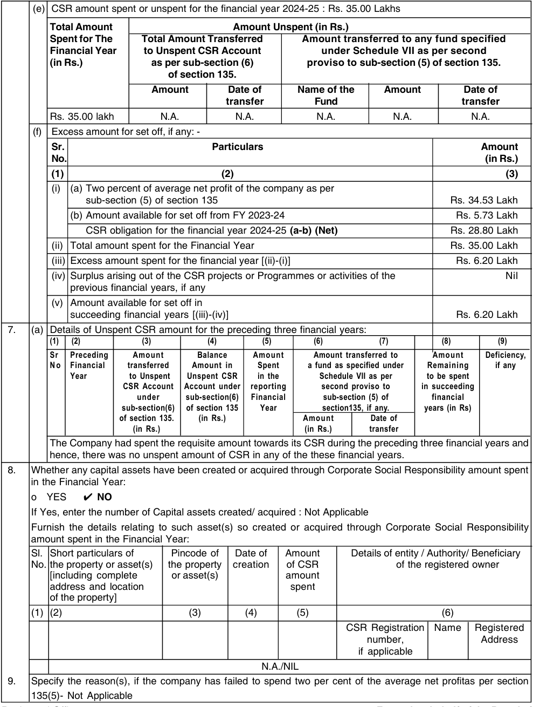

**[Image: AR_27786_SAKAR_2024_2025_A_4597943_28082025130003.pdf-0061-01.png (989x1310, 253.9KB)]**

<!-- Start of picture text -->
(e) CSR amount spent or unspent for the financial year 2024-25 : Rs. 35.00 Lakhs Total Amount                                                 Amount Unspent (in Rs.) Spent for The Total Amount Transferred Amount transferred to any fund specified Financial Year to Unspent CSR Account under Schedule VII as per second (in Rs.) as per sub-section (6) proviso to sub-section (5) of section 135. of section 135. Amount Date of Name of the Amount Date of transfer Fund transfer Rs. 35.00 lakh N.A. N.A. N.A. N.A. N.A. (f) Excess amount for set off, if any: - Sr.                                                         Particulars Amount No. (in Rs.) (1)                                                             (2) (3) (i) (a) Two percent of average net profit of the company as per sub-section (5) of section 135 Rs. 34.53 Lakh (b) Amount available for set off from FY 2023-24 Rs. 5.73 Lakh CSR obligation for the financial year 2024-25  (a-b) (Net) Rs. 28.80 Lakh (ii) Total amount spent for the Financial Year Rs. 35.00 Lakh (iii) Excess amount spent for the financial year [(ii)-(i)] Rs. 6.20 Lakh (iv) Surplus arising out of the CSR projects or Programmes or activities of the Nil previous financial years, if any (v) Amount available for set off in succeeding financial years [(iii)-(iv)] Rs. 6.20 Lakh 7. (a) Details of Unspent CSR amount for the preceding three financial years: (1)     (2) (3) (4) (5) (6) (7) (8) (9) Sr Preceding Amount Balance Amount Amount transferred to Amount Deficiency, No Financial transferred Amount in Spent a fund as specified under Remaining if any Year  to Unspent Unspent CSR in the Schedule VII as per to be spent CSR Account Account under reporting second proviso to in succeeding under sub-section(6) Financial sub-section (5) of financial sub-section(6) of section 135 Year section135, if any. years (in Rs) of section 135. (in Rs.) Amount Date of (in Rs.) (in Rs.) transfer The Company had spent the requisite amount towards its CSR during the preceding three financial years and hence, there was no unspent amount of CSR in any of the these financial years. 8. Whether any capital assets have been created or acquired through Corporate Social Responsibility amount spent in the Financial Year: o    YES          NO If Yes, enter the number of Capital assets created/ acquired : Not Applicable Furnish the details relating to such asset(s) so created or acquired through Corporate Social Responsibility amount spent in the Financial Year: Sl. Short particulars of Pincode of Date of Amount            Details of entity / Authority/ Beneficiary No. the property or asset(s) the property creation of CSR of the registered owner [including complete or asset(s) amount address and location spent of the property] (1) (2) (3) (4) (5) (6) CSR Registration Name Registered number, Address if applicable N.A./NIL 9. Specify the reason(s), if the company has failed to spend two per cent of the average net profitas per section 135(5)- Not Applicable <!-- End of picture text -->

Registered Office Block No. 10/13, Village: Changodar, Sarkhej- Bavla Highway, Tal: Sanand, Dist: Ahmedabad -382 213 Date : 25th July, 2025 

**For and on behalf of the Board of Sakar Healthcare Limited, [CIN: L24231GJ2004PLC043861] Sanjay S. Shah Aarsh S. Shah Chairman of CSR Committee & Jt. Managing Director Managing Director DIN:05294294 DIN: 01515296** 

FY 2024-25  Annual Report 

**57** 

**ANNEXURE – E** 

**[Image: AR_27786_SAKAR_2024_2025_A_4597943_28082025130003.pdf-0062-01.png (347x13, 10.1KB)]**

###### **<u>FORM AOC-I</u>** 

(Pursuant to first proviso to sub-section (3) of section 129 of the Companies Act, 2013, read with Rule 5 of Companies (Accounts) Rules, 2014) 

###### **PART “A”: SUBSIDIARIES** 

Statement pursuant to Section 129 (3) of the Companies Act, 2013 related to Subsidiary Companies. 

1. No. of Subsidiaries : 1 (One) 

|**Sr.No.**|**Particulars**|**Details**|
|---|---|---|
|1.|CIN/ any other registration number of subsidiary company|U24297GJ2020PTC113326|
|2.|Name of the subsidiary|Sakar Oncology Private Limited|
|3.|Date since when subsidiary was acquired|29thMarch, 2020|
|4.|Provisions pursuant to which the company has become a subsidiary|Section 2(87)(ii) of the Companies Act, 2013|
|5.|Reporting period for the subsidiary concerned, if different from the holding company’s reporting period|1stApril, 2024 to 31stMarch, 2025|
|6.|Reporting currency and Exchange rate as on the last date of the relevant Financial year in the case of foreign subsidiaries|Not Applicable|
|7.|Share Capital|Rs.1,00,000/-|
|8.|Reserves & surplus|Rs. (8,52,035)|
|9.|Total assets|Rs. 20,000|
|10.|Total Liabilities|Rs. 7,72,035|
|11.|Investments|Rs.|
|12.|Turnover|Rs.|
|13.|Profit / Loss before taxation|Rs.|
|14.|Provision for taxation|Rs.|
|15.|Profit / Loss after taxation|Rs.|
|16.|Proposed Dividend|Rs.|
|17.|% of shareholding|100%|

2. Number of subsidiaries which are yet to commence operations: Nil 3. Number of subsidiaries which have been liquidated or have ceased to be a subsidiary during the year: Nil 

###### **PART “B”: ASSOCIATES AND JOINT VENTURES** 

The Company does not have any Associate companies/ JVs. 

Registered Office Block No. 10/13, Village: Changodar, Sarkhej- Bavla Highway, Tal: Sanand, Dist: Ahmedabad -382 213 Date : 25th July, 2025 

**For and on behalf of the Board of Sakar Healthcare Limited, [CIN: L24231GJ2004PLC043861] Sanjay S. Shah Aarsh S. Shah Chairman & Managing Director Jt. Managing Director DIN:01515296 DIN: 05294294** 

FY 2024-25  Annual Report 

**58** 

**Annexure –F** 

**[Image: AR_27786_SAKAR_2024_2025_A_4597943_28082025130003.pdf-0063-01.png (347x13, 10.1KB)]**

###### **CERTIFICATE OF NON-DISQUALIFICATION OF DIRECTORS** 

[Pursuant to Regulation 34(3) and Schedule V Para C clause (10)(i) of the SEBI (Listing Obligations and Disclosure Requirements) Regulations, 2015] 

To, The Members of **Sakar Healthcare Limited** Block No. 10/13, Village: Changodar, Sarkhej-Bavla Highway, Tal: Sanand, Dist: Ahmedabad, Changodar, Ahmedabad – 382 213 

We have examined the relevant registers, records, forms, returns and disclosures received from the Directors of **Sakar Healthcare Limited** having CIN: L24231GJ2004PLC043861 and having registered office at Block No. 10/13, Village: Changodar, Sarkhej-Bavla Highway, Tal: Sanand, Dist: Ahmedabad, Changodar, Ahmedabad – 382 213 (hereinafter referred to as ‘the Company’), produced before us by the  Company for the purpose of issuing this Certificate, in accordance with Regulation 34(3) read with Schedule V Para-C Sub clause 10(i) of the Securities Exchange Board of India (Listing Obligations and Disclosure Requirements) Regulations, 2015. 

In our opinion and to the best of our information and according to the verifications (including Directors Identification Number (DIN) status at the portal www.mca.gov.in) as considered necessary and explanations furnished to me / us by the Company & its officers, we hereby certify that none of the Directors on the Board of the Company as stated below for the Financial Year ending on 31st March, 2025 have been debarred or disqualified from being appointed or continuing as Directors of companies by the Securities and Exchange Board of India, Ministry of Corporate Affairs or any such other Statutory Authority: 

|**Sr. No.**|**Name of Director**|**DIN**|**Date of Appointment**|
|---|---|---|---|
|1|Sanjay Surendra Shah|01515296|26-03-2004|
|2|Rita Sanjay Shah|01515340|26-03-2004|
|3|Shailesh Bhanubhai Patel|01835567|01-04-2015|
|4|Prashant Chandraprakash Srivastav|02257146|01-04-2015|
|5|Aarsh Sanjay Shah|05294294|01-06-2012|
|6|Hemendrakumar C. Shah|00077654|28-09-2020|
|7|Vishalakshi Chandramouli|03594109|01-09-2023|
|8|Jignesh Mukundbhai Parikh|01303311|06-11-2023|
|9|Khyati Bhavya Shah|09430457|06-11-2023|
|10|Sunil Vasantrao Marathe|08777180|06-11-2023|

Ensuring the eligibility for the appointment / continuity of every Director on the Board is the responsibility of the management of the Company. Our responsibility is to express an opinion on these based on our verification. This certificate is neither an assurance as to the future viability of the Company nor of the efficiency or effectiveness with which the management has conducted the affairs of the Company. 

**FOR KASHYAP R. MEHTA & ASSOCIATES** COMPANY SECRETARIES FRN:  S2011GJ166500 

Place : Ahmedabad Date : 25th July, 2025 

**KASHYAP R. MEHTA** PROPRIETOR FCS: 1821 COP-2052  PR-5709/2024 UDIN : F001821G000858677 

FY 2024-25  Annual Report 

**59** 

**[Image: AR_27786_SAKAR_2024_2025_A_4597943_28082025130003.pdf-0064-00.png (347x13, 10.1KB)]**

###### **INDEPENDENT AUDITOR'S REPORT** 

###### To, 

The Members, 

###### **SAKAR HEALTHCARE LIMITED** 

###### **Report on the Audit of the Standalone financial statements** 

###### **Opinion** 

We have audited the accompanying standalone financial statements of Sakar Healthcare Limited (“the Company”), which comprise the Balance Sheet as at March 31, 2025, and the Statement of Profit and Loss (including Other Comprehensive Income), the Cash Flow Statement and the Statement of Changes in Equity for the year then ended, and a summary of significant accounting policies and other explanatory information. ( hereinafter referred to as the “standalone financial statements”). 

In our opinion and to the best of our information and according to the explanations given to us, the aforesaid standalone financial statements give the information required by the Companies Act, 2013 (“the Act”) in the manner so required and give a true and fair view in conformity with the Indian Accounting Standards prescribed under section 133 of the Act read with the Companies (Indian Accounting Standards) Rules, 2015, as amended, (“Ind AS”) and other accounting principles generally accepted in India, of the state of affairs of the Company as at March 31, 2025, and its profit, total comprehensive income, its cash flows and the changes in equity for the year ended on that date. 

###### **Basis for opinion** 

We conducted our audit of the standalone financial statements in accordance with the Standards on auditing specified under section 143(10) of the Act. Our responsibilities under those Standards are further described in the Auditor’s Responsibility for the Audit of the standalone financial statements section of our report. We are independent of the Company in accordance with the Code of Ethics issued by the Institute of Chartered Accountants of India (“ICAI”) together with the ethical requirements that are relevant to our audit of the standalone financial statements under the provisions of the Act and the Rules made thereunder, and we have fulfilled our other ethical responsibilities in accordance with these requirements and the ICAI’s Code of Ethics. We believe that the audit evidence obtained by us in terms of report referred to in the Other Matters section below, is sufficient and appropriate to provide a basis for our audit opinion on the standalone financial statements. 

###### **Key audit matters** 

Key audit matters are those matters that, in our professional judgment, were of most significance in our audit of the Financial Statements of the current period. These matters were addressed in the context of our audit of the Financial Statements as a whole, and in forming our opinion thereon, and we do not provide a separate opinion on these matters. 

We have determined the matters described below to be the key audit matters to be communicated in our report. 

|The Key Audit matter|How our audit addressed the key audit matter|
|---|---|
|Existence and Valuation of Inventory: The Company has an inventory balance of Rs. 4359.24/- lacs as disclosed note 7 of the accompanying financial statements, Refer notes for the accounting policy adopted by the management with respect to inventory balance. With respect to existence of inventory as at year end, there is an inherent risk of loss from theft or possible mala fide intent, due to the high intrinsic value and portable nature of individual inventory items. With respect to valuation of the inventory, the company purchased into the respective cost categories purchase into the respective cost categories defined by the management based on price based and other physical characteristics|As part of our audit procedures: Obtained an understanding of the management’s process for physical verification, recognition and measurement of purchase cost of manufactured items. Evaluated the tested the operating effectiveness of control implemented by the company with respect to such process including control around safeguarding the high value of inventory items. Assessed the appropriateness of accounting policy and management valuation methodology adopted by the management. On sample basis, tested invoice and other underlying records to validate the costs and characteristics basis which the inventory is categorized for inventory management and valuation. Consequently, we have performed alternate procedures to audit the existence of inventory as per the guidance provided in SA 501 “Audit Evidence - Specific Considerations for Selected Items” and have obtained sufficient appropriate audit evidence to issue our opinion on these Standalone Financial Results. Our report on the Statement is not modified in respect of the above matters.|

FY 2024-25  Annual Report 

**60** 

**[Image: AR_27786_SAKAR_2024_2025_A_4597943_28082025130003.pdf-0065-00.png (347x13, 10.1KB)]**

###### **Information other than the Financial Statements and Auditors’ Report thereon** 

The Company’s Board of Directors is responsible for the other information. The other information comprises the information included in the Management Discussion and Analysis, Business Responsibility Report, Board’s Report and Corporate Governance Report, but does not include the consolidated financial statements, the standalone financial statements and our audit reports thereon. 

Our opinion on the standalone financial statements does not cover the other information and we do not express any form of assurance conclusion thereon. 

In connection with our audit of the standalone financial statements, our responsibility is to read the other information and, in doing so, consider whether the other information is materially inconsistent with the standalone financial statements or our knowledge obtained during the course of our audit or otherwise appears to be materially misstated. 

If, based on the work we have performed, we conclude that there is a material misstatement of this other information, we are required to report that fact. We have nothing to report in this regard. 

###### **Management’s Responsibility for the Standalone Financial Statements** 

The Company’s Board of Directors is responsible for the matters stated in section 134(5) of the Act with respect to the preparation of these standalone financial statements that give a true and fair view of the financial position, financial performance including other comprehensive income, cash flows and changes in equity of the Company in accordance with the Ind AS and other accounting principles generally accepted in India. This responsibility also includes maintenance of adequate accounting records in accordance with the provisions of the Act for safeguarding the assets of the Company and for preventing and detecting frauds and other irregularities; selection and application of appropriate accounting policies; making judgments and estimates that are reasonable and prudent; and design, implementation and maintenance of adequate internal financial controls, that were operating effectively for ensuring the accuracy and completeness of the accounting records, relevant to the preparation and presentation of the standalone financial statements that give a true and fair view and are free from material misstatement, whether due to fraud or error. 

In preparing the standalone financial statements, management is responsible for assessing the Company’s ability to continue as a going concern, disclosing, as applicable, matters related to going concern and using the going concern basis of accounting unless management either intends to liquidate the Company or to cease operations, or has no realistic alternative but to do so. 

Those Board of Directors are also responsible for overseeing the Company’s financial reporting process. 

###### **Auditor’s Responsibilities for the Audit of the Standalone Financial Statements** 

Our objectives are to obtain reasonable assurance about whether the standalone financial statements as a whole are free from material misstatement, whether due to fraud or error, and to issue an auditor’s report that includes our opinion. Reasonable assurance is a high level of assurance, but is not a guarantee that an audit conducted in accordance with SAs will always detect a material misstatement when it exists. Misstatements can arise from fraud or error and are considered material if, individually or in the aggregate, they could reasonably be expected to influence the economic decisions of users taken on the basis of these standalone financial statements. 

As part of an audit in accordance with SAs, we exercise professional judgment and maintain professional skepticism throughout the audit. We also: 

- Identify and assess the risks of material misstatement of the standalone financial statements, whether due to fraud or error, design and perform audit procedures responsive to those risks, and obtain audit evidence that is sufficient and appropriate to provide a basis for our opinion. The risk of not detecting a material misstatement resulting from fraud is higher than for one resulting from error, as fraud may involve collusion, forgery, intentional omissions, misrepresentations, or the override of internal control. 

- Obtain an understanding of internal financial control relevant to the audit in order to design audit procedures that are appropriate in the circumstances. Under section 143(3)(i) of the Act, we are also responsible for expressing our opinion on whether the Company has adequate internal financial controls system in place and the operating effectiveness of such controls. 

- Evaluate the appropriateness of accounting policies used and the reasonableness of accounting estimates and related disclosures made by the management. 

- Conclude on the appropriateness of management’s use of the going concern basis of accounting and, based on the audit evidence obtained, whether a material uncertainty exists related to events or conditions that may cast significant doubt on the Company’s ability to continue as a going concern. If we conclude that a material uncertainty exists, we are required to draw attention in our auditor’s report to the related disclosures in the standalone financial statements or, if such disclosures are inadequate, to modify our opinion. Our conclusions are based on the audit evidence obtained up to the date of our auditor’s report. However, future events or conditions may cause the Company to cease to continue as a going concern. 

FY 2024-25  Annual Report 

**61** 

**[Image: AR_27786_SAKAR_2024_2025_A_4597943_28082025130003.pdf-0066-00.png (347x13, 10.1KB)]**

- Evaluate the overall presentation, structure and content of the standalone financial statements, including the disclosures, and whether the standalone financial statements represent the underlying transactions and events in a manner that achieves fair presentation. 

- Materiality is the magnitude of misstatements in the standalone financial statements that, individually or in aggregate, makes it probable that the economic decisions of a reasonably knowledgeable user of the standalone financial statements may be influenced. We consider quantitative materiality and qualitative factors in (i) planning the scope of our audit work and in evaluating the results of our work; and (ii) to evaluate the effect of any identified misstatements in the standalone financial statements. 

We communicate with those charged with governance regarding, among other matters, the planned scope and timing of the audit and significant audit findings, including any significant deficiencies in internal control that we identify during our audit. 

We also provide those charged with governance with a statement that we have complied with relevant ethical requirements regarding independence, and to communicate with them all relationships and other matters that may reasonably be thought to bear on our independence, and where applicable, related safeguards. 

From the matters communicated with those charged with governance, we determine those matters that were of most significance in the audit of the standalone financial statements of the current year and are therefore the key audit matters. We describe these matters in our auditor’s report unless law or regulation precludes public disclosure about the matter or when, in extremely rare circumstances, we determine that a matter should not be communicated in our report because the adverse consequences of doing so would reasonably be expected to outweigh the public interest benefits of such communication. 

###### **Report on Other Legal and Regulatory Requirements** 

1. As required by section 143(3) of the Act, based on our audit we report that: 

   - a) We have sought and obtained all the information and explanations which to the best of our knowledge and belief were necessary for the purposes of our audit. 

   - b) In our opinion, proper books of account as required by law have been kept by the Company so far as it appears from our examination of those books. 

   - c) The Balance Sheet, the Statement of Profit and Loss including Other Comprehensive Income, the Cash Flow Statement and Statement of Changes in Equity dealt with by this report are in agreement with the books of account. 

   - d) In our opinion, the aforesaid standalone financial statements comply with the Ind AS specified under section 133 of the Act. 

   - e) On the basis of the written representations received from the directors as on March 31, 2025 taken on record by the Board of Directors, none of the directors is disqualified as on March 31, 2025 from being appointed as a director in terms of section 164(2) of the Act. 

   - f) With respect to the adequacy of the internal financial controls over financial reporting of the Company and the operating effectiveness of such controls, refer to our separate Report in “Annexure A”. Our report expresses an unmodified opinion on the adequacy and operating effectiveness of the Company’s internal financial controls over financial reporting. 

   - g) With respect to the other matters to be included in the Auditor’s Report in accordance with the requirements of section 197(16) of the Act, as amended: 

In our opinion and to the best of our information and according to the explanations given to us, the remuneration paid by the Company to its directors during the year is in accordance with the provisions of section 197 of the Act. 

- h) With respect to the other matters to be included in the Auditor’s Report in accordance with Rule 11 of the Companies (Audit and Auditors) Rules, 2014, as amended, in our opinion and to the best of our information and according to the explanations given to us: 

   - i. The company has disclosed the impact of pending litigations on its financial position in its standalone financial statement. Refer Clause Vii(b) of Annexure - B to the standalone financial statements. 

   - ii. The Company did not have any long-term contracts including derivative contracts for which there were any material foreseeable losses. 

   - iii. There were no amounts which were required to be transferred, to the Investor Education and Protection Fund by the Company. 

FY 2024-25  Annual Report 

**62** 

**[Image: AR_27786_SAKAR_2024_2025_A_4597943_28082025130003.pdf-0067-00.png (347x13, 10.1KB)]**

   - iv. Based on our examination which included test checks, the company has used an accounting software for maintaining its books of account which have a feature of recording audit trail (edit log) facility and the same was operated throughout the year for all relevant transactions recorded in the software. 

2. As required by the Companies (Auditor’s Report) Order, 2020 (“the Order”) issued by the Central Government in terms of section 143(11) of the Act, we give in “Annexure B” a statement on the matters specified in paragraphs 3 and 4 of the Order. 

Place : Ahmedabad Date : 15.05.2025 

**For J S Shah & Co** Chartered Accountants FRN  : 132059W Jaimin S Shah Partner Membership No. : 138488 UDIN : 25138488BMIAZR4452 

###### **Annexure “A” to the Independent Auditor’s Report** 

###### **(Referred to in paragraph 1(g) under ‘Report on Other Legal and Regulatory Requirements’ section of our report of even date)** 

###### **Report on the Internal Financial Controls over Financial Reporting Under Clause (i) of sub-section 3 of section 143 of companies Act 2013 ( the”Act”)** 

We have audited the internal financial controls over financial reporting of Sakar Healthcare Limited as of March 31, 2025 in conjunction with our audit of the standalone financial statements of the Company for the year ended on that date. 

###### **Management’s Responsibility for Internal Financial Controls** 

The Company’s management is responsible for establishing and maintaining internal financial controls based on the internal control over financial reporting criteria established by the Company considering the essential components of internal control stated in the Guidance Note on Audit of Internal Financial Controls Over Financial Reporting issued by the Institute of Chartered Accountants of India. These responsibilities include the design, implementation and maintenance of adequate internal financial controls that were operating effectively for ensuring the orderly and efficient conduct of its business, including adherence to company’s policies, the safeguarding of its assets, the prevention and detection of frauds and errors, the accuracy and completeness of the accounting records, and the timely preparation of reliable financial information, as required under the Act. 

###### **Auditor’s Responsibility** 

Our responsibility is to express an opinion on the Company’s internal financial controls over financial reporting of the Company based on our audit. We conducted our audit in accordance with the Guidance Note on Audit of Internal Financial Controls Over Financial Reporting (the “Guidance Note”) issued by the Institute of Chartered Accountants of India and the Standards on Auditing prescribed under section 143(10) of the Act, to the extent applicable to an audit of internal financial controls. Those Standards and the Guidance Note require that we comply with ethical requirements and plan and perform the audit to obtain reasonable assurance about whether adequate internal financial controls over financial reporting was established and maintained and if such controls operated effectively in all material respects. 

Our audit involves performing procedures to obtain audit evidence about the adequacy of the internal financial controls system over financial reporting and their operating effectiveness. Our audit of internal financial controls over financial reporting included obtaining an understanding of internal financial controls over financial reporting, assessing the risk that a material weakness exists, and testing and evaluating the design and operating effectiveness of internal control based on the assessed risk. The procedures selected depend on the auditor’s judgement, including the assessment of the risks of material misstatement of the financial statements, whether due to fraud or error. 

We believe that the audit evidence we have obtained, is sufficient and appropriate to provide a basis for our audit opinion on the Company’s internal financial controls system over financial reporting. 

###### **Meaning of Internal Financial Controls over Financial Reporting** 

A company’s internal financial control over financial reporting is a process designed to provide reasonable assurance regarding the reliability of financial reporting and the preparation of financial statements for external purposes in accordance with generally accepted accounting principles. A company’s internal financial control over financial reporting includes those policies and procedures that (1) pertain to the maintenance of records that, in reasonable detail, accurately and fairly reflect the transactions and dispositions of the assets of the company; (2) provide reasonable assurance that transactions are recorded as necessary to permit preparation of financial statements in accordance with generally accepted accounting principles, and that receipts and expenditures of the company are being made only in accordance with authorisations of management and directors of the company; and (3) provide reasonable assurance regarding prevention 

FY 2024-25  Annual Report 

**63** 

**[Image: AR_27786_SAKAR_2024_2025_A_4597943_28082025130003.pdf-0068-00.png (347x13, 10.1KB)]**

or timely detection of unauthorised acquisition, use, or disposition of the company’s assets that could have a material effect on the financial statements. 

###### **Inherent Limitations of Internal Financial Controls over Financial Reporting** 

Because of the inherent limitations of internal financial controls over financial reporting, including the possibility of collusion or improper management override of controls, material misstatements due to error or fraud may occur and not be detected. Also, projections of any evaluation of the internal financial controls over financial reporting to future periods are subject to the risk that the internal financial control over financial reporting may become inadequate because of changes in conditions, or that the degree of compliance with the policies or procedures may deteriorate. 

###### **Opinion** 

In our opinion, to the best of our information and according to the explanations given to us, the Company has, in all material respects, an adequate internal financial controls system over financial reporting and such internal financial controls over financial reporting were operating effectively as at March 31, 2025, based on the criteria for internal financial control over financial reporting established by the Company considering the essential components of internal control stated in the Guidance Note on Audit of Internal Financial Controls Over Financial Reporting issued by the Institute of Chartered Accountants of India. 

**For J S Shah & Co** Chartered Accountants FRN: 132059W Jaimin S Shah Place : Ahmedabad Partner Date : 15.05.2025 Membership No. : 138488 UDIN : 25138488BMIAZR4452 

###### **ANNEXURE - B TO THE INDEPENDENT AUDITORS’ REPORT** 

**(** Referred to in paragraph 2 under ‘Report on Other Legal and Regulatory Requirements’ section of our report of even date) 

###### I **n terms of the information and explanations sought by us and given by the Company and the books of account and records examined by us in the normal course of audit and to the best of our knowledge and belief, we state that:** 

- (i) (a) (A) The Company has maintained proper records showing full particulars, including quantitative details and situation of Property, Plant and Equipment, capital work-in progress and relevant details of right-of-use assets. 

      - (B) The Company has maintained proper records showing full particulars of intangible assets. 

   - (b) Some of the Property, Plant and Equipment, capital work-in-progress and right-of-use assets were physically verified during the year by the Management in accordance with a programme of verification, which in our opinion provides for physical verification of all the Property, Plant and Equipment, capital work-in-progress and right of-use assets at reasonable intervals having regard to the size of the Company and the nature of its activities. According to the information and explanations given to us, no material discrepancies were noticed on such verification. 

   - (c) With respect to immovable properties (other than properties where the Company is the lessee and the lease agreements are duly executed in favour of the Company) disclosed in the financial statements included in property, plant and equipment and capital work-in progress, according to the information and explanations given to us and based on the examination of the registered sale deed / transfer deed / conveyance deed provided to us, we report that, the title deeds of such immovable properties are held in the name of the Company as at the balance sheet date. 

   - (d) The Company has not revalued any of its property, plant and equipment (including Right of Use assets) and intangible assets during the year. 

   - (e) According to the information and explanations given to us, no proceedings have been initiated during the year or are pending against the Company as at March 31, 2025 for holding any benami property under the Benami Transactions (Prohibition) Act, 1988 (as amended in 2016) and rules made thereunder. 

- (ii) (a) The inventories  were physically verified during the year by the Management at reasonable intervals. In our opinion and based on information and explanations given to us, the coverage and procedure of such verification by the Management is appropriate having regard to the size of the Company and the nature of its operations. 

   - (b) According to the information and explanations given to us, the Company has been sanctioned working capital limits in excess of  5 crores, in aggregate, at points of time during the year, from banks on the basis of security of current assets. 

In our opinion and according to the information and explanations given to us, the quarterly returns and statements comprising stock statements, book debt statements, statements on ageing analysis of the debtors and other 

FY 2024-25  Annual Report 

**64** 

**[Image: AR_27786_SAKAR_2024_2025_A_4597943_28082025130003.pdf-0069-00.png (347x13, 10.1KB)]**

stipulated financial information filed by the Company with such banks are in agreement with the unaudited books of account of the Company, of the respective quarters. 

- (iii) The Company has made investments in, provided guarantee and granted loans, secured or unsecured, to companies, firms and Limited Liability Partnerships during the year, in respect of which: 

   - (a) The Company has not provided any loans or advances in nature of loans or stood guarantee, or provided security to any other entity during the year. 

   - (b) The investments made, guarantees provided and the terms and conditions of the grant of all the abovementioned loans and guarantees provided, during the year are, in our opinion, prima facie, not prejudicial to the Company’s interest. 

   - (c) In respect of loans granted by the Company, the schedule of repayment of principal and payment of interest has been stipulated and the repayments of principal amounts and receipts of interest are regular as per stipulation. 

   - (d) According to information and explanations given to us and based on the audit procedures performed, in respect of loans granted and advances in the nature of loans provided by the Company, there is no overdue amount remaining outstanding as at the balance sheet date. 

   - (e) No loan granted by the company which has fallen due during the year, has been renewed or extended or fresh loans granted to settle the overdues of existing loans given to the same parties. 

   - (f) According to information and explanations given to us and based on the audit procedures performed, the Company has not granted any loans either repayable on demand or without specifying any terms or period of repayment during the year. Hence, reporting under clause (iii)(f) is not applicable. 

- (iv) The Company has complied with the provisions of sections 185 and 186 of the Act in respect of loans granted, investments made and guarantees and securities provided, as applicable. 

- (v) According to the information and explanations given to us, the Company has not accepted any deposits from the public to which the directives issued by the Reserve Bank of India and the provisions of section 73 to 76 or any other relevant provisions of the Act and the Companies (Acceptance of Deposit) Rules, 2014, as amended, would apply. Accordingly, clause (v) of paragraph 3 of the Order is not applicable to company. 

- (vi) The maintenance of cost records has not been specified by the Central Government under sub- section (1) of section 148 of the Companies Act, 2013 for the business activities carried out by the Company. Hence, reporting under clause (vi) of the order is not applicable to the Company. 

- (vii) In respect of statutory dues: 

   - (a) The company has generally been regular in depositing undisputed statutory dues, including Goods and Service tax, Provident Fund, Employees’ State Insurance, Income-tax, Sales Tax, Service Tax, duty of Custom, duty of Excise, Value Added Tax, cess and other material statutory dues applicable to it with appropriate authorities. 

   - (b) The dues of duty of goods and services tax, duty of excise, provident fund, employees’ state insurance, income tax, duty of customs, professional tax, cess and other statutory dues which have not been deposited on account of any dispute, are as follows: 

|Name of the Statue|Nature of the dues|Amount involved|Period to which the Amount relates|Forum where the dispute is pending|
|---|---|---|---|---|
|__________ Income Tax Act|___________ Income Tax demand|___________ Rs.5,14,148/-|____________ Assessment Year 2020-21|______________________ Tax Appellate Tribunal|
|Income Tax Act|Income Tax demand|Rs.7,16,39,740/-|Assessment Year 2020-21|Tax Appellate Tribunal|

- (viii) There were no transactions relating to previously unrecorded income that were surrendered or disclosed as income in the tax assessments under the Income Tax Act, 1961 (43 of 1961) during the year. 

- (ix) (a) In our opinion, the Company has not defaulted in the repayment of loans or other borrowings or in the payment of interest thereon to any lender during the year. 

   - (b) The Company has not been declared wilful defaulter by any bank or financial institution or government or any government authority. 

   - (c) To the best of our knowledge and belief, in our opinion, term loans availed by the Company were, applied by the Company during the year for the purposes for which the loans were obtained. 

   - (d) On an overall examination of the financial statements of the Company, funds raised on shortterm basis have, prima facie, not been used during the year for long-term purposes by the Company. 

   - (e) On an overall examination of the financial statements of the Company, the Company has not taken any funds from any entity or person on account of or to meet the obligations of its subsidiaries. 

FY 2024-25  Annual Report 

**65** 

**[Image: AR_27786_SAKAR_2024_2025_A_4597943_28082025130003.pdf-0070-00.png (347x13, 10.1KB)]**

   - (f) On overall examination of the financial statement of the company, the Company has not raised loans during the year on the pledge of securities held in its subsidiaries, associates or joint ventures. 

- (x) (a) The Company has not raised monies by way of initial public offer or further offer (including debt instruments) during the year and hence reporting under clause (x)(a) of the Order is not applicable. 

   - (b) The Company has made preferential allotment of shares during the year. For such allotmentof shares, the Company has complied with the requirements of Section 42 and 62 of the Companies Act, 2013, and the funds raised have been, prima facie, applied by the Company during the year for the purposes for which the funds were raised, other than temporary deployment pending application. The Company has not made any preferential allotment or private placement of (fully or partly or optionally) convertible debentures during the year. 

- (xi) (a) To the best of our knowledge and according to the information & explanation given to us, no fraud by the Company and no material fraud on the Company has been noticed or reported during the year. 

   - (b) To the best of our knowledge, no report under sub-section (12) of section 143 of the Act has been filed in Form ADT-4 as prescribed under rule 13 of Companies (Audit and Auditors) Rules, 2014 with the Central Government, during the year and up to the date of this report. 

   - (c) As represented to us by the Management, there were no whistle blower complaints received by the Company during the year and up to the date of this report. 

- (xii) The Company is not a Nidhi Company and hence reporting under clause (xii) of the Order is not applicable. 

- (xiii) In our opinion, the Company is in compliance with sections 177 and 188 of the Act, where applicable, for all transactions with the related parties and the details of related party transactions have been disclosed in the financial statements as required by the applicable accounting standards. 

- (xiv) (a) In our opinion, the Company has an adequate internal audit system commensurate with the size and the nature of its business. 

   - (b) We have considered, the internal audit reports for the year under audit, issued to the Company during the year and till date, in determining the nature, timing and extent of our audit procedures. 

- (xv) In our opinion, and according to the information & explanation given to us,during the year, the Company has not entered into any non-cash transactions with any of its directors or directors of its subsidiaries or persons connected with such directors and hence provisions of section 192 of the Act, are not applicable to the Company. 

- (xvi) (a) The Company is not required to be registered under section 45-IA of the Reserve Bank of India Act, 1934. Hence, reporting under clause (xvi)(a), (b) and (c) of the Order is not applicable. 

   - (b) In our opinion, there is no core investment company within the Group(as defined in the core Investment Companies (Reserve Bank) Directions, 2016) and accordingly reporting under clause (xvi)(d) of the oder is not applicable. 

- (xvii) The Company has not incurred cash losses during the financial year covered by our audit and the immediately preceding financial year. 

(xviii)There has been no resignation of the statutory auditors of the Company during the year. 

- (xix) On the basis of the financial ratios, ageing and expected dates of realization of financial assets and payment of financial liabilities, other information accompanying the financial statements and our knowledge of the Board of Directors and Management plans and based on our examination of the evidence supporting the assumptions, nothing has come to our attention, which causes us to believe that any material uncertainty exists as on the date of the audit report indicating that Company is not capable of meeting its liabilities existing at the date of balance sheet as and when they fall due within a period of one year from the balance sheet date. We, however, state that this is not an assurance as to the future viability of the Company. We further state that our reporting is based on the facts up to the date of the audit report and we neither give any guarantee nor any assurance that all liabilities falling due within a period of one year from the balance sheet date, will get discharged by the Company as and when they fall due. 

- (xx) The Company has fully spent the required amount towards Corporate Social Responsibility (CSR) and there are no unspent CSR amount for the year requiring a transfer to a Fund specified in Schedule VII to the Act or special account in compliance with the provisions of sub-section (6) of section 135 of the said Act. Accordingly, reporting under clause (xx) of the Order is not applicable for the year. 

Place : Ahmedabad Date : 15.05.2025 

**For J S Shah & Co** Chartered Accountants FRN: 132059W Jaimin S Shah Partner Membership No. : 138488 UDIN : 25138488BMIAZR4452 

FY 2024-25  Annual Report 

**66** 

**[Image: AR_27786_SAKAR_2024_2025_A_4597943_28082025130003.pdf-0071-00.png (347x13, 10.1KB)]**

|**STANDALONE BALANCE SHE**|**ET AS AT**|**MARCH 31,**|**2025** **(Rs. in Lakhs)**|
|---|---|---|---|
|**Particulars** |**Notes**|**As at 31****st** **March 2025**|**As at 31****st** **March 2024**|
|**Assets**||||
|**Non-current assets**||||
|Property, plant and equipment|3|30,434.93|31,282.97|
|Capital Work in Progress|3|1,670.35|31.55|
|Other Intangible assets|3|461.07|145.72|
|Non-current financial assets||||
|Investments|4|1.00|1.00|
|Loans|5|30.06|30.06|
|Other non-current assets|6|56.97|214.32|
|||**32,654.38**|**31,705.62**|
|**Current assets**||||
|Inventories|7|4,359.24|2,773.23|
|Financial assets||||
|(i) Investments|4|-|-|
|(ii) Trade receivables|8|3,072.30|2,091.26|
|(iii)Cash and cash equivalents|9|9.96|25.59|
|(iv)Bank balance other than cash and cash equivalents|10 |20.77|20.77|
|(v) Loans|5|7.72|7.72|
|Other current assets|6|1,410.25|2,250.24|
|||**8,880.24**|**7,168.81**|
|**Total assets**||**41,534.62**|**38,874.43**|
|**Equity and liabilities**||||
|**Equity**||||
|Equityshare capital|11 |2,194.99|2,174.99|
|Other equity|12 |26,073.12|23,586.64|
|Moneyreceived against share warrants|13|288.00|480.00|
|**Total equity**||**28,556.11**|**26,241.63**|
|**Liabilities**||||
|**Non-current liabilities**||||
|Financial liabilities||||
|(i) Borrowings|14 |5,359.42|5,495.50|
|Provisions|15 |266.04|228.81|
|Deferred tax liabilities(net)|16 |1,034.44|1,002.46|
|||**6,659.90**|**6,726.77**|
|**Current liabilities**||||
|Financial liabilities||||
|(i) Borrowings|14 |2,136.05|1,388.00|
|(ii) Trade Payables|17 |2,106.65|2,745.34|
|(iii)Other financial liabilities|18 |1,142.00|1,051.66|
|Provisions|15|-|19.50|
|Other current liabilities|19 |801.30|577.92|
|Liabilities for current tax(net)|20 |132.60|123.60|
|||**6,318.61**|**5,906.03**|
|**Total liabilities**||**12,978.51**|**12,632.80**|
|**Total equity and liabilities**||**41,534.62**|**38,874.43**|
|**Summary of significant accounting policies refer note**|**2.2**|||
|**The accompanying notes form an integral part of financi**|**als statements**|||

As per our report of even date **For  J.S.SHAH & CO.** Chartered Accountants Firm Registration No.:132059W **Jaimin S Shah** Partner Membership No. 138488 UDIN: 25138488BMIAZR4452 Place : Ahmedabad Date : 15.05.2025 

**For and on behalf of the Board Sakar Healthcare Limited Sanjay S. Shah Aarsh S. Shah** Managing Director Joint Managing Director DIN: 01515296 DIN: 05294294 **Dharmesh Thaker Bharat Soni** Chief Financial Officer Company Secretary Place : Ahmedabad Date : 15.05.2025 

FY 2024-25  Annual Report 

**67** 

**[Image: AR_27786_SAKAR_2024_2025_A_4597943_28082025130003.pdf-0072-00.png (347x13, 10.1KB)]**

###### **STANDALONE STATEMENT OF PROFIT AND LOSS FOR THE PERIOD ENDED MARCH 31, 2025** 

|**Particulars** **Notes**|**Amo** **For the year** **ended 31****st** **March 2025**|**unt (Rs. in Lakhs)** **For the year** **ended 31****st** **March 2024**|
|---|---|---|
|**Income**|||
|Revenue from operations 21|17,758.47|15,335.17|
|Other income 22|131.27|317.71|
|**Total income**|**17,889.74**|**15,652.88**|
|**Expenses**|||
|Cost of Materials consumed 23|9,546.73|8,505.42|
|Changes in inventories of finishedgoods and work-in-progress 24|(1,320.46)|(137.67)|
|Employee benefits expense 25|3,164.85|1,978.38|
|Depreciation and amortization expense 3|2,088.22|1,805.04|
|Finance costs 26|853.50|759.05|
|Other expenses 27|1,399.03|1,152.68|
|**Total expenses**|**15,731.87**|**14,062.91**|
|**Profit before exceptional items and tax**|2,157.87|1,589.97|
|**Priorperiod Expense** |-|-|
|Exceptional items|5.14|-|
|**Profit before tax**|**2,152.73**|**1,589.97**|
|**Tax expense/(credit)** 28|||
|Current tax|366.03|273.65|
|Adjustment of tax relatingto earlierperiods|-|-|
|Deferred tax|402.53|422.88|
|Less: MAT credit entitlement|(366.03)|(273.65)|
|**Income tax expense**|**402.53**|**422.88**|
|**Profit for theyear**|**1,750.20**|**1,167.09**|
|Other comprehensive income|||
|**Other comprehensive income not to be reclassified to** **profit or loss in subsequentperiods**|||
|Re-measurementgains/(losses)on defined benefitplans|(16.23)|(14.80)|
|Income Tax effect|4.52|4.12|
||(11.72)|(10.68)|
|Fair valuegain on FVTOCI financial asset|-|-|
|Income Tax effect|-|-|
|**Other comprehensive income to be reclassified to** **profit or loss in subsequentperiods**|**-**|**-**|
|**Other comprehensive Income for theyear**|**(11.72)**|**(10.68)**|
|**Total comprehensive income for theyear**|**1,738.48**|**1,156.41**|
|**Basic earnings per shares(in**`**)** 30|**7.97**|**5.64**|
|**Diluted earnings per shares (in**`**)** 30   |**7.95**|**5.63**|
|**Summary of significant accounting policies refer note** **2.2** **The accompanying notes forman integral partof financials statements**|||
|As per our report of even date   **For and on behalf of t**|**he Board**||
|**For  J.S.SHAH & CO.** Chtd Att **Sakar Healthcare Lim**|**ited**||
|arere ccounans Firm Registration No.:132059W **Sanjay S. Shah** Mi Dit|**Aarsh S** Jit M|**. Shah** i Dit|
|**Jaimin S Shah**  anagng recor DIN: 01515296|on DIN: 05|nagng recor 294294|
|Partner Membership No. 138488 **Dharmesh Thaker** |**Bharat** |**Soni** |
| UDIN: 25138488BMIAZR4452 Chief Financial Officer|Compa|y Secretary|
|Place : Ahmedabad Place : Ahmedabad |||
|**68** Date : 15.05.2025 Date : 15.05.2025|FY 2024-25|Annual Repor|

FY 2024-25  Annual Report 

**[Image: AR_27786_SAKAR_2024_2025_A_4597943_28082025130003.pdf-0073-00.png (347x13, 10.1KB)]**

###### **STANDALONE OF CASH FLOW FOR THE YEAR ENDED MARCH 31, 2025** 

||**Amou** |**nt (Rs. in Lakhs)** |
|---|---|---|
|**Particulars**|**For the year** **ended 31****st** **March 2025**|**For the year** **ended 31****st** **March 2024**|
|**Cash flow from operating activities**|||
|**Profit before tax as per statement of profit and loss**|2,152.73|1,589.97|
|**Adjustments:**|||
|Depreciation and amortisation|2,088.22|1,805.04|
|Interest Expense|782.07|664.46|
|Profit on Sale of Mutual Fund|-|29.42|
|Loss on sale of assets|33.93|-|
|Amortised Loan Processing Fees|5.76|5.76|
|Accrued FD Interest|-|(1.12)|
|Changes in other equity|(16.23)|(14.80)|
|Provision for doubtful advances (net)|2.15|1.46|
|**Operating profit before working capital changes**|**5,048.63**|**4,080.20**|
|Movements in working capital :|||
|(Increase)/decrease in trade receivables|(983.20)|114.85|
|(Increase)/decrease in inventories|(1,586.00)|(1,233.48)|
|(Increase)/decrease in other current assets|839.99|(757.13)|
|Increase/(decrease) in trade payables|(638.69)|136.54|
|Increase/(decrease) in other current liabilities|294.22|261.39|
|Increase/(decrease) in provisions|(82.38)|73.18|
|Increase/(decrease) in short term borrowings|748.06|86.33|
|**Cash generated from operations**|**3,640.62**|**2,761.88**|
|Direct taxes (paid)/refund (net)|(237.42)|(315.19)|
|**Net cash Inflow / (Outflow) from operating activities (A)**|**3,403.20**|**2,446.69**|
|**Cash flows from investing activities**|||
|Purchase of property, plant and equipments (Including capital|||
|work in progress,capital advances and capital creditors)|(3,228.25)|(5,956.02)|
|Sale of Mutual Fund|-|313.51|
|Capital Advances|157.34|488.59|
|**Net cash inflow from investing activities (B)**|**(3,070.91)**|**(5,153.92)**|
|**Cash flows from financing activities**|||
|Proceeds from issuance of share capital|768.00|7,261.99|
|Proceeds from issue of share warrants|(192.00)|480.00|
|Proceeds from borrowing (net of Repayment)|(136.08)|(4,327.30)|
|Payment of Loan Processing Fees|(5.76)|(5.76)|
|Interest paid|(782.07)|(664.46)|
|**Net cash Inflow from financing activities (C)**|**(347.92)**|**2,744.47**|
|**Net increase / (decrease) in cash & cash equivalents (A + B + C)**|(15.62)|37.23|
|Cash and cash equivalents at the beginning of the year|46.36|9.13|
|**Cash and cash equivalents at the end of the period**|**30.74**|**46.36**|

FY 2024-25  Annual Report 

**69** 

**[Image: AR_27786_SAKAR_2024_2025_A_4597943_28082025130003.pdf-0074-00.png (347x13, 10.1KB)]**

|**Particulars**|**Amou** **For the year** **ended 31****st** **March 2025**|**nt (Rs. in Lakhs)** **For the year** **ended 31****st** **March 2024**|
|---|---|---|
|**Notes:**|||
|Component of cash and cash equivalents|||
|Cash on hand|9.73|25.25|
|Balances with scheduled bank|||
|On current accounts|0.23|0.34|
|Bank Balance other than Cash and cash equivalents|20.77|20.77|
|**Cash and Cash Equivalents at the End of the period**|**30.74**|**46.36**|

Summary of significant accounting policies refer note 2.2 

- (1) The Statement of Cash flows has been prepared under the Indirect method as set out in Ind AS 7 – Statement of Cash flows notified under section 133 of The Companies Act, 2013, read together with paragraph 7 of the Companies (Indian Accounting Standard) Rules 2015 (as amended). 

- (2) Disclosure required under Para 44A as set out in Ind AS 7 on cash flow statements under  Companies (Indian Accounting Standards) Rules, 2015 (as amended) is presented in footnote (a) of note -15. 

As per our report of even date **For  J.S.SHAH & CO.** Chartered Accountants Firm Registration No.:132059W 

**Jaimin S Shah** Partner Membership No. 138488 UDIN: 25138488BMIAZR4452 Place : Ahmedabad Date : 15.05.2025 

###### **For and on behalf of the Board Sakar Healthcare Limited** 

**Sanjay S. Shah** Managing Director DIN: 01515296 

**Aarsh S. Shah** 

Joint Managing Director DIN: 05294294 

**Bharat Soni** Company Secretary 

**Dharmesh Thaker** Chief Financial Officer 

Place : Ahmedabad Date : 15.05.2025 

FY 2024-25  Annual Report 

**70** 

**[Image: AR_27786_SAKAR_2024_2025_A_4597943_28082025130003.pdf-0075-00.png (347x13, 10.1KB)]**

###### **STATEMENT OF CHANGES IN EQUITY FOR THE YEAR ENDED 31 MARCH 2025** 

||||||**(R**|**s. In lakhs)**|
|---|---|---|---|---|---|---|
|**Particulars**|**Equity** **Share** **Capital**|**Reserve &** **Share** **Premium**|**Surplus** **Retained** **earnings **|**Deemed** **Equity**  **Contribution**|**Other** **comprehensive** **income Re-** **measurement** **of defined** **benefitplan**|**Total**|
|**Balance as at April 01, 2023**|**1,904.00**|**8,604.42**|**6,894.99**|**-**|**(60.17)**|**17,343.23**|
|Profit/(Loss) for the year|-|-|1,167.09|-|-|1,167.09|
|Movement for the year|-|6,991.00|-|-|(10.68)|6,980.32|
|Share issue during the year|270.99|-|-|-|-|270.99|
|**Balance as at March 31, 2024**|**2,174.99**|**15,595.42**|**8,062.08**|**-**|**(70.86)**|**25,761.63**|
|Profit/(Loss) for the year|-|-|1,750.20|-|-|1,750.20|
|Movement for the year|-|748.00|-|-|(11.72)|736.28|
|Share issue during the year|20.00|-|-|-|-|20.00|
|**Balance as at March 31, 2025**|**2,194.99**|**16,343.42**|**9,812.28**|**-**|**(82.57)**|**28,268.11**|

###### **The accompanying notes form an integral part of financials statements** 

As per our report of even date **For  J.S.SHAH & CO.** Chartered Accountants Firm Registration No.:132059W 

**Jaimin S Shah** Partner Membership No. 138488 UDIN: 25138488BMIAZR4452 Place : Ahmedabad Date : 15.05.2025 

###### **For and on behalf of the Board Sakar Healthcare Limited** 

**Sanjay S. Shah** Managing Director DIN: 01515296 

**Aarsh S. Shah** Joint Managing Director DIN: 05294294 

**Bharat Soni** Company Secretary 

**Dharmesh Thaker** Chief Financial Officer 

Place : Ahmedabad Date : 15.05.2025 

FY 2024-25  Annual Report 

**71** 

**[Image: AR_27786_SAKAR_2024_2025_A_4597943_28082025130003.pdf-0076-00.png (347x13, 10.1KB)]**

###### **Significant Accounting Policies** : 

###### **1 Corporate Information** 

Sakar Healthcare Limited is a company incorporated under the provisions of the Companies Act, 1956. It is engaged in manufacturing of Pharmaceutical products providing Liquid Orals, Cephalosporin Tablet, Capsule, Dry Powder Syrup, Dry Powder Injections, Liquid Injectable (SVP) in Ampoules,Vials & Lyophilized Injections, Oral Solid Dossages and Research & Development of above products. 

###### **2 Basis of Preparation, Measurement and Significant Accounting Policies** 

###### **2.1 Basis of Preparation of Financial Statements** 

The  financial statements of the Company have been prepared in accordance with Indian Accounting Standards (Ind AS) notified under the Companies (Indian Accounting Standards) Rules, 2015 (as amended). 

The Financial Statements have been prepared on the historical cost basis, except for certain financial instruments (including derivative instruments) which are measured at fair values at the end of each reporting period, as explained in the accounting policies below. 

Accounting policies have been consistently applied except where a newly-issued accounting standard is initially adopted or a revision to an existing accounting standard requires a change in accounting policy hitherto in use. 

###### **New and amended standards adopted by the Company** 

The Company has applied the following amendments for the first time for annual reporting period commencing from April 01, 2020 which do not have material impact on the financial statement:- 

Ind AS 1 - Presentation of Financial Statements 

Ind AS 8 - Accounting Policies, Changes in Accounting Estimates and Errors 

Ind AS 10 - Events after the Reporting Period Ind AS 37 - Provisions, Contingent Liabilities and Contingent Assets Ind AS 107 - Financial Instruments: Disclosures Ind AS 109 - Financial Instrument 

Ind AS 116 -  Leases 

The financial statements are presented in Indian rupees (INR) and all values are rounded to the nearest rupees, except numbers. 

###### **2.2 Significant accounting estimates and assumptions** 

The preparation of the Company’s financial statements requires management to make judgments, estimates and assumptions that affect the reported amounts of revenues, expenses, assets and liabilities, and the accompanying disclosures, and the disclosure of contingent liabilities. Uncertainty about these assumptions and estimates could result in outcomes that require a material adjustment to the carrying amount of assets or liabilities affected in future periods. 

###### **Estimates and assumptions** 

The key assumptions concerning the future and other key sources of estimation uncertainty at the reporting date, that have a significant risk of causing a material adjustment to the carrying amounts of assets and liabilities within the next financial year, are described below. The Company based on its assumptions and estimates on parameters available when the financial statements were prepared. Existing circumstances and assumptions about future developments, however, may change due to market changes or circumstances arising that are beyond the control of the Company. Such changes are reflected in the assumptions when they occur. 

###### **The significant estimates and judgments are listed below:** 

- **(i)** Changes in the expected useful life or the expected pattern of consumption of future economic benefits embodied in the asset are considered to modify the amortisation period or method, as appropriate, and are treated as changes in accounting estimates. 

- **(ii)** Judgments by actuaries in respect of discount rates, future salary increments, mortality rates and inflation rate used for computation of defined benefit liability. 

- **(iii)** Significant judgment is required in assessing at each reporting date whether there is indication that a financial asset may be impaired. 

- **(iv)** The impairment provision for financial assets are based on the assumptions about risk of default and expected loss rates. The company uses judgments in making the assumptions and selecting the inputs to the impairment calculations, based on the company’s past history, existing market conditions as well as forward looking estimates at the end of each reporting period. 

FY 2024-25  Annual Report 

**72** 

**[Image: AR_27786_SAKAR_2024_2025_A_4597943_28082025130003.pdf-0077-00.png (347x13, 10.1KB)]**

- **(v)** Significant judgment is required in assessing at each reporting date whether there is indication that a nonfinancial asset may be impaired. 

- **(vi)** Significant judgment is required to determine the amount of deferred tax assets that can be recognised, based upon the likely timing and level of future taxable profits together with future tax planning strategies. 

- **(vii)** In estimating the fair value of financial assets and financial liabilities, the Company uses market observable data to the extent available. Where such Level 1 inputs are not available, the Company establishes appropriate valuation techniques and inputs to the model. The inputs to these models are taken from observable markets where possible, but where this is not feasible, a degree of judgment is required in establishing fair values. Judgments include considerations of inputs such as liquidity risk, credit risk and volatility. Changes in assumptions about these factors could affect the reported fair value of financial instruments. 

- **(viii)** Significant judgment has been exercised by management in recognition of MAT credit and estimating the period of its utilization. 

###### **2.3 Summary of significant accounting policies** 

###### **a) Current versus non-current classification** 

The Company presents assets and liabilities in the balance sheet based on current/ non-current classification. An asset is treated as current when it is: 

- Expected to be realized or intended to be sold or consumed in normal operating cycle. 

- Held primarily for the purpose of trading. 

- Expected to be realized within twelve months after the reporting period, or 

- Cash or cash equivalent unless restricted from being exchanged or used to settle a liability for at least twelve months after the reporting period. 

- A liability is current when: 

- It is expected to be settled in normal operating cycle. 

- It is held primarily for the purpose of trading. 

- It is due to be settled within twelve months after the reporting period, or 

- There is no unconditional right to defer the settlement of the liability for at least twelve months after the reporting  period. 

The Company classifies all other liabilities as non-current. 

Deferred tax assets and liabilities are classified as non-current assets and liabilities. 

The operating cycle is the time between the acquisition of assets for processing and their realization in cash and cash equivalents. The Company has identified twelve months as its operating cycle. 

###### **b) Inventories** 

Stores and Spares: 

- Valued at lower of cost and net realizable value. Cost is determined on a moving weighted average basis. 

- Stores and Spares which do not meet the definition of property, plant and equipment are accounted as inventories. 

- Net Realizable Value in respect of store and spares is the estimated current procurement price in the ordinary course of the business. 

###### **c) Cash and cash equivalents** 

Cash and cash equivalents in the balance sheet comprises cash at banks and on hand and short-term deposits with an original maturity of three months or less, which are subject to an insignificant risk of changes in value. 

For the purpose of the statement of cash flows, cash and cash equivalents consist of cash and short-term deposits, as defined above, net of outstanding bank overdrafts as they are considered an integral part of the company’s cash management. 

###### **d) Property, plant and equipment (PPE)** 

Property, plant and equipment (including capital work in progress) is stated at cost, net of accumulated depreciation and accumulated impairment losses, if any. The cost comprises the purchase price, directly and indirectly attributable costs arising directly from the development of the asset / project to its working condition for the intended use. When significant parts of plant and equipment are required to be replaced at intervals, the 

FY 2024-25  Annual Report 

**73** 

**[Image: AR_27786_SAKAR_2024_2025_A_4597943_28082025130003.pdf-0078-00.png (347x13, 10.1KB)]**

company depreciates them separately based on their specific useful lives. Likewise, when a major inspection is performed, its cost is recognized in the carrying amount of the plant and equipment as a replacement if the recognition criteria are satisfied. All other repair and maintenance costs are recognized in profit or loss as incurred. 

Borrowing cost relating to acquisition / construction of property, plant & equipment which take substantial period of time to get ready for its intended use are also included to the extent they relate to the period till such assets are ready to be put to use. 

Depreciation is calculated on a straight line basis over the useful lives of the assets prescribed in the Companies Act, 2013. 

An item of property, plant and equipment and any significant part initially recognized is derecognized upon disposal or when no future economic benefits are expected from its use or disposal. Any gain or loss arising on derecognition of the asset (calculated as the difference between the net disposal proceeds and the carrying amount of the asset) is included in the income statement when the asset is derecognized. 

The residual values, useful lives and methods of depreciation of property, plant and equipment are reviewed at each financial year end and adjusted prospectively, if appropriate. 

During the year company has made advance payment for purchase of guest houses during the year to swati buildcon. Till 31st March 2025, purchase deed not executed hence interest on flat purchase transfer to capitalised.Further, During the year company has made rent to Aaron Infracon LLP which was transfer to work in progress. 

###### **e) Revenue recognition** 

Revenue is measured at the fair value of the consideration received or receivable, taking into account contractually defined terms of payment and excluding taxes or duties collected on behalf of the government. 

###### **Sale of products and services** 

Revenue from contracts with customers is recognised when control of the goods or services are transferred to the customer at an amount that reflects the consideration to which the Company expects to be entitled in exchange for those goods or services. The Company has generally concluded that it is the principal in its revenue arrangements, since it is the primary obligor in all of its revenue arrangement, as it has pricing latitude and is exposed to inventory and credit risks. Revenue is stated net of goods and service tax and net of returns, chargebacks, rebates and other similar allowances. These are calculated on the basis of historical experience and the specific terms in the individual contracts. 

In determining the transaction price, the Company considers the effects of variable consideration, the existence of significant financing components, noncash consideration, and consideration payable to the customer (if any). The Company estimates variable consideration at contract inception until it is highly probable that a significant revenue reversal in the amount of cumulative revenue recognised will not occur when the associated uncertainty with the variable consideration is subsequently resolved. 

###### **Sales Returns** 

The Company accounts for sales returns accrual by recording an allowance for sales returns concurrent with the recognition of revenue at the time of a product sale. This allowance is based on the Company’s estimate of expected sales returns. With respect to established products, the Company considers its historical experience of sales returns, levels of inventory in the distribution channel, estimated shelf life, product discontinuances, price changes of competitive products, and the introduction of competitive new products, to the extent each of these factors impact the Company’s business and markets. With respect to new products introduced by the Company, such products have historically been either extensions of an existing line of product where the Company has historical experience or in therapeutic categories where established products exist and are sold either by the Company or the Company’s competitors. 

###### **Interest income** 

Interest income from a financial asset is recognised when it is probable that the economic benefits will flow to the Company and the amount of income can be measured reliably. Interest income is accrued on a time basis, by reference to the principal outstanding and at the effective interest rate applicable, which is the rate that exactly discounts estimated future cash receipts through the expected life of the financial asset to that asset’s net carrying amount on  initial recognition. 

###### **Government Grants** 

The Company recognises government grants only when there is reasonable assurance that the conditions attached to them will be complied with, and the grants will be received. When the grant relates to an expense item, it is recognised as income on a systematic basis over the periods that the related costs, for which it is intended to compensate, are expensed. When the grant relates to an asset, the Company deducts such grant amount from the carrying amount of the asset. 

FY 2024-25  Annual Report 

**74** 

**[Image: AR_27786_SAKAR_2024_2025_A_4597943_28082025130003.pdf-0079-00.png (347x13, 10.1KB)]**

###### **f) Foreign Currency** 

On initial recognition, transactions in currencies other than the Company’s functional currency (foreign currencies) are translated at exchange rates at the dates of the transactions. Monetary assets and liabilities denominated in foreign currencies at the reporting date are translated into the functional currency at the exchange rate at that date. Exchange differences arising on the settlement of monetary items or on translating monetary items at rates different from those at which they were translated on initial recognition during the period or in previous period are recognised in profit or loss in the period in which they arise except for: 

- exchange differences on transactions entered into in order to hedge certain foreign currency risks 

- exchange differences on foreign currency borrowings relating to assets under construction for future productive use, which are included in the cost of those assets when they are regarded as an adjustment to interest costs on those foreign currency borrowings, if any 

###### **g) Retirement and other employee benefits** 

All employee benefits payable wholly within 12 months rendering services are classified as short term employee benefits. Benefits such as salaries, wages, short term compensated absences, performance incentives etc. and the expected cost of bonus, ex-gratia are recognised during the period in which the employee renders related service. 

###### **h) Provident fund** 

Retirement benefit in the form of provident fund is a defined contribution scheme. The company has no obligation, other than the contribution payable to the provident fund. The company recognizes contribution payable to the provident fund scheme as an expense, when an employee renders the related service. If the contribution payable to the scheme for service received before the balance sheet date exceeds the contribution already paid, the deficit payable to the scheme is recognized as a liability after deducting the contribution already paid. 

###### **i) Gratuity fund** 

The company operates a defined benefit gratuity plan in India, which requires contributions to be made to a separately administered fund. The cost of providing benefits under the defined benefit plan is determined using the projected unit credit method. 

Re-measurements, comprising of actuarial gains and losses, the effect of the asset ceiling, excluding amounts included in net interest on the net defined benefit liability and the return on plan assets (excluding amounts included in net interest on the net defined benefit liability), are recognised immediately in the balance sheet with a corresponding debit or credit to retained earnings through OCI in the period in which they occur. Remeasurements are not reclassified to profit or loss in subsequent periods. 

Net interest is calculated by applying the discount rate to the net defined benefit liability or asset. The Company recognises the following changes in the net defined benefit obligation as an expense in the statement of profit and loss: 

- Service costs comprising current service costs, past-service costs, gains and losses on curtailments and non-routine settlements; and 

- Net interest expense or income. 

###### **j) Compensated absences** 

Provision for compensated absence is determined using the projected unit credit method with actuarial valuation being carried out at each balance sheet date. Accumulated leave, which is expected to be utilised within the next twelve months, is treated as short term employee benefits. The company treats accumulated leave expected to be carried forward beyond twelve months as long term compensated absence. The company measures the expected cost of such absence as the additional amount that is expected to pay as a result of the unused estimate that has accumulated at the reporting date. 

###### **k) Borrowing costs** 

Borrowing costs directly attributable to the acquisition, construction or production of an asset that necessarily takes a substantial period of time to get ready for its intended use or sale are capitalised as part of the cost of the asset. All other borrowing costs are expensed in the period in which they occur. Borrowing costs consist of interest and other costs that an entity incurs in connection with the borrowing of funds. Borrowing cost also includes exchange differences to the extent regarded as an adjustment to the borrowing costs. 

###### **l) Segment reporting** 

The Chief Operational Decision Maker monitors the operating results of its business segments separately for the purpose of making decisions about resource allocation and performance assessment. Segment performance is evaluated based on profit or loss and is measured consistently with profit or loss in the financial statements. 

In accordance with the Ind-As 108 -” Operating Segments” , the Company has determined its business segment of manufacturing of pharmaceutical products. Since there are no other business segments in which the Company 

FY 2024-25  Annual Report 

**75** 

**[Image: AR_27786_SAKAR_2024_2025_A_4597943_28082025130003.pdf-0080-00.png (347x13, 10.1KB)]**

operates, there are no other primary reportable segments. Therefore, the segment revenue, results, segment assets, segment liabilities, total cost incurred to acquire segment assets, depreciation charge are all as is reflected in the financial statement. 

###### **m) Related party transactions** 

Disclosure of transactions with Related Parties, as required by Ind-AS 24 “Related Party Disclosures” has been set out in a separate note. Related parties as defined under Ind-AS 24 have been identified on the basis of representations made by key managerial personnel and information available with the Company. 

###### **n) Earnings per share** 

The Basic EPS has been computed by dividing the income available to equity shareholders by the weighted average number of equity shares outstanding during the accounting year. For the purpose of calculating diluted earning per share, the profit or loss for the period attributable to equity shareholders and the weighted average number of shares outstanding during the period are adjusted for the effects of all dilutive potential equity shares. 

###### **o) Taxes** 

Sakar Healthcare Limited is a company incorporated under the provisions of the Companies Act, 1956. It is engaged in manufacturing of Pharmaceutical products providing Liquid Orals, Cephalosporin Tablet, Capsule, Dry Powder Syrup, Dry Powder Injections, Liquid Injectable (SVP) in Ampoules,Vials & Lyophilized Injections, Oral Solid Dossages and Research & Development of above products. 

###### **i) Current income tax** 

Current income tax is measured at the amount expected to be paid to the tax authorities in accordance with the Income-Tax Act, 1961 enacted in India. The tax rates and tax laws used to compute the amount are those that are enacted or substantially enacted, at the reporting date. 

Current income tax relating to items recognized outside the statement of  profit and  loss is recognized outside the statement of profit  and loss (either in OCI or in equity). Current tax items are recognized in correlation to the underlying transaction either in OCI or directly in equity. Management periodically evaluates positions taken in the tax returns with respect to situations in which applicable tax regulations are subject to interpretation and establishes provisions where appropriate. 

###### **ii) Deferred tax** 

Deferred tax is provided using the balance sheet approach on temporary differences between the tax bases of assets and liabilities and their carrying amounts for financial reporting purposes at the reporting date. 

Deferred tax liabilities are recognized for all taxable temporary differences, except 

- When the deferred tax liability arises from the initial recognition of an asset or liability in a transaction that  affects neither the accounting profit nor taxable profit or loss. 

Deferred tax assets are recognized for all deductible temporary differences, the carry forward of unused tax credits and any unused tax losses. Deferred tax assets are recognized to the extent that it is probable that taxable profit will be available against which the deductible temporary differences, and the carry forward of unused tax credits and unused tax losses can be utilized, except: 

- When the deferred tax asset relating to the deductible temporary difference arises from the initial recognition of an asset or liability in a transaction that affects neither the accounting profit nor taxable profit or loss. 

The carrying amount of deferred tax assets is reviewed at each reporting date and reduced to the extent that it is no longer probable that sufficient future taxable profit will be available to allow all or part of the deferred tax asset to be utilized. Unrecognized deferred tax assets are re-assessed at each reporting date and are recognized to the extent that it has become probable that future taxable profits will allow the deferred tax asset to be recovered. 

Deferred tax assets and liabilities are measured at the tax rates that are expected to apply in the year when the asset is realized or the liability is settled, based on tax rates (and tax laws) that have been enacted or substantively enacted at the reporting date. 

Deferred tax assets and deferred tax liabilities are offset if a legally enforceable right exists to set off current tax assets against current tax liabilities and the deferred taxes relate to the same taxable entity and the same taxation authority. 

Deferred tax relating to items recognized outside profit or loss is recognized outside profit or loss (either in other comprehensive income or in equity). Deferred tax items are recognized in correlation to the underlying transaction either in OCI or directly in equity. 

FY 2024-25  Annual Report 

**76** 

**[Image: AR_27786_SAKAR_2024_2025_A_4597943_28082025130003.pdf-0081-00.png (347x13, 10.1KB)]**

Minimum alternate tax (MAT) paid in a year is charged to the statement of profit and loss as current tax. The company recognizes MAT credit available as an asset only to the extent that there is convincing evidence that the company will pay normal income tax during the specified period, i.e., the period for which MAT credit is allowed to be carried forward. Deferred tax include MAT Credit Entitlement. The Company reviews the such tax credit asset at each reporting date and writes down the asset to the extent The Company does not have sufficient taxable temporary difference /convincing evidence that it will pay normal tax during the specified period. Deferred tax includes MAT tax credit. 

###### **p) Impairment of non-financial assets** 

The company assesses, at each reporting date, whether there is an indication that an asset may be impaired. If any indication exists, or when annual impairment testing for an asset is required, The Company estimates the asset’s recoverable amount. An asset’s recoverable amount is the higher of an asset’s or cash-generating unit’s (CGU) fair value less costs of disposal and its value in use. Recoverable amount is determined for an individual asset, unless the asset does not generate cash inflows that are largely independent of those from other assets or group of assets. When the carrying amount of an asset or CGU exceeds its recoverable amount, the asset is considered impaired and is written down to its recoverable amount. 

In assessing value in use, the estimated future cash flows are discounted to their present value using a pre-tax discount rate that reflects current market assessments of the time value of money and the risks specific to the asset. In determining fair value less costs of disposal, recent market transactions are taken into account. If no such transactions can be identified, an appropriate valuation model is used. These calculations are corroborated by valuation multiples, quoted share prices for publicly traded companies or other available fair value indicators. 

The company bases its impairment calculation on detailed budgets and forecast calculations, which are prepared separately for each of the company’s CGUs to which the individual assets are allocated. These budgets and forecast calculations generally cover a period of five years. For longer periods, a long-term growth rate is calculated and applied to project future cash flows after the fifth year. 

Impairment losses of continuing operations, including impairment on inventories, are recognised in the statement of profit and loss, except for properties previously revalued with the revaluation surplus taken to OCI. For such properties, the impairment is recognised in OCI up to the amount of any previous revaluation surplus. 

Intangible assets with indefinite useful lives are tested for impairment annually as at year end at the CGU level, as appropriate, and when circumstances indicate that the carrying value may be impaired. 

###### **q) Provisions, contingent liabilities and contingent assets** 

###### **General** 

Provisions are recognised when the Company has a present obligation (legal or constructive) as a result of a past event, it is probable that an outflow of resources embodying economic benefits will be required to settle the obligation and a reliable estimate can be made of the amount of the obligation. The expense relating to a provision is presented in the statement of profit and loss. 

If the effect of the time value of money is material, provisions are discounted using a current pre-tax rate that reflects, when appropriate, the risks specific to the liability. When discounting is used, the increase in the provision due to the passage of time is recognised as a finance cost. 

Contingent liabilities and contingent assets 

Contingent liabilities is disclosed in the case of : 

A present obligation arising from past events, when it is not probable that an outflow of resources embodying economic benefits will be required to settle the obligation. 

A present obligation arising from past events, when no reliable estimate can be made. 

A possible obligation arising from past events, unless the probability of outflow of resources  is remote. 

Commitments includes the amount of purchase order (net of advances) issued to parties for completion of assets. 

Provisions, contingent liabilities, contingent assets and commitments are reviewed at each balance sheet date. 

###### **Expenditure** 

Expenditures are accounted net of taxes recoverable, wherever applicable. 

###### **r) Fair value measurement** 

The Company measures financial instruments, such as, derivatives at fair value at each balance sheet date. 

Fair value is the price that would be received to sell an asset or paid to transfer a liability in an orderly transaction between market participants at the measurement date. The fair value measurement is based on the presumption that the transaction to sell the asset or transfer the liability takes place either: 

FY 2024-25  Annual Report 

**77** 

**[Image: AR_27786_SAKAR_2024_2025_A_4597943_28082025130003.pdf-0082-00.png (347x13, 10.1KB)]**

- In the principal market for the asset or liability, or 

- In the absence of a principal market, in the most advantageous market for the asset or liability. 

The principal or the most advantageous market must be accessible by the Company. 

The fair value of an asset or a liability is measured using the assumptions that market participants would use when pricing the asset or liability, assuming that market participants act in their economic best interest. 

The Company uses valuation techniques that are appropriate in the circumstances and for which sufficient data are available to measure fair value, maximizing the use of relevant observable inputs and minimizing the use of unobservable inputs. 

All assets and liabilities for which fair value is measured or disclosed in the financial statements are categorized within the fair value hierarchy, described as follows, based on the lowest level input that is significant to the fair value measurement as a whole: 

- Level 1 — Quoted (unadjusted) market prices in active markets for identical assets or liabilities . 

- Level 2 — Valuation techniques for which the lowest level input that is significant to the fair value measurement is directly or indirectly observable. 

- Level 3 — Valuation techniques for which the lowest level input that is significant to the fair value measurement is unobservable. 

For assets and liabilities that are recognized in the financial statements on a recurring basis, the Company determines whether transfers have occurred between levels in the hierarchy by re-assessing categorization (based on the lowest level input that is significant to the fair value measurement as a whole) at the end of each reporting period. 

The Company’s management determines the policies and procedures for both recurring fair value measurement, such as derivative instruments and unquoted financial assets measured at fair value. 

External valuer are involved for valuation of unquoted financial assets and financial liabilities, such as contingent consideration. Involvement of external valuer is decided upon annually by the management. Selection criteria includes market knowledge, reputation, independence and whether professional standards are maintained. The management decides, after discussions with the company’s external valuer, which valuation techniques and inputs to use for each case. 

At each reporting date, the company analyses the movements in the values of assets and liabilities which are required to be remeasured or re-assessed as per the company’s accounting policies. For this analysis, the Company verifies the major inputs applied in the latest valuation by agreeing the information in the valuation computation to contracts and other relevant documents. 

The Company, in conjunction with the Company’s external valuers, also compares the change in the fair value of each asset and liability with relevant external sources to determine whether the change is reasonable on a yearly basis. 

For the purpose of fair value disclosures, the Company has determined classes of assets and liabilities on the basis of the nature, characteristics and risks of the asset or liability and the level of the fair value hierarchy as explained above. 

This note summarises accounting policy for fair value. Other fair value related disclosures are given in the relevant notes. 

###### **s) Financial instruments** 

A financial instrument is any contract that gives rise to a financial asset of one entity and a financial liability or equity instrument of another entity. The Company recognizes financial assets and financial liabilities when it becomes a party to the contractual provisions of the instrument. It is broadly classified in financial assets, financial liabilities, derivatives & equity. 

###### **(A) Financial assets** 

###### **Initial recognition and measurement** 

All financial assets, except investment in subsidiaries, associates and joint ventures are recognised initially at fair value. 

###### **Subsequent measurement** 

For purposes of subsequent measurement, financial assets are classified in four categories: 

- Debt instruments at amortised cost. 

- Debt instruments at fair value through other comprehensive income (FVTOCI). 

FY 2024-25  Annual Report 

**78** 

**[Image: AR_27786_SAKAR_2024_2025_A_4597943_28082025130003.pdf-0083-00.png (347x13, 10.1KB)]**

- Debt instruments, derivatives and equity instruments at fair value through profit or loss (FVTPL). 

- Equity instruments measured at fair value through other comprehensive income (FVTOCI). 

###### **i) Debt instruments at amortised cost** 

- A ‘debt instrument’ is measured at the amortised cost if both the following conditions are met: 

- (a) The asset is held within a business model whose objective is to hold assets for collecting contractual cash flows, and 

- (b) Contractual terms of the asset give rise on specified dates to cash flows that are solely payments of principal and interest (SPPI) on the principal amount outstanding. 

This category is the most relevant to the Company. After initial measurement, such financial assets are subsequently measured at amortised cost using the effective interest rate (EIR) method. Amortised cost is calculated by taking into account any discount or premium on acquisition and fees or costs that are an integral part of the EIR. The EIR amortisation is included in finance income in the profit or loss. The losses arising from impairment are recognised in the profit or loss. This category generally applies to trade and other receivables. 

###### **ii) Debt instrument at FVTOCI** 

A debt instrument is subsequently measured at fair value through other comprehensive income if it is held within a business model whose objective is achieved by both collecting contractual cash flows and selling financial assets and the contractual terms of the financial asset give rise on specified dates to cash flows that are solely payments of principal and interest on the principal amount outstanding. The Company has not classified any financial asset into this category. 

###### **iii) Debt instrument at FVTPL** 

FVTPL is a residual category for debt instruments. Any debt instrument, which does not meet the criteria for categorization as at amortized cost or as FVTOCI, is classified as at FVTPL. 

In addition, the Company may elect to designate a debt instrument, which otherwise meets amortized cost or FVTOCI criteria, as at FVTPL. However, such election is allowed only if doing so reduces or eliminates a measurement or recognition inconsistency (referred to as ‘accounting mismatch’). The Company has not designated any debt instrument as at FVTPL. 

Debt instruments included within the FVTPL category are measured at fair value with all changes recognized in the P&L. 

###### **(B) Equity instruments** 

All equity instruments in scope of Ind AS 109 are measured at fair value. Equity instruments which are held for trading and contingent consideration recognised by an acquirer in a business combination are classified as at FVTPL. For all other equity instruments, the Company may make an irrevocable election to present in other comprehensive income subsequent changes in the fair value. The Company makes such election on an instrument-by-instrument basis. The classification is made on initial recognition and is irrevocable. 

If the Company decides to classify an equity instrument as at FVTOCI, then all fair value changes on the instrument, excluding dividends, are recognized in the OCI. There is no recycling of the amounts from OCI to P&L, even on sale of investment. However, The Company may transfer the cumulative gain or loss within equity. 

Equity instruments included within the FVTPL category are measured at fair value with all changes recognized in the P&L. 

###### **Derecognition** 

A financial asset (or, where applicable, a part of a financial asset or part of a  group of similar financial assets) is primarily derecognised (i.e. removed from the Company’s  balance sheet) when: 

- The rights to receive cash flows from the asset have expired, or 

- The Company has transferred its rights to receive cash flows from the asset or has assumed an obligation to pay the received cash flows in full without material delay to a third party under a ‘pass-through’ arrangement and either (a) the Company has transferred substantially all the risks and rewards of the asset, or (b) the Company has neither transferred nor retained substantially all the risks and rewards of the asset, but has transferred control of the asset. 

When the Company has transferred its rights to receive cash flows from an asset or has entered into a passthrough arrangement, it evaluates if and to what extent it has retained the risks and rewards of ownership. When it has neither transferred nor retained substantially all of the risks and rewards of the asset, nor 

FY 2024-25  Annual Report 

**79** 

**[Image: AR_27786_SAKAR_2024_2025_A_4597943_28082025130003.pdf-0084-00.png (347x13, 10.1KB)]**

transferred control of the asset, the Company continues to recognise the transferred asset to the extent of the Company’s continuing involvement. In that case, the Company also recognises an associated liability. The transferred asset and the associated liability are measured on a basis that reflects the rights and obligations that the Company has retained. 

Continuing involvement that takes the form of a guarantee over the transferred asset is measured at the lower of the original carrying amount of the asset and the maximum amount of consideration that the Company could be required to repay. 

###### **Impairment of financial assets** 

The Company applies expected credit loss (ECL) model for measurement and recognition of impairment loss on the following financial assets and credit risk exposure ; 

- a) Financial assets that are debt instruments, and are measured at amortised cost e.g. loans, debt securities, deposits, trade receivables and bank balances. 

- b) Financial assets that are debt instruments and are measured as at other comprehensive income (FVTOCI). 

- c) Trade receivables or any contractual right to receive cash or another financial asset that result from transactions that are within the scope of Ind AS 11 and Ind AS 18. 

The Company follows ‘simplified approach’ for recognition of impairment loss allowance on: 

- Trade receivables or contract revenue receivables; and 

- All lease receivables resulting from transactions within the scope of Ind AS 17. 

Under the simplified approach the Company does not  track changes in credit risk. Rather, it recognises impairment loss allowance based on lifetime ECLs at each reporting date, right from its initial recognition. 

For recognition of impairment loss on other financial assets and risk exposure, the Company determines that whether there has been a significant increase in the credit risk said initial recognition. If credit risk has not increased significantly, 12 month ECL is used to provide for impairment loss. However, if credit risk has increased significantly, lifetime ECL is used. 

ECL is the difference between all contracted cash flows that are due to the Company in accordance with the contract and all the cash flows that the Company expects to receive, discounted at the original EIR. ECL impairment loss allowance ( or reversal) recognised during the period is recognised as (expense) / income  in the statement of profit and loss (P&L). This amount is reflected under the head “ Other Expense” in the P&L. 

###### **Financial liabilities** 

###### **Initial recognition and measurement** 

All financial liabilities are recognised initially at fair value and, in the case of loans and borrowings and payables, net of directly attributable transaction costs. 

The Company’s financial liabilities include trade and other payables, loans and borrowings including bank overdrafts. 

###### **Subsequent Measurement** 

The measurement of financial liabilities depends on their classification, as described below: 

Financial liabilities at fair value through profit or loss 

Financial liabilities at fair value through profit or loss include financial liabilities held for trading and financial liabilities designated upon initial recognition as at fair value through profit or loss. Financial liabilities are classified as held for trading if they are incurred for the purpose of repurchasing in the near term. 

Gains or losses on liabilities held for trading are recognised in the profit or loss. 

Financial liabilities designated upon initial recognition at fair value through profit or loss are designated as such at the initial date of recognition, and only if the criteria in Ind AS 109 are satisfied. For liabilities designated as FVTPL, fair value gains/ losses attributable to changes in own credit risk are recognized in OCI. These gains/ loss are not subsequently transferred to P&L. However, The Company may transfer the cumulative gain or loss within equity. All other changes in fair value of such liability are recognised in the statement of profit or loss. The Company has not designated any financial liability as at FVTPL. 

###### **Loans and borrowings** 

This  is the category  most relevant to the  Company. After initial recognition, interest-bearing loans and borrowings are subsequently measured at amortised cost using the EIR method. Gains and losses are recognised in profit or loss when the liabilities are derecognised as well as through the EIR amortisation 

FY 2024-25  Annual Report 

**80** 

**[Image: AR_27786_SAKAR_2024_2025_A_4597943_28082025130003.pdf-0085-00.png (347x13, 10.1KB)]**

###### process. 

Amortised cost is calculated by taking into account any discount or premium on acquisition and fees or costs that are an integral part of the EIR. The EIR amortisation is included as finance costs in the statement of profit and loss. 

###### **Derecognition** 

A financial liability is derecognised when the obligation under the liability is discharged or cancelled or expires. When an existing financial liability is replaced by another from the same lender on substantially different terms, or the terms of an existing liability are substantially modified, such an exchange or modification is treated as the derecognition of the original liability and the recognition of a new liability. The difference in the respective carrying amounts is recognised in the statement of profit or loss. 

###### **Reclassification of financial instruments** 

After initial recognition, no reclassification is made for financial assets which are equity instruments. For financial assets, which are debt instruments, a reclassification is made only if there is a change in the business model for managing those assets. Changes to the business model are expected to be infrequent. If the Company reclassifies the financial assets, it applies the reclassification prospectively from the reclassification date which is the first day of the immediately next reporting period following the change in the business model. 

###### **Offsetting financial assets and financial liabilities** 

Financial assets and liabilities are offset and the net amount is reported in the balance sheet if there is a currently enforceable legal right to offset the recognized amounts and there is an intention to settle on a net basis, to realise the assets and settle the liabilities simultaneously. 

###### **t) Leases** 

The Company has applied Ind AS 116 ‘Leases’ for the first time for annual reporting period commencing from April 01, 2019. Set out below are the new accounting policies of the Company upon adoption of Ind AS 116: 

###### **Right-of-use assets** 

The Company recognises right-of-use assets at the commencement date of the lease (i.e., the date the underlying asset is available for use). Right-of-use assets are measured at cost, less any accumulated depreciation and impairment losses, and adjusted for any remeasurement of lease liabilities. The cost of right-of-use assets includes the amount of lease liabilities recognised, initial direct costs incurred, and lease payments made at or before the commencement date less any lease incentives received. Unless the Company is reasonably certain to obtain ownership of the leased asset at the end of the lease term, the recognised right-of-use assets are depreciated on a straight-line basis over the shorter of its estimated useful life and the lease term. Right-of-use assets are subject to impairment. 

###### **Lease liabilities** 

At the commencement date of the lease, the Company recognises lease liabilities measured at the present value of lease payments to be made over the lease term. The lease payments include fixed payments (including in-substance fixed payments) less any lease incentives receivable, variable lease payments that depend on an index or a rate, and amounts expected to be paid under residual value guarantees. The lease payments also include the exercise price of a purchase option reasonably certain to be exercised by the Company and payments of penalties for terminating a lease, if the lease term reflects the Company exercising the option to terminate. The variable lease payments that do not depend on an index or a rate are recognised as expense in the period on which the event or condition that triggers the payment occurs. 

In calculating the present value of lease payments, the Company uses the incremental borrowing rate at the lease commencement date if the interest rate implicit in the lease is not readily determinable. After the commencement date, the amount of lease liabilities is increased to reflect the accretion of interest and reduced for the lease payments made. In addition, the carrying amount of lease liabilities is remeasured if there is a modification, a change in the lease term, a change in the in-substance fixed lease payments or a change in the assessment to purchase the underlying asset. 

###### **Lease liabilities** 

The Company applies the short-term lease recognition exemption to its short-term leases of property, plant and equipment (i.e., those leases that have a lease term of 12 months or less from the commencement date and do not contain a purchase option). It also applies the lease of low-value assets recognition exemption to leases of office equipment that are considered of low value. Lease payments on short-term leases and leases of lowvalue assets are recognised as expense on a straight-line basis over the lease term. 

###### **Significant judgement in determining the lease term of contracts with renewal options** 

The Company determines the lease term as the non-cancellable term of the lease, together with any periods covered by an option to extend the lease if it is reasonably certain to be exercised, or any periods covered by an option to terminate the lease, if it is reasonably certain not to be exercised. 

FY 2024-25  Annual Report 

**81** 

**[Image: AR_27786_SAKAR_2024_2025_A_4597943_28082025130003.pdf-0086-00.png (347x13, 10.1KB)]**

|**n Lakhs)**|**Tangible** **assets** **Software**|**-** - **-** -|- - 155.40|- **155.40** 406.38 **-** **561.79**|**748.30**|- (748.30) **-**|- 9.69 - **9.69** 91.03 - **100.72**|461.06|145.72|
|---|---|---|---|---|---|---|---|---|---|
|**ount Rs. i**|**Total**|**22,801.70** - 7,696.01 -|**30,497.71** - 6,414.50|- **36,912.21** 1,235.81 (100.81)  **38,047.21**|**2,336.22**|- 1,498.60 - **3,834.82**|- 1,795.36 - **5,630.18** 1,997.18 (14.14) **7,613.22**|30,434.93|31,282.97|
|**(Am**|**Trolly**|**16.80** - - -|**16.80** - -|- **16.80** - - **16.80 **|**4.11**|- 1.03 - **5.14**|- 1.03 - **6.17** 1.03 - **7.20**|9.60|10.63|
||**Vehicles**|**310.28** - 117.33 -|**427.61** - 75.15|- **502.77** 81.96 (75.15) **509.57**|**152.26**|- 74.48 - **226.74**|- 64.21 - **290.95** 66.95 (14.14) **343.76**|165.81|211.82|
||**Scale**|**1.26** - - -|**1.26** - -|- **1.26** - - **1.26**|**0.41**|- 0.10 - **0.51**|- 0.10 - **0.61** 0.10 - **0.71**|0.54|0.65|
||**Plants &** **Machinery**|**11,796.21** - 6,490.92 -|**18,287.13** - 4,186.53|- **22,473.65** 862.30 - **23,335.95**|**1,040.21**|- 632.64 - **1,672.85**|- 984.43 - **2,657.29** 1,147.50 - **3,804.79**|19,531.17|19,816.37|
||**Laboratory** **Equipments**|**2,066.42** - 442.36 -|**2,508.78** - 326.44|- **2,835.22** 96.88 - **2,932.11**|**334.60**|- 244.58 - **579.18**|- 264.17 - **843.35** 283.78 - **1,127.13**|1,805.91|1,992.81|
||**Telephone** **Instru-** **ments**|**8.32** - 0.91 -|**9.23** - -|- **9.23** - - **9.23**|**2.05**|- 0.99 - **3.04**|- 1.00 - **4.04** 1.00 - **5.04**|4.19|5.19|
||**Other** **Equipment**|**256.58** - 2.71 -|**259.29** - 123.81|- **383.09** - - **383.09**|**48.85**|- 13.88 - **62.73**|- 18.39 - **81.13** 19.84 - **100.97**|282.13|301.97|
||**Furniture**|**1,192.76** - 132.14 -|**1,324.91** - 183.04|- **1,507.94** 42.50 - **1,550.45**|**136.92**|- 127.23 - **264.15**|- 138.84 - **402.99** 153.07 - **556.06**|994.39|1,104.95|
||**Factory** **Land and** **evelopment**|**533.57** - - -|**533.57** - 1,288.82|- **1,822.39** - - **1,822.39**|**-**|- - - **-**|- - - **-** - - **-**|1,822.39|1,822.39|
||**Factory** **Building** **D**|**5,424.70** - 329.94 -|**5,754.63** - 230.71|- **5,985.35** 116.32 (25.65) **6,076.02**|**273.97**|- 190.29 - **464.26**|- 194.07 - **658.34** 199.32 - **857.66**|5,218.36|5,327.01|
||**Electrical** **nstallation**|**863.90** - 151.88 -|**1,015.78** - -|- **1,015.78** - **-** **1,015.78**|**171.75**|- 106.06 - **277.81**|- 113.01 - **390.82** 113.01 - **503.83**|511.95|624.96|
||**D.G.** **Set I**|**20.92** - - -|**20.92** - -|- **20.92** - **-** **20.92**|**7.53**|- 1.88 - **9.41**|- 1.41 - **10.83** 1.88 - **12.71**|8.21|10.10|
|**nt**|**omputer**|**216.97** - 27.17 -|**244.14** - -|- **244.14** 12.81 **-** **256.95**|**139.10**|- 97.90 - **237.00**|- 7.14 - **244.14** 1.69 - **245.83**|11.12|(0.00)|
|**quipme**|**Boiler C**|**9.53** - - -|**9.53** - -|- **9.53** - **-** **9.53**|**3.62**|- 0.90 - **4.52**|- 0.90 - **5.42** 0.90 - **6.33**|3.21|4.11|
|**plant and e**|**Air** **Conditioner**|**83.48** - 0.65 -|**84.13** - -|- **84.13** 23.03 **-** **107.16**|**20.85**|- 6.63 - **27.48**|- 6.64 - **34.11** 7.11 - **41.22**|65.94|50.02|
|**82** **Note 3(a) - Property,**|**Particulars**|**Cost** **As at April 1, 2022** Reclass to Right of Use Land Additions Deductions/Adjustment|**As at March 31, 2023** Reclass to Right of Use Land Additions|Deductions/Adjustment **As at March 31, 2024** Additions Deductions/Adjustment **As at March 31, 2025**|**Depreciation/amortisation** **As at April 1, 2022**|Reclass to Right of Use Land Depreciation for the year Deductions/(Adjustment) **As at March 31, 2023** |FY 2024-25 Reclass to Right of Use Land Depreciation for the year Deductions/(Adjustment) **As at March 31, 2024** Depreciation for the year Deductions/(Adjustment) **As at March 31, 2025**|Ann **Net Block** As at March 31, 2025|ual Repor   As at March 31, 2024|

FY 2024-25  Annual Report 

**[Image: AR_27786_SAKAR_2024_2025_A_4597943_28082025130003.pdf-0087-00.png (347x13, 10.1KB)]**

**Note 3 (b) - Capital Work-in-Progress** 

**Capital Work-in-Progress (CWIP) Ageing** 

|**CWIP**|**Amount**|**in CWIP for ye**|**ar ended March**|**31, 2025**||
|---|---|---|---|---|---|
||**Less than** **1 year**|**1-2 Years**|**2-3 Years**|**More than** **3 Years**|**Total**|
|Projects in Progress|1,638.80|31.55|-|-|1,670.35|
|Project Temporarily suspended|-|-|-|-|-|
|**Total**|**1,638.80**|**31.55**|**-**|**-**|**1,670.35**|

*Capital Work-in-Progress (CWIP) pertains to the construction of a new building and represents costs incurred towards the same as of the reporting date. 

|**CWIP**|**Amount**|**in CWIP for yea**|**r ended March**|**31, 2024**||
|---|---|---|---|---|---|
||**Less than** **1 year**|**1-2 Years**|**2-3 Years**|**More than** **3 Years**|**Total**|
|Projects in Progress|31.55|-|-|-|31.55|
|Project Temporarily suspended|-|-|-|-|-|
|**Total**|**31.55**|**-**|**-**|**-**|**31.55**|

FY 2024-25  Annual Report 

**83** 

**[Image: AR_27786_SAKAR_2024_2025_A_4597943_28082025130003.pdf-0088-00.png (347x13, 10.1KB)]**

###### **Notes to standalone financials statements for the year ended March 31, 2025** 

||**(Amo**|**unt Rs. in Lakhs)**|
|---|---|---|
||**As at**|**As at**|
||**March 31, 2025**|**March 31, 2024**|
|**4** **INVESTMENTS** |||
|**Non- Current** |||
|**Investments at fair value through**|||
|**other comprehensive income (FVTOCI)** |||
|**Unquoted equity shares** |||
|**Investment in equity share of subsidiary**|||
| Sakar Oncology Private Limited|1.00|1.00|
|(10,000 Equity shares of face value of Rs. 10/- each) (Previous Year 10,000 Equity shares of face value of Rs. 10/- each)|||
||**1.00**|**1.00**|
|**Current**|||
|**Financial Assets at fair value through Profit or Loss (FVTPL)**|||
|Investment in units of mutual funds - quoted|- **-**|- **-**|
|**5** **LOANS**|||
|**Non- Current**|||
|Loans and Advance to others (Deposits)|30.06|30.06|
|Loans and Advance to Related Parties|-|-|
||**30.06**|**30.06**|
|**Current**|||
|Loans to Related Parties (Unsecured) (refer note 37)|7.72|7.72|
||**7.72**|**7.72**|
|**6** **OTHER ASSETS**|||
|**Non-Current**|||
|Capital advances|56.97|214.32|
||**56.97**|**214.32**|
|**Current**|||
|Advances to suppliers|115.68|33.07|
|Prepaid Expenses|32.78|84.42|
|Interest Accrued but not due|1.00|1.00|
|Balances with statutory/ Government authorities|1,260.78|2,131.75|
||**1,410.25**|**2,250.24**|
|**7** **INVENTORIES(At lower of cost and Net Realisable Value)**|||
|Raw material and components:|||
|Raw Material/Packing Material / Stores & Consumables|2,608.92|2,343.37|
|Finished Goods / Stock in Process|1,750.32|429.86|
||**4,359.24**|**2,773.23**|

FY 2024-25  Annual Report 

**84** 

**[Image: AR_27786_SAKAR_2024_2025_A_4597943_28082025130003.pdf-0089-00.png (347x13, 10.1KB)]**

||**Amou** |**nt (Rs. in Lakhs)** |
|---|---|---|
||**As at** **March 31, 2025**|**As at** **March 31, 2024**|
|**8** **TRADE RECEIVABLES** |||
|**Current**|||
|**Unsecured consideredgood unless stated otherwise**|||
|From Others|3,074.46|2,092.72|
|From others(Considered Doubtful)|(2.15)|(1.46)|
||**3,072.30**|**2,091.26**|

###### **Notes:** 

a) Trade receivable ageing 

###### **Trade receivables ageing schedule for March 31, 2025** 

|||**Ou**|**tstanding f**|**or following **|**periods from d**|**ue date o**|**fpayme**|**nt**||
|---|---|---|---|---|---|---|---|---|---|
|**Sr** **No**|**Particulars**|**Unbilled**|**No** **Due**|**Less** **than 6** **months**|**6 Months -** **1 year**|**1-2** **Years**|**2-3** **Years**|**More** **than** **3years**|**Total**|
|1|Undisputed Trade receivables - Considered good|-|821.82|2,252.63|-|-|-|-|**3,074.46**|
|2|Undisputed Trade receivables - which have significant increase in risk|-|-|-|-|-|-|-||
|3|Undisputed Trade receivables - credit impaired|-|-|-|-|-|-|-|-|
|4|Disputed Trade receivables - Considered good|-|-|-|-|-|-|-|-|
|5|Disputed Trade receivables - which have significant increase in risk|-|-|-|-|-|-|-|-|
|6|Disputed Trade receivables - credit impaired|-|-|-|-|-|-|-|**-**|
|7|Allowances for expected credit loss due to increase in credit risk|-|-|(2.15)|-|-|-|-|**(2.15)**|
||Total -|-|**821.82**|**2,250.48**|**-**|**-**|**-**|**-**|**3,072.30**|

###### **Trade receivables ageing schedule for March 31, 2024** 

|||**Ou**|**tstanding f**|**or following **|**periods from**|**due date o**|**fpayme**|**nt**||
|---|---|---|---|---|---|---|---|---|---|
|**Sr** **No**|**Particulars**|**Unbilled**|**No** **Due**|**Less** **than 6** **months**|**6 Months -** **1 year**|**1-2** **Years**|**2-3** **Years**|**More** **than** **3years**|**Total**|
|1|Undisputed Trade receivables - Considered good|-|548.17|1,544.55|-|-|-|-|**2,092.72**|
|2|Undisputed Trade receivables - which have significant increase in risk|-|-|-|-|-|-|-||
|3|Undisputed Trade receivables - credit impaired|-|-|-|-|-|-|-|-|
|4|Disputed Trade receivables - Considered good|-|-|-|-|-|-|-|-|
|5|Disputed Trade receivables - which have significant increase in risk|-|-|-|-|-|-|-|-|
|6|Disputed Trade receivables - credit impaired|-|-|-|-|-|-|-|**-**|
|7|Allowances for expected credit loss due to increase in credit risk|-|-|(1.46)|-|-|-|-|**(1.46)**|
||Total -|-|**548.17**|**1,543.09**|**-**|**-**|**-**|**-**|**2,091.26**|

FY 2024-25  Annual Report 

**85** 

**[Image: AR_27786_SAKAR_2024_2025_A_4597943_28082025130003.pdf-0090-00.png (347x13, 10.1KB)]**

|||**Amou** **As at**|**nt (Rs. in Lakhs)** **As at**|
|---|---|---|---|
||| **March 31, 2025**| **March 31, 2024**|
|**9**|**CASH AND CASH EQUIVALENTS**|||
||**Balances with banks:**|||
||Balance in current account|0.23|0.34|
||Cash on hand|9.73|25.25|
|||**9.96**|**25.59**|
|**10**|**BANK BALANCES OTHER THAN CASH AND CASH EQUIVALENTS**|||
||Deposits with original maturity over 3 months but less than 12 months|20.77|20.77|
|||**20.77**|**20.77**|
||**Deposits with original maturity over 3 months but less than 12 months**|||
||Fixed deposit with state bank of india|20.77|20.77|
|||**20.77**|**20.77**|
|**11**|**SHARE CAPITAL**|||
||**Authorised**|||
||2,50,00,000 equity shares of Rs. 10 each|2,500.00|2,500.00|
|||**2,500.00**|**2,500.00**|
||**Issued, subscribed and fully paid up shares**|||
||1,90,40,000 Equity Shares of  10 each fully paid up|1,904.00|1,904.00|
||4,00,000 Equity Shares of Rs.10/- each fully paid up|40.00|40.00|
||23,09,910 Equity Shares of Rs.10/- each fully paid up|230.99|230.99|
||2,00,000  Equity Shares of Rs.10/- each fully paid up|20.00|-|
||**Notes:** **(a)** **Reconciliation of the number of the shares outstanding as the begin** **As at March 31, 2025** **No. of shares** **Amo** At the beginning of the year 217.50 2,174 New Shares Issued during the year 2.00 20 At the end of theyear **219.50** **2,194**|**2,194.99** **ning and end of th** **As at M** **unt** **No. of shar** .99 190. .00 27. **.99** **217.**|**2,174.99** **e year:** **arch 31, 2024** **es** **Amount** 40 1,904.00 10 270.99 **50** **2,174.99**|

|**(a)**|**Reconciliation of the number of the sh**|**ares outstanding as**|**the beginning**|**and end of the yea**|**r:**|
|---|---|---|---|---|---|
|||**As at March** **No. of shares**|**31, 2025**   **Amount**|**As at March** **No. of shares**|**31, 2024** **Amount**|
||At the beginning of the year|217.50|2,174.99|190.40|1,904.00|
||New Shares Issued during the year|2.00|20.00|27.10|270.99|
||At the end of theyear|**219.50**|**2,194.99**|**217.50**|**2,174.99**|

###### **(b) Terms/rights attached to equity shares:** 

The Company has only one class of equity shares having par value of Rs. 10 per share. Each holder of equity shares is entitled to one vote per share. 

In the event of liquidation of the Company, the holders of equity shares will be entitled to receive remaining assets of the Company, after distribution of all preferential amounts. The distribution will be in proportion to the number of equity shares held by the shareholders. 

|**(c)**|**Details of shareholder holding more than 5% shares in the Company**||**(in Lakhs)**|
|---|---|---|---|
||**As at March 31, 2025** |**As at**|**March 31, 2024**|
||**No. of shares** **% Holding**|**No. of shar**|**es** **% Holding**|
||**Equity shares of Rs. 10 each fully paid**|||
||Sanjay S. Shah 100.09 45.60%|99.|09 45.56%|
||Aarsh Shah 14.08 6.41%|13|.08 6.01%|
||Tata Capital Healthcare Fund II 23.10 10.52%||- 0.00%|
||Hbm Healthcare Investment (Cayman) Ltd. 15.00 6.83%||- 0.00%|
|| Cobra India (Mauritius) Limited 14.19 6.46%||- 0.00%|
|| Hi-Tech Chemicals Limited 4.30 1.96%||- 0.00%|
|**(d)**|**Details of shareholding of Promoters as at March 31, 2025**||**(in Lakhs)**|
||**Promoter name** **No. of Shares**|**% of total** **shares**|**% Change** **during the year**|
||Sanjay S Shah 100.09|45.60%|0.04%|
|| Aarsh S Shah 14.08|6.41%|0.40%|
||**Total** **114.16**|**52.01%**||
||**Details of shareholding of Promoters as at March 31, 2024**||**(in Lakhs)**|
||**Promoter name** **No. of Shares**|**% of total**|**% Change**|
|||**shares**| **during the year**|
||Sanjay S Shah 99.09|45.56%|-6.48%|
|| Aarsh S Shah 13.08|6.01%|-0.86%|
||Rita S Shah|0.00%|-1.29%|
||Ayushi S Shah|0.00%|-0.53%|
||**Total** **112.16**|**51.57%**||

FY 2024-25  Annual Report 

**86** 

**[Image: AR_27786_SAKAR_2024_2025_A_4597943_28082025130003.pdf-0091-00.png (347x13, 10.1KB)]**

|**Amo** |**unt (Rs. in Lakhs)** |
|---|---|
|**As at** **March 31, 2025**|**As at** **March 31, 2024**|
| **12** **OTHER EQUITY**||
|**Sharepremium**||
|OpeningBalance 15,595.42|8,604.42|
|Movement for theyear 748.00|7,265.00|
|Expense Written Off -|(274.00)|
|**16,343.42** |**15,595.42**|
|**Other comprehensive income**||
|OpeningBalance (70.86)|(60.17)|
|Movement for theyear (11.72)|(10.68)|
|**(82.57)**|**(70.86)**|
|**Retained earnings**||
|OpeningBalance 8,062.08|6,894.99|
|Add :(Loss)for theyear 1,750.20|1,167.09|
|Less: Adjustments -|-|
|Closingbalance **9,812.27**|**8,062.08**|
|**Total** **26,073.12**|**23,586.64**|
|**13** **MONEY RECEIVED AGAINST SHARE WARRANTS**||
|**Money received against share warrants**||
|Warrants (convertible into an equal number of equity shares) 480.00 havingface value of Rs. 10/- each*|480.00|
|Amount Transferred to sharepremium 192.00|-|
|**288.00**|**480.00**|
|**Issued warrants**||
|PartlyPaid 5,00,000 warrants of Rs.10/- each,Paid Rs. 2.5 Each 480.00|480.00|
|**480.00**|**480.00**|
|**14** **BORROWINGS**||
|**Long term borrowings**||
|**Non-current**||
|Secured term loans from Scheduled Banks and 5,377.04|5,254.62|
|Financial Institutions||
|Less: Unamortised Loan ProcessingFees (18.73)|(24.49)|
|**5,358.31**|**5,230.13**|
|Unsecured Loan from directors 1.11|265.37|
|**5,359.42**|**5,495.50**|
|**Short term borrowings**||
|WorkingCapital Loan from bank 2,136.05|1,388.00|
|**2,136.05**|**1,388.00**|
|**Total borrowings includes**||
|Secured borrowings 5,358.31|5,224.37|
|Unsecured borrowings 1.11|265.37|
|**Total borrowings** **5,359.42**|**5,489.74**|
|# Company has taken loan from State bank of India amounting to Rs. 53.99 Cr Term loan and  Working C Cr  Vide revised Sanction letter dated 10.03.2025.  For Availed said loan company has provided Primary Machinery of OSD Plant, Injectable Plant and API Plant. Also Company Provided Primary Secutiry of Charge on Factory Land and building bearing S No 426 Sitatued at S No 1054 Balva in the name of Saka|apital loan Rs. 39.00 Security of Plant and Equitable Mortagage Healthcare Limited|
|,     , , Also Company Provide Collateral Security of NA Industrial Land bearing S No 13 at Chandodar in the name|. of Sakar Healthcare|
| Limited ( Unit 1) , S No 10 Pakiadm abount 325 Sq Mtr and S No 13 Paikiadm 2430 Sq Mtr total 2755 Sq M thereon adn 22428 Sq mtrs at Changodar in the name of Sakar healthcare Limited and S No 9A-3 Paiki Ad| tr which construction m 569 Sq Mtr and S|
|.           , No 10 Paiki Adm 1500 Sq Mtr total 2069 Sq mtr in the name of Sakar Healthcare Limited ( Unit III) . Als Personal Gurantee of Shree Sanjay S Shah and Aarsh Shah and Smt Richa Ajaykumar Soni| o Company Provide|
| # During the year Company taken Loan from HDFC Bank Limited amounted to Rs 1282 Cr  against adv|nce Payment of flat|
|. purchase from Swati Construction for Unit  admeasuring 69923 Sq Mtr of Said Scheme Known as Swati| Senor at Situated at|
|FY 2024-25  Annual Report . Final  Plot No 5/2  admeasuring 4590 sq. mts. of Draft Town Planning Scheme No. 52 (Ambli) allotted in li No. 3/C/1 admeasuring 6880 sq. mts. of Mouje Ambli of Taluka Ghatlodia, Ahmedabad **Amo**|**87**   eu of Revenue Block **unt (Rs. in Lakhs)**|

FY 2024-25  Annual Report 

**[Image: AR_27786_SAKAR_2024_2025_A_4597943_28082025130003.pdf-0092-00.png (347x13, 10.1KB)]**

|**As at**|**As at**|
|---|---|
|**March 31, 2025**|**March 31, 2024**|
|**15** **PROVISIONS**||
|**Non-Current**||
|Provision forgratuity 266.04|228.81|
|**266.04**|**228.81**|
|**Current**||
|Provision forgratuity -|19.50|
|**-**|**19.50**|
|**16** **DEFERRED TAX LIABILITIES/ASSETS(NET)**||
|**Deferred tax liability**||
|Difference between WDV asper books and Income Tax 2,011.11|1,649.63|
|Deferred tax due to OCI -|-|
|Deferred tax due to Unamortized ProcessingFees 5.21|6.81|
|**Less: Deferred Tax Assets**||
|Gratuity (78.53)|(73.20)|
|Difference due to business loss -|(43.47)|
|MAT credit entitlement -|-|
|**1,937.79**|**1,539.77**|
|MAT credit entitlement 903.35|537.32|
|Net Deffered Tax 1,034.44|1,002.46|
|**17** **TRADE  PAYABLES**||
|Total outstandingdues of micro enterprises and small enterprises 191.65|328.54|
|Total outstandingdues of creditors other than||
|micro enterprises and small enterprises 1,915.00|2,416.80|
|**2,106.65**|**2,745.34**|
|**Notes:**||
|(1) Tradepayable ageing||
|**Sr** **Outstanding for following periods from due date of P**|**ayment**|
|**No** **Particulars** **Not Due** **Less than** **1-2 years** **2-3 Years** **More tha** **1year** **3yea**|**n** **Total** **rs**|
|**Trade and other payable**||
|**ageing as on March 31, 2025**||
|1 MSME 191.18 0.47 - -|- 191.65|
|2 Others 1,320.61 594.40 - -|- 1,915.00|
|3 Disputed dues - MSME - - - -|- -|
|4 Disputed dues - Others - - - -|- -|
|**Total** **1,511.79** **594.87** **-** **-**|**-** **2,106.65**|
|**Trade and other payable** **ageing as on March 31, 2024**||
|1 MSME 245.84 82.70 - -|- 328.54|
|2 Others 1,350.38 1,066.42 - -|- 2,416.80|
|3 Disputed dues - MSME - - - -|- -|
|4 Disputed dues - Others - - - -|- -|
|**Total** **1,596.22** **1,149.12** **-** **-**|**-** **2,745.34**|

FY 2024-25  Annual Report 

**88** 

**[Image: AR_27786_SAKAR_2024_2025_A_4597943_28082025130003.pdf-0093-00.png (347x13, 10.1KB)]**

|||**Amou** **As at** **March 31, 2025**|**nt (Rs. in Lakhs)** **As at** **March 31, 2024**|
|---|---|---|---|
|**18**|**OTHER FINANCIAL LIABILITIES**|||
||**Current**|||
||Current maturities of longterm borrowings|1,142.00|1,051.66|
|||**1,142.00**|**1,051.66**|

###### **Note:** 

|**a)**|**Disclosure under Para 44A as s** **Accounting Standards) Rules, 2**|**et out in** **015(as a**|**Ind AS 7 on** **mended)**|**cash flow s**|**tatements und**|**er  Compa**|**nies (Indian**|
|---|---|---|---|---|---|---|---|
||**March 31, 2025**|||||||
||**Particulars of liabilities** **arising from financing activity**|**Note** **No.**|**As at** **March 31,** **2024**|**Net cash** **flows**|**Non Cash C** **Effect due** **to changes** **in foreign** **exchange** **rates**|**hanges** **Others**|**As at** **March 31,** **2025**|
||Borrowings|14|5,489.74|(130.32)|-|-|5,359.42|
||**Total**||**5,489.74**|**(130.32)**|**-**|**-**|**5,359.42**|
||**March 31, 2024**|||||||
||**Particulars of liabilities** **arising from financing activity**|**Note** **No.**|**As at** **March 31,** **2023**|**Net cash** **flows**|**Non Cash C** **Effect due** **to changes** **in foreign** **exchange** **rates**|**hanges** **Others**|**As at** **March 31,** **2024**|
||Borrowings|14|9,822.80|(4,333.06)|-|-|5,489.74|
||**Total**||**9,822.80 **|**(4,333.06)**|**-**|**-**|**5,489.74**|

|||**Amou** |**nt (Rs. in Lakhs)** |
|---|---|---|---|
|||**As at** **March 31, 2025**|**As at** **March 31, 2024**|
|**19**|**OTHER LIABILITIES**|||
||**Current**|||
||Advance from Customers|347.77|178.03|
||For other liabilities|453.53|399.89|
|||**801.30**|**577.92**|
|**20**|**LIABILITY FOR CURRENT TAX**|||
||Provision for income tax|132.60|123.60|
|||**132.60**|**123.60**|

FY 2024-25  Annual Report 

**89** 

**[Image: AR_27786_SAKAR_2024_2025_A_4597943_28082025130003.pdf-0094-00.png (347x13, 10.1KB)]**

|||**Amou** |**nt (Rs. in Lakhs )** |
|---|---|---|---|
|||**For the**|**For the**|
||**Particulars**|**year ended** **March 31, 2025**|**year ended** **March 31, 2024**|
|**21**|**REVENUE FROM OPERATIONS**|||
||**Sale ofproducts and services**|||
||Domestic Sales|7,906.94|5,842.76|
||Export Sales|9,851.53|9,492.41|
|||**17,758.47**|**15,335.17**|
|**22**|**OTHER INCOME**|||
||Interest Income|1.81|12.52|
||Export Incentive|52.22|81.56|
||Profit on Sale of Investment|-|29.42|
||Dossier Charges|3.25|-|
||Exchange Rate Fluctuations|74.00|172.30|
||Vatav & Kasar Income|-|21.91|
||**Total Other income**|**131.27**|**317.71**|
|**23**|**COST OF MATERIAL AND SERVICES**|||
||Openingstock of raw material and components|2,343.37|1,247.56|
||Add : Purchases duringtheyear|9,812.27|9,601.24|
||Less: Closingstock of Raw Materials and components|2,608.92|2,343.37|
|||**9,546.73**|**8,505.42**|
|**24**|**CHANGES IN INVENTORIES OF**|||
||**FINISHED GOODS AND WORK-IN-PROGRESS**|||
||OpeningStock of Finished Goods / Stock in Process|429.86|292.19|
||‘Less: ClosingStock of Finished Goods  / Stock in Process|(1,750.32)|(429.86)|
|||**(1,320.46)**|**(137.67)**|
|**25**|**EMPLOYEE BENEFITS EXPENSE**|||
||Salaries and Wages|2,886.40|1,773.44|
||Director’s Remuneration|150.00|96.00|
||Contribution toprovident and other funds|17.20|12.74|
||Contribution to ESIC|0.18|0.78|
||Provision for Gratuity|1.50|19.50|
||Staff welfare expenses|109.57|75.92|
|||**3,164.85**|**1,978.38**|
|**26**|**FINANCE COSTS**|||
||**Interest on**|||
||Interest Expense|787.83|671.97|
||Bank and other finance charges|65.67|87.08|
|||**853.50**|**759.05**|

FY 2024-25  Annual Report 

**90** 

**[Image: AR_27786_SAKAR_2024_2025_A_4597943_28082025130003.pdf-0095-00.png (347x13, 10.1KB)]**

||**Amo** **For the** **year ended**|**unt (Rs. in Lakhs)** **For the** **year ended**|
|---|---|---|
|**Particulars**| **March 31, 2025**| **March 31, 2024**|
|**27** **OTHER EXPENSES**|||
|Advertisement Expenses|0.70|0.65|
|Audit Fees|2.34|1.25|
|Business Development Expenses|7.65|7.16|
|Courier & Postage Expenses|8.42|9.98|
|Donation Expense|37.96|47.95|
|Electrical Expenses|11.42|32.17|
|Export Expenses|306.62|195.32|
|Factory/ General Expenses|15.07|21.26|
|GPCB Fees(for Oncology)|-|8.15|
|InsuranceExpenses|72.54|23.12|
|Legal and Professional Fees|105.68|154.91|
|Licence Charges|16.58|-|
|Loading& UnloadingCharges|0.25|0.02|
|Hygienic Maintenance Expenses|32.55|7.78|
|MembershipFeesExpenses|0.87|0.74|
|Power & Fuel Expenses|503.46|392.90|
|Product Registration Expenses|18.02|16.29|
|Provision for Doubtful Debts|2.15|1.46|
|Rates &Taxes|32.13|1.38|
|**Repairs & Maintainance**|||
|- Machinery|3.08|5.53|
|- FactoryBuilding|6.06|19.60|
|- Computer|4.06|20.40|
|- Others|1.89|7.60|
|SecurityExpenses|38.67|39.69|
|StationeryExpenses|13.00|3.40|
|Stores & Spares / ConsumableExpenses|6.31|-|
|GST & TDS Interest Expenses|1.83|2.54|
|Telephone / Mobile / Internet Expenses|5.69|5.14|
|Testing& Analysis / LaboratoryExpenses|27.99|24.89|
|Travelling & ConveyanceExpenses|39.84|33.32|
|Vatav & Kasar Expenses|8.76|-|
|Vehicle Expenses|11.08|13.48|
|R&D Expenditure|||
|Testing& Analysis/LaboratoryExpense(R&D)|22.42|54.60|
|Loss onsale ofassets|33.93|-|
|Vat Exp.|||
||**1,399.03**|**1,152.68**|
|**Note:(a)**|||
|**Payment to auditor**|||
|As auditor:|||
|Audit fee|2.34|1.25|
|Limited review|-|-|
|**Note:**Insurance expenses include payments made towards p|**2.34** ersonal insurance as well.|**1.25**|

FY 2024-25  Annual Report 

**91** 

**[Image: AR_27786_SAKAR_2024_2025_A_4597943_28082025130003.pdf-0096-00.png (347x13, 10.1KB)]**

###### **28 INCOME TAX** 

The major component of income tax expenses for the year ended March 31, 2025 and March 31, 2024 are as under 

|||**Amou** **For the** **year ended** **March 31, 2025**|**nt (Rs. in Lakhs)** **For the** **year ended** **March 31, 2024**|
|---|---|---|---|
|**a)**|**Profit and loss section**|||
||**Current income tax:**|||
||Current income tax charge|366.03|273.65|
||Adjustment in respect of current income tax ofpreviousyears|-|-|
||**Deferred tax:**|||
||Relatingto origination and reversal of temporarydifferences|402.53|422.88|
||**Tax expenses reported in statement of profit and loss**|**768.56**|**696.53**|
|||**March 31, 2025** **(Rs. in Lakhs)**|**March 31, 2024** **(Rs. in Lakhs)**|
|**b)**|**OCI section**|||
||**Deferred tax related to items recognised in** **OCI during theyear**|||
||Net loss/(gain)on remeasurements of defined benefitplans|4.52|4.12|
||**Income tax charged to OCI**|**4.52**|**4.12**|
|||**Amou** **For the**|**nt (Rs. in Lakhs)** **For the**|
|||**year ended** |**year ended** |
|||**March 31, 2025**|**March 31, 2024**|
|**(c)**|**Reconciliation of tax expense and the accounting profit** **multiplied by India’s domestic tax rate for March 31, 2025** **and March 31, 2024**|||
||**Accounting (loss) before taxation**|**2,152.73**|**1,589.97**|
||**India’s domestic tax rate**|27.82%|27.82%|
||**Tax using the Company’s domestic rate**|**598.89**|**442.33**|
||**Tax effect of**|||
||Tax provision due to difference in MAT rate and normal tax rate Temporarydifferences on which deferred tax not created|10.56|13.34|
||Non-deductible expenses|5.03|0.71|
||Deferred Tax on Actuarialgain transferred to OCI|4.52|4.12|
||Others|(216.46)|(37.61)|
||**Income tax expenses charged to profit and loss**|**402.53**|**422.88**|
|**d)**|**Deferred tax liability (net)**|||
||**Particulars                                                           Balance Sheet** |**Statement of P**|**rofit and Loss**|
||**March 31, 2025** **March 31, 2024** **(Rs. in Lakhs)** **(Rs. in Lakhs)**|**March 31, 2025 ** **(Rs. in Lakhs)**|**March 31, 2024** **(Rs. in Lakhs)**|
||**Deferred tax liabilities:**|||
||Book V/s tax WDV impact 2,011.11 1,649.63|361.48|485.12|
||Income tax effect on re-measurement gains(losses)on defined benefitplans (74.01) (69.08)|(4.93)|(11.36)|
||Notional Income on Investment - -|-|(3.53)|
||Unamortised Loan ProcessingFees 5.21 6.81|(1.60)|(1.60)|
||**1,942.31** **1,587.36**|**354.95**|**468.63**|

FY 2024-25  Annual Report 

**92** 

**[Image: AR_27786_SAKAR_2024_2025_A_4597943_28082025130003.pdf-0097-00.png (347x13, 10.1KB)]**

###### **29 Financial instruments, financial risk and capital management 29.1 Category-wise classification of financial instruments:** 

|||**As at March 31, 2**|**025**||
|---|---|---|---|---|
|**Particulars**|**Refer note**|**Fair Value** **Fair Value** **through other** **through** **Comprehensive** **other** **Income** **Profit & Loss**|**Amortised** **Cost**|**Carrying value**|
|**Financial Asset**|||||
|Investments|4|- -|1.00|1.00|
|Trade receivables|8|- -|3,072.30|3,072.30|
|Cash and Cash Equivalents|9|- -|9.96|9.96|
|Loans|5||37.78|37.78|
|**Total**||**-** **-**|**3,121.04**|**3,121.04**|
|**Financial Liabilities**|||||
|Borrowings|14|- -|7,495.47|7,495.47|
|Tradepayables|17|- -|2,106.65|2,106.65|
|Other financial liabilities|18|- -|1,142.00|1,142.00|
|**Total**||- -|**10,744.12**|**10,744.12**|
|||**As at March 31, 2**|**024**||
|**Particulars**|**Refer note**|**Fair Value** **Fair Value** **through other** **through** **Comprehensive** **other** **Income** **Profit & Loss**|**Amortised** **Cost**|**Carrying value**|
|**Financial Asset**|||||
|Investments|4|- -|1.00|1.00|
|Trade receivables|8|- -|2,091.25|2,091.25|
|Cash and Cash Equivalents|9|- -|25.59|25.59|
|Loans|5||37.78|37.78|
|**Total**||**-** **-**|**2,155.62**|**2,155.62**|
|**Financial Liabilities**|||||
|Borrowings|14|- -|6,883.50|6,883.50|
|Tradepayables|17|- -|2,745.34|2,745.34|
|Other financial liabilities|18|- -|1,051.66|1,051.66|
|**Total**||- -|**10,680.51**|**10,680.51**|

Carrying amounts of cash and cash equivalents, trade receivables, investments, loans, trade payables and other payables as at March 31,2025 and March 31,2024 approximate the fair value because of their short-term nature. Difference between carrying amounts and fair values of bank deposits, other financial assets, other financial liabilities and borrowings subsequently measured at amortised cost is not significant in each of the years presented. 

###### **29.2 Financial Instrument measured at amortised cost** 

The carrying amount of financial assets and financial liabilities measured at amortised cost in the financial statements are a reasonable approximation of their fair values since the Company does not anticipate that the carrying amounts would be significantly different from the values that would eventually be received or settled. 

FY 2024-25  Annual Report 

**93** 

**[Image: AR_27786_SAKAR_2024_2025_A_4597943_28082025130003.pdf-0098-00.png (347x13, 10.1KB)]**

###### **29.3 Fair Value hierarchy** 

###### **Quantitative disclosures fair value measurement hierarchy for financial assets and financial liabilities:** 

|**Particulars**||**As at March 31**|**, 2025**||
|---|---|---|---|---|
||**Quoted** **market** **prices** **(Level 1)**|**Significant** **observable** **inputs** **(Level 2)**|**Significant** **unobservable** **inputs** **(Level 3)**|**Total**|
|**Assets**|||||
|Investment in Mutual fund (refer note 4)|-|-|-|**-**|
|**Total**|**-**|**-**|**-**|**-**|
|**Particulars**||**As at March 31**|**, 2024**||
||**Quoted** **market** **prices** **(Level 1)**|**Significant** **observable** **inputs** **(Level 2)**|**Significant** **unobservable** **inputs** **(Level 3)**|**Total**|
|**Assets**|||||
|Investment in Mutual fund (refer note 4)|-|-|-|**-**|
|**Total**|**-**|**-**|**-**|**-**|

###### **29.4 FINANCIAL RISK OBJECTIVE AND POLICIES** 

The Company’s principal financial liabilities, comprise loans and borrowings and trade and other payables. The main purpose of these financial liabilities is to finance the Company’s operations/projects. The Company’s principal financial assets include loans, security and other deposits trade and lease receivables, and cash and cash equivalents that derive directly from its operations. 

###### **i) Interest rate risk** 

The Company is exposed to changes in market interest rates due to financing, investing and cash management activities. Currently the Company’s exposure to the risk of changes in market interest rates relates primarily to the Company’s short-term debt obligations with fixed interest rates. As at March 31, 2025, all the borrowings are at fixed rate of interest. 

###### **ii) Credit risk** 

Credit risk is the risk that counterparty will not meet its obligations under a financial instrument or customer contract, leading to a financial loss. The Company is exposed to credit risk from its operating activities (primarily trade receivables and other financial assets), including deposits with banks  and other financial instruments. 

Customer credit risk is managed by the Company’s established policy, procedures and control relating to customer credit risk management. Credit quality of a customer is assessed based on an extensive evaluation and individual credit limits are defined in accordance with this assessment. 

An impairment analysis is performed at each reporting date on an individual basis for major clients. In addition, a large number of minor receivables are grouped into homogenous groups and assessed for impairment collectively. The calculation is based on historical data. 

Credit risk from balances with banks is managed by the Company’s treasury department in accordance with the Company’s policy. 

###### **iii) Concentrations of Credit Risk form part of Credit Risk** 

TThe Company is engaged in the business of manufacturing and selling of various pharmaceutical products. Besides, the business of the Company is scatted across the customers and geographies. Therefore, there is no concentration of credit risk for the business of the Company. 

FY 2024-25  Annual Report 

**94** 

**[Image: AR_27786_SAKAR_2024_2025_A_4597943_28082025130003.pdf-0099-00.png (347x13, 10.1KB)]**

###### **iv) Liquidity risk** 

Liquidity risk is the risk that the Company will encounter difficulty in raising funds to meet commitments associated with financial instruments that are settled by delivering cash or another financial asset. Liquidity risk may result from an inability to sell a financial asset quickly at close to its fair value. 

The Company has an established liquidity risk management framework for managing its short term, medium term and long term funding and liquidity management requirements. The Company’s exposure to liquidity risk arises primarily from mismatches of the maturities of financial assets and liabilities. The Company manages the liquidity risk by maintaining adequate funds in cash and cash equivalents. The Company also has adequate credit facilities agreed with banks to ensure that there is sufficient cash to meet all its normal operating commitments in a timely and cost-effective manner. 

The table below analysis derivative and non-derivative financial liabilities of the Company into relevant maturity groupings based on the remaining period from the reporting date to the contractual maturity date. The amounts disclosed in the table are the contractual undiscounted cash flows. 

|**Contractual maturities** **of financial liabilities** **as at March 31, 2025**|**Refer** **Note**|**On** **demand**|**within** **1 year**|**Over** **1 year** **Within** **3 years**|**Over** **3 years** **Within** **5 years**|**Over** **5 years**|**Total**|
|---|---|---|---|---|---|---|---|
|Borrowings|14|-|2,136.05|5,359.42|-|-|7,495.47|
|Other financial liabilities|18|-|1,142.00|-|-|-|1,142.00|
|Trade and other payables|17|-|2,106.65|-|-|-|2,106.65|
|**Total**||**-**|**5,384.70**|**5,359.42**|**-**|**-**|**10,744.12**|
|**Contractual maturities** **of financial liabilities** **as at March 31, 2024**|**Refer** **Note**|**On** **demand**|**within** **1 year**|**Over** **1 year** **Within** **3 years**|**Over** **3 years** **Within** **5 years**|**Over** **5 years**|**Total**|
|Borrowings|14|-|1,388.00|5,495.50|-|-|6,883.50|
|Other financial liabilities|18|-|1,051.66|-|-|-|1,051.66|
|Trade and other payables|17|-|2,745.34|-|-|-|2,745.34|
|**Total**||**-**|**5,185.00**|**5,495.50**|**-**|**-**|**10,680.51**|

The table has been drawn up based on the undiscounted contractual maturities of the financial liabilities including interest that will be paid on those liabilities up to the maturity of the instruments. 

###### **29.5 Capital management** 

For the purposes of the company’s capital management, capital includes issued capital and all other equity reserves. The primary objective of the company’s capital management is to maximize shareholder value. The company manages its capital structure and makes adjustments in the light of changes in economic environment and the requirements of the financial covenants. 

The company monitors capital using gearing ratio, which is net debt (total debt less cash and cash equivalents) divided by total capital plus net debt. 

|**Particulars**|**Refer note**|**March 31, 2025**|**March 31, 2024**|
|---|---|---|---|
|Total Borrowings|14,18|8,637.47|7,935.16|
|Less: Cash and bank balance|9|9.96|25.59|
|Net Debt (A)||**8,627.51**|**7,909.58**|
|Total Equity (B)|11,12,13|**28,556.11**|**26,241.63**|
|Total Equity and net debt (C = A + B)||**37,183.61**|**34,151.20**|
|Gearing ratio||23.20%|23.16%|

FY 2024-25  Annual Report 

**95** 

**[Image: AR_27786_SAKAR_2024_2025_A_4597943_28082025130003.pdf-0100-00.png (347x13, 10.1KB)]**

###### **30 EARNINGS PER SHARE** 

||**Amou** **For the** **year ended** **March 31, 2025**|**nt (Rs. in Lakhs)** **For the** **year ended** **March 31, 2024**|
|---|---|---|
|Earnings attributable to equityshareholders of the Company|1,738.48|1,156.41|
|Weighted average number of equityshares for Basic EPS|218.00|205.25|
|Weighted average number of equityshares for diluted EPS|218.75|205.70|
|Basic earning per share(in Rs.)|7.97|5.64|
|Diluted earning per share (in Rs.)|7.95|5.63|

- **31 Capital commitments & other commitment Capital commitments** 

|**Particulars**|**As at March 31,**|**As at March 31,**|
|---|---|---|
||**2025**|**2024**|
|Estimated amount of contracts (net of advances)|||
|remaining to be executed on capital account and not provided for|-|-|

###### **32 Contingent liabilities not provided for** 

Based on the information available with the Company, there is no contingent liability as at March 31, 2025 (as at March 31, 2024 NIL). 

###### **33 Segment information** 

The Company is primarily engaged in one business segment, namely the manufacturing of Pharmaceutical products as determined by the chief operational decision maker, in accordance with Ind AS - 108 “Segment Reporting”. 

Considering the interrelationship of various activities of the business, the chief operational decision maker monitors the operating results of its business segment on an overall basis. Segment performance is evaluated based on profit or loss and is measured consistently with profit or loss in the financial statements. 

###### **34 DISCLOSURES AS REQUIRED BY IND AS - 19 EMPLOYEE BENEFITS** 

- **a)** The company has recognised, in the Statement of Profit and Loss  for the current year, an amount of Rs. 17.20 lacs  (previous year Rs. 12.74 lacs) as expenses under the following defined contribution plan. 

- **Contribution to 2024-25 2023-24** Provident Fund 17.20 12.74 

- **b)** The company has a defined gratuity plan which is unfunded. Under the plan every employee who has completed at least five year of service gets a gratuity on departure at 15 days salary (last drawn salary) for each completed year of service.The following tables summaries the component of the net benefits expense recognised in the statement of profit and loss account and amounts recognized in the balance sheet for the respective plan. 

||**Particulars** **Year ended** **March 31, 2025**|**Year ended** **March 31, 2024**|
|---|---|---|
|**a)**|**Changes inpresent value of the defined benefit obligation are as follows:**||
||Present value of the defined benefit obligation at the beginningof theyear 248.31|203.97|
||Current service cost 1.50|24.84|
||Interest cost -|-|
||Re-measurement(or Actuarial) (gain)/ loss arisingfrom:||
||- change in demographic assumptions -|-|
||- change in financial assumptions 16.23|19.50|
||- experience variance -|-|
||Benefitspaid -|-|
||Acquisition Adjustment -|-|
||Present value of the defined benefit obligation at the end of the year **266.04**|**248.31**|

FY 2024-25  Annual Report 

**96** 

**[Image: AR_27786_SAKAR_2024_2025_A_4597943_28082025130003.pdf-0101-00.png (347x13, 10.1KB)]**

||**Particulars** **Year ended** **March 31, 2025**|**Year ended** **March 31, 2024**|
|---|---|---|
|**b)**|**Net asset/(liability) recognised in the balance sheet**||
||Present value of the defined benefit obligation at the end of theyear 266.04|248.31|
||Amount recognised in the balance sheet (266.04)|(248.31)|
||Net(liability)/asset - Current -|(19.50)|
||Net(liability)/asset - Non-current (266.04)|(228.81)|
|**c)**|**Expense recognised in the statement ofprofit and loss for theyear**||
||Current service cost 1.50|24.84|
||Interest cost on benefit obligation -|-|
||**Total Expense included in employee benefits expense** **1.50**|**24.84**|
|**d)**|**Recognised in Other Comprehensive Income for theyear**||
||OpeningCumulative unrecognized actuarial(gain)/loss 109.29|89.79|
||Actuarial(gain)/losses arisingfrom||
||- change in demographic assumptions -|-|
||- change in financial assumptions 16.23|19.50|
||- experience variance -|-|
||**Recognised in comprehensive income** **125.52**|**109.29**|
|**e)**|**Maturity Profile of Defined Benefit Obligation**||
||**Particulars** **March 31, 2025**|**March 31, 2024**|
||Weighted average duration(based on discounted cash flows) 15years|15years|
|**f)**|**Maturity Profile of Defined Benefit Obligation**||
||**Particulars**|**Amount**|
||01 Apr 2024 to 31 Mar 2025|8.27|
||01 Apr 2025 to 31 Mar 2026|3.72|
||01 Apr 2026 to 31 Mar 2027|4.07|
||01 Apr 2027 to 31 Mar 2028|2.06|
||01 Apr 2028 to 31 Mar 2029|7.68|
| **g)**|01 Apr 2029 Onwards **Sensitivity Analysis Method** The sensitivity analysis have been determined based on reasonably possible changes of occurring at the end of the reporting period, while holding all other assumptions constant. **The principle assumptions used in determining gratuity obligations are as follows:** **Particulars** **Year ended** **March 31, 2025**|222.52 the assumptions **Year ended** **March 31, 2024**|

|**Particulars**|**Year ended** **March 31, 2025**|**Year ended** **March 31, 2024**|
|---|---|---|
|Discount rate|7.10%p.a.|7.10%p.a.|
|Rate of escalation in salary (per annum)|14.00%|14.00%|
|Mortality|Asper table of sample|Asper table of sample|
||mortalityfrom India|mortalityfrom India|
||Assured Lives Mortality|Assured Lives Mortality|
||(2012-14)|(2012-14)|
|Attrition rate|5%p.a.|5%p.a.|

The estimates of future salary increases, considered in actuarial valuation, take account of inflation, seniority, promotion and other relevant factors, such as supply and demand in the employment market. 

FY 2024-25  Annual Report 

**97** 

**[Image: AR_27786_SAKAR_2024_2025_A_4597943_28082025130003.pdf-0102-00.png (347x13, 10.1KB)]**

**35** Information required to be furnished as per Section 22 of the Micro, Small and Medium Enterprises Development Act, 2006 (MSMED Act) and Schedule III of the Companies Act, 2013 for the  year ended March 31, 2025. 

|**Particulars**|**Year ended** **March 31, 2025**|**Year ended** **March 31, 2024**|
|---|---|---|
|Principal amount and interest due thereon remaining unpaid to any supplier as at the end of each accounting year.|||
|- Principal|191.65|328.54|
|- Interest|Nil|Nil|
|The amount of interest paid by the buyer in terms of section 16, of the Micro Small and Medium Enterprise Development Act, 2006|||
|a long with the amounts of the payment made  to the supplier beyond the appointed day during each accounting year|Nil|Nil|
|The amount of interest due and payable for the period of delay in making payment (which have been paid but beyond the appointed day during the year) but without adding the interest specified under Micro Small and Medium Enterprise Development Act, 2006.|Nil|Nil|
|The amount of interest accrued and remaining unpaid at the end of each accounting year; and|Nil|Nil|
|The amount of further interest remaining due and payable even in the succeeding years, until such date  when the interest dues as above are actually paid to the small enterprise for the purpose of disallowance as a deductible expenditure under section 23 of the MSMED Act 2006. **STANDARD ISSUED BUT NOT EFFECTIVE** As at the date of issue of financial statements, there are no new standa notified by the MCA but not yet adopted by the Company. Hence, the disc **RELATED PARTIES TRANSACTIONS** **Particulars** **Name of Compa**|Nil rds or amendments losure is not applica **ny**|Nil which have been ble.|

###### **36 STANDARD ISSUED BUT NOT EFFECTIVE** 

###### **37 RELATED PARTIES TRANSACTIONS** 

|**Particulars**|**Name of Company**|
|---|---|
|Wholly owned Subsidiary Company|Sakar Oncology Private Limited|
|Key managerial personnel|Sanjay Shah, Director|
||Rita Shah, Director|
||Aarsh Shah, Director|
|Relative of Key managerial personnel|Ayushi Shah|

###### **Terms and conditions of transactions with related parties** 

Outstanding balances of related parties at the year-end are unsecured and settlement occurs in cash. There have been no guarantees provided or received for any related party receivables or payables. For the year ended March 31, 2025, the Company has not recorded any impairment of receivables relating to amounts owed by related parties. This assessment is undertaken each financial year through examining the financial position of the related party and the market in which the related party operates. 

FY 2024-25  Annual Report 

**98** 

**[Image: AR_27786_SAKAR_2024_2025_A_4597943_28082025130003.pdf-0103-00.png (347x13, 10.1KB)]**

###### **Notes:** 

- (i) The names of the related parties and nature of the relationships where control exists are disclosed irrespective of whether or not there have been transactions between the related parties. For others, the names and the nature of relationships is disclosed only when the transactions are entered into by the Company with the related parties during the existence of the related party relationship. 

- (ii) Aggregate of transactions for the year ended with these parties have been given below. 

|**Transactions**|**Name of Related Party**|**March 31, 2025**|**March 31, 2024**|
|---|---|---|---|
|**Remuneration Paid**|Sanjay Shah, Director|72.00|48.00|
||Rita Shah, Director|18.00|12.00|
||Aarsh Shah, Director|60.00|36.00|
|**Salary Paid**|Ayushi Shah|-|4.80|
|**Shares Allotted**|Sanjay Shah, Director|-|-|
|**Unsecured Loan**||||
|Loan Accepted|Aarsh Shah, Director|-|143.07|
|Loan Repaid|Aarsh Shah, Director|33.34|213.74|
|Loan Accepted|Sanjay Shah, Director|-|110.95|
|Loan Repaid|Sanjay Shah, Director|230.13|280.24|
|**Closing Balances**||||
|**Unsecured Loan**|Sanjay Shah, Director|1.63|231.76|
||Aarsh Shah, Director|0.27|33.61|
||Sakar Oncology Private Limited|7.72|7.72|

###### **38 EVENT OCCURRED AFTER THE BALANCE SHEET DATE** 

The Company evaluates events and transactions that occur subsequent to the balance sheet date but prior to the approval of financial statements to determine the necessity for recognition and/or reporting of any of these events and transactions in the financial statements. As of May 15, 2025 there were no subsequent events to be recognised or reported that are not already disclosed. 

FY 2024-25  Annual Report 

**99** 

**[Image: AR_27786_SAKAR_2024_2025_A_4597943_28082025130003.pdf-0104-00.png (347x13, 10.1KB)]**

###### **39 Ratios to be disclosed** 

|**Particulars**|**Items included in numerator** **and denominator**|**Ratio as** **at March** **31, 2025**|**Ratio as** **at March** **31, 2024**|**Variation**|**Remarks**|
|---|---|---|---|---|---|
|(a) Current Ratio|Current Assets ( including Bank Deposits having maturity of more than 1year)/ Current Liabilities|1.41|1.21|15.78%|-|
|(b) Debt-EquityRatio|Net Debt/Total Equity|0.30|0.30|0.03%||
|(c) Debt Service Coverage Ratio|Earnings before Interest, Depreciation, Tax and Foreign Exchange Loss or (Gain) (net) / (Interest + Finance charges + Repayment of long-term debt made duringtheperiod(net of refinance))|2.95|0.72|310.53%|Note-1|
|(d) Return on Equity Ratio|Net Profit after Taxes Average Shareholder’s Equity|6.13%|4.45%|37.81%|Note-2|
|(e) Inventory turnover ratio|Cost of Goods Sold Average Stock|2.31|3.88|-40.55%|Note-3|
|(f) Trade Receivables turnover ratio|Revenue from operations Average Trade Receivables|6.88|7.13|-3.59%|-|
|(g) Trade payables turnover ratio|Operating expenses + Other expenses Average Trade Payables|4.04|3.59|12.77%||
|(h) Net capital turnover ratio|Revenue from Operations Net WorkingCapital|6.93|12.14|-42.91%|Note-4|
|(i) Net profit ratio|Profit After Tax Total Income|9.86%|7.61%|29.50%|Note-5|
|(j) Return on Capital employed|Earnings before Interest, Tax and Foreign Exchange Loss or (Gain) (net) /Average Capital Employed (Shareholders Fund+Long Term Borrowing+ Current Maturities of Borrowings+Short term borrowings)|8.36%|6.86%|21.92%|-|
|(k) Return on investment|Profit After Tax Average Shareholders Fund|NA|NA|NA|-|

###### **Notes** 

   - 1 Debt Service coverage ratio has been increased due to a less payment of borrowings as compared to previous year. 

   - 2 The increase in ratio as compared to previous year is due to increase in net profit. 

   - 3 The decrease in ratio is due to increase in average stock. 

   - 4 The decrease in ratio is due to increase in net working capital during the year 

   - 5 The increase in ratio as compared to previous year is due to increase in net profit. 

- **40** The Company has defined process to take full back-up of books of account maintained electronically on daily basis and it maintains the daily log of such back-up for cyclic period of 1 week. 

- **41** The Company has used accounting software for maintaining its books of account which has a feature of recording audit trail (edit log) facility and the same has operated throughout the year for all relevant transactions recorded in the software. Further, there are no instance of audit trail feature being tampered with. 

- **42** Previous year figures are regrouped wherever necessary. 

###### **The accompanying notes form an integral part of financials statements** 

As per our report of even date **For  J.S.SHAH & CO.** Chartered Accountants Firm Registration No.:132059W 

**Jaimin S Shah** Partner Membership No. 138488 UDIN: 25138488BMIAZR4452 Place : Ahmedabad Date : 15.05.2025 

###### **For and on behalf of the Board Sakar Healthcare Limited** 

**Sanjay S. Shah** Managing Director DIN: 01515296 

**Aarsh S. Shah** Joint Managing Director DIN: 05294294 

**Bharat Soni** 

**Dharmesh Thaker** Chief Financial Officer 

Company Secretary 

Place : Ahmedabad Date : 15.05.2025 

FY 2024-25  Annual Report 

**100** 

**[Image: AR_27786_SAKAR_2024_2025_A_4597943_28082025130003.pdf-0105-00.png (347x13, 10.1KB)]**

###### **INDEPENDENT AUDITOR'S REPORT** 

###### To, 

###### The Members, 

###### **SAKAR HEALTHCARE LIMITED** 

###### **REPORT ON THE AUDIT OF THE CONSOLIDATED FINANCIAL STATEMENTS** 

###### **Opinion** 

We have audited the accompanying consolidated financial statements of Sakar Healthcare Limited(“the Parent”) and its subsidiaries, (the Parent and its subsidiaries together referred to as “the Group”) which includes the Group’s share of profit in its associates and joint ventures, which comprise the Consolidated Balance Sheet as at March 31, 2025, and the Consolidated Statement of Profit and Loss (including Other Comprehensive Income), the Consolidated Cash Flow Statement and the Consolidated Statement of Changes in Equity for the year then ended, and a summary of significant accounting policies and other explanatory information (hereinafter referred to as “the Consolidated Financial Statements) 

In our opinion and to the best of our information and according to the explanations given to us based on the consideration of other auditors reports on separate financial statements of the subsidiaries, the aforesaid consolidated financial statements give the information required by the Companies Act, 2013 (“the Act”) in the manner so required and give a true and fair view in conformity with the Indian Accounting Standards prescribed under section 133 of the Act read with the Companies (Indian Accounting Standards) Rules, 2015, as amended (‘Ind AS’), and other accounting principles generally accepted in India, of the consolidated state of affairs of the Group as at March 31, 2025, and their consolidated profit, their consolidated total comprehensive income, their consolidated cash flows and their consolidated changes in equity for the year ended on that date. 

###### **Basis for opinion** 

We conducted our audit of the consolidated financial statements in accordance with the Standards on Auditing specified under section 143(10) of the Act (“SAs”). Our responsibilities under those Standards are further described in the Auditor’s Responsibility for the Audit of the Consolidated Financial Statements section of our report. We are independent of the Group and its subsidiaries in accordance with the Code of Ethics issued by the Institute of Chartered Accountants of India (“ICAI”) together with the ethical requirements that are relevant to our audit of the consolidated financial statements under the provisions of the Act and the Rules made thereunder, and we have fulfilled our other ethical responsibilities in accordance with these requirements and the ICAI’s Code of Ethics. We believe that the audit evidence obtained by us, is sufficient and appropriate to provide a basis for our audit opinion on the consolidated financial statements. 

###### **Key audit matters** 

Key audit matters are those matters that, in our professional judgment, were of most significance in our audit of the Financial Statements of the current period. These matters were addressed in the context of our audit of the Financial Statements as a whole, and in forming our opinion thereon, and we do not provide a separate opinion on these matters. We have determined the matters described below to be the key audit matters to be communicated in our report. 

|The KeyAudit matter|How our audit addressed the keyaudit matter|
|---|---|
|Existence and Valuation of Inventory: The Company has an inventory balance of Rs. 4359.24/- lacs as disclosed note 7 of the accompanying financial statements, Refer notes for the accounting policy adopted by the management with respect to inventory balance.|As part of our audit procedures: Obtained an understanding of the management’s process for physical verification, recognition and measurement of purchase cost of manufactured items. Evaluated the tested the operating effectiveness of control|
|With respect to existence of inventory as at year end, there is an inherent risk of loss from theft or possible mala fide intent, due to the high intrinsic value and portable nature of individual inventory items.|implemented by the company with respect to such process including control around safeguarding the high value of inventory items.|
|With respect to valuation of the inventory, the company purchased into the respective cost categories purchase into the respective cost categories defined by the management based on price based and other physical characteristics|Assessed the appropriateness of accounting policy and management valuation methodology adopted by the management. On sample basis, tested invoice and other underlying records to validate the costs and characteristics basis which the inventory is categorized for inventory management and valuation. Consequently, we have performed alternate procedures to audit the existence of inventory as per the guidance provided in SA 501 “Audit Evidence - Specific Considerations for Selected Items” and have obtained sufficient appropriate audit evidence to issue our opinion on these Standalone Financial Results. Our report on the Statement is not modified in respect of the above matters.|

FY 2024-25  Annual Report 

**101** 

**[Image: AR_27786_SAKAR_2024_2025_A_4597943_28082025130003.pdf-0106-00.png (347x13, 10.1KB)]**

###### **Other Information** 

The Holding Company’s Board of Directors is responsible for the other information. The other information comprises the information included in the Chairman’s letter, Management Discussion and Analysis, Business Responsibility and Sustainability Report, Corporate Governance and Director’s Report, but does not include the consolidated financial statements and our auditor’s report thereon. 

Our opinion on the consolidated financial statements does not cover the other information and we do not express any form of assurance conclusion thereon. 

In connection with our audit of the consolidated financial statements, our responsibility is to read the other information and, in doing so, consider whether such other information is materially inconsistent with the consolidated financial statements or our knowledge obtained in the audit or otherwise appears to be materially misstated. If, based on the work we have performed, we conclude that there is material misstatement of this other information, we are required to report that fact. We have nothing to report in this regard. 

###### **Management’s Responsibility for the Consolidated Financial Statements** 

The Parent’s Board of Directors is responsible for the matters stated in section 134(5) of the Act with respect to the preparation of these consolidated financial statements that give a true and fair view of the consolidated financial position, consolidated financial performance including other comprehensive income, consolidated cash flows and consolidated changes in equity of the Group in accordance with the Ind AS and other accounting principles generally accepted in India. The respective Board of Directors of the companies included in the Group and are responsible for maintenance of adequate accounting records in accordance with the provisions of the Act for safeguarding the assets of the Group for preventing and detecting frauds and other irregularities; selection and application of appropriate accounting policies; making judgments and estimates that are reasonable and prudent; and design, implementation and maintenance of adequate internal financial controls, that were operating effectively for ensuring the accuracy and completeness of the accounting records, relevant to the preparation and presentation of the financial statements that give a true and fair view and are free from material misstatement, whether due to fraud or error, which have been used for the purpose of preparation of the consolidated financial statements by the Directors of the Parent, as aforesaid. 

In preparing the consolidated financial statements, the respective Board of Directors of the companies included in the Group are responsible for assessing the ability of the respective entities to continue as a going concern, disclosing, as applicable, matters related to going concern and using the going concern basis of accounting unless the respective Board of Directors either intends to liquidate their respective entities or to cease operations, or has no realistic alternative but to do so. 

The respective Board of Directors of the companies included in the Group are also responsible for overseeing the financial reporting process of the Group. 

###### **Auditor’s Responsibilities for the Audit of the Consolidated Financial Statements** 

Our objectives are to obtain reasonable assurance about whether the consolidated financial statements as a whole are free from material misstatement, whether due to fraud or error, and to issue an auditor’s report that includes our opinion. Reasonable assurance is a high level of assurance, but is not a guarantee that an audit conducted in accordance with SAs will always detect a material misstatement when it exists. Misstatements can arise from fraud or error and are considered material if, individually or in the aggregate, they could reasonably be expected to influence the economic decisions of users taken on the basis of these consolidated financial statements. 

As part of an audit in accordance with SAs, we exercise professional judgment and maintain professional skepticism throughout the audit. We also: 

- Identify and assess the risks of material misstatement of the consolidated financial statements, whether due to fraud or error, design and perform audit procedures responsive to those risks, and obtain audit evidence that is sufficient and appropriate to provide a basis for our opinion. The risk of not detecting a material misstatement resulting from fraud is higher than for one resulting from error, as fraud may involve collusion, forgery, intentional omissions, misrepresentations, or the override of internal control. 

- Obtain an understanding of internal financial control relevant to the audit in order to design audit procedures that are appropriate in the circumstances. Under section 143(3)(i) of the Act, we are also responsible for expressing our opinion on whether the Parent has adequate internal financial controls system in place and the operating effectiveness of such controls. 

- Evaluate the appropriateness of accounting policies used and the reasonableness of accounting estimates and related disclosures made by the management. 

- Conclude on the appropriateness of management’s use of the going concern basis of accounting and, based on the audit evidence obtained, whether a material uncertainty exists related to events or conditions that may cast significant 

FY 2024-25  Annual Report 

**102** 

**[Image: AR_27786_SAKAR_2024_2025_A_4597943_28082025130003.pdf-0107-00.png (347x13, 10.1KB)]**

doubt on the ability of the Group to continue as a going concern. If we conclude that a material uncertainty exists, we are required to draw attention in our auditor’s report to the related disclosures in the consolidated financial statements or, if such disclosures are inadequate, to modify our opinion. Our conclusions are based on the audit evidence obtained up to the date of our auditor’s report. However, future events or conditions may cause the Group to cease to continue as a going concern. 

- Evaluate the overall presentation, structure and content of the consolidated financial statements, including the disclosures, and whether the consolidated financial statements represent the underlying transactions and events in a manner that achieves fair presentation. 

- Obtain sufficient appropriate audit evidence regarding the financial information of the entities within the Group to express an opinion on the consolidated financial statements. We are responsible for the direction, supervision and performance of the audit of the financial statements of such entities and its business activities included in the consolidated financial statements of which we are the independent auditors. For the entities and the branch and their business activities included in the consolidated financial statements, which have been audited by the other auditors or the branch auditor, such other auditor and the branch auditor remain responsible for the direction, supervision and performance of the audits carried out by them. We remain solely responsible for our audit opinion. 

Materiality is the magnitude of misstatements in the consolidated financial statements that, individually or in aggregate, makes it probable that the economic decisions of a reasonably knowledgeable user of the consolidated financial statements may be influenced. We consider quantitative materiality and qualitative factors in (i) planning the scope of our audit work and in evaluating the results of our work; and (ii) to evaluate the effect of any identified misstatements in the consolidated financial statements. 

We communicate with those charged with governance of the Parent and such other entities included in the consolidated financial statements of which we are the independent auditors regarding, among other matters, the planned scope and timing of the audit and significant audit findings, including any significant deficiencies in internal control that we identify during our audit. 

We also provide those charged with governance with a statement that we have complied with relevant ethical requirements regarding independence, and to communicate with them all relationships and other matters that may reasonably be thought to bear on our independence, and where applicable, related safeguards. 

From the matters communicated with those charged with governance, we determine those matters that were of most significance in the audit of the consolidated financial statements of the current year and are therefore the key audit matters. We describe these matters in our auditor’s report unless law or regulation precludes public disclosure about the matter or when, in extremely rare circumstances, we determine that a matter should not be communicated in our report because the adverse consequences of doing so would reasonably be expected to outweigh the public interest benefits of such communication. 

###### **Other Matter** 

- (a) We did not audit the financial statements and other financial information, in respect of Subsidiary, whose financial statements include total assets of Rs. Nil as at 31st march, 2025 and total revenues of Rs. Nil and net cash outflows of Rs. Nil for the year ended on that date. These financial statements and other financial information have been audited by other auditors, which financial statements, other financial information and auditor’s reports have been furnished to us by the management. Our opinion on the consolidated financial statements, in so far as it relates to the amounts and disclosures included in respect of these subsidiary , and our report in terms of sub-sections(3) of section 143 of the Act, in so far as it relates to the aforesaid subsidiary, is based solely on the reports of such other auditors. 

Our opinion on the consolidated financial statements above and our report on Other Legal and Regulatory Requirements below, is not modified in respect of the above matters with respect to our reliance on the work done and the financial statements certified by the Management. 

###### **Report on Other Legal and Regulatory Requirements** 

1. As required by section 143(3) of the Act, based on our audit and on the consideration of the reports of the other auditors on the separate financial statements of the subsidiaries referred to in the Other Matters mention above, we report, to the extent applicable that: 

   - a) We have sought and obtained all the information and explanations which to the best of our knowledge and belief were necessary for the purposes of our audit of the aforesaid consolidated financial statements. 

   - b) In our opinion, proper books of account as required by law relating to preparation of the aforesaid consolidated financial statements have been kept, so far as it appears from our examination of those books and the reports. 

   - c) The Consolidated Balance Sheet, the Consolidated Statement of Profit and Loss including Other Comprehensive Income, the Consolidated Cash Flow Statement and the Consolidated Statement of Changes in Equity dealt 

FY 2024-25  Annual Report 

**103** 

**[Image: AR_27786_SAKAR_2024_2025_A_4597943_28082025130003.pdf-0108-00.png (347x13, 10.1KB)]**

with by this report are in agreement with the relevant books of account maintained for the purpose of preparation of the consolidated financial statements. 

- d) In our opinion, the aforesaid consolidated financial statements comply with the Ind AS specified under section 133 of the Act. 

- e) On the basis of the written representations received from the directors of the Parent as on March 31, 2025 taken on record by the Board of Directors of the Parent and the reports of the statutory auditors of its subsidiary companies incorporated in India, none of the directors of the Group companies, incorporated in India, is disqualified as on March 31, 2025 from being appointed as a director in terms of section 164(2) of the Act. 

- f) With respect to the adequacy of the internal financial controls over financial reporting and the operating effectiveness of such controls, refer to our separate report in the “Annexure A” which is based on the auditors’ reports of the Parent, subsidiary companies incorporated in India. Our report expresses an unmodified opinion on the adequacy and operating effectiveness of internal financial controls over financial reporting of those companies. 

- g) With respect to the other matters to be included in the Auditor’s Report in accordance with the requirements of section 197(16) of the Act, as amended, in our opinion and to the best of our information and according to the explanations given to us and based on the auditor’s report of subsidiary companies and a joint venture company, incorporated in India, the remuneration paid by the Parent and such subsidiary companies, to their directors during the year is in accordance with the provisions of section 197 of the Act. 

- h) With respect to the other matters to be included in the Auditor’s Report in accordance with Rule 11 of the Companies (Audit and Auditors) Rules, 2014, as amended, in our opinion and to the best of our information and according to the explanations given to us: 

   - i) The consolidated financial statements disclose the impact of pending litigations on the consolidated financial <u>position of the Group.</u> 

|Name of the Statue|Nature of the dues|Amount involved|Period to which the Amount relates|Forum where the dispute is pending|
|---|---|---|---|---|
|__________ Income Tax Act|___________ Income Tax demand|___________ Rs.5,14,148/-|____________ Assessment Year 2020-21|______________________ Tax Appellate Tribunal|
|Income Tax Act|Income Tax demand|Rs.7,16,39,740/-|Assessment Year 2020-21|Tax Appellate Tribunal|

- ii) The Group did not have any material foreseeable losses on long-term contracts including derivative contracts. 

- iii) There has been no delay in transferring amounts, required to be transferred, to the Investor Education and Protection Fund by the Parent and its subsidiary companies. 

- iv) (a) The respective Managements of the Parent and its subsidiaries which are companies incorporated in India, whose financial statements have been audited under the Act, no funds have been advanced or loaned or invested (either from borrowed funds or share premium or any other sources or kind of funds) by the Parent or any of such subsidiaries or in any other person or entity, including foreign entities (“Intermediaries”), with the understanding, whether recorded in writing or otherwise, that the Intermediary shall, directly or indirectly lend or invest in other persons or entities identified in any manner whatsoever by or on behalf of the Parent or any of such subsidiaries 

- v) Based on our examination which included test checks, the company has used an accounting software for maintaining its books of account which have a feature of recording audit trail (edit log) facility and the same was operated throughout the year for all relevant transactions recorded in the software. 

   - (b) The respective Managements of the Parent and its subsidiaries, which are companies incorporated in India, whose financial statements have been audited under the Act, have represented to us that, to the best of their knowledge and belief, no funds have been received by the Parent or any of such subsidiaries, from any person or entity, including foreign entities (“Funding Parties”), with the understanding, whether recorded in writing or otherwise, that the Parent or any of such subsidiaries shall, directly or indirectly, lend or invest in other persons or entities identified in any manner whatsoever by or on behalf of the Funding Party (“Ultimate Beneficiaries”) or provide any guarantee, security or the like on behalf of the Ultimate Beneficiaries. 

   - (c) Based on the audit procedures performed that have been considered reasonable and appropriate in the circumstances performed by us and that performed by the auditors of the subsidiaries which are companies incorporated in India whose financial statements have been audited under the Act, nothing has come to 

FY 2024-25  Annual Report 

**104** 

**[Image: AR_27786_SAKAR_2024_2025_A_4597943_28082025130003.pdf-0109-00.png (347x13, 10.1KB)]**

our or other auditor’s notice that has caused us or the other auditors to believe that the representations under sub-clause (i) and (ii) of Rule 11(e), as provided under (a) and (b) above, contain any material misstatement. 

2. With respect to the maters specified in clause (xxi) of paragraph 3 and paragraph 4 of the Companies (Auditor’s Report) Order, 2020 ( “CARO”/ the order”) issued by the central Government in terms of section 143(11) of the Act, according to the information and explanations given to us, and based on CARO reports issued  by us and the auditors of respective companies included in the Consolidated Financial Statements to which reporting under CARO is applicable, as provided to us by the Management of the parent, we report that there are no qualifications or adverse remarks by the respective auditors in the CARO reports of the said respective companies included in the Consolidated Financial Statements. 

**For J S Shah & Co** Chartered Accountants FRN: 132059W Jaimin S Shah Place : Ahmedabad Partner Date : 15.05.2025 Membership No. : 138488 UDIN : 25138488BMIAZS7343 

###### **Annexure to the Independent Auditor’s Report (Referred to in paragraph 1(g) under ‘Report on Other Legal and Regulatory Requirements’ section of our report of even date)** 

###### **Report On The Internal Financial Controls Over Financial Reporting Under Clause (I) Of Sub-Section 3 Of Section 143 Of The Companies Act, 2013 (“The Act”)** 

In conjunction with our audit of the consolidated financial statements of the Company as of and for the year ended March 31, 2025, we have audited the internal financial controls over financial reporting of Sakar Healthcare Limited) (hereinafter referred to as “Parent”) and its subsidiary companies which are companies incorporated in India, as of that date. 

###### **Management’s Responsibility for Internal Financial Controls** 

The respective Board of Directors of the Parent, its subsidiary companies, which are companies incorporated in India, are responsible for establishing and maintaining internal financial controls based on the internal control over financial reporting criteria established by the respective Companies considering the essential components of internal control stated in the Guidance Note on Audit of Internal Financial Controls Over Financial Reporting issued by the Institute of Chartered Accountants of India (“ICAI”). These responsibilities include the design, implementation and maintenance of adequate internal financial controls that were operating effectively for ensuring the orderly and efficient conduct of its business, including adherence to the respective company’s policies, the safeguarding of its assets, the prevention and detection of frauds and errors, the accuracy and completeness of the accounting records, and the timely preparation of reliable financial information, as required under the Act. 

###### **Auditor’s Responsibility** 

Our responsibility is to express an opinion on the internal financial controls over financial reporting of the Parent, its subsidiary companies, which are companies incorporated in India, based on our audit. We conducted our audit in accordance with the Guidance Note on Audit of Internal Financial Controls Over Financial Reporting (the “Guidance Note”) issued by the ICAI and the Standards on Auditing, prescribed under section 143(10) of the Act, to the extent applicable to an audit of internal financial controls. Those Standards and the Guidance Note require that we comply with ethical requirements and plan and perform the audit to obtain reasonable assurance about whether adequate internal financial controls over financial reporting was established and maintained and if such controls operated effectively in all material respects. 

Our audit involves performing procedures to obtain audit evidence about the adequacy of the internal financial controls system over financial reporting and their operating effectiveness. Our audit of internal financial controls over financial reporting included obtaining an understanding of internal financial controls over financial reporting, assessing the risk that a material weakness exists, and testing and evaluating the design and operating effectiveness of internal control based on the assessed risk. The procedures selected depend on the auditor’s judgement, including the assessment of the risks of material misstatement of the financial statements, whether due to fraud or error. 

We believe that the audit evidence we have obtained of companies which are incorporated in India, in terms of their reports referred to in the Other Matter paragraph below, is sufficient and appropriate to provide a basis for our audit opinion on the internal financial controls system over financial reporting of the Parent, its subsidiary companies which are incorporated in India. 

###### **Meaning of Internal Financial Controls over Financial Reporting** 

A company’s internal financial control over financial reporting is a process designed to provide reasonable assurance regarding the reliability of financial reporting and the preparation of financial statements for external purposes in accordance 

FY 2024-25  Annual Report 

**105** 

**[Image: AR_27786_SAKAR_2024_2025_A_4597943_28082025130003.pdf-0110-00.png (347x13, 10.1KB)]**

with generally accepted accounting principles. A company’s internal financial control over financial reporting includes those policies and procedures that (1) pertain to the maintenance of records that, in reasonable detail, accurately and fairly reflect the transactions and dispositions of the assets of the company; (2) provide reasonable assurance that transactions are recorded as necessary to permit preparation of financial statements in accordance with generally accepted accounting principles, and that receipts and expenditures of the company are being made only in accordance with authorisations of management and directors of the company; and (3) provide reasonable assurance regarding prevention or timely detection of unauthorised acquisition, use, or disposition of the company’s assets that could have a material effect on the financial statements. 

###### **Inherent Limitations of Internal Financial Controls Over Financial Reporting** 

Because of the inherent limitations of internal financial controls over financial reporting, including the possibility of collusion or improper management override of controls, material misstatements due to error or fraud may occur and not be detected. Also, projections of any evaluation of the internal financial controls over financial reporting to future periods are subject to the risk that the internal financial control over financial reporting may become inadequate because of changes in conditions, or that the degree of compliance with the policies or procedures may deteriorate. 

###### **Opinion** 

In our opinion to the best of our information and according to the explanations given to us and based on the consideration of the reports of the other auditors referred to in the Other Matter paragraph below, the Parent, its subsidiary companies which are companies incorporated in India, have, in all material respects, an adequate internal financial controls system over financial reporting and such internal financial controls over financial reporting were operating effectively as at March 31, 2025, based on the criteria for internal financial control over financial reporting established by the respective companies considering the essential components of internal control stated in the Guidance Note on Audit of Internal Financial Controls Over Financial Reporting issued by the ICAI. 

Place : Ahmedabad Date : 15.05.2025 

**For J S Shah & Co** Chartered Accountants FRN: 132059W Jaimin S Shah Partner Membership No. : 138488 UDIN : 25138488BMIAZS7343 

FY 2024-25  Annual Report 

**106** 

**[Image: AR_27786_SAKAR_2024_2025_A_4597943_28082025130003.pdf-0111-00.png (347x13, 10.1KB)]**

|**CONSOLIDATED BALANCE SH**|**EET AS AT MARCH 31,** **Amo**|**2025** **unt (Rs. in Lakhs)**|
|---|---|---|
|**Particulars**| **Notes** **As at March**| **As at March**|
||**31, 2025**|**31, 2024**|
|**Assets**|||
|**Non-current assets**|||
|Property, plant and equipment|3 30,434.93|31,282.97|
|Capital Work-in-Progress|3 1,670.35|31.55|
|Other Intangible assets|3 461.07|145.72|
|Non-current financial assets|||
|Investments|4 -|-|
|Loans|5 30.06|30.06|
|Other non-current assets|6 56.97|214.32|
||**32,653.38**|**31,704.62**|
|**Current assets**|||
|Inventories|7 4,359.24|2,773.23|
|Financial assets|||
|(i) Investments|4 -|-|
|(ii) Trade receivables|8 3,072.30|2,091.26|
|(iii)Cash and cash equivalents|9 10.16|25.79|
|(iv)Bank balance other than cash and cash equivalents|10 20.77|20.77|
|(v) Loans|5 -|-|
|Other current assets|6 1,410.25|2,250.24|
||**8,872.72**|**7,161.29**|
|**Total assets**|**41,526.10**|**38,865.91**|
|**Equity and liabilities**|||
|**Equity**|||
|Equityshare capital|11 2,194.99|2,174.99|
|Other equity|12 26,064.60|23,578.12|
|Moneyreceived against share warrants|13 288.00|480.00|
|**Total equity**|**28,547.59**|**26,233.11**|
|**Liabilities**|||
|**Non-current liabilities**|||
|Financial liabilities|||
|(i) Borrowings|14 5,359.42|5,495.50|
|Provisions|15 266.04|228.81|
|Deferred tax liabilities(net)|16 1,034.44|1,002.46|
||**6,659.90**|**6,726.77**|
|**Current liabilities**|||
|Financial liabilities|||
|(i) Borrowings|14 2,136.05|1,388.00|
|(ii) Trade Payables|17 2,106.65|2,745.34|
|(iii)Other financial liabilities|18 1,142.00|1,051.66|
|Provisions|15 -|19.50|
|Other current liabilities|19 801.30|577.92|
|Liabilities for current tax(net)|20 132.60|123.60|
||**6,318.61**|**5,906.03**|
|**Total liabilities**|**12,978.51**|**12,632.80**|
|**Total equity and liabilities**|**41,526.10**|**38,865.91**|
|**Summary of significant accounting policies refer note**|**2.2**||

**The accompanying notes form an integral part of financials statements** 

As per our report of even date **For  J.S.SHAH & CO.** Chartered Accountants Firm Registration No.:132059W **Jaimin S Shah** Partner Membership No. 138488 UDIN: 25138488BMIAZS7343 Place : Ahmedabad Date : 15.05.2025 

**For and on behalf of the Board Sakar Healthcare Limited** 

**Sanjay S. Shah Aarsh S. Shah** Managing Director Joint Managing Director DIN: 01515296 DIN: 05294294 **Dharmesh Thaker Bharat Soni** Chief Financial Officer Company Secretary Place : Ahmedabad Date : 15.05.2025 

FY 2024-25  Annual Report 

**107** 

**[Image: AR_27786_SAKAR_2024_2025_A_4597943_28082025130003.pdf-0112-00.png (347x13, 10.1KB)]**

|**CONSOLIDATED STATEMENT OF PROFIT AND**|**LOSS FOR THE YEA**|**R ENDED MARC** **Amo** **For the year**|**H 31, 2025** **unt (Rs. in Lakhs)** **For the year**|
|---|---|---|---|
|**Particulars**|| **ended March**| **ended March**|
||**Notes**|**31, 2025**|**31, 2024**|
|**Income**||||
|Revenue from operations|21 |17,758.47|15,335.17|
|Other income|22 |131.27|317.71|
|**Total income**||**17,889.74**|**15,652.88**|
|**Expenses**||||
|Cost of Materials consumed|23 |9,546.73|8,505.42|
|Changes in inventories of finishedgoods and work-in-pro|gress 24|(1,320.46)|(137.67)|
|Employee benefits expense|25 |3,164.85|1,978.38|
|Depreciation and amortization expense|3 |2,088.22|1,805.04|
|Finance costs|26 |853.30|759.05|
|Other expenses|27 |1,399.03|1,152.68|
|**Total expenses**||**15,731.87**|**14,062.91**|
|**Profit before exceptional items and tax**||2,157.87|1,589.97|
|**Priorperiod Expense**||-|-|
|Exceptional items||5.14|-|
|**Profit before tax**||**2,152.73**|**1,589.97**|
|**Tax expense/(credit)**|28|||
|Current tax||366.03|273.65|
|Adjustment of tax relatingto earlierperiods||-|-|
|Deferred tax||402.53|422.88|
|Less: MAT credit entitlement||(366.03)|(273.65)|
|**Total tax expense**||**402.53**|**422.88**|
|**Profit for theyear**||**1,750.20**|**1,167.09**|
|**Other comprehensive income**||||
|**Other comprehensive income not to be reclassified to** **profit or loss in subsequentperiods**||||
|Re-measurementgains(losses)on defined benefitplans||(16.23)|(14.80)|
|Income Tax effect||4.52|4.12|
|||(11.72)|(10.68)|
|Fair valuegain on FVTOCI financial asset||-|-|
|Income Tax effect||||
|**Other comprehensive income to be reclassified to** **profit or loss in subsequentperiods**||**-**|**-**|
|**Other comprehensive Income for theyear**||**(11.72)**|**(10.68)**|
|**Total comprehensive income for theyear**||**1,738.48**|**1,156.41**|
|**B**asic earnings per equity shares (in Rs.) face value of Rs. 10 each|30 |7.97|5.64|
|**Diluted**earnings per equity shares (in Rs.) face value of Rs. 10 each|30 |7.95|5.63|
|**Summary of significant accounting policies refer note** |**2.2** |||
|**The accompanying notes form an integral part of financ**|**ials statements**|||
|As per our report of even date **For  J.S.SHAH & CO.**|**For and on behalf of t** **Sakar Healthcare Lim**|**he Board** **ited**||
|Chartered Accountants Firm Registration No:132059W|**Sanjay S. Shah** |**Aarsh S** |**. Shah** |
|. **Jaimin S Shah** |Managing Director DIN: 01515296|Joint M DIN: 05|naging Director 294294|
|Partner Membership No. 138488|**Dharmesh Thaker** |**Bharat** |**Soni** |
| UDIN: 25138488BMIAZS7343|Chief Financial Officer|Compan|y Secretary|
|Place :Ahmedabad|Place : Ahmedabad|||
|**108**    Date : 15.05.2025|Date : 15.05.2025|FY 2024-25|Annual Repor|

FY 2024-25  Annual Report 

**[Image: AR_27786_SAKAR_2024_2025_A_4597943_28082025130003.pdf-0113-00.png (347x13, 10.1KB)]**

###### **CONSOLIDATED OF CASH FLOW FOR THE YEAR ENDED MARCH 31, 2025** 

||**Amou**|**nt (Rs. in Lakhs)**|
|---|---|---|
||**For the year**|**For the year**|
|**Particulars**|**ended March**|**ended March**|
||**31, 2025**|**31, 2024**|
|**Cash flow from operating activities**|||
|**Profit before tax as per statement of profit and loss**|2,152.73|1,589.97|
|**Adjustments for:**|||
|Depreciation and amortisation|2,088.22|1,805.04|
|Interest expense|782.07|664.46|
|Profit on Sale of Mutual Fund|-|29.42|
|Loss on sale of assets|33.93|-|
|Amortised Loan Processing Fees|5.76|5.76|
|Accrued FD Interest|-|(1.12)|
|Changes in other equity|(16.23)|(14.80)|
|Provision for doubtful advances (net)|2.15|1.46|
|**Operating profit before working capital changes**|**5,048.63**|**4,080.20**|
|Movements in working capital :|||
|(Increase)/decrease in trade receivables|(983.20)|114.85|
|(Increase)/decrease in inventories|(1,586.00)|(1,233.48)|
|(Increase)/decrease in other current assets|839.99|(757.13)|
|Increase/(decrease) in trade payables|(638.69)|136.54|
|Increase/(decrease) in other current liabilities|294.22|261.39|
|Increase/(decrease) in provisions|(82.38)|73.18|
|Increase/(decrease) in short term borrowings|748.06|86.33|
|**Cash generated from operations**|**3,640.62**|**2,761.88**|
|Direct taxes (paid)/refund (net)|(237.42)|(315.19)|
|**Net cash Inflow / (Outflow) from operating activities (A)**|**3,403.20**|**2,446.69**|
|**Cash flows from investing activities**|||
|Purchase of property, plant and equipments (Including capital|||
|work in progress,capital advances and capital creditors)|(3,228.25)|(5,956.02)|
|Sale of Mutual Fund|-|313.51|
|Capital Advances|157.34|488.59|
|**Net cash inflow from investing activities (B)**|**(3,070.91)**|**(5,153.92)**|
|**Cash flows from financing activities**|||
|Proceeds from issuance of share capital|768.00|7,261.99|
|Proceeds from issue of share warrants|(192.00)|480.00|
|Proceeds from borrowing (net of Repayment)|(136.08)|(4,327.30)|
|Payment of Loan Processing Fees|(5.76)|(5.76)|
|Interest paid|(782.07)|(664.46)|
|**Net cash Inflow from financing activities (C)**|**(347.92)**|**2,744.47**|
|**Net increase / (decrease) in cash & cash equivalents (A + B + C)**|(15.62)|37.23|
|Cash and cash equivalents at the beginning of the year|46.56|9.33|
|**Cash and cash equivalents at the end of the period**|**30.94**|**46.56**|

FY 2024-25  Annual Report 

**109** 

**[Image: AR_27786_SAKAR_2024_2025_A_4597943_28082025130003.pdf-0114-00.png (347x13, 10.1KB)]**

||**Amou**|**nt (Rs. in Lakhs)**|
|---|---|---|
|**Particulars**|**For the year** **ended March** **31, 2025**|**For the year** **ended March** **31, 2024**|
|**Notes:**|||
|Component of cash and cash equivalents|||
|Cash on hand|9.73|25.25|
|Balances with scheduled bank|||
|On current accounts|0.43|0.54|
|Bank Balance other than cash and cash equivalents|20.77|20.77|
|**Cash and Cash Equivalents at the End of the period**|**30.94**|**46.56**|

Summary of significant accounting policies refer note 2.2 

- (1) The Statement of Cash flows has been prepared under the Indirect method as set out in Ind AS 7 – Statement of Cash flows notified under section 133 of The Companies Act, 2013, read together with paragraph 7 of the Companies (Indian Accounting Standard) Rules 2015 (as amended). 

- (2) Disclosure required under Para 44A as set out in Ind AS 7 on cash flow statements under  Companies (Indian Accounting Standards) Rules, 2015 (as amended) is presented in footnote (a) of note -15. 

As per our report of even date **For  J.S.SHAH & CO.** Chartered Accountants Firm Registration No.:132059W 

**Jaimin S Shah** Partner Membership No. 138488 UDIN: 25138488BMIAZS7343 Place : Ahmedabad Date : 15.05.2025 

###### **For and on behalf of the Board Sakar Healthcare Limited** 

**Sanjay S. Shah** Managing Director DIN: 01515296 

**Aarsh S. Shah** Joint Managing Director DIN: 05294294 

**Bharat Soni** Company Secretary 

**Dharmesh Thaker** Chief Financial Officer 

Place : Ahmedabad Date : 15.05.2025 

FY 2024-25  Annual Report 

**110** 

**[Image: AR_27786_SAKAR_2024_2025_A_4597943_28082025130003.pdf-0115-00.png (347x13, 10.1KB)]**

###### **CONSOLIDATED STATEMENT OF CHANGES IN EQUITY FOR THE YEAR ENDED MARCH 31, 2025** 

||||||**(Amount in**|**Rs. Lakhs)**|
|---|---|---|---|---|---|---|
|**Particulars**|**Equity** **Share** **Capital**|**Reserve &** **Share** **Premium**|**Surplus** **Retained** **earnings **|**Deemed** **Equity**  **Contribution**|**Other** **comprehensive** **income Re-** **measurement** **of defined** **benefitplan**|**Total**|
|**Balance as at April 01, 2023**|**1,904.00**|**8,604.42**|**6,886.47**|**-**|**(60.17) **|**17,334.71**|
|Profit/(Loss) for the year|-|-|1,167.09|-|-|1,167.09|
|Movement for the year|-|6,991.00|-|-|(10.68)|6,980.32|
|Share issue during the year|270.99|-|-|-|-|270.99|
|**Balance as at March 31, 2024**|**2,174.99**|**15,595.42**|**8,053.56**|**-**|**(70.86) **|**25,753.11**|
|Profit/(Loss) for the year|-|-|1,750.20|-|-|1,750.20|
|Movement for the year|-|748.00|-|-|(11.72)|736.28|
|Share issue during the year|20.00|-|-|-|-|20.00|
|**Balance as at March 31, 2025**|**2,194.99**|**16,343.42**|**9,803.76**|**-**|**(82.58) **|**28,259.59**|

###### **The accompanying notes form an integral part of financials statements** 

As per our report of even date **For  J.S.SHAH & CO.** Chartered Accountants Firm Registration No.:132059W 

**Jaimin S Shah** Partner Membership No. 138488 UDIN: 25138488BMIAZS7343 Place : Ahmedabad Date : 15.05.2025 

###### **For and on behalf of the Board Sakar Healthcare Limited** 

**Sanjay S. Shah** Managing Director DIN: 01515296 

**Aarsh S. Shah** Joint Managing Director DIN: 05294294 

**Bharat Soni** Company Secretary 

**Dharmesh Thaker** Chief Financial Officer 

Place : Ahmedabad Date : 15.05.2025 

FY 2024-25  Annual Report 

**111** 

**[Image: AR_27786_SAKAR_2024_2025_A_4597943_28082025130003.pdf-0116-00.png (347x13, 10.1KB)]**

###### **Significant Accounting Policies** : 

###### **1 Corporate Information** 

Sakar Healthcare Limited is a company incorporated under the provisions of the Companies Act, 1956. It is engaged in manufacturing of Pharmaceutical products providing Liquid Orals, Cephalosporin Tablet, Capsule, Dry Powder Syrup, Dry Powder Injections, Liquid Injectable (SVP) in Ampoules,Vials & Lyophilized Injections, Oral Solid Dossages and Research & Development of above products. 

###### **2 Basis of Preparation, Measurement and Significant Accounting Policies** 

###### **2.1 Basis of Preparation of Financial Statements** 

The  financial statements of the Company have been prepared in accordance with Indian Accounting Standards (Ind AS) notified under the Companies (Indian Accounting Standards) Rules, 2015 (as amended). 

The Financial Statements have been prepared on the historical cost basis, except for certain financial instruments (including derivative instruments) which are measured at fair values at the end of each reporting period, as explained in the accounting policies below. 

Accounting policies have been consistently applied except where a newly-issued accounting standard is initially adopted or a revision to an existing accounting standard requires a change in accounting policy hitherto in use. 

###### **New and amended standards adopted by the Company** 

The Company has applied the following amendments for the first time for annual reporting period commencing from April 01, 2020 which do not have material impact on the financial statement:- 

Ind AS 1 - Presentation of Financial Statements 

Ind AS 8 - Accounting Policies, Changes in Accounting Estimates and Errors 

Ind AS 10 - Events after the Reporting Period Ind AS 37 - Provisions, Contingent Liabilities and Contingent Assets Ind AS 107 - Financial Instruments: Disclosures Ind AS 109 - Financial Instrument 

Ind AS 116 -  Leases 

The financial statements are presented in Indian rupees (INR) and all values are rounded to the nearest rupees, except numbers. 

###### **2.2 Significant accounting estimates and assumptions** 

The preparation of the Company’s financial statements requires management to make judgments, estimates and assumptions that affect the reported amounts of revenues, expenses, assets and liabilities, and the accompanying disclosures, and the disclosure of contingent liabilities. Uncertainty about these assumptions and estimates could result in outcomes that require a material adjustment to the carrying amount of assets or liabilities affected in future periods. 

###### **Estimates and assumptions** 

The key assumptions concerning the future and other key sources of estimation uncertainty at the reporting date, that have a significant risk of causing a material adjustment to the carrying amounts of assets and liabilities within the next financial year, are described below. The Company based on its assumptions and estimates on parameters available when the financial statements were prepared. Existing circumstances and assumptions about future developments, however, may change due to market changes or circumstances arising that are beyond the control of the Company. Such changes are reflected in the assumptions when they occur. 

###### **The significant estimates and judgments are listed below:** 

- **(i)** Changes in the expected useful life or the expected pattern of consumption of future economic benefits embodied in the asset are considered to modify the amortisation period or method, as appropriate, and are treated as changes in accounting estimates. 

- **(ii)** Judgments by actuaries in respect of discount rates, future salary increments, mortality rates and inflation rate used for computation of defined benefit liability. 

- **(iii)** Significant judgment is required in assessing at each reporting date whether there is indication that a financial asset may be impaired. 

- **(iv)** The impairment provision for financial assets are based on the assumptions about risk of default and expected loss rates. The company uses judgments in making the assumptions and selecting the inputs to the impairment calculations, based on the company’s past history, existing market conditions as well as forward looking estimates at the end of each reporting period. 

FY 2024-25  Annual Report 

**112** 

**[Image: AR_27786_SAKAR_2024_2025_A_4597943_28082025130003.pdf-0117-00.png (347x13, 10.1KB)]**

- **(v)** Significant judgment is required in assessing at each reporting date whether there is indication that a nonfinancial asset may be impaired. 

- **(vi)** Significant judgment is required to determine the amount of deferred tax assets that can be recognised, based upon the likely timing and level of future taxable profits together with future tax planning strategies. 

- **(vii)** In estimating the fair value of financial assets and financial liabilities, the Company uses market observable data to the extent available. Where such Level 1 inputs are not available, the Company establishes appropriate valuation techniques and inputs to the model. The inputs to these models are taken from observable markets where possible, but where this is not feasible, a degree of judgment is required in establishing fair values. Judgments include considerations of inputs such as liquidity risk, credit risk and volatility. Changes in assumptions about these factors could affect the reported fair value of financial instruments. 

- **(viii)** Significant judgment has been exercised by management in recognition of MAT credit and estimating the period of its utilization. 

###### **2.3 Summary of significant accounting policies** 

###### **a) Current versus non-current classification** 

The Company presents assets and liabilities in the balance sheet based on current/ non-current classification. An asset is treated as current when it is: 

- Expected to be realized or intended to be sold or consumed in normal operating cycle. 

- Held primarily for the purpose of trading. 

- Expected to be realized within twelve months after the reporting period, or 

- Cash or cash equivalent unless restricted from being exchanged or used to settle a liability for at least twelve months after the reporting period. 

A liability is current when: 

- It is expected to be settled in normal operating cycle. 

- It is held primarily for the purpose of trading. 

- It is due to be settled within twelve months after the reporting period, or 

- There is no unconditional right to defer the settlement of the liability for at least twelve months after the reporting  period. 

The Company classifies all other liabilities as non-current. 

Deferred tax assets and liabilities are classified as non-current assets and liabilities. 

The operating cycle is the time between the acquisition of assets for processing and their realization in cash and cash equivalents. The Company has identified twelve months as its operating cycle. 

###### **b) Inventories** 

Stores and Spares: 

- Valued at lower of cost and net realizable value. Cost is determined on a moving weighted average basis. 

- Stores and Spares which do not meet the definition of property, plant and equipment are accounted as inventories. 

- Net Realizable Value in respect of store and spares is the estimated current procurement price in the ordinary course of the business. 

###### **c) Cash and cash equivalents** 

Cash and cash equivalents in the balance sheet comprises cash at banks and on hand and short-term deposits with an original maturity of three months or less, which are subject to an insignificant risk of changes in value. 

For the purpose of the statement of cash flows, cash and cash equivalents consist of cash and short-term deposits, as defined above, net of outstanding bank overdrafts as they are considered an integral part of the company’s cash management. 

###### **d) Property, plant and equipment (PPE)** 

Property, plant and equipment (including capital work in progress) is stated at cost, net of accumulated depreciation and accumulated impairment losses, if any. The cost comprises the purchase price, directly and indirectly attributable costs arising directly from the development of the asset / project to its working condition for the intended use. When significant parts of plant and equipment are required to be replaced at intervals, the 

FY 2024-25  Annual Report 

**113** 

**[Image: AR_27786_SAKAR_2024_2025_A_4597943_28082025130003.pdf-0118-00.png (347x13, 10.1KB)]**

company depreciates them separately based on their specific useful lives. Likewise, when a major inspection is performed, its cost is recognized in the carrying amount of the plant and equipment as a replacement if the recognition criteria are satisfied. All other repair and maintenance costs are recognized in profit or loss as incurred. 

Borrowing cost relating to acquisition / construction of property, plant & equipment which take substantial period of time to get ready for its intended use are also included to the extent they relate to the period till such assets are ready to be put to use. 

Depreciation is calculated on a straight line basis over the useful lives of the assets prescribed in the Companies Act, 2013. 

An item of property, plant and equipment and any significant part initially recognized is derecognized upon disposal or when no future economic benefits are expected from its use or disposal. Any gain or loss arising on derecognition of the asset (calculated as the difference between the net disposal proceeds and the carrying amount of the asset) is included in the income statement when the asset is derecognized. 

The residual values, useful lives and methods of depreciation of property, plant and equipment are reviewed at each financial year end and adjusted prospectively, if appropriate. 

During the year company has made advance payment for purchase of guest houses during the year to swati buildcon. Till 31st March 2025, purchase deed not executed hence interest on flat purchase transfer to capitalised.Further, During the year company has made rent to Aaron Infracon LLP which was transfer to work in progress. 

###### **e) Revenue recognition** 

Revenue is measured at the fair value of the consideration received or receivable, taking into account contractually defined terms of payment and excluding taxes or duties collected on behalf of the government. 

###### **Sale of products and services** 

Revenue from contracts with customers is recognised when control of the goods or services are transferred to the customer at an amount that reflects the consideration to which the Company expects to be entitled in exchange for those goods or services. The Company has generally concluded that it is the principal in its revenue arrangements, since it is the primary obligor in all of its revenue arrangement, as it has pricing latitude and is exposed to inventory and credit risks. Revenue is stated net of goods and service tax and net of returns, chargebacks, rebates and other similar allowances. These are calculated on the basis of historical experience and the specific terms in the individual contracts. 

In determining the transaction price, the Company considers the effects of variable consideration, the existence of significant financing components, noncash consideration, and consideration payable to the customer (if any). The Company estimates variable consideration at contract inception until it is highly probable that a significant revenue reversal in the amount of cumulative revenue recognised will not occur when the associated uncertainty with the variable consideration is subsequently resolved. 

###### **Sales Returns** 

The Company accounts for sales returns accrual by recording an allowance for sales returns concurrent with the recognition of revenue at the time of a product sale. This allowance is based on the Company’s estimate of expected sales returns. With respect to established products, the Company considers its historical experience of sales returns, levels of inventory in the distribution channel, estimated shelf life, product discontinuances, price changes of competitive products, and the introduction of competitive new products, to the extent each of these factors impact the Company’s business and markets. With respect to new products introduced by the Company, such products have historically been either extensions of an existing line of product where the Company has historical experience or in therapeutic categories where established products exist and are sold either by the Company or the Company’s competitors. 

###### **Interest income** 

Interest income from a financial asset is recognised when it is probable that the economic benefits will flow to the Company and the amount of income can be measured reliably. Interest income is accrued on a time basis, by reference to the principal outstanding and at the effective interest rate applicable, which is the rate that exactly discounts estimated future cash receipts through the expected life of the financial asset to that asset’s net carrying amount on  initial recognition. 

###### **Government Grants** 

The Company recognises government grants only when there is reasonable assurance that the conditions attached to them will be complied with, and the grants will be received. When the grant relates to an expense item, it is recognised as income on a systematic basis over the periods that the related costs, for which it is intended to compensate, are expensed. When the grant relates to an asset, the Company deducts such grant amount from the carrying amount of the asset. 

FY 2024-25  Annual Report 

**114** 

**[Image: AR_27786_SAKAR_2024_2025_A_4597943_28082025130003.pdf-0119-00.png (347x13, 10.1KB)]**

###### **f) Foreign Currency** 

On initial recognition, transactions in currencies other than the Company’s functional currency (foreign currencies) are translated at exchange rates at the dates of the transactions. Monetary assets and liabilities denominated in foreign currencies at the reporting date are translated into the functional currency at the exchange rate at that date. Exchange differences arising on the settlement of monetary items or on translating monetary items at rates different from those at which they were translated on initial recognition during the period or in previous period are recognised in profit or loss in the period in which they arise except for: 

- exchange differences on transactions entered into in order to hedge certain foreign currency risks 

- exchange differences on foreign currency borrowings relating to assets under construction for future productive use, which are included in the cost of those assets when they are regarded as an adjustment to interest costs on those foreign currency borrowings, if any 

###### **g) Retirement and other employee benefits** 

All employee benefits payable wholly within 12 months rendering services are classified as short term employee benefits. Benefits such as salaries, wages, short term compensated absences, performance incentives etc. and the expected cost of bonus, ex-gratia are recognised during the period in which the employee renders related service. 

###### **h) Provident fund** 

Retirement benefit in the form of provident fund is a defined contribution scheme. The company has no obligation, other than the contribution payable to the provident fund. The company recognizes contribution payable to the provident fund scheme as an expense, when an employee renders the related service. If the contribution payable to the scheme for service received before the balance sheet date exceeds the contribution already paid, the deficit payable to the scheme is recognized as a liability after deducting the contribution already paid. 

###### **i) Gratuity fund** 

The company operates a defined benefit gratuity plan in India, which requires contributions to be made to a separately administered fund. The cost of providing benefits under the defined benefit plan is determined using the projected unit credit method. 

Re-measurements, comprising of actuarial gains and losses, the effect of the asset ceiling, excluding amounts included in net interest on the net defined benefit liability and the return on plan assets (excluding amounts included in net interest on the net defined benefit liability), are recognised immediately in the balance sheet with a corresponding debit or credit to retained earnings through OCI in the period in which they occur. Remeasurements are not reclassified to profit or loss in subsequent periods. 

Net interest is calculated by applying the discount rate to the net defined benefit liability or asset. The Company recognises the following changes in the net defined benefit obligation as an expense in the statement of profit and loss: 

- Service costs comprising current service costs, past-service costs, gains and losses on curtailments and non-routine settlements; and 

- Net interest expense or income. 

###### **j) Compensated absences** 

Provision for compensated absence is determined using the projected unit credit method with actuarial valuation being carried out at each balance sheet date. Accumulated leave, which is expected to be utilised within the next twelve months, is treated as short term employee benefits. The company treats accumulated leave expected to be carried forward beyond twelve months as long term compensated absence. The company measures the expected cost of such absence as the additional amount that is expected to pay as a result of the unused estimate that has accumulated at the reporting date. 

###### **k) Borrowing costs** 

Borrowing costs directly attributable to the acquisition, construction or production of an asset that necessarily takes a substantial period of time to get ready for its intended use or sale are capitalised as part of the cost of the asset. All other borrowing costs are expensed in the period in which they occur. Borrowing costs consist of interest and other costs that an entity incurs in connection with the borrowing of funds. Borrowing cost also includes exchange differences to the extent regarded as an adjustment to the borrowing costs. 

###### **l) Segment reporting** 

The Chief Operational Decision Maker monitors the operating results of its business segments separately for the purpose of making decisions about resource allocation and performance assessment. Segment performance is evaluated based on profit or loss and is measured consistently with profit or loss in the financial statements. 

In accordance with the Ind-AS 108 -” Operating Segments”, the Company has determined its business segment of manufacturing of pharmaceutical products. Since there are no other business segments in which the Company 

FY 2024-25  Annual Report 

**115** 

**[Image: AR_27786_SAKAR_2024_2025_A_4597943_28082025130003.pdf-0120-00.png (347x13, 10.1KB)]**

operates, there are no other primary reportable segments. Therefore, the segment revenue, results, segment assets, segment liabilities, total cost incurred to acquire segment assets, depreciation charge are all as is reflected in the financial statement. 

###### **m) Related party transactions** 

Disclosure of transactions with Related Parties, as required by Ind-AS 24 “Related Party Disclosures” has been set out in a separate note. Related parties as defined under Ind-AS 24 have been identified on the basis of representations made by key managerial personnel and information available with the Company. 

###### **n) Earnings per share** 

The Basic EPS has been computed by dividing the income available to equity shareholders by the weighted average number of equity shares outstanding during the accounting year. For the purpose of calculating diluted earning per share, the profit or loss for the period attributable to equity shareholders and the weighted average number of shares outstanding during the period are adjusted for the effects of all dilutive potential equity shares. 

###### **o) Taxes** 

Sakar Healthcare Limited is a company incorporated under the provisions of the Companies Act, 1956. It is engaged in manufacturing of Pharmaceutical products providing Liquid Orals, Cephalosporin Tablet, Capsule, Dry Powder Syrup, Dry Powder Injections, Liquid Injectable (SVP) in Ampoules,Vials & Lyophilized Injections, Oral Solid Dossages and Research & Development of above products. 

###### **i) Current income tax** 

Current income tax is measured at the amount expected to be paid to the tax authorities in accordance with the Income-Tax Act, 1961 enacted in India. The tax rates and tax laws used to compute the amount are those that are enacted or substantially enacted, at the reporting date. 

Current income tax relating to items recognized outside the statement of  profit and  loss is recognized outside the statement of profit  and loss (either in OCI or in equity). Current tax items are recognized in correlation to the underlying transaction either in OCI or directly in equity. Management periodically evaluates positions taken in the tax returns with respect to situations in which applicable tax regulations are subject to interpretation and establishes provisions where appropriate. 

###### **ii) Deferred tax** 

Deferred tax is provided using the balance sheet approach on temporary differences between the tax bases of assets and liabilities and their carrying amounts for financial reporting purposes at the reporting date. 

Deferred tax liabilities are recognized for all taxable temporary differences, except 

- When the deferred tax liability arises from the initial recognition of an asset or liability in a transaction that  affects neither the accounting profit nor taxable profit or loss. 

   - Deferred tax assets are recognized for all deductible temporary differences, the carry forward of unused tax credits and any unused tax losses. Deferred tax assets are recognized to the extent that it is probable that taxable profit will be available against which the deductible temporary differences, and the carry forward of unused tax credits and unused tax losses can be utilized, except: 

- When the deferred tax asset relating to the deductible temporary difference arises from the initial recognition of an asset or liability in a transaction that affects neither the accounting profit nor taxable profit or loss. 

The carrying amount of deferred tax assets is reviewed at each reporting date and reduced to the extent that it is no longer probable that sufficient future taxable profit will be available to allow all or part of the deferred tax asset to be utilized. Unrecognized deferred tax assets are re-assessed at each reporting date and are recognized to the extent that it has become probable that future taxable profits will allow the deferred tax asset to be recovered. 

Deferred tax assets and liabilities are measured at the tax rates that are expected to apply in the year when the asset is realized or the liability is settled, based on tax rates (and tax laws) that have been enacted or substantively enacted at the reporting date. 

Deferred tax assets and deferred tax liabilities are offset if a legally enforceable right exists to set off current tax assets against current tax liabilities and the deferred taxes relate to the same taxable entity and the same taxation authority. 

Deferred tax relating to items recognized outside profit or loss is recognized outside profit or loss (either in other comprehensive income or in equity). Deferred tax items are recognized in correlation to the underlying transaction either in OCI or directly in equity. 

FY 2024-25  Annual Report 

**116** 

**[Image: AR_27786_SAKAR_2024_2025_A_4597943_28082025130003.pdf-0121-00.png (347x13, 10.1KB)]**

Minimum alternate tax (MAT) paid in a year is charged to the statement of profit and loss as current tax. The company recognizes MAT credit available as an asset only to the extent that there is convincing evidence that the company will pay normal income tax during the specified period, i.e., the period for which MAT credit is allowed to be carried forward. Deferred tax include MAT Credit Entitlement. The Company reviews the such tax credit asset at each reporting date and writes down the asset to the extent The Company does not have sufficient taxable temporary difference /convincing evidence that it will pay normal tax during the specified period. Deferred tax includes MAT tax credit. 

###### **p) Impairment of non-financial assets** 

The company assesses, at each reporting date, whether there is an indication that an asset may be impaired. If any indication exists, or when annual impairment testing for an asset is required, The Company estimates the asset’s recoverable amount. An asset’s recoverable amount is the higher of an asset’s or cash-generating unit’s (CGU) fair value less costs of disposal and its value in use. Recoverable amount is determined for an individual asset, unless the asset does not generate cash inflows that are largely independent of those from other assets or group of assets. When the carrying amount of an asset or CGU exceeds its recoverable amount, the asset is considered impaired and is written down to its recoverable amount. 

In assessing value in use, the estimated future cash flows are discounted to their present value using a pre-tax discount rate that reflects current market assessments of the time value of money and the risks specific to the asset. In determining fair value less costs of disposal, recent market transactions are taken into account. If no such transactions can be identified, an appropriate valuation model is used. These calculations are corroborated by valuation multiples, quoted share prices for publicly traded companies or other available fair value indicators. 

The company bases its impairment calculation on detailed budgets and forecast calculations, which are prepared separately for each of the company’s CGUs to which the individual assets are allocated. These budgets and forecast calculations generally cover a period of five years. For longer periods, a long-term growth rate is calculated and applied to project future cash flows after the fifth year. 

Impairment losses of continuing operations, including impairment on inventories, are recognised in the statement of profit and loss, except for properties previously revalued with the revaluation surplus taken to OCI. For such properties, the impairment is recognised in OCI up to the amount of any previous revaluation surplus. 

Intangible assets with indefinite useful lives are tested for impairment annually as at year end at the CGU level, as appropriate, and when circumstances indicate that the carrying value may be impaired. 

###### **q) Provisions, contingent liabilities and contingent assets** 

###### **General** 

Provisions are recognised when the Company has a present obligation (legal or constructive) as a result of a past event, it is probable that an outflow of resources embodying economic benefits will be required to settle the obligation and a reliable estimate can be made of the amount of the obligation. The expense relating to a provision is presented in the statement of profit and loss. 

If the effect of the time value of money is material, provisions are discounted using a current pre-tax rate that reflects, when appropriate, the risks specific to the liability. When discounting is used, the increase in the provision due to the passage of time is recognised as a finance cost. 

Contingent liabilities and contingent assets 

Contingent liabilities is disclosed in the case of : 

A present obligation arising from past events, when it is not probable that an outflow of resources embodying economic benefits will be required to settle the obligation. 

A present obligation arising from past events, when no reliable estimate can be made. 

A possible obligation arising from past events, unless the probability of outflow of resources  is remote. 

Commitments includes the amount of purchase order (net of advances) issued to parties for completion of assets. 

Provisions, contingent liabilities, contingent assets and commitments are reviewed at each balance sheet date. 

###### **Expenditure** 

Expenditures are accounted net of taxes recoverable, wherever applicable. 

###### **r) Fair value measurement** 

The Company measures financial instruments, such as, derivatives at fair value at each balance sheet date. 

Fair value is the price that would be received to sell an asset or paid to transfer a liability in an orderly transaction between market participants at the measurement date. The fair value measurement is based on the presumption that the transaction to sell the asset or transfer the liability takes place either: 

FY 2024-25  Annual Report 

**117** 

**[Image: AR_27786_SAKAR_2024_2025_A_4597943_28082025130003.pdf-0122-00.png (347x13, 10.1KB)]**

- In the principal market for the asset or liability, or 

- In the absence of a principal market, in the most advantageous market for the asset or liability. 

The principal or the most advantageous market must be accessible by the Company. 

The fair value of an asset or a liability is measured using the assumptions that market participants would use when pricing the asset or liability, assuming that market participants act in their economic best interest. 

The Company uses valuation techniques that are appropriate in the circumstances and for which sufficient data are available to measure fair value, maximizing the use of relevant observable inputs and minimizing the use of unobservable inputs. 

All assets and liabilities for which fair value is measured or disclosed in the financial statements are categorized within the fair value hierarchy, described as follows, based on the lowest level input that is significant to the fair value measurement as a whole: 

- 

   - Level 1 — Quoted (unadjusted) market prices in active markets for identical assets or liabilities . 

- Level 2 — Valuation techniques for which the lowest level input that is significant to the fair value measurement is directly or indirectly observable. 

- Level 3 — Valuation techniques for which the lowest level input that is significant to the fair value measurement is unobservable. 

For assets and liabilities that are recognized in the financial statements on a recurring basis, the Company determines whether transfers have occurred between levels in the hierarchy by re-assessing categorization (based on the lowest level input that is significant to the fair value measurement as a whole) at the end of each reporting period. 

The Company’s management determines the policies and procedures for both recurring fair value measurement, such as derivative instruments and unquoted financial assets measured at fair value. 

External valuer are involved for valuation of unquoted financial assets and financial liabilities, such as contingent consideration. Involvement of external valuer is decided upon annually by the management. Selection criteria includes market knowledge, reputation, independence and whether professional standards are maintained. The management decides, after discussions with the company’s external valuer, which valuation techniques and inputs to use for each case. 

At each reporting date, the company analyses the movements in the values of assets and liabilities which are required to be remeasured or re-assessed as per the company’s accounting policies. For this analysis, the Company verifies the major inputs applied in the latest valuation by agreeing the information in the valuation computation to contracts and other relevant documents. 

The Company , in conjunction with the Company’s external valuers, also compares the change in the fair value of each asset and liability with relevant external sources to determine whether the change is reasonable on a yearly basis. 

For the purpose of fair value disclosures, the Company has determined classes of assets and liabilities on the basis of the nature, characteristics and risks of the asset or liability and the level of the fair value hierarchy as explained above. 

This note summarises accounting policy for fair value. Other fair value related disclosures are given in the relevant notes. 

###### **s) Financial instruments** 

A financial instrument is any contract that gives rise to a financial asset of one entity and a financial liability or equity instrument of another entity. The Company recognizes financial assets and financial liabilities when it becomes a party to the contractual provisions of the instrument. It is broadly classified in financial assets, financial liabilities, derivatives & equity. 

###### **(A) Financial assets** 

###### **Initial recognition and measurement** 

All financial assets, except investment in subsidiaries, associates and joint ventures are recognised initially at fair value. 

###### **Subsequent measurement** 

For purposes of subsequent measurement, financial assets are classified in four categories: 

- Debt instruments at amortised cost. 

- Debt instruments at fair value through other comprehensive income (FVTOCI). 

FY 2024-25  Annual Report 

**118** 

**[Image: AR_27786_SAKAR_2024_2025_A_4597943_28082025130003.pdf-0123-00.png (347x13, 10.1KB)]**

- Debt instruments, derivatives and equity instruments at fair value through profit or loss (FVTPL). 

- Equity instruments measured at fair value through other comprehensive income (FVTOCI). 

###### **i) Debt instruments at amortised cost** 

- A ‘debt instrument’ is measured at the amortised cost if both the following conditions are met: 

- (a) The asset is held within a business model whose objective is to hold assets for collecting contractual cash flows, and 

- (b) Contractual terms of the asset give rise on specified dates to cash flows that are solely payments of principal and interest (SPPI) on the principal amount outstanding. 

This category is the most relevant to the Company. After initial measurement, such financial assets are subsequently measured at amortised cost using the effective interest rate (EIR) method. Amortised cost is calculated by taking into account any discount or premium on acquisition and fees or costs that are an integral part of the EIR. The EIR amortisation is included in finance income in the profit or loss. The losses arising from impairment are recognised in the profit or loss. This category generally applies to trade and other receivables. 

###### **ii) Debt instrument at FVTOCI** 

A debt instrument is subsequently measured at fair value through other comprehensive income if it is held within a business model whose objective is achieved by both collecting contractual cash flows and selling financial assets and the contractual terms of the financial asset give rise on specified dates to cash flows that are solely payments of principal and interest on the principal amount outstanding. The Company has not classified any financial asset into this category. 

###### **iii) Debt instrument at FVTPL** 

FVTPL is a residual category for debt instruments. Any debt instrument, which does not meet the criteria for categorization as at amortized cost or as FVTOCI, is classified as at FVTPL. 

In addition, the Company may elect to designate a debt instrument, which otherwise meets amortized cost or FVTOCI criteria, as at FVTPL. However, such election is allowed only if doing so reduces or eliminates a measurement or recognition inconsistency (referred to as ‘accounting mismatch’). The Company has not designated any debt instrument as at FVTPL. 

Debt instruments included within the FVTPL category are measured at fair value with all changes recognized in the P&L. 

###### **(B) Equity instruments** 

All equity instruments in scope of Ind AS 109 are measured at fair value. Equity instruments which are held for trading and contingent consideration recognised by an acquirer in a business combination are classified as at FVTPL. For all other equity instruments, the Company may make an irrevocable election to present in other comprehensive income subsequent changes in the fair value. The Company makes such election on an instrument-by-instrument basis. The classification is made on initial recognition and is irrevocable. 

If the Company decides to classify an equity instrument as at FVTOCI, then all fair value changes on the instrument, excluding dividends, are recognized in the OCI. There is no recycling of the amounts from OCI to P&L, even on sale of investment. However, The Company may transfer the cumulative gain or loss within equity. 

Equity instruments included within the FVTPL category are measured at fair value with all changes recognized in the P&L. 

###### **Derecognition** 

A financial asset (or, where applicable, a part of a financial asset or part of a  group of similar financial assets) is primarily derecognised (i.e. removed from the Company’s balance sheet) when: 

- The rights to receive cash flows from the asset have expired, or 

- The Company has transferred its rights to receive cash flows from the asset or has assumed an obligation to pay the received cash flows in full without material delay to a third party under a ‘pass-through’ arrangement; and either (a) the Company has transferred substantially all the risks and rewards of the asset, or (b) the Company has neither transferred nor retained substantially all the risks and rewards of the asset, but has transferred control of the asset. 

When the Company has transferred its rights to receive cash flows from an asset or has entered into a passthrough arrangement, it evaluates if and to what extent it has retained the risks and rewards of ownership. When it has neither transferred nor retained substantially all of the risks and rewards of the asset, nor transferred control of the asset, the Company continues to recognise the transferred asset to the extent of 

FY 2024-25  Annual Report 

**119** 

**[Image: AR_27786_SAKAR_2024_2025_A_4597943_28082025130003.pdf-0124-00.png (347x13, 10.1KB)]**

the Company’s continuing involvement. In that case, the Company also recognises an associated liability. The transferred asset and the associated liability are measured on a basis that reflects the rights and obligations that the Company has retained. 

Continuing involvement that takes the form of a guarantee over the transferred asset is measured at the lower of the original carrying amount of the asset and the maximum amount of consideration that the Company could be required to repay. 

###### **Impairment of financial assets** 

The Company applies expected credit loss (ECL) model for measurement and recognition of impairment loss on the following financial assets and credit risk exposure ; 

- a) Financial assets that are debt instruments, and are measured at amortised cost e.g. loans, debt securities, deposits, trade receivables and bank balances. 

- b) Financial assets that are debt instruments and are measured as at other comprehensive income (FVTOCI). 

- c) Trade receivables or any contractual right to receive cash or another financial asset that result from transactions that are within the scope of Ind AS 11 and Ind AS 18. 

The Company follows ‘simplified approach’ for recognition of impairment loss allowance on: 

- Trade receivables or contract revenue receivables; and 

- All lease receivables resulting from transactions within the scope of Ind AS 17. 

Under the simplified approach the Company does not  track changes in credit risk. Rather, it recognises impairment loss allowance based on lifetime ECLs at each reporting date, right from its initial recognition. 

For recognition of impairment loss on other financial assets and risk exposure, the Company determines that whether there has been a significant increase in the credit risk said initial recognition. If credit risk has not increased significantly, 12 month ECL is used to provide for impairment loss. However, if credit risk has increased significantly, lifetime ECL is used. 

ECL is the difference between all contracted cash flows that are due to the Company in accordance with the contract and all the cash flows that the Company expects to receive, discounted at the original EIR. ECL impairment loss allowance (or reversal) recognised during the period is recognised as (expense) / income  in the statement of profit and loss (P&L). This amount is reflected under the head “ Other Expense” in the P&L. 

###### **Financial liabilities** 

###### **Initial recognition and measurement** 

All financial liabilities are recognised initially at fair value and, in the case of loans and borrowings and payables, net of directly attributable transaction costs. 

The Company’s financial liabilities include trade and other payables, loans and borrowings including bank overdrafts. 

###### **Subsequent Measurement** 

The measurement of financial liabilities depends on their classification, as described below: 

Financial liabilities at fair value through profit or loss 

Financial liabilities at fair value through profit or loss include financial liabilities held for trading and financial liabilities designated upon initial recognition as at fair value through profit or loss. Financial liabilities are classified as held for trading if they are incurred for the purpose of repurchasing in the near term. 

Gains or losses on liabilities held for trading are recognised in the profit or loss. 

Financial liabilities designated upon initial recognition at fair value through profit or loss are designated as such at the initial date of recognition, and only if the criteria in Ind AS 109 are satisfied. For liabilities designated as FVTPL, fair value gains/ losses attributable to changes in own credit risk are recognized in OCI. These gains/ loss are not subsequently transferred to P&L. However, The Company may transfer the cumulative gain or loss within equity. All other changes in fair value of such liability are recognised in the statement of profit or loss. The Company has not designated any financial liability as at FVTPL. 

###### **Loans and borrowings** 

This  is the category  most relevant to the  Company. After initial recognition, interest-bearing loans and borrowings are subsequently measured at amortised cost using the EIR method. Gains and losses are recognised in profit or loss when the liabilities are derecognised as well as through the EIR amortisation process. 

FY 2024-25  Annual Report 

**120** 

**[Image: AR_27786_SAKAR_2024_2025_A_4597943_28082025130003.pdf-0125-00.png (347x13, 10.1KB)]**

Amortised cost is calculated by taking into account any discount or premium on acquisition and fees or costs that are an integral part of the EIR. The EIR amortisation is included as finance costs in the statement of profit and loss. 

###### **Derecognition** 

A financial liability is derecognised when the obligation under the liability is discharged or cancelled or expires. When an existing financial liability is replaced by another from the same lender on substantially different terms, or the terms of an existing liability are substantially modified, such an exchange or modification is treated as the derecognition of the original liability and the recognition of a new liability. The difference in the respective carrying amounts is recognised in the statement of profit or loss. 

###### **Reclassification of financial instruments** 

After initial recognition, no reclassification is made for financial assets which are equity instruments. For financial assets, which are debt instruments, a reclassification is made only if there is a change in the business model for managing those assets. Changes to the business model are expected to be infrequent. If the Company reclassifies the financial assets, it applies the reclassification prospectively from the reclassification date which is the first day of the immediately next reporting period following the change in the business model. 

###### **Offsetting financial assets and financial liabilities** 

Financial assets and liabilities are offset and the net amount is reported in the balance sheet if there is a currently enforceable legal right to offset the recognized amounts and there is an intention to settle on a net basis, to realise the assets and settle the liabilities simultaneously. 

###### **t) Leases** 

The Company has applied Ind AS 116 ‘Leases’ for the first time for annual reporting period commencing from April 01, 2019. Set out below are the new accounting policies of the Company upon adoption of Ind AS 116: 

###### **Right-of-use assets** 

The Company recognises right-of-use assets at the commencement date of the lease (i.e., the date the underlying asset is available for use). Right-of-use assets are measured at cost, less any accumulated depreciation and impairment losses, and adjusted for any remeasurement of lease liabilities. The cost of right-of-use assets includes the amount of lease liabilities recognised, initial direct costs incurred, and lease payments made at or before the commencement date less any lease incentives received. Unless the Company is reasonably certain to obtain ownership of the leased asset at the end of the lease term, the recognised right-of-use assets are depreciated on a straight-line basis over the shorter of its estimated useful life and the lease term. Right-of-use assets are subject to impairment. 

###### **Lease liabilities** 

At the commencement date of the lease, the Company recognises lease liabilities measured at the present value of lease payments to be made over the lease term. The lease payments include fixed payments (including in-substance fixed payments) less any lease incentives receivable, variable lease payments that depend on an index or a rate, and amounts expected to be paid under residual value guarantees. The lease payments also include the exercise price of a purchase option reasonably certain to be exercised by the Company and payments of penalties for terminating a lease, if the lease term reflects the Company exercising the option to terminate. The variable lease payments that do not depend on an index or a rate are recognised as expense in the period on which the event or condition that triggers the payment occurs. 

In calculating the present value of lease payments, the Company uses the incremental borrowing rate at the lease commencement date if the interest rate implicit in the lease is not readily determinable. After the commencement date, the amount of lease liabilities is increased to reflect the accretion of interest and reduced for the lease payments made. In addition, the carrying amount of lease liabilities is remeasured if there is a modification, a change in the lease term, a change in the in-substance fixed lease payments or a change in the assessment to purchase the underlying asset. 

###### **Lease liabilities** 

The Company applies the short-term lease recognition exemption to its short-term leases of property, plant and equipment (i.e., those leases that have a lease term of 12 months or less from the commencement date and do not contain a purchase option). It also applies the lease of low-value assets recognition exemption to leases of office equipment that are considered of low value. Lease payments on short-term leases and leases of lowvalue assets are recognised as expense on a straight-line basis over the lease term. 

###### **Significant judgement in determining the lease term of contracts with renewal options** 

The Company determines the lease term as the non-cancellable term of the lease, together with any periods covered by an option to extend the lease if it is reasonably certain to be exercised, or any periods covered by an option to terminate the lease, if it is reasonably certain not to be exercised. 

FY 2024-25  Annual Report 

**121** 

**[Image: AR_27786_SAKAR_2024_2025_A_4597943_28082025130003.pdf-0126-00.png (347x13, 10.1KB)]**

|**Lakhs) )**|**In tangible** **assets** **Software**|**-** - - **-** - 155.40 **155.40** 406.38 - **561.79**|**748.30**|- (748.30) **-** 9.69 **9.69** 91.03 **100.72** 461.06|145.72|
|---|---|---|---|---|---|
|**nt (Rs. in**|**Total**|**22,801.70** - 7,696.01 **30,497.71** - 6,414.50 - **36,912.21** 1,235.81 (100.81) **38,047.21**|**2,336.22**|- 1,498.60 - **3,834.82** 1,795.36 - **5,630.18** 1,997.18 - **7,613.22** 30,434.93|31,282.97|
|**Amou**|**Trolly**|**16.80** - - **16.80** - - - **16.80** - - **16.80**|**4.11**|- 1.03 - **5.14** 1.03 - **6.17** 1.03 - **7.20** 9.60|10.63|
||**Vehicles**|**310.28** - 117.33 **427.61** - 75.15 - **502.77** 81.96 (75.15) **509.57**|**152.26**|- 74.48 - **226.74** 64.21 - **290.95** 66.95 - **343.76** 165.81|211.82|
||**Scale**|**1.26** - - - **1.26** - - - **1.26** - - **1.26**|**0.41**|- 0.10 - **0.51** 0.10 - **0.61** 0.10 - **0.71** 0.54|0.65|
||**Plants &** **Machinery**|**11,796.21** - 6,490.92 - **18,287.13** - 4,186.53 - **22,473.65** 862.30 - **23,335.95**|**1,040.21**|- 632.64 - **1,672.85** 984.43 - **2,657.29** 1,147.50 - **3,804.79** 19,531.17|19,816.37|
||**Laboratory** **Equipments**|**2,066.42** - **442.36** - **2,508.78** - 326.44 - **2,835.22** 96.88 - **2,932.11**|**334.60**|- 244.58 - **579.18** 264.17 - **843.35** 283.78 - **1,127.13** 1,805.91|1,992.81|
||**Telephone** **Instru-** **ments**|**8.32** - 0.91 - **9.23** - - - **9.23** - - **9.23**|**2.05**|- 0.99 - **3.04** 1.00 - **4.04** 1.00 - **5.04** 4.19|5.19|
||**Other**  **Equipment**|**256.58** - 2.71 - **259.29** - 123.81 - **383.09** - - **383.09**|**48.85**|- 13.88 - **62.73** 18.39 - **81.13** 19.84 - **100.97** 282.13|301.97|
||**Furniture**|**1,192.76** - 132.14 - **1,324.91** - 183.04 - **1,507.94** 42.50 - **1,550.45**|**136.92**|- 127.23 - **264.15** 138.84 - **402.99** 153.07 - **556.06** 994.39|1,104.95|
||**Factory**  **Land and** **evelopment**|**533.57** - - - **533.57** - 1,288.82 - **1,822.39** - - **1,822.39**|**-**|- - - **-** - - **-** - - **-** 1,822.39|1,822.39|
||**Factory** **Building** **D**|**5,424.70** - 329.94 - **5,754.63** - 230.71 - **5,985.35** 116.32 (25.65) **6,076.02**|**273.97**|- 190.29 - **464.26** 194.07 - **658.34** 199.32 - **857.66** 5,218.36|5,327.01|
|**sets**|**Electrical** **nstallation**|**863.90** - 151.88 - **1,015.78** - - - **1,015.78** - - **1,015.78**|**171.75**|- 106.06 - **277.81** 113.01 - **390.82** 113.01 - **503.83** 511.95|624.96|
|**use as**|**D.G.** **Set I**|**20.92** - - - **20.92** - - - **20.92** - - **20.92**|**7.53**|- 1.88 - **9.41** 1.41 - **10.83** 1.88 - **12.71** 8.21|10.10|
|**Right of**|**omputer**|**216.97** - 27.17 - **244.14** - - - **244.14** 12.81 - **256.95**|**139.10**|- 97.90 - **237** 7.14 - **244.14** 1.69 - **245.83** 11.12|(0.00)|
|**pment,**|**Boiler C**|**9.53** - - - **9.53** - - - **9.53** - - **9.53**|**3.62**|- 0.90 - **4.52** 0.90 - **5.42** 0.90 - **6.33** 3.21|4.11|
|**ant and equi**|**Air** **Conditioner**|**83.48** - 0.65 - **84.13** - - - **84.13** 23.03 - **107.16**|**20.85**|- 6.63 - **27.48** 6.64 - **34.11** 7.11 - **41.22** 65.94|50.02|
|**122** **Note 3 - Property, pl**|**Particulars**|**Cost** **As at April 1, 2022** Reclass to Right of Use Land Additions Deductions/Adjustment **As at March 31, 2023** Reclass to Right of Use Land Additions Deductions/Adjustment **As at March 31, 2024** Additions Deductions/Adjustment **As at March 31, 2025** |**Depreciation/amortisation** **As at April 1, 2022**|FY 2024-25 Reclass to Right of Use Land Depreciation for the year Deductions/(Adjustment) **As at March 31, 2023** Depreciation for the year Deductions/(Adjustment) **As at March 31, 2024** Depreciation for the year Deductions/(Adjustment) **As at March 31, 2025** **Net Block** As at March 31, 2025|Annual Repor As at March 31, 2024 |

FY 2024-25  Annual Report 

**[Image: AR_27786_SAKAR_2024_2025_A_4597943_28082025130003.pdf-0127-00.png (347x13, 10.1KB)]**

**Note 3 (b) - Capital Work-in-Progress** 

###### **Capital Work-in-Progress (CWIP) Ageing** 

|**CWIP**|**Amount**|**in CWIP for ye**|**ar ended March**|**31, 2025**||
|---|---|---|---|---|---|
||**Less than** **1 year**|**1-2 Years**|**2-3 Years**|**More than** **3 Years**|**Total**|
|Projects in Progress|1,638.80|31.55|-|-|1,670.35|
|Project Temporarily suspended|-|-|-|-|-|
|**Total**|**1,638.80**|**31.55**|**-**|**-**|**1,670.35**|
|*Capital Work-in-Progress (CWIP) pe towards the same as of the reporting|rtains to the const date.|ruction of a new|building and re|presents costs inc|urred|
|**CWIP**|**Amount**|**in CWIP for ye**|**ar ended March**|**31, 2024**||
||**Less than** **1 year**|**1-2 Years**|**2-3 Years**|**More than** **3 Years**|**Total**|
|Projects in Progress|31.55|-|-|-|31.55|
|Project Temporarily suspended|-|-|-|-|-|
|**Total**|**31.55**|**-**|**-**|**-** |**31.55**|

FY 2024-25  Annual Report 

**123** 

**[Image: AR_27786_SAKAR_2024_2025_A_4597943_28082025130003.pdf-0128-00.png (347x13, 10.1KB)]**

###### **Notes to consolidated financials statements for the year ended 31 March 2025** 

||**Amo** **As at**|**unt (Rs. in Lakhs)** **As at**|
|---|---|---|
|| **March 31, 2025**| **March 31, 2024**|
|**4** **INVESTMENTS**|||
|**Non Current**|||
|**Investments at fair value through**|||
|**other comprehensive income (FVTOCI)**|||
|**Unquoted equity shares**|**-**|**-**|
|**Current**|||
|**Financial Assets at fair value through Profit or Loss(FVTPL)**|||
|Investment in units of mutual funds - quoted|-|-|
||**-**|**-**|
|**5** **LOANS**|||
|**Non- Current**|||
|Loans and Advance to others (Deposits)|30.06|30.06|
|Loans and Advance to Related Parties|-|-|
||**30.06**|**30.06**|
|**Current**|||
|Loans to Related Parties (Unsecured) (refer note 37)|**-**|**-**|
|**6** **OTHER ASSETS** **Non-Current**|||
|Capital advances|56.97|214.32|
||**56.97**|**214.32**|
|**Current**|||
|Advances to suppliers|115.68|33.07|
|Prepaid Expenses|32.78|84.42|
|Interest Accrued but not due|1.00|1.00|
|Balances with statutory/ Government authorities|1,260.78|2,131.75|
||**1,410.25**|**2,250.24**|
|**7** **INVENTORIES(At lower of cost and Net Realisable Value)** Raw material and components:|||
| Raw Material/Packing Material / Stores & Consumables|2,608.92|2,343.37|
|Finished Goods / Stock in Process|1,750.32|429.86|
||**4,359.24**|**2,773.23**|

FY 2024-25  Annual Report 

**124** 

**[Image: AR_27786_SAKAR_2024_2025_A_4597943_28082025130003.pdf-0129-00.png (347x13, 10.1KB)]**

||**Amo** |**unt (Rs. in lakhs)** |
|---|---|---|
||**As at** **March 31, 2025**|**As at** **March 31, 2024**|
|**8** **TRADE RECEIVABLES** |||
|**Current** **Unsecured consideredgood unless stated otherwise**|||
|From Others|3,074.46|2,092.72|
|From others(Considered Doubtful)|(2.15)|(1.46)|
||**3,072.30**|**2,091.26**|

###### **Notes** 

a) Trade receivable ageing 

###### **Trade receivables ageing schedule for March 31, 2025** 

|||**Ou**|**tstanding  **|**for following **|**periods from**|**due date**|**ofpayme**|**nt**||
|---|---|---|---|---|---|---|---|---|---|
|**Sr** **No**|**Particulars**|**Unbilled**|**No** **Due**|**Less** **than 6** **months**|**6 Months -** **1 year**|**1-2** **Years**|**2-3** **Years**|**More** **than** **3years**|**Total**|
|1|Undisputed Trade receivables - Considered good|-|821.82|2,252.63|-|-|-|-|**3,074.46**|
|2|Undisputed Trade receivables - which have significant increase in risk|-|-|-|-|-|-|-||
|3|Undisputed Trade receivables - credit impaired|-|-|-|-|-|-|-|-|
|4|Disputed Trade receivables - Considered good|-|-|-|-|-|-|-|-|
|5|Disputed Trade receivables - which have significant increase in risk|-|-|-|-|-|-|-|-|
|6|Disputed Trade receivables - credit impaired|-|-|-|-|-|-|-|-|
|7|Allowances for expected credit loss due to increase in credit risk|-|-|(2.15)|-|-|-|-|**(2.15)**|
||Total|-|**821.82**|**2,250.48**|**-**|**-**|**-**|**-**|**3,072.30**|

|**Tra** |**de receivables ageing schedul** |**e for March** **Ou** |**31, 2024** **tstanding  ** | **for following** |**periods from** |**due date** |**ofpayme** |**nt** ||
|---|---|---|---|---|---|---|---|---|---|
|**Sr** **No**|**Particulars**|**Unbilled**|**No** **Due**|**Less** **than 6** **months**|**6 Months -** **1 year**|**1-2** **Years**|**2-3** **Years**|**More** **than** **3years**|**Total**|
|1|Undisputed Trade receivables - Considered good|-|548.17|1,544.55|-|-|-|-|**2,092.72**|
|2|Undisputed Trade receivables - which have significant increase in risk|-|-|-|-|-|-|-||
|3|Undisputed Trade receivables - credit impaired|-|-|-|-|-|-|-|-|
|4|Disputed Trade receivables - Considered good|-|-|-|-|-|-|-|-|
|5|Disputed Trade receivables - which have significant increase in risk|-|-|-|-|-|-|-|-|
|6|Disputed Trade receivables - credit impaired|-|-|-|-|-|-|-|-|
|7|Allowances for expected credit loss due to increase in credit risk|-|-|(1.46)|-|-|-|-|**(1.46)**|
||Total|-|548.17|**1,543.09**|**-**|**-**|**-**|**-**|**2,091.26**|

FY 2024-25  Annual Report 

**125** 

**[Image: AR_27786_SAKAR_2024_2025_A_4597943_28082025130003.pdf-0130-00.png (347x13, 10.1KB)]**

|||**Amou** **As at**|**nt (Rs. in Lakhs)** **As at**|
|---|---|---|---|
|||**March 31, 2025**|**March 31, 2024**|
|**9**|**CASH AND CASH EQUIVALENTS**|||
||**Balances with banks:**|||
||Balance in current account|0.43|0.54|
||Cash on hand|9.73|25.25|
|||**10.16**|**25.79**|
|**10**|**BANK BALANCES OTHER THAN CASH AND CASH EQUIVALENTS**|||
||Deposits with original maturity over 3 months but less than 12 months|20.77|20.77|
|||**20.77**|**20.77**|
||**Deposits with original maturity over 3 months but less than 12 months**|||
||Fixed deposit with state bank of india|20.77|20.77|
|||**20.77**|**20.77**|
|**11**|**SHARE CAPITAL**|||
||**Authorised**|||
||2,50,00,000 equity shares of Rs. 10 each|2,500.00|2,500.00|
|||**2,500.00**|**2,500.00**|
||**Issued, subscribed and fully paid up shares**|||
||1,90,40,000 Equity Shares of`10 each fully paid up|1,904.00|1,904.00|
||4,00,000  Equity Shares of Rs.10/- each fully paid up|40.00|40.00|
||23,09,910  Equity Shares of Rs.10/- each fully paid up|230.99|230.99|
||2,00,000  Equity Shares of Rs.10/- each fully paid up|20.00|-|
|||**2,194.99**|**2,174.99**|
||**Notes:** **(a)** **Reconciliation of the number of the shares outstanding as the begin**|**ning and end of th**|**e year:**|
||**As at March 31, 2025**|**As at M**|**arch 31, 2024**|
||**No. of shares** **Amo**|**unt** **No. of shar**|**es** **Amount**|
||At the beginning of the year 217.50 2,174.|99 190.|40 1,904.00|
|| New Shares Issued during the year 2.00 20.|00 27.|10 270.99|
||At the end of the year **219.50** **2,194.**|**99** **217.**|**50** **2,174.99**|

###### **(b) Terms/rights attached to equity shares:** 

The Company has only one class of equity shares having par value of Rs. 10 per share. Each holder of equity shares is entitled to one vote per share. 

In the event of liquidation of the Company, the holders of equity shares will be entitled to receive remaining assets of the Company, after distribution of all preferential amounts. The distribution will be in proportion to the number of equity shares held by the shareholders. 

###### **(c) Details of shareholder holding more than 5% shares in the Company** 

|**(c)**|**Details of shareholder holding more than 5% shares in the Company**|**(in Lakhs)**|
|---|---|---|
||**As at March 31, 2025**     |**As at March 31, 2024**   |
||**No. of shares** **% Holding**|**No. of shares** **% Holding**|
||**Equity shares of Rs. 10 each fully paid**||
||Sanjay S. Shah 100.09 45.60%    |99.09 45.56%   |
||Aarsh Shah 14.08 6.41%    |13.08 6.01%   |
||Tata Capital Healthcare Fund II 23.10 10.52% |- 0.00%|
||Hbm Healthcare Investment (Cayman) Ltd. 15.00 6.83% |- 0.00%|
||Cobra India (Mauritius) Limited 14.19 6.46% |- 0.00%|
||Hi-Tech Chemicals Limited 4.30 1.96%|- 0.00%|
|**(d)**|**Details of shareholding of Promoters as at March 31, 2025**|**(in Lakhs)**|
||**Promoter name** **No. of Shares**|**% of total** **% Change** **shares** **during the year**|
||Sanjay S Shah 100.09 |45.60% 0.04%|
||AarshS Shah 14.08|6.41% 0.40%|
||**Total** **114.16**|**52.01%**|
||**Details of shareholding of Promoters as at March 31, 2024**|**(in Lakhs)**|
||**Promoter name** **No. of Shares**|**% of total** **% Change** **shares** **during the year**|
||Sanjay S Shah 99.09 |45.56% -6.48%|
||Aarsh S Shah 13.08|6.01% -0.86%|
||Rita S Shah - |0.00% -1.29%  |
||Ayushi S Shah -|0.00% -0.53%|
||**Total** **112.16**|**51.57%**|

FY 2024-25  Annual Report 

**126** 

**[Image: AR_27786_SAKAR_2024_2025_A_4597943_28082025130003.pdf-0131-00.png (347x13, 10.1KB)]**

|**Amo** |**unt (Rs. in Lakhs)** |
|---|---|
|**As at** |**As at** |
|**March 31, 2025**|**March 31, 2024**|
|**12** **OTHER EQUITY**||
|**Sharepremium**||
|OpeningBalance 15,595.42|8,604.42|
|Movement for theyear 748.00|7,265.00|
|Expense Written Off -|(274.00)|
|**16,343.42**|**15,595.42**|
|**Other comprehensive income**||
|OpeningBalance (70.86)|(60.17)|
|Movement for theyear (11.72)|(10.68)|
|**(82.57)**|**(70.86)**|
|**Retained earnings**||
|OpeningBalance 8,053.56|6,886.47|
|Add :(Loss)for theyear 1,750.20|1,167.09|
|Less: Adjustments -|-|
|Closingbalance **9,803.75**|**8,053.56**|
|**Total** **26,064.60**|**23,578.12**|
|**13** **MONEY RECEIVED AGAINST SHARE WARRANTS**||
|**Money received against share warrants**||
|Warrants (convertible into an equal number of equity shares) 480.00 havingface value of Rs. 10/- each*|480.00|
|Amount Transferred to sharepremium 192.00|-|
|**288.00**|**480.00**|
|**Issued warrants**||
|PartlyPaid 5,00,000 warrants of Rs.10/- each,Paid Rs. 2.5 Each 480.00|480.00|
|**480.00** **14** **BORROWINGS**|**480.00**|
|**Long term borrowings**||
|**Non-current**||
|Secured term loans from Scheduled Banks and Financial Institutions 5,377.04|5,254.62|
|Less: Unamortised Loan ProcessingFees (18.73)|(24.49)|
|**5,358.31**|**5,230.13**|
|Unsecured Loan from directors 1.11|265.37|
|**5,359.42**|**5,495.50**|
|**Short term borrowings**||
|WorkingCapital Loan from bank 2,136.05|1,388.00|
|**2,136.05**|**1,388.00**|
|**Total borrowings includes**||
|Secured borrowings 5,358.31|5,224.37|
|Unsecured borrowings 1.11|265.37|
|**Total borrowings** **5,359.42**|**5,489.74**|
|# Company has taken loan from State bank of India amounting to Rs. 53.99 Cr Term loan and  Working C |apital loan Rs. 39.00 |
|Cr  Vide revised Sanction letter dated 10.03.2025.  For Availed said loan company has provided Primary Machinery of OSD Plant, Injectable Plant and API Plant. Also Company Provided Primary Secutiry of|ecurity of Plant and Equitable Mortagage|
| Charge on Factory Land and building bearing S No 426 Sitatued at S No 1054 Balva in the name of Saka| r Healthcare Limited.|
|,     , , Also Company Provide Collateral Security of NA Industrial Land bearing S No 13 at Chandodar in the name Limited ( Unit 1) , S No 10 Pakiadm abount 325 Sq Mtr and S No 13 Paikiadm 2430 Sq Mtr total 2755 Sq M | of Sakar Healthcare tr which construction |
|thereon adn 224.28 Sq mtrs at Changodar in the name of Sakar healthcare Limited, and S No 9A-3 Paiki Ad|m 569 Sq Mtr and S|
|No 10 Paiki Adm 1500 Sq Mtr total 2069 Sq mtr in the name of Sakar Healthcare Limited ( Unit III) . Als|o Company Provide|
| Personal Gurantee of Shree Sanjay S Shah and Aarsh Shah and Smt Richa Ajaykumar Soni # During the year Company taken Loan from HDFC Bank Limited amounted to Rs 12.82 Cr  against adv purchase from Swati Construction for Unit  admeasuring 699.23 Sq Mtr of Said Scheme Known as Swati | ance Payment of flat Senor at Situated at |
|FY 2024-25  Annual Report Final  Plot No 5/2  admeasuring 4590 sq. mts. of Draft Town Planning Scheme No. 52 (Ambli) allotted in li No. 3/C/1 admeasuring 6880 sq. mts. of Mouje Ambli of Taluka Ghatlodia, Ahmedabad|**127** eu of Revenue Block|

FY 2024-25  Annual Report 

**[Image: AR_27786_SAKAR_2024_2025_A_4597943_28082025130003.pdf-0132-00.png (347x13, 10.1KB)]**

||**Amou** |**nt (Rs. in Lakhs)** |
|---|---|---|
||**As at** **March 31, 2025**|**As at** **March 31, 2024**|
|**15** **PROVISIONS**|||
|**Non-Current**|||
|Provision forgratuity|266.04|228.81|
||**266.04**|**228.81**|
|**Current**|||
|Provision forgratuity|-|19.50|
||**-**|**19.50**|
|**16** **DEFERRED TAX LIABILITIES/ASSETS(NET)**|||
|**Deferred tax liability**|||
|Difference between WDV asper books and Income Tax|2,011.11|1,649.63|
|Deferred tax due to OCI|-|-|
|Deferred tax due to Unamortized ProcessingFees|5.21|6.81|
|**Less: Deferred Tax Assets**|||
|Gratuity|(78.53)|(73.20)|
|Difference due to business loss|-|(43.47)|
|MAT credit entitlement|-|-|
||**1,937.79**|**1,539.77**|
|MAT credit entitlement|903.35|537.32|
|Net Deffered Tax|1,034.44|1,002.46|
|**17** **TRADE  PAYABLES**|||
|Total outstandingdues of micro enterprises and small enterprises|191.65|328.54|
|Total outstandingdues of creditors other than|||
|micro enterprises and small enterprises|1,915.00|2,416.80|
||**2,106.65**|**2,745.34**|
|**Notes:**|||
|(1) Tradepayable ageing|||
|**Sr** **Outstanding for following p**|**eriods from due date of**|**Payment**|
|**No** **Particulars** **Not Due** **Less than** **1-2 years** **1year**|**2-3 Years** **More th** **3yea**|**an** **Total** **rs**|
|**Trade and other payable**|||
|**ageing as on March 31, 2025**|||
|1 MSME 191.18 0.47 -|-|- 191.65|
|2 Others 1,320.61 594.40 -|-|- 1,915.00|
|3 Disputed dues - MSME - - -|-|- -|
|4 Disputed dues - Others - - -|-|- -|
|**Total** **1,511.79** **594.87** **-**|**-**|**-** **2,106.65**|
|**Trade and other payable** **ageing as on March 31, 2024**|||
|1 MSME 245.84 82.70 -|-|- 328.54|
|2 Others 1,350.38 1,066.42 -|-|- 2,416.80|
|3 Disputed dues - MSME - - -|-|- -|
|4 Disputed dues - Others - - -|-|- -|
|**Total** **1,596.22** **1,149.12** **-**|**-**|**-** **2,745.34**|

FY 2024-25  Annual Report 

**128** 

**[Image: AR_27786_SAKAR_2024_2025_A_4597943_28082025130003.pdf-0133-00.png (347x13, 10.1KB)]**

||**Amou** **As at** **March 31, 2025**|**nt (Rs. in Lakhs)** **As at** **March 31, 2024**|
|---|---|---|
|**18** **OTHER FINANCIAL LIABILITIES**|||
|Current maturities of longterm borrowings|1,142.00|1,051.66|
||**1,142.00**|**1,051.66**|

###### **Note:** 

**a) Disclosure under Para 44A as set out in Ind AS 7 on cash flow statements under  Companies (Indian Accounting Standards) Rules, 2015 (as amended)** 

|**March 31, 2025** |||||||
|---|---|---|---|---|---|---|
|**Particulars of liabilities** **arising from financing activity**|**Note** **No.**|**As at** **March 31,** **2024**|**Net cash** **flows**|**Non Cash C** **Effect due** **to changes** **in foreign** **exchange** **rates**|**hanges** **Others**|**As at** **March 31,** **2025**|
|Borrowings|14|5,489.74|(130.32)|-|-|5,359.42|
|**Total**||**5,489.74**|**(130.32)**|**-**|**-**|**5,359.42**|
|**March 31, 2024**|||||||
|**Particulars of liabilities** **arising from financing activity**|**Note** **No.**|**As at** **March 31,** **2023**|**Net cash** **flows**|**Non Cash C** **Effect due** **to changes** **in foreign** **exchange** **rates**|**hanges** **Others**|**As at** **March 31,** **2024**|
|Borrowings|14|9,822.80|(4,333.06)|-|-|5,489.74|
|**Total**||**9,822.80 **|**(4,333.06)**|**-**|**-**|**5,489.74**|

|||**Amou** |**nt (Rs. in Lakhs)** |
|---|---|---|---|
|||**As at** **March 31, 2025**|**As at** **March 31, 2024**|
|**19**|**OTHER LIABILITIES**|||
||**Current**|||
||Advance from Customers|347.77|178.03|
||For other liabilities|453.53|399.89|
|||**801.30**|**577.92**|
|**20**|**LIABILITY FOR CURRENT TAX**|||
||Provision for income tax|132.60|123.60|
|||**132.60**|**123.60**|

FY 2024-25  Annual Report 

**129** 

**[Image: AR_27786_SAKAR_2024_2025_A_4597943_28082025130003.pdf-0134-00.png (347x13, 10.1KB)]**

|||**Amou** |**nt (Rs. in Lakhs)** |
|---|---|---|---|
|||**For the**|**For the**|
||**Particulars**|**year ended** **March 31, 2025**|**year ended** **March 31, 2024**|
|**21**|**REVENUE FROM OPERATIONS**|||
||**Sale ofproducts and services**|||
||Domestic Sales|7,906.94|5,842.76|
||Export Sales|9,851.53|9,492.41|
|||**17,758.47**|**15,335.17**|
|**22**|**OTHER INCOME**|||
||Interest Income|1.81|12.52|
||Export Incentive|52.22|81.56|
||Profit on Sale of Investment|-|29.42|
||Dossier Charges|3.25|-|
||Exchange Rate Fluctuations|74.00|172.30|
||Vatav & Kasar Income|-|21.91|
||**Total Other income**|**131.27**|**317.71**|
|**23**|**COST OF MATERIAL AND SERVICES**|||
||Openingstock of raw material and components|2,343.37|1,247.56|
||Add : Purchases duringtheyear|9,812.27|9,601.24|
||Less: Closingstock of Raw Materials and components|2,608.92|2,343.37|
|||**9,546.73**|**8,505.42**|
|**24**|**CHANGES IN INVENTORIES OF**|||
||**FINISHED GOODS AND WORK-IN-PROGRESS**|||
||OpeningStock of Finished Goods / Stock in Process|429.86|292.19|
||‘Less: ClosingStock of Finished Goods  / Stock in Process|(1,750.32)|(429.86)|
|||**(1,320.46)**|**(137.67)**|
|**25**|**EMPLOYEE BENEFITS EXPENSE**|||
||Salaries and Wages|2,886.40|1,773.44|
||Director’s Remuneration|150.00|96.00|
||Contribution toprovident and other funds|17.20|12.74|
||Contribution to ESIC|0.18|0.78|
||Provision for Gratuity|1.50|19.50|
||Staff welfare expenses|109.57|75.92|
|||**3,164.85**|**1,978.38**|
|**26**|**FINANCE COSTS**|||
||**Interest on**|||
||Interest Expense|787.83|671.97|
||Bank and other finance charges|65.67|87.08|
|||**853.50**|**759.05**|

FY 2024-25  Annual Report 

**130** 

**[Image: AR_27786_SAKAR_2024_2025_A_4597943_28082025130003.pdf-0135-00.png (347x13, 10.1KB)]**

||**Amo** |**unt (Rs. in Lakhs)** |
|---|---|---|
||**For the**|**For the**|
|**Particulars**|**year ended** **March 31, 2025**|**year ended** **March 31, 2024**|
|**27** **OTHER EXPENSES**|||
|Advertisement Expenses|0.70|0.65|
|Audit Fees|2.34|1.25|
|Business Development Expenses|7.65|7.16|
|Courier & Postage Expenses|8.42|9.98|
|Donation Expense|37.96|47.95|
|Electrical Expenses|11.42|32.17|
|Export Expenses|306.62|195.32|
|Factory / General Expenses|15.07|21.26|
|GPCB Fees (for Oncology)|-|8.15|
|Insurance Expenses|72.54|23.12|
|Legal and Professional Fees|105.68|154.91|
|Licence Charges|16.58|-|
|Loading & Unloading Charges|0.25|0.02|
|Hygienic Maintenance Expenses|32.55|7.78|
|Membership Fees Expenses|0.87|0.74|
|Power & Fuel Expenses|503.46|392.90|
|Product Registration Expenses|18.02|16.29|
|Provision for Doubtful Debts|2.15|1.46|
|Rates & Taxes|32.13|1.38|
|**Repairs & Maintainance**|||
|- Machinery|3.08|5.53|
|- Factory Building|6.06|19.60|
|- Computer|4.06|20.40|
|- Others|1.89|7.60|
|Security Expenses|38.67|39.69|
|Stationery Expenses|13.00|3.40|
|Stores & Spares / Consumable Expenses|6.31|-|
|GST & TDS Interest Expenses|1.83|2.54|
|Telephone / Mobile / Internet Expenses|5.69|5.14|
|Testing & Analysis / Laboratory Expenses|27.99|24.89|
|Travelling & Conveyance Expenses|39.84|33.32|
|Vatav & Kasar Expenses|8.76|-|
|Vehicle Expenses|11.08|13.48|
|R&D Expenditure|||
|Testing & Analysis/Laboratory Expense (R&D)|22.42|54.60|
|Loss on sale of assets|33.93||
|Vat Exp.|||
||**1,399.03**|**1,152.68**|
|**Note: (a)**|||
|**Payment to auditor**|||
|As auditor:|||
|Audit fee|2.34|1.25|
|Limited review|-|-|
||**2.34**|**1.25**|

Note: Insurance expenses include payments made towards personal insurance as well. 

FY 2024-25  Annual Report 

**131** 

**[Image: AR_27786_SAKAR_2024_2025_A_4597943_28082025130003.pdf-0136-00.png (347x13, 10.1KB)]**

###### **28 INCOME TAX** 

The major component of income tax expenses for the year ended March 31, 2025 and March 31, 2024 are as under 

|||**Amou** **For the** **year ended** **March 31, 2025**|**nt (Rs. in Lakhs)** **For the** **year ended** **March 31, 2024**|
|---|---|---|---|
|**a)**|**Profit and loss section**|||
||**Current income tax:**|||
||Current income tax charge|366.03|273.65|
||Adjustment in respect of current income tax ofpreviousyears|-|-|
||**Deferred tax:**|||
||Relatingto origination and reversal of temporarydifferences|402.53|422.88|
||**Tax expenses reported in statement of profit and loss**|**768.56**|**696.53**|
|||**March 31, 2025** **(Rs. in Lakhs)**|**March 31, 2024** **(Rs. in Lakhs)**|
|**b)**|**OCI section**|||
||**Deferred tax related to items recognised in** **OCI during theyear**|||
||Net loss/(gain)on remeasurements of defined benefitplans|4.52|4.12|
||**Income tax charged to OCI**|**4.52**|**4.12**|
|||**Amou**|**nt (Rs. in Lakhs)**|
|||**For the** |**For the** |
|||**year ended** |**year ended** |
|||**March 31, 2025**|**March 31, 2024**|
|**(c)**|**Reconciliation of tax expense and the accounting profit** **multiplied by India’s domestic tax rate for March 31, 2025** **and March 31, 2024**|||
||**Accounting (loss) before taxation**|**2,152.73**|**1,589.97**|
||**India’s domestic tax rate**|27.82%|27.82%|
||**Tax using the Company’s domestic rate**|**598.89**|**442.33**|
||**Tax effect of**|||
||Tax provision due to difference in MAT rate and normal tax rate Temporarydifferences on which deferred tax not created|10.56|13.34|
||Non-deductible expenses|5.03|0.71|
||Deferred Tax on Actuarialgain transferred to OCI|4.52|4.12|
||Others|(216.46)|(37.61)|
||**Income tax expenses charged to profit and loss**|**402.53**|**422.88**|
|**d)**|**Deferred tax liability (net)**|||
||**Particulars                                                           Balance Sheet** |**Statement of P**|**rofit and Loss**|
||**March 31, 2025** **March 31, 2024** **(Rs. in Lakhs)** **(Rs. in Lakhs)**|**March 31, 2025 ** **(Rs. in Lakhs)**|**March 31, 2024** **(Rs. in Lakhs)**|
||**Deferred tax liabilities:**|||
||Book V/s tax WDV impact 2,011.11 1,649.63|361.48|485.12|
||Income tax effect on re-measurement gains(losses)on defined benefitplans (74.01) (69.08)|(4.93)|(11.36)|
||Notional Income on Investment - -|-|(3.53)|
||Unamortised Loan ProcessingFees 5.21 6.81|(1.60)|(1.60)|
||**1,942.31** **1,587.36**|**354.95**|**468.63**|

FY 2024-25  Annual Report 

**132** 

**[Image: AR_27786_SAKAR_2024_2025_A_4597943_28082025130003.pdf-0137-00.png (347x13, 10.1KB)]**

###### **29 Financial instruments, financial risk and capital management 29.1 Category-wise classification of financial instruments:** 

|||**As at March 31, 2**|**024**||
|---|---|---|---|---|
|**Particulars**|**Refer note**|**Fair Value** **Fair Value** **through other** **through** **Comprehensive** **other** **Income** **Profit & Loss**|**Amortised** **Cost**|**Carrying value**|
|**Financial Asset**|||||
|Investments|4|- -|-|-|
|Trade receivables|8|- -|3,072.30|3,072.30|
|Cash and Cash Equivalents|9|- -|10.16|10.16|
|Loans|5||30.06|30.06|
|**Total**||**-** **-**|**3,112.52**|**3,112.52**|
|**Financial Liabilities**|||||
|Borrowings|14|- -|7,495.47|7,495.47|
|Tradepayables|17|- -|2,106.65|2,106.65|
|Other financial liabilities|18|- -|1,142.00|1,142.00|
|**Total**||- -|**10,744.12**|**10,744.12**|
|||**As at March 31, 2**|**024**||
|**Particulars**|**Refer note**|**Fair Value** **Fair Value** **through other** **through**  |**Amortised** **Cost**|**Carrying value**|
|||**Comprehensive** **other**|||
|||**Income** **Profit & Loss**|||
|**Financial Asset**|||||
|Investments|4|- -|-|-|
|Trade receivables|8|- -|2,091.26|2,091.26|
|Cash and Cash Equivalents|9|- -|25.79|25.79|
|Loans|5||30.06|30.06|
|**Total**||**-** **-**|**2,147.10**|**2,147.10**|
|**Financial Liabilities**|||||
|Borrowings|14|- -|6,883.50|6,883.50|
|Tradepayables|17|- -|2,745.34|2,745.34|
|Other financial liabilities|18|- -|1,051.66|1,051.66|
|**Total**||- -|**10,680.51**|**10,680.51**|

Carrying amounts of cash and cash equivalents, trade receivables, investments, loans, trade payables and other payables as at March 31,2025 and March 31,2024 approximate the fair value because of their short-term nature. Difference between carrying amounts and fair values of bank deposits, other financial assets, other financial liabilities and borrowings subsequently measured at amortised cost is not significant in each of the years presented. 

###### **29.2 Financial Instrument measured at amortised cost** 

The carrying amount of financial assets and financial liabilities measured at amortised cost in the financial statements are a reasonable approximation of their fair values since the Company does not anticipate that the carrying amounts would be significantly different from the values that would eventually be received or settled. 

FY 2024-25  Annual Report 

**133** 

**[Image: AR_27786_SAKAR_2024_2025_A_4597943_28082025130003.pdf-0138-00.png (347x13, 10.1KB)]**

###### **29.3 Fair Value hierarchy** 

###### **Quantitative disclosures fair value measurement hierarchy for financial assets and financial liabilities:** 

|**Particulars**||**As at March 31**|**, 2025**||
|---|---|---|---|---|
||**Quoted** **market** **prices** **(Level 1)**|**Significant** **observable** **inputs** **(Level 2)**|**Significant** **unobservable** **inputs** **(Level 3)**|**Total**|
|**Assets**|||||
|Investment in Mutual fund (refer note 4)|-|-|-|**-**|
|**Total**|**-**|**-**|**-**|**-**|
|**Particulars**||**As at March 31**|**, 2024**||
||**Quoted** **market** **prices** **(Level 1)**|**Significant** **observable** **inputs** **(Level 2)**|**Significant** **unobservable** **inputs** **(Level 3)**|**Total**|
|**Assets**|||||
|Investment in Mutual fund (refer note 8)|-|-|-|**-**|
|**Total**|**-**|**-**|**-**|**-**|

###### **29.4 Financial risk objective and policies** 

The Company’s principal financial liabilities, comprise loans and borrowings and trade and other payables. The main purpose of these financial liabilities is to finance the Company’s operations/projects. The Company’s principal financial assets include loans, security and other deposits trade and lease receivables, and cash and cash equivalents that derive directly from its operations. 

###### **i) Interest rate risk** 

The Company is exposed to changes in market interest rates due to financing, investing and cash management activities. Currently the Company’s exposure to the risk of changes in market interest rates relates primarily to the Company’s short-term debt obligations with fixed interest rates. As at March 31, 2025, all the borrowings are at fixed rate of interest. 

###### **ii) Credit risk** 

Credit risk is the risk that counterparty will not meet its obligations under a financial instrument or customer contract, leading to a financial loss. The Company is exposed to credit risk from its operating activities (primarily trade receivables and other financial assets), including deposits with banks  and other financial instruments. 

Customer credit risk is managed by the Company’s established policy, procedures and control relating to customer credit risk management. Credit quality of a customer is assessed based on an extensive evaluation and individual credit limits are defined in accordance with this assessment. 

An impairment analysis is performed at each reporting date on an individual basis for major clients. In addition, a large number of minor receivables are grouped into homogenous groups and assessed for impairment collectively. The calculation is based on historical data. 

Credit risk from balances with banks is managed by the Company’s treasury department in accordance with the Company’s policy. 

###### **iii) Concentrations of Credit Risk form part of Credit Risk** 

The Company is engaged in the business of manufacturing and selling of various pharmaceutical products. Besides, the business of the Company is scatted across the customers and geographies. Therefore, there is no concentration of credit risk for the business of the Company. 

FY 2024-25  Annual Report 

**134** 

**[Image: AR_27786_SAKAR_2024_2025_A_4597943_28082025130003.pdf-0139-00.png (347x13, 10.1KB)]**

###### **iv) Liquidity risk** 

Liquidity risk is the risk that the Company will encounter difficulty in raising funds to meet commitments associated with financial instruments that are settled by delivering cash or another financial asset. Liquidity risk may result from an inability to sell a financial asset quickly at close to its fair value. 

The Company has an established liquidity risk management framework for managing its short term, medium term and long term funding and liquidity management requirements. The Company’s exposure to liquidity risk arises primarily from mismatches of the maturities of financial assets and liabilities. The Company manages the liquidity risk by maintaining adequate funds in cash and cash equivalents. The Company also has adequate credit facilities agreed with banks to ensure that there is sufficient cash to meet all its normal operating commitments in a timely and cost-effective manner. 

The table below analysis derivative and non-derivative financial liabilities of the Company into relevant maturity groupings based on the remaining period from the reporting date to the contractual maturity date. The amounts disclosed in the table are the contractual undiscounted cash flows. 

|**Contractual maturities** **of financial liabilities** **as at March 31, 2025**|**Refer** **Note**|**On** **demand**|**within** **1 year**|**Over** **1 year** **Within** **3 years**|**Over** **3 years** **Within** **5 years**|**Over** **5 years**|**Total**|
|---|---|---|---|---|---|---|---|
|Borrowings|14|-|2,136.05|5,359.42|-|-|7,495.47|
|Other financial liabilities|18|-|1,142.00|-|-|-|1,142.00|
|Trade and other payables|17|-|2,106.65|-|-|-|2,106.65|
|**Total**||**-**|**5,384.70**|**5,359.42**|**-**|**-**|**10,744.12**|
|**Contractual maturities** **of financial liabilities** **as at March 31, 2024**|**Refer** **Note**|**On** **demand**|**within** **1 year**|**Over** **1 year** **Within** **3 years**|**Over** **3 years** **Within** **5 years**|**Over** **5 years**|**Total**|
|Borrowings|14|-|1,388.00|5,495.50|-|-|6,883.50|
|Other financial liabilities|18|-|1,051.66|-|-|-|1,051.66|
|Trade and other payables|17|-|2,745.34|-|-|-|2,745.34|
|**Total**||**-**|**5,185.00**|**5,495.50**|**-**|**-**|**10,680.51**|

The table has been drawn up based on the undiscounted contractual maturities of the financial liabilities including interest that will be paid on those liabilities up to the maturity of the instruments. 

###### **29.5 Capital management** 

For the purposes of the company’s capital management, capital includes issued capital and all other equity reserves. The primary objective of the company’s capital management is to maximize shareholder value. The company manages its capital structure and makes adjustments in the light of changes in economic environment and the requirements of the financial covenants. 

The company monitors capital using gearing ratio, which is net debt (total debt less cash and cash equivalents) divided by total capital plus net debt. 

|**Particulars**|**Refer note**|**March 31, 2025**|**March 31, 2024**|
|---|---|---|---|
|Total Borrowings|14,18|8,637.47|7,935.16|
|Less: Cash and bank balance|9|10.16|25.79|
|Net Debt (A)||**8,627.31**|**7,909.38**|
|Total Equity (B)|11,12,13|**28,547.59**|**26,233.11**|
|Total Equity and net debt (C = A + B)||**37,174.89**|**34,142.48**|
|Gearing ratio||23.21%|23.17%|

FY 2024-25  Annual Report 

**135** 

**[Image: AR_27786_SAKAR_2024_2025_A_4597943_28082025130003.pdf-0140-00.png (347x13, 10.1KB)]**

###### **30 Earnings per share** 

||**Amou** **For the** **year ended** **March 31, 2025**|**nt (Rs. in Lakhs)** **For the** **year ended** **March 31, 2024**|
|---|---|---|
|Earnings attributable to equityshareholders of the Company|1,738.48|1,156.41|
|Weighted average number of equityshares for Basic EPS|218.00|205.25|
|Weighted average number of equityshares for diluted EPS|218.75|205.70|
|Basic earning per share(in Rs.)|7.97|5.64|
|Diluted earning per share (in Rs.)|7.95|5.63|

|**31**|**Capital commitments  & other commitment** **Capital commitments**|||
|---|---|---|---|
||**Particulars**|**As at March 31,**|**As at March 31,**|
|||**2025**|**2024**|
||Estimated amount of contracts (net of advances)|||
||remaining to be executed on capital account and not provided for|-|-|

###### **32 Contingent liabilities not provided for** 

Based on the information available with the Company, there is no contingent liability as at March 31, 2025 (as at March 31, 2024 NIL). 

###### **33 Segment information** 

The Company is, primarily, engaged in one business segment, namely, manufacturing and distribution of pharmaceutical products, in accordance with Ind AS – 108 on “Segment Reporting”. 

Considering the inter relationship of various activities of the business, the Chief operational decision maker monitors the operating results of its business segment on overall basis. Segment performance is evaluated based on profits or loss and is measured consistently with profit or loss in the financial statements. 

###### **34 Disclosures as required by Ind AS - 19 Employee Benefits** 

- **a)** The company has recognised, in the Statement of Profit and Loss  for the current year, an amount of Rs. 17.20 lacs  (previous year Rs. 12.74 lacs) as expenses under the following defined contribution plan. 

|**Contribution to**|**2024-25**|**2023-24**|
|---|---|---|
|Provident Fund|17.20|12.74|

- **b)** The company has a defined gratuity plan which is unfunded. Under the plan every employee who has completed at least five year of service gets a gratuity on departure at 15 days salary (last drawn salary) for each completed year of service.The following tables summaries the component of the net benefits expense recognised in the statement of profit and loss account and amounts recognized in the balance sheet for the respective plan. 

|**Particulars** **Year ended** **March 31, 2025**|**Year ended** **March 31, 2024**|
|---|---|
|**a) Changes inpresent value of the defined benefit obligation are as follows:**||
|Present value of the defined benefit obligation at the beginningof theyear 248.31|203.97|
|Current service cost 1.50|24.84|
|Interest cost -|-|
|Re-measurement(or Actuarial) (gain)/ loss arisingfrom:||
|- change in demographic assumptions -|-|
|- change in financial assumptions 16.23|19.50|
|- experience variance -|-|
|Benefitspaid -|-|
|Acquisition Adjustment -|-|
|Present value of the defined benefit obligation at the end of theyear **266.04**|**248.31**|

FY 2024-25  Annual Report 

**136** 

**[Image: AR_27786_SAKAR_2024_2025_A_4597943_28082025130003.pdf-0141-00.png (347x13, 10.1KB)]**

|**Particulars**|**Year ended** **March 31, 2025**|**Year ended** **March 31, 2024**|
|---|---|---|
|**b) Net asset/(liability) recognised in the balance sheet**|||
|Contribution to|||
|Present value of the defined benefit obligation at the end of theyear|266.04|248.31|
|Amount recognised in the balance sheet|(266.04)|(248.31)|
|Net(liability)/asset - Current|-|(19.50)|
|Net(liability)/asset - Non-current|(266.04)|(228.81)|
|**c) Expense recognised in the statement ofprofit and loss for theyear**|||
|Current service cost|1.50|24.84|
|Interest cost on benefit obligation|-|-|
|**Total Expense included in employee benefits expense**|**1.50**|**24.84**|
|**d) Recognised in Other Comprehensive Income for theyear**|||
|OpeningCumulative unrecognized actuarial(gain)/loss|109.29|89.79|
|Actuarial(gain)/losses arisingfrom|||
|- change in demographic assumptions|-|-|
|-change in financial assumptions|16.23|19.50|
|- experience variance|-|-|
|**Recognised in comprehensive income**|**125.52**|**109.29**|
|**e) Maturity Profile of Defined Benefit Obligation**|||
|**Particulars**|**March 31, 2025**|**March 31, 2024**|
|Weighted average duration(based on discounted cash flows)|15years|15years|
|**f) Maturity Profile of Defined Benefit Obligation**|||
|**Particulars**||**Amount**|
|01 Apr 2024 to 31 Mar 2025||8.27|
|01 Apr 2025 to 31 Mar 2026||3.72|
|01 Apr 2026 to 31 Mar 2027||4.07|
|01 Apr 2027 to 31 Mar 2028||2.06|
|01 Apr 2028 to 31 Mar 2029||7.68|
|01 Apr 2029 Onwards **Sensitivity Analysis Method** The sensitivity analysis have been determined based on reasonably p occurring at the end of the reporting period, while holding all other assu **g) The principle assumptions used in determining gratuity obligations ar** **Particulars** **Ye**|ossible changes of mptions constant. **e as follows:** **r ended**|222.52 the assumptions **Year ended**|

|**Particulars**|**Year ended** **March 31, 2025**|**Year ended** **March 31, 2024**|
|---|---|---|
|Discount rate|7.10%p.a.|7.10%p.a.|
|Rate of escalation in salary (per annum)|14.00%|14.00%|
|Mortality|Asper table of sample|Asper table of sample|
||mortalityfrom India|mortalityfrom India|
||Assured Lives Mortality|Assured Lives Mortality|
||(2012-14)|(2012-14)|
|Attrition rate|5%p.a.|5%p.a.|

The estimates of future salary increases, considered in actuarial valuation, take account of inflation, seniority, promotion and other relevant factors, such as supply and demand in the employment market. 

FY 2024-25  Annual Report 

**137** 

**[Image: AR_27786_SAKAR_2024_2025_A_4597943_28082025130003.pdf-0142-00.png (347x13, 10.1KB)]**

**35** Information required to be furnished as per Section 22 of the Micro, Small and Medium Enterprises Development Act, 2006 (MSMED Act) and Schedule III of the Companies Act, 2013 for the  year ended March 31, 2025. 

|**Particulars**|**Year ended** **March 31, 2025**|**Year ended** **March 31, 2024**|
|---|---|---|
|Principal amount and interest due thereon remaining unpaid to any supplier as at the end of each accounting year.|||
|- Principal|191.65 |328.54|
|- Interest|Nil|Nil|
|The amount of interest paid by the buyer in terms of section 16, of the Micro Small and Medium Enterprise Development Act, 2006 along with the amounts of the payment made  to the supplier beyond the appointed day during each accounting year|Nil|Nil|
|The amount of interest due and payable for the period of delay in making payment (which have been paid but beyond the appointed day during the year) but without adding the interest specified under Micro Small and Medium Enterprise Development Act, 2006.|Nil|Nil|
|The amount of interest accrued and remaining unpaid at the end of each accounting year; and|Nil|Nil|
|The amount of further interest remaining due and payable even in the succeeding years, until such date  when the interest dues as above are actually paid to the small enterprise for the purpose of disallowance as a deductible expenditure under section 23 of the MSMED Act 2006. **Standard issued but not effective** As at the date of issue of financial statements, there are no new standa notified by the MCA but not yet adopted by the Company. Hence, the disc **Related Parties transactions** **Particulars** **Name of Compa**|Nil rds or amendments losure is not applica **ny**|Nil which have been ble.|

###### **36 Standard issued but not effective** 

###### **37 Related Parties transactions** 

|**Particulars**|**Name of Company**|
|---|---|
|Wholly owned Subsidiary Company|Sakar Oncology Private Limited|
|Key managerial personnel|Sanjay Shah, Director|
||Rita Shah, Director|
||Aarsh Shah, Director|
|Relative of Key managerial personnel|Ayushi Shah|

###### **Terms and conditions of transactions with related parties** 

Outstanding balances of related parties at the year-end are unsecured and settlement occurs in cash. There have been no guarantees provided or received for any related party receivables or payables. For the year ended March 31, 2025, the Company has not recorded any impairment of receivables relating to amounts owed by related parties. This assessment is undertaken each financial year through examining the financial position of the related party and the market in which the related party operates. 

###### **Notes:** 

- (i) The names of the related parties and nature of the relationships where control exists are disclosed irrespective of whether or not there have been transactions between the related parties. For others, the names and the nature of relationships is disclosed only when the transactions are entered into by the Company with the related parties during the existence of the related party relationship. 

FY 2024-25  Annual Report 

**138** 

**[Image: AR_27786_SAKAR_2024_2025_A_4597943_28082025130003.pdf-0143-00.png (347x13, 10.1KB)]**

(ii) Aggregate of transactions for the year ended with these parties have been given below. 

|**Transactions**|**Name of Related Party**|**March 31, 2025**|**March 31, 2024**|
|---|---|---|---|
|**Remuneration Paid**|Sanjay Shah, Director|72.00|48.00|
||Rita Shah, Director|18.00|12.00|
||Aarsh Shah, Director|60.00|36.00|
|**Salary Paid**|Ayushi Shah|-|4.80|
|**Shares Allotted**|Sanjay Shah, Director|-|-|
|**Unsecured Loan**||||
|Loan Accepted|Aarsh Shah, Director|-|143.07|
|Loan Repaid|Aarsh Shah, Director|33.34|213.74|
|Loan Accepted|Sanjay Shah, Director|-|110.95|
|Loan Repaid|Sanjay Shah, Director|230.13|280.24|
|**Closing Balances**||||
|**Unsecured Loan**|Sanjay Shah, Director|1.63|231.76|
||Aarsh Shah, Director|0.27|33.61|
||Sakar Oncology Private Limited|7.72|7.72|

###### **38 Event occurred after the Balance Sheet Date** 

The Company evaluates events and transactions that occur subsequent to the balance sheet date but prior to the approval of financial statements to determine the necessity for recognition and/or reporting of any of these events and transactions in the financial statements. As of May 15, 2025 there were no subsequent events to be recognised or reported that are not already disclosed. 

FY 2024-25  Annual Report 

**139** 

**[Image: AR_27786_SAKAR_2024_2025_A_4597943_28082025130003.pdf-0144-00.png (347x13, 10.1KB)]**

###### **39 Ratios to be disclosed** 

|**Particulars**|**Items included in numerator** **and denominator**|**Ratio as** **at March** **31, 2025**|**Ratio as** **at March** **31, 2024**|**Variation**|**Remarks**|
|---|---|---|---|---|---|
|(a) Current Ratio|Current Assets ( including Bank Deposits having maturity of more than 1year)/ Current Liabilities|1.40|1.21|15.81%|-|
|(b) Debt-EquityRatio|Net Debt/Total Equity|0.30|0.30|0.03%|-|
|(c) Debt Service Coverage Ratio|Earnings before Interest, Depreciation, Tax and Foreign Exchange Loss or (Gain) (net) / (Interest + Finance charges + Repayment of long-term debt made duringtheperiod(net of refinance))|2.95|0.72|310.53%|Note-1|
|(d) Return on Equity Ratio|Net Profit after Taxes Average Shareholder’s Equity|6.13%|4.45%|37.80%|Note-2|
|(e) Inventory turnover ratio|Cost of Goods Sold Average Stock|2.31|3.88|-40.55%|Note-3|
|(f) Trade Receivables turnover ratio|Revenue from operations Average Trade Receivables|6.88|7.13|-3.59%|-|
|(g) Trade payables turnover ratio|Operating expenses + Other expenses Average Trade Payables|4.04|3.59|12.77%|-|
|(h) Net capital turnover ratio|Revenue from Operations Net WorkingCapital|6.95|12.22|-43.09%|Note-4|
|(i) Net profit ratio|Profit After Tax Total Income|9.86%|7.61%|29.50%|Note-5|
|(j) Return on Capital employed|Earnings before Interest, Tax and Foreign Exchange Loss or (Gain) (net) /Average Capital Employed (Shareholders Fund+Long Term Borrowing+ Current Maturities of Borrowings+Short term borrowings)|8.37%|6.86%|21.92%|-|
|(k) Return on investment|Profit After Tax Average Shareholders Fund|NA|NA|NA|-|

###### **Notes** 

   - 1 Debt Service coverage ratio has been increased due to a less payment of borrowings as compared to previous year. 

   - 2 The increase in ratio as compared to previous year is due to increase in net profit. 

   - 3 The decrease in ratio is due to increase in average stock. 

   - 4 The decrease in ratio is due to increase in net working capital during the year 

   - 5 The increase in ratio as compared to previous year is due to increase in net profit. 

- **40** The Company has defined process to take full back-up of books of account maintained electronically on daily basis and it maintains the daily log of such back-up for cyclic period of 1 week. 

- **41** The Company has used accounting software for maintaining its books of account which has a feature of recording audit trail (edit log) facility and the same has operated throughout the year for all relevant transactions recorded in the software. Further, there are no instance of audit trail feature being tampered with. 

- **42** Previous year figures are regrouped wherever necessary. 

###### **The accompanying notes form an integral part of financials statements** 

As per our report of even date **For  J.S.SHAH & CO.** Chartered Accountants Firm Registration No.:132059W 

**Jaimin S Shah** 

###### **For and on behalf of the Board Sakar Healthcare Limited** 

**Sanjay S. Shah** Managing Director DIN: 01515296 

**Aarsh S. Shah** Joint Managing Director DIN: 05294294 

Partner 

Membership No. 138488 UDIN: 25138488BMIAZS7343 Place : Ahmedabad Date : 15.05.2025 

**Dharmesh Thaker** Chief Financial Officer 

Place : Ahmedabad Date : 15.05.2025 

**Bharat Soni** 

Company Secretary 

FY 2024-25  Annual Report 

**140** 

###### **E-COMMUNICATION REGISTRATION FORM** 

(Only for members holding shares in physical form) 

Date: 

###### **To,** 

**MUFG Intime India Private Limited** , 506-508, Amarnath Business Centre-1 (ABC-1), Besides Gala Business Centre, Near St. Xavier’s College Corner, Off C. G. Road, Ahmedabad 380 006 

###### **UNIT – SAKAR HEALTHCARE LIMITED** 

Dear Sir, 

###### **Sub: Registration of E-mail ID for serving of Notices / Annual Reports through electronic mode by Company** 

We hereby register our E-mail ID for the purpose of receiving the notices, Annual Reports and other documents / information inelectronic mode to be sent by the Company. 

|**Folio No.:**|
|---|
|**E-mail ID:**|
|**Name of the First /** **Sole Shareholder:**|
|**Signature:**|

Note: Shareholder(s) are requested to notify the Company as and when there is any change in the e-mail address. 

---

## Extracted Images

| # | File | Dimensions | Size |
|---|------|------------|------|
| 1 | AR_27786_SAKAR_2024_2025_A_4597943_28082025130003.pdf-0001-00.png | 1153x390 | 178.6KB |
| 2 | AR_27786_SAKAR_2024_2025_A_4597943_28082025130003.pdf-0001-16.png | 1248x113 | 49.2KB |
| 3 | AR_27786_SAKAR_2024_2025_A_4597943_28082025130003.pdf-0002-01.png | 584x666 | 377.8KB |
| 4 | AR_27786_SAKAR_2024_2025_A_4597943_28082025130003.pdf-0002-02.png | 473x118 | 119.0KB |
| 5 | AR_27786_SAKAR_2024_2025_A_4597943_28082025130003.pdf-0002-03.png | 1091x526 | 598.1KB |
| 6 | AR_27786_SAKAR_2024_2025_A_4597943_28082025130003.pdf-0003-00.png | 290x421 | 209.2KB |
| 7 | AR_27786_SAKAR_2024_2025_A_4597943_28082025130003.pdf-0003-02.png | 346x518 | 345.8KB |
| 8 | AR_27786_SAKAR_2024_2025_A_4597943_28082025130003.pdf-0003-03.png | 722x482 | 316.4KB |
| 9 | AR_27786_SAKAR_2024_2025_A_4597943_28082025130003.pdf-0003-04.png | 634x99 | 53.0KB |
| 10 | AR_27786_SAKAR_2024_2025_A_4597943_28082025130003.pdf-0003-05.png | 291x435 | 258.4KB |
| 11 | AR_27786_SAKAR_2024_2025_A_4597943_28082025130003.pdf-0003-11.png | 291x435 | 245.7KB |
| 12 | AR_27786_SAKAR_2024_2025_A_4597943_28082025130003.pdf-0004-02.png | 624x109 | 21.7KB |
| 13 | AR_27786_SAKAR_2024_2025_A_4597943_28082025130003.pdf-0004-03.png | 313x30 | 8.1KB |
| 14 | AR_27786_SAKAR_2024_2025_A_4597943_28082025130003.pdf-0004-04.png | 359x30 | 7.8KB |
| 15 | AR_27786_SAKAR_2024_2025_A_4597943_28082025130003.pdf-0004-10.png | 382x30 | 8.4KB |
| 16 | AR_27786_SAKAR_2024_2025_A_4597943_28082025130003.pdf-0004-12.png | 1137x726 | 662.5KB |
| 17 | AR_27786_SAKAR_2024_2025_A_4597943_28082025130003.pdf-0005-02.png | 912x111 | 32.0KB |
| 18 | AR_27786_SAKAR_2024_2025_A_4597943_28082025130003.pdf-0005-03.png | 166x81 | 4.7KB |
| 19 | AR_27786_SAKAR_2024_2025_A_4597943_28082025130003.pdf-0005-05.png | 326x28 | 7.2KB |
| 20 | AR_27786_SAKAR_2024_2025_A_4597943_28082025130003.pdf-0005-07.png | 505x30 | 10.0KB |
| 21 | AR_27786_SAKAR_2024_2025_A_4597943_28082025130003.pdf-0005-09.png | 334x30 | 6.9KB |
| 22 | AR_27786_SAKAR_2024_2025_A_4597943_28082025130003.pdf-0005-12.png | 359x30 | 7.7KB |
| 23 | AR_27786_SAKAR_2024_2025_A_4597943_28082025130003.pdf-0005-13.png | 649x30 | 14.1KB |
| 24 | AR_27786_SAKAR_2024_2025_A_4597943_28082025130003.pdf-0005-15.png | 307x30 | 6.8KB |
| 25 | AR_27786_SAKAR_2024_2025_A_4597943_28082025130003.pdf-0005-18.png | 304x963 | 81.9KB |
| 26 | AR_27786_SAKAR_2024_2025_A_4597943_28082025130003.pdf-0006-00.png | 1042x393 | 811.9KB |
| 27 | AR_27786_SAKAR_2024_2025_A_4597943_28082025130003.pdf-0006-02.png | 384x87 | 10.6KB |
| 28 | AR_27786_SAKAR_2024_2025_A_4597943_28082025130003.pdf-0006-03.png | 806x78 | 24.8KB |
| 29 | AR_27786_SAKAR_2024_2025_A_4597943_28082025130003.pdf-0007-02.png | 950x87 | 28.3KB |
| 30 | AR_27786_SAKAR_2024_2025_A_4597943_28082025130003.pdf-0007-03.png | 388x68 | 11.8KB |
| 31 | AR_27786_SAKAR_2024_2025_A_4597943_28082025130003.pdf-0007-04.png | 699x30 | 16.0KB |
| 32 | AR_27786_SAKAR_2024_2025_A_4597943_28082025130003.pdf-0008-01.png | 444x67 | 11.5KB |
| 33 | AR_27786_SAKAR_2024_2025_A_4597943_28082025130003.pdf-0008-03.png | 191x192 | 13.7KB |
| 34 | AR_27786_SAKAR_2024_2025_A_4597943_28082025130003.pdf-0008-04.png | 354x32 | 7.9KB |
| 35 | AR_27786_SAKAR_2024_2025_A_4597943_28082025130003.pdf-0008-05.png | 176x35 | 3.4KB |
| 36 | AR_27786_SAKAR_2024_2025_A_4597943_28082025130003.pdf-0008-06.png | 275x26 | 6.0KB |
| 37 | AR_27786_SAKAR_2024_2025_A_4597943_28082025130003.pdf-0008-07.png | 292x35 | 6.7KB |
| 38 | AR_27786_SAKAR_2024_2025_A_4597943_28082025130003.pdf-0008-08.png | 168x232 | 15.4KB |
| 39 | AR_27786_SAKAR_2024_2025_A_4597943_28082025130003.pdf-0008-09.png | 297x35 | 6.6KB |
| 40 | AR_27786_SAKAR_2024_2025_A_4597943_28082025130003.pdf-0008-10.png | 147x232 | 12.6KB |
| 41 | AR_27786_SAKAR_2024_2025_A_4597943_28082025130003.pdf-0008-11.png | 32x38 | 1.4KB |
| 42 | AR_27786_SAKAR_2024_2025_A_4597943_28082025130003.pdf-0008-12.png | 316x32 | 7.3KB |
| 43 | AR_27786_SAKAR_2024_2025_A_4597943_28082025130003.pdf-0008-13.png | 409x34 | 9.1KB |
| 44 | AR_27786_SAKAR_2024_2025_A_4597943_28082025130003.pdf-0008-14.png | 103x100 | 8.3KB |
| 45 | AR_27786_SAKAR_2024_2025_A_4597943_28082025130003.pdf-0008-15.png | 8x9 | 0.3KB |
| 46 | AR_27786_SAKAR_2024_2025_A_4597943_28082025130003.pdf-0008-16.png | 8x9 | 0.3KB |
| 47 | AR_27786_SAKAR_2024_2025_A_4597943_28082025130003.pdf-0008-17.png | 10x7 | 0.2KB |
| 48 | AR_27786_SAKAR_2024_2025_A_4597943_28082025130003.pdf-0008-18.png | 10x7 | 0.2KB |
| 49 | AR_27786_SAKAR_2024_2025_A_4597943_28082025130003.pdf-0008-19.png | 76x51 | 2.5KB |
| 50 | AR_27786_SAKAR_2024_2025_A_4597943_28082025130003.pdf-0008-20.png | 351x32 | 7.9KB |
| 51 | AR_27786_SAKAR_2024_2025_A_4597943_28082025130003.pdf-0008-21.png | 251x32 | 5.7KB |
| 52 | AR_27786_SAKAR_2024_2025_A_4597943_28082025130003.pdf-0008-22.png | 168x233 | 14.3KB |
| 53 | AR_27786_SAKAR_2024_2025_A_4597943_28082025130003.pdf-0008-23.png | 213x32 | 4.8KB |
| 54 | AR_27786_SAKAR_2024_2025_A_4597943_28082025130003.pdf-0008-24.png | 168x232 | 11.1KB |
| 55 | AR_27786_SAKAR_2024_2025_A_4597943_28082025130003.pdf-0008-25.png | 292x28 | 5.9KB |
| 56 | AR_27786_SAKAR_2024_2025_A_4597943_28082025130003.pdf-0009-01.png | 101x101 | 4.0KB |
| 57 | AR_27786_SAKAR_2024_2025_A_4597943_28082025130003.pdf-0009-02.png | 257x78 | 8.4KB |
| 58 | AR_27786_SAKAR_2024_2025_A_4597943_28082025130003.pdf-0009-05.png | 322x78 | 10.4KB |
| 59 | AR_27786_SAKAR_2024_2025_A_4597943_28082025130003.pdf-0009-06.png | 118x111 | 4.3KB |
| 60 | AR_27786_SAKAR_2024_2025_A_4597943_28082025130003.pdf-0009-07.png | 282x80 | 9.9KB |
| 61 | AR_27786_SAKAR_2024_2025_A_4597943_28082025130003.pdf-0010-00.png | 1030x1582 | 2374.1KB |
| 62 | AR_27786_SAKAR_2024_2025_A_4597943_28082025130003.pdf-0011-03.png | 736x43 | 14.1KB |
| 63 | AR_27786_SAKAR_2024_2025_A_4597943_28082025130003.pdf-0012-01.png | 142x51 | 5.9KB |
| 64 | AR_27786_SAKAR_2024_2025_A_4597943_28082025130003.pdf-0012-03.png | 140x51 | 4.4KB |
| 65 | AR_27786_SAKAR_2024_2025_A_4597943_28082025130003.pdf-0012-05.png | 141x51 | 3.5KB |
| 66 | AR_27786_SAKAR_2024_2025_A_4597943_28082025130003.pdf-0012-07.png | 140x51 | 4.7KB |
| 67 | AR_27786_SAKAR_2024_2025_A_4597943_28082025130003.pdf-0012-09.png | 138x51 | 4.1KB |
| 68 | AR_27786_SAKAR_2024_2025_A_4597943_28082025130003.pdf-0012-11.png | 141x51 | 4.5KB |
| 69 | AR_27786_SAKAR_2024_2025_A_4597943_28082025130003.pdf-0012-14.png | 1043x111 | 36.3KB |
| 70 | AR_27786_SAKAR_2024_2025_A_4597943_28082025130003.pdf-0012-15.png | 140x51 | 5.1KB |
| 71 | AR_27786_SAKAR_2024_2025_A_4597943_28082025130003.pdf-0012-16.png | 140x51 | 3.9KB |
| 72 | AR_27786_SAKAR_2024_2025_A_4597943_28082025130003.pdf-0012-18.png | 143x51 | 4.3KB |
| 73 | AR_27786_SAKAR_2024_2025_A_4597943_28082025130003.pdf-0012-20.png | 142x51 | 4.5KB |
| 74 | AR_27786_SAKAR_2024_2025_A_4597943_28082025130003.pdf-0012-21.png | 140x51 | 4.6KB |
| 75 | AR_27786_SAKAR_2024_2025_A_4597943_28082025130003.pdf-0012-23.png | 141x51 | 4.0KB |
| 76 | AR_27786_SAKAR_2024_2025_A_4597943_28082025130003.pdf-0013-01.png | 538x222 | 41.3KB |
| 77 | AR_27786_SAKAR_2024_2025_A_4597943_28082025130003.pdf-0013-02.png | 315x220 | 25.9KB |
| 78 | AR_27786_SAKAR_2024_2025_A_4597943_28082025130003.pdf-0013-03.png | 272x220 | 19.8KB |
| 79 | AR_27786_SAKAR_2024_2025_A_4597943_28082025130003.pdf-0013-04.png | 219x219 | 19.8KB |
| 80 | AR_27786_SAKAR_2024_2025_A_4597943_28082025130003.pdf-0013-05.png | 247x219 | 19.0KB |
| 81 | AR_27786_SAKAR_2024_2025_A_4597943_28082025130003.pdf-0013-06.png | 249x220 | 22.7KB |
| 82 | AR_27786_SAKAR_2024_2025_A_4597943_28082025130003.pdf-0013-07.png | 251x220 | 20.4KB |
| 83 | AR_27786_SAKAR_2024_2025_A_4597943_28082025130003.pdf-0013-08.png | 296x219 | 25.0KB |
| 84 | AR_27786_SAKAR_2024_2025_A_4597943_28082025130003.pdf-0013-09.png | 261x209 | 24.7KB |
| 85 | AR_27786_SAKAR_2024_2025_A_4597943_28082025130003.pdf-0013-10.png | 399x1509 | 1164.9KB |
| 86 | AR_27786_SAKAR_2024_2025_A_4597943_28082025130003.pdf-0014-00.png | 292x610 | 319.6KB |
| 87 | AR_27786_SAKAR_2024_2025_A_4597943_28082025130003.pdf-0014-01.png | 292x538 | 282.3KB |
| 88 | AR_27786_SAKAR_2024_2025_A_4597943_28082025130003.pdf-0014-02.png | 291x573 | 288.1KB |
| 89 | AR_27786_SAKAR_2024_2025_A_4597943_28082025130003.pdf-0014-05.png | 749x101 | 22.2KB |
| 90 | AR_27786_SAKAR_2024_2025_A_4597943_28082025130003.pdf-0014-06.png | 634x130 | 24.8KB |
| 91 | AR_27786_SAKAR_2024_2025_A_4597943_28082025130003.pdf-0014-12.png | 261x259 | 94.5KB |
| 92 | AR_27786_SAKAR_2024_2025_A_4597943_28082025130003.pdf-0015-02.png | 1038x99 | 31.1KB |
| 93 | AR_27786_SAKAR_2024_2025_A_4597943_28082025130003.pdf-0015-03.png | 795x398 | 162.3KB |
| 94 | AR_27786_SAKAR_2024_2025_A_4597943_28082025130003.pdf-0015-04.png | 660x380 | 147.0KB |
| 95 | AR_27786_SAKAR_2024_2025_A_4597943_28082025130003.pdf-0015-05.png | 853x47 | 20.7KB |
| 96 | AR_27786_SAKAR_2024_2025_A_4597943_28082025130003.pdf-0016-02.png | 728x78 | 55.7KB |
| 97 | AR_27786_SAKAR_2024_2025_A_4597943_28082025130003.pdf-0016-03.png | 461x80 | 28.7KB |
| 98 | AR_27786_SAKAR_2024_2025_A_4597943_28082025130003.pdf-0017-02.png | 1037x109 | 36.9KB |
| 99 | AR_27786_SAKAR_2024_2025_A_4597943_28082025130003.pdf-0018-02.png | 1034x87 | 32.5KB |
| 100 | AR_27786_SAKAR_2024_2025_A_4597943_28082025130003.pdf-0018-06.png | 786x9 | 1.1KB |
| 101 | AR_27786_SAKAR_2024_2025_A_4597943_28082025130003.pdf-0018-07.png | 5x7 | 0.2KB |
| 102 | AR_27786_SAKAR_2024_2025_A_4597943_28082025130003.pdf-0018-08.png | 194x32 | 4.5KB |
| 103 | AR_27786_SAKAR_2024_2025_A_4597943_28082025130003.pdf-0018-09.png | 6x7 | 0.2KB |
| 104 | AR_27786_SAKAR_2024_2025_A_4597943_28082025130003.pdf-0018-10.png | 47x53 | 2.2KB |
| 105 | AR_27786_SAKAR_2024_2025_A_4597943_28082025130003.pdf-0018-11.png | 267x26 | 5.4KB |
| 106 | AR_27786_SAKAR_2024_2025_A_4597943_28082025130003.pdf-0018-12.png | 395x36 | 7.0KB |
| 107 | AR_27786_SAKAR_2024_2025_A_4597943_28082025130003.pdf-0018-13.png | 7x11 | 0.2KB |
| 108 | AR_27786_SAKAR_2024_2025_A_4597943_28082025130003.pdf-0018-14.png | 10x8 | 0.3KB |
| 109 | AR_27786_SAKAR_2024_2025_A_4597943_28082025130003.pdf-0018-15.png | 352x26 | 8.2KB |
| 110 | AR_27786_SAKAR_2024_2025_A_4597943_28082025130003.pdf-0018-16.png | 159x30 | 3.8KB |
| 111 | AR_27786_SAKAR_2024_2025_A_4597943_28082025130003.pdf-0018-17.png | 8x11 | 0.2KB |
| 112 | AR_27786_SAKAR_2024_2025_A_4597943_28082025130003.pdf-0018-18.png | 9x8 | 0.2KB |
| 113 | AR_27786_SAKAR_2024_2025_A_4597943_28082025130003.pdf-0018-19.png | 422x26 | 7.9KB |
| 114 | AR_27786_SAKAR_2024_2025_A_4597943_28082025130003.pdf-0018-20.png | 406x37 | 8.0KB |
| 115 | AR_27786_SAKAR_2024_2025_A_4597943_28082025130003.pdf-0018-21.png | 7x9 | 0.2KB |
| 116 | AR_27786_SAKAR_2024_2025_A_4597943_28082025130003.pdf-0018-22.png | 10x9 | 0.3KB |
| 117 | AR_27786_SAKAR_2024_2025_A_4597943_28082025130003.pdf-0018-23.png | 263x33 | 6.1KB |
| 118 | AR_27786_SAKAR_2024_2025_A_4597943_28082025130003.pdf-0018-24.png | 269x37 | 5.6KB |
| 119 | AR_27786_SAKAR_2024_2025_A_4597943_28082025130003.pdf-0018-25.png | 8x9 | 0.2KB |
| 120 | AR_27786_SAKAR_2024_2025_A_4597943_28082025130003.pdf-0018-26.png | 9x9 | 0.2KB |
| 121 | AR_27786_SAKAR_2024_2025_A_4597943_28082025130003.pdf-0018-27.png | 277x34 | 5.7KB |
| 122 | AR_27786_SAKAR_2024_2025_A_4597943_28082025130003.pdf-0018-28.png | 251x37 | 5.3KB |
| 123 | AR_27786_SAKAR_2024_2025_A_4597943_28082025130003.pdf-0019-02.png | 1030x92 | 30.0KB |
| 124 | AR_27786_SAKAR_2024_2025_A_4597943_28082025130003.pdf-0019-24.png | 1030x303 | 434.2KB |
| 125 | AR_27786_SAKAR_2024_2025_A_4597943_28082025130003.pdf-0020-02.png | 926x105 | 30.5KB |
| 126 | AR_27786_SAKAR_2024_2025_A_4597943_28082025130003.pdf-0020-03.png | 1031x415 | 663.9KB |
| 127 | AR_27786_SAKAR_2024_2025_A_4597943_28082025130003.pdf-0020-06.png | 101x65 | 9.6KB |
| 128 | AR_27786_SAKAR_2024_2025_A_4597943_28082025130003.pdf-0020-07.png | 250x20 | 3.2KB |
| 129 | AR_27786_SAKAR_2024_2025_A_4597943_28082025130003.pdf-0020-08.png | 251x22 | 3.9KB |
| 130 | AR_27786_SAKAR_2024_2025_A_4597943_28082025130003.pdf-0020-09.png | 253x22 | 3.6KB |
| 131 | AR_27786_SAKAR_2024_2025_A_4597943_28082025130003.pdf-0020-10.png | 253x22 | 3.2KB |
| 132 | AR_27786_SAKAR_2024_2025_A_4597943_28082025130003.pdf-0020-11.png | 169x70 | 5.8KB |
| 133 | AR_27786_SAKAR_2024_2025_A_4597943_28082025130003.pdf-0020-12.png | 253x24 | 4.0KB |
| 134 | AR_27786_SAKAR_2024_2025_A_4597943_28082025130003.pdf-0020-13.png | 253x22 | 2.5KB |
| 135 | AR_27786_SAKAR_2024_2025_A_4597943_28082025130003.pdf-0020-14.png | 253x22 | 1.9KB |
| 136 | AR_27786_SAKAR_2024_2025_A_4597943_28082025130003.pdf-0020-15.png | 253x21 | 3.3KB |
| 137 | AR_27786_SAKAR_2024_2025_A_4597943_28082025130003.pdf-0020-16.png | 251x24 | 3.4KB |
| 138 | AR_27786_SAKAR_2024_2025_A_4597943_28082025130003.pdf-0020-17.png | 251x22 | 3.4KB |
| 139 | AR_27786_SAKAR_2024_2025_A_4597943_28082025130003.pdf-0020-18.png | 146x78 | 8.2KB |
| 140 | AR_27786_SAKAR_2024_2025_A_4597943_28082025130003.pdf-0020-19.png | 251x22 | 2.1KB |
| 141 | AR_27786_SAKAR_2024_2025_A_4597943_28082025130003.pdf-0020-20.png | 251x21 | 2.5KB |
| 142 | AR_27786_SAKAR_2024_2025_A_4597943_28082025130003.pdf-0020-21.png | 253x24 | 2.5KB |
| 143 | AR_27786_SAKAR_2024_2025_A_4597943_28082025130003.pdf-0020-22.png | 253x24 | 3.7KB |
| 144 | AR_27786_SAKAR_2024_2025_A_4597943_28082025130003.pdf-0020-23.png | 91x69 | 3.4KB |
| 145 | AR_27786_SAKAR_2024_2025_A_4597943_28082025130003.pdf-0020-24.png | 76x74 | 2.7KB |
| 146 | AR_27786_SAKAR_2024_2025_A_4597943_28082025130003.pdf-0020-25.png | 253x22 | 1.7KB |
| 147 | AR_27786_SAKAR_2024_2025_A_4597943_28082025130003.pdf-0020-26.png | 253x22 | 4.7KB |
| 148 | AR_27786_SAKAR_2024_2025_A_4597943_28082025130003.pdf-0020-27.png | 118x66 | 3.6KB |
| 149 | AR_27786_SAKAR_2024_2025_A_4597943_28082025130003.pdf-0020-28.png | 510x22 | 6.1KB |
| 150 | AR_27786_SAKAR_2024_2025_A_4597943_28082025130003.pdf-0020-29.png | 153x73 | 3.5KB |
| 151 | AR_27786_SAKAR_2024_2025_A_4597943_28082025130003.pdf-0020-30.png | 136x66 | 14.4KB |
| 152 | AR_27786_SAKAR_2024_2025_A_4597943_28082025130003.pdf-0020-31.png | 510x21 | 7.8KB |
| 153 | AR_27786_SAKAR_2024_2025_A_4597943_28082025130003.pdf-0021-02.png | 1024x82 | 30.4KB |
| 154 | AR_27786_SAKAR_2024_2025_A_4597943_28082025130003.pdf-0021-03.png | 538x101 | 17.7KB |
| 155 | AR_27786_SAKAR_2024_2025_A_4597943_28082025130003.pdf-0021-04.png | 128x260 | 16.9KB |
| 156 | AR_27786_SAKAR_2024_2025_A_4597943_28082025130003.pdf-0021-05.png | 126x260 | 15.3KB |
| 157 | AR_27786_SAKAR_2024_2025_A_4597943_28082025130003.pdf-0021-07.png | 668x7 | 1.0KB |
| 158 | AR_27786_SAKAR_2024_2025_A_4597943_28082025130003.pdf-0021-10.png | 128x259 | 15.4KB |
| 159 | AR_27786_SAKAR_2024_2025_A_4597943_28082025130003.pdf-0021-11.png | 126x259 | 16.3KB |
| 160 | AR_27786_SAKAR_2024_2025_A_4597943_28082025130003.pdf-0021-14.png | 667x7 | 1.1KB |
| 161 | AR_27786_SAKAR_2024_2025_A_4597943_28082025130003.pdf-0021-16.png | 128x259 | 17.3KB |
| 162 | AR_27786_SAKAR_2024_2025_A_4597943_28082025130003.pdf-0021-17.png | 126x259 | 15.8KB |
| 163 | AR_27786_SAKAR_2024_2025_A_4597943_28082025130003.pdf-0021-19.png | 668x7 | 0.9KB |
| 164 | AR_27786_SAKAR_2024_2025_A_4597943_28082025130003.pdf-0021-22.png | 128x259 | 13.4KB |
| 165 | AR_27786_SAKAR_2024_2025_A_4597943_28082025130003.pdf-0021-23.png | 126x259 | 15.4KB |
| 166 | AR_27786_SAKAR_2024_2025_A_4597943_28082025130003.pdf-0021-25.png | 667x7 | 1.1KB |
| 167 | AR_27786_SAKAR_2024_2025_A_4597943_28082025130003.pdf-0021-27.png | 89x89 | 2.5KB |
| 168 | AR_27786_SAKAR_2024_2025_A_4597943_28082025130003.pdf-0022-02.png | 978x116 | 29.0KB |
| 169 | AR_27786_SAKAR_2024_2025_A_4597943_28082025130003.pdf-0022-03.png | 719x115 | 25.0KB |
| 170 | AR_27786_SAKAR_2024_2025_A_4597943_28082025130003.pdf-0022-14.png | 1030x572 | 338.3KB |
| 171 | AR_27786_SAKAR_2024_2025_A_4597943_28082025130003.pdf-0023-00.png | 651x1582 | 1095.4KB |
| 172 | AR_27786_SAKAR_2024_2025_A_4597943_28082025130003.pdf-0023-01.png | 90x47 | 1.8KB |
| 173 | AR_27786_SAKAR_2024_2025_A_4597943_28082025130003.pdf-0023-02.png | 313x47 | 6.0KB |
| 174 | AR_27786_SAKAR_2024_2025_A_4597943_28082025130003.pdf-0023-03.png | 334x56 | 6.6KB |
| 175 | AR_27786_SAKAR_2024_2025_A_4597943_28082025130003.pdf-0023-04.png | 259x59 | 6.9KB |
| 176 | AR_27786_SAKAR_2024_2025_A_4597943_28082025130003.pdf-0024-00.png | 1030x458 | 600.3KB |
| 177 | AR_27786_SAKAR_2024_2025_A_4597943_28082025130003.pdf-0024-02.png | 1034x59 | 26.7KB |
| 178 | AR_27786_SAKAR_2024_2025_A_4597943_28082025130003.pdf-0025-00.png | 347x13 | 10.1KB |
| 179 | AR_27786_SAKAR_2024_2025_A_4597943_28082025130003.pdf-0026-00.png | 347x13 | 10.1KB |
| 180 | AR_27786_SAKAR_2024_2025_A_4597943_28082025130003.pdf-0027-00.png | 347x13 | 10.1KB |
| 181 | AR_27786_SAKAR_2024_2025_A_4597943_28082025130003.pdf-0028-00.png | 347x13 | 10.1KB |
| 182 | AR_27786_SAKAR_2024_2025_A_4597943_28082025130003.pdf-0029-00.png | 347x13 | 10.1KB |
| 183 | AR_27786_SAKAR_2024_2025_A_4597943_28082025130003.pdf-0030-00.png | 347x13 | 10.1KB |
| 184 | AR_27786_SAKAR_2024_2025_A_4597943_28082025130003.pdf-0031-00.png | 347x13 | 10.1KB |
| 185 | AR_27786_SAKAR_2024_2025_A_4597943_28082025130003.pdf-0032-00.png | 347x13 | 10.1KB |
| 186 | AR_27786_SAKAR_2024_2025_A_4597943_28082025130003.pdf-0033-00.png | 347x13 | 10.1KB |
| 187 | AR_27786_SAKAR_2024_2025_A_4597943_28082025130003.pdf-0034-00.png | 347x13 | 10.1KB |
| 188 | AR_27786_SAKAR_2024_2025_A_4597943_28082025130003.pdf-0035-00.png | 347x13 | 10.1KB |
| 189 | AR_27786_SAKAR_2024_2025_A_4597943_28082025130003.pdf-0036-00.png | 347x13 | 10.1KB |
| 190 | AR_27786_SAKAR_2024_2025_A_4597943_28082025130003.pdf-0037-00.png | 347x13 | 10.1KB |
| 191 | AR_27786_SAKAR_2024_2025_A_4597943_28082025130003.pdf-0038-00.png | 347x13 | 10.1KB |
| 192 | AR_27786_SAKAR_2024_2025_A_4597943_28082025130003.pdf-0039-00.png | 347x13 | 10.1KB |
| 193 | AR_27786_SAKAR_2024_2025_A_4597943_28082025130003.pdf-0040-00.png | 347x13 | 10.1KB |
| 194 | AR_27786_SAKAR_2024_2025_A_4597943_28082025130003.pdf-0041-00.png | 347x13 | 10.1KB |
| 195 | AR_27786_SAKAR_2024_2025_A_4597943_28082025130003.pdf-0042-00.png | 347x13 | 10.1KB |
| 196 | AR_27786_SAKAR_2024_2025_A_4597943_28082025130003.pdf-0043-00.png | 347x13 | 10.1KB |
| 197 | AR_27786_SAKAR_2024_2025_A_4597943_28082025130003.pdf-0044-00.png | 347x13 | 10.1KB |
| 198 | AR_27786_SAKAR_2024_2025_A_4597943_28082025130003.pdf-0045-01.png | 347x13 | 10.1KB |
| 199 | AR_27786_SAKAR_2024_2025_A_4597943_28082025130003.pdf-0046-01.png | 347x13 | 10.1KB |
| 200 | AR_27786_SAKAR_2024_2025_A_4597943_28082025130003.pdf-0047-00.png | 347x13 | 10.1KB |
| 201 | AR_27786_SAKAR_2024_2025_A_4597943_28082025130003.pdf-0048-00.png | 347x13 | 10.1KB |
| 202 | AR_27786_SAKAR_2024_2025_A_4597943_28082025130003.pdf-0049-00.png | 347x13 | 10.1KB |
| 203 | AR_27786_SAKAR_2024_2025_A_4597943_28082025130003.pdf-0050-00.png | 347x13 | 10.1KB |
| 204 | AR_27786_SAKAR_2024_2025_A_4597943_28082025130003.pdf-0051-00.png | 347x13 | 10.1KB |
| 205 | AR_27786_SAKAR_2024_2025_A_4597943_28082025130003.pdf-0052-00.png | 347x13 | 10.1KB |
| 206 | AR_27786_SAKAR_2024_2025_A_4597943_28082025130003.pdf-0053-00.png | 347x13 | 10.1KB |
| 207 | AR_27786_SAKAR_2024_2025_A_4597943_28082025130003.pdf-0054-00.png | 347x13 | 10.1KB |
| 208 | AR_27786_SAKAR_2024_2025_A_4597943_28082025130003.pdf-0055-00.png | 347x13 | 10.1KB |
| 209 | AR_27786_SAKAR_2024_2025_A_4597943_28082025130003.pdf-0056-00.png | 347x13 | 10.1KB |
| 210 | AR_27786_SAKAR_2024_2025_A_4597943_28082025130003.pdf-0057-01.png | 347x13 | 10.1KB |
| 211 | AR_27786_SAKAR_2024_2025_A_4597943_28082025130003.pdf-0058-00.png | 347x13 | 10.1KB |
| 212 | AR_27786_SAKAR_2024_2025_A_4597943_28082025130003.pdf-0059-01.png | 347x13 | 10.1KB |
| 213 | AR_27786_SAKAR_2024_2025_A_4597943_28082025130003.pdf-0060-01.png | 347x13 | 10.1KB |
| 214 | AR_27786_SAKAR_2024_2025_A_4597943_28082025130003.pdf-0061-00.png | 347x13 | 10.1KB |
| 215 | AR_27786_SAKAR_2024_2025_A_4597943_28082025130003.pdf-0061-01.png | 989x1310 | 253.9KB |
| 216 | AR_27786_SAKAR_2024_2025_A_4597943_28082025130003.pdf-0062-01.png | 347x13 | 10.1KB |
| 217 | AR_27786_SAKAR_2024_2025_A_4597943_28082025130003.pdf-0063-01.png | 347x13 | 10.1KB |
| 218 | AR_27786_SAKAR_2024_2025_A_4597943_28082025130003.pdf-0064-00.png | 347x13 | 10.1KB |
| 219 | AR_27786_SAKAR_2024_2025_A_4597943_28082025130003.pdf-0065-00.png | 347x13 | 10.1KB |
| 220 | AR_27786_SAKAR_2024_2025_A_4597943_28082025130003.pdf-0066-00.png | 347x13 | 10.1KB |
| 221 | AR_27786_SAKAR_2024_2025_A_4597943_28082025130003.pdf-0067-00.png | 347x13 | 10.1KB |
| 222 | AR_27786_SAKAR_2024_2025_A_4597943_28082025130003.pdf-0068-00.png | 347x13 | 10.1KB |
| 223 | AR_27786_SAKAR_2024_2025_A_4597943_28082025130003.pdf-0069-00.png | 347x13 | 10.1KB |
| 224 | AR_27786_SAKAR_2024_2025_A_4597943_28082025130003.pdf-0070-00.png | 347x13 | 10.1KB |
| 225 | AR_27786_SAKAR_2024_2025_A_4597943_28082025130003.pdf-0071-00.png | 347x13 | 10.1KB |
| 226 | AR_27786_SAKAR_2024_2025_A_4597943_28082025130003.pdf-0072-00.png | 347x13 | 10.1KB |
| 227 | AR_27786_SAKAR_2024_2025_A_4597943_28082025130003.pdf-0073-00.png | 347x13 | 10.1KB |
| 228 | AR_27786_SAKAR_2024_2025_A_4597943_28082025130003.pdf-0074-00.png | 347x13 | 10.1KB |
| 229 | AR_27786_SAKAR_2024_2025_A_4597943_28082025130003.pdf-0075-00.png | 347x13 | 10.1KB |
| 230 | AR_27786_SAKAR_2024_2025_A_4597943_28082025130003.pdf-0076-00.png | 347x13 | 10.1KB |
| 231 | AR_27786_SAKAR_2024_2025_A_4597943_28082025130003.pdf-0077-00.png | 347x13 | 10.1KB |
| 232 | AR_27786_SAKAR_2024_2025_A_4597943_28082025130003.pdf-0078-00.png | 347x13 | 10.1KB |
| 233 | AR_27786_SAKAR_2024_2025_A_4597943_28082025130003.pdf-0079-00.png | 347x13 | 10.1KB |
| 234 | AR_27786_SAKAR_2024_2025_A_4597943_28082025130003.pdf-0080-00.png | 347x13 | 10.1KB |
| 235 | AR_27786_SAKAR_2024_2025_A_4597943_28082025130003.pdf-0081-00.png | 347x13 | 10.1KB |
| 236 | AR_27786_SAKAR_2024_2025_A_4597943_28082025130003.pdf-0082-00.png | 347x13 | 10.1KB |
| 237 | AR_27786_SAKAR_2024_2025_A_4597943_28082025130003.pdf-0083-00.png | 347x13 | 10.1KB |
| 238 | AR_27786_SAKAR_2024_2025_A_4597943_28082025130003.pdf-0084-00.png | 347x13 | 10.1KB |
| 239 | AR_27786_SAKAR_2024_2025_A_4597943_28082025130003.pdf-0085-00.png | 347x13 | 10.1KB |
| 240 | AR_27786_SAKAR_2024_2025_A_4597943_28082025130003.pdf-0086-00.png | 347x13 | 10.1KB |
| 241 | AR_27786_SAKAR_2024_2025_A_4597943_28082025130003.pdf-0087-00.png | 347x13 | 10.1KB |
| 242 | AR_27786_SAKAR_2024_2025_A_4597943_28082025130003.pdf-0088-00.png | 347x13 | 10.1KB |
| 243 | AR_27786_SAKAR_2024_2025_A_4597943_28082025130003.pdf-0089-00.png | 347x13 | 10.1KB |
| 244 | AR_27786_SAKAR_2024_2025_A_4597943_28082025130003.pdf-0090-00.png | 347x13 | 10.1KB |
| 245 | AR_27786_SAKAR_2024_2025_A_4597943_28082025130003.pdf-0091-00.png | 347x13 | 10.1KB |
| 246 | AR_27786_SAKAR_2024_2025_A_4597943_28082025130003.pdf-0092-00.png | 347x13 | 10.1KB |
| 247 | AR_27786_SAKAR_2024_2025_A_4597943_28082025130003.pdf-0093-00.png | 347x13 | 10.1KB |
| 248 | AR_27786_SAKAR_2024_2025_A_4597943_28082025130003.pdf-0094-00.png | 347x13 | 10.1KB |
| 249 | AR_27786_SAKAR_2024_2025_A_4597943_28082025130003.pdf-0095-00.png | 347x13 | 10.1KB |
| 250 | AR_27786_SAKAR_2024_2025_A_4597943_28082025130003.pdf-0096-00.png | 347x13 | 10.1KB |
| 251 | AR_27786_SAKAR_2024_2025_A_4597943_28082025130003.pdf-0097-00.png | 347x13 | 10.1KB |
| 252 | AR_27786_SAKAR_2024_2025_A_4597943_28082025130003.pdf-0098-00.png | 347x13 | 10.1KB |
| 253 | AR_27786_SAKAR_2024_2025_A_4597943_28082025130003.pdf-0099-00.png | 347x13 | 10.1KB |
| 254 | AR_27786_SAKAR_2024_2025_A_4597943_28082025130003.pdf-0100-00.png | 347x13 | 10.1KB |
| 255 | AR_27786_SAKAR_2024_2025_A_4597943_28082025130003.pdf-0101-00.png | 347x13 | 10.1KB |
| 256 | AR_27786_SAKAR_2024_2025_A_4597943_28082025130003.pdf-0102-00.png | 347x13 | 10.1KB |
| 257 | AR_27786_SAKAR_2024_2025_A_4597943_28082025130003.pdf-0103-00.png | 347x13 | 10.1KB |
| 258 | AR_27786_SAKAR_2024_2025_A_4597943_28082025130003.pdf-0104-00.png | 347x13 | 10.1KB |
| 259 | AR_27786_SAKAR_2024_2025_A_4597943_28082025130003.pdf-0105-00.png | 347x13 | 10.1KB |
| 260 | AR_27786_SAKAR_2024_2025_A_4597943_28082025130003.pdf-0106-00.png | 347x13 | 10.1KB |
| 261 | AR_27786_SAKAR_2024_2025_A_4597943_28082025130003.pdf-0107-00.png | 347x13 | 10.1KB |
| 262 | AR_27786_SAKAR_2024_2025_A_4597943_28082025130003.pdf-0108-00.png | 347x13 | 10.1KB |
| 263 | AR_27786_SAKAR_2024_2025_A_4597943_28082025130003.pdf-0109-00.png | 347x13 | 10.1KB |
| 264 | AR_27786_SAKAR_2024_2025_A_4597943_28082025130003.pdf-0110-00.png | 347x13 | 10.1KB |
| 265 | AR_27786_SAKAR_2024_2025_A_4597943_28082025130003.pdf-0111-00.png | 347x13 | 10.1KB |
| 266 | AR_27786_SAKAR_2024_2025_A_4597943_28082025130003.pdf-0112-00.png | 347x13 | 10.1KB |
| 267 | AR_27786_SAKAR_2024_2025_A_4597943_28082025130003.pdf-0113-00.png | 347x13 | 10.1KB |
| 268 | AR_27786_SAKAR_2024_2025_A_4597943_28082025130003.pdf-0114-00.png | 347x13 | 10.1KB |
| 269 | AR_27786_SAKAR_2024_2025_A_4597943_28082025130003.pdf-0115-00.png | 347x13 | 10.1KB |
| 270 | AR_27786_SAKAR_2024_2025_A_4597943_28082025130003.pdf-0116-00.png | 347x13 | 10.1KB |
| 271 | AR_27786_SAKAR_2024_2025_A_4597943_28082025130003.pdf-0117-00.png | 347x13 | 10.1KB |
| 272 | AR_27786_SAKAR_2024_2025_A_4597943_28082025130003.pdf-0118-00.png | 347x13 | 10.1KB |
| 273 | AR_27786_SAKAR_2024_2025_A_4597943_28082025130003.pdf-0119-00.png | 347x13 | 10.1KB |
| 274 | AR_27786_SAKAR_2024_2025_A_4597943_28082025130003.pdf-0120-00.png | 347x13 | 10.1KB |
| 275 | AR_27786_SAKAR_2024_2025_A_4597943_28082025130003.pdf-0121-00.png | 347x13 | 10.1KB |
| 276 | AR_27786_SAKAR_2024_2025_A_4597943_28082025130003.pdf-0122-00.png | 347x13 | 10.1KB |
| 277 | AR_27786_SAKAR_2024_2025_A_4597943_28082025130003.pdf-0123-00.png | 347x13 | 10.1KB |
| 278 | AR_27786_SAKAR_2024_2025_A_4597943_28082025130003.pdf-0124-00.png | 347x13 | 10.1KB |
| 279 | AR_27786_SAKAR_2024_2025_A_4597943_28082025130003.pdf-0125-00.png | 347x13 | 10.1KB |
| 280 | AR_27786_SAKAR_2024_2025_A_4597943_28082025130003.pdf-0126-00.png | 347x13 | 10.1KB |
| 281 | AR_27786_SAKAR_2024_2025_A_4597943_28082025130003.pdf-0127-00.png | 347x13 | 10.1KB |
| 282 | AR_27786_SAKAR_2024_2025_A_4597943_28082025130003.pdf-0128-00.png | 347x13 | 10.1KB |
| 283 | AR_27786_SAKAR_2024_2025_A_4597943_28082025130003.pdf-0129-00.png | 347x13 | 10.1KB |
| 284 | AR_27786_SAKAR_2024_2025_A_4597943_28082025130003.pdf-0130-00.png | 347x13 | 10.1KB |
| 285 | AR_27786_SAKAR_2024_2025_A_4597943_28082025130003.pdf-0131-00.png | 347x13 | 10.1KB |
| 286 | AR_27786_SAKAR_2024_2025_A_4597943_28082025130003.pdf-0132-00.png | 347x13 | 10.1KB |
| 287 | AR_27786_SAKAR_2024_2025_A_4597943_28082025130003.pdf-0133-00.png | 347x13 | 10.1KB |
| 288 | AR_27786_SAKAR_2024_2025_A_4597943_28082025130003.pdf-0134-00.png | 347x13 | 10.1KB |
| 289 | AR_27786_SAKAR_2024_2025_A_4597943_28082025130003.pdf-0135-00.png | 347x13 | 10.1KB |
| 290 | AR_27786_SAKAR_2024_2025_A_4597943_28082025130003.pdf-0136-00.png | 347x13 | 10.1KB |
| 291 | AR_27786_SAKAR_2024_2025_A_4597943_28082025130003.pdf-0137-00.png | 347x13 | 10.1KB |
| 292 | AR_27786_SAKAR_2024_2025_A_4597943_28082025130003.pdf-0138-00.png | 347x13 | 10.1KB |
| 293 | AR_27786_SAKAR_2024_2025_A_4597943_28082025130003.pdf-0139-00.png | 347x13 | 10.1KB |
| 294 | AR_27786_SAKAR_2024_2025_A_4597943_28082025130003.pdf-0140-00.png | 347x13 | 10.1KB |
| 295 | AR_27786_SAKAR_2024_2025_A_4597943_28082025130003.pdf-0141-00.png | 347x13 | 10.1KB |
| 296 | AR_27786_SAKAR_2024_2025_A_4597943_28082025130003.pdf-0142-00.png | 347x13 | 10.1KB |
| 297 | AR_27786_SAKAR_2024_2025_A_4597943_28082025130003.pdf-0143-00.png | 347x13 | 10.1KB |
| 298 | AR_27786_SAKAR_2024_2025_A_4597943_28082025130003.pdf-0144-00.png | 347x13 | 10.1KB |
