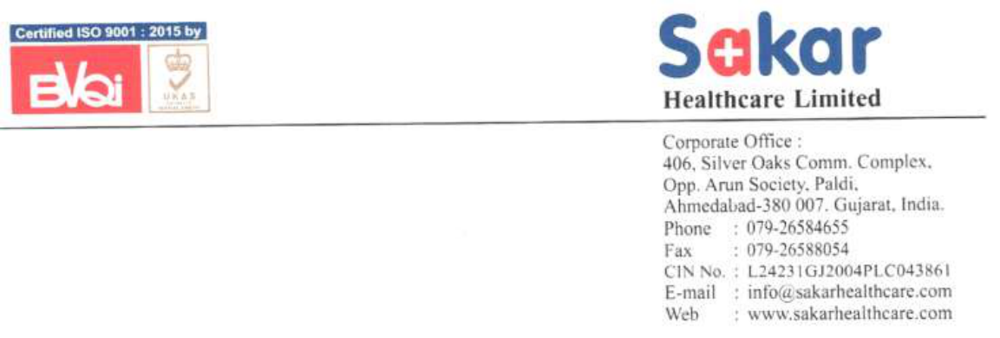
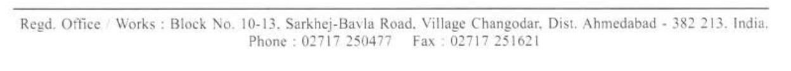

**[Image: SAKAR_17022026154339_Announcement_-_Transcript.pdf-0001-00.png (1153x390, 205.0KB)]**

**Date: 17****th** **February, 2026** 

To 

The Manager Listing Compliance Department National Stock Exchange of India Ltd. Exchange Plaza, Bandra Kurla Complex, Bandra (E), Mumbai-400051, India 

## **Symbol: SAKAR** 

## **Sub: Disclosure under Regulation 30 of the Securities and Exchange Board of India (Listing Obligations and Disclosure Requirements) Regulations, 2015 – Transcript of Con Call.** 

Transcript of the discussion on the Unaudited Financial Results (Consolidated and Standalone) of the Company for the quarter and nine months ended December 31, 2025, at the analyst meet held on February 11, 2026, is attached and also available on the website of the Company at <u>Sakar-Q3-FY26-EarningsConference-Call-Transcript.pdf</u> 

This is for information and records. 

Thanking You, 

Yours faithfully, 

## **FOR, SAKAR HEALTHCARE LIMITED** 

BHARATKUMAR SUKHLAL SONI 

Digitally signed by BHARATKUMAR SUKHLAL SONI Date: 2026.02.17 15:41:42 +05'30' 

**BHARAT SONI COMPANY SECRETARY AND COMPLIANCE OFFICER** 

**[Image: SAKAR_17022026154339_Announcement_-_Transcript.pdf-0001-14.png (1248x113, 52.6KB)]**

**[Image: SAKAR_17022026154339_Announcement_-_Transcript.pdf-0002-00.png (232x114, 43.7KB)]**

# “Sakar Healthcare Limited 

# Q3 FY26 Earnings Conference Call” 

# February 11, 2026 

**[Image: SAKAR_17022026154339_Announcement_-_Transcript.pdf-0002-04.png (147x74, 17.7KB)]**

**[Image: SAKAR_17022026154339_Announcement_-_Transcript.pdf-0002-05.png (221x55, 7.2KB)]**

**[Image: SAKAR_17022026154339_Announcement_-_Transcript.pdf-0002-06.png (211x105, 14.5KB)]**

**MANAGEMENT: MR. BIKRAMJIT GHOSH – VICE PRESIDENT, STRATEGY AND BUSINESS DEVELOPMENT – SAKAR HEALTHCARE LIMITED MR. DHARMESH THAKER – CHIEF FINANCIAL OFFICER – SAKAR HEALTHCARE LIMITED MR. BHARAT SONI – COMPANY SECRETARY – SAKAR HEALTHCARE LIMITED MS. PUSHPA PONMANY – MANAGER – SAKAR HEALTHCARE LIMITED** 

**MODERATOR: MR. NIKUNJ SETH – MUFG INTIME** 

Page **1** of **16** 

_Sakar Healthcare Limited February 11, 2026_ 

**Moderator:** 

**[Image: SAKAR_17022026154339_Announcement_-_Transcript.pdf-0003-02.png (147x74, 17.7KB)]**

Ladies and gentlemen, good day and welcome to the Sakar Healthcare Limited Q3 FY26 Earnings Conference Call, hosted by MUFG Intime. As a reminder, all participant lines will be in the listen-only mode and there will be an opportunity for you to ask questions after the presentation concludes. Should you need assistance during this conference call, please signal an operator by pressing star then zero on your touchtone phone. Please note that this conference is being recorded. 

I now hand the conference over to Mr. Nikunj Seth from MUFG Intime. Thank you and over to you, Mr. Nikunj. 

**Nikunj Seth:** 

Thank you, Shubham. Welcome to Sakar Healthcare Q3 FY26 earnings call. Today on the call we have Mr. Bikramjit Ghosh, Vice President, Strategy and Business Development; Mr. Dharmesh Thaker, CFO; Mr. Bharat Soni, Company Secretary; and Ms. Pushpa Ponmany, Manager. 

Before we proceed with the call, I would like to give a small disclaimer that the call may contain certain forward-looking statements which are based on the business opinions and expectations of the company as on today. A detailed disclaimer has been given in the company's investor presentation which was uploaded on the stock exchange. 

Now I would like to hand over the call to Ms. Pushpa. Over to you. 

**Pushpa Ponmany:** 

Good morning, everyone. I welcome all our shareholders, investors, and analysts to the earnings call for Sakar Healthcare Limited for the quarter and nine months ended 31st December 2025. Quarter 3 has been a defining quarter for Sakar Healthcare, marked by a strong operational momentum, deeper global integration of our oncology business, and broad-based growth across all major performance metrics. I am happy to share the financial and operational progress for the quarter along with strategic updates and our outlook for the coming periods. 

Let me begin by sharing the operational highlights for Quarter 3 FY26. During this quarter, our oncology vertical continues to demonstrate strong traction. The EU GMP approved oncology facility at Bavla has begun to gain significant strategic relevance globally with partners across Europe and emerging markets increasingly relying on Sakar for both regulated supply and dossier-linked launches. 

One of the most notable developments of this quarter has been the approval of our oncology facility as a manufacturing source for product supplies to the EU, marking a major milestone and validating our capability to serve stringent regulated markets. This is only the first of a series of oncology products expected to be commercialized through similar regulatory pathways. 

Our dossier progress has remained strong. Of the 211 oncology dossiers shared globally, 102 dossiers have now been submitted across partner markets. Out of the 32 dossiers developed for oncology products, 21 have already been submitted and 11 have received marketing authorizations covering Abiraterone, Imatinib, Tamoxifen, Capecitabine, Gemcitabine, Carboplatin, Irinotecan, and Docetaxel across Europe and emerging markets. 

Our R&D teams continue to advance non-infringing patent formulations, differentiated oncology products, and partner-driven developments which will strengthen the future revenue pipeline. 

Page **2** of **16** 

_Sakar Healthcare Limited February 11, 2026_ 

**[Image: SAKAR_17022026154339_Announcement_-_Transcript.pdf-0004-01.png (147x74, 17.7KB)]**

Operational efficiency across our units Bavla oncology and Changodar Cephalosporin and general formulations remained strong during the quarter, supported by higher export volumes and improved scale utilization. The continued shift towards high-margin own brand exports, which now contribute over 70% of the revenue, has further enhanced profitability and strengthened Sakar's positioning in APAC, Latin America, Africa, CIS, and parts of Europe. 

Now let me take you through the financial performance for Quarter 3 and 9 months FY '26 as per our consolidated results. For Quarter 3 FY '26. Revenue from operations stood at INR7,034 lakhs compared to INR4,342 lakhs in Quarter 3 FY '25, reflecting a robust 62% year-on-year growth. 

EBITDA for the quarter was INR1,859 lakhs compared to INR1,177 lakhs in Quarter 3 FY '25, an increase of 58% year-on-year with EBITDA margins at 26%. Profit after tax stood at INR1,025 lakhs compared to INR453 lakhs in Quarter 3 FY '25, delivering a strong 126% yearon-year growth, supported by operating leverage and better product mix. Gross margins remained healthy at 49%, driven by improved efficiency and scale benefits across our oncology vertical. 

For 9 months ended FY '26. Revenue stood at INR18,064 lakhs as against INR12,734 lakhs in nine months FY '25, a 42% year-on-year increase. EBITDA for 9 months was INR4,265 lakhs compared to INR3,396 lakhs in 9 months FY '25, an increase of 26% year-on-year. Profit after tax for 9 months FY '26 was INR1,946 lakhs compared to INR1,174 lakhs in 9 months FY '25, reflecting a 66% year-on-year growth. 

Profit after tax margins improved meaningfully, supported by increased contribution from oncology products and disciplined cost management. The strong financial performance this quarter reflects the scalability of our integrated oncology operations and the growing acceptance of our high-compliance manufacturing standards by global partners. 

Let me now touch upon the strategic progress. Our oncology-led transformation continues to accelerate. The quarter's approvals, dossier submissions, and partner developments have reinforced our global competitiveness in complex generics and high-potency APIs. The Bavla oncology facility remains our biggest differentiator with integrated API and FDF capabilities, world-class containment systems, EU GMP certification, and the ability to handle oral liquids, capsules, injectables, and lyophilized products under one roof. 

Our R&D and regulatory teams are currently working on multiple liposomal, HME-based, and differentiated oncology formulations that will further strengthen our presence in regulated markets and support high-margin growth. Across our CDMO and CMO engagements, we continue to receive strong interest from Indian and multinational players for oncology, Cephalosporin, and general formulations, ensuring sustained recurring revenues and long-term visibility. 

We remain fully committed to sustainable and green manufacturing practices supported by flow chemistry, zero discharge systems, and energy-efficient infrastructure across the facilities. Looking ahead, we expect the momentum achieved in quarter 3 to continue into the coming quarters. We believe that our integrated oncology capabilities, strong regulatory foundation, 

Page **3** of **16** 

_Sakar Healthcare Limited February 11, 2026_ 

**[Image: SAKAR_17022026154339_Announcement_-_Transcript.pdf-0005-01.png (147x74, 17.7KB)]**

growing global approvals, and expanding partnerships, Sakar Healthcare is well-positioned to deliver sustainable long-term value creation. 

Before I conclude, I would like to thank our Managing Director, Mr. Sanjay Shah, our management team, our dedicated employees, and our partners across the world for their continued commitment and contribution. I also extend my gratitude to all the shareholders and analysts for your support and trust in Sakar's journey. Thank you for your time. We will now open the floor for questions. 

### **Moderator:** 

Thank you very much. The first question comes from the line of Ankit Gupta from Bamboo Capital. Please go ahead. 

**Ankit Gupta:** Yes, thanks for the opportunity and congratulations for a very good set of numbers. Sir, the first question was on, the oncology revenues for Q3 and for nine months. If you can, share that. And out of that, how much were for the domestic markets and for exports and EU? If you can talk about it a bit? 

**Dharmesh Thakkar:** Yes. So the Q3 turnover for the oncology business in all was INR31 crores, out of which INR19 crores was exports and majority is of it was towards the EU. And the domestic was around INR12 crores. And if I say for the nine months, for the nine months the turnover for the oncology business has been INR69 crores -- INR69.45 crores, of which INR30.81 crores is exports and rest INR8.62 crores is the domestic sales. 

**Ankit Gupta:** Okay, so the exports is largely part of the deemed export is what we can say. Like, it's shipped to the local, to the Indian subsidiaries of the export companies to which they are indirectly exported later on, right? 

**Bikramjit Ghosh:** 

Yes. 

**Ankit Gupta:** Sure, sure. And secondly, you know, on the Intas relationship. So, we have had Imatinib has recently got approval, the technical transfer has been done and the EU, we have got the EU approval as well for the same. So and I think Imatinib itself is a $200-$250 million kind of opportunity in the European market. So how much, you know, and Intas/Accord being the, you know, very big player in the European market? 

So if you can talk about how do you see this molecule performing for us and, how big can it become? And the, how -- this is the first molecule which has got approval which has completed the technical transfer and got approval from the authority. So how do you expect the follow-on, how many molecules do you expect, when do you expect the rest of the nine molecules to get approval, and how should we see the scale-up happening? 

**Bikramjit Ghosh:** 

Yes. There are ten molecules which are in the process of tech transfer, out of which just to add on we have already received for Imatinib. The second product has also been received for that, and we are expecting to receive another two within a couple of months' time. This is basically a very encouraging part from our end, because this molecule will directly go to the European market as you rightly mentioned, and Accord being one of the major players with oncology products in those. 

Page **4** of **16** 

_Sakar Healthcare Limited February 11, 2026_ 

**[Image: SAKAR_17022026154339_Announcement_-_Transcript.pdf-0006-01.png (147x74, 17.7KB)]**

Now regarding the other six molecules which we have in the pipeline, another three molecules will be there, which we are expecting in the next quarter, and rest two may be in the following quarter. So maybe in the following two quarters we'll be clearing off all the tech transfer process, and thereby starting up the commercials in the European market with these ten tech transfer products. 

And regarding the market potential what you mentioned, around major chunk of the market, around 60% to 70% is dominated by Accord with these molecules. So, it depends upon what is the sale volume, they are looking forward to in terms of their projection, but it is quite looking, quite healthy at this juncture, considering the new financial coming in. So we are very optimistic in looking forward to this business growth. 

### **Ankit Gupta:** 

### **Moderator:** 

### **Avinish Verman:** 

Sure, sure. So how, sir, how do you see the Intas relationship...? 

Sorry to interrupt, Mr. Gupta. We request you to return to the question queue for the follow-up questions. The next question comes from the line of Avinish Burman from Vaikarya. Please go ahead. 

Yes, hi. Thanks for taking my question and congratulations for a good set of numbers. Bikramjit ji, just a little bit clarity on the employee cost. We saw, I mean of course there's a Y-o-Y big increase, but there's also like a sequential increase from INR8.3 crores to INR9.9 crores? 

Where, I mean how should we think about that? How much is it expected to increase more? How many people are you adding? Or this INR10 crores per quarter is more of a stable number now? Can you please throw some light on that? 

### **Dharmesh Thaker:** 

So if we see it on quarter-to-quarter thing, compared to Q2 and Q3, the employee cost in value terms remains the same. At around, employee cost has been at around INR8 crores in Q3, and now it has come down, it has come to in Q2, and which is now around INR9.5 crores in Q4, Q3 rather. 

So this is more towards stabilizing, and the employees, the cost has been incurred more towards the research thing as well. So going forward, we would not see a much volatility or variation in this. This would be more towards stabilizing as such. 

**Avinish Burman:** 

### **Bikramjit Ghosh:** 

Okay. And my second question is on the oncology revenues. In the third quarter you mentioned INR31 crores, out of which INR19 crores is export and INR12 crores is domestic. Now that the MAs are kicked in and the ramp-up can happen, can we expect like a quarter-on-quarter increase, every quarter for the next four-five quarters in oncology revenues? 

Yes, oncology if you see, almost we have doubled the sale what we had achieved last year. And we have already crossed the overall mark what we achieved in Q3 of the last year total revenue. So this is quite evident that oncology is driving the overall revenue growth. 

So what we are seeing, it is more than around 60% plus growth, what we can expect, maybe yearon-year basis. And thereby the quarter-on-quarter maybe initially you can see a major growth, but average what we can look forward to is around 60% to 70% growth year-on-year. 

Page **5** of **16** 

_Sakar Healthcare Limited February 11, 2026_ 

**[Image: SAKAR_17022026154339_Announcement_-_Transcript.pdf-0007-01.png (147x74, 17.7KB)]**

**Avinish Burman:** 60% growth for the full year or..? **Bikramjit Ghosh:** For the next year I'm talking about. **Avinish Burman:** Sir, do you mean FY’27? 60% growth? **Bikramjit Ghosh:** Yes, yes right. **Avinish Burman:** And 60% growth in oncology you mean? **Bikramjit Ghosh:** Yes. **Avinish Burman:** Okay, understood. Great. I have more questions but I'll join the queue. Thank you. **Moderator:** The next question comes from the line of Hitaindra Pradhan from Maximal Capital. Please go ahead. 

**Hitaindra Pradhan:** Yes, hi sir. Thanks for the opportunity. So my question is related to the, our MAs that are pending for approval in the Western Europe market, like the Big 4 countries. So if I understand sir, for Imatinib, we have centralized approval, but for the Eastern/Western markets, we are doing country-specific dossiers and MAs, right? So what are the timelines and, how soon we can expect them to be approved? 

**Bikramjit Ghosh:** Normal standard timeline is 210 working days for Europe for approval of any dossier, considering that we do not have any queries. Once the query pops up, then there is a stop clock and accordingly it gets carried forward. Now coming to your Western Europe or Eastern Europe or entire European dossier approval, it depends upon if we go for a decentralized procedure. 

It does not matter because you can move from one country to another country with the same registration. So currently we have already received five marketing authorizations from the EU region and one from entire Europe extra that is total six. Now considering that we are currently having submitted another 18-19 dossiers in across Europe. So these are about to come up. And these will add up to the overall kitty of marketing authorizations within the next financial year. 

**Hitaindra Pradhan:** Okay sir, okay. So for Western Europe, you are saying that you know there are country-specific MAs are, basically there are mix of centralized as well as country-specific MAs, right? And... 

**Bikramjit Ghosh:** The movement is like that. If you register any products in any part of EU countries, you can move into the other countries with a simple process. So that does not take so long time. So it is basically accessibility to the entire EU market. So it is immaterial where you are applying for. It is very relevant where you are getting the slot to apply basically. Because getting a slot to apply for the MAs is basically the challenge in Europe presently. 

Because we have already the EU dossiers ready which is already five of them approved within the EU. So you can understand the standard is already there with us in terms of dossiers for the Europe, but important thing is that getting the slots to get it approved. Which we have already done, we have 19 submitted and along with the another five which you have already seen. So these are going to come within next one year's time. 

Page **6** of **16** 

_Sakar Healthcare Limited February 11, 2026_ 

**[Image: SAKAR_17022026154339_Announcement_-_Transcript.pdf-0008-01.png (147x74, 17.7KB)]**

**Hitaindra Pradhan:** 

Okay sir, okay. And sir, on the guidance part, that we previously guided that, we'll be doing INR280 crores for FY’26. So that means like we need to do INR100 crores in Q4. So are we sir, you know, in line to achieve that in Q4? 

**Bikramjit Ghosh:** Yes, we are very much on the track. And presently the order book is showing that we'll be landing something around 30% plus, sorry, 40% plus growth over last year, the total figure. That is what the order book is currently showing. And it can be added up with other orders as well with the current promising growth that oncology is showing. 

But having said that, we always work in the advance payment for the international market. So in that case, unless we get the realization of payment, we do not dispatch the products. So that is one thing, but however having said that, we are already on track. We are seeing more than 40% growth year-over-year for FY’26. 

Okay sir, okay. And sir, why the tax rate was low this...? 

**Hitaindra Pradhan:** Okay sir, okay. And sir, why the tax rate was low this...? **Moderator:** Sorry to interrupt, Mr. Pradhan. We request you to return to the queue. The next question comes from the line of Ishit Desai from Fods Family Office. Please go ahead. **Ishit Desai:** Yes, thank you for the opportunity sir and congratulations on a very good set of numbers. Sir, my question is on the technology transfer projects which you've mentioned in your press release with the five large pharmaceutical companies? 

Sir, generally what we understand is, with these technology transfer projects specific to products, we also have some visibility—these are relatively longer-term arrangements and we also have some visibility on the scale-up, the revenue part on the product side. 

So if you could help us understand how each of these accounts or maybe collectively, you're looking from a ramp-up perspective in the current financial year as well as FY’27 and beyond, what kind of revenue potential in terms of pipeline we are looking at? So if you could elaborate on that part a little more, that would be helpful? 

**Bikramjit Ghosh:** See, the first of all, the technology transfer itself means there are companies already committed with the principle. Because we will be as a supplier, unless they are committed with our supplies, they will never come to us, that is the number one point. The second thing what I would like to say, the potential is quite good in terms of Accord/Intas dominating the oncology market in Europe. 

Now obviously they will be getting supplies from us, but it will be how they will be taking the product to the market will be important. But the portfolio shows quite promising and maybe it's around INR50 to INR100 crores that can be the potential of these products what we are currently managing. So it is very difficult to right now comment on that, but it's a huge potential for Sakar to supply Accord brands. 

**Ishit Desai:** 

You're saying these individual products can be INR50 to INR100 crores? Just to clarify? 

**Bikramjit Ghosh:** 

No, it's a total portfolio of currently given ten products. But you can understand oncology again there are multiple products. We can move up to 30, 35, 40 products even which Accord is 

Page **7** of **16** 

_Sakar Healthcare Limited February 11, 2026_ 

**[Image: SAKAR_17022026154339_Announcement_-_Transcript.pdf-0009-01.png (147x74, 17.7KB)]**

currently managing. So the portfolio can increase. Individual product depending upon the indication can grow, their value can increase. 

Dependency of Accord in terms of products in the market can increase. So there are number of factors in that, but that's why I give it you a wide range. It can range from INR50 crores to INR100 crores with the portfolio currently what we are managing. And once the cycle ends, it will be easier for me to narrow down those figure. 

**Ishit Desai:** Understood, sir. And the same -- I mean fair to assume that Accord/Intas will be the largest one and the others will then gradually be coming up, the four companies: Torrent, UK/Germany; Emcure, Glenmark, and Zydus? 

**Bikramjit Ghosh:** No, we have other balance supports from Zydus as well who are having the products. Then we have, as you rightly mentioned, Torrent is there, Glenmark is there, we are working with Emcure as well. So number of Indian players, number of players who are big names with oncology from India are there. 

Apart from that, we are already from the beginning of our operation working with around 12 to 13 local partners who operate locally in India. So all put together, it will be around 18 to 20 partners whom we are already supplying this. 

**Ishit Desai:** 

Sure, sir. And so on the second question side... 

**Moderator:** Sorry to interrupt, Mr. Desai. We request you to return to the question for the follow-up. **Ishit Desai:** I just asked one, but no worries, I'll come back in the queue. It's okay. **Moderator:** Thank you. The next question comes from the line of Vedant Nilekar from ICICI Securities. Please go ahead. **Vedant Nilekar:** Hello, am I audible? 

**Moderator:** Yes. 

**Vedant Nilekar:** Congrats to the management for a great set of numbers. My first question is on the capex. So for Q3, how much of the capex have we done? And what would be the figure for FY’26 and FY’27 as well? Because most of our capex for oncology and rest of the things has been done. So what is done in Q3, what would be the closing figure for FY’26 and what will be the maintenance capex for FY’27? 

**Dharmesh Thaker:** As regards the capex for FY’26, around INR39 crores is the capex that has been done till nine months now. And going forward for FY’27, we do not see any major capex happening. The capacity whatever we had planned is in place. So this is probably the major capex that has happened this financial year. For going forward, we do not see any major capex happening. 

**Vedant Nilekar:** What would be the figure for the maintenance capex? 

**Dharmesh Thaker:** 

The maintenance figure is the quarter-wise if I say, the quarter basis, it is around INR65 lakhs is towards the repairs and maintenance that has gone in Q3. And the similar number was in Q2. So 

Page **8** of **16** 

_Sakar Healthcare Limited February 11, 2026_ 

**[Image: SAKAR_17022026154339_Announcement_-_Transcript.pdf-0010-01.png (147x74, 17.7KB)]**

we can expect that somewhere on these lines the repair and maintenance would be happening for the existing plant in Changodar. 

### **Vedant Nilekar:** 

**Bikramjit Ghosh: Vedant Nilekar:** 

### **Bikramjit Ghosh:** 

Okay, got it. And my second question is on the presentation that was sent out by the company. Can the management please help us -- so because I'm relatively new to the company -- on slide number 19 of the presentation, how should we read the table on the right and how can we connect it to the commercialization figures or timelines for that matter? 

Yes, this is basically on the right-hand side you are talking about the chart? 

Yes, the product CAS number, specification. 

Right. So basically those chart, that chart is depicting the APIs what we have developed. And which shows that we have 21 total APIs which we have developed because the APIs are assigned a CAS number, so it is written there. And once we have the APIs developed, it has to be particularly specification in terms of European guidelines or Indian guidelines or US guidelines. So that is the specification part. 

In the CEP part, we need to have the basically the authentication in terms of documentation, so it gives the total visibility in terms of the API. So that is called the CEP. So for which we have already submitted four, if you see on the top line. So out of that, we are expecting one which is in an advanced stage of approval. So that also will come. And I will come to this part later on. 

Written confirmation allows us to send these products to the European market for the research and development purpose. And for this we have all the documentation ready with us, which is the Drug Master File (DMF). Now coming to the CEP part, the advantage is that we can then integrate with our individual products what we have developed. 

And that backward integration will help us in terms of timely supply, more economical or commercially more viable in the market. So that is the part which we are currently developing, the CEP. Which is required particularly for the regulated market supplies. Presently we our dossiers or our supplies do not have our APIs, so we will include those APIs for international market once this CEP approval comes up. 

### **Vedant Nilekar:** 

**Bikramjit Ghosh:** 

**Vedant Nilekar:** 

**Bikramjit Ghosh:** 

### **Moderator:** 

### **Saurabh Gupta:** 

### **Moderator:** 

**Moderator:** 

So this will help us in the backward integration furthermore? 

Absolutely. 

Okay got it. I have more questions but I'll get back in the queue. Thank you. 

Yes, and that will automatically help in the improving the margins. 

The next question comes from the line of Saurabh Gupta from Financiallyfree. Please go ahead. 

Hello. 

Yes. Am I audible? 

Yes. 

Page **9** of **16** 

_Sakar Healthcare Limited February 11, 2026_ 

**[Image: SAKAR_17022026154339_Announcement_-_Transcript.pdf-0011-01.png (147x74, 17.7KB)]**

**Saurabh Gupta:** 

Thank you for the opportunity and congratulations for the great set of numbers. So sir, my question is that this quarter, we have provided a lower tax, if we see Y-o-Y and Q-o-Q. So what, what could be the reason about it, and what can we expect going forward the normal tax rate for the company? 

**Dharmesh Thaker:** So as regards this, the MAT credit that is available at this point in time, due to which the taxes are getting knocked off against the MAT credit. So whatever the provision that you are seeing, that is more towards the deferred tax provisions. 

And probably after the end of FY’27, we would be coming into the normal tax slabs. So until then the numbers on with regards to the provision for taxes would be comparatively lower. 

**Saurabh Gupta:** Okay, so in FY’25 we have given around 19% tax. So can we expect lower, I think around lower teens for FY’26 and similar for FY’27? 

**Dharmesh Thaker:** In lines yes, almost in lines with FY’25 around 18% to 19% yes. **Saurabh Gupta:** For FY’26 and ’27? 

**Dharmesh Thaker:** Yes. **Saurabh Gupta:** And for beyond FY’27? 

**Dharmesh Thaker:** That would be the normal tax rate that would be applicable because the MAT credit would be fully utilized by then. So then would be coming back to the normal tax rates. **Saurabh Gupta:** After FY’27 around 25%-26%, is my understanding correct, around? **Dharmesh Thaker:** Yes, around 25%. **Saurabh Gupta:** Okay, okay got it sir. And second question that I have that in last concall we have mentioned that we got six approval in European Union, five in Bulgaria and one in Bosnia. So how the commercialization ramping over there? 

**Bikramjit Ghosh:** Yes, last time also I told you, because there is one important thing is that, for the first supply we need to get prepared with certain things. And particularly for the European supply, we need to have few things which include serialization of the products, then artwork of the products, and thereby the commercial orders has to be in pipeline for logistics so that it can be supplied. 

So we have already received the orders, POs, and currently the manufacturing has been scheduled. And we'll be maybe dispatching either in May or maybe in April, depending upon the whether the setup is ready for us. 

And this is for the first time as I told you because there is a normally a threshold of 90 days to 150 days for the supply. But once it is done, the next supply onwards this infrastructure once gets ready it does not cause any problem. 

Page **10** of **16** 

_Sakar Healthcare Limited February 11, 2026_ 

**[Image: SAKAR_17022026154339_Announcement_-_Transcript.pdf-0012-01.png (147x74, 17.7KB)]**

**Saurabh Gupta:** So is it, is it for Bulgaria or for other countries as well? If we see that for Bulgaria it will take around three to five months, and for example for Bosnia, it will take again four to five months or it will take only three months? 

**Bikramjit Ghosh:** So for Bosnia it will be around three four months because the complexity is little bit less, but it comes under Europe as well. So the thing is that it may be -- that's why again 90 days to 150 days, maybe someone will take 140 days, someone will take 120 days. 

So it does not depend always on our hand because as I told you, the partner will be arranging for the logistics and all and this is for the first time. So that is the reason, but otherwise from next order onwards the lead time normally for us is around 75 to 90 days. 

**Saurabh Gupta:** Okay, okay got it. So the commercialization will start from Q1 FY’27? 

**Bikramjit Ghosh:** Latest. 

**Saurabh Gupta:** Yes, yes. Thank you, thank you. That's it from my side. **Bikramjit Ghosh:** Yes. 

**Moderator:** Thank you. The next question comes from the line of Aditya Mutha from an Individual Investor. Please go ahead. 

**Aditya Mutha:** Hi sir, good afternoon sir. Sir, when you say you have nine molecules will convert, does that mean we'll get MA approval or commercial supplies? 

**Bikramjit Ghosh:** 11 already we have the MA approvals. This is relevant to… **Aditya Mutha:** I was talking about the tech transfer which you told in the call. Imatinib is the first...? **Bikramjit Ghosh:** Yes, right. So that will be ten, ten molecules. **Aditya Mutha:** Yes. And so does that mean MA approval or commercial supplies in next two three quarters? **Bikramjit Ghosh:** No, they are, they have the MAs already with them. 

**Aditya Mutha:** Okay. 

**Bikramjit Ghosh:** So it is basically the technology is getting transferred at our unit. So our manufacturing unit get added up, and we can now supply to their marketing authorizations. So it is an immediate turnaround time. If you see, we have already got the approval for inclusion for site within a few days even. 

So that gives us the encouragement that the rest of the products are also getting lined up or queued up for approval. Already the second one is already been approved. Now coming back to your point is automatically once it is approved, they can now arrange for the supplies accordingly. So that is in the queue only. So now they are arranging for the logistics. 

Page **11** of **16** 

_Sakar Healthcare Limited February 11, 2026_ 

**Aditya Mutha:** 

**[Image: SAKAR_17022026154339_Announcement_-_Transcript.pdf-0013-02.png (147x74, 17.7KB)]**

Okay. Got it sir, got it. And my another question was on for Imatinib supply to Accord. Sir, do we have any firm purchase commitment or rolling order visibility for next two three quarters? I mean how does the agreement works out for us? 

**Bikramjit Ghosh:** So normally agreement have a business forecast in that, which shows that they have a minimum commitment in terms of batch sizes and in terms of minimum value so that we can, it becomes visible. And normally what happens, in the first consignment people used to go with a lesser quantity considering that this is the first one. So everything goes right. So from the second onwards they normally gives the actual quantity which is our batch size of roughly around 100 to 200, around 300,000 units. 

**Aditya Mutha:** Okay, so basically this is a rolling order which we'll get, right? **Bikramjit Ghosh:** Yes, absolutely, absolutely. And this will be maybe a bi-monthly order based on their already established product in the European Union. **Aditya Mutha:** And the supplies have started? **Bikramjit Ghosh:** This will start from March end onwards we are expecting the supply. **Aditya Mutha:** Okay sir, thank you. I'll get back in the queue. Sir, thank you. Congratulations, sir. **Bikramjit Ghosh:** Thank you. **Moderator:** The next question comes from the line of Prateek Dugar from Intelsense. Please go ahead. **Prateek Dugar:** Yes, hello. Good afternoon sir. Thank you for the opportunity. I wanted to ask sir, we are a very TKI focused based player I think, and because like when I look at the dossiers a lot of TKIs are there in the dossiers. I wanted to ask sir, there is another I think Indian pharma player who is also very much focused into TKIs, and they have seen a meaningful revenue uptick in the EU. So what is our, you know, plans with TKIs in the EU? 

**Bikramjit Ghosh:** Can you come again? 

**Prateek Dugar:** Sir, I was asking that we are a very -- like the Tyrosine Kinase Inhibitors, TKIs in our dossiers, it's a big list there. And I was asking that, there is another TKI-based player in India, they are seeing meaningful revenue traction in the EU. So from that perspective, if you can give us an idea like is it -- is there a meaningful demand of TKIs in the EU? Are you seeing that for yourself? 

**Bikramjit Ghosh:** What is that specific term you are using? 

**Prateek Dugar:** Sir, the Tyrosine Kinase Inhibitors, all the -tinibs: Imatinib, Gefitinib, these are all the type of... **Bikramjit Ghosh:** Okay, okay. I got your point. So you can understand we have the entire range or basket in our portfolio along with the dossiers and bioequivalence studies which has been conducted in the last six to nine months’ time. So primarily you have to be prepared with so updated information that is more important. Now in order to confront with the competition in the market, because in Europe if you see there are more multinational competitors as well as our Indian competitors who are there in the market. 

Page **12** of **16** 

_Sakar Healthcare Limited February 11, 2026_ 

**[Image: SAKAR_17022026154339_Announcement_-_Transcript.pdf-0014-01.png (147x74, 17.7KB)]**

So in order to do that, the best possible is that you have to identify the right partner in the right place within the Europe who can take it forward because we are not directly going into the market. So there lies the partnership which we are currently in the process of building. And if you see we have already concluded around 50 plus agreements overall with oncology, out of which if you see the European part, we have already completed more than 20. 

So within Europe we are already partner with the key players, who can take these products in the market. So that is the key here because they have their own strengths in respective territories. Out of which for example I'm just telling you, out of which we have the partnership with Torrent UK, we have partnership with Heumann in Germany as well. 

So they are the market leaders in particular products in the respective market. So these gives us the additional edge over the competition who are coming from India and going to establish the product in the market. 

**Prateek Dugar:** 

Okay. And sir, I also noticed that we are having oral suspension formats. Are there any other players who are also there in oral suspension or is this a niche with us? 

### **Bikramjit Ghosh:** 

This is a niche product which we have developed in a sequence of 12. Most importantly maybe in India few of the players are there who are ready with one or two. And we have the entire basket and we are in negotiations with multiple partners with this product range, because we do not want to play with one or two. We want to move ahead with a full basket of 10 to 12 products which we have developed. So this is a unique feature what we presently hold and which our competitors are not having. 

**Prateek Dugar:** 

Okay, thank you sir. 

**Moderator:** 

The next question comes from the line of Ankit Gupta from Bamboo Capital. Please go ahead. 

**Ankit Gupta:** 

Yes, thanks for the opportunity again. Sir, the 60%-70% growth that you are talking about for next year. So let's say if we end this year with INR270-INR280 crores kind of revenue. So is the 60%, 70% growth is on that base for the entire company or…? 

**Bikramjit Ghosh:** 

It is for the oncology products. It's with the oncology products. 

**Ankit Gupta:** Okay. So we should expect like INR100, INR110, INR120 crores kind of, full-year revenue for oncology, and on that we'll have 60%-70% growth, right? 

**Bikramjit Ghosh:** 

Yes, growth percentage I can estimate. Rest you can calculate. 

**Ankit Gupta:** 

Sure, sure, sure. And sir, on the margins part that, this year given how the oncology scaled up significantly in this quarter we saw 26% kind of EBITDA margins. So when oncology scales up further in the coming quarters, how should we look at the EBITDA margins for the company? 

**Dharmesh Thaker:** A precise number would be difficult at this point in time, but yes, the margins would be way better compared to the margins that we have right now. So when we had conceptualized oncology, so we were expecting an EBITDA margin somewhere around 30%. So that is the target we would be trying to achieve. 

Page **13** of **16** 

_Sakar Healthcare Limited February 11, 2026_ 

**[Image: SAKAR_17022026154339_Announcement_-_Transcript.pdf-0015-01.png (147x74, 17.7KB)]**

**Ankit Gupta:** Okay, so on a combined basis we should be looking at 30% kind of margins? Okay, sir, thank you. **Moderator:** Thank you. The next question comes from the line of Hitaindra Pradhan from Maximal Capital. Please go ahead. **Hitaindra Pradhan:** Yes, hi sir. Thanks for the opportunity again. Sir, just wanted to you know confirm something. Like you mentioned that Imatinib at the market opportunity of INR200 to INR250 crores in the EU market? **Bikramjit Ghosh:** No, no, I have not mentioned. Somebody has told. I told Yes, that is the market size. **Hitaindra Pradhan:** Okay, okay. And sir, what is the like revenue and margin profile for this? Because this is something, where we are selling it under the Accord brand name and using their distribution, right? So what is the revenue and margin profile if you can hint for Imatinib? **Bikramjit Ghosh:** See, currently we are doing the business with all the players and that is giving us an EBITDA of around 25% margin. So you can understand this will be ranging between 25%, 24% to 26% only. **Hitaindra Pradhan:** Okay, 25%. Okay sir, that's all from my side. Thank you. **Moderator:** Thank you. The next question comes from the line of Ishit Desai from Fods Family Office. Please go ahead. **Ishit Desai:** Yes, thank you for the follow-up opportunity, sir. Most of the questions answered, just one additional one. Sir, was there any revenue from Imatinib supply in Q3 to Accord Intas? If so, will it be possible to quantify the number for Q3? **Bikramjit Ghosh:** See, as I told this, for this tech transfer Imatinib Accord Intas, it will start end March. For this tech transfer product it will start from there only. These I have already mentioned earlier. **Ishit Desai:** Understood. No, I got just confused between the new molecules which got approved. Yes, so I mean fair to assume that most of the tech transfer revenues then should start accruing from FY’27, and beyond Imatinib also we should have at least one or two more molecules which will start contributing to that? **Bikramjit Ghosh:** Yes, absolutely. From those basket of ten it will start for the tech transfer project. It will be there only from then onwards. **Ishit Desai:** Understood. Thank you. **Bikramjit Ghosh:** The second one already has been approved that I have already told. So you can understand that one by one this will come up. And what we can foresee, it will come within the first or maximum second quarter of next financial year. So the commercials are expected from this products for all the products -- almost all the products by next year, next financial year. **Ishit Desai:** Understood sir. And what within these ten molecules would be the mix of OSD and Injectable if you could help us understand? 

Page **14** of **16** 

_Sakar Healthcare Limited February 11, 2026_ 

**[Image: SAKAR_17022026154339_Announcement_-_Transcript.pdf-0016-01.png (147x74, 17.7KB)]**

**Bikramjit Ghosh:** 

It's almost balanced. Five and five. 

### **Ishit Desai:** 

Understood sir. Thank you. That's it from my side. Thank you. 

**Moderator:** Thank you. The next question comes from the line of Avinish Burman from Vaikarya. Please go ahead. 

### **Avinish Burman:** 

Hi, thanks for taking the follow-up. Bikramjit ji, I had the impression that oncology revenues for FY’26 would end somewhere around INR100 crores, and would ramp up to somewhere around INR200 crores in FY’27, which is not tying up with the 60% growth in onco that you are mentioning. So where am I getting this wrong? 

**Bikramjit Ghosh:** See, this is the bare minimum growth percentages what I'm expecting or we are expecting rather. Considering that certain things are not in our hand in terms of regulatory approvals. Because as I told you, the equation stands as such that we have 100 plus submissions of marketing authorizations right now which we expect within next 12 months. 

So now these will gear up the sale what you are telling or what we have discussed earlier, it will be over -- it will be means we can overshoot that number. Now the thing is that along with that we have another 200 dossiers which are lying in different countries right now with our partners which are to be submitted. 

So if you see the build-up is like that so that we can cross that number of magic number of 200 in the next year. But having said that, the number what we are seeing right now in terms of the approvals we have in hand or the tech transfer projects, we have in this 60% plus growth is what we can see at present for the next financial year. 

### **Avinish Burman:** 

And 60% growth over what base in FY, I mean where are you ending this year? 

**Bikramjit Ghosh:** Over the current year, which we are almost expecting around 30% growth over the last year. 

**Avinish Burman:** 30% growth, okay understood. Okay. The second question is on the capex side. You mentioned that the nine-month capex is INR39 crores. I think the first half capex was INR27 crores. Just wanted some color on where incremental capex is being spent because the maintenance capex seems to be like a very small number? 

**Dharmesh Thaker:** So the balance capex, the INR9 crores capex that has happened in the last quarter is towards the plant and machineries that has been setup as per the revised requirements or the up-gradations of the capacities. So that has gone towards the plant and machinery setups and the utilities. 

### **Avinish Burman:** 

Okay, so on these is the incremental capex over and now we can only expect to incur the maintenance capex, or there is some more plant and machinery capex also? 

**Dharmesh Thaker:** No, this is the setup whatever we had planned is now fully setup. So we do not foresee any further capex towards that. 

### **Avinish Burman:** 

Understood. Thank you so much. 

Page **15** of **16** 

_Sakar Healthcare Limited February 11, 2026_ 

**[Image: SAKAR_17022026154339_Announcement_-_Transcript.pdf-0017-01.png (147x74, 17.7KB)]**

**Moderator:** 

Thank you. Ladies and gentlemen, due to time constraints, that was the last question for today. I now hand the conference over to the management for closing comments. Thank you and over to you, sir. 

**Bikramjit Ghosh:** 

Thank you everyone for joining this con call. Thank you so much. 

**Moderator:** Thank you. On behalf of Sakar Healthcare Limited, that concludes this conference. Thank you for joining us and you may now disconnect your lines. Thank you. 

Page **16** of **16** 

---

## Extracted Images

| # | File | Dimensions | Size |
|---|------|------------|------|
| 1 | SAKAR_17022026154339_Announcement_-_Transcript.pdf-0001-00.png | 1153x390 | 205.0KB |
| 2 | SAKAR_17022026154339_Announcement_-_Transcript.pdf-0001-14.png | 1248x113 | 52.6KB |
| 3 | SAKAR_17022026154339_Announcement_-_Transcript.pdf-0002-00.png | 232x114 | 43.7KB |
| 4 | SAKAR_17022026154339_Announcement_-_Transcript.pdf-0002-04.png | 147x74 | 17.7KB |
| 5 | SAKAR_17022026154339_Announcement_-_Transcript.pdf-0002-05.png | 221x55 | 7.2KB |
| 6 | SAKAR_17022026154339_Announcement_-_Transcript.pdf-0002-06.png | 211x105 | 14.5KB |
| 7 | SAKAR_17022026154339_Announcement_-_Transcript.pdf-0003-02.png | 147x74 | 17.7KB |
| 8 | SAKAR_17022026154339_Announcement_-_Transcript.pdf-0004-01.png | 147x74 | 17.7KB |
| 9 | SAKAR_17022026154339_Announcement_-_Transcript.pdf-0005-01.png | 147x74 | 17.7KB |
| 10 | SAKAR_17022026154339_Announcement_-_Transcript.pdf-0006-01.png | 147x74 | 17.7KB |
| 11 | SAKAR_17022026154339_Announcement_-_Transcript.pdf-0007-01.png | 147x74 | 17.7KB |
| 12 | SAKAR_17022026154339_Announcement_-_Transcript.pdf-0008-01.png | 147x74 | 17.7KB |
| 13 | SAKAR_17022026154339_Announcement_-_Transcript.pdf-0009-01.png | 147x74 | 17.7KB |
| 14 | SAKAR_17022026154339_Announcement_-_Transcript.pdf-0010-01.png | 147x74 | 17.7KB |
| 15 | SAKAR_17022026154339_Announcement_-_Transcript.pdf-0011-01.png | 147x74 | 17.7KB |
| 16 | SAKAR_17022026154339_Announcement_-_Transcript.pdf-0012-01.png | 147x74 | 17.7KB |
| 17 | SAKAR_17022026154339_Announcement_-_Transcript.pdf-0013-02.png | 147x74 | 17.7KB |
| 18 | SAKAR_17022026154339_Announcement_-_Transcript.pdf-0014-01.png | 147x74 | 17.7KB |
| 19 | SAKAR_17022026154339_Announcement_-_Transcript.pdf-0015-01.png | 147x74 | 17.7KB |
| 20 | SAKAR_17022026154339_Announcement_-_Transcript.pdf-0016-01.png | 147x74 | 17.7KB |
| 21 | SAKAR_17022026154339_Announcement_-_Transcript.pdf-0017-01.png | 147x74 | 17.7KB |
