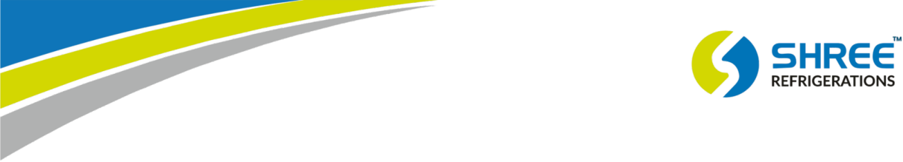
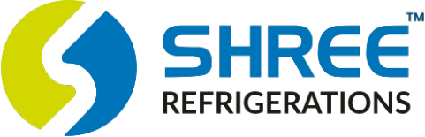
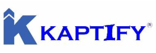

**01****st** **June  2026** 

**[Image: June206.pdf-0001-01.png (1211x219, 34.0KB)]**

To, 

Department of Corporate Services/ Listing **BSE LIMITED** 

25th Floor, P J Towers, Dalal Street, Mumbai-400001 

**Subject: Submission of Transcripts of Post Earning Conference Call held on Tuesday, 26****th** **May 2026, at 3.00 P.M.** 

**Ref: Regulation 30 of the SEBI (Listing Obligations and Disclosure Requirements) Regulations, 2015** 

#### **Scrip Code: 544458 ISIN: INE0FMZ01045** 

Dear Sir/Madam, 

Pursuant to Regulation 30 of Securities and Exchange Board of India (Listing Obligations and Disclosure Requirements) Regulations, 2015 (“SEBI Listing Regulations”), the Company is hereby submitting transcripts of Earning Conference Call held on Tuesday, 26th May 2026, at 3.00 P.M. to discuss H2 & FY 2025-26 earnings with Investors. 

The said information will also be uploaded on the website of the company https://www.shreeref.com/. 

Submitted for your kind information and necessary records. 

Thanking you, 

**For and on behalf of Shree Refrigerations Limited** Tanmay Digitally signed by Tanmay Mukund Mukund Pethkar Date: 2026.06.01 Pethkar 14:34:17 +05'30' **_____________________ Tanmay Mukund Pethkar Company Secretary and Compliance Officer Membership No. A53618 6th Floor," Samarth House”, Survey No.116/3/1, 3/3,3/10, Near shell Petrol Pump, Warje, Pune, Maharashtra, India – 411058** 

**[Image: June206.pdf-0001-14.png (1240x115, 52.3KB)]**

**[Image: June206.pdf-0002-00.png (481x155, 18.2KB)]**

# **Shree Refrigerations Limited** 

## **H2 & FY26** 

## **POST EARNINGS CONFERENCE CALL** 

May 26, 2025 3:00 PM IST 

## **Management Team** 

Mr. Ravalnath Gopinath Shende - CMD CMDE. Sunil Kaushik NM,VSM (Retd.) - WTD Mr. Abhijit Saoji - CEO Mr. Manoj Kothale - CFO 

### **Call Coordinator** 

**[Image: June206.pdf-0002-08.png (263x91, 20.4KB)]**

Strategy & Investor Relations Consulting 

Shree Refrigerations Limited H2 & FY26 Post Earnings Conference Call May 26, 2026 

### **Presentation** 

### **Vinay Pandit:** 

Ladies and gentlemen, on behalf of Kaptify Consulting Investor Relations Team, I welcome you all to the H2 & FY26 Post Earnings Conference Call of Shree Refrigeration Limited. 

Today on the call from the management team we have with us Mr. Ravalnath Gopinath Shende, Chairman and Managing Director. CMDE. Sunil Kaushik, NM, VSM Retired, Whole-Time Director. Mr. Abhijit Saoji, Chief Executive Officer, and Mr. Manoj Kothale, Chief Financial Officer. 

As a disclaimer, I would like to inform all of you that this call may contain forward-looking statements which may involve risk and uncertainties. Also, a reminder that this call is being recorded. 

I would now request the management to briefly run us through the investor presentation with business and performance highlights for the period ended March 2026, the growth plan and vision for the coming year, post which we will open the floor for Q&A. Over to the management team. 

**Abhijit Saoji:** 

Thank you, Vinayji. My name is Abhijit Saoji, and good afternoon to everyone and welcome to this earning call. Let me walk you through the operational and financial result of Shree Refrigeration Limited. In Shree Refrigeration Limited, we say we don't manufacture products, we manufacture pride. And we definitely manufacture the pride for this country. 

Before getting into the operational result of this company, let me bring in a few highlights, a few financial highlights. All of you are probably well-versed about the financial result of this company. But in short, in a whole year basis, we have increased our turnover by around 50%-plus. Our PAT is up by 64%-odd on a Y-O-Y basis. And the most important, despite of a dilution of stake and number of shares going up, our EPS is up as compared to last year by 28%. A detail of it, why it has happened, how it has happened, let's go through the presentation. 

Okay, let's look at the operational part of it. The financial part will be taken care by my colleague, Mr. Manoj Kothale. Okay, we are known in the refrigeration world as a 30-odd-year-old company, manufacturing most of the test equipment for other refrigeration companies. But since last 10-odd years, we are known as a leading defence or premier defence HVAC supplier and manufacturer of the systems. 

Page 2 of 26 

Shree Refrigerations Limited H2 & FY26 Post Earnings Conference Call May 26, 2026 

We are today a 350-odd strong team. We have offices across eight locations in India, mostly towards the coastline. And we do have a three plus three certification from Naval Fraternity. Now, what is the three certificates and what is the importance of this three? I will cover them in my subsequent slides. But this is the most important part of the presentation also. 

What drives us? What are our mission and vision? We would like to build this nation, very strong nation, with indigenous product and robust cooling solutions. Our missions are very clear, provide a reliable and high-quality product for our defence and engineering sectors. The classic example of this vision and mission is we are the only Indian firm which has indigenized the whole submarine HVAC system. What are our journey over 30-odd years? I will not take you individually, but in 2016-'17 is where we entered into the defence segment or mostly a naval segment. Since then, we have delivered most critical and newer technology to the Indian naval segment, namely, indigenizing of the submarine or Scorpene air-conditioning system; introducing first time an oil-free compressor-based chiller solution to the Indian Navy; and 2025, all of us are aware that we have been listed on the BSE. And that's the reason we are interacting with each other. And thank you for the trust shown in us. 

Okay, what are our core business identity? As I said, okay, let's look at what are those three out of three registrations. If you look at the last line of this slide, we are the only company in the HVAC segment in India, which can manufacture or which are allowed to manufacture and supply HVAC system, AC and Ref plant, as well as our own control panel. Most of my friends in this industry either can supply HVAC system or can they only supply only AC and Ref plant. Some of them or few of them can supply both HVAC and AC plant. But they have to buy a control panel from someone else. We are the only firm which can manufacture, which are allowed to supply, manufacture and install commission, all three of these three segmentation. 

Where does our revenue come from? Our revenue comes from all these four streams; that is equipment or system supply for new and retrofit. New means a new ship building. Retrofit is an existing ship, which is coming into refit. Obviously, spares, that's a major revenue stream. Installation commissioning and AMC & lifecycle service. What are the product range, we are talking about? Our flagship product is an AC plant. This is what we have started with. HVAC has been added three years back. Electrical panels, we have been doing it from day one. 

Page 3 of 26 

Shree Refrigerations Limited H2 & FY26 Post Earnings Conference Call May 26, 2026 

Now, from an AC plant point of view, there, I will not get into the technical part of the story of what is the capacity and all that. But let's say from a revenue point of view, there are six AC plant capacities standardized by Navy. Today, four of those capacities, they are already type tested by us. Now, what is meant by type testing? Once you test that product, as per the naval or defence grade, when the order gets repeated for that product for any other ship, we don't have to do the type testing again. So, four AC plant is already type tested, four AC plant capacities are already type tested. 

In case of HVAC, which consists of quite a few of our product, let's say, to name it, if I have to take three or four major components, the ATU, again, six capacities are defined by Navy. We already type tested all six. AFU that is Air Filtration Unit or Nuclear Biological Chemical Warfare Filtration Plant. We already type tested all the capacity. Ventilation fan, the number of capacitors are quite high. Most of the thing, let's say, on a percentage terms, we have already type tested 70% of it. So, we are one of the firm which has almost all the capacities, all the products are type tested and which has a distinct advantage going forward for us. 

What are the project which we are currently doing and what are the project which we have completed? I will not again get into the name of this project, but if you look at it, P17 Alpha Nilgiri class ships, that's fourth line on the left-hand side of the column. That's the most prestigious, what is called as, frigate. Frigate which has been dedicated to nation by our Prime Minister. We already supply our oil-free compressor-based chiller to this project. This project is completed, time-tested. 

Scorpene is again the first one which we have indigenized, is already here. All these completed project will bring us a lot of revenue on the spares and services going forward. What is our ongoing project as of today? We have eight ongoing project, out of which 4 will be completed in this financial year. This means FY27. Others will continue for next financial year also. Obviously, eight project means that much of team is required to handle and you can see in 10 years, we have done, completed eight-odd order project and currently we are doing eight ongoing project. That means our market share today is very high. As of today, we are holding 64%-plus market share in the market. 

To complete this project, to produce this project, you need to have a state-of-art manufacturing facility. What kind of manufacturing facility we have? We already have originally a 20,000 square feet of Plant 1, 

Page 4 of 26 

Shree Refrigerations Limited H2 & FY26 Post Earnings Conference Call May 26, 2026 

which will get converted into mostly now an assembly plant and a testing facility. Currently, we are running a leased unit which will be closed in the month of June because our 50,000 own expansion will undergo a commercial production from the month of June onward and lease facility will be closed. This put together will give us something about 70,000 square feet of manufacturing facility with all state-of-art machinery in-house. It's completely backwardly integrated manufacturing facility. We hardly have to now find a dedicated subvendor for us to do a small, small job also. Important thing, this facility is certified by ISO, obviously, ZED Gold, that is zero defect and IRS that is Indian Register of Shipping. 

Okay, when we  anyone who's talking about defence has to have a stateof-art testing facility. These are the testing facility. Today, I am proud to announce a controlled Ambient AC test room called ATU. We are the first company on the block who's created this facility, which has been made available for Navy to test their HVAC system or indoor system. Bottom two are the AC plant and wet plant testing facility. Obviously, the corner one where you have seen the product getting tilted because the ship motion has to be imitated in the testing facility. The product has to work when the ship is tilting. The same way, in case of submarine, the tilting goes up to 45 degrees centigrade. 45 degrees, not centigrade, sorry. Okay. 

Now to support this kind of a product in the market and to support our customers, our existing customers, we have a branch office across the coast. We will open a new office in this financial year in Kochi also. So, east side, we have a Visakhapatnam and Kolkata. South, we have a Chennai, we may have Kochi this year. West side, we have a Goa, Mumbai and Pune. Obviously, Delhi being the an epicentre of all this defence, we have a sales office in Delhi. 

What are the certificate and registration? The first three are the three one which we are talking about coming from marine engineering, coming from electrical engineering and coming from naval architecture, taking care of all the segment. We already have CE, IRS, all certifications are available. 

What is our market outlook? We did said that we are already an active and we are a market leader in our defence and HVAC system. We are trying to get ourselves established into a data centre market. Do I need to explain your tailwind about it? Because all of us are reading a newspaper, all of us are reading news and hearing the news. Both these segments have a huge tailwind. I will not dwell a lot on this slide. 

Page 5 of 26 

Shree Refrigerations Limited H2 & FY26 Post Earnings Conference Call May 26, 2026 

Let's look at it in terms of number. How big is this market? Probably data centre and marine market put together is huge. But if I look at it, it's only a defence HVAC system market. Instead of giving you a, what do you call it, explaining you this slide, let me ask my colleague, CMDE. Kaushik here, to come in and to explain the slide in a much better way. 

- **CMDE. Sunil Kaushik:** So, when we look at our business opportunity, what is it that we are looking at? We have already established ourselves in the defence marine ecosystem. Actually, if you look at the marine ecosystem, you can bifurcate it into defence applications and non-defence applications. Non-defence applications essentially being the merchant marine. Merchant marine so far had not had too much of a growth. There was not much of traction. But as everybody knows that there is a very, very strong thrust by the government now to make our merchant marine shipbuilding capability rampant from the present lowdown position to come up to the top 10 by 2035 and top 5, top 3 shipbuilding nations by 2047. That means that there is a huge amount of shipbuilding activity that is going to happen from now right through for the next two decades, that is in the merchant marine space. 

If we look at the first slide and we look at what is our defence, which is our core business, what is our opportunity? The Navy today has about 150 ships. We're looking at ramping it up to become a 230-odd ship Navy over the next five odd years, five to seven years. So there is a plan in place and proposals are being put to the government and government approvals are coming through. As of today, we've got upwards of INR2.3 lakh crores, INR2.4 lakh crores worth of AONs for the government, which will translate into orders over the next two years. 

When we say that that's going to translate into orders, what is our scope of that? How much is our scope? Well, roughly put, our market share in that for all the players in this particular field is about roughly 1%. When you see AC, REF and HVAC, it's about 1% of the cost of the project. So you can make out INR2.3 lakh crores to INR2.4 lakh crores. 1% of that is close to INR2,500 crores. If you add on to that the nondefence ecosystem, that's about INR 2 lakh crores. So that's about another INR500-odd crores of market cap, right? So we're looking at roughly about INR3,000 crores, INR3,500 crore TAM over the next two years. And there are three or four major players. And if we conservatively say that everybody gets an equal share that means our share of the pie from a INR 3, 000 crores, INR 4, 000 crore market will roughly become divided by four, if we take it as four players. And we 

Page 6 of 26 

Shree Refrigerations Limited H2 & FY26 Post Earnings Conference Call May 26, 2026 

take that we capture about 25% of the market. But the fact is that we capture around 60% to 70% of the market. So we've got a huge, huge market opportunity. 

Next slide, please. As we continue looking at the marine environment, we also decided as part of a strategic expansion that we should look at something which will leverage our core strengths on the land-based applications. And we thought that data centre applications is something that we completely fit the bill in. So we've got a strategic partnership or strategic tie-up with our partners, Smardt, for being the channel partners, for providing data centre cooling solutions. Well, I don't think I need to speak much about the potential of data centre to this esteemed audience. I think everybody is extremely knowledgeable about what kind of growth data centres offers us in the next few years up to 2035 and beyond. It's very difficult to put a finger on what numbers it's going to translate into. But I think suffice to say that it is an extremely, extremely huge market potential. 

And as far as we are concerned, whatever the technology for data centre cooling is, whether it's air cooling, whether it's water cooling, whether it's direct to chip, whether it is immersion cooling, whatever technology is going to be there, you always need a chiller to chill either the air or the secondary coolant. So you are always going to have an opportunity in the chiller market. So we feel that we are extremely bullish as we go forward, considering the market opportunities that we have. 

### **Abhijit Saoji:** 

Thank you, sir. Thank you so much. And as Commodore Kaushik has just rightly mentioned, ultimately a technology which we are using in our defence cooling system is the same technology which is probably getting used across the globe for a data centre. And same way, we have done a tie-up with Smardt, which is again an oil-free, oil-preservedbased chiller, number one player in the world. So that is the same technology which we would like to apply in a data centre in India, which has a distinct advantage of power saving, easy startup. Okay, let me not get into a technical sense here. 

Okay, what is the way forward? We looked at the TAM, we looked at a very high TAM. What is our future outlook? We are still saying that we will continue to grow 40% CAGR rate for three to five years easily without much of an issue. 

**CMDE. Sunil Kaushik:** Okay, we see some participants raised hands. We'll take questions at the end of the presentation if it's okay with everybody. 

Page 7 of 26 

Shree Refrigerations Limited H2 & FY26 Post Earnings Conference Call May 26, 2026 

**Moderator:** 

Yeah, yeah, sir. That's okay. 

**Abhijit Saoji:** Okay, let's look at the financials. And the better person for this is Mr. Manoj Kothale. 

### **Manoj Kothale:** 

Thank you, sir. So FY26, we started with the INR215 crores of the orders in hand. A large part of those orders has been received in the last quarter. So initially, when we received the orders, we need to take the design approval required to do the type testing of various kinds. So during the first half, we did all these type testing approvals, design approvals. We also built our team, increase our capacity in terms of machineries, hired a new facility at Wajeri. So revenue was muted in the first half mainly on account of these activities.plus the deliveries has been scheduled in the second half as per the customer requirement. So once we have done our capacity building exercise in the second half, our revenue has been exceeded by 100% rate on year-on-year basis and half-yearly basis. 

With the higher execution, we have been able to generate a higher EBITDA margin of 26.3% in the second half. And as guided in the first half earning call, we have achieved the EBITDA margin of 22%. During this period, we continuously worked on reducing the working capital base, which has successfully came down from 570 days to 370 days. So these are the detailed figures. 

As I explained, our revenue has been increased from INR50 crores to INR100 crores in the second half. During this time, our employee costs and other expenses remained at the same level. Due to this benefit of operating leverage, our EBITDA margin has increased from 11% in the first half to 26%. With the increased availability of funds from IPO and availability of funds due to recoveries, we have been able to generate higher interest income in the second half. Plus we reduced the utilization of CC during the second half. We also paid off some highcost debts. This has helped us to save on interest Cost, which has come down to INR2.3 crores to INR1.3 crores in the second half. All these activities have helped us to increase our profit from 2.9% to 19.3% in the second half. Overall, at a blended level for the financial year FY26, our PAT margin has been gone up from 13% to 14%. 

This is our financial performance over the past four years. Our revenue has been growing at 45% CAGR every year. Our EBITDA has grown at 40% CAGR and our PAT has grown at 85% CAGR over the past four years. Our EBITDA margin has been moderated this year, mainly, the amount of service and spare revenue has come down to 7%, which was 

Page 8 of 26 

Shree Refrigerations Limited H2 & FY26 Post Earnings Conference Call May 26, 2026 

last year at 30% of the total revenue. Going forward, we expect that spares and service revenue will be incorporating 15% of the total revenue. This will help us to increase EBITDA margin in the upcoming period. 

This is the financial statement over the  annual income statement over the past four years. Our revenue, we can see that increased from INR50 crores to INR153 crores. We have been building our team over the past four years continuously, looking at our orders in hand and upcoming orders, plus the market available. Our employee cost has gone up from INR7 crores to INR21 crores over the past four years. Going forward, we look that new hiring will be at a very moderate level. Employee cost increase in employee cost will not be as much as increase in revenue. Similarly, for other expenses, our other expenses were under control over the past three years from '23 to '25. This year, it has been increased mainly amount of new orders that we have received. Various type testing and approval activities has resulted in higher other expenses. Going forward, we expect that other expenses will not increase at the rate the revenue is expected to increase. Further, from other income side, as I said, we have been able to generate higher income due to increased liquidity. 

On the interest side also, we have been able to save some interest cost due to lower utilization of CC, plus we have reduced some high-cost debt. In the nutshell, our net profit has been increased from INR13 crores to INR21 crores, as has been guided in the earning call of first half. During this year, we have done an IPO for INR95 crores of fresh issue. With the fresh issue also, we have been able to increase the reported EPS from INR5 per share to INR6.47 per share. 

Next slide. Coming to the balance sheet, our net worth has increased from INR118 crores to INR219 crores, mainly on account of IPO that has been done, plus PAT that has been generated from this year's activities. Non-current liabilities, we have reduced the high-cost debts. This has resulted in reduction in non-current liabilities. From the asset side, as I said, we have installed some machineries. We undertook the Hanbarwadi expansion. This can be seen in the capital WIP, which will be up and running in the month of June. On the current assets and current liabilities, we are continuously working on reducing working capital cycle days. Total receivable days were 350 days last year. It has come down to 250 days, a massive reduction in receivable days. Inventory days also came down from 250 days to 230 days. Net working capital, as we can see, has come down from 570 days to 370 days. 

Page 9 of 26 

Shree Refrigerations Limited H2 & FY26 Post Earnings Conference Call May 26, 2026 

Next slide. So, even though we delivered 150% revenue growth in this financial year, we still have 1.8 times of the revenue in our closing order book. We have INR270 crores of the order book in our hand. If we analyse, a large chunk of this order is in HVAC, AC plant, and refrigeration plants. The money required for execution of these orders, plus capacity required, factory required, and team required is already in place. We are very confident that we will achieve the guidance that has been given by our CEO. 

With this positive note, I would like to start taking your questions. Thank you. 

### **Question-and-Answer** 

**Moderator:** Thank you, sir. So, the first question we will take from the line of Mr. Agastya Dave. Mr. Agastya, you can unmute and go ahead, please. 

- **Agastya Dave:** Thank you for the opportunity, sir. Congratulations on a great set of numbers. Sir, I also apologize if me raising my hand distracted you during the presentation. I am really, really sorry. That was not my intention. 

- **CMDE. Sunil Kaushik:** Not at all, sir. Don't worry. Not at all. We just wanted to make sure we didn't miss anybody who raised their hand. 

- **Agastya Dave:** Still, sir, I must apologize. I did interrupt your flow. 

- **Abhijit Saoji:** It's perfectly okay, sir. 

- **Agastya Dave:** Thank you, sir. Sir, in the commentary that you provided on the P&L as to how various line items will change going forward as you scale up. Sir, can you also provide a little bit more commentary on what you expect on the CapEx side for the next 4, 5 years? Like, would you require some additional CapEx or completely different machinery for the data centre opportunity? And when do you see the commercial revenues start peaking in for the data centre? That's my first question. 

- **Agastya Dave:** Okay. 

- **Abhijit Saoji:** Shall I answer you the first question or you would like to continue with the second question? 

Page 10 of 26 

Shree Refrigerations Limited H2 & FY26 Post Earnings Conference Call May 26, 2026 

- **Agastya Dave:** Sir, then I will finish my questions. The second question is on the capital efficiency of the business. So, when do you see  again, sir, you gave a hint on what kind of capacities you have in place and what can be executed. The current order book can be executed based on what you have in place. Is that the maximum, like the peak revenue potential of your existing fixed assets? Or can you go higher? I mean, what is the peak revenue potential of the asset? 

And third, a small question. There is a lot of inflation on the metal side. And I would believe that you would require a lot of probably copper and other such metals. Are you seeing cost inflation or supply disruptions? Because both are happening. And how are you placed? That's a very near-term question. How are you handling that situation? These are all my questions, sir. 

- **Abhijit Saoji:** Mr. Dave, if I understood your question, let me repeat. You are asking me, do we need a CapEx in the short-term or long-term to do our datacentre business? One. Second thing, you wanted to know what kind of revenue we expect from a data centre. Third is, whatever capacity we have built in the manufacturing side of the story, how much revenue or peak revenue I can generate out of that infrastructure? And the last one is the metal inflation and how do we manage metal inflation? Is that right, sir? 

- **Agastya Dave:** One point, sir, which was missing is, on the data centre side, what and when, by when? When do you see the revenues kicking in? 

- **Abhijit Saoji:** Okay, let me at least start with your CapEx, we don't expect a major CapEx involvement for the next couple of years at least, a major CapEx involvement, a small CapEx will always come in as and when the business will grow. What revenue and when the revenue will start kicking in from a data centre? See, data centre, our tie-up with Smardt is about six months old and we are pushing in a new technology in the data centre as compared to what they are using right now. So we expect a reference installation. That is our goal is to create a reference installation in FY27. And we expect a major revenue coming in from a data centre in FY28. 

What is the peak revenue which we can generate out of our infrastructure? This data we have already given last time also. We are still seeing up to INR400 crore kind of revenue we can generate out of existing infrastructure. 

Page 11 of 26 

Shree Refrigerations Limited H2 & FY26 Post Earnings Conference Call May 26, 2026 

Metal inflation? Yes, metal inflation is affecting everyone. There is no question about it. Whether it is copper, every single metal inflation. And it will also impact us, but not as badly as it is probably impacting others. Very simple reason is we take a project which can run up to 2 to 3 years. And when you are taking that kind of project at a fixed price, you need to do your costing and your own inflation calculation in a better fashion. But metal today is going beyond every inflation calculation. So metal will impact us a little bit. 

**Agastya Dave:** 

Great, sir. Thank you very much, sir. Sir, kindly consider quarterly results as soon as possible. I know there will be constraints. But the sooner you guys can move to quarterly reporting, the better. That's the only request, sir. And all the best. Thank you very much for giving me the opportunity. 

**Abhijit Saoji:** 

Thank you so much, sir. 

**Moderator:** Thank you, Agastya. 

- **CMDE. Sunil Kaushik:** Agastya, can I just amplify a little bit on your quarterly  it's a suggestion well taken. But in our line of business, it might indicate incorrect conclusions to you. So for somebody in our line of business, in the defence ecosystem, a half yearly or actually even an annual reporting is more accurate than a quarterly reporting. 

- **Agastya Dave:** Sir, even a small update on every quarter, I understand the nature of the business. Your commentary is far more important. Like frequent commentary is far more important than the actual numbers. We will understand the seasonality, sir. Thank you very much, sir. Thank you. 

- **CMDE. Sunil Kaushik:** We are very happy to hear that the investor community is extremely mature. Thank you. 

- **Moderator:** 

   - Thank you, Agastya. We'll take the next question from the line of Achyth Reddy. Achyth, you can unmute and go ahead, please. 

- **Achyth Reddy:** Yeah. Hello, sir. I just want to understand, so in FY26, H1 was very bad and H2 was a blockbuster. So I want to understand, will it repeat the same in FY27 or will it change in FY27? Like can we get equal revenue in both H1 and H2 or how things change now? What is going to happen in FY27? 

### **Abhijit Saoji:** 

Achyth, thank you for asking this question. 

Page 12 of 26 

Shree Refrigerations Limited H2 & FY26 Post Earnings Conference Call May 26, 2026 

- **CMDE. Sunil Kaushik:** One thing, one thing. Achyth, I will just interrupt. Agastya, this is exactly the point I was trying to make, you know, in response to your quarterly reporting. But yeah, go ahead. 

**Abhijit Saoji:** Achyth, coming back to -- yes, you observed perfectly on it. H1 was really very, very muted and H2 was a blockbuster. Going forward in FY27, we see H1 and H2 will not be as skewed as it was in FY26. There will be a lot of stimulus which will come, H1 and H2. But still H2 will be a little bigger as compared to H1. 

- **CMDE. Sunil Kaushik:** Achyth, if I can just amplify a little bit more. You see, our deliveries and therefore the numbers that you see are one of the factors that drive it is the delivery requirements by the shipyards who are our major customers. So even if we want to, for example, make H1 a blockbuster as much as H2, we may be constrained because the delivery collection or the delivery period for a particular shipyard may actually lie in H2 rather than H1. So this skewness is going to be there. It is a factor of the sector that we are in and the business that we are in. But yes, we are trying to see how we can even it out because we do see that the investor community likes to have a more equal kind of a delivery period rather than having any kind of skewness. 

- **Ravalnath Shende:** Another factor that will influence this number is since we are handling more number of projects in a year, the skewness across projects may dampen the skewness across quarters or halves. 

- **CMDE. Sunil Kaushik:** Yes. 

**Achyth Reddy:** Thank you sir. 

**Moderator:** Thank you. We will take the next question from the line of Deepak Poddar. Deepak, you can unmute and go ahead please. 

- **Deepak Poddar:** Thank you very much, sir, for this opportunity. Sir, I just wanted to understand first of all  in your opening remarks, you did mention that your other expenses will not increase at the same rate as your revenue. So, kind of some operating leverage advantage you do expect to get. So, what sort of EBITDA range we might look at in terms of margins? 

**Manoj Kothale:** So, for next going forward, we expect that our EBITDA margin will remain somewhere between 20% to 24%. 

Page 13 of 26 

Shree Refrigerations Limited H2 & FY26 Post Earnings Conference Call May 26, 2026 

**Deepak Poddar:** Okay. And this is after considering the impact of commodities that you mentioned will impact us? 

**Abhijit Saoji:** Deepak ji, the commodity inflation has always been on an arc. And we did consider that before making this kind of guidance figure. 

- **Deepak Poddar:** Okay, understood. And my second question is on your TAM. The INR3,000 to INR3,500 crores TAM, that is over next one year or two years that we are looking? 

**Abhijit Saoji:** 

It's two years, sir. 2.5 years kind of thing. 

- **Deepak Poddar:** 2 to 2.5 years. And that includes both your defence as well as nondefence TAM. 

- **Abhijit Saoji:** 

That is only for defence on a -- It's basically for a marine segment. 

**Deepak Poddar:** So, both defence and non-defence is included? 

- **CMDE. Sunil Kaushik:** No, I'll just amplify that. The defence marine ecosystem is INR2,500 odd crores. The marine is about -- as of now, the demand aggregation, which  I will just give you a comparison. When the ministry aggregated the demand, in November, that number was around 200. Today, the number is at 434. That's the number of ships that are required by the Ministry of Shipping for SEI, Dredging Corporation, ONGC, etc., etc. So, this number is continuously changing and it's going to  there is some projection that it's likely to be about 700. So, but the orders for that is still not starting to fructify That is why we say it's in about 2, to 2.5 years because we are expecting about 60-odd tenders to come out this year. That's the expectation from the ministry. So, we are just keeping a very conservative number for that. 

But the defence segment, which is the core business, that's going to be about INR2,500 crores. And that's over the next two years. Keep in mind that this is for AONs, which the government has already given. There are more orders, there are more projects, which are in the pipeline, which obviously will get their AONs over a period of time. 

### **Deepak Poddar:** 

Okay, understood. So, given this expectation that we have in terms of tenders, so what sort of order inflow we are targeting for this FY27? 

**Abhijit Saoji:** If I understood your question rightly, what you are asking is what is the order book position which may happen in FY27. Is that right? 

Page 14 of 26 

Shree Refrigerations Limited H2 & FY26 Post Earnings Conference Call May 26, 2026 

**Deepak Poddar:** 

FY27 order inflow, I mean fresh orders. 

**Abhijit Saoji:** 

So, please understand, what we see very clearly from a defence segment is approximately a INR1,000-odd crore worth of tender will be floated. How much we will win and how much we will lose, that will depend. Currently, our market share is 64%. 

**Deepak Poddar:** Okay, 64%. And we have mentioned we have four players, right? Generally, it is divided between four players? 

- **CMDE. Sunil Kaushik:** So, that's when we look at the non-defence marine segment as well. When you look at the marine segment, of course, like we said, there are three distinct products. One is the REF, one is the AC and one is the HVAC. And you have different number of players in each of these three products. But now here is the twist, right? Most of the shipyards now are opting to go for turnkey jobs, right? Earlier, a shipyard used to place individual orders for AC, individual order for HVAC. Now, shipyards are increasingly opting to do turnkey ordering. That means one firm has to provide both the AC and the HVAC. Right. Now, how does that affect us? Well, we manufacture both products. So, we are a single point firm to provide both these products. 

What happens to the market share? What happens to our friends who are also in this segment? Most of them produce one or the other. So, you are dependent upon somebody else to become your partner. 

- **Ravalnath Shende:** We are at an advantage, more advantage right? 

- **Deepak Poddar:** Okay, understood. I think that would be it from my side. I would like to wish you all the best. 

- **CMDE. Sunil Kaushik:** Thank you so much, Deepak. 

- **Moderator:** Thank you, Deepak. I would request all the participants to please limit yourself to two questions only since there is a long queue. We will take the next question from the line of Mr. Deepak Bhuptani. Deepak, you can unmute and go ahead, please. 

- **Deepak Bhuptani:** Hello, sir. I am Deepak Bhuptani from Valtrion Enterprises Private Limited. It is my pleasure to be a part of this event. And I am giving congratulations for the excellent performance of the company this year. I have three questions. First of all, what will be the total CapEx for the company's new plant expansion? And how much increment revenue or 

Page 15 of 26 

Shree Refrigerations Limited H2 & FY26 Post Earnings Conference Call May 26, 2026 

profit is expected from the new plant? And the second one is, what is the management growth vision and expected revenue profit for the 2, 3 years? **Ravalnath Shende:** Thank you, Mr. Deepak. Manoj you take… **Manoj Kothale:** Thank you, sir. So, the total CapEx requirement for Phase 1 at Hanbarwadi location is INR25 crores. Most of the CapEx has been done and the plant will be up and running by June. The incremental profit, I would say that this is an extension of our existing facility. The incremental revenue guidance has been already given by the CEO, sir, which will be at 20% CAGR rate over the future years. Thank you, sir. And growth vision, I request Shende sir, to guide us. **Ravalnath Shende:** CAGR 40%. **Deepak Bhuptani:** Okay, sir. Thank you very much. **Moderator:** Thank you, Mr. Deepak. We will take the next question from the line of Harish Shiyad. Harish, you can unmute and go ahead. **CMDE. Sunil Kaushik:** Deepak, before somebody else takes, thank you for your good words as you asked your question. **Moderator:** Harish, you can go ahead with your question. **Harish Shiyad:** Congratulations on a good set of numbers. **Abhijit Saoji:** Thank you. **Harish Shiyad:** And regarding this marine engineering business, you have 64% share into that. So, my question is, what is the product differentiation we are doing and what is the entry barrier in this sector to us? **Abhijit Saoji:** And that's a good question, Deepakji. Let me answer you one. If you remember, I said about a three registration. And a three registration, that means we are the only firm in HVAC segmentation, which can supply HVAC as well as AC plant or REF plant, and as well as make our own control panel. Any of my friend in this segment, either they are allowed to supply AC plant, but when they are supplying AC plant, they had to buy a control panel from someone else, whoever's control panel manufacturer. Some of them are only allowed to supply HVAC. So, in that case, they had to buy an AC plant either from me or somebody else. 

Page 16 of 26 

Shree Refrigerations Limited H2 & FY26 Post Earnings Conference Call May 26, 2026 

So, that is an entry barrier which we have. And as such, for a defence segment, there is just about four or five-odd players into this segmentation. To enter into it, defence themselves has created a lot of entry barrier. 

- **CMDE. Sunil Kaushik:** Let me just add on to what Mr. Abhijit is saying. For your understanding, the entry barrier for defence is the ability to get certified by DGQA and the professional directorate of the concerned service. Every equipment that comes into defence has to meet DEF STAN or military specifications. Now, that's a cumbersome job and not everybody actually manufactures equipment, which is to meet this because it is an extremely higher grade of equipment manufacture. After that, to qualify and then to qualify from different directorates, like Mr. Saoji just mentioned, because there are three different directorates who look after our product. The Directorate of Marine engineering looks after the AC and REF. The directorate of naval architecture who actually looks after structures, looks after the HVAC. And the Directorate of Electrical Engineering looks after electrical aspects. 

Now, each of these three directorates evaluates a firm for its scope, right? So, in our case, they have evaluated us and cleared us. And therefore, we are part of the vendor list for all three equipment. 

- **Harish Shiyad:** One more thing, in the month of March, we have entered into an agreement with the Danfoss USA for some servicing in India. So, how big is that opportunity and what is the potential from that segment? 

- **Abhijit Saoji:** Harishji, first of all, thank you so much. It is our duty actually to inform and to put this into a presentation. Somehow, I missed it. And really, thank you for bringing this in this gathering. Okay. What is this tie-up? Is that we are the only authorized service partner. Let's say tomorrow, for the sake of taking some name, I am taking the name of a Daikin. Tomorrow, Daikin makes a chiller. If they find some problem in that particular compressor. And this has nothing to do with defence segment. It has nothing to do with only data centre. The compressor is used for, let's say, pharmaceutical industry. But if there is a problem, we will be the authorized service station for it. So, for any oil-free compressor which is supplied by Danfoss, for servicing it will come to us. 

**Harish Shiyad:** But what is the total area in India? How much? 

- **CMDE. Sunil Kaushik:** Okay, Harish, I just want to tell you that we are not looking at very high revenue from this particular service agreement at this point in time. 

Page 17 of 26 

Shree Refrigerations Limited H2 & FY26 Post Earnings Conference Call May 26, 2026 

Because the total population of these compressors is somewhere around 1,200-1,300 odd. What this is, actually, is a strategic investment. It's a strategic tie-up. And it's a capability building step that we have taken. Danfoss, it's called Turbocor Authorized Service Partner, TASP. Because this is specifically for mag-bearing compressors or oil-free compressors which are manufactured by Danfoss Turbocor. They do not have this kind of service arrangement or they do not have an authorized service partner. There are very few globally. I think about three-odd… 

- **CMDE. Sunil Kaushik:** Okay. So, Harish, like we were saying, the revenue that we are expecting from the authorized service partner setup that we've done is not significant today. But it's a strategic tie-up that we have done. We are expecting that as we grow forward and as the data centre applications increase in number, there are going to be a large number of Danfoss compressors or oil-free compressors that will come into service. Okay. Therefore, our market in the future, we expect it to be large. 

**Harish Shiyad:** Okay. 

- **CMDE. Sunil Kaushik:** And the most important thing is that the Navy, we have got all of them, a large number of these compressors. And therefore, it's important that we develop the capability of supporting these compressors or these plants in-house, indigenous. 

**Harish Shiyad:** 

Any roadmap or plan to get listed on the Main Board of BSE and NSE? 

**Abhijit Saoji:** 

   - Sir, I think if my memory serves me right, we are not allowed to go to the main board for another two years at least. Almost another two years. And we definitely plan to move to the main board as and when the window is available to us. 

- **Moderator:** Thank you, Mr. Harish. We'll take the next question from the line of Jaideep Rupani. Mr. Jaideep, you can go ahead, please. Hello, Mr. Jaideep. 

**Abhijit Saoji:** Hello. Can I get another question, please? 

**Moderator:** I think we'll move to the next participant. There is some problem with the line. We'll take the next question from the line of Sridhar Panduranga. Mr. Sridhar, you can unmute and go ahead, please. 

Page 18 of 26 

Shree Refrigerations Limited H2 & FY26 Post Earnings Conference Call May 26, 2026 

- **Sridhar Panduranga:** Yeah. So, first of all, thanks a lot for a great set of numbers and explanation. I'm calling from Mangalore. So, my question is, do we have any plans for export market other than India? 

**Abhijit Saoji:** Sure, sir. Definitely. 

- **CMDE. Sunil Kaushik:** Yes, we do have plans, Sridhar, for entering the export market. Plans are at a nascent stage. There are certain discussions. I won't like to elaborate too much on it. I would not like to elaborate too much on it. But yes, we are  we have our eyes open for the export market. 

- **Sridhar Panduranga:** Okay. My second question is, do we have any plans to increase the operating margin? Because I see from '24, it is reducing from 31%, 27% and 21%. Whether it will be increasing as the year goes on? 

- **Manoj Kothale:** So, what we  last year the 27% EBITDA margin we have achieved, this year  this year it has moderated to 21%. So, reason for this was mainly due to lower, lower spares and service revenue. Going forward, we are continuously working on it to increase our spares and service revenue to 15% to 20%. So, once it happens, EBITDA margin will always go up. 

- **Sridhar Panduranga:** Okay. My last question will be about data centres. So, in one of the commentary, you said any cooling system, whether it will be air cooling or liquid cooling, the chiller market will be there for a Shree Refrigeration. So, when we consider the complete data centre setup, what is the percentage of market for a chiller? What is the percentage in 1%, 2% of the complete data centre setup? 

- **CMDE. Sunil Kaushik:** See, when you look at a data centre, there are 6 or 7 layers of data centre, right? There's an EPC, there's a power generation and storage, there's a transmission, there's a cooling, there's a chip manufacturer. So, there is large number of segmentation which go into a data centre. As far as the pure cooling is concerned, it's roughly about 12% to 13% of a project, of a data centre project. Right. Now, if you look at  if you want to translate that into a number, purely for the existing data centres which are being executed today, the market is at 2.99 billion which is expected to grow to almost 9 billion over the next 3 years. So, only the data centre cooling market, the cooling segment of the entire data centre is expected to grow at about 25% to 30% CAGR over the next three to five years. 

### **Moderator:** 

Thank you. We will take the next question from the line of Mr. Nupur Karnani. Mr. Nupur, if you can go ahead, please. 

Page 19 of 26 

Shree Refrigerations Limited H2 & FY26 Post Earnings Conference Call May 26, 2026 

### **Nupur Karnani:** 

**So** personally, I would like to congratulate the management on good set of numbers. So, my first question is that apart from the order book that we currently have, as on 31 March, it was somewhere around 270 cr. So, how many projects have we bid for as on date and how many we are L1 bidder and how does the current project pipeline look like? 

- **CMDE. Sunil Kaushik:** There are two parallel tracks of the way we supply. One is for new builds and the second is for retrofits. That is, as a platform in the Navy grows older, its equipment and sensors etc, are periodically renewed. So, you have two distinct streams or two distinct methodologies in which equipment is supplied. As far as the newbuilds are concerned, that's the only place where we lost a few tenders. As far as the retrofits are concerned, as of now, the hit rate is very close to 100%. Going forward, we expect it to remain that way. 

**CMDE. Sunil Kaushik:** Nupur, thank you for your good words as well. 

**Nupur Karnani:** No. I believe the second part was not communicated properly. 

- **CMDE. Sunil Kaushik:** Sorry, what was the second part? 

**Nupur Karnani:** So, it was with respect to the financials. So, there is one line item that is other current assets. So, other current assets just went up from INR3.02 cr. to INR19.94 cr. So, what led to this increase by 6x? That was the second part. 

- **CMDE. Sunil Kaushik:** Oh yeah, we didn't hear that question but yes, we will answer that. 

- **Manoj Kothale:** So, the rise in other current assets is mainly due to advances given to the suppliers. And some part is related to GA balances with the GST department. What happens is we buy the material at 18% input GST. At the same time, we supply the material to shipyards for warships at 5% GST rate. So the GST amount is lying with the government. It will come down once we apply for the refund of input tax credit. It will definitely come down in the first half of this year. 

- **Nupur Karnani:** Understood. So, that was from my side. Good luck to the management. Thank you. 

Page 20 of 26 

Shree Refrigerations Limited H2 & FY26 Post Earnings Conference Call May 26, 2026 

**CMDE. Sunil Kaushik:** Thank you so much. **Abhijit Saoji:** Thank you, Nupur. **Moderator:** Thank you, Nupur. We will take the next question from the line of Keshav Harlalka. So, Keshav, you can unmute and go ahead, please. **Keshav Harlalka:** Hi, hi. Thank you so much, Ravalnath Shende sir and team for giving us an excellent set of numbers and delivering and more than delivering on what you promised. So, we have grown not 40% CAGR but 50% CAGR this year. So, this is an excellent set of numbers. So, the first comment on seeing the numbers is the working capital cycle has improved from 570 days to 370 days. So, can you give your comment on what this year what we could expect in terms of working cycle improvement from 370 days? Where are we going now? **Abhijit Saoji:** I was under impression, last earning call, every question was on 570 days. I thought that we have improved. Now, there will not be any more questions. But you are just like as my boss asking more improvement. Sir, but let me assure you, the improvement will continue going on. Number, I will come back to you. **Keshav Harlalka:** Okay, got it.  Sir, second question is. Yes, sir. Yes, sir. Sir, amazing. So, 570 to 370 means we are like a 30% down in working capital cycle days, which is amazing, sir, just in a space of one year. That is really, really very good work. Sir, second question is, there is a lot of volatility in commodity prices. Sir, do we have a commodity price volatility inbuilt when we take orders from the -- when we are bidding for orders? Is our order having, if there is a price volatility that will get factored in when we are billing you to the client? Do we have that inbuilt? **Abhijit Saoji:** Keshavji. **Keshav Harlalka:** Affecting our margins? **Abhijit Saoji:** Keshav ji. You know, when we bid a project and if the project is going to happen for a couple of years, we definitely consider inflation, commodity price rise into our bid. But there is a limit to it, what we can think about. So, the commodity price rise which has happened, unprecedented commodity price rise which is happening right now, will have a small impact on us. And that impact is seen in EBITDA margins also going forward. 

Page 21 of 26 

Shree Refrigerations Limited H2 & FY26 Post Earnings Conference Call May 26, 2026 

- **Keshav Harlalka:** Got it. Got it, sir. Just two more questions, very short and fast. The third one is, we have entered into data centre cooling. So, what could be the contribution of data centre cooling going forward? That is question number one. Question number two is, we have guided for a 40% CAGR for the next three to five years in the current presentation. And in the last presentation, we have guided for INR1,000 crores sales and INR120 crores to INR130 crores PAT for FY30-'31. So, can you comment on these two numbers, sir? 

**Abhijit Saoji:** My first comment will be, we are still… 

**Abhijit Saoji:** Okay. I said we will stand by the number which is what has been mentioned by us. Definitely. And I also answered about a data centre saying that the data centre, this year, we are looking for a reference kind of installation. So, no addition to the top line or bottom line. Data centre revenue will start trickling in from next year onward, FY28 and onward, not in FY27. Is this audible? **Moderator:** Yes, sir. You are audible. Please continue. **Abhijit Saoji:** Oh, I have done my answer. I don't know whether -- **Moderator:** Yeah, yeah. Okay. We will take the next question from Mohit Motwani. Mohit, you can go ahead, please. **Mohit Motwani:** Hello. Hi. Thank you for the opportunity. One or two questions on data centre piece. You spoke about the revenues, you know, which you are anticipating in FY28 majorly. Are you baking this in your 40% revenue guidance or this is out of that? That this will be above that? **Abhijit Saoji:** I am saying that there will not be any revenue which we have considered from our data centre in FY27. So, our guidance for FY27 is without data centre. **Mohit Motwani:** Okay. And in terms of have you started any initial conversation with potential customers? And in that, can you give us a colour of the competitive landscape which is there and how many players are there while you are competing with? And probably you are expecting orders to come through by end of the year because of which you would be having these revenues in FY28. Should we think about it that way? And also, you mentioned about exports that, this is very in nascent stages. 

Page 22 of 26 

Shree Refrigerations Limited H2 & FY26 Post Earnings Conference Call May 26, 2026 

So, is this also for the data centre piece or this is to do with the defence sector side? 

**Abhijit Saoji:** Okay. The first part of about a data centre, how many players there are, whoever it is  data centre also has a very high entry barriers. Your product has to be qualified for that. And that is the reason why we have done a tie-up with the Smardt. As of today, there are, let's say, worldwide there are 30 or 40 major players in a data centre, and out of which probably almost 70% is already present in India. So, there are enough players but the market size is also so big. Every single player today is probably booked at almost their 100% capacity level. 

So, getting a business out of data centre, if our product is approved, if we are able to make it very clear, will not be an issue. About export, as of today, currently we are thinking about exporting a non-marine business or a non-naval business, sorry, nothing about a data centre. 

**CMDE. Sunil Kaushik:** It's in the marine segment, the exports are in the marine segment. 

**Moderator:** Thank you. We'll take one last question from Mr. Om Makeshali. Mr. Om, you can unmute and go ahead, please. 

**Om Makeshali:** Hello Sir, Good Afternoon. **Abhijit Saoji:** Good Afternoon. 

**Om Makeshali:** I want some clarification regarding the long-term financial roadmap shared earlier by the company in November 2025 PPT. So, you said that INR1,000 crore revenue and around INR120 crore PAT and currently you are saying that you are doing 40% CAGR for 4 to 5 years. So, if we calculate then it can be around INR800 crore in 2030 or '31. So, how would you answer that? 

**Abhijit Saoji:** Mr. Om, the answer itself lies in my this year results. We did give you a kind of a guidance and we did deliver you something. So, it's a mathematical calculation which we are doing. If you grow it by exactly 40%, you will end up in doing INR833 crore. But that doesn't work in business, sir. So, as a management of this company, we definitely are standing by our word. INR1,000 crore is the ladder which we are here in next 5 years and it will happen, sir. **Moderator:** Thank you. We'll take one question from Mr. Palash Kavali. Mr. Palash, you can unmute and go ahead, please. 

Page 23 of 26 

Shree Refrigerations Limited H2 & FY26 Post Earnings Conference Call May 26, 2026 

**Palash Kavali:** 

Yes, sir. Thank you for the opportunity. 

First of all, congratulations for a good set of results. Sir, my question is, would you be needing any external fundraising for this guidance that you have given? 40%, 50% CAGR from next 4-5 years or internal accruals would be enough to achieve that kind of number? 

**Manoj Kothale:** So, we are continuously working on reducing our working capital days. Going forward, for the growth aspiration that we are looking, major requirement will be for working capital only. So, whatever the new working capital requirement will be funded by internal accruals and bank funding. If you look at our balance sheet, the balance sheet is not leveraged. And we can easily raise the required funds for working capital, sir. 

**Moderator:** Thank you. We'll take one question from Mr. Kaustubh. Mr. Kaustubh, you can unmute and go ahead, please. 

**Kaustubh:** Hi, sir. Congratulations on delivering great set of numbers. So, my question is, your FY26 revenue was INR153 crores. Okay. So, roughly it comes from 37,000 square feet of manufacturing space, implying revenue of 41,000 per square feet. So, the greenfield adds 50,000 square feet to 1,000 expandable. So, how does management expect this similar revenue intensity per square feet? 

**Abhijit Saoji:** Sir, two things. You yourself have answered When we have 37,000 square feet of existing facility, out of which 20,000 is a leased facility which we are closing in the month of June. So, we will have an overall 80,000 square feet of manufacturing facility. So, which is expandable for another 50,000. In 80,000 square feet of a manufacturing facility, you just cannot do a mathematical calculation, what we did in which we 

- **CMDE. Sunil Kaushik:** So, Kastubh, just to put a simple thing, it's not a linear kind of a correlation. What is going to happen is that there are large number of things which are coming in our new facility which backward integrate certain processes that we presently have partners to do it externally. So, what this facility is going to do is going to improve our throughput. We are going to be able to actually ramp up the delivery cycles and hopefully be able to compress the working days even further. 

### **Kaustubh:** 

- Okay, perfect sir. Got it. Sir, and lastly, I would like to just concur with the earlier suggestions by another analyst regarding the quarterly business update as it would help us track execution and order inflows better. 

Page 24 of 26 

Shree Refrigerations Limited H2 & FY26 Post Earnings Conference Call May 26, 2026 

- **CMDE. Sunil Kaushik:** Yes, noted. Agastya I guess they have said it along with you. We take your feedback, take it well and hopefully we will give you the commentary that is required as you required. 

**Ravalnath Shende:** 

And in terms of the new order intake, we are regularly pushing it to the BSE channel as we already have. 

**Moderator:** Thank you. We will take one last question from Mr. Om. So, Om, you can unmute and go at least. Hello, Mr. Om, are you there? 

- **Om Makeshali:** Hi, so basically what I wanted to know was regarding the indigenization. I wanted to know like are we fully indigenized on a product basis or are we semi-indigenized or how is the percentage breakup? 

- **CMDE. Sunil Kaushik:** So, as far as the Government of India norms is concerned for indigenous development, we are more than compliant. So, in that context, we are a completely indigenous manufacturing unit. That does not mean that we do not import certain raw material. That is always going to be there. So, it is not going to be 100% indigenously manufactured. In fact, it is 100% indigenously manufactured but there is certain amount of raw material which is imported and that will always remain. 

- **Moderator:** Thank you. Sir, this was the last question for the day. Would the management like to give any closing comment before we end this conference call? 

- **Ravalnath Shende:** Definitely, I am grateful to Kaptify and all my investor friends here at this conference for asking some really well-studied, well-analysed questions, and that improves the quality of communication between the investor community and Shree Refrigeration. Thanks for giving us such an opportunity. I am absolutely grateful for your kind words regarding the financial performance of the last year and me on behalf of my team will promise you a consistent performance or even improved performance primarily because of the kind of industry expansion that is going to happen as a vision of Amrit Kaal by our Honourable Prime Minister. 

Growing the country from higher up in the global chain of rich countries of biggest economies. We are at the right moment at the right place with the right infrastructure, right technology and taking benefit of naval expansion, marine expansion, data centre, I won't say expansion, I will 

Page 25 of 26 

Shree Refrigerations Limited H2 & FY26 Post Earnings Conference Call May 26, 2026 

call it explosion and this gives a great opportunity for a company that was an early entrant as back as six, eight years ago to become a market leader in the naval segment. We continue to do or expand that success parallelly on to the land-based applications. 

- **CMDE. Sunil Kaushik:** I just want to add on to what Mr. Shende has just said. I would actually, I don't know Vinay if you are able to go to the slide of our vision mission that is the third slide probably. 

**Vinay Pandit:** Sir you can continue since we are at the fag end of the presentation. 

- **CMDE. Sunil Kaushik:** Okay, so we are not able to see that but all I wanted to highlight to all the investors what our CMD Mr. Shende just said is enshrined in our vision and that is completely aligned with the vision that our government has to be or to build a stronger nation with indigenous products and cooling solutions. 

**Ravalnath Shende:** Absolutely great for highlighting that question sir. Vinay, can we call it a day? 

**Moderator:** Yeah, thank you sir. Thank you to the management team for giving us the time. Thank you to all the participants for joining us on the call. This brings us to the end of today's conference call. You may all disconnect now. Thank you. 

. 

Page 26 of 26 

---

## Extracted Images

| # | File | Dimensions | Size |
|---|------|------------|------|
| 1 | June206.pdf-0001-01.png | 1211x219 | 34.0KB |
| 2 | June206.pdf-0001-14.png | 1240x115 | 52.3KB |
| 3 | June206.pdf-0002-00.png | 481x155 | 18.2KB |
| 4 | June206.pdf-0002-08.png | 263x91 | 20.4KB |
