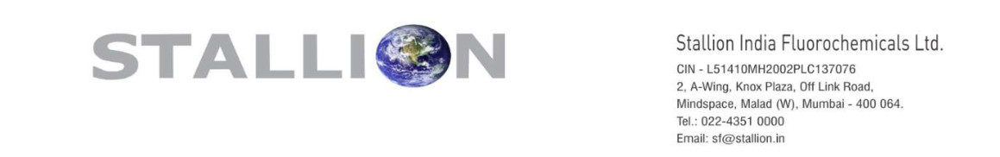
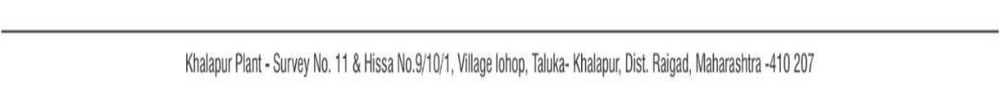

**[Image: Aug2025.pdf-0001-00.png (1159x182, 67.0KB)]**

Date: 14th August, 2025 

To, National Stock Exchange of India Limited (“NSE”), The Listing Department Exchange Plaza, 5th Floor, Plot No. C/1, G Block, Bandra-Kurla Complex Bandra (East), Mumbai – 400 051. 

To, BSE Limited (“BSE”), Corporate Relationship Department, 2nd Floor, New Trading Ring, P.J. Towers, Dalal Street, Mumbai – 400 001. 

NSE Symbol: **STALLION** ISIN: **INE0RYC01010** 

BSE Scrip Code: **544342** ISIN: **INE0RYC01010** 

Sub **<u>: Intimation under Regulation 30 of the SEBI (Listing Obligations and Disclosure</u> –** **<u>Requirements) Regulations, 2015 Transcript of the Investor Conference.</u>** 

Dear Sir/Ma’am, 

Pursuant to Regulation 30 of the SEBI (Listing Obligations and Disclosure Requirements) Regulations, 2015, please find enclosed the transcript of the Investor Conference held on Tuesday, 12th August, 2025, at 04.00 P.M. IST with regard to the business and financial performance of the Company for the quarter ended 30th June, 2025. 

The transcript has also been uploaded on the Company’s website and can be accessed through the following link: 

- - <u>https://stallionfluorochemicals.com/investors information/earning call/</u> 

You are requested to kindly note the same and acknowledge receipt. 

Yours Faithfully, 

**For Stallion India Fluorochemicals Limited (Formerly known as Stallion India Fluorochemicals Private Limited)** 

GOVIN Digitally signed by GOVIND RAO D RAO Date: 2025.08.14 19:50:24 +05'30' **Govind Rao Company Secretary & Compliance Officer** 

**[Image: Aug2025.pdf-0001-15.png (1155x107, 32.0KB)]**

**[Image: Aug2025.pdf-0002-00.png (573x136, 59.9KB)]**

# **Stallion India Fluorochemicals Limited** 

# **Q1 FY26, Earnings Conference Call** 

Event Date / Time: 12/08/2025, 16:00 Hrs. Event Dura�on: 01 Hr 23 mins 19 secs 

# **CORPORATE PARTICIPANTS:** 

## **Mr. Shazad Sheriar Rustomji** 

Managing Director and CEO 

## **Mr. Parth Raorane** 

### **Moderator** 

Ladies and gentlemen, good day, and welcome to Stallion India Fluorochemicals Limited Q1 FY26 Earnings Conference Call hosted by Ventura Securities Limited. As a reminder, all participant lines will be in the listen-only mode, and there'll be an opportunity for you to ask questions after the presentation concludes. Should you need any assistance during the conference call, please signal an operator by pressing * and then 0 on your touch-tone phone. Please note, this conference is being recorded. 

Before we begin, I would like to point out this conference call may contain forward-looking statements about the company, which are based on the beliefs, opinions, and expectations of the company as on date of this call. These statements do not guarantee the future performance of the company, and it may involve risks and uncertainties that are difficult to predict. 

I would now like to hand over the floor to Mr. Parth from ConfideLeap Partners. Thank you, and over to you, sir. 

### **Parth Raorane** 

Good evening, everyone. Thank you for participating in the Stallion India Fluorochemicals Limited Earnings Call. On behalf of Ventura Securities and ConfideLeap Partners, we welcome you all for Q1 FY2526 Earnings Con Call of Stallion India Fluorochemicals Limited. The company today is represented by Mr. Shazad Sheriar Rustomji, the Managing Director and CEO of the company, and Mrs. Geetu Yadav, the Director of Stallion India Fluorochemicals. 

Stallion India Fluorochemicals Limited Q1 FY26, Earnings Conference Call 

12.08.2025 

I would now like to hand over the call to Mr. Shazad Sheriar Rustomji for his opening remarks. Thank you, and over to you, sir. 

### **Shazad Sheriar Rustomji** 

Good evening, everyone, and a warm welcome to Stallion India Fluorochemicals Limited Q1 FY2526 Earnings Conference Call. We are pleased to start the new financial year on a strong footing, delivering results in line with our growth guidance for Q1. We recorded total revenues of INR 110.55 crore, representing a robust 50.30% YoY increase, driven by sustained demand across key end-user industries and timely execution of orders. EBITDA stood at INR 14.37 crore, up 12.73% YoY, while PAT came in at INR 10.36 crore, a 21.47% improvement over the same period last year. This performance is particularly encouraging given Q1 is traditionally a seasonally softer quarter for our business. 

This and the next quarter are usually the lowest quarters and the last two quarters are the highest quarters. From a strategic perspective, Q1 was marked by meaningful progress in our capacity expansion roadmap. The key milestone was signing of Memorandum of Understanding with the Government of Rajasthan set up a state-of-the-art R-32 refrigerant gas manufacturing plant in Bhilwara. This INR 120 crore investment will also produce -- this is not INR 120 crore, INR 120 crore is mentioned because the government requires the CapEx only on the plant and machinery, not on land, building, construction, working capital, etc., so the actual project is over INR 200 crores -- will also produce advanced blends such as 410A, 404A, 454B, 513A. 

So, the entire range of other refrigerants, about eight other refrigerants will also be manufactured here, which will strengthen our domestic manufacturing footprint, reducing import dependency and positioning us to serve both Indian and export markets from 2026 onwards. Operationally, we will continue to advance work on our upcoming Mambattu facility in Andhra Pradesh, which will be a cornerstone for HFO and specialty gas production and on the expanding semiconductor and liquid helium capabilities at Khalapur. These investments align with our strategy to tap into high-growth markets such as semiconductor, solar, fiber optics and advanced cooling applications, sectors that are now projected to grow at strong double digit CAGRs over the next decade. 

Our focus remains on safety, sustainability and delivering customized gas solutions to our customers across all the industry range, including automotive, pharma, fire, safety, defense and power. With our robust forward integration and backward integration capabilities expanding, geographic footprints and product diversification into higher margin specialty gases, we are confident of maintaining our target at 30-35% growth over the next three years, while enhancing profitability by over 3-4%. We look ahead, we remain committed to becoming a fully integrated fluorochemical player driving innovation, operational scalability, and sustainable value creation for all stakeholders. 

Thank you. 

### **Moderator** 

Thank you, sir. Ladies and gentlemen, we will now begin the question-and-answer session. If you have a question, please press * and 1 on your telephone keypad, and wait for your turn to ask the question. If you would like to withdraw your request, you may do so by pressing * and 1 again. Dear participants, if you have any questions, please press * and 1 on your telephone keypad. 

The first question comes from Vaibhav Mishra from Finvestors. Please go ahead. 

Stallion India Fluorochemicals Limited Q1 FY26, Earnings Conference Call 

12.08.2025 

### **Vaibhav Mishra** 

Hello, sir. Congratulations for the good performance. I have couple of questions, sir. First question is regarding the revenue split between the refrigerant and non-refrigerant segment. And, sir, do all the current four units handle both refrigerant and non-refrigerant gases? Or they just have bifurcation that these units handle this and other units handle this? 

### **Shazad Sheriar Rustomji** 

Thank you, firstly. Basically, you have to understand that same products are having application in both refrigerant and non-refrigerant. It is not that they are separate except for one or two products which are clearly identified, like, SF-6, which is used as an insulating gas in the power industry. So, couple of products like that are segregated. Otherwise, most of the products are like multiuse products. They are also used as a refrigerant. They are also used as a fire-fighting product. They are also used as aerosol propellant. They are also used as blowing agents. 

So, it is not exactly separated out into each product that this is for this segment, this product is for this segment. Almost 60% of the products are multiuse. And pan-India, all the locations handle all the products. 

### **Vaibhav Mishra** 

Alright, sir. Thank you. Sir, next question is regarding the new plan that you have just announced in Rajasthan regarding R-32 and some other molecules. So, sir, I think in previous call, you said that India has more than double capacity for our domestic need, and a lot of it is exported. Correct? 

So, my question is what will be the capacity of this plant? And will we be using it entirely for ourselves or we will be generating revenue by selling it domestically or exporting? And if we are planning to export, what will be the geographies where we will majorly be exporting it? 

### **Shazad Sheriar Rustomji** 

This class, see, India already has sufficient capacity for R-32. And India also has excess capacity, which is exported out of India. Now, basically, we are looking at setting up a 10,000-ton plant for R-32. It would be in two stages. Stage 1 would be 5,000 thousand tons. Stage 2 would be adding another 5,000 tons. 

Reason for going with reduced capacity is all of your industry, like all the current two manufacturers in India and others who are also looking at starting up and other companies abroad also, we have found everyone has gone with the first plant that is usually of 5,000 metric tons then they scale up. So, we don't want to be different from others. Maybe it's a learning graph. Maybe it's in a learning process, etc. So, we would also go in with the same methodology starting with a 5,000-ton plant and then scaling up. 

Now, our reason for putting a 5,000-ton metric plant in addition to it going in for R-32, the basic reason is, number one, we ourselves have a captive requirement of 2,000 tons, 3,000 tons, which we currently sell. So, our own requirement is there. Why do we have to import it? Or why do we have to depend on somebody else? 

And when we started, everyone wanted to know, do we manufacture the molecule? We formulate, we blend, we debulk, we pack, we provide it, but we don't manufacture. So, now we would like to go 

Stallion India Fluorochemicals Limited Q1 FY26, Earnings Conference Call 

12.08.2025 

into backward integration. As a company, none of the other manufacturers are forward integrated. Ours is the only company which is completely forward integrated, pan-India. 

Now if we go into backward integration, it makes the company almost on a different level. We're fully backward integrated, forward integrated. So, that is one of the key strengths that would come out second more important. All the next-generation HFO blends contain 50-60% R-32. That means if you don't have our own R-32 manufacturing, as we go forward and we build thousands of tons of HFO capacity, even if we manufacture HFO, you will still depend on 50% of your requirement from either local source or import. 

So, to ensure and securitize the future, we are looking at not today, we're not looking four years from now. We are looking 10 years and 20 years ahead. And if we have our own plant, we become more secure, we become more stable as a manufacturer. We complete the end-to-end all the products are under our control. So, this was the reason for going in for the R-32 plant. 

### **Vaibhav Mishra** 

Alright, sir. So the remaining, we need 2,000 or 3,000 capacity only. So we'll be exporting it majorly, the remaining amount? 

### **Shazad Sheriar Rustomji** 

It's like this HFO blends are expected to grow usually, number one. Number two, your R-32 in air conditioners is going to be replaced by R-454B. The reason it will replace it is R-32 has 600 GWT, global warming potential, and R-454B has 300 GWT, half the global warming potential. So, as we go forward, R-32 that is used in air conditioners currently will end stop getting used. The HFO blend will come in its place. 

So that 10,000, 15,000 tons of R-32 currently in use will start getting replaced in time by manufacturers, by legislation to the new HFO blend. Similarly, you will have changes like R-134A. R- 134A will start getting replaced. You have over 10,000 tons of usage. So, a big portion of this use will convert to 513A, which is a HFO blend, again, having 50% 32. 

So now, when you move into this new category of products, your requirement will go up substantially. It's not just what you are required. Maybe we sell 32 on its own 3,000, 2,000 tons. But technically, when you see it in the blend and everything, it will go up phenomenally. 

Secondly, we may not look at exporting 32 per se. We may export 32 and HFO blends, which would be more profitable and more viable rather than just the 32. 

### **Vaibhav Mishra** 

Alright, sir. Alright. Thank you so much. Sir, last [inaudible 00:13:10] there has been some decrease in value items. So going ahead, sir, what margin profile can we expect, like stable and improving slightly with quarters, or there might be sharp fluctuations in-between quarters? 

### **Shazad Sheriar Rustomji** 

No. I'll explain. See, basically, this is a pertinent question, this question may be with everyone. ये आपका PAT और जो EBITDA था in Q1 FY2324, it is not the same as in FY2526 and FY2425. There's a difference. 

Stallion India Fluorochemicals Limited Q1 FY26, Earnings Conference Call 

12.08.2025 

Yes, basically, this quarter, April to June, is the second weakest quarter. July to September is the weakest quarter in the business cycle. 

Then, October to December is the better quarter and the last quarter is the strongest quarter. So, the last two quarters are the strongest quarter. The first two quarters are the weak quarter. Now particularly this year, we had very good, we were very optimistic of actually having a phenomenal growth in the turnover and the PAT and everything. But April, as soon as the quarter started, you had the war with Pakistan. 

The minute it happened, everything, all industry, all projects, everything just went off to sleep. Everyone, like COVID time, started making plans of how they will deal with it, etc. Companies came on a like, even for the SF6 and all, all the projects are in the forward areas, border areas, etc. So, everything came to a standstill, number one. 

Number two, as soon as that issue died down and things look like it's coming back to normalcy, early monsoon set-in in May, which completely washed out the entire season. Now, basically, we had to keep in mind whether we want to target turnover growth or we want to sacrifice it for that higher PAT, in an absolutely dull market where the season is over, everything is closed, we ensure that we maintain the turnover growth at a slightly lower PAT. That is the reason for the PAT being slightly lower. 

### **Vaibhav Mishra** 

Alright, sir. Alright. Thank you so much, sir, for clarifying it very patiently and clearly, and all the best, sir, for the future. 

### **Shazad Sheriar Rustomji** 

Thank you. 

### **Moderator** 

Thank you, sir. The next question comes from Aditya Arora from P4 Capital. Please go ahead. 

### **Aditya Arora** 

Sir, thank you so much for your time for this call and for taking our question. We have two very basic questions. If you could help us understand the value chain of the company or what are the raw materials that you are procuring from where? 

And how does the price fluctuate? Plus, after the planned backward integration, what kind of raw materials would you start manufacturing in-house? 

### **Shazad Sheriar Rustomji** 

Thank you. Basically, as a company, currently, we do not manufacture the molecules. What we do is we import in bulk 20-ton ISO tanks. They come to all our plants where they are unloaded into our holding tanks. They are tested for our incoming quality. They are tested when the processing is done, cylinder cleaning, processing. Filling is done. It's again tested. How the product goes into formulations and blending. So, you're making the rest of the products with blends of two or more gases. 

Stallion India Fluorochemicals Limited Q1 FY26, Earnings Conference Call 

12.08.2025 

So, when that is done, that's tested. And 30-40% of it goes to OEMs, 60-70% goes to aftermarket through the pan-India plants that we have. Now, currently, when we get into manufacturing, this would be a proper manufacturing of the molecule per se, not a formulation or blending. That means you have a reactor. You have chimneys. You have a waste stream. You have raw materials that are different form. 

So, now the basic raw materials that would be would be HF, MDC that would come in, and your production stream would have, number one, 32 would be there. Hydrochloric acid would be one of the by-products, which is also a saleable product. It's not waste stream. And dilute hydrochloric acid, which again, becomes a saleable product. It will be concentrated or treated, and that itself is also a saleable product. 

So, basically, in the current manufacturer, we would look at making sure that we have no waste stream, and all products are commercialized. So, there is a value addition that comes to the company from that also. 

Now, basically, this manufacturing plant will also be manufacturing most of the blends and which mostly, we'll be having 32 also as part of it. And, basically, our 32 and this would be our first plant where we go in for the manufacture, which will also give us and our investors the confidence that not only can we set it up, we can run it successfully and it allows us to plan ahead for the remaining plants that we already have plans in place for. 

Now, basically, currently, our PATs usually averaging about 10%. Now, 10% is very good for the company in our field the way we are. If you look around, you won't find such a robust PAT that's because of our pan-India footprint, because of the 30 years' experience and knowledge that we carry, and also the way of the company is working. 

Now when we get into manufacturing, the PAT out in the manufacturing segment would be over 24%. So, that 24% plus also for the helium and specialty gases, semiconductor gases, etc. that we are setting up that also will enhance the PAT significantly. So, we can see both these come on stream in 2026. We can see the PAT significantly enhanced from where we are. 

Meaning, at an average, it might, reach about, like, 17% or 18% considering that our current turnover also is growing. So, averaging between them, we should look at higher PATs, which would be beneficial for the company. 

### **Aditya Arora** 

Right, sir. This is super-helpful. Just a couple of follow-on questions on that. When you set up this backward integration facility and you start manufacturing most of the products in-house, does it require approval from your end customers given that you will move towards OEM side or they generally don't give approvals on the plant? 

### **Shazad Sheriar Rustomji** 

See, it's like this. In the market, in a developed product, meaning new products, OEM requirement is almost 80% or 90% and aftermarket is 10%. But in developed products, the aftermarket is 80-85% and OEMs is 15%. So, basically, you have 85% of the Indian market available to you, number one, without a single OEM approval. Secondly, we are already approved in every single OEM and OEMs do have a qualification process. 

Stallion India Fluorochemicals Limited Q1 FY26, Earnings Conference Call 

12.08.2025 

Now, usually, that process is very long and tedious when it is unknown new party with no track record, no service record, no reliability record. Stallion is a company that's 30 years. Stallion is the only company in India, and I say, this is recorded call, and I say it on record, Stallion in 30 years is the only company in India which has never failed or had a break in supply. 

In 2005, in 2010, in 2017, as late as 2021, Stallion is the only company that supported 100% of India requirement for few months when there was a shortage and none of the other manufacturers or multinationals had material or food supply. That is our track record. And this is on record I am speaking. So, there is nobody else with our track record in supply and reliability. As a result, when a company like us has to be qualified, almost 85% of the parameters are moved aside. Now, it's just a product evaluation. 

Product evaluation simply becomes just a lab testing. Once the lab testing is done, product evaluation, meaning they take it on trial, etc., it's a very quick process. Usually, suppose if we were completely new to the industry where we have no past record, the company has to first think that will this person last out? Second, will they be reliable? Can we trust them against our existing supplier for so many years? 

All those parameters don't come in for us. It's only the product qualification. Product qualification is very fast and can be done very quickly, one month, two months. 

### **Aditya Arora** 

Okay, sir. No, this is extremely helpful. And sir, this last question is on pricing. How is the pricing determined? Is it on an audit water basis or it's an annual fixed price contract? 

### **Shazad Sheriar Rustomji** 

Prices are market driven. You have different models of working. Now, aftermarket has a spot pricing. That means, the price we open, someday after 15 days, we find that the market has gone up. We increase it. We find the price, we want to reduce it, we'll reduce it. So aftermarket, which is the bulk of the market, is a spot price market. OEMs have three models of pricing. 

One is annual price, one is a quarterly price, and one is a monthly price. There are times when it is advantageous to be in annual contract. There are times when it's advantageous to be in a quarterly or monthly contract. Currently, the global scenario is you are the luckiest if you are in a monthly contract or at best quarterly. Annual contract, you will come out losing money. 

The dollar fluctuation is very unpredictable. Although your all contracts will say, okay, the dollar is at this price, but nobody really increases the price and gives you. So, it is advisable not to be stuck in long contracts, especially in a volatile global scenario. 

### **Aditya Arora** 

Okay. Thank you so much, sir. I'll come back in queue if there's anything. 

### **Shazad Sheriar Rustomji** 

Stallion India Fluorochemicals Limited Q1 FY26, Earnings Conference Call 

12.08.2025 

Thank you. 

### **Moderator** 

Thank you, sir. Participants are kindly requested to restrict with three questions in the initial round and join back the queue for more questions. 

The next question comes from Jay Mehta from Elios. Please go ahead. 

### **Jay Mehta** 

Hello, sir. Am I audible? 

### **Shazad Sheriar Rustomji** 

Yes. 

### **Jay Mehta** 

Congratulations, sir, firstly, on the good set of numbers you posted yesterday. So I wanted to ask, firstly, like, what's the progress on the blending facility which you were about to set from the IPO proceeds, like, for the Khalapur and Mambattu in Andhra Pradesh. Because in the quarterly disclosure, you have only spent, like, INR 1 crore for Mambattu until the time of June end. 

### **Shazad Sheriar Rustomji** 

Okay. Firstly, thank you. And, basically, as a company, we are very prudent on how we spend money. We do not believe in giving advances too quickly. We do not believe in giving money before work is done. So, when you're seeing the restricted flow of payment is partly due to that reason, just because funds have come doesn't mean we distribute it to everyone and say, okay, they can start the work. It is all the contracts have been given. I'll break it up into two. 

One is, first, I'll go with the Khalapur. Khalapur facility, the entire civil work of restoring the land, making all the supporting walls, etc., everything is completed. The print level of this working factory shed is completed. The metal structure has been completed. Right now, we are going in for the completion of the shed firstly. The compressors have been ordered. The DVARs have been ordered. Cylinders have been ordered. And all the plant and equipment, machinery, whatever is required, all that has been ordered. 

So, Khalapur was delayed. The timeline, we are going to meet completely, but the construction was delayed for two accounts. The same for Mambattu. First is the onset of early monsoon in May. Once it rains and the soil gets wet, you cannot work. 

So, where there is soil work required, where you're required to condition the ground, where you're required to do mud filling, once all the soil is wet, anyone in construction or if you have knowledge, you'll understand that it is impossible to work at that time. So firstly, because of early monsoons, it got delayed. Second, when we started this IPO, we started this process in 2023. We got delayed by one year, so 2024 went. 

Now, during this period, so when we started this process for semiconductor gases, helium, and all the high purity gases, industry standard was 200 bar cylinders. It is little technical, but it'll help you 

Stallion India Fluorochemicals Limited Q1 FY26, Earnings Conference Call 

12.08.2025 

understand a critical thing. Now, 200 bar is the pressure at which you fill the gas in. So, suppose in a 50-liter cylinder, if I fill 200 bar, I can fill 7 cubic meters of gas. 

Now, basically, during this period of when the IPO is happening, Linde, definitely, I should be named, one of the MNC companies of the peer group, they moved the standard to 300 bars. They're the only people in India with 300-bar fill. That means for the same 50-kg cylinder where you are filling 7 cubic meter, they can fill 11 cubic meter or 10 cubic meter. So what happens is, now you'll say, why is this different? Then you have to move the same quantity of gas long distances in transport. You are paying for, say I'm just giving example, 7 x 100, 700 cubic meters, you are paying x amount for transporting. In that same cost, they're transporting 1100. 

So, now versus you in any tender, in any supplier, in any bid, they will become more competitive. And forget the competitiveness, especially for ONGC, offshore, Navy, etc., where you have to load it onto ships, etc., it becomes very critical to have more material in less amount of space. So, preference will go there. 

So, this was a very critical factor and upgrade in the entire industrial cycle of how the plants and all are done. Now, everyone else cannot run and do this because it's a major reengineering and redesign of the existing plant at huge cost. Now, the good advantage was because of our delay in IPO, our construction starts when we realized that this new change has come about. 

So, we went for complete design and reengineering the entire plant to now become a 300-bar plant. Even the CapEx that we require in cylinders and all, 50% will go towards 300-bar equipment rather than 200-bar. So now, when we start off, we'll be next to the best and biggest with the latest technology or the latest innovation in the industry, and everyone else will be not having that currently. 

So, this engineering change, design change, etc., it took 2 months, number one. Second, also the onset of monsoon. So, though there's a slight delay, but in the final time line, we will be within the timeline that we have said we will complete. 

Number two, basically, major landfill was required because that was 5 feet below ground level. And next to it, adjoining is a lake. So, that entire area in monsoon gets flooded. Now, the landfill was supposed to have started in April and May. So April, whatever you need to do, groundwork, you start the work. Again, monsoons unseasonal rains, water filled up out there, you could not do anything. The work started only in July. Landfill is completed. Boundary wall is started. All the construction work is now proceeding. By September, we should have construction at site. The plant and machinery is all ordered. Everything will reach there in September. October, we should have most of the layout completion, etc. And we should be within timeline or maximum one month delayed, but we expect to reach timeline for Mambattu also. Khalapur would be on timeline. 

Second, now Mambattu, I would like to explain. Mambattu CapEx was paid for five times of HFO blending. We have doubled the capacity. We have gone in for a 10-tank capacity. We have also enhanced the complete working to handle hydrocarbons, which will be in future and all the working will require it in a big way. 

Number two, we have also gone for the same semiconductor facility what we have at Khalapur, what we are setting up. We have also put that setup in the Mambattu layout. So there, we had a complete. It took us 3 months to completely redesign, retain the entire setup. Earlier, it was two sheds. Now, it is five sheds. So, the complete layout, firstly, the scale and scope has been doubled. And the enhanced level of working, etc., that is what took a certain amount of time and also the planning for the cash flow and for accommodating and licensing as we can use. 

Stallion India Fluorochemicals Limited Q1 FY26, Earnings Conference Call 

12.08.2025 

So, this is the flow of both the material. At both places, there will be no real impact in timeline. Khalapur should be well within the timeline. Mambattu, also, we expect we will fulfil within timeline. At worst, it may be one month delayed and that one month also is not on equipment, construction, etc. It will be more on licensing. 

### **Jay Mehta** 

Understood, sir. My second question was in the last quarter, there was some cyclical upturn you mentioned, like, due to that your gross margin sort of. So what is the current state? And going forward, what will be it? 

### **Shazad Sheriar Rustomji** 

See, basically, what happens is all products have a cyclical nature of movement, meaning a strong period, a weak period. Like, now we break down the semiconductor side. We break down, like, say, helium. So helium has got, like, a period where two years will be down, down, down, and, again, three years will be up. The residents also have the same cycle, two years, three years, or two years, one year up, two years again down, and three years up. 

So, everything has a graph moving up and down. The reason of expanding and having a reach across industry segments is one or the other segment will coincide with each other. Now, last quarter that we did the turnover, etc., the whole year looked like it would go great. Meaning, the April is very strong. The growth was very strong. Everything was very strong. 

Come April, that completely were here, and thereafter the rains completely that strength in the market, suddenly you found had weakened. And that's what did not allow that same robust growth to continue. Otherwise, April, May, June we were expecting that we would have a very spectacular result in line with the Q4 of last year, and it would be spectacular versus Q1 results. But still, I think we have managed the excellent show because if you see similar industries or similar industrial businesses, like, say, the appliance manufacturers, etc., you'll see a very weak showing in this quarter. 

And remember, ours is without export earnings. Meaning, if you're comparing us with peer groups, they have export earnings, which is currently giving phenomenon. Now, of course, after Trump and the duties at their port, it might not be that great onwards. But, basically, we are operating without that margin also. So, the showing was pretty good for the quarter. Meaning, if I'm looking at it objectively, I am very satisfied with how we have performed. 

### **Jay Mehta** 

Understood, sir. And, sir, my third question was, like, the INR 200 crore CapEx you are going to occur for the manufacturing for R-32. So, by when it will be operations? And out of the INR 500 crore debt you also mentioned in the last Board resolution, will it be utilized entirely for this or what is it? 

### **Shazad Sheriar Rustomji** 

Firstly, we have to give disclosures as for whatever or material things on whatever is passed in the Board. Now in the Board, we have taken approval. And with the shareholders meeting, we will take approval for up to INR 500 crore. We do not intend to dilute or we do not intend to reach INR 500 crore. 

Stallion India Fluorochemicals Limited Q1 FY26, Earnings Conference Call 

12.08.2025 

### **Jay Mehta** 

Okay, sir. 

### **Shazad Sheriar Rustomji** 

Basically, the probation is granted for 1 year. So, basically, in case if something else comes about, we don't want to redo the whole process. So, you always ask for a higher amount. So, the approvals are taken for a higher amount. This is not an amount that we would be going for, number one. 

Number two, whatever we go in for, whether we go in for debt or whether we go in for a rights or basically preferential issue or anything that will be decided as we move ahead. Currently, from inhouse, we have been making whatever the CapEx spends are, and we're proceeding with that currently. But, definitely, we would require to access for funds, either debt or equity. 

### **Jay Mehta** 

And, sir, the date of operation for the plant? 

### **Shazad Sheriar Rustomji** 

Currently, we should give the good news in, I think, a day or two. Maybe I can give it here also. Anyhow, we're going to be putting it on in a day or so, we'll be putting it on. Land is acquired, and we would move for permission immediately. And we expect to complete construction and start production by mid-2026. 

### **Jay Mehta** 

Okay, sir. Okay, I'll join back in the queue. 

### **Moderator** 

Thank you, sir. The next question comes from Naga Brahma from NB Investments. Please go ahead. 

### **Naga Brahma** 

Can you hear me? 

### **Shazad Sheriar Rustomji** 

Yes, sir. 

### **Naga Brahma** 

Okay. Good evening, sir. Congratulations for a good performance. Sir, I had lot of questions, but since I'm allowed only three, so I'll start with my initial question. If you had seen your sales figures, it was INR 118 crore in FY21, which jumped to INR 186 crore in FY22. Thereafter, it was stabilized in around INR 220 crore or so. Then again, FY25 that is last year, it has again jumped to INR 377 crore. 

Stallion India Fluorochemicals Limited Q1 FY26, Earnings Conference Call 

12.08.2025 

Now I know, 2024 to 2025, the jump was due to acquisition of our own company. So, that's why the revenues had increased more than the normal growth. But if you could tell us why this increase was there during 2021 to 2022? 

### **Shazad Sheriar Rustomji** 

2021 to 2022. 

### **Naga Brahma** 

From INR 120 crore. Is it that because of the HF, this one was made mandatory something, any reason, HFC? 

### **Shazad Sheriar Rustomji** 

No. No. I'll tell you what. Okay. Now I remember. Antidumping duty got established in India on R-32. So prior to establishing of antidumping duty, which is almost R-32 was sold at INR 200, INR 250 at that time. I'm just giving you the baseline. Don't take the exact figure. So, about INR 250. Antidumping duty of about INR 125 to INR 150 got introduced on it. 

So, what was sold at INR 250 would suddenly become INR 450 or INR 400. So, what happened was a massive import as much as anyone you could import, you imported. And, also, post the antidumping, like, we carry huge inventory. That huge inventory was very good at that time because what it allowed us to do is immediately with the antidumping coming in, turnover immediately jumped up. The price went up, basically. The price doubled. 

### **Naga Brahma** 

Okay. Got it. Fine. Sir, my second question is, like this electronic, solar, and fiber optic ecosystems are expected to grow double digit CAGR. So, we are coming up with this both helium as well as the HFOs. So, these sectors use both of this? If it is yes, so where are they associated currently, and how is the competition in this segment? 

### **Shazad Sheriar Rustomji** 

I'll tell you. HFOs are not used basically in fiber optics, etc. Now, see, most of the products have multiuse. You cannot say that it's not used in in the sense it is used in a cleaning, the same product that's used as a glowing agent is also used as a cleaning solvent. So, it's got multi-utilization in various industrial segments. 

Now, SF6, which is used as insulating gas and gas-insulated substations, large voltage transformers, and circuit breakers, is also used in your eye for operation. It's got a medical application also. So, when you go for an eye surgery, SF6 gas is used. 

SF6 gas is also used for plasma etching for making silicon wafers. So, each product has multiapplication. It's not just one application that we can segmentize that this product is only. Yes, the difference is the same product with higher grade of purity. So, what goes into your eye is not what goes into the electrical substation. And what goes into plasma, I think, is not the same as that. Meaning, the priority grades are higher. So, one is that. 

Stallion India Fluorochemicals Limited Q1 FY26, Earnings Conference Call 

12.08.2025 

Second is your HFOs. They may not directly be used in semiconductors. Now, your data centers, the government has been very wise in its approach in ensuring that Indian data stays on Indian shore and is not offshore in the US or somewhere else. So, to safeguard the data that is here. So, now suddenly all these companies like Amazon, etc., have huge data centers that are coming up in India. Now for this data center cooling, you need to have that specialized cooling. That's where the HFOs come in place. 

So, like same way in semiconductor also, the equipment cooling, the HFOs come into place. They don't play direct role in the semiconductor. And in semiconductors and all the other fields, like fiber optics, etc., all the various gases that would be required, it's a growing field. Basically, India never had semiconductors earlier. 

So, it's virgin, and it could grow from here. So as it grows, there would be scope to grow. Now who are the players? In India, in the HFCs, you have three established companies already. You all know the names. 

### **Naga Brahma** 

Yeah. No, sir. I was asking for HFOs and Helium. 

### **Shazad Sheriar Rustomji** 

HFO is under heavy patent. So currently, besides Chemours and Honeywell, Honeywell has been associated with us since 20 years. So, we are basically Honeywell. You can take meaning, the partner here. 

So besides these two companies, nobody has a patent to sell. It's a heavily patented product. So, currently, we have first mover advantage. None of the local big players who manufacture HFCs, they cannot manufacture or sell HFOs in India. 

### **Naga Brahma** 

So, only we are authorized to do that? 

### **Shazad Sheriar Rustomji** 

Only we are authorized to do it. So the first move advantage comes about. 

### **Naga Brahma** 

Okay. Sir, my next question is, like, in the south Mambattu, we are coming up with the HFO as well as now you announced yesterday that they are coming there with helium also. So my question is, already in south particularly and in rest of the India also, have they already started using these HFOs? 

### **Shazad Sheriar Rustomji** 

Yes. We sell quite a good quantity. In fact, if I'm not mistaken, our 300, 400 hundred tons, we already sold. 

### **Naga Brahma** 

Stallion India Fluorochemicals Limited Q1 FY26, Earnings Conference Call 

12.08.2025 

Okay. So that means all over India, only our company is selling this? 

### **Shazad Sheriar Rustomji** 

No. Our company and Chemours. Chemours is earlier DuPont. 

### **Naga Brahma** 

Correct. Okay. So both of us are only selling this. Hello? 

### **Shazad Sheriar Rustomji** 

Yes. Both of us only. 

### **Naga Brahma** 

Yeah, both of us. Okay. Thank you very much, and I will come back in the queue. Thank you. 

### **Shazad Sheriar Rustomji** 

Thank you. 

### **Moderator** 

Thank you, sir. The next question comes from Darshil Jhaveri from Crown Capital. Please go ahead. 

### **Darshil Jhaveri** 

Hello. Good evening, sir. Thank you so much for taking my questions. Firstly, congratulations on a great set of results, sir. Hopefully, I'm audible? 

### **Shazad Sheriar Rustomji** 

Yes, clear. 

### **Darshil Jhaveri** 

Yeah. Hi, sir. So, I had a few clarification questions, sir. So, when we are talking about PAT margin post manufacturing, so were we staying around 17-18% PAT that we can get post manufacturing, sir? 

### **Shazad Sheriar Rustomji** 

See, our current margins in the current operations that we have hover around 10%, 9-11%, averaging 10%. Now, when you go in for manufacturing, your margins, your PAT will move to 24%. When we go for the helium and semiconductor specialty gases, the margins will be between 18-20% in that business. 

So now basically, taking the PAT of both those businesses, the manufacturing businesses and our current business, when you average it out, there would be like, this business system that is 24%, so you'll have it somewhere between around 17-18%. And as we grow the manufacturing business, your 

Stallion India Fluorochemicals Limited Q1 FY26, Earnings Conference Call 

12.08.2025 

PAT will start increasing because what we have in mind is after this first plant, now I'll just put it to you how our plan of growth is. 

Meaning, it may seem a little aggressive to you all, but it's 30 years of planning, 30 years of waiting, 30 years of wanting to move ahead. Reason for entering into the capital markets was we didn't want to liquidate or we didn't have any bad debt sort of thing. We wanted to grow at a phenomenal space. We had acquired all the knowledge, all the experience, all the working areas that we needed to have experience, whatever we needed to do at every stage, and a pan-India of the presence. So, now to move up that chain, you would require capital to grow at that phenomenal pace. 

So, basically, while we went in for the IPO, when we took the CapEx and we started the work for the Mambattu and the Khalapur facility, we had already when the IPO took place, the first meeting we had, we had already drawn up the plans for this manufacturing facility in Rajasthan. So, basically, the idea is as each project is taking off, we would already have initiated what is the one after this. Such that 50% of the work is done midway through the earlier project getting completed, we will start the next project planning and the footprints for that. Such that as one project gets completed and that cash flow starts, the second project work should start off. It shouldn't be, like, two years after that. 

Meaning, we don't have all that time. So, when we are already doing this CapEx for this plant, we already have a growth strategy worked out where we would already be planning. Once we finish all the permissions, we submit the funding, start the construction phase, we will get onto the plan for the next manufacturing plan that we have. So, it will be in a series. As one stops, the second one starts. The second one stops, the third one starts. So, before year 2029, we've got a very clear growth target. Yeah. Tell me, sorry. 

### **Darshil Jhaveri** 

Yeah. So sorry, sir, to cut you off, sir. You were continuing, sir. Yeah. 

### **Shazad Sheriar Rustomji** 

Basically, we have got a very clear growth strategy of what we want to see a turnover, where we want to see ourselves, and how we are going to complete it in this much time. So, basically, that's how we're taking it. 

### **Darshil Jhaveri** 

Okay. That's really great to know, sir. So sir, just wanted to know, like, post now because our Khalapur and Mambattu will come by nearly October. So, in FY26, they'll be in full operation. 

So, what kind of revenue can we expect incrementally from these two capacities? And how much will also Rajasthan contribute? Because that also we are planning to start production by mid-2026. So what kind of incremental revenue will come from these three capacities for us, sir? 

### **Shazad Sheriar Rustomji** 

See, October, we won't be starting Mambattu or Khalapur. It is expected November end is what the timeline has been provided. So, basically, we get one quarter for both of them. In this year, we may not see very much in support coming out for it since it's the start of the thing. But, definitely, in 2026, we would see it adding significantly, like it would be on an incremental percentage. 

Stallion India Fluorochemicals Limited Q1 FY26, Earnings Conference Call 

12.08.2025 

It won't be, like, that this is the [inaudible 00:51:34] it might add, like, INR 100 crore in 2026. It may add another INR 100 crore in 2027. Like that. So, one is that. 

And second is the manufacturing plant. It depends. We hope to start complete. It's very ambitious. Any other company would be talking 2027, not 2026. We are talking 2026 because we would want to bring it as fast as possible online for variety of reasons and specifically also for the turnover. If you take the 5,000-ton plant and take it at the lowest selling price or you take it as current selling price of INR 540, you're talking of INR 270 crore turnover divided by 2. So, like, INR 135 crore turnover with the 24-25% PAT, number one. And then you when you add the second facility, it will give you INR 270 crore plus INR 270 crore. 

Currently, we are starting with 5,000. So, we would we would be adding, INR 135 crore in the first year and INR 270 in the second year. And as we go for the expansion, that would add another INR 270 crore. 

### **Darshil Jhaveri** 

That's very ambitious. So, just because, I think in the presentation, we are mentioning about 30-35% growth. But with these CapExes, we would be maybe growing in multiples rather than 30-35%, right? 

### **Shazad Sheriar Rustomji** 

We are talking of growing in multiples till 2029 to achieve what our targeted turnover is. 

### **Darshil Jhaveri** 

So, what's the internal target? Like, I think at this rate by FY29, you will be easily maybe on my rough calculation, INR 1,000 crore. Sorry, how much, sir? 

### **Shazad Sheriar Rustomji** 

Meaning, see, we are looking with the manufacturing plants and the final plant, etc. Our target is to cross INR 2,500 crore. 

### **Darshil Jhaveri** 

Okay. That's really great to know, sir, and that's really helpful. 

### **Shazad Sheriar Rustomji** 

That's not the only manufacturing plant we have in mind. We have a series of plants, one after another, that will be put up. That's what I said, 30 years in waiting, 30 years of having projects on hand, 30 years of the experience and knowledge. So, now fruitify and bring that into actual happening, it would require the capital markets. That is why we entered the capital market. 

### **Darshil Jhaveri** 

And we will be very happy to come along with you in this journey. So, just at that part, we would be around 20% PAT margin is what we are roughly looking at, right, at that scale? 

### **Shazad Sheriar Rustomji** 

Stallion India Fluorochemicals Limited Q1 FY26, Earnings Conference Call 

12.08.2025 

Actual manufacturing will all move to 20-24% PAT. 

### **Darshil Jhaveri** 

Okay. That's really great to know, sir. And, sir, just wanted to know, like, all of this, we would want to do via capital markets, or we would also have to raise some debt? Or how would, like, would you see funding? 

### **Shazad Sheriar Rustomji** 

See, very honestly, we sat and we had a good discussion on whether we should go down the debt route right now. And then when the prices go up, share prices move up, like, dilute at that time. In this first, one, we would be going down equity. But onwards, we will definitely take a good look and maybe see that first and then dilute it onwards. 

### **Darshil Jhaveri** 

Okay. That's great to know, sir. Thank you so much for such a well set plan, and all the best. So, hope to be on the journey with you. Thank you. 

### **Shazad Sheriar Rustomji** 

Just to give a little thought to you all also. We may not even go down the debt or this. We have a lot of customers, so many big OEMs, who would like to be part of the project wherein they give you the amount and ask you to amortize it over a period of time also. So, it is not necessary that we may go down the debt or the equity. 

We are just taking all the permissions because what happens is, see, we are disclosing to the market. You all are investors. We have to disclose what is it in our head. So, we are putting that, okay, we require to take the permission. We need to disclose that we intend to raise this much money. 

How we intend to raise it? Fine. Either it's debt, it's equity, or it may be amortization advance. So, we will go down any route. Whatever is the route that suits best and allows us faster move is what we would follow. But whatever we do, we will ensure that it allows complete financial stability to the company. 

### **Darshil Jhaveri** 

Okay. That's really great to know, sir. Thank you so much, sir. All the best. 

### **Shazad Sheriar Rustomji** 

Thank you. 

### **Moderator** 

Thank you, sir. The next question comes from Manan Gandhi from Keystone Asset Management. Please go ahead. 

### **Manan Gandhi** 

Stallion India Fluorochemicals Limited Q1 FY26, Earnings Conference Call 

12.08.2025 

Thank you for taking my question. And most of my questions are already answered. But just one simple question that as you mentioned, that Q2 is usually the weakest quarter. So, can we expect some more debt in the next quarter? Or is it going to be the same line of the current quarter? 

### **Shazad Sheriar Rustomji** 

When I gave the closing of the last year's performance, so the Q4 FY2425, I had said we will grow 30% YoY. Now, usually, if you see all the statements I have made in the last few years, especially after we applied for the IPO, etc., we have never failed in any statement. We have never failed in any commitment that we have provided. 

We ensure to downplay what we commit because whatever we say, we hope that we will never fail in that commitment. So, we have committed 30% YoY growth. So, QoQ, you will see comparing with the last year's quarter, you try to be in line with that growth percentage. 

### **Manan Gandhi** 

Okay. Like, really, happy to know that you have a very long vision of 5, 10, 15 years where we have started, this R-32 manufacturing. And as rightly said earlier by someone that we would surely want to be the part in this growth story with you. So, kudos to the good work, and all the best for the upcoming endeavours. 

### **Shazad Sheriar Rustomji** 

Thank you. 

### **Moderator** 

Thank you, sir. The next question comes from Tushar Bhavsar from Cognizance 4D Motion Pictures. Please go ahead. 

### **Tushar Bhavsar** 

Hi. This is Tushar, and congratulations for the great numbers. 

### **Shazad Sheriar Rustomji** 

Thank you. 

### **Tushar Bhavsar** 

You guys can hear me. Right? I'm on the road. 

### **Shazad Sheriar Rustomji** 

Yes. Audible. 

### **Tushar Bhavsar** 

Stallion India Fluorochemicals Limited Q1 FY26, Earnings Conference Call 

12.08.2025 

Yeah. Okay. So, I think, like, a lot of the questions have been answered, but still, like, one of the question is, what is the dependency, like, that we have on Chinese imports, like, percentage-wise? And what are the future plans on, like, if the Modi Government, like, completely stops Chinese imports or some kind of, like, things happen between us? 

So, what is the risk strategy, like, risk management strategy do we have for that? And, like, what percentage of the, like, the R-32 manufacturing will or any other manufacturing plans that we have circumvent, like, the import percentages? 

### **Shazad Sheriar Rustomji** 

So, it's a very deep question. Technically, it will take me, meaning, to give you a very thorough reply, it will take me almost two hours. Let me try to shorten and give you the viewpoint. Basically, see, we come from the field with so many years of experience and knowledge. So, what happens is a basic overview of what, how we see it. It may be very different from how analysts or investors or others may have of the whole thing. 

Now, I have been particularly part of the alternate to China, China-plus-one strategy even with the Government of India. In fact, like, for a couple of products where we have almost dominance, the government had called and asked that how can we do alternate. So, now you have to understand, two things. When China was growing and when the US allowed China to grow, what happened was they took dominance in most fields by government support. Classic example, like, Morbi was so powerful in making tiles. It was like the tile capital of India. Today, not one manufacturer that manufactures tile. Everything comes from China. 

Then why is it that China could make it better, make it cheaper, make it this? There was overpowering government support towards each segment. So, similarly, you have towards rare earth, you have towards minerals, specific minerals like fluorospar and other products. And because lot of these were polluting, other governments, other countries decided, okay, we've got somebody who does not mind doing polluting industries and spoiling the environment, that's good to outsource that out there. 

Suddenly, you find no country has rare earth mining capability. Now suddenly, the world has woken up, and now they're running around all over the place to get, okay, what are the alternates? But then, for 20-30 years, you allow the country to have dominance. So suddenly, you cannot get up overnight and say, what if you don't want to deal with China 

Okay, you can decide not to deal with China, but you may not be very competitive. So, how it is to be done is now, technically, most of the products we get come from China. You will say, why? Why is it China? Why not US? 

Well, technically, we do get 50% of our products from US. We get it from Honeywell. But the problem is Honeywell has stopped manufacturing in US and Kenura stopped manufacturing in US, and they all contracted out to China. So, you may get the material from US, but the source is China. So as a result, China made sure that they had dominance. Like, in fluorochemicals, China has 85% global dominance. Why they can move pricing is one fine day, the government just tells all the industries, okay, from tomorrow, the price is not $5. It's $7. So, they save $7. 

Now, even if I got a plant here and I'm manufacturing, the whole world has moved to $7. Why will I sell at $5? So what happens is it is not very easy first to dealing 100% completely because though you may manufacture 32 here, you would get fluorospar from China. Maybe not from China, you will get from Vietnam, you'll get from Mexico. 

Stallion India Fluorochemicals Limited Q1 FY26, Earnings Conference Call 

12.08.2025 

But indirectly, the China factor will impact you because China will move the price up and down how they want it globally because they have the dominance in the minerals, number one. So now, the world is waking up. Everyone is now getting capacities and starting alternate capacities everywhere. It will take time for it to filter down. 

But instantly, if you say as of today morning, that I don't want anything China. It's not possible. Second, more important is after the latest impact with US in this tariff war, the Indian Government has also realized there's no permanent friends. There's no permanent enemies. And I think we are moving back towards Asia first. 

So, suddenly, it's not going to be so much of a taboo dealing with China again. But the purpose of setting up the local manufacturing is we don't want to import from China. We would like to have our own manufacturing capabilities here, and the raw materials also would be sourced alternate to China. 

### **Moderator** 

Thank you, sir. The next question comes from Swaminathan, an individual investor. Please go ahead. 

### **Swaminathan** 

Sir, very good afternoon, sir. Can you hear me? 

### **Shazad Sheriar Rustomji** 

Yes. Good afternoon. I can hear you, sir. 

### **Swaminathan** 

Sir, most of my question which I prepared was answered by you very kindly and very elaborately. Sir, only one simple question I have. I don't think you have answered or someone had asked. Regarding the EBITDA margin, sir, EBITDA margin for the current year and the ongoing coming year, what would be the EBITDA margin, sir, on an average we can expect? 

### **Shazad Sheriar Rustomji** 

See, currently, the EBITDA margins of this quarter, basically, it was about 13%, number one. In the same quarter earlier, it was much higher. However, going forward, as we move towards manufacturing, the EBITDA margins will be much higher. 

Meaning, if you're expecting a PAT of 22-24%, your EBITDA will be significantly higher. 

### **Swaminathan** 

Right, sir. But in general, can you give in some bracket numbers, just to like that anything? 

### **Shazad Sheriar Rustomji** 

Since we don't have the figures of our manufacturing activity, meaning on a scale model, I could say it's 30%. But, again, like I said, we need to see the numbers properly first. 

Stallion India Fluorochemicals Limited Q1 FY26, Earnings Conference Call 

12.08.2025 

### **Swaminathan** 

Fantastic, sir. Thank you, sir. Thank you so much. We are very happy to be part of Stallion India Fluorochemicals. 

### **Shazad Sheriar Rustomji** 

Thank you. 

### **Moderator** 

Thank you, sir. Participants are kindly requested to restrict with two questions in the initial round and join back the queue for more questions. 

The next question comes from Ketan Chheda from Individual Investor. Please go ahead. 

### **Ketan Chheda** 

Hi. Thank you for the opportunity. Sir, you're mentioning that you have an ambition to reach INR 2,500 crore. Can I clarify, like, by when do you aim to achieve this top line? Shazad Sheriar Rustomji 

Firstly, thank you. I would request to disregard the figure I said for the simple reason we don't want it as a number that we are floating or we are trying to save. Right? Basically, to just explain that the company has very ambitious numbers and it would require us to grow, it wouldn't be, like, percentage growth. It would have to be in a number of times we would have to grow to reach that kind of number. 

Now, basically, anything that a company does, if it has to be tangible, has to be within a 5-year timeframe. So, anything that we're talking has to be done within 2030 to make any sense. I cannot say that, okay, by 2050, none of us will be around. So, it has to be the 5-year timeframe, anything that you're proposing or wanting to do. 

Now, that is a target we have put where our entire team, everyone is working towards. Now, to do that, we would have to have a series of manufacturing plants that come up. 32, the plant that we're putting is the smallest of them. The reason it is we are going with this plant is it is firstly, like, our first foray into a physical manufacturing plant where it would give us all the experience, all the knowledge. It would also give all our investors, all our partners a very clear understanding, do we have the capability or not? 

The next plants that could come about, whichever they are, they would not be of this scale. They would be much bigger. The revenue expected to be generated from those would be much higher. So, it would be a series like two or three more after this that would come up. And this is the company's plan. This is the vision. This is what we are working towards. How much we succeed, meaning this year, next year, as we cross each milestone, it will become clear for everyone. See, we are in no hurry. 

If you noticed one thing, we have not been very investor savvy or stock market savvy where we come out with flyers or we come out with like we try to boost anything and think. Dedicatedly, we are working towards the growth plan. We believe one simple thing. The company is, you've made the 

Stallion India Fluorochemicals Limited Q1 FY26, Earnings Conference Call 

12.08.2025 

company professional, you've made the company in a growth mode, you deliver what you have been saying. Automatically, the markets will recognize that. 

So, our methodology has been more to allow the market to see our performance quarter to quarter, see our growth year to year, see our vision, how we are planning, how we are planning to grow the company. I think that would allow the investors, the market, everyone to understand from where we are coming and where we plan to go. 

The number, you have to have a target towards which you're working. If you don't have a goalpost, you'll just be running all over the place. So, yes, we have a target. We have a goalpost. Those are not numbers that we are throwing around to say that this is where we'll be, this is what we'll do. That is something we are working towards. 

### **Ketan Chheda** 

Sure. Thank you so much for the detailed explanation. Wish you all the best. Thank you. 

### **Shazad Sheriar Rustomji** 

Thank you. 

### **Moderator** 

Thank you, sir. The next question comes from Abhi, an individual investor. Please go ahead. 

### **Abhi** 

Hi, Rustomji. How are you going? 

### **Shazad Sheriar Rustomji** 

Thank you. Fine. 

### **Abhi** 

So, I have a very easy question for you. You were sitting on INR 100 crore of inventory as of March. What is the inventory you currently have now? 

### **Shazad Sheriar Rustomji** 

Let me put it this way. It is not a high inventory that we are sitting on. It is inventory that we would continue to carry because that allows us to two things. Firstly, provide reliability. See, most of the material coming from the South China Sea. 

Either you face some disturbances due to the issues out there or climatic disturbances, which disrupt all movement. Or finally, if all this is not bad enough, then you have trade disturbances where you suddenly have freight getting monetized. Like, last year, you had the freight from here to America move from $2,000 to $10,000 dollars. You had the freight to India jump up almost three times, and that was monetizing of the freight part. 

Stallion India Fluorochemicals Limited Q1 FY26, Earnings Conference Call 

12.08.2025 

So, Chinese are innovative in multiple of ways. Meaning, if they cannot move the price of goods, they'll move the price of freight. All the shipping has mainly become controlled by them. So now, when you have this kind of fluctuations or you have ForEx fluctuations or you have anything, how is it that you will manage to give continuity to all the OEMs you deal with? Number one, on the guaranteed price. And on second, on the supply side segment, the reliability factor. So for us, it is not that it is a high inventory, it is an inventory by choice that we have. 

### **Abhi** 

Yes. I completely understand. I think you have explained it in the last con call as well, but that's how you combat the price fluctuations, and that's where the industry experience comes in handy in terms of when you have the inventory, you don't have to buy at a higher price when the price just goes really high. So, I completely understand that. 

I was just checking, what is the level probably as a June or July approximately? 

### **Shazad Sheriar Rustomji** 

More or less, Abhi, I can take the exact figures and say, I may not have it immediately right now on this con call, but I can tell you confidently, it would be closer on that is the level of inventory we're comfortable with. 

And secondly, you have to understand in this product cycle, in the industry cycle, the fluctuations go as much as 100%. So now, do you remember the quarter of December when we had a very good performance? Why did we have the good performance? We are sitting on inventory, and the price went up by 25%. 

### **Abhi** 

It's going to mark up your prices. 

### **Shazad Sheriar Rustomji** 

Yeah. It pays out beautiful dividends also. 

### **Abhi** 

Yeah. Makes complete sense. When there is inventory, is there a loss or a wastage? 

### **Shazad Sheriar Rustomji** 

No. There's no loss. 

### **Abhi** 

Okay. Just a last quick one. So, the plan for the Mambattu facility and the Khalapur, is that still around end of November now that's gonna be operational? 

### **Shazad Sheriar Rustomji** 

Stallion India Fluorochemicals Limited Q1 FY26, Earnings Conference Call 

12.08.2025 

Both are in November. Khalapur, 100% complete through in November. Mambattu mostly should be in November. Maybe we might see in the licensing part, maybe a month here and there, but they're also confident of November. Both capacities have been significantly enhanced and changed, meaning much beyond what the CapEx items were. Mambattu is almost complete. 

### **Abhi** 

Thank you so much, sir. 

### **Shazad Sheriar Rustomji** 

Thank you. 

### **Moderator** 

Thank you, sir. The last question comes from CA Luvdhavya Anchalia, an individual investor. Please go ahead. 

### **Luvdhavya Anchalia** 

Hi, sir. A very good evening. Am I audible? 

### **Shazad Sheriar Rustomji** 

Yes. Good evening. Audible, sir. 

### **Luvdhavya Anchalia** 

Yes, sir. Firstly, congratulations on a good set of numbers. I hope this legacy of under-promising and over-delivering continues in the coming time. My question is on the cash flow statement front. 

So, as we can see from the recent filings, we see that there is consistently operating cash flows are negative net of taxes, and this is the trend for the last two, three years. So, how does one interpret this? 

Is it because the company is aggressively focusing on increasing the top line? Or as you answered the previous question about the inventory management strategy, so how does one link the operating cash flow and the other issues? 

### **Shazad Sheriar Rustomji** 

Sorry, I need to understand the question again. Can you just rephrase it? 

### **Luvdhavya Anchalia** 

Yeah. Sure, sir. So if you see the cash flow statement from the past two annual filings. So, if you see March 2025, the cash flow from the operating activities was negative INR 1,342.8 lakh. And for March 2024, it was negative INR 7,344.79 lakh. 

Stallion India Fluorochemicals Limited Q1 FY26, Earnings Conference Call 

12.08.2025 

So what I'm trying to understand is for business which is in a growth cycle like Stallion, how does the cash flow turn negative if you see on the operating side? Operating side usually should reflect that the order of profit we are making on a quarterly basis should turn out into cash. So, why is the cash flow on the negative side is my question? 

### **Shazad Sheriar Rustomji** 

One minute. I'm just trying to see the figures what you're speaking about. What you're saying is the cash flow is negative in? 

### **Luvdhavya Anchalia** 

The net cash generated from operating activity, the part A of the cash flow statement that is negative in March 2025, March 2024, and March 2023 also. 

### **Shazad Sheriar Rustomji** 

I'll need to look into this and get back to answer. I'll tell you why. I have not fully understood. I'm not from accounts background. So, I have not fully understood your question. You have a mail ID. If you can just put it in, what I do is, I'd get an answer for this and put it up for everyone to see. I'll get you the reply for this. 

### **Luvdhavya Anchalia** 

Sure, sir. That would be really helpful. And the second question was about the execution and the commissioning of the new plant. Like, as an investor, what are, like, the three key performance indicators which you want us to look at for the next 12 months? 

### **Shazad Sheriar Rustomji** 

See, firstly, timely project execution. Now, timely project execution does not mean you said November 10. So, if it's November 11, it is bad. It's gone out something. Normally, the timelines provided by us are 50% shorter than any other company's timelines for similar projects. 

Now both these projects, I would ask you all to go and ask since you'll deal with multiple industries, etc., just ask how much time it would take to set up. There is no company that will give you below 12, not only 12 months, they would tell you 16 months to set up similar projects. So, the timeline is firstly chosen by us for very fine, meaning very, very cut to cut. 

Second, a lot of anomalies that move the thing. One is, like, I said, the monsoon. Second, like I said, we enhance the project scale. So, those have an impact in time lines. However, what I mean to say is, first, you have to keep an eye on the time line. Suppose if we said November, and if you're coming up in August next year, something is wrong. November, you're coming up in December. Fine. Bang on. We are on schedule. That's the first part. 

Then immediately, there's the operation. Is there operational revenue from these plants that have been started up? So, the first quarter, there would be some revenue, but the first quarter is not what needs to be done. In 2026, you would have to see significantly the revenue because both these products, the products that you're taking now, a new-generation, new-industry sort of a thing. They're usually tendered off projects. They're not a market requirement. 

Stallion India Fluorochemicals Limited Q1 FY26, Earnings Conference Call 

12.08.2025 

So, it may not necessary that you start in January and you'll have orders waiting for you in January. That order might hit in this, like, the helium specialty gases businesses. Basically, most of it is tender business. So, you'll have a probably a tender in March that comes about, which will be for some a quantity that will be for the next 9 months. 

So, you'll see the impact onwards. You'll have an order book, but you may not see an immediate impact here. So, these both the new plants, the real impact you would see from April on the balance sheet. 

See, you have to understand the simple fact of the thing is that the HFO business, HFOs are not there in India currently. It's only the new projects coming up, MNCs coming up, the new changes that are taking place or export-driven growth that requires HFO currently. That HFO will slow, but you have a quite a good movement happening in India now. Now, the changeover is happening here also, but you may not see. It's project based. So, like, the Reliance may come out that, okay, this facility is going to change over to HFO-based resident. 

So, this order will probably come and say April or something. So, it's not that this facility is lying shut or something. It is operational everything, but you will see the revenues coming in in April. That way. So, you'll have to see it in a, like, quarter or in annual sort of a base thing. Same thing with the helium semiconductor specialty gases. You may not be able to see it in the first quarter immediately. Hello? 

### **Moderator** 

Yes, sir. So, there are no further questions, sir. Now, I hand over the floor to Mr. Shazad for closing comments. 

### **Shazad Sheriar Rustomji** 

I thank everyone for this call. I thank you all for the confidence shown in the company. We would be taking up in the next quarter, the work that is being started at the Bhilwara facility for R-32. We would be taking it up. We would make sure that y'all are informed timely of whatever the developments are happening and how we are proposing to move ahead with that. 

And we again thank you all for all the confidence shown in the company and us. Thank you. 

### **Moderator** 

Ladies and gentlemen, this concludes your conference for today. Thank you for your participation and for using Door Sabha's conference call service. You may disconnect your lines now. Thank you, and have a pleasant day. 

**Note:** 1. This document has been edited to improve readability 

2. Blanks in this transcript represent inaudible or incomprehensible words. 

Stallion India Fluorochemicals Limited Q1 FY26, Earnings Conference Call 

12.08.2025 

---

## Extracted Images

| # | File | Dimensions | Size |
|---|------|------------|------|
| 1 | Aug2025.pdf-0001-00.png | 1159x182 | 67.0KB |
| 2 | Aug2025.pdf-0001-15.png | 1155x107 | 32.0KB |
| 3 | Aug2025.pdf-0002-00.png | 573x136 | 59.9KB |
