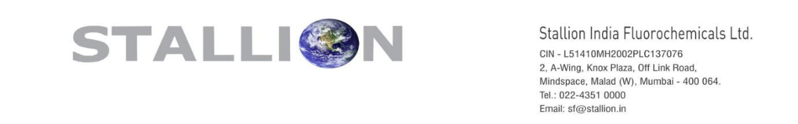

**[Image: Feb2026.pdf-0001-00.png (1230x192, 75.4KB)]**

Date: 06th February, 2026 

To, 

National Stock Exchange of India Limited (“NSE”), The Listing Department Exchange Plaza, 5th Floor, Plot No. C/1, G Block, Bandra-Kurla Complex Bandra (East), Mumbai – 400 051. 

To, 

BSE Limited (“BSE”), Corporate Relationship Department, 2nd Floor, New Trading Ring, P.J. Towers, Dalal Street, Mumbai – 400 001. 

NSE Symbol: **STALLION** ISIN: **INE0RYC01010** 

BSE Scrip Code: **544342** 

ISIN: **INE0RYC01010** 

Sub **<u>: Intimation under Regulation 30 of the SEBI (Listing Obligations and Disclosure</u> –** **<u>Requirements) Regulations, 2015 Transcript of the Investor Conference.</u>** 

Dear Sir/Ma’am, 

Pursuant to Regulation 30 of the SEBI (Listing Obligations and Disclosure Requirements) Regulations, 2015, please find enclosed the transcript of the Investor Conference held on Tuesday, 03rd February, 2026 with regard to the business and financial performance of the Company for the Quarter & Nine Months ended on 31st December, 2025. 

The transcript has also been uploaded on the Company’s website and can be accessed through the following link: 

<u>https://stallionfluorochemicals.com/PDFs/Earning_Call/Stallion_India_Fluorochemica ls_Limited_Q3_FY26_Concall_Transcript.pdf</u> 

You are requested to kindly note the same and acknowledge receipt. 

Yours Faithfully, 

**For Stallion India Fluorochemicals Limited (Formerly known as Stallion India Fluorochemicals Private Limited)** 

GOVIND Digitally signed by GOVIND RAO RAO Date: 2026.02.06 20:11:17 +05'30' 

**Govind Rao Company Secretary & Compliance Officer** 

**[Image: Feb2026.pdf-0001-19.png (1228x88, 28.6KB)]**

**[Image: Feb2026.pdf-0002-00.png (355x95, 16.1KB)]**

Stallion India Fluorochemicals Limited 

Q3 and 9M FY25-26 Earnings Conference Call Event Date / Time: 03/02/2026, 04:00 PM. 

**Operator:** Ladies and gentlemen, good evening, and welcome to Stallion India Fluorochemical Limited Q3 and 9M FY 25-26. As a reminder, all the participants line will be in listen mode only. There will be an opportunity for you to ask the question after the presentation concludes. Please note that this conference is being recorded. Before we begin, I would like to point out that this conference may -contain forward-looking statements about the company, which are based upon the beliefs, opinions, and expectations of the company as of the date of the call. These statements do not guarantee the future performance of the company, and it may involve risk and uncertainties that are difficult to predict. I would now like to hand over the floor to Mr. Parth from Confide Leap Partners. Thank you, and over to you, Parth. 

**Parth** : Good evening, ladies and gentlemen. Parth here from Confide Leap Partners. We represent the investor relations for Stallion India Fluorochemicals Limited. On behalf of Confide Leap Partners, I warmly welcome you all to Q3 and 9M FY 25-26 earnings conference call of Stallion India Fluorochemicals Limited. The company is, represented by Mr. Shazad Rustomji, who's the Managing Director and CEO at Stallion India Fluorochemicals Limited. I would now like to hand over the call to Mr. Shazad ji for his opening remarks. Thank you, and over to you, sir. 

**Shazad Rustomji:** Thank you, Parth. Good evening, everyone, and a warm welcome to Stallion India Fluorochemicals Limited Q3 9M FY 26 Earnings call. We are pleased to report a strong performance for the quarter and nine months ended December 31st, 2025, reflecting the continued execution of our integrated business model, expanding product portfolio, and strengthening presence across refrigerants, speciality gases, and high-purity applications. Let me take you through the financial highlights. For Q3 FY 26, company reported total revenue of INR 104.87 crores, registering a 23.2 percent year-on-year growth. EBITDA stood at INR 13.56 crores, while PAT stood at INR 11.12 crores. Despite some quarterly volatility, profitability remains structurally stronger compared to earlier years, supported by better product mix, higher contribution from aftermarket and value-added gases and operating leverage. For the 9M FY 26,Total revenue increased to, INR 321.18 crores, which is a 41.7 percent year-on-year growth. EBITDA grew to INR 43.69 crores, which is up 48.6 percent, and PAT surged to 72.8 percent year-on-year to INR 32.9 crores. Earning per share for 9M, FY 26, stood at INR 4.15 compared to INR 3.10 in the corresponding period last year. These numbers underline the strong operating momentum and scalability of our business model. From a strategic standpoint, we continue to make steady progress on our integration roadmap. We have received the environmental clearance for our 10,000 MT per annum R-32 manufacturing facility at Bhilwara, Rajasthan, which is a critical step towards backward integration and long-term cost competitiveness, with expected 

commissioning by August 2026. We are significantly expanding our industrial footprint throughout the upcoming, uh, HFO, HFC blending and rebulking, uh, facility at Mambatu, Andhra Pradesh, which will strengthen our presence in the high-growth, uh, market in South India. In parallel, we are building a strong position in helium and advanced high-purity gas solutions. During this period, we entered into a strategic technology tie-up with a Portuguese-based company, SYS Advanced, for access to advanced helium recovery and helium liquefaction systems, enabling us to address space, defense, semiconductor, and high-precision industrial applications. Additionally, we have signed a long-term strategic partnership with Sharjah Oxygen, Dubai, for technical collaboration and sourcing of liquid helium, with supply originating from Ras Gas and Oil Fields and Qatar. Together, these initiatives are helping us establish a resilient, globally connected helium supply chain for India. With four operational facilities and two upcoming sites, a pan-India distribution network, over 40 gases and blends, and more than 200 customers across 15 plus countries, Stallion today is well positioned as a forward-integrated platform, spanning refrigerants, speciality gases, and high-purity industrial gases. Given our strong performance in the first nine months, we remain highly confident of achieving our FY twenty-six revenue guidance of INR 430 crores, revenue, and PAT guidance of INR 40 Crores, and sustaining our  targeted thirty to 30-35 percent CAGR over the next three years, supported by backward integration, higher value products, and margin expansion of three to four percent over time. With that, I will now open the floor for questions. 

**Operator** : Thank you. Participants are requested to raise their hands for their question. Also, one can request the question in the Q&A box. We have Mr. Shashank Jha. Sir, you may unmute and introduce yourself 

**Shashank Jha:** Yes, sir. Actually, I have multiple questions. First is regarding that you have sold your holding in two tranches, okay? First, you have sold with Chemex promoters, and prior to that, two days ago, you have again sold it. Okay. So my question is: Is this both money going to R32 plant? 

**Shazad Rustomji** : Yes. Uh, basically, we had, uh, uh, during that period, we had already tied up to go in for a preferential issue, and the pricing at that time was approximately about 170-180 and we thought it would hold steady. So everything was tied up for the preferential issue, everything was worked out, but somehow the upward swing in the market, the volatility was such that every day there was an upper circuit, and suddenly, by the time before we could get down to any working, it had already crossed 250. So the preferential issue could not go through, uh, meaning it became unviable to go through. So the volatility continued for a month plus, where it became apparent that, uh, you know, in this volatility, we cannot go for a a preferential. At that time, QIP was locked in, so, uh, the only other... And we were not going in for a rights issue at that time. So basically, it, it bound us, on, the fundraising. So in the short run, what we did was, uh, I sold two percent of my shares, uh, two, two percent of my shares, and, uh, we raised the funds. That funds all were put into the company interest-free to kickstart the, uh, R32 plant work. It's a time-bound project. We couldn't wait. 

**Shashank Jha:** Okay, got it. And second is regarding the, sir, Mambattu and Khalapur plant. Like, in last con call, you told that it will be started by December and January, and I saw that today presentation, you told Q4 FY 26. So why this delay, sir? 

**Shazad Rustomji:** Uh, there are multiple reasons for it. Uh, in terms of helium, like I said, the helium plant at Khalapur, uh, operationally, we completely changed in, uh, August, September. We completely changed it from a 200 bar system to a 300 bar system to be up to date to the latest, uh, what is a- whatever is available. So everything had to be changed, the entire piping, the, all the cylinders, all the containers, all the, you know, the evaporators, everything has to be changed to meet the new pressure guideline. So the whole, whole thing, uh, got moved back by over 3 months. Second, uh, a lot of the material is incoming from US, so there, uh, there was a little delay. Everything... Currently, the plant is, uh, fully operational, meaning in the sense, uh, the work is all done for the plant. Incoming imported material is awaited, which should come. We should have startup in March. For Mambattu, when we started the R32 facility, suddenly, number one, it changed a lot of dynamics, n- uh, in the sense, uh, now that we would be having captive R32, the blending is going to be on a very different scale and level than what we had originally planned. Originally, was planned that, okay, you do a little for the country, et cetera. Now, the potential opening up is for a huge export market also, and for huge volume. It's not, uh, limited to the small volume that we had originally planned. The plant itself is scaled up. Initially, the design of the plant, etc, it's a five-acre facility. So, the design was, uh, basically half the plant was empty in the original design. Today, the original design was five tanks. Today, it is ten tanks. We are also putting up the same, semiconductor and helium facility that we have in, Khalapur. We are putting up that also. We are putting up hydrocarbon facility also, and additional tanks for the blending, what we have planned. So all that, you know, the complete re-engineering has to be done, number one, change of plans and enhanced volume, meaning it's almost like making two plants compared to what we had initially set out with. So that also, it should become operational by, March end or April. 

**Shashank Jha:** Sir, I agree, but communications would have come earlier regarding these things, that there are delays are happening, because from long time there were no proper communication. 

**Shazad Rustomji:** It, it was all... It, see, it, you have to understand one simple thing: It does not affect us operationally. It will enhance our operations, number one. Number two, communications have been amply given, where we have stated in the last call and earlier also, that both the plants have had to be completely re-engineered with the new changes that have come as we move along. So there is no sense in us wasting money and putting things on something which was planned two years ago, when the current ground situation has completely changed. So it's in line with that, and information has been amply given. 

# **Shashank Jha:** Okay. 

**Operator** : We request Mr. Shashank to join back the queue, since we have limited time from the management. A kind reminder to all the participants, please, raise your hand to request your 

question. Also, one can request the question in the Q&A box. And one short reminder, too, that, as we have restricted time from the management, everybody is restricted to two questions. Next, we have Mr. Aditya Sen. Sir, you may introduce yourself. 

Aditya Sen: Hi, this is Aditya Sen from FinDoc. Uh, so my first question is regarding the Bhilwara plant. You were about to commission this in July-... both the phases, and in the opening speech you mentioned that we are pushing this to August. So is this actually pushing the deadline, or we are just taking some margin of safety? And if you are pushing, then, uh, why are we doing the same? 

**Shazad Rustomji:** First, the first thing is, we have provided a projection of 6 months of production. That means technically, I have given you a production cycle starting 1st October, not August. So whether I do it in September, whether I do it in July, whether I do it in June, it makes no difference because our projections, uh, confirmation, and, uh, uh, timeline provided is for 6 months production in 2026. 

Adiya Sen: Uh, do we have a trial production also before we commence this facility for, uh, commercial purpose? 

**Shazad Rustomji:** We would be having a trial production. We would be having a trial run. We would be having, uh, initial startup, debottleneckings and whatever, you know, the quality checks, etc 

Aditya Sen: Mm-hmm. 

So all that would be done. See, basically, we-- If you've noticed how we operate, we always tend to provide whatever we say carefully and with a lot of margin. So, uh, basically, what we have projected is start from October. 

Aditya Sen: Yeah. 

**Shazad Rustomji:** Well, I have said, I have said we will com- we will complete everything by August. Our target is much earlier. 

Aditya Sen: Fair enough. In fact, this was the only reason why I was asking, asking this, because in the last call also, you mentioned that you will achieve the goals on time, and here we were pushing it. So I thought I'd just confirm this, that, uh, if you are postponing the question also. 

**Shazad Rustomji:** We, we are not postponing anything. It is, uh, absolutely from day one, what I've been speaking is the... If you see from day one, uh, six months ago also, when we have spoken of this, I have always given six months production cycle for 'twenty-six. So six months is October to March. 

**Aditya Sen** : All right. And the second question is regarding- 

**Operator** One request, Mr. Aditya, uh- 

**Aditya Sen** : That was only one question. May- 

**Operator** : Sir, please join the queue. We have restricted time from the management. We'll allow you the next time. Next, we have Mr., uh, Arindam, Arindam Dutta, sir. Uh, sir, you may unmute and introduce yourself. 

**Arindum Dutta** : Yeah. Hello. Uh, uh, thank you for giving me opportunity, sir. Uh, I have a couple of question. One question is like, uh, as we know, that, uh, we have only distributor, uh, license from, uh, Honeywell for HFO blend, and I guess Navin has the production license. So does that mean, uh, like, whatever we sell HFO, that R32, which is used for that HFO, we cannot use our own production R32, we have to always get it from Navin? Or... Because why I'm asking this question, because of our aggressive, uh, expanding of R32 production, we have a ten thousand metric ton anyways coming from Bhilwara plant, as well as we are planning for Ukhalia plant for another ten thousand metric ton, if I am correct. So just wanted to understand, uh, where is that, uh, so much demand you are seeing? Uh, what you said. 

**Shazad Rustomji:** Uh, firstly, I, I think there's little confusion with you in regards to your question. You said, uh, w- uh... See, basically, we do not like speaking about another company, uh, number one, so I don't want to comment on that. You said Navin has a license to produce HFO. Then where is the link up with the R32 with that? There is no link up. Is there- 

**Arindum Dutta:** R32 is the one of the, uh, main constituent of, uh, HFOs. 

**Shazad Rustomji:** Uh- No, it, no, it is not. HFO does not use R32. HFO blends use R32. Navin does contract manufacturing for Honeywell for one of the products, number one. We have no-we cannot speak on, uh, what contract some other company has or what is the dealing another company has. We can speak about our company. So ask me what you want about our company. 

**Arindum Dutta** : Yeah. So, uh, R32, like, we are expanding into twenty thousand metric ton, right? 

**Shazad Rustomji:** Uh- No, no, we are expanding into **10,000 metric tons** . Ukhalia is in Bhilwara. 

**Arindum Dutta** : The- Okay. So it's the same plant, uh, you mean? 

Shazad Rustomji: It's the same, it's the same- Bhilwara ... It's, it's the same plant only. Ukhalia is the, uh, industrial area. Ukhalia is the name of the village- Okay ... and Bhilwara is the district. 

**Arindum Dutta** : I got it. Okay. So i-in that case, like, why do we have then, uh, like, it was probably two hundred and thirty crore initially, whatever I, whatever I have heard about, right? 

**Shazad Rustomji** :  So- It was a, it was a 5,000 metric ton plant originally planned, which we have expanded to ten thousand tons. It was planned in two phases: first, uh, five thousand tons, and then the follow-up five thousand tons. We decided to go in for ten thousand tons together for economies of scale. 

**Arindum Dutta:** So, like, uh, the, uh, CapEx, what we had, uh, communicated last con call, so that was probably like, uh, two hundred, uh, somewhat crore, right? Right now it is another three hundred and sixty-two crore that you have, uh, basically asked for. 

**Shazad Rustomji** : The total, the, the total, uh, ca- uh, funds being raised are three sixty-four crores, number one. That is for twice the capacity. 

**Arindum Dutta** : Okay. And so how much will be, uh, from the preference or whatever the, uh, this rights issue? 

**Shazad Rustomji** :  Everything will be from the rights issue. 

**Arindum Dutta:** And like, what you have, uh, given to the loan to the company for interest fee, that also included into, uh, this three sixty-two or no? 

**Shazad Rustomji:** Uh, that is included in this, and what I have given into the company will come back, uh, will be reissued in the rights to me. 

# **Arindum Dutta** : Okay. 

**Shazad Rustomji** : I will be subscribing for the rights issue also.... 

**Arindum Dutta** : Sure. Yeah, yeah. 

**Operator** : Just, uh, Arnim Dam, sir, uh, to please join the queue. 

**Arindum Dutta** : Sure. Thank you. 

**Operator** : Thank you. Participants are requested to raise their hands for the question. Also, one can request the question in the Q&A box. Next, we have Mr. Jay Mehta. Sir, you may unmute and introduce yourself. 

**Jay Mehta** : Uh, hello, sir. I have, uh, two questions. Firstly, on the, uh, land side, basically for the Bhilwara plant. In the draft offer, there is mentioned, like, you have a, uh, you have, like, uh, got approval for two lands out of three you have, like, proposed. And so my major question is, for the **10,000 metric ton** plant, do you require the all the three lands, or is it, like, just one land and you need-- and you, like, uh, for backup, you are, uh, buying three plots? 

**Shazad Rustomji:** No, it's, uh... Basically, see, in a, in a, uh, how to say, in a chemical process plant, you need to have all your plans, whatever you're going to do from start to end, you need to be very clear. You cannot, you know, you cannot say that, "Today I'll make this plant," and then unplanned, tomorrow say: "I want to put something else." Everything has to be planned from day one to the last day, whatever you want to do. So whatever you are going to be making, it's got to be an integrated design of how. Now, I'll give a simple, uh, example. You're going to make a water treatment plant. You're going to be making a treatment plant for hazardous waste, etc. Now, every expansion you do, you're not going to start making a separate, uh, plant for that. You're not going to duplicate. So you'll have a bigger one area, and in your entire to-- entirety in your design, you will already have taken in that this is the common area where this will come, this is the common area where the water will be. From here, the water treatment will go. This is the raw material storage. So the common raw material storage for all your processes, what would be there. So basically, your, your design has to be complete. So you cannot, uh, you know, bank that, "Tomorrow I'll buy land and I'll expand." It has to be either you have it and you have the whole plan together. You do your work in phases. So currently, first, we'll be setting up the thirty-two plant. Next, we'll be setting up a plant for the by-product, uh, commercialization. And a chemical process, all your by-products, the company that manages to commercialize its by-products becomes successful. So basically, the next step would be by, uh, commercializing all the byproducts or waste products that come out in each of the manufacturing process. Third is, we've already declared our plans for HFO plant next. So in a series, it's all going to be there. Currently, for the current operations, we need the two plots critically. The third plot also is there as part of the expansion for whatever else we have got planned. We've got series of things planned. We've got series of plans, everything in mind and planned. Why we are not putting it up? We don't want it being construed as leading the market or, like, you know, trying to inflate what we're trying to do, etc. So we are being a little reserved in whatever we are releasing. But our plans are for the next four years, we'll be continuously expanding and growing the number of plants that we have and the products that we have. 

**Jay Mehta** : So for, three land parcel, you are, the estimated CapEx is twelve crore, or for the two of them is twelve crore. What is it exactly? 

**Shazad Rustomji** : For all, all three. See, it's under, It's with a, MOU signed with the government of Rajasthan. Land provided is highly subsidized, and allocation is done on the specific MOU. When you sign a MOU with the government, it's not a, you know, it's not a small thing. It's meaning, it has its responsibilities, and it has its benefits also. 

**Jay Mehta** : Second question, sir, I had was- 

**Operator** : Could request Mr. Jay, sir. Uh, please, sir, can you join the queue, or as we have limited time from the management. 

**Jay Mehta** : Uh, okay. 

**Operator** : Participants are requested to raise their question by raising their hands for the question. Also, one can request the question in the Q&A box. Next, we have Mr., uh, CK Nathani. Sir, you may unmute and introduce yourself. 

**CK Nathani** : Yeah. Hi, can you hear me? 

# **Shazad Rustomji** : Yes. 

**CK Nathani** : Yeah, I just want to know one question. This is regarding the pricing power of Stallion. So, you say that, if R32, gas is produced and it is reached at the good purity level, the customer would be indifferent. So, what's the Stallion's pricing power if you want to retain the customer? 

**Shazad Rustomji** : I have not really understood the question. You mean... See, once you go into manufacturing, my pricing power will be the same as what is Naveen's or SRF's or anyone else's, or any other manufacturer. So suddenly, what happens is our price parity. Okay, there may be little difference in, in further backward integration or something, but that's very marginal. So basically, we get the same advantage as any other manufacturer. 

**CK Nathani** : Yeah. So how you retain the customer? Like, you must be having a customer retention. Like, would you lower your margin or how you compete in that sense? 

**Shazad Rustomji** : Let me put it this way. Currently, we don't manufacture, and we still retain the customer in spite of global multinationals, global giants, who are ten times the size of the local company, and against the local manufacturer. So tomorrow, when we become a manufacturer ourselves, what gives you the impression we will not have strength to retain or, keep the market that we have or grow it? without being a manufacturer, we are managing. So if we have a manufacturer with double the strength, why do you have doubt that it won't be more strength? 

**CK Nathani** : And, second part, of the question is that, your statement is that the company's future target is thirty-five percent CAGR for next three years. So how is your underlying data on this? Like, you are saying thirty-five percent for three years. So is there any roadmap on this to consider for the next three years? 

**Shazad Rustomji** : Yes. First thing is, currently our turnover targets given is INR 430 crores. I think with our, with our nine months performance, if this was a cricket match, a five-day match or something, it would already be declared. So we've achieved, we will achieve whatever we have projected. So this year is INR 430 crores. Next year, we would be having the start of the Mambatu facility, we'll be having the start of the helium facilities. That itself would provide additional growth, number one. So safely to say that 50 crore more, it should not be an issue. And most importantly, you'll be having six months of R32 production. So safely taken, that should be about 275 crores. So 675 crores is there. The next year, you'll be having the twelve months production of R32. So even without any other growth, you will still be from 675 and add 275, 950 crores would be your growth next year. And then, the following year, you'll be coming out with the HFO. 

**CK Nathani** : Okay. Okay, understood. Thank you, sir. 

**Shazad Rustomji** : And this is not even counting the natural growth of the company in the current field that is it, it is in. Without that also, it is pretty much, clear that the growth factor would be there. 

**CK Nathani** : Okay, understood. Thank you. We'll join the queue for another questions. Thank you. 

**Operator** : Participants are requested to raise their hands for the question. Also, one can request the question in the Q&A box. Just a quick reminder, as we have limited time from the management, everybody is restricted to two questions. Next, we have Mr. Ramesh Shah. Sir, you can unmute and introduce yourself. Mr. Ramesh Shah, sir you can unmute and introduce yourself. 

# **Ramesh Shah** : I'm unmuted. Am I audible? 

# **Operator:** Yes sir. 

**Ramesh Shah** : Okay. I wanted to ask you about Khalapur and Mambatu plant. Just two-three things, that all the equipment that we are importing, have they been shipped? If they have been shipped, when will they reach the Indian port? And once it reaches the Indian port, in how much time the commissioning can happen? That's one thing. And the second question is, somebody just asked earlier about the rights issue. So I'm guessing that you sold some stake, so that will be reissued to you in terms of your rights shares. Will you be putting more money apart from that? These are the only two questions I have. Thank you. 

**Shazad Rustomji** : First thing is, for the Khalapur and Mambatu. Mambatu has mostly Indian supplies, because even the imported material that we are purchasing, like the compressors, pumps, the, the flow meters, etc, they have the, MNCs have their branches or companies in India. So that everything will come from India itself, number one. And most of the stuff is ready, meaning we don't have to wait. It's now, the engineering is going on and the, construction work is going on. In terms of, uh, the helium plant, everything is completed. Every plant and machinery is at site, and, I think the plant should be fully operational and ready by this month end. The last few items, critical items that are not manufactured here and are coming from US, they have already been shipped out. They should be coming by, I think, March first week, they should arrive. 

# **Ramesh Shah** : That is for which plant? 

# **Shazad Rustomji** : Helium plant. 

And the rights? Rights issue, whatever I have, number one, sold, definitely I would be... Whatever I've given to the company, meaning, it's on interest-free, so that will come out and come back into the rights and come. And whatever else, definitely I would look at subscribing as best I could. 

# **Ramesh Shah** : Thank you. 

**Operator** : Participants are requested to raise their hands for the question. Also, one can request the question in the Q&A box. Next, we have Mr. Santosh Singh. Sir, you may unmute and introduce yourself. 

**Santosh Singh** : Hello, good evening, Rustomji. Am I audible? 

# **Shazad Rustomji** : Yes, sir. Good evening. 

**Santosh Singh:** Sir, my first question is, since we have made these changes to the plant and now my, uh, our capacity is double, uh, so when, uh, when would we achieve the maximum capacity, basically, or when ne- next expansion will be needed? That's the, my first question. let me put you the second question a- as well. You have also made changes to the, our, uh, product, basically. So is margin different? Uh, as I think one of the cust- uh, I mean, participant asked about, uh, the similar thing, uh, whether the customer will be, uh, different set of the customer would be there, or, uh, how, how the margin would, uh, be there in this, uh, new product? Uh, yeah, that's my two question, I think. Yeah 

**Shazad Rustomji** : Sorry, can you just, your first question is what? 

**Santosh Singh:** Uh, related to the, uh, double of expansion, right? Yeah, okay. We have made changes to the plant, right? 

**Shazad Rustomji** : The expansion, uh, we have doubled the c- we had originally planned for five thousand ton manufacturing. And the reason we had planned for five thousand ton manufacturing is that we noticed that all the manufacturers in India usually started out with that capacity and then expanded. So basically, in our think tank, in our planning section, uh, there was a school of thought that maybe there's a learning curve or, you know, maybe, uh, it, it let- why, why do we want to reinvent the wheel? Why don't we follow what everyone have done? So start off with that size. But afterwards, as we went through the whole design, engineering, and the planning and everything, we realized that there's nothing difference between five thousand or ten thousand. It's just a scale of what, you know, at what they wanted to start off with. So then we decided to, uh... Because, you know, it's very difficult once you have a running plant to expand and double the capacity. Right. So then we decided that, like Mumbattu, rather than do it in phases where you have an existing plant needing shutdowns, you might as well complete everything at one shot. So, the capacities were doubled. Your second question is, the product remains the same, 32. 

**Santosh Singh:** New product, like... Yeah, yeah, even helium, right? Yeah. How would the margin would be in these products? Uh, and, uh- All the customers are different. Yeah ... 

**Shazad Rustomji** : All the, all the new products that we are getting into and all the new business that we are getting into, all will be having a margin ranging from 16% to 24% PAT. It will enhance our PAT. Currently, that is at 10%. We're looking at enhancing it to 24% percent. 

**Santosh Singh:** Okay. Okay, got it. Yeah. So,thank you so much for answering my questions. All the best. 

**Operator** : Participants are requested to raise their hands for the Q, uh, for their questions. Also, one can request their question in the Q&A box. Next, uh, we have Mr. Ashish Soni. Sir, you may unmute and introduce yourself. 

**Ashish Soni** : Yes, sir. So I think, are you sufficiently funded, for this, Bhilwara plant, or do you think some more funds only after rights issue? Because if at all things goes wrong, what's your backup plan? Because I heard initially you sold off serial earlier, then you had challenges in preferential QIP. So I just want to understand the current status in terms of how much you have and how much you're planning. I just want to get a clear clarity on that front. 

**Shazad Rustomji** : We don't have any issues with funds or anything, meaning, basically, see, how, what we are looking at is currently we are debt-free status. If we want to go for project loan under the MOU that we have signed, on auto basis, we would end up getting project finance also. The banks are already tied up into the MOUs, with the government of Rajasthan. So number one. Secondly, it's a greenfield manufacturing facility. The company is listed, so if we wanted to raise project finance, meaning we absolutely have no issue on that, it would happen in 20-25 days. So in terms of funding that way, in terms of internal accruals and funding also, in case of anything, we see no challenge or any issue, meaning we are not stressed on funds or anything, number one. Number two, reason for going for rights and expansion. See, this would probably be the last dilution. We don't see onwards the requirement for any further dilution because the cash flow would pay, and any further expansion would be a mix of debt and warrant, meaning debentures or something. Uh, but I don't see further any requirement of any dilution. So basically, how we saw it is, at the current, market volatility, in the current global turmoil that we see all around, we wanted to ensure that the company is on a debt-free status only. We didn't want to, at this stage, take on any debt. So technically, we have absolutely no issue. Second, I'm happy to say that in spite of the volatility in the market, the general market conditions coming down, etc, our shareholder base has grown from forty to fifty thousand shareholders, and we see that as a very strong indicator that there are a lot of people who would be interested, and, we see no challenge in the rights issue at all. 

**Ashish Soni** : And second question, I think, you did a sort of tech transfer or JV or whatever, for the helium thing. For HFO, is there anything planned, and how are you planning manpower for this, all these plans? Because earlier, your, mode of operations or the way of the working was different compared to a manufacturer, right? So just throw some light on this as well. 

**Shazad Rustomji** : See, it's basically when you sign for technology transfer, when you sign for design engineering, obviously we are not sitting and designing this plant. There is a professional 

company contracted for doing that work. Even the setting up of the plant, we are not doing anything. There's a professional EPC contractor, specializing in this job, who are setting it up. So as part of the process, they also have to get the manpower, they also have to train the manpower, and they also have to ensure smooth running for two years. 

**Ashish Soni** : But what about HFO blend? Do you think you require some sort of trans- tech transfer or something from any other company, foreign company? 

**Shazad Rustomji** : Even for this, we have taken tech transfer. We have paid for the technology transfer, we've purchased the technology pack, and we have gone ahead. The same would be the process there also. 

**Ashish Soni** : Okay. It will be like how much they can- 

**Operator** : Would request Ashish sir to please join the queue. Apologies for the same. Next, we have, Miss, Sanchita Sood. Ma'am, you may unmute and introduce yourself. 

**Sanchita Sood** : Hi, thank you for the opportunity. So, sir my question was that, if we talk about our current capacity, that is excluding Khalapur, Mambattu, and Bhilwara, what kind of, revenues can we do, and, like, at peak utilization, and what is our current capacity utilization as of now? And my second question would be that, could you please repeat, for this Bhilwara plant, what was the CapEx amount, and how much revenue can we do from 10,000 metric tons capacity? 

**Shazad Rustomji** : Ma'am, can you, can you ask the first question? I've forgotten what you asked. 

**Sanchita Sood:** Yes. I was asking that on our current capacity, that is excluding Khalapur, Mambattu, and Bhilwara, what kind of you know, revenues can we do at peak utilization? 

**Shazad Rustomji** : Okay, let me answer that first. The current turnover that we are seeing is excluding these three new facilities. So, we've done INR 430 Crores meaning we had given a projection of INR 430 Crores, and we have done four thirty. In March, we'll give the projection of what we'll do in the coming year, and, basically, we would be meeting that. There would be growth in that itself. Even in the existing business, though, like when we are speaking, we don't give forward statements or we don't give forward projections, you know, highly raising it up and all, but definitely there would be a growth in that. The reason... Now you'll ask, meaning, where the confidence comes from. All the current HFCs, all are at 5, 6, 7 dollars. All the HFOs are at 25 and 30 dollars. All the HFCs are slowly changing over to HFOs, so the normal growth that we would see would definitely have a growth in the business itself. 

**Sanchita Sood:** Okay. All right. And, so my second question was, from the R32 plant, from ten thousand metric tons capacity, what was our, CapEx amount, and how much revenue can we expect from this facility? 

**Shazad Rustomji** : CapEx amount, see, we are raising INR 364 crores we are raising for this, R32 plant. In the first year, we expect, 50 percent production. I've given a target of six months production, so October to March, we expect to have about INR 275 Crores. And the PAT, is at the least expected, meaning 24 percent, so it would be INR 66 Crores PAT. In the next year, '27, it would be, INR 550 Crores revenue, and INR 132 Crore PAT, combined with our current, business and the new two facilities starting up. So it should be, your PAT would be in the vicinity of, like, between one eighty and two hundred. 

**Sanchita Sood:** Okay. All right. Thank you so much. 

**Operator** : Next, we have Mr. Jay Mehta. Sir, you may unmute and ask your question. 

**Jay Mehta:** Sir, I had a query regarding in the latest quarterly update, you have given, that is- 

**Shazad Rustomji** : You are from, you are from what meaning, organization or this? 

**Jay Mehta:** Sir, I am from Elios. my query is that in the IPO proceeds, you, there is, like, a huge chunk of money which is still unutilized on the books, in the December, financials, basically, which we can see. Like, for Khalapur, it is close to 47 percent. For Mambattu, it's approx 80 percentage unutilized, so? 

**Shazad Rustomji** : We have on,  See, we've got a total of about, I think INR 26 crores unutilized. The reason is, number one, the major, in Mambattu, the construction work is going on. The way we work is we never pay in advance. We pay after the work is completed. So basically, work is undergoing, so why would we pay them in advance? 

# **Jay Mehta:** Okay 

**Shazad Rustomji** : We don't pay for any of the works that we have done, like even for the plant and machinery, etc, we don't pay advance. Only for critical equipment, we will pay 30% advance, the rest is against delivery. So most of the things like that have 4 months delivery period or six months delivery period, it will get paid when the material arrives here, only the advance is paid out. And, for regular Indian suppliers or contractors, like any contract work that is being done on the site, etc, they have to complete the work. They'll get a small tranche in between, but, the bulk of payments will only be done on completion of work. 

**Jay Mehta:** Okay. Second thing about, I'll say the... Okay, talk, talking about only the helium plants basically for the Khalapur and the Mambattu. So what is like the, there is a huge upgradation have happened, basically. There must be some, higher CapEx required as well. From only INR 50 Crores out of IPO, there will be higher CapEx involved. What was the amount, and what is the, like, the revenue potential now, given that all the upgradation has been taken? 

**Shazad Rustomji** : The helium facility in, Khalapur, that work has been concluded, meaning that work is getting concluded. We are also expanding to Mambattu with helium facility to give us reach in the south. Now, all that comes from the internal accruals of the company. 

**Jay Mehta:** Yes, sir, but, what amount? 

**Shazad Rustomji** : It would be, meaning it would end up being about INR 15-20 Crores. 

**Jay Mehta:** And the revenue potential? 

**Shazad Rustomji** : You, see, you have to understand how the business evolves. Uh, if you have one setup in, say Maharashtra, when you're supplying the bulk of your, like, you know, the 60-70 percent of your profitability comes from the liquid helium, not from the gas. So when seventy percent of your profitability comes from the liquid, you have to be within 500 kilometers of your target customer. That's the maximum you'll be able to reach profitably. So what happens is, if you're thinking you'll sit here and you'll service someone 1,400 kilometers away,  you're not really going to be a player. So whoever's there will have the chunk of the business. Secondly, you will always be a marginal player; you will not be a bigger player. Like, what makes, a Linde, a Linde? They're spread all over. So when you have the facilities in each regional side, India is a, you know, big country, length, breadth. So technically, within five hundred kilometer radius, when you have, like in the south you have, in the west you have, in the north... Now, north, we already have land. We've got a facility in Ghilot. The next facility would come up there. So it is important that you follow the norms of the business and what makes economic sense. When you're targeting helium as a totality, and you want to be a player, at least a 20 percent player in the market, 25 percent player, you will need to have multiple plants in each of the regions. 

**Jay Mehta:** Understood, sir. 

**Shazad Rustomji** : Meaning you won't, you won't be able to get that 20 percent, 25 percent market share having one facility in India. Even though that facility may be able to provide that by capacity, but you won't get, you won't get that volume of share. 

**Jay Mehta:** Okay, sir. But again, you must be targeting some, something of target, right? 

**Shazad Rustomji** : Our long-term target is, meaning, long term means within five years, our target is INR  200 Crores for helium. 

**Jay Mehta:** From what? 

**Shazad Rustomji** : Helium and speciality gases. 

**Jay Mehta:** Okay. 

**Operator** : Thank you, Mr. Jay Mehta. Now, we would like to hand over the floor to the management for the closing remarks. 

**Shazad Rustomji** : Thank you. It's been a real, volatile time for all investors. Basically, with the markets, you know, being volatile, happenings, globally, with the US especially, etc. So it's been... With metals going up, down, it's been a highly volatile time for all investors. Basically, what we look forward to is that with this upcoming facility, within six months, this facility is, a normal company would take eighteen months to set up this facility. So basically, what we are doing is, it would be establishing a sort of a record for a chemical process plant if we conclude and make it in the time that we have said. Once that facility comes about, uh, we believe that the company will hold a very different value. It will also hold a very different stability where, in respect to its marketplace, etc. And that should work out very well for all the investors who have trusted and have been with there with us. We would be having a rights issue shortly. We would be coming out with all the announcements, etc, for it, and we look forward to, all our investors participating in that also. Thank you. 

**Operator** : Thank you for joining Stallion India Fluorochemical Limited, Q3 and 9M FY26 earnings conference call, hosted by ConfideLeap Partners. Participants may sign off. 

---

## Extracted Images

| # | File | Dimensions | Size |
|---|------|------------|------|
| 1 | Feb2026.pdf-0001-00.png | 1230x192 | 75.4KB |
| 2 | Feb2026.pdf-0001-19.png | 1228x88 | 28.6KB |
| 3 | Feb2026.pdf-0002-00.png | 355x95 | 16.1KB |
