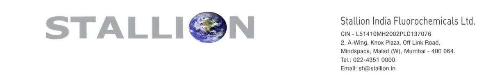

**[Image: May2026.pdf-0001-00.png (1230x192, 74.1KB)]**

Date: 22nd May, 2026 

To, National Stock Exchange of India Limited (“NSE”), The Listing Department Exchange Plaza, 5th Floor, Plot No. C/1, G Block, Bandra-Kurla Complex Bandra (East), Mumbai – 400 051. 

NSE Symbol: **STALLION** ISIN: **INE0RYC01010** 

To, BSE Limited (“BSE”), Corporate Relationship Department, 2nd Floor, New Trading Ring, P.J. Towers, Dalal Street, Mumbai – 400 001. BSE Scrip Code: **544342** 

ISIN: **INE0RYC01010** 

Sub **<u>: Intimation under Regulation 30 of the SEBI (Listing Obligations and Disclosure</u> –** **<u>Requirements) Regulations, 2015 Transcript of the Investor Conference.</u>** 

Dear Sir/Ma’am, 

Pursuant to Regulation 30 of the SEBI (Listing Obligations and Disclosure Requirements) Regulations, 2015, please find enclosed the transcript of the Investor Conference held on Monday, 18th May, 2026 at 04.00 P.M. IST with regard to the business and financial performance of the Company for the Quarter & Financial Year ended on 31st March, 2026. 

The transcript has also been uploaded on the Company’s website and can be accessed through the following link: 

- - <u>https://stallionfluorochemicals.com/investors information/earning call/</u> 

You are requested to kindly note the same and acknowledge receipt. 

Yours Faithfully, 

**For Stallion India Fluorochemicals Limited** 

GOVIN Digitally signed by GOVIND RAO Date: 2026.05.22 D RAO 18:21:12 +05'30' 

**Govind Rao Company Secretary & Compliance Officer** 

**[Image: May2026.pdf-0001-16.png (1275x96, 29.0KB)]**

**[Image: May2026.pdf-0002-00.png (355x95, 15.9KB)]**

# Stallion India Fluorochemicals Limited Q4 and FY25-26 Earnings Conference Call Event Date / Time: 18/05/2026, 04:00 PM. 

**Host:** Ladies and gentlemen, good evening and welcome to Q4 and FY26 Earnings Call of Stallion India Fluorochemicals Limited hosted by Confideleap Partners. As a reminder, all participant lines will remain in listen-only mode and there will be an opportunity for you to ask questions after the management's opening remark and presentation. Please note that this earnings conference call is recorded. Before we begin, I would like to mention that certain statements made during this conference call may be forward-looking in nature. These statements are based on the current expectations, assumptions and estimates of the management and are subjected to various risks and uncertainties. Actual results may differ materially from those expressed or implied due to several factors. The company undertakes no obligation to publicly update or revise any forward-looking statement. We represent the investor relations for Stallion India Fluorochemicals Limited and on behalf of Confideleap Partners, I extend a warm welcome to all the investor, analysts and participants for joining the earnings call for Q4 and FY26. We have with us Mr. Mr. Shazad Rustomji, who's the Managing Director and CEO of Stallion India Fluorochemicals Limited. Sir, you may now proceed. 

**Mr. Shazad Rustomji:** Thank you. Good evening, everyone and a warm welcome to Stallion India Fluorochemicals Limited Q4 and FY25-26 Earnings Conference Call. We are pleased to report another year of strong operational and financial performance despite increased volatility across global energy markets, supply chains and geopolitical developments. During FY25-26, the company reported total revenue of INR 434.12 crore reflecting a growth of 14.4% year-on-year. EBITDA increased by 23.34% to INR 61.35 crore while PAT grew by 35.61% to INR 43.84 crore, highlighting the resilience of our business model, operational agility and disciplined execution. Throughout the year, we proactively strengthened our sourcing network, inventory planning and customer servicing capabilities, enabling us to maintain supply continuity across key end-user industries despite disruptions in global logistics and raw material markets. FY26 was also a defining year from strategic expansion perspective. We received the environmental clearance for our proposed 10,000 metric ton R-32 manufacturing facility at Bhilwara, Rajasthan marking a major milestone in our backward integration journey. The project is progressing as planned and is expected to commence production by October 26. This facility is expected to strengthen supply chain security, improve operating margins and support import substitution initiatives in India. In parallel, we continued expanding our specialty gas and high purity gas capabilities. Our upcoming Mumbattufacility in Andhra Pradesh will strengthen our presence in South India, while adding HFO and HFC refrigerant blending, de-bulking and also helium and semiconductor gas handling capabilities in South. We also scaling up liquid helium semiconductor gas infrastructure at Khalapur to capitalize on emerging opportunities across electronics, semiconductors, healthcare, 

solar and advanced manufacturing sectors. Today Stallion operates across four strategically located facilities with two additional facilities under development, supported by a pan-India distribution network. Our focus on aftermarket customers, operational flexibility and specialty gas expansion continues to strengthen our competitive positioning. Looking ahead, we remain confident about the long-term growth opportunity in fluorochemicals and specialty gases. Supported by backward integration, specialty product expansion and industry tailwinds, we continue to target a revenue growth CAGR of 30 to 35% over the next three years along with margin improvements of 3 to 4%. We remain committed to building a fully integrated technology driven fluorochemical platform focused on innovation, reliability, sustainability and long-term stakeholder value creation. Thank you. 

**Host:** Thank you. Now participants are requested to raise their hands for asking questions, also one can request questions in the question box. We have the first question from SK Nathani. You may kindly unmute and introduce. 

**SK Nathani:** Hi Sir, this is regarding your previous statement when someone asked you in Concall that what you will be doing with the money that you realize from open market sale. So you mentioned that you will be applying your rights issue, but we can see that you sold your rights entitlement to alternate investment fund, a DII, about 16% of your holdings. Then that DII again sold that to about more than 2% in public. So, it is like going back on your words that you will be applying rights issue, right? So, can you explain why you thought to go back on your word like not applying your rights issue? 

**Mr. Shazad Rustomji:** Have you seen what we have applied? The amount of shares I sold I bought back. 

**SK Nathani:** I can see that your current holding is 44% in shareholding pattern. 

**Mr. Shazad Rustomji:** It's 47.5% or a little more. The dilution, it was 68%, the dilution is on account of number one, the value at which we had to open it because of the market conditions. We had expected to open it at 140, but it would not have been subscribed at 140. So we had to open it at 99 and that dilution resulted in the fall of the shareholding. The number of shares that I sold, I bought back. 

**SK Nathani:** Sir, before rights issue your holding was about 67%, 66%... 

**Mr. Shazad Rustomji:** See number of shares, please. If you don't understand that the dilution is caused because of the price at which we had to dilute. So, the number of shareholders we had to increase and that caused the dilution. If we had done at 140 we would not have to do 11 crore shares, we would have to do 8 crore, 9 crore shares. So the dilution percentage would have been less. You have to see number of shares, not the percent of holding currently. 

**SK Nathani:** Okay and one more thing when you mention 35% CAGR growth, your revenue yearon-year is as of March 2026, it's **14%** . So in last con-call you also mentioned that **35% growth** 

will be there and but we can see that there is a 14% growth only. And also, there is a de-growth on a quarter-on-quarter basis which is 27% de-growth from last quarter if I see INR 150 crores was the turnover last March 2025 but this time it's only INR 110 crores. So that's also a concern. 

**Mr. Shazad Rustomji:** Yeah, you have a very different way of looking at things. Let's put it this way, first thing is every single call, these are all recorded calls, these are on record on the exchanges also. I have always maintained we will our target was 430 crores and 40 crore PAT for this year. 30, 35% growth is onwards. I have been saying it in every quarter, I have said it on record and I have said it in writing. The target for this year which we had expressed one year ago when we had done INR 370 crores turnover the year before, we had given ourselves a target, we had put our target internally at INR 430 crores and INR 40 crore PAT which we have surpassed. Onwards going 30-35% growth is there for the next three years which we have always been saying and I still continue saying for the simple reason this year if we start up on time and we get the six months production, we are looking at INR 250 crores incoming from there. So even if we don't grow 1% on any other front, we do INR  430 crores again, even then we still grow at more than 35%. Next year we get the 100% of the turnover, meaning all 12 months sale, you will again have another 35% and the year later our HFO plant should become operational. So you will again have 35% growth. Again, the HFO plant would, you would get about four months or six months operation and the year after that you'd again get the full year production of the HFO. So the next three, four years we have a 30-35% growth projection which we stand by. Current year's current year's whatever targets were there have been mentioned repeatedly in every earnings call, has been mentioned one year ago in my speech and is recorded. So, we have never said we'll do 35% in last year. We had given a specific figure, INR 430 crore and INR 40 crore PAT. 

**Host:** Participants are requested to stick to two questions per participant as there are many people in the queue. So, you can join back in the queue. Next one is Ms. Disha. You can unmute and introduce yourself. 

**Disha:** Hello? 

**Mr. Shazad Rustomji:** Yes. Disha: Yeah, am I audible, sir? 

# **Mr. Shazad Rustomji:** Yes, go ahead. 

**Disha:** Yes, thank you so much, sir, for this opportunity. So I think my question is again on our revenue front, sir. So last time I think we spoke, you mentioned that around this year we'll be targeting around INR 675 crore revenue. So are we on track for that? 

**Mr. Shazad Rustomji:** INR 431 crore... one minute. INR 430 crores if we go strictly by my friend earlier who took numbers in totality. If you go by that methodology INR 430 Crores and 30% is INR 559 crores. So technically we have to do INR 560 crores to qualify for the 30% growth yearon-year. But we would do more. 

Disha: Yeah, so I think last time you... so we'll get INR 275 crores this year were targeting from the R-32 and 50 CR from Khalapur... 

Mr. Shazad Rustomji : If in October we start off on time and everything goes well, yes, we should have that revenue, which would be much more than 30%. We are always a little conservative on the numbers. 

Disha: Right, right. But and sir this Mumbato and Khalapur facility, they are progressing on time, so we are all set with the commissioning by Q1? 

**Mr. Shazad Rustomji:** The helium plant Khalapur plant is almost ready, meaning they are just doing the final testing and now we're looking at starting up by next month. So that is on track. Mumbattu should be operational by August. See Mumbattu again I'll just like to explain. The IPO, we only meaning what is there in the IPO project is only five bulk tanks and just de-bulking and blending of one particular HFO. What we have transformed it into is like a 12 tank facility, complete the complete stage 1, stage 2, stage 3, everything we have done together. We have even put up a the same helium and specialty gas segment in Mumbattu, we have put hydrocarbons, we put additional tanks, meaning we've expanded that facility to the complete scale that we can, we don't need to do anything after that. That would take care of everything that we require for the next 10 years. So meaning the delay is on account of that, not on account of the project, it was scaled up two and a half times. 

**Disha:** Okay, so suppose sir this comes by August, so what, so combining this Khalapur and Mumbato what sort of revenue contribution can we expect for this year? 

**Mr. Shazad Rustomji:** Mumbattutechnically definitely firstly the minute you have a operation, localized operation in South, it would definitely have an impact. This particular year there are more pressing issues that we have on hand. One is the start of the Bhilwara unit, number one. Number two, this year is the end of the quota calculation year. So meaning lot of energies will be would be diverted more towards what would be specifically beneficial for the company in the current year rather than a push for this. In in terms of revenue growth, both Mumbattuand Khalapur, the expansion would definitely show an impact on the revenues. Meaning the HFO blending what we are looking at also has a export potential, it is not just local. So depending on once we start up, it would be more clear and we would release the numbers at that time. 

Disha: Okay, fair enough, sir. And sir this new the HFO manufacturing plant that we've proposed investment for INR 200 CR, when do we expect this to come online and what sort of revenue potential can we see from this plant and also the margins that we'll get post manufacturing because I assume that'll be much higher. 

Mr. Shazad Rustomji : Okay. Basically the plant the capex figures are higher than what you mentioned. The plant we've we released the figures like INR 250 crores in this year and INR 500 crores in the next year or 275 and 550, I forget. So basically those are numbers that we have given which are numbers are very conservative. Now to explain to you, the price that we have 

calculated is 500 rupees a kilo. The current price of R-32 is 900 rupees a kilo. So from that itself you can gauge of how what would happen when that plant gets fully operational. 

**Disha:** So the the new HFO manufacturing that we've mentioned that'll commence production 2027. 

**Mr. Shazad Rustomji:** No, that we would only after this plant is fully stabilized, all operations are managed, everything, that means post mid '27 only after that we would start the work on the HFO because see we have expansion plans on multiple fronts in multiple opportunities, but we would go wisely. We would make sure that one each project that is completed is stabilized and then we move to the next one. 

**Disha:** Right, right. Okay, so I think you'll be in a better position to give the numbers then. And sir just on this year, so FY27, what sort of PAT margins can we expect? 

**Mr. Shazad Rustomji:** Based on what we projected that six months revenue if we are able to achieve now suppose INR 275 CR if we have said and 22% PAT. So INR 60 crores from that and the existing 40 so our PAT numbers should be about INR 100 crores. 

**Disha:** Yeah even so I even I got INR 100 to 110 CR so that'll so we're almost online with that, right? 

# **Mr. Shazad Rustomji:** Yes. 

**Disha:** Okay that is it from my side. Thank you so much, sir and all the best. 

**Host:** Thank you. Next question is from the line of Rohit Bahirwani. Rohit ji you can unmute yourself. 

**Rohit Bahirwani:** Yes, thank you for giving me the opportunity. My question is related to your Bhilwara expansion, as I can see in the capital work in progress, there is INR 35 CR. And looking at your commissioning target which is in October '26. Don't you see that this is a very small figure? I mean you had mentioned that you will be incurring a capex of around INR 200 CR earlier. So what part remains you know unutilized there and when can we expect this number to go up? 

**Mr. Shazad Rustomji:** I have not followed your question actually. Can you repeat what the exact question is? 

**Rohit Bahirwani:** I believe the total capex in the Bhilwara facility was around 200 CR but currently under the capital work in progress, only INR 35 crores is what you have spent. So how much capex is still still left for the Bhilwara unit and by when can we expect that to be incurred? 

**Mr. Shazad Rustomji:** Okay, the see you need to understand as a company, we're very conservative personally, I'm very conservative. When we sign deals with people, we don't have a 

principle of paying in advance. Material will come at the site, half the work will be completed, then we make payment. We don't pay in advance. We are established players. We don't there's no trust deficient there's no trust deficiency. So basically if we place an order with a tank manufacturer, we place an order with a pump manufacturer, maximum what we'll do is we'll give 20%, 30% advance. That's it. We won't pay more than that. Now they will deliver everything at the site then we pay 70%, on commissioning we'll pay the balance 30%. So that is why the capex utilization is looking less to you. Orders for almost everything have been given out. Now as they start coming in, we will start paying. In this quarter you'll see the numbers rise up significantly. 

**Rohit Bahirwani:** Okay okay, sir, got it. Got it, sir. And looking at your cash and bank balance, there is around INR 434 crores lying in your balance sheet. So I believe the working capital requirements will also be met from this, you know and there is no further capex fundraise plan going forward. Am I right? 

**Mr. Shazad Rustomji:** Let's put it this way, in the current fundraise we have not accounted anything towards working capital. It's basically has been capex. What you're seeing the amount in the bank is because we are very let's put it this way, we're very frugal and we're very tight on losing you know advancing money. In the sense we want the full safeguard if we've ordered, now suppose I'm just giving example even with big companies, big multinationals also when we place orders, we're very tight on how we work, meaning we'll pay 20%, we'll sign whatever guarantees they want but we won't advance the money till the material doesn't reach the site. So the huge amount of money you're seeing in the bank is because of that. But when finally everything by June when everything lands up at our place, you'll start finding the flow of money very fast, number one. Number two, the reason we have not raised working capital is we hope that with the internal PAT generation and also onwards with the way that we normally work, we should be able to manage. There may not be a requirement to raise. We have we've got OD CC with the banks which we don't utilize. We've got 120 crore OD available, we may not utilize that, we try to do without wherever best we can we try to save and move ahead. 

**Rohit Bahirwani:** Okay, okay, that answers my question. Thank you so much, sir and all the very best. 

**Host:** Thank you. Participants those who wish to ask the questions may raise their hands. Next question we have from Preet Shah. Preet ji you can unmute yourself. 

**Preet Shah:** Hello. First of all, congratulations for amazing set of number. Sir, I just want to understand that from H1 would be slightly low on PAT margins, from H2 margins will increase. Is this my understanding correct, sir? 

**Mr. Shazad Rustomji:** See, in H1 we would still be in the current mode of business, so nothing has dramatically changed. With the huge increase and disruptions that are happening with the oil with LPG costs etc., so definitely margins would be highly strained. The very fact that the company achieved surpassed and increased the PAT projections of last year is remarkable achievement in its own meaning I was pretty surprised seeing the market reaction to that in another way. See, 

meaning somebody remarked earlier in this that your performance quarter-to-quarter was bad. You need to understand the previous year the company capitalized on a market situation and a market condition in the last quarter where everyone else was sleeping and everyone was left caught unawares. We were more foresighted, we understood what is happening and we were better planned. We could capitalize and we could do twice the revenue that is normally done in a quarter. Now just because you got an opportunity in that year and you managed to encash on that opportunity does not mean every year you're going to get an opportunity. So yes quarter-toquarter if you try to match it, it it appears that we have had a fall. There's no fall, you have to see year-on-year. Year-on-year you have grown, you have grown fabulously and most importantly in the worst quarter possible with geopolitics with pricing with everything you're looking around you can see it. In that to manage that outward was remarkable. Now going forward we are currently still in the same geopolitical uncertainties, there's a load of things that are you know against business in sense financial instabilities are there, you're hearing of bank scares, you're hearing of 1 million things that can go wrong. In all of this still we have been better planned, we have had the foresight. In fact the reason I went for rights even at that low dilution, all along I was telling that if war breaks out the instability created would be very risky for a small company with a low current revenue growth to take on a debt burden of 300 crores. So now you can see our foresight also in that that we didn't mind dilution but we did not want to take the company through risk. 

**Preet Shah:** Right, sir. Got it, got it. So, sir, can you can you guide me like what would be PAT margins in H1 and H2? Like a rough figures, not perfect but if you can guide me then it would be really helpful. 

**Mr. Shazad Rustomji:** The H1 margins would be conversant with the last year's same percentages. The H2 margins would climb up better because 50% of the growth would come from manufacturing which would have a higher PAT margin of 22-24%, maybe much higher compared to today's pricing. But we're being conservative. So, you definitely see a much in the first quarter whatever current ratios are would maintain in the first half. In the second half it would go up by 6%, 5 to 6% because it averages out. 

**Preet Shah:** Got it, got it. Thank you very much, sir and best of luck. 

**Host:** Thank you. Participants those who would like to ask questions can raise their hands and also one can post their questions in the Q&A box. We have the next question from Ms. Akanksha. Ma'am you can unmute yourself and give an introduction. 

**Akanksha:** Hello? Am I audible? 

# **Mr. Shazad Rustomji:** Yes. 

**Akanksha:** Hi, sir. Thank you so much for the opportunity and congratulations on a good set of numbers. I had a couple of questions around the proposed R-32 plant. So, sir, given that we have the capex of the capacity of 10,000 metric plant that goes live for production in October, do we have clarity on how much quota would be allocated to us for the production of R-32? 

**Mr. Shazad Rustomji:** I don't work for the government so I don't have that information. The government will come out with that information in FY27. 

Akanksha: No, I mean do we have any clarity on whether on what basis the quota allocation could be? 

**Mr. Shazad Rustomji:** Yes we have the clarity and that is why we have gone ahead and that is why we have set up the plant with 10,000 tons. We expect to get 10,000 tons of quota. But if you're asking me how it's to be done, how it'll be done, then the government prerogative, none of us have privy to that information and none of us can comment on that. When the government policy has not been released, how are we commenting and speaking on that? 

**Akanksha:** Fair enough, sir. And on the last bit, do we have any off-takes or any contracts already on-line for the R-32 or how are we planning on placing it in the market? What are the plans you have? 

**Mr. Shazad Rustomji:** No, we have not entered into any pre-contracts or anything because it's detrimental to the company. See understand, I'll Imake it clear to you. In two years back, Stallion's own sales in India of R-32 exceeded 4500 tons, which we we brought down to less than 400-500 tons because the margins currently are so low that it'll drag our PAT down, so we let go of that turnover. So technically also another thing for y'all is our real turnover would have been 600 today if we would have continued with that 4000 tons. We let go of that 4000 tons because the margins would get horribly pulled down. We're not manufacturing and the too it's overcrowded at that time, you know it wouldn't sustain imports. Now basically for us to ramp back once we are back in production is very simple. Second the major part of our production is also go into HFO blending for which that Mumbattu facility has been set up. So we expect that more or less the entire quantity what we require, we do not see any problem in meaning selling. Second if you try to go and do a deal like you know you may have read that so and so has entered into a tie up with such a company and so and so has tied up. The only if you go at this stage when you're not ready, the front customer is going to extract a price which is detrimental to the company and the shareholders. We are not new, we are not novices, we are not new players. We are seasoned hands. We see no requirement or reason that we need to enter into any tie up. 

**Akanksha** : Thank you thank you so much for those details. 

**Host:** Thank you. Participants who would like to ask questions can raise their hands and one can also post questions on the Q&A box. We have the next question from Mr. Arindam Dutta. Sir, you can unmute and introduce yourself. Arindam ji, you can unmute and introduce yourself. 

# **Arindam Dutta:** Hello? 

# **Mr. Shazad Rustomji:** Yes, yes. 

**Arindam Dutta:** Okay. Hi, sir, good afternoon and thank you very much for giving me opportunity. Sir, a couple of months before we have made some tie-up with some Saudi company for helium sourcing, right? And if so that due to the current geopolitical situation, are we finding any difficulties for that sourcing? Because I guess that would be helpful for our Mumbattu and Khalapur site, right? For the helium and semiconductor gas. 

**Mr. Shazad Rustomji:** Yes, our tie up with Sharjah Oxygen is more strategic than just a sourcing arrangement. We work meaning we work closely with that company, we have interacted closely with that company. We see a lot of strategic path forward. Sorry. We see a lot of strategic path forward with them working together. It's not just helium sourcing, it's in a broader context there's lot more that we have in mind with them. Currently because of the Qatar oil fields whatever hit they took, helium production out there is highly affected and I think curtailed right now. Secondly, helium, the nature of helium is you cannot, you know, in such situation you cannot really transport that. So there is a definite impact of the sourcing from the Qatar oil fields. However, our association with Sharjah Oxygen is on a different level. Any other sourcing, remodeling or getting from elsewhere also we would be doing it jointly. There's a lot more strength for us when we do work together with them. 

**Arindam Dutta:** So you mean there would be no such disruption for once the Mumbattu or Khalapur plant will come in production for the helium sourcing? Right right now I'm just yeah. 

**Mr. Shazad Rustomji:** See it's how you want to look at it. One way of looking at it is there is disruption. Second way of looking at it is this is God-sent. Four months ago five months ago price of helium was 900 rupees 800 rupees. You wouldn't have been able to sell it profitably. Today the price is crossing INR 3000, 4000. So and basically availability is a issue. So our entry into the market is completely paved with gold. So meaning we look at it as an excellent opportunity. Meaning unfortunate situation that that is there globally but business wise it's a excellent opportunity. We see no problem meaning we are okay meaning in in terms of what the impact and whatever is there, we are fine with it. It's all accounted for. 

**Arindam Dutta:** Okay, understood, sir. Okay, my second question is like, sir, that R-32 plant is now going to be live you said like Q3, right? Not exactly October. Because we are actually making delay on the Khalapur and Mumbattu and accordingly what I've been seeing that it would be maybe Q3 end of Q3. If so that still our guidance of the top line would be remain same? Like INR 275 crore. Because the price of that is already higher as you said 900 odd. 

**Mr. Shazad Rustomji:** See currently the pricing is between depending on what volumes you're speaking like bulk deals etc. between 800 and 900 is what the pricing is currently of 32. So yes the price is almost double. So even if we do half the volume, we still will retain the same volume same turnover what we mentioned. We don't expect any we don't expect any delays in real sense but like you said meaning if we have to take a eventuality into planning also and we are say maybe a month or two late, the higher pricing would allow the would allow for the same figures to continue. 

**Arindam Dutta:** Got it, yeah, that's what I was just wondering like either way we are making delay but we can compensate in some where else. Right. So, sir, my third question is like, sir, someone is asking about the R-32 like we have a 10,000 metric ton of R-32 in production and I have seen like many other companies all R-32 plants are coming in live probably by this financial year. So if we get the 10,000 metric ton quota from the government, so can we use the entire thing on like our usage or still we can have some left to sell it as a commodity to the other player? 

Mr. Shazad Rustomji: I didn't exactly follow. See 10,000 tons is the entire capacity we have. 10,000 tons is the quota we would expect to receive. Similarly there are other capacities that are coming up about 25,000, 30,000, 40,000 about 40,000 to 50,000 tons extra capacities are coming up. I do believe everyone would get their production quotas. Number one. Number two, in terms of selling. Now technically the Indian market per se is 22,000 20,000 tons market. So none of these capacities including us have been put up keeping in mind the Indian market. Because firstly it's not lucrative. Second there is that much market is not there for how much the production capacities are there. Everyone have defined and designed their entire working around exports. So basically it's a excellent thing for India in the sense we never had fluorochemical manufacturing earlier in the HFCs etc. Today now we completely bypass imports and now we become a net exporter as a country which is good. It's the Viksit Bharat the dream of Modiji that in every field we should become a net surplus and export. 

**Arindam Dutta:** Of course, yeah, yeah. So that means we are have to export a lot of this gas, right? Not in terms of R-32 I'm talking about HFO blend. 

**Mr. Shazad Rustomji:** No even as R-32 it is very lucrative to export R-32. At many times it may be more lucrative to export 32 than the HFO blend. 

**Arindam Dutta:** No some of the con-call you said that why we will be selling R-32, we can blend it and we can sell it, right? In some of the call because margin would be better. 

**Mr. Shazad Rustomji:** The value addition enhances the turnover and the earning much more. 

**Arindam Dutta:** Yeah, right. Okay, that's it. Thank you very much, sir and have a good quarter ahead. Thank you. 

**Host:** Thank you. Participants who would like to ask questions may raise hands and also may post questions on the Q&A box. We have the next question from Mr. Samyak Shah. Samyak ji, you may unmute and introduce yourself. 

# **Samyak Shah:** Hello? 

# **Mr. Shazad Rustomji:** Hello, yes. 

**Samyak Shah:** Hi, sir. So may I know the capex numbers for FY27 and FY28? 

**Mr. Shazad Rustomji:** The INR 200 crore that we mentioned for the HFO plant is technically basically it comes from the MOU that is signed with the government. Now the government does not take into account the figure that is usually put down there is pure plant and machinery. They do not want to know what land they are not interested in building. They are not interested in technology transfer or design engineering etc. They want to know how much physical plant and machinery capex is there. So that INR 200 crore that mentions there is just pure plant and machinery, nothing nothing else. So the total technically that capex should be around INR 400 crore. We do not envisage any further dilution onwards because the current revenue that we will generate once we stabilize and the projected PAT I don't think we would require more funding. 

**Samyak Shah:** All right, all right and secondly, since we've mentioned that the domestic sales market in India for R-32 is around 20-22,000 metric tons, so wanted to know if there is any risk to demand in India of, you know, risk to access capacity and secondly, do we see demand for refrigerants rising in the future given its widespread applications in the market? 

**Mr. Shazad Rustomji:** The demand for refrigerants and air conditioning in India is expected to grow 10 to 15% year-on-year for the next 10 years. Globally also it is growing at 10 to 15%. Number one. So, there is no shortage of demand. Second, now forget global I'll just take China figures. India total manufacturing capacity would be 60 to 80,000 tons. See real capacity you have to see, not what is put on paper or anything. China has 8 lakh tons HFC manufacturing capacity, I think it might be higher also, not lower. In 28, China will get the first quota cut where 15% would be reduced. So, 1,20,000 tons would be reduced. So what is India's 80,000 tons in compared to that? Somebody has to make good that demand, no? So, if you're asking in terms of meaning is there any concern about profitability, being able to sell, I would put it the other way around we regret not putting double the capacity. 

**Samyak Shah:** All right all right that's very reassuring to know and finally any comments on how the industry's evolving in terms of you know how our competitors are placing positioning themselves and how we stand in reference? 

**Mr. Shazad Rustomji:** See it's it's first thing you need to understand India is still in this particular field, we're very at a nascent stage meaning we don't have such a huge industry neither do we have a major export market for air conditioners or you know appliances etc. so that the demand is very huge. Neither do we have the penetration internally for white goods etc. yet on the level of China or Europe or US or something. So we've got a long way to go, number one. So technically meaning in terms of demand, in terms of growth, in terms of requirement it is going to be a continual this, number one. Number two, every company that has put up facility understand everyone have had have worked out their own plans of where they're going to how they're going to sell, how they're going to do, how they're going to tie up. So, all that has been everyone I don't think anyone would make such big investments without having a working plan in place. So everyone have had their you know thought process very clear that excess capacity is coming up per se as to Indian requirement. But as per global there's deficient capacities. So, keeping that in mind everyone have made their plans and gone ahead. I don't think there would be any issues for any of the companies. 

**Samyak Shah:** All right, that's all from my side. Thank you. 

**Host:** Thank you. Participants who would like to ask questions may press may raise their hands and they may also put their questions in the Q&A box. We have next Mr. Ashish Parikh. Sir, you may unmute and introduce yourself. Ashish ji? You may unmute and introduce yourself. We can take the next question from Mr. Nilay. Nilay ji, you can unmute and introduce yourself. 

**Nilay:** Hello, sir? Am I audible? 

# **Mr. Shazad Rustomji:** Yes. 

**Nilay:** Yeah, sir, like you have mentioned that the commodity prices of the products we deal in have increased but this does not reflect in the Q4 results in the top line. 

**Mr. Shazad Rustomji:** R-32 pricing I said has increased and I told you that we don't do much 32 currently. 

**Nilay:** Okay so the current product which we are doing the prices has remained flat almost. 

**Mr. Shazad Rustomji:** No everything has gone up but not so drastically. R-32 and helium have gone up tremendously. Remaining products have also gone up. See these have gone up by factor of like almost double, the others have gone up by a factor of 15%, 20%. 

**Nilay:** Okay so that means for the current quarter volume de-growth was the case. 

# **Mr. Shazad Rustomji:** Sorry? 

**Nilay:** So, for the current quarter, our volume has decreased if we compare it with the last quarter. 

# **Mr. Shazad Rustomji:** Volume has decreased in the sense? 

**Nilay:** Volume of product which we sell. Yeah. That has decreased because the top line is almost flat from last three four quarters. 

# **Mr. Shazad Rustomji:** Why do you say that? 

**Nilay:** Because, sir, INR 110 CR, 106 CR, 105 CR and in the last current quarter Q4 INR 110 CR. 

**Mr. Shazad Rustomji:** Yeah, that is a excellent company and excellent performance. What do you like the previous year where we did 40, 40, 40 and then 120? 

**Nilay:** No no, sir, you're not getting like you just said the prices of the commodity have risen by 15-20% also for the products which we deal currently. Yes. But that should have shown in the top line also for the current quarter. 

**Mr. Shazad Rustomji:** Yes, but you have to understand also one more thing that when LPG is not available and your end-customer industries are not able to come out with full production, who are you going to sell to? That is what we said. 

**Nilay:** Yeah yeah that is what I asked that volume has decreased. 

**Mr. Shazad Rustomji:** Volume will decrease no because geopolitical situation is such that you are having supply chain issues across all industries. Today most of the most of the production industries are not getting LPG, they don't know what to do. 

**Nilay:** You're correct. Okay, sir, that was the only question. 

Host: Thank you. Participants who would like to ask questions may raise their hands. We have the next question from Mr. Viraj Sanghvi. Sir, you may unmute and introduce yourself. 

**Viraj Sanghvi:** Hello, am I audible? 

# **Mr. Shazad Rustomji:** Yes. 

**Viraj Sanghvi:** Yes, just wanted to ask that the PAT estimate of FY27 that you're saying would be around 100 crores. Just wanted to understand the R-32 capacity that is going to come online are we assuming the prices of 500 rupees per kg or 900 rupees per kg in that estimate? 

**Mr. Shazad Rustomji:** We've given our estimate based on 500 or I think 550 rupees a kilo. So. the estimates are based on that. 

**Virat Sanghvi:** Sure. Yes, that's it from my side. Thank you. 

Host: Sir we can take a few questions from the Q&A box. So the first question is from Kundan. So his first question is management has spoken about the long-term opportunity in semiconductor and high purity gases. Could you share whether any customer discussion, sampling or qualification activities which are currently underway and what timeline investors should realistically expect for meaningful commercial contribution? 

**Mr. Shazad Rustomji:** Currently till the facility doesn't start up you don't have any opportunity to discuss or do anything. Helium once helium starts up that is a entry board for most of the sales that would start up. So initially we expect the helium facility to start up from June and thereafter you'd start seeing the figures coming on board. Secondly is on the HFO blending, so as the company expands its presence in the next generation refrigerants, how does management view the competitive landscape and potential technology licensing or patent related considerations 

especially given the involvement of established global players in this particular segment? We are already a player here with our tie ups with one of the major global players. So we don't seem to have any problem there. 

**Host:** Okay, and a couple of more questions. Where do you see your company in five years in terms of revenue, EBITDA margins and PAT? 

**Mr. Shazad Rustomji:** We are working like I said earlier it had slipped out and that had created a little stir but now we can discuss it because now it's already in the open. Our target figures are by 2030 we want to have INR 3,000 crore revenue and we want to have a PAT of INR 500 crore. That is our target towards which we are working. It's not a hypothetical target, it's not a exaggerated number or something and it's not a forward statement. It is a plan towards which we are working. Currently our turnover is like INR 430 crores and INR 40 crore PAT. With the R-32 facility being fully operational our turnover should cross INR 1100, 1200 crore with about 180 crore PAT. When HFO comes on board at that time the balance whatever figure needs to be made up that would come on board. In between this we also have another project that is on but like like we said we would do one project at a time and stabilize that company and then move to the next one. But there's a continuous growth for the next five years we just have one after another there's continuous growth plans. There's nothing stopping meaning it won't be that you you put up this next plan and after that okay call it a day and let that stabilize etc. To stabilize you need six months, that's it. After that the next plan. The purpose the company entered into the you know public we became public was that when we wanted to grow at this speed you need to be able to access funds. And that is the reason that we became public limited otherwise we would have remained private and continued. So, the growth plans have been laid out and it'll be a continuous expansion for the next five seven years that we can see. 

**Host:** There's one more question, what is the scope from semiconductor industry in time to come? 

**Mr. Shazad Rustomji:** For India also and for us also and for any other business that is aligned with this, this has revenue models that far outpace anything that you have seen today. Meaning India is not even touched the edge of semiconductor manufacturing. It is remarkable the factories that Tatas and the other companies have put up, but we are actually we are just meaning you are at the edge of it, you're not even like 1, 2% of anything. So when the real potential starts developing, see today Taiwan is on the cutting edge of semiconductor manufacturing etc. lithography etc. and everything. India but India has the technical genius has the manpower has the brain power to quickly evolve and start becoming a market leader in whatever we look at putting ourselves into like how we did in software. So now that we have gone down this road of semiconductors and you know this new technologies, in time to come I think we would start quickly you know narrowing the gap between us and major players in this. So in terms of growth this is something that will enhance and grow anyone associated with it in a spectacular way. And we definitely hope to make this one of the major growth drivers for us also. Now many people may ask meaning like already have asked okay what have you done who have you met what deal have you signed in semiconductor or this or that it doesn't work that way. In semiconductors, these are industries that need patience, these are industries that need resilience to to be able to 

grow into them. First thing is nobody is going to deal with you just walk in and say that you know what makes this very special is they they need to qualify you first. That qualification process itself takes two three years. Most people lose the patience; most companies don't have that kind of timeline. Second thing is once they qualify you nobody else can walk in and suddenly say okay I've got something cheaper. So that is what makes this very different from a normal business. Second thing is as you have the manufacturing facilities coming up in Guwahati, you have it them coming up in Gift City etc. so once it's defined where all they're going to be there, the players who will make a big difference are who have got a reach in all three areas or four areas location wise. Nobody wants a supply coming from 1000 kilometers. So, it's slowly you as you build your capacities as you build your third is key areas where they require, we already supply the coolant fluids that go into all these data centers and all these semiconductor areas etc. the HFO coolants are supplied by us. Now we may not directly work with say the semiconductor manufacturer or the data center directly. We will work through the supply channel that is existing like suppose a Carrier or a JCI or a Trane is taking the complete contract of that data center so the supplies of this also would go through them. They don't have multiple supply avenues. So number one. Number two as you get into helium as you get into the other thing, so you're making your foundation and you're expanding your reach and you got a plan of how you're going to go about. These things don't cumulate in six months or four months or something. You have to have a proper strategy so as we have already got a growth strategy up to 2030, so it'll fall in place by that time. Now just giving a example like solar, one of the things that is required for solar is a derivative of AHF. Now we've got AHF as a basic raw material how long does it take for us to make the derivative? We're not digressing from our current objective that is to set up a R-32 plant. But once 32 plant is made, what stops us from making that? So, everything will fall in place as we move ahead. Yeah. 

**Host:** One last question.How has this Middle East crisis impacted the gas manufacturing companies in India and do we any see do we see any tailwind due to the crisis? Any benefit we have we have faced? 

**Mr.Shazad Rustomji:** Generally we meaning they've asked for gas manufacturing companies. We normally do not speak on behalf of others. I can speak on behalf of our company. Uh, this was very much foreseen by us. See, one one of the things of a good management is to be able to foresee events, eventualities that are going to happen that others don't foresee or don't plan for. So, we're very much foreseen this, we're very much planned for it. It's not that we can ride out everything but to a very great extent we've managed to ensure that none of the major impacts have come to us. How is the impact to all industry in terms of supply chain? Middle East had all the Chinese had moved their couple of manufacturing units that are there in Abu Dhabi now. Lot of the supply chain had moved to Middle East. Lot of the Indian exports to Africa to a lot of places even Middle East in all the countries, sizable market that was there, it's completely impacted. Then even your trans-shipment routes etc. your shipping everything is impacted and the worst is with the oil and LPG etc. the impact is absolute all over. It is not a small impact. Now coming with this what will be the financial instabilities etc. that will follow? So, you need to take into account all that. Impact is substantial, we've managed to ride out most of it because we were uh we were better planned, we're better anticipated this. And onwards also the impact is going to be there to 

suppress or depress the growth or or volumes or turnovers etc. but like I said, we're better planned. So, we we would ride it out much better. Thank you. 

**Host:** We would now request Shehzad ji to give the closing remarks as we are running short of time. 

**Mr. Shazad Rustomji:** Thank you, Parth. It has been a remarkable journey for us. I'm very happy that whatever we have projected, we have never fallen back on our word. Like I said we had projected 430 and 40 crore PAT, we surpassed that even in a very difficult year. Onwards '26 has been a pathbreaking year for us. It would result in most of our projects coming on board online and the Bhilwara plant will be a very defining chapter in our journey till date. And we are extremely happy to have all of y'all there with us on this journey. Thank you. 

Host: Ladies and gentlemen, thank you for attending Stallion India Fluorochemicals Q4 and FY26 Earnings Call which was hosted by Confideleap Partners. You may now kindly sign off 

---

## Extracted Images

| # | File | Dimensions | Size |
|---|------|------------|------|
| 1 | May2026.pdf-0001-00.png | 1230x192 | 74.1KB |
| 2 | May2026.pdf-0001-16.png | 1275x96 | 29.0KB |
| 3 | May2026.pdf-0002-00.png | 355x95 | 15.9KB |
