**[Image: Investor_presentation_June_2026.pdf-0001-00.png (963x11, 1.5KB)]**

**[Image: Investor_presentation_June_2026.pdf-0001-01.png (266x55, 9.3KB)]**

**[Image: Investor_presentation_June_2026.pdf-0001-02.png (3x3, 0.1KB)]**

**Investor Presentation** June 2026 

© 2026 Synaptics Incorporated 

1 

**[Image: Investor_presentation_June_2026.pdf-0002-00.png (963x11, 1.5KB)]**

## **Safe Harbor Statement** 

This presentation contains forward-looking statements within the meaning of the Private Securities Litigation Reform Act of 1995 and the safe harbors created under the Securities Act of 1933, as amended, and the Securities Act of 1934, as amended. Such forward-looking statements include words such as “expect,” “anticipate,” “intend,” “believe,” “estimate,” “plan,” “target,” “strategy,” “continue,” “may,” “will,” commit,” “should,” and/or variations of such words, or other words and terms of similar meaning. These forward looking statements reflect the company’s best judgment based on current expectations, projections and assumptions relating to its financial condition, results of operations, plans, objectives, future performance and business, including statements regarding the company’s financial guidance for the fourth quarter of fiscal 2026, anticipated business trends and growth drivers in Core IoT, Edge AI, and Physical AI product development and integration activities, strategic and technology investments, operational discipline, backlog, demand conditions, and capital allocation initiatives, including share repurchases, subject to market conditions, liquidity and board authorization. All forward-looking statements are inherently subject to known and unknown risks, uncertainties and other factors which may cause actual future results, performance or achievements to differ materially from the future results, performance or achievements expressed in or implied by such forward-looking statements. Factors that could cause actual results to differ materially from those set out in the forward-looking statements include, but are not limited to: global macroeconomic and geopolitical conditions, including trade tensions, tariffs, inflation, military conflicts (such as those involving the United States, Russia, Ukraine, Israel, Iran and other countries in the Middle East and beyond), and market volatility, any of which may lead to reduced customer demand, supply chain disruptions, increased costs, and operational adjustments (such as reductions in force); the company’s ability to successfully execute on its strategies, including new product introductions, acquisitions and strategic partnerships; manufacturing and supply chain risks, including the company’s dependence on third parties to maintain satisfactory manufacturing yields and deliverable schedules, constraints or imbalances in the availability of critical components (including memory components used in combination with the company’s products) or delays from third-party foundries and assemblers; risks related to customer concentration, inventory corrections, or changes in end-market adoption trends; the company’s dependence on one or more large customers, including risks relating to the loss or non-renewal of contracts with key customers; the company’s exposure to industry downturns and cyclicality in its target markets; expectations related to the company’s financial performance for the upcoming quarter; demand variability in the Core IoT and Enterprise and Automotive markets; inflationary pressures, fluctuating interest rates, and exchange rate volatility; the company’s ability to execute on its cost reduction initiatives and to achieve expected synergies and expense reductions; the company’s ability to maintain and build relationships with its customers; the company’s indemnification obligations for any third party claims; risks associated with leadership transitions, including continuity and retention of key technical or managerial personnel; risks related to the company’s ability to deliver expected financial or strategic benefits from investing in growth while simultaneously returning capital to stockholders through share repurchases; and other risks as identified in the “Risk Factors,” “Management’s Discussion and Analysis of Financial Condition and Results of Operations” and “Business” sections of the company’s most recent Annual Report on Form 10-K and Quarterly Reports on Form 10-Q; and other risks as identified from time to time in the company’s Securities and Exchange Commission reports. Please also refer to the Cautionary Statement Regarding Forward-Looking Statements included in the company’s earnings press release dated May 7, 2026, for additional information. Forward-looking statements are based on information available to the company on the date hereof, and the company assumes no obligation to update publicly any forward-looking statements in light of new information or future events, except as required by law. 

## **Non-GAAP Financial Information** 

This presentation also includes non-GAAP financial measures. These non-GAAP financial measures are in addition to, and not as a substitute for or superior to measures of financial performance prepared in accordance with GAAP. There are a number of limitations related to the use of these non-GAAP financial measures versus their nearest GAAP equivalents. For example, other companies may calculate non-GAAP financial measures differently or may use other measures to evaluate their performance, all of which could reduce the usefulness of the Company’s non-GAAP financial measures as tools for comparison. Further information regarding these non-GAAP financial measures, including a reconciliation of each of these measures to the most directly comparable GAAP measure, is included in the Appendix to this presentation. 

© 2026 Synaptics Incorporated 

2 

**[Image: Investor_presentation_June_2026.pdf-0003-00.png (962x10, 1.3KB)]**

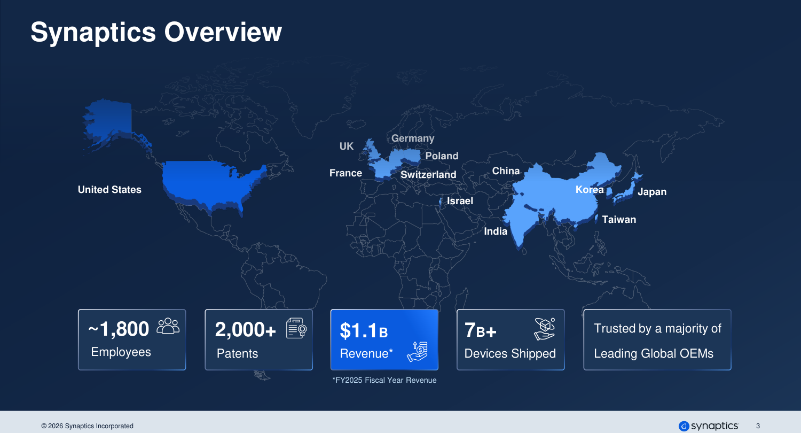

**[Image: Investor_presentation_June_2026.pdf-0003-01.png (1500x810, 231.5KB)]**

<!-- Start of picture text -->
Synaptics Overview Germany UK Poland France Switzerland China United States Korea Japan Israel Taiwan India ~1,800 2,000+ $1.1B 7B+ Trusted by a majority of Employees Patents Revenue* Devices Shipped  Leading Global OEMs *FY2025 Fiscal Year Revenue © 2026 Synaptics Incorporated 3 <!-- End of picture text -->

**[Image: Investor_presentation_June_2026.pdf-0004-00.png (963x11, 1.5KB)]**

## **Powering the Intelligent Edge** 

**Broad Product Portfolio** 

**[Image: Investor_presentation_June_2026.pdf-0004-03.png (72x72, 0.8KB)]**

**Analog Mixed-Signal Multi-Core Processors Wireless Connectivity** 

**Revenue** 

**[Image: Investor_presentation_June_2026.pdf-0004-06.png (88x68, 0.7KB)]**

**Q3’26 Revenue up 10% YoY** 

**Core IoT Product Applications** 

**Strong Margin Profile** 

**[Image: Investor_presentation_June_2026.pdf-0004-10.png (113x113, 5.1KB)]**

**Q3’26 Non-GAAP Gross Q3’26 Core IoT Revenue Margin 53.6%****(1)** **Grew 31% YoY** 

Note: As-reported Q3 fiscal year 2026, not pro forma for any acquisition/divestiture activity over this timeframe 

(1) Non-GAAP gross margin is a non-GAAP measure. For a reconciliation to the most directly comparable financial measure prepared in accordance with GAAP, please see the appendix of this presentation 

© 2026 Synaptics Incorporated 

4 

**[Image: Investor_presentation_June_2026.pdf-0005-00.png (963x11, 1.5KB)]**

## **From Interfaces to Human Experiences** 

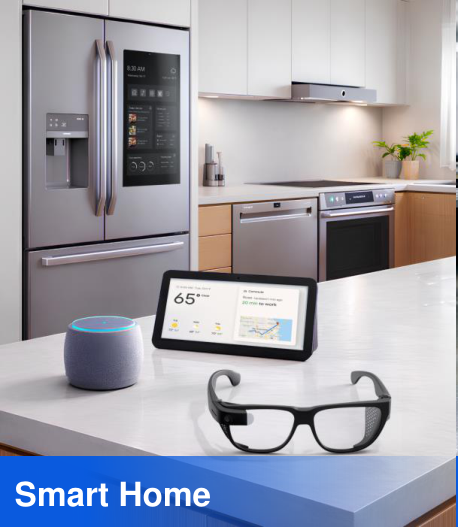

**[Image: Investor_presentation_June_2026.pdf-0005-02.png (458x527, 292.0KB)]**

<!-- Start of picture text -->
Smart Home <!-- End of picture text -->

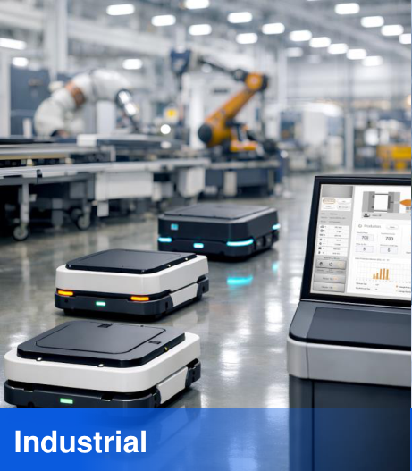

**[Image: Investor_presentation_June_2026.pdf-0005-03.png (461x527, 431.5KB)]**

<!-- Start of picture text -->
Industrial <!-- End of picture text -->

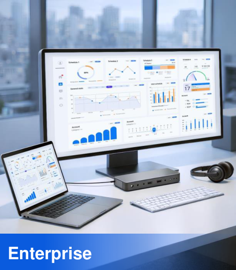

**[Image: Investor_presentation_June_2026.pdf-0005-04.png (461x527, 353.9KB)]**

<!-- Start of picture text -->
Enterprise <!-- End of picture text -->

**[Image: Investor_presentation_June_2026.pdf-0005-05.png (461x74, 33.1KB)]**

<!-- Start of picture text -->
Smart Home <!-- End of picture text -->

**[Image: Investor_presentation_June_2026.pdf-0005-06.png (462x74, 32.4KB)]**

<!-- Start of picture text -->
Industrial <!-- End of picture text -->

**[Image: Investor_presentation_June_2026.pdf-0005-07.png (461x74, 25.7KB)]**

<!-- Start of picture text -->
Enterprise <!-- End of picture text -->

© 2026 Synaptics Incorporated 

5 

**[Image: Investor_presentation_June_2026.pdf-0006-00.png (963x11, 1.5KB)]**

# **Leadership Team** 

**[Image: Investor_presentation_June_2026.pdf-0006-02.png (199x197, 43.3KB)]**

**[Image: Investor_presentation_June_2026.pdf-0006-03.png (196x196, 46.9KB)]**

**[Image: Investor_presentation_June_2026.pdf-0006-04.png (444x485, 76.7KB)]**

**[Image: Investor_presentation_June_2026.pdf-0006-05.png (206x77, 5.6KB)]**

<!-- Start of picture text -->
RAHUL PATEL President & CEO <!-- End of picture text -->

President & CEO Chief Financial Officer 

**[Image: Investor_presentation_June_2026.pdf-0006-07.png (199x197, 45.0KB)]**

**[Image: Investor_presentation_June_2026.pdf-0006-08.png (199x197, 44.4KB)]**

#### **SATISH GANESAN** 

#### **VIKRAM GUPTA** 

SVP & GM, of Edge Interface & SVP & GM, of Edge Compute and Sensing, Chief Strategy Officer Connectivity, Chief Product Officer 

**[Image: Investor_presentation_June_2026.pdf-0006-12.png (197x197, 54.7KB)]**

**[Image: Investor_presentation_June_2026.pdf-0006-13.png (197x197, 47.3KB)]**

**LISA BODENSTEINER JAVIER DEL PRADO** Senior Vice President, Chief Legal Officer Global Operations 

**[Image: Investor_presentation_June_2026.pdf-0006-15.png (197x197, 49.0KB)]**

**[Image: Investor_presentation_June_2026.pdf-0006-16.png (199x197, 41.0KB)]**

#### **LORI STAHL** 

#### **ERIC STAUFFER** 

Global Head, Sales & Marketing 

Chief People Officer 

© 2026 Synaptics Incorporated 

6 

**[Image: Investor_presentation_June_2026.pdf-0007-00.png (962x10, 1.4KB)]**

**[Image: Investor_presentation_June_2026.pdf-0007-01.png (172x776, 127.5KB)]**

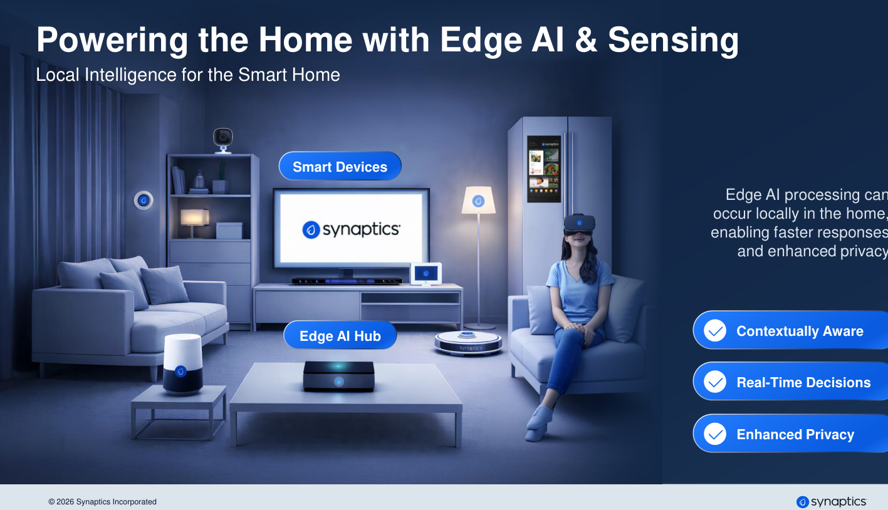

**[Image: Investor_presentation_June_2026.pdf-0007-02.png (1417x814, 877.8KB)]**

<!-- Start of picture text -->
Powering the Home with Edge AI & Sensing Local Intelligence for the Smart Home Smart Devices Edge AI processing can occur locally in the home, enabling faster responses and enhanced privacy Contextually Aware Edge AI Hub Real-Time Decisions Enhanced Privacy © 2026 Synaptics Incorporated <!-- End of picture text -->

**Smart Devices** Edge AI processing can occur locally in the home, enabling faster responses and enhanced privacy **Contextually Aware Edge AI Hub Real-Time Decisions Enhanced Privacy** 

**[Image: Investor_presentation_June_2026.pdf-0007-04.png (334x65, 8.2KB)]**

<!-- Start of picture text -->
Contextually Aware <!-- End of picture text -->

**[Image: Investor_presentation_June_2026.pdf-0007-05.png (334x66, 8.2KB)]**

<!-- Start of picture text -->
Real-Time Decisions <!-- End of picture text -->

**[Image: Investor_presentation_June_2026.pdf-0007-06.png (334x66, 7.7KB)]**

<!-- Start of picture text -->
Enhanced Privacy <!-- End of picture text -->

7 

**[Image: Investor_presentation_June_2026.pdf-0008-00.png (963x11, 1.5KB)]**

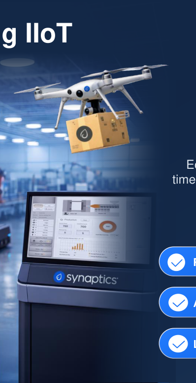

**[Image: Investor_presentation_June_2026.pdf-0008-01.png (398x776, 319.4KB)]**

**Edge AI & Sensing Fueling IIoT** Intelligent, Unified Systems 

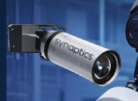

**[Image: Investor_presentation_June_2026.pdf-0008-03.png (173x126, 40.4KB)]**

**Industrial Edge AI Controller Autonomous Systems UAV** 

**[Image: Investor_presentation_June_2026.pdf-0008-05.png (123x51, 4.9KB)]**

<!-- Start of picture text -->
UAV <!-- End of picture text -->

Edge AI enables reliable, realtime control in industrial systems where safety, uptime, and autonomy are critical 

**[Image: Investor_presentation_June_2026.pdf-0008-07.png (463x63, 11.5KB)]**

<!-- Start of picture text -->
Real-Time Control Supporting Safety <!-- End of picture text -->

**Real-Time Control Supporting Safety Always-On Reliability Lower Total Cost of Ownership** 

**[Image: Investor_presentation_June_2026.pdf-0008-09.png (463x66, 9.4KB)]**

<!-- Start of picture text -->
Always-On Reliability <!-- End of picture text -->

**[Image: Investor_presentation_June_2026.pdf-0008-10.png (461x66, 10.9KB)]**

<!-- Start of picture text -->
Lower Total Cost of Ownership <!-- End of picture text -->

© 2026 Synaptics Incorporated 

8 

**[Image: Investor_presentation_June_2026.pdf-0009-00.png (963x11, 1.4KB)]**

## **Edge AI & Intelligence Sensing for Personal Devices** 

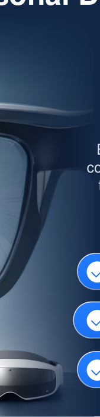

**[Image: Investor_presentation_June_2026.pdf-0009-02.png (169x701, 91.0KB)]**

Intelligence That Moves with You 

Edge AI brings intelligent, context-aware experiences to personal devices while enhancing user privacy. 

**[Image: Investor_presentation_June_2026.pdf-0009-05.png (39x38, 1.6KB)]**

**Personal Edge AI** 

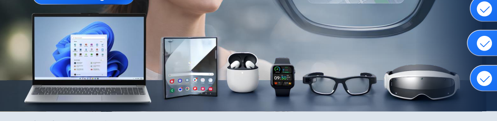

**[Image: Investor_presentation_June_2026.pdf-0009-07.png (1169x287, 368.1KB)]**

**Agentic Edge AI** 

**[Image: Investor_presentation_June_2026.pdf-0009-09.png (387x64, 10.3KB)]**

<!-- Start of picture text -->
Enhanced Privacy by Design <!-- End of picture text -->

**Enhanced Privacy by Design Context-Aware Processing** 

**[Image: Investor_presentation_June_2026.pdf-0009-11.png (363x63, 10.9KB)]**

<!-- Start of picture text -->
Context-Aware Processing <!-- End of picture text -->

© 2026 Synaptics Incorporated 

9 

**[Image: Investor_presentation_June_2026.pdf-0010-00.png (963x11, 1.4KB)]**

# **Shaping Physical AI & Robotics** 

Real-Time Intelligence Where Machines Sense, Decide, and Act 

**Autonomous Robots** 

**Robotic Systems** 

**[Image: Investor_presentation_June_2026.pdf-0010-05.png (170x701, 90.3KB)]**

Edge AI is designed to enable robots to operate with advanced perception and decisionmaking by processing vision, touch, audio, and contextual data locally to support fast response, safety, and reliable operation. **Real-Time Perception & Control Autonomous Edge Decision-Making Reliable, Continuous Operation** 

**[Image: Investor_presentation_June_2026.pdf-0010-07.png (470x65, 12.1KB)]**

<!-- Start of picture text -->
Real-Time Perception & Control <!-- End of picture text -->

**[Image: Investor_presentation_June_2026.pdf-0010-08.png (470x66, 12.6KB)]**

<!-- Start of picture text -->
Autonomous Edge Decision-Making <!-- End of picture text -->

**[Image: Investor_presentation_June_2026.pdf-0010-09.png (470x66, 12.9KB)]**

<!-- Start of picture text -->
Reliable, Continuous Operation <!-- End of picture text -->

© 2026 Synaptics Incorporated 

10 

**[Image: Investor_presentation_June_2026.pdf-0011-00.png (963x11, 1.9KB)]**

**[Image: Investor_presentation_June_2026.pdf-0011-01.png (555x828, 192.8KB)]**

<!-- Start of picture text -->
11 <!-- End of picture text -->

**[Image: Investor_presentation_June_2026.pdf-0011-02.png (697x65, 12.3KB)]**

<!-- Start of picture text -->
Edge AI Processors & <!-- End of picture text -->

**[Image: Investor_presentation_June_2026.pdf-0011-03.png (403x66, 7.1KB)]**

<!-- Start of picture text -->
Connectivity <!-- End of picture text -->

**© 2026 Synaptics Incorporated** 

**[Image: Investor_presentation_June_2026.pdf-0012-00.png (963x11, 1.5KB)]**

## **AI is Unlocking the Potential of Edge IoT Processors** 

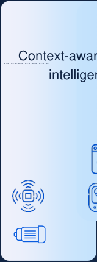

**[Image: Investor_presentation_June_2026.pdf-0012-02.png (159x430, 14.1KB)]**

<!-- Start of picture text -->
Conte <!-- End of picture text -->

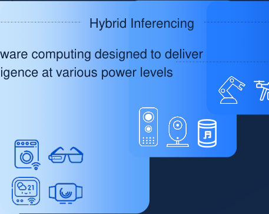

**[Image: Investor_presentation_June_2026.pdf-0012-03.png (457x363, 43.9KB)]**

<!-- Start of picture text -->
Hybrid Inferencing xt-aware computing designed to deliver intelligence at various power levels <!-- End of picture text -->

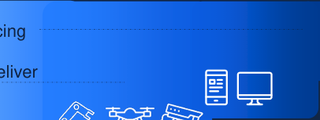

**[Image: Investor_presentation_June_2026.pdf-0012-04.png (406x153, 14.2KB)]**

**[Image: Investor_presentation_June_2026.pdf-0012-05.png (62x56, 3.0KB)]**

**[Image: Investor_presentation_June_2026.pdf-0012-06.png (57x57, 3.7KB)]**

**[Image: Investor_presentation_June_2026.pdf-0012-07.png (89x91, 5.0KB)]**

**[Image: Investor_presentation_June_2026.pdf-0012-08.png (88x88, 3.9KB)]**

**[Image: Investor_presentation_June_2026.pdf-0012-09.png (91x57, 4.0KB)]**

**[Image: Investor_presentation_June_2026.pdf-0012-10.png (397x93, 14.2KB)]**

<!-- Start of picture text -->
Multi-modal workloads Vision, Audio, Video, Voice <!-- End of picture text -->

**[Image: Investor_presentation_June_2026.pdf-0012-11.png (397x93, 13.1KB)]**

<!-- Start of picture text -->
Adaptive hardware Context-aware compute <!-- End of picture text -->

**[Image: Investor_presentation_June_2026.pdf-0012-12.png (397x93, 13.5KB)]**

<!-- Start of picture text -->
Market segments Consumer, Enterprise, Industrial <!-- End of picture text -->

© 2026 Synaptics Incorporated 

12 

**[Image: Investor_presentation_June_2026.pdf-0013-00.png (963x11, 1.6KB)]**

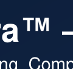

**[Image: Investor_presentation_June_2026.pdf-0013-01.png (120x114, 3.7KB)]**

# **Astra — AI-Native Compute** 

Advancing Compute Flexibility for **IoT Products** 

**[Image: Investor_presentation_June_2026.pdf-0013-04.png (9x56, 0.4KB)]**

**[Image: Investor_presentation_June_2026.pdf-0013-05.png (9x55, 0.4KB)]**

**[Image: Investor_presentation_June_2026.pdf-0013-06.png (9x55, 0.4KB)]**

**Compute Adaptive AI Unified Software Partner Solution Wireless Solutions Framework Experience Ecosystem Connectivity** 

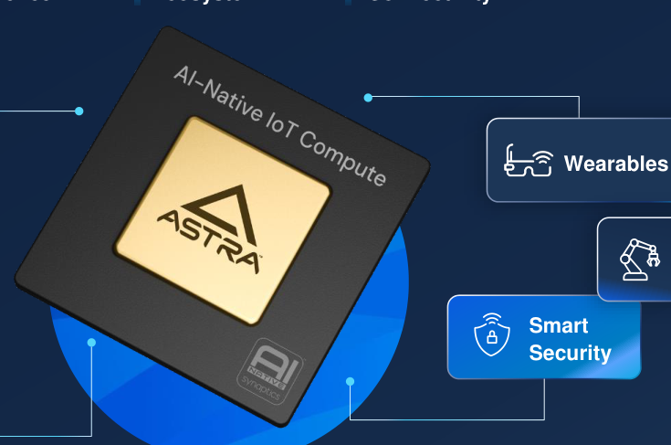

**[Image: Investor_presentation_June_2026.pdf-0013-08.png (735x487, 154.1KB)]**

<!-- Start of picture text -->
Wearables Smart Security <!-- End of picture text -->

**[Image: Investor_presentation_June_2026.pdf-0013-09.png (266x76, 2.0KB)]**

**[Image: Investor_presentation_June_2026.pdf-0013-10.png (57x57, 2.9KB)]**

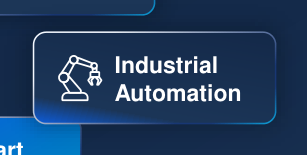

**[Image: Investor_presentation_June_2026.pdf-0013-11.png (307x155, 13.8KB)]**

<!-- Start of picture text -->
Industrial Automation <!-- End of picture text -->

**[Image: Investor_presentation_June_2026.pdf-0013-12.png (193x94, 8.6KB)]**

<!-- Start of picture text -->
Smart Home <!-- End of picture text -->

**[Image: Investor_presentation_June_2026.pdf-0013-13.png (57x57, 2.6KB)]**

**[Image: Investor_presentation_June_2026.pdf-0013-14.png (315x101, 3.9KB)]**

© 2026 Synaptics Incorporated 

13 

**[Image: Investor_presentation_June_2026.pdf-0014-00.png (963x11, 1.5KB)]**

**Intelligent Connectivity** Scalable wireless for modern **IoT systems Expertise Innovation Performance AI-Native Compute IoT Optimized** 

**[Image: Investor_presentation_June_2026.pdf-0014-02.png (9x49, 0.3KB)]**

**[Image: Investor_presentation_June_2026.pdf-0014-03.png (9x46, 0.3KB)]**

**[Image: Investor_presentation_June_2026.pdf-0014-04.png (9x46, 0.3KB)]**

**[Image: Investor_presentation_June_2026.pdf-0014-05.png (9x46, 0.3KB)]**

**[Image: Investor_presentation_June_2026.pdf-0014-06.png (7x46, 0.3KB)]**

**[Image: Investor_presentation_June_2026.pdf-0014-07.png (261x116, 9.5KB)]**

<!-- Start of picture text -->
Wider 25xx Channel <!-- End of picture text -->

**[Image: Investor_presentation_June_2026.pdf-0014-08.png (263x118, 10.0KB)]**

<!-- Start of picture text -->
Higher 50%% Throughput <!-- End of picture text -->

Wider Higher **25xx** Channel **50%%** Throughput Advanced Device Security Updates 

**[Image: Investor_presentation_June_2026.pdf-0014-10.png (65x71, 2.5KB)]**

**[Image: Investor_presentation_June_2026.pdf-0014-11.png (63x63, 2.3KB)]**

Wi-Fi, WFA Bluetooth Certified & GNSS 

**[Image: Investor_presentation_June_2026.pdf-0014-13.png (86x76, 4.1KB)]**

**Robust Interoperability** 

**Connectivity Roadmap** 

**[Image: Investor_presentation_June_2026.pdf-0014-16.png (62x62, 1.8KB)]**

**[Image: Investor_presentation_June_2026.pdf-0014-17.png (48x48, 1.2KB)]**

**[Image: Investor_presentation_June_2026.pdf-0014-18.png (70x70, 2.0KB)]**

**[Image: Investor_presentation_June_2026.pdf-0014-19.png (54x54, 2.1KB)]**

**Smart Home Automotive PC/Display Wearables Mobile Infrastructure** 

**[Image: Investor_presentation_June_2026.pdf-0014-21.png (52x52, 2.2KB)]**

**Wi-Fi 6 / 7 / 8** Scalable across generations **GNSS** Integrated across the portfolio 

**GNSS** 

**Bluetooth** Optimized for low **(Classic & LE)** power 

© 2026 Synaptics Incorporated 

14 

**[Image: Investor_presentation_June_2026.pdf-0015-00.png (963x11, 1.5KB)]**

# **Open, Scalable, Developer-First Platforms** 

**Broad Partner & Platform Ecosystem** 

**Developer Hub** 

**[Image: Investor_presentation_June_2026.pdf-0015-04.png (349x61, 9.0KB)]**

<!-- Start of picture text -->
Reference Architectures <!-- End of picture text -->

**[Image: Investor_presentation_June_2026.pdf-0015-05.png (315x61, 8.0KB)]**

<!-- Start of picture text -->
System-on-Modules <!-- End of picture text -->

**System-on-Modules Reference Architectures AI Model Partners Market Vertical Dev Kits Production Grade OS/Distros Scaling Partners** 

**[Image: Investor_presentation_June_2026.pdf-0015-07.png (349x61, 8.8KB)]**

<!-- Start of picture text -->
Market Vertical Dev Kits <!-- End of picture text -->

**[Image: Investor_presentation_June_2026.pdf-0015-08.png (315x61, 7.8KB)]**

<!-- Start of picture text -->
AI Model Partners <!-- End of picture text -->

**[Image: Investor_presentation_June_2026.pdf-0015-09.png (395x61, 11.1KB)]**

<!-- Start of picture text -->
Production Grade OS/Distros <!-- End of picture text -->

**[Image: Investor_presentation_June_2026.pdf-0015-10.png (264x61, 7.2KB)]**

<!-- Start of picture text -->
Scaling Partners <!-- End of picture text -->

**[Image: Investor_presentation_June_2026.pdf-0015-11.png (123x20, 2.8KB)]**

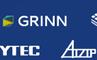

**[Image: Investor_presentation_June_2026.pdf-0015-12.png (142x88, 3.6KB)]**

**[Image: Investor_presentation_June_2026.pdf-0015-13.png (107x30, 2.9KB)]**

**[Image: Investor_presentation_June_2026.pdf-0015-14.png (74x40, 1.8KB)]**

**[Image: Investor_presentation_June_2026.pdf-0015-15.png (82x22, 3.2KB)]**

**[Image: Investor_presentation_June_2026.pdf-0015-16.png (80x36, 1.7KB)]**

**[Image: Investor_presentation_June_2026.pdf-0015-17.png (56x54, 2.2KB)]**

**[Image: Investor_presentation_June_2026.pdf-0015-18.png (101x24, 2.9KB)]**

**Open Software & SDKs** 

© 2026 Synaptics Incorporated 

15 

**[Image: Investor_presentation_June_2026.pdf-0016-00.png (963x11, 1.9KB)]**

**[Image: Investor_presentation_June_2026.pdf-0016-01.png (555x828, 193.0KB)]**

<!-- Start of picture text -->
16 <!-- End of picture text -->

**[Image: Investor_presentation_June_2026.pdf-0016-02.png (842x66, 13.5KB)]**

<!-- Start of picture text -->
Enterprise & Mobile Touch <!-- End of picture text -->

**© 2026 Synaptics Incorporated** 

**[Image: Investor_presentation_June_2026.pdf-0017-00.png (963x11, 1.5KB)]**

# **Franchise Enterprise Portfolio** 

**[Image: Investor_presentation_June_2026.pdf-0017-02.png (337x84, 11.9KB)]**

<!-- Start of picture text -->
Focused incremental investments <!-- End of picture text -->

**[Image: Investor_presentation_June_2026.pdf-0017-03.png (365x84, 12.7KB)]**

<!-- Start of picture text -->
Strong cash flows fund Core IoT growth <!-- End of picture text -->

**[Image: Investor_presentation_June_2026.pdf-0017-04.png (264x82, 9.9KB)]**

<!-- Start of picture text -->
Leader in most product areas <!-- End of picture text -->

**[Image: Investor_presentation_June_2026.pdf-0017-05.png (243x82, 7.9KB)]**

<!-- Start of picture text -->
High profitability <!-- End of picture text -->

**Leader in most Focused incremental High Strong cash flows fund product areas investments profitability Core IoT growth** 

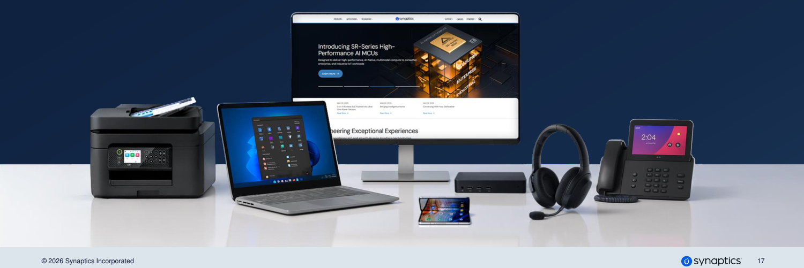

**[Image: Investor_presentation_June_2026.pdf-0017-07.png (1500x501, 423.9KB)]**

<!-- Start of picture text -->
© 2026 Synaptics Incorporated 17 <!-- End of picture text -->

**[Image: Investor_presentation_June_2026.pdf-0018-00.png (963x11, 4.8KB)]**

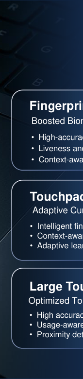

**[Image: Investor_presentation_June_2026.pdf-0018-01.png (171x780, 82.5KB)]**

<!-- Start of picture text -->
Fingerprint • • • Touchpad • • • • • • <!-- End of picture text -->

# **AI-Enhanced Touch & Interaction** 

_AI PC: Fingerprint, Touchpad, Large-Format Touch_ 

### **Fingerprint** 

Boosted Biometric Security 

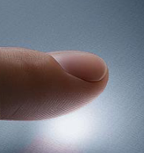

**[Image: Investor_presentation_June_2026.pdf-0018-06.png (182x193, 49.9KB)]**

- High-accuracy fingerprint recognition 

- Liveness and spoof detection 

- Context-aware sensing for reliability 

### **Touchpad** 

Adaptive Cursor Management 

- Intelligent finger vs. palm detection 

- Context-aware touch pattern analysis 

- Adaptive learning for user behavior 

### **Large Touch** 

Optimized Touch Experience 

- High accuracy and fast response 

- Usage-aware behavior across devices 

- Proximity detection and noise mitigation 

**[Image: Investor_presentation_June_2026.pdf-0018-20.png (76x76, 5.0KB)]**

**[Image: Investor_presentation_June_2026.pdf-0018-21.png (76x78, 2.6KB)]**

© 2026 Synaptics Incorporated 

18 

**[Image: Investor_presentation_June_2026.pdf-0019-00.png (962x10, 1.6KB)]**

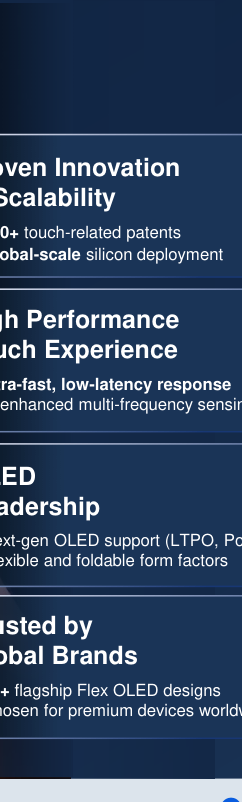

**[Image: Investor_presentation_June_2026.pdf-0019-01.png (242x802, 52.1KB)]**

<!-- Start of picture text -->
Proven Innovation touch-related patents Global-scale  silicon deployment High Performance Touch Experience Ultra-fast, low-latency response AI-enhanced multi-frequency sensing Flexible and foldable form factors Global Brands flagship Flex OLED designs Chosen for premium devices worldwide <!-- End of picture text -->

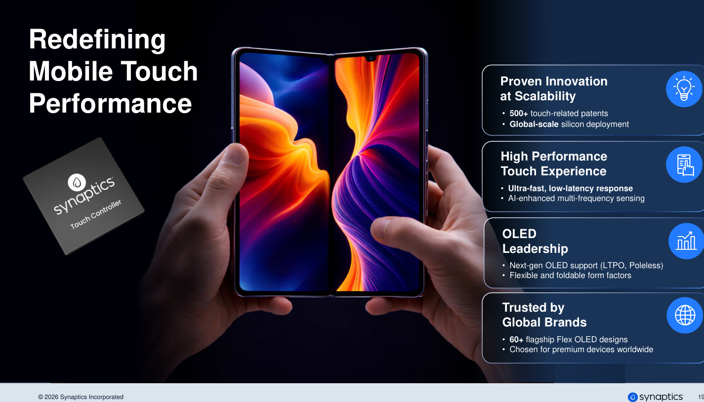

**[Image: Investor_presentation_June_2026.pdf-0019-02.png (1425x814, 823.3KB)]**

<!-- Start of picture text -->
Redefining Mobile Touch Proven Innovation Performance at Scalability • 500+  touch-related patents • Global-scale  silicon deployment High Performance Touch Experience • Ultra-fast, low-latency response • AI-enhanced multi-frequency sensing OLED Leadership • Next-gen OLED support (LTPO, Poleless) • Flexible and foldable form factors Trusted by Global Brands • 60+  flagship Flex OLED designs • Chosen for premium devices worldwide © 2026 Synaptics Incorporated 19 <!-- End of picture text -->

19 

**[Image: Investor_presentation_June_2026.pdf-0020-00.png (963x11, 1.9KB)]**

**[Image: Investor_presentation_June_2026.pdf-0020-01.png (555x828, 193.1KB)]**

<!-- Start of picture text -->
20 <!-- End of picture text -->

**[Image: Investor_presentation_June_2026.pdf-0020-02.png (5x3, 0.1KB)]**

**[Image: Investor_presentation_June_2026.pdf-0020-03.png (330x53, 4.9KB)]**

<!-- Start of picture text -->
Financials <!-- End of picture text -->

**© 2026 Synaptics Incorporated** 

**[Image: Investor_presentation_June_2026.pdf-0021-00.png (963x11, 1.5KB)]**

## **Q3 ‘FY26 Financial Highlights** 

- Revenue of **$294.2 million** , up 10% YoY 

- Core IoT revenue increased 31% YoY 

- GAAP & Non-GAAP gross margins(1) were above the midpoint of the guidance 

   - GAAP gross margin of 45.3% 

   - Non-GAAP gross margin of 53.6% 

### Mobile 

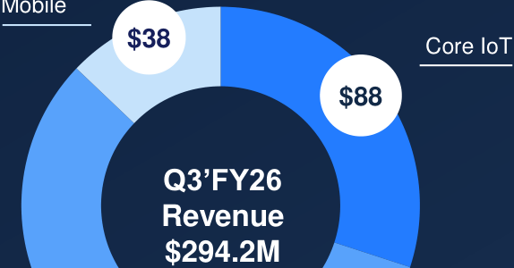

**[Image: Investor_presentation_June_2026.pdf-0021-08.png (574x300, 26.6KB)]**

<!-- Start of picture text -->
$38 Core IoT $88 Q3’FY26 Revenue $294.2M <!-- End of picture text -->

- GAAP loss per share of $0.21 

- Non-GAAP diluted **earnings per share**(1) **of $1.09** 

- Cash flow from operations of **$22 million** 

> Enterprise **$168** 

& Auto 

(1) Non-GAAP gross margin and non-GAAP diluted earnings per share are non-GAAP measures. See the tables at the end of this presentation for a reconciliation of GAAP results to non-GAAP financial measures 

© 2026 Synaptics Incorporated 

21 

**[Image: Investor_presentation_June_2026.pdf-0022-00.png (963x11, 1.5KB)]**

# **Core IoT Revenue Expansion** 

47% Core IoT revenue CAGR 

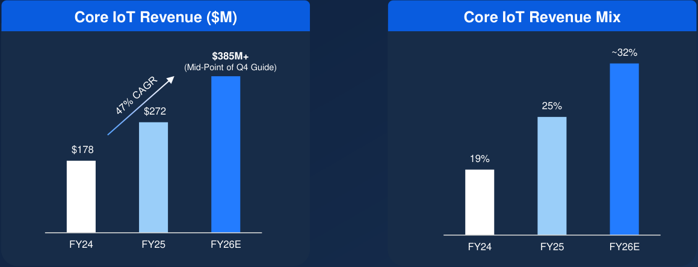

**[Image: Investor_presentation_June_2026.pdf-0022-03.png (1160x445, 30.1KB)]**

<!-- Start of picture text -->
Core IoT Revenue ($M) Core IoT Revenue Mix $385M+ ~32% (Mid-Point of Q4 Guide) 25% $272 $178 19% FY24 FY25 FY26E FY24 FY25 FY26E <!-- End of picture text -->

Note: 

FY26E is based on the mid-point of the guidance for fiscal Q4 and represents an estimate CAGR is calculated from FY24 to FY26E and includes forward-looking assumptions; actual results may differ materially 

**© 2026 Synaptics Incorporated** 

**22** 

**[Image: Investor_presentation_June_2026.pdf-0023-00.png (963x11, 1.5KB)]**

## **YoY Growth Driven by Core IoT Strength** 

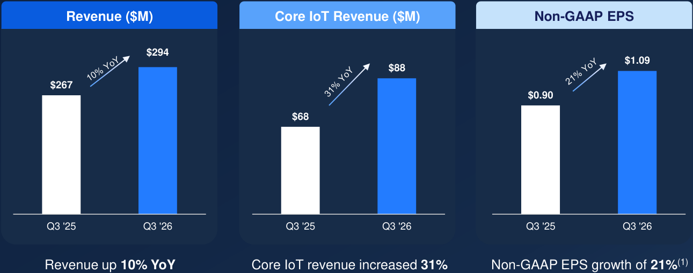

**[Image: Investor_presentation_June_2026.pdf-0023-02.png (1291x510, 57.7KB)]**

<!-- Start of picture text -->
Revenue ($M) Core IoT Revenue ($M) Non-GAAP EPS $294 $1.09 $88 $267 $0.90 $68  Q3 '25 Q3 '26  Q3 '25 Q3 '26  Q3 '25 Q3 '26 Revenue up  10% YoY Core IoT revenue increased  31% Non-GAAP EPS growth of  21% (1) <!-- End of picture text -->

(1) Non-GAAP EPS is a non-GAAP measure. For a reconciliation to the most directly comparable financial measure prepared in accordance with GAAP, please see the appendix of this presentation 

**© 2026 Synaptics Incorporated** 

**23** 

**[Image: Investor_presentation_June_2026.pdf-0024-00.png (963x11, 1.5KB)]**

# **Quarterly Revenue and Gross Margin Trend** 

**Non-GAAP Gross Margin**(1) 

**[Image: Investor_presentation_June_2026.pdf-0024-03.png (59x158, 0.8KB)]**

**[Image: Investor_presentation_June_2026.pdf-0024-04.png (60x243, 0.9KB)]**

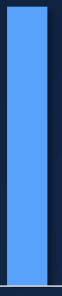

**[Image: Investor_presentation_June_2026.pdf-0024-05.png (62x296, 1.1KB)]**

**[Image: Investor_presentation_June_2026.pdf-0024-06.png (61x348, 1.2KB)]**

**[Image: Investor_presentation_June_2026.pdf-0024-07.png (59x304, 1.0KB)]**

**[Image: Investor_presentation_June_2026.pdf-0024-08.png (57x204, 0.8KB)]**

**[Image: Investor_presentation_June_2026.pdf-0024-09.png (57x200, 0.8KB)]**

**[Image: Investor_presentation_June_2026.pdf-0024-10.png (55x194, 0.8KB)]**

**[Image: Investor_presentation_June_2026.pdf-0024-11.png (57x206, 0.9KB)]**

**[Image: Investor_presentation_June_2026.pdf-0024-12.png (57x231, 0.9KB)]**

**[Image: Investor_presentation_June_2026.pdf-0024-13.png (57x349, 1.1KB)]**

**[Image: Investor_presentation_June_2026.pdf-0024-14.png (57x349, 1.1KB)]**

**[Image: Investor_presentation_June_2026.pdf-0024-15.png (57x345, 1.2KB)]**

**[Image: Investor_presentation_June_2026.pdf-0024-16.png (57x349, 1.3KB)]**

**[Image: Investor_presentation_June_2026.pdf-0024-17.png (57x349, 1.3KB)]**

Note: As-reported, not proforma for any acquisition/divestiture activity over this timeframe **(1)** Non-GAAP gross margin is a non-GAAP measure. See the tables at the end of this presentation for a reconciliation of GAAP results to non-GAAP financial measures 

**© 2026 Synaptics Incorporated** 

**24** 

**[Image: Investor_presentation_June_2026.pdf-0025-00.png (963x11, 1.5KB)]**

## **Q3 ‘FY26 Financial Results** 

|**$M (except EPS)**|**Q3'25**|**Q2’26**|**Q3'26**|**QoQ**|**YoY**|
|---|---|---|---|---|---|
|**Revenue**|$266.6|$302.5|$294.2|(3%)|10%|
|**GAAP Gross Margin %**|43.4%|43.5%|45.3%|180 bps|190 bps|
|**GAAP Operating Expenses**|$142.1|$146.8|$146.0|(1%)|3%|
|**GAAP Operating Margin**|-9.9%|-5.0%|-4.3%|70 bps|560 bps|
|**GAAP EPS**|($0.56)|($0.38)|($0.21)|45%|63%|
|**Non-GAAP Gross Margin %**|53.5%|53.6%|53.6%|0 bps|10 bps|
|**Non-GAAP Operating** **Expenses**|$101.2|$104.2|$104.6|0.4%|3%|
|**Non-GAAP Operating Margin**|15.5%|19.2%|18.1%|-110 bps|260 bps|
|**Non-GAAP EPS Diluted**|$0.90|$1.21|$1.09|(10%)|**21%**|

_See the tables at the end of this presentation for a reconciliation of GAAP results to non-GAAP financial measures_ 

© 2026 Synaptics Incorporated 

25 

**[Image: Investor_presentation_June_2026.pdf-0026-00.png (963x11, 1.5KB)]**

# **Capital Allocation Priorities** 

Prioritize Edge AI and Physical AI 

**01. Organic investments** 

**03. Debt management** 

**[Image: Investor_presentation_June_2026.pdf-0026-05.png (89x87, 4.0KB)]**

**[Image: Investor_presentation_June_2026.pdf-0026-06.png (89x89, 8.0KB)]**

Accretive opportunities 

**02. Inorganic opportunities** 

Opportunistic, no periodic commitment 

**04. Share repurchases** 

**[Image: Investor_presentation_June_2026.pdf-0026-11.png (86x89, 6.2KB)]**

**[Image: Investor_presentation_June_2026.pdf-0026-12.png (86x87, 7.9KB)]**

© 2026 Synaptics Incorporated 

26 

**[Image: Investor_presentation_June_2026.pdf-0027-00.png (963x11, 1.5KB)]**

# **Summary** 

**[Image: Investor_presentation_June_2026.pdf-0027-02.png (86x85, 3.4KB)]**

**Focus on Edge AI & IoT growth markets** 

**[Image: Investor_presentation_June_2026.pdf-0027-04.png (1024x115, 21.8KB)]**

<!-- Start of picture text -->
Strong history of positive cash flow generation <!-- End of picture text -->

**Strong history of positive cash flow generation Disciplined stewardship of shareholder capital Established relationships with a diversified set of customers Strong leadership team driving growth** 

**[Image: Investor_presentation_June_2026.pdf-0027-06.png (1024x116, 24.3KB)]**

<!-- Start of picture text -->
Disciplined stewardship of shareholder capital <!-- End of picture text -->

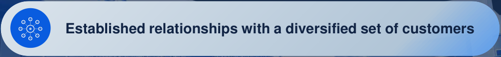

**[Image: Investor_presentation_June_2026.pdf-0027-07.png (1024x118, 38.1KB)]**

<!-- Start of picture text -->
Established relationships with a diversified set of customers <!-- End of picture text -->

**[Image: Investor_presentation_June_2026.pdf-0027-08.png (1024x118, 39.8KB)]**

<!-- Start of picture text -->
Strong leadership team driving growth <!-- End of picture text -->

© 2026 Synaptics Incorporated 

27 

**[Image: Investor_presentation_June_2026.pdf-0028-00.png (963x11, 1.9KB)]**

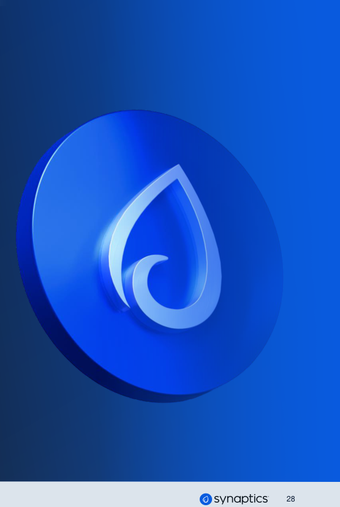

**[Image: Investor_presentation_June_2026.pdf-0028-01.png (555x828, 193.1KB)]**

<!-- Start of picture text -->
28 <!-- End of picture text -->

**[Image: Investor_presentation_June_2026.pdf-0028-02.png (5x3, 0.1KB)]**

**[Image: Investor_presentation_June_2026.pdf-0028-03.png (307x66, 5.4KB)]**

<!-- Start of picture text -->
Appendix <!-- End of picture text -->

**© 2026 Synaptics Incorporated** 

**[Image: Investor_presentation_June_2026.pdf-0029-00.png (963x11, 1.5KB)]**

## **GAAP to Non-GAAP Reconciliation Tables** 

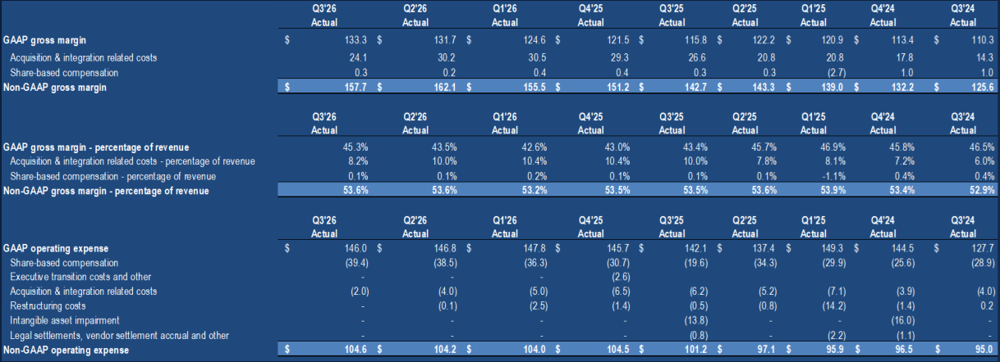

**[Image: Investor_presentation_June_2026.pdf-0029-02.png (1218x442, 180.6KB)]**

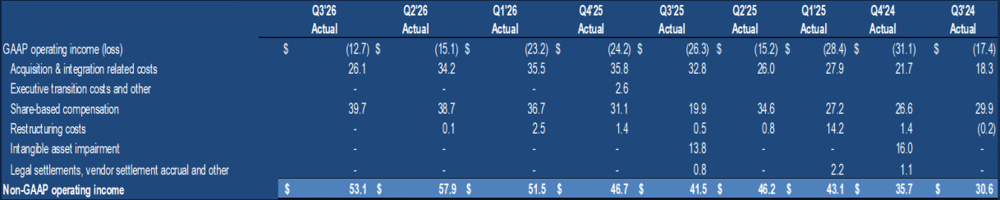

**[Image: Investor_presentation_June_2026.pdf-0029-03.png (1218x244, 89.2KB)]**

**© 2026 Synaptics Incorporated** 

**29** 

**[Image: Investor_presentation_June_2026.pdf-0030-00.png (963x11, 1.5KB)]**

## **GAAP to Non-GAAP Reconciliation Tables - continued** 

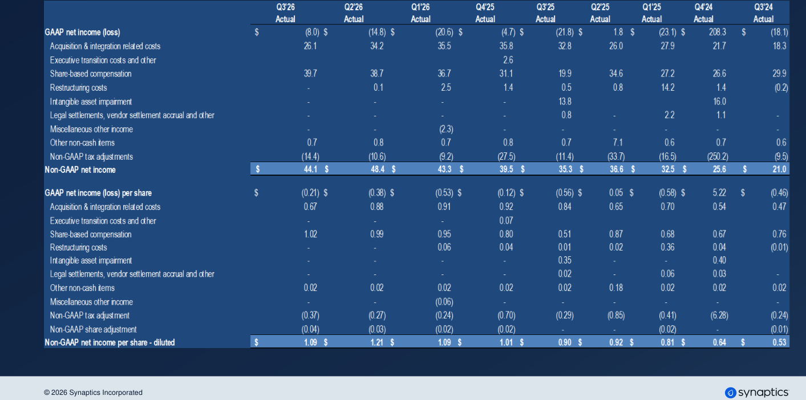

**[Image: Investor_presentation_June_2026.pdf-0030-02.png (1413x701, 233.6KB)]**

<!-- Start of picture text -->
© 2026 Synaptics Incorporated <!-- End of picture text -->

**30** 

---

## Extracted Images

| # | File | Dimensions | Size |
|---|------|------------|------|
| 1 | Investor_presentation_June_2026.pdf-0001-00.png | 963x11 | 1.5KB |
| 2 | Investor_presentation_June_2026.pdf-0001-01.png | 266x55 | 9.3KB |
| 3 | Investor_presentation_June_2026.pdf-0001-02.png | 3x3 | 0.1KB |
| 4 | Investor_presentation_June_2026.pdf-0002-00.png | 963x11 | 1.5KB |
| 5 | Investor_presentation_June_2026.pdf-0003-00.png | 962x10 | 1.3KB |
| 6 | Investor_presentation_June_2026.pdf-0003-01.png | 1500x810 | 231.5KB |
| 7 | Investor_presentation_June_2026.pdf-0004-00.png | 963x11 | 1.5KB |
| 8 | Investor_presentation_June_2026.pdf-0004-03.png | 72x72 | 0.8KB |
| 9 | Investor_presentation_June_2026.pdf-0004-06.png | 88x68 | 0.7KB |
| 10 | Investor_presentation_June_2026.pdf-0004-10.png | 113x113 | 5.1KB |
| 11 | Investor_presentation_June_2026.pdf-0005-00.png | 963x11 | 1.5KB |
| 12 | Investor_presentation_June_2026.pdf-0005-02.png | 458x527 | 292.0KB |
| 13 | Investor_presentation_June_2026.pdf-0005-03.png | 461x527 | 431.5KB |
| 14 | Investor_presentation_June_2026.pdf-0005-04.png | 461x527 | 353.9KB |
| 15 | Investor_presentation_June_2026.pdf-0005-05.png | 461x74 | 33.1KB |
| 16 | Investor_presentation_June_2026.pdf-0005-06.png | 462x74 | 32.4KB |
| 17 | Investor_presentation_June_2026.pdf-0005-07.png | 461x74 | 25.7KB |
| 18 | Investor_presentation_June_2026.pdf-0006-00.png | 963x11 | 1.5KB |
| 19 | Investor_presentation_June_2026.pdf-0006-02.png | 199x197 | 43.3KB |
| 20 | Investor_presentation_June_2026.pdf-0006-03.png | 196x196 | 46.9KB |
| 21 | Investor_presentation_June_2026.pdf-0006-04.png | 444x485 | 76.7KB |
| 22 | Investor_presentation_June_2026.pdf-0006-05.png | 206x77 | 5.6KB |
| 23 | Investor_presentation_June_2026.pdf-0006-07.png | 199x197 | 45.0KB |
| 24 | Investor_presentation_June_2026.pdf-0006-08.png | 199x197 | 44.4KB |
| 25 | Investor_presentation_June_2026.pdf-0006-12.png | 197x197 | 54.7KB |
| 26 | Investor_presentation_June_2026.pdf-0006-13.png | 197x197 | 47.3KB |
| 27 | Investor_presentation_June_2026.pdf-0006-15.png | 197x197 | 49.0KB |
| 28 | Investor_presentation_June_2026.pdf-0006-16.png | 199x197 | 41.0KB |
| 29 | Investor_presentation_June_2026.pdf-0007-00.png | 962x10 | 1.4KB |
| 30 | Investor_presentation_June_2026.pdf-0007-01.png | 172x776 | 127.5KB |
| 31 | Investor_presentation_June_2026.pdf-0007-02.png | 1417x814 | 877.8KB |
| 32 | Investor_presentation_June_2026.pdf-0007-04.png | 334x65 | 8.2KB |
| 33 | Investor_presentation_June_2026.pdf-0007-05.png | 334x66 | 8.2KB |
| 34 | Investor_presentation_June_2026.pdf-0007-06.png | 334x66 | 7.7KB |
| 35 | Investor_presentation_June_2026.pdf-0008-00.png | 963x11 | 1.5KB |
| 36 | Investor_presentation_June_2026.pdf-0008-01.png | 398x776 | 319.4KB |
| 37 | Investor_presentation_June_2026.pdf-0008-03.png | 173x126 | 40.4KB |
| 38 | Investor_presentation_June_2026.pdf-0008-05.png | 123x51 | 4.9KB |
| 39 | Investor_presentation_June_2026.pdf-0008-07.png | 463x63 | 11.5KB |
| 40 | Investor_presentation_June_2026.pdf-0008-09.png | 463x66 | 9.4KB |
| 41 | Investor_presentation_June_2026.pdf-0008-10.png | 461x66 | 10.9KB |
| 42 | Investor_presentation_June_2026.pdf-0009-00.png | 963x11 | 1.4KB |
| 43 | Investor_presentation_June_2026.pdf-0009-02.png | 169x701 | 91.0KB |
| 44 | Investor_presentation_June_2026.pdf-0009-05.png | 39x38 | 1.6KB |
| 45 | Investor_presentation_June_2026.pdf-0009-07.png | 1169x287 | 368.1KB |
| 46 | Investor_presentation_June_2026.pdf-0009-09.png | 387x64 | 10.3KB |
| 47 | Investor_presentation_June_2026.pdf-0009-11.png | 363x63 | 10.9KB |
| 48 | Investor_presentation_June_2026.pdf-0010-00.png | 963x11 | 1.4KB |
| 49 | Investor_presentation_June_2026.pdf-0010-05.png | 170x701 | 90.3KB |
| 50 | Investor_presentation_June_2026.pdf-0010-07.png | 470x65 | 12.1KB |
| 51 | Investor_presentation_June_2026.pdf-0010-08.png | 470x66 | 12.6KB |
| 52 | Investor_presentation_June_2026.pdf-0010-09.png | 470x66 | 12.9KB |
| 53 | Investor_presentation_June_2026.pdf-0011-00.png | 963x11 | 1.9KB |
| 54 | Investor_presentation_June_2026.pdf-0011-01.png | 555x828 | 192.8KB |
| 55 | Investor_presentation_June_2026.pdf-0011-02.png | 697x65 | 12.3KB |
| 56 | Investor_presentation_June_2026.pdf-0011-03.png | 403x66 | 7.1KB |
| 57 | Investor_presentation_June_2026.pdf-0012-00.png | 963x11 | 1.5KB |
| 58 | Investor_presentation_June_2026.pdf-0012-02.png | 159x430 | 14.1KB |
| 59 | Investor_presentation_June_2026.pdf-0012-03.png | 457x363 | 43.9KB |
| 60 | Investor_presentation_June_2026.pdf-0012-04.png | 406x153 | 14.2KB |
| 61 | Investor_presentation_June_2026.pdf-0012-05.png | 62x56 | 3.0KB |
| 62 | Investor_presentation_June_2026.pdf-0012-06.png | 57x57 | 3.7KB |
| 63 | Investor_presentation_June_2026.pdf-0012-07.png | 89x91 | 5.0KB |
| 64 | Investor_presentation_June_2026.pdf-0012-08.png | 88x88 | 3.9KB |
| 65 | Investor_presentation_June_2026.pdf-0012-09.png | 91x57 | 4.0KB |
| 66 | Investor_presentation_June_2026.pdf-0012-10.png | 397x93 | 14.2KB |
| 67 | Investor_presentation_June_2026.pdf-0012-11.png | 397x93 | 13.1KB |
| 68 | Investor_presentation_June_2026.pdf-0012-12.png | 397x93 | 13.5KB |
| 69 | Investor_presentation_June_2026.pdf-0013-00.png | 963x11 | 1.6KB |
| 70 | Investor_presentation_June_2026.pdf-0013-01.png | 120x114 | 3.7KB |
| 71 | Investor_presentation_June_2026.pdf-0013-04.png | 9x56 | 0.4KB |
| 72 | Investor_presentation_June_2026.pdf-0013-05.png | 9x55 | 0.4KB |
| 73 | Investor_presentation_June_2026.pdf-0013-06.png | 9x55 | 0.4KB |
| 74 | Investor_presentation_June_2026.pdf-0013-08.png | 735x487 | 154.1KB |
| 75 | Investor_presentation_June_2026.pdf-0013-09.png | 266x76 | 2.0KB |
| 76 | Investor_presentation_June_2026.pdf-0013-10.png | 57x57 | 2.9KB |
| 77 | Investor_presentation_June_2026.pdf-0013-11.png | 307x155 | 13.8KB |
| 78 | Investor_presentation_June_2026.pdf-0013-12.png | 193x94 | 8.6KB |
| 79 | Investor_presentation_June_2026.pdf-0013-13.png | 57x57 | 2.6KB |
| 80 | Investor_presentation_June_2026.pdf-0013-14.png | 315x101 | 3.9KB |
| 81 | Investor_presentation_June_2026.pdf-0014-00.png | 963x11 | 1.5KB |
| 82 | Investor_presentation_June_2026.pdf-0014-02.png | 9x49 | 0.3KB |
| 83 | Investor_presentation_June_2026.pdf-0014-03.png | 9x46 | 0.3KB |
| 84 | Investor_presentation_June_2026.pdf-0014-04.png | 9x46 | 0.3KB |
| 85 | Investor_presentation_June_2026.pdf-0014-05.png | 9x46 | 0.3KB |
| 86 | Investor_presentation_June_2026.pdf-0014-06.png | 7x46 | 0.3KB |
| 87 | Investor_presentation_June_2026.pdf-0014-07.png | 261x116 | 9.5KB |
| 88 | Investor_presentation_June_2026.pdf-0014-08.png | 263x118 | 10.0KB |
| 89 | Investor_presentation_June_2026.pdf-0014-10.png | 65x71 | 2.5KB |
| 90 | Investor_presentation_June_2026.pdf-0014-11.png | 63x63 | 2.3KB |
| 91 | Investor_presentation_June_2026.pdf-0014-13.png | 86x76 | 4.1KB |
| 92 | Investor_presentation_June_2026.pdf-0014-16.png | 62x62 | 1.8KB |
| 93 | Investor_presentation_June_2026.pdf-0014-17.png | 48x48 | 1.2KB |
| 94 | Investor_presentation_June_2026.pdf-0014-18.png | 70x70 | 2.0KB |
| 95 | Investor_presentation_June_2026.pdf-0014-19.png | 54x54 | 2.1KB |
| 96 | Investor_presentation_June_2026.pdf-0014-21.png | 52x52 | 2.2KB |
| 97 | Investor_presentation_June_2026.pdf-0015-00.png | 963x11 | 1.5KB |
| 98 | Investor_presentation_June_2026.pdf-0015-04.png | 349x61 | 9.0KB |
| 99 | Investor_presentation_June_2026.pdf-0015-05.png | 315x61 | 8.0KB |
| 100 | Investor_presentation_June_2026.pdf-0015-07.png | 349x61 | 8.8KB |
| 101 | Investor_presentation_June_2026.pdf-0015-08.png | 315x61 | 7.8KB |
| 102 | Investor_presentation_June_2026.pdf-0015-09.png | 395x61 | 11.1KB |
| 103 | Investor_presentation_June_2026.pdf-0015-10.png | 264x61 | 7.2KB |
| 104 | Investor_presentation_June_2026.pdf-0015-11.png | 123x20 | 2.8KB |
| 105 | Investor_presentation_June_2026.pdf-0015-12.png | 142x88 | 3.6KB |
| 106 | Investor_presentation_June_2026.pdf-0015-13.png | 107x30 | 2.9KB |
| 107 | Investor_presentation_June_2026.pdf-0015-14.png | 74x40 | 1.8KB |
| 108 | Investor_presentation_June_2026.pdf-0015-15.png | 82x22 | 3.2KB |
| 109 | Investor_presentation_June_2026.pdf-0015-16.png | 80x36 | 1.7KB |
| 110 | Investor_presentation_June_2026.pdf-0015-17.png | 56x54 | 2.2KB |
| 111 | Investor_presentation_June_2026.pdf-0015-18.png | 101x24 | 2.9KB |
| 112 | Investor_presentation_June_2026.pdf-0016-00.png | 963x11 | 1.9KB |
| 113 | Investor_presentation_June_2026.pdf-0016-01.png | 555x828 | 193.0KB |
| 114 | Investor_presentation_June_2026.pdf-0016-02.png | 842x66 | 13.5KB |
| 115 | Investor_presentation_June_2026.pdf-0017-00.png | 963x11 | 1.5KB |
| 116 | Investor_presentation_June_2026.pdf-0017-02.png | 337x84 | 11.9KB |
| 117 | Investor_presentation_June_2026.pdf-0017-03.png | 365x84 | 12.7KB |
| 118 | Investor_presentation_June_2026.pdf-0017-04.png | 264x82 | 9.9KB |
| 119 | Investor_presentation_June_2026.pdf-0017-05.png | 243x82 | 7.9KB |
| 120 | Investor_presentation_June_2026.pdf-0017-07.png | 1500x501 | 423.9KB |
| 121 | Investor_presentation_June_2026.pdf-0018-00.png | 963x11 | 4.8KB |
| 122 | Investor_presentation_June_2026.pdf-0018-01.png | 171x780 | 82.5KB |
| 123 | Investor_presentation_June_2026.pdf-0018-06.png | 182x193 | 49.9KB |
| 124 | Investor_presentation_June_2026.pdf-0018-20.png | 76x76 | 5.0KB |
| 125 | Investor_presentation_June_2026.pdf-0018-21.png | 76x78 | 2.6KB |
| 126 | Investor_presentation_June_2026.pdf-0019-00.png | 962x10 | 1.6KB |
| 127 | Investor_presentation_June_2026.pdf-0019-01.png | 242x802 | 52.1KB |
| 128 | Investor_presentation_June_2026.pdf-0019-02.png | 1425x814 | 823.3KB |
| 129 | Investor_presentation_June_2026.pdf-0020-00.png | 963x11 | 1.9KB |
| 130 | Investor_presentation_June_2026.pdf-0020-01.png | 555x828 | 193.1KB |
| 131 | Investor_presentation_June_2026.pdf-0020-02.png | 5x3 | 0.1KB |
| 132 | Investor_presentation_June_2026.pdf-0020-03.png | 330x53 | 4.9KB |
| 133 | Investor_presentation_June_2026.pdf-0021-00.png | 963x11 | 1.5KB |
| 134 | Investor_presentation_June_2026.pdf-0021-08.png | 574x300 | 26.6KB |
| 135 | Investor_presentation_June_2026.pdf-0022-00.png | 963x11 | 1.5KB |
| 136 | Investor_presentation_June_2026.pdf-0022-03.png | 1160x445 | 30.1KB |
| 137 | Investor_presentation_June_2026.pdf-0023-00.png | 963x11 | 1.5KB |
| 138 | Investor_presentation_June_2026.pdf-0023-02.png | 1291x510 | 57.7KB |
| 139 | Investor_presentation_June_2026.pdf-0024-00.png | 963x11 | 1.5KB |
| 140 | Investor_presentation_June_2026.pdf-0024-03.png | 59x158 | 0.8KB |
| 141 | Investor_presentation_June_2026.pdf-0024-04.png | 60x243 | 0.9KB |
| 142 | Investor_presentation_June_2026.pdf-0024-05.png | 62x296 | 1.1KB |
| 143 | Investor_presentation_June_2026.pdf-0024-06.png | 61x348 | 1.2KB |
| 144 | Investor_presentation_June_2026.pdf-0024-07.png | 59x304 | 1.0KB |
| 145 | Investor_presentation_June_2026.pdf-0024-08.png | 57x204 | 0.8KB |
| 146 | Investor_presentation_June_2026.pdf-0024-09.png | 57x200 | 0.8KB |
| 147 | Investor_presentation_June_2026.pdf-0024-10.png | 55x194 | 0.8KB |
| 148 | Investor_presentation_June_2026.pdf-0024-11.png | 57x206 | 0.9KB |
| 149 | Investor_presentation_June_2026.pdf-0024-12.png | 57x231 | 0.9KB |
| 150 | Investor_presentation_June_2026.pdf-0024-13.png | 57x349 | 1.1KB |
| 151 | Investor_presentation_June_2026.pdf-0024-14.png | 57x349 | 1.1KB |
| 152 | Investor_presentation_June_2026.pdf-0024-15.png | 57x345 | 1.2KB |
| 153 | Investor_presentation_June_2026.pdf-0024-16.png | 57x349 | 1.3KB |
| 154 | Investor_presentation_June_2026.pdf-0024-17.png | 57x349 | 1.3KB |
| 155 | Investor_presentation_June_2026.pdf-0025-00.png | 963x11 | 1.5KB |
| 156 | Investor_presentation_June_2026.pdf-0026-00.png | 963x11 | 1.5KB |
| 157 | Investor_presentation_June_2026.pdf-0026-05.png | 89x87 | 4.0KB |
| 158 | Investor_presentation_June_2026.pdf-0026-06.png | 89x89 | 8.0KB |
| 159 | Investor_presentation_June_2026.pdf-0026-11.png | 86x89 | 6.2KB |
| 160 | Investor_presentation_June_2026.pdf-0026-12.png | 86x87 | 7.9KB |
| 161 | Investor_presentation_June_2026.pdf-0027-00.png | 963x11 | 1.5KB |
| 162 | Investor_presentation_June_2026.pdf-0027-02.png | 86x85 | 3.4KB |
| 163 | Investor_presentation_June_2026.pdf-0027-04.png | 1024x115 | 21.8KB |
| 164 | Investor_presentation_June_2026.pdf-0027-06.png | 1024x116 | 24.3KB |
| 165 | Investor_presentation_June_2026.pdf-0027-07.png | 1024x118 | 38.1KB |
| 166 | Investor_presentation_June_2026.pdf-0027-08.png | 1024x118 | 39.8KB |
| 167 | Investor_presentation_June_2026.pdf-0028-00.png | 963x11 | 1.9KB |
| 168 | Investor_presentation_June_2026.pdf-0028-01.png | 555x828 | 193.1KB |
| 169 | Investor_presentation_June_2026.pdf-0028-02.png | 5x3 | 0.1KB |
| 170 | Investor_presentation_June_2026.pdf-0028-03.png | 307x66 | 5.4KB |
| 171 | Investor_presentation_June_2026.pdf-0029-00.png | 963x11 | 1.5KB |
| 172 | Investor_presentation_June_2026.pdf-0029-02.png | 1218x442 | 180.6KB |
| 173 | Investor_presentation_June_2026.pdf-0029-03.png | 1218x244 | 89.2KB |
| 174 | Investor_presentation_June_2026.pdf-0030-00.png | 963x11 | 1.5KB |
| 175 | Investor_presentation_June_2026.pdf-0030-02.png | 1413x701 | 233.6KB |
