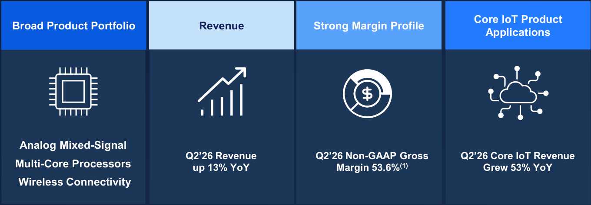
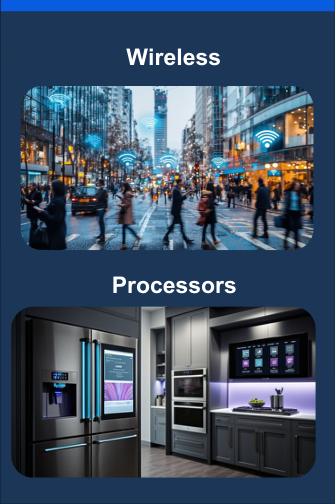
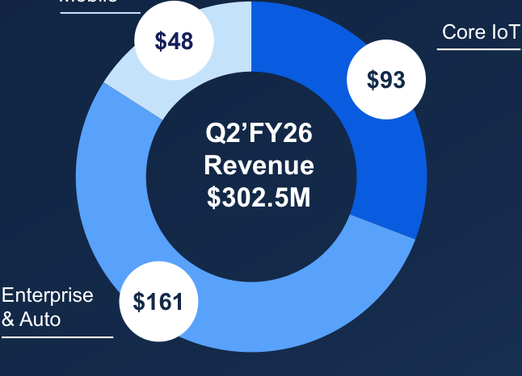
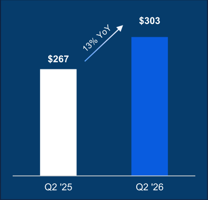
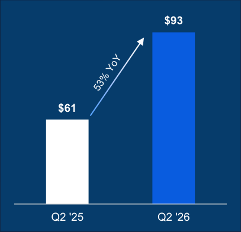
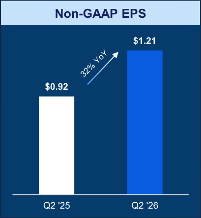
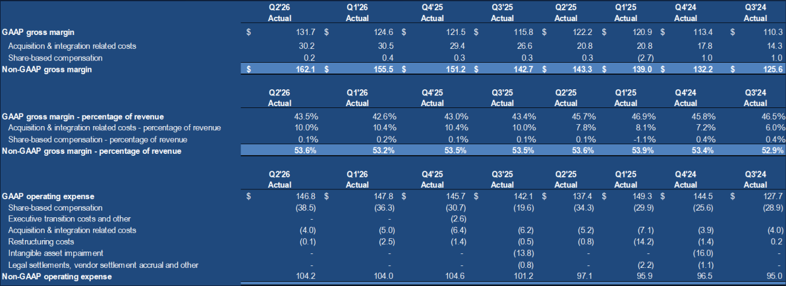
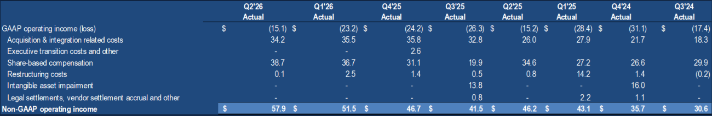
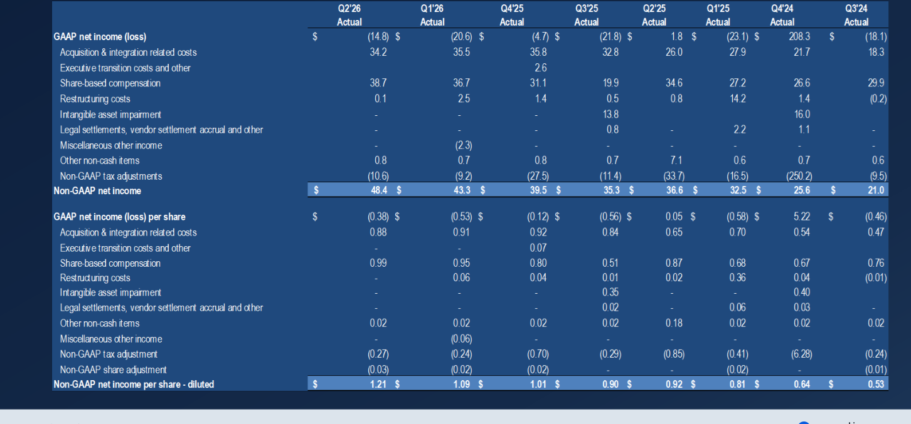

**[Image: Q2_2026_Supplemental_Slides.pdf-0001-00.png (963x11, 2.1KB)]**

**[Image: Q2_2026_Supplemental_Slides.pdf-0001-01.png (263x55, 9.1KB)]**

Second Quarter Fiscal 2026 Earnings 

**[Image: Q2_2026_Supplemental_Slides.pdf-0001-03.png (3x3, 0.1KB)]**

Supplemental Slides February 5, 2026 

**[Image: Q2_2026_Supplemental_Slides.pdf-0001-05.png (482x524, 183.9KB)]**

© 2026 Synaptics Incorporated 

1 

**[Image: Q2_2026_Supplemental_Slides.pdf-0002-00.png (963x11, 1.6KB)]**

## **Safe Harbor Statement** 

This presentation contains forward-looking statements within the meaning of the Private Securities Litigation Reform Act of 1995 and the safe harbors created under the Securities Act of 1933, as amended, and the Securities Act of 1934, as amended. Such forward-looking statements include words such as “expect,” “anticipate,” “intend,” “believe,” “estimate,” “plan,” “target,” “strategy,” “continue,” “may,” “will,” commit,” “should,” and/or variations of such words, or other words and terms of similar meaning. These forward looking statements reflect the company’s best judgment based on current expectations, projections and assumptions relating to its financial condition, results of operations, plans, objectives, future performance and business, including statements regarding the company’s financial guidance for the third quarter of fiscal 2026, anticipated business trends and growth drivers in Core IoT and Edge AI, product development and integration activities, strategic and technology investments, operational discipline, backlog, demand conditions, and capital allocation initiatives, including share repurchases, subject to market conditions, liquidity and board authorization. All forward-looking statements are inherently subject to known and unknown risks, uncertainties and other factors which may cause actual future results, performance or achievements to differ materially from the future results, performance or achievements expressed in or implied by such forward-looking statements. Factors that could cause actual results to differ materially from those set out in the forward-looking statements include, but are not limited to: macroeconomic uncertainties in the United States and globally, including the effects of trade restrictions, tariffs, inflation, changes in export controls or other laws affecting trade and investment, or geopolitical tensions such as the conflict in the Middle East, any of which may lead to reduced customer demand, supply chain disruptions, increased costs, and operational adjustments (such as reductions in force); the company’s ability to successfully execute on its strategies, including new product introductions, acquisitions and strategic partnerships; manufacturing and supply chain risks, including the company’s dependence on third parties to maintain satisfactory manufacturing yields and deliverable schedules, constraints or imbalances in the availability of critical components (including memory components used in combination with the company’s products) or delays from third-party foundries and assemblers; risks related to customer concentration, inventory corrections, or changes in end-market adoption trends; the company’s dependence on one or more large customers, including risks relating to the loss or non-renewal of contracts with key customers; the company’s exposure to industry downturns and cyclicality in its target markets; expectations related to the company’s financial performance for the upcoming quarter; demand variability in the Core IoT and Enterprise and Automotive markets; inflationary pressures, fluctuating interest rates, and exchange rate volatility; the company’s ability to execute on its cost reduction initiatives and to achieve expected synergies and expense reductions; the company’s ability to maintain and build relationships with its customers; the company’s indemnification obligations for any third party claims; risks associated with leadership transitions, including continuity and retention of key technical or managerial personnel; risks related to the company’s ability to deliver expected financial or strategic benefits from investing in growth while simultaneously returning capital to stockholders through share repurchases; and other risks as identified in the “Risk Factors,” “Management’s Discussion and Analysis of Financial Condition and Results of Operations” and “Business” sections of the company’s most recent Annual Report on Form 10-K and Quarterly Report on Form 10-Q; and other risks as identified from time to time in the company’s Securities and Exchange Commission reports. Please also refer to the Cautionary Statement Regarding Forward-Looking Statements included in the company’s earnings press release dated February 5, 2026, for additional information. Forward-looking statements are based on information available to the company on the date hereof, and the company assumes no obligation to update publicly any forward-looking statements in light of new information or future events, except as required by law. 

## **Non-GAAP Financial Information** 

This presentation also includes non-GAAP financial measures. These non-GAAP financial measures are in addition to, and not as a substitute for or superior to measures of financial performance prepared in accordance with GAAP. There are a number of limitations related to the use of these non-GAAP financial measures versus their nearest GAAP equivalents. For example, other companies may calculate non-GAAP financial measures differently or may use other measures to evaluate their performance, all of which could reduce the usefulness of the Company’s non-GAAP financial measures as tools for comparison. Further information regarding these non-GAAP financial measures, including a reconciliation of each of these measures to the most directly comparable GAAP measure, is included in the Appendix to this presentation. 

**[Image: Q2_2026_Supplemental_Slides.pdf-0002-05.png (207x39, 2.2KB)]**

**[Image: Q2_2026_Supplemental_Slides.pdf-0002-06.png (527x8, 0.3KB)]**

© 2024 Synaptics Incorporated© 2026 Synaptics Incorporated 

2 

2 

**[Image: Q2_2026_Supplemental_Slides.pdf-0003-00.png (963x11, 1.9KB)]**

## **Fifth Consecutive Quarter of Double-Digit Revenue Growth** 

Core IoT Momentum Continues 

**Total Non-GAAP EPS Revenue Revenue Growth Growth****(1)** Q2 2026 Q2 2026 Q2 2026 Revenue $ YoY Growth YoY Growth **Core IoT Revenue Growth** Q2 2026 YoY Growth 

**[Image: Q2_2026_Supplemental_Slides.pdf-0003-04.png (57x57, 4.4KB)]**

**[Image: Q2_2026_Supplemental_Slides.pdf-0003-05.png (45x40, 2.2KB)]**

(1) Non-GAAP EPS  is a non-GAAP measure. See the tables at the end of this presentation for a reconciliation of GAAP results to non-GAAP financial measures 

**[Image: Q2_2026_Supplemental_Slides.pdf-0003-07.png (528x9, 0.3KB)]**

© 2025 Synaptics Incorporated© 2026 Synaptics Incorporated 

3 

3 

**[Image: Q2_2026_Supplemental_Slides.pdf-0004-00.png (963x11, 1.6KB)]**

## **High-Performance Semiconductor Solutions Leader** 

**[Image: Q2_2026_Supplemental_Slides.pdf-0004-02.png (1360x474, 60.2KB)]**

<!-- Start of picture text -->
Core IoT Product Broad Product Portfolio Revenue Strong Margin Profile Applications Analog Mixed-Signal Q2’26 Revenue  Q2’26 Non-GAAP Gross  Q2’26 Core IoT Revenue Multi-Core Processors up 13% YoY Margin 53.6% (1) Grew 53% YoY Wireless Connectivity <!-- End of picture text -->

Note: As-reported Q2 fiscal year 2026, not pro forma for any acquisition/divestiture activity over this timeframe (1) Non-GAAP gross margin is a non-GAAP measure. For a reconciliation to the most directly comparable financial measure prepared in accordance with GAAP, please see the appendix of this presentation 

**[Image: Q2_2026_Supplemental_Slides.pdf-0004-04.png (528x9, 0.3KB)]**

© 2025 Synaptics Incorporated© 2026 Synaptics Incorporated 

4 

4 

**[Image: Q2_2026_Supplemental_Slides.pdf-0005-00.png (963x11, 1.6KB)]**

## **Technology Leadership Across The Product Portfolio** 

**Core IoT Applications Enterprise & Automotive Mobile Touch PC Touchpad/ Wireless Video Interface Biometric Fingerprint Processors Enterprise Telephony Automotive** 

**[Image: Q2_2026_Supplemental_Slides.pdf-0005-03.png (335x504, 236.6KB)]**

<!-- Start of picture text -->
Wireless Processors <!-- End of picture text -->

**[Image: Q2_2026_Supplemental_Slides.pdf-0005-04.png (652x504, 420.6KB)]**

<!-- Start of picture text -->
PC Touchpad/ Video Interface Biometric Fingerprint Enterprise Telephony Automotive <!-- End of picture text -->

**[Image: Q2_2026_Supplemental_Slides.pdf-0005-05.png (320x209, 128.2KB)]**

**[Image: Q2_2026_Supplemental_Slides.pdf-0005-06.png (528x9, 0.3KB)]**

© 2025 Synaptics Incorporated© 2026 Synaptics Incorporated 

5 

5 

**[Image: Q2_2026_Supplemental_Slides.pdf-0006-00.png (963x11, 1.6KB)]**

## **Q2’FY26 Financial Highlights** 

- Revenue of **$302.5 million** , up 13% YoY 

- Core IoT revenue increased 53% YoY 

- GAAP & Non-GAAP gross margins(1) improved QoQ 

   - GAAP gross margin of 43.5% 

   - Non-GAAP gross margin of 53.6% 

- GAAP loss per share of $0.38 

- Non-GAAP diluted **earnings per share**(1) **of $1.21** 

- Cash flow from operations of **$30 million** 

**[Image: Q2_2026_Supplemental_Slides.pdf-0006-10.png (78x22, 1.4KB)]**

<!-- Start of picture text -->
Mobile <!-- End of picture text -->

**[Image: Q2_2026_Supplemental_Slides.pdf-0006-11.png (646x466, 38.3KB)]**

<!-- Start of picture text -->
Core IoT $48 $93 Q2’FY26 Revenue $302.5M Enterprise  $161 & Auto <!-- End of picture text -->

(1) Non-GAAP gross margin and non-GAAP diluted earnings per share are non-GAAP measures. See the tables at the end of this presentation for a reconciliation of GAAP results to non-GAAP financial measures 

**[Image: Q2_2026_Supplemental_Slides.pdf-0006-13.png (528x9, 0.3KB)]**

© 2025 Synaptics Incorporated© 2026 Synaptics Incorporated 

6 

6 

**[Image: Q2_2026_Supplemental_Slides.pdf-0007-00.png (963x11, 1.6KB)]**

# **Solid YoY Growth** 

**[Image: Q2_2026_Supplemental_Slides.pdf-0007-02.png (409x392, 9.9KB)]**

<!-- Start of picture text -->
$303 $267  Q2 '25 Q2 '26 <!-- End of picture text -->

**[Image: Q2_2026_Supplemental_Slides.pdf-0007-03.png (407x392, 10.3KB)]**

<!-- Start of picture text -->
$93 $61  Q2 '25 Q2 '26 <!-- End of picture text -->

**[Image: Q2_2026_Supplemental_Slides.pdf-0007-04.png (409x442, 12.8KB)]**

<!-- Start of picture text -->
Non-GAAP EPS $1.21 $0.92  Q2 '25 Q2 '26 <!-- End of picture text -->

(1) Non-GAAP EPS is a non-GAAP measure. For a reconciliation to the most directly comparable financial measure prepared in accordance with GAAP, please see the appendix of this presentation 

**[Image: Q2_2026_Supplemental_Slides.pdf-0007-06.png (528x9, 0.3KB)]**

© 2025 Synaptics Incorporated© 2026 Synaptics Incorporated 

7 

7 

**[Image: Q2_2026_Supplemental_Slides.pdf-0008-00.png (963x11, 1.6KB)]**

# **Quarterly Revenue and Gross Margin Trend** 

**[Image: Q2_2026_Supplemental_Slides.pdf-0008-02.png (59x176, 0.8KB)]**

**[Image: Q2_2026_Supplemental_Slides.pdf-0008-03.png (61x172, 0.8KB)]**

**[Image: Q2_2026_Supplemental_Slides.pdf-0008-04.png (61x266, 1.0KB)]**

**[Image: Q2_2026_Supplemental_Slides.pdf-0008-05.png (60x324, 1.1KB)]**

**[Image: Q2_2026_Supplemental_Slides.pdf-0008-06.png (61x382, 1.1KB)]**

**[Image: Q2_2026_Supplemental_Slides.pdf-0008-07.png (57x266, 1.0KB)]**

**[Image: Q2_2026_Supplemental_Slides.pdf-0008-08.png (57x228, 0.9KB)]**

**[Image: Q2_2026_Supplemental_Slides.pdf-0008-09.png (59x222, 0.9KB)]**

**[Image: Q2_2026_Supplemental_Slides.pdf-0008-10.png (59x216, 1.0KB)]**

**[Image: Q2_2026_Supplemental_Slides.pdf-0008-11.png (59x231, 1.0KB)]**

**[Image: Q2_2026_Supplemental_Slides.pdf-0008-12.png (59x328, 1.2KB)]**

**[Image: Q2_2026_Supplemental_Slides.pdf-0008-13.png (59x326, 1.2KB)]**

**[Image: Q2_2026_Supplemental_Slides.pdf-0008-14.png (59x326, 1.2KB)]**

**[Image: Q2_2026_Supplemental_Slides.pdf-0008-15.png (59x322, 1.4KB)]**

**[Image: Q2_2026_Supplemental_Slides.pdf-0008-16.png (57x328, 1.4KB)]**

Note: As-reported, not proforma for any acquisition/divestiture activity over this timeframe **(1)** Non-GAAP gross margin is a non-GAAP measure. See the tables at the end of this presentation for a reconciliation of GAAP results to non-GAAP financial measures 

**[Image: Q2_2026_Supplemental_Slides.pdf-0008-18.png (528x9, 0.3KB)]**

© 2025 Synaptics Incorporated© 2026 Synaptics Incorporated 

8 

8 

**[Image: Q2_2026_Supplemental_Slides.pdf-0009-00.png (963x11, 1.6KB)]**

## **Q2 ‘FY26 Financial Results** 

|**$M (except EPS)**|**Q2'25**|**Q1’26**|**Q2'26**|**QoQ**|**YoY**|
|---|---|---|---|---|---|
|**Revenue**|$267.2|$292.5|$302.5|3%|13%|
|**GAAP Gross Margin %**|45.7%|42.6%|43.5%|90 bps|-220 bps|
|**GAAP Operating Expenses**|$137.4|$147.8|$146.8|(1%)|7%|
|**GAAP Operating Margin**|-5.7%|-8.0%|-5.0%|300 bps|70 bps|
|**GAAP EPS**|$0.05|($0.53)|($0.38)|28%|(860%)|
|**Non-GAAP Gross Margin %**|53.6%|53.2%|53.6%|40 bps|0 bps|
|**Non-GAAP Operating** **Expenses**|$97.1|$104.0|$104.2|0.2%|7%|
|**Non-GAAP Operating Margin**|17.3%|17.6%|19.2%|160 bps|190 bps|
|**Non-GAAP EPS Diluted**|$0.92|$1.09|$1.21|11%|**32%**|

_See the tables at the end of this presentation for a reconciliation of GAAP results to non-GAAP financial measures_ 

**[Image: Q2_2026_Supplemental_Slides.pdf-0009-04.png (528x9, 0.3KB)]**

© 2025 Synaptics Incorporated© 2026 Synaptics Incorporated 

9 

9 

**[Image: Q2_2026_Supplemental_Slides.pdf-0010-00.png (963x11, 1.6KB)]**

## **Q2 ‘FY26 Balance Sheet** 

|**In Millions**|**Q2'25**|**Q1’26**|**Q2'26**|
|---|---|---|---|
|**Cash & ST Investments**|**$596.1**|**$459.9**|**$437.4**|
|Accounts Receivables|$146.5|$119.5|$132.7|
|Inventory|$119.5|$143.1|$158.0|
|PP&E|$75.3|$77.4|$83.1|
|Other|$1,590.1|$1,777.2|$1,752.1|
|**Total Assets**|**$2,527.5**|**$2,577.1**|**$2,563.3**|
|Current Liabilities (excluding debt)|$229.8|$262.0|$263.4|
|Debt, net|$832.5|$835.4|$836.0|
|Other Liabilities|$89.1|$79.1|$80.1|
|**Shareholder’s Equity**|**$1,376.1**|**$1,400.6**|**$1,383.8**|
|**Total Liabilities & Equity**|**$2,527.5**|**$2,577.1**|**$2,563.3**|

Balances are as of the end of each quarter presented Debt, net balance reflects debt net of discount and debt issuance costs 

**[Image: Q2_2026_Supplemental_Slides.pdf-0010-04.png (132x24, 1.7KB)]**

<!-- Start of picture text -->
10 <!-- End of picture text -->

**[Image: Q2_2026_Supplemental_Slides.pdf-0010-05.png (528x9, 0.3KB)]**

© 2025 Synaptics Incorporated© 2026 Synaptics Incorporated 

10 

10 

**[Image: Q2_2026_Supplemental_Slides.pdf-0011-00.png (963x11, 1.6KB)]**

## **Q3 ‘FY26 Guidance** 

|**$M (except EPS)**|**GAAP**|**Non-GAAP**|
|---|---|---|
|**Revenue**|$290M ± $10M|$290M ± $10M|
|**Gross Margin***|45.0% ± 2.0%|53.5% ± 1.0%|
|**Operating Expenses****|$150M ± $4M|$106M ± $2M|
|**EPS*****|($0.46) ± $0.25|$1.00 ± $0.15|
|**Revenue mix**|||
|**Core IoT**|32%|32%|
|**Enterprise & Auto**|54%|54%|
|**Mobile** *Projected Non-GAAP gross margin excludes $24.0 to $25.0 million acq|14% uisition and integration-related costs and $1.0 million share-based compe|14% nsation.|

**Projected Non-GAAP operating expense excludes $38.0 to $40.0 million share-based compensation, $1.0 to $2.0 million restructuring costs, and $3.0 to $4.0 million acquisition and integration related costs. ***Projected Non-GAAP earnings (loss) per share excludes $1.0 to $1.01 in share-based compensation, $0.03 to $0.05 restructuring costs, $0.69 to $0.71 acquisition and integration related costs, and ($0.16) to ($0.41) other non-cash and Non-GAAP tax adjustments. 

The company’s outlook also is subject to the fluid macroeconomic global trade and tariff environment which remains uncertain at this time (refer to the “Safe Harbor Statement” on slide 2 and to the “Risk Factors,” “Management’s Discussion and Analysis of Financial Condition and Results of Operations” and “Business” sections of our most recent Annual Report on Form 10-K and Quarterly Report on Form 10-Q. 

**[Image: Q2_2026_Supplemental_Slides.pdf-0011-05.png (154x24, 2.2KB)]**

<!-- Start of picture text -->
11 <!-- End of picture text -->

**[Image: Q2_2026_Supplemental_Slides.pdf-0011-06.png (528x9, 0.3KB)]**

© 2025 Synaptics Incorporated© 2026 Synaptics Incorporated 

11 

11 

**[Image: Q2_2026_Supplemental_Slides.pdf-0012-00.png (963x11, 1.6KB)]**

**[Image: Q2_2026_Supplemental_Slides.pdf-0012-01.png (1399x455, 146.0KB)]**

<!-- Start of picture text -->
Appendix 12 <!-- End of picture text -->

© 2025 Synaptics Incorporated 

**[Image: Q2_2026_Supplemental_Slides.pdf-0013-00.png (963x11, 1.6KB)]**

## **GAAP to Non-GAAP Reconciliation Tables** 

**[Image: Q2_2026_Supplemental_Slides.pdf-0013-02.png (1300x474, 201.7KB)]**

**[Image: Q2_2026_Supplemental_Slides.pdf-0013-03.png (1300x214, 81.8KB)]**

**[Image: Q2_2026_Supplemental_Slides.pdf-0013-04.png (528x9, 0.3KB)]**

© 2025 Synaptics Incorporated© 2026 Synaptics Incorporated 

13 

13 

**[Image: Q2_2026_Supplemental_Slides.pdf-0014-00.png (963x11, 1.6KB)]**

## **GAAP to Non-GAAP Reconciliation Tables - continued** 

**[Image: Q2_2026_Supplemental_Slides.pdf-0014-02.png (1452x677, 235.1KB)]**

**[Image: Q2_2026_Supplemental_Slides.pdf-0014-03.png (154x24, 2.2KB)]**

<!-- Start of picture text -->
14 <!-- End of picture text -->

**[Image: Q2_2026_Supplemental_Slides.pdf-0014-04.png (528x9, 0.3KB)]**

© 2025 Synaptics Incorporated© 2026 Synaptics Incorporated 

14 

14 

**[Image: Q2_2026_Supplemental_Slides.pdf-0015-00.png (963x11, 1.6KB)]**

### **Economic dilutive impact of a Convertible and Capped call** 

||**Dilution from**|**(Accretion) from**||
|---|---|---|---|
|**Stock Price**|**Convertible (mm)**|**Capped Call (mm)**|**Net Dilution (mm)**|
|$75.24|0|0|0|
|$80.00|0|0|0|
|$90.00|0|0|0|
|$100.00|0.0|-0.0|0|
|$110.00|0.4|-0.4|0|
|$120.00|0.8|-0.8|0|
|$130.00|1.1|-1.1|0|
|$140.00|1.3|-1.3|0|
|$150.00|1.5|-1.5|0|
|$160.00|1.7|-1.4|0.3|
|$170.00|1.9|-1.4|0.5|
|$180.00|2.0|-1.3|0.7|
|$190.00|2.1|-1.2|0.9|
|$200.00|2.3|-1.2|1.1|

**[Image: Q2_2026_Supplemental_Slides.pdf-0015-03.png (154x24, 2.3KB)]**

<!-- Start of picture text -->
15 <!-- End of picture text -->

**[Image: Q2_2026_Supplemental_Slides.pdf-0015-04.png (528x9, 0.3KB)]**

© 2025 Synaptics Incorporated© 2026 Synaptics Incorporated 

15 

15 

---

## Extracted Images

| # | File | Dimensions | Size |
|---|------|------------|------|
| 1 | Q2_2026_Supplemental_Slides.pdf-0001-00.png | 963x11 | 2.1KB |
| 2 | Q2_2026_Supplemental_Slides.pdf-0001-01.png | 263x55 | 9.1KB |
| 3 | Q2_2026_Supplemental_Slides.pdf-0001-03.png | 3x3 | 0.1KB |
| 4 | Q2_2026_Supplemental_Slides.pdf-0001-05.png | 482x524 | 183.9KB |
| 5 | Q2_2026_Supplemental_Slides.pdf-0002-00.png | 963x11 | 1.6KB |
| 6 | Q2_2026_Supplemental_Slides.pdf-0002-05.png | 207x39 | 2.2KB |
| 7 | Q2_2026_Supplemental_Slides.pdf-0002-06.png | 527x8 | 0.3KB |
| 8 | Q2_2026_Supplemental_Slides.pdf-0003-00.png | 963x11 | 1.9KB |
| 9 | Q2_2026_Supplemental_Slides.pdf-0003-04.png | 57x57 | 4.4KB |
| 10 | Q2_2026_Supplemental_Slides.pdf-0003-05.png | 45x40 | 2.2KB |
| 11 | Q2_2026_Supplemental_Slides.pdf-0003-07.png | 528x9 | 0.3KB |
| 12 | Q2_2026_Supplemental_Slides.pdf-0004-00.png | 963x11 | 1.6KB |
| 13 | Q2_2026_Supplemental_Slides.pdf-0004-02.png | 1360x474 | 60.2KB |
| 14 | Q2_2026_Supplemental_Slides.pdf-0004-04.png | 528x9 | 0.3KB |
| 15 | Q2_2026_Supplemental_Slides.pdf-0005-00.png | 963x11 | 1.6KB |
| 16 | Q2_2026_Supplemental_Slides.pdf-0005-03.png | 335x504 | 236.6KB |
| 17 | Q2_2026_Supplemental_Slides.pdf-0005-04.png | 652x504 | 420.6KB |
| 18 | Q2_2026_Supplemental_Slides.pdf-0005-05.png | 320x209 | 128.2KB |
| 19 | Q2_2026_Supplemental_Slides.pdf-0005-06.png | 528x9 | 0.3KB |
| 20 | Q2_2026_Supplemental_Slides.pdf-0006-00.png | 963x11 | 1.6KB |
| 21 | Q2_2026_Supplemental_Slides.pdf-0006-10.png | 78x22 | 1.4KB |
| 22 | Q2_2026_Supplemental_Slides.pdf-0006-11.png | 646x466 | 38.3KB |
| 23 | Q2_2026_Supplemental_Slides.pdf-0006-13.png | 528x9 | 0.3KB |
| 24 | Q2_2026_Supplemental_Slides.pdf-0007-00.png | 963x11 | 1.6KB |
| 25 | Q2_2026_Supplemental_Slides.pdf-0007-02.png | 409x392 | 9.9KB |
| 26 | Q2_2026_Supplemental_Slides.pdf-0007-03.png | 407x392 | 10.3KB |
| 27 | Q2_2026_Supplemental_Slides.pdf-0007-04.png | 409x442 | 12.8KB |
| 28 | Q2_2026_Supplemental_Slides.pdf-0007-06.png | 528x9 | 0.3KB |
| 29 | Q2_2026_Supplemental_Slides.pdf-0008-00.png | 963x11 | 1.6KB |
| 30 | Q2_2026_Supplemental_Slides.pdf-0008-02.png | 59x176 | 0.8KB |
| 31 | Q2_2026_Supplemental_Slides.pdf-0008-03.png | 61x172 | 0.8KB |
| 32 | Q2_2026_Supplemental_Slides.pdf-0008-04.png | 61x266 | 1.0KB |
| 33 | Q2_2026_Supplemental_Slides.pdf-0008-05.png | 60x324 | 1.1KB |
| 34 | Q2_2026_Supplemental_Slides.pdf-0008-06.png | 61x382 | 1.1KB |
| 35 | Q2_2026_Supplemental_Slides.pdf-0008-07.png | 57x266 | 1.0KB |
| 36 | Q2_2026_Supplemental_Slides.pdf-0008-08.png | 57x228 | 0.9KB |
| 37 | Q2_2026_Supplemental_Slides.pdf-0008-09.png | 59x222 | 0.9KB |
| 38 | Q2_2026_Supplemental_Slides.pdf-0008-10.png | 59x216 | 1.0KB |
| 39 | Q2_2026_Supplemental_Slides.pdf-0008-11.png | 59x231 | 1.0KB |
| 40 | Q2_2026_Supplemental_Slides.pdf-0008-12.png | 59x328 | 1.2KB |
| 41 | Q2_2026_Supplemental_Slides.pdf-0008-13.png | 59x326 | 1.2KB |
| 42 | Q2_2026_Supplemental_Slides.pdf-0008-14.png | 59x326 | 1.2KB |
| 43 | Q2_2026_Supplemental_Slides.pdf-0008-15.png | 59x322 | 1.4KB |
| 44 | Q2_2026_Supplemental_Slides.pdf-0008-16.png | 57x328 | 1.4KB |
| 45 | Q2_2026_Supplemental_Slides.pdf-0008-18.png | 528x9 | 0.3KB |
| 46 | Q2_2026_Supplemental_Slides.pdf-0009-00.png | 963x11 | 1.6KB |
| 47 | Q2_2026_Supplemental_Slides.pdf-0009-04.png | 528x9 | 0.3KB |
| 48 | Q2_2026_Supplemental_Slides.pdf-0010-00.png | 963x11 | 1.6KB |
| 49 | Q2_2026_Supplemental_Slides.pdf-0010-04.png | 132x24 | 1.7KB |
| 50 | Q2_2026_Supplemental_Slides.pdf-0010-05.png | 528x9 | 0.3KB |
| 51 | Q2_2026_Supplemental_Slides.pdf-0011-00.png | 963x11 | 1.6KB |
| 52 | Q2_2026_Supplemental_Slides.pdf-0011-05.png | 154x24 | 2.2KB |
| 53 | Q2_2026_Supplemental_Slides.pdf-0011-06.png | 528x9 | 0.3KB |
| 54 | Q2_2026_Supplemental_Slides.pdf-0012-00.png | 963x11 | 1.6KB |
| 55 | Q2_2026_Supplemental_Slides.pdf-0012-01.png | 1399x455 | 146.0KB |
| 56 | Q2_2026_Supplemental_Slides.pdf-0013-00.png | 963x11 | 1.6KB |
| 57 | Q2_2026_Supplemental_Slides.pdf-0013-02.png | 1300x474 | 201.7KB |
| 58 | Q2_2026_Supplemental_Slides.pdf-0013-03.png | 1300x214 | 81.8KB |
| 59 | Q2_2026_Supplemental_Slides.pdf-0013-04.png | 528x9 | 0.3KB |
| 60 | Q2_2026_Supplemental_Slides.pdf-0014-00.png | 963x11 | 1.6KB |
| 61 | Q2_2026_Supplemental_Slides.pdf-0014-02.png | 1452x677 | 235.1KB |
| 62 | Q2_2026_Supplemental_Slides.pdf-0014-03.png | 154x24 | 2.2KB |
| 63 | Q2_2026_Supplemental_Slides.pdf-0014-04.png | 528x9 | 0.3KB |
| 64 | Q2_2026_Supplemental_Slides.pdf-0015-00.png | 963x11 | 1.6KB |
| 65 | Q2_2026_Supplemental_Slides.pdf-0015-03.png | 154x24 | 2.3KB |
| 66 | Q2_2026_Supplemental_Slides.pdf-0015-04.png | 528x9 | 0.3KB |
