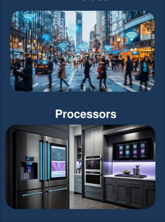
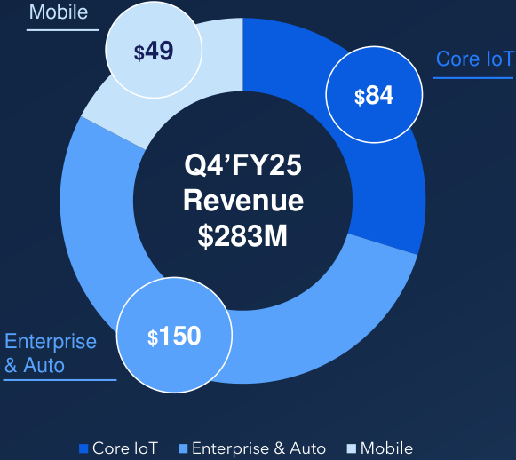
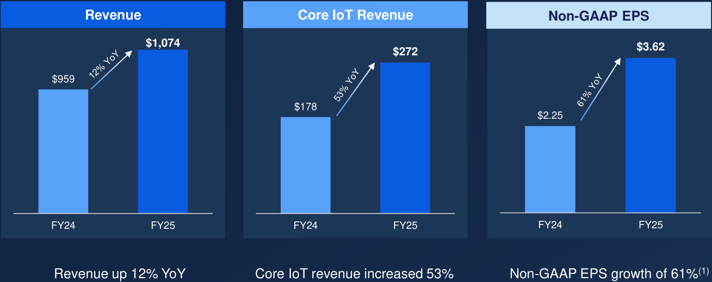
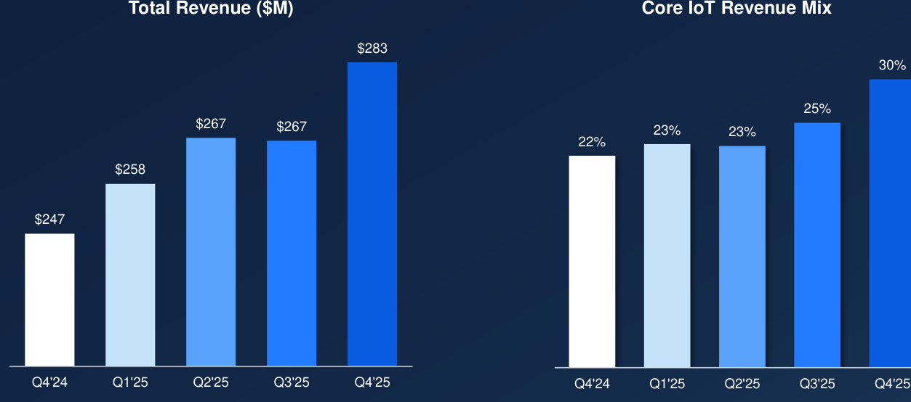
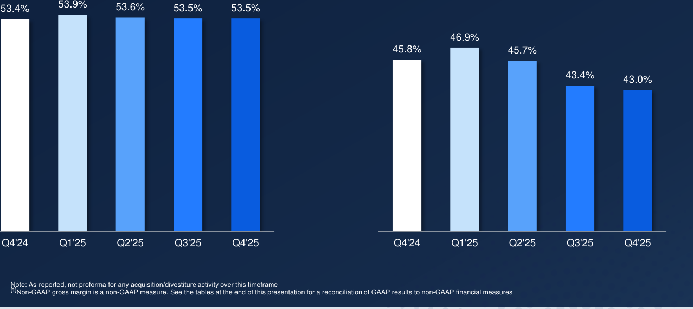

**[Image: Q4_2025_Supplemental_Slides.pdf-0001-00.png (963x11, 1.5KB)]**

**[Image: Q4_2025_Supplemental_Slides.pdf-0001-01.png (1410x455, 88.7KB)]**

<!-- Start of picture text -->
2025 Earnings Supplemental Slides August 7, 2025 1 <!-- End of picture text -->

© 2025 Synaptics Incorporated 

**[Image: Q4_2025_Supplemental_Slides.pdf-0002-00.png (963x11, 1.5KB)]**

# **Safe Harbor Statement** 

This presentation contains forward-looking statements that are subject to the safe harbor provisions under the Private Securities Litigation Reform Act of 1995 and the Federal Securities laws. Such forward-looking statements include words such as “expect,” “anticipate,” “intend,” “believe,” “estimate,” “plan,” “target,” “strategy,” “continue,” “may,” “will,” commit,” “should,” and/or variations of such words, or other words and terms of similar meaning. These forward looking statements reflect our best judgment based on current expectations and assumptions that are subject to risks and uncertainties, including risks related to global macroeconomic conditions, including the impact of trade restrictions, tariffs, or geopolitical tensions such as the conflict in the Middle East, any of which may lead to reduced customer demand, supply chain disruptions, increased costs, and operational adjustments (such as reductions in force); inflationary pressures, fluctuating interest rates, and exchange rate volatility; demand variability in the Core IoT and Enterprise and Automotive markets, as well as risks related to customer concentration, inventory corrections, or changes in end-market adoption trends; expectations related to our financial performance for the upcoming quarter; the company’s dependence on one or more large customers; the company’s exposure to industry downturns and cyclicality in its target markets; manufacturing and supply chain risks, including the company’s dependence on third parties to maintain satisfactory manufacturing yields and deliverable schedules, the availability of critical components or delays from third-party foundries and assemblers; the company’s ability to successfully execute on its strategies, including new product introductions, acquisitions and strategic partnerships; the company’s ability to execute on its cost reduction initiatives and to achieve expected synergies and expense reductions; the company’s ability to maintain and build relationships with its customers; the company’s indemnification obligations for any third party claims; operational challenges related to the CEO transition, including leadership continuity and retention of other key technical or managerial personnel; risks related to our ability to deliver expected financial or strategic benefits from investing in growth while simultaneously returning capital to shareholders through share repurchases; and other risks as identified in the “Risk Factors,” “Management’s Discussion and Analysis of Financial Condition and Results of Operations” and “Business” sections of our most recent Annual Report on Form 10-K and our most recent Quarterly Report on Form 10-Q; and other risks as identified from time to time in our Securities and Exchange Commission reports. Forward-looking statements are based on information available to us on the date hereof, and we do not have, and expressly disclaim, any obligation to publicly release any updates or any changes in our expectations, or any change in events, conditions, or circumstances on which any forward-looking statement is based, except as required by law. 

# **Non-GAAP Financial Information** 

This presentation also includes non-GAAP financial measures. These non-GAAP financial measures are in addition to, and not as a substitute for or superior to measures of financial performance prepared in accordance with GAAP. There are a number of limitations related to the use of these non-GAAP financial measures versus their nearest GAAP equivalents. For example, other companies may calculate non-GAAP financial measures differently or may use other measures to evaluate their performance, all of which could reduce the usefulness of the Company’s nonGAAP financial measures as tools for comparison. Further information regarding these non-GAAP financial measures, including a reconciliation of each of these measures to the most directly comparable GAAP measure, is included in the Appendix to this presentation. 

**[Image: Q4_2025_Supplemental_Slides.pdf-0002-05.png (207x39, 2.2KB)]**

**[Image: Q4_2025_Supplemental_Slides.pdf-0002-06.png (527x8, 0.2KB)]**

© 2024 Synaptics Incorporated© 2025 Synaptics Incorporated 

2 2 

Strictly Confidential 

**[Image: Q4_2025_Supplemental_Slides.pdf-0003-00.png (963x11, 1.9KB)]**

# **A Strong Finish to FY2025** 

Even Stronger Momentum Ahead Fueled by Core IoT 

### **Revenue** 

**[Image: Q4_2025_Supplemental_Slides.pdf-0003-04.png (60x59, 7.7KB)]**

Q4 2025 Revenue $ **282.8M** 

**[Image: Q4_2025_Supplemental_Slides.pdf-0003-06.png (58x57, 7.5KB)]**

**[Image: Q4_2025_Supplemental_Slides.pdf-0003-07.png (197x111, 6.3KB)]**

<!-- Start of picture text -->
1.074BB <!-- End of picture text -->

FY 2025 Revenue $ **1.074BB** 

**Total Revenue Growth** 

> Q4 2025 YoY Growth **14%** 

> FY 2025 YoY Growth **12%** 

**Core IoT Revenue Growth** 

Q4 2025 YoY FY 2025 YoY 

**[Image: Q4_2025_Supplemental_Slides.pdf-0003-14.png (59x59, 8.1KB)]**

**[Image: Q4_2025_Supplemental_Slides.pdf-0003-15.png (47x41, 1.5KB)]**

<!-- Start of picture text -->
% <!-- End of picture text -->

**[Image: Q4_2025_Supplemental_Slides.pdf-0003-16.png (207x39, 2.2KB)]**

**[Image: Q4_2025_Supplemental_Slides.pdf-0003-17.png (527x8, 0.2KB)]**

© 2024 Synaptics Incorporated© 2025 Synaptics Incorporated 

3 3 

Strictly Confidential 

**[Image: Q4_2025_Supplemental_Slides.pdf-0004-00.png (963x11, 1.5KB)]**

## **High-Performance Semiconductor Solutions Leader** 

**Core IoT Product Broad Product Portfolio Revenue Strong Margin Profile Applications Analog Mixed-Signal FY25 Revenue FY25 Non-GAAP FY25 Core IoT Revenue Multi-Core Processors up 12% YoY Gross Margin 53.6% Grew 53% YoY Wireless Connectivity Q4’25 Revenue Q4'25 Non-GAAP Gross Q4'25 Core IoT Revenue Grew 55% YoY up 14% YoY Margin 53.5%****(1)** ___________________________ 

Note: As-reported Q4 fiscal year 2025, not pro forma for any acquisition/divestiture activity over this timeframe 

(1) Non-GAAP gross margin is a non-GAAP measure. For a reconciliation to the most directly comparable financial measure prepared in accordance with GAAP, please see the appendix of this presentation 

**[Image: Q4_2025_Supplemental_Slides.pdf-0004-05.png (207x39, 2.2KB)]**

**[Image: Q4_2025_Supplemental_Slides.pdf-0004-06.png (527x8, 0.2KB)]**

© 2024 Synaptics Incorporated© 2025 Synaptics Incorporated 

4 

Strictly Confidential 

4 

**[Image: Q4_2025_Supplemental_Slides.pdf-0005-00.png (963x11, 1.5KB)]**

## **Technology Leadership Across The Product Portfolio** 

**Core IoT Applications Enterprise & Automotive PC Touchpad/ Wireless Video Interface Biometric Fingerprint Processors Enterprise Telephony Automotive** 

**Enterprise & Automotive Mobile Touch** 

**[Image: Q4_2025_Supplemental_Slides.pdf-0005-04.png (339x506, 130.5KB)]**

**[Image: Q4_2025_Supplemental_Slides.pdf-0005-05.png (335x450, 235.1KB)]**

<!-- Start of picture text -->
Processors <!-- End of picture text -->

**[Image: Q4_2025_Supplemental_Slides.pdf-0005-06.png (652x450, 402.5KB)]**

<!-- Start of picture text -->
Biometric Fingerprint Enterprise Telephony Automotive <!-- End of picture text -->

**[Image: Q4_2025_Supplemental_Slides.pdf-0005-07.png (207x39, 2.2KB)]**

**[Image: Q4_2025_Supplemental_Slides.pdf-0005-08.png (527x8, 0.2KB)]**

© 2024 Synaptics Incorporated© 2025 Synaptics Incorporated 

5 5 

Strictly Confidential 

**[Image: Q4_2025_Supplemental_Slides.pdf-0006-00.png (963x11, 1.5KB)]**

# **Q4’FY25 Financial Highlights** 

- Revenue of **$283 million** , up 14% YoY 

- Core IoT revenue increased 55% YoY and 25% sequential QoQ 

- Non-GAAP gross margins were at the mid-point of guidance 

   - GAAP gross margin of 43.0% 

   - Non-GAAP gross margin of 53.5% 

- GAAP loss per share of $0.12 

- Non-GAAP diluted **earnings per share of $1.01** 

- Cash flow from operations of **$57 million** 

**[Image: Q4_2025_Supplemental_Slides.pdf-0006-10.png (581x518, 45.2KB)]**

<!-- Start of picture text -->
Mobile $49 Core IoT $49 $84 $84 Q4’FY25 Revenue $283M Enterprise  $150 $150 & Auto Core IoT Enterprise & Auto Mobile <!-- End of picture text -->

Note: As-reported Q4 fiscal year 2025, not pro forma for any acquisition/divestiture activity over this timeframe Non-GAAP gross margin and non-GAAP diluted earnings per share are non-GAAP measures. See the tables at the end of this presentation for a reconciliation of GAAP results to non-GAAP financial measures 

**[Image: Q4_2025_Supplemental_Slides.pdf-0006-12.png (207x39, 2.2KB)]**

**[Image: Q4_2025_Supplemental_Slides.pdf-0006-13.png (527x8, 0.2KB)]**

© 2024 Synaptics Incorporated© 2025 Synaptics Incorporated 

6 

Strictly Confidential 

6 

**[Image: Q4_2025_Supplemental_Slides.pdf-0007-00.png (963x11, 1.5KB)]**

# **Solid Fiscal 2025 YoY Growth** 

**[Image: Q4_2025_Supplemental_Slides.pdf-0007-02.png (1309x520, 55.9KB)]**

<!-- Start of picture text -->
Revenue Core IoT Revenue Non-GAAP EPS $1,074 $3.62 $272 $959 $178 $2.25  FY24 FY25  FY24 FY25  FY24 FY25 Revenue up 12% YoY Core IoT revenue increased 53% Non-GAAP EPS growth of 61% (1) <!-- End of picture text -->

Note: As-reported Q4 fiscal year 2025, not pro forma for any acquisition/divestiture activity over this timeframe 

(1) Non-GAAP EPS is a non-GAAP measure. For a reconciliation to the most directly comparable financial measure prepared in accordance with GAAP, please see the appendix of this presentation 

**[Image: Q4_2025_Supplemental_Slides.pdf-0007-05.png (207x39, 2.2KB)]**

**[Image: Q4_2025_Supplemental_Slides.pdf-0007-06.png (527x8, 0.2KB)]**

© 2024 Synaptics Incorporated© 2025 Synaptics Incorporated 

7 

Strictly Confidential 

7 

**[Image: Q4_2025_Supplemental_Slides.pdf-0008-00.png (963x11, 2.4KB)]**

**[Image: Q4_2025_Supplemental_Slides.pdf-0008-01.png (450x384, 379.1KB)]**

<!-- Start of picture text -->
Smart Factory <!-- End of picture text -->

**[Image: Q4_2025_Supplemental_Slides.pdf-0008-02.png (450x382, 273.9KB)]**

<!-- Start of picture text -->
Smart Home <!-- End of picture text -->

# **Q4’FY25 Business Highlights** 

- Taped out Synaptics’ first ground-up **Astra SoC solution** featuring **neural processor for AI inference** 

**[Image: Q4_2025_Supplemental_Slides.pdf-0008-05.png (281x87, 46.2KB)]**

<!-- Start of picture text -->
Smart Factory <!-- End of picture text -->

**[Image: Q4_2025_Supplemental_Slides.pdf-0008-06.png (254x88, 33.0KB)]**

<!-- Start of picture text -->
Smart Home <!-- End of picture text -->

- Marquee Astra processor design win with a leading audio OEM 

- Wi-Fi 7 design pipeline continues to grow at a solid pace 

**Smart Enterprise** 

**Smart Sensing** 

**[Image: Q4_2025_Supplemental_Slides.pdf-0008-11.png (207x39, 2.2KB)]**

**[Image: Q4_2025_Supplemental_Slides.pdf-0008-12.png (527x8, 0.2KB)]**

© 2024 Synaptics Incorporated© 2025 Synaptics Incorporated 

8 8 

Strictly Confidential 

**[Image: Q4_2025_Supplemental_Slides.pdf-0009-00.png (963x11, 1.5KB)]**

# **Quarterly Revenue Trend** 

**[Image: Q4_2025_Supplemental_Slides.pdf-0009-02.png (1253x555, 51.2KB)]**

<!-- Start of picture text -->
Total Revenue ($M) Core IoT Revenue Mix $283 30% 25% $267 $267 23% 23% 22% $258 $247 Q4'24 Q1'25 Q2'25 Q3'25 Q4'25 Q4'24 Q1'25 Q2'25 Q3'25 Q4'25 <!-- End of picture text -->

**[Image: Q4_2025_Supplemental_Slides.pdf-0009-03.png (81x412, 1.6KB)]**

Note: As-reported, not pro forma for any acquisition/divestiture activity over this timeframe 

**[Image: Q4_2025_Supplemental_Slides.pdf-0009-05.png (207x39, 2.2KB)]**

**[Image: Q4_2025_Supplemental_Slides.pdf-0009-06.png (527x8, 0.2KB)]**

© 2024 Synaptics Incorporated© 2025 Synaptics Incorporated 

9 9 

Strictly Confidential 

**[Image: Q4_2025_Supplemental_Slides.pdf-0010-00.png (963x11, 1.5KB)]**

# **Quarterly Gross Margin Trend** 

**Non-GAAP Gross Margin**(1) 

**GAAP Gross Margin** 

**[Image: Q4_2025_Supplemental_Slides.pdf-0010-04.png (1278x571, 79.4KB)]**

<!-- Start of picture text -->
53.4% 53.9% 53.6% 53.5% 53.5% 46.9% 45.8% 45.7% 43.4% 43.0% Q4'24 Q1'25 Q2'25 Q3'25 Q4'25 Q4'24 Q1'25 Q2'25 Q3'25 Q4'25 Note: As-reported, not proforma for any acquisition/divestiture activity over this timeframe (1) Non-GAAP gross margin is a non-GAAP measure. See the tables at the end of this presentation for a reconciliation of GAAP results to non-GAAP financial measures <!-- End of picture text -->

**[Image: Q4_2025_Supplemental_Slides.pdf-0010-05.png (71x405, 1.3KB)]**

**[Image: Q4_2025_Supplemental_Slides.pdf-0010-06.png (301x93, 6.4KB)]**

<!-- Start of picture text -->
10 <!-- End of picture text -->

**[Image: Q4_2025_Supplemental_Slides.pdf-0010-07.png (527x8, 0.2KB)]**

© 2024 Synaptics Incorporated© 2025 Synaptics Incorporated 

10 10 

Strictly Confidential 

**[Image: Q4_2025_Supplemental_Slides.pdf-0011-00.png (963x11, 1.5KB)]**

# **Fiscal 2025 Financial Results** 

|**$M (except percentages & EPS)**|**FY'24**|**FY'25**|**YoY**|
|---|---|---|---|
|**Revenue**|$959.4|$1,074.3|12%|
|**GAAP Gross Margin %**|45.8%|44.7%|-110 bps|
|**GAAP Operating Expenses**|$541.4|$574.5|6%|
|**GAAP Operating Margin %**|-10.6%|-8.8%|180 bps|
|**GAAP EPS**|$3.16|($1.22)|(139%)|
|**Non-GAAP Gross Margin %**|53.0%|53.6%|60 bps|
|**Non-GAAP Operating Expenses**|$380.2|$398.7|5%|
|**Non-GAAP Operating Margin %**|13.4%|16.5%|310 bps|
|**Non-GAAP Diluted EPS**|$2.25|$3.62|**61%**|

_See the tables at the end of this presentation for a reconciliation of GAAP results to non-GAAP financial measures_ 

**[Image: Q4_2025_Supplemental_Slides.pdf-0011-04.png (207x39, 2.2KB)]**

**[Image: Q4_2025_Supplemental_Slides.pdf-0011-05.png (527x8, 0.2KB)]**

© 2024 Synaptics Incorporated© 2025 Synaptics Incorporated 

11 

Strictly Confidential 

11 

**[Image: Q4_2025_Supplemental_Slides.pdf-0012-00.png (963x11, 1.5KB)]**

# **Q4’FY25 Financial Results** 

|**$M (except percentages & EPS)**|**Q4'24**|**Q3'25**|**Q4'25**|**QoQ**|**YoY**|
|---|---|---|---|---|---|
|**Revenue**|$247.4|$266.6|$282.8|6%|14%|
|**GAAP Gross Margin %**|45.8%|43.4%|43.0%|-40 bps|-280 bps|
|**GAAP Operating Expenses**|$144.5|$142.1|$145.7|3%|1%|
|**GAAP Operating Margin %**|-12.6%|-9.9%|-8.5%|140 bps|410 bps|
|**GAAP EPS**|$5.22|($0.56)|($0.12)|79%|(102%)|
|**Non-GAAP Gross Margin %**|53.4%|53.5%|53.5%|0 bps|10 bps|
|**Non-GAAP Operating** **Expenses**|$96.5|$101.2|$104.5|3%|8%|
|**Non-GAAP Operating Margin %**|14.4%|15.6%|16.5%|95 bps|208 bps|
|**Non-GAAP Diluted EPS**|$0.64|$0.90|$1.01|12%|**58%**|

_See the tables at the end of this presentation for a reconciliation of GAAP results to non-GAAP financial measures_ 

**[Image: Q4_2025_Supplemental_Slides.pdf-0012-04.png (207x39, 2.2KB)]**

**[Image: Q4_2025_Supplemental_Slides.pdf-0012-05.png (527x8, 0.2KB)]**

© 2024 Synaptics Incorporated© 2025 Synaptics Incorporated 

12 12 

Strictly Confidential 

**[Image: Q4_2025_Supplemental_Slides.pdf-0013-00.png (963x11, 1.5KB)]**

# **Q4’FY25 Balance Sheet** 

|**In Millions**|**Q4’24**|**Q3’25**|**Q4’25**|
|---|---|---|---|
|**Cash & ST Investments**|$876.9|$421.4|$452.5|
|**AR**|$142.4|$132.0|$130.3|
|**Inventory**|$114.0|$132.9|$139.5|
|**PP&E**|$75.5|$71.0|$72.1|
|**Other**|$1,616.2|$1,797.0|$1,790.0|
|**Total Assets**|**$2,825.0**|**$2,554.3**|**$2,584.4**|
|**Current Liabilities (excluding debt)**|$271.2|$247.5|$270.9|
|**Debt, net**|$972.9|$834.2|$834.8|
|**Other Liabilities**|$114.1|$85.6|$83.8|
|**Shareholder’s Equity**|**$1,466.8**|**$1,387.0**|**$1,394.9**|
|**Total Liabilities & Equity**|**$2,825.0**|**$2,554.3**|**$2,584.4**|

Balances are as of the end of each quarter presented Debt, net balance reflects debt net of discount and debt issuance costs 

**[Image: Q4_2025_Supplemental_Slides.pdf-0013-04.png (207x39, 2.2KB)]**

**[Image: Q4_2025_Supplemental_Slides.pdf-0013-05.png (527x8, 0.2KB)]**

© 2024 Synaptics Incorporated© 2025 Synaptics Incorporated 

13 13 

Strictly Confidential 

**[Image: Q4_2025_Supplemental_Slides.pdf-0014-00.png (963x11, 1.5KB)]**

# **Q1’FY26 Guidance** 

|**$M (except EPS)**|**GAAP**|**Non-GAAP**|
|---|---|---|
|**Revenue**|$290M ± $10M|$290M ± $10M|
|**Gross Margin***|42.5% ± 2.0%|53.5% ± 1.0%|
|**Operating Expenses****|$147M ± $4M|$105M ± $2M|
|**EPS*****|($0.54) ± $0.25|$1.05 ± $0.15|
|**Revenue mix**|||
|**Core IoT**|32%|32%|
|**Enterprise & Auto**|53%|53%|
|**Mobile**|15%|15%|

*Projected Non-GAAP gross margin excludes $30.0 to $32.0 million acquisition and integration-related costs and $1.0 million share-based compensation. 

**Projected Non-GAAP operating expense excludes $33.0 to $35.0 million share-based compensation, $1.0 million restructuring costs, and $6.0 to $8.0 million acquisition and integration related costs. ***Projected Non-GAAP earnings (loss) per share excludes $0.87 to $0.91 share-based compensation, $0.03 restructuring costs, $0.94 to $0.98 acquisition and integration related costs, and ($0.15) to ($0.43) other non-cash and Non-GAAP tax adjustments. 

Our outlook also is subject to the fluid macroeconomic global trade and tariff environment which remains uncertain at this time (refer to the “Safe Harbor Statement” on slide 2 and to the “Risk Factors,” “Management’s Discussion and Analysis of Financial Condition and Results of Operations” and “Business” sections of our most recent Annual Report on Form 10-K. 

**[Image: Q4_2025_Supplemental_Slides.pdf-0014-06.png (207x39, 2.2KB)]**

**[Image: Q4_2025_Supplemental_Slides.pdf-0014-07.png (527x8, 0.2KB)]**

© 2024 Synaptics Incorporated© 2025 Synaptics Incorporated 

14 

Strictly Confidential 

14 

**[Image: Q4_2025_Supplemental_Slides.pdf-0015-00.png (963x11, 1.5KB)]**

**[Image: Q4_2025_Supplemental_Slides.pdf-0015-01.png (1399x455, 78.5KB)]**

<!-- Start of picture text -->
Appendix 15 <!-- End of picture text -->

© 2025 Synaptics Incorporated 

**[Image: Q4_2025_Supplemental_Slides.pdf-0016-00.png (963x11, 1.5KB)]**

## **GAAP to Non-GAAP Reconciliation Tables** 

||**Q4'25** **Actual**|**Q3'25** **Actual**|**Q2'25** **Actual**|**Q1'25** **Actual**|**Q4'24** **Actual**|**Q3'24** **Actual**|**Q2'24** **Actual**|**Q1'24** **Actual**|
|---|---|---|---|---|---|---|---|---|
|**GAAP gross margin**|$                 121.5  $|115.8  $|122.2  $|120.9  $|113.4|$            110.3  $|109.0|$           107.1|
|Acquisition & integration related costs|29.4|26.6|20.8|20.8|17.8|14.3|14.4|17.8|
|Share-based compensation|0.3|0.3|0.3|(2.7)|1.0|1.0|1.1|1.1|
|**Non-GAAP gross margin**|**$                 151.2$**|**142.7$**|**143.3$**|**139.0$**|**132.2**|**$            125.6$**|**124.5**|**$           126.0**|
|**GAAP gross margin - percentage of revenue**|43.0%|43.4%|45.7%|46.9%|45.8%|46.5%|46.0%|45.1%|
|Acquisition & integration related costs - percentage of revenue|10.4%|10.0%|7.8%|8.1%|7.2%|6.0%|6.1%|7.5%|
|Share-based compensation - percentage of revenue|0.1%|0.1%|0.1%|-1.1%|0.4%|0.4%|0.4%|0.4%|
|**Non-GAAP gross margin - percentage of revenue**|**53.5%**|**53.5%**|**53.6%**|**53.9%**|**53.4%**|**52.9%**|**52.5%**|**53.0%**|
|**GAAP operating expense**|$                 145.7  $|142.1  $|137.4  $|149.3  $|144.5|$            127.7  $|126.9|$           142.3|
|Share-based compensation|(30.8)|(19.6)|(34.3)|(29.9)|(25.6)|(28.9)|(28.1)|(32.1)|
|Executive transition costs and other|(2.6)||||||||
|Acquisition & integration related costs|(6.4)|(6.2)|(5.2)|(7.1)|(3.9)|(4.0)|(3.9)|(5.5)|
|Restructuring costs|(1.4)|(0.5)|(0.8)|(14.2)|(1.4)|0.2|(1.3)|(8.0)|
|Site remediation accrual|-|-|-|-|-|-|(1.6)|-|
|Intangible asset impairment|-|(13.8) |-|-|(16.0)|-|-|-|
|Legal settlements, vendor settlement accrual and other|-|(0.8) |-|(2.2)|(1.1)|-|-|-|
|**Non-GAAP operating expense**|**$                 104.5$**|**101.2$**|**97.1$**|**95.9$**|**96.5**|**$             95.0$**|**92.0**|**$             96.7**|
|GAAP operating income (loss)|(24.2) $ $|(26.3)   $|(15.2)   $|(28.4)   $|(31.1) |(17.4) $ $|(17.9) |(35.2) $|
|Acquisition & integration related costs|35.8|32.8|26.0|27.9|21.7|18.3|18.3|23.3|
|Executive transition costs and other|2.6||||||||
|Share-based compensation|31.1|19.9|34.6|27.2|26.6|29.9|29.2|33.2|
|Restructuring costs|1.4|0.5|0.8|14.2|1.4|(0.2)|1.3|8.0|
|Intangible asset impairment|-|13.8|-|-|16.0|-|||
|Site remediation accrual|-|-|-|-|-|-|1.6|-|
|Legal settlements, vendor settlement accrual and other|-|0.8|-|2.2|1.1|-|-|-|
|**Non-GAAP operating income**|**$                   46.7$**|**41.5$**|**46.2$**|**43.1$**|**35.7**|**$             30.6$**|**32.5**|**$             29.3**|

**[Image: Q4_2025_Supplemental_Slides.pdf-0016-03.png (207x39, 2.2KB)]**

**[Image: Q4_2025_Supplemental_Slides.pdf-0016-04.png (527x8, 0.2KB)]**

© 2024 Synaptics Incorporated© 2025 Synaptics Incorporated 

16 16 

Strictly Confidential 

**[Image: Q4_2025_Supplemental_Slides.pdf-0017-00.png (963x11, 1.5KB)]**

## **GAAP to Non-GAAP Reconciliation Tables - continued** 

||**Q4'25** **Actual**|**Q3'25** **Actual**|**Q2'25** **Actual**|**Q1'25** **Actual**|**Q4'24** **Actual**|**Q3'24** **Actual**|**Q2'24** **Actual**|**Q1'24** **Actual**|
|---|---|---|---|---|---|---|---|---|
|**GAAP net income (loss)**|(4.7) $ $|(21.8)   $|1.8   $|(23.1)   $|208.3 |(18.1) $ $|(9.0) |(55.6) $|
|Acquisition & integration related costs|35.8|32.8|26.0|27.9|21.7|18.3|18.3|23.3|
|Executive transition costs and other|2.6||||||||
|Share-based compensation|31.1|19.9|34.6|27.2|26.6|29.9|29.2|33.2|
|Restructuring costs|1.4|0.5|0.8|14.2|1.4|(0.2)|1.3|8.0|
|Intangible asset impairment|-|13.8|||16.0||||
|Site remediation accrual|-|-|-|-|-|-|1.6|-|
|Legal settlements, vendor settlement accrual and other|-|0.8|-|2.2|1.1|-|-|-|
|Other non-cash items|0.8|0.7|7.1|0.6|0.7|0.6|0.7|0.6|
|Non-GAAP tax adjustments|(27.5)|(11.4)|(33.7)|(16.5)|(250.2)|(9.5)|(19.6)|10.8|
|**Non-GAAP net income**|**$                   39.5$**|**35.3$**|**36.6$**|**32.5$**|**25.6**|**$             21.0$**|**22.5**|**$             20.3**|
|**GAAP net income (loss) per share**|(0.12) $ $|(0.56)   $|0.05   $|(0.58)   $|5.22 |(0.46) $ $|(0.23) |(1.43) $|
|Acquisition & integration related costs|0.92|0.84|0.65|0.70|0.54|0.47|0.47|0.60|
|Executive transition costs and other|0.07||||||||
|Share-based compensation|0.80|0.51|0.87|0.68|0.67|0.76|0.74|0.86|
|Restructuring costs|0.04|0.01|0.02|0.36|0.04|(0.01)|0.03|0.21|
|Intangible asset impairment|-|0.35|-|-|0.40||||
|Site remediation accrual|-|-|-|-|-|-|0.0|-|
|Legal settlements, vendor settlement accrual and other|-|0.02|-|0.06|0.03|-|-|-|
|Other non-cash items|0.02|0.02|0.18|0.02|0.02|0.02|0.02|0.02|
|Non-GAAP tax adjustment|(0.70)|(0.29)|(0.85)|(0.41)|(6.28)|(0.24)|(0.50)|0.28|
|Non-GAAP share adjustment|(0.02)|-|-|(0.02)|-|(0.01)|-|(0.02)|
|**Non-GAAP net income per share - diluted**|**1.01** **$** **$**|**0.90** **$**|**0.92** **$**|**0.81** **$**|**0.64**|**0.53** **$** **$**|**0.57**|**0.52** **$**|

**[Image: Q4_2025_Supplemental_Slides.pdf-0017-03.png (207x39, 2.2KB)]**

**[Image: Q4_2025_Supplemental_Slides.pdf-0017-04.png (527x8, 0.2KB)]**

© 2024 Synaptics Incorporated© 2025 Synaptics Incorporated 

17 17 

Strictly Confidential 

---

## Extracted Images

| # | File | Dimensions | Size |
|---|------|------------|------|
| 1 | Q4_2025_Supplemental_Slides.pdf-0001-00.png | 963x11 | 1.5KB |
| 2 | Q4_2025_Supplemental_Slides.pdf-0001-01.png | 1410x455 | 88.7KB |
| 3 | Q4_2025_Supplemental_Slides.pdf-0002-00.png | 963x11 | 1.5KB |
| 4 | Q4_2025_Supplemental_Slides.pdf-0002-05.png | 207x39 | 2.2KB |
| 5 | Q4_2025_Supplemental_Slides.pdf-0002-06.png | 527x8 | 0.2KB |
| 6 | Q4_2025_Supplemental_Slides.pdf-0003-00.png | 963x11 | 1.9KB |
| 7 | Q4_2025_Supplemental_Slides.pdf-0003-04.png | 60x59 | 7.7KB |
| 8 | Q4_2025_Supplemental_Slides.pdf-0003-06.png | 58x57 | 7.5KB |
| 9 | Q4_2025_Supplemental_Slides.pdf-0003-07.png | 197x111 | 6.3KB |
| 10 | Q4_2025_Supplemental_Slides.pdf-0003-14.png | 59x59 | 8.1KB |
| 11 | Q4_2025_Supplemental_Slides.pdf-0003-15.png | 47x41 | 1.5KB |
| 12 | Q4_2025_Supplemental_Slides.pdf-0003-16.png | 207x39 | 2.2KB |
| 13 | Q4_2025_Supplemental_Slides.pdf-0003-17.png | 527x8 | 0.2KB |
| 14 | Q4_2025_Supplemental_Slides.pdf-0004-00.png | 963x11 | 1.5KB |
| 15 | Q4_2025_Supplemental_Slides.pdf-0004-05.png | 207x39 | 2.2KB |
| 16 | Q4_2025_Supplemental_Slides.pdf-0004-06.png | 527x8 | 0.2KB |
| 17 | Q4_2025_Supplemental_Slides.pdf-0005-00.png | 963x11 | 1.5KB |
| 18 | Q4_2025_Supplemental_Slides.pdf-0005-04.png | 339x506 | 130.5KB |
| 19 | Q4_2025_Supplemental_Slides.pdf-0005-05.png | 335x450 | 235.1KB |
| 20 | Q4_2025_Supplemental_Slides.pdf-0005-06.png | 652x450 | 402.5KB |
| 21 | Q4_2025_Supplemental_Slides.pdf-0005-07.png | 207x39 | 2.2KB |
| 22 | Q4_2025_Supplemental_Slides.pdf-0005-08.png | 527x8 | 0.2KB |
| 23 | Q4_2025_Supplemental_Slides.pdf-0006-00.png | 963x11 | 1.5KB |
| 24 | Q4_2025_Supplemental_Slides.pdf-0006-10.png | 581x518 | 45.2KB |
| 25 | Q4_2025_Supplemental_Slides.pdf-0006-12.png | 207x39 | 2.2KB |
| 26 | Q4_2025_Supplemental_Slides.pdf-0006-13.png | 527x8 | 0.2KB |
| 27 | Q4_2025_Supplemental_Slides.pdf-0007-00.png | 963x11 | 1.5KB |
| 28 | Q4_2025_Supplemental_Slides.pdf-0007-02.png | 1309x520 | 55.9KB |
| 29 | Q4_2025_Supplemental_Slides.pdf-0007-05.png | 207x39 | 2.2KB |
| 30 | Q4_2025_Supplemental_Slides.pdf-0007-06.png | 527x8 | 0.2KB |
| 31 | Q4_2025_Supplemental_Slides.pdf-0008-00.png | 963x11 | 2.4KB |
| 32 | Q4_2025_Supplemental_Slides.pdf-0008-01.png | 450x384 | 379.1KB |
| 33 | Q4_2025_Supplemental_Slides.pdf-0008-02.png | 450x382 | 273.9KB |
| 34 | Q4_2025_Supplemental_Slides.pdf-0008-05.png | 281x87 | 46.2KB |
| 35 | Q4_2025_Supplemental_Slides.pdf-0008-06.png | 254x88 | 33.0KB |
| 36 | Q4_2025_Supplemental_Slides.pdf-0008-11.png | 207x39 | 2.2KB |
| 37 | Q4_2025_Supplemental_Slides.pdf-0008-12.png | 527x8 | 0.2KB |
| 38 | Q4_2025_Supplemental_Slides.pdf-0009-00.png | 963x11 | 1.5KB |
| 39 | Q4_2025_Supplemental_Slides.pdf-0009-02.png | 1253x555 | 51.2KB |
| 40 | Q4_2025_Supplemental_Slides.pdf-0009-03.png | 81x412 | 1.6KB |
| 41 | Q4_2025_Supplemental_Slides.pdf-0009-05.png | 207x39 | 2.2KB |
| 42 | Q4_2025_Supplemental_Slides.pdf-0009-06.png | 527x8 | 0.2KB |
| 43 | Q4_2025_Supplemental_Slides.pdf-0010-00.png | 963x11 | 1.5KB |
| 44 | Q4_2025_Supplemental_Slides.pdf-0010-04.png | 1278x571 | 79.4KB |
| 45 | Q4_2025_Supplemental_Slides.pdf-0010-05.png | 71x405 | 1.3KB |
| 46 | Q4_2025_Supplemental_Slides.pdf-0010-06.png | 301x93 | 6.4KB |
| 47 | Q4_2025_Supplemental_Slides.pdf-0010-07.png | 527x8 | 0.2KB |
| 48 | Q4_2025_Supplemental_Slides.pdf-0011-00.png | 963x11 | 1.5KB |
| 49 | Q4_2025_Supplemental_Slides.pdf-0011-04.png | 207x39 | 2.2KB |
| 50 | Q4_2025_Supplemental_Slides.pdf-0011-05.png | 527x8 | 0.2KB |
| 51 | Q4_2025_Supplemental_Slides.pdf-0012-00.png | 963x11 | 1.5KB |
| 52 | Q4_2025_Supplemental_Slides.pdf-0012-04.png | 207x39 | 2.2KB |
| 53 | Q4_2025_Supplemental_Slides.pdf-0012-05.png | 527x8 | 0.2KB |
| 54 | Q4_2025_Supplemental_Slides.pdf-0013-00.png | 963x11 | 1.5KB |
| 55 | Q4_2025_Supplemental_Slides.pdf-0013-04.png | 207x39 | 2.2KB |
| 56 | Q4_2025_Supplemental_Slides.pdf-0013-05.png | 527x8 | 0.2KB |
| 57 | Q4_2025_Supplemental_Slides.pdf-0014-00.png | 963x11 | 1.5KB |
| 58 | Q4_2025_Supplemental_Slides.pdf-0014-06.png | 207x39 | 2.2KB |
| 59 | Q4_2025_Supplemental_Slides.pdf-0014-07.png | 527x8 | 0.2KB |
| 60 | Q4_2025_Supplemental_Slides.pdf-0015-00.png | 963x11 | 1.5KB |
| 61 | Q4_2025_Supplemental_Slides.pdf-0015-01.png | 1399x455 | 78.5KB |
| 62 | Q4_2025_Supplemental_Slides.pdf-0016-00.png | 963x11 | 1.5KB |
| 63 | Q4_2025_Supplemental_Slides.pdf-0016-03.png | 207x39 | 2.2KB |
| 64 | Q4_2025_Supplemental_Slides.pdf-0016-04.png | 527x8 | 0.2KB |
| 65 | Q4_2025_Supplemental_Slides.pdf-0017-00.png | 963x11 | 1.5KB |
| 66 | Q4_2025_Supplemental_Slides.pdf-0017-03.png | 207x39 | 2.2KB |
| 67 | Q4_2025_Supplemental_Slides.pdf-0017-04.png | 527x8 | 0.2KB |
