17th November, 2025 

To, The Manager, Compliance Department, 

**National Stock Exchange of India Limited** Exchange Plaza, Plot No. C/1, G Block, BandraKurla Complex, Bandra (East), Mumbai - 400 051 

###### **<u>Symbol : TBZ</u>** 

To, The Manager, Corporate Service Department, **BSE Limited** Phiroze Jeejeebhoy Towers, Dalal Street, Mumbai - 400 001 

###### **<u>Script Code & ID: 534369</u>** 

Dear Sir/Madam 

###### **Sub: Investors Presentation** 

Pursuant to Regulation 30 and other applicable provisions of SEBI (Listing Obligations and Disclosure Requirements) Regulations, 2015, a copy of the Investors Presentation is enclosed herewith and the said Investors Presentation has also been uploaded on the Company's Website at <u>www.tbztheoriginal.com.</u> 

Kindly take the same on record. 

Thanking You. 

Yours faithfully, 

For **Tribhovandas Bhimji Zaveri Limited** 

ARPIT MAHESHWARI Digitally signed by ARPIT MAHESHWARI DN: c=IN, postalCode=400063, st=MAHARASHTRA, street=B4302 DB WOODS GOKULDHAMMUMBAI SUBURBANGOREGAON EASTOPPOSITE LAKSHCHANDI APARTMENT 400063, l=MUMBAI SUBURBAN, o=Personal, title=9331, serialNumber=39a981fb852bbe6824b936d8c4ef7c1050246f8cdd635f08ab6de3fa9a467839, pseudonym=6449942ea349eb45f8ba0731995af72a, 2.5.4.20=affe693cab7752c6b05e5e2eb20c8036efbe150dcf88001c2d830378a0402e62, email=CSARPITMAHESHWARI@GMAIL.COM, cn=ARPIT MAHESHWARI Date: 2025.11.17 19:54:12 +05'30' 

**Arpit Maheshwari Company Secretary ACS:42396** 

**Encl: as above** 

**[Image: f3811c28-18ed-46ea-9677-79c38f494801.pdf-0001-16.png (177x143, 6.1KB)]**

**[Image: f3811c28-18ed-46ea-9677-79c38f494801.pdf-0001-17.png (13x15, 0.4KB)]**

**[Image: f3811c28-18ed-46ea-9677-79c38f494801.pdf-0001-18.png (178x39, 4.5KB)]**

**[Image: f3811c28-18ed-46ea-9677-79c38f494801.pdf-0001-19.png (892x86, 29.1KB)]**

**[Image: f3811c28-18ed-46ea-9677-79c38f494801.pdf-0002-01.png (1650x207, 257.3KB)]**

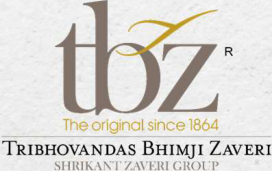

**[Image: f3811c28-18ed-46ea-9677-79c38f494801.pdf-0002-02.png (272x171, 60.1KB)]**

**[Image: f3811c28-18ed-46ea-9677-79c38f494801.pdf-0002-03.png (224x116, 32.3KB)]**

**[Image: f3811c28-18ed-46ea-9677-79c38f494801.pdf-0002-04.png (1650x333, 420.6KB)]**

<!-- Start of picture text -->
INVESTOR PRESENTATION <!-- End of picture text -->

INVESTOR PRESENTATION **Q2 & H1 FY26** 

**[Image: f3811c28-18ed-46ea-9677-79c38f494801.pdf-0002-06.png (1650x207, 235.8KB)]**

<!-- Start of picture text -->
Q2 & H1 FY26 <!-- End of picture text -->

**[Image: f3811c28-18ed-46ea-9677-79c38f494801.pdf-0002-07.png (1650x103, 117.4KB)]**

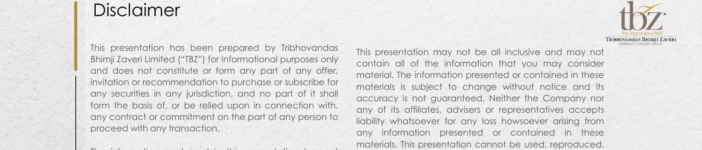

**[Image: f3811c28-18ed-46ea-9677-79c38f494801.pdf-0003-01.png (1650x354, 484.9KB)]**

<!-- Start of picture text -->
Disclaimer This presentation has been prepared by Tribhovandas This presentation may not be all inclusive and may not Bhimji Zaveri Limited (“TBZ”) for informational purposes only contain all of the information that you may consider and does not constitute or form any part of any offer, material. The information presented or contained in these invitation or recommendation to purchase or subscribe for materials is subject to change without notice and its any securities in any jurisdiction, and no part of it shall accuracy is not guaranteed. Neither the Company nor form the basis of, or be relied upon in connection with, any of its affiliates, advisers or representatives accepts any contract or commitment on the part of any person to liability whatsoever for any loss howsoever arising from proceed with any transaction. any information presented or contained in these materials. This presentation cannot be used, reproduced, <!-- End of picture text -->

This presentation may not be all inclusive and may not contain all of the information that you may consider material. The information presented or contained in these materials is subject to change without notice and its accuracy is not guaranteed. Neither the Company nor any of its affiliates, advisers or representatives accepts liability whatsoever for any loss howsoever arising from any information presented or contained in these materials. This presentation cannot be used, reproduced, copied, distributed, shared or disseminated in any manner. No person is authorized to give any information or to make any representation not contained in and not consistent with this presentation and, if given or made, such information or representation must not be relied upon as having been authorized by or on behalf of TBZ. 

The information contained in this presentation has not been independently verified. No representation or warranty, express or implied, is made and no reliance should be placed on the accuracy, fairness or completeness of the information presented or contained in these materials. 

**[Image: f3811c28-18ed-46ea-9677-79c38f494801.pdf-0003-04.png (1650x207, 285.2KB)]**

<!-- Start of picture text -->
copied, distributed, shared or disseminated in any been independently verified. No representation or manner. No person is authorized to give any information warranty, express or implied, is made and no reliance or to make any representation not contained in and not should be placed on the accuracy, fairness or consistent with this presentation and, if given or made, completeness of the information presented or contained such information or representation must not be relied in these materials. upon as having been authorized by or on behalf of TBZ. Any forward-looking statements in this presentation are <!-- End of picture text -->

Any forward-looking statements in this presentation are subject to risks and uncertainties that could cause actual results to differ materially from those that may be inferred to being expressed in, or implied by, such statements. Such forward-looking statements are not indicative or guarantees of future performance. Any forward-looking statements, projections and industry data made by third parties included in this presentation are not adopted by the Company and the Company is not responsible for such third party statements and projections. 

**[Image: f3811c28-18ed-46ea-9677-79c38f494801.pdf-0003-06.png (1650x207, 275.4KB)]**

<!-- Start of picture text -->
subject to risks and uncertainties that could cause actual results to differ materially from those that may be inferred to being expressed in, or implied by, such statements. Such forward-looking statements are not indicative or guarantees of future performance. Any forward-looking statements, projections and industry data made by third parties included in this presentation are not adopted by <!-- End of picture text -->

**[Image: f3811c28-18ed-46ea-9677-79c38f494801.pdf-0003-07.png (51x51, 3.1KB)]**

<!-- Start of picture text -->
02 <!-- End of picture text -->

**[Image: f3811c28-18ed-46ea-9677-79c38f494801.pdf-0003-08.png (1650x103, 125.4KB)]**

<!-- Start of picture text -->
such third party statements and projections. <!-- End of picture text -->

**[Image: f3811c28-18ed-46ea-9677-79c38f494801.pdf-0004-00.png (1650x207, 246.5KB)]**

**[Image: f3811c28-18ed-46ea-9677-79c38f494801.pdf-0004-01.png (151x151, 14.1KB)]**

<!-- Start of picture text -->
04 <!-- End of picture text -->

**[Image: f3811c28-18ed-46ea-9677-79c38f494801.pdf-0004-02.png (1650x207, 236.4KB)]**

<!-- Start of picture text -->
Q2 & H1 FY26 Updates Page 04 <!-- End of picture text -->

**[Image: f3811c28-18ed-46ea-9677-79c38f494801.pdf-0004-03.png (151x150, 13.5KB)]**

<!-- Start of picture text -->
13 <!-- End of picture text -->

**[Image: f3811c28-18ed-46ea-9677-79c38f494801.pdf-0004-04.png (1650x207, 244.2KB)]**

<!-- Start of picture text -->
Page About Us 13 Business Model Page <!-- End of picture text -->

**[Image: f3811c28-18ed-46ea-9677-79c38f494801.pdf-0004-05.png (151x151, 14.3KB)]**

<!-- Start of picture text -->
18 <!-- End of picture text -->

## DISCUSSION SUMMARY 

**[Image: f3811c28-18ed-46ea-9677-79c38f494801.pdf-0004-07.png (1650x207, 247.3KB)]**

<!-- Start of picture text -->
DISCUSSION <!-- End of picture text -->

**[Image: f3811c28-18ed-46ea-9677-79c38f494801.pdf-0004-08.png (51x51, 3.1KB)]**

<!-- Start of picture text -->
03 <!-- End of picture text -->

**[Image: f3811c28-18ed-46ea-9677-79c38f494801.pdf-0004-09.png (1650x103, 121.7KB)]**

**[Image: f3811c28-18ed-46ea-9677-79c38f494801.pdf-0005-01.png (1650x230, 272.0KB)]**

**[Image: f3811c28-18ed-46ea-9677-79c38f494801.pdf-0005-02.png (53x53, 3.3KB)]**

<!-- Start of picture text -->
04 <!-- End of picture text -->

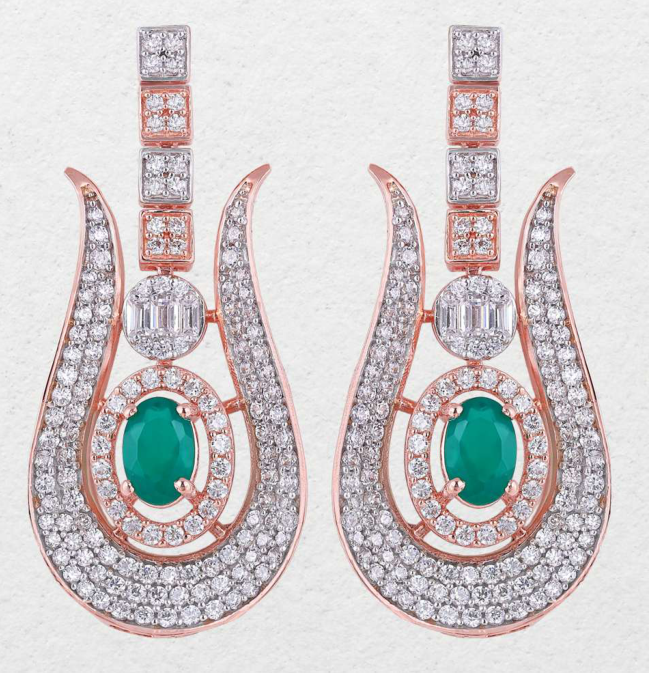

**[Image: f3811c28-18ed-46ea-9677-79c38f494801.pdf-0005-04.png (649x673, 744.0KB)]**

**[Image: f3811c28-18ed-46ea-9677-79c38f494801.pdf-0005-05.png (208x132, 23.9KB)]**

**[Image: f3811c28-18ed-46ea-9677-79c38f494801.pdf-0006-00.png (1650x230, 279.7KB)]**

<!-- Start of picture text -->
Q2 FY26 - Result Highlights ( ₹  In Mn) <!-- End of picture text -->

**[Image: f3811c28-18ed-46ea-9677-79c38f494801.pdf-0006-01.png (220x27, 7.7KB)]**

<!-- Start of picture text -->
13.69% 16.87% <!-- End of picture text -->

**[Image: f3811c28-18ed-46ea-9677-79c38f494801.pdf-0006-02.png (12x12, 0.5KB)]**

**[Image: f3811c28-18ed-46ea-9677-79c38f494801.pdf-0006-03.png (199x25, 7.0KB)]**

<!-- Start of picture text -->
6.39% 9.18% <!-- End of picture text -->

**[Image: f3811c28-18ed-46ea-9677-79c38f494801.pdf-0006-04.png (171x9, 3.5KB)]**

**[Image: f3811c28-18ed-46ea-9677-79c38f494801.pdf-0006-05.png (12x12, 0.4KB)]**

**[Image: f3811c28-18ed-46ea-9677-79c38f494801.pdf-0006-06.png (13x13, 0.5KB)]**

**[Image: f3811c28-18ed-46ea-9677-79c38f494801.pdf-0006-07.png (179x19, 6.0KB)]**

**[Image: f3811c28-18ed-46ea-9677-79c38f494801.pdf-0006-08.png (13x12, 0.5KB)]**

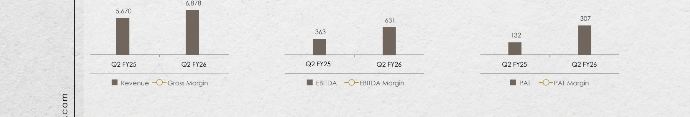

**[Image: f3811c28-18ed-46ea-9677-79c38f494801.pdf-0006-09.png (1650x281, 325.1KB)]**

<!-- Start of picture text -->
6,878 5,670 631  307 363 132 Q2 FY25 Q2 FY26 Q2 FY25 Q2 FY26 Q2 FY25 Q2 FY26 Revenue Gross Margin EBITDA EBITDA Margin PAT PAT Margin <!-- End of picture text -->

**[Image: f3811c28-18ed-46ea-9677-79c38f494801.pdf-0006-10.png (1650x207, 216.2KB)]**

<!-- Start of picture text -->
Expenses as a % of Total Revenue 3.25% 2.02% 2.42% 3.95% 1.80% 1.55% Q2 FY26 Q2 FY25 <!-- End of picture text -->

**[Image: f3811c28-18ed-46ea-9677-79c38f494801.pdf-0006-11.png (51x51, 3.1KB)]**

<!-- Start of picture text -->
05 <!-- End of picture text -->

**[Image: f3811c28-18ed-46ea-9677-79c38f494801.pdf-0006-12.png (1650x103, 121.7KB)]**

<!-- Start of picture text -->
Manpower Advertisement Other Overheads <!-- End of picture text -->

**[Image: f3811c28-18ed-46ea-9677-79c38f494801.pdf-0007-00.png (1650x230, 278.9KB)]**

<!-- Start of picture text -->
H1 FY26 - Result Highlights ( ₹   In Mn) <!-- End of picture text -->

**[Image: f3811c28-18ed-46ea-9677-79c38f494801.pdf-0007-01.png (12x13, 0.5KB)]**

**[Image: f3811c28-18ed-46ea-9677-79c38f494801.pdf-0007-02.png (171x11, 4.0KB)]**

**[Image: f3811c28-18ed-46ea-9677-79c38f494801.pdf-0007-03.png (12x12, 0.5KB)]**

**[Image: f3811c28-18ed-46ea-9677-79c38f494801.pdf-0007-04.png (199x26, 7.2KB)]**

<!-- Start of picture text -->
6.78% 8.73% <!-- End of picture text -->

**[Image: f3811c28-18ed-46ea-9677-79c38f494801.pdf-0007-05.png (12x13, 0.5KB)]**

**[Image: f3811c28-18ed-46ea-9677-79c38f494801.pdf-0007-06.png (13x12, 0.5KB)]**

**[Image: f3811c28-18ed-46ea-9677-79c38f494801.pdf-0007-07.png (179x13, 4.9KB)]**

**[Image: f3811c28-18ed-46ea-9677-79c38f494801.pdf-0007-08.png (13x13, 0.5KB)]**

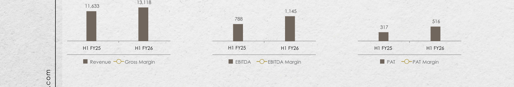

**[Image: f3811c28-18ed-46ea-9677-79c38f494801.pdf-0007-09.png (1650x283, 326.0KB)]**

<!-- Start of picture text -->
13,118 11,633 1,145 788 516 317 H1 FY25 H1 FY26 H1 FY25 H1 FY26 H1 FY25 H1 FY26 Revenue Gross Margin EBITDA EBITDA Margin PAT PAT Margin <!-- End of picture text -->

**[Image: f3811c28-18ed-46ea-9677-79c38f494801.pdf-0007-10.png (1650x207, 215.4KB)]**

<!-- Start of picture text -->
Expenses as a % of Total Revenue 3.61% 2.20% 1.99% 3.81% 1.82% 1.65% H1 FY26 H1 FY25 <!-- End of picture text -->

**[Image: f3811c28-18ed-46ea-9677-79c38f494801.pdf-0007-11.png (51x51, 3.1KB)]**

<!-- Start of picture text -->
06 <!-- End of picture text -->

**[Image: f3811c28-18ed-46ea-9677-79c38f494801.pdf-0007-12.png (1650x103, 121.7KB)]**

<!-- Start of picture text -->
Manpower Advertisement Other Overheads <!-- End of picture text -->

**[Image: f3811c28-18ed-46ea-9677-79c38f494801.pdf-0008-00.png (169x109, 22.2KB)]**

### Q2 & H1 FY26Key Takeaways 

• The Company’s revenue from operations increased by 21.30% YoY in Q2 FY26, reaching ₹ 6,878.28 million. For H1 FY26, revenue stood at ₹ 13,118.35 million, reflecting a 12.77% growth compared to the same period last year. 

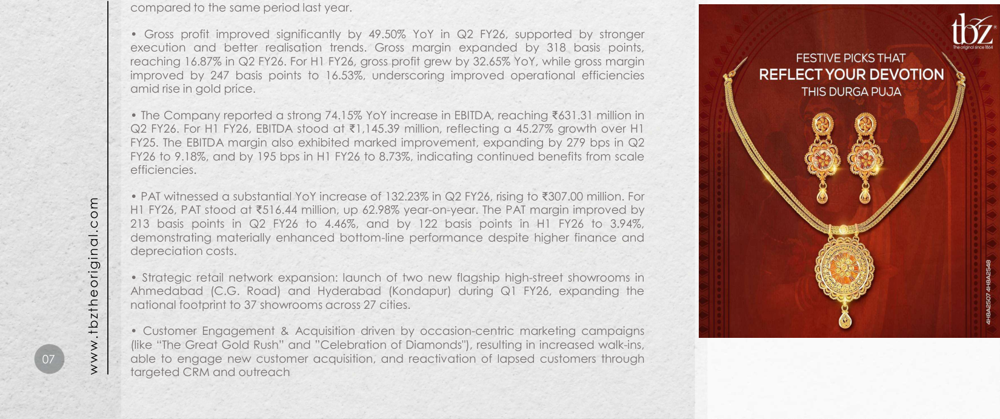

**[Image: f3811c28-18ed-46ea-9677-79c38f494801.pdf-0008-03.png (1650x692, 1310.8KB)]**

<!-- Start of picture text -->
compared to the same period last year. • Gross profit improved significantly by 49.50% YoY in Q2 FY26, supported by stronger execution and better realisation trends. Gross margin expanded by 318 basis points, reaching 16.87% in Q2 FY26. For H1 FY26, gross profit grew by 32.65% YoY, while gross margin improved by 247 basis points to 16.53%, underscoring improved operational efficiencies amid rise in gold price. • The Company reported a strong 74.15% YoY increase in EBITDA, reaching ₹ 631.31 million in Q2 FY26. For H1 FY26, EBITDA stood at ₹ 1,145.39 million, reflecting a 45.27% growth over H1 FY25. The EBITDA margin also exhibited marked improvement, expanding by 279 bps in Q2 FY26 to 9.18%, and by 195 bps in H1 FY26 to 8.73%, indicating continued benefits from scale efficiencies. • PAT witnessed a substantial YoY increase of 132.23% in Q2 FY26, rising to ₹ 307.00 million. For H1 FY26, PAT stood at ₹ 516.44 million, up 62.98% year-on-year. The PAT margin improved by 213 basis points in Q2 FY26 to 4.46%, and by 122 basis points in H1 FY26 to 3.94%, demonstrating materially enhanced bottom-line performance despite higher finance and depreciation costs. • Strategic retail network expansion: launch of two new flagship high-street showrooms in Ahmedabad (C.G. Road) and Hyderabad (Kondapur) during Q1 FY26, expanding the national footprint to 37 showrooms across 27 cities. • Customer Engagement & Acquisition driven by occasion-centric marketing campaigns (like “The Great Gold Rush” and ”Celebration of Diamonds"), resulting in increased walk-ins, 07 able to engage new customer acquisition, and reactivation of lapsed customers through targeted CRM and outreach www.tbztheoriginal.com <!-- End of picture text -->

**[Image: f3811c28-18ed-46ea-9677-79c38f494801.pdf-0008-04.png (497x276, 278.1KB)]**

**[Image: f3811c28-18ed-46ea-9677-79c38f494801.pdf-0008-05.png (497x276, 238.6KB)]**

### Q2 & H1FY26Standalone Profit & Loss Statement 

**[Image: f3811c28-18ed-46ea-9677-79c38f494801.pdf-0009-01.png (170x109, 27.3KB)]**

( ₹ In Mn) 

|**Particulars**|**Q2FY26**|**Q2FY25**|**YoY%**|**H1FY26**|**H1FY25**|**YoY%**|
|---|---|---|---|---|---|---|
|**Revenue From Operation**|**6,878.28**|**5,670.47**|**21.30%**|**13,118.35**|**11,632.90**|**12.77%**|
|COGS|5,717.75|4,894.19|16.83%|10,949.39|9,997.78|9.52%|
|**Gross Profit**|**1,160.53**|**776.28**|**49.50%**|**2,168.96**|**1,635.12**|**32.65%**|
|**Gross Margin %**|**16.87%**|**13.69%**|**318 bps**|**16.53%**|**14.06%**|**247 bps**|
|Employee Expenses|223.85|223.99|-0.06%|473.71|443.53|6.80%|
|Other Expenses|305.37|189.78|60.91%|549.86|403.12|36.40%|
|**EBIDTA**|**631.31**|**362.51**|**74.15%**|**1,145.39**|**788.47**|**45.27%**|
|**EBIDTA Margin %**|**9.18%**|**6.39%**|**279 bps**|**8.73%**|**6.78%**|**195 bps**|
|Finance Cost|164.84|131.09|25.74%|341.62|259.12|31.84%|
|Depreciation|75.81|60.79|24.71%|149.26|121.81|22.53%|
|Other Income|19.82|13.95|42.10%|38.35|25.19|52.26%|
|**Profit Before Tax**|**410.48**|**184.57**|122.39%|**692.87**|**432.73**|**60.11%**|
|Taxes|103.47|52.38|97.56%|176.42|115.85|52.29%|
|**Profit after Tax***|**307.00**|**132.20**|132.23%|**516.44**|**316.88**|**62.98%**|
|**PAT Margin %**|**4.46%**|**2.33%**|**213 bps**|**3.94%**|**2.72%**|**122 bps**|

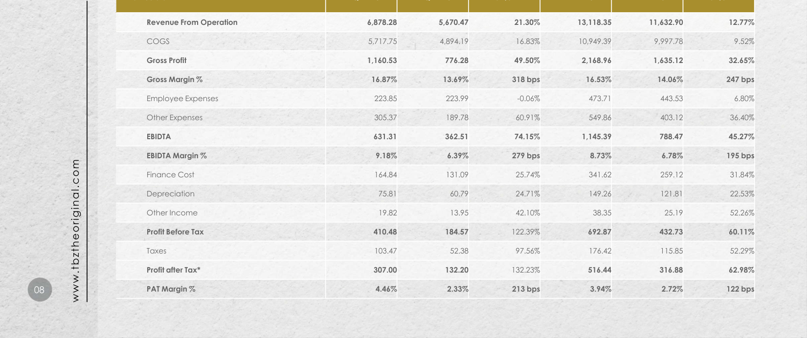

**[Image: f3811c28-18ed-46ea-9677-79c38f494801.pdf-0009-04.png (1650x692, 735.5KB)]**

<!-- Start of picture text -->
Revenue From Operation 6,878.28  5,670.47  21.30% 13,118.35  11,632.90  12.77% COGS 5,717.75  4,894.19  16.83% 10,949.39  9,997.78  9.52% Gross Profit 1,160.53  776.28  49.50% 2,168.96  1,635.12  32.65% Gross Margin % 16.87% 13.69% 318 bps 16.53% 14.06% 247 bps Employee Expenses 223.85  223.99  -0.06% 473.71  443.53  6.80% Other Expenses 305.37  189.78  60.91% 549.86  403.12  36.40% EBIDTA 631.31  362.51  74.15% 1,145.39  788.47  45.27% EBIDTA Margin % 9.18% 6.39% 279 bps 8.73% 6.78% 195 bps Finance Cost 164.84  131.09  25.74% 341.62  259.12  31.84% Depreciation 75.81  60.79  24.71% 149.26  121.81  22.53% Other Income 19.82  13.95  42.10% 38.35  25.19  52.26% Profit Before Tax 410.48  184.57  122.39% 692.87  432.73  60.11% Taxes 103.47  52.38  97.56% 176.42  115.85  52.29% Profit after Tax* 307.00  132.20  132.23% 516.44  316.88  62.98% 08 PAT Margin % 4.46% 2.33% 213 bps 3.94% 2.72% 122 bps www.tbztheoriginal.com <!-- End of picture text -->

**[Image: f3811c28-18ed-46ea-9677-79c38f494801.pdf-0010-00.png (53x53, 3.3KB)]**

<!-- Start of picture text -->
09 <!-- End of picture text -->

Our newly opened stores in H1FY26: Ahmedabad & Hyderabad (opened in April 2025) 

**[Image: f3811c28-18ed-46ea-9677-79c38f494801.pdf-0010-02.png (170x109, 27.3KB)]**

**[Image: f3811c28-18ed-46ea-9677-79c38f494801.pdf-0010-03.png (586x326, 372.6KB)]**

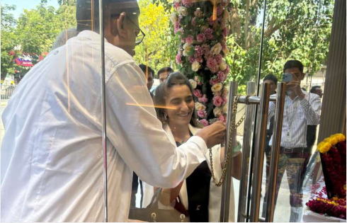

**[Image: f3811c28-18ed-46ea-9677-79c38f494801.pdf-0010-04.png (490x315, 404.6KB)]**

**[Image: f3811c28-18ed-46ea-9677-79c38f494801.pdf-0010-05.png (490x376, 352.3KB)]**

**[Image: f3811c28-18ed-46ea-9677-79c38f494801.pdf-0010-06.png (586x362, 416.0KB)]**

**[Image: f3811c28-18ed-46ea-9677-79c38f494801.pdf-0011-01.png (53x53, 3.2KB)]**

<!-- Start of picture text -->
10 <!-- End of picture text -->

### Marketing Initiatives During Q2FY26 

Multi-Channel Marketing, New Product Stories, and Store Expansion Driving Growth 

###### **Customer Engagement** 

- Customer Engagement 

- 57,000+ walk-ins were recorded in Q2 FY26, sustaining strong footfall momentum through a transitional, pre-festive quarter. 

- The customer mix remained well balanced, with 40%-45% new customers, 45%-50% active customers and retain lapsed buyers through CRM (WhatsApp/SMS/RCS), digital campaigns, exhibitions, press advertising, on-ground calling and limited-period schemes. 

- Targeted festive-readiness initiatives, curated invitations and topical campaigns helped convert traffic more effectively and strengthened the overall quality of store conversions. 

###### **Key Campaigns (July–September 2025)** 

###### 1. “ **Celebration of Diamonds” – July** 

- The quarter opened with TBZ’s signature Diamond Festival, now an established and distinctive brand property. 

- A 360° media presence spanned press, outdoor, radio, digital, CRM outreach, YouTube and influencer collaborations. 

- Shoot-led creatives, client testimonials and a virtual store walkthrough deepened emotional connect and lifted digital engagement metrics. 

###### 2. “ **The Great Gold Rush” – August** 

- Against the backdrop of rising gold prices, TBZ converted sentiment into action through a focused three-day gold-buying festival. 

- High-frequency promotion across print, digital, CRM calls/messages and strong in-store visibility created urgency and drove footfalls. 

- Region-specific campaigns such as Varalakshmi Vratham in the South and 160-year Founder’s Day celebrations added richness, backed by special making-charge benefits and heritage-led storytelling. 

###### **3. “Tyohaar Matlab TBZ” – September** 

- The festive season was activated with TBZ’s flagship festive IP covering Ganesh Chaturthi, Hartalika Teej, Durga Pujo, Navratri and other key occasions. 

- A high-decibel 360° festive campaign featuring brand ambassador Sara Ali Khan was rolled out, supported by national offers and bank-led promotions. 

- A partnership with HDFC Bank provided an attractive ₹5,000 instant discount to accelerate purchase decisions. 

- The relaunch of the Rudraya (Om Rudraksha) Collection reinforced TBZ’s festive-spiritual positioning and broadened its appeal in the auspicious-wear space 

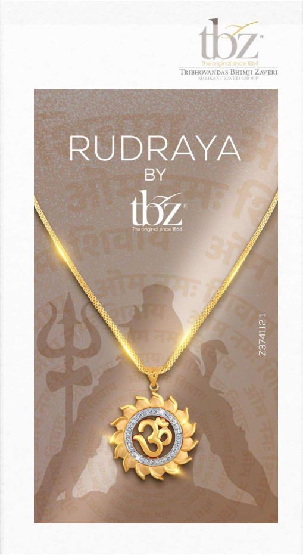

**[Image: f3811c28-18ed-46ea-9677-79c38f494801.pdf-0011-23.png (509x931, 687.9KB)]**

**[Image: f3811c28-18ed-46ea-9677-79c38f494801.pdf-0012-00.png (172x107, 16.0KB)]**

### Marketing Initiatives contd. During the Quarter 

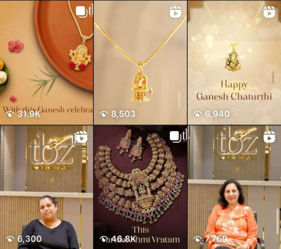

**[Image: f3811c28-18ed-46ea-9677-79c38f494801.pdf-0012-02.png (476x422, 390.9KB)]**

###### **Digital Momentum** 

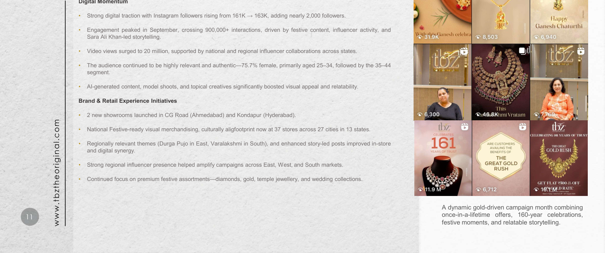

**[Image: f3811c28-18ed-46ea-9677-79c38f494801.pdf-0012-04.png (1650x692, 1209.7KB)]**

<!-- Start of picture text -->
Digital Momentum • Strong digital traction with Instagram followers rising from 161K →163K, adding nearly 2,000 followers. • Engagement peaked in September, crossing 900,000+ interactions, driven by festive content, influencer activity, and Sara Ali Khan-led storytelling. • Video views surged to 20 million, supported by national and regional influencer collaborations across states. • The audience continued to be highly relevant and authentic—75.7% female, primarily aged 25–34, followed by the 35–44 segment. • AI-generated content, model shoots, and topical creatives significantly boosted visual appeal and relatability. Brand & Retail Experience Initiatives • 2 new showrooms launched in CG Road (Ahmedabad) and Kondapur (Hyderabad). • National Festive-ready visual merchandising, culturally aligfootprint now at 37 stores across 27 cities in 13 states. • Regionally relevant themes (Durga Pujo in East, Varalakshmi in South), and enhanced story-led posts improved in-store and digital synergy. • Strong regional influencer presence helped amplify campaigns across East, West, and South markets. • Continued focus on premium festive assortments—diamonds, gold, temple jewellery, and wedding collections. A dynamic gold-driven campaign month combining 11 once-in-a-lifetime offers, 160-year celebrations, www.tbztheoriginal.com festive moments, and relatable storytelling. <!-- End of picture text -->

**[Image: f3811c28-18ed-46ea-9677-79c38f494801.pdf-0013-00.png (53x53, 3.2KB)]**

<!-- Start of picture text -->
12 <!-- End of picture text -->

Marketing Initiatives contd. During the Quarter 

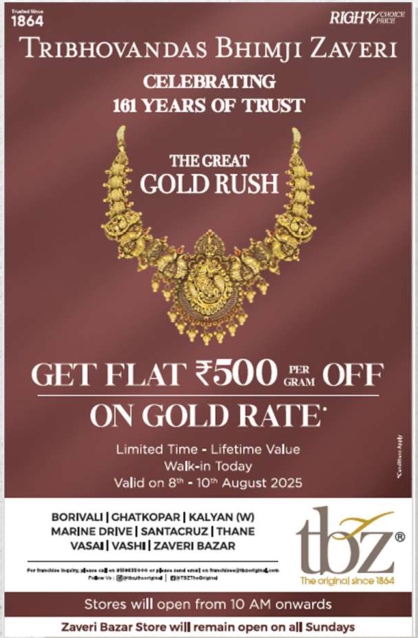

**[Image: f3811c28-18ed-46ea-9677-79c38f494801.pdf-0013-03.png (418x638, 294.6KB)]**

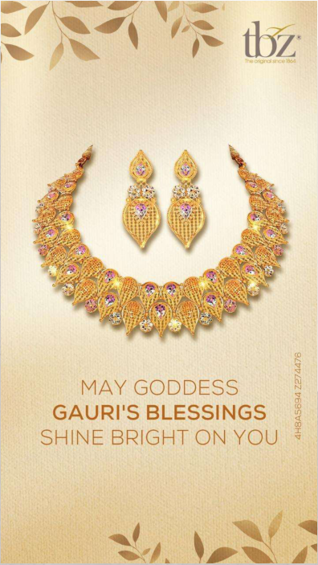

**[Image: f3811c28-18ed-46ea-9677-79c38f494801.pdf-0013-04.png (396x703, 480.5KB)]**

**[Image: f3811c28-18ed-46ea-9677-79c38f494801.pdf-0013-05.png (170x109, 24.1KB)]**

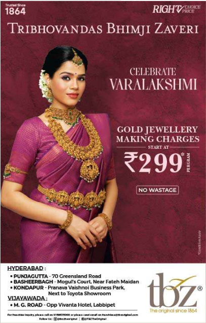

**[Image: f3811c28-18ed-46ea-9677-79c38f494801.pdf-0013-06.png (407x636, 487.9KB)]**

**[Image: f3811c28-18ed-46ea-9677-79c38f494801.pdf-0014-00.png (1650x230, 276.3KB)]**

<!-- Start of picture text -->
US <!-- End of picture text -->

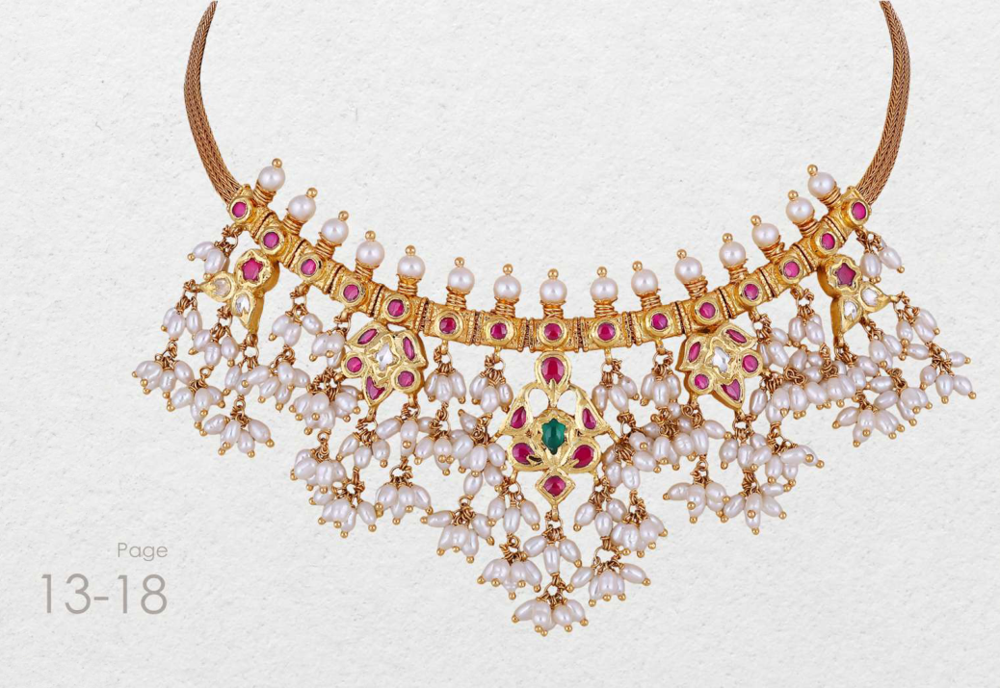

**[Image: f3811c28-18ed-46ea-9677-79c38f494801.pdf-0014-02.png (1038x715, 1022.1KB)]**

**[Image: f3811c28-18ed-46ea-9677-79c38f494801.pdf-0014-04.png (53x53, 3.2KB)]**

<!-- Start of picture text -->
13 <!-- End of picture text -->

**[Image: f3811c28-18ed-46ea-9677-79c38f494801.pdf-0015-00.png (1650x354, 379.3KB)]**

<!-- Start of picture text -->
Why is TBZ Different? TBZ Trusted / Competitive Advantages <!-- End of picture text -->

|Pedigree • 160 years in jewellery business • First jewelers to offer buyback guarantee in 1938|160 years of Strong Brand Value • Healthy sales productivity • High footfalls Trusted|Leader in Specialty Wedding & Occasion Jewellery • Leader of jewellery in Indian market • ~ 65% of sales are   Design Exclusivity • 8 - 10 new jewellery lines/year • In-house diamond jewellery production TBZ / Competitive Advantages|Scalability & Reach • 37 stores (1,00,000+ ft.) • Presence – 27 cities, 13 states • New store opened in Pink City- Jaipur in Q1FY25, and|
|---|---|---|---|
|• Professional organization spearheaded by 5th generation of the family|conversion • Multigenerational clientele|wedding & occasion related purchases • Compulsion buying • Stable fixed budget purchases by customers • Customer loyalty • Premium pricing|Bhubaneshwar & Rourkela stores opening in H1FY25. • 2 new stores added in April 2025, Ahmedabad & Hyderabad, making 37 stores at present.|

**[Image: f3811c28-18ed-46ea-9677-79c38f494801.pdf-0015-02.png (1650x207, 266.4KB)]**

<!-- Start of picture text -->
Leader in Scalability & Specialty Pedigree Reach 160 years of  Wedding &  Design Strong  Occasion  Exclusivity • 37 stores (1,00,000+ ft.) • 160 years in jewellery Brand Value Jewellery • <!-- End of picture text -->

**[Image: f3811c28-18ed-46ea-9677-79c38f494801.pdf-0015-04.png (1650x207, 290.8KB)]**

<!-- Start of picture text -->
business • 8 - 10 new jewellery 13 states • First jewelers to offerbuyback guarantee in  • Healthy sales productivity • Leader of jewellery in Indian market  • lines/yearIn-house diamond  • New store opened in Pink City- Jaipur in 1938 • High footfalls  • ~ 65% of sales are  jewellery production Q1FY25, and • Professional conversion wedding & occasion  • Customer loyalty Bhubaneshwar & organization related purchases Rourkela stores opening spearheaded by 5 th • Multigenerational clientele  • Compulsion buying • Premium pricing in H1FY25. <!-- End of picture text -->

**[Image: f3811c28-18ed-46ea-9677-79c38f494801.pdf-0015-05.png (51x51, 2.9KB)]**

<!-- Start of picture text -->
14 <!-- End of picture text -->

**[Image: f3811c28-18ed-46ea-9677-79c38f494801.pdf-0015-06.png (1650x103, 136.0KB)]**

<!-- Start of picture text -->
• 2 new stores added in • family Stable fixed budget April 2025, Ahmedabad purchases by & Hyderabad, making customers 37 stores at present. <!-- End of picture text -->

### Distinctive Competitive Advantage: Multigenerational Clientele 

**[Image: f3811c28-18ed-46ea-9677-79c38f494801.pdf-0016-01.png (170x109, 27.3KB)]**

##### Enhanced Brand Awareness: 

Deepened Customer Relationships: 

##### Generational Clientele Strength: 

A multigenerational client base also bolsters brand awareness. Older generations share their positive experiences with younger family members, leading to word-of-mouth referrals and increased market visibility for the Company. z **z** z 

Lastly, a multigenerational client base enables TBZ Ltd to strengthen customer relationships. Leveraging families' emotional connections with their jewellery, the Company can establish a deeper bond with customers, increasing satisfaction and loyalty. 

TBZ's multigenerational client base is a significant strength, fostering long-term customer relationships. Families purchasing jewellery from TBZ Ltd. for generations are more likely to continue doing so, resulting in a steady stream of repeat business for the Company. 

z z z zzz **z** zzz z z Diversified Revenue Informed Product Streams: A multigenerational client Development: base allows TBZ Ltd to diversify its revenue TBZ Ltd.’s multigenerational client base streams. By catering to diverse customers provides valuable feedback, offering insights with varying preferences and budgets, the into changing preferences and trends Company can mitigate market fluctuations among different age groups. This information and maintain a stable revenue stream. enables the Company to refine its product development and marketing strategies. 

**[Image: f3811c28-18ed-46ea-9677-79c38f494801.pdf-0016-09.png (55x54, 6.9KB)]**

<!-- Start of picture text -->
zzz <!-- End of picture text -->

**[Image: f3811c28-18ed-46ea-9677-79c38f494801.pdf-0016-10.png (52x54, 7.1KB)]**

<!-- Start of picture text -->
zzz <!-- End of picture text -->

**[Image: f3811c28-18ed-46ea-9677-79c38f494801.pdf-0016-12.png (1650x207, 276.3KB)]**

<!-- Start of picture text -->
Diversified Revenue Informed Product Streams: A multigenerational client Development: base allows TBZ Ltd to diversify its revenue TBZ Ltd.’s multigenerational client base streams. By catering to diverse customers provides valuable feedback, offering insights with varying preferences and budgets, the into changing preferences and trends Company can mitigate market fluctuations among different age groups. This information <!-- End of picture text -->

**[Image: f3811c28-18ed-46ea-9677-79c38f494801.pdf-0016-13.png (51x51, 3.0KB)]**

<!-- Start of picture text -->
15 <!-- End of picture text -->

**[Image: f3811c28-18ed-46ea-9677-79c38f494801.pdf-0016-14.png (1650x103, 128.2KB)]**

<!-- Start of picture text -->
and maintain a stable revenue stream. enables the Company to refine its product development and marketing strategies. <!-- End of picture text -->

**[Image: f3811c28-18ed-46ea-9677-79c38f494801.pdf-0017-01.png (53x53, 3.2KB)]**

<!-- Start of picture text -->
16 <!-- End of picture text -->

# Key Milestones 

**[Image: f3811c28-18ed-46ea-9677-79c38f494801.pdf-0017-03.png (170x109, 27.3KB)]**

#### Strong Legacy Of More Than 160 Years Built On Trust 

(Calendar Years) Diamond facility expansion - ~6k to ~24k sq ft Flagship store Mr. Shrikant Zaveri Introduced 100% Turnover crossed Listed on BSE & NSE opened in Zaveri First to offer First to launch light took over the pre- hallmarked INR ` 5,000 mn in Implementation of with IPO of INR Bazaar, Mumbai buyback guarantee weight jewellery business jewellery FY09 Oracle ERP Suite 2,000 mn 1864 1938 1995 2001 2004 2009 2011 2012 2025 2024 2022 2019 2017 2016 2015 2014 2013 New store Opened store in Opened store in 3 franchise stores 2nd Franchise 1st Franchise store Recommended Retail footprint Kalyan on Oct-5th Lucknow in Marchopened in Ranchi, store opened at opened at special dividend crosses 84k sq ft New stores opened in Ahemdabad & ((Nov-23) and Vapi- GIDC opened in in 2022 19 Jharkhand in Mar-Gujarat in Apr-17, 17, Jamnagar, Patna, Bihar in Aug-16 Jharkhand in Dhanbad, Nov-15 of 7.5% on the occasion of special across 26 citiesSales crossed Hyderabad (April-25). Jaipur (Jun-24) in Pink CityMadhya Pradesh and Bhopal, 150th year of the PAT of INR 16,000 mn, ` 850 mn company alongside in Oct-17 Bhabaneshwar 3 exclusive brand (Sep-24) & outlets opened in Rourkela (OctMalls – R-City, 24) Seawoods in Sep17 and High Street Phoenix – in Mumbai in Nov-17 

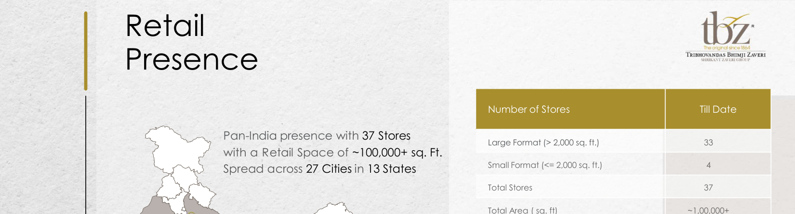

**[Image: f3811c28-18ed-46ea-9677-79c38f494801.pdf-0018-00.png (1650x446, 451.8KB)]**

<!-- Start of picture text -->
Retail Presence Number of Stores Till Date Pan-India presence with 37 Stores Large Format (> 2,000 sq. ft.) 33 with a Retail Space of ~100,000+ sq. Ft. Spread across 27 Cities in 13 States Small Format (<= 2,000 sq. ft.) 4 Total Stores 37 Total Area ( sq. ft) ~1,00,000+ <!-- End of picture text -->

**[Image: f3811c28-18ed-46ea-9677-79c38f494801.pdf-0018-01.png (1650x207, 350.2KB)]**

<!-- Start of picture text -->
Total Stores 37 Total Area ( sq. ft) ~1,00,000+ Noida Jaipur Lucknow Udaipur Patna GandhidhamAhmedabad-2Ahmedabad-2 Dhanbad Rajkot VadodaraIndore JamshedpurRanchi Kolkata -2 Bhavnagar Surat Raipur Rourkela <!-- End of picture text -->

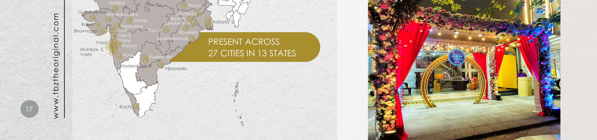

**[Image: f3811c28-18ed-46ea-9677-79c38f494801.pdf-0018-02.png (1650x388, 929.7KB)]**

<!-- Start of picture text -->
Udaipur Patna GandhidhamAhmedabad-2Ahmedabad-2 Dhanbad Indore Ranchi Kolkata -2 Rajkot VadodaraIndore JamshedpurRanchi Bhavnagar Surat Raipur Rourkela Vapi-2 Vasai Thane Bhubaneshwar PRESENT ACROSS Kalyan Mumbai- 5, Vashi Pune Punjagutta 27 CITIES IN 13 STATES Hyderabad- 2 Vijaywada 17 Kochi www.tbztheoriginal.com <!-- End of picture text -->

**[Image: f3811c28-18ed-46ea-9677-79c38f494801.pdf-0018-03.png (1650x103, 219.0KB)]**

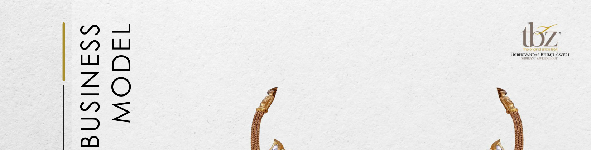

**[Image: f3811c28-18ed-46ea-9677-79c38f494801.pdf-0019-00.png (1650x421, 529.2KB)]**

<!-- Start of picture text -->
BUSINESS MODEL <!-- End of picture text -->

**[Image: f3811c28-18ed-46ea-9677-79c38f494801.pdf-0019-01.png (1055x343, 456.3KB)]**

**[Image: f3811c28-18ed-46ea-9677-79c38f494801.pdf-0019-02.png (1102x344, 644.7KB)]**

**[Image: f3811c28-18ed-46ea-9677-79c38f494801.pdf-0019-03.png (53x53, 3.2KB)]**

<!-- Start of picture text -->
18 <!-- End of picture text -->

### Business Model: Manufacturing 

**[Image: f3811c28-18ed-46ea-9677-79c38f494801.pdf-0020-01.png (170x109, 27.3KB)]**

Gold 

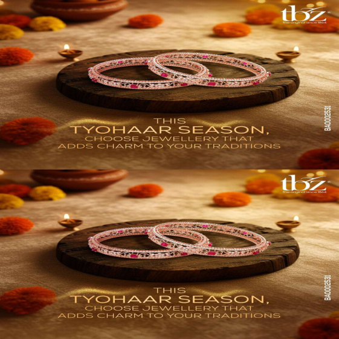

**[Image: f3811c28-18ed-46ea-9677-79c38f494801.pdf-0020-03.png (561x561, 699.2KB)]**

**[Image: f3811c28-18ed-46ea-9677-79c38f494801.pdf-0020-04.png (66x277, 14.1KB)]**

<!-- Start of picture text -->
Procurement <!-- End of picture text -->

   - Raw Material - Bullion 

- Sources: 

- • • • 

   - Banks – Gold on loan 

   - Exchange & purchase of old jewellery 

   - Bullion dealers 

**[Image: f3811c28-18ed-46ea-9677-79c38f494801.pdf-0020-11.png (66x276, 13.2KB)]**

<!-- Start of picture text -->
Manufacturing <!-- End of picture text -->

- Gold jewellery manufacturing is outsourced. 

- Vast nation-wide network of 150+ vendors 

- Each vendor has an annual gold processing capacity of more than 100 kg. 

- These vendors are associated with TBZ since generations and are experts in handmade regional jewellery designs. 

**[Image: f3811c28-18ed-46ea-9677-79c38f494801.pdf-0020-16.png (51x51, 3.0KB)]**

<!-- Start of picture text -->
19 <!-- End of picture text -->

**[Image: f3811c28-18ed-46ea-9677-79c38f494801.pdf-0020-17.png (1650x103, 116.8KB)]**

**[Image: f3811c28-18ed-46ea-9677-79c38f494801.pdf-0021-00.png (170x109, 27.3KB)]**

Business Model: contd. Manufacturing 

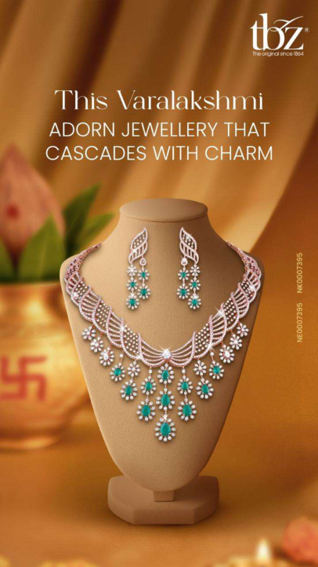

**[Image: f3811c28-18ed-46ea-9677-79c38f494801.pdf-0021-02.png (406x722, 507.7KB)]**

Diamond 

**[Image: f3811c28-18ed-46ea-9677-79c38f494801.pdf-0021-04.png (66x277, 14.1KB)]**

<!-- Start of picture text -->
Procurement <!-- End of picture text -->

- Raw Material - Cut & polished diamonds 

   - Sources: 

- DTC site holders 

**[Image: f3811c28-18ed-46ea-9677-79c38f494801.pdf-0021-09.png (66x276, 13.1KB)]**

<!-- Start of picture text -->
Manufacturing <!-- End of picture text -->

- In-house diamond jewellery manufacturing leading to exclusive designs, lower costs, and higher margins 

- Owned manufacturing facility at Kandivali, Mumbai 

- The facility also has a sizeable capacity for gold refining and matching capacity for jewellery components manufacturing 

**[Image: f3811c28-18ed-46ea-9677-79c38f494801.pdf-0021-13.png (51x51, 3.1KB)]**

<!-- Start of picture text -->
20 <!-- End of picture text -->

**[Image: f3811c28-18ed-46ea-9677-79c38f494801.pdf-0021-14.png (1650x103, 143.9KB)]**

### Gold Metal Loan: Efficient Sourcing Channel 

**[Image: f3811c28-18ed-46ea-9677-79c38f494801.pdf-0022-01.png (170x109, 27.3KB)]**

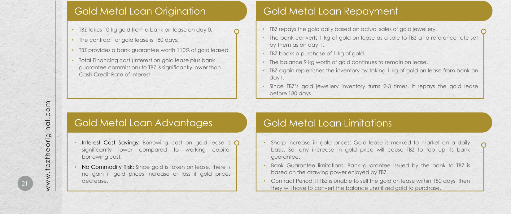

**[Image: f3811c28-18ed-46ea-9677-79c38f494801.pdf-0022-02.png (1650x692, 823.6KB)]**

<!-- Start of picture text -->
Gold Metal Loan Origination Gold Metal Loan Repayment • TBZ takes 10 kg gold from a bank on lease on day 0. • TBZ repays the gold daily based on actual sales of gold jewellery. • • The bank converts 1 kg of gold on lease as a sale to TBZ at a reference rate set The contract for gold lease is 180 days. by them as on day 1. • TBZ provides a bank guarantee worth 110% of gold leased. • TBZ books a purchase of 1 kg of gold. • Total Financing cost (interest on gold lease plus bank  • The balance 9 kg worth of gold continues to remain on lease. guarantee commission) to TBZ is significantly lower than  • TBZ again replenishes the inventory by taking 1 kg of gold on lease from bank on Cash Credit Rate of Interest day1. • Since TBZ’s gold jewellery inventory turns 2-3 times, it repays the gold lease before 180 days. Gold Metal Loan Advantages Gold Metal Loan Limitations • Interest Cost Savings: Borrowing cost on gold lease is • Sharp increase in gold prices: Gold lease is marked to market on a daily significantly lower compared to working capital basis. So, any increase in gold price will cause TBZ to top up its bank borrowing cost. guarantee. • No Commodity Risk: Since gold is taken on lease, there is • Bank Guarantee limitations: Bank guarantee issued by the bank to TBZ is no gain if gold prices increase or loss if gold prices based on the drawing power enjoyed by TBZ. 21 decrease. • Contract Period: If TBZ is unable to sell the gold on lease within 180 days, then www.tbztheoriginal.com they will have to convert the balance unutilized gold to purchase. <!-- End of picture text -->

**[Image: f3811c28-18ed-46ea-9677-79c38f494801.pdf-0023-01.png (53x53, 3.2KB)]**

<!-- Start of picture text -->
22 <!-- End of picture text -->

**[Image: f3811c28-18ed-46ea-9677-79c38f494801.pdf-0023-02.png (170x109, 27.3KB)]**

### Securing Future Growth: Our Strategic Pillars 

**[Image: f3811c28-18ed-46ea-9677-79c38f494801.pdf-0023-04.png (296x145, 49.1KB)]**

160 years of Brand Value Leverage: TBZ Ltd boasts substantial brand value and a long-standing reputation for quality and craftsmanship. With over 160 years in business, the brand is recognized and trusted by multigenerational customers across India, providing a significant competitive advantage and positioning the Company for continued growth. 

##### Diversified Portfolio Growth: 

**[Image: f3811c28-18ed-46ea-9677-79c38f494801.pdf-0023-07.png (226x132, 17.7KB)]**

TBZ Ltd maintains a diversified product portfolio featuring gold, diamond, and other precious gemstone jewellery. By offering various price points to cater to different customer segments, the Company intends to mitigate market fluctuations' impact and generate a stable revenue stream. 

**[Image: f3811c28-18ed-46ea-9677-79c38f494801.pdf-0023-09.png (115x116, 8.2KB)]**

**[Image: f3811c28-18ed-46ea-9677-79c38f494801.pdf-0023-10.png (116x116, 8.5KB)]**

Financial Performance Strength: 

TBZ Ltd is on track to deliver steadily improving financial performance, with consistent revenue growth and profitability. The solid balance sheet, lowering debt levels, and strong cash position sets the Company up for continued growth and expansion in India's exciting growth story. 

**[Image: f3811c28-18ed-46ea-9677-79c38f494801.pdf-0023-13.png (132x222, 25.1KB)]**

**[Image: f3811c28-18ed-46ea-9677-79c38f494801.pdf-0023-14.png (132x222, 24.0KB)]**

##### Retail Expansion Focus: 

**[Image: f3811c28-18ed-46ea-9677-79c38f494801.pdf-0023-16.png (159x103, 22.8KB)]**

TBZ Ltd focuses on organic growth through its network of stores and judiciously expanding its retail footprint across India by opening new stores in key locations. This strategy will allow the Company to increase its market share and attract new customers. The focus on retail expansion enables TBZ Ltd to leverage its brand value and capture new growth opportunities. 

**[Image: f3811c28-18ed-46ea-9677-79c38f494801.pdf-0024-01.png (53x53, 3.2KB)]**

<!-- Start of picture text -->
23 <!-- End of picture text -->

### Steadfast market steeped in tradition and innovation 

##### GDP Contribution and Cultural Significance: 

The gems and jewellery market contributes approximately 7.5% to India’s GDP and 14% to total merchandise exports (IBEF Research). Gold, symbolizing wealth and prosperity, is integral to Indian culture and ceremonies, ensuring continued demand. 

##### Expanding Middle Class and Disposable Income: 

India's middle class is projected to grow from ~30% of the population in 2021 to >60% by 2047 (PRICE Market Research Report). Rising disposable incomes will likely increase spending on luxury items like high-quality, branded jewellery. 

##### Steadfast Market Growth: 

The market was valued at $78.50 billion in 2021 and is expected to reach $119.80 billion by 2027, with a CAGR of 8.34%. The popularity of costume and fashion jewellery, especially among younger consumers, contributes to this growth as they seek affordable and versatile options. 

##### Fashion Jewellery Demand: 

The rising popularity of fashion jewellery, particularly among younger consumers, has led to significant growth in this segment, with more consumers seeking affordable, stylish, and versatile options for various occasions. 

##### E-commerce and Digital Platform Growth: 

Increasing internet and smartphone penetration has resulted in a rise in online shopping, expanding the market and increasing accessibility to a wider range of jewellery designs and products. 

**[Image: f3811c28-18ed-46ea-9677-79c38f494801.pdf-0024-13.png (170x109, 27.3KB)]**

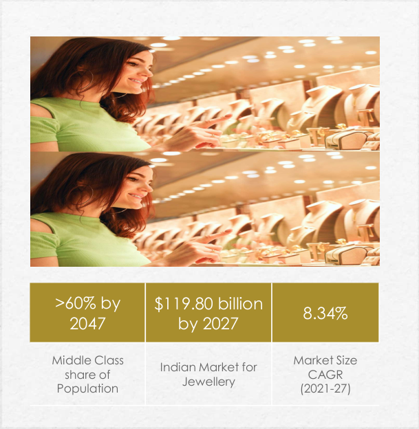

**[Image: f3811c28-18ed-46ea-9677-79c38f494801.pdf-0024-14.png (609x624, 478.2KB)]**

<!-- Start of picture text -->
>60% by  $119.80 billion 8.34% 2047 by 2027 Middle Class  Market Size Indian Market for share of  CAGR Jewellery Population (2021-27) <!-- End of picture text -->

Source: PRICE & Economic Times 

**[Image: f3811c28-18ed-46ea-9677-79c38f494801.pdf-0025-01.png (53x53, 3.2KB)]**

<!-- Start of picture text -->
24 <!-- End of picture text -->

**[Image: f3811c28-18ed-46ea-9677-79c38f494801.pdf-0025-02.png (170x109, 27.3KB)]**

### Harnessing Our Core Strengths to Drive Success 

##### Domestic Focus: 

**[Image: f3811c28-18ed-46ea-9677-79c38f494801.pdf-0025-05.png (180x207, 27.1KB)]**

Since TBZ primarily concentrates on the domestic jewellery market, it remains protected from the impact of international economic challenges. 

##### Consumer Trust: 

**[Image: f3811c28-18ed-46ea-9677-79c38f494801.pdf-0025-08.png (197x239, 28.4KB)]**

TBZ is an age-old established brand known for its innovative designs, the quality of its artistry, and unquestionable product authenticity, enjoying a loyal base of multigenerational clientele. 

Rooted in trust and heritage, TBZ leads the Indian jewellery market with unmatched quality, a domestic focus, and a deep connection to the rising middle-class consumer. 

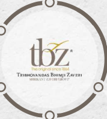

**[Image: f3811c28-18ed-46ea-9677-79c38f494801.pdf-0025-11.png (178x197, 30.6KB)]**

**[Image: f3811c28-18ed-46ea-9677-79c38f494801.pdf-0025-12.png (197x238, 31.3KB)]**

**[Image: f3811c28-18ed-46ea-9677-79c38f494801.pdf-0025-13.png (197x238, 32.1KB)]**

<!-- Start of picture text -->
consumer. <!-- End of picture text -->

##### Industry Benchmark: 

In the Indian jewellery market, TBZ holds a distinguished position for its exemplary corporate governance, setting it as the industry's peer benchmark. 

Middle-Class Growth: TBZ is strategically positioned to capitalize on the remarkable growth of the expanding Indian middle class, and their surging aspirations and spending in India. 

**[Image: f3811c28-18ed-46ea-9677-79c38f494801.pdf-0025-17.png (180x208, 27.4KB)]**

##### Resilient Heritage: 

Spanning over 160 years, the Company has navigated multiple economic disruptions, coming out strong after each cycle. 

**[Image: f3811c28-18ed-46ea-9677-79c38f494801.pdf-0026-00.png (53x53, 3.3KB)]**

<!-- Start of picture text -->
25 <!-- End of picture text -->

### Awards & Recognition: 

- TBZ – The Original has won the award at Retail Jeweller India Forum- MD & CEO Awards 2025 in below category: 

   - “Exemplary Value creation for Shareholders 2025” 

- **Shri Shrikant Zaveri** , has been conferred with the prestigious " **Gems and Jewellery Industry Legend" Award** at the illustrious **IIJS Tritiya 2023** event in Mumbai. 

- **Ms. Raashi Zaveri** has been awarded the **GJEPC 40 under 40** , recognizing her as a young industry leader and with the prestigious “Excellence in Leadership, Young Leader of the Year Award” by the Retail Jeweller India MD and CEO Awards. 

**[Image: f3811c28-18ed-46ea-9677-79c38f494801.pdf-0026-07.png (720x432, 649.0KB)]**

**GJEPC 40 under 40** 

**[Image: f3811c28-18ed-46ea-9677-79c38f494801.pdf-0026-09.png (170x109, 27.3KB)]**

**[Image: f3811c28-18ed-46ea-9677-79c38f494801.pdf-0026-10.png (517x690, 567.9KB)]**

Retail Jeweller India Forum- MD & CEO Awards 2025 

**[Image: f3811c28-18ed-46ea-9677-79c38f494801.pdf-0027-00.png (53x53, 3.3KB)]**

<!-- Start of picture text -->
26 <!-- End of picture text -->

### Awards & Recognition 

- **“** EXEMPELARY VALUE CREATION FOR SHAREHOLDERS 2025“ 

###### **Retail Jeweller India Forum- MD & CEO Awards 2025** 

- “EXCELLENCE IN LEADERSHIP, YOUNG LEADER OF THE YEAR 2025” : Ms. Raashi Zaveri **GJEPC 40 under 40:** Retail Jeweller India MD and CEO Awards. 

- “GEMS & JEWELLRY INDUSTRY LEGEND AWARD” : Mr. Srikant Zaveri **IIJS Tritiya 2023** 

- “BEST BRACELET DESIGN AWARD -9TH EDITION” JJS-IJ Jewellers Choice Design Awards – 2019 

- “CONTEMPORARY DIAMOND JEWELLERY AWARD” & “TREASURE OF THE OCEAN “ 

- GJC’S NATIONAL JEWELLERY AWARD 2018 

- “DIAMOND VIVAH JEWELLERY OF THE YEAR” Retail Jeweller India Awards – 2018 

- “INDIA’S MOST PREFERRED JEWELLERY BRAND” UBM India – 2017 

- “BEST RING DESIGN OVER Rs. 2,50,000” JJS-IJ Jewellers Choice Design Awards – 2016 

- “TV CAMPAIGN OF THE YEAR” 

   - 12th Gemfields Retail Jeweller India Awards – 2016 

- “DIAMOND JEWELLERY OF THE YEAR” 

   - 12th Gemfields Retail Jeweller India Awards – 2016 

- “BEST NECKLACE DESIGN AWARD – 2016” JJS-IJ Jewellers’ Choice Design Award – 2016 

- “ASIA’S MOST POPULAR BRANDS – 2014” World Consulting & Research Corporation (WCRC) – 2014 

**[Image: f3811c28-18ed-46ea-9677-79c38f494801.pdf-0027-19.png (668x465, 263.4KB)]**

**[Image: f3811c28-18ed-46ea-9677-79c38f494801.pdf-0027-20.png (297x568, 335.7KB)]**

**[Image: f3811c28-18ed-46ea-9677-79c38f494801.pdf-0027-21.png (199x457, 136.3KB)]**

**[Image: f3811c28-18ed-46ea-9677-79c38f494801.pdf-0028-01.png (53x53, 3.2KB)]**

<!-- Start of picture text -->
27 <!-- End of picture text -->

##### **PROJECT PANKHI** 

Project Pankhi is TBZ’s flagship initiative focused on empowering women and adolescent girls from marginalised communities through mental health support, legal counselling, education, and awareness programmes. 

###### **Key Impact Highlights for H1 FY26 (April–September 2025):** 

- 500 counselling cases registered, addressing issues of gender-based violence, psychological trauma, and legal vulnerabilities. 

- Conducted 180 joint counselling sessions with family members to drive behavioural change and create supportive home environments. 

- Facilitated 56 awareness sessions for 2313 women and adolescents, focused on gender equality, basic rights, and career guidance. 

- Awareness sessions planned for educating communities about the Domestic Violence Act, promoting gender equality, and encouraging responsible behaviour. 

- Women celebrated their journey and shared their Personal stories with other women.. 

- Role of women in Literature – a state-level consultation done by Stree Mukti Sanghatana. 

- As a long-term, community-driven programme that integrates legal, emotional, and educational support systems to uplift women and girls, Project Pankhi continues to scale through trusted grassroots partners such as Stree Mukti Sanghatana, Urja Foundation, and Cultural Academy for Peace. 

###### **Aligned with UN SDGs:** 

SDG 5 – Promoting gender equality, empowering women 

SDG 4 – Promoting education, including special education & employment enhancing vocation skills 

**[Image: f3811c28-18ed-46ea-9677-79c38f494801.pdf-0028-14.png (155x118, 37.2KB)]**

**[Image: f3811c28-18ed-46ea-9677-79c38f494801.pdf-0028-15.png (170x110, 24.6KB)]**

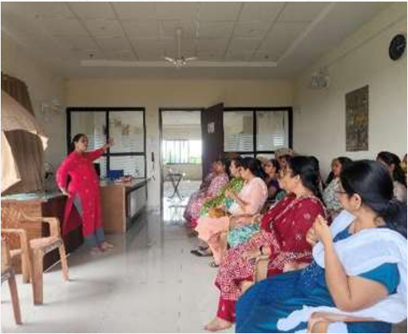

**[Image: f3811c28-18ed-46ea-9677-79c38f494801.pdf-0028-16.png (511x419, 374.1KB)]**

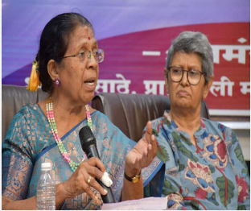

**[Image: f3811c28-18ed-46ea-9677-79c38f494801.pdf-0028-17.png (312x262, 190.7KB)]**

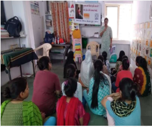

**[Image: f3811c28-18ed-46ea-9677-79c38f494801.pdf-0028-18.png (251x210, 122.9KB)]**

SDG 3 – Good Health and Well-being 

**[Image: f3811c28-18ed-46ea-9677-79c38f494801.pdf-0029-01.png (53x53, 3.3KB)]**

<!-- Start of picture text -->
28 <!-- End of picture text -->

##### **PROJECT DISHA** 

Project Disha is TBZ’s inclusive education initiative, focused on empowering children with disabilities and underserved students through specialised learning support, teacher training, parent capacity-building, and community-driven educational interventions. 

###### **Key Impact Highlights for H1 FY26 (April–September 2025):** 

###### **Muskan Foundation – Support for Children with Multiple Disabilities** 

- 2,254 specialised education sessions conducted for children with multiple disabilities, delivered through customised learning plans. 

- Ongoing support provided to 16 children, enabling them to strengthen basic skills and participate confidently in classroom activities. 

- Conducted 3 parent capacity-building sessions for 16 parents, equipping families with tools for better home-based care and learning reinforcement. 

- Facilitated 4 advocacy sessions to raise awareness on inclusive education and disability rights. 

###### **Victoria Memorial School for the Blind (VMSB)** 

- Continued educational support for 15 visually impaired students across Grades 5 to 9. 

- Students utilised computer-assisted learning to appear for unit tests, enhancing digital literacy and academic independence. 

###### **Pahley Akshar Foundation – Strengthening Foundational Learning** 

- 13 teacher training programmes conducted for 131 teachers from 19 schools, improving classroom delivery through structured language-learning methods. 

- 877 students benefited through improved teaching practices driven by foundational literacy interventions. 

###### **Community & School Enablement Initiatives** 

- 46 students at Vinay Mandir School received uniform support through a collaboration with Rotary Club Ghatkopar Charitable Trust. 

- 20,000 eco-friendly cotton bags distributed in partnership with Utkarsh Global Foundation and the Maharashtra Government to spread awareness on environmental protection. 

**[Image: f3811c28-18ed-46ea-9677-79c38f494801.pdf-0029-19.png (170x110, 24.6KB)]**

**[Image: f3811c28-18ed-46ea-9677-79c38f494801.pdf-0029-20.png (155x117, 37.0KB)]**

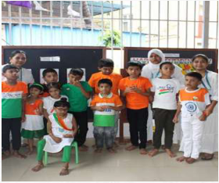

**[Image: f3811c28-18ed-46ea-9677-79c38f494801.pdf-0029-21.png (280x234, 149.5KB)]**

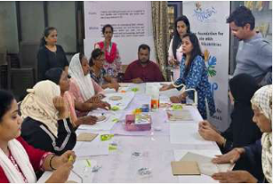

**[Image: f3811c28-18ed-46ea-9677-79c38f494801.pdf-0029-22.png (307x207, 147.1KB)]**

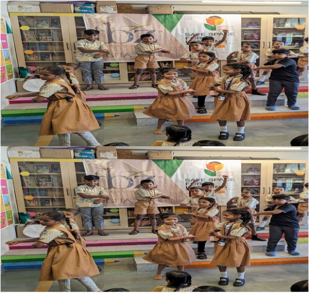

**[Image: f3811c28-18ed-46ea-9677-79c38f494801.pdf-0029-23.png (524x497, 632.9KB)]**

**[Image: f3811c28-18ed-46ea-9677-79c38f494801.pdf-0030-01.png (1650x207, 255.0KB)]**

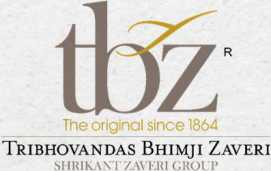

**[Image: f3811c28-18ed-46ea-9677-79c38f494801.pdf-0030-02.png (271x171, 59.9KB)]**

**[Image: f3811c28-18ed-46ea-9677-79c38f494801.pdf-0030-03.png (1650x207, 237.0KB)]**

**[Image: f3811c28-18ed-46ea-9677-79c38f494801.pdf-0030-04.png (1650x264, 341.4KB)]**

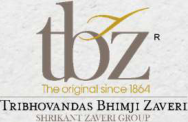

**[Image: f3811c28-18ed-46ea-9677-79c38f494801.pdf-0030-05.png (188x122, 35.1KB)]**

**[Image: f3811c28-18ed-46ea-9677-79c38f494801.pdf-0030-06.png (1650x250, 323.9KB)]**

<!-- Start of picture text -->
THANK Mukesh Sharma Shankhini Saha CFO Director- Investor Relations mukesh.sharma@tbzoriginal.com YOU tbz@dickensonworld.com <!-- End of picture text -->

---

## Extracted Images

| # | File | Dimensions | Size |
|---|------|------------|------|
| 1 | f3811c28-18ed-46ea-9677-79c38f494801.pdf-0001-16.png | 177x143 | 6.1KB |
| 2 | f3811c28-18ed-46ea-9677-79c38f494801.pdf-0001-17.png | 13x15 | 0.4KB |
| 3 | f3811c28-18ed-46ea-9677-79c38f494801.pdf-0001-18.png | 178x39 | 4.5KB |
| 4 | f3811c28-18ed-46ea-9677-79c38f494801.pdf-0001-19.png | 892x86 | 29.1KB |
| 5 | f3811c28-18ed-46ea-9677-79c38f494801.pdf-0002-01.png | 1650x207 | 257.3KB |
| 6 | f3811c28-18ed-46ea-9677-79c38f494801.pdf-0002-02.png | 272x171 | 60.1KB |
| 7 | f3811c28-18ed-46ea-9677-79c38f494801.pdf-0002-03.png | 224x116 | 32.3KB |
| 8 | f3811c28-18ed-46ea-9677-79c38f494801.pdf-0002-04.png | 1650x333 | 420.6KB |
| 9 | f3811c28-18ed-46ea-9677-79c38f494801.pdf-0002-06.png | 1650x207 | 235.8KB |
| 10 | f3811c28-18ed-46ea-9677-79c38f494801.pdf-0002-07.png | 1650x103 | 117.4KB |
| 11 | f3811c28-18ed-46ea-9677-79c38f494801.pdf-0003-01.png | 1650x354 | 484.9KB |
| 12 | f3811c28-18ed-46ea-9677-79c38f494801.pdf-0003-04.png | 1650x207 | 285.2KB |
| 13 | f3811c28-18ed-46ea-9677-79c38f494801.pdf-0003-06.png | 1650x207 | 275.4KB |
| 14 | f3811c28-18ed-46ea-9677-79c38f494801.pdf-0003-07.png | 51x51 | 3.1KB |
| 15 | f3811c28-18ed-46ea-9677-79c38f494801.pdf-0003-08.png | 1650x103 | 125.4KB |
| 16 | f3811c28-18ed-46ea-9677-79c38f494801.pdf-0004-00.png | 1650x207 | 246.5KB |
| 17 | f3811c28-18ed-46ea-9677-79c38f494801.pdf-0004-01.png | 151x151 | 14.1KB |
| 18 | f3811c28-18ed-46ea-9677-79c38f494801.pdf-0004-02.png | 1650x207 | 236.4KB |
| 19 | f3811c28-18ed-46ea-9677-79c38f494801.pdf-0004-03.png | 151x150 | 13.5KB |
| 20 | f3811c28-18ed-46ea-9677-79c38f494801.pdf-0004-04.png | 1650x207 | 244.2KB |
| 21 | f3811c28-18ed-46ea-9677-79c38f494801.pdf-0004-05.png | 151x151 | 14.3KB |
| 22 | f3811c28-18ed-46ea-9677-79c38f494801.pdf-0004-07.png | 1650x207 | 247.3KB |
| 23 | f3811c28-18ed-46ea-9677-79c38f494801.pdf-0004-08.png | 51x51 | 3.1KB |
| 24 | f3811c28-18ed-46ea-9677-79c38f494801.pdf-0004-09.png | 1650x103 | 121.7KB |
| 25 | f3811c28-18ed-46ea-9677-79c38f494801.pdf-0005-01.png | 1650x230 | 272.0KB |
| 26 | f3811c28-18ed-46ea-9677-79c38f494801.pdf-0005-02.png | 53x53 | 3.3KB |
| 27 | f3811c28-18ed-46ea-9677-79c38f494801.pdf-0005-04.png | 649x673 | 744.0KB |
| 28 | f3811c28-18ed-46ea-9677-79c38f494801.pdf-0005-05.png | 208x132 | 23.9KB |
| 29 | f3811c28-18ed-46ea-9677-79c38f494801.pdf-0006-00.png | 1650x230 | 279.7KB |
| 30 | f3811c28-18ed-46ea-9677-79c38f494801.pdf-0006-01.png | 220x27 | 7.7KB |
| 31 | f3811c28-18ed-46ea-9677-79c38f494801.pdf-0006-02.png | 12x12 | 0.5KB |
| 32 | f3811c28-18ed-46ea-9677-79c38f494801.pdf-0006-03.png | 199x25 | 7.0KB |
| 33 | f3811c28-18ed-46ea-9677-79c38f494801.pdf-0006-04.png | 171x9 | 3.5KB |
| 34 | f3811c28-18ed-46ea-9677-79c38f494801.pdf-0006-05.png | 12x12 | 0.4KB |
| 35 | f3811c28-18ed-46ea-9677-79c38f494801.pdf-0006-06.png | 13x13 | 0.5KB |
| 36 | f3811c28-18ed-46ea-9677-79c38f494801.pdf-0006-07.png | 179x19 | 6.0KB |
| 37 | f3811c28-18ed-46ea-9677-79c38f494801.pdf-0006-08.png | 13x12 | 0.5KB |
| 38 | f3811c28-18ed-46ea-9677-79c38f494801.pdf-0006-09.png | 1650x281 | 325.1KB |
| 39 | f3811c28-18ed-46ea-9677-79c38f494801.pdf-0006-10.png | 1650x207 | 216.2KB |
| 40 | f3811c28-18ed-46ea-9677-79c38f494801.pdf-0006-11.png | 51x51 | 3.1KB |
| 41 | f3811c28-18ed-46ea-9677-79c38f494801.pdf-0006-12.png | 1650x103 | 121.7KB |
| 42 | f3811c28-18ed-46ea-9677-79c38f494801.pdf-0007-00.png | 1650x230 | 278.9KB |
| 43 | f3811c28-18ed-46ea-9677-79c38f494801.pdf-0007-01.png | 12x13 | 0.5KB |
| 44 | f3811c28-18ed-46ea-9677-79c38f494801.pdf-0007-02.png | 171x11 | 4.0KB |
| 45 | f3811c28-18ed-46ea-9677-79c38f494801.pdf-0007-03.png | 12x12 | 0.5KB |
| 46 | f3811c28-18ed-46ea-9677-79c38f494801.pdf-0007-04.png | 199x26 | 7.2KB |
| 47 | f3811c28-18ed-46ea-9677-79c38f494801.pdf-0007-05.png | 12x13 | 0.5KB |
| 48 | f3811c28-18ed-46ea-9677-79c38f494801.pdf-0007-06.png | 13x12 | 0.5KB |
| 49 | f3811c28-18ed-46ea-9677-79c38f494801.pdf-0007-07.png | 179x13 | 4.9KB |
| 50 | f3811c28-18ed-46ea-9677-79c38f494801.pdf-0007-08.png | 13x13 | 0.5KB |
| 51 | f3811c28-18ed-46ea-9677-79c38f494801.pdf-0007-09.png | 1650x283 | 326.0KB |
| 52 | f3811c28-18ed-46ea-9677-79c38f494801.pdf-0007-10.png | 1650x207 | 215.4KB |
| 53 | f3811c28-18ed-46ea-9677-79c38f494801.pdf-0007-11.png | 51x51 | 3.1KB |
| 54 | f3811c28-18ed-46ea-9677-79c38f494801.pdf-0007-12.png | 1650x103 | 121.7KB |
| 55 | f3811c28-18ed-46ea-9677-79c38f494801.pdf-0008-00.png | 169x109 | 22.2KB |
| 56 | f3811c28-18ed-46ea-9677-79c38f494801.pdf-0008-03.png | 1650x692 | 1310.8KB |
| 57 | f3811c28-18ed-46ea-9677-79c38f494801.pdf-0008-04.png | 497x276 | 278.1KB |
| 58 | f3811c28-18ed-46ea-9677-79c38f494801.pdf-0008-05.png | 497x276 | 238.6KB |
| 59 | f3811c28-18ed-46ea-9677-79c38f494801.pdf-0009-01.png | 170x109 | 27.3KB |
| 60 | f3811c28-18ed-46ea-9677-79c38f494801.pdf-0009-04.png | 1650x692 | 735.5KB |
| 61 | f3811c28-18ed-46ea-9677-79c38f494801.pdf-0010-00.png | 53x53 | 3.3KB |
| 62 | f3811c28-18ed-46ea-9677-79c38f494801.pdf-0010-02.png | 170x109 | 27.3KB |
| 63 | f3811c28-18ed-46ea-9677-79c38f494801.pdf-0010-03.png | 586x326 | 372.6KB |
| 64 | f3811c28-18ed-46ea-9677-79c38f494801.pdf-0010-04.png | 490x315 | 404.6KB |
| 65 | f3811c28-18ed-46ea-9677-79c38f494801.pdf-0010-05.png | 490x376 | 352.3KB |
| 66 | f3811c28-18ed-46ea-9677-79c38f494801.pdf-0010-06.png | 586x362 | 416.0KB |
| 67 | f3811c28-18ed-46ea-9677-79c38f494801.pdf-0011-01.png | 53x53 | 3.2KB |
| 68 | f3811c28-18ed-46ea-9677-79c38f494801.pdf-0011-23.png | 509x931 | 687.9KB |
| 69 | f3811c28-18ed-46ea-9677-79c38f494801.pdf-0012-00.png | 172x107 | 16.0KB |
| 70 | f3811c28-18ed-46ea-9677-79c38f494801.pdf-0012-02.png | 476x422 | 390.9KB |
| 71 | f3811c28-18ed-46ea-9677-79c38f494801.pdf-0012-04.png | 1650x692 | 1209.7KB |
| 72 | f3811c28-18ed-46ea-9677-79c38f494801.pdf-0013-00.png | 53x53 | 3.2KB |
| 73 | f3811c28-18ed-46ea-9677-79c38f494801.pdf-0013-03.png | 418x638 | 294.6KB |
| 74 | f3811c28-18ed-46ea-9677-79c38f494801.pdf-0013-04.png | 396x703 | 480.5KB |
| 75 | f3811c28-18ed-46ea-9677-79c38f494801.pdf-0013-05.png | 170x109 | 24.1KB |
| 76 | f3811c28-18ed-46ea-9677-79c38f494801.pdf-0013-06.png | 407x636 | 487.9KB |
| 77 | f3811c28-18ed-46ea-9677-79c38f494801.pdf-0014-00.png | 1650x230 | 276.3KB |
| 78 | f3811c28-18ed-46ea-9677-79c38f494801.pdf-0014-02.png | 1038x715 | 1022.1KB |
| 79 | f3811c28-18ed-46ea-9677-79c38f494801.pdf-0014-04.png | 53x53 | 3.2KB |
| 80 | f3811c28-18ed-46ea-9677-79c38f494801.pdf-0015-00.png | 1650x354 | 379.3KB |
| 81 | f3811c28-18ed-46ea-9677-79c38f494801.pdf-0015-02.png | 1650x207 | 266.4KB |
| 82 | f3811c28-18ed-46ea-9677-79c38f494801.pdf-0015-04.png | 1650x207 | 290.8KB |
| 83 | f3811c28-18ed-46ea-9677-79c38f494801.pdf-0015-05.png | 51x51 | 2.9KB |
| 84 | f3811c28-18ed-46ea-9677-79c38f494801.pdf-0015-06.png | 1650x103 | 136.0KB |
| 85 | f3811c28-18ed-46ea-9677-79c38f494801.pdf-0016-01.png | 170x109 | 27.3KB |
| 86 | f3811c28-18ed-46ea-9677-79c38f494801.pdf-0016-09.png | 55x54 | 6.9KB |
| 87 | f3811c28-18ed-46ea-9677-79c38f494801.pdf-0016-10.png | 52x54 | 7.1KB |
| 88 | f3811c28-18ed-46ea-9677-79c38f494801.pdf-0016-12.png | 1650x207 | 276.3KB |
| 89 | f3811c28-18ed-46ea-9677-79c38f494801.pdf-0016-13.png | 51x51 | 3.0KB |
| 90 | f3811c28-18ed-46ea-9677-79c38f494801.pdf-0016-14.png | 1650x103 | 128.2KB |
| 91 | f3811c28-18ed-46ea-9677-79c38f494801.pdf-0017-01.png | 53x53 | 3.2KB |
| 92 | f3811c28-18ed-46ea-9677-79c38f494801.pdf-0017-03.png | 170x109 | 27.3KB |
| 93 | f3811c28-18ed-46ea-9677-79c38f494801.pdf-0018-00.png | 1650x446 | 451.8KB |
| 94 | f3811c28-18ed-46ea-9677-79c38f494801.pdf-0018-01.png | 1650x207 | 350.2KB |
| 95 | f3811c28-18ed-46ea-9677-79c38f494801.pdf-0018-02.png | 1650x388 | 929.7KB |
| 96 | f3811c28-18ed-46ea-9677-79c38f494801.pdf-0018-03.png | 1650x103 | 219.0KB |
| 97 | f3811c28-18ed-46ea-9677-79c38f494801.pdf-0019-00.png | 1650x421 | 529.2KB |
| 98 | f3811c28-18ed-46ea-9677-79c38f494801.pdf-0019-01.png | 1055x343 | 456.3KB |
| 99 | f3811c28-18ed-46ea-9677-79c38f494801.pdf-0019-02.png | 1102x344 | 644.7KB |
| 100 | f3811c28-18ed-46ea-9677-79c38f494801.pdf-0019-03.png | 53x53 | 3.2KB |
| 101 | f3811c28-18ed-46ea-9677-79c38f494801.pdf-0020-01.png | 170x109 | 27.3KB |
| 102 | f3811c28-18ed-46ea-9677-79c38f494801.pdf-0020-03.png | 561x561 | 699.2KB |
| 103 | f3811c28-18ed-46ea-9677-79c38f494801.pdf-0020-04.png | 66x277 | 14.1KB |
| 104 | f3811c28-18ed-46ea-9677-79c38f494801.pdf-0020-11.png | 66x276 | 13.2KB |
| 105 | f3811c28-18ed-46ea-9677-79c38f494801.pdf-0020-16.png | 51x51 | 3.0KB |
| 106 | f3811c28-18ed-46ea-9677-79c38f494801.pdf-0020-17.png | 1650x103 | 116.8KB |
| 107 | f3811c28-18ed-46ea-9677-79c38f494801.pdf-0021-00.png | 170x109 | 27.3KB |
| 108 | f3811c28-18ed-46ea-9677-79c38f494801.pdf-0021-02.png | 406x722 | 507.7KB |
| 109 | f3811c28-18ed-46ea-9677-79c38f494801.pdf-0021-04.png | 66x277 | 14.1KB |
| 110 | f3811c28-18ed-46ea-9677-79c38f494801.pdf-0021-09.png | 66x276 | 13.1KB |
| 111 | f3811c28-18ed-46ea-9677-79c38f494801.pdf-0021-13.png | 51x51 | 3.1KB |
| 112 | f3811c28-18ed-46ea-9677-79c38f494801.pdf-0021-14.png | 1650x103 | 143.9KB |
| 113 | f3811c28-18ed-46ea-9677-79c38f494801.pdf-0022-01.png | 170x109 | 27.3KB |
| 114 | f3811c28-18ed-46ea-9677-79c38f494801.pdf-0022-02.png | 1650x692 | 823.6KB |
| 115 | f3811c28-18ed-46ea-9677-79c38f494801.pdf-0023-01.png | 53x53 | 3.2KB |
| 116 | f3811c28-18ed-46ea-9677-79c38f494801.pdf-0023-02.png | 170x109 | 27.3KB |
| 117 | f3811c28-18ed-46ea-9677-79c38f494801.pdf-0023-04.png | 296x145 | 49.1KB |
| 118 | f3811c28-18ed-46ea-9677-79c38f494801.pdf-0023-07.png | 226x132 | 17.7KB |
| 119 | f3811c28-18ed-46ea-9677-79c38f494801.pdf-0023-09.png | 115x116 | 8.2KB |
| 120 | f3811c28-18ed-46ea-9677-79c38f494801.pdf-0023-10.png | 116x116 | 8.5KB |
| 121 | f3811c28-18ed-46ea-9677-79c38f494801.pdf-0023-13.png | 132x222 | 25.1KB |
| 122 | f3811c28-18ed-46ea-9677-79c38f494801.pdf-0023-14.png | 132x222 | 24.0KB |
| 123 | f3811c28-18ed-46ea-9677-79c38f494801.pdf-0023-16.png | 159x103 | 22.8KB |
| 124 | f3811c28-18ed-46ea-9677-79c38f494801.pdf-0024-01.png | 53x53 | 3.2KB |
| 125 | f3811c28-18ed-46ea-9677-79c38f494801.pdf-0024-13.png | 170x109 | 27.3KB |
| 126 | f3811c28-18ed-46ea-9677-79c38f494801.pdf-0024-14.png | 609x624 | 478.2KB |
| 127 | f3811c28-18ed-46ea-9677-79c38f494801.pdf-0025-01.png | 53x53 | 3.2KB |
| 128 | f3811c28-18ed-46ea-9677-79c38f494801.pdf-0025-02.png | 170x109 | 27.3KB |
| 129 | f3811c28-18ed-46ea-9677-79c38f494801.pdf-0025-05.png | 180x207 | 27.1KB |
| 130 | f3811c28-18ed-46ea-9677-79c38f494801.pdf-0025-08.png | 197x239 | 28.4KB |
| 131 | f3811c28-18ed-46ea-9677-79c38f494801.pdf-0025-11.png | 178x197 | 30.6KB |
| 132 | f3811c28-18ed-46ea-9677-79c38f494801.pdf-0025-12.png | 197x238 | 31.3KB |
| 133 | f3811c28-18ed-46ea-9677-79c38f494801.pdf-0025-13.png | 197x238 | 32.1KB |
| 134 | f3811c28-18ed-46ea-9677-79c38f494801.pdf-0025-17.png | 180x208 | 27.4KB |
| 135 | f3811c28-18ed-46ea-9677-79c38f494801.pdf-0026-00.png | 53x53 | 3.3KB |
| 136 | f3811c28-18ed-46ea-9677-79c38f494801.pdf-0026-07.png | 720x432 | 649.0KB |
| 137 | f3811c28-18ed-46ea-9677-79c38f494801.pdf-0026-09.png | 170x109 | 27.3KB |
| 138 | f3811c28-18ed-46ea-9677-79c38f494801.pdf-0026-10.png | 517x690 | 567.9KB |
| 139 | f3811c28-18ed-46ea-9677-79c38f494801.pdf-0027-00.png | 53x53 | 3.3KB |
| 140 | f3811c28-18ed-46ea-9677-79c38f494801.pdf-0027-19.png | 668x465 | 263.4KB |
| 141 | f3811c28-18ed-46ea-9677-79c38f494801.pdf-0027-20.png | 297x568 | 335.7KB |
| 142 | f3811c28-18ed-46ea-9677-79c38f494801.pdf-0027-21.png | 199x457 | 136.3KB |
| 143 | f3811c28-18ed-46ea-9677-79c38f494801.pdf-0028-01.png | 53x53 | 3.2KB |
| 144 | f3811c28-18ed-46ea-9677-79c38f494801.pdf-0028-14.png | 155x118 | 37.2KB |
| 145 | f3811c28-18ed-46ea-9677-79c38f494801.pdf-0028-15.png | 170x110 | 24.6KB |
| 146 | f3811c28-18ed-46ea-9677-79c38f494801.pdf-0028-16.png | 511x419 | 374.1KB |
| 147 | f3811c28-18ed-46ea-9677-79c38f494801.pdf-0028-17.png | 312x262 | 190.7KB |
| 148 | f3811c28-18ed-46ea-9677-79c38f494801.pdf-0028-18.png | 251x210 | 122.9KB |
| 149 | f3811c28-18ed-46ea-9677-79c38f494801.pdf-0029-01.png | 53x53 | 3.3KB |
| 150 | f3811c28-18ed-46ea-9677-79c38f494801.pdf-0029-19.png | 170x110 | 24.6KB |
| 151 | f3811c28-18ed-46ea-9677-79c38f494801.pdf-0029-20.png | 155x117 | 37.0KB |
| 152 | f3811c28-18ed-46ea-9677-79c38f494801.pdf-0029-21.png | 280x234 | 149.5KB |
| 153 | f3811c28-18ed-46ea-9677-79c38f494801.pdf-0029-22.png | 307x207 | 147.1KB |
| 154 | f3811c28-18ed-46ea-9677-79c38f494801.pdf-0029-23.png | 524x497 | 632.9KB |
| 155 | f3811c28-18ed-46ea-9677-79c38f494801.pdf-0030-01.png | 1650x207 | 255.0KB |
| 156 | f3811c28-18ed-46ea-9677-79c38f494801.pdf-0030-02.png | 271x171 | 59.9KB |
| 157 | f3811c28-18ed-46ea-9677-79c38f494801.pdf-0030-03.png | 1650x207 | 237.0KB |
| 158 | f3811c28-18ed-46ea-9677-79c38f494801.pdf-0030-04.png | 1650x264 | 341.4KB |
| 159 | f3811c28-18ed-46ea-9677-79c38f494801.pdf-0030-05.png | 188x122 | 35.1KB |
| 160 | f3811c28-18ed-46ea-9677-79c38f494801.pdf-0030-06.png | 1650x250 | 323.9KB |
