28th May, 2026 

To, The Manager, Compliance Department, 

**National Stock Exchange of India Limited** Exchange Plaza, Plot No. C/1, G Block, Bandra-Kurla Complex, Bandra (East), Mumbai - 400 051 

To, 

The Manager, Corporate Service Department, **BSE Limited** Phiroze Jeejeebhoy Towers, Dalal Street, Mumbai - 400 001 

###### **<u>Script Code & ID: 534369</u>** 

###### **<u>Symbol : TBZ</u>** 

Dear Sir/Madam 

###### **Sub: Investors Presentation** 

Pursuant to Regulation 30 and other applicable provisions of SEBI (Listing Obligations and Disclosure Requirements) Regulations, 2015, a copy of the Investors Presentation is enclosed herewith and the said Investors Presentation has also been uploaded on the Company's Website at <u>www.tbztheoriginal.com.</u> 

Kindly take the same on record. 

Thanking You. 

Yours faithfully, 

For **Tribhovandas Bhimji Zaveri Limited** 

ARPIT Digitally signed by ARPIT MAHESHW MAHESHWARI Date: 2026.05.28 ARI 18:28:21 +05'30' 

**Arpit Maheshwari Company Secretary ACS:42396** 

**Encl: as above** 

**[Image: e186daf7-9168-4faf-873b-d87ffb129955.pdf-0001-17.png (258x175, 7.8KB)]**

**[Image: e186daf7-9168-4faf-873b-d87ffb129955.pdf-0001-18.png (15x17, 0.5KB)]**

**[Image: e186daf7-9168-4faf-873b-d87ffb129955.pdf-0001-19.png (280x53, 12.3KB)]**

<!-- Start of picture text -->
The original since 1864 TRIBHO\'AND\S  BHl\1Jl  7.AVFRI  L I\ITFfJ. <!-- End of picture text -->

**[Image: e186daf7-9168-4faf-873b-d87ffb129955.pdf-0001-20.png (297x14, 4.5KB)]**

<!-- Start of picture text -->
CIN  No: L27205MH2007PLC172598 <!-- End of picture text -->

**[Image: e186daf7-9168-4faf-873b-d87ffb129955.pdf-0001-21.png (907x63, 30.0KB)]**

<!-- Start of picture text -->
Regd. Office:  241 /243, Zaveri  Bazar,  Mumbai - 400 002. Tel.:  + 91  22  4046 5000/01, 6130 0505 11th  Floor, West Wing,  Tulsiani Chambers, Free Press Journal Road, Nariman Point,  Mumbai - 400 021.  Te l.:  022 307 35000 E-mail: investors@tbzoriginal.com; Website: www.tbztheoriginal.com <!-- End of picture text -->

**[Image: e186daf7-9168-4faf-873b-d87ffb129955.pdf-0002-01.png (1650x207, 276.7KB)]**

<!-- Start of picture text -->
The or~inol since 1864 or~inol since 1864 1864 <!-- End of picture text -->

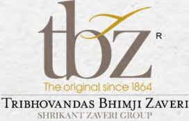

**[Image: e186daf7-9168-4faf-873b-d87ffb129955.pdf-0002-02.png (272x174, 77.7KB)]**

<!-- Start of picture text -->
The or~inol since 1864 or~inol since 1864 1864 TRIBHOVANDAS BHIMJI  ZAVERi SI IRIK.\~T  1/.,\\ 'l•:HI  GHOl 'P <!-- End of picture text -->

**[Image: e186daf7-9168-4faf-873b-d87ffb129955.pdf-0002-03.png (224x116, 45.7KB)]**

<!-- Start of picture text -->
Trusted Since 1864 <!-- End of picture text -->

**[Image: e186daf7-9168-4faf-873b-d87ffb129955.pdf-0002-04.png (1650x333, 445.8KB)]**

<!-- Start of picture text -->
1864 TRIBHOVA  DAS  BHI~I Z Y  RI 111{]~\ l  /..\\  EHi  ROl  P INVESTOR PRESENTATION <!-- End of picture text -->

## INVESTOR PRESENTATION Q4 & FY26 

**[Image: e186daf7-9168-4faf-873b-d87ffb129955.pdf-0002-06.png (1650x207, 235.1KB)]**

<!-- Start of picture text -->
Q4 & FY26 <!-- End of picture text -->

**[Image: e186daf7-9168-4faf-873b-d87ffb129955.pdf-0002-07.png (1650x103, 117.5KB)]**

**[Image: e186daf7-9168-4faf-873b-d87ffb129955.pdf-0003-01.png (189x111, 36.6KB)]**

<!-- Start of picture text -->
tbz· · IQral l  inc  1  '-"1 Th rnHOVAN DAS OVAN DAS AS  BHI MJ I  MJ I  I  ZAVERi Ri \IUU1..\.' I I  L\\UU(;JtOI I' I' <!-- End of picture text -->

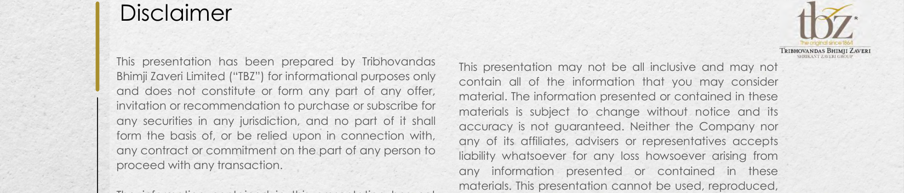

**[Image: e186daf7-9168-4faf-873b-d87ffb129955.pdf-0003-02.png (1650x354, 494.4KB)]**

<!-- Start of picture text -->
Disclaimer tbz· · IQral l  inc  1  '-"1 Th rnHOVAN DAS OVAN DAS AS  BHI MJ I  MJ I  I  ZAVERi Ri This presentation has been prepared by Tribhovandas \IUU1..\.' I I  L\\UU(;JtOI I' I' This presentation may not be all inclusive and may not Bhimji Zaveri Limited (“TBZ”) for informational purposes only contain all of the information that you may consider and does not constitute or form any part of any offer, material. The information presented or contained in these invitation or recommendation to purchase or subscribe for materials is subject to change without notice and its any securities in any jurisdiction, and no part of it shall accuracy is not guaranteed. Neither the Company nor form the basis of, or be relied upon in connection with, any of its affiliates, advisers or representatives accepts any contract or commitment on the part of any person to liability whatsoever for any loss howsoever arising from proceed with any transaction. any information presented or contained in these materials. This presentation cannot be used, reproduced, <!-- End of picture text -->

This presentation may not be all inclusive and may not contain all of the information that you may consider material. The information presented or contained in these materials is subject to change without notice and its accuracy is not guaranteed. Neither the Company nor any of its affiliates, advisers or representatives accepts liability whatsoever for any loss howsoever arising from any information presented or contained in these materials. This presentation cannot be used, reproduced, copied, distributed, shared or disseminated in any manner. No person is authorized to give any information or to make any representation not contained in and not consistent with this presentation and, if given or made, such information or representation must not be relied upon as having been authorized by or on behalf of TBZ. 

The information contained in this presentation has not been independently verified. No representation or warranty, express or implied, is made and no reliance should be placed on the accuracy, fairness or completeness of the information presented or contained in these materials. 

**[Image: e186daf7-9168-4faf-873b-d87ffb129955.pdf-0003-05.png (1650x207, 285.9KB)]**

<!-- Start of picture text -->
copied, distributed, shared or disseminated in any been independently verified. No representation or manner. No person is authorized to give any information warranty, express or implied, is made and no reliance or to make any representation not contained in and not should be placed on the accuracy, fairness or consistent with this presentation and, if given or made, completeness of the information presented or contained such information or representation must not be relied in these materials. upon as having been authorized by or on behalf of TBZ. Any forward-looking statements in this presentation are <!-- End of picture text -->

Any forward-looking statements in this presentation are subject to risks and uncertainties that could cause actual results to differ materially from those that may be inferred to being expressed in, or implied by, such statements. Such forward-looking statements are not indicative or guarantees of future performance. Any forward-looking statements, projections and industry data made by third parties included in this presentation are not adopted by the Company and the Company is not responsible for such third party statements and projections. 

**[Image: e186daf7-9168-4faf-873b-d87ffb129955.pdf-0003-07.png (1650x207, 275.5KB)]**

<!-- Start of picture text -->
subject to risks and uncertainties that could cause actual results to differ materially from those that may be inferred to being expressed in, or implied by, such statements. Such forward-looking statements are not indicative or guarantees of future performance. Any forward-looking statements, projections and industry data made by third parties included in this presentation are not adopted by <!-- End of picture text -->

**[Image: e186daf7-9168-4faf-873b-d87ffb129955.pdf-0003-08.png (51x51, 3.1KB)]**

<!-- Start of picture text -->
02 <!-- End of picture text -->

• 02 

**[Image: e186daf7-9168-4faf-873b-d87ffb129955.pdf-0003-10.png (1650x103, 125.4KB)]**

<!-- Start of picture text -->
such third party statements and projections. • <!-- End of picture text -->

**[Image: e186daf7-9168-4faf-873b-d87ffb129955.pdf-0004-00.png (1650x207, 255.9KB)]**

<!-- Start of picture text -->
tbz· IQral  inc  1  '-"1 Th rnHOVAN DAS  BHI MJ I  ZAVERi \IUU1..\.' I  L\\UU(;JtOI I' <!-- End of picture text -->

**[Image: e186daf7-9168-4faf-873b-d87ffb129955.pdf-0004-01.png (151x151, 21.7KB)]**

<!-- Start of picture text -->
04 <!-- End of picture text -->

**[Image: e186daf7-9168-4faf-873b-d87ffb129955.pdf-0004-02.png (1650x207, 250.5KB)]**

<!-- Start of picture text -->
Q4 & FY26 Updates Page 04 <!-- End of picture text -->

**[Image: e186daf7-9168-4faf-873b-d87ffb129955.pdf-0004-03.png (151x150, 20.2KB)]**

<!-- Start of picture text -->
14 <!-- End of picture text -->

**[Image: e186daf7-9168-4faf-873b-d87ffb129955.pdf-0004-04.png (1650x207, 257.5KB)]**

<!-- Start of picture text -->
Page About Us 14 Business Model Page <!-- End of picture text -->

**[Image: e186daf7-9168-4faf-873b-d87ffb129955.pdf-0004-05.png (151x151, 21.7KB)]**

<!-- Start of picture text -->
19 <!-- End of picture text -->

DISCUSSION 03 SUMMARY • 

**[Image: e186daf7-9168-4faf-873b-d87ffb129955.pdf-0004-07.png (1650x207, 251.5KB)]**

<!-- Start of picture text -->
DISCUSSION <!-- End of picture text -->

**[Image: e186daf7-9168-4faf-873b-d87ffb129955.pdf-0004-08.png (1650x103, 121.7KB)]**

<!-- Start of picture text -->
• <!-- End of picture text -->

• 04 

**[Image: e186daf7-9168-4faf-873b-d87ffb129955.pdf-0005-02.png (1650x230, 281.2KB)]**

<!-- Start of picture text -->
tbz· _  r  IQral  inc  1  '-"1 T'RIBHOVANOAS  8HIMJI ZAVERi \IUU1..\.' I  L\\UU(;JtOI i' <!-- End of picture text -->

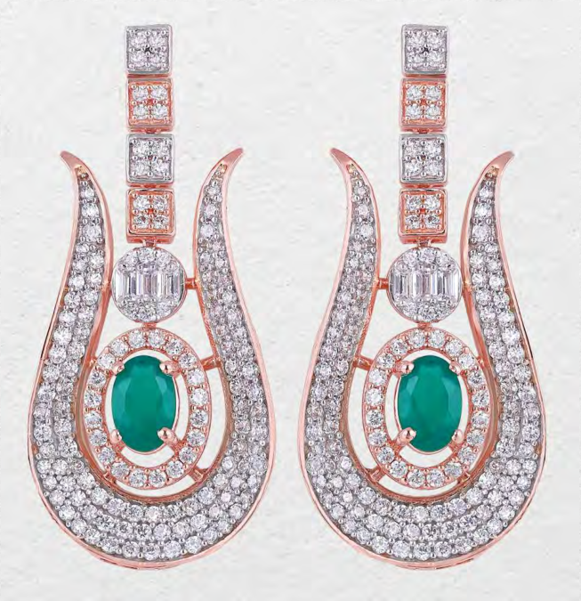

**[Image: e186daf7-9168-4faf-873b-d87ffb129955.pdf-0005-03.png (653x675, 762.1KB)]**

**[Image: e186daf7-9168-4faf-873b-d87ffb129955.pdf-0005-05.png (211x134, 33.1KB)]**

<!-- Start of picture text -->
Page 04-13 <!-- End of picture text -->

**[Image: e186daf7-9168-4faf-873b-d87ffb129955.pdf-0005-06.png (51x51, 3.1KB)]**

<!-- Start of picture text -->
04 <!-- End of picture text -->

### Q4 FY26 - Result Highlights (In ₹ Mln) 

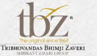

**[Image: e186daf7-9168-4faf-873b-d87ffb129955.pdf-0006-01.png (191x111, 36.7KB)]**

<!-- Start of picture text -->
tbz· r  IQral  inc  1  '-"1 Th rnHOVAN DAS BHI MJ I  ZAVERi \IUU1..\.' I  L\\UU(;JtOI I' <!-- End of picture text -->

**[Image: e186daf7-9168-4faf-873b-d87ffb129955.pdf-0006-02.png (220x24, 7.7KB)]**

<!-- Start of picture text -->
14.85% 18.93% <!-- End of picture text -->

**[Image: e186daf7-9168-4faf-873b-d87ffb129955.pdf-0006-03.png (171x9, 3.8KB)]**

**[Image: e186daf7-9168-4faf-873b-d87ffb129955.pdf-0006-04.png (12x13, 0.5KB)]**

**[Image: e186daf7-9168-4faf-873b-d87ffb129955.pdf-0006-05.png (203x30, 8.3KB)]**

<!-- Start of picture text -->
6.94% 13.45% <!-- End of picture text -->

**[Image: e186daf7-9168-4faf-873b-d87ffb129955.pdf-0006-06.png (171x10, 4.2KB)]**

**[Image: e186daf7-9168-4faf-873b-d87ffb129955.pdf-0006-07.png (12x13, 0.5KB)]**

**[Image: e186daf7-9168-4faf-873b-d87ffb129955.pdf-0006-08.png (13x13, 0.5KB)]**

**[Image: e186daf7-9168-4faf-873b-d87ffb129955.pdf-0006-09.png (179x21, 6.5KB)]**

<!-- Start of picture text -->
----- <!-- End of picture text -->

**[Image: e186daf7-9168-4faf-873b-d87ffb129955.pdf-0006-10.png (13x12, 0.5KB)]**

**[Image: e186daf7-9168-4faf-873b-d87ffb129955.pdf-0006-11.png (1650x254, 295.0KB)]**

<!-- Start of picture text -->
1,116 5,293  671 367 102 - I Q4 FY25 Q4 FY26 Q4 FY25 Q4 FY26 Q4 FY25 Q4 FY26 ■ Revenue -0 - Gross Margin ■ EBITDA -0 - EBITDA Margin ■  PAT -0 - PAT Margin <!-- End of picture text -->

**[Image: e186daf7-9168-4faf-873b-d87ffb129955.pdf-0006-12.png (1650x207, 219.2KB)]**

<!-- Start of picture text -->
Expenses as a % of Total Revenue 2.97% 1.41% 1.10% 4.09% 1.86% 1.97% Q4 FY26 Q4 FY25 <!-- End of picture text -->

**[Image: e186daf7-9168-4faf-873b-d87ffb129955.pdf-0006-13.png (51x51, 3.1KB)]**

<!-- Start of picture text -->
05 <!-- End of picture text -->

**[Image: e186daf7-9168-4faf-873b-d87ffb129955.pdf-0006-14.png (1650x103, 121.9KB)]**

<!-- Start of picture text -->
■ Manpower ■ Advertisement ■ Other Overheads • <!-- End of picture text -->

**[Image: e186daf7-9168-4faf-873b-d87ffb129955.pdf-0007-00.png (1650x230, 288.5KB)]**

<!-- Start of picture text -->
FY26 - tbz· Result Highlights (In   ₹  Mln) Th rnHOVAN DAS r  IQral BHIinc  MJ1  I '-"1 ZAVERi \IUU1..\.' I  L\\UU(;JtOI I' <!-- End of picture text -->

**[Image: e186daf7-9168-4faf-873b-d87ffb129955.pdf-0007-01.png (220x26, 7.9KB)]**

<!-- Start of picture text -->
13.66% 17.47% <!-- End of picture text -->

**[Image: e186daf7-9168-4faf-873b-d87ffb129955.pdf-0007-02.png (12x12, 0.5KB)]**

**[Image: e186daf7-9168-4faf-873b-d87ffb129955.pdf-0007-03.png (171x8, 3.3KB)]**

**[Image: e186daf7-9168-4faf-873b-d87ffb129955.pdf-0007-04.png (203x32, 8.4KB)]**

<!-- Start of picture text -->
6.72% 11.18% <!-- End of picture text -->

**[Image: e186daf7-9168-4faf-873b-d87ffb129955.pdf-0007-05.png (12x12, 0.5KB)]**

**[Image: e186daf7-9168-4faf-873b-d87ffb129955.pdf-0007-06.png (219x36, 9.2KB)]**

<!-- Start of picture text -->
6.26% 2.76% <!-- End of picture text -->

**[Image: e186daf7-9168-4faf-873b-d87ffb129955.pdf-0007-07.png (179x17, 6.4KB)]**

**[Image: e186daf7-9168-4faf-873b-d87ffb129955.pdf-0007-08.png (13x13, 0.5KB)]**

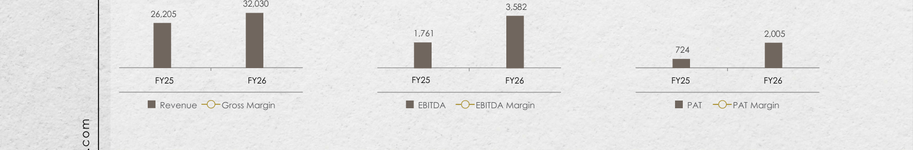

**[Image: e186daf7-9168-4faf-873b-d87ffb129955.pdf-0007-09.png (1650x273, 314.7KB)]**

<!-- Start of picture text -->
32,030  3,582 26,205 1,761  2,005 724 - I FY25 FY26 FY25 FY26 FY25 FY26 ■ Revenue -0 - Gross Margin ■ EBITDA -0 - EBITDA Margin ■  PAT -0 - PAT Margin <!-- End of picture text -->

**[Image: e186daf7-9168-4faf-873b-d87ffb129955.pdf-0007-10.png (1650x207, 215.4KB)]**

<!-- Start of picture text -->
Expenses as a % of Total Revenue 2.96% 1.75% 1.58% 3.41% 1.86% 1.66% FY26 FY25 <!-- End of picture text -->

**[Image: e186daf7-9168-4faf-873b-d87ffb129955.pdf-0007-11.png (51x51, 3.1KB)]**

<!-- Start of picture text -->
06 <!-- End of picture text -->

**[Image: e186daf7-9168-4faf-873b-d87ffb129955.pdf-0007-12.png (1650x103, 121.9KB)]**

<!-- Start of picture text -->
■ Manpower ■ Advertisement ■ Other Overheads • <!-- End of picture text -->

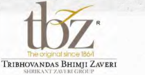

**[Image: e186daf7-9168-4faf-873b-d87ffb129955.pdf-0008-00.png (209x109, 33.2KB)]**

<!-- Start of picture text -->
tbz '1¥tc  1Qlf1  JI  K'tl:·a 16611  " ThlBHOVANDAS BH1M 1 1 ZAVERi '\Hklll.\'\!  /_\\lklf;~Ol  I' <!-- End of picture text -->

### Q4 & FY26Key Takeaways 

- The Company's revenue from operations increased by 56.74% YoY in Q4 FY26, reaching ₹ 8,296.95 million. For FY26, revenue stood at ₹ 32,029.53 million, reflecting 22.23% growth over the previous fiscal year, underscoring sustained demand momentum and strong execution across the retail network. 

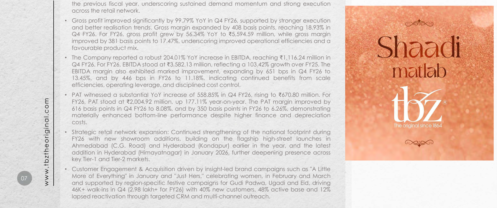

**[Image: e186daf7-9168-4faf-873b-d87ffb129955.pdf-0008-03.png (1650x692, 1377.6KB)]**

<!-- Start of picture text -->
the previous fiscal year, underscoring sustained demand momentum and strong execution across the retail network. • Gross profit improved significantly by 99.79% YoY in Q4 FY26, supported by stronger execution and better realisation trends. Gross margin expanded by 408 basis points, reaching 18.93% in Q4 FY26. For FY26, gross profit grew by 56.34% YoY to ₹ 5,594.59 million, while gross margin improved by 381 basis points to 17.47%, underscoring improved operational efficiencies and a favourable product mix. • The Company reported a robust 204.01% YoY increase in EBITDA, reaching ₹ 1,116.24 million in Shaadi Q4 FY26. For FY26, EBITDA stood at  ₹ 3,582.13 million, reflecting a 103.42% growth over FY25. The EBITDA margin also exhibited marked improvement, expanding by 651 bps in Q4 FY26 to matlab 13.45%, and by 446 bps in FY26 to 11.18%, indicating continued benefits from scale efficiencies, operating leverage, and disciplined cost control. • PAT witnessed a substantial YoY increase of 558.85% in Q4 FY26, rising to ₹ 670.80 million. For FY26, PAT stood at ₹ 2,004.92 million, up 177.11% year-on-year. The PAT margin improved by 616 basis points in Q4 FY26 to 8.08%, and by 350 basis points in FY26 to 6.26%, demonstrating materially enhanced bottom-line performance despite higher finance and depreciation costs. • Strategic retail network expansion: Continued strengthening of the national footprint during FY26 with new showroom additions, building on the flagship high-street launches in Ahmedabad (C.G. Road) and Hyderabad (Kondapur) earlier in the year, and the latest addition in Hyderabad (Himayatnagar) in January 2026, further deepening presence across key Tier-1 and Tier-2 markets. • Customer Engagement & Acquisition driven by insight-led brand campaigns such as "A Little 07 More of Everything" in January and "Just Hers," celebrating women, in February and March and supported by region-specific festive campaigns for Gudi Padwa, Ugadi and Eid, driving 46K+ walk-ins in Q4 (2.98 lakh+ for FY26) with 40% new customers, 48% active base and 12% • lapsed reactivation through targeted CRM and multi-channel outreach. www.tbztheoriginal.com <!-- End of picture text -->

• 08 

### Q4 & FY26Standalone Profit & Loss Statement 

**[Image: e186daf7-9168-4faf-873b-d87ffb129955.pdf-0009-03.png (189x111, 36.6KB)]**

<!-- Start of picture text -->
tbz· IQral  inc  1  '-"1 Th rnHOVAN DAS  BHI MJ I  ZAVERi \IUU1..\.' I  L\\UU(;JtOI I' <!-- End of picture text -->

(In ₹ Mln) 

**[Image: e186daf7-9168-4faf-873b-d87ffb129955.pdf-0009-05.png (51x51, 3.1KB)]**

<!-- Start of picture text -->
08 <!-- End of picture text -->

|**Particulars**|**Q4FY26**|**Q4FY25**|**YoY%**|**FY26**|**FY25**|**YoY%**|
|---|---|---|---|---|---|---|
|**Revenue From Operation**|**8,296.95**|**5,293.44**|**56.74%**|**32,029.53**|**26,204.84**|**22.23%**|
|COGS|6,726.26|4,507.28|49.23%|26,434.93|22,626.37|16.83%|
|**Gross Profit**|**1,570.69**|**786.16**|**99.79%**|**5,594.59**|**3,578.48**|**56.34%**|
|**Gross Margin %**|**18.93%**|**14.85%**|**408 bps**|**17.47%**|**13.66%**|**381 bps**|
|Employee Expenses|246.28|216.42|13.80%|946.92|893.48|5.98%|
|Other Expenses|208.17|202.56|2.77%|1,065.54|924.05|15.31%|
|**EBIDTA**|**1,116.24**|**367.18**|**204.01%**|**3,582.13**|**1,760.95**|**103.42%**|
|**EBIDTA Margin %**|**13.45%**|**6.94%**|**651 bps**|**11.18%**|**6.72%**|**446 bps**|
|Finance Cost|159.14|170.07|-6.44%|685.67|561.33|22.15%|
|Depreciation|79.89|68.98|15.81%|290.41|251.57|15.44%|
|Other Income|18.08|14.46|25.03%|78.42|49.06|59.85%|
|**Profit Before Tax**|**895.29**|**142.58**|**527.91%**|**2,684.47**|**997.11**|**169.23%**|
|Taxes|224.49|40.77|450.63%|679.56|273.61|148.37%|
|**Profit after Tax***|**670.80**|**101.81**|**558.85%**|**2,004.92**|**723.50**|**177.11%**|
|**PAT Margin %**|**8.08%**|**1.92%**|**616 bps**|**6.26%**|**2.76%**|**350 bps**|

**[Image: e186daf7-9168-4faf-873b-d87ffb129955.pdf-0009-07.png (1308x41, 44.8KB)]**

<!-- Start of picture text -->
Revenue From Operation 8,296.95  5,293.44  56.74% 32,029.53  26,204.84  22.23% <!-- End of picture text -->

**[Image: e186daf7-9168-4faf-873b-d87ffb129955.pdf-0009-08.png (1308x41, 23.8KB)]**

<!-- Start of picture text -->
Gross Profit 1,570.69  786.16  99.79% 5,594.59  3,578.48  56.34% <!-- End of picture text -->

**[Image: e186daf7-9168-4faf-873b-d87ffb129955.pdf-0009-09.png (1308x41, 24.6KB)]**

<!-- Start of picture text -->
Employee Expenses 246.28  216.42  13.80% 946.92  893.48  5.98% <!-- End of picture text -->

**[Image: e186daf7-9168-4faf-873b-d87ffb129955.pdf-0009-10.png (1308x42, 25.3KB)]**

<!-- Start of picture text -->
EBIDTA 1,116.24  367.18  204.01% 3,582.13  1,760.95  103.42% <!-- End of picture text -->

**[Image: e186daf7-9168-4faf-873b-d87ffb129955.pdf-0009-11.png (1308x41, 24.4KB)]**

<!-- Start of picture text -->
Finance Cost 159.14  170.07  -6.44% 685.67  561.33  22.15% <!-- End of picture text -->

**[Image: e186daf7-9168-4faf-873b-d87ffb129955.pdf-0009-12.png (1308x42, 26.2KB)]**

<!-- Start of picture text -->
Other Income 18.08  14.46  25.03% 78.42  49.06  59.85% <!-- End of picture text -->

**[Image: e186daf7-9168-4faf-873b-d87ffb129955.pdf-0009-13.png (1308x41, 25.6KB)]**

<!-- Start of picture text -->
Taxes 224.49  40.77  450.63% 679.56  273.61  148.37% <!-- End of picture text -->

**[Image: e186daf7-9168-4faf-873b-d87ffb129955.pdf-0009-14.png (1311x42, 27.1KB)]**

<!-- Start of picture text -->
PAT Margin % 8.08% 1.92% 616 bps 6.26% 2.76% 350 bps <!-- End of picture text -->

• 09 

### FY26Standalone Balance Sheet 

**[Image: e186daf7-9168-4faf-873b-d87ffb129955.pdf-0010-03.png (189x111, 36.6KB)]**

<!-- Start of picture text -->
tbz· IQral  inc  1  '-"1 Th rnHOVAN DAS  BHI MJ I  ZAVERi \IUU1..\.' I  L\\UU(;JtOI I' <!-- End of picture text -->

(In ₹ Mln) 

**[Image: e186daf7-9168-4faf-873b-d87ffb129955.pdf-0010-05.png (51x51, 3.1KB)]**

<!-- Start of picture text -->
09 <!-- End of picture text -->

|**Particulars**|**Mar-26**|**Mar-25**|
|---|---|---|
|Shareholder's Funds|8,467.04|6,676.70|
|Borrowings|7,857.00|6,999.91|
|Lease Liability|1,005.13|917.74|
|Provisions|311.32|195.65|
|**Sources of Funds**|**17,640.49**|**14,790.00**|
|Net Block|1,801.76|1,625.50|
|Other Long-Term Assets|287.83|301.58|
|Inventory|17,729.37|14,629.74|
|Debtors|29.93|34.98|
|Cash and Bank Balance|1,015.80|977.17|
|Other Current Assets|224.92|211.63|
|Current Liabilities|(3,449.12)|(2,990.60)|
|**Application of Funds**|**17,640.49**|**14,790.00**|

**[Image: e186daf7-9168-4faf-873b-d87ffb129955.pdf-0010-07.png (1315x48, 53.5KB)]**

<!-- Start of picture text -->
Shareholder's Funds 8,467.04  6,676.70 <!-- End of picture text -->

**[Image: e186daf7-9168-4faf-873b-d87ffb129955.pdf-0010-08.png (1315x48, 25.3KB)]**

<!-- Start of picture text -->
Lease Liability 1,005.13  917.74 <!-- End of picture text -->

**[Image: e186daf7-9168-4faf-873b-d87ffb129955.pdf-0010-09.png (1315x48, 26.3KB)]**

<!-- Start of picture text -->
Net Block 1,801.76  1,625.50 <!-- End of picture text -->

**[Image: e186daf7-9168-4faf-873b-d87ffb129955.pdf-0010-10.png (1315x48, 26.1KB)]**

<!-- Start of picture text -->
Inventory 17,729.37  14,629.74 <!-- End of picture text -->

**[Image: e186daf7-9168-4faf-873b-d87ffb129955.pdf-0010-11.png (1315x48, 27.4KB)]**

<!-- Start of picture text -->
Cash and Bank Balance 1,015.80  977.17 <!-- End of picture text -->

**[Image: e186daf7-9168-4faf-873b-d87ffb129955.pdf-0010-12.png (1318x96, 57.7KB)]**

<!-- Start of picture text -->
Current Liabilities (3,449.12)  (2,990.60) Application of Funds 17,640.49  14,790.00 <!-- End of picture text -->

• 10 

Our newly opened stores in FY26: Ahmedabad, Kondapur & Himayatnagar in Hyderabad 

**[Image: e186daf7-9168-4faf-873b-d87ffb129955.pdf-0011-02.png (189x111, 36.6KB)]**

<!-- Start of picture text -->
tbz· r  IQral  inc  1  '-"1 Th rnHOVAN DAS  BHI MJ I  ZAVERi \IUU1..\.' I  L\\UU(;JtOI I' <!-- End of picture text -->

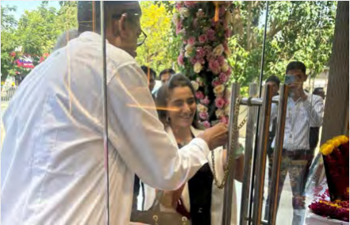

**[Image: e186daf7-9168-4faf-873b-d87ffb129955.pdf-0011-03.png (441x284, 340.5KB)]**

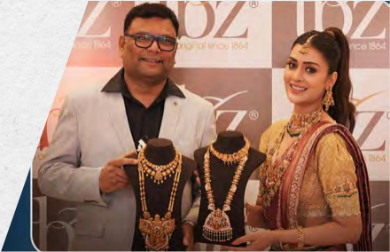

**[Image: e186daf7-9168-4faf-873b-d87ffb129955.pdf-0011-04.png (440x284, 288.1KB)]**

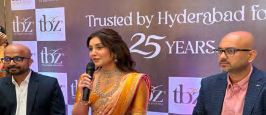

**[Image: e186daf7-9168-4faf-873b-d87ffb129955.pdf-0011-05.png (434x189, 207.5KB)]**

**[Image: e186daf7-9168-4faf-873b-d87ffb129955.pdf-0011-06.png (434x95, 112.7KB)]**

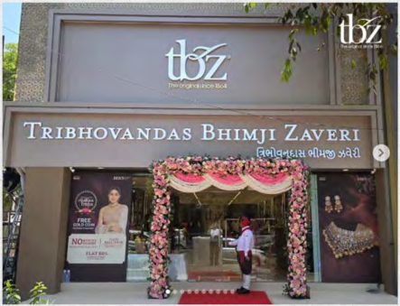

**[Image: e186daf7-9168-4faf-873b-d87ffb129955.pdf-0011-07.png (443x339, 342.7KB)]**

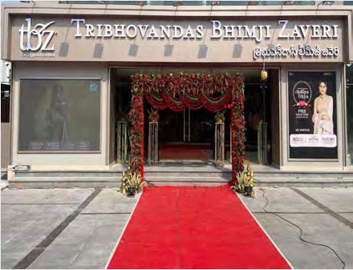

**[Image: e186daf7-9168-4faf-873b-d87ffb129955.pdf-0011-08.png (440x337, 348.8KB)]**

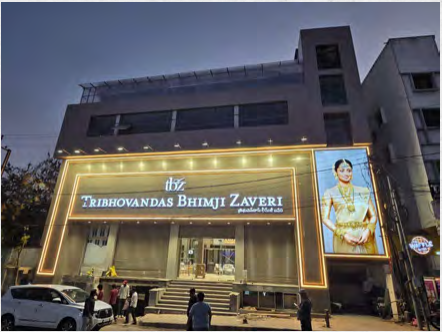

**[Image: e186daf7-9168-4faf-873b-d87ffb129955.pdf-0011-09.png (442x332, 308.6KB)]**

### Marketing Initiatives During Q4 & FY26 

Multi-Channel Marketing & New Product Stories Driving Growth 

###### **Customer Traffic & CRM Outcomes** 

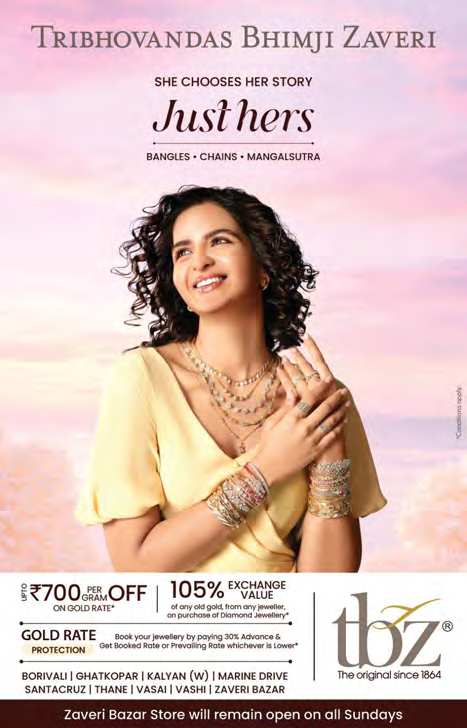

**[Image: e186daf7-9168-4faf-873b-d87ffb129955.pdf-0012-03.png (467x728, 575.7KB)]**

<!-- Start of picture text -->
TRIBHOVANDAS BHIMJI ZAVERI SHE  CHOOSES  HER  STORY Juslhers BANGLES • CHAINS • MANGALSUTRA S • CHAINS • MANGALSUTRA GOLD RATE RATE  Book your jewellery by paying 301. Advance & your jewellery by paying 301. Advance & 301. Advance & Advance & PROTEOTETE CTITI ON  Get Booked Rote Of Prevailing Rote whichever is Lower• Rote Of Prevailing Rote whichever is Lower• Of Prevailing Rote whichever is Lower• Prevailing Rote whichever is Lower• Rote whichever is Lower• whichever is Lower• is Lower• Lower• BORIVALI ALI  I GHATKOPAR I KALYAN ( W) GHATKOPAR I KALYAN ( W) I KALYAN ( W) KALYAN ( W)  I MARINE DRIVE MARINE DRIVE  The original since 1864 original since 1864 iginal since 1864 nce 1864 1864 864 SANTAC RUZ I THANE  RUZ I THANE I THANE THANE  I VASAI I VASHI I ZAVERi BAZAR VASAI I VASHI I ZAVERi BAZAR I VASHI I ZAVERi BAZAR VASHI I ZAVERi BAZAR I ZAVERi BAZAR ZAVERi BAZAR  tnz· Zaveri Bazar Store will remain open on all Sundays remain open on all Sundays open on all Sundays on all Sundays all Sundays Sundays <!-- End of picture text -->

- Delivered 46K+ customer walk-ins in Q4 FY26; approx.3 lakh+ walk-ins in FY 25-26 (Apr'25–Mar'26), supported by an integrated store and digital activation calendar. 

- Customer composition remained healthy across the funnel: 40-45% new acquisitions, 45-50% active customer base,coordinated digital, press, exhibitions, BTL and promotional schemes.and and 10-15% reactivated lapsed customers, enabled through targeted CRM (WhatsApp/SMS) and coordinated digital, press, exhibitions, BTL and promotional schemes.and 

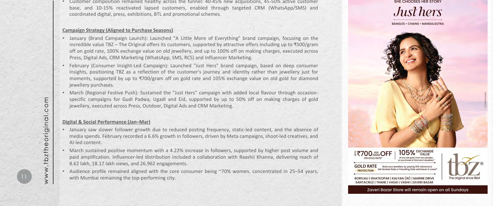

**[Image: e186daf7-9168-4faf-873b-d87ffb129955.pdf-0012-06.png (1650x692, 1284.5KB)]**

<!-- Start of picture text -->
 Customer composition healthy across 40-45% new acquisitions, 45-50% active customer SHE  CHOOSES  HER  STORY base,coordinated digital, press, exhibitions, BTL and promotional schemes.and 10-15% reactivated lapsed customers, enabled through targeted CRM (WhatsApp/SMS) and Juslhers BANGLES • CHAINS • MANGALSUTRA S • CHAINS • MANGALSUTRA Campaign Strategy (Aligned to Purchase Seasons) • January (Brand Campaign Launch): Launched "A Little More of Everything" brand campaign, focusing on the incredible value TBZ – The Original offers its customers, supported by attractive offers including up to ₹500/gram off on gold rate, 100% exchange value on old jewellery, and up to 100% off on making charges, executed across Press, Digital Ads, CRM Marketing (WhatsApp, SMS, RCS) and Influencer Marketing. • February (Consumer Insight-Led Campaign): Launched "Just Hers" brand campaign, based on deep consumer insights, positioning TBZ as a reflection of the customer's journey and identity rather than jewellery just for moments, supported by up to ₹700/gram off on gold rate and 105% exchange value on old gold for diamond jewellery purchases. • March (Regional Festive Push): Sustained the "Just Hers" campaign with added local flavour through occasion- specific campaigns for Gudi Padwa, Ugadi and Eid, supported by up to 50% off on making charges of gold jewellery, executed across Press, Outdoor, Digital Ads and CRM Marketing. Digital & Social Performance (Jan–Mar) • January saw slower follower growth due to reduced posting frequency, static-led content, and the absence of media spends. February recorded a 6.6% growth in followers, driven by Meta campaigns, shoot-led creatives, and AI-led content. • March sustained positive momentum with a 4.22% increase in followers, supported by higher post volume and paid amplification. Influencer-led distribution included a collaboration with Raashii Khanna, delivering reach of 8.62 lakh, 18.17 lakh views, and 26,962 engagements. GOLD RATE RATE  Book your jewellery by paying 301. Advance & your jewellery by paying 301. Advance & 301. Advance & Advance & • Audience profile remained aligned with the core consumer being ~70% women, concentrated in 25–54 years, PROTEOTETE CTITI ON  Get Booked Rote Of Prevailing Rote whichever is Lower• Rote Of Prevailing Rote whichever is Lower• Of Prevailing Rote whichever is Lower• Prevailing Rote whichever is Lower• Rote whichever is Lower• whichever is Lower• is Lower• Lower• 11 with Mumbai remaining the top-performing city. BORIVALI ALI  I GHATKOPAR I KALYAN ( W) GHATKOPAR I KALYAN ( W) I KALYAN ( W) KALYAN ( W)  I MARINE DRIVE MARINE DRIVE  The original since 1864 original since 1864 iginal since 1864 nce 1864 1864 864 SANTAC RUZ I THANE  RUZ I THANE I THANE THANE  I VASAI I VASHI I ZAVERi BAZAR VASAI I VASHI I ZAVERi BAZAR I VASHI I ZAVERi BAZAR VASHI I ZAVERi BAZAR I ZAVERi BAZAR ZAVERi BAZAR  tnz· Zaveri Bazar Store will remain open on all Sundays remain open on all Sundays open on all Sundays on all Sundays all Sundays Sundays • www.tbztheoriginal.com <!-- End of picture text -->

**[Image: e186daf7-9168-4faf-873b-d87ffb129955.pdf-0013-01.png (51x51, 3.0KB)]**

<!-- Start of picture text -->
12 <!-- End of picture text -->

• 12 

Marketing Initiatives contd. During the Quarter 

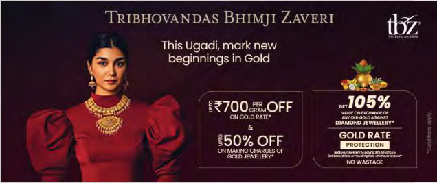

**[Image: e186daf7-9168-4faf-873b-d87ffb129955.pdf-0013-04.png (636x267, 261.0KB)]**

**[Image: e186daf7-9168-4faf-873b-d87ffb129955.pdf-0013-05.png (636x268, 315.4KB)]**

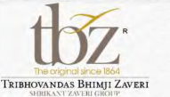

**[Image: e186daf7-9168-4faf-873b-d87ffb129955.pdf-0013-06.png (191x109, 33.7KB)]**

<!-- Start of picture text -->
tnz· TI).,,,,-iglt"'Olsinc  116'1 T'RIBHOVAN DAS  BH IMJ I ZAV ERi \l!Rlll.\'\l  /\\IHlC.\lOI,\' <!-- End of picture text -->

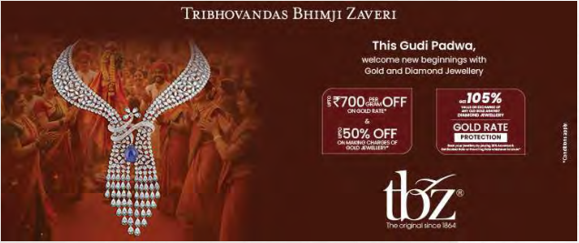

**[Image: e186daf7-9168-4faf-873b-d87ffb129955.pdf-0013-07.png (637x267, 279.3KB)]**

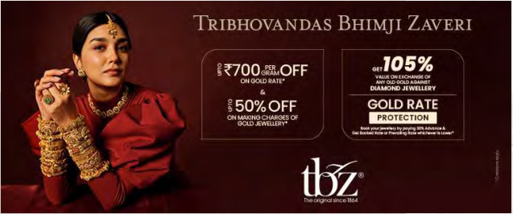

**[Image: e186daf7-9168-4faf-873b-d87ffb129955.pdf-0013-08.png (637x266, 255.8KB)]**

• 13 

**[Image: e186daf7-9168-4faf-873b-d87ffb129955.pdf-0014-02.png (51x51, 3.0KB)]**

<!-- Start of picture text -->
13 <!-- End of picture text -->

### Marketing Initiatives contd. During the Quarter 

**[Image: e186daf7-9168-4faf-873b-d87ffb129955.pdf-0014-04.png (393x522, 476.1KB)]**

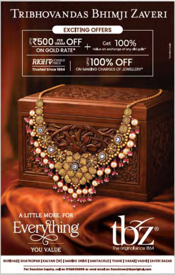

**[Image: e186daf7-9168-4faf-873b-d87ffb129955.pdf-0014-05.png (361x567, 474.5KB)]**

<!-- Start of picture text -->
IOJIIVAIJ I OHATl(Of'"" ICMTAH(w) l ..,.,..,EDaM" I SANT~ l -nw.: IVASAI IVUHI I U.VPI IAZAII <!-- End of picture text -->

**[Image: e186daf7-9168-4faf-873b-d87ffb129955.pdf-0014-06.png (191x109, 33.7KB)]**

<!-- Start of picture text -->
tnz· TI).,,,,-iglt"'Olsinc  116'1 T'RIBHOVAN DAS  BH IMJ I ZAV ERi \l!Rlll.\'\l  /\\IHlC.\lOI,\' <!-- End of picture text -->

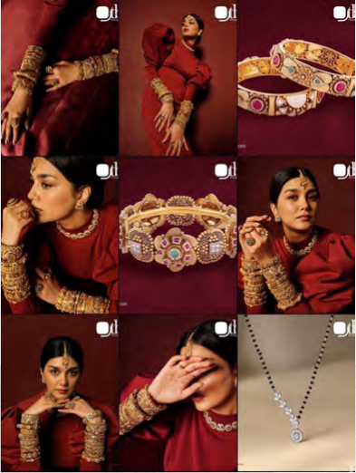

**[Image: e186daf7-9168-4faf-873b-d87ffb129955.pdf-0014-07.png (393x522, 447.6KB)]**

**[Image: e186daf7-9168-4faf-873b-d87ffb129955.pdf-0015-00.png (1650x332, 419.9KB)]**

<!-- Start of picture text -->
tbz· r  IQral  inc  1  '-"1 Th rnHOVAN DAS  BHI MJ I  ZAVERi \IUU1..\.' I  L\\UU(;JtOI I' ABOUT US <!-- End of picture text -->

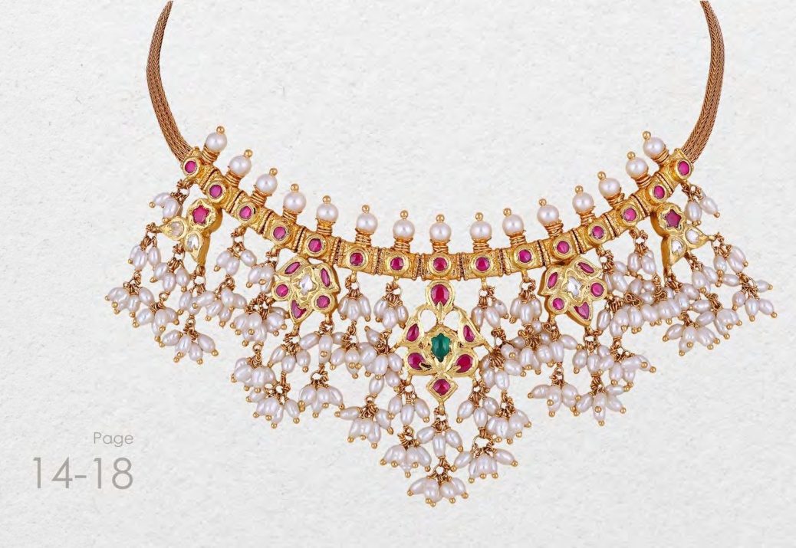

**[Image: e186daf7-9168-4faf-873b-d87ffb129955.pdf-0015-01.png (1038x715, 1087.8KB)]**

<!-- Start of picture text -->
.. Page 14-18 <!-- End of picture text -->

**[Image: e186daf7-9168-4faf-873b-d87ffb129955.pdf-0015-03.png (51x51, 2.9KB)]**

<!-- Start of picture text -->
14 <!-- End of picture text -->

• 14 

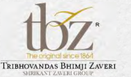

**[Image: e186daf7-9168-4faf-873b-d87ffb129955.pdf-0016-00.png (189x111, 36.6KB)]**

<!-- Start of picture text -->
tbz· · IQral l  inc  1  '-"1 Th rnHOVAN DAS BHI MJ I OVAN DAS BHI MJ I BHI MJ I  MJ I  I  ZAVERi Ri \IUU1..\.' I I  L\\UU(;JtOI I' I' <!-- End of picture text -->

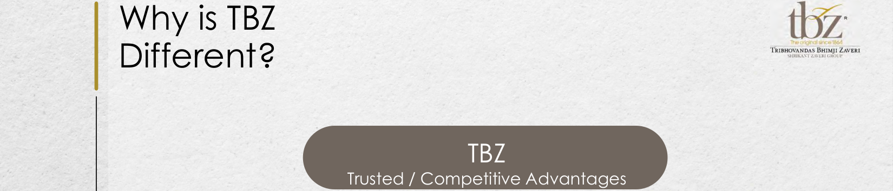

**[Image: e186daf7-9168-4faf-873b-d87ffb129955.pdf-0016-01.png (1650x354, 388.5KB)]**

<!-- Start of picture text -->
Why is TBZ  tbz· · IQral l  inc  1  '-"1 Th rnHOVAN DAS BHI MJ I OVAN DAS BHI MJ I BHI MJ I  MJ I  I  ZAVERi Ri \IUU1..\.' I I  L\\UU(;JtOI I' I' Different? TBZ Trusted / Competitive Advantages <!-- End of picture text -->

|www.tbztheoriginal.com 15 •|Pedigree • 161 years in jewellery business • First jewelers to offer buyback guarantee in 1938 • Professional organization spearheaded by 5th generation of the family   0|161 years of Strong Brand Value • Healthy sales productivity • High footfalls conversion • Multigenerational clientele Trusted 0 |Leader in Specialty Wedding & Occasion Jewellery • Leader of jewellery in Indian market • ~ 65% of sales are wedding & occasion related purchases • Compulsion buying • Stable fixed budget purchases by customers TBZ / Competitive A|Design Exclusivity • 8 - 10 new jewellery lines/year • In-house diamond jewellery production • Customer loyalty • Premium pricing dvantages|Scalability & Reach • 37 stores (1,00,000+ ft.) • Presence – 28 cities, 13 states • New store opened in Pink City- Jaipur in Q1FY25, and Bhubaneshwar & Rourkela stores opening in H1FY25. • 3 new stores added in FY26, 1 in Ahmedabad & 2 in Hyderabad (Kondapur & Himayatnagar), making 37 stores at present.|
|---|---|---|---|---|---|

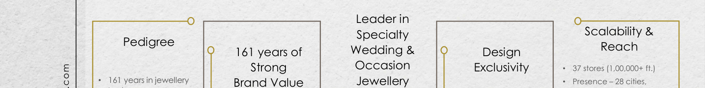

**[Image: e186daf7-9168-4faf-873b-d87ffb129955.pdf-0016-03.png (1650x207, 266.2KB)]**

<!-- Start of picture text -->
Leader in Scalability & Specialty Pedigree Reach 0  161 years of  Wedding &  Design Occasion  • Strong  Exclusivity 37 stores (1,00,000+ ft.) • 161 years in jewellery Brand Value Jewellery • Presence – 28 cities, <!-- End of picture text -->

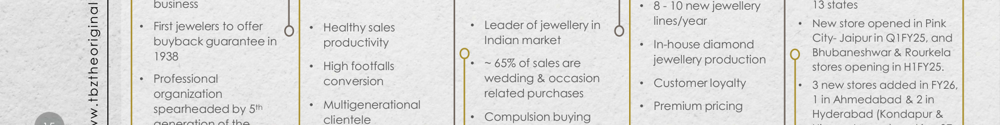

**[Image: e186daf7-9168-4faf-873b-d87ffb129955.pdf-0016-04.png (1650x207, 296.2KB)]**

<!-- Start of picture text -->
business • 8 - 10 new jewellery  13 states • First jewelers to offer 0  • Healthy sales  • Leader of jewellery in  lines/year • New store opened in Pink buyback guarantee in  productivity Indian market  • In-house diamond  City- Jaipur in Q1FY25, and Bhubaneshwar & Rourkela 1938 • High footfalls  • ~ 65% of sales are  jewellery production stores opening in H1FY25. • Professional conversion wedding & occasion  • Customer loyalty • 3 new stores added in FY26, organizationspearheaded by 5 th • Multigenerational clientele  • related purchasesCompulsion buying • Premium pricing 1 in Ahmedabad & 2 in Hyderabad (Kondapur & <!-- End of picture text -->

**[Image: e186daf7-9168-4faf-873b-d87ffb129955.pdf-0016-05.png (1650x103, 131.8KB)]**

<!-- Start of picture text -->
Himayatnagar), making 37 • family Stable fixed budget  stores at present. •  purchases by customers <!-- End of picture text -->

• 16 

### Distinctive Competitive Advantage: Multigenerational Clientele 

**[Image: e186daf7-9168-4faf-873b-d87ffb129955.pdf-0017-03.png (189x111, 36.6KB)]**

<!-- Start of picture text -->
tbz· r  IQral  inc  1  '-"1 Th rnHOVAN DAS  BHI MJ I  ZAVERi \IUU1..\.' I  L\\UU(;JtOI I' <!-- End of picture text -->

##### Enhanced Brand Awareness: 

Deepened Customer Relationships: 

##### Generational Clientele Strength: 

A multigenerational client base also Lastly, a bolsters brand awareness. Older enables TBZ Ltd generations share their positive relationships. experiences with younger family emotional members, leading to word-of-mouth jewellery, the referrals and increased market visibility for deeper bond the Company. z z z zzz **z** zzz z z Diversified Revenue Informed Product Streams: A multigenerational client Development: base allows TBZ Ltd to diversify its revenue TBZ Ltd.’s multigenerational client base streams. By catering to diverse customers provides valuable feedback, offering insights with varying preferences and budgets, the into changing preferences and trends Company can mitigate market fluctuations among different age groups. This information and maintain a stable revenue stream. enables the Company to refine its product 

Lastly, a multigenerational client base enables TBZ Ltd to strengthen customer relationships. Leveraging families' emotional connections with their jewellery, the Company can establish a deeper bond with customers, increasing satisfaction and loyalty. 

TBZ's multigenerational client base is a significant strength, fostering long-term customer relationships. Families purchasing jewellery from TBZ Ltd. for generations are more likely to continue doing so, resulting in a steady stream of repeat business for the Company. 

**[Image: e186daf7-9168-4faf-873b-d87ffb129955.pdf-0017-10.png (55x54, 7.9KB)]**

<!-- Start of picture text -->
zzz <!-- End of picture text -->

**[Image: e186daf7-9168-4faf-873b-d87ffb129955.pdf-0017-11.png (52x54, 7.7KB)]**

<!-- Start of picture text -->
zzz <!-- End of picture text -->

**[Image: e186daf7-9168-4faf-873b-d87ffb129955.pdf-0017-12.png (1650x207, 276.1KB)]**

<!-- Start of picture text -->
Diversified Revenue Informed Product Streams: A multigenerational client Development: base allows TBZ Ltd to diversify its revenue TBZ Ltd.’s multigenerational client base streams. By catering to diverse customers provides valuable feedback, offering insights with varying preferences and budgets, the into changing preferences and trends Company can mitigate market fluctuations among different age groups. This information <!-- End of picture text -->

TBZ Ltd.’s multigenerational client base provides valuable feedback, offering insights into changing preferences and trends among different age groups. This information enables the Company to refine its product development and marketing strategies. 

**[Image: e186daf7-9168-4faf-873b-d87ffb129955.pdf-0017-14.png (51x51, 3.0KB)]**

<!-- Start of picture text -->
16 <!-- End of picture text -->

**[Image: e186daf7-9168-4faf-873b-d87ffb129955.pdf-0017-15.png (1650x103, 128.1KB)]**

<!-- Start of picture text -->
and maintain a stable revenue stream. enables the Company to refine its product development and marketing strategies. • <!-- End of picture text -->

• 17 

# Key Milestones 

**[Image: e186daf7-9168-4faf-873b-d87ffb129955.pdf-0018-02.png (189x111, 36.6KB)]**

<!-- Start of picture text -->
tbz· r  IQral  inc  1  '-"1 Th rnHOVAN DAS BHI MJ I  ZAVERi \IUU1..\.' I  L\\UU(;JtOI I' <!-- End of picture text -->

#### Strong Legacy Of More Than 160 Years Built On Trust 

(Calendar Years) Diamond facility expansion - ~6k to ~24k sq ft Flagship store Listed on BSE & NSE opened in Zaveri First to offer First to launch light Mr. Shrikant Zaveri Introduced 100% Turnover crossed Implementation of with IPO of INR Bazaar, Mumbai buyback guarantee weight jewellery took over the pre- hallmarked INR ` 5,000 mn in Oracle ERP Suite 2,000 mn <mark>business jewellery FY09</mark> 1864 1938 1995 2001 2004 0 2009 2011 2012 ° o 2017 o 2016 o 2015 o 2014 o 2013 2026 1 2025 2024 2019-2022 <mark>====== ========= ====== ==========-</mark> **c====r====** <mark>I ==== :====-</mark> New store Opened store in 3 franchise stores 2nd Franchise 1st Franchise store Recommended Retail footprint New store New stores opened in Lucknow in March ,c opened in Ranchi, store opened at opened at special dividend crosses 84k sq ft Himayatnagar, Hyderabad in January 2026. opened in Hyderabad in Ahmedabad opened in April 2025. and and in Pink City-Jaipur (Jun-24) Vapi- GIDC. alongside Kalyan on Oct-5Opened store in 2019in 2022th Jharkhand in MarJ Gujarat in Apr-17, Madhya Pradesh 17, Jamnagar, and Bhopal, Patna, Bihar in Aug-16 Jharkhand in Dhanbad, Nov-15 150of 7.5% on the occasion ofth special year of the across 26 citiesPAT of INR 16,000 mn, Sales crossed ` 850 mn Bhabaneshwar in Oct-17 company (Sep-24) & 3 exclusive brand Rourkela (Octoutlets opened in 24) Malls – R-City, Seawoods in Sep17 and High Street Phoenix – in Mumbai in Nov-17 

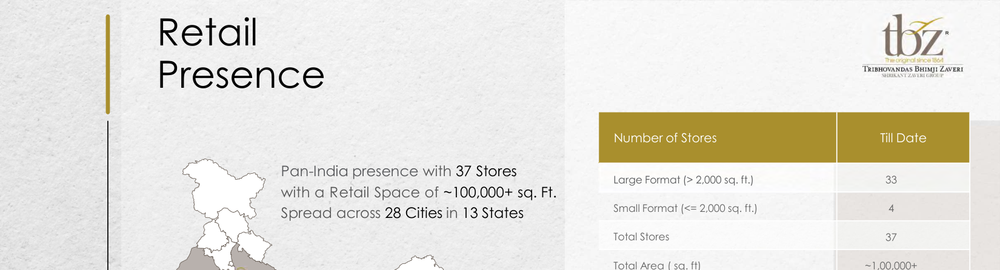

**[Image: e186daf7-9168-4faf-873b-d87ffb129955.pdf-0019-00.png (1650x446, 467.3KB)]**

<!-- Start of picture text -->
Retail  · t}jz f  ong ral  nca 186'1 T'RIBHOVANDAS  8HIMJI ZAVERi .',,IUIHL\.'L  L\\Ull(;Jt()l,J• Presence Number of Stores Till Date Pan-India presence with 37 Stores Large Format (> 2,000 sq. ft.) 33 with a Retail Space of ~100,000+ sq. Ft. Spread across 28 Cities in 13 States Small Format (<= 2,000 sq. ft.) 4 Total Stores 37 Total Area ( sq. ft) ~1,00,000+ <!-- End of picture text -->

**[Image: e186daf7-9168-4faf-873b-d87ffb129955.pdf-0019-01.png (1650x207, 351.8KB)]**

<!-- Start of picture text -->
Total Stores 37 Noida Total Area ( sq. ft) ~1,00,000+ Jaipur Lucknow Udaipur Patna GandhidhamAhmedabad-2Ahmedabad-2 Rajkot VadodaraIndore JamshedpurRanchi Kolkata -2 Bhavnagar Surat Raipur Rourkela <!-- End of picture text -->

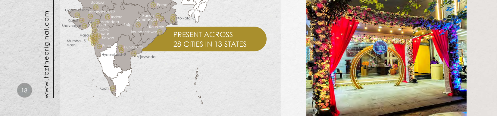

**[Image: e186daf7-9168-4faf-873b-d87ffb129955.pdf-0019-02.png (1650x388, 929.0KB)]**

<!-- Start of picture text -->
Udaipur Patna GandhidhamAhmedabad-2Ahmedabad-2 Indore Ranchi Kolkata -2 Rajkot VadodaraIndore JamshedpurRanchi Bhavnagar Surat Raipur Rourkela Vapi-2 Vasai Thane Bhubaneshwar PRESENT ACROSS Kalyan Mumbai- 5, Vashi Pune Punjagutta 28 CITIES IN 13 STATES Hyderabad- 2 Vijaywada •  18 Kochi www.tbztheoriginal.com <!-- End of picture text -->

**[Image: e186daf7-9168-4faf-873b-d87ffb129955.pdf-0019-03.png (1650x103, 212.4KB)]**

<!-- Start of picture text -->
• <!-- End of picture text -->

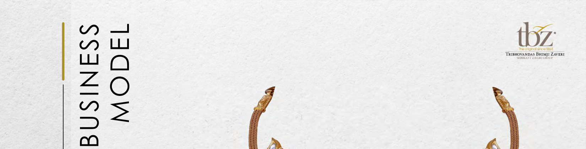

**[Image: e186daf7-9168-4faf-873b-d87ffb129955.pdf-0020-00.png (1650x421, 548.5KB)]**

<!-- Start of picture text -->
tbz· r  IQral  inc  1  '-"1 Th rnHOVAN DAS  BHI MJ I  ZAVERi \IUU1..\.' I  L\\UU(;JtOI I' BUSINESS MODEL <!-- End of picture text -->

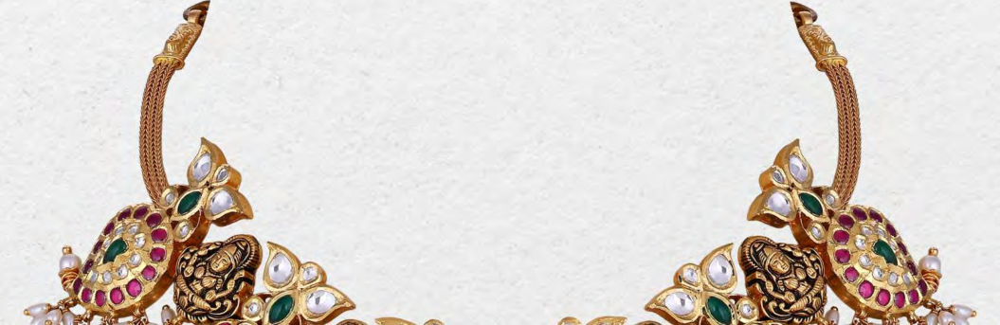

**[Image: e186daf7-9168-4faf-873b-d87ffb129955.pdf-0020-01.png (1055x343, 476.2KB)]**

• 19 

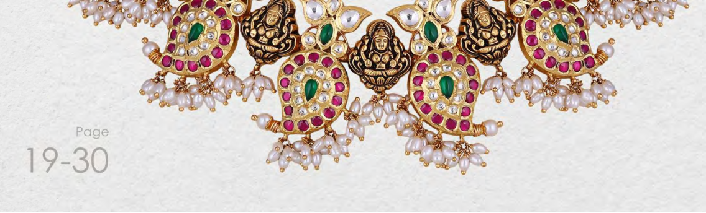

**[Image: e186daf7-9168-4faf-873b-d87ffb129955.pdf-0020-03.png (1136x344, 682.1KB)]**

<!-- Start of picture text -->
Page 19-30 <!-- End of picture text -->

### Business Model: Manufacturing 

**[Image: e186daf7-9168-4faf-873b-d87ffb129955.pdf-0021-01.png (189x111, 36.6KB)]**

<!-- Start of picture text -->
tbz· IQral  inc  1  '-"1 Th rnHOVAN DAS  BHI MJ I  ZAVERi \IUU1..\.' I  L\\UU(;JtOI I' <!-- End of picture text -->

- Gold • Raw Material - Bullion Sources: 

- • Banks – Gold on loan • • 

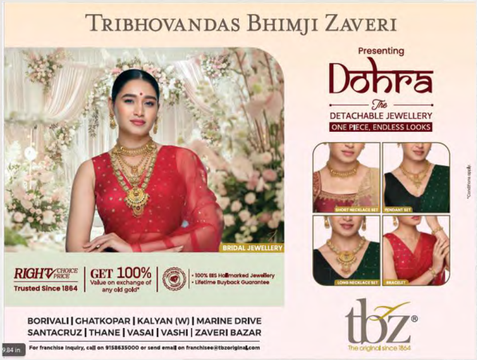

**[Image: e186daf7-9168-4faf-873b-d87ffb129955.pdf-0021-03.png (597x451, 553.1KB)]**

<!-- Start of picture text -->
TRIBHOVANDAS BHIMJI ZAVERI Presenting Do'nra --g.,-- DETACHABLE JEWELLERY RICJHWN"'  I Vl~on  GET  •JCC.l",.ange  100%  of  I@· · Is.~  1, • .... UIMlfflit ..  lUyt)«,  _,._....,  OUOIOntN Trutt~  Slnc•  1884  any old gold" BORIVALI I CHATKOPAR I KALYAN (W) I MARINE DRIVE SANTACRUZ I THANE I VASAI I VASHI I ZAVERi BAZAR <!-- End of picture text -->

**[Image: e186daf7-9168-4faf-873b-d87ffb129955.pdf-0021-04.png (66x277, 20.8KB)]**

<!-- Start of picture text -->
Procurement <!-- End of picture text -->

- Raw Material - Bullion 

- Exchange & purchase of old jewellery 

- Bullion dealers 

• 20 

**[Image: e186daf7-9168-4faf-873b-d87ffb129955.pdf-0021-09.png (66x276, 20.6KB)]**

<!-- Start of picture text -->
Manufacturing <!-- End of picture text -->

- Gold jewellery manufacturing is outsourced. 

- Vast nation-wide network of 150+ vendors 

- Each vendor has an annual gold processing capacity of more than 100 kg. 

- These vendors are associated with TBZ since generations and are experts in handmade regional jewellery designs. 

**[Image: e186daf7-9168-4faf-873b-d87ffb129955.pdf-0021-14.png (1650x103, 112.6KB)]**

<!-- Start of picture text -->
• <!-- End of picture text -->

**[Image: e186daf7-9168-4faf-873b-d87ffb129955.pdf-0022-00.png (1650x207, 262.5KB)]**

<!-- Start of picture text -->
Business Model: tbz· contd. r  IQral  inc  1  '-"1 Manufacturing  Th rnHOVAN DAS  BHI MJ I  ZAVERi \IUU1..\.' I  L\\UU(;JtOI I' <!-- End of picture text -->

Business Model: contd. Manufacturing Diamond • Raw Material - Cut & polished diamonds Sources: • DTC site holders • designs, lower costs, and higher margins • • • 21 

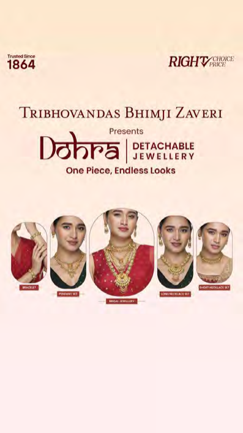

**[Image: e186daf7-9168-4faf-873b-d87ffb129955.pdf-0022-02.png (397x706, 264.6KB)]**

<!-- Start of picture text -->
Trusted Since 1864 TRIBHOVANDAS BHIMJI ZAVERI BHIMJI ZAVERI ZAVERI \  Presents Don~a  DETACHABLE I  JEWELLERY One Piece, Endless Looks IClllimlill <!-- End of picture text -->

**[Image: e186daf7-9168-4faf-873b-d87ffb129955.pdf-0022-03.png (1650x207, 193.6KB)]**

<!-- Start of picture text -->
Diamond Trusted Since 1864 TRIBHOVANDAS BHIMJI ZAVERI BHIMJI ZAVERI ZAVERI • Raw Material - Cut & polished diamonds <!-- End of picture text -->

**[Image: e186daf7-9168-4faf-873b-d87ffb129955.pdf-0022-04.png (1650x207, 273.5KB)]**

<!-- Start of picture text -->
Don~a  DETACHABLE Sources: I  JEWELLERY One Piece, Endless Looks • DTC site holders <!-- End of picture text -->

- In-house diamond jewellery manufacturing leading to exclusive designs, lower costs, and higher margins 

- • Owned manufacturing facility at Kandivali, Mumbai 

- The facility also has a sizeable capacity for gold refining and matching capacity for jewellery components manufacturing 

**[Image: e186daf7-9168-4faf-873b-d87ffb129955.pdf-0022-07.png (1650x103, 96.6KB)]**

<!-- Start of picture text -->
• <!-- End of picture text -->

### Gold Metal Loan: Efficient Sourcing Channel 

**[Image: e186daf7-9168-4faf-873b-d87ffb129955.pdf-0023-01.png (189x111, 36.6KB)]**

<!-- Start of picture text -->
tbz· IQral  inc  1  '-"1 Th rnHOVAN DAS  BHI MJ I  ZAVERi \IUU1..\.' I  L\\UU(;JtOI I' <!-- End of picture text -->

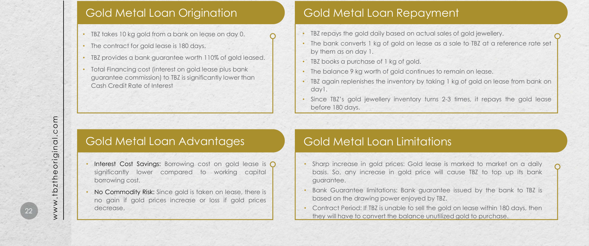

**[Image: e186daf7-9168-4faf-873b-d87ffb129955.pdf-0023-02.png (1650x692, 824.5KB)]**

<!-- Start of picture text -->
Gold Metal Loan Origination Gold Metal Loan Repayment • TBZ takes 10 kg gold from a bank on lease on day 0. • TBZ repays the gold daily based on actual sales of gold jewellery. • • The bank converts 1 kg of gold on lease as a sale to TBZ at a reference rate set The contract for gold lease is 180 days. by them as on day 1. • TBZ provides a bank guarantee worth 110% of gold leased. • TBZ books a purchase of 1 kg of gold. • Total Financing cost (interest on gold lease plus bank  • The balance 9 kg worth of gold continues to remain on lease. guarantee commission) to TBZ is significantly lower than  • TBZ again replenishes the inventory by taking 1 kg of gold on lease from bank on Cash Credit Rate of Interest day1. • Since TBZ’s gold jewellery inventory turns 2-3 times, it repays the gold lease before 180 days. Gold Metal Loan Advantages Gold Metal Loan Limitations • Interest Cost Savings: Borrowing cost on gold lease is • Sharp increase in gold prices: Gold lease is marked to market on a daily significantly lower compared to working capital basis. So, any increase in gold price will cause TBZ to top up its bank borrowing cost. guarantee. • No Commodity Risk: Since gold is taken on lease, there is • Bank Guarantee limitations: Bank guarantee issued by the bank to TBZ is no gain if gold prices increase or loss if gold prices based on the drawing power enjoyed by TBZ. 22 decrease. • Contract Period: If TBZ is unable to sell the gold on lease within 180 days, then they will have to convert the balance unutilized gold to purchase. • www.tbztheoriginal.com <!-- End of picture text -->

• 23 

**[Image: e186daf7-9168-4faf-873b-d87ffb129955.pdf-0024-02.png (51x51, 3.1KB)]**

<!-- Start of picture text -->
23 <!-- End of picture text -->

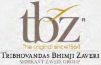

**[Image: e186daf7-9168-4faf-873b-d87ffb129955.pdf-0024-03.png (170x109, 34.5KB)]**

### Securing Future Growth: Our Strategic Pillars 

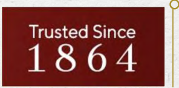

**[Image: e186daf7-9168-4faf-873b-d87ffb129955.pdf-0024-05.png (296x145, 67.9KB)]**

<!-- Start of picture text -->
Trusted Since 1864 <!-- End of picture text -->

##### 160 years of Brand Value Leverage: 

TBZ Ltd boasts substantial brand value and a long-standing reputation for quality and craftsmanship. With over 160 years in business, the brand is recognized and trusted by multigenerational customers across India, providing a significant competitive advantage and positioning the Company for continued growth. 

##### Diversified Portfolio Growth: 

**[Image: e186daf7-9168-4faf-873b-d87ffb129955.pdf-0024-09.png (226x132, 17.7KB)]**

TBZ Ltd maintains a diversified product portfolio featuring gold, diamond, and other precious gemstone jewellery. By offering various price points to cater to different customer segments, the Company intends to mitigate market fluctuations' impact and generate a stable revenue stream. 

**[Image: e186daf7-9168-4faf-873b-d87ffb129955.pdf-0024-11.png (115x116, 10.7KB)]**

**[Image: e186daf7-9168-4faf-873b-d87ffb129955.pdf-0024-12.png (116x116, 10.4KB)]**

<!-- Start of picture text -->
• . !ii <!-- End of picture text -->

Financial Performance Strength: 

TBZ Ltd is on track to deliver steadily improving financial performance, with consistent revenue growth and profitability. The solid balance sheet, lowering debt levels, and strong cash position sets the Company up for continued growth and expansion in India's exciting growth story. 

**[Image: e186daf7-9168-4faf-873b-d87ffb129955.pdf-0024-15.png (132x222, 25.4KB)]**

**[Image: e186daf7-9168-4faf-873b-d87ffb129955.pdf-0024-16.png (135x222, 25.1KB)]**

<!-- Start of picture text -->
\ I • <!-- End of picture text -->

##### Retail Expansion Focus: 

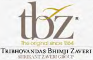

**[Image: e186daf7-9168-4faf-873b-d87ffb129955.pdf-0024-18.png (159x103, 29.5KB)]**

TBZ Ltd focuses on organic growth through its network of stores and judiciously expanding its retail footprint across India by opening new stores in key locations. This strategy will allow the Company to increase its market share and attract new customers. The focus on retail expansion enables TBZ Ltd to leverage its brand value and capture new growth opportunities. 

• 24 

### Steadfast market steeped in tradition and innovation 

##### GDP Contribution and Cultural Significance: 

The gems and jewellery market contributes approximately 7.5% to India’s GDP and 14% to total merchandise exports (IBEF Research). Gold, symbolizing wealth and prosperity, is integral to Indian culture and ceremonies, ensuring continued demand. 

##### Expanding Middle Class and Disposable Income: 

India's middle class is projected to grow from ~30% of the population in 2021 to >60% by 2047 (PRICE Market Research Report). Rising disposable incomes will likely increase spending on luxury items like high-quality, branded jewellery. 

##### Steadfast Market Growth: 

The market was valued at $78.50 billion in 2021 and is expected to reach $119.80 billion by 2027, with a CAGR of 8.34%. The popularity of costume and fashion jewellery, especially among younger consumers, contributes to this growth as they seek affordable and versatile options. 

**[Image: e186daf7-9168-4faf-873b-d87ffb129955.pdf-0025-09.png (189x111, 36.6KB)]**

<!-- Start of picture text -->
tbz· IQral  inc  1  '-"1 Th rnHOVAN DAS  BHI MJ I  ZAVERi \IUU1..\.' I  L\\UU(;JtOI I' <!-- End of picture text -->

**[Image: e186daf7-9168-4faf-873b-d87ffb129955.pdf-0025-10.png (511x337, 437.9KB)]**

##### Fashion Jewellery Demand: 

**[Image: e186daf7-9168-4faf-873b-d87ffb129955.pdf-0025-12.png (51x51, 3.0KB)]**

<!-- Start of picture text -->
24 <!-- End of picture text -->

The rising popularity of fashion jewellery, particularly among younger consumers, has led to significant growth in this segment, with more consumers seeking affordable, stylish, and versatile options for various occasions. 

##### E-commerce and Digital Platform Growth: 

Increasing internet and smartphone penetration has resulted in a rise in online shopping, expanding the market and increasing accessibility to a wider range of jewellery designs and products. 

>60% by $119.80 billion 8.34% 2047 by 2027 Middle Class Market Size Indian Market for share of CAGR Jewellery Population (2021-27) 

Source: PRICE & Economic Times 

• 25 

**[Image: e186daf7-9168-4faf-873b-d87ffb129955.pdf-0026-02.png (51x51, 3.1KB)]**

<!-- Start of picture text -->
25 <!-- End of picture text -->

**[Image: e186daf7-9168-4faf-873b-d87ffb129955.pdf-0026-03.png (189x111, 36.6KB)]**

<!-- Start of picture text -->
tbz· r  IQral  inc  1  '-"1 Th rnHOVAN DAS BHI MJ I  ZAVERi \IUU1..\.' I  L\\UU(;JtOI I' <!-- End of picture text -->

### Harnessing Our Core Strengths to Drive Success 

##### Domestic Focus: 

**[Image: e186daf7-9168-4faf-873b-d87ffb129955.pdf-0026-06.png (180x207, 27.7KB)]**

Since TBZ primarily concentrates on the domestic jewellery market, it remains protected from the impact of international economic challenges. 

##### Consumer Trust: 

**[Image: e186daf7-9168-4faf-873b-d87ffb129955.pdf-0026-09.png (197x239, 30.7KB)]**

TBZ is an age-old established brand known for its innovative designs, the quality of its artistry, and unquestionable product authenticity, enjoying a loyal base of multigenerational clientele. 

Rooted in trust and heritage, TBZ leads the Indian jewellery market with unmatched quality, a domestic focus, and a deep connection to the rising middle-class consumer. 

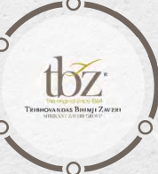

**[Image: e186daf7-9168-4faf-873b-d87ffb129955.pdf-0026-12.png (178x197, 34.8KB)]**

**[Image: e186daf7-9168-4faf-873b-d87ffb129955.pdf-0026-13.png (197x238, 33.3KB)]**

**[Image: e186daf7-9168-4faf-873b-d87ffb129955.pdf-0026-14.png (197x238, 33.8KB)]**

<!-- Start of picture text -->
consumer. <!-- End of picture text -->

##### Industry Benchmark: 

In the Indian jewellery market, TBZ holds a distinguished position for its exemplary corporate governance, setting it as the industry's peer benchmark. 

Middle-Class Growth: TBZ is strategically positioned to capitalize on the remarkable growth of the expanding Indian middle class, and their surging aspirations and spending in India. 

**[Image: e186daf7-9168-4faf-873b-d87ffb129955.pdf-0026-18.png (180x208, 36.1KB)]**

##### Resilient Heritage: 

Spanning over 160 years, the Company has navigated multiple economic disruptions, coming out strong after each cycle. 

**[Image: e186daf7-9168-4faf-873b-d87ffb129955.pdf-0027-01.png (51x51, 3.1KB)]**

<!-- Start of picture text -->
26 <!-- End of picture text -->

• 26 

### Awards & Recognition: 

- Mr. Shrikant Zaveri, Chairman & Managing Director, was honoured with the "Visionary Leader of the Year" award at the Retail Jeweller MD & CEO Awards 2026 (7 January 2026), in recognition of his leadership, strategic foresight, and transformative impact on the jewellery business. 

- TBZ – The Original won the "Exemplary Value Creation for Shareholders 2025" award at the Retail Jeweller India Forum – MD & CEO Awards 2025. 

- Shri Shrikant Zaveri was earlier conferred the "Gems and Jewellery Industry Legend" award at IIJS Tritiya 2023, Mumbai. 

- Ms. Raashi Zaveri has been recognised as one of the GJEPC 40 under 40 and honoured with the "Excellence in Leadership – Young Leader of the Year" award at the Retail Jeweller India MD & CEO Awards. 

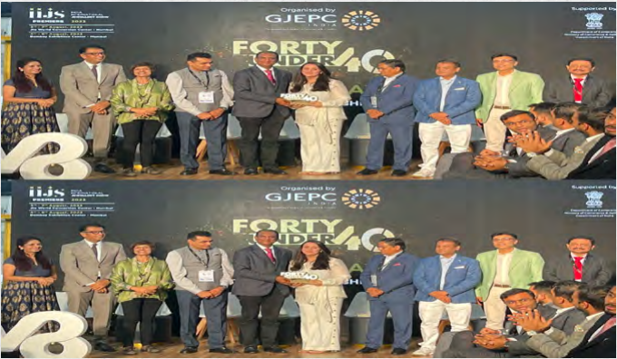

**[Image: e186daf7-9168-4faf-873b-d87ffb129955.pdf-0027-08.png (680x396, 644.7KB)]**

**[Image: e186daf7-9168-4faf-873b-d87ffb129955.pdf-0027-09.png (189x111, 36.6KB)]**

<!-- Start of picture text -->
tbz· _  r  IQral  inc  1  '-"1 T'RIBHOVANOAS  BHIMJI ZAVERi \IUU1..\.' I  L\\UU(;JtOI I' <!-- End of picture text -->

**[Image: e186daf7-9168-4faf-873b-d87ffb129955.pdf-0027-10.png (630x109, 134.5KB)]**

**[Image: e186daf7-9168-4faf-873b-d87ffb129955.pdf-0027-11.png (630x109, 164.8KB)]**

**[Image: e186daf7-9168-4faf-873b-d87ffb129955.pdf-0027-12.png (630x109, 140.9KB)]**

**[Image: e186daf7-9168-4faf-873b-d87ffb129955.pdf-0027-13.png (630x109, 144.3KB)]**

**[Image: e186daf7-9168-4faf-873b-d87ffb129955.pdf-0027-14.png (630x54, 74.2KB)]**

‘Visionary Leader of the Year’ Award 2026 for Mr. Srikant Zaveri 

**[Image: e186daf7-9168-4faf-873b-d87ffb129955.pdf-0028-01.png (51x51, 3.0KB)]**

<!-- Start of picture text -->
27 <!-- End of picture text -->

• 27 

### Awards & Recognition 

- **“Visionary Leader of the Year’ Award 2026  for Mr. Shrikant Zaveri** Retail Jeweller MD & CEO Awards 2026 (7 January 2026) 

- “EXEMPELARY VALUE CREATION FOR SHAREHOLDERS 2025“ 

   - Retail Jeweller India Forum- MD & CEO Awards 2025 

- “EXCELLENCE IN LEADERSHIP, YOUNG LEADER OF THE YEAR 2025” : Ms. Raashi Zaveri **GJEPC 40 under 40:** Retail Jeweller India MD and CEO Awards. 

- “GEMS & JEWELLRY INDUSTRY LEGEND AWARD” : Mr. Shrikant Zaveri **IIJS Tritiya 2023** 

- “BEST BRACELET DESIGN AWARD -9TH EDITION” JJS-IJ Jewellers Choice Design Awards – 2019 

- “CONTEMPORARY DIAMOND JEWELLERY AWARD” & “TREASURE OF THE OCEAN “ 

- GJC’S NATIONAL JEWELLERY AWARD 2018 

- “DIAMOND VIVAH JEWELLERY OF THE YEAR” Retail Jeweller India Awards – 2018 

- “INDIA’S MOST PREFERRED JEWELLERY BRAND” UBM India – 2017 

- “BEST RING DESIGN OVER Rs. 2,50,000” JJS-IJ Jewellers Choice Design Awards – 2016 

- “TV CAMPAIGN OF THE YEAR” 

   - 12th Gemfields Retail Jeweller India Awards – 2016 

- “DIAMOND JEWELLERY OF THE YEAR” 

   - 12th Gemfields Retail Jeweller India Awards – 2016 

- “BEST NECKLACE DESIGN AWARD – 2016” JJS-IJ Jewellers’ Choice Design Award – 2016 

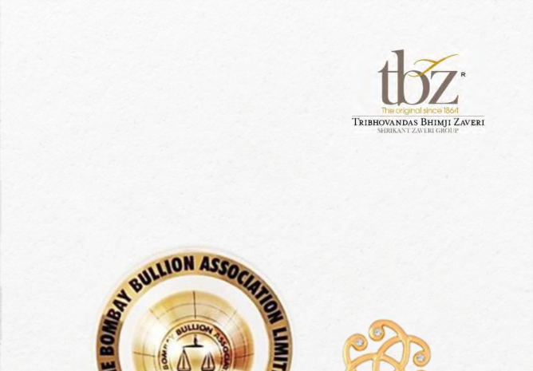

**[Image: e186daf7-9168-4faf-873b-d87ffb129955.pdf-0028-20.png (668x465, 273.5KB)]**

<!-- Start of picture text -->
· t}jz f  ong ral  nca 186'1 T'RIBHOVANDAS  8HIMJI ZAVERi .',,IUIHL\.'L  L\\Ull(;Jt()l,J• <!-- End of picture text -->

**[Image: e186daf7-9168-4faf-873b-d87ffb129955.pdf-0028-21.png (297x568, 335.7KB)]**

**[Image: e186daf7-9168-4faf-873b-d87ffb129955.pdf-0028-22.png (199x457, 136.3KB)]**

• 28 

**[Image: e186daf7-9168-4faf-873b-d87ffb129955.pdf-0029-02.png (51x51, 3.1KB)]**

<!-- Start of picture text -->
28 <!-- End of picture text -->

##### **PROJECT PANKHI** 

Project Pankhi is TBZ's flagship women empowerment initiative, supporting women and adolescent girls from marginalized communities through counselling, shelter, awareness-building and community empowerment, particularly for cases linked to domestic violence and related vulnerabilities. 

###### **Key Impact Highlights for FY26 (Apr 2025–Mar 2026):** 

- **1,087 cases registered** and supported through structured interventions. 

- **4,431 individual counselling sessions** delivered to provide sustained emotional and practical support. 

- **673 joint family counselling sessions** conducted with family members to improve homelevel resolution and long-term outcomes. 

- **48 women supported through shelter** , providing safe spaces alongside continued counselling. 

- **50% of survivors reconciled and returned to their families** with continued support, reflecting the depth and effectiveness of the intervention model. 

- **165 awareness sessions** conducted under Pankhi, impacting **13,102 women** with focus on rights, safety and gender sensitisation. 

- As a long-term, community-led programme integrating legal, emotional, shelter and educational support systems, Project Pankhi continues to scale through trusted grassroots partners including **Stree Mukti Sanghatana, URJA Trust, Cultural Academy for Peace, and Ahmedabad Women's Action Group** . 

**CSR Investment:** Approx ₹25-26 lac disbursed towards Project Pankhi during FY26 — covering counselling, shelter and gender awareness activities. 

###### **Aligned with UN SDGs:** 

- SDG 5 – Gender Equality 

- SDG 3 – Good Health and Well-being 

**[Image: e186daf7-9168-4faf-873b-d87ffb129955.pdf-0029-17.png (153x115, 43.1KB)]**

<!-- Start of picture text -->
P\  Kl  I  I <!-- End of picture text -->

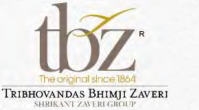

**[Image: e186daf7-9168-4faf-873b-d87ffb129955.pdf-0029-18.png (199x110, 34.1KB)]**

<!-- Start of picture text -->
tbz"he  lf'll"'OI  JC~ 166-1 " T'RIBHOVANDAS  BHlMJI  ZAVERi \WUI.\VJ  /.\\lltlUtnl I' <!-- End of picture text -->

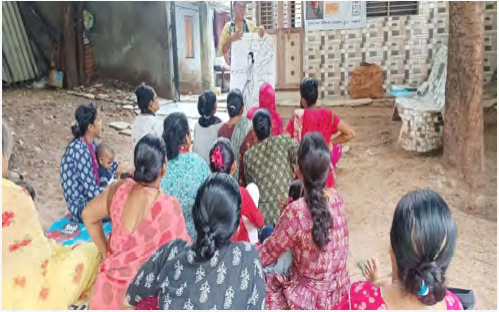

**[Image: e186daf7-9168-4faf-873b-d87ffb129955.pdf-0029-19.png (499x312, 414.2KB)]**

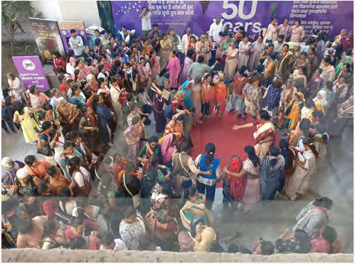

**[Image: e186daf7-9168-4faf-873b-d87ffb129955.pdf-0029-20.png (499x372, 488.9KB)]**

**[Image: e186daf7-9168-4faf-873b-d87ffb129955.pdf-0030-01.png (51x51, 3.0KB)]**

<!-- Start of picture text -->
27 <!-- End of picture text -->

• 27 

##### **PROJECT EK DISHA** 

Project Ek Disha is TBZ's inclusive education initiative, supporting children with disabilities and underserved students through specialised learning interventions, teacher training, parent capacitybuilding and community enablement. 

###### **Key Impact Highlights for FY26 (Apr 2025–Mar 2026):** 

###### **Muskan Foundation – Support for Children with Multiple Disabilities** 

- 3,963 topic-based learning sessions conducted with students across multiple learning and therapy topics. 

- 26 events conducted including aquarium, bank and factory visits, strengthening inclusion-focused engagement and experiential learning. 

- 98 individual counselling sessions delivered to provide focused student-level support. 

- 223 parents engaged through advocacy and capacity-building sessions, strengthening home-based support and continuity of care. 

###### **Victoria Memorial School for the Blind (VMSB)** 

Continued education support for 15 visually impaired students alongside 96 students with learning disabilities receiving therapeutic support. Notable achievements during the year include: 

- 1st Prize at ISRO Competition for Spacecraft Making. 

- 2nd Prize at State Level Goal Ball championship. 

- 1st Prize at State Level Academic Competition. 

- Inaugural performance at the Kala Ghoda Arts Festival. 

###### **Pahley Akshar Foundation – Strengthening Foundational Learning** 

- 1,066 students supported through foundational English and learning outcomes interventions across BMC schools in Mumbai and Thane. 

- 136 teachers trained across 19 schools to improve classroom delivery and learning outcomes. 

- 49 students performed a biodiversity skit at Kala Ghoda, reinforcing creative expression alongside academic learning. 

- Immersive English learning environments deployed — books, games, tablets and smart screens — with alumni connect sessions tracking long-term student progress and impact. 

**<u>CSR Investment:</u>** Approx ₹86-87 Lac disbursed towards Project Ek Disha during FY26 — the largest allocation across all CSR initiatives, reflecting TBZ's deep commitment to inclusive education. 

###### **<u>Aligned with UN SDGs:</u>** 

SDG 4 – Quality Education SDG 10 – Reduced Inequalities 

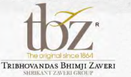

**[Image: e186daf7-9168-4faf-873b-d87ffb129955.pdf-0030-25.png (191x112, 35.2KB)]**

<!-- Start of picture text -->
tbz· "he O>'li  f'OI  nee 186,11 ThIBHOVANDAS BHIMJI ZAVERi ,Hlllt..;\.VI  l.\\  l,JU(;KOI  I' <!-- End of picture text -->

**[Image: e186daf7-9168-4faf-873b-d87ffb129955.pdf-0030-26.png (142x109, 37.5KB)]**

<!-- Start of picture text -->
P  \1  Kl  I  I <!-- End of picture text -->

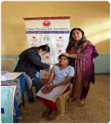

**[Image: e186daf7-9168-4faf-873b-d87ffb129955.pdf-0030-27.png (224x249, 138.3KB)]**

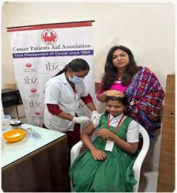

**[Image: e186daf7-9168-4faf-873b-d87ffb129955.pdf-0030-28.png (224x244, 128.6KB)]**

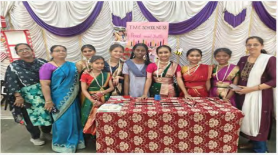

**[Image: e186daf7-9168-4faf-873b-d87ffb129955.pdf-0030-29.png (474x264, 337.9KB)]**

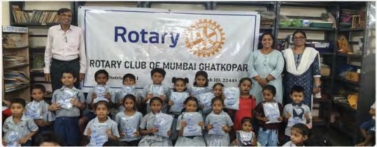

**[Image: e186daf7-9168-4faf-873b-d87ffb129955.pdf-0030-30.png (539x211, 298.1KB)]**

**[Image: e186daf7-9168-4faf-873b-d87ffb129955.pdf-0031-00.png (191x112, 35.2KB)]**

<!-- Start of picture text -->
tbz· "he O>'li  f'OI  nee 186,11 ThIBHOVANDAS BHIMJI ZAVERi ,Hlllt..;\.VI  l.\\  l,JU(;KOI  I' <!-- End of picture text -->

**[Image: e186daf7-9168-4faf-873b-d87ffb129955.pdf-0031-01.png (155x117, 43.7KB)]**

<!-- Start of picture text -->
P\ 1  Kl1I <!-- End of picture text -->

##### **OTHER CSR INITIATIVES** 

Project Ek Disha is TBZ's inclusive education initiative, supporting children with disabilities and underserved students through specialized learning interventions, teacher training, parent capacity-building and community enablement. 

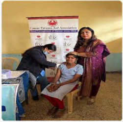

**[Image: e186daf7-9168-4faf-873b-d87ffb129955.pdf-0031-04.png (251x249, 153.3KB)]**

**[Image: e186daf7-9168-4faf-873b-d87ffb129955.pdf-0031-05.png (249x249, 144.3KB)]**

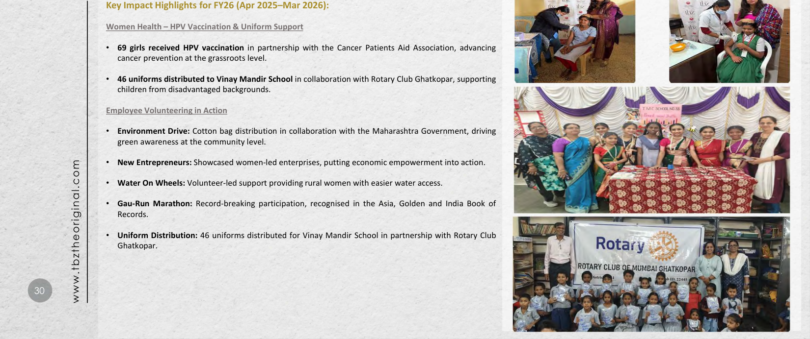

**[Image: e186daf7-9168-4faf-873b-d87ffb129955.pdf-0031-06.png (1650x692, 1704.7KB)]**

<!-- Start of picture text -->
Key Impact Highlights for FY26 (Apr 2025–Mar 2026): Women Health – HPV Vaccination & Uniform Support • 69 girls received HPV vaccination in partnership with the Cancer Patients Aid Association, advancing cancer prevention at the grassroots level. • 46 uniforms distributed to Vinay Mandir School  in collaboration with Rotary Club Ghatkopar, supporting children from disadvantaged backgrounds. Employee Volunteering in Action • Environment Drive:  Cotton bag distribution in collaboration with the Maharashtra Government, driving green awareness at the community level. • New Entrepreneurs:  Showcased women-led enterprises, putting economic empowerment into action. • Water On Wheels:  Volunteer-led support providing rural women with easier water access. • Gau-Run Marathon: Record-breaking participation, recognised in the Asia, Golden and India Book of Records. • Uniform Distribution: 46 uniforms distributed for Vinay Mandir School in partnership with Rotary Club Ghatkopar. •  30 www.tbztheoriginal.com <!-- End of picture text -->

**[Image: e186daf7-9168-4faf-873b-d87ffb129955.pdf-0032-01.png (1650x207, 273.3KB)]**

<!-- Start of picture text -->
The orig nal sin -orig nal sin -in -- cel864 <!-- End of picture text -->

**[Image: e186daf7-9168-4faf-873b-d87ffb129955.pdf-0032-02.png (271x171, 77.0KB)]**

<!-- Start of picture text -->
The orig nal sin -orig nal sin -in -- cel864 -s BHIMJI ZAVERi BHIMJI ZAVERi ZAVERi TRIBHOVAN?,A,·z SI lltlf...\' SI lltlf...\' lltlf...\' \'  \\ 't,:n1 ,:n1 n1  GltOl"I' <!-- End of picture text -->

**[Image: e186daf7-9168-4faf-873b-d87ffb129955.pdf-0032-03.png (1650x207, 242.1KB)]**

<!-- Start of picture text -->
-s BHIMJI ZAVERi BHIMJI ZAVERi ZAVERi TRIBHOVAN?,A,·z SI lltlf...\' SI lltlf...\' lltlf...\' \'  ·· \\ 't,:n1 ,:n1 n1  GltOl"I' <!-- End of picture text -->

**[Image: e186daf7-9168-4faf-873b-d87ffb129955.pdf-0032-04.png (1650x264, 368.8KB)]**

<!-- Start of picture text -->
Trusted Since 1864  I tbz· <!-- End of picture text -->

**[Image: e186daf7-9168-4faf-873b-d87ffb129955.pdf-0032-05.png (195x123, 44.0KB)]**

<!-- Start of picture text -->
tbz· r,:il ·1f"ICel864 l ·1f"ICel864 ·1f"ICel864 't,90,,g  -- BHIMJIZAVERI  BHIMJIZAVERI ThIBHOVAN SHIUh..>e HIUh..>e  'D'A 1 \\UU Gk.0 1 P  \\UU Gk.0 1 P  Gk.0 1 P k.0 1 P 0 1 P <!-- End of picture text -->

**[Image: e186daf7-9168-4faf-873b-d87ffb129955.pdf-0032-06.png (293x74, 18.5KB)]**

<!-- Start of picture text -->
11 DICKENSON DICKENSON  I <!-- End of picture text -->

**[Image: e186daf7-9168-4faf-873b-d87ffb129955.pdf-0032-07.png (1650x250, 327.7KB)]**

<!-- Start of picture text -->
r,:il ·1f"ICel864 l ·1f"ICel864 ·1f"ICel864 't,90,,g  -- BHIMJIZAVERI  BHIMJIZAVERI ThIBHOVAN SHIUh..>e HIUh..>e  'D'A 1 \\UU Gk.0 1 P  \\UU Gk.0 1 P  Gk.0 1 P k.0 1 P 0 1 P 11 DICKENSON DICKENSON  I THANK Mukesh Sharma Shankhini Saha CFO Director- Investor Relations mukesh.sharma@tbzoriginal.com YOU tbz@dickensonworld.com <!-- End of picture text -->

---

## Extracted Images

| # | File | Dimensions | Size |
|---|------|------------|------|
| 1 | e186daf7-9168-4faf-873b-d87ffb129955.pdf-0001-17.png | 258x175 | 7.8KB |
| 2 | e186daf7-9168-4faf-873b-d87ffb129955.pdf-0001-18.png | 15x17 | 0.5KB |
| 3 | e186daf7-9168-4faf-873b-d87ffb129955.pdf-0001-19.png | 280x53 | 12.3KB |
| 4 | e186daf7-9168-4faf-873b-d87ffb129955.pdf-0001-20.png | 297x14 | 4.5KB |
| 5 | e186daf7-9168-4faf-873b-d87ffb129955.pdf-0001-21.png | 907x63 | 30.0KB |
| 6 | e186daf7-9168-4faf-873b-d87ffb129955.pdf-0002-01.png | 1650x207 | 276.7KB |
| 7 | e186daf7-9168-4faf-873b-d87ffb129955.pdf-0002-02.png | 272x174 | 77.7KB |
| 8 | e186daf7-9168-4faf-873b-d87ffb129955.pdf-0002-03.png | 224x116 | 45.7KB |
| 9 | e186daf7-9168-4faf-873b-d87ffb129955.pdf-0002-04.png | 1650x333 | 445.8KB |
| 10 | e186daf7-9168-4faf-873b-d87ffb129955.pdf-0002-06.png | 1650x207 | 235.1KB |
| 11 | e186daf7-9168-4faf-873b-d87ffb129955.pdf-0002-07.png | 1650x103 | 117.5KB |
| 12 | e186daf7-9168-4faf-873b-d87ffb129955.pdf-0003-01.png | 189x111 | 36.6KB |
| 13 | e186daf7-9168-4faf-873b-d87ffb129955.pdf-0003-02.png | 1650x354 | 494.4KB |
| 14 | e186daf7-9168-4faf-873b-d87ffb129955.pdf-0003-05.png | 1650x207 | 285.9KB |
| 15 | e186daf7-9168-4faf-873b-d87ffb129955.pdf-0003-07.png | 1650x207 | 275.5KB |
| 16 | e186daf7-9168-4faf-873b-d87ffb129955.pdf-0003-08.png | 51x51 | 3.1KB |
| 17 | e186daf7-9168-4faf-873b-d87ffb129955.pdf-0003-10.png | 1650x103 | 125.4KB |
| 18 | e186daf7-9168-4faf-873b-d87ffb129955.pdf-0004-00.png | 1650x207 | 255.9KB |
| 19 | e186daf7-9168-4faf-873b-d87ffb129955.pdf-0004-01.png | 151x151 | 21.7KB |
| 20 | e186daf7-9168-4faf-873b-d87ffb129955.pdf-0004-02.png | 1650x207 | 250.5KB |
| 21 | e186daf7-9168-4faf-873b-d87ffb129955.pdf-0004-03.png | 151x150 | 20.2KB |
| 22 | e186daf7-9168-4faf-873b-d87ffb129955.pdf-0004-04.png | 1650x207 | 257.5KB |
| 23 | e186daf7-9168-4faf-873b-d87ffb129955.pdf-0004-05.png | 151x151 | 21.7KB |
| 24 | e186daf7-9168-4faf-873b-d87ffb129955.pdf-0004-07.png | 1650x207 | 251.5KB |
| 25 | e186daf7-9168-4faf-873b-d87ffb129955.pdf-0004-08.png | 1650x103 | 121.7KB |
| 26 | e186daf7-9168-4faf-873b-d87ffb129955.pdf-0005-02.png | 1650x230 | 281.2KB |
| 27 | e186daf7-9168-4faf-873b-d87ffb129955.pdf-0005-03.png | 653x675 | 762.1KB |
| 28 | e186daf7-9168-4faf-873b-d87ffb129955.pdf-0005-05.png | 211x134 | 33.1KB |
| 29 | e186daf7-9168-4faf-873b-d87ffb129955.pdf-0005-06.png | 51x51 | 3.1KB |
| 30 | e186daf7-9168-4faf-873b-d87ffb129955.pdf-0006-01.png | 191x111 | 36.7KB |
| 31 | e186daf7-9168-4faf-873b-d87ffb129955.pdf-0006-02.png | 220x24 | 7.7KB |
| 32 | e186daf7-9168-4faf-873b-d87ffb129955.pdf-0006-03.png | 171x9 | 3.8KB |
| 33 | e186daf7-9168-4faf-873b-d87ffb129955.pdf-0006-04.png | 12x13 | 0.5KB |
| 34 | e186daf7-9168-4faf-873b-d87ffb129955.pdf-0006-05.png | 203x30 | 8.3KB |
| 35 | e186daf7-9168-4faf-873b-d87ffb129955.pdf-0006-06.png | 171x10 | 4.2KB |
| 36 | e186daf7-9168-4faf-873b-d87ffb129955.pdf-0006-07.png | 12x13 | 0.5KB |
| 37 | e186daf7-9168-4faf-873b-d87ffb129955.pdf-0006-08.png | 13x13 | 0.5KB |
| 38 | e186daf7-9168-4faf-873b-d87ffb129955.pdf-0006-09.png | 179x21 | 6.5KB |
| 39 | e186daf7-9168-4faf-873b-d87ffb129955.pdf-0006-10.png | 13x12 | 0.5KB |
| 40 | e186daf7-9168-4faf-873b-d87ffb129955.pdf-0006-11.png | 1650x254 | 295.0KB |
| 41 | e186daf7-9168-4faf-873b-d87ffb129955.pdf-0006-12.png | 1650x207 | 219.2KB |
| 42 | e186daf7-9168-4faf-873b-d87ffb129955.pdf-0006-13.png | 51x51 | 3.1KB |
| 43 | e186daf7-9168-4faf-873b-d87ffb129955.pdf-0006-14.png | 1650x103 | 121.9KB |
| 44 | e186daf7-9168-4faf-873b-d87ffb129955.pdf-0007-00.png | 1650x230 | 288.5KB |
| 45 | e186daf7-9168-4faf-873b-d87ffb129955.pdf-0007-01.png | 220x26 | 7.9KB |
| 46 | e186daf7-9168-4faf-873b-d87ffb129955.pdf-0007-02.png | 12x12 | 0.5KB |
| 47 | e186daf7-9168-4faf-873b-d87ffb129955.pdf-0007-03.png | 171x8 | 3.3KB |
| 48 | e186daf7-9168-4faf-873b-d87ffb129955.pdf-0007-04.png | 203x32 | 8.4KB |
| 49 | e186daf7-9168-4faf-873b-d87ffb129955.pdf-0007-05.png | 12x12 | 0.5KB |
| 50 | e186daf7-9168-4faf-873b-d87ffb129955.pdf-0007-06.png | 219x36 | 9.2KB |
| 51 | e186daf7-9168-4faf-873b-d87ffb129955.pdf-0007-07.png | 179x17 | 6.4KB |
| 52 | e186daf7-9168-4faf-873b-d87ffb129955.pdf-0007-08.png | 13x13 | 0.5KB |
| 53 | e186daf7-9168-4faf-873b-d87ffb129955.pdf-0007-09.png | 1650x273 | 314.7KB |
| 54 | e186daf7-9168-4faf-873b-d87ffb129955.pdf-0007-10.png | 1650x207 | 215.4KB |
| 55 | e186daf7-9168-4faf-873b-d87ffb129955.pdf-0007-11.png | 51x51 | 3.1KB |
| 56 | e186daf7-9168-4faf-873b-d87ffb129955.pdf-0007-12.png | 1650x103 | 121.9KB |
| 57 | e186daf7-9168-4faf-873b-d87ffb129955.pdf-0008-00.png | 209x109 | 33.2KB |
| 58 | e186daf7-9168-4faf-873b-d87ffb129955.pdf-0008-03.png | 1650x692 | 1377.6KB |
| 59 | e186daf7-9168-4faf-873b-d87ffb129955.pdf-0009-03.png | 189x111 | 36.6KB |
| 60 | e186daf7-9168-4faf-873b-d87ffb129955.pdf-0009-05.png | 51x51 | 3.1KB |
| 61 | e186daf7-9168-4faf-873b-d87ffb129955.pdf-0009-07.png | 1308x41 | 44.8KB |
| 62 | e186daf7-9168-4faf-873b-d87ffb129955.pdf-0009-08.png | 1308x41 | 23.8KB |
| 63 | e186daf7-9168-4faf-873b-d87ffb129955.pdf-0009-09.png | 1308x41 | 24.6KB |
| 64 | e186daf7-9168-4faf-873b-d87ffb129955.pdf-0009-10.png | 1308x42 | 25.3KB |
| 65 | e186daf7-9168-4faf-873b-d87ffb129955.pdf-0009-11.png | 1308x41 | 24.4KB |
| 66 | e186daf7-9168-4faf-873b-d87ffb129955.pdf-0009-12.png | 1308x42 | 26.2KB |
| 67 | e186daf7-9168-4faf-873b-d87ffb129955.pdf-0009-13.png | 1308x41 | 25.6KB |
| 68 | e186daf7-9168-4faf-873b-d87ffb129955.pdf-0009-14.png | 1311x42 | 27.1KB |
| 69 | e186daf7-9168-4faf-873b-d87ffb129955.pdf-0010-03.png | 189x111 | 36.6KB |
| 70 | e186daf7-9168-4faf-873b-d87ffb129955.pdf-0010-05.png | 51x51 | 3.1KB |
| 71 | e186daf7-9168-4faf-873b-d87ffb129955.pdf-0010-07.png | 1315x48 | 53.5KB |
| 72 | e186daf7-9168-4faf-873b-d87ffb129955.pdf-0010-08.png | 1315x48 | 25.3KB |
| 73 | e186daf7-9168-4faf-873b-d87ffb129955.pdf-0010-09.png | 1315x48 | 26.3KB |
| 74 | e186daf7-9168-4faf-873b-d87ffb129955.pdf-0010-10.png | 1315x48 | 26.1KB |
| 75 | e186daf7-9168-4faf-873b-d87ffb129955.pdf-0010-11.png | 1315x48 | 27.4KB |
| 76 | e186daf7-9168-4faf-873b-d87ffb129955.pdf-0010-12.png | 1318x96 | 57.7KB |
| 77 | e186daf7-9168-4faf-873b-d87ffb129955.pdf-0011-02.png | 189x111 | 36.6KB |
| 78 | e186daf7-9168-4faf-873b-d87ffb129955.pdf-0011-03.png | 441x284 | 340.5KB |
| 79 | e186daf7-9168-4faf-873b-d87ffb129955.pdf-0011-04.png | 440x284 | 288.1KB |
| 80 | e186daf7-9168-4faf-873b-d87ffb129955.pdf-0011-05.png | 434x189 | 207.5KB |
| 81 | e186daf7-9168-4faf-873b-d87ffb129955.pdf-0011-06.png | 434x95 | 112.7KB |
| 82 | e186daf7-9168-4faf-873b-d87ffb129955.pdf-0011-07.png | 443x339 | 342.7KB |
| 83 | e186daf7-9168-4faf-873b-d87ffb129955.pdf-0011-08.png | 440x337 | 348.8KB |
| 84 | e186daf7-9168-4faf-873b-d87ffb129955.pdf-0011-09.png | 442x332 | 308.6KB |
| 85 | e186daf7-9168-4faf-873b-d87ffb129955.pdf-0012-03.png | 467x728 | 575.7KB |
| 86 | e186daf7-9168-4faf-873b-d87ffb129955.pdf-0012-06.png | 1650x692 | 1284.5KB |
| 87 | e186daf7-9168-4faf-873b-d87ffb129955.pdf-0013-01.png | 51x51 | 3.0KB |
| 88 | e186daf7-9168-4faf-873b-d87ffb129955.pdf-0013-04.png | 636x267 | 261.0KB |
| 89 | e186daf7-9168-4faf-873b-d87ffb129955.pdf-0013-05.png | 636x268 | 315.4KB |
| 90 | e186daf7-9168-4faf-873b-d87ffb129955.pdf-0013-06.png | 191x109 | 33.7KB |
| 91 | e186daf7-9168-4faf-873b-d87ffb129955.pdf-0013-07.png | 637x267 | 279.3KB |
| 92 | e186daf7-9168-4faf-873b-d87ffb129955.pdf-0013-08.png | 637x266 | 255.8KB |
| 93 | e186daf7-9168-4faf-873b-d87ffb129955.pdf-0014-02.png | 51x51 | 3.0KB |
| 94 | e186daf7-9168-4faf-873b-d87ffb129955.pdf-0014-04.png | 393x522 | 476.1KB |
| 95 | e186daf7-9168-4faf-873b-d87ffb129955.pdf-0014-05.png | 361x567 | 474.5KB |
| 96 | e186daf7-9168-4faf-873b-d87ffb129955.pdf-0014-06.png | 191x109 | 33.7KB |
| 97 | e186daf7-9168-4faf-873b-d87ffb129955.pdf-0014-07.png | 393x522 | 447.6KB |
| 98 | e186daf7-9168-4faf-873b-d87ffb129955.pdf-0015-00.png | 1650x332 | 419.9KB |
| 99 | e186daf7-9168-4faf-873b-d87ffb129955.pdf-0015-01.png | 1038x715 | 1087.8KB |
| 100 | e186daf7-9168-4faf-873b-d87ffb129955.pdf-0015-03.png | 51x51 | 2.9KB |
| 101 | e186daf7-9168-4faf-873b-d87ffb129955.pdf-0016-00.png | 189x111 | 36.6KB |
| 102 | e186daf7-9168-4faf-873b-d87ffb129955.pdf-0016-01.png | 1650x354 | 388.5KB |
| 103 | e186daf7-9168-4faf-873b-d87ffb129955.pdf-0016-03.png | 1650x207 | 266.2KB |
| 104 | e186daf7-9168-4faf-873b-d87ffb129955.pdf-0016-04.png | 1650x207 | 296.2KB |
| 105 | e186daf7-9168-4faf-873b-d87ffb129955.pdf-0016-05.png | 1650x103 | 131.8KB |
| 106 | e186daf7-9168-4faf-873b-d87ffb129955.pdf-0017-03.png | 189x111 | 36.6KB |
| 107 | e186daf7-9168-4faf-873b-d87ffb129955.pdf-0017-10.png | 55x54 | 7.9KB |
| 108 | e186daf7-9168-4faf-873b-d87ffb129955.pdf-0017-11.png | 52x54 | 7.7KB |
| 109 | e186daf7-9168-4faf-873b-d87ffb129955.pdf-0017-12.png | 1650x207 | 276.1KB |
| 110 | e186daf7-9168-4faf-873b-d87ffb129955.pdf-0017-14.png | 51x51 | 3.0KB |
| 111 | e186daf7-9168-4faf-873b-d87ffb129955.pdf-0017-15.png | 1650x103 | 128.1KB |
| 112 | e186daf7-9168-4faf-873b-d87ffb129955.pdf-0018-02.png | 189x111 | 36.6KB |
| 113 | e186daf7-9168-4faf-873b-d87ffb129955.pdf-0019-00.png | 1650x446 | 467.3KB |
| 114 | e186daf7-9168-4faf-873b-d87ffb129955.pdf-0019-01.png | 1650x207 | 351.8KB |
| 115 | e186daf7-9168-4faf-873b-d87ffb129955.pdf-0019-02.png | 1650x388 | 929.0KB |
| 116 | e186daf7-9168-4faf-873b-d87ffb129955.pdf-0019-03.png | 1650x103 | 212.4KB |
| 117 | e186daf7-9168-4faf-873b-d87ffb129955.pdf-0020-00.png | 1650x421 | 548.5KB |
| 118 | e186daf7-9168-4faf-873b-d87ffb129955.pdf-0020-01.png | 1055x343 | 476.2KB |
| 119 | e186daf7-9168-4faf-873b-d87ffb129955.pdf-0020-03.png | 1136x344 | 682.1KB |
| 120 | e186daf7-9168-4faf-873b-d87ffb129955.pdf-0021-01.png | 189x111 | 36.6KB |
| 121 | e186daf7-9168-4faf-873b-d87ffb129955.pdf-0021-03.png | 597x451 | 553.1KB |
| 122 | e186daf7-9168-4faf-873b-d87ffb129955.pdf-0021-04.png | 66x277 | 20.8KB |
| 123 | e186daf7-9168-4faf-873b-d87ffb129955.pdf-0021-09.png | 66x276 | 20.6KB |
| 124 | e186daf7-9168-4faf-873b-d87ffb129955.pdf-0021-14.png | 1650x103 | 112.6KB |
| 125 | e186daf7-9168-4faf-873b-d87ffb129955.pdf-0022-00.png | 1650x207 | 262.5KB |
| 126 | e186daf7-9168-4faf-873b-d87ffb129955.pdf-0022-02.png | 397x706 | 264.6KB |
| 127 | e186daf7-9168-4faf-873b-d87ffb129955.pdf-0022-03.png | 1650x207 | 193.6KB |
| 128 | e186daf7-9168-4faf-873b-d87ffb129955.pdf-0022-04.png | 1650x207 | 273.5KB |
| 129 | e186daf7-9168-4faf-873b-d87ffb129955.pdf-0022-07.png | 1650x103 | 96.6KB |
| 130 | e186daf7-9168-4faf-873b-d87ffb129955.pdf-0023-01.png | 189x111 | 36.6KB |
| 131 | e186daf7-9168-4faf-873b-d87ffb129955.pdf-0023-02.png | 1650x692 | 824.5KB |
| 132 | e186daf7-9168-4faf-873b-d87ffb129955.pdf-0024-02.png | 51x51 | 3.1KB |
| 133 | e186daf7-9168-4faf-873b-d87ffb129955.pdf-0024-03.png | 170x109 | 34.5KB |
| 134 | e186daf7-9168-4faf-873b-d87ffb129955.pdf-0024-05.png | 296x145 | 67.9KB |
| 135 | e186daf7-9168-4faf-873b-d87ffb129955.pdf-0024-09.png | 226x132 | 17.7KB |
| 136 | e186daf7-9168-4faf-873b-d87ffb129955.pdf-0024-11.png | 115x116 | 10.7KB |
| 137 | e186daf7-9168-4faf-873b-d87ffb129955.pdf-0024-12.png | 116x116 | 10.4KB |
| 138 | e186daf7-9168-4faf-873b-d87ffb129955.pdf-0024-15.png | 132x222 | 25.4KB |
| 139 | e186daf7-9168-4faf-873b-d87ffb129955.pdf-0024-16.png | 135x222 | 25.1KB |
| 140 | e186daf7-9168-4faf-873b-d87ffb129955.pdf-0024-18.png | 159x103 | 29.5KB |
| 141 | e186daf7-9168-4faf-873b-d87ffb129955.pdf-0025-09.png | 189x111 | 36.6KB |
| 142 | e186daf7-9168-4faf-873b-d87ffb129955.pdf-0025-10.png | 511x337 | 437.9KB |
| 143 | e186daf7-9168-4faf-873b-d87ffb129955.pdf-0025-12.png | 51x51 | 3.0KB |
| 144 | e186daf7-9168-4faf-873b-d87ffb129955.pdf-0026-02.png | 51x51 | 3.1KB |
| 145 | e186daf7-9168-4faf-873b-d87ffb129955.pdf-0026-03.png | 189x111 | 36.6KB |
| 146 | e186daf7-9168-4faf-873b-d87ffb129955.pdf-0026-06.png | 180x207 | 27.7KB |
| 147 | e186daf7-9168-4faf-873b-d87ffb129955.pdf-0026-09.png | 197x239 | 30.7KB |
| 148 | e186daf7-9168-4faf-873b-d87ffb129955.pdf-0026-12.png | 178x197 | 34.8KB |
| 149 | e186daf7-9168-4faf-873b-d87ffb129955.pdf-0026-13.png | 197x238 | 33.3KB |
| 150 | e186daf7-9168-4faf-873b-d87ffb129955.pdf-0026-14.png | 197x238 | 33.8KB |
| 151 | e186daf7-9168-4faf-873b-d87ffb129955.pdf-0026-18.png | 180x208 | 36.1KB |
| 152 | e186daf7-9168-4faf-873b-d87ffb129955.pdf-0027-01.png | 51x51 | 3.1KB |
| 153 | e186daf7-9168-4faf-873b-d87ffb129955.pdf-0027-08.png | 680x396 | 644.7KB |
| 154 | e186daf7-9168-4faf-873b-d87ffb129955.pdf-0027-09.png | 189x111 | 36.6KB |
| 155 | e186daf7-9168-4faf-873b-d87ffb129955.pdf-0027-10.png | 630x109 | 134.5KB |
| 156 | e186daf7-9168-4faf-873b-d87ffb129955.pdf-0027-11.png | 630x109 | 164.8KB |
| 157 | e186daf7-9168-4faf-873b-d87ffb129955.pdf-0027-12.png | 630x109 | 140.9KB |
| 158 | e186daf7-9168-4faf-873b-d87ffb129955.pdf-0027-13.png | 630x109 | 144.3KB |
| 159 | e186daf7-9168-4faf-873b-d87ffb129955.pdf-0027-14.png | 630x54 | 74.2KB |
| 160 | e186daf7-9168-4faf-873b-d87ffb129955.pdf-0028-01.png | 51x51 | 3.0KB |
| 161 | e186daf7-9168-4faf-873b-d87ffb129955.pdf-0028-20.png | 668x465 | 273.5KB |
| 162 | e186daf7-9168-4faf-873b-d87ffb129955.pdf-0028-21.png | 297x568 | 335.7KB |
| 163 | e186daf7-9168-4faf-873b-d87ffb129955.pdf-0028-22.png | 199x457 | 136.3KB |
| 164 | e186daf7-9168-4faf-873b-d87ffb129955.pdf-0029-02.png | 51x51 | 3.1KB |
| 165 | e186daf7-9168-4faf-873b-d87ffb129955.pdf-0029-17.png | 153x115 | 43.1KB |
| 166 | e186daf7-9168-4faf-873b-d87ffb129955.pdf-0029-18.png | 199x110 | 34.1KB |
| 167 | e186daf7-9168-4faf-873b-d87ffb129955.pdf-0029-19.png | 499x312 | 414.2KB |
| 168 | e186daf7-9168-4faf-873b-d87ffb129955.pdf-0029-20.png | 499x372 | 488.9KB |
| 169 | e186daf7-9168-4faf-873b-d87ffb129955.pdf-0030-01.png | 51x51 | 3.0KB |
| 170 | e186daf7-9168-4faf-873b-d87ffb129955.pdf-0030-25.png | 191x112 | 35.2KB |
| 171 | e186daf7-9168-4faf-873b-d87ffb129955.pdf-0030-26.png | 142x109 | 37.5KB |
| 172 | e186daf7-9168-4faf-873b-d87ffb129955.pdf-0030-27.png | 224x249 | 138.3KB |
| 173 | e186daf7-9168-4faf-873b-d87ffb129955.pdf-0030-28.png | 224x244 | 128.6KB |
| 174 | e186daf7-9168-4faf-873b-d87ffb129955.pdf-0030-29.png | 474x264 | 337.9KB |
| 175 | e186daf7-9168-4faf-873b-d87ffb129955.pdf-0030-30.png | 539x211 | 298.1KB |
| 176 | e186daf7-9168-4faf-873b-d87ffb129955.pdf-0031-00.png | 191x112 | 35.2KB |
| 177 | e186daf7-9168-4faf-873b-d87ffb129955.pdf-0031-01.png | 155x117 | 43.7KB |
| 178 | e186daf7-9168-4faf-873b-d87ffb129955.pdf-0031-04.png | 251x249 | 153.3KB |
| 179 | e186daf7-9168-4faf-873b-d87ffb129955.pdf-0031-05.png | 249x249 | 144.3KB |
| 180 | e186daf7-9168-4faf-873b-d87ffb129955.pdf-0031-06.png | 1650x692 | 1704.7KB |
| 181 | e186daf7-9168-4faf-873b-d87ffb129955.pdf-0032-01.png | 1650x207 | 273.3KB |
| 182 | e186daf7-9168-4faf-873b-d87ffb129955.pdf-0032-02.png | 271x171 | 77.0KB |
| 183 | e186daf7-9168-4faf-873b-d87ffb129955.pdf-0032-03.png | 1650x207 | 242.1KB |
| 184 | e186daf7-9168-4faf-873b-d87ffb129955.pdf-0032-04.png | 1650x264 | 368.8KB |
| 185 | e186daf7-9168-4faf-873b-d87ffb129955.pdf-0032-05.png | 195x123 | 44.0KB |
| 186 | e186daf7-9168-4faf-873b-d87ffb129955.pdf-0032-06.png | 293x74 | 18.5KB |
| 187 | e186daf7-9168-4faf-873b-d87ffb129955.pdf-0032-07.png | 1650x250 | 327.7KB |
