7th August, 2025 

To, The Manager, Compliance Department, 

**National Stock Exchange of India Limited** Exchange Plaza, Plot No. C/1, G Block, BandraKurla Complex, Bandra (East), Mumbai - 400 051 

###### **<u>Symbol : TBZ</u>** 

To, The Manager, Corporate Service Department, **BSE Limited** Phiroze Jeejeebhoy Towers, Dalal Street, Mumbai - 400 001 

###### **<u>Script Code & ID: 534369</u>** 

Dear Sir/Madam 

###### **Sub: Investors Presentation** 

Pursuant to Regulation 30 and other applicable provisions of SEBI (Listing Obligations and Disclosure Requirements) Regulations, 2015, a copy of the Investors Presentation is enclosed herewith and the said Investors Presentation has also been uploaded on the Company's Website at <u>www.tbztheoriginal.com.</u> 

Kindly take the same on record. 

Thanking You. 

Yours faithfully, 

###### For **Tribhovandas Bhimji Zaveri Limited** 

Digitally signed by ARPIT ARPIT MAHESHWARI MAHESHWARI Date: 2025.08.07 18:17:34 +05'30' 

**Arpit Maheshwari Company Secretary ACS:42396** 

**Encl: as above** 

**[Image: e9c4b726-a643-492a-af7c-c55d0c1e8b84_-1-.pdf-0001-16.png (177x143, 6.1KB)]**

**[Image: e9c4b726-a643-492a-af7c-c55d0c1e8b84_-1-.pdf-0001-17.png (13x15, 0.4KB)]**

**[Image: e9c4b726-a643-492a-af7c-c55d0c1e8b84_-1-.pdf-0001-18.png (178x39, 4.5KB)]**

**[Image: e9c4b726-a643-492a-af7c-c55d0c1e8b84_-1-.pdf-0001-19.png (892x86, 29.1KB)]**

**[Image: e9c4b726-a643-492a-af7c-c55d0c1e8b84_-1-.pdf-0002-01.png (1650x207, 257.3KB)]**

**[Image: e9c4b726-a643-492a-af7c-c55d0c1e8b84_-1-.pdf-0002-02.png (272x171, 60.1KB)]**

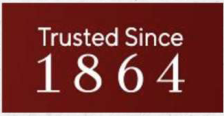

**[Image: e9c4b726-a643-492a-af7c-c55d0c1e8b84_-1-.pdf-0002-03.png (224x116, 32.3KB)]**

**[Image: e9c4b726-a643-492a-af7c-c55d0c1e8b84_-1-.pdf-0002-04.png (1650x333, 420.6KB)]**

<!-- Start of picture text -->
INVESTOR PRESENTATION <!-- End of picture text -->

INVESTOR PRESENTATION **Q1-FY26** 

**[Image: e9c4b726-a643-492a-af7c-c55d0c1e8b84_-1-.pdf-0002-06.png (1650x207, 237.4KB)]**

<!-- Start of picture text -->
Q1-FY26 <!-- End of picture text -->

**[Image: e9c4b726-a643-492a-af7c-c55d0c1e8b84_-1-.pdf-0002-07.png (1650x103, 117.4KB)]**

**[Image: e9c4b726-a643-492a-af7c-c55d0c1e8b84_-1-.pdf-0003-01.png (1650x354, 484.9KB)]**

<!-- Start of picture text -->
Disclaimer This presentation has been prepared by Tribhovandas This presentation may not be all inclusive and may not Bhimji Zaveri Limited (“TBZ”) for informational purposes only contain all of the information that you may consider and does not constitute or form any part of any offer, material. The information presented or contained in these invitation or recommendation to purchase or subscribe for materials is subject to change without notice and its any securities in any jurisdiction, and no part of it shall accuracy is not guaranteed. Neither the Company nor form the basis of, or be relied upon in connection with, any of its affiliates, advisers or representatives accepts any contract or commitment on the part of any person to liability whatsoever for any loss howsoever arising from proceed with any transaction. any information presented or contained in these materials. This presentation cannot be used, reproduced, <!-- End of picture text -->

This presentation may not be all inclusive and may not contain all of the information that you may consider material. The information presented or contained in these materials is subject to change without notice and its accuracy is not guaranteed. Neither the Company nor any of its affiliates, advisers or representatives accepts liability whatsoever for any loss howsoever arising from any information presented or contained in these materials. This presentation cannot be used, reproduced, copied, distributed, shared or disseminated in any manner. No person is authorized to give any information or to make any representation not contained in and not consistent with this presentation and, if given or made, such information or representation must not be relied upon as having been authorized by or on behalf of TBZ. 

The information contained in this presentation has not been independently verified. No representation or warranty, express or implied, is made and no reliance should be placed on the accuracy, fairness or completeness of the information presented or contained in these materials. 

**[Image: e9c4b726-a643-492a-af7c-c55d0c1e8b84_-1-.pdf-0003-04.png (1650x207, 285.2KB)]**

<!-- Start of picture text -->
copied, distributed, shared or disseminated in any been independently verified. No representation or manner. No person is authorized to give any information warranty, express or implied, is made and no reliance or to make any representation not contained in and not should be placed on the accuracy, fairness or consistent with this presentation and, if given or made, completeness of the information presented or contained such information or representation must not be relied in these materials. upon as having been authorized by or on behalf of TBZ. Any forward-looking statements in this presentation are <!-- End of picture text -->

Any forward-looking statements in this presentation are subject to risks and uncertainties that could cause actual results to differ materially from those that may be inferred to being expressed in, or implied by, such statements. Such forward-looking statements are not indicative or guarantees of future performance. Any forward-looking statements, projections and industry data made by third parties included in this presentation are not adopted by the Company and the Company is not responsible for such third-party statements and projections. 

**[Image: e9c4b726-a643-492a-af7c-c55d0c1e8b84_-1-.pdf-0003-06.png (1650x207, 275.4KB)]**

<!-- Start of picture text -->
subject to risks and uncertainties that could cause actual results to differ materially from those that may be inferred to being expressed in, or implied by, such statements. Such forward-looking statements are not indicative or guarantees of future performance. Any forward-looking statements, projections and industry data made by third parties included in this presentation are not adopted by <!-- End of picture text -->

**[Image: e9c4b726-a643-492a-af7c-c55d0c1e8b84_-1-.pdf-0003-07.png (51x51, 3.1KB)]**

<!-- Start of picture text -->
02 <!-- End of picture text -->

**[Image: e9c4b726-a643-492a-af7c-c55d0c1e8b84_-1-.pdf-0003-08.png (1650x103, 125.4KB)]**

<!-- Start of picture text -->
such third-party statements and projections. <!-- End of picture text -->

**[Image: e9c4b726-a643-492a-af7c-c55d0c1e8b84_-1-.pdf-0004-00.png (1650x207, 246.5KB)]**

**[Image: e9c4b726-a643-492a-af7c-c55d0c1e8b84_-1-.pdf-0004-01.png (151x151, 14.1KB)]**

<!-- Start of picture text -->
04 <!-- End of picture text -->

**[Image: e9c4b726-a643-492a-af7c-c55d0c1e8b84_-1-.pdf-0004-02.png (1650x207, 235.9KB)]**

<!-- Start of picture text -->
Q1FY26 Updates Page 04 <!-- End of picture text -->

**[Image: e9c4b726-a643-492a-af7c-c55d0c1e8b84_-1-.pdf-0004-03.png (151x150, 13.5KB)]**

<!-- Start of picture text -->
13 <!-- End of picture text -->

**[Image: e9c4b726-a643-492a-af7c-c55d0c1e8b84_-1-.pdf-0004-04.png (1650x207, 244.2KB)]**

<!-- Start of picture text -->
Page About Us 13 Business Model Page <!-- End of picture text -->

**[Image: e9c4b726-a643-492a-af7c-c55d0c1e8b84_-1-.pdf-0004-05.png (151x151, 14.3KB)]**

<!-- Start of picture text -->
18 <!-- End of picture text -->

## DISCUSSION SUMMARY 

**[Image: e9c4b726-a643-492a-af7c-c55d0c1e8b84_-1-.pdf-0004-07.png (1650x207, 247.3KB)]**

<!-- Start of picture text -->
DISCUSSION <!-- End of picture text -->

**[Image: e9c4b726-a643-492a-af7c-c55d0c1e8b84_-1-.pdf-0004-08.png (51x51, 3.1KB)]**

<!-- Start of picture text -->
03 <!-- End of picture text -->

**[Image: e9c4b726-a643-492a-af7c-c55d0c1e8b84_-1-.pdf-0004-09.png (1650x103, 121.7KB)]**

**[Image: e9c4b726-a643-492a-af7c-c55d0c1e8b84_-1-.pdf-0005-01.png (1650x230, 271.9KB)]**

**[Image: e9c4b726-a643-492a-af7c-c55d0c1e8b84_-1-.pdf-0005-02.png (820x138, 257.4KB)]**

**[Image: e9c4b726-a643-492a-af7c-c55d0c1e8b84_-1-.pdf-0005-03.png (53x53, 3.3KB)]**

<!-- Start of picture text -->
04 <!-- End of picture text -->

**[Image: e9c4b726-a643-492a-af7c-c55d0c1e8b84_-1-.pdf-0005-05.png (820x137, 265.4KB)]**

**[Image: e9c4b726-a643-492a-af7c-c55d0c1e8b84_-1-.pdf-0005-06.png (820x138, 262.3KB)]**

**[Image: e9c4b726-a643-492a-af7c-c55d0c1e8b84_-1-.pdf-0005-07.png (820x137, 214.2KB)]**

**[Image: e9c4b726-a643-492a-af7c-c55d0c1e8b84_-1-.pdf-0005-08.png (208x132, 26.0KB)]**

**[Image: e9c4b726-a643-492a-af7c-c55d0c1e8b84_-1-.pdf-0006-00.png (1650x230, 279.2KB)]**

<!-- Start of picture text -->
Q1 FY26 - Result Highlights ( ₹ In  Mn ) <!-- End of picture text -->

**[Image: e9c4b726-a643-492a-af7c-c55d0c1e8b84_-1-.pdf-0006-01.png (12x13, 0.5KB)]**

**[Image: e9c4b726-a643-492a-af7c-c55d0c1e8b84_-1-.pdf-0006-02.png (12x12, 0.4KB)]**

**[Image: e9c4b726-a643-492a-af7c-c55d0c1e8b84_-1-.pdf-0006-03.png (171x9, 3.4KB)]**

**[Image: e9c4b726-a643-492a-af7c-c55d0c1e8b84_-1-.pdf-0006-04.png (199x32, 8.0KB)]**

<!-- Start of picture text -->
8.24% 7.14% <!-- End of picture text -->

**[Image: e9c4b726-a643-492a-af7c-c55d0c1e8b84_-1-.pdf-0006-05.png (171x9, 3.4KB)]**

**[Image: e9c4b726-a643-492a-af7c-c55d0c1e8b84_-1-.pdf-0006-06.png (12x12, 0.5KB)]**

**[Image: e9c4b726-a643-492a-af7c-c55d0c1e8b84_-1-.pdf-0006-07.png (13x13, 0.5KB)]**

**[Image: e9c4b726-a643-492a-af7c-c55d0c1e8b84_-1-.pdf-0006-08.png (179x13, 4.9KB)]**

**[Image: e9c4b726-a643-492a-af7c-c55d0c1e8b84_-1-.pdf-0006-09.png (13x13, 0.5KB)]**

**[Image: e9c4b726-a643-492a-af7c-c55d0c1e8b84_-1-.pdf-0006-10.png (1650x264, 304.5KB)]**

<!-- Start of picture text -->
5,962  514 426 185  209 Q1 FY25 Q1 FY26 Q1 FY25 Q1 FY26 Q1 FY25 Q1 FY26 Revenue Gross Margin EBITDA EBITDA Margin PAT PAT Margin <!-- End of picture text -->

**[Image: e9c4b726-a643-492a-af7c-c55d0c1e8b84_-1-.pdf-0006-11.png (1650x207, 215.4KB)]**

<!-- Start of picture text -->
Expenses as a % of Total Revenue 4.00% 2.41% 1.51% 3.68% 1.84% 1.74% Q1 FY26 Q1 FY25 <!-- End of picture text -->

**[Image: e9c4b726-a643-492a-af7c-c55d0c1e8b84_-1-.pdf-0006-12.png (51x51, 3.1KB)]**

<!-- Start of picture text -->
05 <!-- End of picture text -->

**[Image: e9c4b726-a643-492a-af7c-c55d0c1e8b84_-1-.pdf-0006-13.png (1650x103, 121.7KB)]**

<!-- Start of picture text -->
Manpower Advertisement Other Overheads <!-- End of picture text -->

**[Image: e9c4b726-a643-492a-af7c-c55d0c1e8b84_-1-.pdf-0007-01.png (53x53, 3.2KB)]**

<!-- Start of picture text -->
07 <!-- End of picture text -->

### Q1FY26Key Takeaways 

• The Company’s revenue from operations has increased by 4.66% YoY in Q1 FY26, reaching ₹ 6,240.07 million, supported by occasion-led campaigns, calibrated store additions and robust consumer traction. 

• Gross margin improved 176 basis points, standing at 16.16% in Q1 FY26, reflecting a favourable product mix and procurement efficiencies, with Gross Profit increasing by 17.42% to ₹ 1,008.43 million. 

• The Company reported a 20.69% YoY increase in EBITDA, reaching ₹ 514.08 million in Q1 FY26, benefitting from operating leverage and consistent discipline in cost absorption across expanding formats. 

• The positive impact of the Company’s ongoing cost management efforts is evident in the EBITDA margin, which improved by 110 basis points to 8.24% in Q1 FY26, underlining margin resilience even amid new store operationalization and incremental advertising spending. 

• Achieved a 13.41% YoY increase in Profit After Tax (PAT), reaching ₹ 209.44 million in Q1 FY26 from ₹ 184.68 million recorded in Q1 FY25. 

• The PAT margin also improved by 27 basis points in Q1 FY26, standing at 3.37% up from 3.10% recorded in Q1 FY25. 

• Company recorded an Earnings Per Share (EPS) of ₹ 3.14 for Q1 FY26 up from ₹ 2.77 for Q1 FY25. 

• **Strategic retail network expansion:** launch of two new flagship high-street showrooms in Ahmedabad (C.G. Road) and Hyderabad (Kondapur) during Q1 FY26, expanding the national footprint to 37 showrooms across 27 cities. 

• **Customer Engagement & Acquisition** driven by occasion-centric marketing campaigns (like Akshaya Tritiya and "Temple Tales"), resulting in increased walk-ins, able to engage new customer acquisition, and reactivation of lapsed customers through targeted CRM and outreach. 

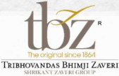

**[Image: e9c4b726-a643-492a-af7c-c55d0c1e8b84_-1-.pdf-0007-12.png (169x109, 22.2KB)]**

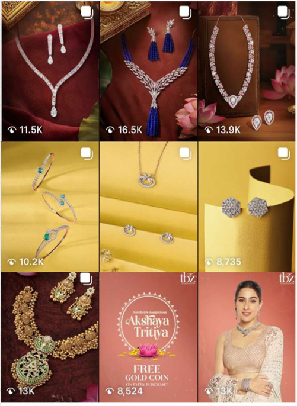

**[Image: e9c4b726-a643-492a-af7c-c55d0c1e8b84_-1-.pdf-0007-13.png (501x686, 634.8KB)]**

_Akshaya Tritiya (May)_ **–** a value-driven campaign that combined cultural relevance with a compelling offer, free gold coins with every purchase. 

### Q1 FY26Standalone Profit & Loss Statement 

**[Image: e9c4b726-a643-492a-af7c-c55d0c1e8b84_-1-.pdf-0008-01.png (170x109, 27.3KB)]**

( **₹ In Mn** ) 

|**Particulars**|**Q1FY26**|**Q1FY25**|**QoQ%**|
|---|---|---|---|
|**Revenue From Operation**|**6,240.07**|**5,962.43**|**4.66%**|
|COGS|5,231.64|5,103.59|2.51%|
|**Gross Profit**|**1,008.43**|**858.84**|**17.42%**|
|**Gross Margin %**|**16.16%**|**14.40%**|**176 bps**|
|Employee Benefit Expenses|249.85|219.54|13.81%|
|Other Expenses|244.50|213.34|14.60%|
|**EBIDTA**|**514.08**|**425.96**|**20.69%**|
|**EBIDTA Margin %**|**8.24%**|**7.14%**|**110 bps**|
|Finance Cost|176.78|128.03|38.08%|
|Depreciation|73.45|61.02|20.36%|
|Other Income|18.54|11.25|64.84%|
|**Profit Before Tax**|**282.39**|**248.16**|**13.79%**|
|Taxes|72.95|63.48|14.93%|
|**Profit after Tax***|**209.44**|**184.68**|**13.41%**|
|**PAT Margin %**|**3.37%**|**3.10%**|**27 bps**|

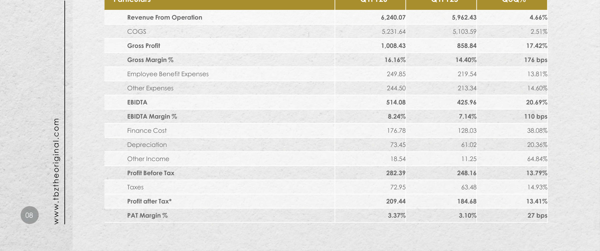

**[Image: e9c4b726-a643-492a-af7c-c55d0c1e8b84_-1-.pdf-0008-04.png (1650x692, 729.6KB)]**

<!-- Start of picture text -->
Revenue From Operation 6,240.07  5,962.43  4.66% COGS 5,231.64  5,103.59  2.51% Gross Profit 1,008.43  858.84  17.42% Gross Margin % 16.16% 14.40% 176 bps Employee Benefit Expenses 249.85  219.54  13.81% Other Expenses 244.50  213.34  14.60% EBIDTA 514.08  425.96  20.69% EBIDTA Margin % 8.24% 7.14% 110 bps Finance Cost 176.78  128.03  38.08% Depreciation 73.45  61.02  20.36% Other Income 18.54  11.25  64.84% Profit Before Tax 282.39  248.16  13.79% Taxes 72.95  63.48  14.93% Profit after Tax* 209.44  184.68  13.41% 08 PAT Margin % 3.37% 3.10% 27 bps www.tbztheoriginal.com <!-- End of picture text -->

**[Image: e9c4b726-a643-492a-af7c-c55d0c1e8b84_-1-.pdf-0009-00.png (53x53, 3.2KB)]**

<!-- Start of picture text -->
10 <!-- End of picture text -->

Our newly opened stores in Q1FY26: Ahmedabad & Hyderabad 

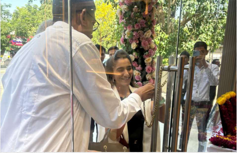

**[Image: e9c4b726-a643-492a-af7c-c55d0c1e8b84_-1-.pdf-0009-03.png (489x316, 404.7KB)]**

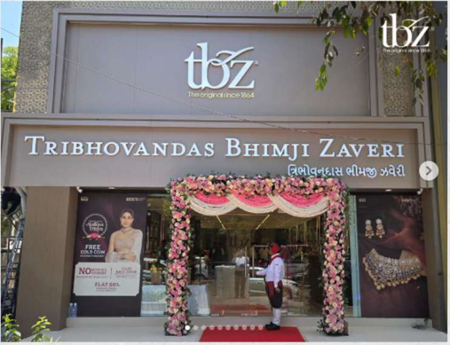

**[Image: e9c4b726-a643-492a-af7c-c55d0c1e8b84_-1-.pdf-0009-04.png (507x389, 376.2KB)]**

**[Image: e9c4b726-a643-492a-af7c-c55d0c1e8b84_-1-.pdf-0009-05.png (170x109, 27.3KB)]**

Kondapur, Hyderabad 

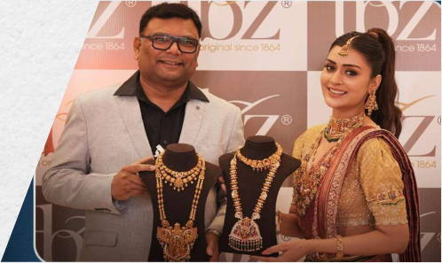

**[Image: e9c4b726-a643-492a-af7c-c55d0c1e8b84_-1-.pdf-0009-07.png (498x297, 294.8KB)]**

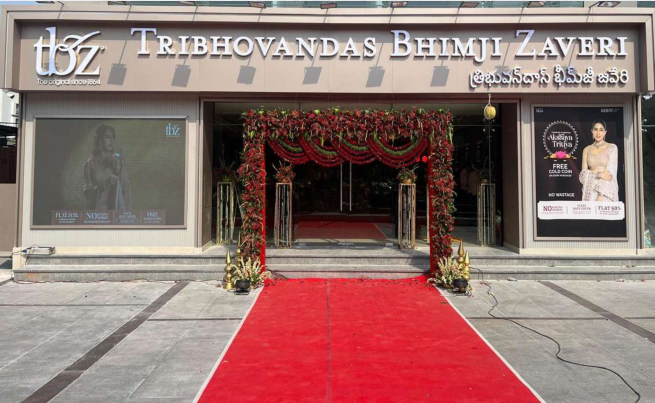

**[Image: e9c4b726-a643-492a-af7c-c55d0c1e8b84_-1-.pdf-0009-08.png (655x403, 519.5KB)]**

### Marketing Initiatives During the Quarter 

Multi-Channel Marketing, New Product Stories, and Store Expansion Driving Growth 

###### **Customer Engagement** 

- **Increased customer walk-ins** during the quarter despite a non-festive base period. 

- **Able to engage with new customers and retain lapsed** by re-engaging via CRM (WhatsApp/SMS), digital, exhibitions & BTL campaigns. 

- **Gifting Initiatives** leveraged to boost HNI Customer purchase and repeat visits. 

###### **Key Campaigns (April -June 2025)** 

- **Akshaya Tritiya:** 360° campaign across digital, print, radio, and OTT platforms. 

   - Offers: 50% off gold making charges, ₹111/gm off on gold rate, free gold coin. 

   - Result: Significant spike in footfall and conversions. 

- **Mother’s Day** : Emotion-led digital campaign celebrating Mother’s Day. 

   - Crafted visual storytelling boosted engagement with modern female audiences. 

- **Bridal & Temple Tales:** 

   - Continued wedding season push with premium, lightweight jewellery. 

   - Temple Tales launch spotlighted heritage-inspired gold designs with symbolic appeal. 

   - Supported by influencer-led storytelling and 100% gold exchange offer. 

###### **Digital Momentum** 

- Instagram followers grew from 154K →160K (+6K); collaborations with regional influencers pan-India, growing our brand presence 

- Engagement rate surged to 3.94% in June (vs. 0.17% in May). 

- Over 12M video views and 7.7M reach, primarily driven by influencer collaborations. 

- Predominantly female audience (75.7%) aged 25–34 indicates strong alignment with Target Audience. 

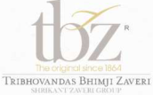

**[Image: e9c4b726-a643-492a-af7c-c55d0c1e8b84_-1-.pdf-0010-22.png (172x107, 16.0KB)]**

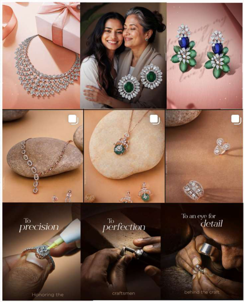

**[Image: e9c4b726-a643-492a-af7c-c55d0c1e8b84_-1-.pdf-0010-23.png (503x624, 610.1KB)]**

###### **Retail Network Expansion** 

**[Image: e9c4b726-a643-492a-af7c-c55d0c1e8b84_-1-.pdf-0010-25.png (53x53, 3.1KB)]**

<!-- Start of picture text -->
11 <!-- End of picture text -->

- 2 new showrooms launched in CG Road (Ahmedabad) and Kondapur (Hyderabad). 

- National footprint now at 37 stores across 27 cities in 13 states. 

This Mother’s Day 9-grid campaign, focused on an earthly, minimal feel and brought focus to everyday gemstone pieces styled against natural stone textures. 

- Enhanced store experience via arch gates, focal points, and thematic visual merchandising. 

**[Image: e9c4b726-a643-492a-af7c-c55d0c1e8b84_-1-.pdf-0011-00.png (53x53, 3.2KB)]**

<!-- Start of picture text -->
12 <!-- End of picture text -->

Marketing Initiatives contd. During the Quarter 

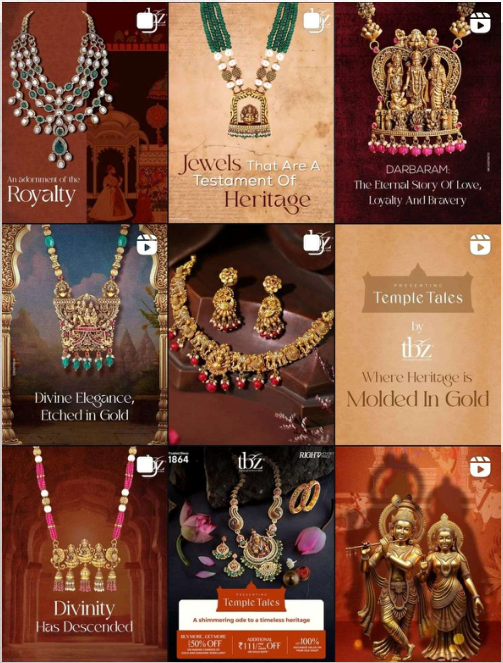

**[Image: e9c4b726-a643-492a-af7c-c55d0c1e8b84_-1-.pdf-0011-03.png (503x663, 747.5KB)]**

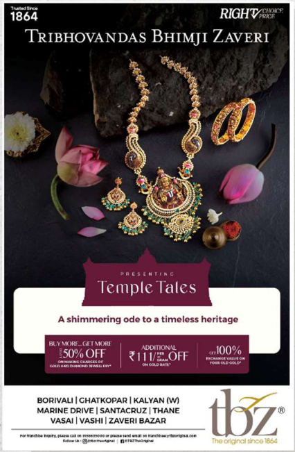

**[Image: e9c4b726-a643-492a-af7c-c55d0c1e8b84_-1-.pdf-0011-04.png (426x651, 359.1KB)]**

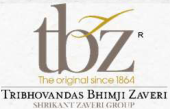

**[Image: e9c4b726-a643-492a-af7c-c55d0c1e8b84_-1-.pdf-0011-05.png (170x109, 24.1KB)]**

**[Image: e9c4b726-a643-492a-af7c-c55d0c1e8b84_-1-.pdf-0011-06.png (463x247, 166.6KB)]**

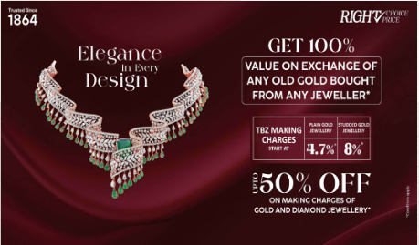

**[Image: e9c4b726-a643-492a-af7c-c55d0c1e8b84_-1-.pdf-0011-07.png (459x269, 132.9KB)]**

**[Image: e9c4b726-a643-492a-af7c-c55d0c1e8b84_-1-.pdf-0012-00.png (1650x230, 274.2KB)]**

<!-- Start of picture text -->
US <!-- End of picture text -->

**[Image: e9c4b726-a643-492a-af7c-c55d0c1e8b84_-1-.pdf-0012-02.png (864x41, 81.8KB)]**

**[Image: e9c4b726-a643-492a-af7c-c55d0c1e8b84_-1-.pdf-0012-03.png (53x53, 3.1KB)]**

<!-- Start of picture text -->
11 <!-- End of picture text -->

**[Image: e9c4b726-a643-492a-af7c-c55d0c1e8b84_-1-.pdf-0012-05.png (864x41, 86.0KB)]**

**[Image: e9c4b726-a643-492a-af7c-c55d0c1e8b84_-1-.pdf-0012-06.png (1062x173, 295.6KB)]**

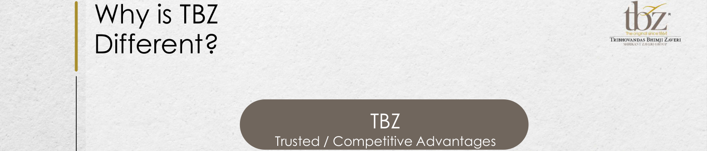

**[Image: e9c4b726-a643-492a-af7c-c55d0c1e8b84_-1-.pdf-0013-00.png (1650x354, 379.3KB)]**

<!-- Start of picture text -->
Why is TBZ Different? TBZ Trusted / Competitive Advantages <!-- End of picture text -->

||Trusted|TBZ / Competitive Advantages||
|---|---|---|---|
|Pedigree • 160 years in jewellery business • First jewelers to offer buyback guarantee in 1938 • Professional organization spearheaded by 5th generation of the family|160 years of Strong Brand Value • Healthy sales productivity • High footfalls conversion • Multigenerational clientele|Leader in Specialty Wedding & Occasion Jewellery • Leader of jewellery in Indian market • ~ 65% of sales are wedding & occasion related purchases • Compulsion buying • Stable fixed budget purchases by customers Design Exclusivity • 8 - 10 new jewellery lines/year • In-house diamond jewellery production • Customer loyalty • Premium pricing|Scalability & Reach • 37 stores (1,00,000+ ft.) • Presence – 27 cities, 13 states • 2 new stores added in April 2025, Ahmedabad & Hyderabad, making 37 stores at present.|

**[Image: e9c4b726-a643-492a-af7c-c55d0c1e8b84_-1-.pdf-0013-02.png (1650x207, 266.4KB)]**

<!-- Start of picture text -->
Leader in Scalability & Specialty Pedigree Reach 160 years of  Wedding &  Design Strong  Occasion  Exclusivity • 37 stores (1,00,000+ ft.) • 160 years in jewellery Brand Value Jewellery • <!-- End of picture text -->

**[Image: e9c4b726-a643-492a-af7c-c55d0c1e8b84_-1-.pdf-0013-04.png (1650x207, 290.2KB)]**

<!-- Start of picture text -->
business • 8 - 10 new jewellery 13 states • First jewelers to offerbuyback guarantee in  • Healthy sales productivity • Leader of jewellery in Indian market  • lines/yearIn-house diamond  • 2 new stores added in April 2025, Ahmedabad 1938 • High footfalls  • ~ 65% of sales are  jewellery production & Hyderabad, making • Professional conversion wedding & occasion  • Customer loyalty 37 stores at present. organization related purchases spearheaded by 5 th • Multigenerational clientele  • Compulsion buying • Premium pricing <!-- End of picture text -->

**[Image: e9c4b726-a643-492a-af7c-c55d0c1e8b84_-1-.pdf-0013-05.png (51x51, 2.9KB)]**

<!-- Start of picture text -->
14 <!-- End of picture text -->

**[Image: e9c4b726-a643-492a-af7c-c55d0c1e8b84_-1-.pdf-0013-06.png (1650x103, 128.1KB)]**

<!-- Start of picture text -->
• family Stable fixed budget purchases by customers <!-- End of picture text -->

### Distinctive Competitive Advantage: Multigenerational Clientele 

**[Image: e9c4b726-a643-492a-af7c-c55d0c1e8b84_-1-.pdf-0014-01.png (170x109, 27.3KB)]**

##### Enhanced Brand Awareness: 

Deepened Customer Relationships: 

##### Generational Clientele Strength: 

A multigenerational client base also bolsters brand awareness. Older generations share their positive experiences with younger family members, leading to word-of-mouth referrals and increased market visibility for the Company. z **z** z 

Lastly, a multigenerational client base enables TBZ Ltd to strengthen customer relationships. Leveraging families' emotional connections with their jewellery, the Company can establish a deeper bond with customers, increasing satisfaction and loyalty. 

TBZ's multigenerational client base is a significant strength, fostering long-term customer relationships. Families purchasing jewellery from TBZ Ltd. for generations are more likely to continue doing so, resulting in a steady stream of repeat business for the Company. 

z z z zzz **z** zzz z z Diversified Revenue Informed Product Streams: A multigenerational client Development: base allows TBZ Ltd to diversify its revenue TBZ Ltd.’s multigenerational client base streams. By catering to diverse customers provides valuable feedback, offering insights with varying preferences and budgets, the into changing preferences and trends Company can mitigate market fluctuations among different age groups. This information and maintain a stable revenue stream. enables the Company to refine its product development and marketing strategies. 

**[Image: e9c4b726-a643-492a-af7c-c55d0c1e8b84_-1-.pdf-0014-09.png (55x54, 6.9KB)]**

<!-- Start of picture text -->
zzz <!-- End of picture text -->

**[Image: e9c4b726-a643-492a-af7c-c55d0c1e8b84_-1-.pdf-0014-10.png (52x54, 7.1KB)]**

<!-- Start of picture text -->
zzz <!-- End of picture text -->

**[Image: e9c4b726-a643-492a-af7c-c55d0c1e8b84_-1-.pdf-0014-12.png (1650x207, 276.3KB)]**

<!-- Start of picture text -->
Diversified Revenue Informed Product Streams: A multigenerational client Development: base allows TBZ Ltd to diversify its revenue TBZ Ltd.’s multigenerational client base streams. By catering to diverse customers provides valuable feedback, offering insights with varying preferences and budgets, the into changing preferences and trends Company can mitigate market fluctuations among different age groups. This information <!-- End of picture text -->

**[Image: e9c4b726-a643-492a-af7c-c55d0c1e8b84_-1-.pdf-0014-13.png (51x51, 3.0KB)]**

<!-- Start of picture text -->
15 <!-- End of picture text -->

**[Image: e9c4b726-a643-492a-af7c-c55d0c1e8b84_-1-.pdf-0014-14.png (1650x103, 128.2KB)]**

<!-- Start of picture text -->
and maintain a stable revenue stream. enables the Company to refine its product development and marketing strategies. <!-- End of picture text -->

# Key Milestones 

**[Image: e9c4b726-a643-492a-af7c-c55d0c1e8b84_-1-.pdf-0015-02.png (170x109, 27.3KB)]**

#### Strong Legacy Of More Than 160 Years Built On Trust 

**[Image: e9c4b726-a643-492a-af7c-c55d0c1e8b84_-1-.pdf-0015-04.png (53x53, 3.2KB)]**

<!-- Start of picture text -->
16 <!-- End of picture text -->

|Flagship store opened in Zaveri Bazaar, Mumbai|First to offer buyback guarant|ee First to launch light weight jewellery Mr. Shrikant Zaveri took over the business Introd pre- je|uced 100% hallmarked wellery Tur IN|nover crossed R`5,000 mn in FY09   I|Diamond facility expansion - ~6k to ~24k sq ft mplementation of Oracle ERP Suite|Listed on BSE & NSE with IPO of INR 2,000 mn|
|---|---|---|---|---|---|---|
|1864|1938|1995 2001 2|004|2009|2011|2012|
|2025|2024|2019 2017 2022|2016|2015|2014|2013|
|New stores opened in Ahmedabad & Hyderabad (April- 25).|New store opened in Vapi- GIDC (Nov-23). New stores opened in Pink City- Jaipur (Jun-24) alongside Bhubaneshwar (Sep-24) & Rourkela (Oct- 24|3 franchise stores opened in Ranchi, Jharkhand in Mar- 17, Jamnagar, Gujarat in Apr-17, and Bhopal, Madhya Pradesh in Oct-17 3 exclusive brand outlets opened in Malls – R-City, Seawoods in Sep- 17 and High Street Phoenix – in Mumbai in Nov-17 Opened store in Lucknow in March- 19 Opened store in Kalyan on Oct-5th in 2022|2nd Franchise store opened at Patna, Bihar in Aug-16|1st Franchise store opened at Dhanbad, Jharkhand in Nov-15| Recommended special dividend of 7.5% on the special occasion of 150th year of the company| Retail footprint crosses 84k sq ft across 26 cities Sales crossed INR 16,000 mn, PAT of`850 mn|

**[Image: e9c4b726-a643-492a-af7c-c55d0c1e8b84_-1-.pdf-0016-00.png (1650x446, 451.8KB)]**

<!-- Start of picture text -->
Retail Presence Number of Stores Till Date Pan-India presence with 37 Stores Large Format (> 2,000 sq. ft.) 33 with a Retail Space of ~100,000+ sq. Ft. Spread across 27 Cities in 13 States Small Format (<= 2,000 sq. ft.) 4 Total Stores 37 Total Area ( sq. ft) ~1,00,000+ <!-- End of picture text -->

|Number of Stores|Till Date|
|---|---|
|Large Format (> 2,000 sq. ft.)|33|
|Small Format (<= 2,000 sq. ft.)|4|
|Total Stores|37|
|Total Area ( sq. ft)|~1,00,000+|

**[Image: e9c4b726-a643-492a-af7c-c55d0c1e8b84_-1-.pdf-0016-02.png (1650x207, 350.1KB)]**

<!-- Start of picture text -->
Total Stores 37 Total Area ( sq. ft) ~1,00,000+ Noida Jaipur Lucknow Udaipur Patna GandhidhamAhmedabad-2Ahmedabad-2 Rajkot VadodaraIndore JamshedpurRanchi Kolkata -2 Bhavnagar Surat Raipur Rourkela <!-- End of picture text -->

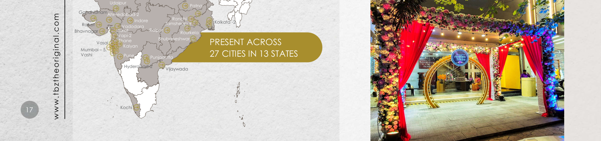

**[Image: e9c4b726-a643-492a-af7c-c55d0c1e8b84_-1-.pdf-0016-03.png (1650x388, 929.6KB)]**

<!-- Start of picture text -->
Udaipur Patna GandhidhamAhmedabad-2Ahmedabad-2 Indore Ranchi Kolkata -2 Rajkot VadodaraIndore JamshedpurRanchi Bhavnagar Surat Raipur Rourkela Vapi-2 Vasai Thane Bhubaneshwar PRESENT ACROSS Kalyan Mumbai – 5, Vashi Pune Punjagutta 27 CITIES IN 13 STATES Hyderabad-2 Vijaywada 17 Kochi www.tbztheoriginal.com <!-- End of picture text -->

**[Image: e9c4b726-a643-492a-af7c-c55d0c1e8b84_-1-.pdf-0016-04.png (1650x103, 219.0KB)]**

**[Image: e9c4b726-a643-492a-af7c-c55d0c1e8b84_-1-.pdf-0017-00.png (1650x230, 274.6KB)]**

**[Image: e9c4b726-a643-492a-af7c-c55d0c1e8b84_-1-.pdf-0017-02.png (821x137, 269.8KB)]**

**[Image: e9c4b726-a643-492a-af7c-c55d0c1e8b84_-1-.pdf-0017-03.png (821x137, 280.5KB)]**

**[Image: e9c4b726-a643-492a-af7c-c55d0c1e8b84_-1-.pdf-0017-05.png (821x137, 259.5KB)]**

**[Image: e9c4b726-a643-492a-af7c-c55d0c1e8b84_-1-.pdf-0017-06.png (821x136, 197.5KB)]**

**[Image: e9c4b726-a643-492a-af7c-c55d0c1e8b84_-1-.pdf-0017-07.png (209x132, 26.3KB)]**

**[Image: e9c4b726-a643-492a-af7c-c55d0c1e8b84_-1-.pdf-0017-08.png (53x53, 3.2KB)]**

<!-- Start of picture text -->
16 <!-- End of picture text -->

**[Image: e9c4b726-a643-492a-af7c-c55d0c1e8b84_-1-.pdf-0018-00.png (1650x207, 264.0KB)]**

<!-- Start of picture text -->
Business Model: Manufacturing <!-- End of picture text -->

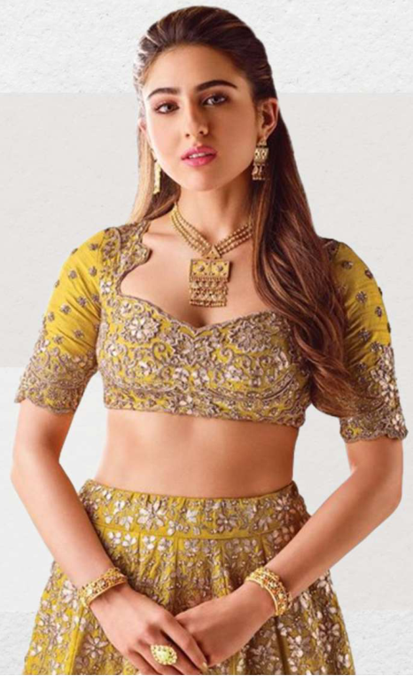

**[Image: e9c4b726-a643-492a-af7c-c55d0c1e8b84_-1-.pdf-0018-01.png (466x762, 655.0KB)]**

**[Image: e9c4b726-a643-492a-af7c-c55d0c1e8b84_-1-.pdf-0018-02.png (1650x207, 242.3KB)]**

<!-- Start of picture text -->
Gold • Raw Material - Bullion <!-- End of picture text -->

Gold • Sources: • • • • • • 100 kg. • 

- Banks – Gold on loan 

- Exchange & purchase of old jewellery 

- Bullion dealers 

- Gold jewellery manufacturing is outsourced. 

- Vast nation-wide network of 150+ vendors 

- Each vendor has an annual gold processing capacity of more than 100 kg. 

- These vendors are associated with TBZ since generations and are experts in handmade regional jewellery designs. 

**[Image: e9c4b726-a643-492a-af7c-c55d0c1e8b84_-1-.pdf-0018-11.png (51x51, 3.0KB)]**

<!-- Start of picture text -->
19 <!-- End of picture text -->

**[Image: e9c4b726-a643-492a-af7c-c55d0c1e8b84_-1-.pdf-0018-12.png (1650x103, 198.6KB)]**

**[Image: e9c4b726-a643-492a-af7c-c55d0c1e8b84_-1-.pdf-0019-00.png (1650x230, 294.3KB)]**

<!-- Start of picture text -->
Business Model: contd. Manufacturing <!-- End of picture text -->

**[Image: e9c4b726-a643-492a-af7c-c55d0c1e8b84_-1-.pdf-0019-01.png (745x387, 332.5KB)]**

Diamond • Sources: • • • • 

- Raw Material - Cut & polished diamonds 

- DTC site holders 

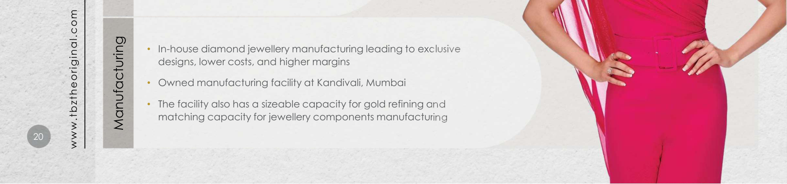

**[Image: e9c4b726-a643-492a-af7c-c55d0c1e8b84_-1-.pdf-0019-05.png (1650x387, 471.1KB)]**

<!-- Start of picture text -->
• In-house diamond jewellery manufacturing leading to exclusive designs, lower costs, and higher margins • Owned manufacturing facility at Kandivali, Mumbai • The facility also has a sizeable capacity for gold refining and matching capacity for jewellery components manufacturing 20 Manufacturing www.tbztheoriginal.com <!-- End of picture text -->

### Gold Metal Loan: Efficient Sourcing Channel 

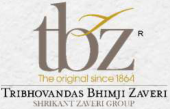

**[Image: e9c4b726-a643-492a-af7c-c55d0c1e8b84_-1-.pdf-0020-01.png (170x109, 27.3KB)]**

**[Image: e9c4b726-a643-492a-af7c-c55d0c1e8b84_-1-.pdf-0020-02.png (1650x692, 823.6KB)]**

<!-- Start of picture text -->
Gold Metal Loan Origination Gold Metal Loan Repayment • TBZ takes 10 kg gold from a bank on lease on day 0. • TBZ repays the gold daily based on actual sales of gold jewellery. • • The bank converts 1 kg of gold on lease as a sale to TBZ at a reference rate set The contract for gold lease is 180 days. by them as on day 1. • TBZ provides a bank guarantee worth 110% of gold leased. • TBZ books a purchase of 1 kg of gold. • Total Financing cost (interest on gold lease plus bank  • The balance 9 kg worth of gold continues to remain on lease. guarantee commission) to TBZ is significantly lower than  • TBZ again replenishes the inventory by taking 1 kg of gold on lease from bank on Cash Credit Rate of Interest day1. • Since TBZ’s gold jewellery inventory turns 2-3 times, it repays the gold lease before 180 days. Gold Metal Loan Advantages Gold Metal Loan Limitations • Interest Cost Savings: Borrowing cost on gold lease is • Sharp increase in gold prices: Gold lease is marked to market on a daily significantly lower compared to working capital basis. So, any increase in gold price will cause TBZ to top up its bank borrowing cost. guarantee. • No Commodity Risk: Since gold is taken on lease, there is • Bank Guarantee limitations: Bank guarantee issued by the bank to TBZ is no gain if gold prices increase or loss if gold prices based on the drawing power enjoyed by TBZ. 21 decrease. • Contract Period: If TBZ is unable to sell the gold on lease within 180 days, then www.tbztheoriginal.com they will have to convert the balance unutilized gold to purchase. <!-- End of picture text -->

**[Image: e9c4b726-a643-492a-af7c-c55d0c1e8b84_-1-.pdf-0021-01.png (53x53, 3.2KB)]**

<!-- Start of picture text -->
22 <!-- End of picture text -->

**[Image: e9c4b726-a643-492a-af7c-c55d0c1e8b84_-1-.pdf-0021-02.png (170x109, 27.3KB)]**

### Securing Future Growth: Our Strategic Pillars 

**[Image: e9c4b726-a643-492a-af7c-c55d0c1e8b84_-1-.pdf-0021-04.png (296x145, 49.1KB)]**

160 years of Brand Value Leverage: TBZ Ltd boasts substantial brand value and a long-standing reputation for quality and craftsmanship. With over 160 years in business, the brand is recognized and trusted by multigenerational customers across India, providing a significant competitive advantage and positioning the Company for continued growth. 

##### Diversified Portfolio Growth: 

**[Image: e9c4b726-a643-492a-af7c-c55d0c1e8b84_-1-.pdf-0021-07.png (226x132, 17.7KB)]**

TBZ Ltd maintains a diversified product portfolio featuring gold, diamond, and other precious gemstone jewellery. By offering various price points to cater to different customer segments, the Company intends to mitigate market fluctuations' impact and generate a stable revenue stream. 

**[Image: e9c4b726-a643-492a-af7c-c55d0c1e8b84_-1-.pdf-0021-09.png (115x116, 8.2KB)]**

**[Image: e9c4b726-a643-492a-af7c-c55d0c1e8b84_-1-.pdf-0021-10.png (116x116, 8.5KB)]**

Financial Performance Strength: 

TBZ Ltd is on track to deliver steadily improving financial performance, with consistent revenue growth and profitability. The solid balance sheet, lowering debt levels, and strong cash position sets the Company up for continued growth and expansion in India's exciting growth story. 

**[Image: e9c4b726-a643-492a-af7c-c55d0c1e8b84_-1-.pdf-0021-13.png (132x222, 25.1KB)]**

**[Image: e9c4b726-a643-492a-af7c-c55d0c1e8b84_-1-.pdf-0021-14.png (132x222, 24.0KB)]**

##### Retail Expansion Focus: 

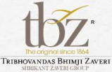

**[Image: e9c4b726-a643-492a-af7c-c55d0c1e8b84_-1-.pdf-0021-16.png (159x103, 22.8KB)]**

TBZ Ltd focuses on organic growth through its network of stores and judiciously expanding its retail footprint across India by opening new stores in key locations. This strategy will allow the Company to increase its market share and attract new customers. The focus on retail expansion enables TBZ Ltd to leverage its brand value and capture new growth opportunities. 

**[Image: e9c4b726-a643-492a-af7c-c55d0c1e8b84_-1-.pdf-0022-01.png (53x53, 3.2KB)]**

<!-- Start of picture text -->
23 <!-- End of picture text -->

### Steadfast market steeped in tradition and innovation 

##### GDP Contribution and Cultural Significance: 

The gems and jewellery market contributes approximately 7.5% to India’s GDP and 14% to total merchandise exports (IBEF Research). Gold, symbolizing wealth and prosperity, is integral to Indian culture and ceremonies, ensuring continued demand. 

##### Expanding Middle Class and Disposable Income: 

India's middle class is projected to grow from ~30% of the population in 2021 to >60% by 2047 (PRICE Market Research Report). Rising disposable incomes will likely increase spending on luxury items like high-quality, branded jewellery. 

##### Steadfast Market Growth: 

The market was valued at $78.50 billion in 2021 and is expected to reach $119.80 billion by 2027, with a CAGR of 8.34%. The popularity of costume and fashion jewellery, especially among younger consumers, contributes to this growth as they seek affordable and versatile options. 

##### Government Reduction in Custom Duties: 

The Indian government has reduced customs duties on gold and silver by 6%, with the basic customs duty lowered to 5% from 10%. This reduction is expected to positively impact the company's cost of raw materials and overall profit margins. 

##### Fashion Jewellery Demand: 

The rising popularity of fashion jewellery, particularly among younger consumers, has led to significant growth in this segment, with more consumers seeking affordable, stylish, and versatile options for various occasions. 

##### E-commerce and Digital Platform Growth: 

Increasing internet and smartphone penetration has resulted in a rise in online shopping, expanding the market and increasing accessibility to a wider range of jewellery designs and products. 

**[Image: e9c4b726-a643-492a-af7c-c55d0c1e8b84_-1-.pdf-0022-15.png (170x109, 27.3KB)]**

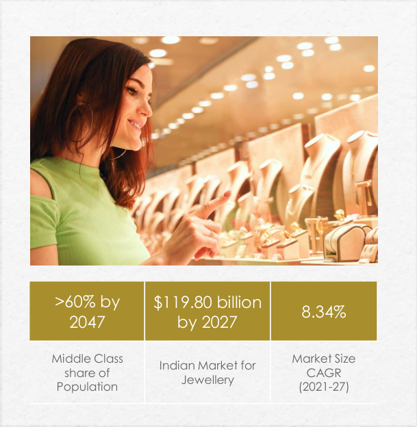

**[Image: e9c4b726-a643-492a-af7c-c55d0c1e8b84_-1-.pdf-0022-16.png (609x624, 455.7KB)]**

<!-- Start of picture text -->
>60% by  $119.80 billion 8.34% 2047 by 2027 Middle Class  Market Size Indian Market for share of  CAGR Jewellery Population (2021-27) <!-- End of picture text -->

Source: PRICE & Economic Times 

**[Image: e9c4b726-a643-492a-af7c-c55d0c1e8b84_-1-.pdf-0023-01.png (53x53, 3.2KB)]**

<!-- Start of picture text -->
24 <!-- End of picture text -->

**[Image: e9c4b726-a643-492a-af7c-c55d0c1e8b84_-1-.pdf-0023-02.png (170x109, 27.3KB)]**

### Harnessing Our Core Strengths to Drive Success 

##### Domestic Focus: 

**[Image: e9c4b726-a643-492a-af7c-c55d0c1e8b84_-1-.pdf-0023-05.png (180x207, 27.1KB)]**

Since TBZ primarily concentrates on the domestic jewellery market, it remains protected from the impact of international economic challenges. 

##### Consumer Trust: 

**[Image: e9c4b726-a643-492a-af7c-c55d0c1e8b84_-1-.pdf-0023-08.png (197x239, 28.4KB)]**

TBZ is an age-old established brand known for its innovative designs, the quality of its artistry, and unquestionable product authenticity, enjoying a loyal base of multigenerational clientele. 

Rooted in trust and heritage, TBZ leads the Indian jewellery market with unmatched quality, a domestic focus, and a deep connection to the rising middle-class consumer. 

**[Image: e9c4b726-a643-492a-af7c-c55d0c1e8b84_-1-.pdf-0023-11.png (178x197, 30.6KB)]**

**[Image: e9c4b726-a643-492a-af7c-c55d0c1e8b84_-1-.pdf-0023-12.png (197x238, 31.3KB)]**

**[Image: e9c4b726-a643-492a-af7c-c55d0c1e8b84_-1-.pdf-0023-13.png (197x238, 32.1KB)]**

<!-- Start of picture text -->
consumer. <!-- End of picture text -->

##### Industry Benchmark: 

In the Indian jewellery market, TBZ holds a distinguished position for its exemplary corporate governance, setting it as the industry's peer benchmark. 

Middle-Class Growth: TBZ is strategically positioned to capitalize on the remarkable growth of the expanding Indian middle class, and their surging aspirations and spending in India. 

**[Image: e9c4b726-a643-492a-af7c-c55d0c1e8b84_-1-.pdf-0023-17.png (180x208, 27.3KB)]**

##### Resilient Heritage: 

Spanning over 160 years, the Company has navigated multiple economic disruptions, coming out strong after each cycle. 

**[Image: e9c4b726-a643-492a-af7c-c55d0c1e8b84_-1-.pdf-0024-00.png (53x53, 3.3KB)]**

<!-- Start of picture text -->
25 <!-- End of picture text -->

### Awards & Recognition: 

- TBZ – The Original has won the award at Retail Jeweller India Forum- MD & CEO Awards 2025 in below category: 

   - “Exemplary Value creation for Shareholders 2025” 

- **Shri Shrikant Zaveri** , has been conferred with the prestigious " **Gems and Jewellery Industry Legend" Award** at the illustrious **IIJS Tritiya 2023** event in Mumbai. 

- **Ms. Raashi Zaveri** has been awarded the **GJEPC 40 under 40** , recognizing her as a young industry leader and with the prestigious “Excellence in Leadership, Young Leader of the Year Award” by the Retail Jeweller India MD and CEO Awards. 

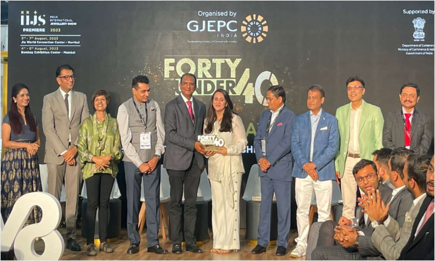

**[Image: e9c4b726-a643-492a-af7c-c55d0c1e8b84_-1-.pdf-0024-07.png (720x432, 626.6KB)]**

**GJEPC 40 under 40** 

**[Image: e9c4b726-a643-492a-af7c-c55d0c1e8b84_-1-.pdf-0024-09.png (170x109, 27.3KB)]**

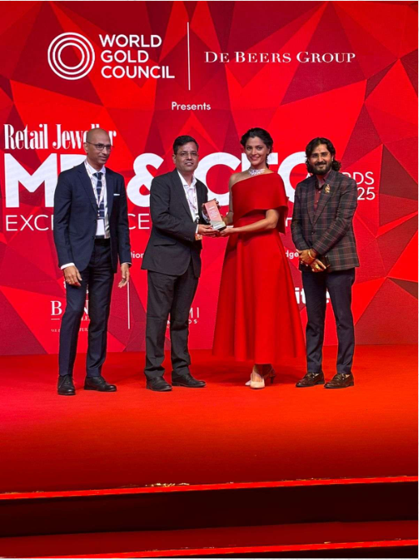

**[Image: e9c4b726-a643-492a-af7c-c55d0c1e8b84_-1-.pdf-0024-10.png (517x690, 567.9KB)]**

Retail Jeweller India Forum- MD & CEO Awards 2025 

**[Image: e9c4b726-a643-492a-af7c-c55d0c1e8b84_-1-.pdf-0025-01.png (53x53, 3.2KB)]**

<!-- Start of picture text -->
24 <!-- End of picture text -->

### Awards & Recognition 

- **“** EXEMPELARY VALUE CREATION FOR SHAREHOLDERS 2025“ 

###### **Retail Jeweller India Forum- MD & CEO Awards 2025** 

- “EXCELLENCE IN LEADERSHIP, YOUNG LEADER OF THE YEAR 2025” : Ms. Raashi Zaveri **GJEPC 40 under 40:** Retail Jeweller India MD and CEO Awards. 

- “GEMS & JEWELLRY INDUSTRY LEGEND AWARD” : Mr. Srikant Zaveri **IIJS Tritiya 2023** 

- “BEST BRACELET DESIGN AWARD -9TH EDITION” JJS-IJ Jewellers Choice Design Awards – 2019 

- “CONTEMPORARY DIAMOND JEWELLERY AWARD” & “TREASURE OF THE OCEAN “ 

- GJC’S NATIONAL JEWELLERY AWARD 2018 

- “DIAMOND VIVAH JEWELLERY OF THE YEAR” Retail Jeweller India Awards – 2018 

- “INDIA’S MOST PREFERRED JEWELLERY BRAND” UBM India – 2017 

- “BEST RING DESIGN OVER Rs. 2,50,000” JJS-IJ Jewellers Choice Design Awards – 2016 

- “TV CAMPAIGN OF THE YEAR” 

   - 12th Gemfields Retail Jeweller India Awards – 2016 

- “DIAMOND JEWELLERY OF THE YEAR” 

   - 12th Gemfields Retail Jeweller India Awards – 2016 

- “BEST NECKLACE DESIGN AWARD – 2016” JJS-IJ Jewellers’ Choice Design Award – 2016 

- “ASIA’S MOST POPULAR BRANDS – 2014” World Consulting & Research Corporation (WCRC) – 2014 

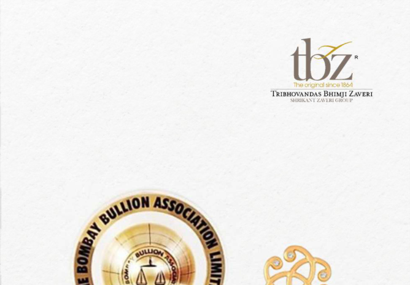

**[Image: e9c4b726-a643-492a-af7c-c55d0c1e8b84_-1-.pdf-0025-19.png (668x465, 263.4KB)]**

**[Image: e9c4b726-a643-492a-af7c-c55d0c1e8b84_-1-.pdf-0025-20.png (297x568, 335.7KB)]**

**[Image: e9c4b726-a643-492a-af7c-c55d0c1e8b84_-1-.pdf-0025-21.png (199x457, 136.3KB)]**

**[Image: e9c4b726-a643-492a-af7c-c55d0c1e8b84_-1-.pdf-0026-01.png (53x53, 3.3KB)]**

<!-- Start of picture text -->
28 <!-- End of picture text -->

#### **Key Programs & Partnerships:** 

###### **1. EK Disha Partnership – Victoria School for the Blind & Muskan Foundation** 

- **Supported 16 students** from Muskan Foundation with therapeutic services including vision therapy, 

- speech therapy, and behavioural therapy to enhance academic and daily functioning. 

- Continued **hostel support for 15 visually impaired students** at Victoria Memorial School for the Blind. 

- Enabled holistic education and therapy aligned to long-term development goals. 

- New academic year commenced successfully. 

- Initiative aligned with **SDG 4 (Quality Education)** and **SDG 10 (Reduced Inequalities)** to promote inclusive learning and empowerment. 

###### **2. Project Pankhi – Women & Adolescent Empowerment** 

- **205 counselling cases** addressed with a focus on legal, psychological, and social support for 

- marginalised women. 

- **21 awareness sessions** held on gender-based violence, career guidance, and basic rights, reaching 

- **972 women and adolescents** . 

- Pankhi partner recognised by a **UK-based organisation** for impactful work in mental health for women survivors of violence. 

- **6 teacher training workshops** conducted to build inclusive education practices. 

- Tree plantation and Yoga Day celebrated in partner schools to promote holistic development. 

- Project aligns with **SDG 5 (Gender Equality)** and **SDG 3 (Good Health & Well-being)** . 

###### **3. Community & Volunteer Engagement** 

- **Tree plantation drives** and **Yoga Day activities** conducted in local schools to promote 

- environmental awareness and well-being. 

- Team-building session organised in collaboration with **Stree Mukti Sanghatana** , engaging community members and volunteers. 

- Volunteer-driven initiatives reinforced CSR-community connect and enabled team development. 

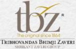

**[Image: e9c4b726-a643-492a-af7c-c55d0c1e8b84_-1-.pdf-0026-20.png (153x99, 23.0KB)]**

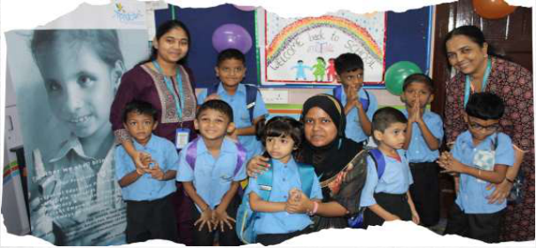

**[Image: e9c4b726-a643-492a-af7c-c55d0c1e8b84_-1-.pdf-0026-21.png (605x280, 398.0KB)]**

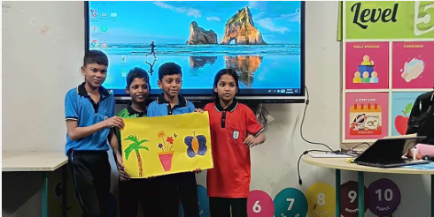

**[Image: e9c4b726-a643-492a-af7c-c55d0c1e8b84_-1-.pdf-0026-22.png (490x246, 235.7KB)]**

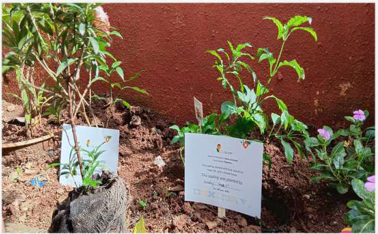

**[Image: e9c4b726-a643-492a-af7c-c55d0c1e8b84_-1-.pdf-0026-23.png (378x234, 227.6KB)]**

**[Image: e9c4b726-a643-492a-af7c-c55d0c1e8b84_-1-.pdf-0027-01.png (53x53, 3.2KB)]**

<!-- Start of picture text -->
27 <!-- End of picture text -->

##### **PROJECT PANKHI** 

Project Pankhi is TBZ’s flagship initiative focused on empowering women and adolescent girls from marginalised communities through mental health support, legal counselling, education, and awareness programmes. 

###### **Key Impact Highlights for Q1 FY26 (April–June 2025):** 

- 205 counselling cases registered, addressing issues of gender-based violence, psychological trauma, and legal vulnerabilities. 

- Conducted 972 joint counselling sessions with family members to drive behavioural change and create supportive home environments. 

- Facilitated 21 awareness sessions for 972 women and adolescents, focused on gender equality, basic rights, and career guidance. 

- 6 teacher training workshops conducted to build inclusive and empathetic classroom environments for young learners. 

- Partner NGOs under the Pankhi programme were internationally recognised by a UK-based organisation for their pioneering work in mental health and women’s empowerment. 

- Organised tree plantation and Yoga Day celebrations in partner schools to promote holistic well-being and strengthen community engagement under project EK Disha. 

As a long-term, community-driven programme that integrates legal, emotional, and educational support systems to uplift women and girls, Project Pankhi continues to scale through trusted grassroots partners such as Stree Mukti Sanghatana, Urja Foundation, and Cultural Academy for Peace. 

###### **Aligned with UN SDGs:** 

SDG 5 – Gender Equality SDG 3 – Good Health and Well-being 

**[Image: e9c4b726-a643-492a-af7c-c55d0c1e8b84_-1-.pdf-0027-14.png (155x118, 37.2KB)]**

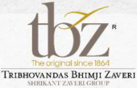

**[Image: e9c4b726-a643-492a-af7c-c55d0c1e8b84_-1-.pdf-0027-15.png (170x110, 24.6KB)]**

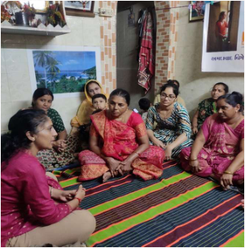

**[Image: e9c4b726-a643-492a-af7c-c55d0c1e8b84_-1-.pdf-0027-16.png (301x305, 228.8KB)]**

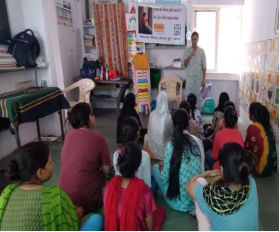

**[Image: e9c4b726-a643-492a-af7c-c55d0c1e8b84_-1-.pdf-0027-17.png (280x232, 150.3KB)]**

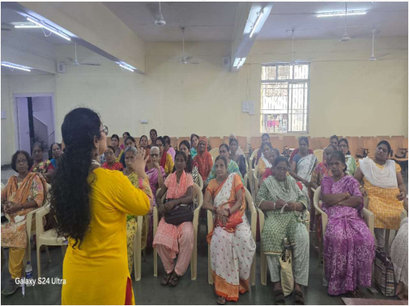

**[Image: e9c4b726-a643-492a-af7c-c55d0c1e8b84_-1-.pdf-0027-18.png (505x378, 353.4KB)]**

**15,830 Individuals Reached** 

**[Image: e9c4b726-a643-492a-af7c-c55d0c1e8b84_-1-.pdf-0028-01.png (1650x207, 255.0KB)]**

**[Image: e9c4b726-a643-492a-af7c-c55d0c1e8b84_-1-.pdf-0028-02.png (271x171, 59.9KB)]**

**[Image: e9c4b726-a643-492a-af7c-c55d0c1e8b84_-1-.pdf-0028-03.png (1650x207, 237.0KB)]**

**[Image: e9c4b726-a643-492a-af7c-c55d0c1e8b84_-1-.pdf-0028-04.png (1650x264, 341.4KB)]**

**[Image: e9c4b726-a643-492a-af7c-c55d0c1e8b84_-1-.pdf-0028-05.png (188x122, 35.1KB)]**

**[Image: e9c4b726-a643-492a-af7c-c55d0c1e8b84_-1-.pdf-0028-06.png (1650x250, 323.9KB)]**

<!-- Start of picture text -->
THANK Mukesh Sharma Shankhini Saha CFO Director- Investor Relations mukesh.sharma@tbzoriginal.com YOU tbz@dickensonworld.com <!-- End of picture text -->

---

## Extracted Images

| # | File | Dimensions | Size |
|---|------|------------|------|
| 1 | e9c4b726-a643-492a-af7c-c55d0c1e8b84_-1-.pdf-0001-16.png | 177x143 | 6.1KB |
| 2 | e9c4b726-a643-492a-af7c-c55d0c1e8b84_-1-.pdf-0001-17.png | 13x15 | 0.4KB |
| 3 | e9c4b726-a643-492a-af7c-c55d0c1e8b84_-1-.pdf-0001-18.png | 178x39 | 4.5KB |
| 4 | e9c4b726-a643-492a-af7c-c55d0c1e8b84_-1-.pdf-0001-19.png | 892x86 | 29.1KB |
| 5 | e9c4b726-a643-492a-af7c-c55d0c1e8b84_-1-.pdf-0002-01.png | 1650x207 | 257.3KB |
| 6 | e9c4b726-a643-492a-af7c-c55d0c1e8b84_-1-.pdf-0002-02.png | 272x171 | 60.1KB |
| 7 | e9c4b726-a643-492a-af7c-c55d0c1e8b84_-1-.pdf-0002-03.png | 224x116 | 32.3KB |
| 8 | e9c4b726-a643-492a-af7c-c55d0c1e8b84_-1-.pdf-0002-04.png | 1650x333 | 420.6KB |
| 9 | e9c4b726-a643-492a-af7c-c55d0c1e8b84_-1-.pdf-0002-06.png | 1650x207 | 237.4KB |
| 10 | e9c4b726-a643-492a-af7c-c55d0c1e8b84_-1-.pdf-0002-07.png | 1650x103 | 117.4KB |
| 11 | e9c4b726-a643-492a-af7c-c55d0c1e8b84_-1-.pdf-0003-01.png | 1650x354 | 484.9KB |
| 12 | e9c4b726-a643-492a-af7c-c55d0c1e8b84_-1-.pdf-0003-04.png | 1650x207 | 285.2KB |
| 13 | e9c4b726-a643-492a-af7c-c55d0c1e8b84_-1-.pdf-0003-06.png | 1650x207 | 275.4KB |
| 14 | e9c4b726-a643-492a-af7c-c55d0c1e8b84_-1-.pdf-0003-07.png | 51x51 | 3.1KB |
| 15 | e9c4b726-a643-492a-af7c-c55d0c1e8b84_-1-.pdf-0003-08.png | 1650x103 | 125.4KB |
| 16 | e9c4b726-a643-492a-af7c-c55d0c1e8b84_-1-.pdf-0004-00.png | 1650x207 | 246.5KB |
| 17 | e9c4b726-a643-492a-af7c-c55d0c1e8b84_-1-.pdf-0004-01.png | 151x151 | 14.1KB |
| 18 | e9c4b726-a643-492a-af7c-c55d0c1e8b84_-1-.pdf-0004-02.png | 1650x207 | 235.9KB |
| 19 | e9c4b726-a643-492a-af7c-c55d0c1e8b84_-1-.pdf-0004-03.png | 151x150 | 13.5KB |
| 20 | e9c4b726-a643-492a-af7c-c55d0c1e8b84_-1-.pdf-0004-04.png | 1650x207 | 244.2KB |
| 21 | e9c4b726-a643-492a-af7c-c55d0c1e8b84_-1-.pdf-0004-05.png | 151x151 | 14.3KB |
| 22 | e9c4b726-a643-492a-af7c-c55d0c1e8b84_-1-.pdf-0004-07.png | 1650x207 | 247.3KB |
| 23 | e9c4b726-a643-492a-af7c-c55d0c1e8b84_-1-.pdf-0004-08.png | 51x51 | 3.1KB |
| 24 | e9c4b726-a643-492a-af7c-c55d0c1e8b84_-1-.pdf-0004-09.png | 1650x103 | 121.7KB |
| 25 | e9c4b726-a643-492a-af7c-c55d0c1e8b84_-1-.pdf-0005-01.png | 1650x230 | 271.9KB |
| 26 | e9c4b726-a643-492a-af7c-c55d0c1e8b84_-1-.pdf-0005-02.png | 820x138 | 257.4KB |
| 27 | e9c4b726-a643-492a-af7c-c55d0c1e8b84_-1-.pdf-0005-03.png | 53x53 | 3.3KB |
| 28 | e9c4b726-a643-492a-af7c-c55d0c1e8b84_-1-.pdf-0005-05.png | 820x137 | 265.4KB |
| 29 | e9c4b726-a643-492a-af7c-c55d0c1e8b84_-1-.pdf-0005-06.png | 820x138 | 262.3KB |
| 30 | e9c4b726-a643-492a-af7c-c55d0c1e8b84_-1-.pdf-0005-07.png | 820x137 | 214.2KB |
| 31 | e9c4b726-a643-492a-af7c-c55d0c1e8b84_-1-.pdf-0005-08.png | 208x132 | 26.0KB |
| 32 | e9c4b726-a643-492a-af7c-c55d0c1e8b84_-1-.pdf-0006-00.png | 1650x230 | 279.2KB |
| 33 | e9c4b726-a643-492a-af7c-c55d0c1e8b84_-1-.pdf-0006-01.png | 12x13 | 0.5KB |
| 34 | e9c4b726-a643-492a-af7c-c55d0c1e8b84_-1-.pdf-0006-02.png | 12x12 | 0.4KB |
| 35 | e9c4b726-a643-492a-af7c-c55d0c1e8b84_-1-.pdf-0006-03.png | 171x9 | 3.4KB |
| 36 | e9c4b726-a643-492a-af7c-c55d0c1e8b84_-1-.pdf-0006-04.png | 199x32 | 8.0KB |
| 37 | e9c4b726-a643-492a-af7c-c55d0c1e8b84_-1-.pdf-0006-05.png | 171x9 | 3.4KB |
| 38 | e9c4b726-a643-492a-af7c-c55d0c1e8b84_-1-.pdf-0006-06.png | 12x12 | 0.5KB |
| 39 | e9c4b726-a643-492a-af7c-c55d0c1e8b84_-1-.pdf-0006-07.png | 13x13 | 0.5KB |
| 40 | e9c4b726-a643-492a-af7c-c55d0c1e8b84_-1-.pdf-0006-08.png | 179x13 | 4.9KB |
| 41 | e9c4b726-a643-492a-af7c-c55d0c1e8b84_-1-.pdf-0006-09.png | 13x13 | 0.5KB |
| 42 | e9c4b726-a643-492a-af7c-c55d0c1e8b84_-1-.pdf-0006-10.png | 1650x264 | 304.5KB |
| 43 | e9c4b726-a643-492a-af7c-c55d0c1e8b84_-1-.pdf-0006-11.png | 1650x207 | 215.4KB |
| 44 | e9c4b726-a643-492a-af7c-c55d0c1e8b84_-1-.pdf-0006-12.png | 51x51 | 3.1KB |
| 45 | e9c4b726-a643-492a-af7c-c55d0c1e8b84_-1-.pdf-0006-13.png | 1650x103 | 121.7KB |
| 46 | e9c4b726-a643-492a-af7c-c55d0c1e8b84_-1-.pdf-0007-01.png | 53x53 | 3.2KB |
| 47 | e9c4b726-a643-492a-af7c-c55d0c1e8b84_-1-.pdf-0007-12.png | 169x109 | 22.2KB |
| 48 | e9c4b726-a643-492a-af7c-c55d0c1e8b84_-1-.pdf-0007-13.png | 501x686 | 634.8KB |
| 49 | e9c4b726-a643-492a-af7c-c55d0c1e8b84_-1-.pdf-0008-01.png | 170x109 | 27.3KB |
| 50 | e9c4b726-a643-492a-af7c-c55d0c1e8b84_-1-.pdf-0008-04.png | 1650x692 | 729.6KB |
| 51 | e9c4b726-a643-492a-af7c-c55d0c1e8b84_-1-.pdf-0009-00.png | 53x53 | 3.2KB |
| 52 | e9c4b726-a643-492a-af7c-c55d0c1e8b84_-1-.pdf-0009-03.png | 489x316 | 404.7KB |
| 53 | e9c4b726-a643-492a-af7c-c55d0c1e8b84_-1-.pdf-0009-04.png | 507x389 | 376.2KB |
| 54 | e9c4b726-a643-492a-af7c-c55d0c1e8b84_-1-.pdf-0009-05.png | 170x109 | 27.3KB |
| 55 | e9c4b726-a643-492a-af7c-c55d0c1e8b84_-1-.pdf-0009-07.png | 498x297 | 294.8KB |
| 56 | e9c4b726-a643-492a-af7c-c55d0c1e8b84_-1-.pdf-0009-08.png | 655x403 | 519.5KB |
| 57 | e9c4b726-a643-492a-af7c-c55d0c1e8b84_-1-.pdf-0010-22.png | 172x107 | 16.0KB |
| 58 | e9c4b726-a643-492a-af7c-c55d0c1e8b84_-1-.pdf-0010-23.png | 503x624 | 610.1KB |
| 59 | e9c4b726-a643-492a-af7c-c55d0c1e8b84_-1-.pdf-0010-25.png | 53x53 | 3.1KB |
| 60 | e9c4b726-a643-492a-af7c-c55d0c1e8b84_-1-.pdf-0011-00.png | 53x53 | 3.2KB |
| 61 | e9c4b726-a643-492a-af7c-c55d0c1e8b84_-1-.pdf-0011-03.png | 503x663 | 747.5KB |
| 62 | e9c4b726-a643-492a-af7c-c55d0c1e8b84_-1-.pdf-0011-04.png | 426x651 | 359.1KB |
| 63 | e9c4b726-a643-492a-af7c-c55d0c1e8b84_-1-.pdf-0011-05.png | 170x109 | 24.1KB |
| 64 | e9c4b726-a643-492a-af7c-c55d0c1e8b84_-1-.pdf-0011-06.png | 463x247 | 166.6KB |
| 65 | e9c4b726-a643-492a-af7c-c55d0c1e8b84_-1-.pdf-0011-07.png | 459x269 | 132.9KB |
| 66 | e9c4b726-a643-492a-af7c-c55d0c1e8b84_-1-.pdf-0012-00.png | 1650x230 | 274.2KB |
| 67 | e9c4b726-a643-492a-af7c-c55d0c1e8b84_-1-.pdf-0012-02.png | 864x41 | 81.8KB |
| 68 | e9c4b726-a643-492a-af7c-c55d0c1e8b84_-1-.pdf-0012-03.png | 53x53 | 3.1KB |
| 69 | e9c4b726-a643-492a-af7c-c55d0c1e8b84_-1-.pdf-0012-05.png | 864x41 | 86.0KB |
| 70 | e9c4b726-a643-492a-af7c-c55d0c1e8b84_-1-.pdf-0012-06.png | 1062x173 | 295.6KB |
| 71 | e9c4b726-a643-492a-af7c-c55d0c1e8b84_-1-.pdf-0013-00.png | 1650x354 | 379.3KB |
| 72 | e9c4b726-a643-492a-af7c-c55d0c1e8b84_-1-.pdf-0013-02.png | 1650x207 | 266.4KB |
| 73 | e9c4b726-a643-492a-af7c-c55d0c1e8b84_-1-.pdf-0013-04.png | 1650x207 | 290.2KB |
| 74 | e9c4b726-a643-492a-af7c-c55d0c1e8b84_-1-.pdf-0013-05.png | 51x51 | 2.9KB |
| 75 | e9c4b726-a643-492a-af7c-c55d0c1e8b84_-1-.pdf-0013-06.png | 1650x103 | 128.1KB |
| 76 | e9c4b726-a643-492a-af7c-c55d0c1e8b84_-1-.pdf-0014-01.png | 170x109 | 27.3KB |
| 77 | e9c4b726-a643-492a-af7c-c55d0c1e8b84_-1-.pdf-0014-09.png | 55x54 | 6.9KB |
| 78 | e9c4b726-a643-492a-af7c-c55d0c1e8b84_-1-.pdf-0014-10.png | 52x54 | 7.1KB |
| 79 | e9c4b726-a643-492a-af7c-c55d0c1e8b84_-1-.pdf-0014-12.png | 1650x207 | 276.3KB |
| 80 | e9c4b726-a643-492a-af7c-c55d0c1e8b84_-1-.pdf-0014-13.png | 51x51 | 3.0KB |
| 81 | e9c4b726-a643-492a-af7c-c55d0c1e8b84_-1-.pdf-0014-14.png | 1650x103 | 128.2KB |
| 82 | e9c4b726-a643-492a-af7c-c55d0c1e8b84_-1-.pdf-0015-02.png | 170x109 | 27.3KB |
| 83 | e9c4b726-a643-492a-af7c-c55d0c1e8b84_-1-.pdf-0015-04.png | 53x53 | 3.2KB |
| 84 | e9c4b726-a643-492a-af7c-c55d0c1e8b84_-1-.pdf-0016-00.png | 1650x446 | 451.8KB |
| 85 | e9c4b726-a643-492a-af7c-c55d0c1e8b84_-1-.pdf-0016-02.png | 1650x207 | 350.1KB |
| 86 | e9c4b726-a643-492a-af7c-c55d0c1e8b84_-1-.pdf-0016-03.png | 1650x388 | 929.6KB |
| 87 | e9c4b726-a643-492a-af7c-c55d0c1e8b84_-1-.pdf-0016-04.png | 1650x103 | 219.0KB |
| 88 | e9c4b726-a643-492a-af7c-c55d0c1e8b84_-1-.pdf-0017-00.png | 1650x230 | 274.6KB |
| 89 | e9c4b726-a643-492a-af7c-c55d0c1e8b84_-1-.pdf-0017-02.png | 821x137 | 269.8KB |
| 90 | e9c4b726-a643-492a-af7c-c55d0c1e8b84_-1-.pdf-0017-03.png | 821x137 | 280.5KB |
| 91 | e9c4b726-a643-492a-af7c-c55d0c1e8b84_-1-.pdf-0017-05.png | 821x137 | 259.5KB |
| 92 | e9c4b726-a643-492a-af7c-c55d0c1e8b84_-1-.pdf-0017-06.png | 821x136 | 197.5KB |
| 93 | e9c4b726-a643-492a-af7c-c55d0c1e8b84_-1-.pdf-0017-07.png | 209x132 | 26.3KB |
| 94 | e9c4b726-a643-492a-af7c-c55d0c1e8b84_-1-.pdf-0017-08.png | 53x53 | 3.2KB |
| 95 | e9c4b726-a643-492a-af7c-c55d0c1e8b84_-1-.pdf-0018-00.png | 1650x207 | 264.0KB |
| 96 | e9c4b726-a643-492a-af7c-c55d0c1e8b84_-1-.pdf-0018-01.png | 466x762 | 655.0KB |
| 97 | e9c4b726-a643-492a-af7c-c55d0c1e8b84_-1-.pdf-0018-02.png | 1650x207 | 242.3KB |
| 98 | e9c4b726-a643-492a-af7c-c55d0c1e8b84_-1-.pdf-0018-11.png | 51x51 | 3.0KB |
| 99 | e9c4b726-a643-492a-af7c-c55d0c1e8b84_-1-.pdf-0018-12.png | 1650x103 | 198.6KB |
| 100 | e9c4b726-a643-492a-af7c-c55d0c1e8b84_-1-.pdf-0019-00.png | 1650x230 | 294.3KB |
| 101 | e9c4b726-a643-492a-af7c-c55d0c1e8b84_-1-.pdf-0019-01.png | 745x387 | 332.5KB |
| 102 | e9c4b726-a643-492a-af7c-c55d0c1e8b84_-1-.pdf-0019-05.png | 1650x387 | 471.1KB |
| 103 | e9c4b726-a643-492a-af7c-c55d0c1e8b84_-1-.pdf-0020-01.png | 170x109 | 27.3KB |
| 104 | e9c4b726-a643-492a-af7c-c55d0c1e8b84_-1-.pdf-0020-02.png | 1650x692 | 823.6KB |
| 105 | e9c4b726-a643-492a-af7c-c55d0c1e8b84_-1-.pdf-0021-01.png | 53x53 | 3.2KB |
| 106 | e9c4b726-a643-492a-af7c-c55d0c1e8b84_-1-.pdf-0021-02.png | 170x109 | 27.3KB |
| 107 | e9c4b726-a643-492a-af7c-c55d0c1e8b84_-1-.pdf-0021-04.png | 296x145 | 49.1KB |
| 108 | e9c4b726-a643-492a-af7c-c55d0c1e8b84_-1-.pdf-0021-07.png | 226x132 | 17.7KB |
| 109 | e9c4b726-a643-492a-af7c-c55d0c1e8b84_-1-.pdf-0021-09.png | 115x116 | 8.2KB |
| 110 | e9c4b726-a643-492a-af7c-c55d0c1e8b84_-1-.pdf-0021-10.png | 116x116 | 8.5KB |
| 111 | e9c4b726-a643-492a-af7c-c55d0c1e8b84_-1-.pdf-0021-13.png | 132x222 | 25.1KB |
| 112 | e9c4b726-a643-492a-af7c-c55d0c1e8b84_-1-.pdf-0021-14.png | 132x222 | 24.0KB |
| 113 | e9c4b726-a643-492a-af7c-c55d0c1e8b84_-1-.pdf-0021-16.png | 159x103 | 22.8KB |
| 114 | e9c4b726-a643-492a-af7c-c55d0c1e8b84_-1-.pdf-0022-01.png | 53x53 | 3.2KB |
| 115 | e9c4b726-a643-492a-af7c-c55d0c1e8b84_-1-.pdf-0022-15.png | 170x109 | 27.3KB |
| 116 | e9c4b726-a643-492a-af7c-c55d0c1e8b84_-1-.pdf-0022-16.png | 609x624 | 455.7KB |
| 117 | e9c4b726-a643-492a-af7c-c55d0c1e8b84_-1-.pdf-0023-01.png | 53x53 | 3.2KB |
| 118 | e9c4b726-a643-492a-af7c-c55d0c1e8b84_-1-.pdf-0023-02.png | 170x109 | 27.3KB |
| 119 | e9c4b726-a643-492a-af7c-c55d0c1e8b84_-1-.pdf-0023-05.png | 180x207 | 27.1KB |
| 120 | e9c4b726-a643-492a-af7c-c55d0c1e8b84_-1-.pdf-0023-08.png | 197x239 | 28.4KB |
| 121 | e9c4b726-a643-492a-af7c-c55d0c1e8b84_-1-.pdf-0023-11.png | 178x197 | 30.6KB |
| 122 | e9c4b726-a643-492a-af7c-c55d0c1e8b84_-1-.pdf-0023-12.png | 197x238 | 31.3KB |
| 123 | e9c4b726-a643-492a-af7c-c55d0c1e8b84_-1-.pdf-0023-13.png | 197x238 | 32.1KB |
| 124 | e9c4b726-a643-492a-af7c-c55d0c1e8b84_-1-.pdf-0023-17.png | 180x208 | 27.3KB |
| 125 | e9c4b726-a643-492a-af7c-c55d0c1e8b84_-1-.pdf-0024-00.png | 53x53 | 3.3KB |
| 126 | e9c4b726-a643-492a-af7c-c55d0c1e8b84_-1-.pdf-0024-07.png | 720x432 | 626.6KB |
| 127 | e9c4b726-a643-492a-af7c-c55d0c1e8b84_-1-.pdf-0024-09.png | 170x109 | 27.3KB |
| 128 | e9c4b726-a643-492a-af7c-c55d0c1e8b84_-1-.pdf-0024-10.png | 517x690 | 567.9KB |
| 129 | e9c4b726-a643-492a-af7c-c55d0c1e8b84_-1-.pdf-0025-01.png | 53x53 | 3.2KB |
| 130 | e9c4b726-a643-492a-af7c-c55d0c1e8b84_-1-.pdf-0025-19.png | 668x465 | 263.4KB |
| 131 | e9c4b726-a643-492a-af7c-c55d0c1e8b84_-1-.pdf-0025-20.png | 297x568 | 335.7KB |
| 132 | e9c4b726-a643-492a-af7c-c55d0c1e8b84_-1-.pdf-0025-21.png | 199x457 | 136.3KB |
| 133 | e9c4b726-a643-492a-af7c-c55d0c1e8b84_-1-.pdf-0026-01.png | 53x53 | 3.3KB |
| 134 | e9c4b726-a643-492a-af7c-c55d0c1e8b84_-1-.pdf-0026-20.png | 153x99 | 23.0KB |
| 135 | e9c4b726-a643-492a-af7c-c55d0c1e8b84_-1-.pdf-0026-21.png | 605x280 | 398.0KB |
| 136 | e9c4b726-a643-492a-af7c-c55d0c1e8b84_-1-.pdf-0026-22.png | 490x246 | 235.7KB |
| 137 | e9c4b726-a643-492a-af7c-c55d0c1e8b84_-1-.pdf-0026-23.png | 378x234 | 227.6KB |
| 138 | e9c4b726-a643-492a-af7c-c55d0c1e8b84_-1-.pdf-0027-01.png | 53x53 | 3.2KB |
| 139 | e9c4b726-a643-492a-af7c-c55d0c1e8b84_-1-.pdf-0027-14.png | 155x118 | 37.2KB |
| 140 | e9c4b726-a643-492a-af7c-c55d0c1e8b84_-1-.pdf-0027-15.png | 170x110 | 24.6KB |
| 141 | e9c4b726-a643-492a-af7c-c55d0c1e8b84_-1-.pdf-0027-16.png | 301x305 | 228.8KB |
| 142 | e9c4b726-a643-492a-af7c-c55d0c1e8b84_-1-.pdf-0027-17.png | 280x232 | 150.3KB |
| 143 | e9c4b726-a643-492a-af7c-c55d0c1e8b84_-1-.pdf-0027-18.png | 505x378 | 353.4KB |
| 144 | e9c4b726-a643-492a-af7c-c55d0c1e8b84_-1-.pdf-0028-01.png | 1650x207 | 255.0KB |
| 145 | e9c4b726-a643-492a-af7c-c55d0c1e8b84_-1-.pdf-0028-02.png | 271x171 | 59.9KB |
| 146 | e9c4b726-a643-492a-af7c-c55d0c1e8b84_-1-.pdf-0028-03.png | 1650x207 | 237.0KB |
| 147 | e9c4b726-a643-492a-af7c-c55d0c1e8b84_-1-.pdf-0028-04.png | 1650x264 | 341.4KB |
| 148 | e9c4b726-a643-492a-af7c-c55d0c1e8b84_-1-.pdf-0028-05.png | 188x122 | 35.1KB |
| 149 | e9c4b726-a643-492a-af7c-c55d0c1e8b84_-1-.pdf-0028-06.png | 1650x250 | 323.9KB |
