21st January, 2026 

To, The Manager, Compliance Department, 

**National Stock Exchange of India Limited** Exchange Plaza, Plot No. C/1, G Block, Bandra-Kurla Complex, Bandra (East), Mumbai - 400 051 

##### **<u>Symbol : TBZ</u>** 

To, The Manager, Corporate Service Department, **BSE Limited** Phiroze Jeejeebhoy Towers, Dalal Street, Mumbai - 400 001 

##### **<u>Script Code & ID: 534369</u>** 

Dear Sir/Madam 

##### **Sub: Investors Presentation** 

Pursuant to Regulation 30 and other applicable provisions of SEBI (Listing Obligations and Disclosure Requirements) Regulations, 2015, a copy of the Investors Presentation is enclosed herewith and the said Investors Presentation has also been uploaded on the Company's Website at <u>www.tbztheoriginal.com.</u> 

Kindly take the same on record. 

Thanking You. 

Yours faithfully, 

For **Tribhovandas Bhimji Zaveri Limited** 

ARPIT Digitally signed by ARPIT MAHESHW MAHESHWARI Date: 2026.01.21 ARI 16:40:02 +05'30' 

**Arpit Maheshwari Company Secretary ACS:42396** 

**Encl: as above** 

**[Image: 2ffd92d7-08a1-45e4-8092-7a330c8dd5c4.pdf-0001-16.png (257x175, 7.9KB)]**

**[Image: 2ffd92d7-08a1-45e4-8092-7a330c8dd5c4.pdf-0001-17.png (15x15, 0.4KB)]**

**[Image: 2ffd92d7-08a1-45e4-8092-7a330c8dd5c4.pdf-0001-18.png (280x53, 9.9KB)]**

<!-- Start of picture text -->
The original since 1864 TRIAHOV.'\NDAS 8Hl \ 1J l  7.A\'FR I  I.J\1TFD. <!-- End of picture text -->

**[Image: 2ffd92d7-08a1-45e4-8092-7a330c8dd5c4.pdf-0001-19.png (909x84, 30.0KB)]**

<!-- Start of picture text -->
CI\J No: L27205MH2007PLC1  72598 Regd. Office: 241 /243, Zaveri Bazar,  Mumbai - 400 002. Tel.:  +97 22 4046 5000/01, 6130 0505 17th Floor, West Wing, Tulsiani Chambers, Free Press Journal Road, Nariman Point,  Mumbai - 400 021.  Tel.:  022 30735000 E-mail:  investors@tbzoriginal.com: Website: www.tbztheorig ina l.com <!-- End of picture text -->

**[Image: 2ffd92d7-08a1-45e4-8092-7a330c8dd5c4.pdf-0002-01.png (1650x207, 257.3KB)]**

<!-- Start of picture text -->
The or~inol since 1864 or~inol since 1864 1864 <!-- End of picture text -->

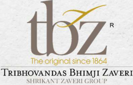

**[Image: 2ffd92d7-08a1-45e4-8092-7a330c8dd5c4.pdf-0002-02.png (272x174, 60.7KB)]**

<!-- Start of picture text -->
The or~inol since 1864 or~inol since 1864 1864 TRIBHOVANDAS BHIMJI  ZAVERi SI IRIK.\~T  1/.,\\ 'l•:HI  GHOl 'P <!-- End of picture text -->

**[Image: 2ffd92d7-08a1-45e4-8092-7a330c8dd5c4.pdf-0002-03.png (224x116, 32.3KB)]**

<!-- Start of picture text -->
Trusted Since 1864 <!-- End of picture text -->

**[Image: 2ffd92d7-08a1-45e4-8092-7a330c8dd5c4.pdf-0002-04.png (1650x333, 420.6KB)]**

<!-- Start of picture text -->
1864 TRIBHOVA  DAS  BHI~I Z Y  RI 111{]~\ l  /..\\  EHi  ROl  P INVESTOR PRESENTATION <!-- End of picture text -->

## INVESTOR PRESENTATION Q3 & 9M FY26 

**[Image: 2ffd92d7-08a1-45e4-8092-7a330c8dd5c4.pdf-0002-06.png (1650x207, 236.9KB)]**

<!-- Start of picture text -->
Q3 & 9M FY26 <!-- End of picture text -->

**[Image: 2ffd92d7-08a1-45e4-8092-7a330c8dd5c4.pdf-0002-07.png (1650x103, 117.5KB)]**

**[Image: 2ffd92d7-08a1-45e4-8092-7a330c8dd5c4.pdf-0003-01.png (189x111, 29.1KB)]**

<!-- Start of picture text -->
tbz· · IQral l  inc  1  '-"1 Th rnHOVAN DAS OVAN DAS AS  BHI MJ I  MJ I  I  ZAVERi Ri \IUU1..\.' I I  L\\UU(;JtOI I' I' <!-- End of picture text -->

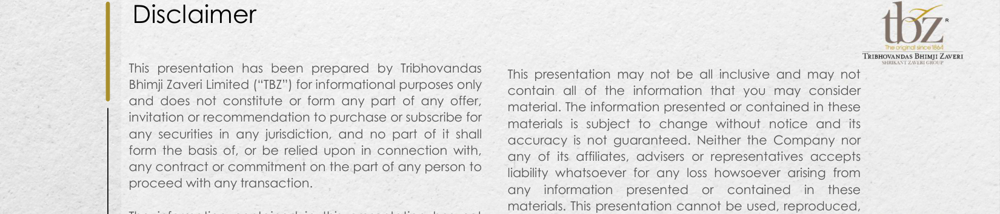

**[Image: 2ffd92d7-08a1-45e4-8092-7a330c8dd5c4.pdf-0003-02.png (1650x354, 485.0KB)]**

<!-- Start of picture text -->
Disclaimer tbz· · IQral l  inc  1  '-"1 Th rnHOVAN DAS OVAN DAS AS  BHI MJ I  MJ I  I  ZAVERi Ri This presentation has been prepared by Tribhovandas \IUU1..\.' I I  L\\UU(;JtOI I' I' This presentation may not be all inclusive and may not Bhimji Zaveri Limited (“TBZ”) for informational purposes only contain all of the information that you may consider and does not constitute or form any part of any offer, material. The information presented or contained in these invitation or recommendation to purchase or subscribe for materials is subject to change without notice and its any securities in any jurisdiction, and no part of it shall accuracy is not guaranteed. Neither the Company nor form the basis of, or be relied upon in connection with, any of its affiliates, advisers or representatives accepts any contract or commitment on the part of any person to liability whatsoever for any loss howsoever arising from proceed with any transaction. any information presented or contained in these materials. This presentation cannot be used, reproduced, <!-- End of picture text -->

This presentation may not be all inclusive and may not contain all of the information that you may consider material. The information presented or contained in these materials is subject to change without notice and its accuracy is not guaranteed. Neither the Company nor any of its affiliates, advisers or representatives accepts liability whatsoever for any loss howsoever arising from any information presented or contained in these materials. This presentation cannot be used, reproduced, copied, distributed, shared or disseminated in any manner. No person is authorized to give any information or to make any representation not contained in and not consistent with this presentation and, if given or made, such information or representation must not be relied upon as having been authorized by or on behalf of TBZ. 

The information contained in this presentation has not been independently verified. No representation or warranty, express or implied, is made and no reliance should be placed on the accuracy, fairness or completeness of the information presented or contained in these materials. 

**[Image: 2ffd92d7-08a1-45e4-8092-7a330c8dd5c4.pdf-0003-05.png (1650x207, 285.9KB)]**

<!-- Start of picture text -->
copied, distributed, shared or disseminated in any been independently verified. No representation or manner. No person is authorized to give any information warranty, express or implied, is made and no reliance or to make any representation not contained in and not should be placed on the accuracy, fairness or consistent with this presentation and, if given or made, completeness of the information presented or contained such information or representation must not be relied in these materials. upon as having been authorized by or on behalf of TBZ. Any forward-looking statements in this presentation are <!-- End of picture text -->

Any forward-looking statements in this presentation are subject to risks and uncertainties that could cause actual results to differ materially from those that may be inferred to being expressed in, or implied by, such statements. Such forward-looking statements are not indicative or guarantees of future performance. Any forward-looking statements, projections and industry data made by third parties included in this presentation are not adopted by the Company and the Company is not responsible for such third party statements and projections. 

**[Image: 2ffd92d7-08a1-45e4-8092-7a330c8dd5c4.pdf-0003-07.png (1650x207, 275.5KB)]**

<!-- Start of picture text -->
subject to risks and uncertainties that could cause actual results to differ materially from those that may be inferred to being expressed in, or implied by, such statements. Such forward-looking statements are not indicative or guarantees of future performance. Any forward-looking statements, projections and industry data made by third parties included in this presentation are not adopted by <!-- End of picture text -->

**[Image: 2ffd92d7-08a1-45e4-8092-7a330c8dd5c4.pdf-0003-08.png (51x51, 3.1KB)]**

<!-- Start of picture text -->
02 <!-- End of picture text -->

• 02 

**[Image: 2ffd92d7-08a1-45e4-8092-7a330c8dd5c4.pdf-0003-10.png (1650x103, 125.4KB)]**

<!-- Start of picture text -->
such third party statements and projections. • <!-- End of picture text -->

**[Image: 2ffd92d7-08a1-45e4-8092-7a330c8dd5c4.pdf-0004-00.png (1650x207, 246.5KB)]**

<!-- Start of picture text -->
tbz· IQral  inc  1  '-"1 Th rnHOVAN DAS  BHI MJ I  ZAVERi \IUU1..\.' I  L\\UU(;JtOI I' <!-- End of picture text -->

**[Image: 2ffd92d7-08a1-45e4-8092-7a330c8dd5c4.pdf-0004-01.png (151x151, 14.1KB)]**

<!-- Start of picture text -->
04 <!-- End of picture text -->

**[Image: 2ffd92d7-08a1-45e4-8092-7a330c8dd5c4.pdf-0004-02.png (1650x207, 237.0KB)]**

<!-- Start of picture text -->
Q3 & 9M FY26 Updates Page 04 <!-- End of picture text -->

**[Image: 2ffd92d7-08a1-45e4-8092-7a330c8dd5c4.pdf-0004-03.png (151x150, 13.4KB)]**

<!-- Start of picture text -->
12 <!-- End of picture text -->

**[Image: 2ffd92d7-08a1-45e4-8092-7a330c8dd5c4.pdf-0004-04.png (1650x207, 243.7KB)]**

<!-- Start of picture text -->
Page About Us 12 Business Model Page <!-- End of picture text -->

**[Image: 2ffd92d7-08a1-45e4-8092-7a330c8dd5c4.pdf-0004-05.png (151x151, 13.9KB)]**

<!-- Start of picture text -->
17 <!-- End of picture text -->

DISCUSSION 03 SUMMARY • 

**[Image: 2ffd92d7-08a1-45e4-8092-7a330c8dd5c4.pdf-0004-07.png (1650x207, 247.2KB)]**

<!-- Start of picture text -->
DISCUSSION <!-- End of picture text -->

**[Image: 2ffd92d7-08a1-45e4-8092-7a330c8dd5c4.pdf-0004-08.png (1650x103, 121.7KB)]**

<!-- Start of picture text -->
• <!-- End of picture text -->

• 04 

**[Image: 2ffd92d7-08a1-45e4-8092-7a330c8dd5c4.pdf-0005-02.png (1650x230, 272.0KB)]**

<!-- Start of picture text -->
tbz· r  IQral  inc  1  '-"1 Th rnHOVAN DAS  BHI MJ I  ZAVERi \IUU1..\.' I  L\\UU(;JtOI I' <!-- End of picture text -->

**[Image: 2ffd92d7-08a1-45e4-8092-7a330c8dd5c4.pdf-0005-03.png (51x51, 3.1KB)]**

<!-- Start of picture text -->
04 <!-- End of picture text -->

**[Image: 2ffd92d7-08a1-45e4-8092-7a330c8dd5c4.pdf-0005-05.png (649x673, 744.0KB)]**

**[Image: 2ffd92d7-08a1-45e4-8092-7a330c8dd5c4.pdf-0005-06.png (208x132, 23.0KB)]**

<!-- Start of picture text -->
Page 04-11 <!-- End of picture text -->

**[Image: 2ffd92d7-08a1-45e4-8092-7a330c8dd5c4.pdf-0006-00.png (1650x230, 279.9KB)]**

<!-- Start of picture text -->
Q3 FY26 - tbz· Result Highlights ( ₹  In Mn) Th rnHOVAN DAS r  IQral BHIinc  MJ1  I '-"1 ZAVERi \IUU1..\.' I  L\\UU(;JtOI I' <!-- End of picture text -->

**[Image: 2ffd92d7-08a1-45e4-8092-7a330c8dd5c4.pdf-0006-01.png (220x26, 7.6KB)]**

<!-- Start of picture text -->
12.47% 17.48% 0 <!-- End of picture text -->

**[Image: 2ffd92d7-08a1-45e4-8092-7a330c8dd5c4.pdf-0006-02.png (171x10, 3.8KB)]**

**[Image: 2ffd92d7-08a1-45e4-8092-7a330c8dd5c4.pdf-0006-03.png (12x12, 0.4KB)]**

**[Image: 2ffd92d7-08a1-45e4-8092-7a330c8dd5c4.pdf-0006-04.png (203x30, 7.9KB)]**

<!-- Start of picture text -->
6.52% 12.44% 0 <!-- End of picture text -->

**[Image: 2ffd92d7-08a1-45e4-8092-7a330c8dd5c4.pdf-0006-05.png (171x11, 4.1KB)]**

**[Image: 2ffd92d7-08a1-45e4-8092-7a330c8dd5c4.pdf-0006-06.png (12x12, 0.4KB)]**

**[Image: 2ffd92d7-08a1-45e4-8092-7a330c8dd5c4.pdf-0006-07.png (13x13, 0.5KB)]**

**[Image: 2ffd92d7-08a1-45e4-8092-7a330c8dd5c4.pdf-0006-08.png (179x20, 6.1KB)]**

**[Image: 2ffd92d7-08a1-45e4-8092-7a330c8dd5c4.pdf-0006-09.png (13x13, 0.5KB)]**

**[Image: 2ffd92d7-08a1-45e4-8092-7a330c8dd5c4.pdf-0006-10.png (1650x266, 307.7KB)]**

<!-- Start of picture text -->
10,614  1,321 9,279  818 605 305 I  ■  I Q3 FY25 Q3 FY26 Q3 FY25 Q3 FY26 Q3 FY25 Q3 FY26 ■ Revenue -0 - Gross Margin ■ EBITDA -0 - EBITDA Margin ■  PAT -0 - PAT Margin <!-- End of picture text -->

**[Image: 2ffd92d7-08a1-45e4-8092-7a330c8dd5c4.pdf-0006-11.png (1650x207, 217.4KB)]**

<!-- Start of picture text -->
Expenses as a % of Total Revenue 2.14% 1.46% 1.44% 2.52% 1.92% 1.51% Q3 FY26 Q3 FY25 <!-- End of picture text -->

**[Image: 2ffd92d7-08a1-45e4-8092-7a330c8dd5c4.pdf-0006-12.png (51x51, 3.1KB)]**

<!-- Start of picture text -->
05 <!-- End of picture text -->

**[Image: 2ffd92d7-08a1-45e4-8092-7a330c8dd5c4.pdf-0006-13.png (1650x103, 121.8KB)]**

<!-- Start of picture text -->
■ Manpower ■ Advertisement ■ Other Overheads • <!-- End of picture text -->

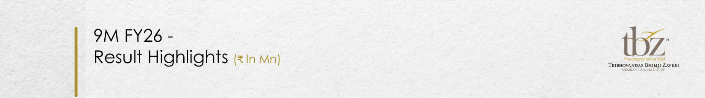

**[Image: 2ffd92d7-08a1-45e4-8092-7a330c8dd5c4.pdf-0007-00.png (1650x230, 279.9KB)]**

<!-- Start of picture text -->
9M FY26 - tbz· Result Highlights ( ₹  In Mn) Th rnHOVAN DAS r  IQral BHIinc  MJ1  I '-"1 ZAVERi \IUU1..\.' I  L\\UU(;JtOI I' <!-- End of picture text -->

**[Image: 2ffd92d7-08a1-45e4-8092-7a330c8dd5c4.pdf-0007-01.png (220x27, 7.8KB)]**

<!-- Start of picture text -->
13.35% 16.96% <!-- End of picture text -->

**[Image: 2ffd92d7-08a1-45e4-8092-7a330c8dd5c4.pdf-0007-02.png (12x13, 0.5KB)]**

**[Image: 2ffd92d7-08a1-45e4-8092-7a330c8dd5c4.pdf-0007-03.png (203x32, 8.2KB)]**

<!-- Start of picture text -->
6.67% 10.39% <!-- End of picture text -->

**[Image: 2ffd92d7-08a1-45e4-8092-7a330c8dd5c4.pdf-0007-04.png (12x12, 0.5KB)]**

**[Image: 2ffd92d7-08a1-45e4-8092-7a330c8dd5c4.pdf-0007-05.png (171x9, 3.4KB)]**

**[Image: 2ffd92d7-08a1-45e4-8092-7a330c8dd5c4.pdf-0007-06.png (13x13, 0.5KB)]**

**[Image: 2ffd92d7-08a1-45e4-8092-7a330c8dd5c4.pdf-0007-07.png (179x13, 4.8KB)]**

**[Image: 2ffd92d7-08a1-45e4-8092-7a330c8dd5c4.pdf-0007-08.png (13x12, 0.5KB)]**

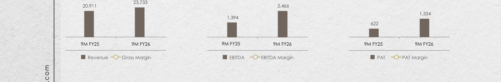

**[Image: 2ffd92d7-08a1-45e4-8092-7a330c8dd5c4.pdf-0007-09.png (1650x273, 316.1KB)]**

<!-- Start of picture text -->
23,733 20,911  2,466 1,334 1,394 622 ■  I 9M FY25 9M FY26 9M FY25 9M FY26 9M FY25 9M FY26 ■ Revenue -0 - Gross Margin ■ EBITDA -0 - EBITDA Margin ■  PAT -0 - PAT Margin <!-- End of picture text -->

**[Image: 2ffd92d7-08a1-45e4-8092-7a330c8dd5c4.pdf-0007-10.png (1650x207, 216.5KB)]**

<!-- Start of picture text -->
Expenses as a % of Total Revenue 2.95% 1.87% 1.74% 3.24% 1.86% 1.59% 9M FY26 9M FY25 <!-- End of picture text -->

**[Image: 2ffd92d7-08a1-45e4-8092-7a330c8dd5c4.pdf-0007-11.png (51x51, 3.1KB)]**

<!-- Start of picture text -->
06 <!-- End of picture text -->

**[Image: 2ffd92d7-08a1-45e4-8092-7a330c8dd5c4.pdf-0007-12.png (1650x103, 121.9KB)]**

<!-- Start of picture text -->
■ Manpower ■ Advertisement ■ Other Overheads • <!-- End of picture text -->

### Q3 & 9M FY26Key Takeaways 

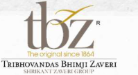

**[Image: 2ffd92d7-08a1-45e4-8092-7a330c8dd5c4.pdf-0008-01.png (199x109, 22.9KB)]**

<!-- Start of picture text -->
tbz'1¥tc  1Qlf1  JI  K'tl:·a 16611 " ThlBHOVANDAS BH1M 1 1 ZAVERi '\Hklll.\'\!  /_\\lklf;~Ol  I' <!-- End of picture text -->

- The Company’s revenue from operations increased by 14.40% YoY in Q3 FY26, reaching 

- ₹ 10,614.23 million. For 9M FY26, revenue stood at ₹ 23,732.57 million, reflecting a 13.49% growth compared to the same period last year. 

- Gross profit improved significantly by 60.30% YoY in Q3 FY26, supported by stronger execution and better realisation trends. 

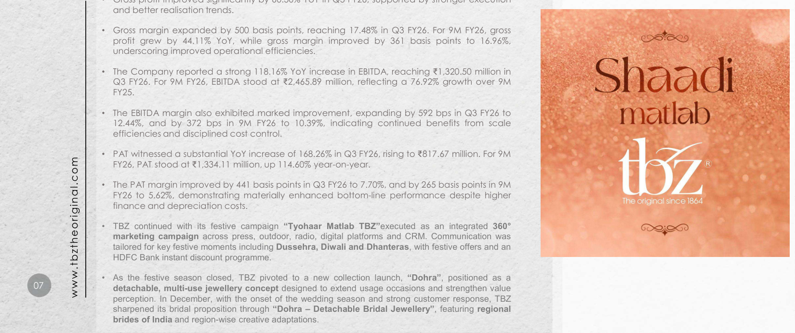

**[Image: 2ffd92d7-08a1-45e4-8092-7a330c8dd5c4.pdf-0008-04.png (1650x692, 1313.6KB)]**

<!-- Start of picture text -->
and better realisation trends. • Gross margin expanded by 500 basis points, reaching 17.48% in Q3 FY26. For 9M FY26, gross profit grew by 44.11% YoY, while gross margin improved by 361 basis points to 16.96%, underscoring improved operational efficiencies. • The Company reported a strong 118.16% YoY increase in EBITDA, reaching ₹ 1,320.50 million in Q3 FY26. For 9M FY26, EBITDA stood at ₹ 2,465.89 million, reflecting a 76.92% growth over 9M ·  haa. FY25. • The EBITDA margin also exhibited marked improvement, expanding by 592 bps in Q3 FY26 to 12.44%, and by 372 bps in 9M FY26 to 10.39%, indicating continued benefits from scale matlab efficiencies and disciplined cost control. • PAT witnessed a substantial YoY increase of 168.26% in Q3 FY26, rising to  ₹ 817.67 million. For 9M FY26, PAT stood at  ₹ 1,334.11 million, up 114.60% year-on-year. • The PAT margin improved by 441 basis points in Q3 FY26 to 7.70%, and by 265 basis points in 9M FY26 to 5.62%, demonstrating materially enhanced bottom-line performance despite higher finance and depreciation costs. • TBZ continued with its festive campaign “Tyohaar Matlab TBZ” executed as an integrated 360° marketing campaign across press, outdoor, radio, digital platforms and CRM. Communication was tailored for key festive moments including  Dussehra, Diwali and Dhanteras , with festive offers and an HDFC Bank instant discount programme. • As the festive season closed, TBZ pivoted to a new collection launch, “Dohra” , positioned as a 07 detachable, multi-use jewellery concept designed to extend usage occasions and strengthen value perception. In December, with the onset of the wedding season and strong customer response, TBZ •  sharpened its bridal proposition through “Dohra – Detachable Bridal Jewellery” , featuring regional brides of India  and region-wise creative adaptations. www.tbztheoriginal.com <!-- End of picture text -->

• 08 

### Q3 & 9M FY26Standalone Profit & Loss Statement 

**[Image: 2ffd92d7-08a1-45e4-8092-7a330c8dd5c4.pdf-0009-03.png (189x111, 29.1KB)]**

<!-- Start of picture text -->
tbz· IQral  inc  1  '-"1 Th rnHOVAN DAS  BHI MJ I  ZAVERi \IUU1..\.' I  L\\UU(;JtOI I' <!-- End of picture text -->

( ₹ In Mn) 

**[Image: 2ffd92d7-08a1-45e4-8092-7a330c8dd5c4.pdf-0009-05.png (51x51, 3.1KB)]**

<!-- Start of picture text -->
08 <!-- End of picture text -->

|**Particulars**|**Q3FY26**|**Q3FY25**|**YoY%**|**9MFY26**|**9MFY25**|**YoY%**|
|---|---|---|---|---|---|---|
|**Revenue From Operation**|**10,614.23**|**9,278.50**|**14.40%**|**23,732.57**|**20,911.41**|**13.49%**|
|COGS|8,759.28|8,121.31|7.86%|19,708.67|18,119.09|8.77%|
|**Gross Profit**|**1,854.95**|**1,157.20**|**60.30%**|**4,023.90**|**2,792.32**|**44.11%**|
|**Gross Margin %**|**17.48%**|**12.47%**|**500 bps**|**16.96%**|**13.35%**|**361 bps**|
|Employee Expenses|226.94|233.52|-2.82%|700.64|677.05|3.48%|
|Other Expenses|307.51|318.37|-3.41%|857.37|721.49|18.83%|
|**EBIDTA**|**1,320.50**|**605.30**|**118.16%**|**2,465.89**|**1,393.77**|**76.92%**|
|**EBIDTA Margin %**|**12.44%**|**6.52%**|**592 bps**|**10.39%**|**6.67%**|**372 bps**|
|Finance Cost|184.91|132.13|39.94%|526.53|391.26|34.57%|
|Depreciation|61.27|60.78|0.80%|210.52|182.59|15.30%|
|Other Income|21.99|9.41|133.68%|60.34|34.60|74.40%|
|**Profit Before Tax**|**1,096.31**|**421.79**|**159.92%**|**1,789.18**|**854.53**|**109.38%**|
|Taxes|278.64|116.99|138.18%|455.07|232.84|95.44%|
|**Profit after Tax**|**817.67**|**304.80**|**168.26%**|**1,334.11**|**621.69**|**114.60%**|
|**PAT Margin %**|**7.70%**|**3.29%**|**441 bps**|**5.62%**|**2.97%**|**265 bps**|

**[Image: 2ffd92d7-08a1-45e4-8092-7a330c8dd5c4.pdf-0009-07.png (1308x41, 35.5KB)]**

<!-- Start of picture text -->
Revenue From Operation 10,614.23  9,278.50  14.40% 23,732.57  20,911.41  13.49% <!-- End of picture text -->

**[Image: 2ffd92d7-08a1-45e4-8092-7a330c8dd5c4.pdf-0009-08.png (1308x41, 23.8KB)]**

<!-- Start of picture text -->
Gross Profit 1,854.95  1,157.20  60.30% 4,023.90  2,792.32  44.11% <!-- End of picture text -->

**[Image: 2ffd92d7-08a1-45e4-8092-7a330c8dd5c4.pdf-0009-09.png (1308x41, 24.4KB)]**

<!-- Start of picture text -->
Employee Expenses 226.94  233.52  -2.82% 700.64  677.05  3.48% <!-- End of picture text -->

**[Image: 2ffd92d7-08a1-45e4-8092-7a330c8dd5c4.pdf-0009-10.png (1308x42, 25.4KB)]**

<!-- Start of picture text -->
EBIDTA 1,320.50  605.30  118.16% 2,465.89  1,393.77  76.92% <!-- End of picture text -->

**[Image: 2ffd92d7-08a1-45e4-8092-7a330c8dd5c4.pdf-0009-11.png (1308x41, 24.5KB)]**

<!-- Start of picture text -->
Finance Cost 184.91  132.13  39.94% 526.53  391.26  34.57% <!-- End of picture text -->

**[Image: 2ffd92d7-08a1-45e4-8092-7a330c8dd5c4.pdf-0009-12.png (1308x42, 26.1KB)]**

<!-- Start of picture text -->
Other Income 21.99  9.41  133.68% 60.34  34.60  74.40% <!-- End of picture text -->

**[Image: 2ffd92d7-08a1-45e4-8092-7a330c8dd5c4.pdf-0009-13.png (1308x41, 25.6KB)]**

<!-- Start of picture text -->
Taxes 278.64  116.99  138.18% 455.07  232.84  95.44% <!-- End of picture text -->

**[Image: 2ffd92d7-08a1-45e4-8092-7a330c8dd5c4.pdf-0009-14.png (1311x42, 27.0KB)]**

<!-- Start of picture text -->
PAT Margin % 7.70% 3.29% 441 bps 5.62% 2.97% 265 bps <!-- End of picture text -->

• 09 

**[Image: 2ffd92d7-08a1-45e4-8092-7a330c8dd5c4.pdf-0010-02.png (51x51, 3.1KB)]**

<!-- Start of picture text -->
09 <!-- End of picture text -->

Our newly opened stores in Ahmedabad & Hyderabad (opened in April 2025) 

**[Image: 2ffd92d7-08a1-45e4-8092-7a330c8dd5c4.pdf-0010-04.png (189x111, 29.1KB)]**

<!-- Start of picture text -->
tbz· r  IQral  inc  1  '-"1 Th rnHOVAN DAS  BHI MJ I  ZAVERi \IUU1..\.' I  L\\UU(;JtOI I' <!-- End of picture text -->

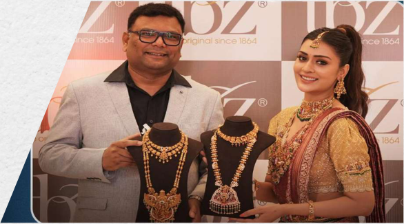

**[Image: 2ffd92d7-08a1-45e4-8092-7a330c8dd5c4.pdf-0010-05.png (586x326, 372.6KB)]**

**[Image: 2ffd92d7-08a1-45e4-8092-7a330c8dd5c4.pdf-0010-06.png (490x315, 404.6KB)]**

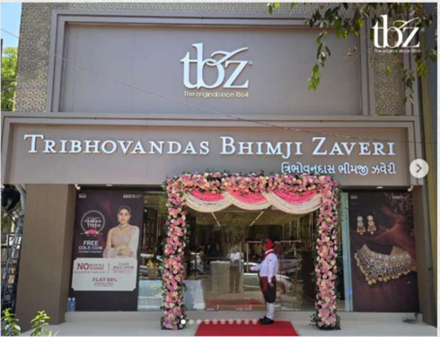

**[Image: 2ffd92d7-08a1-45e4-8092-7a330c8dd5c4.pdf-0010-07.png (490x376, 352.3KB)]**

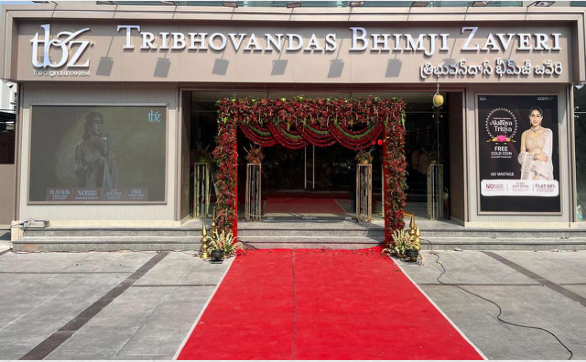

**[Image: 2ffd92d7-08a1-45e4-8092-7a330c8dd5c4.pdf-0010-08.png (586x362, 416.0KB)]**

• 10 

**[Image: 2ffd92d7-08a1-45e4-8092-7a330c8dd5c4.pdf-0011-02.png (51x51, 3.0KB)]**

<!-- Start of picture text -->
10 <!-- End of picture text -->

Marketing Initiatives During Q3 & 9MFY26 Multi-Channel Marketing & New Product Stories Driving Growth 

###### **Customer Traffic & CRM Outcomes** 

- Delivered **57K+ customer walk-ins in Q3 FY26** ; **1.63 lakh+ walk-ins in 9M FY26 (Apr–Dec’25)** , supported by an integrated store and digital activation calendar. 

- Customer composition remained healthy across the funnel: **40-45% new acquisitions** , **45-50% active customer base** , and **10-15% reactivated lapsed customers** , enabled through targeted **CRM (WhatsApp/SMS)** and coordinated **digital, press, exhibitions, BTL and promotional schemes** . 

###### **Campaign Strategy (Aligned to Purchase Seasons)** 

- **October (Festive):** Sustained festive demand capture through **“Tyohaar Matlab TBZ”** with **Sara Ali Khan** , executed as a full-funnel programme across **mass media + digital + CRM + creators + YouTube** , supported by festive offers and **HDFC Bank instant discount** . 

- **November (Collection Launch):** Introduced **“Dohra”** (detachable jewellery), strengthening **product-led differentiation** and storytelling on **versatility and innovation** . 

- **December (Bridal Season):** Repositioned to **“Dohra – Detachable Bridal Jewellery”** with the **Regional Brides of India** theme to improve relevance during peak bridal buying. 

###### **Digital & Social Performance (Oct–Dec)** 

- Reached **5.4 Mn+** audiences on social platforms during the quarter. 

- Instagram community expanded to **165K+** followers. 

- Engagement was strongest in December at **9,00,000+ interactions** ; **video views exceeded 13 Mn+** , supported by creator-led distribution. 

- Audience profile remained aligned with the core consumer being **~70% women** , concentrated in **25– 34** years (followed by **35–44** ). 

- Amplified storytelling through rich content video, video views hit 13 mln mark, led by influencer activation. 

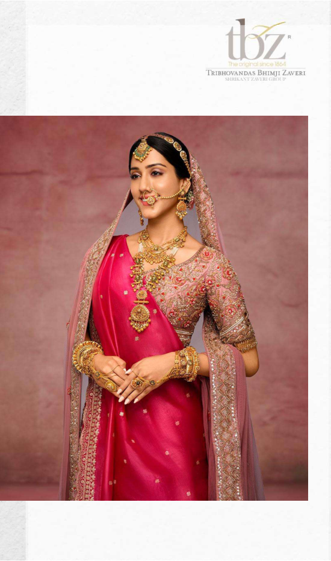

**[Image: 2ffd92d7-08a1-45e4-8092-7a330c8dd5c4.pdf-0011-17.png (550x931, 630.9KB)]**

<!-- Start of picture text -->
TRIBHOVANDAS BHIMJJ  ZAVERi <!-- End of picture text -->

**[Image: 2ffd92d7-08a1-45e4-8092-7a330c8dd5c4.pdf-0012-00.png (1650x231, 245.0KB)]**

<!-- Start of picture text -->
Marketing Initiatives  tnz TI).,,,,-iglt"'Olsinc  116'1  · T'RIBHOVAN DAS  BH IMJ I ZAV ERi contd. \l!Rlll.\'\l  /\\IHlC.\lOI,\' During the Quarter <!-- End of picture text -->

• 11 

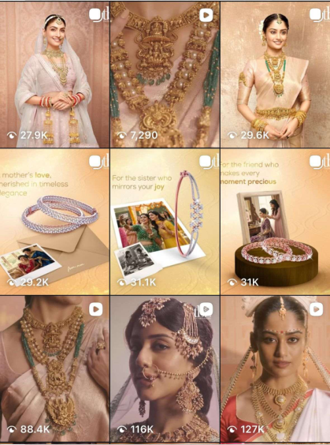

**[Image: 2ffd92d7-08a1-45e4-8092-7a330c8dd5c4.pdf-0012-02.png (419x564, 548.3KB)]**

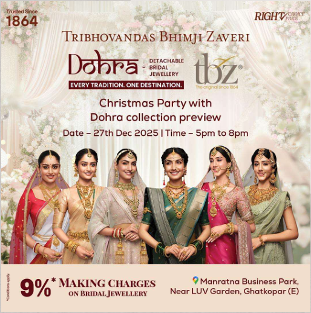

**[Image: 2ffd92d7-08a1-45e4-8092-7a330c8dd5c4.pdf-0012-03.png (514x516, 567.7KB)]**

<!-- Start of picture text -->
1864  1·  ..  ·ec1s;nce  RIGH'Wiiili~" TRIBHOVANDAS BHIMJ I DAVERI Do'nra . "'-- DETBRIDAL ACHA BLE I JEWELLER Y EVERY TRADITION ONE DESTINATION Christmas Party with Dohra collection preview i  9'¾  *  MAKING  C HARGES  ?  Manratna Business  Par k, t  Q  ON BRIDALJ EWELLERY  Near LUV Garden, Ghatkopar (E) <!-- End of picture text -->

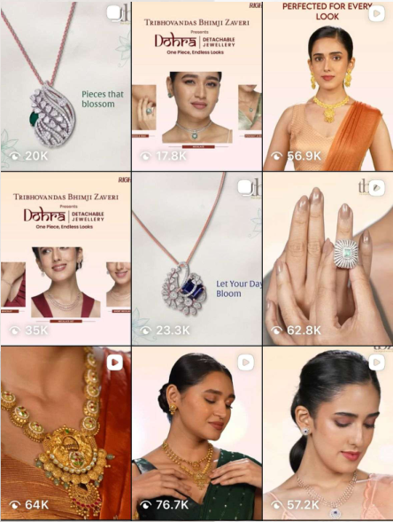

**[Image: 2ffd92d7-08a1-45e4-8092-7a330c8dd5c4.pdf-0012-04.png (444x589, 435.3KB)]**

<!-- Start of picture text -->
""  PERFECTED LOOFOR K  EVERY l'R IBHOVANDAS BH IMJ I ZAVERi ~ J!:=~~~ TRlBHOW,NDAS 8HtMJI  ZAVERi ~ 1~:;~! <!-- End of picture text -->

**[Image: 2ffd92d7-08a1-45e4-8092-7a330c8dd5c4.pdf-0013-00.png (1650x332, 403.9KB)]**

<!-- Start of picture text -->
tbz· r  IQral  inc  1  '-"1 Th rnHOVAN DAS  BHI MJ I  ZAVERi \IUU1..\.' I  L\\UU(;JtOI I' ABOUT US <!-- End of picture text -->

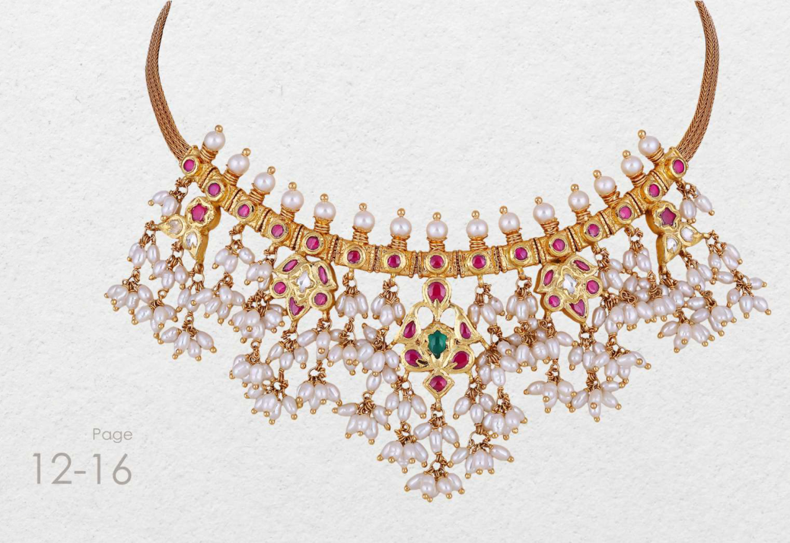

**[Image: 2ffd92d7-08a1-45e4-8092-7a330c8dd5c4.pdf-0013-01.png (1038x715, 1021.5KB)]**

<!-- Start of picture text -->
.. Page 12-16 <!-- End of picture text -->

**[Image: 2ffd92d7-08a1-45e4-8092-7a330c8dd5c4.pdf-0013-03.png (51x51, 3.0KB)]**

<!-- Start of picture text -->
12 <!-- End of picture text -->

• 12 

**[Image: 2ffd92d7-08a1-45e4-8092-7a330c8dd5c4.pdf-0014-00.png (189x111, 29.1KB)]**

<!-- Start of picture text -->
tbz· · IQral l  inc  1  '-"1 Th rnHOVAN DAS BHI MJ I OVAN DAS BHI MJ I BHI MJ I  MJ I  I  ZAVERi Ri \IUU1..\.' I I  L\\UU(;JtOI I' I' <!-- End of picture text -->

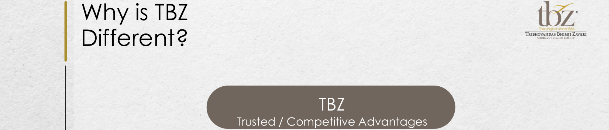

**[Image: 2ffd92d7-08a1-45e4-8092-7a330c8dd5c4.pdf-0014-01.png (1650x354, 379.2KB)]**

<!-- Start of picture text -->
Why is TBZ  tbz· · IQral l  inc  1  '-"1 Th rnHOVAN DAS BHI MJ I OVAN DAS BHI MJ I BHI MJ I  MJ I  I  ZAVERi Ri \IUU1..\.' I I  L\\UU(;JtOI I' I' Different? TBZ Trusted / Competitive Advantages <!-- End of picture text -->

|www.tbztheoriginal.com 13 •|Pedigree • 160 years in jewellery business • First jewelers to offer buyback guarantee in 1938 • Professional organization spearheaded by 5th generation of the family |160 years of Strong Brand Value • Healthy sales productivity • High footfalls conversion • Multigenerational clientele Leader in Specialty Wedding & Occasion Jewellery • Leader of jewellery in Indian market • ~ 65% of sales are wedding & occasion related purchases • Compulsion buying • Stable fixed budget purchases by customers Design Exclusivity • 8 - 10 new jewellery lines/year • In-house diamond jewellery production • Customer loyalty • Premium pricing TBZ Trusted / Competitive Advantages 0 0|Scalability & Reach • 37 stores (1,00,000+ ft.) • Presence – 27 cities, 13 states • New store opened in Pink City- Jaipur in Q1FY25, and Bhubaneshwar & Rourkela stores opening in H1FY25. • 2 new stores added in April 2025, Ahmedabad & Hyderabad, making 37 stores at present.|
|---|---|---|---|

**[Image: 2ffd92d7-08a1-45e4-8092-7a330c8dd5c4.pdf-0014-03.png (1650x207, 266.4KB)]**

<!-- Start of picture text -->
Leader in Scalability & Specialty Pedigree Reach 0  160 years of  Wedding &  Design Strong  Occasion  Exclusivity • 37 stores (1,00,000+ ft.) • 160 years in jewellery Brand Value Jewellery • <!-- End of picture text -->

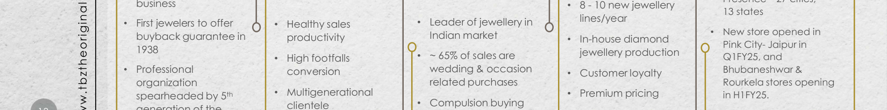

**[Image: 2ffd92d7-08a1-45e4-8092-7a330c8dd5c4.pdf-0014-04.png (1650x207, 291.3KB)]**

<!-- Start of picture text -->
business • 8 - 10 new jewellery 13 states • First jewelers to offer 0  • Healthy sales  • Leader of jewellery in  lines/year • buyback guarantee in  productivity Indian market  • In-house diamond  New store opened in Pink City- Jaipur in 1938 • High footfalls  • ~ 65% of sales are  jewellery production Q1FY25, and • Professional conversion wedding & occasion  • Customer loyalty Bhubaneshwar & organization related purchases Rourkela stores opening spearheaded by 5 th • Multigenerational clientele  • Compulsion buying • Premium pricing in H1FY25. <!-- End of picture text -->

**[Image: 2ffd92d7-08a1-45e4-8092-7a330c8dd5c4.pdf-0014-05.png (1650x103, 136.3KB)]**

<!-- Start of picture text -->
• 2 new stores added in • family Stable fixed budget April 2025, Ahmedabad •  purchases by  & Hyderabad, making customers 37 stores at present. <!-- End of picture text -->

• 14 

### Distinctive Competitive Advantage: Multigenerational Clientele 

**[Image: 2ffd92d7-08a1-45e4-8092-7a330c8dd5c4.pdf-0015-03.png (189x111, 29.1KB)]**

<!-- Start of picture text -->
tbz· r  IQral  inc  1  '-"1 Th rnHOVAN DAS  BHI MJ I  ZAVERi \IUU1..\.' I  L\\UU(;JtOI I' <!-- End of picture text -->

#### Enhanced Brand Awareness: 

Deepened Customer Relationships: 

#### Generational Clientele Strength: 

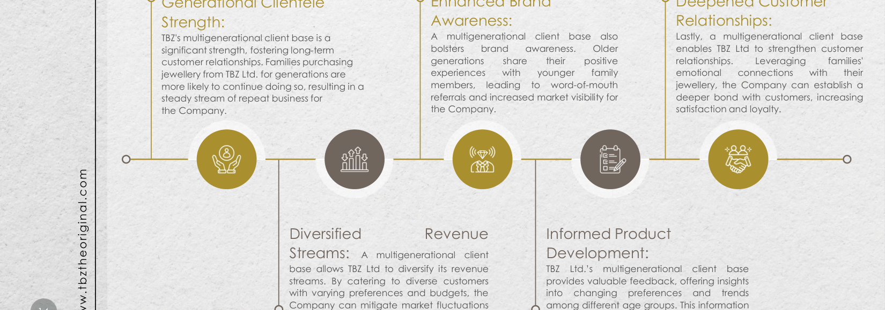

**[Image: 2ffd92d7-08a1-45e4-8092-7a330c8dd5c4.pdf-0015-07.png (1650x580, 769.6KB)]**

<!-- Start of picture text -->
Strength:  Awareness:  Relationships: TBZ's multigenerational client base is a  A multigenerational client base also Lastly, a multigenerational client base significant strength, fostering long-term  bolsters brand awareness. Older enables TBZ Ltd to strengthen customer customer relationships. Families purchasing  generations share their positive relationships. Leveraging families' jewellery from TBZ Ltd. for generations are  experiences with younger family emotional connections with their more likely to continue doing so, resulting in a  members, leading to word-of-mouth jewellery, the Company can establish a steady stream of repeat business for  referrals and increased market visibility for deeper bond with customers, increasing the Company. the Company. satisfaction and loyalty. z z z zz z zz z z Diversified Revenue Informed Product Streams: A multigenerational client Development: base allows TBZ Ltd to diversify its revenue TBZ Ltd.’s multigenerational client base streams. By catering to diverse customers provides valuable feedback, offering insights with varying preferences and budgets, the into changing preferences and trends Company can mitigate market fluctuations among different age groups. This information www.tbztheoriginal.com <!-- End of picture text -->

TBZ Ltd.’s multigenerational client base provides valuable feedback, offering insights into changing preferences and trends among different age groups. This information enables the Company to refine its product development and marketing strategies. 

**[Image: 2ffd92d7-08a1-45e4-8092-7a330c8dd5c4.pdf-0015-09.png (51x51, 2.9KB)]**

<!-- Start of picture text -->
14 <!-- End of picture text -->

**[Image: 2ffd92d7-08a1-45e4-8092-7a330c8dd5c4.pdf-0015-10.png (1650x103, 128.0KB)]**

<!-- Start of picture text -->
and maintain a stable revenue stream. enables the Company to refine its product development and marketing strategies. • <!-- End of picture text -->

• 15 

# Key Milestones 

**[Image: 2ffd92d7-08a1-45e4-8092-7a330c8dd5c4.pdf-0016-02.png (189x111, 29.1KB)]**

<!-- Start of picture text -->
tbz· · r  IQral  inc  1  '-"1 Th rnHOVAN DAS BHI MJ I OVAN DAS BHI MJ I BHI MJ I  MJ I  I  ZAVERi Ri \IUU1..\.' I I  L\\UU(;JtOI I' I' <!-- End of picture text -->

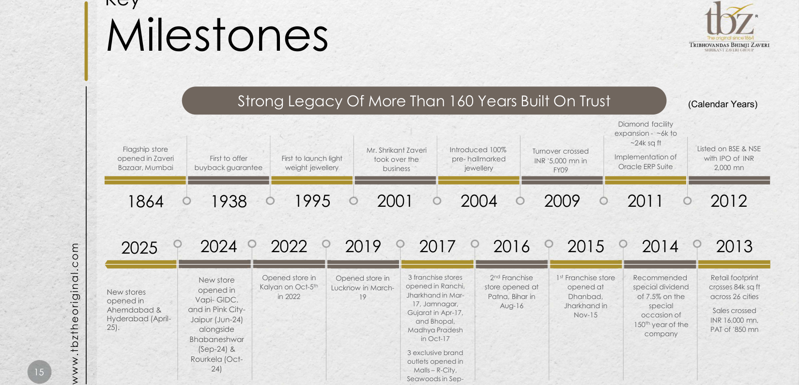

**[Image: 2ffd92d7-08a1-45e4-8092-7a330c8dd5c4.pdf-0016-03.png (1650x797, 993.7KB)]**

<!-- Start of picture text -->
tbz· · r  IQral  inc  1  '-"1 Th rnHOVAN DAS BHI MJ I OVAN DAS BHI MJ I BHI MJ I  MJ I  I  ZAVERi Ri Milestones \IUU1..\.' I I  L\\UU(;JtOI I' I' Strong Legacy Of More Than 160 Years Built On Trust (Calendar Years) Diamond facility expansion - ~6k to ~24k sq ft Flagship store  Mr. Shrikant Zaveri  Introduced 100%  Turnover crossed  Listed on BSE & NSE opened in Zaveri  First to offer First to launch light took over the pre- hallmarked INR  ` 5,000 mn in  Implementation of  with IPO of INR Bazaar, Mumbai buyback guarantee weight jewellery business I  jewellery FY09 Oracle ERP Suite 2,000 mn r======o= =====r============o 1864 1938 1995 2001 2004 2009 2011 2012 2025 0  2024 0  2022 0  2019 0  2017 0  2016 0  2015 0  2014 0  2013 New store  Opened store in  Opened store in  3 franchise stores  2 nd Franchise  1 st Franchise store  Recommended  Retail footprint Kalyan on Oct-5 th Lucknow in March- opened in Ranchi,  store opened at  opened at  special dividend  crosses 84k sq ft New stores opened in Ahemdabad & opened in Ahemdabad & Ahemdabad &  and in Pink City-Vapi- GIDC. opened in  in 2022 19 Jharkhand in Mar-Gujarat in Apr-17, 17, Jamnagar, Gujarat in Apr-17, 17, Jamnagar, 17, Jamnagar,  Patna, Bihar in Aug-16Aug-16 Jharkhand in Dhanbad, Nov-15Dhanbad, Nov-15Nov-15 of 7.5% on the occasion of special occasion of special special  across 26 citiesSales crossed Sales crossed Hyderabad (April-25).25). Jaipur (Jun-24) alongside alongside  Madhya Pradesh and Bhopal,  150 th year of the  PAT of INR 16,000 mn, 850 mn ` 850 mn company Bhabaneshwar in Oct-17 (Sep-24) &  3 exclusive brand Rourkela (Oct- outlets opened in 15 24) Malls – R-City, www.tbztheoriginal.com Seawoods in Sep- <!-- End of picture text -->

(Calendar Years) Diamond facility expansion - ~6k to ~24k sq ft Flagship store Mr. Shrikant Zaveri Introduced 100% Turnover crossed Listed on BSE & NSE opened in Zaveri First to offer First to launch light took over the pre- hallmarked INR ` 5,000 mn in Implementation of with IPO of INR Bazaar, Mumbai buyback guarantee weight jewellery business I jewellery FY09 Oracle ERP Suite 2,000 mn **<mark>r======o= =====r============o</mark>** 1864 1938 1995 2001 2004 2009 2011 2012 2025 0 2024 0 2022 0 2019 0 2017 0 2016 0 2015 0 2014 0 2013 New store Opened store in Opened store in 3 franchise stores 2nd Franchise 1st Franchise store Recommended Retail footprint Kalyan on Oct-5th Lucknow in Marchopened in Ranchi, store opened at opened at special dividend crosses 84k sq ft opened in in 2022 19 Vapi- GIDC. opened in New stores opened in Ahemdabad & opened in Ahemdabad & Ahemdabad & and in Pink City-Vapi- GIDC. opened in Jharkhand in Mar-Gujarat in Apr-17, 17, Jamnagar, Gujarat in Apr-17, 17, Jamnagar, 17, Jamnagar, Patna, Bihar in Aug-16Aug-16 Jharkhand in Dhanbad, Nov-15Dhanbad, Nov-15Nov-15 of 7.5% on the occasion of special occasion of special special across 26 citiesSales crossed Sales crossed and Bhopal, 150th year of the INR 16,000 mn, ` Hyderabad (April-25).25). Jaipur (Jun-24) alongside alongside Madhya Pradesh and Bhopal, PAT of INR 16,000 mn, 850 mn company Bhabaneshwar in Oct-17 (Sep-24) & 3 exclusive brand Rourkela (Octoutlets opened in 24) Malls – R-City, Seawoods in Sep17 and High Street Phoenix – in Mumbai in Nov-17 

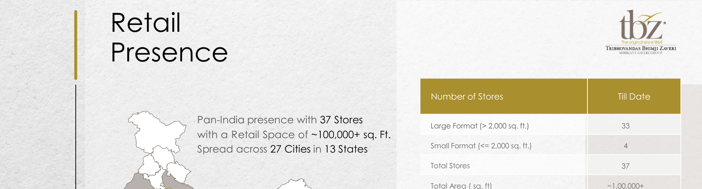

**[Image: 2ffd92d7-08a1-45e4-8092-7a330c8dd5c4.pdf-0017-00.png (1650x446, 452.2KB)]**

<!-- Start of picture text -->
Retail  · t}jz f  ong ral  nca 186'1 T'RIBHOVANDAS  8HIMJI ZAVERi .',,IUIHL\.'L  L\\Ull(;Jt()l,J• Presence Number of Stores Till Date Pan-India presence with 37 Stores Large Format (> 2,000 sq. ft.) 33 with a Retail Space of ~100,000+ sq. Ft. Spread across 27 Cities in 13 States Small Format (<= 2,000 sq. ft.) 4 Total Stores 37 Total Area ( sq. ft) ~1,00,000+ <!-- End of picture text -->

**[Image: 2ffd92d7-08a1-45e4-8092-7a330c8dd5c4.pdf-0017-01.png (1650x207, 350.2KB)]**

<!-- Start of picture text -->
Total Stores 37 Noida Total Area ( sq. ft) ~1,00,000+ Jaipur Lucknow Udaipur Patna GandhidhamAhmedabad-2Ahmedabad-2 Dhanbad Rajkot VadodaraIndore JamshedpurRanchi Kolkata -2 Bhavnagar Surat Raipur Rourkela <!-- End of picture text -->

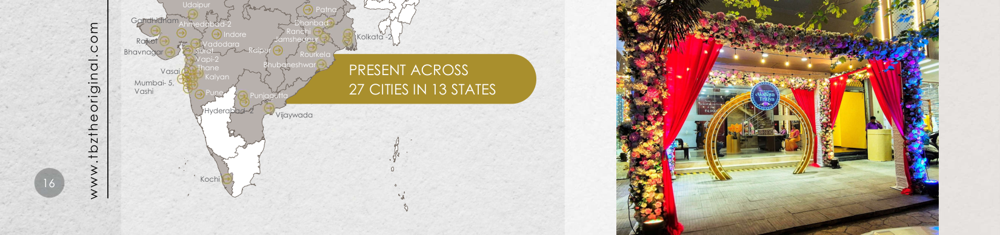

**[Image: 2ffd92d7-08a1-45e4-8092-7a330c8dd5c4.pdf-0017-02.png (1650x388, 929.9KB)]**

<!-- Start of picture text -->
Udaipur Patna GandhidhamAhmedabad-2Ahmedabad-2 Dhanbad Indore Ranchi Kolkata -2 Rajkot VadodaraIndore JamshedpurRanchi Bhavnagar Surat Raipur Rourkela Vapi-2 Vasai Thane Bhubaneshwar PRESENT ACROSS Kalyan Mumbai- 5, Vashi Pune Punjagutta 27 CITIES IN 13 STATES Hyderabad- 2 Vijaywada •  16 Kochi www.tbztheoriginal.com <!-- End of picture text -->

**[Image: 2ffd92d7-08a1-45e4-8092-7a330c8dd5c4.pdf-0017-03.png (1650x103, 219.0KB)]**

<!-- Start of picture text -->
• <!-- End of picture text -->

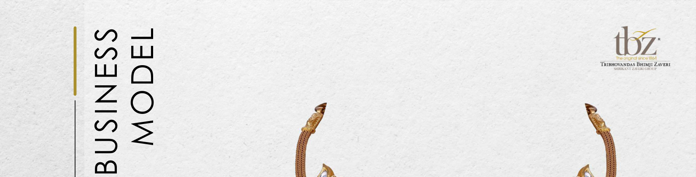

**[Image: 2ffd92d7-08a1-45e4-8092-7a330c8dd5c4.pdf-0018-00.png (1650x421, 529.1KB)]**

<!-- Start of picture text -->
tbz· r  IQral  inc  1  '-"1 Th rnHOVAN DAS  BHI MJ I  ZAVERi \IUU1..\.' I  L\\UU(;JtOI I' BUSINESS MODEL <!-- End of picture text -->

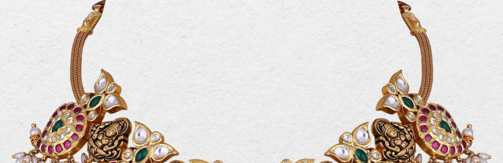

**[Image: 2ffd92d7-08a1-45e4-8092-7a330c8dd5c4.pdf-0018-01.png (1055x343, 456.3KB)]**

• 17 

**[Image: 2ffd92d7-08a1-45e4-8092-7a330c8dd5c4.pdf-0018-03.png (1102x344, 643.6KB)]**

<!-- Start of picture text -->
Page 17-27 <!-- End of picture text -->

### Business Model: Manufacturing 

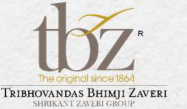

**[Image: 2ffd92d7-08a1-45e4-8092-7a330c8dd5c4.pdf-0019-01.png (187x109, 28.7KB)]**

<!-- Start of picture text -->
tbz· IQral  inc  1  '-"1 Th rnHOVAN DAS BHI MJ I  ZAVERi \IUU1..\.' I  L\\UU(;JtOI I' <!-- End of picture text -->

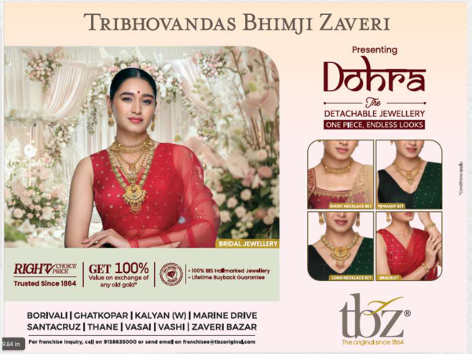

**[Image: 2ffd92d7-08a1-45e4-8092-7a330c8dd5c4.pdf-0019-02.png (601x451, 454.6KB)]**

<!-- Start of picture text -->
TRIBHOVANDAS BHIMJI ZAVERI Presenti ng Do'nra - - /7,r4 - - DETACHABLE JEWELLE RY l@iAA f:l◄ IMl•i ■ i&iHI  !Si 1 j ~ 81"" I  V.lueonuc:Nl~•d  GET  100% I ®1·- t.~  •Lhtlmolauyt,,ocko.-an- .. - .. -"" Trulted Slnc• 1884  a'1)' old gold" BORIVALI IGHATKOPAR  I KALYAN  (WJ I MARINE  DR IVE SANTACRUZ I THANE I VASAI  I VASH I  I  ZAVERi  BAZAR <!-- End of picture text -->

- Gold • Raw Material - Bullion Sources: 

- • Banks – Gold on loan • • Bullion dealers • • • 100 kg. 

- • 

- • 18 

   - Raw Material - Bullion 

   - Exchange & purchase of old jewellery 

   - Gold jewellery manufacturing is outsourced. 

   - Vast nation-wide network of 150+ vendors 

   - Each vendor has an annual gold processing capacity of more than 100 kg. 

   - These vendors are associated with TBZ since generations and are experts in handmade regional jewellery designs. 

**[Image: 2ffd92d7-08a1-45e4-8092-7a330c8dd5c4.pdf-0019-10.png (1650x103, 105.0KB)]**

<!-- Start of picture text -->
• <!-- End of picture text -->

**[Image: 2ffd92d7-08a1-45e4-8092-7a330c8dd5c4.pdf-0020-00.png (1650x207, 253.0KB)]**

<!-- Start of picture text -->
Business Model: tbz· contd. r  IQral  inc  1  '-"1 Manufacturing  Th rnHOVAN DAS  BHI MJ I  ZAVERi \IUU1..\.' I  L\\UU(;JtOI I' <!-- End of picture text -->

- Business Model: contd. 

- Manufacturing Diamond • Raw Material - Cut & polished diamonds Sources: 

- • DTC site holders • In-house diamond jewellery manufacturing leading to exclusive designs, lower costs, and higher margins 

- • Owned manufacturing facility at Kandivali, Mumbai • The facility also has a sizeable capacity for gold refining and matching capacity for jewellery components manufacturing 

- • 19 

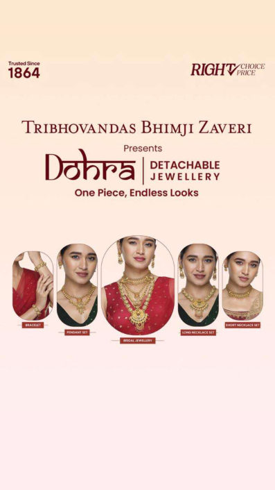

**[Image: 2ffd92d7-08a1-45e4-8092-7a330c8dd5c4.pdf-0020-02.png (397x706, 187.6KB)]**

<!-- Start of picture text -->
Trusted Since 1864 TRIBHOVANDAS BHIMJI ZAVERI \  Presents Don~a  DETACHABLE I  JEWELLERY One Piece, Endless Looks IClllimlill <!-- End of picture text -->

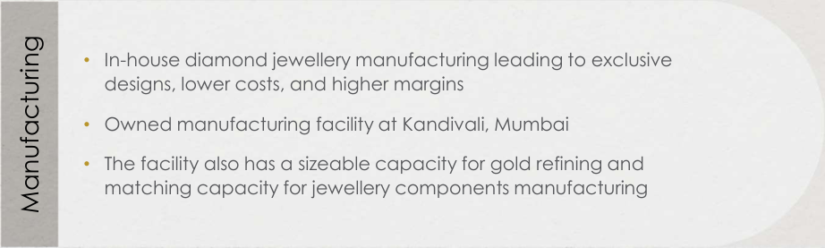

**[Image: 2ffd92d7-08a1-45e4-8092-7a330c8dd5c4.pdf-0020-03.png (922x277, 87.5KB)]**

<!-- Start of picture text -->
• In-house diamond jewellery manufacturing leading to exclusive designs, lower costs, and higher margins • Owned manufacturing facility at Kandivali, Mumbai • The facility also has a sizeable capacity for gold refining and matching capacity for jewellery components manufacturing Manufacturing <!-- End of picture text -->

### Gold Metal Loan: Efficient Sourcing Channel 

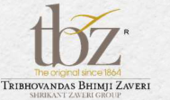

**[Image: 2ffd92d7-08a1-45e4-8092-7a330c8dd5c4.pdf-0021-01.png (189x111, 29.1KB)]**

<!-- Start of picture text -->
tbz· IQral  inc  1  '-"1 Th rnHOVAN DAS  BHI MJ I  ZAVERi \IUU1..\.' I  L\\UU(;JtOI I' <!-- End of picture text -->

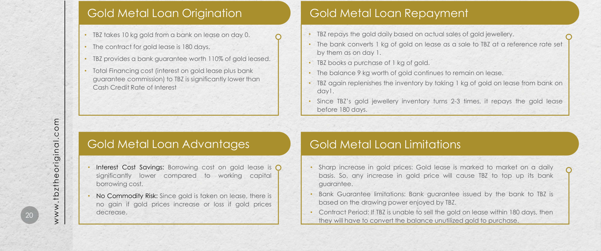

**[Image: 2ffd92d7-08a1-45e4-8092-7a330c8dd5c4.pdf-0021-02.png (1650x692, 824.6KB)]**

<!-- Start of picture text -->
Gold Metal Loan Origination Gold Metal Loan Repayment • TBZ takes 10 kg gold from a bank on lease on day 0. • TBZ repays the gold daily based on actual sales of gold jewellery. • • The bank converts 1 kg of gold on lease as a sale to TBZ at a reference rate set The contract for gold lease is 180 days. by them as on day 1. • TBZ provides a bank guarantee worth 110% of gold leased. • TBZ books a purchase of 1 kg of gold. • Total Financing cost (interest on gold lease plus bank  • The balance 9 kg worth of gold continues to remain on lease. guarantee commission) to TBZ is significantly lower than  • TBZ again replenishes the inventory by taking 1 kg of gold on lease from bank on Cash Credit Rate of Interest day1. • Since TBZ’s gold jewellery inventory turns 2-3 times, it repays the gold lease before 180 days. Gold Metal Loan Advantages Gold Metal Loan Limitations • Interest Cost Savings: Borrowing cost on gold lease is • Sharp increase in gold prices: Gold lease is marked to market on a daily significantly lower compared to working capital basis. So, any increase in gold price will cause TBZ to top up its bank borrowing cost. guarantee. • No Commodity Risk: Since gold is taken on lease, there is • Bank Guarantee limitations: Bank guarantee issued by the bank to TBZ is no gain if gold prices increase or loss if gold prices based on the drawing power enjoyed by TBZ. 20 decrease. • Contract Period: If TBZ is unable to sell the gold on lease within 180 days, then they will have to convert the balance unutilized gold to purchase. • www.tbztheoriginal.com <!-- End of picture text -->

• 21 

**[Image: 2ffd92d7-08a1-45e4-8092-7a330c8dd5c4.pdf-0022-02.png (51x51, 3.0KB)]**

<!-- Start of picture text -->
21 <!-- End of picture text -->

**[Image: 2ffd92d7-08a1-45e4-8092-7a330c8dd5c4.pdf-0022-03.png (170x109, 27.3KB)]**

### Securing Future Growth: Our Strategic Pillars 

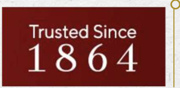

**[Image: 2ffd92d7-08a1-45e4-8092-7a330c8dd5c4.pdf-0022-05.png (296x145, 49.1KB)]**

<!-- Start of picture text -->
Trusted Since 1864 <!-- End of picture text -->

#### 160 years of Brand Value Leverage: 

TBZ Ltd boasts substantial brand value and a long-standing reputation for quality and craftsmanship. With over 160 years in business, the brand is recognized and trusted by multigenerational customers across India, providing a significant competitive advantage and positioning the Company for continued growth. 

#### Diversified Portfolio Growth: 

**[Image: 2ffd92d7-08a1-45e4-8092-7a330c8dd5c4.pdf-0022-09.png (226x132, 17.7KB)]**

TBZ Ltd maintains a diversified product portfolio featuring gold, diamond, and other precious gemstone jewellery. By offering various price points to cater to different customer segments, the Company intends to mitigate market fluctuations' impact and generate a stable revenue stream. 

**[Image: 2ffd92d7-08a1-45e4-8092-7a330c8dd5c4.pdf-0022-11.png (115x116, 8.2KB)]**

**[Image: 2ffd92d7-08a1-45e4-8092-7a330c8dd5c4.pdf-0022-12.png (116x116, 8.5KB)]**

<!-- Start of picture text -->
• . !ii <!-- End of picture text -->

Financial Performance Strength: 

TBZ Ltd is on track to deliver steadily improving financial performance, with consistent revenue growth and profitability. The solid balance sheet, lowering debt levels, and strong cash position sets the Company up for continued growth and expansion in India's exciting growth story. 

**[Image: 2ffd92d7-08a1-45e4-8092-7a330c8dd5c4.pdf-0022-15.png (132x222, 25.1KB)]**

**[Image: 2ffd92d7-08a1-45e4-8092-7a330c8dd5c4.pdf-0022-16.png (135x222, 24.4KB)]**

<!-- Start of picture text -->
\ I • <!-- End of picture text -->

#### Retail Expansion Focus: 

**[Image: 2ffd92d7-08a1-45e4-8092-7a330c8dd5c4.pdf-0022-18.png (159x103, 22.8KB)]**

TBZ Ltd focuses on organic growth through its network of stores and judiciously expanding its retail footprint across India by opening new stores in key locations. This strategy will allow the Company to increase its market share and attract new customers. The focus on retail expansion enables TBZ Ltd to leverage its brand value and capture new growth opportunities. 

**[Image: 2ffd92d7-08a1-45e4-8092-7a330c8dd5c4.pdf-0023-01.png (51x51, 3.0KB)]**

<!-- Start of picture text -->
22 <!-- End of picture text -->

• 22 

### Steadfast market steeped in tradition and innovation 

#### GDP Contribution and Cultural Significance: 

The gems and jewellery market contributes approximately 7.5% to India’s GDP and 14% to total merchandise exports (IBEF Research). Gold, symbolizing wealth and prosperity, is integral to Indian culture and ceremonies, ensuring continued demand. 

#### Expanding Middle Class and Disposable Income: 

India's middle class is projected to grow from ~30% of the population in 2021 to >60% by 2047 (PRICE Market Research Report). Rising disposable incomes will likely increase spending on luxury items like high-quality, branded jewellery. 

#### Steadfast Market Growth: 

The market was valued at $78.50 billion in 2021 and is expected to reach $119.80 billion by 2027, with a CAGR of 8.34%. The popularity of costume and fashion jewellery, especially among younger consumers, contributes to this growth as they seek affordable and versatile options. 

#### Fashion Jewellery Demand: 

The rising popularity of fashion jewellery, particularly among younger consumers, has led to significant growth in this segment, with more consumers seeking affordable, stylish, and versatile options for various occasions. 

#### E-commerce and Digital Platform Growth: 

Increasing internet and smartphone penetration has resulted in a rise in online shopping, expanding the market and increasing accessibility to a wider range of jewellery designs and products. 

**[Image: 2ffd92d7-08a1-45e4-8092-7a330c8dd5c4.pdf-0023-14.png (189x111, 29.1KB)]**

<!-- Start of picture text -->
tbz· IQral  inc  1  '-"1 Th rnHOVAN DAS  BHI MJ I  ZAVERi \IUU1..\.' I  L\\UU(;JtOI I' <!-- End of picture text -->

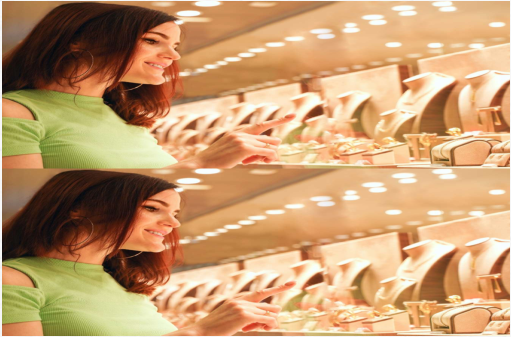

**[Image: 2ffd92d7-08a1-45e4-8092-7a330c8dd5c4.pdf-0023-15.png (511x337, 392.7KB)]**

>60% by $119.80 billion 8.34% 2047 by 2027 Middle Class Market Size Indian Market for share of CAGR Jewellery Population (2021-27) 

Source: PRICE & Economic Times 

• 23 

**[Image: 2ffd92d7-08a1-45e4-8092-7a330c8dd5c4.pdf-0024-02.png (51x51, 3.1KB)]**

<!-- Start of picture text -->
23 <!-- End of picture text -->

**[Image: 2ffd92d7-08a1-45e4-8092-7a330c8dd5c4.pdf-0024-03.png (189x111, 29.1KB)]**

<!-- Start of picture text -->
tbz· r  IQral  inc  1  '-"1 Th rnHOVAN DAS BHI MJ I  ZAVERi \IUU1..\.' I  L\\UU(;JtOI I' <!-- End of picture text -->

### Harnessing Our Core Strengths to Drive Success 

#### Domestic Focus: 

**[Image: 2ffd92d7-08a1-45e4-8092-7a330c8dd5c4.pdf-0024-06.png (180x207, 27.1KB)]**

Since TBZ primarily concentrates on the domestic jewellery market, it remains protected from the impact of international economic challenges. 

#### Consumer Trust: 

**[Image: 2ffd92d7-08a1-45e4-8092-7a330c8dd5c4.pdf-0024-09.png (197x239, 28.4KB)]**

TBZ is an age-old established brand known for its innovative designs, the quality of its artistry, and unquestionable product authenticity, enjoying a loyal base of multigenerational clientele. 

Rooted in trust and heritage, TBZ leads the Indian jewellery market with unmatched quality, a domestic focus, and a deep connection to the rising middle-class consumer. 

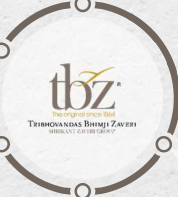

**[Image: 2ffd92d7-08a1-45e4-8092-7a330c8dd5c4.pdf-0024-12.png (178x197, 30.6KB)]**

**[Image: 2ffd92d7-08a1-45e4-8092-7a330c8dd5c4.pdf-0024-13.png (197x238, 31.3KB)]**

**[Image: 2ffd92d7-08a1-45e4-8092-7a330c8dd5c4.pdf-0024-14.png (197x238, 32.1KB)]**

<!-- Start of picture text -->
consumer. <!-- End of picture text -->

#### Industry Benchmark: 

In the Indian jewellery market, TBZ holds a distinguished position for its exemplary corporate governance, setting it as the industry's peer benchmark. 

#### Middle-Class Growth: 

TBZ is strategically positioned to capitalize on the remarkable growth of the expanding Indian middle class, and their surging aspirations and spending in India. 

**[Image: 2ffd92d7-08a1-45e4-8092-7a330c8dd5c4.pdf-0024-19.png (180x208, 27.4KB)]**

#### Resilient Heritage: 

Spanning over 160 years, the Company has navigated multiple economic disruptions, coming out strong after each cycle. 

**[Image: 2ffd92d7-08a1-45e4-8092-7a330c8dd5c4.pdf-0025-01.png (51x51, 3.0KB)]**

<!-- Start of picture text -->
24 <!-- End of picture text -->

• 24 

### Awards & Recognition: 

- TBZ – The Original has won the award at Retail Jeweller India Forum- MD & CEO Awards 2025 in below category: 

   - “Exemplary Value creation for Shareholders 2025” 

- **Shri Shrikant Zaveri** , has been conferred with the prestigious " **Gems and Jewellery Industry Legend" Award** at the illustrious **IIJS Tritiya 2023** event in Mumbai. 

- **Ms. Raashi Zaveri** has been awarded the **GJEPC 40 under 40** , recognizing her as a young industry leader and with the prestigious “Excellence in Leadership, Young Leader of the Year Award” by the Retail Jeweller India MD and CEO Awards. 

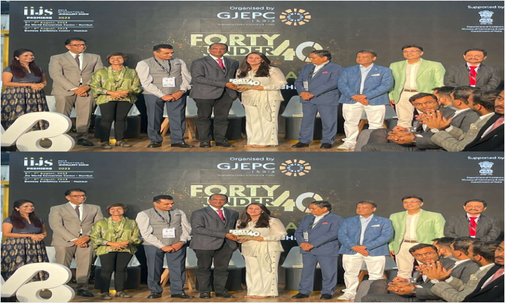

**[Image: 2ffd92d7-08a1-45e4-8092-7a330c8dd5c4.pdf-0025-08.png (720x432, 649.0KB)]**

**GJEPC 40 under 40** 

**[Image: 2ffd92d7-08a1-45e4-8092-7a330c8dd5c4.pdf-0025-10.png (189x111, 29.1KB)]**

<!-- Start of picture text -->
tbz· - r  IQral  inc  1  'iJ1 T'RIBH~~ DAS  BHIMJI ZAVERi \.,t  L\\UUCatOI  I' <!-- End of picture text -->

**[Image: 2ffd92d7-08a1-45e4-8092-7a330c8dd5c4.pdf-0025-11.png (517x690, 567.9KB)]**

Retail Jeweller India Forum- MD & CEO Awards 2025 

**[Image: 2ffd92d7-08a1-45e4-8092-7a330c8dd5c4.pdf-0026-01.png (51x51, 3.1KB)]**

<!-- Start of picture text -->
25 <!-- End of picture text -->

• 25 

### Awards & Recognition 

- **“** EXEMPELARY VALUE CREATION FOR SHAREHOLDERS 2025“ 

###### **Retail Jeweller India Forum- MD & CEO Awards 2025** 

- “EXCELLENCE IN LEADERSHIP, YOUNG LEADER OF THE YEAR 2025” : Ms. Raashi Zaveri **GJEPC 40 under 40:** Retail Jeweller India MD and CEO Awards. 

- “GEMS & JEWELLRY INDUSTRY LEGEND AWARD” : Mr. Srikant Zaveri **IIJS Tritiya 2023** 

- “BEST BRACELET DESIGN AWARD -9TH EDITION” JJS-IJ Jewellers Choice Design Awards – 2019 

- “CONTEMPORARY DIAMOND JEWELLERY AWARD” & “TREASURE OF THE OCEAN “ 

- GJC’S NATIONAL JEWELLERY AWARD 2018 

- “DIAMOND VIVAH JEWELLERY OF THE YEAR” Retail Jeweller India Awards – 2018 

- “INDIA’S MOST PREFERRED JEWELLERY BRAND” UBM India – 2017 

- “BEST RING DESIGN OVER Rs. 2,50,000” JJS-IJ Jewellers Choice Design Awards – 2016 

- “TV CAMPAIGN OF THE YEAR” 

   - 12th Gemfields Retail Jeweller India Awards – 2016 

- “DIAMOND JEWELLERY OF THE YEAR” 

   - 12th Gemfields Retail Jeweller India Awards – 2016 

- “BEST NECKLACE DESIGN AWARD – 2016” JJS-IJ Jewellers’ Choice Design Award – 2016 

- “ASIA’S MOST POPULAR BRANDS – 2014” World Consulting & Research Corporation (WCRC) – 2014 

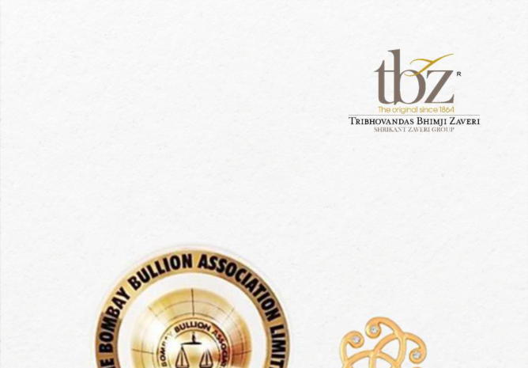

**[Image: 2ffd92d7-08a1-45e4-8092-7a330c8dd5c4.pdf-0026-20.png (668x465, 263.2KB)]**

<!-- Start of picture text -->
· t}jz f  ong ral  nca 186'1 T'RIBHOVANDAS  8HIMJI ZAVERi .',,IUIHL\.'L  L\\Ull(;Jt()l,J• <!-- End of picture text -->

**[Image: 2ffd92d7-08a1-45e4-8092-7a330c8dd5c4.pdf-0026-21.png (297x568, 335.7KB)]**

**[Image: 2ffd92d7-08a1-45e4-8092-7a330c8dd5c4.pdf-0026-22.png (199x457, 136.3KB)]**

**[Image: 2ffd92d7-08a1-45e4-8092-7a330c8dd5c4.pdf-0027-00.png (153x115, 36.4KB)]**

<!-- Start of picture text -->
P \  Kl  I  I <!-- End of picture text -->

#### **PROJECT PANKHI** 

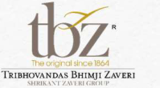

**[Image: 2ffd92d7-08a1-45e4-8092-7a330c8dd5c4.pdf-0027-02.png (199x110, 24.8KB)]**

<!-- Start of picture text -->
tbz"he  lf'll"'OI  JC~ 166-1 " T'RIBHOVANDAS  BHlMJI  ZAVERi \WUI.\VJ  /.\\lltlUtnl I' <!-- End of picture text -->

Project Pankhi is TBZ’s flagship women empowerment initiative, supporting women and adolescent girls from marginalised communities through **counselling, referrals, awareness-building and community advocacy** , particularly for cases linked to domestic violence and related vulnerabilities. 

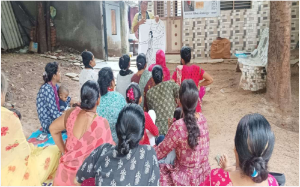

**[Image: 2ffd92d7-08a1-45e4-8092-7a330c8dd5c4.pdf-0027-04.png (499x312, 379.4KB)]**

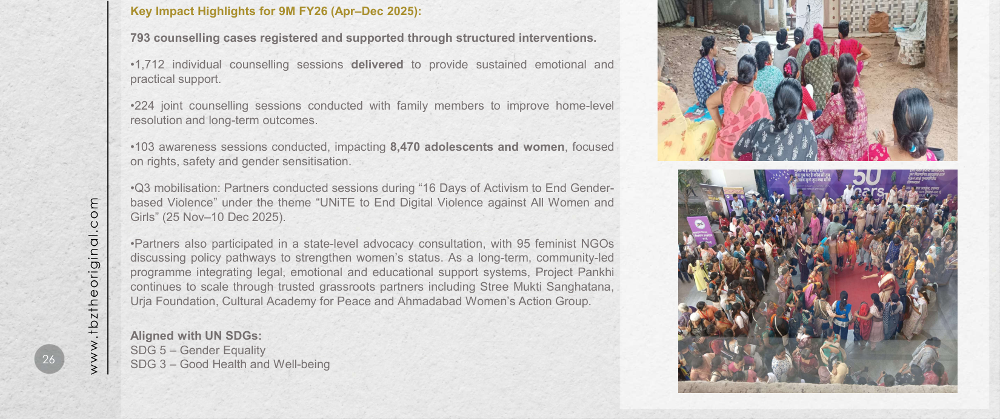

**[Image: 2ffd92d7-08a1-45e4-8092-7a330c8dd5c4.pdf-0027-05.png (1650x692, 1529.7KB)]**

<!-- Start of picture text -->
Key Impact Highlights for 9M FY26 (Apr–Dec 2025): 793 counselling cases registered and supported through structured interventions. •1,712 individual counselling sessions delivered to provide sustained emotional and practical support. •224 joint counselling sessions conducted with family members to improve home-level resolution and long-term outcomes. •103 awareness sessions conducted, impacting 8,470 adolescents and women , focused on rights, safety and gender sensitisation. •Q3 mobilisation: Partners conducted sessions during “16 Days of Activism to End Gender- based Violence” under the theme “UNiTE to End Digital Violence against All Women and Girls” (25 Nov–10 Dec 2025). •Partners also participated in a state-level advocacy consultation, with 95 feminist NGOs discussing policy pathways to strengthen women’s status. As a long-term, community-led programme integrating legal, emotional and educational support systems, Project Pankhi continues to scale through trusted grassroots partners including Stree Mukti Sanghatana, Urja Foundation, Cultural Academy for Peace and Ahmadabad Women’s Action Group. Aligned with UN SDGs: SDG 5 – Gender Equality 26 SDG 3 – Good Health and Well-being • www.tbztheoriginal.com <!-- End of picture text -->

• 27 

**[Image: 2ffd92d7-08a1-45e4-8092-7a330c8dd5c4.pdf-0028-02.png (51x51, 3.0KB)]**

<!-- Start of picture text -->
27 <!-- End of picture text -->

#### **PROJECT DISHA** 

Project Disha is TBZ’s inclusive education initiative, supporting children with disabilities and underserved students through specialised learning interventions, teacher training, parent capacitybuilding and community enablement. 

###### **Key Impact Highlights for 9M FY26 (Apr–Dec 2025):** 

###### **Muskan Foundation – Support for Children with Multiple Disabilities.** 

- 6,248 sessions conducted with students across multiple learning and therapy topics. 18 events conducted with 516 participants, strengthening inclusion-focused engagement. 

- 7 parent training sessions conducted for 49 parents, strengthening home-based support and continuity of care. 

- Parents supported through 68 individual + 63 group sessions; 199 parents engaged through advocacy discussions. 

- 2 educational visits conducted with 39 participants to aid exposure and learning reinforcement. 

###### **Victoria Memorial School for the Blind (VMSB)** 

- Continued education support for 15 students with visual impairment (Grades 5 to 9). 

###### **Pahley Akshar Foundation – Strengthening Foundational Learning** 

- 877 children supported through foundational English and learning outcomes interventions; 3 schools identified across Mumbai and Thane. 

- Teacher training conducted covering 96 teachers across 16 schools to improve classroom delivery and learning outcomes. Community Enablement (linked to education and inclusion ecosystem) 

**20,000 eco-friendly cotton bags distributed in collaboration with the Maharashtra Government, supporting environmental awareness at community level.** 

Al **igned with UN SDGs:** SDG 4 – Quality Education SDG 10 – Reduced Inequalities 

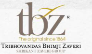

**[Image: 2ffd92d7-08a1-45e4-8092-7a330c8dd5c4.pdf-0028-18.png (191x112, 25.9KB)]**

<!-- Start of picture text -->
tbz· "he O>'li  f'OI  nee 186,11 ThIBHOVANDAS BHIMJI ZAVERi ,Hlllt..;\.VI  l.\\  l,JU(;KOI  I' <!-- End of picture text -->

**[Image: 2ffd92d7-08a1-45e4-8092-7a330c8dd5c4.pdf-0028-19.png (155x117, 37.0KB)]**

<!-- Start of picture text -->
P\ 1  Kl1I <!-- End of picture text -->

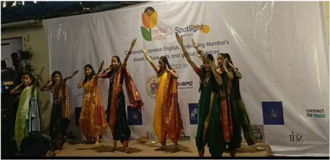

**[Image: 2ffd92d7-08a1-45e4-8092-7a330c8dd5c4.pdf-0028-20.png (563x274, 273.0KB)]**

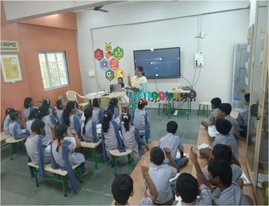

**[Image: 2ffd92d7-08a1-45e4-8092-7a330c8dd5c4.pdf-0028-21.png (548x419, 420.8KB)]**

**[Image: 2ffd92d7-08a1-45e4-8092-7a330c8dd5c4.pdf-0029-01.png (1650x207, 255.0KB)]**

<!-- Start of picture text -->
The orig nal since 1864 orig nal since 1864 ig nal since 1864 1864 <!-- End of picture text -->

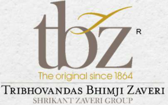

**[Image: 2ffd92d7-08a1-45e4-8092-7a330c8dd5c4.pdf-0029-02.png (276x173, 60.9KB)]**

<!-- Start of picture text -->
The orig nal since 1864 orig nal since 1864 ig nal since 1864 1864 TRIBHOVANDAS BHIMJI ZAVERi SI 11!1!..,\ \;TZ.\\ 'l•:RI GltOl"I' <!-- End of picture text -->

**[Image: 2ffd92d7-08a1-45e4-8092-7a330c8dd5c4.pdf-0029-03.png (1650x463, 583.6KB)]**

<!-- Start of picture text -->
THANK YOU Trusted Si nee Si nee nee Si nee nee nee  I  tbz· ___ 'he __ :,_, 'he __ :,_, __ :,_, :,_,  =g1nu( sine ine  ➔  1_864 __ _ __ _ _ TRIBHOVANDAS BHIMJI ZAVERl BHIMJI ZAVERl ZAVERl  11 DICKENSON I DICKENSON I I ~JUUK.\.Yl  L\.\  LIU GKOlll' GKOlll' <!-- End of picture text -->

**[Image: 2ffd92d7-08a1-45e4-8092-7a330c8dd5c4.pdf-0029-04.png (291x147, 49.9KB)]**

<!-- Start of picture text -->
Trusted Si nee Si nee nee Si nee nee nee 1864 <!-- End of picture text -->

**[Image: 2ffd92d7-08a1-45e4-8092-7a330c8dd5c4.pdf-0029-05.png (1650x250, 358.3KB)]**

<!-- Start of picture text -->
Trusted Si nee Si nee nee Si nee nee nee ___ 'he __ :,_, 'he __ :,_, __ :,_, :,_,  =g1nu( sine ine  ➔  1_864 __ _ __ _ _ TRIBHOVANDAS BHIMJI ZAVERl BHIMJI ZAVERl ZAVERl  11 DICKENSON I DICKENSON I I ~JUUK.\.Yl  L\.\  LIU GKOlll' GKOlll' 1864 Shankhini Saha Mukesh Sharma Director- Investor Relations CFO tbz@dickensonworld.com mukesh.sharma@tbzoriginal.com <!-- End of picture text -->

---

## Extracted Images

| # | File | Dimensions | Size |
|---|------|------------|------|
| 1 | 2ffd92d7-08a1-45e4-8092-7a330c8dd5c4.pdf-0001-16.png | 257x175 | 7.9KB |
| 2 | 2ffd92d7-08a1-45e4-8092-7a330c8dd5c4.pdf-0001-17.png | 15x15 | 0.4KB |
| 3 | 2ffd92d7-08a1-45e4-8092-7a330c8dd5c4.pdf-0001-18.png | 280x53 | 9.9KB |
| 4 | 2ffd92d7-08a1-45e4-8092-7a330c8dd5c4.pdf-0001-19.png | 909x84 | 30.0KB |
| 5 | 2ffd92d7-08a1-45e4-8092-7a330c8dd5c4.pdf-0002-01.png | 1650x207 | 257.3KB |
| 6 | 2ffd92d7-08a1-45e4-8092-7a330c8dd5c4.pdf-0002-02.png | 272x174 | 60.7KB |
| 7 | 2ffd92d7-08a1-45e4-8092-7a330c8dd5c4.pdf-0002-03.png | 224x116 | 32.3KB |
| 8 | 2ffd92d7-08a1-45e4-8092-7a330c8dd5c4.pdf-0002-04.png | 1650x333 | 420.6KB |
| 9 | 2ffd92d7-08a1-45e4-8092-7a330c8dd5c4.pdf-0002-06.png | 1650x207 | 236.9KB |
| 10 | 2ffd92d7-08a1-45e4-8092-7a330c8dd5c4.pdf-0002-07.png | 1650x103 | 117.5KB |
| 11 | 2ffd92d7-08a1-45e4-8092-7a330c8dd5c4.pdf-0003-01.png | 189x111 | 29.1KB |
| 12 | 2ffd92d7-08a1-45e4-8092-7a330c8dd5c4.pdf-0003-02.png | 1650x354 | 485.0KB |
| 13 | 2ffd92d7-08a1-45e4-8092-7a330c8dd5c4.pdf-0003-05.png | 1650x207 | 285.9KB |
| 14 | 2ffd92d7-08a1-45e4-8092-7a330c8dd5c4.pdf-0003-07.png | 1650x207 | 275.5KB |
| 15 | 2ffd92d7-08a1-45e4-8092-7a330c8dd5c4.pdf-0003-08.png | 51x51 | 3.1KB |
| 16 | 2ffd92d7-08a1-45e4-8092-7a330c8dd5c4.pdf-0003-10.png | 1650x103 | 125.4KB |
| 17 | 2ffd92d7-08a1-45e4-8092-7a330c8dd5c4.pdf-0004-00.png | 1650x207 | 246.5KB |
| 18 | 2ffd92d7-08a1-45e4-8092-7a330c8dd5c4.pdf-0004-01.png | 151x151 | 14.1KB |
| 19 | 2ffd92d7-08a1-45e4-8092-7a330c8dd5c4.pdf-0004-02.png | 1650x207 | 237.0KB |
| 20 | 2ffd92d7-08a1-45e4-8092-7a330c8dd5c4.pdf-0004-03.png | 151x150 | 13.4KB |
| 21 | 2ffd92d7-08a1-45e4-8092-7a330c8dd5c4.pdf-0004-04.png | 1650x207 | 243.7KB |
| 22 | 2ffd92d7-08a1-45e4-8092-7a330c8dd5c4.pdf-0004-05.png | 151x151 | 13.9KB |
| 23 | 2ffd92d7-08a1-45e4-8092-7a330c8dd5c4.pdf-0004-07.png | 1650x207 | 247.2KB |
| 24 | 2ffd92d7-08a1-45e4-8092-7a330c8dd5c4.pdf-0004-08.png | 1650x103 | 121.7KB |
| 25 | 2ffd92d7-08a1-45e4-8092-7a330c8dd5c4.pdf-0005-02.png | 1650x230 | 272.0KB |
| 26 | 2ffd92d7-08a1-45e4-8092-7a330c8dd5c4.pdf-0005-03.png | 51x51 | 3.1KB |
| 27 | 2ffd92d7-08a1-45e4-8092-7a330c8dd5c4.pdf-0005-05.png | 649x673 | 744.0KB |
| 28 | 2ffd92d7-08a1-45e4-8092-7a330c8dd5c4.pdf-0005-06.png | 208x132 | 23.0KB |
| 29 | 2ffd92d7-08a1-45e4-8092-7a330c8dd5c4.pdf-0006-00.png | 1650x230 | 279.9KB |
| 30 | 2ffd92d7-08a1-45e4-8092-7a330c8dd5c4.pdf-0006-01.png | 220x26 | 7.6KB |
| 31 | 2ffd92d7-08a1-45e4-8092-7a330c8dd5c4.pdf-0006-02.png | 171x10 | 3.8KB |
| 32 | 2ffd92d7-08a1-45e4-8092-7a330c8dd5c4.pdf-0006-03.png | 12x12 | 0.4KB |
| 33 | 2ffd92d7-08a1-45e4-8092-7a330c8dd5c4.pdf-0006-04.png | 203x30 | 7.9KB |
| 34 | 2ffd92d7-08a1-45e4-8092-7a330c8dd5c4.pdf-0006-05.png | 171x11 | 4.1KB |
| 35 | 2ffd92d7-08a1-45e4-8092-7a330c8dd5c4.pdf-0006-06.png | 12x12 | 0.4KB |
| 36 | 2ffd92d7-08a1-45e4-8092-7a330c8dd5c4.pdf-0006-07.png | 13x13 | 0.5KB |
| 37 | 2ffd92d7-08a1-45e4-8092-7a330c8dd5c4.pdf-0006-08.png | 179x20 | 6.1KB |
| 38 | 2ffd92d7-08a1-45e4-8092-7a330c8dd5c4.pdf-0006-09.png | 13x13 | 0.5KB |
| 39 | 2ffd92d7-08a1-45e4-8092-7a330c8dd5c4.pdf-0006-10.png | 1650x266 | 307.7KB |
| 40 | 2ffd92d7-08a1-45e4-8092-7a330c8dd5c4.pdf-0006-11.png | 1650x207 | 217.4KB |
| 41 | 2ffd92d7-08a1-45e4-8092-7a330c8dd5c4.pdf-0006-12.png | 51x51 | 3.1KB |
| 42 | 2ffd92d7-08a1-45e4-8092-7a330c8dd5c4.pdf-0006-13.png | 1650x103 | 121.8KB |
| 43 | 2ffd92d7-08a1-45e4-8092-7a330c8dd5c4.pdf-0007-00.png | 1650x230 | 279.9KB |
| 44 | 2ffd92d7-08a1-45e4-8092-7a330c8dd5c4.pdf-0007-01.png | 220x27 | 7.8KB |
| 45 | 2ffd92d7-08a1-45e4-8092-7a330c8dd5c4.pdf-0007-02.png | 12x13 | 0.5KB |
| 46 | 2ffd92d7-08a1-45e4-8092-7a330c8dd5c4.pdf-0007-03.png | 203x32 | 8.2KB |
| 47 | 2ffd92d7-08a1-45e4-8092-7a330c8dd5c4.pdf-0007-04.png | 12x12 | 0.5KB |
| 48 | 2ffd92d7-08a1-45e4-8092-7a330c8dd5c4.pdf-0007-05.png | 171x9 | 3.4KB |
| 49 | 2ffd92d7-08a1-45e4-8092-7a330c8dd5c4.pdf-0007-06.png | 13x13 | 0.5KB |
| 50 | 2ffd92d7-08a1-45e4-8092-7a330c8dd5c4.pdf-0007-07.png | 179x13 | 4.8KB |
| 51 | 2ffd92d7-08a1-45e4-8092-7a330c8dd5c4.pdf-0007-08.png | 13x12 | 0.5KB |
| 52 | 2ffd92d7-08a1-45e4-8092-7a330c8dd5c4.pdf-0007-09.png | 1650x273 | 316.1KB |
| 53 | 2ffd92d7-08a1-45e4-8092-7a330c8dd5c4.pdf-0007-10.png | 1650x207 | 216.5KB |
| 54 | 2ffd92d7-08a1-45e4-8092-7a330c8dd5c4.pdf-0007-11.png | 51x51 | 3.1KB |
| 55 | 2ffd92d7-08a1-45e4-8092-7a330c8dd5c4.pdf-0007-12.png | 1650x103 | 121.9KB |
| 56 | 2ffd92d7-08a1-45e4-8092-7a330c8dd5c4.pdf-0008-01.png | 199x109 | 22.9KB |
| 57 | 2ffd92d7-08a1-45e4-8092-7a330c8dd5c4.pdf-0008-04.png | 1650x692 | 1313.6KB |
| 58 | 2ffd92d7-08a1-45e4-8092-7a330c8dd5c4.pdf-0009-03.png | 189x111 | 29.1KB |
| 59 | 2ffd92d7-08a1-45e4-8092-7a330c8dd5c4.pdf-0009-05.png | 51x51 | 3.1KB |
| 60 | 2ffd92d7-08a1-45e4-8092-7a330c8dd5c4.pdf-0009-07.png | 1308x41 | 35.5KB |
| 61 | 2ffd92d7-08a1-45e4-8092-7a330c8dd5c4.pdf-0009-08.png | 1308x41 | 23.8KB |
| 62 | 2ffd92d7-08a1-45e4-8092-7a330c8dd5c4.pdf-0009-09.png | 1308x41 | 24.4KB |
| 63 | 2ffd92d7-08a1-45e4-8092-7a330c8dd5c4.pdf-0009-10.png | 1308x42 | 25.4KB |
| 64 | 2ffd92d7-08a1-45e4-8092-7a330c8dd5c4.pdf-0009-11.png | 1308x41 | 24.5KB |
| 65 | 2ffd92d7-08a1-45e4-8092-7a330c8dd5c4.pdf-0009-12.png | 1308x42 | 26.1KB |
| 66 | 2ffd92d7-08a1-45e4-8092-7a330c8dd5c4.pdf-0009-13.png | 1308x41 | 25.6KB |
| 67 | 2ffd92d7-08a1-45e4-8092-7a330c8dd5c4.pdf-0009-14.png | 1311x42 | 27.0KB |
| 68 | 2ffd92d7-08a1-45e4-8092-7a330c8dd5c4.pdf-0010-02.png | 51x51 | 3.1KB |
| 69 | 2ffd92d7-08a1-45e4-8092-7a330c8dd5c4.pdf-0010-04.png | 189x111 | 29.1KB |
| 70 | 2ffd92d7-08a1-45e4-8092-7a330c8dd5c4.pdf-0010-05.png | 586x326 | 372.6KB |
| 71 | 2ffd92d7-08a1-45e4-8092-7a330c8dd5c4.pdf-0010-06.png | 490x315 | 404.6KB |
| 72 | 2ffd92d7-08a1-45e4-8092-7a330c8dd5c4.pdf-0010-07.png | 490x376 | 352.3KB |
| 73 | 2ffd92d7-08a1-45e4-8092-7a330c8dd5c4.pdf-0010-08.png | 586x362 | 416.0KB |
| 74 | 2ffd92d7-08a1-45e4-8092-7a330c8dd5c4.pdf-0011-02.png | 51x51 | 3.0KB |
| 75 | 2ffd92d7-08a1-45e4-8092-7a330c8dd5c4.pdf-0011-17.png | 550x931 | 630.9KB |
| 76 | 2ffd92d7-08a1-45e4-8092-7a330c8dd5c4.pdf-0012-00.png | 1650x231 | 245.0KB |
| 77 | 2ffd92d7-08a1-45e4-8092-7a330c8dd5c4.pdf-0012-02.png | 419x564 | 548.3KB |
| 78 | 2ffd92d7-08a1-45e4-8092-7a330c8dd5c4.pdf-0012-03.png | 514x516 | 567.7KB |
| 79 | 2ffd92d7-08a1-45e4-8092-7a330c8dd5c4.pdf-0012-04.png | 444x589 | 435.3KB |
| 80 | 2ffd92d7-08a1-45e4-8092-7a330c8dd5c4.pdf-0013-00.png | 1650x332 | 403.9KB |
| 81 | 2ffd92d7-08a1-45e4-8092-7a330c8dd5c4.pdf-0013-01.png | 1038x715 | 1021.5KB |
| 82 | 2ffd92d7-08a1-45e4-8092-7a330c8dd5c4.pdf-0013-03.png | 51x51 | 3.0KB |
| 83 | 2ffd92d7-08a1-45e4-8092-7a330c8dd5c4.pdf-0014-00.png | 189x111 | 29.1KB |
| 84 | 2ffd92d7-08a1-45e4-8092-7a330c8dd5c4.pdf-0014-01.png | 1650x354 | 379.2KB |
| 85 | 2ffd92d7-08a1-45e4-8092-7a330c8dd5c4.pdf-0014-03.png | 1650x207 | 266.4KB |
| 86 | 2ffd92d7-08a1-45e4-8092-7a330c8dd5c4.pdf-0014-04.png | 1650x207 | 291.3KB |
| 87 | 2ffd92d7-08a1-45e4-8092-7a330c8dd5c4.pdf-0014-05.png | 1650x103 | 136.3KB |
| 88 | 2ffd92d7-08a1-45e4-8092-7a330c8dd5c4.pdf-0015-03.png | 189x111 | 29.1KB |
| 89 | 2ffd92d7-08a1-45e4-8092-7a330c8dd5c4.pdf-0015-07.png | 1650x580 | 769.6KB |
| 90 | 2ffd92d7-08a1-45e4-8092-7a330c8dd5c4.pdf-0015-09.png | 51x51 | 2.9KB |
| 91 | 2ffd92d7-08a1-45e4-8092-7a330c8dd5c4.pdf-0015-10.png | 1650x103 | 128.0KB |
| 92 | 2ffd92d7-08a1-45e4-8092-7a330c8dd5c4.pdf-0016-02.png | 189x111 | 29.1KB |
| 93 | 2ffd92d7-08a1-45e4-8092-7a330c8dd5c4.pdf-0016-03.png | 1650x797 | 993.7KB |
| 94 | 2ffd92d7-08a1-45e4-8092-7a330c8dd5c4.pdf-0017-00.png | 1650x446 | 452.2KB |
| 95 | 2ffd92d7-08a1-45e4-8092-7a330c8dd5c4.pdf-0017-01.png | 1650x207 | 350.2KB |
| 96 | 2ffd92d7-08a1-45e4-8092-7a330c8dd5c4.pdf-0017-02.png | 1650x388 | 929.9KB |
| 97 | 2ffd92d7-08a1-45e4-8092-7a330c8dd5c4.pdf-0017-03.png | 1650x103 | 219.0KB |
| 98 | 2ffd92d7-08a1-45e4-8092-7a330c8dd5c4.pdf-0018-00.png | 1650x421 | 529.1KB |
| 99 | 2ffd92d7-08a1-45e4-8092-7a330c8dd5c4.pdf-0018-01.png | 1055x343 | 456.3KB |
| 100 | 2ffd92d7-08a1-45e4-8092-7a330c8dd5c4.pdf-0018-03.png | 1102x344 | 643.6KB |
| 101 | 2ffd92d7-08a1-45e4-8092-7a330c8dd5c4.pdf-0019-01.png | 187x109 | 28.7KB |
| 102 | 2ffd92d7-08a1-45e4-8092-7a330c8dd5c4.pdf-0019-02.png | 601x451 | 454.6KB |
| 103 | 2ffd92d7-08a1-45e4-8092-7a330c8dd5c4.pdf-0019-10.png | 1650x103 | 105.0KB |
| 104 | 2ffd92d7-08a1-45e4-8092-7a330c8dd5c4.pdf-0020-00.png | 1650x207 | 253.0KB |
| 105 | 2ffd92d7-08a1-45e4-8092-7a330c8dd5c4.pdf-0020-02.png | 397x706 | 187.6KB |
| 106 | 2ffd92d7-08a1-45e4-8092-7a330c8dd5c4.pdf-0020-03.png | 922x277 | 87.5KB |
| 107 | 2ffd92d7-08a1-45e4-8092-7a330c8dd5c4.pdf-0021-01.png | 189x111 | 29.1KB |
| 108 | 2ffd92d7-08a1-45e4-8092-7a330c8dd5c4.pdf-0021-02.png | 1650x692 | 824.6KB |
| 109 | 2ffd92d7-08a1-45e4-8092-7a330c8dd5c4.pdf-0022-02.png | 51x51 | 3.0KB |
| 110 | 2ffd92d7-08a1-45e4-8092-7a330c8dd5c4.pdf-0022-03.png | 170x109 | 27.3KB |
| 111 | 2ffd92d7-08a1-45e4-8092-7a330c8dd5c4.pdf-0022-05.png | 296x145 | 49.1KB |
| 112 | 2ffd92d7-08a1-45e4-8092-7a330c8dd5c4.pdf-0022-09.png | 226x132 | 17.7KB |
| 113 | 2ffd92d7-08a1-45e4-8092-7a330c8dd5c4.pdf-0022-11.png | 115x116 | 8.2KB |
| 114 | 2ffd92d7-08a1-45e4-8092-7a330c8dd5c4.pdf-0022-12.png | 116x116 | 8.5KB |
| 115 | 2ffd92d7-08a1-45e4-8092-7a330c8dd5c4.pdf-0022-15.png | 132x222 | 25.1KB |
| 116 | 2ffd92d7-08a1-45e4-8092-7a330c8dd5c4.pdf-0022-16.png | 135x222 | 24.4KB |
| 117 | 2ffd92d7-08a1-45e4-8092-7a330c8dd5c4.pdf-0022-18.png | 159x103 | 22.8KB |
| 118 | 2ffd92d7-08a1-45e4-8092-7a330c8dd5c4.pdf-0023-01.png | 51x51 | 3.0KB |
| 119 | 2ffd92d7-08a1-45e4-8092-7a330c8dd5c4.pdf-0023-14.png | 189x111 | 29.1KB |
| 120 | 2ffd92d7-08a1-45e4-8092-7a330c8dd5c4.pdf-0023-15.png | 511x337 | 392.7KB |
| 121 | 2ffd92d7-08a1-45e4-8092-7a330c8dd5c4.pdf-0024-02.png | 51x51 | 3.1KB |
| 122 | 2ffd92d7-08a1-45e4-8092-7a330c8dd5c4.pdf-0024-03.png | 189x111 | 29.1KB |
| 123 | 2ffd92d7-08a1-45e4-8092-7a330c8dd5c4.pdf-0024-06.png | 180x207 | 27.1KB |
| 124 | 2ffd92d7-08a1-45e4-8092-7a330c8dd5c4.pdf-0024-09.png | 197x239 | 28.4KB |
| 125 | 2ffd92d7-08a1-45e4-8092-7a330c8dd5c4.pdf-0024-12.png | 178x197 | 30.6KB |
| 126 | 2ffd92d7-08a1-45e4-8092-7a330c8dd5c4.pdf-0024-13.png | 197x238 | 31.3KB |
| 127 | 2ffd92d7-08a1-45e4-8092-7a330c8dd5c4.pdf-0024-14.png | 197x238 | 32.1KB |
| 128 | 2ffd92d7-08a1-45e4-8092-7a330c8dd5c4.pdf-0024-19.png | 180x208 | 27.4KB |
| 129 | 2ffd92d7-08a1-45e4-8092-7a330c8dd5c4.pdf-0025-01.png | 51x51 | 3.0KB |
| 130 | 2ffd92d7-08a1-45e4-8092-7a330c8dd5c4.pdf-0025-08.png | 720x432 | 649.0KB |
| 131 | 2ffd92d7-08a1-45e4-8092-7a330c8dd5c4.pdf-0025-10.png | 189x111 | 29.1KB |
| 132 | 2ffd92d7-08a1-45e4-8092-7a330c8dd5c4.pdf-0025-11.png | 517x690 | 567.9KB |
| 133 | 2ffd92d7-08a1-45e4-8092-7a330c8dd5c4.pdf-0026-01.png | 51x51 | 3.1KB |
| 134 | 2ffd92d7-08a1-45e4-8092-7a330c8dd5c4.pdf-0026-20.png | 668x465 | 263.2KB |
| 135 | 2ffd92d7-08a1-45e4-8092-7a330c8dd5c4.pdf-0026-21.png | 297x568 | 335.7KB |
| 136 | 2ffd92d7-08a1-45e4-8092-7a330c8dd5c4.pdf-0026-22.png | 199x457 | 136.3KB |
| 137 | 2ffd92d7-08a1-45e4-8092-7a330c8dd5c4.pdf-0027-00.png | 153x115 | 36.4KB |
| 138 | 2ffd92d7-08a1-45e4-8092-7a330c8dd5c4.pdf-0027-02.png | 199x110 | 24.8KB |
| 139 | 2ffd92d7-08a1-45e4-8092-7a330c8dd5c4.pdf-0027-04.png | 499x312 | 379.4KB |
| 140 | 2ffd92d7-08a1-45e4-8092-7a330c8dd5c4.pdf-0027-05.png | 1650x692 | 1529.7KB |
| 141 | 2ffd92d7-08a1-45e4-8092-7a330c8dd5c4.pdf-0028-02.png | 51x51 | 3.0KB |
| 142 | 2ffd92d7-08a1-45e4-8092-7a330c8dd5c4.pdf-0028-18.png | 191x112 | 25.9KB |
| 143 | 2ffd92d7-08a1-45e4-8092-7a330c8dd5c4.pdf-0028-19.png | 155x117 | 37.0KB |
| 144 | 2ffd92d7-08a1-45e4-8092-7a330c8dd5c4.pdf-0028-20.png | 563x274 | 273.0KB |
| 145 | 2ffd92d7-08a1-45e4-8092-7a330c8dd5c4.pdf-0028-21.png | 548x419 | 420.8KB |
| 146 | 2ffd92d7-08a1-45e4-8092-7a330c8dd5c4.pdf-0029-01.png | 1650x207 | 255.0KB |
| 147 | 2ffd92d7-08a1-45e4-8092-7a330c8dd5c4.pdf-0029-02.png | 276x173 | 60.9KB |
| 148 | 2ffd92d7-08a1-45e4-8092-7a330c8dd5c4.pdf-0029-03.png | 1650x463 | 583.6KB |
| 149 | 2ffd92d7-08a1-45e4-8092-7a330c8dd5c4.pdf-0029-04.png | 291x147 | 49.9KB |
| 150 | 2ffd92d7-08a1-45e4-8092-7a330c8dd5c4.pdf-0029-05.png | 1650x250 | 358.3KB |
