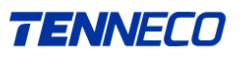

**[Image: 56f5045e-8dae-4218-84f5-152b9773a86c.pdf-0001-00.png (317x50, 12.0KB)]**

**_TENNECO CLEAN AIR INDIA LIMITED (formerly known as Tenneco Clean Air India Private Limited) CIN: U29308TN2018FLC126510 Telephone: +2135 612501/506 Email: Tennecoindiainfo@tenneco.com Website: www.tennecoindia.com_** 

Date: 10th December, 2025 

To To National Stock Exchange of India Limited BSE Limited Exchange Plaza, C-1, Block G                                                         Phiroze Jeejeebhoy Towers Bandra Kurla Complex,                                                                  Dalal Street, Bandra (E), Mumbai – 400051 Mumbai – 400001 Scrip Symbol: TENNIND                                                                 Scrip Code: 544612 

**Sub: Transcript of the Earnings Conference Call for Analysts and Investors held on Friday, December 5, 2025** 

Dear Sir/Madam, 

Pursuant to the provisions of Regulation 30 read with Part A of Schedule III of the SEBI (Listing Obligations and Disclosure Requirements) Regulations, 2015 and in continuation to our intimation letter dated 2nd December, 2025, we hereby submit the transcript of the Earnings Conference Call for Analysts and Investors held on Friday, 5th December, 2025. 

Further, the transcript is also being made available on the Company’s website at: <u>https://tennecoindia.com/investor-relations/.</u> 

You are requested to kindly take the same on record. 

Sincerely, 

_For_ **Tenneco Clean Air India Limited (Formerly known as Tenneco Clean Air India Private Limited)** 

ROOPALI Digitally signed by ROOPALI SINGH SINGH Date: 2025.12.10 13:27:45 +05'30' 

____________________________ 

**Roopali Singh Company Secretary and Compliance Officer Membership No: A15006** 

Place: Gurugram 

Encl: As above 

_Registered Officer: RNS2, Nissan Supplier Park, SIPCOT Industrial Park Oragadam Industrial Corridor, Sriperumbudur, Taluk, Kancheepuram, Kancheepuram, Tamil Nadu, India, 602105_ 

**[Image: 56f5045e-8dae-4218-84f5-152b9773a86c.pdf-0002-00.png (474x126, 20.0KB)]**

# “ Tenneco Clean Air India Limited 

Q2FY26 & H1FY26 Earnings Conference Call” 

# December 05, 2025 

**– MANAGEMENT: - MR. ARVIND CHANDRASEKHARAN WHOLE-TIME – DIRECTOR AND CHIEF EXECUTIVE OFFICER TENNECO CLEAN AIR INDIA LIMITED - MR. MAHENDER CHHABRA – CHIEF FINANCIAL – OFFICER TENNECO CLEAN AIR INDIA LIMITED - MS. ROOPALI SINGH – COMPANY SECRETARY AND – COMPLIANCE OFFICER TENNECO CLEAN AIR INDIA LIMITED** 

Page **1** of **19** 

_Tenneco Clean Air India Limited December 05, 2025_ 

**[Image: 56f5045e-8dae-4218-84f5-152b9773a86c.pdf-0003-01.png (305x82, 9.1KB)]**

## **Moderator:** 

Ladies and gentlemen, good day and welcome to the Q2 and H1FY26 Earning Conference Call hosted by Tenneco Clean Air India Limited. As a reminder, all participant line will be in the listen-only mode and there will be an opportunity for you to ask questions after the presentation concludes. Should you need assistance during the conference call, please signal an operator by pressing star then zero on your touchtone phone. 

I now hand the conference over to Ms. Roopali Singh, Company Secretary and Compliance Officer from Tenneco Clean Air India Limited. Thank you and over to you, ma'am. 

## **Roopali Singh:** 

Thank you, Danish. Good evening, ladies and gentlemen. We welcome you to the first earnings call of Tenneco Clean Air India Limited. Today, we will be discussing the results for the quarter and half-year ended 30th September 2025. I take this opportunity to introduce the management team. I have with me Mr. Arvind Chandrasekharan, Whole-Time Director and CEO, Mr. Mahender Chhabra, Chief Financial Officer. 

A presentation on the business and financial performance is available on the company's website and on the website of the stock exchanges as well. We will begin with Mr. Chandra providing a business update followed by Mr. Chhabra covering the financial results. This should approximately take about 15 minutes after which we will open the floor for Q&A session of about 45 minutes. 

With that, I would now hand it over to Arvind. 

**Arvind Chandrasekharan:** Great. Thank you. Thank you very much, Roopali. So, good evening, everybody. And first, let me start by wishing you all good health and happiness and let me be the first to wish you a very Happy New Year for 2026. Thank you all for joining us for Tenneco Clean Air India's first earnings call as a listed company. This is a very important moment in our journey and the strong IPO reception with subscriptions of over 61 times reinforces the trust placed in us by our customers, our partners, and now our shareholders. 

As we begin this new chapter, our focus remains on strengthening the business through disciplined execution and building on the capabilities that have shaped our performance over the years. Tenneco India has always had a clear and simple purpose, to be the most trusted partner and the world's best manufacturer and distributor in the transportation industry. We engineer and manufacture the critical systems and products that make mobility cleaner, safer, and more comfortable. 

Our product portfolio stands two integrated pillars, clean air and powertrain solutions, where we support OEMs and increasingly complex emissions, efficiency, and durability requirements, and advanced ride technologies, where our suspension and ride performance systems play a central role in delivering comfort and handling, especially as the India market continues to premiumize in the coming years. 

These pillars come together through a shared engineering and manufacturing backbone, reinforced by global R&D support with 5,000 plus patents and four decades of experience operating across the Indian automotive market. Being part of the Tenneco Group gives us the scale and engineering depth of a multinational leader, enabling us to bring cutting-edge 

Page **2** of **19** 

_Tenneco Clean Air India Limited December 05, 2025_ 

**[Image: 56f5045e-8dae-4218-84f5-152b9773a86c.pdf-0004-01.png (305x82, 9.1KB)]**

technology and manufacturing best practices into our India operations. We have established strong market leadership across our four product categories. 

In clean air, for example, we lead the market in India for commercial truck and off-highway OEMs, while in advanced ride technologies, we are number one in the supply of shock absorbers and struts for passenger vehicles. This leadership is a result of decades of manufacturing excellence and sustained collaboration with OEMs across segments. What differentiates our model is the way this ecosystem is structured. 

We bring global R&D, local applications engineering, simulation and testing, and manufacturing together with a unique operating model across 12 plants and two R&D centers located close to OEM bases. This gives us the ability to make more affordable products, which our customers want, reduce validation costs, pursue light weighting technologies, and enable faster time to market. 

In manufacturing, we bring high safety and zero-defect process discipline in our continuous endeavor to be the most trusted partner for our OEMs. This approach has helped us build longstanding partnerships of an average of 20 years with the country's major passenger commercial vehicle and off-highway OEMs, and these relationships continue to strengthen as the platforms evolve and require more advanced content. 

When we look at the broader industry, the trends are very supportive. Demand for passenger and light commercial vehicles in India is good, driven by a shift towards larger and more premium models, rising expectations around safety and comfort, and increased disposable incomes. 

Stricter emission standards are also raising the need for more advanced clean air and powertrain solutions across all vehicle segments. In parallel, India is emerging as an important export hub for global OEMs, thanks to our engineering talent, competitive cost base, and resilient supply chain. These shifts align very closely with our strengths and strategy to be the export hub for the world, for both third-party exports and to our global clients. 

With our leading positions in several of our core product areas, our exports already reach 20 countries and are poised to grow further. Financially, we delivered a solid performance in Q2FY26 and H1FY26, with value-added revenue growing 8.9%, and 8.2% year-over-year, and clearly outperforming the served applicable market growth. Our EBITDA and PAT margins remained at strong levels throughout the period, demonstrating the quality of our earnings and the inherent resilience of our operating model. 

On capital efficiency, we continue to post numbers in cash conversion cycle, pre-cash flow generation, debt-to-equity, and ROCE numbers that are industry-best-in-class. Mahender Chhabra, our CFO, will walk you through the financials and key drivers in more detail. 

Now, I am also very happy to report that we have secured important strategic wins of INR98.4 billion, which is INR9,840 crores, in incremental lifetime bookings, including INR17.6 billion of exports, which is about INR1,760 crores. These are on top of the INR43.8 billion value-added revenues from FY25, which is INR4,380 crores. So, these are additive to that. So, these bookings 

Page **3** of **19** 

_Tenneco Clean Air India Limited December 05, 2025_ 

**[Image: 56f5045e-8dae-4218-84f5-152b9773a86c.pdf-0005-01.png (305x82, 9.1KB)]**

include a strategic clean air business entry into a leading Japanese passenger vehicle OEM, which was previously untapped white space for us. 

It also includes another major advanced ride technologies win with a prominent Indian OEM, thereby further securing our number one position in shock absorbers in India. These bookings represent lifetime value-added revenue potential from awarded programs, which are yet to start production and materially enhance the company's revenue visibility over the next five to six years approximately. 

Finally, I want to acknowledge the contribution of our people. The strength of Tenneco India lies in its engineering and manufacturing teams. The engineers, the technicians, the operators, the supervisors, the managers across our various sites. They are the ones who ensure precision, reliability, innovation, and continuous improvement every single day. 

As we have transitioned into a listed company, their daily dedication, the velocity of decisionmaking, and the tenacious execution remains the bedrock of our culture and hence our performance. 

With that, thank you once again for your time. I will now hand you over to our Chief Financial Officer, Mahender Chhabra, who will take you through our financial performance for Q2FY26 and the H1FY26. Over to you. 

## **Mahender Chhabra:** 

Thank you, Arvind. Good evening, everyone, and thank you once again for joining us in today's call. Let me walk you through the financial highlights of Tenneco Clean Air India Limited for Q2FY26 as well as H1FY26, keeping the discussions aligned to a Value-Added Revenue or VAR, which is the most appropriate representation of our operating performance given the passive nature of substrate or precious metals. It has been a strong quarter and a strong half-year as far as financial performance is concerned. 

I will start with Q2 first. For Q2FY26, value-added revenue stood at INR11,515 million, a growth of 8.9% year-on-year, and it has been supported by stronger customer demand across key programs both in domestic as well as export markets. EBITDA for the quarter was at INR2,168 million, up by 5.7% year-on-year, with strong margins at 18.8%, while PAT was at INR1,507 million, up by 9.9% year-on-year, and in terms of percentage, it was at 13.1%. 

Reported revenues from operations for Q2FY26 was INR12,806 million, up by 9.6% year-onyear, reflecting steady momentum across the business. Then in terms of H1FY26, our valueadded revenue was INR23,181 million, and a growth of 8.2% year-on-year, and in both the periods, Q2FY26 as well as H1FY26, our growth exceeded the sub-markets of PV, CT, OH, and industrial, which grew 5% in Q2FY26 and 4% in H1FY26, underscoring the strength of our demand profile. 

For H1FY26, the EBITDA was INR4,457 million, at a growth of 6.6% year-on-year, with strong margins at 19.2%, and PAT for the half-year was INR3,188 million, 10.9% up year-on-year, with margins at 13.8%. For the first half, the revenue from operations stood at INR25,663 million, growing 5.2% year-on-year. 

Page **4** of **19** 

_Tenneco Clean Air India Limited December 05, 2025_ 

**[Image: 56f5045e-8dae-4218-84f5-152b9773a86c.pdf-0006-01.png (305x82, 9.1KB)]**

Our profitability in H1 reflects the benefit of top-line volume growth, product mix improvement, operational and capital efficiencies, and PAT margins expanded by 34 bps year-on-year. This was aided by the stable material cost and higher interest income during the period. These factors effectively supported a sustained financial performance, both for Q2FY26 as well as H1FY26. 

In terms of operational and capital efficiency, we maintained a strong return on capital employed profile and continued to operate with negative working capital intensity. Our cash conversion cycle for H1FY26 stood at negative 22 days, underscoring the capital-efficient nature of our business model. 

We continue to stay debt-free and have been meeting all our requirements in terms of capex as well as working capital to internal accruals. Further, we have very healthy fixed assets turnover ratio, which is resulting from the efficient capital investment through standardization and modular approach in manufacturing. 

Looking at our segments, Clean Air and Powertrain solutions delivered revenue of INR5,702 million in Q2FY26, growing 3% year-on-year, while advanced ride technologies delivered INR5,813 million, up by 15.4%. This has been supported by overall volume growth and the increasing demand for dynamic suspension components and continued momentum in exports. 

For the balance sheet, we continue to operate with financial discipline. Operating cash flow for the H1FY26 was INR11,220 million, supported by our efficient working capital cycle. Capex for period stood at INR246 million, and that is in line with the planned investment across our facilities and our localization roadmap. 

Just to summarize the financial performance, for Q2FY26 and H1FY26, it demonstrated steady revenue growth, consistent profitability, and continued balance sheet strength. Mixed optimization and operational discipline supported our margins, while a capital-efficient model enabled strong ROCE and a negative working capital cycle. With that, we believe the business remains well-positioned as we move into the second half of the year. 

Thank you, and with that, I would hand it over to Roopali. 

## **Roopali Singh:** 

Thank you, Mahender. We will now move to the Q&A session, which will be led by Arvind and Mahender. We request participants to kindly limit questions to two at a time. If you want to ask additional questions, please rejoin the queue. I will now request the moderator to please commence the Q&A session. 

## **Moderator:** 

Thank you, ma'am. Ladies and gentlemen, I would like to read the call disclaimer before we proceed with the Q&A session. 

This conference call may contain forward-looking statements about the company, which are based on beliefs, opinions, and expectations of the company as on the date of this call. These statements are not the guarantee of future performance and involve risks and uncertainties that are difficult to predict. 

Page **5** of **19** 

_Tenneco Clean Air India Limited December 05, 2025_ 

**[Image: 56f5045e-8dae-4218-84f5-152b9773a86c.pdf-0007-01.png (305x82, 9.1KB)]**

We will now begin with the question and answer session. Our first question comes from the line of Ravi Gupta from InCred Capital. Please go ahead with your question. 

## **Ravi Gupta:** 

Thank you for the opportunity and congratulations on the great set of numbers and the bumper listing. So, my first question is related to the export order book. Could you please help us understand the execution timeline of it and also outline which products are part of this order and the key market or the location you'll be supplying to? Thanks. 

**Arvind Chandrasekharan:** Hi, Ravi. It's nice to meet you. So, yes, so very good question. Look, like I said, we've had a very, very good order booking cycle. If you look at our order booking formula, everything that's not in production and has been booked as of September 30, 2025. And these are lifetime revenues. Typically, an order booking program life is five to seven years. 

Obviously, commercial trucks might be a little bit longer. Some might be a little bit shorter. So, overall, five to seven years. Exports order book comes in two parts. One is the exports to thirdparty OEMs, and the second one is exports to our own, Tenneco India exporting back to Tenneco Global. 

Right now, the good thing is we're getting exports on both sides, Clean Air and as well as clean air powertrain as well as NRS, which is these advanced ride technologies business. So, we are booking business fast. A lot of the bookings are coming from third-party exports. Obviously, I cannot reveal the customer names because we don't have the permission yet. But suffice to say that exports is going to grow much, much, much faster than our domestic business simply because they're starting from a low base. 

If you remember our roadshows and press conferences, we always said, look, we started from a low base of only 5% product exports. And now, if you look at our Q2FY26 numbers, we're already somewhere around 7% or 8%. So, that percentage of exports as part of the total pie is growing slowly. 

And the other great thing about exports is exports are coming in at nice marginsAnd as the nice margins come in, the product mix will also help us improve our margins over time. Now, typically, it takes about a year, year and a half to kind of get the product validated, propagated, and into production. So, you would expect to see a lot of this start to come in late FY26, FY27, FY28, and so on. That's why it's because we have a longer sales cycle. 

So, obviously, I cannot give specific customer names and so on. But all I would say is they are great. They are growing faster than domestic business at a very high cadence. They are more profitable. And they include both clean air parts and the advanced light technologies business, including full products as well as you can call it semi-finished assemblies, components. 

So, for example, advanced ride technologies, there will be products like rods and center parts that will actually benefit even our European brothers and sister divisions to be more competitive 

Page **6** of **19** 

_Tenneco Clean Air India Limited December 05, 2025_ 

**[Image: 56f5045e-8dae-4218-84f5-152b9773a86c.pdf-0008-01.png (305x82, 9.1KB)]**

as they buy from us and then sell back to their audience, right? So, that's also another area for growth. 

So, third-party exports growth, can it go India? Can it go global in terms of full finished goods as well as semi-finished sub-assemblies or components? So, that's why it's so exciting for us because India obviously has labor arbitrage. The advantage of the lower labor cost and also, we are, because of technology equalization. 

Five, ten years ago, India was always behind technology. But now, in both clean air powertrain and in advanced ride technologies, if you look at what products we sell to our local OEMs, in clean air, for example, which is BS 6.2, the same product with same technology and the same legislation can also be exported to Europe as part of Euro 6, right? And their own version of real driving emissions. 

Same thing on the shock absorber advanced light technology side, right? We can also export the same technology like a semi-active suspension that we're selling to our Indian OEMs also to our European OEMs. So, it's a very exciting period for us and thank you for asking the question, Ravi. 

## **Ravi Gupta:** 

Thanks for the detailed explanation. My second question is in regard to the margin. So, what was the margin for the clean air segment and the advanced ride performance segment in this quarter? And also, if you can share full year guidance or directional outlook on the margin front. Thanks. 

## **Mahender Chhabra:** 

Okay. So, Ravi, hi. So, as far as BU margins are concerned, we as a management team have not yet clues on that. We would be disclosing the margin at an overall level, not at a BU or  segments level. So, that's about the margins at a business level. 

In terms of the full year guidance on the margins, so, as you know, we have got listed very recently. There are certain costs related to operating as a listed public limited company, for example, management costs, director fee, compliance costs, and other costs related to legal IT and all. 

We expect EBITDA to be a bit soft, but with increase in the revenue in the coming years, these additional costs will get absorbed as we progress and we come back to the same levels. Hope that helps. 

## **Moderator:** 

Thank you. Our next question comes from the line of Vipul Agrawal from HSBC Bank. Please go ahead. 

## **Vipul Agrawal:** 

Hi, sir. Thank you for taking my question. My first question is on the capacity expansion side, like you highlighted earlier that you'll be extending capacity, almost doubling the capacity over the next three to five years. So, can you just talk about where are we right now? And if you're putting up new plants or expanding in the current capacity, maybe separately on clean air and suspensions both? 

Page **7** of **19** 

_Tenneco Clean Air India Limited December 05, 2025_ 

**[Image: 56f5045e-8dae-4218-84f5-152b9773a86c.pdf-0009-01.png (305x82, 9.1KB)]**

## **Mahender Chhabra:** 

Yes. Thanks, Vipul, for asking the question. So, good news is the order book visibility that we have and that we have disclosed. So, considering growth plans and order book visibility that we have, we will be investing more in the capacity expansion. I mean, in the expansion towards the capacity and also in the expansion related to technology. 

We know, like, specifically in advanced ride technologies, the things are moving from conventional to semi-active suspension systems. So, we'll have to invest towards that as well. So, we would be investing in line with the growth plans that we have, including putting up the new plants in the coming years. 

**Arvind Chandrasekharan:** Sorry, Vipul, just to finish that. Also, some of that capex growth, will also come from transfer of capex from other Tenneco regions into India, simply because we can make it much cheaper and more affordable out of India. So, that way we get the benefit of the lower capex. 

So, that's one of the reasons why, if you notice, our CA numbers are always very, very high, Very exciting, big, nice numbers. So, it's a combination of normal volume growth of India, which is the expansion capex, then there is technology related capex as we get into more advanced dynamic suspension. For example, or into, like, gasoline particulate filters for capex. 

And the other thing is the capex transfer that happens from moving a lot of equipment from maybe Europe and other regions to India and then exporting back from here. And that, again, is a nice margin, and we're very excited about that as well. 

## **Mahender Chhabra:** 

Yes, and just to add to that, like, look at the way we do the capital investment, if you look at the way our FAR is. So, our capital investment has always been pretty efficient through standardization and modular approach. And since we do not have any debts and we're kind of getting decent accrual cash flow accumulation, so we intend to make all the capex requirements in the coming years from our internal accruals. 

## **Vipul Agrawal:** 

Yes, understood. So, thanks for that very detailed answer. Next question is on the export side, like, will you be disclosing your exports numbers in going forward, like, maybe separately for, like, you gave revenue numbers for clean air and suspension separately. Would it be possible to give separate export numbers as well for the sector of both segments? 

**Arvind Chandrasekharan:** Yes, I think that's not a bad idea. I think that's a good suggestion. I think we can look at it. Right now because we are just starting our journey, right? I mean, exports, if you remember, if you remember, Vipul, if you remember from the roadshows and the press conferences, historically with Tenneco, if you go back, let's say, a decade, exports was never a focus. It was always local for local, right? It was Europe for Europe, US for US, China for China. 

Now, for the first time in Tenneco India has become Tenneco India for the world. So, which means we export. If we are competitive, we get to export to third-party OEMs and we also get to support other regions from, to enable them from being competitive, right? So, that Tenneco Europe benefits from having Tenneco as a supplier of anything from sub-assemblies to components to even for finished parts, right? 

Page **8** of **19** 

_Tenneco Clean Air India Limited December 05, 2025_ 

**[Image: 56f5045e-8dae-4218-84f5-152b9773a86c.pdf-0010-01.png (305x82, 9.1KB)]**

So, at some point, I think when we get some critical mass, let's, we could possibly separate that. In any way, right, it's a  very exciting story for us and that's what makes us grow our business much, much faster because it is like the labor advantage plus technology equalization. 

And also, don't forget, many customers themselves, if you look at the Western OEMs are all pushing forward India to be an export base. So, by default, the business is being forced to come to India just because Western OEMs are asking for a contingency planning. So, they want to diversify their supply chain risk. 

So, that also benefits us. So, I think all of this makes it very exciting. So, very good question. Let's think about it. I think it's not a bad idea, but let us gain some critical mass. Once we have some good bookings, we're starting to see a lot of export bookings. So, I think once that solidifies into a nice number, we could possibly separate that and show that in future earnings. 

## **Vipul Agrawal:** 

Actually, that would be really, really helpful if you can give your order book as well in Clean Air and ART division. That would be really helpful just to understand because both businesses are very different in nature. So, that would be really helpful. 

## **Arvind Chandrasekharan:** Understood. 

## **Moderator:** 

Our next question comes from the line of Jeemit Shah from Motilal Oswal Financial Service Limited. Please go ahead. 

## **Jeemit Shah:** 

So, a couple of questions. Largely on the order book side. So, the INR9,800 crores order book majority from the domestic. So, number one, this is because we have certain projects from the Japanese OEM in the India business. 

So, is that a major chunk of potential businesses that we can get from them? I'm just trying to assess that. Is there potential to significantly increase our order in that specific OEM's wallet share? 

**Arvind Chandrasekharan:** Yes. So, first of all, the INR9,840 crores, that is lifetime revenue. So, it represents all booked business before September 30th, 2025 that are not yet in production. And it is a pretty long laundry list of many, many acquisitions or many, many business wins. 

The reason we called out the Clean Air business win with this Japanese OEM is because it is so strategic for us that getting a foot in the door of this OEM opens us up to a huge opportunity in terms of growth, in terms of market share. The fact that this customer said, okay, you can be part of our supplier panel gives us that entry. So, yes, to answer your question, huge opportunity for growth in Clean Air because of the strategic. 

That's why we call it a strategic win in the white space. White space is an area where we've never been allowed to play in for whatever historical reasons. But now that we are a team member of the panel, we are allowed to play and also grow and participate in RFQs, etcetera. So, this is a huge win for us. The other win being consolidating our position at a very well-known Indian OEM for shock absorbers. So, we are basically constantly inching our way up the market share. 

Page **9** of **19** 

_Tenneco Clean Air India Limited December 05, 2025_ 

**[Image: 56f5045e-8dae-4218-84f5-152b9773a86c.pdf-0011-01.png (305x82, 9.1KB)]**

We are already number one in shock absorbers. We're kind of taking it to the next levelslowly adding a few percentage points of market share is what's happened. I think shock absorbers were already about 52%. 

You would have seen from the DRHP to the RHP that 48% has already gone to 52% market share, which is again from CRISIL. So, CRISIL has given us that number. So, anyway, I think to answer your question, these wins are very strategic and allow us to grow faster in the next few years. 

## **Jeemit Shah:** 

So, is it fair to assume that these orderings are not counted in the lifetime order books? 

**Arvind Chandrasekharan:** No, no, they are. They're all part of the INR9,840 crores. The reason we just called them out is because these two wins have the ability to take us further into the panel in a bigger way. Some order books are more, let's say, visible and successful product than others. 

## **Jeemit Shah:** 

Yes. Secondly sir, on the exports front, more of a growth thing. So, we're expecting the exports growth to be much, much higher than the domestic growth. So, is this growth that we're expecting largely because they're consolidating the global operations in India and making India the exports hub or is it incremental order wins in the wallet share of existing customers around the globe? 

**Arvind Chandrasekharan:** You know, it's all of the above. Let's start with third-party OEMs. Third-party OEMs are pushing for a supplier-to-build. By the way, some of it is not even to do with cost. It's global OEMs, Western OEMs saying that, hey, Tenneco, we want you to put more business into India because we want to source product out of India for export to either an infant client at the customer or a full assembly plant at the customer. 

So, this is coming from an edict from the customers themselves saying we want to use India as an export hub. So, this way you can call it a China Plus One or sort of a diversification strategy, and this comes from post-COVID when there was a big supply chain issue. 

If you remember, the years after COVID, there were huge supply chain issues and they don't want to be in that situation anymore. So, why is India a great export hub? One, it's access to engineering talent, access to operational talent. 

India scales much better than any other country other than China. And also, the ability to source raw material, ability to get affordable prices, affordable costs. So, that is driven by third-party OEMs. 

Now, even internally, to answer your question, there is going to be consolidation of the technical group, but don't forget the technical group is a $17 billion company, in terms of total revenues and in terms of value-added revenues around $14 billion or so. 

But still, $14 billion compared to our side, we are only about $500 million versus the corporate value-added revenue of $14 billion. So, there is a lot of opportunity for consolidation. There is a lot of opportunity for labor cost arbitrage. There is a lot of opportunity for bringing business to India and using it as a mobile hub, an export hub to support our own Tenneco operations in 

Page **10** of **19** 

_Tenneco Clean Air India Limited December 05, 2025_ 

**[Image: 56f5045e-8dae-4218-84f5-152b9773a86c.pdf-0012-01.png (305x82, 9.1KB)]**

Europe and the U.S. to help them become more competitive. Don't forget that even Western OEMs are putting a lot of price pressure. 

Price, is all about cost with the latest technology. So, we in India can be a very good supplier of these either component, subsystems, assemblies, and even finished product. And our job, right, my job is to make sure we are technology-ready, and luckily, we happen to have excellent R&D centers. 

We have two state-of-the-art R&D centers for clean air, a power plant, and for suspension, what we call advanced ride technologies. And because of the strength of the local engineering team, the applications engineering team, we are able to deliver these kinds of mandates even coming from our Tenneco Group to us saying, okay, can you make this product at a certain price? And we're able to deliver that. So, those two put together give us excellent export attraction in the next few years. 

## **Jeemit Shah:** 

Just a clarification, would it be possible to share out of the INR70 crores, INR50 crores that we've booked currently in this quarter for exports and all the wins, how much would it be from third party and from the Tenneco Group Companies? 

**Arvind Chandrasekharan:** I guess we have not reported that. We can think about how to report that. But roughly, I'm telling you, the growth is coming actually on both sides equally. Don't forget that this is just not an advanced ride technologies business. Because of technology equalization, right, the same BS 6.2 with RDE, what we supply to the, let's say, commercial trucks or even OEMs, Indian OEMs, the same product can be exported back to Europe. 

So, even clean air and even powertrain has a lot of potential for export. So, I think in that 70-60, I mean, I wouldn't be able to tell you the exact numbers, but let's put it this way. The growth is coming from both engines nicely and coming both from third party OEMs and from our own domestic, let's call it Tenneco India to Tenneco Global. So, it's firing on all cylinders, I might say. 

## **Moderator:** 

Thank you, sir. Our next question comes from the line of Pradip Pandey from Axis Capital. Please go ahead. 

## **Pradip Pandey:** 

Hello, sir. Thank you for taking my questions. I had two questions. One was on precious metal cost, which has been on the rise since the middle of Q1. And since your royalties are linked to revenues from operations, what impact do you see on margins in that sense? That's one. And so, okay, let's first go ahead with one and then I'll ask the second question? 

## **Mahender Chhabra:** 

Yes, sure. So, as we know, like, the substrates are a pass-through, which we buy at the direction of the customers and we recover the money from the customers. I mean, it doesn't really impact the profitability in terms of EBITDA absolute, but yes, in terms of EBITDA margins, it makes our profitability look, gives the right picture. 

Page **11** of **19** 

_Tenneco Clean Air India Limited December 05, 2025_ 

**[Image: 56f5045e-8dae-4218-84f5-152b9773a86c.pdf-0013-01.png (305x82, 9.1KB)]**

Now, in terms of royalty, we are paying 2.5% royalty to our corporate, which is kind of, this being a related party transaction, it has been, there has been a benchmarking that has been done. It has been evaluated by a independent third party and approved by the Independent Board. 

Now, in terms of this royalty, yes, we know that we have been paying this royalty on the overall revenue from operations. And the benchmarking was done considering that we would be paying royalty on the overall revenue and not on the VAR. 

To answer your question, the impact of margin is little to nothing. Because, first of all, precious metals content itself is a small part of the total. And on top of that, the 2.5% of that delta is going to come to nothing, right? So, if you just do the mathematics, it's really not, it's nothing. 

And plus, don't forget in return for just that 2.5%, which is fairly middle of the fairway for royalty, there are companies, MNCs that are as high as 5, 6%. So, 2.5% is fairly average. And for that, we get access to thousands of patents. 

And the fact that we are able to win all of this technology, new technology business, the win that I put in the press release is purely because of the access to technology that our corporate parentage gives us, right? So, the benefits are far, far more than the small royalty that we pay up. That's my point. Yes. Thanks. 

## **Pradip Pandey:** 

Yes. Understood. The second was on the EBITDA for last year. So, we reported 18.6% for the full year. And as I see the first half EBITDA margin is 19.5. So, is there an element of seasonality in the margins or was there some higher margin that were done in the first half? That is why we see the margins to be slightly subdued in second half? 

## **Mahender Chhabra:** 

Yes. So, yes, our margins in first half have been really good. And if you compare to the previous year where we were at 18%, we are better off. Now, in terms of the guide, I mean, one of the main reasons for that has been the increase in the exports, where we got really good margins on those exports. 

In terms of going forward, like I said, we have become a public listed company now. There are certain costs that are related to running such an organization. And for example, the cost of the senior management, compliance, leverage related costs. So, we would be incurring these costs and EBITDA margin could be a bit soft in the next couple of quarters. 

But as the business grows, we would be able to absorb these costs with the incremental revenue and the margins that we make. And we should be coming back to the same levels. 

## **Moderator:** 

Thank you. Our next question comes from the line of Himanshu Singh from Baroda BNP Paribas. Please go ahead. 

## **Himanshu Singh:** 

Yes. Hi, sir. Thank you for the opportunity. So, can you please highlight what is driving the performance at the ART segment? And what is the mix of different type of tech within the ART segment? 

Page **12** of **19** 

_Tenneco Clean Air India Limited December 05, 2025_ 

**[Image: 56f5045e-8dae-4218-84f5-152b9773a86c.pdf-0014-01.png (305x82, 9.1KB)]**

**Arvind Chandrasekharan:** I can sort of start it off in mind that if you want to add anything, right? 

**Arvind Chandrasekharan:** So, Himanshu. Advanced ride technologies in India right now, 95% plus of the business is conventional shock absorbers, right? And these are fairly commoditized. Everybody uses them and has been using them for decades. What's happening in India right now is a massive disruption, okay? I think primarily driven by benchmarking that's done by our Indian OEMs finding out that their competitors overseas are able to make advanced suspension in vehicle prices that are quite affordable. 

So, this is like an eye-opener. And this has prompted several of our top Indian passenger vehicle OEMs to really start thinking about what, if we don't disrupt ourselves, then we're going to be in trouble. And in India ride handling, comfort while sitting in a vehicle is the last remaining area for disruption. So, we've had everything. 

We went from small cars to SUVs. We went to connectivity and Bluetooth. We went to excellent interior, sunroof, ADAS has come, emergency braking, but that last remaining frontier happens to be advanced ride technologies. So, as advanced ride technologies have come in, as you move from conventional to like a frequency dependent damping, which is still mechanical. 

But then you move into like an active or a semi-active or an active suspension, which requires more electronic controls, you find that the basic shock absorber accessory or paraphernalia grows. So, the content per vehicle starts growing dramatically and even more so when it comes to an electric vehicle because of the way the vehicle is dense and it's got a bigger, like a lower center of gravity, it needs a more robust suspension. 

So, the point I'm making is that as the technology roadmap advances from a basic conventional shock absorber to a more active suspension and that's happening very rapidly. In the next few years, you're going to see everybody and their brother, every OEM trying to push this in a big way because they have to keep up. It's a survival thing. 

Our margins will also track up simply because there are not that many suppliers out there who can provide such advanced technologies, including electronic controls, who can systems integrate, etcetera. So, we have that natural advantage and the best news is these technologies are already pre-validated. They are proven technologies. 

We are not coming in and we're not like using the customer as a guinea pig. We are already bringing in something that works elsewhere in another region. So, I think from that standpoint, we're excited because the growth rate of advanced technologies, because of the fast disruption, is going to be faster. 

It's going to take us to a place of higher margin because there's not that many competitors, at least for now and the fact that we have a higher velocity of execution. Why? Because we're the same company. We don't have any joint venture between us and the technical group. It is literally me calling up my boss and saying, hey, I need this technology here to localize very quickly. 

And with the strength of our local Indian applications engineering team, we're able to bring that to market faster. So, more than anything else, our Indian OEMs want something, but they want 

Page **13** of **19** 

_Tenneco Clean Air India Limited December 05, 2025_ 

**[Image: 56f5045e-8dae-4218-84f5-152b9773a86c.pdf-0015-01.png (305x82, 9.1KB)]**

it now. They want the advanced technologies now and they're not willing to wait for like two or three years. They want it like within months and we're able to do that uniquely. So, that's sort of the answer to your question. So, yes, margins will go up, but it will take some time, but the adoption rate will be faster simply because it's a survival thing for our OEMs. 

**Himanshu Singh:** Okay, thank you. And how much was the listing expenses and which line item you have included that in? **Arvind Chandrasekharan:** So, the listing expenses were to be borne by the selling shareholders, so that's not part of my P&L. **Himanshu Singh:** Okay. And sir can you highlight what was the growth on the export side for this quarter? **Arvind Chandrasekharan:** So, we don't have the growth number because we're not publishing the growth, but I think that's like the early -- if you were there earlier, there was a question earlier from one of the people that we should call our export separately. Right now, it's still very nascent stage, but it's growing very, very fast. So, I think for a future earnings call, we might call that out separately and we might also publish growth rates, etcetera, that would be kind of nice to do. So, we'll take notes here and we'll make sure that we have something on export growth as well. 

**Moderator:** Thank you. Our next question comes from the line of Rahul Ranade from Goldman Asset Management. Please go ahead. **Rahul Ranade:** Yes, hi, sir. Thanks for the opportunity and congratulations on the successful listing. Just one kind of follow-up question on one of the earlier comments. So, what kind of headwind should we kind of expect in terms of the margins given the listing compliance costs, etcetera., that you talked about as one of the reasons for margins being muted going forward for the near term because generally, such cost at least doesn't kind of show up to be a material headwind for many of the companies that go IPO. So, I just wanted to understand that bit? 

**Arvind Chandrasekharan:** So, I'll start and maybe Mahender you can add. So, look, there are two different costs. One is the listing itself and that was paid for by the Apollo, the promoter as well sorry the promoter selling shareholder. This cost, what we're talking about, which has a sort of a soft impact on EBITDA is because of the fire of new leaders. 

New leadership, there's also strengthening of HR, IT, finance, because once you go to a public entity, you have to hire certain key resources to manage things like compliances and HR-related labor laws, etcetera. So, you are held to a higher level of scrutiny, which requires you to add certain headcount and at last, of course, there is also auditors and external consultants and advisors and so on. 

So, these are sort of cost additions that happen when you move from a private to public entity. However, having said that, once we add these costs, they will be pretty flattish, because the revenue growth will absorb these costs nicely. So, it's just a matter of a few quarters when the revenue growth catches up and we're able to absorb this much better. 

Page **14** of **19** 

_Tenneco Clean Air India Limited December 05, 2025_ 

**[Image: 56f5045e-8dae-4218-84f5-152b9773a86c.pdf-0016-01.png (305x82, 9.1KB)]**

But it's not material enough where you have to panic or anything. It's very, very minimal. We are adding leadership very carefully to make sure that we meet the needs of a public entity from a board and SEBI, etcetera perspective. But at the same time, we're going to stagger it over time so that it doesn't hit us severely in any specific quarter. 

Our headwinds are more about the general market. What happens to commercial trucks. For example, the road infrastructure, we're going through a 5-year low and commercial trucks don't seem to be growing in a big way. Or maybe there's a slowdown in the passenger vehicles, especially the B, C, D segments. 

Our headwinds are more to do with the market and how that market will behave. There is also potential, some headwinds around this labor code announcement, but that just happened a few days ago. So, most companies around India can't figure out what this means for us, right? So, every company will be affected by these new labor laws. 

So, our headwinds are more macroeconomics-related that affect everybody, not just us. We're not so worried about our own internal growth strategy simply because, like I said, we are already winning a lot of market share. We are growing with new technology with the OEMS, and we're also growing exports. So, all of those three are areas for growth for us. 

And of course, you know, white space, there's a lot of white space still that is untapped between clean air powertrain as well as advanced ride technologies. Mahender, you want to add something? 

## **Mahender Chhabra:** 

No, I think Arvind have covered everything. I mean, the cost of running a public limited company, like Arvind mentioned, one, we have been careful in kind of finding these costs, and this will come over a period of time. 

And by the time we get these costs in our P&L, we have kind of already the revenue and profitability, we'll be able to absorb these additional costs. So, we don't see any major impact on the P&L on some of these costs. But yes, these are essential costs that we need to incur. 

## **Rahul Ranade:** 

Sure, sure. No, that's helpful. And just wanted one more clarification in terms of what's the internal understanding in terms of the timelines for the tractor emission norms, because I understand that is one, you know, kind of meaningful trigger for us in terms of our clean air business. So, what's the current understanding on that? 

## **Arvind Chandra:** 

So, great question. Now, look, it depends on when the norms happen, right? So, TREM 5 is where we have our strongest position, right? Because TREM 5 forces a oxycat and a particulate filter where we are very, very strong.So, we're just waiting for the legislation to come in. 

It might be FY27, it might be early or later FY27. We think it'll be around 2027. And that's when those norms will very positively impact our sales revenue. We are, like I said, every time a legislation changes, or there's complexity, we come out on top. 

And this is the history of Tenneco. We have grown our market share over several years purely because of legislation where we can meet the affordability criteria, right? We can reduce weight. 

Page **15** of **19** 

_Tenneco Clean Air India Limited December 05, 2025_ 

**[Image: 56f5045e-8dae-4218-84f5-152b9773a86c.pdf-0017-01.png (305x82, 9.1KB)]**

We can make it lightweight. We can respect the packaging environment of the customer vehicle architecture. And we can deliver faster time to market. 

Time to market is so important for the OEMs. So, because we resonate on all of these four or five key dimensions, our ability to win every time that the legislation change, it becomes much, much stronger, That's how we have captured market share. 

Like on commercial trucks, we are meeting the market there as well, right? Very, very high market share you would have seen in our RHP as well. So, I think the timeline, I couldn't tell you, it really depends on when this legislation will be announced. I think, again, somewhere around 2027. But once that comes, then we are in very good shape because then we will have a lot of content growth for clean air within TREM 5. 

## **Rahul Ranade:** 

Sure, sure. And try to assume that this forms part of our order book that is chosen? The TREM 5? 

**Arvind Chandrasekharan:** Yes. There are lots of, there are TREM 5 order books in here as well, yes. Good observation, yes. And it will continue to be. I'm just saying, the order book is just the snapshot in time. So like after September 25th, we will still be booking lots of business. So, that's already set in motion so that there will be more legislation-related bookings. 

Like for example, CAFE norms There will be still more CAFE norms-related bookings for passenger vehicles. There might be something around BS7 for example, if they do a watered down BS7 it's pulled ahead. I've heard about some discussions around then pulling ahead some of these legislations forward. 

So, if that happens, then we will be growing our content per vehicle there. And same thing on the shock absorber, advanced ride technology side. So, depending on how quickly the OEMs want to disrupt themselves in the comfort area or, let's say, dynamic suspension area, we will be there to support them. 

## **Moderator:** 

Thank you. Our next question comes from the line of Jeemit Shah from Motilal Oswal Financial Limited. Please go ahead. 

## **Jeemit Shah:** 

Thanks for the opportunity again, sir. Just circling back to the exports front, is there a particular timeline that the management or the promoter has in mind to kind of consolidate the plans into India? 

Maybe the customers are pushing for it, maybe we want to leverage the recent listing to have a stronger growth impact by manufacturing more over here and shut down a couple of plants overseas which are more, I mean, less cost-efficient. 

**Arvind Chandrasekharan:** So, one of the core values of our company is organizational velocity and tenacious execution. These are the two main values. And you wouldn't have seen values like that in any other company, right? So, we have a very interesting set of values. So, organizational velocity really talks about what it takes a company 3 years, you know, months. 

Page **16** of **19** 

_Tenneco Clean Air India Limited December 05, 2025_ 

**[Image: 56f5045e-8dae-4218-84f5-152b9773a86c.pdf-0018-01.png (305x82, 9.1KB)]**

For us, it takes weeks. We make decisions very, very fast. And tenacious execution means the high level of accountability and transparency and the discipline, the daily discipline that comes with executing, right, a program or a task. 

If you look at our group performance, just forget India for a second. If you just look at the Tenneco Group, they've made an amazing transformation at the group level. So, India's success, right, the Tenneco India success is a subset of the fantastic success that the group has also had. 

And you can go online and check what they've done to their EBITDA margins in just 3 years. It's insane how wonderfully our global CEO, Jim Voss, and the Executive Leadership Team have led this company into one of the best transformations in the auto industry, right? And India has also done very well in the last 3 years. We've achieved very nice EBITDA margins. 

So, I think to answer your question, that high velocity and, disciplined, tenacious execution will ensure that looking at a clean sheet approach, we are always looking at ways in which we can make a higher enterprise value for our overall Tenneco Group. And if that means moving more business to India quickly, we will do that. And this is happening already. I can tell you that. All right. 

Now, in terms of third-party OEMs, yes, there's a push, but there's also, you know, it takes some time to test the product, validate the product, homologate the product, because now you're moving, let's say, the same part from Europe to India, and then it has to be validated, and then you have to check all the logistics and etcetera. 

So, that takes a little bit of time. But I'm just saying that from the fact of using India as an export hub, there's a tremendous drive from our Western OEMs to push more and more business to India. 

So, those two, the Tenneco internal need to achieve higher enterprise value that automatically puts India in a very favorable spot from the labor arbitrage standpoint, and secondly, OEMs, customers themselves pushing to say, hey, I want this out of India. I want to have a supply chain diversification, which is not just cost, but also contingency planning from a supply chain standpoint, right? 

So, all those will help our exports go faster. I cannot tell you, whether it's going to happen, in two years, three years, four years. All I would say is that the velocity is there for both sides to happen, from the internal Tenneco group as well as the third-party OEMs. 

## **Jeemit Shah:** 

Sure, sure, sir. So, secondly, on the Advanced Ride Technology system, sir, you mentioned that all of the Indian OEMs are trying to go for more of a semi-automatic from a mechanical suspension point of view. So, are there any tangible things that we can track? Maybe RFQs, the change in RFQs as a percentage, like, let's say, if there's an X number of RFQs, which are for advanced semi-automatic technologies, where are they now? Like, is it a 2X or a 3X increase in RFQs? Are the OEMs also trying to track, you know? 

Page **17** of **19** 

_Tenneco Clean Air India Limited December 05, 2025_ 

**[Image: 56f5045e-8dae-4218-84f5-152b9773a86c.pdf-0019-01.png (305x82, 9.1KB)]**

**Arvind Chandrasekharan:** I think what you're saying is, is it possible to get better RFQ visibility on the technology disruption that's happening, right? So, look, the technology disruption is already set in motion. And you know, I won't take the name of the customer, but you can just YouTube this or Google it, and you'll know who's leading from an Indian OEM standpoint. It's very clear. 

I think that disruption has already started. Already conventional shock absorbers have given way to more, like, frequency-dependent damping. And that's already starting to become more transient as semi-active suspension started to take off, right? 

So, we're taking this very seriously. We want to localize this and bring this to the Indian OEMs as quickly as possible. So, I think,  all I would say in this is that, all it takes is one Indian OEM to say, you know what, I'm doing this. And their main marketing blitz is all about the ride quality, right? 

Ride quality, comfort, convenience, and that's the fact that we are making this the main differentiator for our end user, which is the car drivers, and the passengers and so on. So, for us, that itself means that all the other OEMs who are either fast followers or slow followers, they will have to do it. 

Otherwise, they will be left out from a marketing perspective. You don't want to be the last remaining OEM that says, I still sell basic shock absorbers from the 1990s or 2000s, right? So, you have to get a move with the times. And global technology has already moved in that direction. In China, for example, they've already moved to dynamic suspension. So, I think that thing is going to get disrupted really fast. 

Whether we can give you exposure or not, we'll have to discuss that, because a lot of these are confidential RFQs. But we'll tell you, I think whenever we book something that is new technology, or let's say a disruption 

We will make it apparent through an order book announcement, maybe once every six months or so, because these things, they have their own timelines in terms of getting the RFQs, coding, winning business, et cetera, right? But we'll figure out a way to kind of through our order book to give you some understanding of what that is. 

## **Moderator:** 

Our next question comes from the line of Pradyumna Choudhury from JM Financial Family Office. Please go ahead. 

## **Pradyumna Choudhury:** 

Yes, hi, thanks for the opportunity. So, if I look at your two segments, the growth in clean air and powertrain solutions was in 3% Yoy, right? So, that's actually slightly underperformed the end industry. So, what would be the reason for that? And like, how, like, what really is the growth expectation here? Would this segment also pick up? Or it would largely grow in line with the industry? 

**Arvind Chandrasekharan:** Yes, look, don't look at it just as a quarter, right? Look at the clean air part, and you have to zoom out, right? You have to zoom out and look at the bigger picture. So, there will be exports, there will be more growth happening in the near future. So, it's more of a quarterly thing. And 

Page **18** of **19** 

_Tenneco Clean Air India Limited December 05, 2025_ 

**[Image: 56f5045e-8dae-4218-84f5-152b9773a86c.pdf-0020-01.png (305x82, 9.1KB)]**

again, you have to remember that in some cases, like, because of this AC cabin requirement, right? 

Many OEMs pulled ahead a lot of their volumes to Q1, because they wanted to sell as many vehicles as possible without the AC cabin. Because the AC cabin means you have to pay another, I don't know, INR60, INR70, INR80,000. So, I think before that legislation kicked in around July, August, a lot of the commercial truck OEMs pulled ahead. 

So, you'll notice that our CAPT probably did better in the prior quarter than this one. So, anyway, don't worry about it too much, because you have to kind of zoom out and look at the bigger picture of the market itself. Yes, commercial truck is a little bit slower, and we are affected more by it because we have a bigger presence in commercial truck. 

Like in clean air, our exposure in the passenger vehicle side is, we don't have a very high market share, but we will be growing market share there as well, in passenger vehicles. But because of the slowdown or let's call it a lackluster performance in commercial trucks, that has affected our Q2 performance. But if you look at the H1 in totality, H1 is okay for commercial truck, clean air and powertrain, right? 

So, my suggestion would be zoom out always for our kind of business, because we have long sales cycles, and usually one quarter doesn't tell the full story. Sometimes there's a lot of pull ahead, sometimes there's a pushback. In this case, like commercial truck, there was a pull ahead because of the legislation coming in on the AC cabins for commercial trucks. 

## **Moderator:** 

Thank you so much. Thank you. Ladies and gentlemen, in the interest of the time, that was the last question for today. I would like to hand the conference over to Roopali Singh for the closing comment. Thank you and over to you, Roopali ma'am. 

## **Roopali Singh:** 

Thank you, Danish. That concludes the Q&A session. The recording of this call will be available shortly on the company's website. Thank you all for your participation. We really appreciate that and have a good evening, please. 

## **Moderator:** 

Thank you, ma'am. Ladies and gentlemen, on behalf of Tenneco Clean Air India Limited, we thank you for joining today's conference call. This concludes this call. You may now disconnect your lines. 

(This document has been edited to improve readability) 

Page **19** of **19** 

---

## Extracted Images

| # | File | Dimensions | Size |
|---|------|------------|------|
| 1 | 56f5045e-8dae-4218-84f5-152b9773a86c.pdf-0001-00.png | 317x50 | 12.0KB |
| 2 | 56f5045e-8dae-4218-84f5-152b9773a86c.pdf-0002-00.png | 474x126 | 20.0KB |
| 3 | 56f5045e-8dae-4218-84f5-152b9773a86c.pdf-0003-01.png | 305x82 | 9.1KB |
| 4 | 56f5045e-8dae-4218-84f5-152b9773a86c.pdf-0004-01.png | 305x82 | 9.1KB |
| 5 | 56f5045e-8dae-4218-84f5-152b9773a86c.pdf-0005-01.png | 305x82 | 9.1KB |
| 6 | 56f5045e-8dae-4218-84f5-152b9773a86c.pdf-0006-01.png | 305x82 | 9.1KB |
| 7 | 56f5045e-8dae-4218-84f5-152b9773a86c.pdf-0007-01.png | 305x82 | 9.1KB |
| 8 | 56f5045e-8dae-4218-84f5-152b9773a86c.pdf-0008-01.png | 305x82 | 9.1KB |
| 9 | 56f5045e-8dae-4218-84f5-152b9773a86c.pdf-0009-01.png | 305x82 | 9.1KB |
| 10 | 56f5045e-8dae-4218-84f5-152b9773a86c.pdf-0010-01.png | 305x82 | 9.1KB |
| 11 | 56f5045e-8dae-4218-84f5-152b9773a86c.pdf-0011-01.png | 305x82 | 9.1KB |
| 12 | 56f5045e-8dae-4218-84f5-152b9773a86c.pdf-0012-01.png | 305x82 | 9.1KB |
| 13 | 56f5045e-8dae-4218-84f5-152b9773a86c.pdf-0013-01.png | 305x82 | 9.1KB |
| 14 | 56f5045e-8dae-4218-84f5-152b9773a86c.pdf-0014-01.png | 305x82 | 9.1KB |
| 15 | 56f5045e-8dae-4218-84f5-152b9773a86c.pdf-0015-01.png | 305x82 | 9.1KB |
| 16 | 56f5045e-8dae-4218-84f5-152b9773a86c.pdf-0016-01.png | 305x82 | 9.1KB |
| 17 | 56f5045e-8dae-4218-84f5-152b9773a86c.pdf-0017-01.png | 305x82 | 9.1KB |
| 18 | 56f5045e-8dae-4218-84f5-152b9773a86c.pdf-0018-01.png | 305x82 | 9.1KB |
| 19 | 56f5045e-8dae-4218-84f5-152b9773a86c.pdf-0019-01.png | 305x82 | 9.1KB |
| 20 | 56f5045e-8dae-4218-84f5-152b9773a86c.pdf-0020-01.png | 305x82 | 9.1KB |
