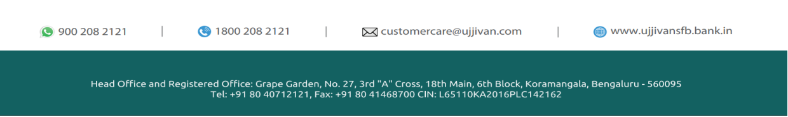

**[Image: 0590e763-d92b-480f-9026-6576c26fd064.pdf-0001-00.png (1032x203, 79.8KB)]**

## **USFB/CS/SE/2026-27/61** 

**Date:** July 28, 2026 

## **To,** 

## **National Stock Exchange of India Limited** 

Listing Department Exchange Plaza, C-1, Block G, Bandra Kurla Complex, Bandra (E) Mumbai – 400 051 

## **BSE Limited** 

Listing Compliance P.J. Tower, Dalal Street, Fort, Mumbai – 400 001 

**Symbol:** UJJIVANSFB 

**Scrip Code:** 542904 

Dear Sir/Madam, 

## **Sub: Transcript of the Quarterly Earnings Call held on July 23, 2026** 

Pursuant to Regulation 30 of SEBI (Listing Obligations and Disclosure Requirements) Regulations, 2015, we hereby inform you that the Transcript of the earnings/quarterly conference call held on July 23, 2026 for the quarter ended June 30, 2026 is enclosed herewith. 

The same shall be available on the Bank’s website at www.ujjivansfb.bank.in. 

We request you to take note of the above. 

Thanking You, 

Yours faithfully, 

## **For UJJIVAN SMALL FINANCE BANK LIMITED** 

Digitally signed by Sanjeev Barnwal Sanjeev Barnwal Date: 2026.07.28 11:28:10 +05'30' 

**Sanjeev Barnwal** 

## **Company Secretary & Head of Regulatory Framework** 

_Encl: as mentioned above_ 

**[Image: 0590e763-d92b-480f-9026-6576c26fd064.pdf-0001-22.png (1240x185, 41.9KB)]**

**[Image: 0590e763-d92b-480f-9026-6576c26fd064.pdf-0002-00.png (480x61, 15.8KB)]**

# “Ujjivan Small Finance Bank Limited 

# Q1FY27 Earnings Conference Call” 

# July 23, 2026 

**[Image: 0590e763-d92b-480f-9026-6576c26fd064.pdf-0002-04.png (301x41, 8.2KB)]**

**[Image: 0590e763-d92b-480f-9026-6576c26fd064.pdf-0002-05.png (185x155, 13.7KB)]**

**[Image: 0590e763-d92b-480f-9026-6576c26fd064.pdf-0002-06.png (222x114, 5.2KB)]**

**MANAGEMENT: MS. CAROL FURTADO – EXECUTIVE DIRECTOR MR. SADANANDA BALAKRISHNA KAMATH – CHIEF FINANCIAL OFFICER MR. ASHISH GOEL – CHIEF CREDIT OFFICER MR. VIBHAS CHANDRA – HEAD MICRO BANKING AND GOLD LOANS** 

**MR. HITENDRA JHA – HEAD RETAIL LIABILITIES, TASC AND TPP MR. UMESH ARORA – HEAD EMERGING BUSINESS MR. MARTIN P S – CHIEF OPERATING OFFICER MR. BRAJESH CHERIAN – CHIEF RISK OFFICER MR. SIDDHARTH BHARADWAJ – HEAD INVESTOR RELATIONS MR. GAURAV SAH – LEAD INVESTOR RELATIONS** 

**MODERATOR: MR. MANJITH NAIR** 

Page **1** of **17** 

_Ujjivan Small Finance Bank Limited July 23, 2026_ 

**[Image: 0590e763-d92b-480f-9026-6576c26fd064.pdf-0003-01.png (362x47, 10.7KB)]**

### **Moderator:** 

Ladies and gentlemen, good day, and welcome to Ujjivan Small Finance Bank Q1 FY27 Earnings Conference Call hosted by Antique Stock Broking Limited. As a reminder, all participant lines will be in the listen-only mode and there will be an opportunity for you to ask questions after the presentation concludes. Should you need assistance during the conference call, please signal an operator by pressing star then zero on your touchtone phone. Please note that this conference is being recorded. 

I now hand the conference over to Mr. Manjith Nair from Antique Stock Broking Limited. Thank you, and over to you, sir. 

### **Manjith Nair:** 

Thank you. Good evening, everyone. I welcome you all to Q1 FY27 Earnings Conference Call of Ujjivan Small Finance Bank. Today, we have the senior management team of Ujjivan Small Finance Bank represented by Carol Furtado, Executive Director; Sadananda Kamath, Chief Financial Officer; Ashish Goel, Chief Credit Officer; Vibhas Chandra, Head of Micro Banking; Hitendra Jha, Head of Retail Liabilities, TASC and TPP; Umesh Arora, Head of Emerging Business; Martin P.S., Chief Operating Officer; Brajesh Cherian, Chief Risk Officer; Siddharth Bharadwaj, Head IR and Mr. Gaurav Sah, Lead Investor Relations. 

With this, I now hand over the call to Carol Furtado, ED for her opening remarks. Thank you, and over to you, ma'am. 

### **Carol Furtado:** 

Thank you, Manjith. Good evening and thank you all for joining us today for Ujjivan Small Finance Bank's Q1 FY27 Earnings Call. Since our MD, Mr. Sanjeev Nautiyal is indisposed and not in office today, hence unable to attend this call. Please do note, I will be referring to yearon-year comparisons with Q1 FY '26 and quarter-on-quarter with Q4 FY '26. 

I will begin with a brief overview of the macroeconomic environment before discussing the bank's performance for the quarter. The geopolitical situation in West Asia, which started in Feb this year, continued to create uncertainty across global markets during the quarter. While discussions around the ceasefire emerged, the situation remains fluid. 

Softening of global energy prices from their peak, coupled with easing Indian commercial gas supply restrictions has smoothened commercial operations. On the local front, the weatherrelated uncertainties continue to pose risk due to strengthening of El Nino in the months ahead. We believe that harvest of rabi crops has led to better outcomes currently, but any delay in sowing of kharif crops might impact H2 economic activity. This remains a key monitorable. 

On the positive side, the high-frequency domestic economic indicators have largely shown stability. RBI in its June MPC review meeting decided to keep the policy repo rate unchanged at 5.25% while maintaining a neutral policy stance. The forex hedging cost dispensations by RBI have been a welcome step and should help in liquidity and hence stabilizing the deposit rates. 

While the real GDP growth for FY '27 was recalibrated to 6.6%, inflation forecast was within the band defined by RBI and is projected at 5.1% for full year. The governor also emphasized 

Page **2** of **17** 

_Ujjivan Small Finance Bank Limited July 23, 2026_ 

**[Image: 0590e763-d92b-480f-9026-6576c26fd064.pdf-0004-01.png (362x47, 10.7KB)]**

that the banking sector continues to remain resilient, supported by healthy credit demand, steady deposit mobilization and adequate liquidity to meet the productive requirements of the economy. 

Against this backdrop, the bank delivered another quarter of steady business growth. Our strategy continues to remain centered on strengthening our liability franchise, building a diversified asset portfolio and maintaining prudent risk management practices to ensure profitability along with growth. 

As part of plan for FY '27, bank has operationalized 38 new branches, taking total count to 814 as of June '26. We delivered highest Y-o-Y growth in deposits at 25% in the last couple of years, taking the deposit book to INR48,129 crores. CASA deposits grew to INR12,930 crores, up 37.8% year-on-year. 

In a tight liquidity scenario, we maintained comfortable CD ratio. To adjust for evolving market scenario, we effected rate increases in the month of June on key buckets in line with our intended ALM outcome. Our focus on enhancing the value proposition for deposit customers continues to deliver encouraging results. 

The high net worth program, Ivory, has witnessed strong momentum and is increasingly becoming an important pillar of our affluent banking franchise. Insurance cross-sell penetration has improved further, reflecting stronger customer engagement. The mutual fund distribution offering now accessible through mobile and Internet banking channels is seeing growing customer adoption. 

Additionally, the co-branded credit card currently in the testing phase is expected to further strengthen customer engagement and product penetration. Cost of funds continued the downward trajectory and stood at 6.86% for the quarter. We remain in sound liquidity health with liquidity coverage ratio around 132% for the quarter, reflecting a well-balanced approach towards growth and liquidity management. 

Turning to our asset franchise. We are pleased to note that our progress towards diversification of loan portfolio remains on track with more than half of the loan book being secured at 50.4% as of June '26. Following a strong performance last quarter, growth in our secured book has continued at robust rates and expanded to INR21,638 crores, up 42.7% year-on-year and 7.8% quarter-on-quarter. 

The bank level gross loan book reached INR42,903 crores, growing 28.9% year-on-year and 5.5% quarter-on-quarter. Disbursements for the quarter were at INR9,245 crores, up 41.4% yearon-year. Driven by the sustained momentum in the micro banking sector, our micro banking book reached INR21,371 crores, up 16.8% year-on-year, while disbursement grew by 16.4% year-on-year to reach INR4,581 crores. 

On the asset quality front, bucket X collection efficiency for the quarter stood at 99.68%, demonstrating a healthy portfolio. After seven quarters of degrowth, borrower base has started 

Page **3** of **17** 

_Ujjivan Small Finance Bank Limited July 23, 2026_ 

**[Image: 0590e763-d92b-480f-9026-6576c26fd064.pdf-0005-01.png (362x47, 10.7KB)]**

to grow, supported by 1.72 lakh new customer additions in Q1, marginally above the Q4 FY '26 numbers. 

Affordable housing and micro mortgages recorded strong growth with gross loan book increasing 40.8% year-on-year to INR11,210 crores, underscoring resilient customer demand and effective execution across key markets. Affordable housing distributed through 581 branches and micro mortgages through 323 branches benefits from broad geographic dispersion and a well-defined state-wise collateral framework. 

Our disciplined underwriting approach supported by calibrated LTV and FOIR thresholds continues to reinforce portfolio quality while enabling sustainable growth. GNPA across affordable housing and micro mortgages remained stable at 1.2% and 0.6%, respectively. The MSME portfolio continued its strong momentum, registering growth of 54% year-on-year at INR3,470 crores on the back of maintaining prudent underwriting standards. 

We have enhanced our product offerings within this segment. The working capital and supply chain finance jointly contribute around 28% in the MSME book. The business continues to help in customer diversification and increased deposit mobilization. The MSME PAR dropped 13 bps and new book GNPA remained stable at 0.5%. 

Gold loans continues to be strong growth driver with sourcing across 455 branches with an increase of 106 branches in the quarter. Gold gross loan book stood at INR1,020 crores, up 248.6% year-on-year. This increased product penetration and tailored offerings resulted in disbursements growth of 183.9% year-on-year at INR467 crores. 

Origination LTV for Q1 remained comfortable at 75%, while the book LTV remained around 56%. The vehicle loans with new two-wheeler segment continues to do well. This product is offered across locations catered by 337 branches with focus to enhance our mix of mid-premium and EV. 

The vehicle gross loan book stood at INR1,036 crores, up 85.1% year-on-year. Portfolio quality remains steady with GNPA at 1.7%. Together, the new business lines of gold, vehicle and agri have contributed to 7% of the gross loan book, while the disbursement share was at 9% in Q1. 

Bank level asset quality continued to be stable during the quarter with GNPA reducing by 10 bps to 2.17%. Provision coverage ratio strengthened further to 85%, providing adequate coverage across secured and unsecured products. Collection efficiency for current due plus overdue remained healthy at 98.4%, supported by consistent execution across our operating network. 

Write-offs for the quarter stood at INR72 crores. Credit costs came in at INR127 crores. We are watchful of the macro environmental factors and will continue to take timely corrective steps to address any developments. The business growth witnessed across both our liability and asset franchise in Q1 translated into a healthy financial performance with profit after tax at INR317 crores, resulting in ROA of 2.2% and ROE of 18.2%. 

Page **4** of **17** 

_Ujjivan Small Finance Bank Limited July 23, 2026_ 

**[Image: 0590e763-d92b-480f-9026-6576c26fd064.pdf-0006-01.png (362x47, 10.7KB)]**

Net interest income increased to INR1,186 crores, while net interest margin remained stable at 8.5%. Processing fee and insurance cross-sell supported other income. Operating expenses remained well managed quarter-on-quarter, while personnel cost increase reflects salary increments effective from April 26, hiring and towards gratuity and leave encashments. 

The other expenses were lower sequentially on account of lower business generation expenses and lower CSR expenses. The strong performance across our asset products has more than offset the impact of macroeconomic headwinds and reinforced our confidence in achieving our FY '27 planned asset growth of 25%. 

The expenses planned this year for future capacity building has started kicking in from late Q1 and the effect would be seen over the remaining quarters. Capacity building expenses are of the nature of branch opening, branding and tech and analytics capabilities. This deferred commencement of expenses, coupled with ongoing efficiency gains will result in full year opex to be lower than earlier planned and now would be around 6.4% of average assets. 

We continue to witness encouraging trends in asset quality with credit cost at 0.9% with absolute slippages during the quarter remaining lower than anticipated. Accordingly, we are revising our FY '27 credit-cost guidance to 0.9% to 1% of average total assets. Please note, we are moving away from guiding credit cost on average gross loan book to average balance sheet for better alignment. 

We remain mindful of the prevailing funding rate environment and the continued competitive intensity in CASA mobilization, along with pricing pressures across key asset products and the resulting impact on margins. Taking these factors into consideration, along with the strength of our operating performance, improving asset quality and enhanced cost outlook, we are confident in raising our FY '27 ROA guidance to 1.8% to 2%. 

We continue to invest on creating more levers for liability customers to bank with us. Simultaneously, multiple digitalization and analytics-led interventions are being carried out to further bolster liability franchise. We are also utilizing the newly created capacities on forex side by offering attractive FCNRB rates. 

It is of paramount importance that capacity building continues to happen on all fronts. Highlighting a few new initiatives on assets front. Unsecured Fast Track loan has completed successful pilot and is ready for a scale-up. This is a pure digital product with the utilization of account aggregators and bureau details. Pre-owned cars has been piloted in Karnataka. It will be creating a growth engine within our vehicle loan business. Lending to mid-corporates has commenced with disbursements in Q1. The MSME product suite has been expanded with purchase invoice discounting. 

With that, I conclude my opening remarks and request the moderator to open the floor for questions. Thank you. 

Page **5** of **17** 

_Ujjivan Small Finance Bank Limited July 23, 2026_ 

**[Image: 0590e763-d92b-480f-9026-6576c26fd064.pdf-0007-01.png (362x47, 10.7KB)]**

### **Moderator:** 

Thank you very much. We'll now begin the question-and-answer session. The first question is from the line of Renish from ICICI. Please proceed. 

### **Renish Bhuva:** 

Congrats on a good set of numbers. Just two, three things, sir, one on the asset yield, right? So we are experiencing a very attended competition in segment like affordable housing or maybe financing. So how we are preparing ourselves from, let's say, speed-to-fire perspective to sustain these yields even if competition increases, right? 

So why I'm asking this is that since we are moving away from MFI business structurally and if you are not able to sustain yields in some of these new products, then on a steady-state basis, maintaining 2% ROA will be challenging. So just wanted to know your thoughts on the nonMFI yield today and how are we placed from a 3 year to 5 year perspective? 

### **Ashish Goel:** 

Renish, so I'll first address the affordable housing and then move to the overall yields. Yes, so on the affordable housing side, our markets are semi-urban, largely urban and semi-urban. We are not present in the metros. We would be present in a small way in the metros. We are present in about 580 to 590 branches. 

So that has given us a very robust distribution network to be able to maintain growth. And a INR16 lakh to INR20 lakh ticket size also is the right mix that we have found to maintain the yields that we desire. So we've been able to maintain yields. There is definitely some competitive pressure. And however, we feel confident that in the markets that we are, we should be able to maintain the yields. 

**Renish Bhuva:** 

Just on this affordable piece. So, let's say, even if you look at your internal rates, right, it has been hovering around 12.2%, 12.3% for the last maybe six, seven, eight quarters, right, which definitely suggests that the market environment is such that even if we want to increase the price, the market is not going to allow us. 

And hence, my question is slightly from a medium-term perspective. Are you confident of sustaining these yields in this segment at this level? Or maybe we have to, let us say, revisit our strategy in terms of scaling micro mortgage more aggressively to maintain overall mortgage book yield? 

**Ashish Goel:** 

No, I was talking about affordable housing being in the range of about 12.5% yield. And this is something you have to see the mix of ticket sizes and the geographies in which you operate. For us, the affordable housing, we've not had to compromise on yields because of the geographies and the ticket sizes that we've been operating in. 

There is a business line of micro mortgages, which we started around three years back. It is now about INR1,800 crores. Here, the yields are much healthier. You're right, in the range of 19.5%odd. And here, again, about 70% of our business is semi-urban in nature. In the ticket sizes of about INR10 lakhs to INR15 lakhs, the average is about INR7 lakhs, INR8 lakhs in micro mortgages. Even if we go to INR10 lakhs or INR12 lakhs, the yield doesn't come down significantly. Again, as I said, it's a mix of ticket sizes and geographies. 

Page **6** of **17** 

_Ujjivan Small Finance Bank Limited July 23, 2026_ 

**[Image: 0590e763-d92b-480f-9026-6576c26fd064.pdf-0008-01.png (362x47, 10.7KB)]**

### **Renish Bhuva:** 

Got it. Got it. Okay. And my second question is on the gold loan, right? So when we look at the customer sourcing mix, right, so this quarter, the new-to-bank customer has increased very sharply to 40%. So just wanted to know in one quarter, what has changed, which helped us acquiring a lot of customers from outside or it is just to do with the vintage of branch. 

**Vibhas Chandra:** Hi, Renish. This is Vibhas. As far as gold loan is concerned, it is a business which is very promising. At the same time, it is a new business to us. If you look at this quarter, we have activated more than 100 branches in gold loan, and that leads to new customer acquisition also. At the same time, we have seen that the demand in microfinance customers have also increased in Q1, leading to new customers from this segment also to come in. So these two factors combined has changed the numbers. 

**Renish Bhuva:** Got it. And any ballpark absolute number we have in our mind as far as gold loan book is concerned, let's say, 5,000 by '28 or any number would you want to find? **Ashish Goel:** So, Renish, In this business, we are looking at increasing capacities. And this is the consistent strategy we've been maintaining for the last two years, keep activating branches, keep enhancing capacity. This quarter, we've done on an average about INR160 crores to INR170 crores a month. 

The exit in June being INR170 crores, INR175 crores. So, and we have a plan to take our active branches from about INR430 crores, INR440 to about INR575 crores by the end of this year. So, we'll, again, significantly add capacities. The exit number for disbursement should be somewhere in the range of about INR250 odd crores a month. We should be able to. 

**Renish Bhuva:** How much, sorry? **Ashish Goel:** About INR230 crores to INR240 crores, INR250 crores month exit March. This would actually result in the book getting increased. **Moderator:** The next question is from the line of Shreepal Doshi from Equirus. **Shreepal Doshi:** Congrats on a good set of numbers. My first question was on the liability side. So there, we've seen cost of fund and cost of deposit coming down on a sequential basis on the, but we've taken increase in the rates in some of the ticket size buckets. Now incrementally, do we expect the cost of fund to move up? Also, you highlighted in your commentary that the liquidity situation remains tight. So in that scenario, would we like see incrementally the cost of fund going up? And if yes, then to what extent are we expecting for the full year for that number to close? 

**Brajesh Cherian:** Hi, Shreepal. Our deposit growth has been broadly aligned with the asset growth you would have seen. We also have some more avenues to support the funding, if at all required and to optimize the margin, we have the IBPC refinance, securitization options are also open for us. 

We remain cognizant of the fact there is a deposit pressure in the market. And those impacts are also being accounted for. That's been baked into our ROA guidance of 1.8 to 2 percentage. So that's been considered while we guiding the number of 1.8 to 2 percentage. We don't see a very significant increase, but marginal increase has been expected. 

Page **7** of **17** 

_Ujjivan Small Finance Bank Limited July 23, 2026_ 

**[Image: 0590e763-d92b-480f-9026-6576c26fd064.pdf-0009-01.png (362x47, 10.7KB)]**

### **Shreepal Doshi:** 

Got it. So undoubtedly, sir, we've done a commendable job despite the situation being tight on the deposit side. But, do you see any further rate hike requirement at our level in some of the buckets? Or now we are okay with the current rate hikes that we've taken in the 1Q? 

**Brajesh Cherian:** As such, we don't see an immediate requirement for any upward revision. We will continue to remain at the same levels. And we will be watchful about how the market moves. 

**Shreepal Doshi:** Got it. Sir, second question was on the vehicle finance portfolio. So we plan to add the preowned car segment within vehicle. Do we also plan to explore CV such as LCV, HCV in that category? 

**Ashish Goel:** So, Shreepal, we have just completed the pilot for pre-owned cars. This is a business that we will test during the year in maybe two or three geographies and plan to scale up next year once we understand the customer segment better, the pricing and the local flavor of all the geographies that we are operating in. HCV and LCV, if and when we plan would be only after this financial year. 

**Shreepal Doshi:** Got it. Sir, just one last question on the fee income side. This quarter, we have seen a dip in the insurance income. So what explains that? Incrementally also, should this be the run rate? Or will we see some bounce back there? 

**Hitendra Jha:** Hi, Shreepal. Hitendra, here. So what we have seen that our income has grown by almost 15% Y-o-Y, and we are hopeful to maintain same kind of growth rate as we go along from here. **Shreepal Doshi:** Sir, from sequential, like from 4Q okay, so you mean to say on a, alright, okay. **Sadananda Kamath:** Shreepal, just to add, it all depends on the disbursal. So Q4 disbursal is all-time high, whereas Q1 is not comparable. That may explain the difference to you. 

**Moderator:** The next question is from the line of Rajiv Mehta from Yes Securities. **Rajiv Mehta:** Congratulations on very strong set of numbers. So my question is on, if you can share the investment amount that you want to put for this capacity building, which is your branch opening, branding, tech and analytics. Because see, I'm looking at your current rate of profitability, which is INR317 crores in the first quarter, wherein typically other income is also lower? 

And when I look at the guidance, you're implying INR1,250-odd crores of profit at a 1.9% ROA. So then are we also trying to build in some NIM compression throughout the year, which is why we'll be remaining at the same rate of quarterly profits and adding up to INR1,250-odd crores. So, if you can just tell us, firstly, the amount that you'll be spending on capacity building throughout the year and whether any NIM compression has been budgeted in the overall guidance of this current ROA? 

### **Sadananda Kamath:** 

Hi, Rajiv. Bala here. We already had informed you that we are planning to spend around INR250 crores. Not much has been spent in Q1, which is why there is a good impact on upward in the profits. But definitely, the spending has started in June because it requires some planning. For 

Page **8** of **17** 

_Ujjivan Small Finance Bank Limited July 23, 2026_ 

**[Image: 0590e763-d92b-480f-9026-6576c26fd064.pdf-0010-01.png (362x47, 10.7KB)]**

example, in marketing, IT, we have worked on it opening branches, many branches opened in June. So it will build up in the coming quarters. That is why you can see that we have given you a guidance of 1.8% to 2%, which has considered the spend of this INR250-odd crores in the coming quarters. 

### **Rajiv Mehta:** 

Yes. And on the NIM side, what is the budget in the ROE guidance? 

**Sadananda Kamath:** 

NIM already, my colleague, CRO, Brajesh, just now explained on the cost of fund. So, on one side, the yield, you can see that the MFI is doing pretty well. So that will be helpful in keeping the yield up along with our higher, some of our higher-yielding segments such as gold, twowheeler, used car, micro mortgage. So that will sustain there. 

And already my colleague has explained that we don't see any major changes in the cost of fund going forward because we have various instruments such as IBPC, refinance, securitization, upward sleep, which we have not used in the first quarter, and we'll use it to keep it stable. So you can go ahead with the guidance of the NIM, which we already gave at the beginning of the year and which we have recorded in the first quarter. 

### **Rajiv Mehta:** 

Okay. Sure. And see, just on this funding of this very strong growth that we are delivering on the asset side, how are we looking at liability mobilization for funding such high level of growth? So from a distribution point of view, you explained that you'll be adding more branches. But in pricing also, I think we have done something on the pricing side as well. Anything from the productivity side that we plan to take some action so that we are able to get the required amount of deposits to fund this 25%, 30-odd percent growth that we plan? 

### **Hitendra Jha:** 

Rajiv, Hitendra here. So there are two strategies. Number one, we are adding 144 branches this year. Out of that 38 already we have opened, 106 branches will open which will give us a distribution. Number two, from beginning, we have guided that our focus on liability side is in top 8 and top 30 markets, where we are seeing robust growth of roughly 75% Y-o-Y growth on CASA and overall 36% growth. 

So we'll continue to focus in this market, which has given us a good result, number one. Number two, we have introduced certain products, which is helping us to acquire good customers. And also, we are now more segment focused. We are not looking customer as one customer. We have different segments. We are focused on HNI segment. 

We are focused on NR. We are focused on task customers and also corporate salary. So this segmental focus, we are very confident with a new set of branches, we will be able to garner the deposit what we require. And also, we have FCNR opportunity, which has come up, okay, which will give us a good, till now, we have done INR60-odd crores in Q1 and are very hopeful to do this number, what we have guided earlier. 

**Rajiv Mehta:** 

Okay. Okay. Just last thing. Can you share the current ROA profile of the affordable housing book, excluding micro mortgages? And how do we see the ROA of that portfolio shaping up in the coming year? 

Page **9** of **17** 

_Ujjivan Small Finance Bank Limited July 23, 2026_ 

**[Image: 0590e763-d92b-480f-9026-6576c26fd064.pdf-0011-01.png (362x47, 10.7KB)]**

### **Gaurav Sah:** 

Hi. This is Gaurav. So, Rajiv, we are not looking to give any product level numbers. We'll come back to you once we plan to give, yes. 

**Rajiv Mehta:** 

Thank you and best of luck. 

**Moderator:** 

The next question is from the line of Kaushik Agarwal from Haitong. 

**Kaushik Agarwal:** 

I have a couple of questions. So, firstly, on this guidance cut on the credit cost side. So what gives you the confidence in terms of cutting down this guidance? And broadly, if you can comment in terms of MFI portfolio, though we are seeing that broadly on the industry side, things are improving. But how is your portfolio performing? And owing to this uneven weather conditions, are you seeing any early warning signs in your portfolio? 

That is number one. Second question is on affordable housing. So the growth has been quite strong over there. So what is the management strategy in terms of the growth that we are seeing? And do you expect the momentum to continue? And second part of this question is in the micro mortgages in the par, there was some uptick on a sequential basis. So how should one read this? 

And lastly, on margins. So I saw that in your presentation, there is some like improvement in cost of fund despite that margins were largely stable. If you can help us understand what has really happened? And do you expect the cost of fund has largely bottomed because last quarter, you indicated that some part of the borrowings were supposed to be repriced in the upcoming quarter. Is it all done or something is still left over there? 

**Ashish Goel:** 

Kaushik, I'll answer the question on microfinance first. So the credit cost is actually a function of the bucket collection efficiency. In Q1, we have seen 99.7% which is a very healthy collection efficiency. And last quarter also, we said that 99.7% is something that we are, we find comfort in. 

The trends in July are remaining roughly the same. So therefore, we feel that this trend will continue. If there is a 5, 7 basis points increase or decrease, that would lead to a marginal increase or decrease in the credit cost. So that, as long as this trend continues, our credit cost will remain largely under control. 

The second question was on affordable housing. The momentum, as we said, is basis the geographies that we are present in. We are largely into the urban and semi-urban geographies, very little presence in metros. And the ticket sizes and the yield that we have been maintaining has helped us grow this business. It is largely a distribution-driven business. 

Similarly, on the micro mortgages side, we are already present in about (Correction:323) 325 branches. So as we go through the year, some of these branches will start to give a better efficiency. In terms of PAR, yes, there has been a marginal increase in PAR, but this business is only 2.5, 3 years old. It has still not started. The 18 MOB book is still very small. So as we go forward, there will be a natural increase in PAR. So that is how the micro mortgages book will mature over a period of time. 

Page **10** of **17** 

_Ujjivan Small Finance Bank Limited July 23, 2026_ 

**[Image: 0590e763-d92b-480f-9026-6576c26fd064.pdf-0012-01.png (362x47, 10.7KB)]**

**Kaushik Agarwal:** Okay. And on the margin piece, if you can answer that part as well? **Gaurav Sah:** Sir, we are not able to listen to you, Kaushik, sorry. 

**Kaushik Agarwal:** So, basically, I was asking that during this quarter, there has been some improvement in cost of funds, but the margins have largely remained stable. So what explains that? And second part is, like should one expect that cost of fund has largely bottomed because in the last quarter, you suggested that some of the book has to be repriced. So is it all done or some more further improvement in cost of fund can be expected? 

**Brajesh Cherian:** Hi, Kaushik. From the repricing side, that benefit is almost, we can't see further visibility on repricing benefit. We feel it would remain at the current level or slightly elevated. There is, you know there is a pressure on the market. But we don't see significant changes to the current levels beyond a few bps here or there. 

**Moderator:** The next question is from the line of Abhishek from HSBC. **Abhishek Murarka:** Congratulations for the quarter. So I just wanted to check in the MSME business, the ticket size is increasing quite steadily. Is this LAP or is this working capital? And what is the yield range on this business, higher ticket business that you are doing currently? **Ashish Goel:** Abhishek, so this increase is a conscious strategy that we have that we started in quarter 1 of this year. And the increase in ticket sizes both on LAP as well as working capital. LAP, as you know, was about INR58 lakhs to INR60 lakhs. We are currently in the range of INR80 lakhs to INR90 lakhs. 

Similarly, on the working capital side, while we were in the range of INR70 lakhs, INR80 lakhs, we have now consciously taken it up to INR1.1 crores to INR1.2 crores. The yield, therefore, cannot be maintained at about 11%, 11.5%, which we used to do earlier. It would be somewhere in the range of 10.5%. 

**Abhishek Murarka:** Okay. So the disbursement yield would be similar to the book yield or it would be lower than the book yield? 

**Ashish Goel:** 

It would be lower than the book yield. 

**Abhishek Murarka:** Yes. Because in the last three quarters, your book yield is also trending down and which coincides with the ticket size increase. **Ashish Goel:** Yes. 

**Abhishek Murarka:** Where does that stop? Like where do you draw the line and say, now we don't want to migrate further up the ticket size curve just to protect yield or hold it where it is? 

**Ashish Goel:** So yield and opex are two variables that we are consciously monitoring. As the ticket size increases, the opex also comes down. It doesn't fully compensate the decrease in yield, but the 

Page **11** of **17** 

_Ujjivan Small Finance Bank Limited July 23, 2026_ 

**[Image: 0590e763-d92b-480f-9026-6576c26fd064.pdf-0013-01.png (362x47, 10.7KB)]**

opex plus the risk takes care of the trade cost. Both of them take care of the decrease in yield. So we feel that currently, we are in the range where we should continue for some more time. if there is any further increase in ticket size, probably it can be looked at next year. But this year, probably we'll be working in the same band. 

### **Abhishek Murarka:** 

Right. And the way you think about this is it's essentially a leveraged product, right? So you may not be making great ROA there, but you will be making high ROE. That's the way you would approach this product. 

### **Ashish Goel:** 

Absolutely, Abhishek. Sorry, Abhishek, this is the way we are looking at it. And it also gives us some foothold into the liability relationships, the overall banking relationships, bank guarantees. So there are some nonfund-based opportunities also, which are available in the higher ticket sizes. So those are also areas in which we have started to see some success, although this is early success, but yes, these are also opportunities which are opening up. 

### **Abhishek Murarka:** 

Got it. And separately, I wanted to check on housing. So if I look at the mix between micro mortgage and affordable, of course, micro mortgage is going up quite significantly in the mix and the disbursements are also quite high. So what are the further legs? Like what will keep these trends this kind of mix change towards micro mortgage for, say, like next 12 months or 24 months? And where do you expect the mix to settle? Like right now, I think it's 27-73 broadly. Where would you expect this to settle eventually? 

**Ashish Goel:** 

Abhishek, we are not looking at the ratios as of now. What we are looking at is the capacity that we have built. So on the affordable housing side, a capacity of about INR350 crores, INR375 crores a month has already been built. And on the micro mortgage side, you will see INR100 crores a month kind of a disbursement number, which exit March will probably reach in the range of INR140 crores, INR150 crores. So the mix can be derived from there. But yes, we will be working on these capacities. 

**Abhishek Murarka:** 

Right. So the disbursement mix will be increasing towards micro mortgage? 

**Ashish Goel:** Yes. The disbursement mix, the incremental book will be more towards micro mortgages. Marginally higher. 

**Abhishek Murarka:** More towards. Got it. I also wanted to check on opex. So the way to think about opex in light of what Kamath sir said is that this quarter, your opex is fans any kind of additional spending. So this is your true underlying run rate. And on top of this, we add around INR250 crores to get to a full year number. Broadly, that should be the broad thinking. Is that fair or how to think about it? 

**Sadananda Kamath:** 

Yes. More or less, you are there. The extraordinary spend, what we factored of INR250 crores was delayed due to planning and also some macroeconomic factors. We are a little cautious there. But we started spending in June. So you will see the impact in the coming quarters going forward. 

Page **12** of **17** 

_Ujjivan Small Finance Bank Limited July 23, 2026_ 

**[Image: 0590e763-d92b-480f-9026-6576c26fd064.pdf-0014-01.png (362x47, 10.7KB)]**

And we want to spend that money because it is for the development of the bank, and it is going to be responsible for the growth going forward. And we have also given you a guidance. ED Madam said it will be around 6.4%, which will be the opex to ATA by the end of the year for the year. 

### **Moderator:** 

The next question is from the line of Ashlesh from Kotak Securities. 

**Ashlesh Sonje:** I think first question is on the liability profile. You have seen a fairly good growth in the CASA deposits this year of about 35%. Do you expect that to continue into FY '27? And on the CASA ratio as well, there was a lot of discussion during the analyst meet last year about taking it closer to 30%. Are you still on track to get there, let's say, by the end of this year? That's the first question? 

**Hitendra Jha:** Hi, Ashlesh. So, yes, we are confident of maintaining the same CASA growth what we have delivered this quarter, and we have taken various steps to ensure that kind of growth. Of cost as CASA ratio also, we are, whatever we had projected, we are very much committed or we may over deliver slightly. 

**Ashlesh Sonje:** Understood. And just a follow-up on that. What has been the strategy on the liability profile in the last few quarters? While CASA has grown well, I think there has been a little bit more reliance on bulk term deposits over retail term deposits. Along with that, the share of individual depositors has also declined in the last few quarters, if I look at the depositor mix. So if you can just elaborate on what has been the strategy there so far? 

**Brajesh Cherian:** Our bulk deposit ratio is about 30% and our guiding factor is to keep it in and around 30%. So through the year, we will make sure that we are closer to that one. And we have other interventions and other opportunities to make sure to bring it within that particular ratio, which we have guided. So we'll continue to work on it. 

**Ashlesh Sonje:** Okay. Just to get more clarity on that one. What would be the rough ballpark cost of the retail TD part and the bulk TD part? And was that a cheaper source, the bulk TD part this quarter? 

**Hitendra Jha:** No, this quarter, it's not. Now it is definitely cheaper than bulk TD, okay? And we are now getting good momentum in retail TD, and we plan to continue momentum in retail TD now. 

**Ashlesh Sonje:** Understood. Okay. The second part of the discussion was on the loan mix. Now what are you looking at the target loan mix between MFI and non-MFI for March '27 and March '28? I remember you had earlier guided for a number closer to 56% in non-MFI by March '27. Is there any update to that one? 

**Ashish Goel:** Ashlesh, we maintain the same guidance of 56%. 56% of secured by exit March '27. 

**Ashlesh Sonje:** Understood. Okay. And lastly, if you can share the slippages in the MFI business and the provisions in the MFI business made in this quarter? 

Page **13** of **17** 

_Ujjivan Small Finance Bank Limited July 23, 2026_ 

**[Image: 0590e763-d92b-480f-9026-6576c26fd064.pdf-0015-01.png (362x47, 10.7KB)]**

### **Ashish Goel:** 

Slippages were less than 2%. And on the provisions, I can talk about the provision coverage ratio. It's in the range of about 95% for MFI. Exact amount of provisions? I can actually come back to you on the exact amount, but in terms of provision, PCR is about 95-odd percent. 

**Ashlesh Sonje:** Sure. Can you give us the MFI slippage number in rupees, if possible? **Ashish Goel:** Yes, I'll give it to you. **Moderator:** The next question is from the line of Param from Investec. **Param Subramanian:** Congrats on the quarter. First question is on the operating expenses. Sir, you mentioned that this year, we should be at 6.4% of assets. But how to look at this from, say, next year or next couple of years, how should this track? **Sadananda Kamath:** Yes. This year, we will be at 6.4%. But going forward, yes, the investments would be slightly lesser. So you will see an improvement there. Exact figures, we'll let you know a little later. But there will be improvement year-on-year. Yes, since the efficiencies will start kicking in and the majority of the investment we would have taken this year. But going forward also, there will be investment, but in a lesser amount, so we'll see improvement year-on-year. That's what we see. **Param Subramanian:** Okay, sir. Sir, if I can ask that another way, among the non-MFI businesses, which of the businesses are, say, yet to achieve PPOP level breakeven. So we get an idea of what can contribute to operating leverage going ahead? **Sadananda Kamath:** Yes, we don't give any guidance each vertical-wise at this moment. When we are ready, we'll come back to you on it. **Moderator:** The next question is from the line of Pritesh from DAM Capital. **Pritesh Bumb:** Congratulations on a good set of numbers and strong outlook. Just on the outlook part, so the driver of our ROA guidance being higher is on the credit cost. So when you look through your portfolios segment-wise, geography-wise, is that now that the book has reached fair level of maturity or the mix is driving the overall credit cost lower? Like what has been the comfort area for us to revise that credit cost downwards in last couple of quarters? 

**Ashish Goel:** So, Pritesh, the revised guidance on ROA is on Opex first and credit cost next. So it is a combination of both opex as well as credit cost. In terms of microfinance, all states have completely stabilized. We are getting consistent 99.7% bucket X collection efficiency. There are states which do 99.75%. There are states which do 99.60% - 99.65% also. But largely, every state is now stable in terms of repayment behavior. 

The guardrails have also led to a very minimal four lender and above. So it's now below 1.5%. So there is no overleverage in the market. The customers have got deleveraged. Repayment is consistent. So therefore, we feel that the 2%, which we had said on unsecured might be just a little lower than that. Q1 was about 1.9% on the GLP of microfinance. 

Page **14** of **17** 

_Ujjivan Small Finance Bank Limited July 23, 2026_ 

**[Image: 0590e763-d92b-480f-9026-6576c26fd064.pdf-0016-01.png (362x47, 10.7KB)]**

### **Pritesh Bumb:** 

Right, right. Second question was on the micro mortgage. If you look at of course, the book has been growing quite strong now today, INR1,800 crores. But if you look at the PAR and the GNPA, it has been also steady climbing. So almost par has doubled or GNP also is slightly higher. Where do you think this will go and settle? And second point was that do we have a higher LGD on this portfolio generally as it grows? How do we see that? 

### **Ashish Goel:** 

Yes, Pritesh, the PAR number, which was about 1.2% is now in the range of about 1.5%. It's not a very significant increase. Similarly, on the NPA side, we were at about 0.47% and now we are at about 0.55%. Largely on the micro mortgage book also, what we do is we keep measuring the bucket X collection efficiency. 

Currently, we see about 95% on-time repayment and about 99.7% to 99.75% bucket X collection efficiency month-on-month consistently for the last 24 months with the exception of April of this year, it has been working on a very steady basis. there will be an increase in PAR because the product is not matured yet. 

It's three years old. The first year was again a very small base. So on an 18 MOB and a 24 MOB, the numbers will not be fully representative. But what we see is even the 18 and 24 MOB has not touched about 2.5%. So we feel that the book quality and the locations, the customer profile is acting quite well for us. 

### **Pritesh Bumb:** 

Sure. And last two questions. One is on MFI side, you mentioned that all the states have stabilized. From a growth perspective, which state do you think can now contribute to growth? Of course, you had mentioned in your guidance that it will be in a 10%, 15% range of growth over time. But do you think that any state will start contributing again to a slightly higher growth compared to what we have seen in the last two years? 

### **Vibhas Chandra:** 

Pritesh, as far as the microfinance growth is concerned, we are witnessing increase in demand in almost all states. Kerala is one state where we strategically don't want to grow that much. But apart from that, from all the states, we are seeing good demand and new to bank and new customers also coming in. As far as our branch opening strategy is concerned, our branch opening is also happening across many states, but a little more in states like UP, Rajasthan, some in Bihar also, where the portfolio has behaved better in the last three, four years. 

### **Pritesh Bumb:** 

Sure. And lastly, when you look at your liability customer, the liability. 

**Gaurav Sah:** Sorry, we are not able to hear. 

**Gaurav Sah:** 

Pritesh got disconnected. 

**Pritesh Bumb:** For the savings, or is it like only term deposit liability customer as well in this number? 

**Hitendra Jha:** Actually you have to repeat your question. We lost you in between. 

Page **15** of **17** 

_Ujjivan Small Finance Bank Limited July 23, 2026_ 

**[Image: 0590e763-d92b-480f-9026-6576c26fd064.pdf-0017-01.png (362x47, 10.7KB)]**

### **Pritesh Bumb:** 

Sorry. So I wanted to check the liability only customer, which has been steadily growing, I think about INR53 lakhs. Does it mean that they all have savings account or they will have only a term deposit relationship with us and may not have a savings account? 

### **Hitendra Jha:** 

No, largely, all customers will have saving account customers. We do not onboard any standalone term deposit customers. So either it will be through micro banking or through liability franchise. Some small number will be there, but largely, it will be backed by saving account. 

### **Pritesh Bumb:** 

Got it. Okay. Thank you so much. Thank you for answering my question. All the best. 

**Moderator:** Thank you. Due to time constraints, this will be our last question. The next question is from the line of Sagar Shah from Spark. 

**Sagar Shah:** 

Good evening, management. First of all, congratulations to the entire team of Ujjivan for posting such healthy set of earnings. I had a couple of questions. Now first of all, related to your productivity on the gold loan metrics actually. Now on the gold loans, I wanted to understand that incrementally, how are we expanding our portfolio to something like in which, in the current scenario, in how many branches are we disbursing our gold loans? And what is our outlook, so that our productivity can be enhanced? And my second question was on the guidance front. On the guidance front, you have revised your credit cost guidance as well. So I wanted to understand that are we seeing any healthy recoveries, especially in the MFI space, which will lead to better actually, which will lead to lowering of credit cost and thus, that is the enabler behind your guidance actually? These are my two questions? 

**Vibhas Chandra:** 

Yes. Hi, Sagar. I will answer your first question. I'm Vibhas, and I will request Ashish to take up the second question. As far as gold loan is concerned, as I mentioned earlier also, it is a new business and very promising business for us. And we are expanding and started offering gold loan from branches from where we operate. 

This year also, we'll be activating gold loan in about 250 branches. And we are witnessing that branches where we start operations, within 1 year, the productivity of our loan officers reaches a level of INR25 lakhs to INR30 lakhs, and that is something which is happening across branches and across regions. 

One good thing that we have been able to see being a late entrant, we also have a benefit of understanding what are the nuances of gold loan, and we have been able to understand and build a product which fits the market. As RBI also came up with policies, we were already following most of the policies as this business is new to us. 

As gold loan is in the industry, it is very heavy in the South, we also see opportunity in other regions also, including East, even Northeast and northern part of the country, where market is not that extracted so far, and we see a good amount of business happening from this region as well apart from Southern states. 

And expansion of gold loan to branches, all branches where we operate and also expanding capacity through gold loan team and all other business teams, which work in the branches and 

Page **16** of **17** 

_Ujjivan Small Finance Bank Limited July 23, 2026_ 

**[Image: 0590e763-d92b-480f-9026-6576c26fd064.pdf-0018-01.png (362x47, 10.7KB)]**

getting leads from there is leading to high business volumes, and that will continue over the period of time as we go ahead. 

**Sagar Shah:** Okay. So, till FY '28, how many branches are we seeing to add for gold loan disbursements? **Vibhas Chandra:** So, right now, as we mentioned, we have close to 800 branches, and we will be opening branches in the future also. Our plan, our intent is to offer gold loan from almost all branches from where we operate. There will be some branches where we'll,  a small number where we'll not be able to operate because of operational issues, but we intend to have gold loan across branches we operate. 

**Sagar Shah:** Okay. Fine. And my second question? **Ashish Goel:** So, on the microfinance side, we have seen a significant reduction in slippages. So there are two points. One was related to bucket X collection efficiency, where we are seeing a steady 99.7%. And the second is on slippages. This also answers Ashlesh's question. Ashlesh had asked about slippages in Q1 and have the slippages come down. 

So, on an annualized basis, the slippages is about 1.72%, which was 2.68% in Q4, again, on an annualized basis. So with the reduction in the slippages, we have, therefore, seen a much better one, bucket X collection efficiency improving, remaining steady, two slippages coming down. This leads us to much better credit cost for the full year. Your question related to provisions held is about INR657 crores. 

**Moderator:** Thank you. I would now like to hand the conference over to the ED for the closing comments. Over to you, Ma’am. **Carol Furtado** : Thank you. I once again thank all the participants for their time and interest. We at Ujjivan Small Finance Bank remain focused on delivering profitable growth while we build an enduring institution. Please reach out to our IR team for any unanswered queries that you may have. Thank you. **Moderator:** Thank you. On behalf of Ujjivan Small Finance, that concludes this conference. Thank you for joining us, and you may now disconnect your lines. 

Page **17** of **17** 

---

## Extracted Images

| # | File | Dimensions | Size |
|---|------|------------|------|
| 1 | 0590e763-d92b-480f-9026-6576c26fd064.pdf-0001-00.png | 1032x203 | 79.8KB |
| 2 | 0590e763-d92b-480f-9026-6576c26fd064.pdf-0001-22.png | 1240x185 | 41.9KB |
| 3 | 0590e763-d92b-480f-9026-6576c26fd064.pdf-0002-00.png | 480x61 | 15.8KB |
| 4 | 0590e763-d92b-480f-9026-6576c26fd064.pdf-0002-04.png | 301x41 | 8.2KB |
| 5 | 0590e763-d92b-480f-9026-6576c26fd064.pdf-0002-05.png | 185x155 | 13.7KB |
| 6 | 0590e763-d92b-480f-9026-6576c26fd064.pdf-0002-06.png | 222x114 | 5.2KB |
| 7 | 0590e763-d92b-480f-9026-6576c26fd064.pdf-0003-01.png | 362x47 | 10.7KB |
| 8 | 0590e763-d92b-480f-9026-6576c26fd064.pdf-0004-01.png | 362x47 | 10.7KB |
| 9 | 0590e763-d92b-480f-9026-6576c26fd064.pdf-0005-01.png | 362x47 | 10.7KB |
| 10 | 0590e763-d92b-480f-9026-6576c26fd064.pdf-0006-01.png | 362x47 | 10.7KB |
| 11 | 0590e763-d92b-480f-9026-6576c26fd064.pdf-0007-01.png | 362x47 | 10.7KB |
| 12 | 0590e763-d92b-480f-9026-6576c26fd064.pdf-0008-01.png | 362x47 | 10.7KB |
| 13 | 0590e763-d92b-480f-9026-6576c26fd064.pdf-0009-01.png | 362x47 | 10.7KB |
| 14 | 0590e763-d92b-480f-9026-6576c26fd064.pdf-0010-01.png | 362x47 | 10.7KB |
| 15 | 0590e763-d92b-480f-9026-6576c26fd064.pdf-0011-01.png | 362x47 | 10.7KB |
| 16 | 0590e763-d92b-480f-9026-6576c26fd064.pdf-0012-01.png | 362x47 | 10.7KB |
| 17 | 0590e763-d92b-480f-9026-6576c26fd064.pdf-0013-01.png | 362x47 | 10.7KB |
| 18 | 0590e763-d92b-480f-9026-6576c26fd064.pdf-0014-01.png | 362x47 | 10.7KB |
| 19 | 0590e763-d92b-480f-9026-6576c26fd064.pdf-0015-01.png | 362x47 | 10.7KB |
| 20 | 0590e763-d92b-480f-9026-6576c26fd064.pdf-0016-01.png | 362x47 | 10.7KB |
| 21 | 0590e763-d92b-480f-9026-6576c26fd064.pdf-0017-01.png | 362x47 | 10.7KB |
| 22 | 0590e763-d92b-480f-9026-6576c26fd064.pdf-0018-01.png | 362x47 | 10.7KB |
