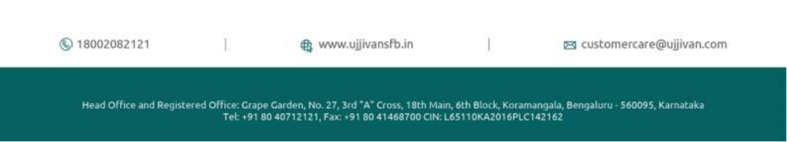

**[Image: c73a569b-44e4-4f67-a8a6-d57011a7180c.pdf-0001-00.png (1034x203, 98.3KB)]**

### **USFB/CS/SE/2025-26/127** 

**Date:** January 27, 2026 

### **To,** 

**National Stock Exchange of India Limited** Listing Department Exchange Plaza, C-1, Block G, Bandra Kurla Complex, Bandra (E) Mumbai – 400 051 

**Symbol:** UJJIVANSFB 

**BSE Limited** Listing Compliance P.J. Tower, Dalal Street, Fort, Mumbai – 400 001 

**Scrip Code:** 542904 

Dear Sir/Madam, 

### **Sub: Transcript of the Quarterly Earnings Call held on January 22, 2026** 

Pursuant to Regulation 30 of SEBI (Listing Obligations and Disclosure Requirements) Regulations, 2015, we hereby inform you that the Transcript of the earnings/quarterly conference call held on January 22, 2026 for the quarter ended December 31, 2025 is enclosed herewith. 

### The same shall be available on the Bank’s website at www.ujjivansfb.bank.in. 

We request you to take note of the above. 

Thanking You, 

Yours faithfully, 

### **For UJJIVAN SMALL FINANCE BANK LIMITED** 

Digitally signed by Sanjeev Barnwal Sanjeev Barnwal Date: 2026.01.27 15:45:26 +05'30' 

### **Sanjeev Barnwal** 

### **Company Secretary & Head of Regulatory Framework** 

_Encl: as mentioned above_ 

**[Image: c73a569b-44e4-4f67-a8a6-d57011a7180c.pdf-0001-20.png (1240x225, 108.9KB)]**

**[Image: c73a569b-44e4-4f67-a8a6-d57011a7180c.pdf-0002-00.png (432x70, 41.6KB)]**

# “Ujjivan Small Finance Bank Limited Q3 FY '26 Earnings Conference Call” 

## **January 22, 2026** 

**[Image: c73a569b-44e4-4f67-a8a6-d57011a7180c.pdf-0002-03.png (340x55, 27.4KB)]**

**[Image: c73a569b-44e4-4f67-a8a6-d57011a7180c.pdf-0002-04.png (286x85, 30.0KB)]**

**[Image: c73a569b-44e4-4f67-a8a6-d57011a7180c.pdf-0002-05.png (226x108, 13.3KB)]**

|**MANAGEMENT: **|**MR. SANJEEVNAUTIYAL– MANAGINGDIRECTOR& CHIEF** **EXECUTIVEOFFICER** |
|---|---|
||**MS. CAROLFURTADO– EXECUTIVEDIRECTOR**|
||**MR. SADANANDBALAKRISHNAKAMATH– CHIEFFINANCIAL** **OFFICER**|
||**MR. ASHISHGOEL– CHIEFCREDITOFFICER**|
||**MR. VIBHASCHANDRA– HEAD(MICROBANKING) **|
||**MR. HITENDRAJHA– HEAD(RETAILLIABILITIESTASC &** **TPP)**|
||**MR. UMESHARORA– HEAD(EMERGINGBUSINESS) ** **MR. MARTINP S – CHIEFOPERATINGOFFICER**|
||**MR. BRAJESHCHERIAN– CHIEFRISKOFFICER**|
||**MR. SIDDHARTHBHARADWAJ– HEAD(INVESTORRELATIONS) ** **MR. GAURAVSAH– LEAD(INVESTORRELATIONS) **|
|**MODERATOR: **|**MR. AJITKUMAR– JM FINANCIALINSTITUTIONAL** **SECURITIES**|

Page 1 of 18 

_Ujjivan Small Finance Bank Limited January 22, 2026_ 

**[Image: c73a569b-44e4-4f67-a8a6-d57011a7180c.pdf-0003-01.png (432x70, 42.3KB)]**

#### **Moderator:** 

Ladies and gentlemen, good day and welcome to the Q3 FY '26 Ujjivan Small Finance Bank Analyst Conference Call hosted by JM Financial Institutional Securities Limited. 

As a reminder, all participant lines will be in the listen-only mode and there will be an opportunity for you to ask questions after the presentation concludes. Should you need assistance during this conference call, please signal an operator by pressing ‘*’, then ‘0’ on your touchtone phone. Please note that this conference is being recorded. 

I would now like to hand the conference over to Mr. Ajit Kumar from JM Financial Institutional Securities. Thank you and over to you, sir. 

#### **Ajit Kumar:** 

Thank you. Good evening, everyone. I welcome you all to Q3 FY '26 Earnings Call of Ujjivan Small Finance Bank. 

Today, we have the senior Management Team of Ujjivan Small Finance Bank represented by Mr. Sanjeev Nautiyal - MD and CEO; Ms. Carol Furtado - Executive Director; Mr. Sadanand Balakrishna Kamath – CFO; Mr. Ashish Goel - Chief Credit Officer; Mr. Vibhas Chandra – Head (Microbanking); Mr. Hitendra Jha – Head (Retail Liabilities TASC and TPP); Mr. Umesh Arora – Head (Emerging Business); Mr. Martin P S - Chief Operating Officer; Mr. Brajesh Cherian - Chief Risk Officer; Mr. Siddharth Bharadwaj – Head (Investor Relations) and Mr. Gaurav Sah - Lead Investor Relations. 

I would like to thank the Management for giving us this opportunity to host this call. I would like to hand over the call to Mr. Sanjeev Nautiyal for his opening remark. Over to you, sir. 

#### **Sanjeev Nautiyal:** 

Thank you. Good evening, everyone. And thank you for joining us today for Ujjivan's Q3 and 9-month Financial Year ‘26 Earnings Call. 

On behalf of the entire Ujjivan team, I would like to extend our warm wishes for the New Year. Please note, references will be made to Q3 26 versus Q3 25 as Y-o-Y and Q3 26 versus Q2 26 as Q-o-Q. The operating environment remains favorable as reflected in real GDP. 

#### **Moderator:** 

I am sorry to interrupt, sir. Could you please come a little closer to the microphone? Your voice is just a bit muffled. 

#### **Sanjeev Nautiyal:** 

The operating environment remains favorable as, is this better, please? 

#### **Moderator:** 

Yes, sir. Slightly better. Please go ahead. 

#### **Sanjeev Nautiyal:** 

The operating environment remains favorable as reflected in real GDP growth print of 8.2% in Q2 of Financial Year ‘26. This marks the fastest pace of expansion over last 18 months with Financial Year ‘26 growth expectation at 7.3%. This underscores the continued strength in domestic demand alongside improving industrial and manufacturing capacity utilization supported by healthier corporate revenues. 

Page 2 of 18 

_Ujjivan Small Finance Bank Limited January 22, 2026_ 

**[Image: c73a569b-44e4-4f67-a8a6-d57011a7180c.pdf-0004-01.png (432x70, 42.3KB)]**

For the banking sector, these strong macro fundamentals translate into supportive backdrop for sustained demand for credit as well as improving asset quality. The RBI MPC rate reduction of 25 basis points in December lends further impetus to future growth prospects. We look forward to the union budget to continue the path of fiscal consolidation while boosting key pillars of GDP growth. 

#### Coming to our quarterly performance: 

We have delivered yet another stellar quarter on the overall business. Deposits grew by a strong 7.7% Q-o-Q and 22.4% Y-o-Y to Rs. 42,223 crores with our credit to deposit ratio staying comfortable at 88%. CASA mobilization has been healthy and remains a key focus area for us. In line with our guidance, we continue to expand our geographic footprint during the quarter with the addition of 11 branches taking our total branch network to 777. This marks completion of planned addition of 24 branches for Financial Year '26. The clear focus on acquiring quality new-to-Bank customers and dedicated channels to engage better with existing-to-Bank customers has led to CASA percentage staying above 27% for 2 consecutive quarters. We have witnessed improvements both on month-end balances and monthly average balances. With the planned enhanced engagements with CASA customers, we are poised to better this ratio. 

Cost of funds continue to trend lower due to the deposit rate cuts already taken in H1 FY '26 and better overall liquidity planning. Cost of funds for the quarter was 7.08% down 26 bps Q-o-Q. We are closely monitoring the tight liquidity scenario and remain comfortably placed with LCR at 165.6% as of December ‘25. Effective January 9, savings account deposit rates in the lowest 2 brackets have been reduced by 25 basis points and 50 basis points respectively. Gross loan book GLB for the quarter grew by 7.1% Q-o-Q and 21.6% Y-o-Y to Rs. 37,057 crores, driven by the highest-ever quarterly disbursements at Rs. 8,293 crores. This was due to all-round performance across unsecured and secured products. 

Our micro-banking portfolio continued to demonstrate strong momentum across collections and disbursement growth. Bucket X collection efficiency showed continued improvement for 7 consecutive months starting June 2025 and clocked 99.7% for December 2025. The book created with enhanced credit policies within MFIN guardrails is leading to these improved collections. The rejections trend has started to move lower, and we expect further improvement in new customer acquisition going ahead. 

New customer additions were at Rs. 1.4 lakhs up 11% Q-o-Q. Disbursements in micro-banking were at Rs. 4,688 crores up 10% Q-o-Q and 62.4% Y-o-Y led by improving market sentiments. Group loans GLB grew 0.2% Y-o-Y after a 5-quarter contraction. GL continued to witness increase in ticket sizes in line with larger market trend. Individual loans disbursement continued to grow steadily on back of graduating customers from GL. GLB came in at Rs. 5,687 crores growing 4.1% Q-o-Q and 14.8% Y-o-Y. 

Coming to our secured portfolio: 

Page 3 of 18 

_Ujjivan Small Finance Bank Limited January 22, 2026_ 

**[Image: c73a569b-44e4-4f67-a8a6-d57011a7180c.pdf-0005-01.png (432x70, 42.3KB)]**

Growth in the secured book continues to stay aligned with our long-term objective of increasing its share in the overall loan book, reaching 48%. Housing portfolio comprising of Affordable Housing and Micro Mortgages delivered strong growth of 49.6% Y-o-Y. Affordable Housing GLB grew by a healthy 40.3% Y-o-Y to Rs. 8,231 crores. This was supplemented by Micro Mortgage book which more than doubled to Rs. 1,329 crores Y-o-Y. Asset quality trends continue to be along expected lines with PAR improving sequentially to 3.3% and GNPA remaining flat at 1.1%. Housing loan portfolio represents a mature business that we have built steadily over the last 9 plus years. This book represents an important growth engine for the Bank. Our focus has been on scaling this franchise in a calibrated and sustainable manner leveraging our distribution strengths. 

MSME GLB witnessed a robust growth of 69.1% Y-o-Y at Rs. 2,865 crores driven by disbursement growth of 37.4% Y-o-Y to Rs. 457 crores. Asset quality continued to improve with GNPA as of December ‘25 at 4.1% with new book showing negligible delinquency. As the working capital business grows, the liabilities cross-sell continues to expand. The relatively new gold loans business has scaled up roughly 5-fold Y-o-Y to Rs. 557 crores. Disbursement capacity continues to expand with the product now being offered in 349 branches leading to Rs. 100 crores disbursement month-on-month. With book LTV below 60% as of December ‘25, portfolio is resilient to any abrupt shocks arising from underlying gold price movement. Agri loans now constitute 3.4% of the overall secured portfolio. The GLB has scaled sharply by 212% Y-o-Y to Rs. 607 crores supported by strong disbursement of Rs. 125 crores in Q3. 

Vehicle loans, the steadily increasing new two-wheeler book is high yielding at around 20%. Growth in the vehicle finance portfolio was driven on the back of the festivities in Q3, witnessing a robust growth of 120% Y-o-Y reaching Rs. 823 crore with GNPA at 1.8%. FIG book has grown 6.9% Q-o-Q and 17.9% Y-o-Y and continues to create opportunities for the Bank across both assets and liability products. We will introduce our mid-corporate offerings in Q4 FY '26 which will expand the product suite. AD1 business has commenced in November 26. At present, we offer FCNR, EEFC and account payments for our customers. We are in the process of starting our trade build-out to handle FX bills, LCs and BGs. 

#### Coming to Bank-level asset quality: 

PAR for the Bank came below 4%. This was 5.36% as of December 24. SMA book continued the positive momentum and came in at 1.6%. As anticipated, slippages and write-offs have moderated to Rs. 221 crores and Rs. 126 crores respectively in Q3. GNPA came in at 2.4% as of December ‘25. Credit cost for the quarter, including Rs. 9 crores of accelerated provision, came in at Rs. 195 crores. PCR moved up to 76%, up 3% Q-o-Q, reflecting positive signs in provision requirement in Q3, which is expected to see further reduction in Q4. This is along guided lines. 

On the margin side, net interest margin for the quarter was sequentially higher at 8.2%, supported by lower cost of funds, favorable product mix, lower interest receivable (Correction: reversal) in unsecured portfolio, coupled with CRR relaxation. Our reported net interest income of Rs. 

Page 4 of 18 

_Ujjivan Small Finance Bank Limited January 22, 2026_ 

**[Image: c73a569b-44e4-4f67-a8a6-d57011a7180c.pdf-0006-01.png (432x70, 42.3KB)]**

1,000 crore is a growth of 12.8% Y-o-Y and 8.5% Q-o-Q. This marks the highest ever reported NII, reflecting our growth as well as normalization in P&L post the recent stress period. As regards the implementation of new labor code effective November 25, we have assessed and accounted for the estimated incremental impact towards past service cost amounting to pre-tax Rs. 18 crores. Our cost to income ratio came in flat Q-o-Q at 66%. Adjusted for this Rs. 18 crore one-off impact our cost of income drops below 65%. Profit after tax came in at Rs. 186 crore with ROA of 1.5% and ROE of 11.5%, indicating strong improvement in profitability. The improved profitability is on expected lines and is built into FY '26 guidance range. On our Universal Bank application being considered by the regulator, we continue to remain hopeful. 

To bolster the board, we welcome Mr. Aniruddha Paul to the Ujjivan family. He has been appointed as an Independent Director effective today, subject to the approval of the shareholders. He is an award-winning business and technology leader with over 3 decades of global experience across banking, insurance, technology and digital transformation. He brings expertise in complex transformation, innovation in AI and data, process and technology that will help the Bank in its growth trajectory. 

As I conclude, I want to reiterate that the broad-based improvements delivered in quarter 3 across key operating metrics are durable and reflective of disciplined execution, keeping insight our long-term vision. While we grow our various businesses, we are managing our expenses in a very tight band and which should see our investments in distribution, process, technology, digital and marketing, creating and operating leverage over the medium term. As we close in on the end of the financial year, our teams are working on the annual operating plan for Financial Year '27. We shall continue to generate growth momentum across deposit and asset products into the new financial year. Asset book diversification shall continue while improving asset quality. Cost of funds is expected to trend better, leading to improved performance across parameters. 

I will pause here and open the floor for questions. We have our ED, CFO and other colleagues who will collectively answer the audience's questions. I now hand over to Alaric. Thank you so much. 

**Moderator:** 

**-** Thank you, sir. We will now begin the question and-answer session. Our first question comes from the line of Rajiv Mehta from YES Securities. Please go ahead. 

#### **Rajiv Mehta:** 

Hi, good evening. Congratulations on very strong performance. Sir, my first question is on the status of Universal Banking License, while you remain hopeful about it. But has there been any communication or any kind of pushback in the recent time, which implies that the approval will come with some delay or which explains why it is taking so much time because it will be about 12 months since we have applied. So, if there is anything like that or you think that it is a normal time and we are absolutely very new near the point where any application will get a decisive decision from RBI? 

Page 5 of 18 

_Ujjivan Small Finance Bank Limited January 22, 2026_ 

**[Image: c73a569b-44e4-4f67-a8a6-d57011a7180c.pdf-0007-01.png (432x70, 42.3KB)]**

**Sanjeev Nautiyal:** So, Rajiv, it is being actively considered by the Reserve Bank of India and we have to just wait for their decision. That is all I can say. We would expect it to happen as quickly as possible. The decision that is. 

**Rajiv Mehta:** And sir, now just commenting, if you can comment on the NIMs trajectory, because NIM has pleasantly gone up by 30 basis points sequentially in this quarter. Now, incrementally, when I look at your cost of term deposits, it was just the first quarter wherein we have started the fall happening by 40 basis points. Now, if you can explain the trajectory of how your cost of term deposits can further fall and up to what level, and you have also cut some SA rates. So, how would that also have some positive impact on the cost of fund? And now with the growth mix, slightly getting better with MFI coming back, how do you see the yield playing out? And consequently, at the dynamics of both asset and liability pricing, how do you look at your NIMs over the next 2-3 quarters? 

**Sanjeev Nautiyal:** Hi, Rajiv. So, Rajiv, we expect the NIM to at least stay at the same level as we have reported in this quarter. Possibilities for improvement do exist. And the kind of initiatives that we have taken on the reduction of the rates of interest, savings Bank deposit rates in the lowest two buckets by 25 basis points and 50 basis points, and the tightening of the costs and the expenses, and the kind of portfolio held that we are witnessing on the microfinance side, and the growth that it is exhibiting, all points into a positive direction. So, let the actual action happen in the last quarter. We remain positive. 

**Rajiv Mehta:** Sir, just 2 last things. So, where do you want to maintain your? **Moderator:** I am sorry to interrupt, Rajiv. I would request you to rejoin the queue as you are done with two questions. **Rajiv Mehta:** Sure. No problem. **Moderator:** Thank you. The next question comes from the line of Suraj Das from Sundaram Mutual Funds. Please go ahead. **Suraj Das:** Hi, sir. Am I audible? **Moderator:** Yes, Suraj. Please go ahead. **Suraj Das:** Yes. Thanks for the opportunity, sir. Two questions. One on the yield on MFI. This quarter, the yield on MFI has gone up on a Q-o-Q basis. Just wanted to check if this is a function of the lower slippages or you have taken any rate hike or done some sort of that thing there. That is question one? Second question, sir, in terms of this individual PAR 0 number on the West Bengal side, I think that number has been quite sticky for last 2-3 quarters. When do you see improvement there? And the last question would be, sir, on the Affordable Housing book, I think in terms of PCR on the housing portfolio has come down quite a bit. Over the last 3-4 quarters, it used to be 60% plus 60%-65%. However, I think that number right now is mid-40s. So, what would be 

Page 6 of 18 

_Ujjivan Small Finance Bank Limited January 22, 2026_ 

**[Image: c73a569b-44e4-4f67-a8a6-d57011a7180c.pdf-0008-01.png (432x70, 42.3KB)]**

your comfortable level of PCR in the housing portfolio as this is the one of the fastest growing portfolio within the Bank? 

#### **Ashish Goel:** 

Suraj, on the first question, which was 22.2 yield, the Bank has not taken any changes in the rate, the lending rate. It is only on account of reduced slippages and therefore, consequently reduced interest reversals. The second question was related to individual loans with West Bengal, we had pointed out last time, was showing a higher PAR. So, when you look at the SMA book, the SMA book has started to come down. Our bucket X collection efficiency in West Bengal has also improved. So, SMA has come down. However, 90 plus continues to be slightly on the higher side. And on housing, the PCR is 55%. I don't think it is lower than that. So, last time also, we had said that on almost all secured assets, our PCR is about 55% and on unsecured, our PCR is in the range of 85%, bringing the overall PCR to 75%-76%. That continues even in the end of this quarter. 

**Suraj Das:** 

Sure, understood. Thanks for that. Probably, the housing will take it offline. 

**Moderator:** 

Thank you. The next question comes from the line of Shreepal Doshi from Equirus Capital. Please go ahead. 

**Shreepal Doshi:** 

Hi, sir. Thank you for giving me the opportunity and congrats on a good quarter. Sir, my question was on MFI segment. So, what is the customer base there as on December and how has been the customer addition in the last couple of quarters? I just wanted to understand that and then to follow up there, what is the kind of rejection rate that we have seen in this segment for the new customers given the kind of guardrails that are prevalent for MFI lenders? So, that is question number one. And question number two was on the OPEX front. So, that run rate continues to be elevated. So, while we have been adding branches there and also for I think the new product, the infrastructure, but will the run rate come down, or will it remain elevated despite the CA ratio looking better? 

**Vibhas Chandra:** 

Hi, Shreepal. Answering to your first question, NCA is something which is a question in our industry in the last one year after the crisis, how NCA moves, we will also decide that how your overall borrow base will increase in industry. This year has been good for us. We started this year in the first quarter with close to 1.08 Lakh new customer acquisition. Q2 was close to 1.24 Lakh and Q3 is at about 1.4 Lakh. So, there has been consistent improvement every quarter in terms of new customer acquisition. And we see that in next quarter also, we will see improvement in new customer acquisition. The reason behind that is that if you look at, you also asked about rejection rates and rejection rate obviously after implementation of Guardrail 2.0, it went up and it went up to 46%-47%. And if you look at our number now, our percentage of customers who are three lender or above has come down to 2.4%, close to 2.5% which was close to 14%-15% at peak. As the percentage have moved down, our rejections have also come down to about 35%-36% and we expect this number to be there going forward. 

**Shreepal Doshi:** 

What is the common reason of rejection? Is it just the lender cap or anything else? 

Page 7 of 18 

_Ujjivan Small Finance Bank Limited January 22, 2026_ 

**[Image: c73a569b-44e4-4f67-a8a6-d57011a7180c.pdf-0009-01.png (432x70, 42.3KB)]**

**Vibhas Chandra:** It is a mix. It is also Guardrail 2.0 with the lender cap as well as overall indebtedness. At the same time, the other reason is customer repayment behavior with us and others. **Shreepal Doshi:** Got it. And sir, on the second question on the OPEX front? **Balakrishna Kamath:** Shreepal, Bala here. Now, coming to your question on OPEX. Can you hear me? **Shreepal Doshi:** Yes, sir. I can hear you. **Balakrishna Kamath:** Coming to your question on OPEX, 6.7% was OPEX to asset ratio this quarter which was higher by 40 bps. But it is lower than our internal plan. This was very much envisaged by us. And the increase is due to two factors. One is you are aware of the gratuity. We had to take a higher provision of around Rs. 18 crores due to the new labor code that had an impact of 10 bps. And the balance is mainly due to the business growth which we factored in. Our disbursal was at an all-time high. So, it is towards that. Q4 also will stay around the same level. That is what we are more or less anticipating. **Shreepal Doshi:** So, Q4 also we should see 6.7% cost to average asset, is it? **Balakrishna Kamath:** Yes. Next year, you should see an improvement. But this year, it will be at the same level. And this is what we had planned also in our budget for the year. **Shreepal Doshi:** Got it, sir. Thank you. Good luck for the next quarter, sir. **Moderator:** Thank you. The next question comes from the line of Ashlesh Sonje from Kotak Securities. Please go ahead. **Ashlesh Sonje:** Good evening. Two questions from my side. Firstly, if you can talk us through the loan mix which you envisage over the next year or so. How fast do you expect the share of MFI to decline or do you expect it to stabilize around current levels? That is one. Secondly, if you can just summarize the rate cuts which you have taken on SA again. I missed the numbers. And if you can also spell out what is the aspect on the cost of SA you expect over the next quarter? **Balakrishna Kamath:** Coming to your first question, we are working on a budget for next year along with the mediumterm plan. Once it is concluded, we will share the details with you. Till then, we remain committed to our vision 2030. We have given all the details there. You may refer to that. **Hitendra Jha:** In this quarter, we have reduced our SA in two buckets, 0 to 1 lakhs by 25 bps and 1 to 5 lakhs of 50 bps. Overall, 46% of deposit lies here, SA deposit in these two buckets. So, right now, we are expecting rate to, cost of fund around 7% here. **Hitendra Jha:** Yes, exactly. **Ashlesh Sonje:** Cost of fund is 7% for next quarter? 

Page 8 of 18 

_Ujjivan Small Finance Bank Limited January 22, 2026_ 

**[Image: c73a569b-44e4-4f67-a8a6-d57011a7180c.pdf-0010-01.png (432x70, 42.3KB)]**

**Hitendra Jha:** Yes. Overall, right now, SA is 5.2%, so some moderation will happen here around 5 bps. **Balakrishna Kamath:** Also, I wanted to add that the exit cost of fund by the year-end would be around 7%. **Ashlesh Sonje:** Thank you. 

**Moderator:** Thank you. The next question comes from the line of Deepak Poddar from Sapphire Capital. Please go ahead. **Deepak Poddar:** Am I audible, sir? **Moderator:** Yes, Deepak. **Deepak Poddar:** Yes. Thank you very much, sir, for this opportunity. Sir, just first up, I wanted to understand, I think you mentioned in your opening remark as well, you expect a further moderation in the credit cost. And you did mention in your presentation as well our steady-state credit cost of 1%1.5%, right? So, just wanted to understand by when we do expect the steady-state credit cost we strive to achieve, maybe what, we are 2 quarters away, 4 quarters away, how should one look at it? 

**Ashish Goel:** So, Deepak, credit cost for us, when we had guided, we said that credit cost in H2 will be significantly better and we will start seeing a lower trajectory. As expected, Q3 has shown a very good improvement over Q2 and Q4 also will show an improvement over Q3. In terms of normalization of credit cost, we can expect that next year the normalization should happen. There will be some amount of stock available probably in the later buckets which should get absorbed and which should get provided in Q1, I would say. So, we could say that we are about 2 quarters away. 

**Deepak Poddar:** So, ideally, we can say by second half of FY '27, one can expect a normalization of your credit cost, right? That would be a fair assumption? 

**Ashish Goel:** Yes, we are in the process. The normalization has started and normalization of credit cost happens with lag of NPA recognition. So, that process has already started in Q3 and I would say that by the end of Q1 and Q2, we should see the normalization of credit cost. 

**Deepak Poddar:** 

Sir, I missed that, by end of what? 

**Ashish Goel:** 

By end of Q1 and definitely by end of Q2. 

**Deepak Poddar:** 

By end of first half? 

**Ashish Goel:** 

That is right. 

**Deepak Poddar:** And my second question is on your ROA. We have given our FY '30 vision where we are seeing ROA of 1.8%-2%, right? And I think currently only at a not normalized credit cost, we are at an 

Page 9 of 18 

_Ujjivan Small Finance Bank Limited January 22, 2026_ 

**[Image: c73a569b-44e4-4f67-a8a6-d57011a7180c.pdf-0011-01.png (432x70, 42.3KB)]**

ROA of 1.5%. So, you expect this ROA profile of the company because we are going more towards secured book to be limited to that below 2% kind of a range. Because once you get that, currently your credit cost is in the range of 2.1%. So, on an average, steady state credit cost of 1%-1.5% will give you a delta of around 0.5%-1%, right? But still, we are talking about ROA of 1.8%-2%. So, just wanted to pick your brain, how do you think on it? 

**Balakrishna Kamath:** 

We are going to have a diversified book and as shared in our plan for 2030, we have worked out the entire plan. And definitely, it is coming to the range of what you mentioned. Yes. So, with the book, which we envisage with more of secured and unsecured tapering off to 30% by 2030, this plan can be achieved. 

And what is the assumption of secured book by FY 2030? 

**Deepak Poddar:** And what is the assumption of secured book by FY 2030? **Balakrishna Kamath:** 2030, we are assuming around 30%-35% will be unsecured and the balance will be secured. **Deepak Poddar:** So, 65%-70% is secured and there we expect 1.8%-2% kind of a ROA profile? 

**Balakrishna Kamath:** Yes. This year will end around 50-50. Slowly, it will progress towards 30-70 by 2030. Every year, around 5%. **Deepak Poddar:** Every year, 5%. Fair enough. I think those were my two questions. That is it from my side. All the best to you. Thank you so much. 

**Moderator:** Thank you. The next question comes from the line of Sucrit Patil from Eyesight Fintrade. Please go ahead. 

**Sucrit Patil:** 

Good evening to the team. I have two questions. My first question is, as Ujjivan builds on its core and microfinance and Affordable Housing, how do you see the lending mix shifting over the next 2-3 years? And what role will digital onboarding and FinTech partnerships play in scaling inclusion and strengthening customer support? That is my first question? I will ask my second question after this. Thank you. 

**Sanjeev Nautiyal:** So, while we have given the overall guidance up to Financial Year 2030 in terms of the various components and building blocks of business that we will have, we are revisiting the issue and preparing a 3-year strategy to further fine-tune it. So, may I request you to please wait till we finalize our 3-year plan and then come up to you with a specific iteration. So, I would request you to just wait for some more, for this quarter, we will be able to come back to you with greater details. 

**Sucrit Patil:** Fine. My second question is, with strong capital adequacy and improving asset quality, how are you planning to sustain margins and cost efficiency as deposits and secured lending expand? And how do you see digital cost efficiency shaping ROA and long-term profitability in the coming quarters? 

Page 10 of 18 

_Ujjivan Small Finance Bank Limited January 22, 2026_ 

**[Image: c73a569b-44e4-4f67-a8a6-d57011a7180c.pdf-0012-01.png (432x70, 42.3KB)]**

**Gaurav Sah:** 

Hi, this is Gaurav. So, with the improvement in the overall parameters across the unsecured landscape, we have started to see the credit cost moderation and that is leading to the increased profitability. And the diversification, if you see the secured verticals, the new businesses that we had started to incubate around FY '25 starting, they started to grow very well. So, they will soon add into the bottom-line as well. We have trajectory for that. And hence, the overall profitability will move in the tandem of, as Mr. Nautiyal also said, towards the FY '30 vision. So, that is the overall thing that we are looking at. And on the liability front also, just to add, we are looking to increase the CASA percentages, which has come up to 27% in this financial year. We expect that to move towards 35% in our FY30 vision. So, all these things will play out and we look to have a consistent kind of profitability matrices. 

**Hitendra Jha:** 

Just to add here, our CASA franchise is doing very good growth. This year, we saw growth of 33.2% Y-o-Y and 7% Q-o-Q. So, we are confident of increasing CASA percentage going forward. 

**Sucrit Patil:** 

Thank you for the guidance and I wish the team best of luck for the next quarter. 

**Moderator:** 

Thank you. The next question comes from the line of Rajiv Mehta from YES Securities. Please go ahead. 

**Rajiv Mehta:** 

Thank you so much. My question was on the collection team. I see some reduction in the collection team starting to happen in this quarter. And now with normalized collection efficiencies across businesses, including microfinance, do you think, what is the scope for optimizing this number two? So, that is the number one question. And second is on the Affordable Housing disbursement, I can see some mild degeneration in this quarter on Q-on-Q basis. And I can also see that in Affordable Housing, there is 20% (Correction: bps) of yield decline on Q-on-Q basis. So, I see growth or pricing or competitive challenges in that particular segment, because that is a material segment for us? 

**Ashish Goel:** 

So, Rajiv, on the collection team, as you know, that we have had 4 quarters of increased slippages and increased PAR, which is now coming under control. And we are now starting to show very good numbers on PAR as well as NPA. However, the entire stress has been in the microfinance book. So, on microbanking, there is a long tail, which we already have. So, we expect that in Q4, there will be no meaningful decline in the number of people in the manpower. But Q1 onwards, we will start to see a decline of between 100-150 people on a quarter-to-quarter basis. On Affordable Housing, see, we have moved towards Rs. 15 lakh of average ticket size. So, the decline in yield that you are seeing is largely because there has been a shift towards slightly higher ticket sizes, point number one. And point number two, there has also been increased competitive intensity in the market. 

**Rajiv Mehta:** 

Got it. Thank you. Thanks and best of luck. 

Page 11 of 18 

_Ujjivan Small Finance Bank Limited January 22, 2026_ 

**[Image: c73a569b-44e4-4f67-a8a6-d57011a7180c.pdf-0013-01.png (432x70, 42.3KB)]**

**Ashish Goel:** 

And there is of course, Rajiv, something that I missed pointing out was repo cut, which got passed on to customers that has also had an impact. So, the 20 basis points reduction is a factor of these three things. 

**Rajiv Mehta:** 

Thanks. 

**Moderator:** Thank you. The next question comes from the line of Hitendra Pradhan from Maximal Capital. Please go ahead. 

**Hitendra Pradhan:** Sir, a couple of questions. One is on the CGMFU side. So, how much of the insurance that we have paid in this quarter and what percentage of our incremental disbursements and loan book is getting covered under this? **Brajesh Cherian:** Hi Hitendra, this is Brajesh here. So, CGFMU, we cover a smaller portion. We do decide on the quantum to be insured, depending upon the risk adjusted returns. And also we use this as a tail risk protection strategy. So, as based on each quarter, looking at the quality and requirement, we cover some portion, but it is very limited. It is not a very high portion what we cover at this point in time. Thank you. 

**Hitendra Pradhan:** So, how much is the insurance amount that we have paid in this quarter? 

**Vibhas Chandra:** This quarter, we did Rs. 234 crores of coverage. It is a premium payment of about Rs. 1.7 crore. **Hitendra Pradhan:** And secondly, sir, as per your guidance for FY '26, which is 10%-12% of ROE. So, if you do a back calculation, the Q4 PAT has to see a meaningful jump by almost like 33% to 75% growth on a Q-o-Q basis. So, what could be the contributor towards such a sharp jump in the 4th quarter? Are we expecting a meaningful reduction in the credit cost because you mentioned that NIM and OPEX are probably going to be in similar line? So, if you can comment on that? 

**Balakrishna Kamath:** We stand by our guidance. Whatever we are given, we are confident about it. There will be 3 key factors. First one is the disbursal will be at an all-time high with microfinance as well as secured book totally firing. Second point is the falling cost of funds. We have given a guidance. Cost of funds will fall further towards the 7% level. And finally, the credit cost as mentioned by our CCO, it is going to be much lower in Q4 as compared to Q3. All these factors will contribute to us reaching the figure which you mentioned. 

**Hitendra Pradhan:** 

And finally, sir, on Micro Mortgages, we have seen a very high growth in this segment in this quarter, both in terms of disbursements, while we have also seen some PAR 0 increasing maybe because of book seasoning. So, what are the trends that you are seeing in this particular segment because there are players who are facing challenges in this particular segment, but we are growing fast despite having a slightly higher PAR 0 on a quarter-on-quarter basis. So, if you can give some color on that? 

Page 12 of 18 

_Ujjivan Small Finance Bank Limited January 22, 2026_ 

**[Image: c73a569b-44e4-4f67-a8a6-d57011a7180c.pdf-0014-01.png (432x70, 42.3KB)]**

**Umesh Arora:** 

Yes. Hi, this is Umesh. As far as Micro Mortgage is concerned, as we said that our book is somewhere around Rs. 1,325 odd crores. And since the base itself is very low and we started around 18-20 months back, so this is absolutely the full tenure of 12 months we have seen in this last year only. And that is why, on the percentage terms, it looks like, very heavy, but the base itself is low and that is why it has showing. Second, as far as NPAs are concerned, if we see that it was almost 0 because the volume itself was negligible. And as on date also, when we talk about it is somewhere like 0.3. So, it is like going to a little bit sort of like a matured, once the portfolio will mature, but I think we are well under control on that. 

**Hitendra Pradhan:** 

But on the ground, are you seeing any challenges, sir, on this particular segment because we seem to be growing fast here? 

**Ashish Goel:** 

So, there are a couple of points which I would want to add. One is the Bucket X collection efficiency. So, in terms of Bucket X collection efficiency, we have since inception, never gone below 99.7%. Exit December, we were between 99.7% and 99.8% on the overall Bucket X collection efficiency, with 12 MOB being 99.9% and above. So, therefore, it has been a stable portfolio for us with Bucket X is the beginning of all the measurement that we do. Secondly, we also are aware of the fact that there is a slight amount of stress in the market in the lower ticket sizes. We have, as a strategy, moved our average ticket size to 6.5 and above. So, now we operate between 6 lakhs to 12 lakhs as the predominant ticket size, with some cases happening below 6 lakh and some happening above 12 lakh also. But we are reducing our dependence on the lower ticket sizes and we will see a steady growth in 6-12 lakh ticket size. In terms of geographies, we are now present in almost 260-270 branches. So, therefore, it is very well diversified. We don't have any dependence on any geography. Fourthly, this is a non-DSA business, which is 100% self-sourced. Because of this reason, we also feel that since this is sourced through branches, it should have a slightly better asset quality. I am sorry, I mentioned 260-270 branches. We are at 317 now. 

**Umesh Arora:** And I would like to add here in as far as LTV is concerned, it is somewhere like 44%-45% LTV that we operate in. And one of the key emotional connect with the customer is 96% of such properties are SORP, Self-Owned Residential Properties. So, that is giving us a comfort. And DSA sourcing or like through third party is negligible. So, all is in-house sourcing. 

**Moderator:** Does that answer your question, Hitendra? Since there is no response from the participant, we will move to the next participant. Our next question comes from the line of Chintan Shah from ICICI Securities. Please go ahead. 

**Chintan Shah:** Yes, hello. Thank you for the opportunity and congratulations on strong set of numbers. So, sir, firstly, on the OPEX decline, we mentioned OPEX to assets ratio could decline from 6.7% in the next year, but in case? 

**Gaurav Sah:** 

Sorry, Chintan, we can't hear you. 

Page 13 of 18 

_Ujjivan Small Finance Bank Limited January 22, 2026_ 

**[Image: c73a569b-44e4-4f67-a8a6-d57011a7180c.pdf-0015-01.png (432x70, 42.3KB)]**

**Moderator:** Sir, the participant has dropped and so we will move on to the next participant. That is Pritesh Bumb. Please go ahead. 

**Pritesh Bumb:** Yes, hi. Good evening, sir. Congrats on a good set of numbers. One data keeping question and two questions. One is, I wanted a break-up of slippages between MFI and non-MFI and within the group and individual loans if you can provide? **Siddharth Bharadwaj:** Pritesh, request you to repeat the second question, please. **Pritesh Bumb:** Wanted break-up of slippages between MFI and non-MFI and within MFI group and individual loans? 

**Ashish Goel:** So, the gross slippages, the average of microfinance is in the range of about 80% to the overall slippages. The total slippages we had for the quarter was Rs. 221 crores, which is about 2.4% annualized. Of this, 80% comes from microfinance and the remaining 20% comes from all the other assets. 

**Pritesh Bumb:** And within group and IL, if we can have a broad color? **Ashish Goel:** Within group and IL, 70% is from GL and 30% is from IL. 

**Pritesh Bumb:** Got it. The first question is that this West Bengal, which is now our largest segment within the micro-banking and we are seeing a lot of movement politically, SIRs. What is your thought process there now? Anything you are looking at as a measure or any early indications of how that portfolio can behave? 

**Vibhas Chandra:** Hi, Pritesh. On West Bengal, we recently also saw Bihar elections and you are right that in West Bengal, Tamil Nadu, Assam will also witness election in the early next financial year. West Bengal, we have been working for last 18-19 years and we have witnessed previous elections also. We don't see much of disturbance as far as microfinance operations is concerned in West Bengal. This is also based on the fact that most of the portfolio in West Bengal, like other states, are mostly metro or urban in nature and our rural presence is limited. At the same time, our overall diversification in terms of product among the customers between GL and IL within microfinance and then beyond microfinance also within the Ujjivan Bank is also very healthy. That gives us confidence that West Bengal is going to be okay right now also and next financial year as well. 

**Pritesh Bumb:** Got it. The second question was in terms of CASA and deposits, we have shown a decent growth this quarter. What are we doing to improve it further from this level of 27% and we are at a comfortable CD ratio of about 85%? Now, how are you going to look at deposits as some growth is coming back and how do you think about the deposit side? 

**Hitendra Jha:** 

Hi, Pritesh. So, CASA, as we have given our projection, we will maintain the same level this year and we will improve going next year. Starting next year, we will improve, but this year it 

Page 14 of 18 

_Ujjivan Small Finance Bank Limited January 22, 2026_ 

**[Image: c73a569b-44e4-4f67-a8a6-d57011a7180c.pdf-0016-01.png (432x70, 42.3KB)]**

will be around the same level. And cost of fund, we have already given our indication that it will be around 7%. So, if you look at CASA, growth rate is 33% which will make this kind of growth rate, we will maintain for next quarter also. 

**Pritesh Bumb:** 

Sorry, I was asking about CD ratio being comfortable? 

**Hitendra Jha:** 

Yes, we will maintain around same level. Yes. 

**Pritesh Bumb:** 

Got it. Thanks. 

**Moderator:** 

Thank you. We got our next question from the line of Chintan Shah from ICICI Securities. Please go ahead. 

**Chintan Shah:** 

Thank you, sir, for the opportunity and congratulations on a strong set of numbers. So, sir, firstly, on this OPEX decline, which you are expecting in FY '27, OPEX to ascend decline. So, this is despite assuming, even if we assume there is a universal Bank license approval, despite that also, we will see a decline in OPEX. Will that be a fair assumption to make? 

**Gaurav Sah:** 

Yes, it should go in that direction. But as Mr. Nautiyal said that we are working on our plan and we will come back with the final figures and guidance for FY '27 by the next quarter. So, I would request you to give us some time on that. 

**Chintan Shah:** 

Sure. And secondly, on this MFI piece, I think last quarter we mentioned that the PAR was relatively elevated in a few states, namely Karnataka, West Bengal and Bihar. Given that there is an improvement in the collection efficiency, so we can say that, so what is the current status in all the 3 states? Now, the PAR is normalized across states or do we still have any states where the PAR seems to be relatively on the higher side? 

**Ashish Goel:** 

Chintan, we have seen the collection efficiency in 10 out of 10 states at 99.6% and above in November as well as December. There was one blip in the month of October in the state of Gujarat that has also got recovered in November, December. So, all our states are now above 99.6%. So, as a result, once the Bucket X collection efficiency is improved, the PAR percentages will start to show a gradual decline. 

**Vibhas Chandra:** 

One point is, last quarter we discussed that Karnataka was on improving trend, but there was scope for further improvement. Gujarat, we talked about North Gujarat, where they had some issue. Bihar was never an issue for us and so far in this quarter also, Bihar has performed well. 

**Chintan Shah:** 

Sure. And just one last thing, on the margin front, so assuming that we are now gradually moving every year by 5%-5% almost towards a more secure mix, so how do we expect the yields to trend from here on? And will that decline in the yields, assuming that we are moving from MFI to non-MFI, will that be largely compensated by cost or we could also see some moderation in margins from structural standpoint, 2-3 year standpoint? 

Page 15 of 18 

_Ujjivan Small Finance Bank Limited January 22, 2026_ 

**[Image: c73a569b-44e4-4f67-a8a6-d57011a7180c.pdf-0017-01.png (432x70, 42.3KB)]**

#### **Gaurav Sah:** 

Hi, Chintan. Chintan, we will give you the guidance, but directionally what we see is that yields will come down since the book mix will continue to shift. However, there will be support of the lower cost of funds for the full year, next financial year. So, that is the overall direction, but please wait for the guidance. 

**Chintan Shah:** 

Sure, no worries. Thank you and all the very best. Thank you. 

**Moderator:** 

Thank you. The next question comes from the line of Sagar Shah from Spark Wealth Management. Please go ahead. 

**Sagar Shah:** 

Yes, thank you for the opportunity and congratulations, sir, for very good set of numbers. My first question was related to our ROA actually. Going forward, as our credit costs actually stabilize in next year and even better in FY '28 and even our asset growth actually accelerates from here on. But I wanted to understand what are the key levers for ROA according to you actually, that is my first question? And my second question was related to the slide number 20, where I was seeing the IL book actually, IL book the PAR ratio is actually increasing. So, that was my second question, sir? 

**Ashish Goel:** 

So, I will take the PAR question first. So, as I was describing the Bucket X collection efficiency in Q3 has been significantly better than Q2 with all 10 out of 10 states showing 99.6% and above and going up to 99.7% on an average in the month of December. So, we have started seeing a very good revival in the Bucket X efficiency. So, our PAR over a period of time will start to show a declining trend. On IL specifically, we have seen the SMA book decline, 2 consecutive months between October to November and November to December. So, this trend hopefully will continue because we are not seeing any disturbance in the early Bucket. In IL, we have also seen that the collections in the SMA book has also improved, not just the Bucket X collection. But SMA collections have also started to see a very good improvement in Q3 compared to Q2. So, that also gives us confidence that the PAR will not translate to NPA as it has been in the past, which is showing in our reduced slippages ratio. 

**Sagar Shah:** 

But sir, our PAR 90 plus has gone up from 2.3-2.7. That was my question, sir, on the IL front? 

**Ashish Goel:** 

So, this is on account of two things. One, we had Karnataka, which is largely responsible. We did have some stock which has moved to 90 plus. And yes, so this Karnataka has been the outlier. 

**Vibhas Chandra:** 

So, IL, one unique thing compared to what you see in microfinance typical group loan is in IL, your repayment in the SMA Bucket is also very good compared to GL. As you collect better in SMA Bucket, SMA 0, 1 and 2, the customers moving to NPA is on the lower side compared to GL and that leads to lower write-off as well. But that is a problem to have. Your SMA Bucket is a little swelter because you are having a higher percentage of collection in this bucket. We are very comfortable in IL. We have been seeing IL doing better than GL for the last 5-6 years, including pandemic and during the last year crisis. And we are very confident about IL going forward as well. 

Page 16 of 18 

_Ujjivan Small Finance Bank Limited January 22, 2026_ 

**[Image: c73a569b-44e4-4f67-a8a6-d57011a7180c.pdf-0018-01.png (432x70, 42.3KB)]**

**Sagar Shah:** So, basically, we will see stabilization trends, at least in the IL PAR 90 plus as what we can perceive from your commentary, right? 

**Vibhas Chandra:** 

Yes. 

**Sagar Shah:** And my second question, sir, was the key levers for our expansion in ROE, sir, from next year and even better in FY '28? 

**Siddharth Bharadwaj:** So, Sagar, we will leave you with the fact that our book makes changing in favor of select high yield products added to the fact that we will see credit costs coming down proportionate to the secured products that we run and a concerted effort to build on our other income streams gives us comfort to maintain the ROE trajectory and guide that we are looking at. As we move forward, of course, we will see the benefit of cost of funds supporting our ability to enter and grow the unsecured products as well. **Sagar Shah:** Fine, sir. Thank you so much and all the best for future. **Moderator:** Thank you. The next question comes from the line of Mehul Panjuani from 40 Cents. Please go ahead. Mehul, please go ahead with your question and kindly unmute your line in case if you are on mute. Since there is no response from the participant, we will move to the next participant. The question comes from the line of Khushwant Pahwa from KPAC Marketing. Please go ahead. **Khushwant Pahwa:** Congratulations on a good set of numbers. I just have two questions. The first one is purely data. When I look at your presentation, page number 5, ROA for 9 months is given as 1.1%, whereas in the results, it is given as 0.84%. I am presuming that 1.1 is annualized and the other one is not. Is that correct? **Gaurav Sah:** Sorry, Page #5 and where? Sorry. 

**Khushwant Pahwa:** Page number 5 of the presentation and in the results sheet for the 9 months ended, you give return on assets average there also. So, in the presentation and the results, both are uploaded on the website. So, I am comparing the two and I see return on assets as 0.84% in the quarterly results, whereas in the PPT on page number 5, being the 5 number written at the bottom, actually slide number 6, if I include the title slide. So, 1.1 is mentioned there. So, I just wanted to understand, is it the difference just that one is annualized, the other one is not? **Gaurav Sah:** So, maybe we will check this and come back. We will reconcile if there is an error at our end. 

**Khushwant Pahwa:** All right. But if I go with what is given in the results, that is 0.84% and your guidance for this fiscal being 1.2%-1.4%. Now, March is also quarter where you will have your bonus payouts and everything. So, how confident are you with likelihood of additional employee-related OPEX that you will actually be able to hit the ROA guidance? And how do you see it quarter-on-quarter improving from there on? Because your vision is 1.8%-2% eventually, but slowly, you do need 

Page 17 of 18 

_Ujjivan Small Finance Bank Limited January 22, 2026_ 

**[Image: c73a569b-44e4-4f67-a8a6-d57011a7180c.pdf-0019-01.png (432x70, 42.3KB)]**

to reach 0.4 kind of quarter-on-quarter numbers. So, any comments on, qualitative comments, quantitative on this, if you have a qualitative in long term, how do you see it panning out? 

**Gaurav Sah:** So, on the payouts and all, just to tell you that we stand by our guidance and we see that our range of 1.2%-1.4% ROA will be met. We are very confident about that and any additional expenditure is already incorporated in that. So, we are very confident of falling in that range. 

**Siddharth Bharadwaj:** Khushwant, just to confirm on the dual data that you mentioned, it is an annualized number which is reflecting in 1.1. 

**Khushwant Pahwa:** I could get that. Thank you so much for that. All the best. 

**Siddharth Bharadwaj:** Yes. Thank you. 

**Moderator:** Thank you. Ladies and gentlemen, that was the last question for today. I would now like to hand the conference over to the management for the closing remarks. 

**Sanjeev Nautiyal:** So, I once again thank all the participants for their time and interest. We at Ujjivan SFB remain focused on delivering on profitable growth while we build an enduring institution. Please reach out to our IR team for any queries that you may have. Thank you very much. 

**Moderator:** Thank you, sir. Ladies and gentlemen, on behalf of JM Financial Institutional Securities Limited, that concludes this conference call. Thank you for joining us and you may now disconnect your lines. 

Page 18 of 18 

---

## Extracted Images

| # | File | Dimensions | Size |
|---|------|------------|------|
| 1 | c73a569b-44e4-4f67-a8a6-d57011a7180c.pdf-0001-00.png | 1034x203 | 98.3KB |
| 2 | c73a569b-44e4-4f67-a8a6-d57011a7180c.pdf-0001-20.png | 1240x225 | 108.9KB |
| 3 | c73a569b-44e4-4f67-a8a6-d57011a7180c.pdf-0002-00.png | 432x70 | 41.6KB |
| 4 | c73a569b-44e4-4f67-a8a6-d57011a7180c.pdf-0002-03.png | 340x55 | 27.4KB |
| 5 | c73a569b-44e4-4f67-a8a6-d57011a7180c.pdf-0002-04.png | 286x85 | 30.0KB |
| 6 | c73a569b-44e4-4f67-a8a6-d57011a7180c.pdf-0002-05.png | 226x108 | 13.3KB |
| 7 | c73a569b-44e4-4f67-a8a6-d57011a7180c.pdf-0003-01.png | 432x70 | 42.3KB |
| 8 | c73a569b-44e4-4f67-a8a6-d57011a7180c.pdf-0004-01.png | 432x70 | 42.3KB |
| 9 | c73a569b-44e4-4f67-a8a6-d57011a7180c.pdf-0005-01.png | 432x70 | 42.3KB |
| 10 | c73a569b-44e4-4f67-a8a6-d57011a7180c.pdf-0006-01.png | 432x70 | 42.3KB |
| 11 | c73a569b-44e4-4f67-a8a6-d57011a7180c.pdf-0007-01.png | 432x70 | 42.3KB |
| 12 | c73a569b-44e4-4f67-a8a6-d57011a7180c.pdf-0008-01.png | 432x70 | 42.3KB |
| 13 | c73a569b-44e4-4f67-a8a6-d57011a7180c.pdf-0009-01.png | 432x70 | 42.3KB |
| 14 | c73a569b-44e4-4f67-a8a6-d57011a7180c.pdf-0010-01.png | 432x70 | 42.3KB |
| 15 | c73a569b-44e4-4f67-a8a6-d57011a7180c.pdf-0011-01.png | 432x70 | 42.3KB |
| 16 | c73a569b-44e4-4f67-a8a6-d57011a7180c.pdf-0012-01.png | 432x70 | 42.3KB |
| 17 | c73a569b-44e4-4f67-a8a6-d57011a7180c.pdf-0013-01.png | 432x70 | 42.3KB |
| 18 | c73a569b-44e4-4f67-a8a6-d57011a7180c.pdf-0014-01.png | 432x70 | 42.3KB |
| 19 | c73a569b-44e4-4f67-a8a6-d57011a7180c.pdf-0015-01.png | 432x70 | 42.3KB |
| 20 | c73a569b-44e4-4f67-a8a6-d57011a7180c.pdf-0016-01.png | 432x70 | 42.3KB |
| 21 | c73a569b-44e4-4f67-a8a6-d57011a7180c.pdf-0017-01.png | 432x70 | 42.3KB |
| 22 | c73a569b-44e4-4f67-a8a6-d57011a7180c.pdf-0018-01.png | 432x70 | 42.3KB |
| 23 | c73a569b-44e4-4f67-a8a6-d57011a7180c.pdf-0019-01.png | 432x70 | 42.3KB |
