**[Image: Aug226.pdf-0001-00.png (168x78, 10.3KB)]**

###### **VAIBHAV GLOBAL LIMITED** 

###### **Ref: VGL/CS/2026/69** 

**Date: 04****th** **August, 2026** 

###### **National Stock Exchange of India Limited** 

Exchange Plaza, C-1, Block G, Bandra Kurla Complex, Bandra, Mumbai – 400 051 **Symbol: VAIBHAVGBL** 

###### **BSE Limited** 

Phiroze Jeejeebhoy Towers, Dalal Street, Mumbai – 400 001 **Scrip Code: 532156** 

###### **<u>Subject: Financial Results – Investor Presentation</u>** 

Dear Sir / Madam, 

Pursuant to Regulation 30(6) of the SEBI (Listing Obligations and Disclosure Requirements) Regulations, 2015 please find enclosed Financial Results Presentation of Q1 FY27. 

This is for your information and record. 

Yours truly, 

###### **For Vaibhav Global Limited** 

YASHASVI Digitally signed by YASHASVI PAREEK PAREEK Date: 2026.08.04 23:06:38 +05'30' 

**Yashasvi Pareek Company Secretary & Compliance Officer M. No.: A39220** 

_Encl: as above_ 

**Registered Office** : E-69, EPIP, Sitapura Industrial Area, Jaipur-302022, Rajasthan, India • **Phone** : +91-141-2770648; +91-141-2771975 

**CIN** : L36911RJ1989PLC004945 • **Email** : investor_relations@vaibhavglobal.com • **Website** : www.vaibhavglobal.com 

### _Disclaimer_ 

This presentation contains “forward looking statements” including, but without limitation, statements relating to the implementation of strategic initiatives, and other statements relating to Vaibhav Global Limited (VGL) and its group companies’ future business developments and economic performance. While these forward-looking statements indicate our assessment and future expectations concerning the development of our business, a number of risks, uncertainties and other unknown factors could cause actual developments and results to differ materially from our expectations. 

These factors include, but are not limited to, general market, macro‐economic, government and regulatory trends, movements in currency exchange and interest rates, competitive pressures, technological developments, changes in the financial conditions of third parties dealing with us, legislative developments, and other key factors that could affect our business and financial performance. Vaibhav Global Limited undertakes no obligation to periodically revise any forward-looking statements to reflect future/likely events or circumstances. 

**[Image: Aug226.pdf-0003-03.png (91x55, 4.6KB)]**

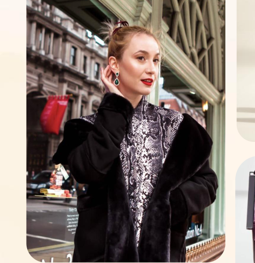

**[Image: Aug226.pdf-0003-04.png (517x532, 483.2KB)]**

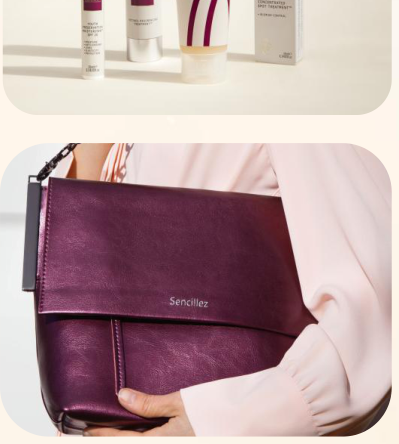

**[Image: Aug226.pdf-0003-05.png (399x444, 215.3KB)]**

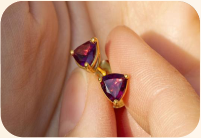

**[Image: Aug226.pdf-0003-06.png (407x280, 222.2KB)]**

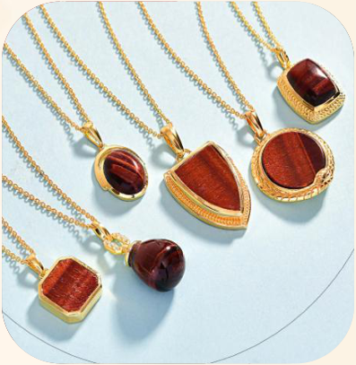

**[Image: Aug226.pdf-0003-07.png (397x407, 285.2KB)]**

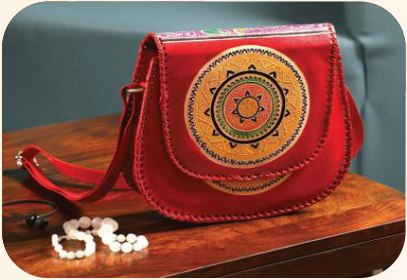

**[Image: Aug226.pdf-0003-08.png (407x280, 239.5KB)]**

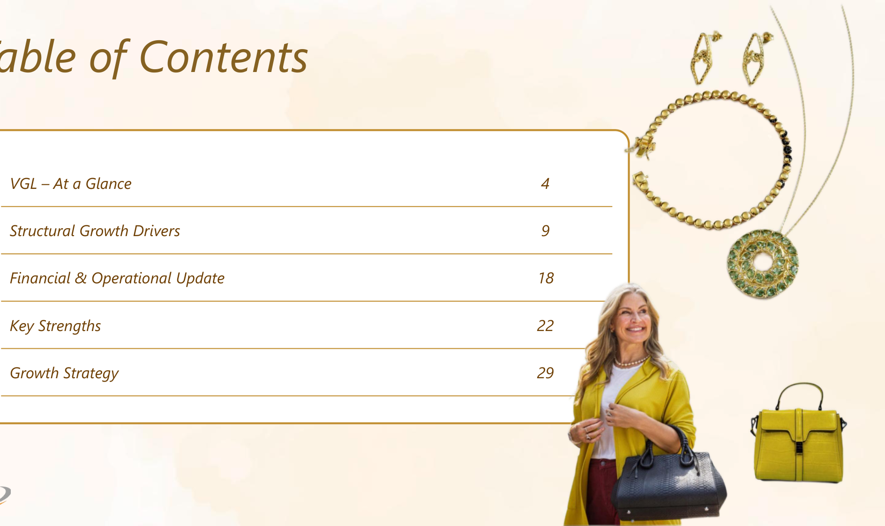

**[Image: Aug226.pdf-0004-00.png (1888x1125, 683.5KB)]**

<!-- Start of picture text -->
Table of Contents VGL – At a Glance 4 Structural Growth Drivers  9 Financial & Operational Update 18 Key Strengths 22 Growth Strategy 29 <!-- End of picture text -->

#### _Table of Contents_ 

**[Image: Aug226.pdf-0004-02.png (91x55, 4.7KB)]**

### _01_ 

## _VGL – At a Glance_ 

**[Image: Aug226.pdf-0005-02.png (729x869, 817.4KB)]**

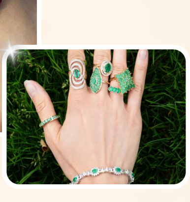

**[Image: Aug226.pdf-0005-03.png (386x411, 257.0KB)]**

**[Image: Aug226.pdf-0005-04.png (91x55, 4.7KB)]**

4 

###### _VGL : An Omnichannel Consumer Company with Global Scale_ 

**[Image: Aug226.pdf-0006-01.png (121x74, 5.8KB)]**

A Vertically Integrated Global Consumer Company with End-to-End Capabilities Across Manufacturing, Distribution,  brand ownership and omnichannel retail capabilities to serve customers across jewellery, accessories and lifestyle categories in leading international markets 

**[Image: Aug226.pdf-0006-03.png (103x101, 3.1KB)]**

**[Image: Aug226.pdf-0006-04.png (103x100, 3.1KB)]**

**[Image: Aug226.pdf-0006-05.png (103x101, 3.6KB)]**

###### **Product Portfolio** 

###### **Integrated Business Model** 

###### **Omnichannel Customer Reach** 

   - Jewellery 

- Owned Manufacturing Infrastructure 

- • Owned Distribution Network • Portfolio of Owned Brands 

- Digital & E-commerce Platforms 

- • Television Commerce 

   - Lifestyle Products 

   - Fashion Accessories 

- OTT & Social Commerce Channels 

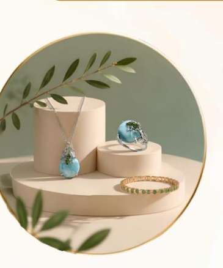

**[Image: Aug226.pdf-0006-15.png (365x438, 157.7KB)]**

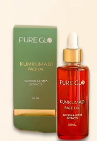

**[Image: Aug226.pdf-0006-16.png (197x286, 65.1KB)]**

**[Image: Aug226.pdf-0006-17.png (103x100, 3.9KB)]**

**[Image: Aug226.pdf-0006-18.png (103x100, 3.5KB)]**

###### **Differentiated Growth Platform** 

###### **Global Market Presence** 

- Strong Presence in USA and UK 

- • Operations Across Multiple Global Markets 

- • Established Niche in Global Retail 

- End-to-End Control Across the Value Chain 

- • Consumer-Centric Omnichannel Approach 

- • Scalable Global Retail Ecosystem 

**[Image: Aug226.pdf-0006-23.png (243x145, 23.2KB)]**

5 

###### _From Gemstone Trading to Integrated Consumer Ecosystem_ 

**[Image: Aug226.pdf-0007-01.png (121x74, 5.8KB)]**

###### **_From a first-generation gemstone trading business to a listed, vertically integrated global business_** 

**1980s–89** 

###### **Foundation & Gemstone Trading** 

- Established as a gemstone sourcing & trading business serving international markets 

- Incorporated in 1989, laying the foundation for a global growth journey 

**2010–2012** 

###### **Balance Sheet Transformation** 

- Undertook Corporate Debt Restructuring (CDR) in 2010 

- Completed full repayment of obligations significantly ahead of schedule, demonstrating financial resilience & disciplined execution 

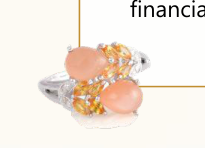

**[Image: Aug226.pdf-0007-11.png (205x148, 20.0KB)]**

**1996–97** 

###### **Forward integration into Jewelry manufacturing** 

- Entered jewellery manufacturing with establishment of a dedicated facility in Jaipur 

- ▪ Successfully listed, raising growth capital & enhancing market credibility. 

**2013–2021** 

**Lifestyle Platform Development** 

- Diversified beyond jewellery into lifestyle products 

- Strengthened D2C capabilities via owned digital channels & customer engagement initiatives. 

- Re-entered German market in 2021, expanding international reach 

**2003–2008** 

###### **Retail & International Expansion** 

- Expanded into B2C retail through TV shopping platforms across US, UK and other markets 

- Navigated global financial crisis through strategic portfolio repositioning with focus on value-led offerings 

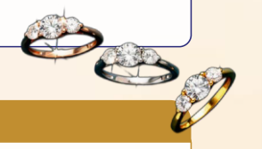

**[Image: Aug226.pdf-0007-24.png (294x168, 30.8KB)]**

###### **2023–2026** 

###### **Digital & Platform-Led Growth** 

- Acquired Ideal World & Mindful Souls, strengthening platform capabilities & category expansion 

- Increased share of digital revenues to ~45% through accelerated omnichannel adoption 

- Enhanced scalability via AI-led planning tools and migration to a modern commerce technology stack 

**6** 

###### _A Multi-Category Consumer Portfolio: Expanding Beyond Jewellery_ 

**[Image: Aug226.pdf-0008-01.png (121x74, 5.8KB)]**

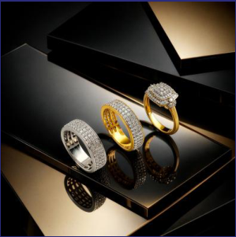

**[Image: Aug226.pdf-0008-02.png (299x301, 128.4KB)]**

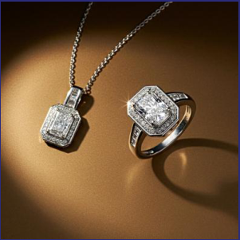

**[Image: Aug226.pdf-0008-03.png (301x301, 137.8KB)]**

- **~14,000–15,000** new jewellery designs launched annually, with 

   - ~ **30,000+ SKUs** available at any given time 

- In-house **testing lab** and **manufacturing** 

- • Covers **7 different metals** (Silver, Gold, Platinum, Steel, Brass, Copper, Bronze) 

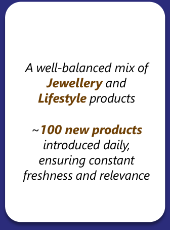

**[Image: Aug226.pdf-0008-07.png (336x453, 24.1KB)]**

<!-- Start of picture text -->
A well-balanced mix of Jewellery  and Lifestyle  products ~ 100 new products introduced daily, ensuring constant freshness and relevance <!-- End of picture text -->

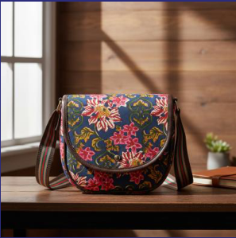

**[Image: Aug226.pdf-0008-08.png (297x299, 160.2KB)]**

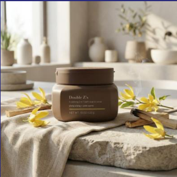

**[Image: Aug226.pdf-0008-09.png (299x299, 180.5KB)]**

   - Facilitated by innovation & a global sourcing base 

- Casted, Handmade, Diamond Cut & Beads Jewellery 

**[Image: Aug226.pdf-0008-12.png (220x94, 6.7KB)]**

**[Image: Aug226.pdf-0008-13.png (99x99, 5.3KB)]**

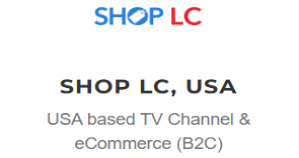

**[Image: Aug226.pdf-0008-14.png (299x158, 13.8KB)]**

**TJC, Ideal World & Rachel Galley** www.shoplc.com <u>www.tjc.co.uk , www.idealworld.tv, www.rachelgalley.com</u> 

###### **Our Companies** 

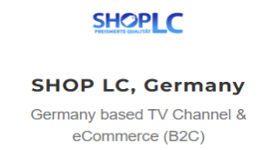

**[Image: Aug226.pdf-0008-17.png (301x165, 17.6KB)]**

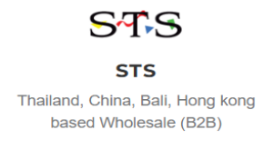

**[Image: Aug226.pdf-0008-18.png (301x165, 15.8KB)]**

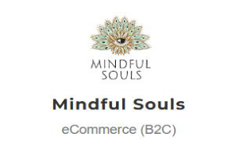

**[Image: Aug226.pdf-0008-19.png (301x182, 28.0KB)]**

7 

###### _Q1 FY27 Performance Update_ 

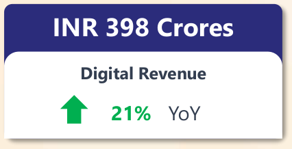

**[Image: Aug226.pdf-0009-01.png (426x218, 13.1KB)]**

<!-- Start of picture text -->
INR 398 Crores Digital Revenue 21% YoY <!-- End of picture text -->

**INR 917 Crores** 

**[Image: Aug226.pdf-0009-03.png (407x130, 7.2KB)]**

<!-- Start of picture text -->
Revenue from Operations 13% YoY <!-- End of picture text -->

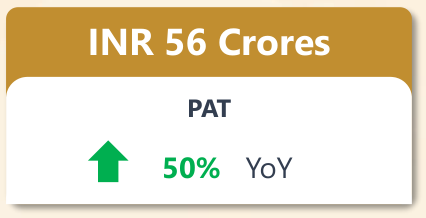

**[Image: Aug226.pdf-0009-04.png (426x218, 10.5KB)]**

<!-- Start of picture text -->
INR 56 Crores PAT 50% YoY <!-- End of picture text -->

###### **INR 102 Crores** 

**[Image: Aug226.pdf-0009-06.png (407x130, 4.6KB)]**

<!-- Start of picture text -->
EBITDA 37% YoY <!-- End of picture text -->

**[Image: Aug226.pdf-0009-07.png (121x74, 5.8KB)]**

###### **INR 484 Crores** 

**[Image: Aug226.pdf-0009-09.png (407x130, 5.4KB)]**

<!-- Start of picture text -->
TV Revenue 9% YoY <!-- End of picture text -->

**Margin at 11%** 

VGL  certified **Great Place to Work** ®across the globe 

**“ICRA ESG Ratings** has improved its ‘Combined ESG Rating’ to **‘74 (Strong)’’** 

Vaibhav Global Limited Achieves ‘ **Responsible Jewellery Council (RJC)’ Certification** 

**Shop LC** Named Among USA TODAY’s **Most Trusted Brands** of 2026” 

8 8 

Numbers are rounded off to nearest figure 

## _02 Structural Growth Drivers_ 

**[Image: Aug226.pdf-0010-01.png (91x55, 4.6KB)]**

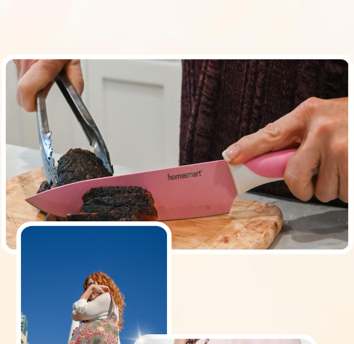

**[Image: Aug226.pdf-0010-02.png (727x706, 591.5KB)]**

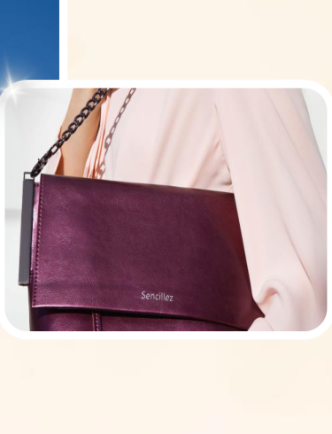

**[Image: Aug226.pdf-0010-03.png (375x490, 148.2KB)]**

**[Image: Aug226.pdf-0010-04.png (147x126, 27.4KB)]**

9 

###### _Growth Drivers Driving Long-Term Value Creation_ 

**[Image: Aug226.pdf-0011-01.png (230x28, 3.5KB)]**

<!-- Start of picture text -->
Vertical Integration <!-- End of picture text -->

###### **Diversified Global Footprint** 

**Higher** gross margin **End-to-end control** 

Profitable presence across **US, UK & Europe** 

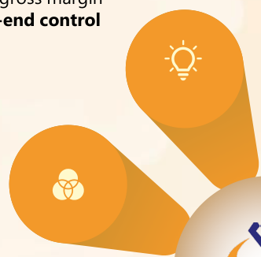

**[Image: Aug226.pdf-0011-05.png (332x326, 21.0KB)]**

**[Image: Aug226.pdf-0011-06.png (305x328, 17.2KB)]**

###### **Digital-First Omnichannel Growth Platform** 

###### **Capital Discipline** 

**24% ROCE** and **₹296 Cr net cash** position 

**Digital share** targeted **50%+** supported by live commerce 

**[Image: Aug226.pdf-0011-11.png (103x68, 7.5KB)]**

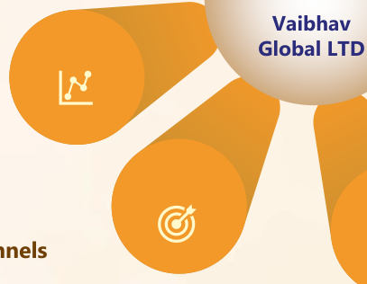

**[Image: Aug226.pdf-0011-12.png (407x316, 27.3KB)]**

<!-- Start of picture text -->
Vaibhav Global LTD <!-- End of picture text -->

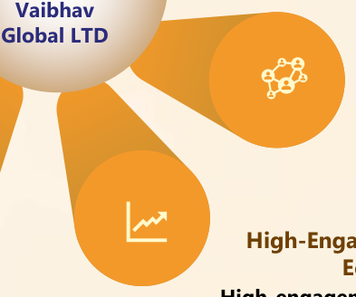

**[Image: Aug226.pdf-0011-13.png (393x328, 25.8KB)]**

<!-- Start of picture text -->
Vaibhav Global LTD <!-- End of picture text -->

###### **AI-Enabled Commerce** 

###### **Strengthening Brand Equity** 

**Proprietary first-party data** enabling **AI-led** merchandising, forecasting & customer retention 

**Brand-led portfolio** enhancing margins, loyalty and pricing control 

###### **Multiple Commerce Channels** 

**High-Engagement Customer Ecosystem High-engagement ecosystem** driving customer lifetime value 

**127mn+ household** reach across channels **Direct** customer engagement at scale 

**[Image: Aug226.pdf-0011-21.png (121x74, 5.7KB)]**

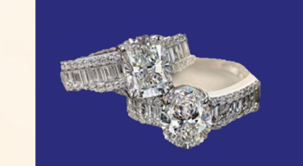

**[Image: Aug226.pdf-0011-22.png (378x207, 56.3KB)]**

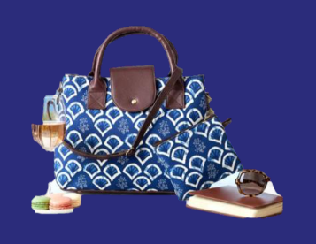

**[Image: Aug226.pdf-0011-23.png (357x276, 101.2KB)]**

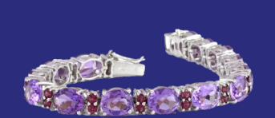

**[Image: Aug226.pdf-0011-24.png (343x148, 51.9KB)]**

**10** 10 

As on FY26 

###### _Vertical Integration Driving Superior Gross Margins_ 

**[Image: Aug226.pdf-0012-01.png (121x74, 5.8KB)]**

###### **Manufacturing Scale and Design Agility for Western Markets** 

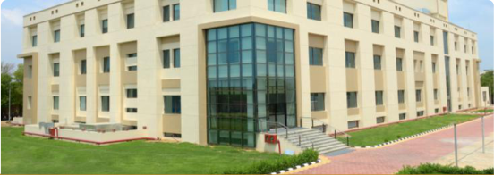

**[Image: Aug226.pdf-0012-03.png (552x196, 245.7KB)]**

**[Image: Aug226.pdf-0012-04.png (70x67, 2.3KB)]**

**Design & Owned Owned Customer Manufacture Brands Distribution Data 5 units 1,69,000 sq.ft. Mumbai** Manufacturing units across Jaipur factory Diamond sourcing India, China, USA (Jewellery - Fully integrated) facility **30+ ~5 mn pieces ~100 ~14–15K** Global sourcing Annual production New products New jewellery countries capacity added daily designs per year 

###### **Gross Margin: VGL vs. Typical Importer (%)** 

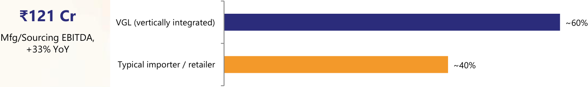

**[Image: Aug226.pdf-0012-07.png (1403x209, 20.8KB)]**

<!-- Start of picture text -->
₹121 Cr VGL (vertically integrated) ~60% Mfg/Sourcing EBITDA, +33% YoY Typical importer / retailer ~40% <!-- End of picture text -->

###### **2,000+** 

Highly skilled workers (Jewellery) 

###### **1,000+** 

Highly skilled workers (Jaipur) 

###### **250+** 

Highly skilled workers (Gemstone) 

**[Image: Aug226.pdf-0012-14.png (105x35, 1.4KB)]**

<!-- Start of picture text -->
130+ <!-- End of picture text -->

Highly skilled designers 

11 11 

As on FY26 

###### _Diversified Global Footprint Across Manufacturing, Retail and Sourcing_ 

**[Image: Aug226.pdf-0013-01.png (121x74, 5.8KB)]**

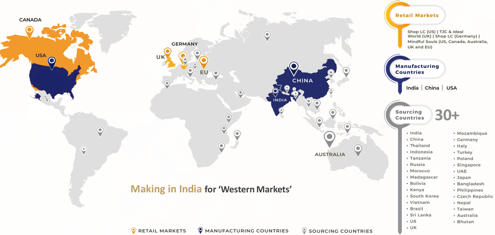

**[Image: Aug226.pdf-0013-02.png (1470x700, 252.8KB)]**

<!-- Start of picture text -->
CANADA USA India China USA 30+ Making in India for ‘Western Markets’ <!-- End of picture text -->

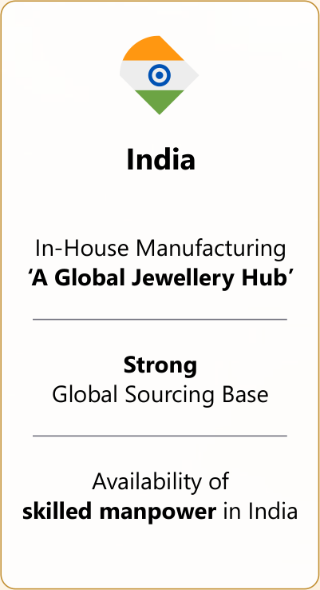

**[Image: Aug226.pdf-0013-03.png (401x738, 28.7KB)]**

<!-- Start of picture text -->
India In-House Manufacturing ‘A Global Jewellery Hub’ Strong Global Sourcing Base Availability of skilled manpower  in India <!-- End of picture text -->

12 

###### _Strong Global Revenue Mix with Improving Profitability_ 

**[Image: Aug226.pdf-0014-01.png (121x74, 5.8KB)]**

###### **Q1FY27 Revenue Mix** 

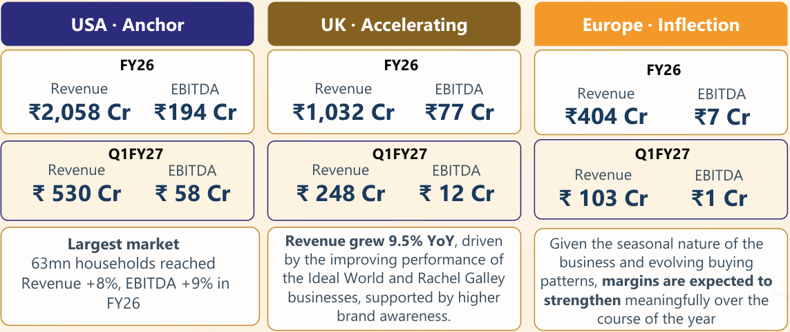

**[Image: Aug226.pdf-0014-03.png (1143x482, 92.9KB)]**

<!-- Start of picture text -->
USA · Anchor UK · Accelerating Europe · Inflection FY26 FY26 FY26 Revenue EBITDA Revenue EBITDA Revenue EBITDA ₹2,058 Cr ₹194 Cr ₹1,032 Cr ₹77 Cr ₹404 Cr ₹7 Cr Q1FY27 Q1FY27 Q1FY27 Revenue EBITDA Revenue EBITDA Revenue EBITDA ₹ 530 Cr ₹ 58 Cr ₹ 248 Cr ₹ 12 Cr ₹ 103 Cr ₹1 Cr Largest market Revenue grew 9.5% YoY , driven  Given the seasonal nature of the 63mn households reached by the improving performance of  business and evolving buying  Revenue +8%, EBITDA +9% in  the Ideal World and Rachel Galley  patterns,  margins are expected to FY26  businesses, supported by higher  strengthen  meaningfully over the brand awareness. course of the year <!-- End of picture text -->

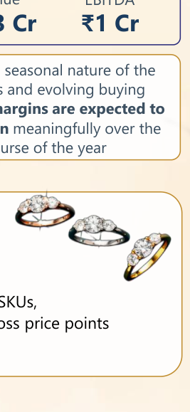

**[Image: Aug226.pdf-0014-04.png (267x579, 46.7KB)]**

<!-- Start of picture text -->
₹1 Cr margins are expected to  meaningfully over the course of the year <!-- End of picture text -->

USA 60% UK 28% Europe 12% 

###### **Macro Resilience: Limited Gold & Currency Exposure** 

###### **Low gold inventory held** 

###### **Product mix** 

###### **Price range** 

$5–$1,000 across ~35,000 SKUs, spreading demand risk across price points 

Production is order-basis, gold price impact is minimal 

Gemstone, diamond, lab-grown stone and silver led (not metal-heavy) 

13 

Numbers are rounded off to nearest figure 

###### _Strengthening Brand Equity_ 

**[Image: Aug226.pdf-0015-01.png (121x74, 5.8KB)]**

**[Image: Aug226.pdf-0015-02.png (496x24, 4.7KB)]**

<!-- Start of picture text -->
In-House Brand Revenue Contribution (%) <!-- End of picture text -->

**57.2%** 

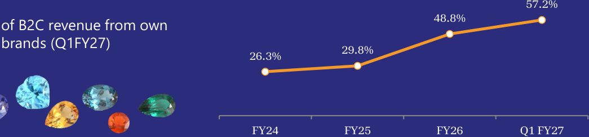

**[Image: Aug226.pdf-0015-04.png (1045x245, 57.7KB)]**

<!-- Start of picture text -->
57.2% 48.8% of B2C revenue from own brands (Q1FY27) 29.8% 26.3% FY24 FY25 FY26 Q1 FY27 <!-- End of picture text -->

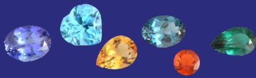

**[Image: Aug226.pdf-0015-05.png (370x113, 43.4KB)]**

###### **Higher gross margin per unit** 

Brand owner captures margin the licensor previously took 

###### **Customer loyalty** 

Brand equity accrues to VGL, not to a third-party licensor 

###### **Pricing control** 

VGL sets both cost and price; no licensor minimum pricing constraints. 

###### **Sales Bifurcation** 

**[Image: Aug226.pdf-0015-13.png (72x71, 2.4KB)]**

**[Image: Aug226.pdf-0015-14.png (72x71, 3.2KB)]**

Achieved **_~57%_** of **gross B2C sales** from **in-house brands** in Apr – Jun quarter 

**Achieved the Target** of **_~50%_** of gross B2C sales, a **year in advance** than anticipated 

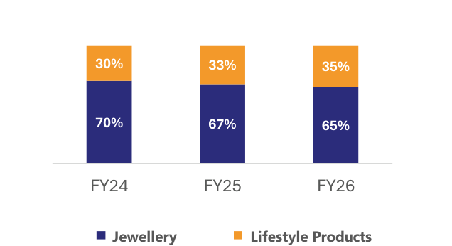

**[Image: Aug226.pdf-0015-17.png (636x346, 14.2KB)]**

<!-- Start of picture text -->
30% 33% 35% 70% 67% 65% FY24 FY25 FY26 Jewellery Lifestyle Products <!-- End of picture text -->

**[Image: Aug226.pdf-0015-18.png (72x70, 2.8KB)]**

**[Image: Aug226.pdf-0015-19.png (72x71, 2.6KB)]**

**[Image: Aug226.pdf-0015-20.png (372x126, 10.0KB)]**

<!-- Start of picture text -->
Strategic brand matrix  focused on price laddering and customer offering <!-- End of picture text -->

**[Image: Aug226.pdf-0015-21.png (370x126, 11.6KB)]**

<!-- Start of picture text -->
Enhancing  repeat purchases  and retention through  Brand Archetype  Frameworks <!-- End of picture text -->

14 

###### _AI-Enabled Commerce powered by First-Party Data_ 

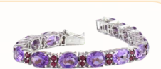

**[Image: Aug226.pdf-0016-01.png (226x98, 24.0KB)]**

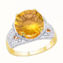

**[Image: Aug226.pdf-0016-02.png (107x107, 12.9KB)]**

**Linear TV** 127mn HH 

**[Image: Aug226.pdf-0016-04.png (222x24, 3.3KB)]**

<!-- Start of picture text -->
VGL owns the data <!-- End of picture text -->

**[Image: Aug226.pdf-0016-05.png (228x100, 18.2KB)]**

**[Image: Aug226.pdf-0016-06.png (599x51, 16.7KB)]**

<!-- Start of picture text -->
Every transaction on every surface  677K  unique customer creates a first-party record records owned <!-- End of picture text -->

**OTA** Broadcast 

**[Image: Aug226.pdf-0016-08.png (121x74, 5.8KB)]**

###### **AI is compounding the data advantage** 

**Recent AI-assisted Shopify migration completed** in ~6 months at roughly one-third of the earlier website re-platforming cost 

**[Image: Aug226.pdf-0016-11.png (70x55, 3.3KB)]**

**Owned Websites** & Mobile Apps 

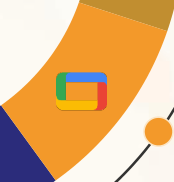

**[Image: Aug226.pdf-0016-13.png (174x182, 5.5KB)]**

**OTT** (Roku, Google TV) 

**Social Retail** (YouTube, Insta) 

**Generative AI** scales ad creatives, product descriptions and website content for SEO and digital visibility 

**AI-driven product-scheduling tool** (in beta last year) now in production — improving viewer engagement and airtime productivity on live TV 

AI also spans demand forecasting, inventory planning, on-air product planning and personalised customer engagement 

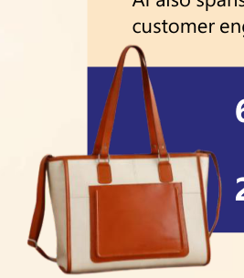

**[Image: Aug226.pdf-0016-19.png (267x305, 67.1KB)]**

**677K** unique customer records   · **3.5 lakh** new registrations (TTM) 

**23** pieces/customer/year   · **0%** marketplace take-rate on primary channels 

15 

###### _A High-Engagement Customer Ecosystem_ 

**[Image: Aug226.pdf-0017-01.png (121x74, 5.8KB)]**

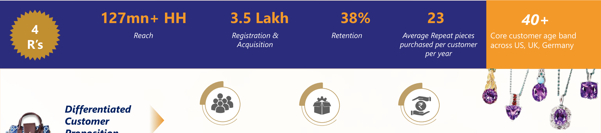

**[Image: Aug226.pdf-0017-02.png (2000x444, 178.7KB)]**

<!-- Start of picture text -->
127mn+ HH 3.5 Lakh 38% 23 40+ 4 Reach Registration &  Retention Average Repeat pieces  Core customer age band R’s Acquisition purchased per customer  across US, UK, Germany per year Differentiated Customer <!-- End of picture text -->

**[Image: Aug226.pdf-0017-03.png (63x136, 2.6KB)]**

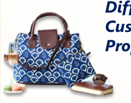

**[Image: Aug226.pdf-0017-04.png (269x213, 73.4KB)]**

**[Image: Aug226.pdf-0017-05.png (882x53, 4.9KB)]**

<!-- Start of picture text -->
Proprietary ‘TV Channels’ <!-- End of picture text -->

**DIY jewellery kits —** assemble-your-own beads and garland kits 

**Wellness & supplements —** riding rising US demand around popular weightmanagement drug categories; currently third-party sourced, own-label potential once the category scales 

**Rising Auction —** customers bid on tail inventory clearing aged SKUs while deepening engagement 

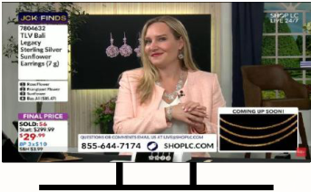

**[Image: Aug226.pdf-0017-09.png (343x212, 138.9KB)]**

**_Vertically integrated_** sourcing, merchandising & fulfilment 

**_Direct customer reach_** and high **_repeat_** behaviour 

**16** 

###### _Q1 FY27 Performance Update_ 

**[Image: Aug226.pdf-0018-01.png (121x74, 5.8KB)]**

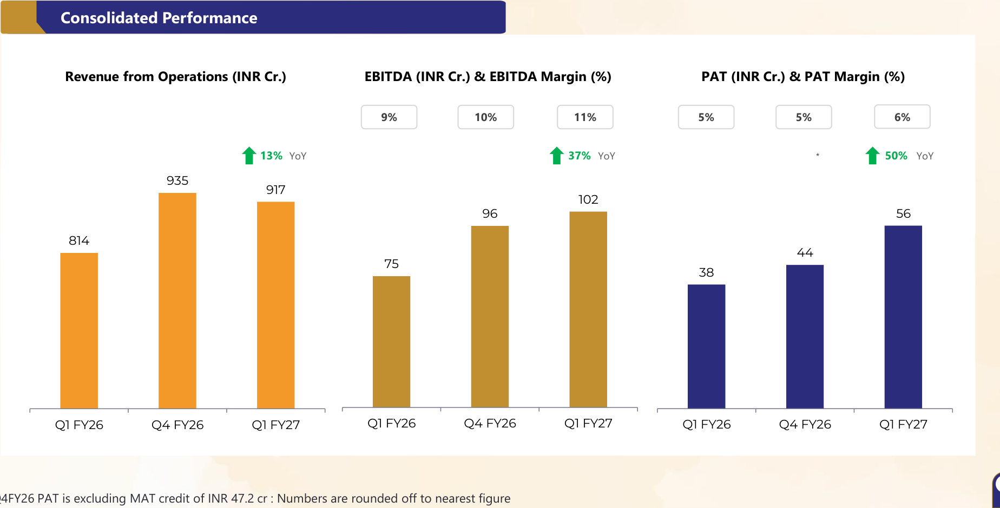

**[Image: Aug226.pdf-0018-02.png (1848x940, 88.2KB)]**

<!-- Start of picture text -->
Consolidated Performance Revenue from Operations (INR Cr.) EBITDA (INR Cr.) & EBITDA Margin (%) PAT (INR Cr.) & PAT Margin (%) 9% 10% 11% 5% 5% 6% 13% YoY 37% YoY * 50% YoY 935 917 102 96 56 814 44 75 38 Q1 FY26 Q4 FY26 Q1 FY27 Q1 FY26 Q4 FY26 Q1 FY27 Q1 FY26 Q4 FY26 Q1 FY27 Note: Q4FY26 PAT is excluding MAT credit of INR 47.2 cr : Numbers are rounded off to nearest figure <!-- End of picture text -->

17 

Note: Q4FY26 PAT is excluding MAT credit of INR 47.2 cr : Numbers are rounded off to nearest figure 

### _03_ 

## _Financial & Operational Update_ 

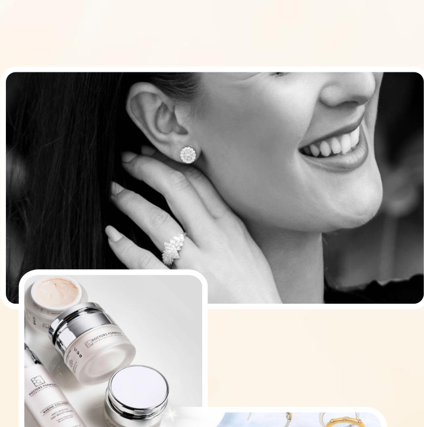

**[Image: Aug226.pdf-0019-02.png (715x720, 330.3KB)]**

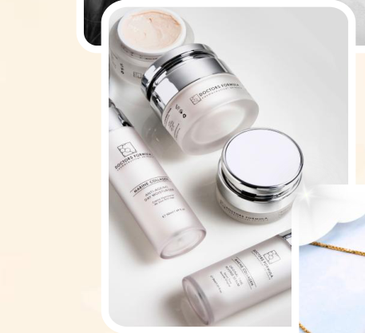

**[Image: Aug226.pdf-0019-03.png (457x417, 161.6KB)]**

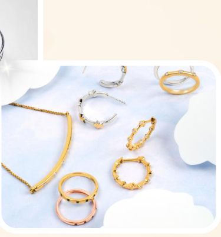

**[Image: Aug226.pdf-0019-04.png (375x401, 138.7KB)]**

**[Image: Aug226.pdf-0019-05.png (91x55, 4.6KB)]**

18 

###### _Q1 FY27 Segmental Highlights_ 

**[Image: Aug226.pdf-0020-01.png (121x74, 5.8KB)]**

###### **Revenue split (Rs. Cr)** 

**[Image: Aug226.pdf-0020-03.png (869x317, 25.4KB)]**

<!-- Start of picture text -->
TV Revenue 485 484 444 Q1 FY26 Q4 FY26 Q1 FY27 <!-- End of picture text -->

**[Image: Aug226.pdf-0020-04.png (869x317, 24.5KB)]**

<!-- Start of picture text -->
Digital Revenue 400 398 329 Q1 FY26 Q4 FY26 Q1 FY27 <!-- End of picture text -->

###### **TV** 

**[Image: Aug226.pdf-0020-06.png (869x347, 40.4KB)]**

<!-- Start of picture text -->
Sales Volume ('000s) Average Selling Price US$ 1,373 1,343 40.5 38.8 37.1 1,291 Q1 FY26 Q4 FY26 Q1 FY27 Q1 FY26 Q4 FY26 Q1 FY27 <!-- End of picture text -->

###### **Digital** 

**[Image: Aug226.pdf-0020-08.png (869x347, 36.6KB)]**

<!-- Start of picture text -->
Sales Volume ('000s) Average Selling Price US$ 38.5 37.0 33.8 1,139 1,131 1,123 Q1 FY26 Q4 FY26 Q1 FY27 Q1 FY26 Q4 FY26 Q1 FY27 <!-- End of picture text -->

19 

###### _EBITDA Margin Walk_ 

**[Image: Aug226.pdf-0021-01.png (121x74, 5.8KB)]**

x 

**[Image: Aug226.pdf-0021-03.png (1724x514, 94.4KB)]**

<!-- Start of picture text -->
11.1 Higher contribution 9.2 of In-House brands, Better realisation and cost efficiencies Increased usage of Technology, Improved  Increase in spend in Impact due to 4.2 efficiency & operating  digital to further  Higher freight and foreign exchange leverage inroads in respective  fulfilment costs gain of last year locations due to sales mix 1.6 -1.2 -1.0 -1.7 Q1 FY26 Gross Margin Employee Cost Digital Marketing SG&A Other Income Q1 FY27 (Brand mix) (Tech leverage) (Freight/mix) <!-- End of picture text -->

**[Image: Aug226.pdf-0021-04.png (2000x84, 0.8KB)]**

20 

###### _Revenue Mix Overview_ 

**[Image: Aug226.pdf-0022-01.png (1053x784, 97.8KB)]**

<!-- Start of picture text -->
B2C Revenues by Product B2C Revenues by Geography 12% 12% 12% 29% 29% 28% 36% 33% 40% 64% 67% 60% 59% 59% 60% Q1FY26 Q4FY26 Q1FY27 Q1FY26 Q4FY26 Q1FY27 Jewellery Lifestyle Products US       UK         Europe B2C Revenues by Format Budget Pay (% to B2C Revenues) Budget Pay revenues refer to products sold on EMI basis 43% 41% 45% 38% 39% 36% 57% 55% 55% 62% 61% 64% Q1FY26 Q4FY26 Q1FY27 Q1FY26 Q4FY26 Q1FY27 TV revenues Digital revenues Budget Pay revenues  Non-Budget Pay revenues <!-- End of picture text -->

**[Image: Aug226.pdf-0022-02.png (384x403, 221.2KB)]**

**[Image: Aug226.pdf-0022-03.png (121x74, 5.8KB)]**

**[Image: Aug226.pdf-0022-04.png (407x399, 166.9KB)]**

21 

## _04 Key Strengths_ 

**[Image: Aug226.pdf-0023-01.png (91x55, 4.6KB)]**

**[Image: Aug226.pdf-0023-02.png (715x680, 493.4KB)]**

**[Image: Aug226.pdf-0023-03.png (550x416, 177.9KB)]**

**[Image: Aug226.pdf-0023-04.png (377x580, 182.8KB)]**

**[Image: Aug226.pdf-0023-05.png (147x126, 27.1KB)]**

22 

###### _Resilience Through Cycles_ 

**[Image: Aug226.pdf-0024-01.png (121x74, 9.8KB)]**

###### **_A business that has absorbed five major model transitions and external shocks, turned into a profitable engine_** 

✓ **Multiple business-model transitions absorbed** 

Gemstones → Jewellery manufacturing → lifestyle products → retail → digital platform. Each transition changed the revenue model, not just the product 

###### ✓ **19% CAGR in market cap since listing** 

From ~₹8 Cr listing raise in 1997 to a ~₹3,075 Cr market cap and ~₹3,692 Cr revenue, debt-free platform today (excl. dividends, which add further to total shareholder return) 

###### ✓ **Innovation converts directly to revenue** 

78,000+ ideas generated, 1,821+ new products launched, 3 design patents secured (incl. the USPTO-granted Arthritis Ring) 

###### ✓ **Exited CDR early, by choice** 

Entered Corporate Debt Restructuring in 2010 with repayment due by 2020; the obligation was fully repaid by 2012— years ahead of schedule 

###### ✓ **Germany: first full year of positive EBITDA** 

Margins came under pressure due to the economic slowdown and evolving consumer sentiment but have since gradually recovered, enabling the Company to deliver its first full year of positive EBITDA in FY26 

###### ✓ **Growth culture retained through the hard years** 

Most long-tenured employees stayed through loss-making periods on the strength of internal trust — reinforced today by giving teams real ownership 

**23** 

###### _A Portfolio of Scalable Consumer Brands_ 

**[Image: Aug226.pdf-0025-01.png (121x74, 5.8KB)]**

**16 brands across categories and markets** 

**[Image: Aug226.pdf-0025-03.png (213x226, 64.3KB)]**

**[Image: Aug226.pdf-0025-04.png (201x226, 62.3KB)]**

**[Image: Aug226.pdf-0025-05.png (182x213, 52.1KB)]**

**[Image: Aug226.pdf-0025-06.png (182x213, 32.2KB)]**

**[Image: Aug226.pdf-0025-07.png (192x226, 63.6KB)]**

**[Image: Aug226.pdf-0025-08.png (182x213, 50.2KB)]**

**[Image: Aug226.pdf-0025-09.png (201x226, 54.4KB)]**

**[Image: Aug226.pdf-0025-10.png (182x213, 50.3KB)]**

**[Image: Aug226.pdf-0025-11.png (201x226, 30.1KB)]**

**[Image: Aug226.pdf-0025-12.png (184x213, 43.3KB)]**

**[Image: Aug226.pdf-0025-13.png (201x226, 62.4KB)]**

**[Image: Aug226.pdf-0025-14.png (184x213, 35.8KB)]**

**[Image: Aug226.pdf-0025-15.png (201x226, 97.1KB)]**

**[Image: Aug226.pdf-0025-16.png (184x213, 42.7KB)]**

**[Image: Aug226.pdf-0025-17.png (201x226, 42.5KB)]**

**[Image: Aug226.pdf-0025-18.png (182x213, 42.0KB)]**

###### **Selective third-party additions** 

Close-up deals in categories such as collagen supplements, eyewear & select licensed lifestyle labels as additions 

24 24 

###### _Strong Cash Generation, Disciplined Deployment_ 

**[Image: Aug226.pdf-0026-01.png (121x74, 5.8KB)]**

###### **How FY26 Free Cash Flow (₹272 Cr) was allocated:** 

###### **FCF & Net Cash (₹ Cr)** 

**[Image: Aug226.pdf-0026-04.png (830x420, 18.9KB)]**

<!-- Start of picture text -->
387 296 268 272 230 178 167 170 127 103 90 -214 FY21 FY22 FY23 FY24 FY25 FY26 Free Cash Flow Net Cash <!-- End of picture text -->

**[Image: Aug226.pdf-0026-05.png (824x286, 14.5KB)]**

<!-- Start of picture text -->
FCF generated ₹272 Cr −₹100 Cr Dividends paid (~37%) Retained capital ₹172 Cr <!-- End of picture text -->

###### **Strategic Capital Allocation over the years** 

- Self-funded Germany scale-up 

- Self-funded Ideal World integration 

_FY22: Germany / Ideal World investment phase_ 

- Digital infrastructure investment 

- Strategic Residual / M&A optionality available 

- New US manufacturing capacity funded internally 

25 

###### _Strong Fundamentals Driving Sustainable Value Creation_ 

**[Image: Aug226.pdf-0027-01.png (218x26, 2.6KB)]**

<!-- Start of picture text -->
Revenue Profile <!-- End of picture text -->

**Capital Allocation Expansion Funded Through Internal Accruals** Germany & Ideal World acquired through cash flows Strong cash generation & capital discipline 

**~90% Revenue in USD, GBP & EUR** 

**[Image: Aug226.pdf-0027-04.png (680x838, 250.4KB)]**

<!-- Start of picture text -->
Germany & Ideal World acquired through cash flows Strong cash generation & capital discipline Customer Engagement ~23 Products Purchased Per Customer Annually High repeat purchase behaviour Strong customer loyalty &   multi-year relationships <!-- End of picture text -->

Natural hedge through foreign currency revenues Minimal dependence on INR-linked sales 

**[Image: Aug226.pdf-0027-06.png (280x24, 3.5KB)]**

<!-- Start of picture text -->
Shareholder Returns <!-- End of picture text -->

**[Image: Aug226.pdf-0027-07.png (474x158, 17.3KB)]**

<!-- Start of picture text -->
₹686 Cr Cumulative Dividends Paid Since FY20 ~51% payout ratio Consistent focus on shareholder value creation <!-- End of picture text -->

**Brand Portfolio Customer Engagement 16 Owned Brands ~23 Products Purchased Per Customer ~49% of B2C Revenue Annually** Strong portfolio of in-house brands High repeat purchase behaviour Higher customer ownership and margin Strong customer loyalty &   multi-year capture relationships 

**[Image: Aug226.pdf-0027-09.png (121x74, 8.6KB)]**

**26** 

_Note : Data as of FY26_ 

###### _Voice of Customer as a Strategic Asset_ 

**[Image: Aug226.pdf-0028-01.png (121x74, 5.8KB)]**

###### **Voice of Customer Portal** 

###### **B2C Revenues by Format** 

**[Image: Aug226.pdf-0028-04.png (437x230, 9.6KB)]**

<!-- Start of picture text -->
33% 41% 44% 67% 59% 56% FY20 FY25 FY26 <!-- End of picture text -->

**[Image: Aug226.pdf-0028-05.png (347x22, 3.2KB)]**

<!-- Start of picture text -->
TV revenues Digital revenues <!-- End of picture text -->

**[Image: Aug226.pdf-0028-06.png (278x24, 4.1KB)]**

<!-- Start of picture text -->
B2C Revenues by Geography <!-- End of picture text -->

**[Image: Aug226.pdf-0028-07.png (437x270, 18.1KB)]**

<!-- Start of picture text -->
12% 11% 31% 29% 30% 69% 59% 59% FY20 FY25 FY26 US       UK         Europe Revenue breakup based on figures in USD mn <!-- End of picture text -->

**[Image: Aug226.pdf-0028-08.png (450x261, 20.4KB)]**

<!-- Start of picture text -->
Budget Pay (% to B2C Revenues) Budget Pay revenues refer to products sold on EMI basis 39% 39% 38% 61% 61% 62% FY20 FY25 FY26 <!-- End of picture text -->

**[Image: Aug226.pdf-0028-09.png (491x24, 4.4KB)]**

<!-- Start of picture text -->
Budget Pay revenues  Non-Budget Pay revenues <!-- End of picture text -->

**[Image: Aug226.pdf-0028-10.png (309x24, 3.6KB)]**

<!-- Start of picture text -->
Unique Customer Base (in 000') <!-- End of picture text -->

**[Image: Aug226.pdf-0028-11.png (474x244, 10.1KB)]**

<!-- Start of picture text -->
710 681 585 497 461 FY22 FY23 FY24 FY25 FY26 <!-- End of picture text -->

**[Image: Aug226.pdf-0028-12.png (249x23, 3.3KB)]**

<!-- Start of picture text -->
B2C Revenues by Product <!-- End of picture text -->

**[Image: Aug226.pdf-0028-13.png (435x274, 15.5KB)]**

<!-- Start of picture text -->
22% 33% 35% 78% 67% 65% FY20 FY25 FY26 Fashion Jewellery Lifestyle Products <!-- End of picture text -->

**[Image: Aug226.pdf-0028-14.png (515x576, 361.3KB)]**

**Unified Customer Feedback Hub** 

Consolidates customer inputs from emails, messages, social media platforms, and product returns. 

###### **AI-Powered Issue Resolution** 

AI-driven sentiment analysis to categorize feedback and route complaints. 

###### **Real-Time VOC Dashboard** 

Live monitoring platform that flags negative sentiment cases for timely intervention. 

###### **Closed-Loop Feedback System** 

Call centre teams India capture customer insights & relay them for continuous improvement. 

**Strong Customer Satisfaction Metrics** 

96%+ CSAT across key markets and NPS above 57% in US & UK during FY26 

**27** 

###### _Consistent Shareholder Returns_ 

**[Image: Aug226.pdf-0029-01.png (121x74, 5.8KB)]**

_A consistent, cash-anchored dividend policy sustained through both investment and harvest phases._ 

**15–20** 

**38%** 

##### **₹100 Cr** 

##### **₹686 Cr** 

Consecutive quarters of dividend payout funded entirely from FCFs 

Of FY26 FCF (₹100 Cr) returned as dividends 

Total dividends paid in FY26 

Cumulative dividends paid since FY20 (~51% payout) 

Market capitalisation has compounded at 19% CAGR since listing, excluding the dividend stream entirely 

**[Image: Aug226.pdf-0029-12.png (1661x317, 36.8KB)]**

<!-- Start of picture text -->
ROE ROCE 18% 15% 24% 24% 12% 19% 19% 10% 9% 14% FY23 FY24 FY25 FY26 Q1 FY27  FY23 FY24 FY25 FY26 Q1 FY27 <!-- End of picture text -->

28 

**[Image: Aug226.pdf-0030-00.png (715x680, 493.4KB)]**

### _04_ 

**[Image: Aug226.pdf-0030-02.png (550x416, 180.0KB)]**

**[Image: Aug226.pdf-0030-03.png (377x580, 182.8KB)]**

## _Growth Strategy_ 

**[Image: Aug226.pdf-0030-05.png (147x126, 27.1KB)]**

**[Image: Aug226.pdf-0030-06.png (91x55, 4.6KB)]**

29 

###### _Expanding Addressable Markets Supporting Long-Term Growth_ 

**[Image: Aug226.pdf-0031-01.png (121x74, 5.8KB)]**

**[Image: Aug226.pdf-0031-02.png (1932x660, 132.1KB)]**

<!-- Start of picture text -->
USA · Video/Live Commerce ($bn) UK · Online Retail Sales (£bn) Germany · E-Commerce Sales (€bn) 68 132 96 50 127 92 89 123 2023 2026F 2023 2024 2025 2024 2025 2026F Immediate TAM: $2–2.5 bn Immediate TAM: ~$3bn (incl. Austria) Immediate TAM: $14–15 bn 3rd largest e-commerce market globally EU's largest consumer economy; content-driven shopping habit Rapid expansion of livestreaming and video-integrated commerce. VGL  Shop LC anchors ~$232mn revenue — under 0.3% of this  TJC + Ideal World combined ~£87mn — a fraction of the Shop LC Germany at €27mn, now turning profitable Today TAM base <!-- End of picture text -->

###### **Aggregate platform TAM: ~$20bn · VGL's combined FY26 revenue of ~₹3,692 Cr (~$416mn) represents scope for high penetration** 

30 

_Sources:_ **_USA_** _: Statista-sourced US livestreaming/video commerce sales._ **_UK_** _: ONS online retail sales (2023/2024 actuals, via Retail Gazette analysis, Feb 2025); 2025 growth rate per eMarketer forecast (Netguru, Nov 2025),_ **_Germany_** _: HDE (Handelsverband Deutschland) Online Monitor 2025, crossreferenced by bevh using Destatis data; 2025/2026 are HDE's own forecasts._ 

###### _Emerging Growth Engines_ 

**[Image: Aug226.pdf-0032-01.png (1217x799, 113.6KB)]**

<!-- Start of picture text -->
Ideal World Mindful Souls Q1 FY27 revenue £ 6 mn Q1 FY27 Revenue ~$ 4 mn Unique customer  (TTM) 143K * Unique customer  (TTM) 99K Sustained Strong Profitability 28% New customer EBITDA Margins Customer growth YoY Revenue and Unique Customers Key Updates 30 138 142 150 Lower recurring subscription revenues due to reduced customer acquisition 20 100 69 24 10 21 50 Sustained strong gross margin 7 0 0 FY24 FY25 FY26 Net Revenue  Unique Customers   Launched 145 new products during Q1 (£ in mn) (in '000) FY27 * Including 18K common customers of TJC <!-- End of picture text -->

**[Image: Aug226.pdf-0032-02.png (121x74, 5.8KB)]**

**[Image: Aug226.pdf-0032-03.png (588x799, 54.8KB)]**

<!-- Start of picture text -->
Germany Q1 FY27 revenue € 6 mn Digital sales mix ~24% ~32% Lifestyle Products’ sales mix Revenue (in Euro mn) 26 27 21 14 4 FY22 FY23 FY24 FY25 FY26 Key Updates Sustained market  Better product mix & share gains in TV pricing discipline Digital performance Strong gross margins at 68% improved to  ~ 24% <!-- End of picture text -->

31 

###### _Lab-Grown Diamonds: A Structural Growth Opportunity_ 

**[Image: Aug226.pdf-0033-01.png (121x74, 5.8KB)]**

###### **Global lab grown diamond market size*** (USD billion) 

**[Image: Aug226.pdf-0033-03.png (461x264, 72.3KB)]**

**[Image: Aug226.pdf-0033-04.png (387x178, 13.7KB)]**

<!-- Start of picture text -->
Rising consumer acceptance of sustainable and ethically sourced jewellery <!-- End of picture text -->

**[Image: Aug226.pdf-0033-05.png (385x176, 13.2KB)]**

<!-- Start of picture text -->
Attractive price-value proposition  driving adoption across new customer segments <!-- End of picture text -->

**[Image: Aug226.pdf-0033-06.png (290x145, 35.1KB)]**

**[Image: Aug226.pdf-0033-07.png (905x286, 15.9KB)]**

<!-- Start of picture text -->
92.0 34.0 2026 2034 <!-- End of picture text -->

**[Image: Aug226.pdf-0033-08.png (783x26, 8.9KB)]**

<!-- Start of picture text -->
Lab grown diamond business Q1 FY27 Revenue contribution (VGL) <!-- End of picture text -->

**[Image: Aug226.pdf-0033-09.png (366x366, 12.9KB)]**

<!-- Start of picture text -->
13% <!-- End of picture text -->

Others Lab Grown Diamonds 

**[Image: Aug226.pdf-0033-11.png (434x132, 59.6KB)]**

**[Image: Aug226.pdf-0033-12.png (386x418, 23.5KB)]**

<!-- Start of picture text -->
Chemically, physically and optically  identical to natural diamonds Increasing penetration across bridal, fashion and gifting categories <!-- End of picture text -->

**[Image: Aug226.pdf-0033-13.png (290x145, 34.2KB)]**

32 

***Fortune Business Insights** 

###### _Growth Drivers & FY30 Roadmap_ 

**[Image: Aug226.pdf-0034-01.png (121x74, 5.7KB)]**

###### **_Revenue Target of ₹5,000–5,500 Crores by FY30_** 

###### **Digital business breakout** 

- FY27 target: **50% of B2C revenue** from digital (up from 44% in FY26). 

- All channel websites now on Shopify, a D2C-first platform 

###### **Live commerce & social media** 

- **Live commerce** becomes a bigger medium 

- **Meta and TikTok marketing** broaden customer acquisition 

- Global **livestream e-commerce** is growing at a ~41% CAGR industry-wide 

###### **Mindful Souls & Ideal World scaling** 

- Both acquisitions **delivered profitably** in FY26, now growth contributors 

###### **Germany normalisation** 

- First full year of **positive EBITDA** achieved in FY26 

- ▪ Expected to contribute towards profitability from FY27 

###### **In-house brands & lifestyle mix** 

**[Image: Aug226.pdf-0034-15.png (461x538, 339.5KB)]**

- Brands Targeting **60%+ of B2C** revenue by FY27 (from 48.8%); 

- **Lifestyle products targeting 50** % of B2C revenue mediumterm (from 35% today) 

###### **AI-led planning & efficiency** 

- **AI product-scheduling tool now** in production 

- ▪ **Generative AI** scaling content and SEO ▪ **Continued investment** in demand forecasting & personalisation 

33 33 

###### _What Sets Us Apart_ 

**[Image: Aug226.pdf-0035-01.png (121x74, 5.8KB)]**

|**Platform Strength**|**Platform Reality (FY26)**|
|---|---|
|**Growth quality**|**26%**EBITDA growth +**74% PAT**growth on**9.2%**topline growth. EPS up**73%**to ₹16.0|
|**Margin durability**|**63.5%**gross margin underpinned by**~49%**in-house brand mix (streamlined from 33 to**16 brands**) + owned manufacturing|
|**Capital efficiency**|ROCE**24%**; net-cash balance sheet**(₹296 Cr);**FCF-funded growth — no equity raised, no net debt|
|**Channel resilience**|**44%**digital and rising toward**50% FY27 target**; OTT + social distribution; all 4 channel sites migrated to Shopify.|
|**Geographic diversification**|Europe now**11%**and fastest-growing; Germany's first full year of**positive EBITDA**; Mindful Souls and Ideal World both**profitable**|
|**Governance**|Majority-independent board (62.5%); ICSI Governance Award; Big Four audit; FCF-anchored dividend policy; credit-rated ICRA A+/CARE A+|

34 

###### _Strong Leadership_ 

**[Image: Aug226.pdf-0036-01.png (242x240, 71.0KB)]**

**[Image: Aug226.pdf-0036-02.png (240x240, 63.5KB)]**

**[Image: Aug226.pdf-0036-03.png (242x240, 87.3KB)]**

###### **Mr. Sunil Agrawal** 

**Mr. Nitin Panwad Mr. Vineet Ganeriwala Group CFO President, Shop LC (US) Total Exp –  16 years Total Exp – 27 years VGL Exp – 15 years VGL Exp – 6 years** 

**Managing Director,** 

**Total Exp – 46 years VGL Exp – 46 years** 

- Chartered Accountant 

   - Chartered Accountant; IIM Kolkata alumnus 

- First generation entrepreneur 

   - Cost optimization and process improvements 

- Founded Vaibhav Enterprises in 1980 

      - Former Country Finance Controller (Italy/Germany) at Vodafone 

   - Established the German subsidiary 

- Veteran of the gems and jewelry industry 

- Expert in strategic financial leadership 

**[Image: Aug226.pdf-0036-17.png (121x74, 5.8KB)]**

**[Image: Aug226.pdf-0036-18.png (240x240, 26.0KB)]**

**[Image: Aug226.pdf-0036-19.png (240x240, 23.6KB)]**

**Mr. Deepak Mishra Mr. Raghuveer Patnala Managing Director, TJC, Managing Director, Germany** 

**Total Exp – 20 years VGL Exp – 20 years** 

**Total Exp – 15 years VGL Exp – 12 years** 

- Expert in TV home shopping and e-commerce 

   - IIM Udaipur MBA; joined as Management Trainee in 2014 

- Driven double-digit revenue growth at TJC 

   - Previous leadership roles in China and UK 

- Multi-category leader in China and UK • 

- jewelry and fashion Leads German digital transformation and CRM 

35 

###### _Management team_ 

**[Image: Aug226.pdf-0037-01.png (242x240, 66.7KB)]**

**[Image: Aug226.pdf-0037-02.png (240x240, 61.0KB)]**

**Mr. Sabaresh Kumar** 

**Mr. Sabaresh Kumar Mr. Aswini Agarwal CHRO, VGL Group Head of Supply Chain-Asia Total Exp – 26 years Total Exp –  21 years VGL Exp – 1 years VGL Exp – 18 years** 

**Total Exp – 26 years VGL Exp – 1 years** 

- BS Computer Science from Calicut University 

   - MBA from University of Rajasthan 

- Two times Edtech Startup founder 

   - Secured "Great Place to Work" certification for VGL India 

- Deep expertise & strong focus on inclusion, leadership coaching, organizational effectiveness, and future-ready workforce models 

• Two-time Rajasthan State Award winner for exports 

**[Image: Aug226.pdf-0037-12.png (242x240, 66.1KB)]**

**Mr. Ankur Sogani Vice President, Commercial, (US) Total Exp – 27 years VGL Exp – 23 years** • MBA in Marketing & Finance 

- Specialist in TV shopping and digital marketplaces 

- • Expert in global sourcing and product innovation 

**[Image: Aug226.pdf-0037-15.png (121x74, 5.8KB)]**

**[Image: Aug226.pdf-0037-16.png (240x240, 64.8KB)]**

**[Image: Aug226.pdf-0037-17.png (240x240, 81.4KB)]**

**Mr. Mohammed Farooq Mr. Ashish Dawra Chief Technology Officer, Vice President, Global IT VGL Group Total Exp – 21 years Total Exp – 27 years VGL Exp – 3 years VGL Exp – 23 years** 

###### **Mr. Ashish Dawra** 

**Vice President, Global IT** 

- Expert in AI, MLOps, and • M.Sc. in Computer Science digital scaling • Two-decade tenure with 

   - Two-decade tenure with VGL Group 

- Background in space, defense, and high-tech sectors 

   - Built technology platforms for TV shopping and ERP 

- Leads large-scale engineering and product teams 

36 

###### _ESG — Social Impact Beyond the Financials_ 

**[Image: Aug226.pdf-0038-01.png (121x74, 5.8KB)]**

**[Image: Aug226.pdf-0038-02.png (513x315, 297.6KB)]**

###### **'Your Purchase Feeds' — flagship ESG program** 

▪ **115mn+ meals** distributed to date, **~58,000 meals** served every school day — funded by every product sold across VGL's platforms 

- **Long-term mission:** 1 million meals per school day by FY40 — a formal, board-level ambition, not a slogan 

- **Delivered through named partners:** Akshaya Patra Foundation (India); No Kid Hungry, Backpack Friends (US); Magic Breakfast, Felix Project (UK) 

###### **Manufacturing sustainability** 

Jaipur SEZ is LEED Platinum, Net Zero Energy certified (India's 16th such certification). Two India units now fully solar-powered; UK & Germany facilities 100% renewable. 

###### **Climate commitments** 

Aligned to the Science Based Targets initiative (SBTi) and the 1.5°C Paris pathway: Scope 1&2 down 60% absolute by 2035, Scope 3 intensity down 70% by 2035 (FY24-25 baseline). 

###### **Customer inclusion** 

###### **Combined ESG rating** 

Budget Pay, VGL's no-interest instalment programme, reached 38% of B2C revenue in FY26 — broadening affordability for value-conscious customers. 

ICRA Combined ESG Rating of 74 ('Strong') — an independent, third-party-verified score, not a self-assessment. 

37 

**[Image: Aug226.pdf-0039-00.png (757x336, 274.6KB)]**

**[Image: Aug226.pdf-0039-01.png (1507x897, 1486.1KB)]**

<!-- Start of picture text -->
Company Vaibhav Global Limited Nitin Panwad, Group CFO Nitin.panwad@vglgroup.com Vivek Jain Head-Investor Relations Vivek.jain@vglgroup.com www.vaibhavglobal.com <!-- End of picture text -->

# _Thank You_ 

**Investor Relations Advisors Ernst & Young LLP** 

**Vikash Verma** 

Vikash.Verma1@in.ey.com **Sumedh Desai** Sumedh.desai@in.ey.com 

**Sukhin Naphade** Sukhin.S.Naphade@in.ey.com 

**[Image: Aug226.pdf-0039-07.png (91x56, 4.9KB)]**

---

## Extracted Images

| # | File | Dimensions | Size |
|---|------|------------|------|
| 1 | Aug226.pdf-0001-00.png | 168x78 | 10.3KB |
| 2 | Aug226.pdf-0003-03.png | 91x55 | 4.6KB |
| 3 | Aug226.pdf-0003-04.png | 517x532 | 483.2KB |
| 4 | Aug226.pdf-0003-05.png | 399x444 | 215.3KB |
| 5 | Aug226.pdf-0003-06.png | 407x280 | 222.2KB |
| 6 | Aug226.pdf-0003-07.png | 397x407 | 285.2KB |
| 7 | Aug226.pdf-0003-08.png | 407x280 | 239.5KB |
| 8 | Aug226.pdf-0004-00.png | 1888x1125 | 683.5KB |
| 9 | Aug226.pdf-0004-02.png | 91x55 | 4.7KB |
| 10 | Aug226.pdf-0005-02.png | 729x869 | 817.4KB |
| 11 | Aug226.pdf-0005-03.png | 386x411 | 257.0KB |
| 12 | Aug226.pdf-0005-04.png | 91x55 | 4.7KB |
| 13 | Aug226.pdf-0006-01.png | 121x74 | 5.8KB |
| 14 | Aug226.pdf-0006-03.png | 103x101 | 3.1KB |
| 15 | Aug226.pdf-0006-04.png | 103x100 | 3.1KB |
| 16 | Aug226.pdf-0006-05.png | 103x101 | 3.6KB |
| 17 | Aug226.pdf-0006-15.png | 365x438 | 157.7KB |
| 18 | Aug226.pdf-0006-16.png | 197x286 | 65.1KB |
| 19 | Aug226.pdf-0006-17.png | 103x100 | 3.9KB |
| 20 | Aug226.pdf-0006-18.png | 103x100 | 3.5KB |
| 21 | Aug226.pdf-0006-23.png | 243x145 | 23.2KB |
| 22 | Aug226.pdf-0007-01.png | 121x74 | 5.8KB |
| 23 | Aug226.pdf-0007-11.png | 205x148 | 20.0KB |
| 24 | Aug226.pdf-0007-24.png | 294x168 | 30.8KB |
| 25 | Aug226.pdf-0008-01.png | 121x74 | 5.8KB |
| 26 | Aug226.pdf-0008-02.png | 299x301 | 128.4KB |
| 27 | Aug226.pdf-0008-03.png | 301x301 | 137.8KB |
| 28 | Aug226.pdf-0008-07.png | 336x453 | 24.1KB |
| 29 | Aug226.pdf-0008-08.png | 297x299 | 160.2KB |
| 30 | Aug226.pdf-0008-09.png | 299x299 | 180.5KB |
| 31 | Aug226.pdf-0008-12.png | 220x94 | 6.7KB |
| 32 | Aug226.pdf-0008-13.png | 99x99 | 5.3KB |
| 33 | Aug226.pdf-0008-14.png | 299x158 | 13.8KB |
| 34 | Aug226.pdf-0008-17.png | 301x165 | 17.6KB |
| 35 | Aug226.pdf-0008-18.png | 301x165 | 15.8KB |
| 36 | Aug226.pdf-0008-19.png | 301x182 | 28.0KB |
| 37 | Aug226.pdf-0009-01.png | 426x218 | 13.1KB |
| 38 | Aug226.pdf-0009-03.png | 407x130 | 7.2KB |
| 39 | Aug226.pdf-0009-04.png | 426x218 | 10.5KB |
| 40 | Aug226.pdf-0009-06.png | 407x130 | 4.6KB |
| 41 | Aug226.pdf-0009-07.png | 121x74 | 5.8KB |
| 42 | Aug226.pdf-0009-09.png | 407x130 | 5.4KB |
| 43 | Aug226.pdf-0010-01.png | 91x55 | 4.6KB |
| 44 | Aug226.pdf-0010-02.png | 727x706 | 591.5KB |
| 45 | Aug226.pdf-0010-03.png | 375x490 | 148.2KB |
| 46 | Aug226.pdf-0010-04.png | 147x126 | 27.4KB |
| 47 | Aug226.pdf-0011-01.png | 230x28 | 3.5KB |
| 48 | Aug226.pdf-0011-05.png | 332x326 | 21.0KB |
| 49 | Aug226.pdf-0011-06.png | 305x328 | 17.2KB |
| 50 | Aug226.pdf-0011-11.png | 103x68 | 7.5KB |
| 51 | Aug226.pdf-0011-12.png | 407x316 | 27.3KB |
| 52 | Aug226.pdf-0011-13.png | 393x328 | 25.8KB |
| 53 | Aug226.pdf-0011-21.png | 121x74 | 5.7KB |
| 54 | Aug226.pdf-0011-22.png | 378x207 | 56.3KB |
| 55 | Aug226.pdf-0011-23.png | 357x276 | 101.2KB |
| 56 | Aug226.pdf-0011-24.png | 343x148 | 51.9KB |
| 57 | Aug226.pdf-0012-01.png | 121x74 | 5.8KB |
| 58 | Aug226.pdf-0012-03.png | 552x196 | 245.7KB |
| 59 | Aug226.pdf-0012-04.png | 70x67 | 2.3KB |
| 60 | Aug226.pdf-0012-07.png | 1403x209 | 20.8KB |
| 61 | Aug226.pdf-0012-14.png | 105x35 | 1.4KB |
| 62 | Aug226.pdf-0013-01.png | 121x74 | 5.8KB |
| 63 | Aug226.pdf-0013-02.png | 1470x700 | 252.8KB |
| 64 | Aug226.pdf-0013-03.png | 401x738 | 28.7KB |
| 65 | Aug226.pdf-0014-01.png | 121x74 | 5.8KB |
| 66 | Aug226.pdf-0014-03.png | 1143x482 | 92.9KB |
| 67 | Aug226.pdf-0014-04.png | 267x579 | 46.7KB |
| 68 | Aug226.pdf-0015-01.png | 121x74 | 5.8KB |
| 69 | Aug226.pdf-0015-02.png | 496x24 | 4.7KB |
| 70 | Aug226.pdf-0015-04.png | 1045x245 | 57.7KB |
| 71 | Aug226.pdf-0015-05.png | 370x113 | 43.4KB |
| 72 | Aug226.pdf-0015-13.png | 72x71 | 2.4KB |
| 73 | Aug226.pdf-0015-14.png | 72x71 | 3.2KB |
| 74 | Aug226.pdf-0015-17.png | 636x346 | 14.2KB |
| 75 | Aug226.pdf-0015-18.png | 72x70 | 2.8KB |
| 76 | Aug226.pdf-0015-19.png | 72x71 | 2.6KB |
| 77 | Aug226.pdf-0015-20.png | 372x126 | 10.0KB |
| 78 | Aug226.pdf-0015-21.png | 370x126 | 11.6KB |
| 79 | Aug226.pdf-0016-01.png | 226x98 | 24.0KB |
| 80 | Aug226.pdf-0016-02.png | 107x107 | 12.9KB |
| 81 | Aug226.pdf-0016-04.png | 222x24 | 3.3KB |
| 82 | Aug226.pdf-0016-05.png | 228x100 | 18.2KB |
| 83 | Aug226.pdf-0016-06.png | 599x51 | 16.7KB |
| 84 | Aug226.pdf-0016-08.png | 121x74 | 5.8KB |
| 85 | Aug226.pdf-0016-11.png | 70x55 | 3.3KB |
| 86 | Aug226.pdf-0016-13.png | 174x182 | 5.5KB |
| 87 | Aug226.pdf-0016-19.png | 267x305 | 67.1KB |
| 88 | Aug226.pdf-0017-01.png | 121x74 | 5.8KB |
| 89 | Aug226.pdf-0017-02.png | 2000x444 | 178.7KB |
| 90 | Aug226.pdf-0017-03.png | 63x136 | 2.6KB |
| 91 | Aug226.pdf-0017-04.png | 269x213 | 73.4KB |
| 92 | Aug226.pdf-0017-05.png | 882x53 | 4.9KB |
| 93 | Aug226.pdf-0017-09.png | 343x212 | 138.9KB |
| 94 | Aug226.pdf-0018-01.png | 121x74 | 5.8KB |
| 95 | Aug226.pdf-0018-02.png | 1848x940 | 88.2KB |
| 96 | Aug226.pdf-0019-02.png | 715x720 | 330.3KB |
| 97 | Aug226.pdf-0019-03.png | 457x417 | 161.6KB |
| 98 | Aug226.pdf-0019-04.png | 375x401 | 138.7KB |
| 99 | Aug226.pdf-0019-05.png | 91x55 | 4.6KB |
| 100 | Aug226.pdf-0020-01.png | 121x74 | 5.8KB |
| 101 | Aug226.pdf-0020-03.png | 869x317 | 25.4KB |
| 102 | Aug226.pdf-0020-04.png | 869x317 | 24.5KB |
| 103 | Aug226.pdf-0020-06.png | 869x347 | 40.4KB |
| 104 | Aug226.pdf-0020-08.png | 869x347 | 36.6KB |
| 105 | Aug226.pdf-0021-01.png | 121x74 | 5.8KB |
| 106 | Aug226.pdf-0021-03.png | 1724x514 | 94.4KB |
| 107 | Aug226.pdf-0021-04.png | 2000x84 | 0.8KB |
| 108 | Aug226.pdf-0022-01.png | 1053x784 | 97.8KB |
| 109 | Aug226.pdf-0022-02.png | 384x403 | 221.2KB |
| 110 | Aug226.pdf-0022-03.png | 121x74 | 5.8KB |
| 111 | Aug226.pdf-0022-04.png | 407x399 | 166.9KB |
| 112 | Aug226.pdf-0023-01.png | 91x55 | 4.6KB |
| 113 | Aug226.pdf-0023-02.png | 715x680 | 493.4KB |
| 114 | Aug226.pdf-0023-03.png | 550x416 | 177.9KB |
| 115 | Aug226.pdf-0023-04.png | 377x580 | 182.8KB |
| 116 | Aug226.pdf-0023-05.png | 147x126 | 27.1KB |
| 117 | Aug226.pdf-0024-01.png | 121x74 | 9.8KB |
| 118 | Aug226.pdf-0025-01.png | 121x74 | 5.8KB |
| 119 | Aug226.pdf-0025-03.png | 213x226 | 64.3KB |
| 120 | Aug226.pdf-0025-04.png | 201x226 | 62.3KB |
| 121 | Aug226.pdf-0025-05.png | 182x213 | 52.1KB |
| 122 | Aug226.pdf-0025-06.png | 182x213 | 32.2KB |
| 123 | Aug226.pdf-0025-07.png | 192x226 | 63.6KB |
| 124 | Aug226.pdf-0025-08.png | 182x213 | 50.2KB |
| 125 | Aug226.pdf-0025-09.png | 201x226 | 54.4KB |
| 126 | Aug226.pdf-0025-10.png | 182x213 | 50.3KB |
| 127 | Aug226.pdf-0025-11.png | 201x226 | 30.1KB |
| 128 | Aug226.pdf-0025-12.png | 184x213 | 43.3KB |
| 129 | Aug226.pdf-0025-13.png | 201x226 | 62.4KB |
| 130 | Aug226.pdf-0025-14.png | 184x213 | 35.8KB |
| 131 | Aug226.pdf-0025-15.png | 201x226 | 97.1KB |
| 132 | Aug226.pdf-0025-16.png | 184x213 | 42.7KB |
| 133 | Aug226.pdf-0025-17.png | 201x226 | 42.5KB |
| 134 | Aug226.pdf-0025-18.png | 182x213 | 42.0KB |
| 135 | Aug226.pdf-0026-01.png | 121x74 | 5.8KB |
| 136 | Aug226.pdf-0026-04.png | 830x420 | 18.9KB |
| 137 | Aug226.pdf-0026-05.png | 824x286 | 14.5KB |
| 138 | Aug226.pdf-0027-01.png | 218x26 | 2.6KB |
| 139 | Aug226.pdf-0027-04.png | 680x838 | 250.4KB |
| 140 | Aug226.pdf-0027-06.png | 280x24 | 3.5KB |
| 141 | Aug226.pdf-0027-07.png | 474x158 | 17.3KB |
| 142 | Aug226.pdf-0027-09.png | 121x74 | 8.6KB |
| 143 | Aug226.pdf-0028-01.png | 121x74 | 5.8KB |
| 144 | Aug226.pdf-0028-04.png | 437x230 | 9.6KB |
| 145 | Aug226.pdf-0028-05.png | 347x22 | 3.2KB |
| 146 | Aug226.pdf-0028-06.png | 278x24 | 4.1KB |
| 147 | Aug226.pdf-0028-07.png | 437x270 | 18.1KB |
| 148 | Aug226.pdf-0028-08.png | 450x261 | 20.4KB |
| 149 | Aug226.pdf-0028-09.png | 491x24 | 4.4KB |
| 150 | Aug226.pdf-0028-10.png | 309x24 | 3.6KB |
| 151 | Aug226.pdf-0028-11.png | 474x244 | 10.1KB |
| 152 | Aug226.pdf-0028-12.png | 249x23 | 3.3KB |
| 153 | Aug226.pdf-0028-13.png | 435x274 | 15.5KB |
| 154 | Aug226.pdf-0028-14.png | 515x576 | 361.3KB |
| 155 | Aug226.pdf-0029-01.png | 121x74 | 5.8KB |
| 156 | Aug226.pdf-0029-12.png | 1661x317 | 36.8KB |
| 157 | Aug226.pdf-0030-00.png | 715x680 | 493.4KB |
| 158 | Aug226.pdf-0030-02.png | 550x416 | 180.0KB |
| 159 | Aug226.pdf-0030-03.png | 377x580 | 182.8KB |
| 160 | Aug226.pdf-0030-05.png | 147x126 | 27.1KB |
| 161 | Aug226.pdf-0030-06.png | 91x55 | 4.6KB |
| 162 | Aug226.pdf-0031-01.png | 121x74 | 5.8KB |
| 163 | Aug226.pdf-0031-02.png | 1932x660 | 132.1KB |
| 164 | Aug226.pdf-0032-01.png | 1217x799 | 113.6KB |
| 165 | Aug226.pdf-0032-02.png | 121x74 | 5.8KB |
| 166 | Aug226.pdf-0032-03.png | 588x799 | 54.8KB |
| 167 | Aug226.pdf-0033-01.png | 121x74 | 5.8KB |
| 168 | Aug226.pdf-0033-03.png | 461x264 | 72.3KB |
| 169 | Aug226.pdf-0033-04.png | 387x178 | 13.7KB |
| 170 | Aug226.pdf-0033-05.png | 385x176 | 13.2KB |
| 171 | Aug226.pdf-0033-06.png | 290x145 | 35.1KB |
| 172 | Aug226.pdf-0033-07.png | 905x286 | 15.9KB |
| 173 | Aug226.pdf-0033-08.png | 783x26 | 8.9KB |
| 174 | Aug226.pdf-0033-09.png | 366x366 | 12.9KB |
| 175 | Aug226.pdf-0033-11.png | 434x132 | 59.6KB |
| 176 | Aug226.pdf-0033-12.png | 386x418 | 23.5KB |
| 177 | Aug226.pdf-0033-13.png | 290x145 | 34.2KB |
| 178 | Aug226.pdf-0034-01.png | 121x74 | 5.7KB |
| 179 | Aug226.pdf-0034-15.png | 461x538 | 339.5KB |
| 180 | Aug226.pdf-0035-01.png | 121x74 | 5.8KB |
| 181 | Aug226.pdf-0036-01.png | 242x240 | 71.0KB |
| 182 | Aug226.pdf-0036-02.png | 240x240 | 63.5KB |
| 183 | Aug226.pdf-0036-03.png | 242x240 | 87.3KB |
| 184 | Aug226.pdf-0036-17.png | 121x74 | 5.8KB |
| 185 | Aug226.pdf-0036-18.png | 240x240 | 26.0KB |
| 186 | Aug226.pdf-0036-19.png | 240x240 | 23.6KB |
| 187 | Aug226.pdf-0037-01.png | 242x240 | 66.7KB |
| 188 | Aug226.pdf-0037-02.png | 240x240 | 61.0KB |
| 189 | Aug226.pdf-0037-12.png | 242x240 | 66.1KB |
| 190 | Aug226.pdf-0037-15.png | 121x74 | 5.8KB |
| 191 | Aug226.pdf-0037-16.png | 240x240 | 64.8KB |
| 192 | Aug226.pdf-0037-17.png | 240x240 | 81.4KB |
| 193 | Aug226.pdf-0038-01.png | 121x74 | 5.8KB |
| 194 | Aug226.pdf-0038-02.png | 513x315 | 297.6KB |
| 195 | Aug226.pdf-0039-00.png | 757x336 | 274.6KB |
| 196 | Aug226.pdf-0039-01.png | 1507x897 | 1486.1KB |
| 197 | Aug226.pdf-0039-07.png | 91x56 | 4.9KB |
