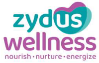
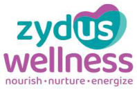
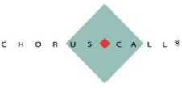
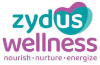

**[Image: August2025.pdf-0001-00.png (286x176, 64.6KB)]**

August 5, 2025 

Listing Department **BSE LIMITED** 

## **Code:** **_531 335_** 

P. J. Towers, Dalal Street, **<u>Mumbai–400 001</u>** 

Listing Department 

**Code:** **_ZYDUSWELL_** 

## **NATIONAL STOCK EXCHANGE OF INDIA LIMITED** 

Exchange Plaza, C/1, Block G, Bandra Kurla Complex, Bandra (E), 

**<u>Mumbai–400 051</u>** 

## Sub: **<u>Transcript of the Earnings Conference call held on July 30, 2025</u>** 

Dear Sir / Madam, 

Pursuant to Regulations 30 and 46(2)(oa)(iii) of the SEBI (Listing Obligations and Disclosure Requirements) Regulations, 2015, please find attached Transcript of the Company’s Q1 FY2026 Earnings Conference call held at 4:00 p.m. (IST) on Wednesday, July 30, 2025. 

Please find the same in order. 

Yours faithfully, 

## For, **ZYDUS WELLNESS LIMITED** 

NANDISH Digitally signed by NANDISH PRADIP JOSHI PRADIP JOSHI Date: 2025.08.05 17:01:09 +05'30' 

## **NANDISH P. JOSHI COMPANY SECRETARY & COMPLIANCE OFFICER** 

**Encl.** As above 

**[Image: August2025.pdf-0001-19.png (951x195, 81.5KB)]**

**[Image: August2025.pdf-0002-00.png (199x128, 41.6KB)]**

“Zydus Wellness Limited Q1 FY'26 Results Conference Call” 

# **July 30, 2025** 

**[Image: August2025.pdf-0002-03.png (198x130, 41.9KB)]**

**[Image: August2025.pdf-0002-04.png (272x78, 15.5KB)]**

**[Image: August2025.pdf-0002-05.png (226x109, 13.5KB)]**

**MANAGEMENT: MR. GANESH NAYAK - DIRECTOR, ZYDUS WELLNESS LIMITED MR. TARUN ARORA - CEO & WHOLE-TIME DIRECTOR, ZYDUS WELLNESS LIMITED MR. UMESH PARIKH - CFO, ZYDUS WELLNESS LIMITED** 

Page 1 of 19 

**[Image: August2025.pdf-0003-00.png (198x128, 41.5KB)]**

_Zydus Wellness Limited July 30, 2025_ 

#### **Moderator:** 

Ladies and gentlemen, good day, and welcome to Zydus Wellness Q1 FY'26 Results Conference Call. 

As a reminder, all participant lines will be in lesson only mode and there will be an opportunity for you to ask questions after the presentation concludes. Should you need assistance during the conference call, please signal an operator by pressing * then 0 on your touchstone phone. Please note that this conference is being recorded. 

I now hand the conference over to Mr. Dhiraj Mistry. Thank you and over to you, sir. 

#### **Dhiraj Mistry:** 

Thank you and good evening, all. First of all, I would like to thank management of Zydus Wellness to give this opportunity to us. From the management, we have with us Mr. Ganesh Nayak, Director; Mr. Tarun Arora, CEO and Whole Time Director and Mr. Umesh Parikh, CFO. Over to you, sir. 

**Tarun Arora:** Good evening and welcome to the post-results teleconference of Zydus Wellness Limited for Quarter 1 Financial Year 2025-'26. I have with me, like Dhiraj mentioned, Mr. Ganesh Nayak, who is the Director on the Board, Mr. Umesh Parikh, CFO on the call. 

During the quarter, consumption trends highlighted a continued divergence across geographies. Rural markets sustained their growth leadership outpacing urban areas. Driven by strong performance in branded commodities, personal care, and daily segments, while seasonal categories faced headwinds due to a shorter summer and unseasonal rains. The non-seasonal portfolio remained strong, cushioning overall performance. 

On the cost front, persistent input inflation is beginning to show signs of easing, providing our optimism for margin recovery in the coming quarters. Meanwhile, the digital channels such as quick commerce and e-commerce continue to deliver strong growth. Tier-2 and Tier-3 cities are emerging as key growth drivers, positioning the business well for its next phase of expansion. The company reported a consolidated net sales growth of 2.2%, amounting to Rs. 8,577 million for the quarter, navigating through the challenges posed by early monsoon conditions, which impacted seasonal brand performance. Encouragingly, excluding seasonal brands, the company delivered a strong double-digit growth, which includes Rite Bite Max Protein business that is not in the base, hence reflecting the underlying strength of its portfolio and balanced business model. 

At the segment level, the personal care segment grew 3.8% year-on-year for the quarter, despite early monsoons impacting Nycil brand and dampening the demand in weather-sensitive categories. A healthy CAGR of 21.1% over Q1 of FY'22 underscores the portfolio's structural strength and long-term potential. The food and nutrition segment recorded subdued year-on-year growth of 1.6% for the quarter, as softer seasonal demand significantly impacted Glucon D. Ongoing portfolio diversification and contributions from acquired business helped mitigate the 

Page 2 of 19 

_Zydus Wellness Limited July 30, 2025_ 

**[Image: August2025.pdf-0004-01.png (198x128, 41.5KB)]**

impact at the segment level. Importantly, the segment maintained a consistent CAGR of 7.3% over Q1 of FY'22, reinforcing its relevant and sustained growth momentum. Organized trade saliency continued to improve, reaching 30.9% in Q1 of FY'26, up from 23.3% in Q1 of FY'25, while e-commerce contributed 14.5% and non-trade 16.4%. 

Over the past two fiscal years, FY'24 and FY'25, we have delivered a cumulative gross margin expansion of 361 basis points, driven by proactive strategic hedging, a favorable product mix, and disciplined pricing actions, despite the challenging inflationary backdrop that we had experienced. In the current quarter, however, gross margins registered a marginal decline of 73 basis points at the overall level. Nonetheless, the majority of our brands continued to deliver strong gross margin expansion, underscoring the inherent strength of our portfolio. The saliency of seasonal brands was temporarily impacted by shorter-than-usual summers and unseasonal rains. 

On the EBITDA front, the company delivered a growth of 0.2%, reaching Rs. 1,556 million for the quarter. At the PAT level, the decline of 13.4% was primarily driven by non-cash items like amortization of intangible assets from acquired business and deferred tax impacts. During the quarter, the company returned to a net cash positive position, strengthening its ability to participate in large projects, infrastructure development, and automation initiatives aimed at building the business for the next phase of growth. 

With that, let me share some of the highlights of operations: 

For the period gone by, which will also cover category growth and market share numbers as per MAT June 2025 report of Nielsen. On the personal care front, EverYuth has shown a consistent growth that is led by sustained double-digit performance driven by innovation, product excellence, strong distribution, and customer-centric experiences. Our superior offerings and targeted marketing have successfully expanded the user base year-after-year. EverYuth leads key sub-segments with a 48.7% share in scrubs, which is a positive of 262.3 basis points yearon-year and 77.2% in peel-off masks, a drop of 56.4 basis points. 

Overall presence, the brand ranks fifth in facial cleansing with a 7.8% share, up 88.8 basis points year-on-year. Nycil saw a temporary dip this quarter due to early monsoons, but maintained its number one position with a market share of 33.3%. On the Glucon D front, Glucon D maintained its leadership in the glucose powder category with a market share of 58.9% at the MAT level. The glucose powder category grew by 2.8% at the MAT level. However, the category declined for the quarter. Glucon D Activors the electrolyte energy drink, was rolled out across the broader national footprint, performing as expected under the revised distribution strategy aligned with the weather-driven demand patterns. 

On the Complan front, the nutrition drink category has reported a decline of 2.6% at the MAT level with the continued softness across key metrics. The brand currently holds a market share 

Page 3 of 19 

_Zydus Wellness Limited July 30, 2025_ 

**[Image: August2025.pdf-0005-01.png (198x128, 41.5KB)]**

of 4.0% at the MAT level. On the Sweetness front, Sugar Free brand continues to maintain its dominant position, holding a commanding 96.1% market share in the sugar substitute category, which has grown by 4.9% at the MAT level. Sugar Free Delight delivered encouraging results with deeper distribution and health-conscious snacking trends driving the momentum. Sugar Free Green continued to outperform, reflecting strong consumer affinity for natural alternatives and sustained volume-led growth. I’m Lite continues to promote healthier living through ongoing campaigns, encouraging consumers to switch from regular sugar and cut calorie intake by half, supporting easier weight management and better daily choices. On the Nutralite front, we continue to broaden the portfolio through focused innovation year-after-year, growth momentum sustained by robust execution from focused B2B and B2C teams, enabling deeper market penetration and operational efficiency. On the Rite Bite front, post the successful acquisition of Naturell (India) Private Limited in the later part of the previous year. The business continues to outperform the earlier estimates, reinforcing our strategic intent and portfolio expansion strategy. Brand delivered robust growth during the quarter with Rite Bite daily bars leading the performance and further strengthening the brand's position in the high-growth, better-for-you snacking category. Our strategic priorities continue to focus on margin resilience, tech-enabled efficiencies and sustainable growth through innovation and discipline expansion. 

Thank you. We will now begin the Q&A session. Over to the coordinator. 

**Moderator:** Thank you very much. We will now begin the question-and-answer session. The first question is from the line of Tejas Shah from Avendus Spark. Please go ahead. 

**Tejas Shah:** Hi, sir. Thanks for the opportunity. So, just the first, I wanted to start with organic volume growth and value growth for the quarter would be? 

**Tarun Arora:** It is near to flattish. We do not give specific, but it is near to flattish. The incremental has largely come from…And excluding seasonal brands, it is anyway double-digit on its own as well. 

Double-digit is volume as well or only value? 

**Tejas Shah:** Double-digit is volume as well or only value? **Tarun Arora:** The ongoing business without the acquisition, without seasonal brands is both volume and value. So, if I add the seasonal brands back for organic growth, it becomes flattish. **Tejas Shah:** Flattish. Okay. Clear, sir. The second, I was not able to reconcile two statements on your presentation. We are still seeing that rural is doing better than urban, but when I see our organized trade saliency, it has actually gone from 23% to 30%. I am assuming that will be largely urban index. So, just wanted to understand where am I missing the point? 

**Tarun Arora:** So, I think the point I have made was initially at an overall level, what we see as a direction when we read the market and we look at the data from the secondary markets and our own read of the market that rural markets are performing. For us, actually, the significant movement, this 

Page 4 of 19 

**[Image: August2025.pdf-0006-00.png (198x128, 41.5KB)]**

### _Zydus Wellness Limited July 30, 2025_ 

23 to 30 is driven by also amalgamation of this new business, which has substantial quick commerce, e-commerce business. And therefore, the share of that business has gone well, has shot up. But they are both right in that sense. Rural markets are performing consistently. We see better traction in the general trade from our small pop strata, lower population towns, more than the top metros. But having said that, in the metros, the growth is largely driven by organized, the large towns are driven by organized trade. And that's, I think, a shift we all know about. And this number has shot up further because more than half our business of the acquired business is coming from e-commerce and therefore the saliency shifts. And the third element driving this is also because both Glucon D, Nycil are seasonal brands, have a highest share coming from rural. And therefore, the mix also changes. So, there will be that element also which changes. So, one is data, the other is of the overall market range that is playing out. 

#### **Tejas Shah:** 

Very clear, sir. Sir, just wanted to understand as we enter the low saliency quarters now, which have low impact on revenue and profitability, the seasonal pushback that we saw this quarter, does it carry forward in 2Q-3Q or it's done and dusted in this quarter and 2Q-3Q are kind of clean slate from growth perspective? 

#### **Tarun Arora:** 

So, mostly it is done and dusted. There is some numbers which flow into July because especially Nycil plays out here and a little bit of Glucon D also. Post July-August, there is a very, very little impact. So, some bit you might find in 3Q but not significant. But after that, there's limited impact. 

**Tejas Shah:** Perfect. And the last one, if I may, looking at the rough start that we had for the year because of this unseasonal rains, where do we kind of land up on our margin expansion guidance for 2 years? I know that it is 18% but what part of that guidance we can achieve this year as well? 

**Tarun Arora:** 

So, I will tell you, I would look at what are the fundamental actions we need to take and there is external part to it. First of all, we need to drive through 2 or 3 actions which we have talked about. One is product-by-product gross margin expansion, which is a tick mark. Yes, we are product-by-product, SQ by SQ, we are focusing on growth margin expansion, some of which has already played out and will continue to play out. This quarter, the gross margin reported is lower, which is more of a product mix issue but my actions are in place. In a normal year, you will find that giving the results that we intend to. The second key action that we believe that will help us improve our EBITDA margins will be, as we scale up, some of the operating leverages playing out. That also, we are a quite cost conscious company and our growth intent is playing out very well. So, seasonal is, as we have mentioned earlier also, over a 3- to 4-year period, continues to be double-digit and therefore, the basic thesis of higher growth leading to operating leverage will also play out. A percentage here and there but the two-year journey of enhancing my EBITDA, I do not think we are moving away from that basic view. To my mind, you may find a quarter here and there but directionally, we think we have taken right actions will play out. 

Page 5 of 19 

_Zydus Wellness Limited July 30, 2025_ 

**[Image: August2025.pdf-0007-01.png (198x128, 41.5KB)]**

**Tejas Shah:** Thanks. That's all from my side and best wishes for coming quarters. **Tarun Arora:** Thank you. 

**Moderator:** Thank you. The next question is from the line of Mayur Parkeria from Wealth Managers India Pvt. Ltd Please go ahead. 

**Mayur Parkeria:** Good evening. So, first of all, congratulations to the management for delivering double-digit ex off the seasonal impact and in an environment where consumption trends still remain relatively weaker overall, that's a great thing to look at. So, with that comment, just a small two questions from my side. One is actually you just partly mentioned that but maybe to get more clarity, irrespective of the seasonality and quarterly ups and downs, do we believe that in the last FY'25, entirely we grew almost 15% more than that. Do we believe that structurally over the next two years, we are in a double-digit revenue growth cycle? One is at an overall industry level and especially for the products where we are and at a company level more firmly. **Tarun Arora:** So, I can talk about company level. For sure, we believe that we are on that path. So, over the next 2 to 3 years, we will continue on a structural double-digit growth journey. And most of our products will be doing that. One or two products may have some challenges, which you've talked in the past, some category-led challenges, but largely most of our products will remain in that path. **Mayur Parkeria:** Okay. And we were on our journey to increase our advertisement and advertisement spend structurally over the last two years. On an annual basis, can you give us an understanding where should we see this number stabilizing from FY'25 levels till in the next two to three years? And will the operating leverage also come from there or we are still in the phase where percentage of sales will continue to slightly move up? **Tarun Arora:** So, in short to medium term, it will remain at a similar level as FY'25 because we also want to invest back, increase gross margins into helping us increase our growth momentum and it's essential for us. But over a longer term, yes, we will see more efficiencies coming through. But advertisement is just one of the things. There are several other fixed expenses which come from other expenses, the overheads, people expenses, where we do see that operating leverages will play out even better. 

**Mayur Parkeria:** Right. And just to, along with this, from a distribution setup, can you give us some qualitative numbers in terms of our direct reach, where do we reach? And in the light of quick commerce becoming more and more dominant from an incremental growth perspective, do we still believe and see that direct reach and traditional channels reach will become critical for our growth as we go ahead? 

Page 6 of 19 

_Zydus Wellness Limited July 30, 2025_ 

**[Image: August2025.pdf-0008-01.png (198x128, 41.5KB)]**

#### **Tarun Arora:** 

**Mayur Parkeria:** 

**Tarun Arora:** 

**Mayur Parkeria:** 

#### **Tarun Arora:** 

It is an interesting and a very important question. Because these are things that we have to think given the way market is reorganizing itself. So, from a very urban top city point of view, I think quick commerce is changing consumer habits significantly and therefore we may or may not be necessarily driving our distribution expansion. But at national level our current direct reach is, direct coverage is about 6.1 lakh-6.2 lakh outlet. We are available as reported by Nielsen by 2.8 million outlets. Our wish list is to expand that 2.8 to 3.5 first and maybe eventually 4 million assuming there's no major restructuring of the market that happens. Towards that, we are looking at expanding another 80,000 outlets in this financial year. We still believe there's enough room for expansion because we are building the categories. Our job is to, being a market leader, to expand the categories, drive penetration. Therefore, we are still committed to drive a direct distribution and take it to hopefully to about 7 lakh by the end of this financial year and that's something we will continue to do, while building our capability both in e-commerce, quick commerce as well as monetary. So, organized trade continues to increase but we continue to also invest in general trade because the smaller population towns, rural is still under-serviced as far as organized trade is concerned and therefore this will continue to play a more important role. 

That's great to hear. Can I squeeze in one more question, please? 

Okay. 

Thank you for that. Actually, from the product side, can we get an understanding of what is our plan for the next 18 months in terms of new product, whether enhancements or changes because just like in automobile, we see there is the importance of new product launches and enhancements are also very critical whether small changes or big changes. So, in terms of number of products, if you can give some perspective, what are we planning over the next 18 months relative to FY'25, what all we did? Thank you. 

I understood your question. So, FY'25, we had 12 launches. I will tell you, I don't have a specific number to share over the next 18 months but I will tell you two things that will drive our strategy or our choices. One is that consumers' expectations are changing at a much faster pace than most of us can handle. I had some industry leader from FMCG talk about smaller brands are no more, cannot be taken lightly. The fact is that new brands are coming in and disrupting the space. So, keeping our brands relevant for the future is extremely important. So, we will be constantly working on upgrading our existing products, which of them will come up for launch in 18 months, I cannot share. So, that's one fundamental we will do. Plus, we have a few more products in our pipeline, in our innovation pipeline, which will follow through, some of which in the coming months, since they are not in public space, I am not able to share, but we will continue to build it. So, both NPDs and relaunch of our existing portfolio is very high on our agenda to stay ahead of the curve and grow ahead of the industry. 

Thank you. Wish you all the best. I will come in the queue if there are any. 

**Mayur Parkeria:** 

Page 7 of 19 

**[Image: August2025.pdf-0009-00.png (198x128, 41.5KB)]**

_Zydus Wellness Limited July 30, 2025_ 

**Moderator:** Thank you. The next question is from the line of Nikhil Upadhyay from SIMPL. Please go ahead. **Nikhil Upadhyay:** Good evening. And appreciation for the good results and the good performance the company has displayed this quarter. Sir, one question. As you mentioned that if we adjust for the summerheavy brands, we have grown double-digit. Can you rank which would be the brands which have grown fastest? And specifically, zooming on Nutralite, because if we have seen a lot of product launches and product innovation we have done in the last one and a half years, how are those new product launches playing out now and what proportion of revenue of total Nutralite there would be today? **Tarun Arora:** So, I could say that from a last year's base and a comparable base, I think three brands that stand out in terms of growth is a new acquisition Rite Bite Max Protein and EverYuth followed by Nutralite. These three brands have had a significant growth driving our non-seasonal brand growth agenda and pulling the numbers up substantially. For your second question on Nutralite specifically, what is really driving our portfolio up? I think 2 or 3 things that is helping us. Our base business, our core which is fat spread, continues to drive the momentum. So, that's essential for us to get right and that continues to keep moving up. Having said this, the new part of the portfolio where we want to be a fair dairy and spreads, mayonnaise as well as our branded fat, if I were to say butter and ghee branded ones, that has really helped us also move it up. But that's I think most part of the portfolio is playing out. Our chocolate spread has not kept to the promise but it's still very small but we have also not talked very big about it. But fat spread, value-added dairy as well as mayonnaise, all have played out as per expectation ahead of our budgets. In fact, we have also launched cheese in the food service, early days, but early response looks good. So, we continue to move forward on Nutralite on a consistent basis. 

**Moderator:** 

Sorry to interrupt, the current participant got disconnected. We will move to the next question. The next question is from the line of Kinjal Mota from Banyan Tree Advisors. Please go ahead. 

**Kinjal Mota:** Hi, thank you for the opportunity. Sir, I wanted to understand what is your long-term view on the HFD category, the Nutrition drink category and how much does the South currently contributes to this business? 

**Tarun Arora:** 

So, I think it's an interesting question. I think all players in HFD are grappling with this, but let me just put it like this. There are 2 or 3 parts which we need to keep in mind. First of all, HFD has long stood for nutrition. Now, nutrition is something which today's consumer is very concerned and tuned on to. Having said this, consumers relevance, I mean relevance of HFD as a single source of nutrition has dialed down and people are seeking various other ways of getting nutrition and that's why this category has come under pressure. People have gone on to several other formats, products, new age brands and traditional ways of getting nutrition and that's really impacted this category. In my view, it will in medium to long term still deliver a sustainable low single digit growth. I don't know that's my view still there is good reasons for it. Only time will tell but and we do believe that done right by playing the right segments there is still room for 

Page 8 of 19 

**[Image: August2025.pdf-0010-00.png (198x128, 41.5KB)]**

### _Zydus Wellness Limited July 30, 2025_ 

growth and therefore we are still working on it and some of our initiatives support that and that's why we have done slightly better than the category largely because of being trying to differentiate ourselves by offering some superior nutrition and consistently pushing ourselves into new ways of working. Having said this, I can't share the specific share of business as we don't. So, overall category is about Rs. 7,000 crore on a MAT basis and our market share is 4% though of course large part of category is also shifted to e-commerce which is not reported. So, I mean you could do your mathematics but this is some of the direction that we could help you with. 

**Kinjal Mota:** Sure. We understand that you could not share the number of how much does south contributes currently but any direction on whether the contribution from south region has declined over the years and if so what are the reasons behind the same? 

**Tarun Arora:** So, incidentally I won't say by South or North, I think Tamil Nadu in the south region is one of our key markets that has stayed consistent for us overall at the category level it has come under pressure but for us it has remained quite consistent via our action, in fact we were more under pressure earlier day earlier years after acquisition but we have done rather well in last 2 to 3 years on sustaining that business. 

**Kinjal Mota:** Sure. That makes sense. Thank you and if I could pull out one bookkeeping question, so in our financials we report other marketing expenses which are categorized as a part of other expenses. If I were to look at that number it has grown significantly in last five years that is at 30% cable. I was just trying to understand that how is it different from normal A&P spent because it is categorized separately, if you could just help me understand that? 

**Tarun Arora:** 

Are you pulling it out of the annual report is it? 

**Kinjal Mota:** Yes. In the consolidated financials if I were to look down into the other expenses head there is a separate line item called other marketing expenses. 

**Tarun Arora:** So, these are which are non-traditional expenses, things like doctor detailing and some CSD commission which are kind of marketing but not real marketing advertising and marketing expenses but impact our business support. So, some of those things get captured in those. Some go-to-market expenses may happen, so some of those things get captured in that. And therefore since we have increased our presence with doctor detailing for Sugar Free and Complan, some of those will look disproportionately high growth but may not be significant in absolute. 

**Kinjal Mota:** 

Yes, sir. Thank you. I am a colleague of Kinjal's. Just had one question if I can ask. Sir, we subsumed the Sampriti brand into the Nutralite brand and now we have also launched soap under Nycil sometime back. So, just wanted to understand your thought process behind brand extension especially in segments which are not closely related to the core segment and again 

Page 9 of 19 

**[Image: August2025.pdf-0011-00.png (198x128, 41.5KB)]**

_Zydus Wellness Limited July 30, 2025_ 

these new segments are more competitive than your existing segments. So, how do you think about strengthening your brand there? 

#### **Tarun Arora:** 

So, these are two different things. First of all, soap extension of Nycil is very tactical one and only directed at Middle East which is more opportunistic. At a strategic level in most of our, largely our business is India centric we haven't done it and therefore there is no specific plan ready to share as far as the soap and Nycil is concerned. As far as converging Sampriti brand into Nutralite is concerned, it was a very strategic call taken right at the time of acquisition we had thought through it because we believe that Nutralite is a large brand it has huge potential and consumers don't see it as dairy or non-dairy but it actually meets our all dairy and spreads requirement and can become one of our largest brands in future if we run it right and therefore this convergence of Sampriti into Nutralite, Doodh Shakti has really helped the brand grow much bigger and much faster and also becomes more efficient from our investment perspective as well. 

**Kinjal Mota:** Got it. And Nutrilite to a large extent was a B2B brand but do the consumers still retain or recollect the Nutralite brand? 

**Tarun Arora:** So, our share from food service still remains much higher but the retail leg to it is consistently expanding and we continue to believe that both these parts both the food service as well as B2C will continue to grow both and therefore make it a much larger brand. 

**Kinjal Mota:** Got it. Thank you so much sir. **Moderator:** Thank you. The next question is from the line of Nikhil Upadhyay from SIMPL. Please go ahead. **Nikhil Upadhyay:** Yes, hi sorry, I got dropped off. My second question actually was if you look at Max Protein and historical numbers it was sustaining that 30%-35% kind of CAGR growth. Coming into our fold, have we been able to increase the rates or how is the distribution acceptance of the brand and is it sustaining that historical run rate of growth? 

**Tarun Arora:** So, I will go back to what I talked about when we acquired the Max Protein business. Rite Bite brand has historically grown more than 25% and we had said that we envisage a 25% plus over next 4 to 5 years. I am happy to share that our actual while we don't give specific brand wise growth but happy to share that the current momentum for six months of actually seven months of acquisition is much higher than what we had accounted for and it is gaining substantial acceptance across all channels. We have also launched or in the process of launching more products through this portfolio and we believe there is it has been a strategically a good purchase for the business and we see a long-term potential only enhancing ahead of what we had imagined at the time of acquisition. 

**Nikhil Upadhyay:** Okay, I just have two questions. One is, have we been able to put Max Protein into the GT channel now and how is the acceptance across the GT channel where we have placed it? 

Page 10 of 19 

**[Image: August2025.pdf-0012-00.png (198x128, 41.5KB)]**

_Zydus Wellness Limited July 30, 2025_ 

**Tarun Arora:** Max Protein does very well in GT. We have a significant share in general trade. We are probably by far the largest brand in bars in this space. **Nikhil Upadhyay:** Okay, and last question, see this is a quarter when the summer portfolio used to always drive the margins but even though and I could be wrong here by my calculation it's like our summer portfolio is down at least 10% to 15% but still the margins are sustained. Would you say that to a large extent with the growth of the other brands to some extent our profitability is now immune of the summer portfolio performing like even if they don't perform the company can sustain the profitability because historically it used to be a summer portfolio did not perform the margins used to take a hit, so is it a good inference to make now? **Tarun Arora:** I think it's taken a lot of effort by the team to ensure that we are able to manage and overcome the challenge of summer brands. I am not imagining a situation that we will be immune to seasonal brands not performing. It does impact us because they are a very critical part of our portfolio over the last four years, like I mentioned we have seen a good double-digit growth from both the brands and they add to our operating leverage, they add to our gross margins disproportionately. So, it's very important. Yes, I think I would credit a great work by the Zydus Wellness team in managing a tough environment, but yes the team has really come up to the challenge and handle it but immune to seasonal impacts not yet. **Nikhil Upadhyay:** Sure. Thanks, I will come back in the queue. **Moderator:** Thank you. The next question is from the line of Ajay Thakur from Anand Rathi Securities. Please go ahead. **Ajay Thakur:** Hi sir, thanks for taking my question. I just wanted to check on the breakup between EverYuth and Nycil, how it would have panned out given the fact that Nycil is more summer centric? So, we would obviously have seen some decline, maybe if you can just specify, if not quantitatively but it's more on qualitative basis the growth for Nycil and also if you can also highlight the growth for EverYuth in the same way? 

**Tarun Arora:** Ajay, I think while we do not, like you rightly also figure out, we do not share brand specific numbers. This is one of the few exceptional quarters where we have struggled on Nycil because of the sustained monsoon. Otherwise historically even in difficult seasons also Nycil does manage to do well. So, obviously that shows how deep and how long sustained the rainy season has been and impacted the overall seasonal impact. Having said this, EverYuth has had a phenomenal continued a phenomenal run that is it has had and we continue to be very excited about the opportunities that EverYuth has created for our growth. So, that's all I can share at this. 

**Ajay Thakur:** Okay. So, would it be fair to say that EverYuth growth momentum which was there or the similar kind of a growth momentum that we had seen last year is kind of maintained even in Q1, will that be a fair statement? 

Page 11 of 19 

_Zydus Wellness Limited July 30, 2025_ 

**[Image: August2025.pdf-0013-01.png (198x128, 41.5KB)]**

**Tarun Arora:** Yes, momentum has continued, absolutely. **Ajay Thakur:** Okay, and you had alluded to cheese segment being entered in the food services domain. How big this segment would be and who would be the players over here? It's going to still give some more details in terms of what kind of opportunity lies ahead and can it be as big as maybe something like a margarine for us in the B2B? 

**Tarun Arora:** 

We are early days into it. Look our biggest part on food service is still fat spreads. We have got into mayonnaise. Cheese is early days we have just done few months of numbers. So, I cannot say but yes potentially it could, it can because cheese as a segment is so large it could catch up with a margarine fat spread kind of business, but that's a long way off. It's a lot of hard work for the team to work on but yes it's promising and it also strengthens our Nutralite Doodh Shakti platform and the initial acceptance has been very good, so we are quite positive about what we could build on as we speak. The other players of course are the regulars that you would know in dairy segment or analog segment which includes the likes of Amul, Parag etc. All those players have their presence in this. 

**Ajay Thakur:** Understood. Also wanted to understand a bit more on the Viemax. If you can share some light on how the Complan Viemax actually doing post its launch? What kind of growth are we seeing in this launch over here? And how can we expect the momentum or what can be expected going forward in Complan Viemax? 

**Tarun Arora:** So, Complan Viemax is basically adult nutrition space. Overall the category is not growing super, but I think we made our initial good impact. We have seen a lot of doctors. We have taken a hard route of following something which is not our inherent strength, go to an expert route marketing which is the healthcare professionals the doctors supporting it. So, it's a strength that we are building and learning. We are seen some doctors really prescribing it and that gives us confidence that a formulation is good, the doctors are happy with our proposition and recommending or prescribing it to their patients and that helps us believe that there is good potential in it, but it's early days. It's still small and it's a long haul. We believe will only strengthen the overall mother brand Complan as a superior nutrition space spanning several segments from toddler to kids to adult now and we need to do more work and probably in next 2 to 3 quarters we can share more updates as we move along when we have more sizable actions on this. 

**Ajay Thakur:** 

Understood. Quite helpful. Thank you sir. 

**Moderator:** Thank you. The next question is from the line of Yashvardhan Agarwal from IIFL Capital Services AMC. Please go ahead. 

**Yashvardhan Agarwal:** Hello. Hi sir. Thanks for the opportunity. I had a couple of questions. My question is on the growth. So, most of the products that we are present in, most of the categories are actually 

Page 12 of 19 

_Zydus Wellness Limited July 30, 2025_ 

**[Image: August2025.pdf-0014-01.png (198x128, 41.5KB)]**

penetrated and we market leaders in it. So, just wanted to know that will our growth be linked to the category growth or won't it be and if not what are the steps that we are taking so that we can assume that our growth would be better than the category if not in line. So, that's the first question. 

**Tarun Arora:** 

#### **Yashvardhan Agarwal:** 

**Tarun Arora:** 

**Yashvardhan Agarwal:** 

#### **Tarun Arora:** 

Can i answer or you want to ask your second question simultaneously in advance? 

Sir, you can answer this and I will ask the question again. 

Okay. So, first of all, I think if you really look at it other than Complan most of the brands that we have they operate as market leaders in the space in their core categories, whether you look at Nutralite Sugar Free, EverYuth scrubs, EverYuth peel-off, Glucon D, Nycil and we have significant market shares in most of these categories. So, we see our role as driving the category. We are not driving market share. Market share of course is a by-product, we are very happy to take higher market share. But if i were to take an example, I would be very happy if Glucose Powder becomes from Rs. 1,100 crore category to a Rs. 1,500 crore category rather worry about whether my market share is 59% or 61% because if the category grows, I will grow and therefore as a market leader our task is to grow those categories. Having said that and while working the core on category development which is through brand-led communication, building relevance, driving distribution, being available across omni-channels, the other opportunity is because our brands are so large and so strongly franchised with the consumers where there's a very strong pull for that, we are also leveraging our brands into extensions where there's opportunity to grow much faster and there may be larger categories and we may start as a challenger. And for example, we just talked about Nutralite and mayonnaise or a cheese for example, EverYuth getting into body lotion, Sugar-free extending into foods like chocolates and cookies, so these are much larger categories. So, while my core job is to expand the categories and category development, I am using extensions to play in larger categories and leverage our brand with a differentiation which will help us drive growth. So, that's an overall playbook of how Zydus Wellness will play across categories and therefore innovation engine which works on improving and continuing our relevance in core and building our brands there as well as getting into new spaces is how this comes together and we believe that will be the way to success for our overall business as we move forward. 

Got it, sir. And the second question is on the margins. So, also we have guided earlier as well that we are trying to improve our gross profit margins. So, is it on the basis of we are expecting softness and raw material prices or change in SKU or probably launching new products, so what are the reasons for it? 

I am not going to rely only on new products to improve our gross margin. Some places we can, some places it's harder. So, new products will follow a certain minimum margin levels, but the core categories have to improve margins which happens through a multiple actions which is price increases, calibrated price increases where there is opportunity and the consumers are 

Page 13 of 19 

**[Image: August2025.pdf-0015-00.png (198x128, 41.5KB)]**

_Zydus Wellness Limited July 30, 2025_ 

willing to pay, but more importantly managing a cost side very well. So, managing a commodity is right, taking future hedges and whatever actions contracting for a period of time, all set of actions and if the costs are not managed then passing it on to the consumers because being market leaders we have a reasonable pricing path. So, all these actions come together to drive productby-product enhancement of gross margins. 

#### **Yashvardhan Agarwal:** 

Got it, sir. That's it from my side. Thank you and good luck. 

**Moderator:** Thank you. The next question is from the line of Shreni Makharia from Finspurt Analytics. Please go ahead. **Shreni Makharia:** Hello, sir. Actually i wanted to ask about your products such as Complan Viemax, Sugar Free and Nutralite because do you think that they will benefit from GLP-1 trend also? **Tarun Arora:** Yes, there is a GLP-1 trend that we are aware of. I can't answer anything in specific because those things will play out in the marketplace. So, obviously there will be impacts of how GLP1 plays out. **Shreni Makharia:** Because your Complan Viemax was prescribed by doctors, so there might be a chance that because for the GLP-1 nutrition has been prescribed by doctors. That is why I was asking, that will there be any like a subsequent benefit to them also? **Tarun Arora:** So, our products are supportive of GLP-1 but we leave it to the doctors to understand and do the needful. **Shreni Makharia:** Okay, I have one more question regarding the taxation. So, for '26 and '27, you said that there will be zero tax and so what will be the guidance for like further years, if you can tell us? **Umesh Parikh:** For this FY'25-'26, there won't be any tax. For next year, there could be some minimum maybe marginal tax, maybe you can take it about 8 -10 % and going forward in the next year it will be at a full tax rate which is at the rate 25%. **Shreni Makharia:** Okay, yes. Thank you so much. That's all from my side. **Moderator:** Thank you. The next question is from the line of Harshit from Golecha Family Office. Please go ahead. **Harshit:** Very good evening. Sir, you have mentioned that in July-August there will be a slight impact for the seasonal product. So, despite of this on a like-to-like basis are we confident of showing double-digit growth in first half of this year, sir? This is my first question, sir. **Tarun Arora:** We can't give you any specific quarter-by-quarter guidance. We have just given you a sense of what happens, but you'll have to take the interpretations yourself for that. 

Page 14 of 19 

**[Image: August2025.pdf-0016-00.png (198x128, 41.5KB)]**

_Zydus Wellness Limited July 30, 2025_ 

**Harshit:** So, is it fair to assume the majority of the impact has already been absorbed in Q1 and JulyAugust is not going to be a majority for Glucon D and Nycil, only for the seasonal part of the business I am asking. **Tarun Arora:** Correct. So, most of it has been absorbed in quarter one the impacts. July-August is a much smaller part of it. **Harshit:** Got it, sir. Thank you, sir. That was my only question, sir. Thank you. **Moderator:** Thank you. The next question is from the line of Ravi Purohit from Securities Investment Management Private Limited. Please go ahead. **Ravi Purohit:** Hi, thanks for taking my questions. A couple of questions. One was, we don't share brand wise sales and numbers for the business but we do provide a table in our presentations which give you the category size and the market share that we have in that category. So, is it fair to assume that when I multiply the market share and the category size i should get the broad sense of the revenues for those particular products and if I map those out over a period of time that should give me like a trend of how the sales have progressed for those individual brands? **Tarun Arora: So,** we don't share those brand wise specific numbers. What we put out there is what is available in the public space which the syndicated data from Nielsen shows. It may be helpful for you from a directional point of view, but its adequacy is for you to judge. **Ravi Purohit:** Would you take it? Would you reply on it? **Tarun Arora:** Because beyond on those spaces so it may vary from brand-to-brand basis of the coverage of Nielsen sub brands covered or not covered. So, therefore you will have to put your own judgments to it. **Ravi Purohit:** No, I know, but I am just saying as an industry participant and as a contributor to new surveys, would you rely on that those numbers or should we kind of avoid because it will kind of you're putting it out in the presentation for us to see and if it is put by the company then we should be able to make some sense out of it right? So, that's what I am trying to understand. So, if you could help me give some context whether the data is reliable, less reliable, partially reliable, not reliable at all so at least we can use it from an analysis point of view and we can do it like a fiveyear trend numbers on those. For example sugar substitute Sugar Free says Rs. 370 crore category size and our market share is 96% which effectively means our sales for Sugar Free alone should be Rs. 350 crores. So, that's the place that I am coming from. **Tarun Arora:** Like i explained to you, it is directional in nature. It cannot be precise because the coverage category-by-category is different. Also with e-commerce covering it does not cover e-commerce sales also. So, actually Nielsen relies only on part of modern trade and general trade and they 

Page 15 of 19 

**[Image: August2025.pdf-0017-00.png (198x128, 41.5KB)]**

_Zydus Wellness Limited July 30, 2025_ 

give their numbers. So, therefore these are directional.so okay our trust on Nielsen is not like we are believing but it helps syndicated third-party data for you to assess on that, that's why you put it out. We are not saying that please judge us only on that. We have real numbers which we are sharing with you. 

**Ravi Purohit:** Right, fair sir. And the second question is, when we acquired Heinz's business right and we merged into our own company, so Heinz, when it was part of Heinz was a full tax paying business. When it came and folded into our company that business became tax-free so to speak, at least from the reported tax. The same thing will also happen with rite bite once it kind of gets liquidated into our company that will also have no tax liability so to speak. 

**Umesh Parikh:** Not fully because Heinz business there was a very high amount of intangibles playing out and that time the depreciation of intangibles was allowed. Now under the income tax but the depreciation of goodwill has gone. So, to the extent of the brand valuation, we get the taxes but not fully. 

**Ravi Purohit:** Okay, so there will be some tax, is that reason why we are kind of liquidating that Company into this listed company right? I am assuming to get the tax… 

**Umesh Parikh:** There are business rationales for liquidating your company and liquidation is much faster route for integrating the business activity. 

**Moderator:** Thank you. The next question is from the line of Pawan Tiwari from 9 M Vala Securities. Please go ahead. 

**Pawan Tiwari:** As I know the company is not disclosing the numbers for rite bite. But if they can share for the FY'25 numbers for rite bite? 

**Tarun Arora:** Sorry, we cannot share numbers for the acquired business like we mentioned. 

**Umesh Parikh:** But you have the numbers at the time of acquisition and we told you that the business has grown at the pace of 25% CAGR and currently it has exceeded the projections that we have built in at the time of acquisition. 

**Tarun Arora:** You can get the directional numbers from that, but we don’t share. 

**Pawan Tiwari:** For '25 we don't disclose because in '25 we have for just one quarter and for overall year what was the numbers for? 

**Umesh Parikh:** They are the number at the time of acquisition, that at the time of acquisition for the last financial year, it was Rs. 130 crores, 120 odd crores-140 crores for FY'24. 

Page 16 of 19 

**[Image: August2025.pdf-0018-00.png (198x128, 41.5KB)]**

_Zydus Wellness Limited July 30, 2025_ 

**Tarun Arora:** After the acquisition it's part of our business and we follow the same system as for other brands. So, it will be not possible for us to. **Pawan Tiwari:** Okay and does it continue the same group in Q1 of this year? **Tarun Arora:** It is like explained even in the earlier question. It is higher than what we had envisaged. **Pawan Tiwari:** Okay. Thank you, sir. **Moderator:** Thank you. The next question is from the line of my Mayur Parkeria from Wealth Managers (India) Private Limited. Please go ahead. **Mayur Parkeria: T** hank you, sir for taking my questions again. Before I go to the questions, one congratulation in terms of now participants have started asking you quarterly numbers. So, that's a change in the from some of the long term in questions and investors which we were seeing earlier. So, now there's a lot of interest. So, congratulation on that narrative. On the question side sir, I had a specific question on Nutralite, our bigger competitors in terms of, one of the biggest competitor has been struggling significantly as far as the milk sourcing is concerned as far as because of the dairy on the dairy side for quite some time, what is our sourcing strategy for from that perspective given that now we have launched cheese and other ghee and butter, sorry not Ghee and butter, but other dairy products which we are looking at so what is our sourcing strategy on uh the milk side that is first and secondly I will again on the Nutralite but I will ask after your response sir. 

**Tarun Arora:** So, for Nutralite there are two parts which we have. One is of course the traditional fat spread margarine and then mayonnaise business which is an oil-based product where we continue to work with large oil suppliers and we are able, we have good working relationship with them from a sourcing strategy and we do publish directional rates and which follows a global rate charts. Talking about dairy, we are largely focused on western UP dairy sourcing which is based out of a Aligarh plant which has a history dating back to 1959 when it was started and we have a own network of societies and farmers who provide milk and therefore we have been fairly consistent with them, we have worked and grown with them. So, we believe that we have sufficient support from that space and that that is what we will restrict ourselves to. We are not a big dairy player, we want to be restricted to this space as of now. 

**Mayur Parkeria:** So, whatever our internal plans we don't see sourcing issues coming in our way for the next few years at least, that's the right way to look at? 

**Tarun Arora:** Yes, we don't see the sourcing issues we do see pricing issues which comes with dairy, with any commoditized business, that's it. 

**Mayur Parkeria:** 

Second on the Nutralite itself is again of mainly from the reason is, normally when there is a elephant in the room like Amul which is there on that side it becomes very difficult for to create 

Page 17 of 19 

_Zydus Wellness Limited July 30, 2025_ 

**[Image: August2025.pdf-0019-01.png (198x128, 41.5KB)]**

a right to win strategy, especially when they are so agile and so successful in across the categories. What is our thought process in that side and from that perspective, one was from sourcing the other is from the marketing side and the product side, when you know there's a player and there are multiple players others also, but it's a large one. So, what is our overall strategy to right to win over the next three years if you can lay out that? 

**Tarun Arora:** Let me put 3 or 4 things very quickly. One, I think the market is very large and therefore one large player doesn't perturb us. Secondly Nutralite has stood for healthier alternative to the core and each of our products clearly differentiates on some differentiated offering like recent launches the butter we have launched with the probiotic butter where there is a probiotic added, in mayonnaise we have added some vitamin fortification. So, we are quite focused that we provide high quality products, formulated with health in mind. A strong marketing and sales capability and there is room for multiple players that should take care of us. **Mayur Parkeria:** Okay. Thank you so much. Wish you all the best. 

**Moderator:** Thank you. The next question is from the line of Jai Amin from Ardeko Asset Management. Please go ahead. 

**Jai Amin:** Congratulations Tarun on a strong set of execution in a challenging external environment. I just have one question. Could you elaborate on key insights of strategic **-** that emerge from the consultancy engagement especially concerning to the HFD category when Complan continues to underperform like 6% market share from acquisition base to currently 4%? And I wanted a follow-up, how do you look at the opportunity cost in terms of the management bandwidth as well as the innovation capital and at which point of time would you like to draw a line and dramatically alter the strategy? Or like get an exit from this category and double down on category where you are clear right to win and expand those categories? 

**Tarun Arora:** So, I think there are 2 or 3 ways to look at it. Our market share has moved from 5-5.5 from June 2019 when we acquired numbers to June '25 if we were to look at. So, it's about a percentage point reported by Nielsen. Our own read is because Nielsen doesn't cover e-commerce where we have slightly higher than Nielsen reported shares, so our real blended share is better than what we report publicly because it's not public data I cannot share it with you. Having said that, I think it's largely got to do with the category challenge. We believe that there is opportunity still in the nutrition space and how do we find relevance for our brand in the new world which where there is a struggle for HFD category, but Complan can still thrive by charging a premium by offering superior products and launching products relevant for the consumers for the new age consumer will be the only way to do it. If that works and it plays out, I think we should be sorted. If it doesn't, then we will have to do some strategic calls at some point of time in next couple of years. 

**Jai Amin:** 

Okay. Thank you so much. That is it from my side. 

Page 18 of 19 

**[Image: August2025.pdf-0020-00.png (198x128, 41.5KB)]**

**Moderator:** 

**Tarun Arora:** 

#### **Moderator:** 

_Zydus Wellness Limited July 30, 2025_ 

Thank you. Ladies and gentlemen, this was the last question. I now hand the conference over to the management for the closing comments thank you and over to sir. 

Thank you everyone for the interest shown and asking us some insightful questions on Zydus Wellness. I hope you have good health and good season ahead. Thank you very much and we will reconnect after the results of next quarter. Thank you. Thank you. On behalf of Zydus Wellness Limited that concludes this conference. Thank you for joining us and you may now disconnect your lines. 

Page 19 of 19 

---

## Extracted Images

| # | File | Dimensions | Size |
|---|------|------------|------|
| 1 | August2025.pdf-0001-00.png | 286x176 | 64.6KB |
| 2 | August2025.pdf-0001-19.png | 951x195 | 81.5KB |
| 3 | August2025.pdf-0002-00.png | 199x128 | 41.6KB |
| 4 | August2025.pdf-0002-03.png | 198x130 | 41.9KB |
| 5 | August2025.pdf-0002-04.png | 272x78 | 15.5KB |
| 6 | August2025.pdf-0002-05.png | 226x109 | 13.5KB |
| 7 | August2025.pdf-0003-00.png | 198x128 | 41.5KB |
| 8 | August2025.pdf-0004-01.png | 198x128 | 41.5KB |
| 9 | August2025.pdf-0005-01.png | 198x128 | 41.5KB |
| 10 | August2025.pdf-0006-00.png | 198x128 | 41.5KB |
| 11 | August2025.pdf-0007-01.png | 198x128 | 41.5KB |
| 12 | August2025.pdf-0008-01.png | 198x128 | 41.5KB |
| 13 | August2025.pdf-0009-00.png | 198x128 | 41.5KB |
| 14 | August2025.pdf-0010-00.png | 198x128 | 41.5KB |
| 15 | August2025.pdf-0011-00.png | 198x128 | 41.5KB |
| 16 | August2025.pdf-0012-00.png | 198x128 | 41.5KB |
| 17 | August2025.pdf-0013-01.png | 198x128 | 41.5KB |
| 18 | August2025.pdf-0014-01.png | 198x128 | 41.5KB |
| 19 | August2025.pdf-0015-00.png | 198x128 | 41.5KB |
| 20 | August2025.pdf-0016-00.png | 198x128 | 41.5KB |
| 21 | August2025.pdf-0017-00.png | 198x128 | 41.5KB |
| 22 | August2025.pdf-0018-00.png | 198x128 | 41.5KB |
| 23 | August2025.pdf-0019-01.png | 198x128 | 41.5KB |
| 24 | August2025.pdf-0020-00.png | 198x128 | 41.5KB |
