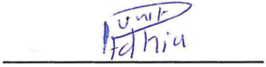

**[Image: MarchBuying3.pdf-0001-00.png (295x180, 69.8KB)]**

<!-- Start of picture text -->
nourish• nurture• energize <!-- End of picture text -->

March 6, 2026 

Listing Department **BSE LIMITED** P. J. Towers, Dalal Street, **<u>Mumbai–400 001</u>** 

**Code:** **_531335_** 

Listing Department **NATIONAL STOCK EXCHANGE OF INDIA LIMITED** 

**Code:** **_ZYDUSWELL_** 

Exchange Plaza, C/1, Block G, Bandra Kurla Complex, Bandra (E), **<u>Mumbai–400 051</u>** 

Re.: **<u>Disclosure under SEBI (Prohibition of Insider Trading) Regulations, 2015 (“PIT Regulations”)</u>** 

Dear Sir / Madam, 

With reference to the captioned subject, please find enclosed a disclosure dated March 6, 2026 in prescribed Form “B” under Regulation 7(2) of SEBI (Prohibition of Insider Trading) Regulations, 2015, received from Mr. Punit Adhia, Designated Person with respect to acquisition of 300 Equity Shares of ₹ 2/- each from the open market. 

Please find the same in order. 

Thanking you, 

Yours faithfully, For, **ZYDUS WELLNESS LIMITED** 

NANDISH Digitally signed by NANDISH  PRADIP  JOSHI PRADIP  JOSHI Date: 2026.03.06 18:05:03 +05'30' **NANDISH P. JOSHI COMPANY SECRETARY & COMPLIANCE OFFICER** 

**Encl.:** As above 

**[Image: MarchBuying3.pdf-0001-15.png (980x201, 72.4KB)]**

<!-- Start of picture text -->
Zvdus Wellness Limited Regd. Office: 'Zydus Corporate Park', Scheme No. 63. Survey No. 536, Khoraj (Gandhinagar). Nr. Vaishnodevi Circle, 5. G.  Highway, Ahmedabad 382 481.  Phone : +91-79-71800000. +91-79-48040000 Website : www.zyduswellness.com  CIN  : L15201GJ1994PLC023490 <!-- End of picture text -->

# **FORM B** 

## SEBI (Prohibition of Insider Trading) Regulations, 2015 

[Regulation 7 (2) read with Regulation 6(2) - Continual disclosure] 

# Name of the Company: ZYDUS WELLNESS LIMITED ISIN of the Company: INE768C01028 

Details of change in holding of Securities of Promoter, Member of the Promoter Group, Designated Person or Director of a listed company and immediate relatives of such persons and other such persons as mentioned in Regulation 6(2). 

|**Name, PAN,** **CIN/DIN,**& |**Category** **of** |**Securitie** **acq** |**s held priorto** **uisition** ||**Securitie**|**s acquired**||**Securiti** **~~acq~~**|**es held post** **~~uisition~~**|**Date of ac** **~~sha~~**|**quisition of** **~~res~~**|**Date of** **intimation**|**Modeof** **acquisition**|**Exchange** **onwhich**|
|---|---|---|---|---|---|---|---|---|---|---|---|---|---|---|
|**addresswith** **contact**|**Person**|**Type of** **security**|**No.and%of** **shareholding**|**Type of** **security**|**No.**|**Value**|**Trans** **action** **Type**|**Typeof** **security**|**No.and%of** **shareholding**|**From**|**To**|**to** **company**||**thetrade** **was** **executed**|
|1|2|3|4|5|6|7|8|9|10|11|12|13|14|15|
|Name: Punit Adhia|Design at ed Person|Equity Shares|0 0.00%|Equity Shares|300 0.00%|Rs. 1,14,300|Acquisi tion|Equity Shares|300 ' 0.00%|March 6, 2026|March6, 2026|March 6, 2026|Open market|BSE|
|PAN: AXFXAX5X7X|||||||||||||||
|Address : Zydus Corporate Park, Scheme No. 63, Survey No. 536 Khoraj (Gandhinagar), Nr. Vaishnodevi Circle,S.G. Highway, Ahmedabad - 382481, Gujarat||||||||•.|||||||
|Phone No. + 91 79 48040000|||||||||||||||

Details of trading in derivatives of the company by Promoter, Employee or Director of a listed company and other such persons as mentioned in Regulation 6(2) 

||**Trading in derivatives(Spe**|**cify type ofco**|**ntract, Futures**|**or Options etc.)**||**Exchange on whichthetrade was**|
|---|---|---|---|---|---|---|
|**Type of contract**|**Contract specifications**||**Buy**|**Sel**|**l**|**executed**|
|||Notional Value|Numberof units (contracts * lotsize)|Notional Value|Numberof units (contracts * lotsize)||
|16|17|18|19|20|21|22|
|N.A.|N.A.|N.A.|N.A.|**N.A.**|**N.A.**|N.A.|

**[Image: MarchBuying3.pdf-0003-02.png (292x74, 15.1KB)]**

Punit Adhia Designated Person 

Date: March 6, 2026 Place: Ahmedabad 

---

## Extracted Images

| # | File | Dimensions | Size |
|---|------|------------|------|
| 1 | MarchBuying3.pdf-0001-00.png | 295x180 | 69.8KB |
| 2 | MarchBuying3.pdf-0001-15.png | 980x201 | 72.4KB |
| 3 | MarchBuying3.pdf-0003-02.png | 292x74 | 15.1KB |
