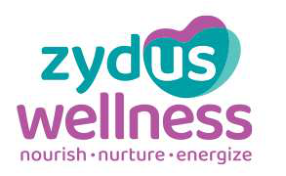
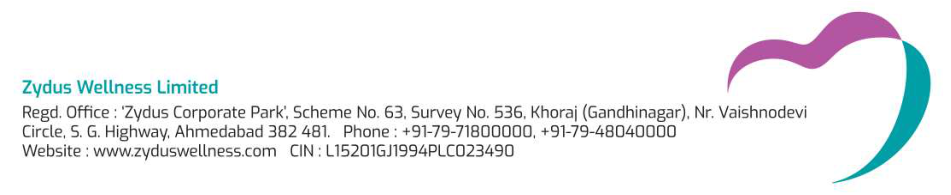
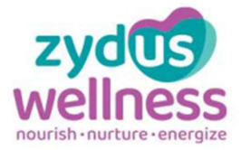
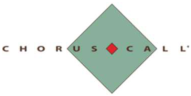

**[Image: Nov2025.pdf-0001-00.png (286x176, 64.6KB)]**

November 10, 2025 

Listing Department **BSE LIMITED** 

## **Code:** **_531 335_** 

P. J. Towers, Dalal Street, **<u>Mumbai–400 001</u>** 

Listing Department 

**Code:** **_ZYDUSWELL_** 

## **NATIONAL STOCK EXCHANGE OF INDIA LIMITED** 

Exchange Plaza, C/1, Block G, Bandra Kurla Complex, Bandra (E), 

## **<u>Mumbai–400 051</u>** 

## Sub: **<u>Transcript of the Earnings Conference call held on November 5, 2025</u>** 

Dear Sir / Madam, 

Pursuant to Regulations 30 and 46(2)(oa)(iii) of the SEBI (Listing Obligations and Disclosure Requirements) Regulations, 2015, please find attached Transcript of the Company’s Q2 FY2026 Earnings Conference call held at 4:00 p.m. (IST) on Wednesday, November 5, 2025. 

Please find the same in order. 

Yours faithfully, 

## For, **ZYDUS WELLNESS LIMITED** 

NANDISH Digitally signed by NANDISH  PRADIP  JOSHI PRADIP  JOSHI Date: 2025.11.10 10:05:02 +05'30' 

## **NANDISH P. JOSHI COMPANY SECRETARY & COMPLIANCE OFFICER** 

**Encl.** As above 

**[Image: Nov2025.pdf-0001-19.png (951x195, 81.5KB)]**

**[Image: Nov2025.pdf-0002-00.png (266x166, 67.1KB)]**

# “Zydus Wellness Limited 

# Q2 & H1 FY '26 Earnings Conference Call” 

# November 05, 2025 

**[Image: Nov2025.pdf-0002-04.png (200x132, 34.8KB)]**

**[Image: Nov2025.pdf-0002-05.png (284x49, 27.2KB)]**

**[Image: Nov2025.pdf-0002-06.png (191x96, 9.5KB)]**

**– MANAGEMENT: MR. TARUN ARORA CHIEF EXECUTIVE OFFICER AND – WHOLE-TIME DIRECTOR ZYDUS WELLNESS LIMITED** 

**– – MR. GANESH NAYAK DIRECTOR ZYDUS WELLNESS LIMITED** 

**– – MR. UMESH PARIKH CHIEF FINANCIAL OFFICER ZYDUS WELLNESS LIMITED** 

**– MODERATOR: MR. MANOJ MENON ICICI SECURITIES LIMITED** 

Page **1** of **17** 

_Zydus Wellness Limited November 05, 2025_ 

**[Image: Nov2025.pdf-0003-01.png (140x92, 17.7KB)]**

### **Moderator:** 

Ladies and gentlemen, good day, and welcome to Zydus Wellness Q2 and H1 FY '26 Earnings Conference Call hosted by ICICI Securities Limited. As a reminder, all participant lines will be in the listen only mode and there will be an opportunity for you to ask questions after the presentation concludes. Should you need assistance during the conference call, please signal an operator by pressing star then zero on your touchtone phone. Please note that this conference is being recorded. 

I now hand the conference over to Mr. Manoj Menon from ICICI Securities Limited. Thank you, and over to you, sir. 

### **Manoj Menon:** 

Hi, everyone. As always, it's our absolute pleasure to host the management of Zydus Wellness for another quarter call. Today, the management is represented by Mr. Tarun Arora, CEO and Whole Time Director; Mr. Ganesh Nayak, Director; and Mr. Umesh Parikh, CFO. 

Now over to Tarun and team for the opening remarks, post which we will open the floor for Q&A. Thank you so much. Over to Tarun, sir. 

**Tarun Arora:** 

Hello, Good evening, and welcome to the post results teleconference of Zydus Wellness Limited for quarter 2 financial year 2025-2026. Like Manoj mentioned, I have with me Mr. Ganesh Nayak, Director; and Mr. Umesh Parikh, CFO, on the call from our side. 

During the quarter, consumption trends were influenced by early and extended monsoons impacting sales in key seasonal categories. Despite this moderation, the non-seasonal portfolio demonstrated strong resilience, cushioning the overall business performance and ensuring steady momentum across core segments. Key commodities continue to exhibit divergent pricing trends, while certain inputs witnessed easing prices, others remained firm, leading to the mixed impact on the overall cost basket. 

Quick commerce and e-commerce channels continue to maintain strong growth momentum, underscoring the sustained shift in consumer purchasing behavior towards digital platforms. Tier 2 and Tier 3 cities are emerging as the next phase of growth drivers. The implementation of GST 2.0 led to transitory business disruptions, particularly within trade channels adapting to the new compliance framework. These short-term effects have mostly stabilized as we speak. We believe that the next generation of GST reforms is a welcome and progressive move. 

Currently, more than 85% of the company's products in the domestic market fall under the 5% tax bracket. This reform, coupled with changes in the direct tax rate and increased government spending are likely to enhance product affordability, stimulate consumer demand and strengthen overall value proposition of our brands. 

During the quarter, the company acquired Comfort Click Limited and its subsidiaries, strengthening its international presence across key markets in the U.K., European Union and the U.S.A. as it builds it forward. This acquisition has enhanced company's overseas digital business platform and expanded its footprint in the fast-growing consumer healthcare segment. 

Page **2** of **17** 

_Zydus Wellness Limited November 05, 2025_ 

**[Image: Nov2025.pdf-0004-01.png (140x92, 17.7KB)]**

Comfort Click through its brands, WeightWorld, maxmedix and Animigo is among the fastestgrowing digital consumer health care platforms in the VMS, which is Vitamins, Minerals and Supplements category. Supported by strong brand equity, loyal consumers and Amazon ratings above 4.6 across major European markets, the business derives most of its revenue from e- commerce and D2C channels. 

It is well positioned to benefit from rising health awareness and the growing focus on preventive health care. The post-acquisition performance in the initial months have been broadly in line with the expectation. 

Latest additions to our portfolio includes Nutralite Activ Peanut Butter, a plant-based range available in multiple exciting flavors, catering to growing consumer demand for healthy snacking options. There is RiteBite millet wafer protein bar made from jowar. Each bar consists of 10 grams of protein, contains no maida, no palm oil and zero added sugar, again available in multiple flavors. 

The company registered strong double-digit growth, excluding impact of seasonal brands and the newly acquired Comfort Click business. The performance of seasonal brands was temporarily affected by early and prolonged rainfall conditions across the country. However, company's structural growth drivers remain intact. 

On a consolidated basis, the company reported net sales growth of 31% for the quarter and 12.8% for half year 1 financial year '26, driven by strong sales performance of newly acquired entities, which offset the impact of seasonal products. The company on a consolidated basis reported EBITDA of INR230 million with a growth of 17.3% year-on-year. 

The acquisition has been funded through a low-cost bridge loan at an interest rate of 5% and the related interest cost has been included under finance costs. The brands recognized on acquisition are being amortized over a period of 15 years, resulting in a sequential increase in depreciation and amortization expenses during the quarter. 

Exceptional items include one-off expenses related to the acquisition of Comfort Click and costs associated with the voluntary liquidation of Naturell (India) Private Limited, enabling the expeditious consolidation of its business with Zydus Wellness Limited on a going concern basis. The net loss, including exceptional items and other non-cash amortization is INR528 million. 

The adjusted net loss, excluding exceptional items is INR186 million. The acquisition of Comfort Click is cash EPS accretive, excluding exceptional items such as onetime acquisitionrelated costs. Alongside its financial performance, the company remains deeply committed to environmental, social and to governance, the ESG principles. 

For financial year '25, the company's latest ESG publication and S&P Global rating showed a 6.3% improvement, taking the overall ESG score to 84. The company now ranks in the 99th percentile amongst the 331 global companies on the FOA food products industry group, securing the third highest position globally as of 24th October 2025. Brand highlights and market share details are provided in the investor presentation. Notably, Complan has maintained its market 

Page **3** of **17** 

_Zydus Wellness Limited November 05, 2025_ 

**[Image: Nov2025.pdf-0005-01.png (140x92, 17.7KB)]**

share and improved its position from fifth to fourth place according to the Nielsen report of September 2025. 

Everyuth launched its Anti-Pollution Scrub sachet. Sweetener recorded a 97.9 basis point increase in market share also as per the Nielsen report, while Sugar Free continues its doubledigit growth for -- Sugar Free Green continues its double-digit growth for 18th consecutive quarter. 

The RiteBite Max Protein business has been integrated into company's broader distribution network, remains on track with its strategic growth plan, and also entered international markets. Strategic initiatives are underway across the portfolio to enhance product awareness, expand the consumer base and drive sustainable long-term growth. Thank you, and we will now begin the Q&A session. Over to the coordinator. 

**Moderator:** Thank you. The first question is from the line of Mayur Parkeria from Wealth Managers. Please go ahead. 

**Mayur Parkeria:** So actually, couple of questions from my side. Is it possible to give what is the actual number of -- for the quarterly, which is included for the Comfort Click, which is there for 1 month and 2 days? 

**Tarun Arora:** We don't give separate numbers. 

**Mayur Parkeria:** But to understand the like-to-like performance of our core business, it would have been a little helpful since this is the first time the consolidation has started. 

**Tarun Arora:** So for your help, what we can say is that we have given the full year financial numbers at the time of acquisition. We just have a 1 month of numbers that have come in, and it's largely in line with that. So that should be able to -- I mean, that's the most we could help you with. 

**Mayur Parkeria:** Okay. Sir, segmental reporting, while business-wise we may not be mitigating the business into various segments, means we have begun for Personal Care and I think now that. But from a geographical segmentation also, will it make sense to now have a geographical segment given that we have 2 separate clearly geographies in terms of domestic and U.K. business as we go ahead for the year? 

**Tarun Arora:** So I think it's a good suggestion. We will review it at the end of this financial year, because we do believe that the best way to do segmental reporting is at the beginning of a financial year. So over the next few months, we will consider this suggestion and relook at it if we need to revisit the segmental support disclosures. 

### **Mayur Parkeria:** 

Thirdly, finally, finally, from a amortization of the brand over the 15 years, just to get a slightly better nuanced understanding, we have increased our intangibles by roughly INR2,500 crores, and we have increased our goodwill by roughly around INR800 crores. That's a INR3,300 crores increase. So here, the amortization amount, which will be sitting on the P&L for the next 15 

Page **4** of **17** 

_Zydus Wellness Limited November 05, 2025_ 

**[Image: Nov2025.pdf-0006-01.png (140x92, 17.7KB)]**

years into 4 quarters, which will be 60 quarters, if I say, will it be an equal amortization of this INR2,400 crores, INR2,500 crores or INR3,300 crores. 

**Umesh Parikh:** The amortization will be of INR2,400 crores. And one thing for you – for your clarification is that probably the goodwill brand and the total amortization amount, which is there mentioned, right, that exceeds the acquisition cost already paid, but that is because of the creation of the deferred tax liability, which is a sort of benefit to us, right? I mean in terms of financial, not really, because accounting standard requires us to create a deferred tax liability for that. Now the amortization will be on INR2,400 crores equally spread across 15 years. 

**Mayur Parkeria:** So INR40 crores per quarter will be what the additional charge will come? **Umesh Parikh:** Yes, roughly around that. Approximately, yes. **Mayur Parkeria:** Roughly around that. And we will have the interest cost also on the bridge loan, which is there for the -- as we go ahead, right? **Umesh Parikh:** Yes. Currently, it is 5% on this about GBP240 million. And as we go and make part payment, repayment, it will go on reducing. **Mayur Parkeria:** Sir, just on this bridge loan, sorry, I was not the part of the call when I think you acquired CCL, I missed that, if there was a call there. So I may not be knowing this, so pardon for duplication. But do we have plans for equity raising to reduce this at one time? Or do we plan to take it as we go as internal accruals? 

**Umesh Parikh:** So currently, what we have done is that we have taken a bridge loan for 15 months. And we have a time to take it out and replace it by another capital type, could be a form of mix of equity or borrowing. But currently, we don't have any plan and we'll decide as we go along, maybe in a couple of quarters. But currently, we'll live with the bridge loan. **Moderator:** The next question is from the line of Ronak Shah from Equirus Securities. **Ronak Shah:** Yes, sir. So first of all, can you highlight what can be the quantified impact of the GST 2.0 implementation on the reported top line in the second quarter? And how do you expect these to normalize going into the third quarter given the ongoing adverse monsoon seasons, which we are seeing? 

**Tarun Arora:** So we can't quantify the specific number that we faced. We did see a slowing down of purchases, both in general trade as well as organized trade, whether you look at modern trade and e- commerce. And there was a period of time when some of the larger players did not buy, but hard to specifically quantify. But what we've seen is largely everything has come back and stabilized and it is business as usual. So we look forward to business as usual. 

From a consumer point of view, I don't think there would have been any significant shift from our business, may have just impacted some change in inventory, which will also catch up eventually. 

Page **5** of **17** 

_Zydus Wellness Limited November 05, 2025_ 

**[Image: Nov2025.pdf-0007-01.png (140x92, 17.7KB)]**

**Umesh Parikh:** Yes. It did impact the primary, though secondary and tertiary they remain and we did not lose any sales there. **Ronak Shah:** Okay. Got it. Sir, my second question is on -- that -- despite one-off cost of the acquisitionrelated costs, which has accounted for the exceptional item, despite that our reported EBITDA margin stand relatively lower compared to the last year. So does it play that -- it is purely because of the deleverage of the Personal Care segment or the Comfort Click is currently operating at a lower margin compared to what we have acquired? 

**Tarun Arora:** I don't think there is anything to do with Comfort Click. It just stays -- I mean, too early to even imagine any changes there as it is. It's a deleverage of the seasonal brands. Both Glucon-D and Nycil came under significant pressure and with that deleverage because our margins are anyway thin in this quarter has played out. But otherwise, which is, again, like we have explained earlier in my statement and consistently, that's the only impact that we see. 

**Ronak Shah:** Okay, sir. And sir, lastly, as the acquisition has been done, are we seeing any structural or operational intervention by the Zydus Wellness into the Comfort Click operational to have a different sort of growth trajectory or profitability metrics right now? **Tarun Arora:** Not required. I think it's too early. There is a capable management, which is running it. They've been incentivized. We'll work with them wherever required. But they are -- it's a strong team, and they're building Europe, they're taking it to U.S. Nothing specific to talk about. We are obviously working more in finance and HR to start with and then we will see. I think too early to talk any specifics. 

**Moderator:** The next question is from the line of Pallavi Deshpande from Sameeksha Capital. 

**Pallavi Deshpande:** This is regarding this Comfort Click. If we -- are they continuing to grow at that 57% growth that they were growing previously? And if I remove that 1 month revenue, then our revenues are basically flat. Is that the right number? **Tarun Arora:** So I think 57% is what we've reported the last 5 year series, yes. The growth rates are -- continue to be in good double digits. What we've seen is the teens growth in the category at East Europe level. They have been beating that for a long period of time, and we do believe they will continue to build that. But 1 month is too short a period to start even looking at these numbers from a clear point of view. 

Coming back to how is our performance without them, yes, we've had a tough quarter, largely impacted by the seasonal brands. Without seasonal brands and without counting Comfort Click, it's a good double-digit growth. Adding seasonal growth -- seasonal brands back, it is largely flattish. 

**Pallavi Deshpande:** And sir, my last question would be, when would they be foraying into the U.S. and -- in terms of the margins in that side of the business? 

Sorry, I didn't get your question. 

**Tarun Arora:** 

Page **6** of **17** 

_Zydus Wellness Limited November 05, 2025_ 

**[Image: Nov2025.pdf-0008-01.png (140x92, 17.7KB)]**

|**Pallavi Deshpande:**|When will -- you mentioned that they are looking to foray into the U.S. also, so when is that planned for Comfort Click foray into the U.S.|
|---|---|
|**Tarun Arora:**|They've already started last year, so it's a long-drawn process. They've already started. They already have actions in place, including approvals, setting up the whole thing. So it takes time, and there -- it's a work in progress.|
|**Pallavi Deshpande:**|Sir, my last question is what would have been the growth in FY '25 -- Comfort Click's growth?|
|**Tarun Arora:**|Off hand, I don't have it specific. We have the 5-year specific, but will be good high double digit.|
|**Moderator:**|The next question is from the line of Mayur Parkeria from Wealth Managers.|
|**Mayur Parkeria:**|Is it possible to share some of the operating data from an e-commerce platform, which we normally track in terms of monthly transacting customers or active customers, what kind of average order values are there? Some of the -- because we...|
|**Moderator:**|Sorry to interrupt, Mayur. Your voice is breaking.|
|**Mayur Parkeria:**|Yes. Is it okay now?|
|**Tarun Arora:**|Yes.|
|**Mayur Parkeria:**|So will it be possible to share some of the operating metrics from a platform perspective in terms of active users, monthly transacting users, average order sizes and -- because I wasn't able to track some of these private entities with that first data otherwise and again I --|
|**Moderator:**|Sorry to interrupt, Mayur. Could you please check your network connection and rejoin the queue? Your voice is muffled.|
|**Mayur Parkeria:**|Is it okay now?|
|**Moderator:**|Still the same. Could you please rejoin the queue? The next question is from the line of Ronak Shah from Equirus Securities.|
|**Ronak Shah:**|Sir, my next questions are on the RiteBite Max Protein. So sir, can you first of all, highlight how the growth rates are considering we are now integrating the distribution channel of the Zydus Wellness into that? Secondly, how we are seeing the profitability of the business considering the high scale expansion?|
|**Tarun Arora:**|So while we don't give number specifics, but I can give you a broad sense of how the business is doing. So business, so far almost 10 months since we bought it has actually beaten all the past trends and our estimates from a top line point of view. Similarly, from a bottom line point of view, it has exceeded the estimates set for it. So we are quite bullish about the possibilities of this business, and we believe we'll continue to invest and innovate on this platform to make it more meaningful and sizable in our portfolio.|

Page **7** of **17** 

_Zydus Wellness Limited November 05, 2025_ 

**[Image: Nov2025.pdf-0009-01.png (140x92, 17.7KB)]**

**Ronak Shah:** 

Okay, sir. And sir, from the understanding perspective, over the last 10-odd months, how we have shifted to channel saliency considering we are now pouring and increasing the presence into the offline market as well. Can you highlight something on that? 

**Tarun Arora:** 

So we have expanded general trade distribution significantly, adding more towns, adding people, and we have plans to continue doing that. Similarly, quick commerce has been a big driver for this. The category has been growing, and we've been investing and growing significantly on the quick commerce platform. So overall, it's been a good growth story across channels. We have also started taking it international. 

So some of the markets we've got, as we have introduced these products, we seem to be getting good response. But it's a work in progress and early days to say about international. 

**Ronak Shah:** Okay, sir. And sir, secondly, from the accounting perspective, we just want to have understanding what is the amount at which we have reported the Comfort Click acquisition in INRterms? And when we split into the intangibles and goodwill, what is the proportion of that? 

**Umesh Parikh:** Portion between the brand and goodwill is roughly about 75:25. And as Tarun sir say that we don't share the numbers in INR. But anyway, you will have these numbers at the end of the year when we share the subsidiary performance. 

**Moderator:** The next question is from the line of Tejash Shah from Avendus Spark Institutional Equities. 

**Tejash Shah:** A couple of questions. First, looking at the headwinds that you called out in the quarter, which is pertaining to GST transition and the seasonality, margin seems to have done well. So are there any one-offs there? Or this we have done in such a difficult quarter, should we assume that once normalcy comes back from 3Q, 4Q onwards, our margin trajectory will improve disproportionately and perhaps that ambition to reach 18%, 19% margin can be preponed? 

**Tarun Arora:** 

I think while we are very focused on that, we have -- you got the right point that given the deleverage we had because of loss on seasonal brands as well as GST, the impact is very steep, but I think it's been a difficult quarter. We still do believe that we are on path to doing 17%, 18% that we have committed on EBITDA on the base business as per original plan. If Comfort Click also shapes up, then that also, we hope to get there. But these are, I think, work in progress and early days to comment. 

But the base business, I think the story remains intact. And I think there's no specific shift I could report. Yes, we are committed to drive that much harder with improved gross margins, and you'll see some actions on that as we move forward, improvement in gross margins. And if we can take the leverage out, may be able to do it more smoothly. 

**Tejash Shah:** 

Very clear. Sir, second, it's more of a request. The way our business is growing and expanding, the complexity is also increasing both in terms of domestic portfolio and overseas, how would you like us to kind of track the progress? And it's a request also, which was made earlier on the call that if you can share at least international and India slightly separately so that we can have some fair sense of asking right questions. 

Page **8** of **17** 

_Zydus Wellness Limited November 05, 2025_ 

**[Image: Nov2025.pdf-0010-01.png (140x92, 17.7KB)]**

**Tarun Arora:** 

Tejash, thanks. I think somebody else also pointed out. We will seriously be looking at it, and we'll work towards it. Ideally, we change this at the beginning of a quarter, even when we started the disclosure between Food & Nutrition and Personal Care, started at the beginning of the year -- sorry, not quarter. So we'll see how quickly we can because we do recognize that these disclosures will help you to track us better, and we'll figure it out and come back to you. 

**Moderator:** The next question is from the line of Mayur Parkeria from Wealth Managers. **Mayur Parkeria:** Sorry, the voice was muffled. Am I audible and clear now? 

**Tarun Arora:** Yes. 

**Mayur Parkeria:** Sir, what I was trying to understand is it will be helpful along with the -- while the current quarter, you can share some of the details, but make it a disclosure is with respect to how the platform -- some of the operating highlights of the platform, which normally most platforms disclose in terms of what would be our -- the average ticket size, what are monthly transacting customers, monthly active customers, how has been the growth in those channels? 

Also in terms of -- sorry, but again, I could not get understanding. Are we operating more like a marketplace model? Or is it more like an inventory kind of -- sorry, just what we call nonmarketplace kind of, not an inventory model. So how do we operate? 

And in that case, our take rates and -- because I understand EBITDA margins are more in the region of 15%, so it would be a marketplace kind of model. So just to share some of the understanding on the quarterly basis and make it a standard practice for us to understand and get rather than asking it on the call, will help us to get a little more color on the international business as we go ahead, sir. 

**Tarun Arora:** 

I hear you. We understand what you're saying. So first of all, it's largely -- and we've explained it earlier also, if you look at it, it's largely a marketplace. So about 75% to 80% of the business is right now on Amazon, which is a marketplace model. Remaining is their own website. 

There are other platforms which we are exploring and we're building, but that's largely what reflects on this. Some of the metrics we could start sharing at this stage, while we have reviewed and we are working on it, we could start sharing some of those things eventually. But some of them are also competitive in nature. 

So we'll review this and come back to you with some more details and color on this in terms of both the number of customers and revenue per customer from -- on each of the 2 platforms, whether it is marketplace, which is largely Amazon or D2C website. These are things that we do review, but start sharing we'll come back to you on the possibilities of that. 

### **Mayur Parkeria:** 

That will be great, sir. Sir, last question on the Comfort Click. Strategically, when at the time of our acquisition and now our plan, if we look at the next 3 years, strategically, will the focus be more on growth or will the focus be more on getting efficiency and repeat customers? How are 

Page **9** of **17** 

_Zydus Wellness Limited November 05, 2025_ 

**[Image: Nov2025.pdf-0011-01.png (140x92, 17.7KB)]**

our geographical expansion? Which of the 3 would be our focus and your milestones which you have given to the management team as we go ahead. 

### **Tarun Arora:** 

So there are 3 or 4 metrics that we could look at. One is they have a very good, strong proven model of working with marketplaces, which is reasonably efficient. Trying to work on improving our market shares in each of the markets, top 6 markets, constitute a significant proportion of their business, and they will continue to focus on growth on the same country growth. 

And that's one metric or one KPI they will drive growing within the geographies which are sizable for them because there is still enough room for growth within those geographies. Second parameter that they will focus is expanding to new markets, which are large, high potential markets, like we talked about U.S., which is the largest of markets. That's a very large deliverable for them. 

Having done all these, the profitability and other operational metrics are also part of their KPIs to look at. At the overall -- at the end of it, it should translate into ahead of the industry growth from a top line point of view, but a stronger journey on EBITDA. This is the broad framework that we will be looking at this model if we look at over the next 3 to 5 years. 

### **Moderator:** 

### **Lakshminarayanan G:** 

The next question is from the line of Lakshminarayanan Ganapathi from Tunga Investments. 

Sir, a couple of questions. When I just look at the category size of Glucon-D, Complan and Nycil, which was given at the time of you acquiring those brands, they're something like INR850 crores, INR6,700 crores and INR750 crores. When I look at it, they have -- I mean, as we speak right now, Glucon-D has gone from INR850 crores to INR1,050 crores. Complan has gone from INR6,700 crores to INR6,800 crores and Nycil also hasn't gone up. So is there a problem with the category that the category doesn't seem to grow from the time of you acquiring till now? 

That is number one. Second, if I look at your 2022 data and 2025 data in terms of market share, which you have actually provided, there seems to be a market share drop in Nycil and also in Complan. So I just want to know why category itself is not growing? And second, why on a slightly long-term point of view, like a 3-year point of view, our market share actually have dropped. 

### **Tarun Arora:** 

Okay. So there are 2 or 3 parts to this question. Let me just break down into 2 parts. One is Complan and second is Glucon, Nycil. First of all, Glucon-D, Nycil, if I look at last 3 to 4 years, they've been growing at a good pace, much faster than pre-acquisition growth rate. 

Despite this being a low performance year, we have seen actual degrowth in this category. But the fact is that these are growing. Nielsen doesn't do justice. We have been engaging with Nielsen to give us better numbers. I only see across 3 brands their coverage has actually reduced, and that's a problem. 

One reason, of course, also is at the time of acquisition the e-commerce was 1%. Today, the share of e-commerce in each of these brands has gone up and going up to 15% to 20% for 

Page **10** of **17** 

_Zydus Wellness Limited November 05, 2025_ 

**[Image: Nov2025.pdf-0012-01.png (140x92, 17.7KB)]**

Complan, which is not even captured in the numbers we share at an industry and our market share levels. So if I were to redo my Complan market shares, including e-commerce, which is not reported by Nielsen, they will be in line with what we had at the time of acquisition, a little lower, but then that's also a choice. 

We have a disproportionately lower presence in sachets, which we believe is more value eroding. So we've played as per the right consumer metrics, where we have grown on the larger packs, more profitable part of the business and let go or played lower on the sachets. 

So directionally, I think Complan, the bigger issue is category has been under pressure, and it's been very public because the other 2 players, 3 players also talk about the same thing. Having said this, the market share is largely protected in the spaces which matter to us. If anything, UP and Bihar have actually been grown significantly from before acquisition to now. Critical markets of West Bengal and Tamil Nadu, we are fighting. Tamil Nadu, our market share is still as good or bad as it was before acquisition. 

West Bengal has been a bit of pressure, but the business is still holding well. So overall, I would say Complan, a larger category issue, but we've managed kind of well. Looking forward, we do believe that the brand is getting stronger, how do we reframe and pivot it to potentially better spaces to build this brand. 

Coming back to Glucon-D, Nycil question that you raised, those categories were growing at very low single digits in 4 to 5 years before acquisition. Now Glucon-D in last 4 to 5 years is growing at good rates, almost 1.5x to 2x of what they were growing earlier. Nycil has also grown post acquisition at a good double-digit rate. Market share at the time of acquisition was close to -- for Nycil was 30%, which went to 35%. Right now, it's 33%. 

I mean, these market share movements are competitive in nature. I don't think we are any weaker than others, but a little bit of percentage here and there will move. But the brand has been growing at a good double digit. So I'm not too worried about Nycil trajectory or Glucon-D trajectory. Glucon-D, we are also pivoting to RTD, which we've launched this year, for example, we had the Activors and there may be more stuff that we'll be doing in terms of -- so broadly, this is the broad space I could give. 

You have more specifics, we can pick it up quickly or maybe you want to have a more detailed conversation scheduled? 

### **Lakshminarayanan G:** 

Just one question on addition to that, right? So if I look at the category itself, which has been reported, even including Sugar Free, hasn't really grown since acquisition. It's nothing to do with any category of what you -- even you mentioned the category size of Glucon-D, Complan, Nycil and Sugar Free, they have not really grown. They have grown at like 1%, 2%, 3% kind of thing or even stayed flat. So is it -- is that category size also was reported wrongly? 

Or how do we take this up? Because as investors, we find that the category itself is not growing. However, you are growing, that's one part. But how to think about it? 

Page **11** of **17** 

_Zydus Wellness Limited November 05, 2025_ 

**[Image: Nov2025.pdf-0013-01.png (140x92, 17.7KB)]**

### **Tarun Arora:** 

So there are 2 parts on this. Let me go to sweeteners, and I think that's to be looked at from a different lens. So between 2018, '19, I don't remember the specific year, Nielsen stopped reporting because globally they sold the category space to IQVIA in their relationship. So for almost 1 or 2 years, they did not report the category. And when Nielsen, IQVIA restarted the reporting, they reported a category drop of, I think, 15%, 20%, while we never dropped 15%, 20%. 

They have been rebuilding the category estimates for last 3 to 4 years. And therefore, there is an asymmetric growth capture between Nielsen -- or Nielsen, IQVIA and us. Having said this, I think last 3, 4 years may be a better reflection, but around '18 to '20, I think, '19 to '20 or '21, I think almost 1.5, 2 years, we had limited reporting of Sugar Free or the sweeteners category from Nielsen, IQVIA. 

So there's a bit of struggle on that. And they suddenly dropped because if you look at all our reports, I don't have it handy, suddenly from INR360 crores, INR370 crores, they dropped it down to INR310 crores, INR320 crores. And then after that, they've been rebuilding the category. 

Our -- coming back to how we've been performing, I think we've been very clear. We've been growing. But at a single digit, our challenge has been that this category can do better with recent actions on sweeteners with Sugarlite, which again went through a trouble, but I'm lite, Sugar Free D'lite and Sugar Free Green, these are our pivots of driving double-digit growth and should overcome the challenge that the category -- base category has faced. But that's a broad sense of what has happened. And also just on that, I think this category has also had a high e-commerce presence now, which again is missing in the Nielsen, IQVIA reporting. 

### **Lakshminarayanan G:** 

### **Tarun Arora:** 

So just to summarize, right, I think it would be helpful to actually put the right category size number as well as perhaps your -- what do you think is your market share. Otherwise, it doesn't -- it's not a good presentation, I would say, because it either undervalues your company's performance or we get -- we are unable to really understand what's going on. So if you just perhaps maybe you can relook at it and see whether the way in which you want to represent the segment or market share and growth. 

I understand what you're saying. The problem is that we report best third-party estimates available. We don't -- I mean, it will be unfair for us to start putting our estimates because then there is the biases that come. We have our view. But from a fair, transparent reporting point of view, I try to give you the best possible estimate that we can give you available in the market. 

We have impressed upon Nielsen to get e-commerce estimates so that we are able to represent the category better. It helps us to drive our actions internally. It helps us to share with you more transparently what the category is. But any playing with those numbers while reporting to you is, I think -- 

Since you acquired these 3 brands, Glucon, Complan and Nycil, if you just index it at 100, what has been the CAGR of these 3 things put together? If you can just say... 

**Lakshminarayanan G:** 

Page **12** of **17** 

_Zydus Wellness Limited November 05, 2025_ 

**[Image: Nov2025.pdf-0014-01.png (140x92, 17.7KB)]**

### **Tarun Arora:** 

At double digit on Nielsen for the last 4, 5 years, high singles or closer to double digit for GluconD. Complan has not been so good, but that's more category because the category has been flattish for almost 4, 5 years -- 

**Lakshminarayanan G:** So these 3 brands put together, what has been the CAGR growth you said -- for all of them put together. 

**Tarun Arora:** I think we can set up a more detailed conversation separately. Sanketh will -- you can reach out to Mr. Sanketh Parikh on this. 

**Moderator:** 

The next question is from the line of Mohit Dodeja from Emkay Global. 

**Mohit Dodeja:** A couple of questions from my end. So this new acquisition, Comfort Click, what are the target return ratios? And when do you anticipate crossing the hurdle rate? And second question being like what has been the initial consumer traction like for the millet wafer protein bar? 

And how does the margin profile of the next-gen products are compared to the established heritage portfolio like Sugar Free or Glucon-D? And these new launches are driving new consumer acquisition or are they capturing wallet share from your existing brand users? That's it from my end. 

**Tarun Arora:** So let me answer the consumer questions first. First of all, the millet bar, I think it's early days, but we see a fairly good traction because most of the people who tried the product have loved it. We see both on e-commerce as well as GT a good traction. So we are quite excited about the possibilities. From a gross margin perspective, overall Max Protein business and this included, we're largely in line with our overall gross margins before Comfort Click, and that's what we have stated earlier also and largely in line with that. 

We can't give you more specifics than that. And third was how is the growth coming? I think the share of growth is not coming from any of the internal brands. Most of the innovations are actually helping us gain a wider set of consumers who have not been consuming our brands. And that's really what the value of innovations will be. 

If I were to cannibalize or share -- take wallet share from within my portfolio, then it's not a valuable innovation. The only brand, only innovation or only piece that I see, which partially cannibalizes is Sugar Free Green because all the Sugar Free consumers who may be considering exiting may come back on natural-based products. Most of our innovations really focus on acquiring new set of consumers, including Sugar Free Green. So I think that remains our fundamental ways of working. Coming back to your question on earnings, I'll let Umesh handle it. 

### **Umesh Parikh:** 

Yes. So on the Comfort Click acquisition, as such, you may be aware that whatever the acquisition has happened over the last past 2 years in the FMCG segment, the likely payback period always have exceeded 8, 10 years. But here, we are quite optimistic. Even as per our internal conservative estimates, we are really optimistic about this particular acquisition, how it plays out. But it is too early to say. 

Page **13** of **17** 

_Zydus Wellness Limited November 05, 2025_ 

**[Image: Nov2025.pdf-0015-01.png (140x92, 17.7KB)]**

But no specific hurdle rate or internal targets have been set out currently on this, but we are working on the future strategy and the growth aspects. **Mohit Dodeja:** Okay. Sir, like, is the hurdle rate high-single digit or in mid-teens? Can you quantify that number? **Umesh Parikh:** So if you are -- by hurdle rate, if you mean the volume growth or the sales growth or any specific like -- **Mohit Dodeja:** No, no. I need the margin -- **Umesh Parikh:** -- or looking at the IRR. Margin. If you are looking at the margins, we have already published our margin at the time of acquisition. We hope that they will either remain the same or continue to improve. But what is going to drive this profitability is not the margin percentage, but the growth in the volume and the growth in the sales and that we are very optimistic about. **Mohit Dodeja:** Okay. Got it. And one more question just for -- my last one. I noticed the A&P spends have gone up significantly this year, while when we include the effect of seasonal brands, the top line, as you mentioned, is flattish. So just wanted to know whether this hike is a result of competitive intensity or any other reason? **Umesh Parikh:** So it's just because inclusion of the results of 1 month and 2 days -- **Tarun Arora:** As well as the NIPL which is -- **Umesh Parikh:** As well as the RiteBite and Max Protein, those advertising and marketing spend were not in the base numbers of the last year. **Tarun Arora:** Like-for-like portfolio has seen -- the sales are a bit lower only. So we've managed the advertising. **Moderator:** The next question is from the line of Rajeev Anand from Narnolia Financial Services Limited. **Rajeev Anand:** My question is on depreciation and amortization. So for full year basis, is it expected to be around INR160 crores? **Umesh Parikh:** The brand depreciation on the Naturell (India) Private Limited as a competitive brand, the quarterly run rate will be in the range of INR46 crores, INR47 crores. **Rajeev Anand:** Okay. And secondly, question related to Comfort Click. So did Comfort Click clock 15% plus EBITDA margin in this quarter? **Tarun Arora:** It's just a 1 month of numbers. I think it's too early to comment specifically. Like Umesh has also mentioned, I think we'll be publishing the results of the subsidiary on an annual basis, and that would be the best time to look at it. Month-to-month will be just too short. But we do believe it will be in line with the forecast at the time of acquisition, but 1 month is too early. **Moderator:** The next question is from the line of Pallavi Deshpande from Sameeksha Capital. 

Page **14** of **17** 

_Zydus Wellness Limited November 05, 2025_ 

**[Image: Nov2025.pdf-0016-01.png (140x92, 17.7KB)]**

**Pallavi Deshpande:** Yes, sir, just wanted to understand the e-commerce part better. So you mentioned 15% of Complan sales is from e-commerce. Is that right? 

Sorry, could you repeat the question, please. 

**Tarun Arora:** Sorry, could you repeat the question, please. **Pallavi Deshpande:** Yes, I wanted to understand this e-commerce part better. Are the margins in e-commerce this year lower than last year versus general trade, if I compare margins? That's the hint I'm getting from other FMCG companies. 

**Tarun Arora:** No, no. For us, it's largely in line with the regular. **Pallavi Deshpande:** Other channels. Okay. And it's 15% of sales for Complan, is that right? **Tarun Arora:** I mean broadly, it varies from brand to brand. Some brands are much higher, some brands are much higher and some brands are much lower. **Pallavi Deshpande:** Complan -- and for RiteBite and Complan? 

**Tarun Arora:** So for RiteBite it is much higher and Complan will be more 15%, 18% range. **Pallavi Deshpande:** Right, sir. And do we see -- I mean, in terms of the growth for -- like you said, the market share has improved 1%. So what drives that increase in market share? Is it more the e-commerce, change in channel or... 

**Tarun Arora:** So we continue to focus more on channel-by-channel strategy, where we are seeing good traction. You're asking about Complan, I'm assuming. 

**Pallavi Deshpande:** Yes. **Tarun Arora:** We continue to focus on larger packs in organized channels, and that really helps us focus or get a better performance on that. There are different SKUs in different channels, and that channelby-channel strategy helps us to execute better as per the consumer needs. 

**Pallavi Deshpande:** All right, sir. And sir, my last question is on this Comfort Click, like you rightly said at the end of the year, we'll have a clearer picture. But since we are penetrating new markets like the U.S., more in Europe, so will that not take a toll on margins in the first year because of -- 

**Tarun Arora:** No, we don't expect... **Pallavi Deshpande:** -- higher advertising spends for those markets. **Tarun Arora:** No, no, no. We don't expect that challenge. 

**Pallavi Deshpande:** And the strategy -- go-to-market strategy will be pretty much similar in terms of customer acquisition, what it has been in the U.K.? **Tarun Arora:** Yes, largely built on the knowledge that we acquired from European. 

Page **15** of **17** 

_Zydus Wellness Limited November 05, 2025_ 

**[Image: Nov2025.pdf-0017-01.png (140x92, 17.7KB)]**

### **Moderator:** 

### **Madhu Agrawal:** 

The next question is from the line of Madhu Agrawal, an individual investor. 

So I have 2 questions. One is trying to understand what Q3 and Q4 will look like. My understanding is that we've had a difficult Q2 because of the challenges in the seasonal category, which is I understand Nycil and Glucon-D. I also remember from last quarter's call that 80% to 90% of sales for Glucon-D and Nycil are booked in Q1 and Q2. 

So while you're still targeting that 17%-ish margin for the full year, do you have any thoughts on where will that specifically come from? Or how do we achieve that? Because I'm assuming these 2 products will continue to underperform for Q3 and Q4? 

### **Tarun Arora:** 

I think let me just say that I think some part of your understanding is not exactly correct. Actually, it's not Q -- it's quarter 4 and quarter 1 of a financial year, which constitutes the largest portion of these businesses. It's just that we have had a bad season or tough season because of the continuous rains that our quarter 1 and quarter 2 have got impacted. There is no reason for us to believe that this is what will continue. Quarter 3 is anyway a small quarter for these brands and quarter 4 is a new season altogether. 

So it just resets and there is a new thing which happens, which is more of a pipeline fill. So we do not have any estimates specifically to give, like you said, but this is the broad direction that I can share with you. 

As far as 17%, 18% EBITDA journey you've talked about, we have stated at the beginning of the year that over next 2 years, we intend to get to a 17%, 18%, which is through a mix of gross margin improvements and operating leverage as the scale goes up and it translates into a better operating leverage helping us get to it. We are on track. Most of our actions are in place. Temporary or short-term impact of business doesn't change our broad strategic approach to get there. 

### **Madhu Agrawal:** 

### **Tarun Arora:** 

### **Madhu Agrawal:** 

Understood. And good to know that Q4 still presents potential on those categories. My second question is really about how you're looking at the business over a 3- to 5-year horizon. Are you seeing all of the different product categories contributing more or less evenly to the growth? Or are you seeing 1 or 2 categories as being the blockbusters that will really drive the future of the company? 

We are a multi-category, multichannel and multi-geography now. And each of the sales, if I were to look at, we have plans and strategies to build it. So it's not just 1 or 2, but a whole lot of sales, if I were to break down by channel, brand, geography, et cetera. We've got our strategy in place, and therefore, that should help us get to our double-digit growth that we aspire over the next 3 to 5 years. 

Understood. Are there any -- let me rephrase. Are there any specific ones that you see as being from outperformers or contributing disproportionately to growth? Or are there any categories that perhaps -- and you may not, but perhaps have more of a focus than the others? 

Page **16** of **17** 

_Zydus Wellness Limited November 05, 2025_ 

**[Image: Nov2025.pdf-0018-01.png (140x92, 17.7KB)]**

**Tarun Arora:** No. I think like I explained, each one has their own task, and we have clearly got this. If you want to pick up more questions, I think you should reach out to Sanketh, and he'll be able to help you with some of those more specifics things. 

**Moderator:** The next question is from the line of Umang Shah from Banyan Tree Advisors. **Umang Shah:** First of all, congratulations on the acquisition of Comfort Click. I think it's a very interesting addition to the Zydus portfolio. The question I had was, with respect to distribution, we are a company which started with distribution at the chemist channel. And over time, we have also expanded our distribution to the general trade in the form of kirana stores. Today, if you were to look at on a pan-India basis, what percentage would we have covered? And is there -- is distribution a lever for us to expand both for RiteBite and for the legacy Zydus portfolio? **Tarun Arora:** Yes. Distribution will continue in our FMCG business to be a strong lever for growth. We have -- at an overall level, as explained in the past, from our traditional portfolio before even the Max Protein business, about 28 lakh, 29 lakh outlets, which stock Zydus Wellness products with a direct reach of more than 6, 6.2 lakh outlets. 

We are planning to go up further over the next couple of quarters to increase our direct distribution and our wish list is to take overall availability to 3 million first and then get to 3.5 million and further beyond. So distribution will remain a focus. And we also look at other channels as they grow from a consumer behavior point of view. We think we have to be wherever the consumers shop. 

**Umang Shah:** Great, sir. And sir, just one question on RiteBite. Any plans to foray into protein powder or more of fitness level SKUs? **Tarun Arora:** We are evaluating multiple new products. We will share once we have something specific. **Moderator:** Ladies and gentlemen, due to time constraint, this was the last question for today. I now hand the conference over to the management for closing comments. **Tarun Arora:** Thank you. Thank you for your support. We look forward to seeing you at the end of quarter 3. Thank you and best wishes. **Moderator:** Thank you very much, sir. On behalf of Zydus Wellness, that concludes this conference. Thank you for joining us, and you may now disconnect your lines. 

Page **17** of **17** 

---

## Extracted Images

| # | File | Dimensions | Size |
|---|------|------------|------|
| 1 | Nov2025.pdf-0001-00.png | 286x176 | 64.6KB |
| 2 | Nov2025.pdf-0001-19.png | 951x195 | 81.5KB |
| 3 | Nov2025.pdf-0002-00.png | 266x166 | 67.1KB |
| 4 | Nov2025.pdf-0002-04.png | 200x132 | 34.8KB |
| 5 | Nov2025.pdf-0002-05.png | 284x49 | 27.2KB |
| 6 | Nov2025.pdf-0002-06.png | 191x96 | 9.5KB |
| 7 | Nov2025.pdf-0003-01.png | 140x92 | 17.7KB |
| 8 | Nov2025.pdf-0004-01.png | 140x92 | 17.7KB |
| 9 | Nov2025.pdf-0005-01.png | 140x92 | 17.7KB |
| 10 | Nov2025.pdf-0006-01.png | 140x92 | 17.7KB |
| 11 | Nov2025.pdf-0007-01.png | 140x92 | 17.7KB |
| 12 | Nov2025.pdf-0008-01.png | 140x92 | 17.7KB |
| 13 | Nov2025.pdf-0009-01.png | 140x92 | 17.7KB |
| 14 | Nov2025.pdf-0010-01.png | 140x92 | 17.7KB |
| 15 | Nov2025.pdf-0011-01.png | 140x92 | 17.7KB |
| 16 | Nov2025.pdf-0012-01.png | 140x92 | 17.7KB |
| 17 | Nov2025.pdf-0013-01.png | 140x92 | 17.7KB |
| 18 | Nov2025.pdf-0014-01.png | 140x92 | 17.7KB |
| 19 | Nov2025.pdf-0015-01.png | 140x92 | 17.7KB |
| 20 | Nov2025.pdf-0016-01.png | 140x92 | 17.7KB |
| 21 | Nov2025.pdf-0017-01.png | 140x92 | 17.7KB |
| 22 | Nov2025.pdf-0018-01.png | 140x92 | 17.7KB |
