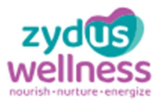
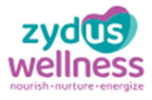
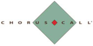
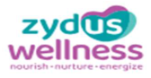

**[Image: Feb2026.pdf-0001-00.png (286x176, 64.6KB)]**

February 9, 2026 

Listing Department **BSE LIMITED** 

## **Code:** **_531 335_** 

P. J. Towers, Dalal Street, **<u>Mumbai–400 001</u>** 

Listing Department 

**Code:** **_ZYDUSWELL_** 

## **NATIONAL STOCK EXCHANGE OF INDIA LIMITED** 

Exchange Plaza, C/1, Block G, Bandra Kurla Complex, Bandra (E), 

**<u>Mumbai–400 051</u>** 

## Sub: **<u>Transcript of the Earnings Conference call held on February 3, 2026</u>** 

Dear Sir / Madam, 

Pursuant to Regulations 30 and 46(2)(oa)(iii) of the SEBI (Listing Obligations and Disclosure Requirements) Regulations, 2015, please find attached Transcript of the Company’s Q3 FY2026 Earnings Conference call held at 4:00 p.m. (IST) on Tuesday, February 3, 2026. 

Please find the same in order. 

Yours faithfully, 

## For, **ZYDUS WELLNESS LIMITED** 

NANDISH Digitally signed by NANDISH  PRADIP  JOSHI PRADIP  JOSHI Date: 2026.02.09 09:53:46 +05'30' **NANDISH P. JOSHI COMPANY SECRETARY & COMPLIANCE OFFICER** 

**Encl.** As above 

**[Image: Feb2026.pdf-0001-18.png (951x195, 81.5KB)]**

**[Image: Feb2026.pdf-0002-00.png (232x153, 46.1KB)]**

# “Zydus Wellness Limited 

# Q3 FY '26 Earnings Conference Call” 

# **February 03, 2026** 

**[Image: Feb2026.pdf-0002-04.png (168x111, 27.9KB)]**

**[Image: Feb2026.pdf-0002-05.png (284x46, 27.1KB)]**

**[Image: Feb2026.pdf-0002-06.png (191x96, 9.6KB)]**

- 

- **MANAGEMENT: MR. TARUN ARORA CHIEF EXECUTIVE OFFICER AND –** 

- **WHOLE-TIME DIRECTOR ZYDUS WELLNESS LIMITED – –** 

- **MR. UMESH PARIKH CHIEF FINANCIAL OFFICER ZYDUS WELLNESS LIMITED** 

- 

- **MODERATOR: MR. ASHUTOSH JOYTIRADITYA ICICI SECURITIES LIMITED** 

Page **1** of **15** 

_Zydus Wellness Limited February 03, 2026_ 

**[Image: Feb2026.pdf-0003-01.png (168x87, 22.3KB)]**

### **Moderator:** 

Ladies and gentlemen, good day, and welcome to Zydus Wellness Q3 FY '26 Earnings Conference Call hosted by ICICI Securities Limited. As a reminder, all participant lines will be in the listen-only mode and there will be an opportunity for you to ask questions after the presentation concludes. 

Should you need assistance during the conference call, please signal an operator by pressing star, then zero on your touch-tone phone. Please note that this conference is being recorded. I now hand the conference over to Mr. Ashutosh Joytiraditya from ICICI Securities Limited. Thank you, and over to you. 

### **Ashutosh Joytiraditya:** 

Thank you, Ikra. Hello, and good afternoon, everyone, present on the call. I, on behalf of ICICI Securities, welcome you on Zydus Wellness Limited 3Q FY '26 earnings call. I would like to thank the management to give this opportunity of hosting the call. From the management, we have with us Mr. Tarun Arora, CEO and Whole-Time Director; and Mr. Umesh Parikh, CFO. 

I now hand the call over to the management for opening remarks, post which we will open the floor for Q&A session. Thank you, and over to you, sir. 

**Tarun Arora:** 

Hello. Good evening, and welcome to the post results teleconference of Zydus Wellness Limited for quarter 3 financial year 2025-26. Like Ashutosh mentioned, I have with me Mr. Umesh Parikh, who is the CFO on the call from our side.  During the quarter, consumption trends remained steady, led by sustained recovery in rural demand, which continued to outpace the gradual improvement in urban markets. Commodity input costs exhibited divergent pricing trends across categories. 

Structural growth drivers remained intact with quick commerce and e-commerce continuing to scale the strong momentum. During the quarter, we continued to strengthen our portfolio and platform for sustained growth through targeted innovations and geographic expansion. Nutralite Professional expanded its offering with the launch of Cheesy Delight and Slim Mayonnaise variants, enhancing portfolio, addressing evolving taste preferences and enabling incremental growth across all food service channels. 

On the Comfort Click business, it deepened its portfolio with the launch of 4 adult gummies variants, 1 probiotic gummies variant for kids and Pure Himalayan Shilajit Resin, reinforcing its position in high-growth Wellness categories. Additionally, the WeightWorld brand advanced its European expansion by entering Poland, Finland, and Portugal, strengthening Comfort Click's regional footprint and unlocking access to fast-growing Wellness markets in Europe. 

RiteBite Max Protein expanded into 2 additional international markets, taking its presence to 9 countries within the first year. The recently launched Wafer Bar continues to contribute to category growth and market expansion within India. Zydus Wellness initiated marketing and distribution for the Cuticolor brand in the organized channel. The brand is Number 1 doctor prescribed in the hair coloring space and is strengthening the company's focus on functional skin and hair care. 

Page **2** of **15** 

_Zydus Wellness Limited February 03, 2026_ 

**[Image: Feb2026.pdf-0004-01.png (168x87, 22.3KB)]**

Coming to company's financial performance. Net sales for quarter 3 financial year 2026 registered growth of 113.7%. Within this, Food & Nutrition segment delivered growth of 134%, while Personal Care segment declined by 1.4% during the quarter. Volumes for quarter 3 financial year 2026, excluding the newly acquired Comfort Click business, delivered doubledigit growth, reflecting underlying demand momentum. 

On a year-to-date basis, financial year '26, excluding Comfort Click and seasonal brands, recorded strong growth of double-digit, in the high teens range, supported by mid-teen volume growth. On a like-to-like basis, RiteBite business doubled its legacy performance and exceeded internal projections. The Comfort Click continues to perform in line with the expectations. 

Most brands recorded gross margin expansion, underscoring the strength of our portfolio with the improvement further supported by the newly acquired brands. On the raw material front, except for milk, other key inputs remained largely under control ahead of the upcoming season. Other operating income declined year-on-year due to GST budgetary support of INR90 million recognized in Q3 financial year '25, in the prior year. 

On a consolidated basis, the company recorded EBITDA of INR610 million, representing a quarter year-on-year growth of 312.2%. EBITDA margin expanded to 6.3%, up from 3.2% in the previous year. Key growth drivers -- sorry, key drivers impacting the movement of EBITDA to PBT for Q3 and Y-T-D FY '26 include the acquisition was funded through a low-cost bridge loan at 5% with the related interest expense reflected under finance costs amounting to approximately INR371 million for the quarter 3. 

Amortization of acquired brands resulted in higher depreciation and amortization charges, about INR472 million for the quarter 3. Exceptional items primarily represent onetime impacts arising from the implementation of new labour code, acquisition-related costs, and expense associated with liquidation of Naturell India Private Limited, a subsidiary of the company on a going concern basis. Importantly, Comfort Click acquisition remains cash EPS accretive even after accounting for interest and tax. 

The net loss, including exceptional items and noncash amortization is INR399 million. The adjusted net loss, excluding exceptional items is INR333 million. During the quarter, company further strengthened its organizational capabilities and culture. The company was certified as a Great Place to Work for the fourth consecutive year, reflecting its continued commitment to talent development, employee engagement, and a workplace excellence. 

Brand performance and market share developments are detailed in the investor presentation. Notably, Complan maintained its fourth rank market share position. Going forward, building on the strong brand equity, we plan to reframe Complan's participation in the nutrition space with a set of relaunches and new product introductions to be more relevant for contemporary need states. 

We are also expanding its celebrity-led outreach by partnering with emerging 14-year-old cricket sensation, Vaibhav Suryavanshi, to connect with younger audiences. Everyuth continued to lead 

Page **3** of **15** 

_Zydus Wellness Limited February 03, 2026_ 

**[Image: Feb2026.pdf-0005-01.png (168x87, 22.3KB)]**

in the niche subsegments delivering double-digit growth in Y-T-D FY '26. The Tan Removal segment sustained strong growth, further enhancing brand saliency. 

Within the sweetener portfolio, market share expanded by 80 basis points as per MAT December 2025 report of Nielsen and IQVIA while Sugar Free Green delivered 19th consecutive quarter of double-digit growth. Sugar Free Delight cookies have now been extended into multiple markets and the entire Delight range continues to witness strong growth. 

Nutralite continued to broaden the portfolio through focused innovation supported by strong execution from dedicated B2B and B2C teams. The brand delivered double-digit growth with a 6-year CAGR, driven by consistent performance across the portfolio. 

One year post acquisition, the RiteBite Max Protein business continues to significantly outperform its internal expectations across both value and volume metrics. The brand retains its leadership position in protein snacking with EBITDA improving from breakeven at acquisition to levels approaching double-digit margins, supported by innovation, integration synergies, scale benefits, and enhanced operational efficiencies. 

We are focusing on delivering innovative products, advancing strategic initiatives and leveraging AI-powered creatives and data-driven decision-making to enhance product experience, expand our consumer base, and drive sustainable long-term growth. 

In addition, upcoming new product developments, geographic market expansion and seasonal opportunities are anticipated to provide incremental growth momentum through calendar year 2026. Thank you. And now we will begin the Q&A session. Over to the coordinator. 

### **Moderator:** 

### **Tejash Shah:** 

### **Umesh Parikh:** 

### **Tarun Arora:** 

### **Umesh Parikh:** 

**Tarun Arora:** 

The first question is from the line of Tejash Shah from Avendus Spark Institutional Equities. 

Sir, quarter 3 GM jumped to gross margin jumped to 63%. So just wanted to know, is this new normal or a seasonal peak? Because specifically on Comfort Click, are there any seasonality in margins at gross level? And should we take this GM as a baseline margin ahead for the combined portfolio? 

Yes. So Tejash, the gross margin jumped because of combination of the business, mainly the Comfort Click business coming in for the whole quarter. And therefore it has jumped to where it is where you can see it right now. 

So they operate at a higher gross margin levels, and therefore, the mix has been -- but that's why we explained individually, each of the product has improved gross margins. But typically, because of the mix, you would have seen that our quarter 4, quarter 1 operated at higher margins. This quarter, the whole mix has got lifted further because Comfort Click operates at a much higher level. 

Yes. 

So it's basically a business mix this time. 

Page **4** of **15** 

_Zydus Wellness Limited February 03, 2026_ 

**[Image: Feb2026.pdf-0006-01.png (168x87, 22.3KB)]**

**Umesh Parikh:** 

Yes. 

**Tejash Shah:** Yes. So definitely, Comfort Click is margin accretive. So just wanted to understand, henceforth, how should we kind of think about or forecast this particular line item because without not very conducive seasonality for our core portfolio, the margins have actually expanded handsomely? So just wanted to know what is the baseline number on an annual basis, not seasonality, keeping aside, how should we think about this number going ahead? 

**Umesh Parikh:** So keeping aside the seasonality, on an annualized basis, you can assume it about 66%, 67% on a consolidated basis  on an annualized basis. 

**Tejash Shah:** Okay. Okay. Pretty helpful. And second, the flow-through of the same seems to be slightly low, though we have done reasonably well on a Y-o-Y basis on EBITDA margin, but other expenses and A&P also seems to be higher. See, what essentially, I'm trying to understand is how to think about Comfort Click's the whole cost architect in terms of, is there any seasonality which plays out in 3Q or this is new normal and then this is how it should play out going ahead irrespective of the season for at least Comfort Click portfolio? 

**Tarun Arora:** This is the new normal because, I mean, the increase in advertisement expenses is largely because Comfort Click operates at a certain expenses, which are variable in nature due to high marketing spends, which are linked to digital marketing that they do. And that's in sync with their business scale. So this would be a new normal and this is a full quarter view how it will shape up. 

**Tejash Shah:** And sir, how to forecast or think about then sustainable EBITDA margins or our aspirational EBITDA margins for next 2 years on an annual basis, not quarterly? **Tarun Arora:** Yes. So annual, I think we remain steadfast on 2 parts, if I were to break and breakeven  I mean, break it down for you. I think Comfort Click, we are looking at continued growth of top line in good double-digits, as we have mentioned. And hopefully, with that business operating between 14% plus kind of EBITDA margins. 

Our base business, we are where it was, and we are looking at taking it to 16%, 17%, or 18% levels, which is work in progress. And therefore, the mix will be slightly higher than that over the next 1 or 2 years. And it will be, again, a function of how the business mix shapes up. So that's how we are looking at it. 

**Tejash Shah:** Okay. And sir, growth on Comfort Click, is it largely as of now penetrating the existing markets? Or we have added new geographies, but when you say double-digit growth, what would be the key drivers for that going ahead? 

**Tarun Arora:** So let me just break it down into 2 or 3 parts. I think the big reliance will remain on growing the existing markets because there is enough room to grow, where their focus is within Europe to grow more reliably, increasing their share of D2C performance. Where there  anyway, Amazon will continue. The marketplaces will grow, but they're wanting the mix to shift more towards D2C. 

Page **5** of **15** 

_Zydus Wellness Limited February 03, 2026_ 

**[Image: Feb2026.pdf-0007-01.png (168x87, 22.3KB)]**

They've entered new markets, still very small, but promising, which is these Poland, Finland, et cetera. U.S. also still very small. So largely, the whole growth is right now relying on the core markets and organic growth from that point of view, like-for-like growth, where they're relying more on D2C, which is also helping them grow. 

They're also launching new products and building around their existing portfolio to build it. It may take some time for some large market like U.S. to shape up, if it works, but it's a ball in the air, which we believe has a potential. But big belief is that existing markets will expand as we move forward. 

**Tejash Shah:** The other lever, which is working for us, which is RiteBite, is it largely, as of now, distribution led because I'm assuming it must be under-indexed versus our overall potential? Or is it both that we are seeing product expansion also and distribution expansion both working together? 

**Tarun Arora:** Everything, actually. So we are seeing substantial growth within the platforms we've been existing  we've existed in q-commerce and e-commerce. We are seeing distribution expansion. We are seeing more sell-through through the existing outlets. We have added more products, which have expanded, like we mentioned Wafer Bars and we just launched RTD as we speak. So we are rolling out more products. 

We are reaching out more outlets. This is not going to follow our overall distribution because that's much larger. This is focused sharp distribution, while available in 40, 50 cities, but top 10 cities contribute disproportionately. Top outlets contribute disproportionately. 

So it is more sharp targeted weighted distribution, quality of distribution presence rather than just numbers, which we are building on and plus e-commerce and more institutions and more consumption points. So it's a very different approach, and we have a dedicated team to build on it. 

**Tejash Shah:** Sir, and the last repeating my request, earlier request, if we can improve our segmental disclosure, it will help us to track because the portfolio is getting more complex. So it will help us to track it more effectively and the engagement will be much more effective going ahead. 

**Tarun Arora:** No, no, your point is noted, Tejash. We are aware of it. So over the next few months, by end of the year, we'll come back and work on some of these things so that we can give you a better visibility. We have improved in the past, but this whole piece has come up in a certain way. So we will look at helping you guys to be able to understand this better. 

**Tejash Shah:** Thanks, Tarun. All the best for coming quarters. 

**Moderator:** The next question is from the line of Jaymin from ARDEKO Asset Management. 

**Jaymin Shah:** On the RiteBite, while in your top line momentum for the RiteBite looks very strong, can you just share how your repeat purchase or cross SKU adoption, I mean, that trends are evolving for the Max Protein franchisee. So how does, I mean, the retention compare to your pre-acquisition level? And any specific levers, I mean, fully most reflecting in driving repeat behaviour? 

Page **6** of **15** 

_Zydus Wellness Limited February 03, 2026_ 

**[Image: Feb2026.pdf-0008-01.png (168x87, 22.3KB)]**

### **Tarun Arora:** 

While I don't have a specific data to share, but I can tell you that our repeat purchase rates are only getting better, stronger. And we have seen both online as well as even at  I mean, I won't have the consumer data at the  for the general trade, but the store data shows a stronger repeat purchase rates, more sell-through within the outlets while we are also expanding outlets. Every month we are sequentially expanding the outlets, which I covered, and selling more to the same outlets, and we are seeing our repeat purchase rates getting better. 

I think our focus has been that we have  I mean, it's a positive spiral where the brand  where there is a tailwind and business is going better. And we have also increased our investments. And we are getting operating leverage, which is increasing our margins, and we are investing back. So it's a positive spiral we have worked. So better distribution, better investment on the brand is leading to better throughputs. And our innovation engine is also playing out. So we are seeing a good repeat purchase rates on the Max Protein business. 

### **Jaymin Shah:** 

**Tarun Arora:** 

Got it, sir. And sir, on the Comfort Click, I mean, we understand a key pillar for your international strategy. However, I mean, since the acquisition, there has been very limited public disclosure of operating or the unit economics KPI. And it has become a little challenging to understand or how the integration process are going on. So you can just help us to understand any, I mean, core performance metrics that you track internally and how those metrics, I mean, outperforming your initial post-acquisition assumption? 

So I think, one, of course, we look at  I mean, I'll give you 2, 3 factors that we are tracking at a high level, which may be helpful to you. We will work out a more comprehensive thing, like I mentioned to the other earlier speaker as well, which will come by the end of the year to help you understand. But at a high level, we are looking at 3 or 4 metrics. We look at country-bycountry performance, especially the top 5, 6 countries like U.K., Germany, France, Italy, Spain, which are the top significant business contributing markets. 

And each one of the growth, we look at it. While we may not be able to give you specifics because of the confidentiality, but we are clearly looking at that, and maybe we'll figure out a metric for it. We've seen a good traction across this. Second metrics we are looking at is marketplace performance and the D2C performance. So we have seen D2C performance has been ahead of the plans, while marketplace has been in line with largely what we were expecting. 

One or 2 small hiccups, but largely it's all sorted. But D2C has been rather well, and it falls also in line with the strategy because you own the consumers, you have a long-term value with the consumers and you are able to throughput better. So we are seeing a good D2C performance. The third may be a repeat purchase rate, while we do not publish, but I can share with you, we have seen above 50 percentage repeat purchase rate on marketplaces, which is very, very healthy. 

There are only a few brands that we have seen  seeing a repeat purchase rates of more than 50%. So clearly, we are among the stronger brands. Fourth could be in terms of the brand ratings across marketplaces where we are above 4.6 on 5 in across all the markets. The next metrics that we look at is our market shares within the markets we operate, which is typically 8% to 10%, which gives us enough room for growth across these. Early days to look at new markets because they are very, very small. 

Page **7** of **15** 

_Zydus Wellness Limited February 03, 2026_ 

**[Image: Feb2026.pdf-0009-01.png (168x87, 22.3KB)]**

So these are some of the metrics that we are looking at. The other is the investment metrics, early days, but  for you to share, but we'll be able to keep tracking that as well that are  because it's a variable structure in  I mean, structure of P&L given very digital business. So a lot of investments happen. 

On the bottom of the funnel, they have started investing in the middle of the funnel, including, like I mentioned in the  probably in the last call also, some Wimbledon led investments and some other middle funnel investments. So we're looking at the quality of investments as well in terms of advertising and other marketing-led investments. 

So overall, I think these are the broad metrics that we are looking at apart from growth and highlevel numbers that we would look at. Some of these things we'll see how we can share with you in case you guys have any other questions. Unfortunately, unlike Indian businesses, where a lot of this data is in public space and you guys can pick it up more easily, we'll figure out a way to help you understand this business better. 

### **Jaymin Shah:** 

**Tarun Arora:** 

Sure, sir. And if I ask one more question. I mean, as you already expand the 3 European market. So has the management and the existing management of the Comfort Click on a mandate to follow your multi-country break first approach? Or are you focusing on deepening the existing market? 

Sorry, I didn't understand. Basically, what the existing management of Comfort Click and they work very closely with us. Our task is, if I were to put it in strategic terms, first is to grow existing markets. Even marketplaces, we are 8% to 10% market share. There is enough room to grow to own the customers better in terms of our loyalty and long-term value, we are looking at improving our D2C. The other is grow new markets, which includes U.S., some of the markets like Poland, Finland, we mentioned, or UAE, which we are also expanding into. 

Third is within the brands, our significant dependence is on WeightWorld, which is where we have a large presence. We're also looking at expanding Animigo, which is an animal pet care, which we have relaunched, which is work in progress. It will take some time to build up. And then new products within the WeightWorld and Animigo, which we're doing. So  and these are aligned initiatives, and they are tracked on a monthly basis with the management there. 

### **Moderator:** 

### **Mayur Parkeria:** 

The next question is from the line of Mayur Parkeria from Wealth Managers India Private Limited. 

So one is a slightly clarification understanding on the backdrop of the remarks we have in the presentation and your initial remarks. Normally, December and September quarter, we understand because of seasonality is a low-margin business. And the last 2 years, we have been in the region of 3% to 4% kind of  in these 2 quarters, I was saying. So that is about the base business. 

The base business, excluding Comfort Click, you mentioned that has  volume growth has been also double-digits. But when we look at the mid-teens of Comfort Click EBITDA margins, but the overall consolidated entity is around 6% today. Is it that the base business, excluding Comfort 

Page **8** of **15** 

_Zydus Wellness Limited February 03, 2026_ 

**[Image: Feb2026.pdf-0010-01.png (168x87, 22.3KB)]**

Click and RiteBite, would have been even lower than the previous year? Is this  a clarification, I just wanted to understand, sir? 

**Tarun Arora:** Yes, it would have been lower. There are 2 or 3 anchors in it. One of the points I also made in my speech was also there's almost INR90 million GST, which was budgeting support, which was in the last quarter, and some of the additional expenses in terms of investing in the additional people field that we have created. So some of those expenses have impacted the margin. So it is therefore lower. **Mayur Parkeria:** But then you think this is a yearly situation because our whole understanding  while it's a quarter, the whole understanding was we were moving from 13%, 14% on the base business to 16%, 17%. And you also mentioned that we are looking forward to that. So every quarter also we'll have some improvement broadly. So will it be fair to say that this was a quarter which one should not read too much and the longest trend remains of improving margins in the next 2 years to 16%, 17% on the base business? **Tarun Arora:** So typically, and without Comfort Click, if you look at it, our margins are so thin, like INR10 crores, INR15 crores, you take any INR5 crores, INR8 crores spend, it just moves the margin by 30%, 40%. So these quarters, I would say, either we'll be  as a management, we'll be held back in our long-term actions if we were over protective about this. So some of these things you should read. **Mayur Parkeria:** No, sir, yearly I was asking. **Tarun Arora:** Yes. Annually, I don't think there is any major impact from our actions. And some of these actions. **Mayur Parkeria:** Yes. But despite all these investments which you are mentioning, we are in a position to say that we will be in the 16%, 17% range in 2 years' time? **Tarun Arora:** I don't think  yes, they will not have any impact. So some of these calls you take, you're not protecting this quarter, you are more focused on how do we build the business from a next few quarters forward. So that's how I would read it. Nothing beyond that. **Mayur Parkeria:** Okay. Sir, is the Everyuth growth in this quarter has been below our expectation or below the historical numbers, it looks like, because the segment is negative? I understand that we have other products seasonally, which was weak. But is also Everyuth anything to  would you like to add any color that, is there any difference in trend line growths, which we are seeing over there? Or is it in line with the previous one? Or is it just because of Nycil, which must have impacted it? 

**Tarun Arora:** I think largely it's Nycil, which has impacted, but Everyuth has also been lower, but I think I will be more worried from a more medium and long-term. And even if we look at Y-T-D, we are in good double-digit growth. A quarter here and there will not matter because the underlying trends remain consistent. Our offtakes are building up. So some of those things can happen. 

Page **9** of **15** 

_Zydus Wellness Limited February 03, 2026_ 

**[Image: Feb2026.pdf-0011-01.png (168x87, 22.3KB)]**

But yes, it is less than  within the quarter, less than what I would like it to be. But that's okay. Some of those things happen. If I look at over the last 5 to 6 years, we've seen a very consistent performance at Everyuth, but there have been quarters one-off like this earlier also, where it gets impacted, but sometimes this is trade sentiment, something or the other. Nothing much to read about. We are steadfast on that. 

**Mayur Parkeria:** Sir, last question, a little longish. And again, it's just, while we may think like a modeling question, but just trying to understand a very long-term addressable market from a Comfort Click, and I understand you would share more in this understanding in the next quarter for us to look at long-term understanding? 

But just shoot  moonshot in terms of our base business is almost quite large compared to the Comfort Click in the current position, while we understand that the quarterly run rate has started to come in. But do you think that in 3 years' time, Comfort Click, given the high growth rates at which it operates, can be bigger than the entity, our stand-alone entity, Indian entity? 

Is it possible given the growth rate? Just as a very broad, again, not holding on the projection in that sense. But as of  is the addressable market long enough? Or do we think that we can be  that business  that top line can be larger than where we operate currently in 3 to 4 years' time? 

**Tarun Arora:** Anything is possible because the market is large enough. So if you're saying, is it possible? Yes. Will it be? Hard to say. Right now, I would say, annualized because we have published preacquisition numbers, if you look at it, our estimate is almost one-third of our business is international, which is largely led by Comfort Click and a little bit of our existing non-Comfort Click international business. 

That amounts to about one-third of our overall revenue. But can it be larger? We'll have to wait and watch. The market is addressable and large enough. But trust us, we are also doing enough initiatives to drive other businesses. 

**Moderator:** The next question is from the line of Kinjal Mota from Banyan Tree Advisors. 

**Kinjal Mota:** One clarification, excluding the impact of RiteBite and Comfort Click, what would be our Y-oY growth of our core legacy business? 

**Tarun Arora:** I don't think we're sharing these numbers because then I'll have to  so if I were to give you, excluding Comfort Click and seasonal brands, we have registered double-digit growth. But this is the only level of details we are sharing at this stage. Because if I start giving all the specific details, it practically opens up everything. 

So we are helping improve disclosures, but that will just get down to a lot more details. In any case, without Comfort Click and RiteBite, for 9 months, there's a large chunk sitting on GluconD and Nycil, which have a deep impact. So therefore it just becomes harder to keep sharing that. 

Page **10** of **15** 

_Zydus Wellness Limited February 03, 2026_ 

**[Image: Feb2026.pdf-0012-01.png (168x87, 22.3KB)]**

### **Kinjal Mota:** 

Sure. No problem. Second question was in terms of other expenses, I understand that Comfort Click is now the part like Comfort Click is integrated. But is there any line item which has like significantly grew because other expenses went up by almost 3x Y-o-Y? 

**Umesh Parikh:** It's largely led by the comparison, which is not like-to-like because of the inclusion of Comfort Click and RiteBite business expenses. Otherwise, structurally, nothing has changed in the other expense line item. 

**Kinjal Mota:** Sure. And the last question was with the consolidation of RiteBite and the incremental interest and depreciation related expenses that would come because of Comfort Click and on the top of that, the new MAT provisions which were discussed in the budget, what would be the impact on our tax rate? Like how should we look at our effective tax rate going forward? Is there any change in the guidance? 

**Umesh Parikh:** Yes. So there was a budget announcement just a couple of days before, and our team is working on finalizing the impact on the  of this revised MAT as well as evaluating the setup of the MAT as per the new regime. And our team will be ready with the analysis in about a week's time. And once we are ready, we'll be able to disseminate the information to all of you guys in about week's time. 

**Moderator:** Next, we have the follow-up question from the line of Jaymin from ARDEKO Asset Management. Jaymin, you're on unmute, you can speak. Sir, as there is no response from Jaymin's line, can we move forward to the next question? 

**Tarun Arora:** Yes. 

**Moderator:** So the next question is from the line of Naveen Trivedi from Motilal Oswal Financial Services Limited. 

**Naveen Trivedi:** So my first question is on the Max Protein side. Is it possible to give some gross margin understanding about this business? And at what revenue scale you think that this business can also reach double-digit EBITDA margin? 

**Tarun Arora:** So largely gross margins have been similar to our rest of the business. 

**Umesh Parikh:** Excluding Comfort Click. 

**Tarun Arora:** Excluding Comfort Click, so it's largely in line with that. And it was breakeven when we acquired. We  it's touching  I mean, if you hear from my commentary, it's touching  we're seeing it touching double-digit stand-alone EBITDA margins, and we are hopeful that it can be a much larger, more profitable business while it expands. 

**Naveen Trivedi:** Sir, in one of your comments, you had mentioned that this is a business which can achieve around even the INR500 crores kind of revenue mark. Given we have seen a couple of quarters and the pace of the business has also kind of exceed our expectations. Do you think that this INR500 crores kind of aspirational revenue scale is achievable in another 2 years' time frame? 

Page **11** of **15** 

_Zydus Wellness Limited February 03, 2026_ 

**[Image: Feb2026.pdf-0013-01.png (168x87, 22.3KB)]**

**Tarun Arora:** Hypothetically, yes. I can't comment on the specifics. But yes, of course, it's possible. There is a good potential in this. **Naveen Trivedi:** Sure. And since we are like  I think next, we kind of commenting about more disclosures from the next quarter onwards. Any kind of color about the Comfort Click constant currency growth rates, if you can share? **Tarun Arora:** We are not right now specifically sharing the growth rates as a separate line item. **Naveen Trivedi:** Sure, sir. Sure. **Umesh Parikh:** And, hello, Naveen. **Naveen Trivedi:** Yes. **Umesh Parikh:** Naveen, if you want  I mean, it's just we have acquired a business that has been 4, 5 months now. And euro-rupee depreciation or GBP-rupee depreciation is in the range of 3%, 4% on an annualized basis. But we'll keep your suggestion into account. And from maybe next year onwards, we'll start reporting constant currency growth also. **Naveen Trivedi:** Yes. Sure, sir. Just last question. Typically, our organic business seasonality is between Jan to June. Any color about how has been the first 30 days sort of a demand trend? Is it in line with kind of our expectations? That's all from my side. **Tarun Arora:** Overall, I mean, early days to say, everything is in line. This  I mean, 30 days, the real season starts from March-April. So these 30 days, yes, we are  it's in line with our expectation, but that's it. Nothing beyond that. **Moderator:** The next question is from the line of Mayur Parkeria from Wealth Managers India Private Limited. **Mayur Parkeria:** Sir, on the Nycil and Glucon-D side, we had  we know  we understand that FY '26 was a washout year kind of situation because of rains and seasonality situation. So from an inventory channel perspective and from the next year perspective, would you say that it is important to have a normal year for us to report the kind of margins which we look at incremental margin growth because that portfolio will be important and it didn't happen in FY '26? 

But  or have we already  is the inventory or the stocks are already absorbed and the impact of that is now behind us? Or will it be very important for us to have a normal year or a good year from those 2 product perspective so that the impact can be understood on the seasonality as we go ahead, sir, for the next year? 

**Tarun Arora:** Okay. Let me just break it down into 2 parts. So you are talking about margin and you're talking about trade inventory. So first, from a trade inventory point of view, I think calendar year 2025, the seasonality was worse than what I've seen in the last 6 to 8 years data. And therefore, the trade channel inventory was worse than what we've seen. But we've taken enough actions to ensure that that's all accounted for. 

Page **12** of **15** 

_Zydus Wellness Limited February 03, 2026_ 

**[Image: Feb2026.pdf-0014-01.png (168x87, 22.3KB)]**

Some of the retail or distributors, we also took a hit and absorbed the inventory because at the end of it, if it is not selling to a consumer, it is our responsibility. So we've taken some of the actions. And we believe as the buildup to the season, which really picks up around April, we would have helped the market clean up that inventory and fresh stocks are built in. So that I think we know how to do it, and there's a whole learning in the organization for that. So that shall be sorted. 

How will GD and Nycil  Glucon-D and Nycil impact our margin? I think it's very, very crucial because they have a much higher than fair share of margin. So they have a higher index to our average margins without the Comfort Click business. And therefore, it is very, very important for us to get this right. They provide us not just improved average gross margins, but also have an operating leverage on our overall business. So it is very important for us to get this right. 

My own understanding and whatever we have seen of it, it's very hard to have back-to-back seasons go wrong. Even if the seasons  back-to-back seasons don't  I mean, do not work out, the normalized base will certainly give us a growth. So I'm not worried about growth, but the potential to grow much more and deliver a much better results is definitely exists. And therefore, we're looking forward to a better season leading to better both revenue and EBITDA impact. Hope that answers... 

### **Mayur Parkeria:** 

**Tarun Arora:** 

### **Mayur Parkeria:** 

So it will be very important for us to have  I mean just an improvement over previous year will not be sufficient. We need a normal year or a good year for us to reach our expectation? 

Of course. Of course. Yes. 

Okay. Sir, the second question is slightly qualitative in nature. From a Comfort Click point of view, that business is platform and digital driven. And for us, it's  to that extent, it's a newer business to handle relative to the brick-and-mortar in India, largely brick-and-mortar, I'm saying largely. It's not that we don't have experience, I understand, but of the modern trade and e- commerce is. But then that's a full business which is largely driven that way. 

The mindset or the sales activities, the promotion expenses, everything in the business model is different. Even the perspective from employee and the markets are also developed markets. What I wanted to understand is, I understand it's only 4 months, but has there been any issues or your experience in terms of employee retention, in terms of also expenditure profile, which is  which will undergo a meaningful change or has undergone a meaningful change compared to what when you acquired this? 

Or is it  are there any risks which are emerging? Or are there any things which is changing, has changed compared to when you acquired? Or is it business as usual and continuity is there and it is expected to stay over the next 2, 3 years? 

**Tarun Arora:** 

So I think a simple answer is that over the last 4 months, we have not seen any significant surprises upside or downside for the business. A small little ups and downs within the business cycles that happen, we've seen, but nothing surprising. We've spent significant time 

Page **13** of **15** 

_Zydus Wellness Limited February 03, 2026_ 

**[Image: Feb2026.pdf-0015-01.png (168x87, 22.3KB)]**

understanding the business as a part of due diligence. And I think a lot of those things have been consistent over the last 4 months. 

As far as retention of the critical talent is concerned, we have spoken earlier also. We have committed to a long-term LTIs, long-term incentive program for critical employees. And we are working with them closely, both in trying to engage with them and help them work through their business in the right way. 

So at this stage, I think no surprises. Will it stay, is your last question, 2, 3 years like this? We hope to and build on this. But we'll see as it plays out. But right now, last 4 months have not given us any reason to believe either way. 

**Mayur Parkeria:** Okay. Sir, what would be the total strength in the Comfort Click, sir, employees? 

**Tarun Arora:** About 340, 300 plus, largely Indian resident, large offices between Hyderabad and Baroda. **Moderator:** The next question is from the line of Aditya from Sowilo Investment Managers LLP. 

**Aditya:** My question was like if I just look at your numbers at the current moment, I understand from EBITDA to PAT, the journey basically is being affected because of the acquisitions, right, both within the interest cost or the amortization. So how long do you think that this will continue? And I'm just trying to understand where  which  is the current quarter the bottom or we would we should expect this to continue, say, for the near future as well? 

**Umesh Parikh:** So as we talked about this earlier also, maybe the current year  current financial year will be the bottom. And from next financial year onwards, we'll have even EPS accretive P&L even for the new entity  newly acquired entity. 

**Tarun Arora:** At the PAT level as well. 

**Umesh Parikh:** At PAT level as well. 

**Moderator:** The next question is from the line of Sandeep Abhange from LKP Securities. 

**Sandeep Abhange** So I just had one question regarding company preferred recent acquisitions that you have made. So we have seen quite a bit of new launches in this vitamins and supplements base in India as well. There have been a lot of brands which have been growing very fast and if they are available in all the channels. Just wanted to understand that are you planning to introduce this portfolio in India as well going forward? I'm trying to ask this question from a perspective of like 2 to 3year perspective. If you can just throw some light on this, that will be great? 

**Tarun Arora:** So I think I would review this from the lens of Comfort Click rather than review of the fact that we are an India resident business. I think from a Comfort Click U.K.-based entity, they would first want to, where should I be? And I think Europe and U.S. are much larger, much potentially bigger markets to play, have a more similar opportunity. 

Page **14** of **15** 

_Zydus Wellness Limited February 03, 2026_ 

**[Image: Feb2026.pdf-0016-01.png (168x87, 22.3KB)]**

So I think that's a bigger priority. India is clearly one of the priorities, but we'll evaluate maybe in some time as things go along. But the business has done rather well in those more developed larger markets. So India falls a little lower on priority, we'll obviously evaluate. We'll continue to evaluate and at appropriate time, we'll take our calls. **Sandeep Abhange** Okay. So no plans in near future? **Tarun Arora:** Yes. **Sandeep Abhange** Okay. And just one last bookkeeping question I had regarding the base business. I think you mentioned the margins of the base business. So can you mention it again on the margins of base business? **Tarun Arora:** So we don't share those numbers separately. **Moderator:** We'll take the last question from the line of Jaymin from ARDEKO Asset Management. It seems like there's a network issue on Jaymin's side. **Tarun Arora:** Yes. So if there are no more questions, we can end the call. **Umesh Parikh:** We can end the call. **Moderator:** Okay, sir. Ladies and gentlemen, that was the last question. I would now like to hand the conference over to the management for closing comments. **Tarun Arora:** Thank you, everyone. And from our perspective, we've started the new year and new budget and new season from our perspective. And we're hopeful that we will be able to build further on where we have seen the last few quarters gone by and close the year productively as we wish to. Look forward to you, engaging with you in the next quarter. Thank you, and best wishes. **Moderator:** On behalf of Zydus Wellness Limited, that concludes this conference. Thank you for joining us, and you may now disconnect your lines. 

Page **15** of **15** 

---

## Extracted Images

| # | File | Dimensions | Size |
|---|------|------------|------|
| 1 | Feb2026.pdf-0001-00.png | 286x176 | 64.6KB |
| 2 | Feb2026.pdf-0001-18.png | 951x195 | 81.5KB |
| 3 | Feb2026.pdf-0002-00.png | 232x153 | 46.1KB |
| 4 | Feb2026.pdf-0002-04.png | 168x111 | 27.9KB |
| 5 | Feb2026.pdf-0002-05.png | 284x46 | 27.1KB |
| 6 | Feb2026.pdf-0002-06.png | 191x96 | 9.6KB |
| 7 | Feb2026.pdf-0003-01.png | 168x87 | 22.3KB |
| 8 | Feb2026.pdf-0004-01.png | 168x87 | 22.3KB |
| 9 | Feb2026.pdf-0005-01.png | 168x87 | 22.3KB |
| 10 | Feb2026.pdf-0006-01.png | 168x87 | 22.3KB |
| 11 | Feb2026.pdf-0007-01.png | 168x87 | 22.3KB |
| 12 | Feb2026.pdf-0008-01.png | 168x87 | 22.3KB |
| 13 | Feb2026.pdf-0009-01.png | 168x87 | 22.3KB |
| 14 | Feb2026.pdf-0010-01.png | 168x87 | 22.3KB |
| 15 | Feb2026.pdf-0011-01.png | 168x87 | 22.3KB |
| 16 | Feb2026.pdf-0012-01.png | 168x87 | 22.3KB |
| 17 | Feb2026.pdf-0013-01.png | 168x87 | 22.3KB |
| 18 | Feb2026.pdf-0014-01.png | 168x87 | 22.3KB |
| 19 | Feb2026.pdf-0015-01.png | 168x87 | 22.3KB |
| 20 | Feb2026.pdf-0016-01.png | 168x87 | 22.3KB |
