**[Image: March2026.pdf-0001-00.png (286x176, 64.6KB)]**

March 18, 2026 

Listing Department **BSE LIMITED** P. J. Towers, Dalal Street, **<u>Mumbai–400 001</u>** 

###### **Code:** **_531 335_** 

Listing Department **NATIONAL STOCK EXCHANGE OF INDIA LIMITED** Exchange Plaza, C/1, Block G, Bandra Kurla Complex, Bandra (E), **<u>Mumbai–400 051</u>** 

**Code:** **_ZYDUSWELL_** 

###### Re: **<u>Investor Presentation</u>** 

Dear Sir / Madam, 

Pursuant to Regulation 30 of the SEBI (Listing Obligations and Disclosure Requirements) Regulations, 2015 (“the **Listing Regulations** ”) and in continuation to our earlier intimation dated March 16, 2026, please find attached the revised presentation to be made during the Analyst / Institutional Investors’ Conference scheduled on March 18 and 19, 2026. 

Pursuant to Regulation 46(2)(o)(ii) of the Listing Regulations, the said presentation is also uploaded on the website of the Company at <u>www.zyduswellness.com.</u> 

Please bring the aforesaid update to the notice of the members of the exchange and the investors’ at large. 

Thanking you, 

Yours faithfully, 

###### For, **ZYDUS WELLNESS LIMITED** 

NANDISH Digitally signed by NANDISH PRADIP  JOSHI PRADIP  JOSHI Date: 2026.03.18 06:54:03 +05'30' 

###### **NANDISH P. JOSHI COMPANY SECRETARY & COMPLIANCE OFFICER** 

**Encl.:** As above 

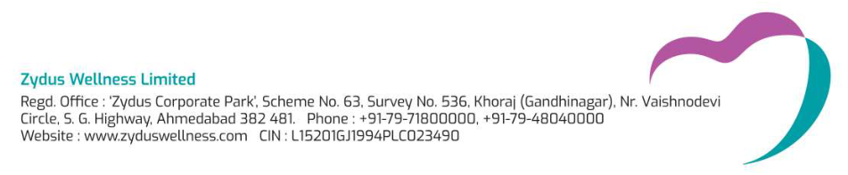

**[Image: March2026.pdf-0001-17.png (951x197, 81.5KB)]**

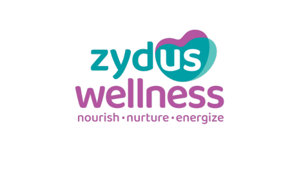

**[Image: March2026.pdf-0002-00.png (473x307, 21.4KB)]**

**[Image: March2026.pdf-0002-01.png (909x771, 341.5KB)]**

**Investor Presentation** March 2026 

**[Image: March2026.pdf-0003-00.png (202x142, 13.9KB)]**

**[Image: March2026.pdf-0003-01.png (2000x128, 49.1KB)]**

<!-- Start of picture text -->
Safe Harbour Statement <!-- End of picture text -->

This presentation contains certain forward-looking statements including those describing Zydus Wellness’s strategies, strategic direction, objectives, future prospects, estimates etc. Investors are cautioned that “forward looking statements” are based on certain expectations, assumptions, anticipated developments and other factors over which Zydus Wellness exercises no control. Hence, there is no representation, guarantee or warranty as to their accuracy, fairness or completeness of any information or opinion contained therein. Zydus Wellness undertakes no obligation to publicly update or revise any forward-looking statement. These statements involve a number of risks, uncertainties and other factors that could cause actual results or positions to differ materially from those that may be projected or implied by these forward-looking statements. Such risks and uncertainties include, but are not limited to: growth, competition, domestic and international economic conditions affecting demand, supply and price conditions in the various businesses in Zydus Wellness’s portfolio, changes in Government regulations, tax regimes and other statutes. This document is a presentation and is not intended to be a prospectus or offer for sale of securities. 

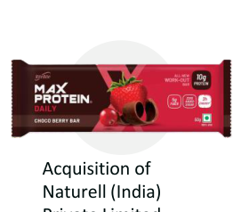

**[Image: March2026.pdf-0004-00.png (271x238, 47.0KB)]**

<!-- Start of picture text -->
Acquisition of Naturell (India) <!-- End of picture text -->

**[Image: March2026.pdf-0004-01.png (203x135, 57.6KB)]**

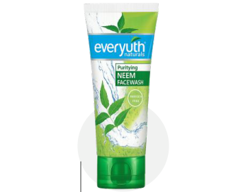

**[Image: March2026.pdf-0004-02.png (350x271, 59.3KB)]**

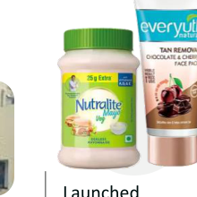

**[Image: March2026.pdf-0004-03.png (220x220, 67.7KB)]**

<!-- Start of picture text -->
Launched <!-- End of picture text -->

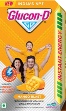

**[Image: March2026.pdf-0004-04.png (133x224, 74.9KB)]**

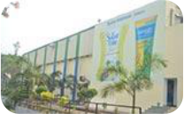

**[Image: March2026.pdf-0004-05.png (208x129, 54.5KB)]**

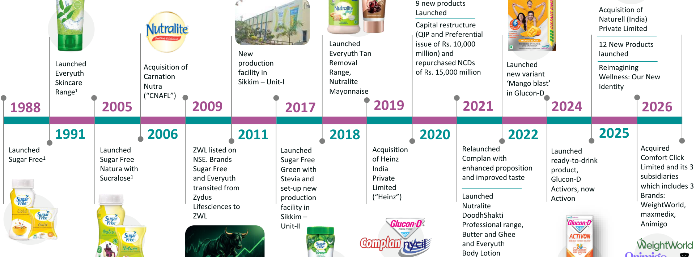

**[Image: March2026.pdf-0004-06.png (1924x713, 563.7KB)]**

<!-- Start of picture text -->
9 new products Launched Acquisition of Naturell (India) Capital restructure Private Limited (QIP and Preferential Launched  issue of Rs. 10,000  12 New Products New  Everyuth Tan  million) and  launched Launched  production  Removal  repurchased NCDs  Launched Acquisition of  Reimagining Everyuth  Carnation  facility in  Range,  of Rs. 15,000 million new variant  Wellness: Our New Skincare  Nutra  Sikkim – Unit-I Nutralite  ‘Mango blast’  Identity Range 1 Mayonnaise in Glucon-D (“CNAFL”) 1988 2005 2009 2017 2019 2021 2024 2026 1991 2006 2011 2018 2020 2022 2025 Launched  Launched  ZWL listed on  Launched  Acquisition  Relaunched  Launched  Acquired Sugar Free 1 Sugar Free  NSE. Brands  Sugar Free  of Heinz  Complan with  ready-to-drink  Comfort Click Natura with  Sugar Free  Green with  India  enhanced proposition  product,  Limited and its 3 Sucralose 1 and Everyuth  Stevia and  Private  and improved taste Glucon-D  subsidiaries transited from  set-up new  Limited  Activors, now  which includes 3 Zydus  production  (“Heinz”) Launched  Activon Brands: Lifesciences to  facility in  Nutralite  WeightWorld, ZWL Sikkim –  DoodhShakti  maxmedix, Unit-II Professional range,  Animigo Butter and Ghee and Everyuth Body Lotion <!-- End of picture text -->

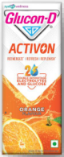

**[Image: March2026.pdf-0004-07.png (80x195, 33.5KB)]**

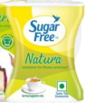

**[Image: March2026.pdf-0004-08.png (94x113, 25.5KB)]**

**[Image: March2026.pdf-0004-09.png (220x147, 53.9KB)]**

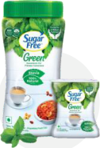

**[Image: March2026.pdf-0004-10.png (126x185, 46.7KB)]**

**[Image: March2026.pdf-0004-11.png (109x74, 6.8KB)]**

**[Image: March2026.pdf-0004-12.png (120x39, 4.0KB)]**

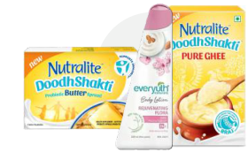

**[Image: March2026.pdf-0004-13.png (280x190, 81.5KB)]**

**[Image: March2026.pdf-0004-14.png (2000x170, 95.0KB)]**

<!-- Start of picture text -->
Key Milestones Note-1: Milestones that happened before Sugar Free and Everyuth hived off grom Zydus Lifesciences to Zydus Wellness <!-- End of picture text -->

**[Image: March2026.pdf-0005-00.png (2000x171, 646.7KB)]**

<!-- Start of picture text -->
Click for Corporate Video <!-- End of picture text -->

**[Image: March2026.pdf-0006-00.png (241x249, 108.7KB)]**

**[Image: March2026.pdf-0006-01.png (228x226, 81.3KB)]**

**[Image: March2026.pdf-0006-02.png (251x251, 82.5KB)]**

**[Image: March2026.pdf-0006-03.png (430x142, 26.1KB)]**

## **Board of Directors** 

###### **Mr. Akhil Monappa** 

**[Image: March2026.pdf-0006-06.png (203x207, 55.3KB)]**

###### **Dr. Sharvil P. Patel Non - Executive Chairman** 

###### **Independent Director** 

Mr. Akhil Monappa, Independent Director since May 2023, holds degrees from Harvard and Georgia Tech. Currently a Director at YAZZ Limited, Zydus Lifesciences Limited, Alidac UK Limited and Comfort Click Limited, he has a background in tech investments and governance, previously working with Generation Investment Management, Atlas Venture, and C-Bridge Internet <u>Solutions.</u> 

Dr. Sharvil Patel, Chairman and Non-Executive Director of our Company since April 2009, holds a bachelor's and doctorate in pharmaceutical science from the University of Sunderland, UK. With over two decades of experience in the pharmaceuticals industry, he serves as Managing Director of Zydus Lifesciences Limited. He has been conferred the ET Pharma leader of the year at the ET Healthworld India Pharma Awards 2022 and has been recognised as the Best CEO in the Lifesciences sector by Fortune India magazine 

###### **Mr. Srivishnu Raju Nandyala** 

**[Image: March2026.pdf-0006-12.png (199x198, 51.1KB)]**

###### **Independent Director** 

Mr. Srivishnu Raju, Independent Director since March 2019, holds degree in engineering and is a Harvard alumnus and a passionate cyclist. He is a Chairman and CEO of Exciga Group, which oversees investment companies investing in financial markets and real estate companies. He was also a a promoter of Raasi Cements and Ceramics. 

###### **Tarun Arora** 

###### **CEO & Whole Time Director** 

Mr. Tarun Arora, CEO and Whole Time Director since May 2015, is a Harvard (AMP) and IMT Ghaziabad (PGDBM) alumnus. With 30 years of experience in strategy, innovation, and brand building, he has led Danone Waters India and held key roles at Godrej, Sara Lee, Bharti Walmart, and Wipro. 

###### **Ms. Dharmishtaben N. Raval** 

**[Image: March2026.pdf-0006-19.png (203x207, 85.2KB)]**

###### **Independent Director** 

Ms. Dharmishtaben N. Raval, Independent Director since March 2019, is a distinguished lawyer with a master's in Commercial Laws. Practicing since 1980, she has served as SEBI's Executive Director - Legal and now practices at the Gujarat High Court and NCLT, Ahmedabad. She is empanelled as Panel Advocate with organizations like UTI, SBI, SEBI, GPCB, and IRDA. 

###### **Mr. Ganesh Nayak** 

###### **Non – Executive Director** 

**[Image: March2026.pdf-0006-24.png (199x205, 54.5KB)]**

###### **Mr. Kulin S. Lalbhai** 

Mr. Ganesh Nayak, Non–Executive Director since July 2006, is a Harvard General Manager Program graduate with over four decades of experience in the pharmaceuticals industry. He is the Director of Zydus Lifesciences Limited and working with Zydus Group since 1977. 

###### **Independent Director** 

Mr. Kulin Lalbhai, Independent Director since November 2016, holds a bachelor’s in Electrical Engineering from Stanford University and an MBA from Harvard Business School. He is the Executive Director of Arvind Limited, Chairman of Arvind Smart Spaces Limited, Non-Executive Director of The Anup Engineering Limited and has previously worked with McKinsey & Co. in Mumbai. He holds a leadership position in several industry bodies. 

**[Image: March2026.pdf-0007-00.png (202x142, 13.9KB)]**

**[Image: March2026.pdf-0007-01.png (2000x128, 47.7KB)]**

<!-- Start of picture text -->
Business Overview <!-- End of picture text -->

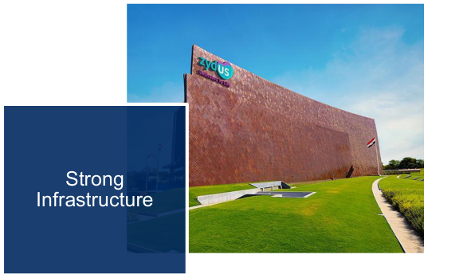

**[Image: March2026.pdf-0007-02.png (591x349, 222.1KB)]**

<!-- Start of picture text -->
Strong Infrastructure <!-- End of picture text -->

**[Image: March2026.pdf-0007-03.png (583x349, 282.4KB)]**

<!-- Start of picture text -->
1,600+ employees <!-- End of picture text -->

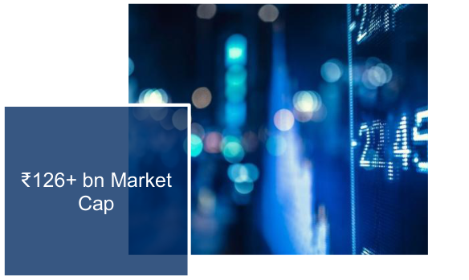

**[Image: March2026.pdf-0007-04.png (584x349, 227.6KB)]**

<!-- Start of picture text -->
₹126+ bn Market Cap <!-- End of picture text -->

**[Image: March2026.pdf-0007-05.png (376x251, 143.3KB)]**

**[Image: March2026.pdf-0007-06.png (146x48, 3.6KB)]**

<!-- Start of picture text -->
80,000 + shareholders <!-- End of picture text -->

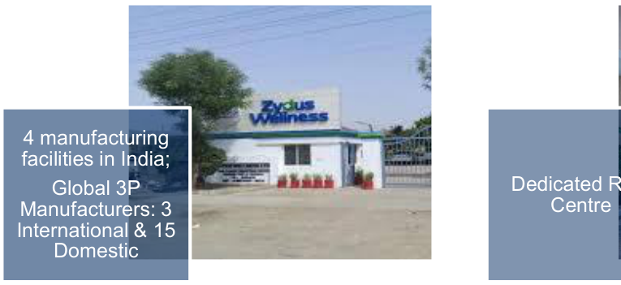

**[Image: March2026.pdf-0007-07.png (765x351, 190.5KB)]**

<!-- Start of picture text -->
4 manufacturing facilities in India; Global 3P Manufacturers: 3  Centre International & 15 Domestic <!-- End of picture text -->

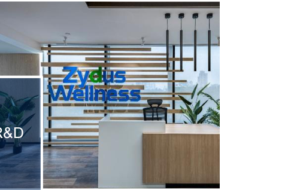

**[Image: March2026.pdf-0007-08.png (476x318, 211.2KB)]**

**[Image: March2026.pdf-0008-00.png (202x142, 13.9KB)]**

**[Image: March2026.pdf-0008-01.png (2000x128, 47.8KB)]**

<!-- Start of picture text -->
Business Overview <!-- End of picture text -->

**[Image: March2026.pdf-0008-02.png (370x478, 147.4KB)]**

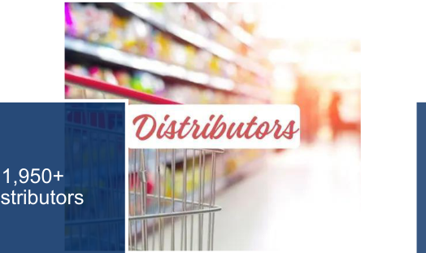

**[Image: March2026.pdf-0008-03.png (524x311, 213.7KB)]**

<!-- Start of picture text -->
1,950+ Distributors <!-- End of picture text -->

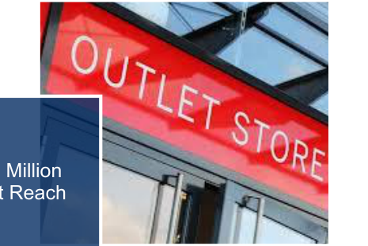

**[Image: March2026.pdf-0008-04.png (465x311, 259.5KB)]**

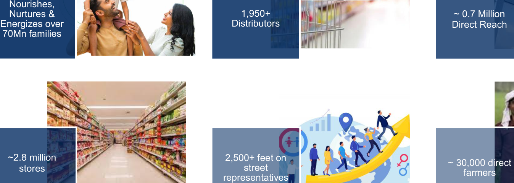

**[Image: March2026.pdf-0008-05.png (1347x482, 590.8KB)]**

<!-- Start of picture text -->
Nourishes, Nurtures &  1,950+ ~ 0.7 Million Energizes over  Distributors Direct Reach 70Mn families ~2.8 million  2,500+ feet on ~ 30,000 direct stores street farmers representatives <!-- End of picture text -->

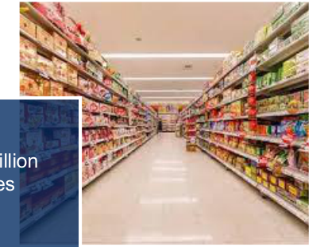

**[Image: March2026.pdf-0008-06.png (413x311, 221.2KB)]**

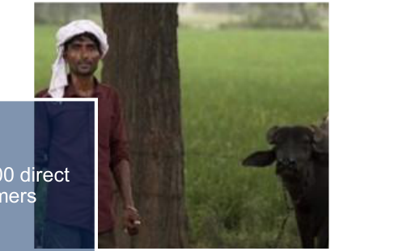

**[Image: March2026.pdf-0008-07.png (508x311, 183.0KB)]**

**[Image: March2026.pdf-0008-08.png (465x311, 137.8KB)]**

_Source: Nielsen Report/ Internal MIS_ 

**[Image: March2026.pdf-0009-00.png (202x142, 14.1KB)]**

**[Image: March2026.pdf-0009-01.png (2000x128, 62.0KB)]**

<!-- Start of picture text -->
A Future-Ready Company Aligned with Global Health & Wellness Trends <!-- End of picture text -->

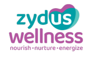

**[Image: March2026.pdf-0009-02.png (183x116, 11.4KB)]**

#### **GLOBAL TRENDS** 

#### **PROPOSITIONS** 

**[Image: March2026.pdf-0009-05.png (497x119, 21.5KB)]**

Leader in sugar substitutes, expanding into healthier cookies and chocolates 

Low Sugar/No Sugar 

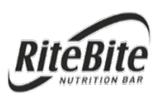

**[Image: March2026.pdf-0009-08.png (162x103, 12.0KB)]**

Full-spectrum protein portfolio covering bars, snacks & cookies for every occasion 

High Protein 

**[Image: March2026.pdf-0009-11.png (188x61, 24.2KB)]**

On the go Hydration/Energy 

**[Image: March2026.pdf-0009-13.png (161x96, 12.5KB)]**

**[Image: March2026.pdf-0009-14.png (243x55, 6.8KB)]**

Scaling RTD expansion across energy & hydration categories 

Functional Skin and Hair Care 

Active Lifestyle 

**[Image: March2026.pdf-0009-18.png (154x106, 6.9KB)]**

**[Image: March2026.pdf-0009-19.png (190x70, 9.7KB)]**

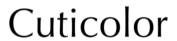

**[Image: March2026.pdf-0009-20.png (177x41, 4.1KB)]**

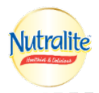

**[Image: March2026.pdf-0009-21.png (141x133, 15.9KB)]**

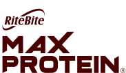

**[Image: March2026.pdf-0009-22.png (183x107, 4.8KB)]**

Natural ingredients led skin and hair care with functional benefits across multiple applications 

Portfolio designed for today’s active lifestyle consumer 

New Age Vitamins, Minerals and Supplements 

**[Image: March2026.pdf-0009-26.png (253x58, 8.3KB)]**

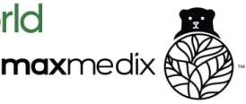

**[Image: March2026.pdf-0009-27.png (274x116, 16.5KB)]**

**[Image: March2026.pdf-0009-28.png (187x62, 6.3KB)]**

Rising consumer demand for natural, plantbased, and specialty nutritional supplements across human and pet health segments 

**[Image: March2026.pdf-0010-00.png (202x142, 13.9KB)]**

**[Image: March2026.pdf-0010-01.png (2000x128, 50.1KB)]**

<!-- Start of picture text -->
Key Financial Metrics – FY 25 <!-- End of picture text -->

###### **Revenue from Operations** 

###### **Personal Care** 

###### **Food & Nutrition** 

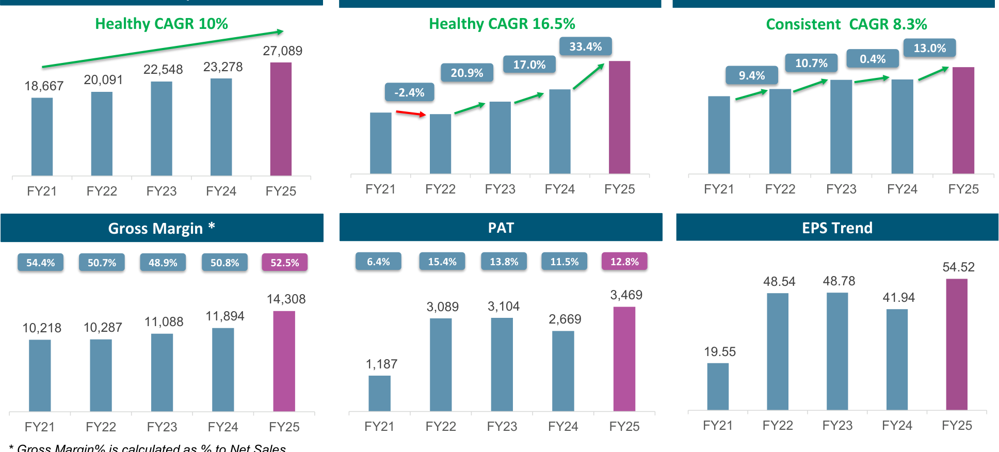

**[Image: March2026.pdf-0010-05.png (1936x876, 131.2KB)]**

<!-- Start of picture text -->
Healthy CAGR 10% Healthy CAGR 16.5% Consistent  CAGR 8.3% 27,089  33.4% 13.0% 0.4% 22,548  23,278  20.9% 17.0% 9.4% 10.7% 20,091 18,667 -2.4% FY21 FY22 FY23 FY24 FY25 FY21 FY22 FY23 FY24 FY25 FY21 FY22 FY23 FY24 FY25 Gross Margin *  PAT EPS Trend 54.4% 50.7% 48.9% 50.8% 52.5% 6.4% 15.4% 13.8% 11.5% 12.8% 54.52 48.54  48.78 14,308  3,469  41.94 3,089  3,104 11,088  11,894  2,669 10,218  10,287 19.55 1,187 FY21 FY22 FY23 FY24 FY25 FY21 FY22 FY23 FY24 FY25 FY21 FY22 FY23 FY24 FY25 <!-- End of picture text -->

_* Gross Margin% is calculated as % to Net Sales Above amounts are presented in ₹-million (mn)_ 

**[Image: March2026.pdf-0011-00.png (202x142, 13.9KB)]**

**[Image: March2026.pdf-0011-01.png (2000x128, 45.2KB)]**

<!-- Start of picture text -->
Key Input Trends <!-- End of picture text -->

**Milk Dextrose Monohydrate 25.6% vs. FY21 40.5% vs. FY21 16.0% vs. FY22 23.6% vs. FY22 -8.0% vs. FY23 14.1% vs. FY23 2.3% vs. FY24 8.4% vs. FY24** FY21 FY22 FY23 FY24 FY25 FY21 FY22 FY23 FY24 FY25 

###### **Stevia** 

**12.1% vs. FY21 7.8% vs. FY22 -24.3% vs. FY23 -6.4% vs. FY24** FY21 FY22 FY23 FY24 FY25 

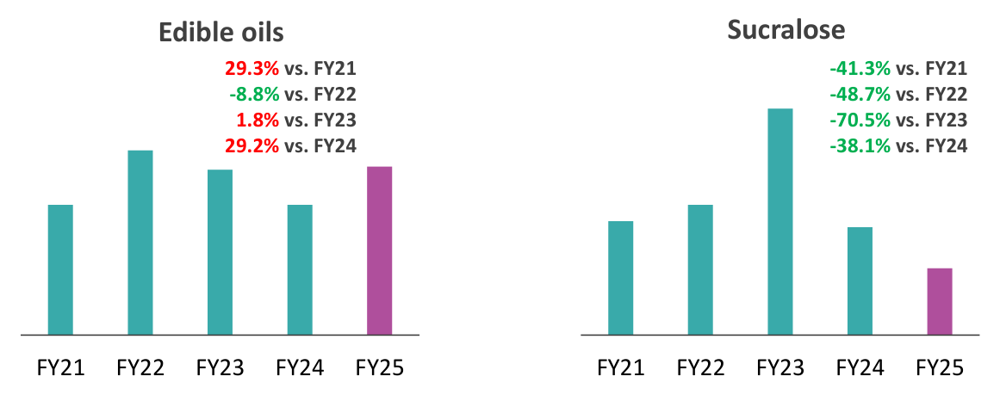

**[Image: March2026.pdf-0011-05.png (1161x459, 32.2KB)]**

<!-- Start of picture text -->
Edible oils Sucralose 29.3% vs. FY21  -41.3% vs. FY21 -8.8% vs. FY22 -48.7% vs. FY22 1.8% vs. FY23 -70.5% vs. FY23 29.2% vs. FY24 -38.1% vs. FY24 FY21 FY22 FY23 FY24 FY25 FY21 FY22 FY23 FY24 FY25 <!-- End of picture text -->

**[Image: March2026.pdf-0012-00.png (202x142, 13.9KB)]**

**[Image: March2026.pdf-0012-01.png (2000x128, 57.7KB)]**

<!-- Start of picture text -->
Revenue Performance Snapshot – YTD Dec’25 <!-- End of picture text -->

✓ Volume for the Q3 FY26 (excluding the newly acquired Comfort Click business) delivered double-digit growth 

- ✓ Sales for YTD FY26 (excluding the newly acquired Comfort Click business and seasonal brands) registered strong double-digit growth in the high teens, supported by mid-teen volume growth 

- ✓ On a like-to-like basis, the RiteBite business doubled its legacy performance and exceeded internal projections. 

- ✓ Comfort Click continues to deliver in line with expectations 

##### **Geographic Mix for YTD FY26** 

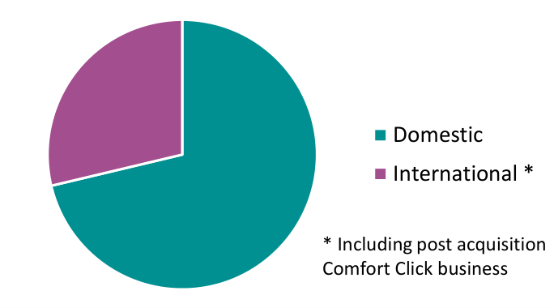

**[Image: March2026.pdf-0012-07.png (684x380, 20.4KB)]**

<!-- Start of picture text -->
Domestic International * * Including post acquisition Comfort Click business <!-- End of picture text -->

##### **Personal Care** 

##### **Food & Nutrition** 

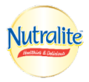

**[Image: March2026.pdf-0012-10.png (114x105, 9.8KB)]**

**[Image: March2026.pdf-0012-11.png (124x87, 11.0KB)]**

**[Image: March2026.pdf-0012-12.png (142x86, 10.7KB)]**

**[Image: March2026.pdf-0012-13.png (314x109, 13.3KB)]**

**[Image: March2026.pdf-0012-14.png (158x115, 17.2KB)]**

**[Image: March2026.pdf-0012-15.png (255x82, 14.9KB)]**

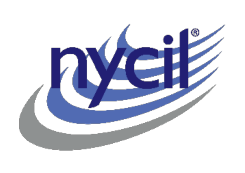

**[Image: March2026.pdf-0012-16.png (245x173, 11.3KB)]**

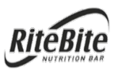

**[Image: March2026.pdf-0012-17.png (149x94, 10.6KB)]**

**[Image: March2026.pdf-0012-18.png (181x48, 6.5KB)]**

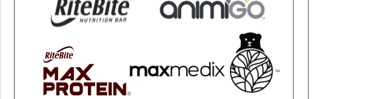

**[Image: March2026.pdf-0012-19.png (628x165, 34.7KB)]**

**[Image: March2026.pdf-0012-20.png (263x61, 7.0KB)]**

**[Image: March2026.pdf-0012-21.png (257x59, 8.5KB)]**

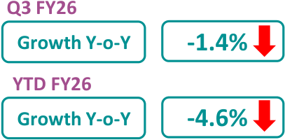

**[Image: March2026.pdf-0012-22.png (407x200, 13.5KB)]**

<!-- Start of picture text -->
Q3 FY26 Growth Y-o-Y -1.4% YTD FY26 Growth Y-o-Y -4.6% <!-- End of picture text -->

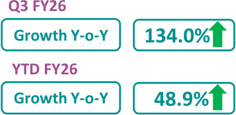

**[Image: March2026.pdf-0012-23.png (405x198, 14.3KB)]**

<!-- Start of picture text -->
Q3 FY26 Growth Y-o-Y 134.0% YTD FY26 Growth Y-o-Y 48.9% <!-- End of picture text -->

**[Image: March2026.pdf-0013-00.png (202x142, 13.9KB)]**

**[Image: March2026.pdf-0013-01.png (2000x128, 55.2KB)]**

<!-- Start of picture text -->
Gross Margin Performance Snapshot <!-- End of picture text -->

##### **Most brands recorded gross margin expansion, underscoring the strength of the portfolio, with the uplift further supported by the newly acquired brands.** 

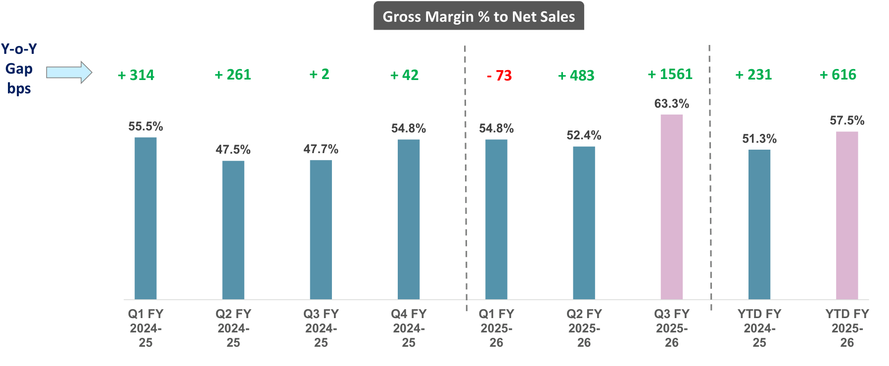

**[Image: March2026.pdf-0013-03.png (1797x741, 55.7KB)]**

<!-- Start of picture text -->
Gross Margin % to Net Sales Y-o-Y Gap  + 314 + 261 + 2 + 42 - 73 + 483 + 1561 + 231 + 616 bps 63.3% 57.5% 55.5% 54.8% 54.8% 52.4% 51.3% 47.5% 47.7% Q1 FY Q2 FY Q3 FY Q4 FY Q1 FY Q2 FY Q3 FY YTD FY YTD FY 2024- 2024- 2024- 2024- 2025- 2025- 2025- 2024- 2025- 25 25 25 25 26 26 26 25 26 <!-- End of picture text -->

**[Image: March2026.pdf-0014-00.png (202x142, 13.9KB)]**

**[Image: March2026.pdf-0014-01.png (2000x128, 56.3KB)]**

<!-- Start of picture text -->
Financial Highlights for the Q3 & YTD FY26 <!-- End of picture text -->

|**INR Million**|**Q3 FY26**|**Q3 FY25**|**Y-o-Y Growth %**|**YTD FY26 ***|**YTD FY25 *****|**Y-o-Y Growth %**|
|---|---|---|---|---|---|---|
|Net Sales|9,633|4,508|113.7%|24,639|17,806|38.4%|
|Revenue from operation|9,649|4,619|108.9%|24,763|17,958|37.9%|
|**Gross Contribution**|**6,118**|**2,263**|**170.3%**|14,291|9,294|**53.8%**|
|_(% of net sales)_|_63.3%_|_47.7%_|**+1561 bps**|_57.5%_|_51.3%_|**+616 bps**|
|**EBITDA**|**610**|**148**|**312.2%**|2,396|1,897|**26.3%**|
|EBITDA Margin|_6.3%_|_3.2%_||_9.7%_|_10.6%_||
|**PBT****|**(349)**|**101**|**-445.5%**|940|1,795|**-47.6%**|
|**PAT**|**(399)**|**64**|**-723.4%**|352|1,750|**-79.9%**|
|PAT Margin|_-4.1%_|_1.4%_||_1.4%_|_9.7%_||
|**Adjusted PAT ****|**(333)**|**64**|**-620.3%**|760|1,691|**-55.1%**|
|_Adjusted PAT Margin_|_-3.5%_|_1.4%_||_3.1%_|_9.4%_||

_* Results for YTD FY26 include the performance of Alidac UK Limited and its subsidiaries for a period of four month and two days_ 

- _** PBT & Adjusted PAT excludes exceptional items_ 

_*** Results for YTD FY25 includes the performance of RiteBite – Max Protein business for a period of one month_ 

- Other Operating Income declined YoY due to GST budgetary support of ~ INR 90 million recognized in Q3 FY25 

- Major impacts between EBITDA and PBT: 

   - The acquisition funded through a low-cost bridge loan (~5%), with interest included in finance costs (~ INR 371 million for the Q3 FY26) 

   - Amortization of acquired brands led to higher depreciation and amortization expenses (~ INR 472 million for the Q3 FY26) 

   - Exceptional items represent one-time impacts from implementation of the new labour code, acquisition-related costs, and expenses related to the liquidation of Naturell (India) Private Limited, a subsidiary of the Company, on a going-concern basis 

- The acquisition of Comfort Click is cash EPS-accretive, excluding exceptional items such as one-time acquisition-related costs 

**[Image: March2026.pdf-0015-00.png (2000x161, 47.5KB)]**

<!-- Start of picture text -->
Organisation Trends excl. newly acquired Comfort Click business <!-- End of picture text -->

##### **Organised Trade Saliency** 

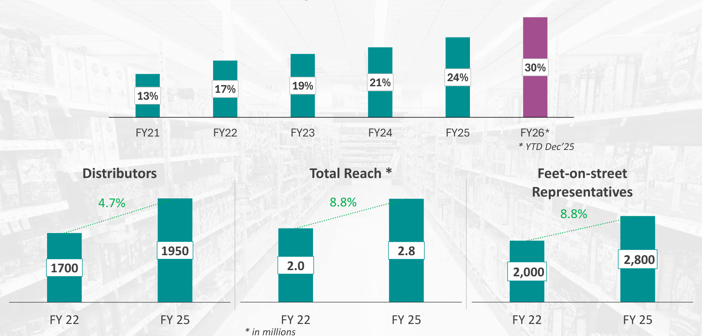

**[Image: March2026.pdf-0015-02.png (1924x923, 677.3KB)]**

<!-- Start of picture text -->
30% 24% 21% 19% 17% 13% FY21 FY22 FY23 FY24 FY25 FY26* * YTD Dec’25 Distributors Total Reach * Feet-on-street Representatives 4.7% 8.8% 8.8% 1950 2.8 2,800 2.0 1700 2,000 FY 22 FY 25 FY 22 FY 25 FY 22 FY 25 * in millions <!-- End of picture text -->

**[Image: March2026.pdf-0016-00.png (202x142, 13.9KB)]**

**[Image: March2026.pdf-0016-01.png (2000x128, 54.8KB)]**

<!-- Start of picture text -->
Driving Brand Dominance and Market Relevance <!-- End of picture text -->

**[Image: March2026.pdf-0016-02.png (223x80, 7.1KB)]**

**[Image: March2026.pdf-0016-03.png (147x104, 6.3KB)]**

**[Image: March2026.pdf-0016-04.png (139x87, 11.8KB)]**

**[Image: March2026.pdf-0016-05.png (131x95, 12.6KB)]**

**[Image: March2026.pdf-0016-06.png (227x85, 12.2KB)]**

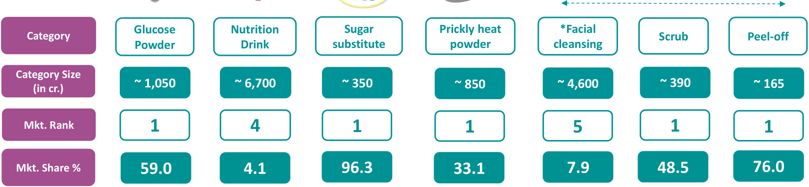

**[Image: March2026.pdf-0016-07.png (1716x398, 68.9KB)]**

<!-- Start of picture text -->
Glucose  Nutrition  Sugar  Prickly heat  *Facial Category Scrub Peel-off Powder Drink substitute powder cleansing Category Size ~ 1,050 1 ~ 6,7005 ~ 350 ~ 850 ~ 4,600 ~ 390 ~ 165 (in cr.) Mkt. Rank 1 4 1 1 5 1 1 Mkt. Share % 59.0 4.1 96.3 33.1 7.9 48.5 76.0 <!-- End of picture text -->

Category Size and Market share source: MAT Dec 2025 report as per Nielsen and IQVIA *Everyuth market rank 5 is at Total Facial cleansing segment which includes Face wash, Scrub, Peel-off, face masks 

**[Image: March2026.pdf-0016-09.png (134x92, 11.5KB)]**

**[Image: March2026.pdf-0016-10.png (261x111, 10.5KB)]**

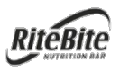

**[Image: March2026.pdf-0016-11.png (133x80, 8.2KB)]**

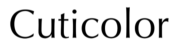

**[Image: March2026.pdf-0016-12.png (178x42, 4.1KB)]**

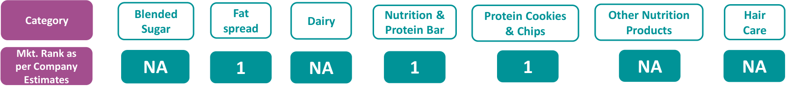

**[Image: March2026.pdf-0016-13.png (1681x186, 37.9KB)]**

<!-- Start of picture text -->
Blended  Fat  Nutrition &  Protein Cookies  Other Nutrition  Hair Category Dairy Sugar spread Protein Bar & Chips Products Care Mkt. Rank as per Company  NA 1 NA 1 1 NA NA Estimates <!-- End of picture text -->

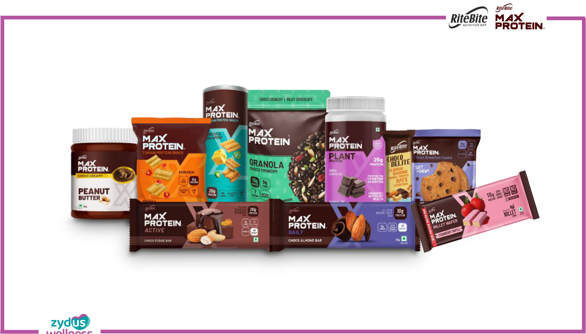

**[Image: March2026.pdf-0017-00.png (1857x1062, 1301.0KB)]**

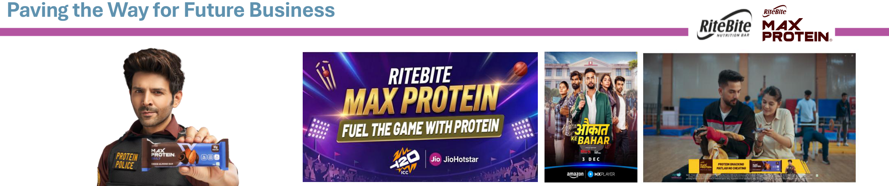

**[Image: March2026.pdf-0018-00.png (2000x421, 984.9KB)]**

<!-- Start of picture text -->
Paving the Way for Future Business <!-- End of picture text -->

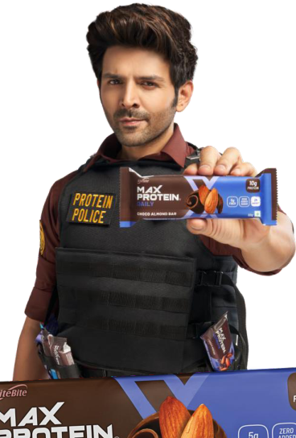

**[Image: March2026.pdf-0018-01.png (368x544, 257.7KB)]**

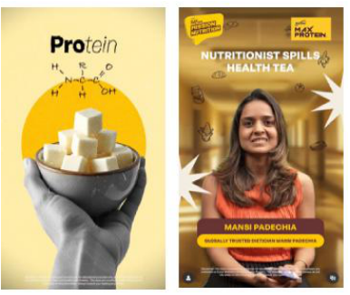

**[Image: March2026.pdf-0018-02.png (386x326, 247.3KB)]**

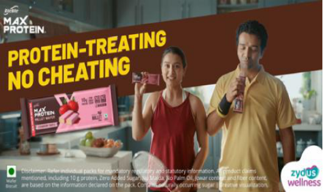

**[Image: March2026.pdf-0018-03.png (530x315, 353.6KB)]**

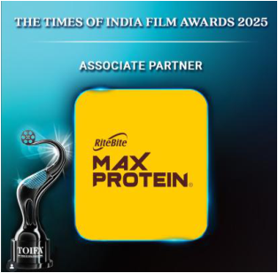

**[Image: March2026.pdf-0018-04.png (314x309, 125.7KB)]**

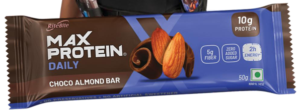

**[Image: March2026.pdf-0018-05.png (594x223, 202.4KB)]**

- One year post acquisition, Ritebite Maxprotien business continues to significantly outperform internal projections with strong volume and value growth. 

- Max Protein maintains high momentum and leadership in protein snacking. 

- EBITDA has improved from neutral at the time of acquisition to a nearing double-digit, supported by integration synergies, scale and margin efficiencies. 

- The acquisition is proving operating margin-accretive and has strengthened the Company’s participation in the fast-growing protein consumption trend. 

- Recently launched Wafer Bar continues to contribute to category growth and market expansion. 

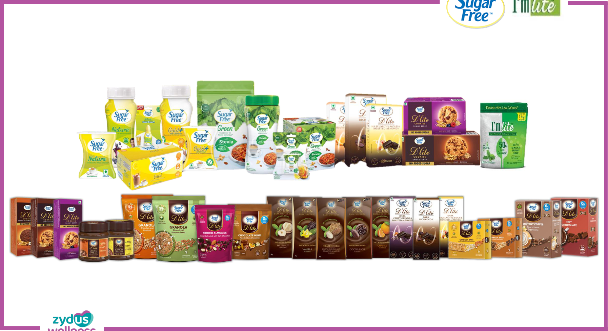

**[Image: March2026.pdf-0019-00.png (1854x1012, 1611.3KB)]**

**[Image: March2026.pdf-0020-00.png (184x135, 29.9KB)]**

**[Image: March2026.pdf-0020-01.png (179x127, 21.2KB)]**

#### **Sugar Free & I’m lite - Shaping the Future of Everyday Wellness** 

**[Image: March2026.pdf-0020-03.png (1517x707, 1470.1KB)]**

<!-- Start of picture text -->
❖ traction in the market ❖ ❖ ❖ 95.9% 95.8% <!-- End of picture text -->

- ❖ Sugar Free Gold+ with Sucralose + Chromium, supporting normal blood sugar levels is showing positive traction in the market 

- ❖ Sugar Free Green has maintained a double-digit growth trajectory for the past 19 consecutive quarters 

- ❖ I’m Lite is steadily regaining growth traction and returning to its pre-litigation performance levels 

- ❖ Campaigns launched with popular celebrities like Shahid Kapoor, Katrina Kaif, Janhvi Kapoor and Malaika Arora 

###### **<mark>Sugar Substitute excl. I’m Lite and D’Lite range</mark>** 

###### **Category Size & Market Share** 

**[Image: March2026.pdf-0020-10.png (74x48, 1.8KB)]**

<!-- Start of picture text -->
96.0% <!-- End of picture text -->

**[Image: March2026.pdf-0020-11.png (73x48, 1.8KB)]**

<!-- Start of picture text -->
95.4% <!-- End of picture text -->

**[Image: March2026.pdf-0020-12.png (74x48, 1.8KB)]**

<!-- Start of picture text -->
96.3% <!-- End of picture text -->

**[Image: March2026.pdf-0020-13.png (676x370, 33.2KB)]**

<!-- Start of picture text -->
95.9% 95.8% 96.0% 95.4% 96.3% 1.6% 365 347 337 326  324 Dec'21 Dec'22 Dec'23 Dec'24 Dec'25 INR in crores Source: MAT Dec 2025 report as per Nielsen and IQVIA <!-- End of picture text -->

**[Image: March2026.pdf-0020-14.png (530x311, 314.3KB)]**

**[Image: March2026.pdf-0020-15.png (632x311, 334.2KB)]**

**[Image: March2026.pdf-0021-00.png (1857x1014, 1626.8KB)]**

#### **Revamping the core and capturing the future growth** 

**[Image: March2026.pdf-0022-01.png (951x570, 387.5KB)]**

<!-- Start of picture text -->
Magnesium Improving Supports Muscle  the core Recovery formulation to drive perception of Vitamin C & Zinc ‘Holistic Supports Immunity Recovery & Immunity’ Glucose along with For instant  ‘Instant Re-Activating energy  Sun-sucker  Energy’ mascot <!-- End of picture text -->

**[Image: March2026.pdf-0022-02.png (220x461, 19.2KB)]**

<!-- Start of picture text -->
Improving the core formulation to drive perception of ‘Holistic Recovery & Immunity’ along with ‘Instant Energy’ <!-- End of picture text -->

**[Image: March2026.pdf-0022-03.png (142x103, 9.2KB)]**

**[Image: March2026.pdf-0022-04.png (122x94, 6.9KB)]**

**[Image: March2026.pdf-0022-05.png (415x120, 13.1KB)]**

<!-- Start of picture text -->
Glucose For instant <!-- End of picture text -->

**Glucon-D’s entry in Performance Hydration** 

**[Image: March2026.pdf-0022-07.png (357x188, 13.9KB)]**

<!-- Start of picture text -->
Glucose + Electrolytes Vitamins, Minerals Endurance Performance Supports Immunity Energy Release <!-- End of picture text -->

**[Image: March2026.pdf-0022-08.png (156x305, 70.0KB)]**

**[Image: March2026.pdf-0022-09.png (251x370, 193.4KB)]**

**[Image: March2026.pdf-0022-10.png (350x148, 22.3KB)]**

**[Image: March2026.pdf-0022-11.png (357x176, 13.2KB)]**

<!-- Start of picture text -->
Electrolytes Vitamins, Minerals Energy Release Supports Immunity, NO ADDED SUGAR <!-- End of picture text -->

**[Image: March2026.pdf-0022-12.png (148x120, 9.8KB)]**

**[Image: March2026.pdf-0022-13.png (370x116, 17.1KB)]**

<!-- Start of picture text -->
Energy +  Hydration Hydration Formula Formula <!-- End of picture text -->

**[Image: March2026.pdf-0022-14.png (357x63, 5.4KB)]**

<!-- Start of picture text -->
Zero Caffeine Formulations <!-- End of picture text -->

**[Image: March2026.pdf-0022-15.png (187x109, 12.1KB)]**

###### **<mark>Glucose Powder</mark>** 

**[Image: March2026.pdf-0022-17.png (73x48, 1.8KB)]**

<!-- Start of picture text -->
58.3% <!-- End of picture text -->

**[Image: March2026.pdf-0022-18.png (73x48, 1.7KB)]**

<!-- Start of picture text -->
59.9% <!-- End of picture text -->

**[Image: March2026.pdf-0022-19.png (73x48, 1.7KB)]**

<!-- Start of picture text -->
60.0% <!-- End of picture text -->

**[Image: March2026.pdf-0022-20.png (73x48, 1.8KB)]**

<!-- Start of picture text -->
58.9% <!-- End of picture text -->

**[Image: March2026.pdf-0022-21.png (74x48, 1.8KB)]**

<!-- Start of picture text -->
59.0% <!-- End of picture text -->

**[Image: March2026.pdf-0022-22.png (744x340, 23.3KB)]**

<!-- Start of picture text -->
58.3% 59.9% 60.0% 58.9% 59.0% 6.1% 1,107 1,043 930 892 824 Dec'21 Dec'22 Dec'23 Dec'24 Dec'25 <!-- End of picture text -->

###### _INR in crores_ 

_Source: MAT Dec 2025 report as per Nielsen and IQVIA_ 

**[Image: March2026.pdf-0022-25.png (171x415, 141.0KB)]**

###### **GD Activon** 

Innovation-led interventions and activation programs are slated to lift category engagement and support share gains entering the seasonal window 

GD Activon replaces GD Activors 

**[Image: March2026.pdf-0022-29.png (321x282, 66.0KB)]**

**[Image: March2026.pdf-0023-00.png (1856x1012, 1790.4KB)]**

#### **Reinforcing Brand Strength in a Tough Market** 

**[Image: March2026.pdf-0024-01.png (2000x128, 68.5KB)]**

<!-- Start of picture text -->
Reinforcing Brand Strength in a Tough Market STRENGTHEN CORE <!-- End of picture text -->

**[Image: March2026.pdf-0024-02.png (202x289, 97.7KB)]**

**[Image: March2026.pdf-0024-03.png (594x951, 1138.1KB)]**

###### **STRENGTHEN CORE** 

- ❖ Recently, Complan improved its ranking to fourth position, holding a 4.1%* market share. 

Unlocking significant value 

- ❖ Going forward, building on the strong brand equity, we plan to reframe Complan’s participation in the nutrition space with a set of relaunches and new product introductions to be more relevant for contemporary need states. 

**[Image: March2026.pdf-0024-08.png (563x247, 223.8KB)]**

**[Image: March2026.pdf-0024-09.png (232x310, 132.5KB)]**

- ❖ Click for Complan Ad Film 

###### **Acquire New Users** 

###### **<mark>Nutrition Drink</mark>** 

Building toddler range and entry in new format 

###### **Category Size & Market Share** 

**[Image: March2026.pdf-0024-15.png (73x48, 1.6KB)]**

<!-- Start of picture text -->
4.5% <!-- End of picture text -->

**[Image: March2026.pdf-0024-16.png (74x48, 1.6KB)]**

<!-- Start of picture text -->
4.3% <!-- End of picture text -->

**[Image: March2026.pdf-0024-17.png (73x48, 1.5KB)]**

<!-- Start of picture text -->
4.1% <!-- End of picture text -->

**[Image: March2026.pdf-0024-18.png (73x48, 1.5KB)]**

<!-- Start of picture text -->
4.1% <!-- End of picture text -->

**[Image: March2026.pdf-0024-19.png (709x358, 22.2KB)]**

<!-- Start of picture text -->
4.5% 4.3% 4.1% 4.1% 0.2% 7,173 7,056 6,708 6,671 Dec'22 Dec'23 Dec'24 Dec'25 INR in crores <!-- End of picture text -->

###### **Build Adult Nutrition** 

**[Image: March2026.pdf-0024-21.png (223x276, 88.5KB)]**

Building adult nutrition 

_Source: MAT Dec 2025 report as per Nielsen and IQVIA_ A significant portion of business has moved to online platforms, which is not reflected in the above table 

**[Image: March2026.pdf-0025-00.png (1855x1012, 1151.5KB)]**

#### **Driving Category Growth by Adding New Consumers** 

**[Image: March2026.pdf-0026-01.png (222x76, 7.1KB)]**

**[Image: March2026.pdf-0026-02.png (2000x989, 2233.5KB)]**

<!-- Start of picture text -->
❖ Achieved double-digit growth in YTD FY26, supported mainly by product excellence, innovation, strong distribution, and customer-centric experiences. ❖ TAN Removal continues to witness strong growth and increased its saliency within the brand. The recent launch of D-Tan Facewash further strengthens the brand’s presence in this segment. ❖ Continued to expand the user base through superior offerings and impactful, targeted marketing campaigns. D-Tan Facewash Launch <!-- End of picture text -->

**Brand Market Share Evolution and Category Growth** 

**[Image: March2026.pdf-0027-01.png (222x76, 7.1KB)]**

**[Image: March2026.pdf-0027-02.png (2000x947, 126.2KB)]**

<!-- Start of picture text -->
Overall Facial Cleansing Face Scrub Peel Off Category Size & Market Share Category Size & Market Share Category Size & Market Share 6.4% 6.4% 6.2% 7.2% 7.9% 40.2% 41.8% 44.4% 47.3% 48.5% 78.1% 78.4% 79.5% 77.8% 76.0% 13.2% 15.3% 17.2% 4,605  391  165 4,206 327 139 3,484 3,050  253 2,799  221  235  94  97 88 Dec'21 Dec'22 Dec'23 Dec'24 Dec'25 Dec'21 Dec'22 Dec'23 Dec'24 Dec'25 Dec'21 Dec'22 Dec'23 Dec'24 Dec'25 Face Wash Wash Off Category Size & Market Share Category Size & Market Share 0.7% 0.8% 0.6% 5.6% 10.6% 18.0% 3,764 3,480 2,918  134 121 106 Dec'23 Dec'24 Dec'25 Dec'23 Dec'24 Dec'25 <!-- End of picture text -->

_Source: MAT Dec 2025 report as per Nielsen and IQVIA_ **Everyuth recently entered into Sheet Mask cataegory** 

_INR in ~ crores_ 

**[Image: March2026.pdf-0028-00.png (1857x1012, 1430.3KB)]**

**[Image: March2026.pdf-0029-00.png (330x135, 9.0KB)]**

#### **Strategic Levers Intact to Drive Category and Consumer Growth** 

###### **<mark>Prickly Heat Powder</mark>** 

- ❖ A legacy brand with over five decades of consumer trust. 

**[Image: March2026.pdf-0029-04.png (90x46, 2.1KB)]**

<!-- Start of picture text -->
33.9% <!-- End of picture text -->

**[Image: March2026.pdf-0029-05.png (90x46, 2.0KB)]**

<!-- Start of picture text -->
35.1% <!-- End of picture text -->

**[Image: March2026.pdf-0029-06.png (90x46, 2.0KB)]**

<!-- Start of picture text -->
35.1% <!-- End of picture text -->

**[Image: March2026.pdf-0029-07.png (90x46, 2.0KB)]**

<!-- Start of picture text -->
33.9% <!-- End of picture text -->

**[Image: March2026.pdf-0029-08.png (90x46, 2.0KB)]**

<!-- Start of picture text -->
33.1% <!-- End of picture text -->

**[Image: March2026.pdf-0029-09.png (774x336, 33.0KB)]**

<!-- Start of picture text -->
33.9% 35.1% 35.1% 33.9% 33.1% 7.3% 891 833 710  725 628 Dec'21 Dec'22 Dec'23 Dec'24 Dec'25 Source: MAT Dec 2025 report as per Nielsen and IQVIA INR in crores <!-- End of picture text -->

- ❖ Positioned for healthy skin with an effective antibacterial formulation, Nycil continues to lead the prickly heat powder category with 100% consumer awareness. 

- ❖ Built on its proven germ-fighter proposition, the brand offers protection against sweat, body odour, rashes, itching, and heat-related discomfort. 

**[Image: March2026.pdf-0029-12.png (870x480, 513.8KB)]**

- ❖ Performance during YTD FY26 was impacted by seasonal headwinds affecting both the brand and the broader category. 

- ❖ Nycil is gearing up to strengthen brand communication and scale mass-market activations in the coming period, with a focused objective of enhancing household penetration and expanding its retail reach. 

**[Image: March2026.pdf-0030-00.png (1559x1013, 1481.2KB)]**

**[Image: March2026.pdf-0030-01.png (143x138, 14.3KB)]**

**[Image: March2026.pdf-0030-02.png (126x1009, 2.3KB)]**

#### **Building Lifelong Consumer Relationships** 

**[Image: March2026.pdf-0031-01.png (395x461, 358.5KB)]**

**[Image: March2026.pdf-0031-02.png (312x461, 313.8KB)]**

**[Image: March2026.pdf-0031-03.png (285x461, 305.9KB)]**

**[Image: March2026.pdf-0031-04.png (724x403, 582.7KB)]**

**[Image: March2026.pdf-0031-05.png (285x403, 184.1KB)]**

**[Image: March2026.pdf-0031-06.png (163x159, 18.0KB)]**

- ❖ Expanded the portfolio through focused innovation and strong B2B/B2C execution. 

- ❖ Delivered double-digit growth with a 6-year CAGR^ across the portfolio. 

- ❖ Sustained momentum via digital media, e-commerce activations, and large-scale consumer sampling. 

- ❖ Leader in premium cholesterol fat-free spread 

- ❖ Dairy Segment offering pure ghee from the land of Braj under Nutralite DoodhShakti range 

**[Image: March2026.pdf-0031-12.png (196x196, 27.1KB)]**

- ❖ Strengthened consumer engagement through an AI-powered recipe platform enabling instant suggestions via food photo uploads or WhatsApp dish queries. 

**[Image: March2026.pdf-0031-14.png (296x293, 105.1KB)]**

**[Image: March2026.pdf-0031-15.png (291x288, 109.1KB)]**

**Last Quarter Launches** 

**[Image: March2026.pdf-0032-00.png (1857x1013, 1273.1KB)]**

#### **Marketing and Distribution Initiated in the Organised Channel** 

**[Image: March2026.pdf-0033-01.png (205x53, 6.6KB)]**

**Authority Korean Heritage + Doctor Trust** 

###### **Differentiation** 

**Scalp-Friendly v/s Chemical** 

**[Image: March2026.pdf-0033-05.png (759x449, 399.6KB)]**

No.1 Doctor prescribed hair color is free from ammonia, PPD, and harmful chemicals, providing a safe and gentle color experience for healthy hair 

Establish Cuticolor as the only ‘Made in Korea’ Hair color trusted by Indian doctors 

No Ammonia/ No PPD 

**[Image: March2026.pdf-0033-09.png (1161x340, 379.8KB)]**

**Visibility** 

###### **Innovation** 

**Clinical + Luxury** 

**Funnel Entry & Expansion** 

Build clinical yet luxurious positioning with on platform visibility & PDP assets 

Funnel Entry & Expansion 

**[Image: March2026.pdf-0033-16.png (292x301, 92.0KB)]**

**[Image: March2026.pdf-0033-17.png (528x293, 251.4KB)]**

**[Image: March2026.pdf-0033-18.png (216x252, 99.4KB)]**

**[Image: March2026.pdf-0034-00.png (202x135, 15.6KB)]**

**[Image: March2026.pdf-0034-01.png (2000x124, 55.3KB)]**

<!-- Start of picture text -->
Building a Stronger International Portfolio <!-- End of picture text -->

**[Image: March2026.pdf-0034-02.png (1065x1001, 1336.6KB)]**

- ❖ RiteBite – Max Protein strengthened its global presence by expanding into two more countries, taking its reach to nine international markets in year one, underpinned by strong initial market response. 

- ❖ Sugar Free, Complan, RiteBite - Max Protein and Nycil contributes a significant portion of the overall business 

###### **Market Geography for YTD FY26** 

**[Image: March2026.pdf-0034-06.png (824x449, 36.2KB)]**

<!-- Start of picture text -->
SAARC (excluding India) GCC African Countries Others * * Mainly includes New Zealand, Singapore, Mauritius, Morrocco, etc. <!-- End of picture text -->

**(Excluding Comfort Click Business)** 

**[Image: March2026.pdf-0034-08.png (440x17, 2.7KB)]**

**[Image: March2026.pdf-0035-00.png (1857x1013, 1566.4KB)]**

**[Image: March2026.pdf-0036-00.png (202x142, 13.9KB)]**

**[Image: March2026.pdf-0036-01.png (2000x128, 58.4KB)]**

<!-- Start of picture text -->
Enhancing Global Market Access Through Acquired Brands <!-- End of picture text -->

**[Image: March2026.pdf-0036-02.png (1066x332, 52.5KB)]**

<!-- Start of picture text -->
Revenue Overview Amazon Ratings in Top Markets UK Germany Weight World France Animigo maxmedix Spain > 4.6 / 5.0 Italy <!-- End of picture text -->

###### **Revenue (GBP in million)** 

**[Image: March2026.pdf-0036-04.png (124x167, 4.4KB)]**

**[Image: March2026.pdf-0036-05.png (594x355, 23.3KB)]**

<!-- Start of picture text -->
134 85 52 FY 23 FY 24 FY 25 * * Unaudited for the financial year ended on 30 Jun 2025 Delivered ~57% CAGR over 5 years with EBITDA of ~GBP 21 mn <!-- End of picture text -->

**Alidac UK Limited, a wholly owned subsidiary of Zydus Wellness Limited, has completed the re-financing of its existing GBP denominated loan facility into a Euro loan, which is expected to significantly reduce the interest cost and aligns with company's majority of cash flow generation, thereby eliminating currency exposure risk.** 

**[Image: March2026.pdf-0036-07.png (605x426, 26.4KB)]**

<!-- Start of picture text -->
Channel wise Sales Overview Market Place D2C Wholesale <!-- End of picture text -->

**[Image: March2026.pdf-0036-08.png (606x426, 26.3KB)]**

<!-- Start of picture text -->
Supplier Overview Europe & UK China India Other <!-- End of picture text -->

**[Image: March2026.pdf-0036-09.png (601x396, 20.7KB)]**

<!-- Start of picture text -->
Employees IND UK IE OTH <!-- End of picture text -->

**[Image: March2026.pdf-0037-00.png (203x136, 15.6KB)]**

### **Global Footprint Established Across Key Markets** 

**[Image: March2026.pdf-0037-02.png (128x99, 6.0KB)]**

**[Image: March2026.pdf-0037-03.png (164x109, 3.8KB)]**

**[Image: March2026.pdf-0037-04.png (134x93, 2.6KB)]**

**[Image: March2026.pdf-0037-05.png (138x95, 6.6KB)]**

**[Image: March2026.pdf-0037-06.png (134x91, 4.5KB)]**

**[Image: March2026.pdf-0037-07.png (142x87, 2.3KB)]**

**[Image: March2026.pdf-0037-08.png (143x87, 2.9KB)]**

**[Image: March2026.pdf-0037-09.png (141x87, 9.4KB)]**

**[Image: March2026.pdf-0037-10.png (140x87, 1.5KB)]**

India Bahrain Bangladesh Bhutan Hong Kong Kuwait Lebanon Maldives Malaysia United Arab Emirates Myanmar Nepal Oman Qatar Saudi Arabia Sri Lanka Taiwan Nigeria Kenya Mauritius Ethiopia South Africa Tanzania Uganda Zimbabwe New Zealand Australia United Kingdom Germany Spain Italy France Netherlands Sweden Denmark Belgium Ireland Poland Finland Portugal United States of America 

**[Image: March2026.pdf-0037-12.png (116x73, 0.7KB)]**

**[Image: March2026.pdf-0037-13.png (440x17, 2.7KB)]**

**[Image: March2026.pdf-0038-00.png (202x135, 15.6KB)]**

**[Image: March2026.pdf-0038-01.png (2000x124, 53.6KB)]**

<!-- Start of picture text -->
Ever Highest S&P Global ESG Score <!-- End of picture text -->

_Zydus Wellness has secured 99 percentile among 331 global companies in the same industry group of FOA food products_ 

**[Image: March2026.pdf-0038-03.png (242x121, 3.9KB)]**

**[Image: March2026.pdf-0038-04.png (67x70, 1.2KB)]**

||2022|2023|2024|2025|YoY Improvement CSA Score|
|---|---|---|---|---|---|
|Total ESG Score|38|58|79|84|+6.3%|
|Environmental|28|49|78|88|+12.8%|
|Social|42|63|85|83|-2.3%|
|Governance & Economic|43|63|73|79|+8.2%|

**#3 highest globally as of 24/10/2025 – FOA food products** 

**[Image: March2026.pdf-0038-07.png (596x153, 49.7KB)]**

**[Image: March2026.pdf-0038-08.png (682x470, 179.1KB)]**

**[Image: March2026.pdf-0038-09.png (440x17, 2.7KB)]**

# THANK YOU 

**[Image: March2026.pdf-0039-01.png (188x130, 5.1KB)]**

**[Image: March2026.pdf-0039-02.png (242x153, 16.2KB)]**

---

## Extracted Images

| # | File | Dimensions | Size |
|---|------|------------|------|
| 1 | March2026.pdf-0001-00.png | 286x176 | 64.6KB |
| 2 | March2026.pdf-0001-17.png | 951x197 | 81.5KB |
| 3 | March2026.pdf-0002-00.png | 473x307 | 21.4KB |
| 4 | March2026.pdf-0002-01.png | 909x771 | 341.5KB |
| 5 | March2026.pdf-0003-00.png | 202x142 | 13.9KB |
| 6 | March2026.pdf-0003-01.png | 2000x128 | 49.1KB |
| 7 | March2026.pdf-0004-00.png | 271x238 | 47.0KB |
| 8 | March2026.pdf-0004-01.png | 203x135 | 57.6KB |
| 9 | March2026.pdf-0004-02.png | 350x271 | 59.3KB |
| 10 | March2026.pdf-0004-03.png | 220x220 | 67.7KB |
| 11 | March2026.pdf-0004-04.png | 133x224 | 74.9KB |
| 12 | March2026.pdf-0004-05.png | 208x129 | 54.5KB |
| 13 | March2026.pdf-0004-06.png | 1924x713 | 563.7KB |
| 14 | March2026.pdf-0004-07.png | 80x195 | 33.5KB |
| 15 | March2026.pdf-0004-08.png | 94x113 | 25.5KB |
| 16 | March2026.pdf-0004-09.png | 220x147 | 53.9KB |
| 17 | March2026.pdf-0004-10.png | 126x185 | 46.7KB |
| 18 | March2026.pdf-0004-11.png | 109x74 | 6.8KB |
| 19 | March2026.pdf-0004-12.png | 120x39 | 4.0KB |
| 20 | March2026.pdf-0004-13.png | 280x190 | 81.5KB |
| 21 | March2026.pdf-0004-14.png | 2000x170 | 95.0KB |
| 22 | March2026.pdf-0005-00.png | 2000x171 | 646.7KB |
| 23 | March2026.pdf-0006-00.png | 241x249 | 108.7KB |
| 24 | March2026.pdf-0006-01.png | 228x226 | 81.3KB |
| 25 | March2026.pdf-0006-02.png | 251x251 | 82.5KB |
| 26 | March2026.pdf-0006-03.png | 430x142 | 26.1KB |
| 27 | March2026.pdf-0006-06.png | 203x207 | 55.3KB |
| 28 | March2026.pdf-0006-12.png | 199x198 | 51.1KB |
| 29 | March2026.pdf-0006-19.png | 203x207 | 85.2KB |
| 30 | March2026.pdf-0006-24.png | 199x205 | 54.5KB |
| 31 | March2026.pdf-0007-00.png | 202x142 | 13.9KB |
| 32 | March2026.pdf-0007-01.png | 2000x128 | 47.7KB |
| 33 | March2026.pdf-0007-02.png | 591x349 | 222.1KB |
| 34 | March2026.pdf-0007-03.png | 583x349 | 282.4KB |
| 35 | March2026.pdf-0007-04.png | 584x349 | 227.6KB |
| 36 | March2026.pdf-0007-05.png | 376x251 | 143.3KB |
| 37 | March2026.pdf-0007-06.png | 146x48 | 3.6KB |
| 38 | March2026.pdf-0007-07.png | 765x351 | 190.5KB |
| 39 | March2026.pdf-0007-08.png | 476x318 | 211.2KB |
| 40 | March2026.pdf-0008-00.png | 202x142 | 13.9KB |
| 41 | March2026.pdf-0008-01.png | 2000x128 | 47.8KB |
| 42 | March2026.pdf-0008-02.png | 370x478 | 147.4KB |
| 43 | March2026.pdf-0008-03.png | 524x311 | 213.7KB |
| 44 | March2026.pdf-0008-04.png | 465x311 | 259.5KB |
| 45 | March2026.pdf-0008-05.png | 1347x482 | 590.8KB |
| 46 | March2026.pdf-0008-06.png | 413x311 | 221.2KB |
| 47 | March2026.pdf-0008-07.png | 508x311 | 183.0KB |
| 48 | March2026.pdf-0008-08.png | 465x311 | 137.8KB |
| 49 | March2026.pdf-0009-00.png | 202x142 | 14.1KB |
| 50 | March2026.pdf-0009-01.png | 2000x128 | 62.0KB |
| 51 | March2026.pdf-0009-02.png | 183x116 | 11.4KB |
| 52 | March2026.pdf-0009-05.png | 497x119 | 21.5KB |
| 53 | March2026.pdf-0009-08.png | 162x103 | 12.0KB |
| 54 | March2026.pdf-0009-11.png | 188x61 | 24.2KB |
| 55 | March2026.pdf-0009-13.png | 161x96 | 12.5KB |
| 56 | March2026.pdf-0009-14.png | 243x55 | 6.8KB |
| 57 | March2026.pdf-0009-18.png | 154x106 | 6.9KB |
| 58 | March2026.pdf-0009-19.png | 190x70 | 9.7KB |
| 59 | March2026.pdf-0009-20.png | 177x41 | 4.1KB |
| 60 | March2026.pdf-0009-21.png | 141x133 | 15.9KB |
| 61 | March2026.pdf-0009-22.png | 183x107 | 4.8KB |
| 62 | March2026.pdf-0009-26.png | 253x58 | 8.3KB |
| 63 | March2026.pdf-0009-27.png | 274x116 | 16.5KB |
| 64 | March2026.pdf-0009-28.png | 187x62 | 6.3KB |
| 65 | March2026.pdf-0010-00.png | 202x142 | 13.9KB |
| 66 | March2026.pdf-0010-01.png | 2000x128 | 50.1KB |
| 67 | March2026.pdf-0010-05.png | 1936x876 | 131.2KB |
| 68 | March2026.pdf-0011-00.png | 202x142 | 13.9KB |
| 69 | March2026.pdf-0011-01.png | 2000x128 | 45.2KB |
| 70 | March2026.pdf-0011-05.png | 1161x459 | 32.2KB |
| 71 | March2026.pdf-0012-00.png | 202x142 | 13.9KB |
| 72 | March2026.pdf-0012-01.png | 2000x128 | 57.7KB |
| 73 | March2026.pdf-0012-07.png | 684x380 | 20.4KB |
| 74 | March2026.pdf-0012-10.png | 114x105 | 9.8KB |
| 75 | March2026.pdf-0012-11.png | 124x87 | 11.0KB |
| 76 | March2026.pdf-0012-12.png | 142x86 | 10.7KB |
| 77 | March2026.pdf-0012-13.png | 314x109 | 13.3KB |
| 78 | March2026.pdf-0012-14.png | 158x115 | 17.2KB |
| 79 | March2026.pdf-0012-15.png | 255x82 | 14.9KB |
| 80 | March2026.pdf-0012-16.png | 245x173 | 11.3KB |
| 81 | March2026.pdf-0012-17.png | 149x94 | 10.6KB |
| 82 | March2026.pdf-0012-18.png | 181x48 | 6.5KB |
| 83 | March2026.pdf-0012-19.png | 628x165 | 34.7KB |
| 84 | March2026.pdf-0012-20.png | 263x61 | 7.0KB |
| 85 | March2026.pdf-0012-21.png | 257x59 | 8.5KB |
| 86 | March2026.pdf-0012-22.png | 407x200 | 13.5KB |
| 87 | March2026.pdf-0012-23.png | 405x198 | 14.3KB |
| 88 | March2026.pdf-0013-00.png | 202x142 | 13.9KB |
| 89 | March2026.pdf-0013-01.png | 2000x128 | 55.2KB |
| 90 | March2026.pdf-0013-03.png | 1797x741 | 55.7KB |
| 91 | March2026.pdf-0014-00.png | 202x142 | 13.9KB |
| 92 | March2026.pdf-0014-01.png | 2000x128 | 56.3KB |
| 93 | March2026.pdf-0015-00.png | 2000x161 | 47.5KB |
| 94 | March2026.pdf-0015-02.png | 1924x923 | 677.3KB |
| 95 | March2026.pdf-0016-00.png | 202x142 | 13.9KB |
| 96 | March2026.pdf-0016-01.png | 2000x128 | 54.8KB |
| 97 | March2026.pdf-0016-02.png | 223x80 | 7.1KB |
| 98 | March2026.pdf-0016-03.png | 147x104 | 6.3KB |
| 99 | March2026.pdf-0016-04.png | 139x87 | 11.8KB |
| 100 | March2026.pdf-0016-05.png | 131x95 | 12.6KB |
| 101 | March2026.pdf-0016-06.png | 227x85 | 12.2KB |
| 102 | March2026.pdf-0016-07.png | 1716x398 | 68.9KB |
| 103 | March2026.pdf-0016-09.png | 134x92 | 11.5KB |
| 104 | March2026.pdf-0016-10.png | 261x111 | 10.5KB |
| 105 | March2026.pdf-0016-11.png | 133x80 | 8.2KB |
| 106 | March2026.pdf-0016-12.png | 178x42 | 4.1KB |
| 107 | March2026.pdf-0016-13.png | 1681x186 | 37.9KB |
| 108 | March2026.pdf-0017-00.png | 1857x1062 | 1301.0KB |
| 109 | March2026.pdf-0018-00.png | 2000x421 | 984.9KB |
| 110 | March2026.pdf-0018-01.png | 368x544 | 257.7KB |
| 111 | March2026.pdf-0018-02.png | 386x326 | 247.3KB |
| 112 | March2026.pdf-0018-03.png | 530x315 | 353.6KB |
| 113 | March2026.pdf-0018-04.png | 314x309 | 125.7KB |
| 114 | March2026.pdf-0018-05.png | 594x223 | 202.4KB |
| 115 | March2026.pdf-0019-00.png | 1854x1012 | 1611.3KB |
| 116 | March2026.pdf-0020-00.png | 184x135 | 29.9KB |
| 117 | March2026.pdf-0020-01.png | 179x127 | 21.2KB |
| 118 | March2026.pdf-0020-03.png | 1517x707 | 1470.1KB |
| 119 | March2026.pdf-0020-10.png | 74x48 | 1.8KB |
| 120 | March2026.pdf-0020-11.png | 73x48 | 1.8KB |
| 121 | March2026.pdf-0020-12.png | 74x48 | 1.8KB |
| 122 | March2026.pdf-0020-13.png | 676x370 | 33.2KB |
| 123 | March2026.pdf-0020-14.png | 530x311 | 314.3KB |
| 124 | March2026.pdf-0020-15.png | 632x311 | 334.2KB |
| 125 | March2026.pdf-0021-00.png | 1857x1014 | 1626.8KB |
| 126 | March2026.pdf-0022-01.png | 951x570 | 387.5KB |
| 127 | March2026.pdf-0022-02.png | 220x461 | 19.2KB |
| 128 | March2026.pdf-0022-03.png | 142x103 | 9.2KB |
| 129 | March2026.pdf-0022-04.png | 122x94 | 6.9KB |
| 130 | March2026.pdf-0022-05.png | 415x120 | 13.1KB |
| 131 | March2026.pdf-0022-07.png | 357x188 | 13.9KB |
| 132 | March2026.pdf-0022-08.png | 156x305 | 70.0KB |
| 133 | March2026.pdf-0022-09.png | 251x370 | 193.4KB |
| 134 | March2026.pdf-0022-10.png | 350x148 | 22.3KB |
| 135 | March2026.pdf-0022-11.png | 357x176 | 13.2KB |
| 136 | March2026.pdf-0022-12.png | 148x120 | 9.8KB |
| 137 | March2026.pdf-0022-13.png | 370x116 | 17.1KB |
| 138 | March2026.pdf-0022-14.png | 357x63 | 5.4KB |
| 139 | March2026.pdf-0022-15.png | 187x109 | 12.1KB |
| 140 | March2026.pdf-0022-17.png | 73x48 | 1.8KB |
| 141 | March2026.pdf-0022-18.png | 73x48 | 1.7KB |
| 142 | March2026.pdf-0022-19.png | 73x48 | 1.7KB |
| 143 | March2026.pdf-0022-20.png | 73x48 | 1.8KB |
| 144 | March2026.pdf-0022-21.png | 74x48 | 1.8KB |
| 145 | March2026.pdf-0022-22.png | 744x340 | 23.3KB |
| 146 | March2026.pdf-0022-25.png | 171x415 | 141.0KB |
| 147 | March2026.pdf-0022-29.png | 321x282 | 66.0KB |
| 148 | March2026.pdf-0023-00.png | 1856x1012 | 1790.4KB |
| 149 | March2026.pdf-0024-01.png | 2000x128 | 68.5KB |
| 150 | March2026.pdf-0024-02.png | 202x289 | 97.7KB |
| 151 | March2026.pdf-0024-03.png | 594x951 | 1138.1KB |
| 152 | March2026.pdf-0024-08.png | 563x247 | 223.8KB |
| 153 | March2026.pdf-0024-09.png | 232x310 | 132.5KB |
| 154 | March2026.pdf-0024-15.png | 73x48 | 1.6KB |
| 155 | March2026.pdf-0024-16.png | 74x48 | 1.6KB |
| 156 | March2026.pdf-0024-17.png | 73x48 | 1.5KB |
| 157 | March2026.pdf-0024-18.png | 73x48 | 1.5KB |
| 158 | March2026.pdf-0024-19.png | 709x358 | 22.2KB |
| 159 | March2026.pdf-0024-21.png | 223x276 | 88.5KB |
| 160 | March2026.pdf-0025-00.png | 1855x1012 | 1151.5KB |
| 161 | March2026.pdf-0026-01.png | 222x76 | 7.1KB |
| 162 | March2026.pdf-0026-02.png | 2000x989 | 2233.5KB |
| 163 | March2026.pdf-0027-01.png | 222x76 | 7.1KB |
| 164 | March2026.pdf-0027-02.png | 2000x947 | 126.2KB |
| 165 | March2026.pdf-0028-00.png | 1857x1012 | 1430.3KB |
| 166 | March2026.pdf-0029-00.png | 330x135 | 9.0KB |
| 167 | March2026.pdf-0029-04.png | 90x46 | 2.1KB |
| 168 | March2026.pdf-0029-05.png | 90x46 | 2.0KB |
| 169 | March2026.pdf-0029-06.png | 90x46 | 2.0KB |
| 170 | March2026.pdf-0029-07.png | 90x46 | 2.0KB |
| 171 | March2026.pdf-0029-08.png | 90x46 | 2.0KB |
| 172 | March2026.pdf-0029-09.png | 774x336 | 33.0KB |
| 173 | March2026.pdf-0029-12.png | 870x480 | 513.8KB |
| 174 | March2026.pdf-0030-00.png | 1559x1013 | 1481.2KB |
| 175 | March2026.pdf-0030-01.png | 143x138 | 14.3KB |
| 176 | March2026.pdf-0030-02.png | 126x1009 | 2.3KB |
| 177 | March2026.pdf-0031-01.png | 395x461 | 358.5KB |
| 178 | March2026.pdf-0031-02.png | 312x461 | 313.8KB |
| 179 | March2026.pdf-0031-03.png | 285x461 | 305.9KB |
| 180 | March2026.pdf-0031-04.png | 724x403 | 582.7KB |
| 181 | March2026.pdf-0031-05.png | 285x403 | 184.1KB |
| 182 | March2026.pdf-0031-06.png | 163x159 | 18.0KB |
| 183 | March2026.pdf-0031-12.png | 196x196 | 27.1KB |
| 184 | March2026.pdf-0031-14.png | 296x293 | 105.1KB |
| 185 | March2026.pdf-0031-15.png | 291x288 | 109.1KB |
| 186 | March2026.pdf-0032-00.png | 1857x1013 | 1273.1KB |
| 187 | March2026.pdf-0033-01.png | 205x53 | 6.6KB |
| 188 | March2026.pdf-0033-05.png | 759x449 | 399.6KB |
| 189 | March2026.pdf-0033-09.png | 1161x340 | 379.8KB |
| 190 | March2026.pdf-0033-16.png | 292x301 | 92.0KB |
| 191 | March2026.pdf-0033-17.png | 528x293 | 251.4KB |
| 192 | March2026.pdf-0033-18.png | 216x252 | 99.4KB |
| 193 | March2026.pdf-0034-00.png | 202x135 | 15.6KB |
| 194 | March2026.pdf-0034-01.png | 2000x124 | 55.3KB |
| 195 | March2026.pdf-0034-02.png | 1065x1001 | 1336.6KB |
| 196 | March2026.pdf-0034-06.png | 824x449 | 36.2KB |
| 197 | March2026.pdf-0034-08.png | 440x17 | 2.7KB |
| 198 | March2026.pdf-0035-00.png | 1857x1013 | 1566.4KB |
| 199 | March2026.pdf-0036-00.png | 202x142 | 13.9KB |
| 200 | March2026.pdf-0036-01.png | 2000x128 | 58.4KB |
| 201 | March2026.pdf-0036-02.png | 1066x332 | 52.5KB |
| 202 | March2026.pdf-0036-04.png | 124x167 | 4.4KB |
| 203 | March2026.pdf-0036-05.png | 594x355 | 23.3KB |
| 204 | March2026.pdf-0036-07.png | 605x426 | 26.4KB |
| 205 | March2026.pdf-0036-08.png | 606x426 | 26.3KB |
| 206 | March2026.pdf-0036-09.png | 601x396 | 20.7KB |
| 207 | March2026.pdf-0037-00.png | 203x136 | 15.6KB |
| 208 | March2026.pdf-0037-02.png | 128x99 | 6.0KB |
| 209 | March2026.pdf-0037-03.png | 164x109 | 3.8KB |
| 210 | March2026.pdf-0037-04.png | 134x93 | 2.6KB |
| 211 | March2026.pdf-0037-05.png | 138x95 | 6.6KB |
| 212 | March2026.pdf-0037-06.png | 134x91 | 4.5KB |
| 213 | March2026.pdf-0037-07.png | 142x87 | 2.3KB |
| 214 | March2026.pdf-0037-08.png | 143x87 | 2.9KB |
| 215 | March2026.pdf-0037-09.png | 141x87 | 9.4KB |
| 216 | March2026.pdf-0037-10.png | 140x87 | 1.5KB |
| 217 | March2026.pdf-0037-12.png | 116x73 | 0.7KB |
| 218 | March2026.pdf-0037-13.png | 440x17 | 2.7KB |
| 219 | March2026.pdf-0038-00.png | 202x135 | 15.6KB |
| 220 | March2026.pdf-0038-01.png | 2000x124 | 53.6KB |
| 221 | March2026.pdf-0038-03.png | 242x121 | 3.9KB |
| 222 | March2026.pdf-0038-04.png | 67x70 | 1.2KB |
| 223 | March2026.pdf-0038-07.png | 596x153 | 49.7KB |
| 224 | March2026.pdf-0038-08.png | 682x470 | 179.1KB |
| 225 | March2026.pdf-0038-09.png | 440x17 | 2.7KB |
| 226 | March2026.pdf-0039-01.png | 188x130 | 5.1KB |
| 227 | March2026.pdf-0039-02.png | 242x153 | 16.2KB |
