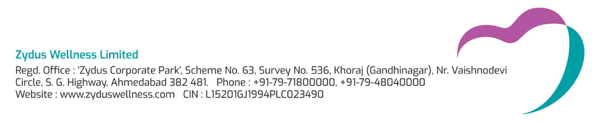

**[Image: March2026Buying1.pdf-0001-00.png (295x180, 69.8KB)]**

March 18, 2026 

Listing Department **BSE LIMITED** P. J. Towers, Dalal Street, **<u>Mumbai–400 001</u>** 

**Code:** **_531335_** 

Listing Department **NATIONAL STOCK EXCHANGE OF INDIA LIMITED** Exchange Plaza, C/1, Block G, Bandra Kurla Complex, Bandra (E), **<u>Mumbai–400 051</u>** 

**Code:** **_ZYDUSWELL_** 

Re.: **<u>Disclosure under SEBI (Prohibition of Insider Trading) Regulations, 2015 (“PIT Regulations”)</u>** 

Dear Sir / Madam, 

With reference to the captioned subject, please find enclosed a disclosure dated March 16, 2026 in prescribed Form “B” under Regulation 7(2) of SEBI (Prohibition of Insider Trading) Regulations, 2015, received from Mr. Rinesh Gajjar, Designated Person with respect to acquisition of 1,500 Equity Shares of ₹ 2/- each from the open market. 

Please find the same in order. 

Thanking you, 

Yours faithfully, 

# For, **ZYDUS WELLNESS LIMITED** 

NANDISH Digitally signed by NANDISH  PRADIP  JOSHI PRADIP  JOSHI Date: 2026.03.18 19:01:26 +05'30' 

**NANDISH P. JOSHI COMPANY SECRETARY & COMPLIANCE OFFICER** 

**Encl.:** As above 

**[Image: March2026Buying1.pdf-0001-16.png (980x201, 72.4KB)]**

### FORM B 

SEBI {Prohibition of Insider Trading) Regulations, 2015 [Regulation 7 (2) read with Regulation 6(2) - Continual disclosure] 

## Name of the Company: ZYDUS WELLNESS LIMITED **ISIN** of the Company: INE768C01028 

Details of change in holding of Securities of Promoter, Member of the Promoter Group, Designated Person or Director of a listed company and immediate relatives of such persons and other such persons as mentioned in Regulation 6(2). 

|Name, PAN, CIN/DIN,& |Category of |Securitie acq |s heldpriorto uisition ||Securitie|s acquired||Securiti ~~ac~~|es held post ~~quisition~~|Dateofac ~~sha~~|quisitionof ~~res~~|Dateof intimation|Modeof acquisition|Exchange on which|
|---|---|---|---|---|---|---|---|---|---|---|---|---|---|---|
|addresswith contact|Person|Typeof security|No.and%of shareholding|Typeof security|No.|Value|Trans action Type|Typeof security|No.and%of shareholding|From|To|to company||thetrade was executed|
|1|2|3|4|5|6|7|8|9|10|11|12|13|14|15|
|Name: Rinesh Gajjar PAN: AXAXGX2X8X|Designat ed Person|Equity Shares|0 0.00%|Equity Shares|1,500 0.00%|Rs. 6,04,443.15|Acquisi tion|Equity Shares|1,500 0.00%|March 12, 2026|March 13, 2026|March 16, 2026|Open market|NSE|
|Address: Zydus Corporate Park, Scheme No. 63, Survey No. 536 Khoraj {Gandhinagar}, Nr. Vaishnodevi Circle,S.G. Highway, Ahmedabad - 382481, Gujarat|||||||||||||||
|PhoneNo.+ 9179 48040000|||||||||||||||

Details of trading in derivatives of the company by Promoter, Employee or Director of a listed company and other such persons as mentioned in Regulation 6(2) 

||**Trading in derivatives(Spe**|**cify type ofco**|**ntract, Futures**|**or Options etc.)**||**Exchange on whichthetrade was**|
|---|---|---|---|---|---|---|
|**Type ofcontract**|**Contract specifications**||**Buy**|**Sel**|**l**|**executed**|
|||Notional Value|Numberof units (contracts *lotsize)|Notional Value|Numberof units (contracts* lotsize)||
|16|17|18|19|20|21|22|
|N.A.|N.A.|N.A.|N.A.|N.A.|N.A.|**N.A.**|

~--= Rmesh Gajjar Designated Person 

Date: March 16, 2026 Place: Ahmed a bad 

---

## Extracted Images

| # | File | Dimensions | Size |
|---|------|------------|------|
| 1 | March2026Buying1.pdf-0001-00.png | 295x180 | 69.8KB |
| 2 | March2026Buying1.pdf-0001-16.png | 980x201 | 72.4KB |
