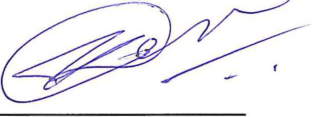
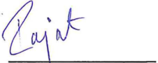

**[Image: MarchBuyin2.pdf-0001-00.png (295x180, 69.8KB)]**

March 9, 2026 

Listing Department **BSE LIMITED** P. J. Towers, Dalal Street, **<u>Mumbai–400 001</u>** 

**Code:** **_531335_** 

Listing Department **NATIONAL STOCK EXCHANGE OF INDIA LIMITED** Exchange Plaza, C/1, Block G, Bandra Kurla Complex, Bandra (E), **<u>Mumbai–400 051</u>** 

**Code:** **_ZYDUSWELL_** 

Re.: **<u>Disclosure under SEBI (Prohibition of Insider Trading) Regulations, 2015 (“PIT Regulations”)</u>** 

Dear Sir / Madam, 

With reference to the captioned subject, please find enclosed disclosures dated March 5, 2026, March 6, 2026 and March 9, 2026 in prescribed Form “B” under Regulation 7(2) of SEBI (Prohibition of Insider Trading) Regulations, 2015, received from Mr. Vineet Shrivastava, Mr. Yatin Desai and Mr. Rajat Bhargava, Designated Persons of the Company with respect to acquisition of 787, 500 and 750 Equity Shares, respectively, of ₹ 2/each from the open market. 

Please find the same in order. 

Thanking you, 

Yours faithfully, 

For, **ZYDUS WELLNESS LIMITED** 

NANDISH Digitally signed by NANDISH  PRADIP  JOSHI PRADIP  JOSHI Date: 2026.03.09 18:06:08 +05'30' 

**NANDISH P. JOSHI COMPANY SECRETARY & COMPLIANCE OFFICER** 

**Encl.:** As above 

**[Image: MarchBuyin2.pdf-0001-16.png (980x201, 72.4KB)]**

# **<u>FORM B</u>** 

## **SEBI (Prohibition of Insider Trading) Regulations, 2015** 

**[Regulation 7 (2) read with Regulation 6(2) – Continual disclosure]** 

# **Name of the Company: ZYDUS WELLNESS LIMITED ISIN of the Company: INE768C01028** 

**Details of change in holding of Securities of Promoter, Member of the Promoter Group, Designated Person or Director of a listed company and immediate relatives of such persons and other such persons as mentioned in Regulation 6(2).** 

|**Name, PAN,** **CIN/DIN, &**|**Category** **of**|**Securitie** **ac**|**s held prior to** **quisition**||**Securiti**|**es acquired**||**Securiti** **acq**|**es held post** **uisition**|**Date of acq** **sha**|**uisition of** **res**|**Date of** **intimation**|**Mode of** **acquisition**|**Exchange** **on which**|
|---|---|---|---|---|---|---|---|---|---|---|---|---|---|---|
|**address with** **contact**|**Person**|**Type of** **security**|**No. and % of** **shareholding**|**Type of** **security**|**No.**|**Value**|**Trans** **action** **Type**|**Type of** **security**|**No. and % of** **shareholding**|**From**|**To**|**to** **company**||**the trade** **was** **executed**|
|1|2|3|4|5|6|7|8|9|10|11|12|13|14|15|
|Name: Vineet Shrivastava PAN:BXKXSX0 X8X|Designat ed Person|Equity Shares|507 0.00%|Equity Shares|787 0.00%|Rs. 3,00,659.70|Acquisi tion|Equity Shares|1,294 0.00%|March 2, 2026|March 2, 2026|March 5, 2026|Open market|NSE|
|Address: Zydus Corporate Park, Scheme No. 63, Survey No. 536 Khoraj (Gandhinagar), Nr. Vaishnodevi Circle, S. G. Highway, Ahmedabad – 382481, Gujarat|||||||||||||||
|Phone No. + 91 79 48040000|||||||||||||||

**Details of trading in derivatives of the company by Promoter, Employee or Director of a listed company and other such persons as mentioned in Regulation 6(2)** 

|**Type of contract**|**Trading in derivatives(Spe** **Contract specifications**|**cify type of co** |**ntract, Futures** **Buy**|**or Options etc.)** **Sell**|**Exchange on which the trade was** **executed**|
|---|---|---|---|---|---|
|||Notional Value|Number of units (contracts * lot size)|Notional Value Number of units (contracts * lot size)||
|15|16|17|18|19 20|21|
|N.A.|N.A.|N.A.|N.A.|N.A. N.A.|N.A.|

**[Image: MarchBuyin2.pdf-0003-02.png (128x99, 5.1KB)]**

**________________ Vineet Shrivastava** Date: March 5, 2026 Place: Ahmedabad 

### FORM B 

#### SEBI (Prohibition of Insider Trading) Regulations, 2015 

[Regulation 7 (2) read with Regulation 6(2) - Continual disclosure] 

### Name of the Company: ZYDUS WELLNESS LIMITED 

## ISIN of the Company: INE768C01028 

Details of change in holding of Securities of Promoter, Member of the Promoter Group, Designated Person or Director of a listed company and immediate relatives of such persons and other such persons as mentioned in Regulation 6(2). 

|**Name, PAN,**|**Category** |**Securitie** |**s held prior to** ||**Securitie**|**s acquired**||**Securiti** **~~ac~~**|**es held post** **~~uisition~~**|**Date of ac** **sha**|**quisition of** **res**|**Date of** **intimation**|**Mode**of **acquisition**|**Exchange** **onwhich**|
|---|---|---|---|---|---|---|---|---|---|---|---|---|---|---|
|**CIN/DIN**&|**of**|**~~ac~~**|**~~uisition~~**||||||||||||
|**,**||||||||||||||**th td**|
|**address with** **contact**|**Person**|**Typeof** **security**|**No.and%of** **shareholding**|**Type of** **security**|**No.**|**Value**|**Trans** **action** **Type**|**Type of** **security**|**No.and%of** **shareholding**|**From**|**To**|**to** **company**||**e rae** **was** **executed**|
|1|2|3|4|5|6|7|8|,, 9|10|11|12|13|14|15|
|Name: Yatin Desai PAN: AXCXDX0X3X|Designat ed Person|Equity Shares|25 0.00%|Equity Shares|500 0.00%|Rs. 1,89,920|Acquisi tion|Equity Shares|525 0.00%|March4, 2026|March4, 2026|March6, 2026|Open market|NSE|
|Address: Zydus Corporate Park, Scheme No. 63, Survey No. 536 Khoraj (Gandhinagar), Nr. Vaishnodevi Circle,S.G. Highway, Ahmedabad- 382481, Gujarat|||||||||||||||
|PhoneNo.+ 91 79 48040000||||||||•.|||||||

Details of trading in derivatives of the company by Promoter, Employee or Director of a listed company and other such persons as mentioned in Regulation 6(2) 

||**Trading inderivatives(Spe**|**cify type of c**|**ontract, Futures**|**orOptionsetc.)**||**Exchangeonwhichthe tradewas**|
|---|---|---|---|---|---|---|
|**Type of contract**|**Contractspecifications**||**Buy**|**Sel**|**l**|**executed**|
|||Notional Value|Numberof units (contracts * lotsize)|Notional Value|Numberof units (contracts * lotsize)||
|16|17|18|19|20|21|22|
|N.A.|N.A.|N.A.|N.A.|N.A.|N.A.|N.A.|

I. 

**[Image: MarchBuyin2.pdf-0005-03.png (312x117, 33.0KB)]**

**Yatin Desai** 

**Designated Person** 

Date: March 6 1 2026 Place: Ahmedabad 

### **FORM** B 

#### SEBI (Prohibition of Insider Trading) Regulations, 2015 

[Regulation 7 (2) read with Regulation 6(2) - Continual disclosure] 

### Name of the Company: ZYDUS WELLNESS LIMITED 

## **ISIN** of the Company: INE768C01028 

Details of change in holding of Securities of Promoter, Member of the Promoter Group, Designated Person or Director of a listed company and immediate relatives of such persons and other such persons as mentioned in Regulation 6(2). 

|Name,PAN, **CIN/DIN,**&|Category of|Securitie ac|s heldpriorto quisition||Securiti|es acquired||Securit ac|ies held post quisition|Dateofac sha|quisitionof res|Dateof intimation|Modeof acquisition|Exchange on which|
|---|---|---|---|---|---|---|---|---|---|---|---|---|---|---|
|addresswith contact|Person|Typeof security|No. and%of shareholding|Typeof security|No.|Value|Trans action Type|Typeof security|No. and%of shareholding|From|To|to company||thetrade was executed|
|1|2|3|4|5|6|7|8|9|10|11|12|13|14|15|
|Name: Rajat Bhargava|Designat ed Person|Equity Shares|0 0.00%|Equity Shares|750 0.00%|Rs. 2,87,355.85|Acquisi tion|Equity Shares|750 0.00%|March6, 2026|March6, 2026|March9, 2026|Open market|NSE|
|PAN: CXLXBX9X8X|||||||||||||||
|Address: Zydus Corporate Park,Scheme No.63,Survey No. 536 Khoraj (Gandhinagar), Nr. Vaishnodevi Circle,5.G. Highway, Ahmedabad- 382481, Gujarat|||||||||||||||
|PhoneNo.+ 9179 48040000|||||||||||||||

**Details of trading in derivatives of the company by Promoter, Employee or Director of a listed company and other such persons as mentioned in Regulation 6(2)** 

||**Trading in derivatives(Spe**|**cify type of c**|**ontract, Futures**|**orOptions etc.)**||**Exchange on whichthetrade was**|
|---|---|---|---|---|---|---|
|**Type of contract**|**Contract specifications**||**Buy**|**Sel**|**l**|**executed**|
|||Notional Value|Numberof units (contracts|Notional Value|Numberof units (contracts *||
||||*lotsize)||lotsize)||
|16|17|18|19|20|21|22|
|N.A.|N.A.|N.A.|N.A.|N.A.|N.A.|N.A.|

**[Image: MarchBuyin2.pdf-0007-02.png (226x90, 13.4KB)]**

**Rajat ~hargava Designated Person** 

Date: March 9, 2026 Place: Ahmed a bad 

---

## Extracted Images

| # | File | Dimensions | Size |
|---|------|------------|------|
| 1 | MarchBuyin2.pdf-0001-00.png | 295x180 | 69.8KB |
| 2 | MarchBuyin2.pdf-0001-16.png | 980x201 | 72.4KB |
| 3 | MarchBuyin2.pdf-0003-02.png | 128x99 | 5.1KB |
| 4 | MarchBuyin2.pdf-0005-03.png | 312x117 | 33.0KB |
| 5 | MarchBuyin2.pdf-0007-02.png | 226x90 | 13.4KB |
